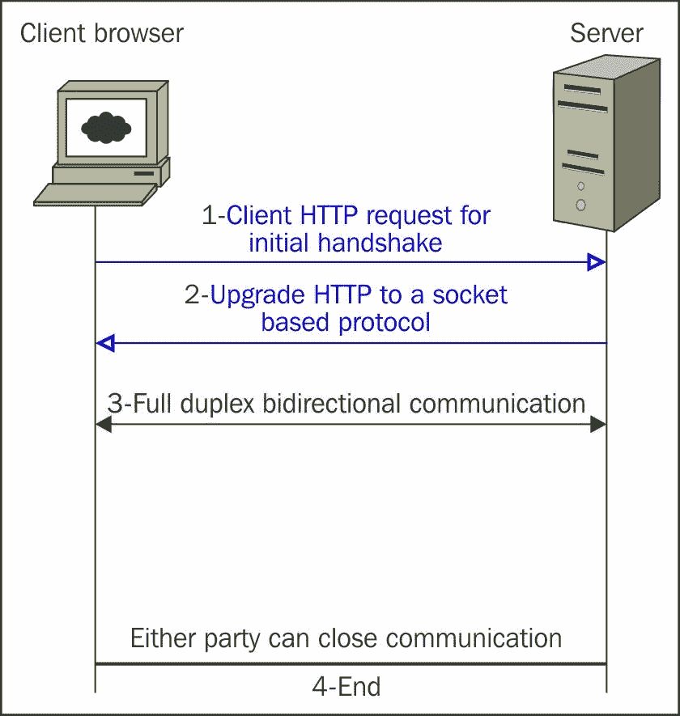
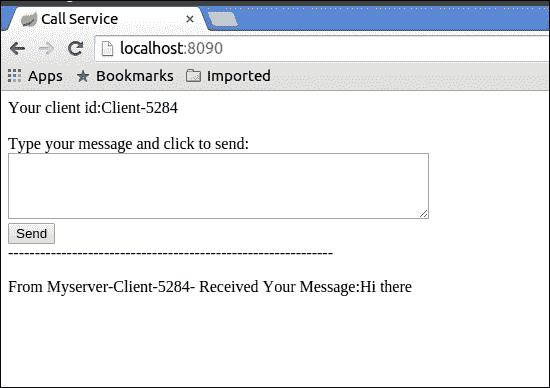
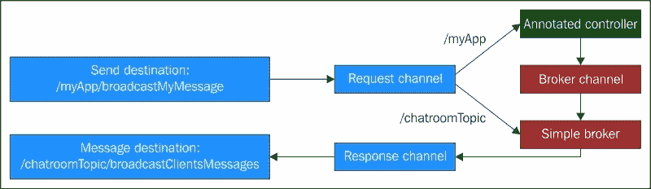

# 第四章：WebSocket 理解

Web 应用的理念建立在一个简单的范式之上。在单向交互中，Web 客户端发送请求到服务器，服务器回复请求，客户端渲染服务器的响应。通信始于客户端的请求，以服务器的响应结束。

我们建立了基于这一范式的 Web 应用；然而，技术上存在一些缺点：客户端必须等待服务器的响应并刷新浏览器才能渲染它。这种单向通信的性质要求客户端发起请求。后来的技术，如 AJAX 和长轮询，为我们的 Web 应用带来了重大优势。在 AJAX 中，客户端发起请求，但不等待服务器的响应。以异步的方式，AJAX 客户端回调方法从服务器获取数据，浏览器的新 DHTML 功能渲染数据而不刷新浏览器。

除了单向行为之外，这些技术的 HTTP 依赖性需要以 HTTPS 头和 cookie 的形式交换额外的数据。这些额外的数据导致了延迟，并成为高度响应的 Web 应用的瓶颈。

WebSocket 将传输的数据量从几千字节减少到几个字节，并将延迟从 150 毫秒减少到 50 毫秒（用于消息数据包加上建立连接的 TCP 往返时间），这两个因素引起了 Google 的注意（Ian Hickson）。

WebSocket（RFC 6455）是一个全双工和双向的协议，以帧的形式在客户端和服务器之间传输数据。WebSocket 通信如下图所示，从客户端和服务器之间的握手过程开始，需要通过 HTTP 连接。由于防火墙只允许某些端口与外部通信，我们无法直接使用 WebSocket 协议：



WebSocket 通信

在握手过程中，各方（客户端和服务器）决定选择哪种基于套接字的协议来传输数据。在这个阶段，服务器可以使用 HTTP cookies 验证用户，并在认证或授权失败时拒绝连接。

然后，双方从 HTTP 升级到基于套接字的协议。从这一点开始，服务器和客户端在 TCP 连接上进行全双工和双向通道通信。

客户端或服务器可以通过将它们流式传输到帧格式中来发送消息。WebSocket 使用心跳机制，使用 ping/pong 消息帧来保持连接活动。这看起来像是一方发送一个 ping 消息，期望另一方回复一个 pong。任何一方也可以关闭通道并终止通信，就像前面的图表所示。

就像 Web URI 依赖于 HTTP 或 HTTPS 一样，WebSocket URI 使用`ws`或`wss`方案（例如，`ws://www.sample.org/`或`wss://www.sample.org/）进行通信。WebSocket 的`ws`通过 TCP/IP 传输非加密数据，类似于 HTTP 的工作方式。相比之下，`wss`依赖于 TCP 上的**传输层安全**（**TLS**），这种组合带来了数据安全和完整性。

一个很好的问题是在哪里使用 WebSocket。最好的答案是在低延迟和高频率通信至关重要的地方——例如，如果您的端点数据在 100 毫秒内发生变化，并且您希望对数据变化采取非常快速的措施。

Spring Framework 4 包括一个新的 Spring WebSocket 模块，具有 Java WebSocket API 标准（JSR-356）兼容性以及一些附加的增值功能。

虽然使用 WebSocket 为 Web 应用程序带来了优势，但某些浏览器版本的兼容性不足会阻止 WebSocket 通信。为了解决这个问题，Spring 4 包括一个回退选项，以模拟 WebSocket API 以解决浏览器不兼容性。

WebSocket 以帧格式传输数据，除了用一个单独的位来区分文本和二进制数据之外，它对消息内容是中立的。为了处理消息的格式，消息需要一些额外的元数据，并且客户端和服务器应该在应用层协议上达成一致，即所谓的**子协议**。各方在初始握手期间选择子协议。

WebSocket 不强制使用子协议，但在它们缺失的情况下，客户端和服务器都需要以预定义的样式标准、框架特定或定制格式传输数据。

Spring 支持**简单文本定向消息协议**（**STOMP**）作为子协议——称为 STOMP over WebSocket——在 WebSocket 通信中。Spring 的消息传递建立在集成概念上，如消息和通道和处理程序，以及消息映射的注释。使用 STOMP over WebSocket 为 Spring WebSocket 应用程序提供了基于消息的功能。

使用所有这些新的 Spring 4 功能，您可以创建一个 WebSocket 应用程序，并向所有订阅的客户端广播消息，以及向特定用户发送消息。在本章中，我们首先创建一个简单的 Spring Web 应用程序，演示如何设置 WebSocket 应用程序以及客户端如何与端点发送和接收消息。在第二个应用程序中，我们将看到 Spring WebSocket 的回退选项如何解决浏览器不兼容性，以及基于代理的消息系统如何使用 STOMP over WebSocket 工作，以及订阅的客户端如何发送和接收消息。然而，在最后一个 Web 应用程序中，我们将展示如何向特定用户发送基于代理的消息。

# 创建一个简单的 WebSocket 应用程序

在本节中，我们将在开发一个简单的 WebSocket 应用程序时了解 WebSocket 的客户端和服务器组件。如前所述，在 WebSocket 通信中使用子协议是可选的。在本应用程序中，我们没有使用子协议。

首先，你需要设置一个 Spring web 应用程序。为了将请求分派到你的服务（在 Spring WebSocket 中称为处理程序），你需要设置一个框架 Servlet（分派器 Servlet）。这意味着你应该在 `web.xml` 中注册 `DispatcherServlet` 并在应用程序上下文中定义你的 bean 和服务。

设置一个 Spring 应用程序需要你以 XML 格式进行配置。Spring 引入了 Spring Boot 模块来摆脱 Spring 应用程序中的 XML 配置文件。Spring Boot 的目标是通过向类添加几行注释并将它们标记为 Spring 构件（bean、服务、配置等）来配置 Spring 应用程序。默认情况下，它还根据类路径中的内容添加依赖项。例如，如果你有一个 web 依赖项，那么 Spring Boot 可以默认配置 Spring MVC。它还允许你覆盖这种默认行为。详细介绍 Spring Boot 需要一本完整的书；我们只是在这里使用它来简化 Spring 应用程序的配置。

这些是该项目的 Maven 依赖项：

```java
<parent>
    <groupId>org.springframework.boot</groupId>
    <artifactId>spring-boot-starter-parent</artifactId>
    <version>1.2.5.RELEASE</version>
</parent>
<dependencies>
    <dependency>
        <groupId>org.springframework.boot</groupId>
        <artifactId>spring-boot-starter-websocket</artifactId>
    </dependency>
    <dependency>
        <groupId>org.springframework</groupId>
        <artifactId>spring-messaging</artifactId>
    </dependency>
            <dependency>
        <groupId>org.json</groupId>
        <artifactId>json</artifactId>
        <version>20140107</version>
    </dependency>
</dependencies>
<properties>
    <java.version>1.8</java.version>
</properties>
<build>
    <plugins>
        <plugin>
            <groupId>org.springframework.boot</groupId>
            <artifactId>spring-boot-maven-plugin</artifactId>
        </plugin>
    </plugins>
</build>
```

正如本节开头所提到的，没有子协议（因此也没有应用层框架）来解释 WebSocket 消息。这意味着客户端和服务器需要处理这项工作并了解消息的格式。

在服务器端，处理程序（端点）接收并提取消息，并根据业务逻辑回复给客户端。在 Spring 中，你可以通过扩展 `TextWebSocketHandler` 或 `BinaryWebSocketHandler` 来创建一个自定义处理程序。`TextWebSocketHandler` 处理字符串或文本消息（比如 JSON 数据），`BinaryWebSocketHandler` 处理二进制消息（比如图像或媒体数据）。下面是一个使用 `TextWebSocketHandler` 的代码清单：

```java
public class SampleTextWebSocketHandler extends TextWebSocketHandler {
   @Override
    protected void handleTextMessage(WebSocketSession session, TextMessage message) throws Exception {
        String payload = message.getPayload();
        JSONObject jsonObject = new JSONObject(payload);
        StringBuilder builder=new StringBuilder();
        builder.append("From Myserver-").append("Your Message:").append(jsonObject.get("clientMessage"));
        session.sendMessage(new TextMessage(builder.toString()));
   }
}
```

由于我们这里只处理 JSON 数据，所以 `SampleTextWebSocketHandler` 类扩展了 `TextWebSocketHandler`。`handleTextMessage` 方法通过接收其有效负载并将其转换为 JSON 数据来获取客户端的消息，然后向客户端发送一条消息。

为了告诉 Spring 将客户端请求转发到端点（或者这里的处理程序），我们需要注册处理程序：

```java
@Configuration
@EnableWebSocket
public class SampleEhoWebSocketConfigurer {
    @Bean
    WebSocketConfigurer webSocketConfigurer(final WebSocketHandler webSocketHandler) {
        return new WebSocketConfigurer() {
            @Override
            public void registerWebSocketHandlers(WebSocketHandlerRegistry registry) {
                registry.addHandler(new SampleTextWebSocketHandler(), "/path/wsAddress");
            }
        };
    }
    @Bean
    WebSocketHandler myWebsocketHandler() {
        return new SampleTextWebSocketHandler();
    }
```

`@Configuration` 和 `@EnableWebsocket` 告诉 Spring 这是项目的 WebSocket 配置器。它注册了我们的处理程序 (`SampleTextWebSocketHandler`) 并设置了请求路径（在 WebSocket URL 中，比如 `ws://server-ip:port/path/wsAddress`）将被转发到这个处理程序。

现在的问题是如何设置一个 Spring 应用程序并将所有这些东西粘合在一起。Spring Boot 提供了一种简单的方式来设置一个基于 Spring 的应用程序，它带有一个可配置的嵌入式 Web 服务器，你可以“只需运行”它：

```java
package com.springessentialsbook.chapter4;
...
@SpringBootApplication
public class EchoWebSocketBootApplication {
    public static void main(String[] args) {
        SpringApplication.run(EchoWebSocketBootApplication
        .class, args);
    }
}
```

`@SpringBootApplication` 将 `EchoWebSocketBootApplication` 类标记为你的应用程序的特殊配置类，`@SpringBootApplication` 的行为类似于以下注释：

+   `@Configuration` 声明该类作为应用程序上下文的 bean 定义

+   `@EnableAutoConfiguration` 允许 Spring Boot 根据类路径添加一个依赖的 bean 定义（例如，在项目类路径中的 `spring-webmvc` 告诉 Spring Boot 在 `web.xml` 中设置一个 web 应用程序的 `DispatcherServlet` 注册）

+   `@ComponentScan` 用于扫描同一包内的所有注释（服务、控制器、配置等）并相应地配置它们

最后，`main` 方法调用 `SpringApplication.run` 来在一个 web 应用程序中设置一个 Spring 应用程序，而不需要编写一行 XML 配置（`applicationContext.xml` 或 `web.xml`）。

当客户端想要发送 WebSocket 请求时，它应该创建一个 JavaScript 客户端对象（`ws = new WebSocket('ws://localhost:8090/path/wsAddress')`）并传递 WebSocket 服务地址。为了接收数据，我们需要附加一个回调监听器（`ws.onmessage`）和一个错误处理程序（`ws.onerror`），如下所示：

```java
    function openWebSocket(){
        ws = new WebSocket( 'ws://localhost:8090/path/wsAddress');
        ws.onmessage = function(event){
            renderServerReturnedData(event.data);
        };

        ws.onerror = function(event){
            $('#errDiv').html(event);
        };
    }

    function sendMyClientMessage() {
        var myText = document.getElementById('myText').value;
        var message=JSON.stringify({ 'clientName': 'Client-'+randomnumber, 'clientMessage':myText});
        ws.send(message);
        document.getElementById('myText').value='';
    }
```

您可以通过运行以下命令来运行应用程序：

```java

mvn spring-boot:run -Dserver.port=8090

```

这将在端口`8090`上运行和部署 Web 应用程序（这里不使用`8080`，因为它可能与您正在运行的 Apache 服务冲突）。因此，应用程序的索引页面将可以在`http://localhost:8090/`访问（按照`read-me.txt`中的说明运行应用程序）。它应该是这样的：



在 Chrome 浏览器中应用程序的开放页面

当用户在 Chrome 中发送文本时，它将由`SampleTextWebSocketHandler`处理，处理程序将回复，并且响应将在浏览器中呈现。

如果您尝试在低于 10 的 Internet Explorer 版本中测试此应用程序，您将收到 JavaScript 错误。

正如我们之前讨论的，某些版本的浏览器不支持 WebSocket。Spring 4 提供了一个回退选项来管理这些类型的浏览器。在下一节中，将解释 Spring 的这个特性。

# Spring 4 中的 STOMP over WebSocket 和回退选项

在上一节中，我们看到在一个不使用子协议的 WebSocket 应用程序中，客户端和服务器应该意识到消息格式（在这种情况下是 JSON）以便处理它。在本节中，我们在 WebSocket 应用程序中使用 STOMP 作为子协议（这被称为**STOMP over WebSocket**），并展示这个应用层协议如何帮助我们处理消息。

在上一个应用程序中的消息架构是基于异步客户端/服务器通信的。

`spring-messaging`模块将异步消息系统的特性引入了 Spring Framework。它基于从 Spring Integration 继承的一些概念，如消息、消息处理程序（处理消息的类）和消息通道（发送者和接收者之间的数据通道，在通信期间提供松散耦合）。

在本节结束时，我们将解释我们的 Spring WebSocket 应用程序如何与 Spring 消息系统集成，并以类似于传统消息系统（如 JMS）的方式工作。

在第一个应用程序中，我们看到在某些类型的浏览器中，WebSocket 通信失败是因为浏览器不兼容。在本节中，我们将解释 Spring 的回退选项如何解决这个问题。

假设您被要求开发一个基于浏览器的聊天室应用程序，匿名用户可以加入聊天室，并且任何用户发送的文本都应该发送给所有活跃用户。这意味着我们需要一个所有用户都应该订阅的主题，并且任何用户发送的消息都应该广播给所有用户。Spring WebSocket 功能满足这些要求。在 Spring 中，使用 STOMP over WebSocket，用户可以以类似于 JMS 的方式交换消息。在本节中，我们将开发一个聊天室应用程序，并解释一些 Spring WebSocket 的特性。

第一个任务是配置 Spring 以处理 WebSocket 上的 STOMP 消息。使用 Spring 4，您可以立即配置一个非常简单、轻量级（基于内存的）消息代理，设置订阅，并让控制器方法处理客户端消息。`ChatroomWebSocketMessageBrokerConfigurer`类的代码如下：

```java
package com.springessentialsbook.chapter4;
…..
@Configuration
@EnableWebSocketMessageBroker
public class ChatroomWebSocketMessageBrokerConfigurer extends AbstractWebSocketMessageBrokerConfigurer {
   @Override
   public void configureMessageBroker(MessageBrokerRegistry config) {
      config.enableSimpleBroker("/chatroomTopic");
      config.setApplicationDestinationPrefixes("/myApp");
   }
   @Override
   public void registerStompEndpoints(StompEndpointRegistry registry) {
      registry.addEndpoint("/broadcastMyMessage").withSockJS();
   }
}
```

`@Configuration`标记`ChatroomWebSocketMessageBrokerConfigurer`类为 Spring 配置类。`@EnableWebSocketMessageBroker`提供由消息代理支持的 WebSocket 消息功能。

重写的`configureMessageBroker`方法，如其名称所示，重写了消息代理配置的父方法，并设置：

+   `setApplicationDestinationPrefixes`：指定`/myApp`作为前缀，任何目的地以`/myApp`开头的客户端消息将被路由到控制器的消息处理方法。

+   `enableSimpleBroker`：将经纪人主题设置为`/chatroomTopic`。任何目的地以`/chatroomTopic`开头的消息将被路由到消息代理（即广播到其他连接的客户端）。由于我们使用的是内存代理，我们可以指定任何主题。如果我们使用专用代理，目的地的名称将是`/topic`或`/queue`，基于订阅模型（发布/订阅或点对点）。

重写的方法`registerStompEndpoints`用于设置端点和回退选项。让我们仔细看一下：

+   客户端 WebSocket 可以连接到服务器的端点`/broadcastMyMessage`。由于选择了 STOMP 作为子协议，我们不需要了解底层消息格式，让 STOMP 处理它。

+   `.withSockJS()`方法启用了 Spring 的回退选项。这保证了在任何类型或版本的浏览器中成功的 WebSocket 通信。

由于 Spring MVC 将 HTTP 请求转发到控制器中的方法，MVC 扩展可以通过 WebSocket 接收 STOMP 消息并将其转发到控制器方法。Spring `Controller`类可以接收目的地以`/myApp`开头的客户端 STOMP 消息。处理程序方法可以通过将返回的消息发送到经纪人通道来回复订阅的客户端，经纪人通过将消息发送到响应通道来回复客户端。在本节的最后，我们将看一些关于消息架构的更多信息。例如，让我们看一下`ChatroomController`类：

```java
    package com.springessentialsbook.chapter4;
      ...
@Controller
public class ChatroomController {

    @MessageMapping("/broadcastMyMessage")
    @SendTo("/chatroomTopic/broadcastClientsMessages")
    public ReturnedDataModelBean broadCastClientMessage(ClientInfoBean message) throws Exception {
        String returnedMessage=message.getClientName() + ":"+message.getClientMessage();
        return new ReturnedDataModelBean(returnedMessage );
    }
}
```

这里，`@Controller`标记`ChatroomController`作为 MVC 工作流控制器。`@MessageMapping`用于告诉控制器将客户端消息映射到处理程序方法（`broadCastClientMessage`）。这将通过将消息端点与目的地（`/broadcastMyMessage`）进行匹配来完成。方法的返回对象（`ReturnedDataModelBean`）将通过`@SendTo`注解发送回经纪人到订阅者的主题（`/chatroomTopic/broadcastClientsMessages`）。主题中的任何消息都将广播给所有订阅者（客户端）。请注意，客户端不会等待响应，因为它们发送和监听来自主题而不是直接来自服务的消息。

我们的领域 POJOs（`ClientInfoBean`和`ReturnedDataModelBean`），如下所述，将提供客户端和服务器之间的通信消息负载（实际消息内容）：

```java
package com.springessentialsbook.chapter4;
public class ClientInfoBean {
    private String clientName;
    private String clientMessage;
    public String getClientMessage() {
    return clientMessage;
  }
    public String getClientName() {
        return clientName;
    }
}

package com.springessentialsbook.chapter4;
public class ReturnedDataModelBean {

    private String returnedMessage;
    public ReturnedDataModelBean(String returnedMessage) {
        this.returnedMessage = returnedMessage; }
    public String getReturnedMessage() {
        return returnedMessage;
    }
}
```

为了增加一些安全性，我们可以添加基本的 HTTP 身份验证，如下所示（我们不打算在本章中解释 Spring 安全性，但将在下一章中详细介绍）：

```java
@Configuration
@EnableGlobalMethodSecurity(prePostEnabled = true)
@EnableWebSecurity
public class WebSecurityConfig extends WebSecurityConfigurerAdapter {
    @Override
    protected void configure(HttpSecurity http) throws Exception {
        http.httpBasic();
        http.authorizeRequests().anyRequest().authenticated();
    }
    @Autowired
    void configureGlobal(AuthenticationManagerBuilder auth) throws Exception {
        auth.inMemoryAuthentication()
        .withUser("user").password("password").roles("USER");
    }
}
```

`@Configuration`标记此类为配置类，`@EnableGlobalMethodSecurity`和`@EnableWebSecurity`在类中设置安全方法和 Web 安全性。在`configure`方法中，我们设置基本身份验证，在`configureGlobal`中，我们设置了识别的用户名和密码以及用户所属的角色。

要添加 Spring Security 功能，我们应该添加以下 Maven 依赖项：

```java
<dependency>
    <groupId>org.springframework.security</groupId>
    <artifactId>spring-security-web</artifactId>
</dependency>
<dependency>
    <groupId>org.springframework.security</groupId>
    <artifactId>spring-security-messaging</artifactId>
    <version>4.0.1.RELEASE</version>
</dependency>
<dependency>
    <groupId>org.springframework.security</groupId>
    <artifactId>spring-security-config</artifactId>
</dependency>
```

正如我们在上一节中所解释的，`@SpringBootApplication`标签在不必编写一行 XML 配置（`applicationContext.xml`或`web.xml`）的情况下在 Web 应用程序中设置了一个 Spring 应用程序：

```java
package com.springessentialsbook.chapter4;
...
@SpringBootApplication
public class ChatroomBootApplication {
    public static void main(String[] args) {
        SpringApplication.run(ChatroomBootApplication.class, args);
    }
}
```

最后，您可以通过运行以下命令来运行应用程序：

```java

mvn spring-boot:run -Dserver.port=8090

```

这在端口`8090`上的嵌入式 Web 服务器上运行和部署 Web 应用程序（`8080`未使用，因为它可能与正在运行的 Apache 服务冲突）。因此，应用程序的索引页面将可以在`http://localhost:8090/`上访问（按照`read-me.txt`运行应用程序）：

```java
    <script src="img/sockjs-0.3.4.js"></script>
    <script src="img/stomp.js"></script>
    <script type="text/javascript">
...
function joinChatroom() {
    var topic='/chatroomTopic/broadcastClientsMessages';
    var servicePath='/broadcastMyMessage';
    var socket = new SockJS(servicePath);
    stompClient = Stomp.over(socket);
    stompClient.connect('user','password', function(frame) {
        setIsJoined(true);
        console.log('Joined Chatroom: ' + frame);
        stompClient.subscribe(topic, function(serverReturnedData){
            renderServerReturnedData(JSON.parse(serverReturnedData.body).returnedMessage);
        });
    });
}
...
function sendMyClientMessage() {
    var serviceFullPath='/myApp/broadcastMyMessage';
    var myText = document.getElementById('myText').value;
    stompClient.send(serviceFullPath, {}, JSON.stringify({ 'clientName': 'Client-'+randomnumber, 'clientMessage':myText}));
    document.getElementById('myText').value='';
}
```

在客户端，注意浏览器如何连接（使用`joinChatRoom`）并发送数据（在`sendMyClientMessage`方法中）。这些方法使用 JavaScript 库 SockJS 和 Stomp.js。

如您所见，当客户端订阅主题时，它会注册一个监听方法（`stompClient.subscribe(topic, function(serverReturnedData){.…}`）。当任何消息（来自任何客户端）到达主题时，将调用监听方法。

如前所述，某些浏览器版本不支持 WebSocket。SockJS 被引入以处理所有版本的浏览器。在客户端，当您尝试连接到服务器时，SockJS 客户端发送`GET/info`消息以从服务器获取一些信息。然后它选择传输协议，可以是 WebSocket、HTTP 流或 HTTP 长轮询之一。WebSocket 是首选的传输协议；但是，如果浏览器不兼容，它选择 HTTP 流，并且在更糟糕的情况下选择 HTTP 长轮询。

在本节的开头，我们描述了我们的 WebSocket 应用程序如何与 Spring 消息系统集成，并以类似于传统消息系统的方式工作。

`@EnableWebSocketMessageBroker`和`ChatroomWebSocketMessageBrokerConfigurer`的重写方法设置创建了一个具体的消息流（参见下图）。在我们的消息架构中，通道解耦了接收者和发送者。消息架构包含三个通道：

+   客户端入站通道（**请求通道**）用于从客户端发送的请求消息

+   客户端出站通道（**响应通道**）用于发送到客户端的消息

+   **代理通道**用于向代理发送内部服务器消息

我们的系统使用 STOMP 目的地进行简单的路由前缀。任何目的地以`/myApp`开头的客户端消息将被路由到控制器消息处理方法。任何以`/chatroomTopic`开头的消息将被路由到消息代理。



简单代理（内存中）消息架构

以下是我们应用程序的消息流：

1.  客户端连接到 WebSocket 端点（`/broadcastMyMessage`）。

1.  客户端消息到`/myApp/broadcastMyMessage`将通过**请求通道**转发到`ChatroomController`类。映射控制器的方法将返回的值传递给主题`/chatroomTopic/broadcastClientsMessages`的代理通道。

1.  代理将消息传递到**响应通道**，即主题`/chatroomTopic/broadcastClientsMessages`，订阅了该主题的客户端将收到消息。

# 在 WebSocket 应用程序中向单个用户广播消息

在前一节中，我们看到了多个订阅者模型的 WebSocket 应用程序，其中代理向主题发送消息。由于所有客户端都订阅了相同的主题，因此它们都收到了消息。现在，您被要求开发一个针对 WebSocket 聊天应用程序中特定用户的应用程序。

假设您想开发一个自动回答应用程序，其中用户向系统发送问题并自动获得答案。该应用程序与上一个应用程序几乎相同（Spring 4 中的 STOMP over WebSocket 和回退选项），只是我们应该更改服务器端的 WebSocket 配置器和端点以及客户端端的订阅。`AutoAnsweringWebSocketMessageBrokerConfigurer`类的代码如下：

```java
@Configuration
@EnableWebSocketMessageBroker
public class AutoAnsweringWebSocketMessageBrokerConfigurer extends AbstractWebSocketMessageBrokerConfigurer {
   @Override
   public void configureMessageBroker(MessageBrokerRegistry config) {
      config.setApplicationDestinationPrefixes("/app");
      config.enableSimpleBroker("/queue");
      config.setUserDestinationPrefix("/user");
   }
   @Override
   public void registerStompEndpoints(StompEndpointRegistry registry) {
      registry.addEndpoint("/message").withSockJS();
   }
}
```

`config.setUserDestinationPrefix("/user")`方法设置了一个前缀，指示用户已订阅并期望在主题上收到自己的消息。`AutoAnsweringController`类的代码如下：

```java
@Controller
public class AutoAnsweringController {
    @Autowired
    AutoAnsweringService autoAnsweringService;
    @MessageMapping("/message")
    @SendToUser
    public String sendMessage(ClientInfoBean message) {
        return autoAnsweringService.answer(message);
    }
    @MessageExceptionHandler
    @SendToUser(value = "/queue/errors", broadcast = false)
    String handleException(Exception e) {
        return "caught ${e.message}";
    }
}

@Service
public class AutoAnsweringServiceImpl implements AutoAnsweringService {
    @Override
    public String answer(ClientInfoBean bean) {
        StringBuilder mockBuffer=new StringBuilder();
        mockBuffer.append(bean.getClientName())
                .append(", we have received the message:")
                .append(bean.getClientMessage());
        return mockBuffer.toString();
    }
}
```

在端点中，我们使用`@SendToUser`而不是`@SendTo("...")`。这只将响应转发给消息发送者。`@MessageExceptionHandler`还将错误发送给消息发送者（`broadcast = false`）。

`AutoAnsweringService`只是一个模拟服务，用于返回给客户端的答案。在客户端，当用户订阅主题（`/user/queue/message`）时，我们只添加了`/user`前缀：

```java
function connectService() {
    var servicePath='/message';
    var socket = new SockJS(servicePath);
    stompClient = Stomp.over(socket);
    stompClient.connect({}, function(frame) {

        setIsJoined(true);
        stompClient.subscribe('/user/queue/message', function(message) {
            renderServerReturnedData(message.body);
        });
        stompClient.subscribe('/user/queue/error', function(message) {
            renderReturnedError(message.body);
        });
    });
}
function sendMyClientMessage() {
    var serviceFullPath='/app/message';
    var myText = document.getElementById('myText').value;
    stompClient.send(serviceFullPath, {}, JSON.stringify({ 'clientName': 'Client-'+randomnumber, 'clientMessage':myText}));
    document.getElementById('myText').value='';
}
```

主题`user/queue/error`用于接收从服务器端分发的错误。

### 注意

有关 Spring 的 WebSocket 支持的更多信息，请访问[`docs.spring.io/spring-framework/docs/current/spring-framework-reference/html/websocket.html`](http://docs.spring.io/spring-framework/docs/current/spring-framework-reference/html/websocket.html)。

有关 WebSocket 通信的更多信息，请参阅*第八章*，*用 WebSocket 替代 HTTP*，来自书籍*企业 Web 开发*，*Yakov Fain，Victor Rasputnis，Anatole Tartakovsky，Viktor Gamov*，*O'Reilly*。

# 摘要

在本章中，我们解释了基于 WebSocket 的通信，Spring 4 如何升级以支持 WebSocket，以及克服浏览器 WebSocket 不兼容性的备用选项。我们还介绍了添加基本 HTTP 身份验证的小示例，这是 Spring Security 的一部分。我们将在第五章*保护您的应用程序*中更多地讨论安全性。

