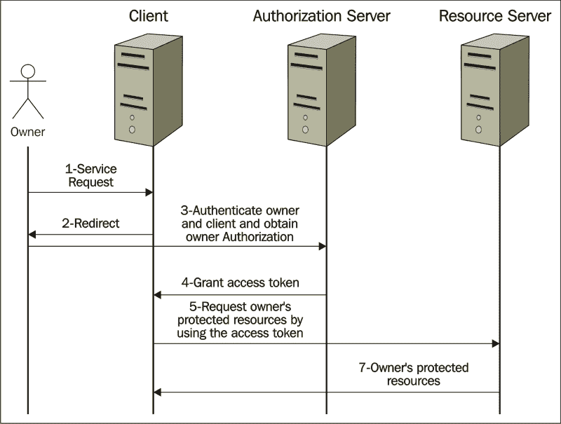

# 第五章：保护您的应用程序

Spring Security 为保护基于 Java/Spring 的企业应用程序提供了广泛的功能。乍一看，Servlets 或 EJB 的安全功能看起来是 Spring Security 的替代品；然而，这些解决方案缺乏开发企业应用程序的某些要求。服务器环境的依赖性可能是这些解决方案的另一个缺点。

身份验证和授权是应用程序安全的主要领域。身份验证是对用户身份的验证，而授权是对用户权限的验证。

Spring Security 与各种身份验证模型集成，其中大多数由第三方提供者提供。此外，Spring Security 还开发了基于主要安全协议的自己的身份验证模型。以下是其中一些协议：

+   基于表单的身份验证

+   HTTP 基本身份验证

+   LDAP

+   JAAS

+   Java 开放式单点登录

+   Open ID 认证

由于 Spring Security 模型的列表很长，我们只能在本章中详细介绍其中最受欢迎的模型。

Spring Security 在授权功能上非常强大。我们可以将这些功能分为三组：web、方法和域对象授权。稍后在*授权*部分，我们将解释这些类别。

为了在 Web 应用程序中使用 Spring Security 功能，您需要在项目中包含以下依赖项：

```java
<dependency>
   <groupId>org.springframework.security</groupId>
   <artifactId>spring-security-web</artifactId>
   <version>4.0.2.RELEASE</version>
</dependency>
<dependency>
   <groupId>org.springframework.security</groupId>
   <artifactId>spring-security-config</artifactId>
   <version>4.0.2.RELEASE</version>
</dependency>
```

**授权的开放标准**（**OAuth**）概念于 2006 年末引入，旨在允许第三方在 Microsoft、Google、Facebook、Twitter 或类似账户上获得用户资源的有限访问权限，而无需共享他们的用户名和密码。

在 2010 年，OAuth 作为 OAuth 1.0a 协议在 RFC 5849 中标准化。后来在 2012 年，它演变为 RFC 6749 中的 OAuth 2.0 框架。在本章中，我们解释了 Spring 的 OAuth 2.0 框架实现。

OAuth 2.0 授权框架使第三方应用程序能够在资源所有者与 HTTP 服务之间进行批准交互，或者允许第三方应用程序代表自己获得访问权限([`tools.ietf.org/html/rfc6749`](http://tools.ietf.org/html/rfc6749))。

Spring 为其 OAuth 2.0 实现提供了一个单独的模块（`spring-security-oauth2`），依赖于 Spring Security 的功能。在本章中，我们解释了身份验证以及 Spring 如何通过提供自己易于使用的功能以及提供插入自定义实现的选项来简化该过程。授权是本章的第二个主题，我们将解释如何在同一应用程序中配置单独的安全模型。在最后一节中，我们解释了 Spring 的 OAuth 2.0 功能。

# 身份验证

在应用程序的安全领域中，首先想到的是身份验证。在身份验证过程中，应用程序将用户的凭据（例如用户名和密码或令牌）与其可用的信息进行比较。如果这两者匹配，它允许进入下一步。我们将在*授权*部分中跟进下一步。

Spring Security 提供了支持各种安全认证协议的功能。在本节中，我们将重点放在基础和基于表单的身份验证上。

Spring 提供了一个内置的表单，用于基于表单的身份验证。此外，它还允许您定义自定义的登录表单。

Spring 为您提供了使用内存中的身份验证的选项，其中用户名和密码将在应用程序中硬编码。

另一种选择是使用自定义的身份验证提供程序，让您决定如何通过程序对用户进行身份验证，例如，调用数据层服务来验证用户。它还允许您将 Spring Security 与现有的安全框架集成。

要配置 Spring Security 对用户进行身份验证，首先需要定义一个名为`springSecurityFilterChain`的 Servlet 过滤器。此过滤器负责在 Web 应用程序中应用安全措施（例如，验证用户、根据用户角色在登录后导航到不同页面以及保护应用程序 URL）。

`WebSecurityConfigurerAdapter` 是一个方便的 Spring 模板，用于配置 `springSecurityFilterChain`：

```java
@Configuration
@EnableWebSecurity
@ComponentScan(basePackages = "com.springessentialsbook.chapter5")
public class WebSecurityConfigurator extends WebSecurityConfigurerAdapter {
    @Autowired
    private AuthenticationSuccessHandler authenticationSuccessHandler;

    @Autowired
    public void configureGlobalSecurity(AuthenticationManagerBuilder auth) throws Exception {
        auth.inMemoryAuthentication().withUser("operator").password("password").roles("USER");
        auth.inMemoryAuthentication().withUser("admin").password("password").roles("ADMIN");
        auth.inMemoryAuthentication().withUser("accountant").password("password").roles("ACCOUNTANT");

    }
```

`@Configuration`将此类注册为配置类。方法的名称`configureGlobalSecurity`并不重要，因为它只通过自动装配配置了`AuthenticationManagerBuilder`实例。唯一重要的是用`@EnableWebSecurity`注释类，这将在应用程序中注册 Spring Web 安全性。正如您所看到的，为了简单起见，我们使用了内存中的身份验证，这将用户的用户名、密码和用于用户身份验证的角色硬编码。在真实的企业应用程序中，LDAP、数据库或云提供服务来验证用户凭据。

我们在配置类中并没有编写太多代码，但它确实在幕后做了很多工作。以下是该类实现的一些功能。除了用户身份验证和角色分配之外，我们将在本章的下一部分中解释其他功能。

+   首先要求对所有应用程序 URL 进行身份验证

+   创建一个 Spring 默认登录表单来验证用户

+   使用基于表单的身份验证对用户进行身份验证（operator/password，admin/password，accountant/password）并为每个用户分配单独的角色（用户、管理员和会计）

+   允许用户注销

+   CSRF 攻击预防

正如我们所解释的，在现实世界的企业应用程序中，从不在应用程序代码中硬编码用户凭据。您可能有一个现有的安全框架，调用服务以验证用户。在这种情况下，您可以配置 Spring Security 在自定义服务中对用户进行身份验证。

身份验证接口实现是在 Spring Security 上下文中携带用户凭据的内容。您可以在应用程序的任何地方使用`SecurityContextHolder.getContext().getAuthentication()`获取身份验证对象。

当用户经过身份验证时，`Authentication`将被填充。如果您没有指定`AuthenticationProvider`（例如，如果您使用内存中的身份验证），`Authentication`将自动填充。在这里，我们将看看如何自定义`AuthenticationProvider`并填充`Authentication`对象。

以下代码显示了 Spring 的`AuthenticationProvider`实现类如何与自定义用户详细信息服务集成（该服务从数据源返回用户凭据）：

```java
@Component
public class MyCustomizedAuthenticationProvider implements AuthenticationProvider {
  @Autowired
  UserDetailsService userService;
  public Authentication authenticate(Authentication authentication) throws AuthenticationException {
    User user=null;
    Authentication auth=null;
    String username=authentication.getName();
    String password=authentication.getCredentials().toString();
    user= (User) userService.loadUserByUsername(username);
    if(password ==null ||   ! password.equals(user.getPassword())) throw new UsernameNotFoundException("wrong user/password");
    if(user !=null){
      auth = new UsernamePasswordAuthenticationToken(user.getUsername(), user.getPassword(), user.getAuthorities());
    } else throw new UsernameNotFoundException("wrong user/password");
    return auth;

  }
  public boolean supports(Class<?> aClass) {
    return true;
  }
}
```

您的自定义身份验证提供程序应该实现`AuthenticationProvider`及其`authenticate`方法。

请注意，这里的`userService`实例应该实现 Spring 的`UserDetailsService`接口及其`loadUserByUserName`方法。该方法返回用户的数据模型。请注意，您可以扩展 Spring 的`User`对象并创建自定义的用户。我们使用数据服务模拟了`UserService`的集成部分。在实际应用中，可能会有一个服务调用来获取并返回用户数据，而您的`UserServiceImpl`类只会将用户包装在`UserDetails`数据模型中，如下所示：

```java
@Service
public class UserServiceImpl implements UserDetailsService {
    public UserDetails loadUserByUsername(String userName) throws UsernameNotFoundException {
        // suppose we fetch user data from DB and populate it into // User object
        // here we just mock the service
        String role=null;
        if(userName.equalsIgnoreCase("admin")){
            role ="ROLE_ADMIN";
        }else if(userName.equalsIgnoreCase("accountant") ){
            role="ROLE_ACCOUNTANT";
        }else if(userName.equalsIgnoreCase("operator")){
            role="ROLE_USER";
        }else{
            throw new UsernameNotFoundException("user not found in DB");
        }
        List<GrantedAuthority> authorities=new ArrayList<GrantedAuthority>();
        authorities.add(new GrantedAuthorityImpl(role));
        return new User(userName, "password", true, true, true, true, authorities);
    }
}
```

之后，您可以在配置类中设置您的定制提供程序，如下面的代码所示。当用户经过身份验证时，认证对象应该以编程方式填充。在本章的*授权*部分中，我们将解释这个对象。

```java
@EnableWebSecurity
@EnableGlobalMethodSecurity(prePostEnabled=true)
@ComponentScan(basePackages = "com.springessentialsbook.chapter5")
public class MultiWebSecurityConfigurator   {

    @Autowired
    private AuthenticationProvider authenticationProvider;

    @Autowired
    public void configureGlobalSecurity(AuthenticationManagerBuilder auth) throws Exception {
        auth.authenticationProvider(authenticationProvider);
    }
```

我们在第一步中定义了`springSecurityFilterChain`过滤器。为了使其工作，我们需要在 Web 应用程序中注册它，如下所示：

```java
import org.springframework.security.web.context.AbstractSecurityWebApplicationInitializer;
public class SecurityWebApplicationInitializer extends AbstractSecurityWebApplicationInitializer { }
```

该类不需要任何代码，因为超类（`AbstractSecurityWebApplicationInitializer`）注册了 Spring Security 过滤器。这发生在 Spring 上下文启动时。

如果我们不使用 Spring MVC，我们应该将以下内容传递给构造函数：

```java
super(WebSecurityConfigurator);
```

类`AnnotatedConfigDispatcherServletInitializer`扩展了 Spring 的 Servlet 初始化程序`AbstractAnnotationConfigDispatcherServletInitializer`。这个类允许 Servlet 3 容器（例如 Tomcat）自动检测 Web 应用程序，而无需`web.xml`。这是简化 Web 应用程序设置的另一步，它以编程方式注册`DispatcherServlet`和 Servlet 映射。通过在`getRootConfigClasses`中设置`WebSecurityConfigurator`类，您告诉父类方法创建应用程序上下文使用您的注释和定制的 Spring Security 配置类。以下是`AnnotatedConfigDispatcherServletInitializer`类的代码：

```java
public class AnnotatedConfigDispatcherServletInitializer extends AbstractAnnotationConfigDispatcherServletInitializer {
   @Override
   protected Class<?>[] getRootConfigClasses() {
      return new Class[] { MultiWebSecurityConfigurator.class };
   }

   @Override
   protected Class<?>[] getServletConfigClasses() {
      return null;
   }

   @Override
   protected String[] getServletMappings() {
      return new String[] { "/" };
   }
}
```

到目前为止在 Spring Security 中我们配置的是检查用户名和密码是否正确。如果我们想要配置其他安全功能，比如定义登录页面和需要进行身份验证的 Web 应用程序 URL 请求，我们需要覆盖`WebSecurityConfigurerAdapter`的`configure(HttpSecurity http)`方法。

在我们定制的安全配置器中，我们定义了一个登录页面（`login.jsp`）和一个授权失败页面（`nonAuthorized.jsp`），如下所示：

```java
@Configuration
@EnableWebSecurity
public class WebSecurityConfigurator extends WebSecurityConfigurerAdapter {
@Autowired
private AuthenticationSuccessHandler authenticationSuccessHandler;

   ...
   @Override
   public void configure(HttpSecurity http) throws Exception {
   ...

   .and().formLogin()
   .loginPage("/login").successHandler(authenticationSuccessHandler)
   .failureUrl("/nonAuthorized")
   .usernameParameter("username").passwordParameter("password").loginProcessingUrl("/login")

...
```

这段代码告诉 Spring 处理提交的 HTTP 请求表单（使用 POST 方法）并使用预期的用户名和密码作为参数以及`"/login"`作为操作。以下是登录表单：

```java
<form role="form" action="/login" method="post">
  <input type="hidden" name="${_csrf.parameterName}" value="${_csrf.token}"/>
  <div>
    <label for="username">Username</label>
    <input type="text" name="username" id="username" required autofocus>
  </div>
  <div>
    <label for="password">Password</label>
    <input type="password" name="password" id="password" required>
  </div>
  <button type="submit">Sign in</button>
</form>
```

### 提示

如果您在配置文件中没有指定用户名、密码和`loginProcessingUrl`参数，Spring Security 会期望客户端浏览器提供`j_username`、`j_password`和`j_spring_security_check`。通过覆盖 Spring 的默认值，您可以隐藏 Spring Security 的实现。

**跨站请求伪造**（**CSRF**）攻击发生在例如，当经过身份验证的 Web 客户端点击了一个恶意链接并执行了不需要的操作，比如转账、获取联系人电子邮件或更改密码时。Spring Security 提供了随机生成的 CSRF 来保护客户端免受 CSRF 攻击。

如果在`configure`方法中省略了`.loginPage`，Spring 将使用其默认登录页面，这是一个非常简单的 HTML 登录页面。在这种情况下，Spring Security 使用预期的`j_username`、`j_password`和`j_spring_security_check`参数作为用户名、密码和操作，您不应该在方法中对其进行配置。

例如，在这里我们要求 Spring 提供其自己的默认登录表单：

```java
@Override
public void configure(HttpSecurity http) throws Exception {
   ...
         .and().formLogin()
         .successHandler(authenticationSuccessHandler)
         .failureUrl("/nonAuthorized")
         ...

}
```

Spring Security 支持 HTTP 基本身份验证，其中客户端浏览器在您想要访问与模式匹配的资源时（在本例中为`"/adResources*/**"`）会打开一个弹出窗口（初始时）：

```java
protected void configure(HttpSecurity http) throws Exception {
    http.antMatcher("/adResources*/**").authorizeRequests().anyRequest().hasRole("ADMIN")
        .and()
        .httpBasic();
}
```

身份验证后，服务器端导航可能是下一步。尽管现代客户端框架（如 AngularJS）从客户端提供路由信息，但您可能仍希望将路由逻辑保留在服务器端。成功处理程序是 Spring Security 的一个功能，它允许您在 Web 应用程序中定义身份验证后的导航逻辑。

Spring Security 允许您在身份验证后配置自定义的服务器端导航。您可以在`configure`方法中配置它（使用`successHandler`）：

```java
@Override
public void configure(HttpSecurity http) throws Exception {
    ...
    .loginPage("/login").successHandler(authenticationSuccessHandler)
      ....
}
```

您的自定义导航处理程序应实现`AuthenticationSuccessHandler`接口。`OnAuthenticationSuccess`是用户经过身份验证时将调用的方法。在此方法中，我们应该定义目标 URL。在此处显示的示例实现类中，用户的角色仅用于定义目标 URL：

```java
@Component
public class MyCustomizedAuthenticationSuccessHandler implements AuthenticationSuccessHandler {
    private RedirectStrategy redirectStrategy = new DefaultRedirectStrategy();

    public void onAuthenticationSuccess(final HttpServletRequest request, final HttpServletResponse 
    response, final Authentication authentication) throws IOException {
        handle(request, response, authentication);
        final HttpSession session = request.getSession(false);
        if (session != null) {
            session.setMaxInactiveInterval(3600);//1 hour
        }
        clearAttributes(request);
    }

    protected void handle(final HttpServletRequest request, final HttpServletResponse response, final 
    Authentication authentication) throws IOException {
        final String url = getUrl(authentication);
        if (response.isCommitted()) {
           return;
        }
        redirectStrategy.sendRedirect(request, response, url);
    }

    private String getUrl(final Authentication authentication) {
        String url=null;
        final Collection<? extends GrantedAuthority> authorities = authentication.getAuthorities();
        for (final GrantedAuthority grantedAuthority : authorities) {
            if (grantedAuthority.getAuthority().equals("ROLE_USER")) {
                url= "/user" ;
                break;
            } else if (grantedAuthority.getAuthority().equals("ROLE_ADMIN")) {
                url= "/admin" ;
                break;
             } else if (grantedAuthority.getAuthority().equals("ROLE_ACCOUNTANT")) {
                url= "/accountant" ;
                break;
            }else {
                throw new IllegalStateException();
            }
        }
        return url;
    }

    protected void clearAttributes(final HttpServletRequest request) {
        final HttpSession session = request.getSession(false);
        if (session == null) {
            return;
        }
        session.removeAttribute(WebAttributes.AUTHENTICATION_EXCEPTION);
    }

    public void setRedirectStrategy(final RedirectStrategy redirectStrategy) {
        this.redirectStrategy = redirectStrategy;
    }

    protected RedirectStrategy getRedirectStrategy() {
        return redirectStrategy;
    }
}
```

Spring Security 允许您在多种方法中配置安全配置，并且在每种方法中，您可以定义不同类别的资源。在这里，我们将基于表单和基本身份验证的安全配置分开到这两个类中：

```java
@EnableWebSecurity
@ComponentScan(basePackages = "com.springessentialsbook.chapter5")
public class MultiWebSecurityConfigurator {
   @Autowired
   private AuthenticationProvider authenticationProvider;
   @Autowired
   public void configureGlobalSecurity(AuthenticationManagerBuilder auth) throws Exception {

      auth.authenticationProvider(authenticationProvider);
   }
   @Configuration
   protected static class LoginFormBasedWebSecurityConfigurerAdapter extends WebSecurityConfigurerAdapter {
      @Autowired
      private AuthenticationSuccessHandler authenticationSuccessHandler;
      @Override
      public void configure(HttpSecurity http) throws Exception {
         http.authorizeRequests()
               ...
               .permitAll();
      }
   }
   @Configuration
   @Order(1)
   public static class HttpBasicWebSecurityConfigurationAdapter extends WebSecurityConfigurerAdapter {
      @Override
      protected void configure(HttpSecurity http) throws Exception {
         http.antMatcher("/adResources*/**").authorizeRequests().anyRequest().hasRole("ADMIN")
         .and()
         .httpBasic();
      }

}}
```

例如，在一种方法中，我们配置`adResources`路径中的资源，以便管理员角色在基于 HTTP 的身份验证中查看（浏览器打开弹出窗口并要求输入用户名和密码）。在第二种方法中，我们应用表单登录授权，并根据用户角色限制对资源的访问。

# 授权

在*身份验证*部分，我们展示了用户提供的凭据（用户名/密码）如何与应用程序存储的凭据进行比较，如果匹配，则用户被验证。

为了增强安全性，我们可以限制用户对应用程序资源的访问。这就是授权的问题——谁应该访问哪个应用程序的资源。

Spring Security 提供了非常全面的授权功能。我们可以将这些功能分类为以下三个授权组：

+   Web 请求（谁可以访问哪个应用程序 URL？）

+   方法调用（谁可以调用方法？）

+   域对象访问（谁可以看到哪些数据？）

例如，客户应该能够查看自己的订单和个人资料，而管理员应该能够查看所有客户的订单以及任何客户无法看到的数据。

自 Spring Security 3.0 版本以来，Spring 已将 Spring EL 表达式添加到其授权功能中。Spring EL 允许您将复杂的授权逻辑转换为简单的表达式。在本节中，我们使用 Spring EL 进行授权。

Spring Security 中的`GrandAuthority`是一个包含字符串值的对象，该字符串值可以互换地称为权限、权利或许可（请参阅*身份验证*部分，了解如何创建`GrandAuthority`，其中解释了`AuthenticationProvider`接口，以查看`GrandAuthority`是如何创建的）。默认情况下，如果此字符串值以前缀`ROLE_`开头（例如，`ROLE_ADMIN`），它将被视为用户的角色。因此，如果不以前缀开头，它也足够灵活，可以用作权限。Spring Security 使用此对象进行 Web、方法和域对象授权。

对于 Web 请求授权，我们可以根据 Spring Security 中用户的角色限制用户访问，如下所示（我们将在本节后面看到如何在控制器中执行此操作）：

```java
public void configure(HttpSecurity http) throws Exception {
   http.authorizeRequests()
      .antMatchers("*.jsp").denyAll()
      .antMatchers("/", "/login").permitAll()
      .antMatchers("/user*//**").access("hasRole('USER') or hasRole('ADMIN')")
      .antMatchers("/admin*//**").access("hasRole('ADMIN')")
      .antMatchers("/accountant*//**").access("hasRole('ADMIN') or hasRole('ACCOUNTANT')")
      .failureUrl("/nonAuthorized")
      ...
      .permitAll();
}
```

由于我们使用 spring MVC，我们拒绝所有以`.jsp`结尾的 URL（`*.jsp`），并让 MVC 将 URL 映射到 JSP 页面。我们允许任何人访问登录页面（`.antMatchers("/", /login").permitAll()`）。

我们将用户对会计资源的访问限制为管理员和会计角色（例如，`antMatchers("/accountant*//**").access("hasRole('ADMIN') or hasRole('ACCOUNTANT')")`）。如果用户在身份验证失败或尝试访问未经授权的资源时，我们设置了一个错误 URL 并将用户转发到该 URL，使用`failureUrl("/nonAuthorized")`。

您需要添加`@EnableGlobalMethodSecurity(prePostEnabled=true)`来应用方法/域级别的授权：

```java
@EnableWebSecurity
@EnableGlobalMethodSecurity(prePostEnabled=true)
@ComponentScan(basePackages = "com.springessentialsbook.chapter5")
public class MultiWebSecurityConfigurator {
```

我们已经描述了如何使用配置文件限制对 URL 的访问。您也可以在控制器的方法中做同样的事情：

```java
@PreAuthorize("hasRole('ADMIN') or hasRole('ACCOUNTANT')"
@RequestMapping(value = "/accountant", method = RequestMethod.GET)
public String dbaPage(ModelMap model) {
...
}
```

对于方法调用授权，您可以在方法级别配置 Spring Security，并定义谁可以在应用程序的服务层运行特定方法：

```java
@PreAuthorize("hasRole('ADMIN') or hasRole('ACCOUNTANT')"
)
public void migrateUsers(id){...};
```

对于域对象访问，您可以应用方法调用授权，并有一个服务方法来微调谁可以在应用程序中看到哪些数据。例如，在服务层，如果用户名参数等于已登录的用户名或用户具有管理员角色，您可以限制访问（参考代码中的`bussinessServiceImpl`）：

```java
@PreAuthorize("@businessServiceImpl.isEligibleToSeeUserData(principal, #username)")
@RequestMapping("/userdata/{username}")
public String getUserPage(@PathVariable String username,ModelMap model) {
  {...}
```

## OAuth2 授权框架

OAuth2 授权框架只是让第三方应用程序访问您的受保护资源而不共享用户凭据（用户名/密码）的一种方式。当网站（例如 LinkedIn）要求您分享电子邮件联系人时，您会面临这种情况，当您同意时，您将被转到您的邮件提供商的登录页面（例如，雅虎）。

当您登录时，邮件提供商会请求您的许可，以便与 LinkedIn 分享您的联系人。然后，LinkedIn 可以获取您的联系人列表以便发送邀请。

OAuth2 依赖于以下实体：

+   **资源所有者**：这是拥有受保护资源的用户，例如，雅虎电子邮件用户

+   **客户端或第三方应用程序**：这是需要访问所有者受保护资源的外部应用程序，例如，LinkedIn

+   **授权服务器**：这个服务器在验证资源所有者并获得授权后，授予客户端/第三方访问权限

+   **资源服务器**：这个服务器托管所有者的受保护资源，例如，雅虎服务器

许多领先的提供商（例如，谷歌和脸书）都有授权和资源服务器。

这个图表说明了 OAuth2 框架是如何工作的：



Spring 通过重用 Spring Security 的身份验证和授权概念，并包含新功能来实现授权和资源服务器，从而促进了 OAuth2 框架。要在项目中使用 Spring OAuth2，您需要以下依赖：

```java
<dependency>
   <groupId>org.springframework.security.oauth</groupId>
   <artifactId>spring-security-oauth2</artifactId>
   <version>2.0.8.RELEASE</version>
</dependency>
```

在*身份验证*部分我们解释了关于验证用户和保护资源的内容，这里仍然保持不变。新的内容是授权和资源服务器设置。

OAuth 2.0 服务包括授权和资源服务器。Spring Security 允许您将授权服务器和资源服务器作为独立的应用程序，其中一个授权服务器可以被一个或多个资源服务器共享，或者在单个应用程序中同时拥有这两种类型的服务器。为了简化起见，我们在同一个应用程序中实现了授权和资源服务器。

在`MultiOAuth2ResourceAndAuthorizationConfigurator`类中，我们定义了资源和授权服务器。`@EnableResourceServer`标记`ResourceServerConfiguration`类为资源服务器，它定义了 URL `/public`的资源为非受保护资源，`/protected/**`的资源为需要有效令牌才能访问的安全资源。

`@EnableAuthorizationServer`标记`AuthorizationServerConfiguration`为授权服务器，向第三方客户端授予令牌。`TokenStore`是一个 Spring 接口；它的实现类（`InMemoryTokenStore`，`JdbcTokenStore`和`JwtTokenStore`）跟踪令牌。

`JdbcTokenStore`使用数据库存储令牌，并且有一个 Spring-JDBC 依赖。当您想要有令牌的历史记录、服务器故障后的恢复或者在多个服务器之间共享令牌时，`JdbcTokenStore`是合适的。

`JwtTokenStore`将与令牌相关的数据编码到令牌本身中。`JwtTokenStore`不会使令牌持久化，并且需要`JwtAccessTokenConverter`作为 JWT 编码令牌和 OAuth 认证信息之间的翻译器。

为简单起见，我们使用`InMemoryTokenStore`实现类，但在实际应用中，使用`JdbcTokenStore`/`JwtTokenStore`是更好的做法。

我们重用了在*身份验证*部分详细介绍的`AuthenticationManager`类。

`configure(ClientDetailsServiceConfigurer clients)`方法是我们配置令牌生成设置的位置，如下所示：

+   `withClient`告诉我们哪个客户端可以访问资源（这与用户身份验证分开）

+   `secret`是客户端的密码

+   `authorities`告诉我们哪些用户角色有资格访问资源

+   `authorizedGrantType`指定客户端具有哪种授权类型（例如，刷新和访问令牌）

+   `accessTokenValiditySeconds`设置令牌的生存时间

设置在以下代码中提到：

```java
@Configuration
public class MultiOAuth2ResourceAndAuthorizationConfigurator {
    @Configuration
    @EnableResourceServer
    protected static class ResourceServerConfiguration extends ResourceServerConfigurerAdapter {
        @Override
        public void configure(HttpSecurity http) throws Exception {
            http
                .headers()
                .frameOptions().disable()
                .authorizeRequests()
                .antMatchers("/public/").permitAll()
                .antMatchers("/protected/**").authenticated();
        }
    }
    @Configuration
    @EnableAuthorizationServer
    protected static class AuthorizationServerConfiguration extends AuthorizationServerConfigurerAdapter implements EnvironmentAware {
        private static final String  CLIENT_ID = "myClientId";
        private static final String  CLIENT_PASSWORD = "myClientPassword";
        private static final int  TOKEN_TIME_TO_LIVE = 1800;
        private static final String  ROLE_USER = "ROLE_USER";
        private static final String  ROLE_ACCOUNTANT = "ROLE_ACCOUNTANT";
        private static final String  READ_ACCESS = "read";
        private static final String  WRITE_ACCESS = "write";
        private static final String  GRANT_TYPE_PASSWORD = "password";
        private static final String  GRANT_TYPE_REFRESH_TOKEN = "refresh_token";
        @Bean
        public TokenStore tokenStore() {
            return new InMemoryTokenStore();
        }
        @Autowired
        private AuthenticationManager authenticationManager;
        @Override
        public void configure(AuthorizationServerEndpointsConfigurer endpoints) throws Exception {
            endpoints
                .tokenStore(tokenStore())
                .authenticationManager(authenticationManager);
        }
        @Override
        public void configure(ClientDetailsServiceConfigurer clients) throws Exception {
            clients
                .inMemory()
                .withClient(CLIENT_ID)
                .secret(CLIENT_PASSWORD)
                .scopes(READ_ACCESS, WRITE_ACCESS)
                .authorities(ROLE_USER, ROLE_ACCOUNTANT)
                .authorizedGrantTypes(GRANT_TYPE_PASSWORD, GRANT_TYPE_REFRESH_TOKEN)
                .accessTokenValiditySeconds( TOKEN_TIME_TO_LIVE);
        }
        @Override
        public void setEnvironment(Environment environment) {
        }
    }
}
```

我们授予访问令牌的资源包含在一个控制器中。在这里，我们定义了一个非常简单的资源：

```java
@RequestMapping(value = "/protected", method = RequestMethod.GET)
@ResponseBody
public String getProtectedResources(ModelMap model) {
   return "this is from getProtectedResources";
}
@RequestMapping(value = "/public", method = RequestMethod.GET)
@ResponseBody
public String getPublicResources(ModelMap model) {
   return  "this is from getPublicResources";
}
```

您可以使用以下命令运行项目，该命令构建并运行资源和授权服务器：

```java

mvn clean package spring-boot:run -Dserver.contextPath=/myapp -Dserver.port=9090

```

如果您尝试以下操作，您可以看到资源，因为此 URL 未受保护：

```java

curl -i http://localhost:9090/myapp/public

```

然而，如果您尝试下一个命令，您会收到一个“未经授权”的错误，并且您需要一个有效的令牌才能访问此资源：

```java

curl -i http://localhost:9090/myapp/protected

```

您需要首先获取令牌才能访问受保护的资源。Spring MVC 默认情况下在`/oauth/token` URL 中公开一个名为`TokenEndpoint`的端点，以获取令牌。以下命令会给您一个授权令牌：

```java

curl -X POST -vu myClientId:myClientPassword  'http://localhost:9090/myapp/oauth/token?username=operator&password=password&grant_type=password'

```

现在，您可以提供令牌并访问安全资源：

```java

curl -i -H "Authorization: Bearer [access_token]" http://localhost:9090/myapp/protected

```

请注意，我们为令牌设置了生存时间，并且如果令牌过期，我们需要刷新令牌。以下命令通过调用`/oauth/token`端点并将`refresh_token`作为`grant_type`参数传递来更新令牌：

```java

curl  -X POST  -vu  myClientId:myClientPassword  'http://localhost:9090/myapp/oauth/token?grant_type=refresh_token&refresh_token=[refresh_token]'

```

# 摘要

在本章中，我们详细介绍了 Spring Security 的一些特性。由于 Spring Security 是一个独立的模块，并且具有各种功能，为了获取有关整个规范的更多信息，您需要阅读[`docs.spring.io/spring-security/site/docs/current/reference/html/index.html`](https://docs.spring.io/spring-security/site/docs/current/reference/html/index.html)和[`projects.spring.io/spring-security-oauth/`](http://projects.spring.io/spring-security-oauth/)。

