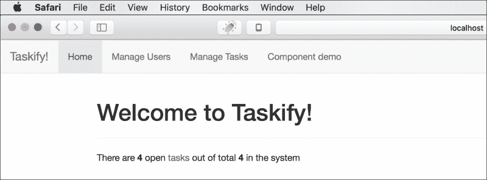

# 第六章：构建单页 Spring 应用程序

在处理企业应用程序的所有主要技术问题时，掌握了 Spring Framework 的许多强大功能，现在是将我们在前几章中学到的所有技术结合起来构建现代 Web 应用程序的时候了。当前 Web 开发的趋势是构建提供类似本机用户体验和直观用户界面的**单页应用程序**（**SPAs**）。在本章中，让我们构建一个由 Spring 后端支持的响应式 SPA。

我们将使用 Ember.js 构建 SPA，并使用 Bootstrap 进行样式和响应行为。对于 Ember 开发，我们将使用一个名为**Ember CLI**的命令行工具，它在 Node.js 上运行，并结合了一系列支持工具，用于 JavaScript-based 现代前端开发的各种关键功能。

# SPAs 背后的动机

我们知道 Spring 主要关注服务器端，即集成、服务和数据层。Spring 依赖于其他 Web 技术来呈现表示层。虽然 Spring MVC 通过诸如 JSP 和 Thymeleaf 等 Web 技术来促进表示层，但它们都是基于服务器端渲染和全页面刷新来响应用户交互的。在这种传统方法中，Web 应用程序的表示层由一堆完全独立的 HTML 文件组成，由服务器按需提供，每个文件代表一个屏幕，每次只有一个屏幕呈现给客户端浏览器，每次用户交互都需要完整的往返到服务器。与优雅地在需要时重新呈现屏幕的本机桌面应用程序相比，这提供了非常糟糕的用户体验。

尽管可以使用一些使用 AJAX 的框架，如 jQuery，以从服务器获取数据，甚至用于 UI 的部分渲染（如 JSF 的情况），但这需要大量服务器资源用于表示层，当并发用户数量增加时，服务器处理很容易耗尽。在这种方法中，表示层关注点分布在服务器和客户端层之间。在这种情况下，UI 开发人员需要具备客户端和服务器端技能，这使得 Web 开发更加困难。

Web 开发人员一直在寻找一种更智能的方法来构建完全在客户端运行的数据驱动应用程序的用户界面，它运行在 Web 浏览器内部，提供类似本机的丰富用户体验，而无需对页面转换和导航进行完全刷新到服务器。他们希望通过纯粹在客户端上使用数据使其 UI 动态化，消除前端开发中对服务器的需求，并在客户端准备就绪后才将其插入服务器。对于所有这些问题和要求，SPA 范式是答案。

# 解释 SPA

SPA 是一个完全由静态 Web 资源组成的 Web 应用程序或网站，如 HTML、JavaScript 和 CSS，在单个页面加载中加载一次。一旦启动，随着用户开始与其交互，它会智能地更新自身。与传统 Web 应用程序为屏幕导航执行完整页面刷新不同，SPA 在不重新加载整个页面（或下一个页面）的情况下路由和重新绘制（重新呈现）屏幕。它使用 JavaScript 重建 DOM 结构，并响应用户操作和应用程序事件以在屏幕上表示它们。

初始启动后，SPA 与服务器通信的唯一时间是获取动态数据。SPA 通常依赖于 AJAX 或 WebSockets 从服务器获取数据访问。数据传输格式主要是 JSON，有时也是 XML。它们通过 AJAX 异步地在后台通过 HTTP 与服务器联系；这样可以提供流畅、流畅的用户体验，而不会阻塞屏幕或让用户等待服务器响应。此外，服务器可以使用 WebSocket API 与客户端同步其数据更改，以提供实时体验。

## SPA 的架构优势

除了前端开发人员的巨大生产力增益和显著性，SPA 还提供了许多架构优势。与传统的服务器渲染的 Web 应用程序相比，它的运行速度非常快，因为它完全在客户端本地工作。SPA 提供了更加流畅和流畅的用户体验，因为它能够立即响应，而无需在每次用户交互时重新提交整个页面到服务器。

### 注意

JavaScript 密集型 Web 应用程序在具有足够内存的现代 Web 浏览器上运行效果最佳。大多数框架利用许多 HTML5 功能和更新的 JavaScript 功能，如 AJAX。SPA 可以在较慢的 PC 上迅速淘汰旧版浏览器。

SPA 将整个应用程序状态的责任转移到浏览器，释放服务器资源以便专注于核心业务逻辑（服务）和状态无关的 Web 服务数据，通常设计为 REST API。使用 SPA，服务器只是一个 API 服务器；整个用户交互由客户端处理，这极大地提高了服务器的可扩展性。

另一个优势，也许是 SPA 最重要的优势之一，是客户端和服务器应用程序可以独立设计和演进。只要端点（API）合同保持完整，您可以替换其中一个而不影响另一个。此外，您可以让前端开发人员构建 UI，后端开发人员提供数据；两个团队都可以专注于自己的领域，同时围绕数据合同进行工作。

## SPA 框架

在纯 JavaScript 中开发 SPA 并不是一个明智的想法，考虑到 SPA 范式所处理的责任的重要性。如果我们打算从头开始编写所有路由、数据绑定、屏幕创作和渲染代码，那将会非常累人且容易出错。幸运的是，一系列令人印象深刻的框架从 SPA 概念中出现。它们每个都提供不同级别的抽象和架构风格；其中一些使用强大的模板技术。让我们来看看最流行的 SPA 框架：

+   **AngularJS**：由 Google 维护并得到开发人员和公司社区的支持，Angular 是最流行和广泛使用的 SPA 框架。它通过智能指令增强了原始 HTML，实现了双向数据绑定。Angular 支持本地化和可重用组件的构建。

+   **ReactJS**：由 Facebook、Instagram 和一群开发人员和公司支持，React 是撰写时增长最快的 SPA 框架。Facebook 和 Instagram 都是使用 React 开发的。它的工作基于虚拟 DOM 的概念，即显示的 DOM 的内存表示，可以在客户端或服务器（使用 Node）上呈现，并使用单向绑定进行操作。React 屏幕是使用 JSX 编写的，这是 JavaScript 的扩展，允许在 JavaScript 函数中轻松引用 HTML。

+   **Ember.js**：由 Yehuda Katz 创建并由一群活跃的开发人员社区贡献的非常强大的 JavaScript MVC 框架，Ember 被许多热门高流量的网站和应用程序使用，如 Groupon、Yahoo!（广告管理器 Plus）、Zendesk、Square、Discourse 和 LivingSocial。Ember 可用于构建移动和桌面应用程序：Apple Music 是一个使用 Ember 构建的著名桌面应用程序。Ember 以一种有主见的方式解决了客户端 Web 应用程序的端到端问题。作为 Web 和 JavaScript 标准的早期采用者，如 ES6、Web 组件和 Promises，Ember 配备了一套强大的生产工具和组件，使其成为一个完整的前端框架。

在本章中，我们将使用 Ember.js 来构建一个作为 Spring API 服务器前端的 SPA。我们将首先探索 Ember.js 及其核心组件和开发工具，然后使用 Ember 开发前端应用程序，连接到后端的基于 Spring 的 API 服务器。本章将使您成为现代技术栈上具有服务器端和客户端技能的全栈开发人员。

# 介绍 Ember.js

Ember 是一个全面的前端框架，用于创建雄心勃勃的 Web 应用程序。它是根据前端的**模型-视图-控制器**（**MVC**）架构模式建模的。其设计良好的组件具有明确定义的责任和丰富的功能，使开发人员能够使用大大减少的代码开发复杂的 Web 应用程序。在 Ember 应用程序中，屏幕是使用 Handlebars 模板组成的，当底层数据发生变化时，它们会自动更新自己。

Ember 在开箱即用时非常高效，具有全面的开发堆栈和友好的 API。Ember 开发堆栈包含以下工具：

+   **Ember CLI**：这是一个用于创建项目、脚手架和管理资源的命令行工具。它提供了一个带有实时重新加载的开发服务器、一个测试框架、模拟服务器和全面的资产管理支持。

+   **Ember Inspector**：这是一个用于 Ember 应用程序的调试器兼检查器工具，作为 Firefox 和 Chrome 浏览器的插件进行发布。它允许您在调试时评估和更改 Ember 对象、元素和变量，并提供运行中的 Ember 应用程序的可视化表示。

+   **Ember Data**：Ember 的这个子项目是一个数据持久化库，可以直接映射到远程数据源，比如 REST API。它通过诸如 API 端点之类的通道将 Ember 模型对象与服务器端的数据实体进行映射。Ember Data 为标准的 REST 和 JSON API 端点提供了适配器和序列化器，并允许您为任何数据源创建自己的适配器，例如浏览器的本地存储。

+   **Fastboot**：这是一个基于 Node.js 的服务器，用于 Ember 资源的服务器端渲染，消除了在加载静态资产后下载 JavaScript 有效负载的需求，从而提高了性能。

+   **Liquid Fire**：这为 Ember 视图提供了动画支持。

+   **测试框架**：Ember CLI 集成了 QUnit 来测试 Ember 资源。

Ember 是一个非常有主见的框架；这意味着你应该按照它自己的约定来构建应用程序，然后框架会处理剩下的事情。如果你遵循指南，你最终会写很少而且易读的代码。Ember CLI 通过简单的命令生成 Ember 项目结构和构件，符合框架的预期方式。

# Ember 应用程序的解剖结构

Ember 应用程序由一组具有明确定义的责任和属性的核心元素组成。它们在 Ember API 的 Ember 和 DS 命名空间下定义。

这张图描述了 Ember 应用程序的高级结构：


## 路由器

路由器管理应用程序状态。它将一组逻辑路由映射到路由器配置中映射的唯一 URL。

## 路由或路由处理程序

路由处理程序，也称为路由（在`Ember.Route`中定义），表示单个路由转换的处理程序。路由可以呈现显示屏的模板。路由提供一个可以被其模板和控制器使用的模型（数据）。它有一个相应的控制器，可以处理用户操作并维护状态。路由可以自行处理用户操作。

## 模板

模板是 HTML 片段，通常由路由和组件渲染。Ember 应用程序的用户界面由一系列模板组成。模板使用 Handlebars 语法，看起来像是带有一些 Handlebars 表达式的常规 HTML，这些表达式用双大括号（`{{ }}`）括起来。这些 Handlebars 表达式绑定 Ember 资源，如属性、对象、帮助器和组件。

## 组件

组件控制用户界面的行为。它们处理用户操作并管理模板使用的许多属性。组件由两部分组成：

+   一个扩展了`Ember.Component`的 JavaScript 对象，其中定义了操作和属性

+   一个渲染到父视图的模板，通常是路由的模板

## 模型

作为 Ember Data 项目的一部分，模型代表 Ember 应用程序中域数据的状态。一个 Ember 应用程序通常会有一组从`DS.Model`扩展的模型。路由通常会使用模板显示模型数据，并通过操作处理程序修改数据。模型通常从存储库（`DS.Store`）加载，而模型实例则从实际的持久存储中获取，通常是 Web 服务器上的 API 端点。模型可以持久保存到存储库；通常它们会被发送回适当的 API 端点。

## 控制器

控制器在现代 Ember 应用程序中的作用有限；它们将在未来版本中被弃用。目前，它们的用途仅限于维护路由的状态和处理用户操作。由于路由和组件可以处理操作，它们是添加操作处理程序的理想位置，而不是控制器。

除了这些核心元素，还有一些支持组件，可以帮助应用程序开发更加简单和优雅。

## 输入助手

这些是 Ember 捆绑的现成组件，用于从用户那里获取输入。它们大多是一般表单控件的 Ember 版本。例如`{{input}}`和`{{textarea}}`输入助手。自定义开发的组件可以类似于输入助手。

## 自定义助手

助手在模板内部不容易获得时，可以为应用程序添加自定义功能。它们大多用于某种格式化。例如`{{format-date}}`和`{{format-currency}}`。

## 初始化器

初始化器可以在应用程序启动时执行某些操作。有两种类型的初始化器：应用程序初始化器，在应用程序启动时执行；应用程序实例初始化器，在应用程序实例启动时加载。

## 服务

服务是可以保存数据和函数的对象，其范围是整个应用程序。它们通常用于封装跨多个路由的核心业务逻辑。服务可以被注入到控制器、路由、组件等中，从而可以调用它们的方法。

# 使用 Ember CLI

Ember CLI 是用于 Ember 应用程序的集成快速开发环境。基于 Broccoli，一个在 Node.js 上运行的快速可靠的资产管道，Ember CLI 是一个强大的命令行界面，集成了许多必要的 JavaScript 开发工具和优化实用程序。

Ember CLI 为 Ember 开发提供了以下功能和工具：

+   它为 Ember 应用程序创建了一个强大的基于约定的项目结构

+   它从命令行生成特定于 Ember 的应用程序资源，如路由、模板和组件

+   它支持在 Handlebars、HTMLBars 和 Emblem.js 格式中进行模板编写

+   它支持 ES2015（ES6）模块、CoffeeScript 和 EmberScript 语法的脚本编写

+   它支持在 CSS、Sass、Compass 和 Stylus 中进行 CSS 编写

+   它将 Node.js 风格的 ES2015 模块转换为 RequireJS 模型的 AMD 模块

+   它集成了 npm 和 Bower 包管理器来管理对 JS 库的依赖关系

+   它集成了一个带有 LiveReload 的开发服务器，可以自动重新构建和更新代码更改到所有连接的浏览器

+   它为应用程序资源执行资产管理功能（合并、最小化、混淆、版本控制等）

+   它通过使用插件和蓝图来共享代码和功能

在本章后面，我们将使用 Ember CLI 作为构建 Ember 应用程序及其各种构件的开发工具。

## 设置 Ember CLI

Ember CLI 依赖于 Node.js。因此，第一步是安装 Node.js。请按照网站[`nodejs.org`](http://nodejs.org)上的说明设置 Node.js。

一旦安装了 Node.js，就可以使用以下命令使用`npm`安装 Ember CLI：

```java
npm install -g ember-cli

```

现在，使用以下命令安装 Bower：

```java
npm install -g bower

```

您可以选择安装 Watchman 以更好地观察代码更改和 PhantomJS 测试运行环境。

## 使用 Ember CLI 命令开始

安装了 Ember CLI 后，您可以使用以下一组命令逐步创建 Ember 应用程序所需的构件：

| 命令 | 目的 |
| --- | --- |
| `ember` | 打印可用的命令。 |
| `ember new <appname>` | 生成一个名为`<appname>`的全新项目根目录，整个项目结构以及启动 Ember 应用程序所需的所有构件。 |
| `ember init` | 将当前目录转换为 Ember 应用程序，并生成所有必要的构件。 |
| `ember build` | 构建并生成可部署到`dist`目录的内容。使用环境标志指定环境，默认为`development`。 |
| `ember server (or serve)` | 在端口`4200`启动开发服务器。您可以使用`--port`标志指向另一个端口，例如`ember serve --port 8080`。 |
| `ember generate <generatortype> <name> <options>` | 生成特定的生成器，例如路由、模板和帮助程序，以及给定的名称和选项。输入`ember help generate`以获取可用生成器的完整列表。对于 POD 结构中的生成器，请使用`--pod`标志（稍后会解释）。 |
| `ember destroy <generatortype> <name> <options>` | 删除使用`ember generate`命令创建的构件。记得在生成构件时使用`--pod`标志。 |
| `ember test` | 使用 Testem 测试运行程序运行应用程序中编写的测试。 |
| `ember install <addon-name>` | 将给定的插件安装到应用程序中，并在`package.json`文件中注册它。 |

## Ember 项目结构

使用`ember new <project-name>`命令时，Ember CLI 根据约定生成和组织文件，并在构建和运行时编译它们并执行一系列任务。以下表格描述了 Ember CLI 生成的文件夹布局和重要文件：

| 文件/文件夹 | 描述 |
| --- | --- |
| `app/` | 这是 Ember 应用程序根目录。`index.html`文件和所有 JavaScript 文件和模板都放在这里的适当子目录下。除了`index.html`之外的所有内容都通过 ES6 模块转换器进行编译，然后被缩小和连接到`<app-name>.js`，然后在构建时由`index.html`文件加载。 |
| `app/index.html` | 这是从服务器加载的唯一 HTML 页面，它从`<app-name>.js`引导 Ember 应用程序，并使用嵌入其中的`<script/>`标签加载。Ember 在运行时从此基础 HTML 文档内部构建整个 DOM 结构。 |
| `app/app.js` | 这是 Ember 应用程序模块。这是应用程序的入口点，所有其他模块都在这里初始化并注入，以便根据解析器和特定环境的配置创建整个应用程序实例。 |
| `app/router.js` | 这是应用程序的路由配置模块。 |
| `app/adapters/` | Ember Data 模块的适配器放在这里。当第一次执行`ember generate adapter <model-name>`命令时，将生成此文件夹。 |
| `app/components/` | 所有组件都放在这里，除非使用了`--pod`选项。 |
| `app/controllers/` | 所有控制器都放在这里，除非使用了`--pod`选项。 |
| `app/helpers/` | 所有帮助程序都放在这里，除非使用了`--pod`选项。 |
| `app/models/` | 所有模型都放在这里，除非使用了`--pod`选项。 |
| `app/routes/` | 所有路由都放在这里，除非使用了`--pod`选项。 |
| `app/services` | 所有服务都放在这里，除非使用了`--pod`选项。 |
| `app/styles/` | 将应用程序的所有样式表放在这里，无论是 Sass、LESS、Stylus、Compass 还是纯 CSS。默认情况下只支持纯 CSS；您可以通过安装适当的`npm`模块来启用其他类型。对于 Sass，在命令行中输入`ember install ember-cli-sass`。对于 LESS，命令是`ember-cli-less`；对于 Compass，是`ember-cli-compass-compiler`，依此类推。对于默认的 CSS 选项，请将样式添加到`app.css`中。您还可以将样式组织在不同的 CSS 文件中，并将它们导入到您的`app.css`文件中。 |
| `app/templates/` | 所有模板都放在这里，除非使用了`--pod`选项。 |
| `bower.json` | 这是 Bower 配置文件。 |
| `bower_components/` | 由 Bower 管理的依赖项放在这里。 |
| `config/` | 应用程序配置文件放在这里。 |
| `config/environment.js` | 您的特定于环境的配置放在这个文件中。 |
| `dist/` | 构建过程生成的可部署文件放在这里。这是您需要发布的内容。 |
| `ember-cli-build.js` | 这是 Broccoli 构建文件。在这里包括所有由 Bower 和`npm`管理的资源。 |
| `node_modules` | 所有由 npm 管理的 node 依赖项放在这里。 |
| `package.json` | 这是 NPM 依赖项配置文件。 |
| `public/` | 这是一个用于未编译资产（如字体和图像）的目录。内容会按原样复制。 |
| `server/` | 这是您可以为模拟 API 和测试设置开发服务器的地方。 |
| `tests/` | 所有单元测试和集成测试都放在这里。 |
| `tmp/` | 这是一个用于构建执行的临时文件夹。 |
| `vendor/` | 将不由 npm 或 Bower 管理的外部依赖项放在这里。 |

在构建过程结束时，Ember CLI 会在`dist/directory`生成可部署文件。您需要分发该目录的内容，以便在发布时将可部署文件托管到 Web 服务器上。

## 使用 POD 结构进行工作

默认情况下，`ember generate <generator>`命令会在`app`根目录下直接生成特定资源目录内的工件。因此，所有路由都放在`app/routes`下，模板放在`app/templates`下，依此类推。然而，随着应用程序的增长，这变得有点难以维护。为了解决这个问题，Ember CLI 提供了使用`ember generate`命令生成工件时，使用`--pod`标志以特性驱动（POD）结构组织文件的选项。

为了使 POD 结构工作，您需要首先在`config/environment.js`中配置 POD 目录，如下面的代码所示：

```java
module.exports = function(environment) {
  var ENV = {
    ...
    podModulePrefix: 'my-ember-app/pod-modules',
    ...
    },
    ...
  return ENV;
};
```

前面的代码片段指定了使用`--pod`标志生成的所有工件将生成在`<app-root>/pod-modules`目录内。

一旦配置了 POD，您就可以开始使用`--pod`标志生成您的工件。

例如，如果您想在 POD 结构内生成一个路由，可以使用以下命令：

```java
ember generate route user --pod

```

这将在`/app/pod-modules/user/route.js`生成路由文件。

POD 模块将与特性相关的所有工件组合在一个地方，从而使其更易管理。

# 了解 Ember 对象模型

Ember 自带丰富的 API，扩展了原生 JavaScript 类，并引入了新的结构，提供了增强的功能，如双向数据绑定、属性观察等。它为大多数常见的 JavaScript 构造提供了更智能的替代方案，如对象和数组。

`Ember.Object`是所有 Ember 对象的主要基类。它提供了一个带有高级特性的类系统，如混入和构造方法。`Ember.Object`提供了许多特殊功能，如计算属性、数据绑定和属性值变化观察者。

## 声明类型（类）和实例

您可以以纯粹的面向对象的方式继承`Ember.Object`中的所有功能；如下面的代码所示，只需扩展它：

```java
var User = Ember.Object.extend({
   ...
});
```

前面的片段只是`User`类型的声明。现在，您需要实例化此类结构，以便在程序中使用它，如下所示：

```java
var User = Ember.Object.create();
```

您可以像前面的片段一样调用无参数构造函数，也可以将一组带有值的属性作为 JS 对象传递，以创建已声明类的实例，如下所示：

```java
var myUser = User.create({
    firstName: "John", 
    lastName: "Smith", 
    userName: "jsmith",
    password: "secretp@ss", 
    dateOfBirth: new Date(1980, 10, 24);
});
```

## 访问和变异属性

类型初始化后，您可以使用`get`方法访问其属性，如下所示：

```java
var name = myUser.get("name");
```

请记住始终使用`get`方法而不是`object.property`，因为 Ember 对象将托管属性存储在不同的哈希中，提供了一些特殊功能，而不像原始 JS 对象。

确保使用`set`方法以启用 Ember 对象的所有特殊功能，例如计算属性和属性观察：

```java
myUser.set('firstName', "Shameer");
```

## 计算属性

计算属性是从其他普通属性派生的虚拟属性，或者是由函数返回的值。`Ember.Object`也可以有计算属性，如下所示：

```java
var User = Ember.Object.extend({
   ...

   fullName: Ember.computed('firstName', 'lastName', function() {
      return `${this.get('firstName')} ${this.get('lastName')}`;
   }),
   ...
});
```

一旦实例化，您也可以以与普通属性相同的方式访问计算属性。它们在依赖属性更改时会自动更新自身。您也可以创建可变的可计算属性。以下是这种计算属性的合理实现示例：

```java
fullName: Ember.computed('firstName', 'lastName', {
    get(key) {
        return `${this.get('firstName')} ${this.get('lastName')}`;
    },
    set(key, value) {
        var [firstName, lastName] = value.split(/\s+/);
        this.set('firstName', firstName);
        this.set('lastName',  lastName);
        return value;
    }
})
```

由于计算属性就像任何其他函数一样，您可以向其添加任何业务逻辑。

## 属性观察者

您可以观察任何值的普通或计算属性的变化。为此目的，使用`Ember.Observer`注册属性。请参阅以下示例：

```java
var User = Ember.Object.extend({
   ...

   dateOfBirth: new Date(),
   dobChanged: Ember.observer('dateOfBirth', function() {
      // deal with the change
      console.log(`Date of birth updated. New value is: ${this.get('dateOfBirth')}`);
   })
});
```

在前面的片段中，`dobChanged`函数将在`dateOfBirth`属性更新时触发。您可以通过将所有属性作为参数传递到`Ember.observer`方法中来绑定多个属性到单个观察者方法中，然后再定义函数。

### 注意

计算属性也可以被观察。但是，直到访问计算属性之前，观察者方法才会被触发，即使依赖属性已经更新。

# 使用集合

Ember 使用一组核心集合类使数组操作更智能，如下表所示。这些类提供了许多方便的方法，抽象了复杂的数组操作：

| 集合类型 | 描述 |
| --- | --- |
| `Ember.Array` | 这是观察者友好的数组行为的抽象实现。预期具体实现已经实现了`length()`和`objectAt()`等方法。值得注意的方便方法有`any()`、`every()`、`filter()`、`filterBy()`、`find()`、`findBy()`、`forEach()`、`getEach()`、`map()`、`mapBy()`、`objectAt()`、`replace()`、`reverse()`、`sortBy`、`without()`等。 |
| `Ember.ArrayProxy` | `ArrayProxy`包装实现`Ember.Array`的对象，用于绑定用例和在迭代时交换内容。 |
| `Ember.MutableArray` | 这是`Array`的扩展，支持有序集合的数组。 |
| `Ember.Enumerable` | 这是用于枚举数组的 mixin。 |
| `Ember.NativeArray` | 这是上述所有内容中最具体的实现。在大多数情况下，您会使用它。 |

# 使用 Handlebars 构建 UI 模板

Ember.js 中的主要 UI 编写技术是 Handlebars。Handlebars 模板允许使用双大括号(`{{ }}`)内部放置的 Handlebars 表达式嵌入动态内容的 HTML 片段，动态脚本块。Handlebars 表达式使用路由、模型、控制器、组件、服务、工具甚至应用实例的属性执行数据绑定。以下是一个示例 Handlebars 表达式：

```java
<h3>Welcome <strong>{{loggedInUser.fullName}}.</strong></h3>
```

这段代码期望一个对象（最好是从`Ember.Object`派生的对象，尽管它也可以与普通 JS 对象绑定）具有名称为`loggedInUser`的属性，该对象在父上下文层次结构（模板、控制器、路由或应用程序）中的某个地方存在。然后，它与`loggedInUser`对象的`fullName`属性建立单向数据绑定；因此，它只显示绑定属性的值。

## Handlebars 帮助程序

Handlebars 依赖于帮助程序来处理动态脚本块内的业务逻辑。Handlebars 执行帮助程序内部实现的业务逻辑（如果有的话），放置在花括号内，或者它只是与绑定属性进行数据绑定。

Ember 提供了一组内置的帮助程序，并提供了一种很好的开发自定义帮助程序的方式。内置的帮助程序可以分为以下几类：

+   输入帮助程序

+   控制流帮助程序

+   事件帮助程序

+   开发帮助程序

帮助程序可以是内联的，也可以是块级的。内联帮助程序只是单行，类似于空的 HTML 和 XML 标记。看看`action`帮助程序，它是一个内联帮助程序，用于处理参数：

```java
{{action 'editUser' user}}
```

内联帮助程序可以嵌套，将更多动态值嵌入其中：

```java
{{action 'editUser' user (format-date today format='MMM DD, YYYY')}}
```

块帮助程序具有与 HTML 标记类似的开始和结束结构：

```java
{{#if isLoggedIn}}
    Welcome <strong>{{loggedInUser.fullName}}</strong>
{{/if}}
```

## 使用输入帮助程序进行数据绑定

模板可以使用输入帮助程序建立双向数据绑定。输入帮助程序主要是包装在 Ember 组件或视图中的 HTML 表单元素。Ember 提供了一些内置的输入帮助程序，例如`Ember.TextField`，`Ember.TextArea`和`Ember.Checkbox`。让我们来看一个例子：

```java
{{input placeholder="User Name" value=editingUser.userName}}
```

`{{input}}`是一个内置的输入帮助程序，它根据`type`属性的值（默认为`text`）包装 HTML 输入文本字段和复选框。它允许生成的`<input type="text"/>`标签与属性`editingUser.userName`之间进行双向绑定。每当其中一个值发生变化时，它会更新双向绑定的另一个参与者。`{{input}}`帮助程序支持许多有用的属性，例如`readonly`，`required`，`size`，`height`，`name`，`autofocus`，`placeholder`，`tabindex`和`maxlength`。

复选框是使用相同的`{{input}}`帮助程序创建的，但是通过将 type 属性设置为`checkbox`。`{{textarea}}`帮助程序表示 HTML`<textarea/>`组件。

您可以创建自己的输入帮助程序作为 Ember 组件，我们将在本章后面学习。

## 在 Handlebars 中使用控制流帮助程序

与大多数脚本语言一样，Handlebars 支持以下控制流帮助程序：

+   条件：

+   `{{if}}`

+   `{{#else}}`

+   `{{#else if}}`

+   `{{#unless}}`

+   循环：

+   `{{#each}}`

以下是`{{if}}`，`{{else}}`和`{{else if}}`帮助程序的示例：

```java
<div class="container">
{{#if isIdle}}
    You are idle for {{SessionService.idleMinutes}} minutes.
{{else if isLoggedIn}}
    Welcome <strong>{{loggedInUser.fullName}}</strong>
{{else}}
    <a {{action showLoginPopup}}>Please login</a>
{{/if}}
</div>
```

`{{#each}}`帮助程序用于循环（迭代）遍历集合，显示它，并在集合中的每个元素周围提供事件挂钩或操作。典型的`{{#each}}`帮助程序如下所示：

```java
{{#each model as |user|}}
<tr>
<td><a {{action 'showUser' user }}>{{user.id}}</a></td>
<td>{{user.userName}}</td>
    ...
</tr>
{{/each}}
```

## 使用事件帮助程序

事件帮助程序响应用户触发的操作。Ember 中的两个主要事件帮助程序是`{{action}}`和`{{link-to}}`帮助程序。

`{{link-to}}`帮助程序有助于导航到另一个路由。请参阅以下示例：

```java
{{link-to "Login here" "login" class="btn btn-primary"}}
```

`{{action}}`帮助程序通常添加到普通 HTML 元素中，以便将事件和事件处理程序附加到它：

```java
<a {{action "editTask" _task}} class="btn btn-success">Edit</a>
```

# 处理路由

Ember 应用程序在一组路由之间转换其状态；每个路由可以呈现一个显示当前状态的模板，并提供支持其基于状态的数据的控制器。路由在路由器配置内注册，通常在 Ember CLI 项目结构中的`router.js`内。路由在其自己的 JS 文件中定义。

路由可以通过命令行生成和自动配置，如下所示：

```java
ember generate route user --pod

```

该命令在`app/<pod-directory>/user/`目录下生成`route.js`和`template.hbs`。生成后，这两个文件都将具有基本结构，您需要根据特定要求完善它们。典型的路由将具有一个模型钩子，用于准备其数据。请参阅以下代码中给出的典型但最小的路由结构：

```java
import Ember from 'ember';

export default Ember.Route.extend({

  model: function(args) {
    return this.store.findAll('task');
  }
});
```

在上面的示例中，`model`钩子从`DS.Store`（Ember Data 存储库）获取数据。路由在 Ember CLI 项目的情况下呈现同一目录中的`template.hbs`文件，除非在`renderTemplate`方法中指定了另一个模板。路由的模型可供控制器和模板（通过控制器）进行操作和呈现。

# 使用组件处理 UI 行为

组件是 Ember 中动态 UI 片段或元素的构建块。它们呈现一个模板，可以选择由扩展`Ember.Component`的类支持。

创建组件的最简单方法是在`app/components/`目录中创建一个以破折号分隔的名称的模板文件。然后，您可以通过调用``并传递所需的参数将其嵌入到其他模板中。

组件是独立的，与客户端上下文完全隔离；所有必需的数据必须作为参数传递。但是，如果在模板中使用`{{yield}}`，它实质上变成了一个块（或容器）组件，您可以添加任何内容；此内容可以访问任何控制器属性和模型。

可以使用以下命令生成组件：

```java
ember generate component <component-name> --pod

```

该命令在`app/<pod-dir>/components/<component-name>/`目录下生成两个文件，`component.js`和`template.hbs`。如果不使用`--pod`标志，它将在`app/components/`目录下生成`<component-name>.js`和`<component-name>.hbs`文件。

组件将内容插入到 DOM 结构中，调用它，并控制插入内容的行为。默认情况下，组件呈现一个带有其模板生成的内容的`<div/>`元素。您可以通过在`component.js`文件中设置`tagName`属性来指定`<div/>`元素的不同 HTML 元素。同样，您可以使用另一个属性`assNameBindings`动态设置 CSS 类名。

组件为操纵组件的不同阶段提供了一些非常有用的生命周期钩子。可以在组件类中重写的一些生命周期方法是`didInsertElement()`、`willInsertElement()`和`willDestroyElement()`。

组件支持标准 HTML 元素事件，具体取决于使用的`tagName`。它们支持所有标准触摸事件，如`touchStart`和`touchMove`，键盘事件，如`keyDown`、`keyUp`和`keyPressed`，鼠标事件，如`mouseDown`、`mouseOver`、`click`和`doubleClick`，表单事件，如提交和更改，以及 HTML5 拖放事件，如`dragStart`和`dragEnd`。您只需在组件类内声明事件作为函数；组件将触发事件，并且相关函数将在用户与其交互时被调用。

除了事件之外，组件还可以响应动作处理程序，这些处理程序是在组件类的`actions`哈希内定义的命名函数。这些动作可以在组件的模板中的任何位置触发。动作处理程序可以接受来自客户端代码或模板的参数。

## 逐步构建 ToggleButton 组件

让我们逐步学习如何使用 Ember CLI 构建 Ember 组件。我们将构建一个切换按钮，当单击时切换开关。该组件仅根据其状态属性`isActive`更改其标签和样式。我们在此示例中使用 Bootstrap 样式。

首先，让我们使用 Ember CLI 逐步生成组件类和模板文件（`.hbs`）。在项目的根目录中，从命令行发出此命令：

```java
ember generate component toggle-button --pod

```

查看`app/<pod-dir>/components/toggle-button/`中生成的`component.js`和`template.hbs`文件。打开并查看`component.js`文件，它看起来如下所示：

```java
import Ember from 'ember';

export default Ember.Component.extend({
});
```

生成的`template.js`文件中只有`{{yield}}`。现在，您需要在这两个构件中添加必要的属性和业务逻辑，以使其成为一个合适的切换按钮组件。以下是修改后的`component.js`文件，具有适当的行为：

```java
import Ember from 'ember';

export default Ember.Component.extend({
  tagName: "button",
  attributeBindings: ['type'],
  type: "button",
  classNames: ["btn"],
  classNameBindings: ["isActive:btn-primary:btn-default"],
  activeLabel: "On",
  inactiveLabel: "Off",
  isActive: false,

  currentLabel: Ember.computed('isActive', 'activeLabel', 'inactiveLabel', function() {
    return this.get(this.get("isActive") ? "activeLabel" : "inactiveLabel");
  }),

  click: function() {
    var active = this.get("isActive")
    this.set("isActive", !active);
  }
});
```

在上述代码中，请注意您将`tagName`属性指定为`button`；否则，生成的 HTML 将是`<div/>`。另外，看看如何基于`isActive`属性动态绑定 CSS 类名。`currentLabel`属性是一个计算属性，它取决于其他几个属性。实际上，组件响应点击事件，并切换`isActive`变量。其他所有操作都将基于此事件进行。

现在，让我们看一下修改后的`template.js`文件，看看它如何利用`component.js`文件处理的属性和事件：

```java
{{currentLabel}}
```

惊喜！这就是模板中的所有内容。构建起来是如此简单。其余的繁重工作都是由`component.js`文件自己完成的。现在最有趣的部分是组件如何从客户端调用。让我们来看一下：

```java
{{toggle-button}}
```

这就是您在客户端代码中添加切换按钮组件的方式，它主要是路由的模板。您可以开始反复点击按钮，看到它的开启和关闭。

该组件可以通过覆盖其默认属性进行定制。让我们尝试从客户端更改其开启和关闭时的标签：

```java
{{toggle-button activeLabel="Turn me off now :)" inactiveLabel="Turn me On please.."}}
```

当您点击按钮时，您可以在屏幕上看到新的活动和非活动标签，切换它。切换按钮是 Ember 组件的最简单的示例，旨在让您对 Ember 组件有所了解。典型的 Ember 应用程序将拥有许多复杂的组件。将可重用的 UI 模块或部分转换为组件是使您的应用程序更加优雅和可维护的最佳方式。

# 使用 Ember Data 持久化数据

Ember Data 是 Ember 的数据访问机制。它提供了一个简单的 API 来处理数据，抽象了数据访问和各种数据源的复杂性和协议。使用 Ember Data，客户端可以像处理任何其他 Ember 对象一样处理数据模型。

Ember Data 定义了一组处理数据访问中各种角色和责任的基本组件。这些组件分组在命名空间`DS`下。以下表格描述了在`DS`下定义的最重要的 Ember Data 组件：

| 组件 | 目的 |
| --- | --- |
| `DS.Model` | 这是数据的基本单元，代表数据集合中的记录。您需要通过扩展此类来定义数据模型。它提供了保存、删除、重新加载和迭代属性、关系、相关类型等的方法。它提供了关于状态、属性、字段、关系、错误等的信息。此外，它提供了生命周期钩子事件。 |
| `DS.Store` | 这是 Ember Data 创建、获取和修改的所有数据的本地存储库。`Store`通过适配器获取数据，并将其转换为适当的`DS.Model`实例。使用序列化器，`Store`将模型实例序列化为适合服务器的形式。它提供了查询和创建新记录的方法。 |
| `DS.Adapter` | 这是一个抽象实现，接收来自`Store`的各种持久性命令，并将其转换为实际数据源（例如服务器 API 或浏览器本地存储）理解的形式。Ember 提供了两个具体的实现：`DS.RESTAdapter`和`DS.JSONAPIAdapter`。如果要更改默认行为或属性（例如远程 URL 和标头），请覆盖适配器。 |
| `DS.Serializer` | 这将`DS.Model`实例标准化为 API 的有效负载（或任何其他数据源），并将它们序列化回模型。两个默认的序列化器是`RestSerializer`和`JSONAPISerializer`。覆盖序列化器以自定义服务器的数据格式。 |

## Ember Data 架构

Ember Data 组件基于**promise**异步地相互通信进行数据访问操作。**Store**和**Adapter**的`query`和`find`方法是异步的，并且立即返回一个**promise**对象。一旦解析，模型实例就会被创建并返回给客户端。以下图表演示了 Ember Data 组件如何异步协调`find`方法操作：


Ember Data 组件的客户端（通常是路由、组件、控制器、服务等）不直接处理适配器和序列化器。它们与**Store**和模型进行正常的数据访问操作。由于`Route.model`方法（钩子）支持**promise**对象，转换将暂停，直到**promise**解析。我们不处理解析 promise，因此也不处理异步性；相反，Ember 会智能地处理它。

## 定义模型

模型代表了 Ember 应用程序的领域数据。它们需要以正确的结构定义并在存储中注册，然后才能用于数据访问。Ember CLI 项目期望模型位于`app/models/`目录下，或者在使用 POD 目录结构的情况下为`app/<pod-dir>/models/`。

让我们看一个示例模型定义。以下是用户模型的定义：

```java
import DS from 'ember-data';

export default DS.Model.extend({

  name: DS.attr('string'),
  userName: DS.attr('string'),
  password: DS.attr('string'),
  dateOfBirth: DS.attr('date'),
  profileImage: DS.belongsTo('file')
});
```

模型属性默认可以是字符串、数字、布尔和日期类型。对于自定义类型，您需要子类化`DS.Transform`。属性也可以有默认值。您可以像下面这行所示指定默认值：

```java
dateOfBirth: DS.attr('date', { defaultValue: new Date() }),
```

## 定义模型关系

模型可以在它们之间进行一对一、一对多和多对多的关系：

+   一个一对一关系在两个模型定义中使用`DS.belongsTo`来定义

+   一个一对多关系在一个模型中使用`DS.belongsTo`，在另一个模型中使用`DS.hasMany`来定义

+   当两个模型都为对方定义了`DS.hasMany`时，就声明了多对多关系

# 构建 Taskify 应用程序

嘿，是时候全面构建我们的 Taskify 应用程序了。首先，让我们回到使用 Spring 构建一个合适的 API 层，然后再回顾 Ember 构建前端 SPA。我们将使用 Spring Data 连接到 API 服务器并访问数据。

为简单起见，我们不会对服务器应用任何安全性措施；我们只会专注于对两个模型`User`和`Task`执行 CRUD 操作。`User`和`Task`彼此相关：`Task 属于 User`。我们将在服务器端和客户端构建模型。让我们看看这两种技术如何在没有直接依赖的情况下协同工作。

# 构建 API 服务器应用程序

我们在第二章中探讨了使用 Spring MVC 构建 Web 应用程序，*使用 Spring Web MVC 构建 Web 层*。在第三章中，*使用 Spring 访问数据*，我们还学习了如何使用 Spring Data JPA 持久化数据。我们将再次应用这两种技术来构建 Taskify 的 API 应用程序。

## 设置和配置项目

由于我们已经学习了使用 Spring Data JPA 创建 Spring MVC 应用程序的基础知识，因此在这一点上，我们只会详细介绍 API 端点的具体内容。有关 Spring MVC 配置，请参阅第二章，“使用 Spring Web MVC 构建 Web 层”，有关 Spring Data JPA 的详细信息，请参阅第三章，“使用 Spring 访问数据”。使用以下步骤设置和配置项目：

1.  创建一个 Spring MVC 应用程序，依赖于 Spring Data JPA 和您选择的数据库。

1.  启用 JPA 存储库，指定基本包。对于 JavaConfig，注释如下：

```java
@EnableJpaRepositories(basePackages = "com.taskify.dao")
```

1.  使用您选择的风格配置 Spring Data JPA 工件，如`DataSource`、`JdbcTemplate`、`TransactionManager`和`EntityManager`。

## 定义模型定义 - User 和 Task

该应用程序有以下两个模型作为域对象：


现在我们需要将这些作为 Java 类实现，并将其注释为 JPA 实体，以便我们可以将它们持久化到数据库中，如下所示：

`User.java`

```java
package com.taskify.domain;

import java.util.Date;
...
@Entity
@Table(name = "TBL_USER", uniqueConstraints = @UniqueConstraint(name = "UK_USER_USERNAME", columnNames = {"USER_NAME" }) )
public class User {

  @Id
  @GeneratedValue
  private Long id;

  @Column(name = "NAME", length = 200)
  private String name;

  @Column(name = "USER_NAME", length = 25)
  private String userName;

  @Column(name = "PASSWORD", length = 20)
  private String password;

  @Column(name = "DOB")
  @Temporal(TemporalType.TIMESTAMP)
  private Date dateOfBirth;
  ...
  //Getters and setters go here..

}
```

`Task.java`

```java
package com.taskify.domain;

import java.util.Date;
...
@Entity
@Table(name = "tbl_task")
public class Task {
  @Id
  @GeneratedValue
  private Long id;

  @Column(name = "NAME", length = 500)
  private String name;

  @Column(name = "PRIORITY")
  private int priority;

  @Column(name = "STATUS")
  private String status;

  @ManyToOne(optional = true)
  @JoinColumn(name = "CREATED_USER_ID", referencedColumnName = "ID")
  private User createdBy;

  @Column(name = "CREATED_DATE")
  @Temporal(TemporalType.TIMESTAMP)
  private Date createdDate;

  @ManyToOne(optional = true)
  @JoinColumn(name = "ASSIGNEE_USER_ID", referencedColumnName = "ID")
  private User assignee;

  @Column(name = "COMPLETED_DATE")
  @Temporal(TemporalType.TIMESTAMP)
  private Date completedDate;

  @Column(name = "COMMENTS")
  private String comments;
  ...
  //Getters and setters go here..
}
```

一旦 JPA 实体准备就绪，为`User`和`Task`创建 DAO——`UserDAO`和`TaskDAO`——并用`@Repository`注释。作为最佳方法并且为了正确的应用层分层，也创建相应的`@Service` bean。由于我们已经在前几章中介绍了 JPA `@Repository`和`@Service`类，这些 bean 的代码在此处不列出。您可以在本书提供的代码包中找到确切的代码。

## 为 Taskify 应用程序构建 API 端点

API 服务器的目的是公开 API 端点，以供客户端使用，包括 Taskify Ember 前端应用程序。让我们按照 REST 模型构建这些 Web 服务，并支持 JSON 数据格式。

在本节中，我们将列出两个使用`@RestController`注释的类：`UserController`和`TaskController`。处理程序方法支持异步、非阻塞 IO，因此它们更具可伸缩性和更快速。处理程序方法设计为 REST 模型。HTTP 方法`GET`、`POST`、`PUT`和`DELETE`与**创建**、**读取**、**更新**和**删除**（CRUD）操作相对应。

### UserController.java

`UserController`公开了对`User`实体的 CRUD 操作的端点。您可以在其代码中看到`UserController`接受和生成 JSON 数据的端点，如下所示：

```java
package com.taskify.web.controller;

import java.util.List;
...

/**
 * Handles requests for user related pages.
 */
@RestController
@RequestMapping("/api/v1/user")
@CrossOrigin
public class UserController {

  private static final Logger = LoggerFactory.getLogger(UserController.class);
  @Autowired
  private UserService;

  @RequestMapping(method = RequestMethod.GET)
  @ResponseBody
  public Callable<List<User>> listAllUsers() {
    return new Callable<List<User>>() {

      @Override
      public List<User> call() throws Exception {
        return userService.findAllUsers();
      }
    };
  }

  @RequestMapping(method = RequestMethod.POST, consumes = MediaType.APPLICATION_JSON_VALUE, produces = MediaType.APPLICATION_JSON_VALUE)
  @ResponseBody
  public Callable<User> createNewUser( @RequestBody CreateUserRequest request) {
    logger.info(">>>>>>>> Creating User, request - " + request);
    return new Callable<User>() {
      @Override
      public User call() throws Exception {
        return userService.createNewUser(request.getUser());
      }
    };
  }

  @RequestMapping(path = "/{id}", method = RequestMethod.PUT, consumes = MediaType.APPLICATION_JSON_VALUE, produces = MediaType.APPLICATION_JSON_VALUE)
  @ResponseBody
  public Callable<User> updateUser(@PathVariable("id") Long id, @RequestBody UpdateUserRequest request) {
    logger.info(">>>>>>>> updateUser, request - " + request);
    return new Callable<User>() {
      @Override
      public User call() throws Exception {
        User existingUser = userService.findById(id);
        existingUser.setName(request.getUser().getName());
        existingUser.setPassword(request.getUser().getPassword());
        existingUser.setUserName(request.getUser().getUserName());
        userService.updateUser(existingUser);
        return existingUser;
      }
    };
  }

  @RequestMapping(path = "/{id}", method = RequestMethod.GET)
  public Callable<User> getUser(@PathVariable("id") Long id) {
    return new Callable<User>() {
      @Override
      public User call() throws Exception {
        return userService.findById(id);
      }
    };
  }

  @RequestMapping(path = "/{id}", method = RequestMethod.DELETE)
  @ResponseStatus(value = HttpStatus.NO_CONTENT)
  public Callable<Void> deleteUser(@PathVariable("id") Long id) {
    return new Callable<Void>() {
      @Override
      public Void call() throws Exception {
        userService.deleteUser(userService.findById(id));
        return null;
      }
    };
  }
}
```

### TaskController.java

`TaskController`映射了围绕`Task`实体的 CRUD 操作的请求端点。其代码如下：

```java
package com.taskify.web.controller;

import java.util.List;
...

@RestController
@RequestMapping("/api/v1/task")
@CrossOrigin
public class TaskController {

  private static final Logger = LoggerFactory.getLogger(TaskController.class);

  @Autowired
  private UserService;

  @Autowired
  private TaskService;

  private static final int[] priorities = new int[] { 1, 2, 3, 4, 5, 6, 7, 8, 9, 10 };

  @RequestMapping(method = RequestMethod.GET)
  @ResponseBody
  public Callable<List<Task>> listAllTask() {
    return new Callable<List<Task>>() {
      @Override
      public List<Task> call() throws Exception {
        return taskService.findAllTasks();
      }
    };
  }

  @RequestMapping(method = RequestMethod.POST, consumes = MediaType.APPLICATION_JSON_VALUE, produces = MediaType.APPLICATION_JSON_VALUE)
  @ResponseBody
  public Callable<Task> createNewTask( @RequestBody CreateTaskRequest request) {
    logger.info(">>>>>>>> Creating Task, request - " + request);
    return new Callable<Task>() {
      @Override
      public Task call() throws Exception {
        return taskService.createTask(request.getTask());
      }
    };
  }

  @RequestMapping(path = "/{id}", method = RequestMethod.PUT, consumes = MediaType.APPLICATION_JSON_VALUE, produces = MediaType.APPLICATION_JSON_VALUE)
  @ResponseBody
  public Callable<Task> updateTask(@PathVariable("id") Long id, @RequestBody UpdateTaskRequest request) {
    logger.info(">>>>>>>> updateTask, request - " + request);
    return new Callable<Task>() {
      @Override
      public Task call() throws Exception {
        Task existingTask = taskService.findTaskById(id);
        existingTask.setName(request.getTask().getName());
        existingTask.setPriority(request.getTask().getPriority());
        existingTask.setStatus(request.getTask().getStatus());
        existingTask.setCreatedBy(userService.findById( request.getTask().getCreatedBy().getId()));

        if(request.getTask().getAssignee() != null &&
           request.getTask().getAssignee().getId() != null) {
             existingTask.setAssignee(userService.findById(
             request.getTask().getAssignee().getId()));
        } else {
          existingTask.setAssignee(null);
        }
        taskService.updateTask(existingTask);
        return existingTask;
      }
    };
  }

  @RequestMapping(path = "/{id}", method = RequestMethod.GET)
  public Callable<Task> getTask(@PathVariable("id") Long id) {
    return new Callable<Task>() {
      @Override
      public Task call() throws Exception {
        return taskService.findTaskById(id);
      }
    };
  }

  @RequestMapping(path = "/{id}", method = RequestMethod.DELETE)
  @ResponseStatus(value = HttpStatus.NO_CONTENT)
  public Callable<Void> deleteTask(@PathVariable("id") Long id) {
    return new Callable<Void>() {
      @Override
      public Void call() throws Exception {
        taskService.deleteTask(id);
        return null;
      }
    };
  }
}
```

我们已经为 API 服务器构建了所有必要的工件。您可以打包应用程序并部署它。您应该能够在`http://<app-context-root>/api/v1/user`访问`UserController`处理程序，并在`http://<app-context-root>/api/v1/task/`访问`TaskController`处理程序。现在让我们构建前端。

# 构建 Taskify Ember 应用程序

让我们回到 Ember 开发，构建我们的 SPA。按照以下步骤进行。我们将偶尔参考本章的前几节，并在这里详细说明具体内容。

## 将 Taskify 设置为 Ember CLI 项目

让我们生成项目并设置所有工件。按照以下步骤进行：

1.  使用 Ember CLI 从命令行创建一个新的 Ember 项目：

```java

ember new taskify

```

1.  安装`broccoli-merge-trees`和`broccoli-static-compiler`以获得更丰富的 Broccoli 配置。从命令行发出以下命令：

```java

npm install --save-dev broccoli-merge-trees
npm install --save-dev broccoli-static-compiler

```

1.  从命令行使用 Bower 安装 Bootstrap：

```java

bower install bootstrap

```

1.  在`ember-cli-build.js`文件中配置 Broccoli 以包括 bootstrap.js、CSS 和字体：

```java
  var mergeTrees = require('broccoli-merge-trees');
  var pickFiles = require('broccoli-static-compiler');
  var extraAssets = pickFiles('bower_components/bootstrap/dist/fonts',{ srcDir: '/', files: ['**/*'], destDir: '/fonts' });

  app.import('bower_components/bootstrap/dist/css/bootstrap.css');
  app.import('bower_components/bootstrap/dist/js/bootstrap.js');

  return mergeTrees([app.toTree(), extraAssets]);
```

1.  在应用程序中，我们将使用一个名为`ember-bootstrap-datetimepicker`的第三方 Ember 插件。让我们将其安装到项目中：

```java

ember install ember-bootstrap-datetimepicker

```

1.  构建`npm`和`bower`依赖项：

```java

npm install
bower install

```

1.  使用`ember serve`命令启动 Ember 服务器，并确保您的应用程序可以在`http://localhost:4200/`访问。

1.  在`/config/environment.js`中设置 POD 目录：

```java
  var ENV = {
    modulePrefix: 'ember-webapp-forspring',
    podModulePrefix: 'ember-webapp-forspring/modules',
    ...
  }
```

现在我们可以开始在这个 POD 目录中生成所需的 Ember 构件。

## 设置 Ember Data

我们需要两个模型：`User`和`Task`。让我们首先使用以下代码生成它们。对于模型，我们不使用 POD：

```java

ember generate model user
ember generate model task

```

在`/app/models/`文件夹下找到生成的模型。打开它们并设置属性和关系：

`User.js`

```java
import DS from 'ember-data';

export default DS.Model.extend({
  name: DS.attr('string'),
  userName: DS.attr('string'),
  password: DS.attr('string'),
  dateOfBirth: DS.attr('date')
});
```

`Task.js`

```java
import DS from 'ember-data';

export default DS.Model.extend({
  name: DS.attr('string'),
  priority: DS.attr('number'),
  status: DS.attr('string'),
  createdBy: DS.belongsTo('user'),
  createdDate: DS.attr('date'),
  assignee: DS.belongsTo('user'),
  completedDate: DS.attr('date'),
  comments: DS.attr('string'),
});
```

让我们生成一个（Ember Data）应用程序适配器，它具有所有适配器共有的一些全局属性：

```java

ember generate adapter application

```

打开生成的`/app/adapters/application.js`文件，并添加两个属性`host`和`namespace`，并使用以下代码中显示的正确值。之后，除非单独覆盖，否则所有模型的适配器将使用这些属性：

```java
import Ember from 'ember';
import DS from 'ember-data';

export default DS.RESTAdapter.extend({
  host: 'http://<apiserver-context-root>',
  namespace: 'api/v1'
});
```

我们需要覆盖默认的序列化程序，因为 Ember Data 期望依赖对象的 ID 进行并行加载，其中 API 服务器发送嵌入的嵌套对象。因此，从命令行生成两个序列化程序，然后适当更新内容：

```java

ember generate serializer user
ember generate serializer task

```

使用以下内容更新生成的`/app/serializers/user.js`文件：

```java
import DS from 'ember-data';

export default DS.RESTSerializer.extend(DS.EmbeddedRecordsMixin, {
    attrs: {
        profileImage: {embedded: 'always'},
    },
});
```

使用以下内容更新生成的`/app/serializers/task.js`文件：

```java
import DS from 'ember-data';

export default DS.RESTSerializer.extend(DS.EmbeddedRecordsMixin, {
    attrs: {
        createdBy: {embedded: 'always'},
        assignee: {embedded: 'always'},
    },
});
```

## 配置应用程序路由

路由代表应用程序的状态。它们需要在应用程序的路由器中注册，以便启用导航。我们的应用程序有三个主要路由：`index`，`user`和`task`。让我们在`pod`目录中生成它们。从命令行执行：

```java

ember generate route index --pod
ember generate route user --pod
ember generate route task --pod

```

现在看一下`router.js`；您将在那里看到这些新路由已注册。此外，在 POD 目录下为每个生成的`route.js`和`template.hbs`文件将存在。

## 构建主屏幕

现在，让我们设置索引模板，以显示系统中任务总数和未完成任务的数量。打开`/app/modules/index/template.js`文件并更新内容：

```java
<div class="container">
  <h1>Welcome to Taskify!</h1>
  <hr />
  <P>There are <strong>{{model.openTasks.length}}</strong> open
    {{#link-to "task"}}tasks{{/link-to}} out of total
    <strong>{{model.tasks.length}}</strong> in the system</P>
</div>
```

上述模板使用 Handlebars 绑定模型属性，并期望模型加载正确的数据。让我们在`route.js`文件中构建模型：

```java
import Ember from 'ember';

export default Ember.Route.extend({
  model: function() {
    var _model = Ember.Object.extend({
      tasks: null,
      openTasks: Ember.computed("tasks", function() {
        var _tasks = this.get("tasks");
        return Ember.isEmpty(_tasks) ? Ember.A([]): _tasks.filterBy("status", "Open");
      }),
    }).create();

    this.store.findAll('task').then(function(_tasks) {
    _model.set("tasks", _tasks);
    return _model;
  });
    return _model;
});
```

在上述代码中，模型钩子首先使用`DS.Store`（Ember Data）从服务器加载数据，构造具有属性的模型对象，包括计算属性，然后返回。主屏幕将看起来像以下图片（暂时忽略标题）：



## 构建用户界面

现在，让我们为系统中所有用户列出用户的用户界面。首先在路由的模型钩子内构建模型。在`/app/modules/user/route.js`中添加以下方法：

```java
model: function() {
  return this.store.findAll('user');
},
```

您可以看到 Ember 和 Ember Data 如何美妙地协同工作，以简化获取、转换和反序列化数据为模型实例，并最终使其异步可供模板和控制器消费，而不会阻塞屏幕。

现在让我们在屏幕上显示这些数据。使用以下内容更新`/app/modules/user/template.hbs`文件：

```java
<div class="container">
  <h1>List of users</h1><hr />
  <p class="text-right">
    <a {{action 'createNewUser'}} class="btn btn-primary" role="button">Create New User</a></p>

  <table class="table table-hover">
    <thead><tr>
      <th>ID</th>
      <th>User name</th>
      <th>Name</th>
      <th>Date Of Birth</th>
      <th>Edit</th>
      <th>Delete</th>
    </tr></thead>
  <tbody>
  {{#each model as |user|}}
  <tr>
    <td><a {{action 'showUser' user }}>{{user.id}}</a></td>
    <td>{{user.userName}}</td>
    <td>{{user.name}}</td>
    <td>{{format-date user.dateOfBirth format='MMM DD, YYYY'}}</td>
    <td><button type="button" class="btn btn-default" aria-label="Edit user" {{action 'editUser' user}}>
        <span class="glyphicon glyphicon-pencil" aria-hidden="true"></span></button></td>
    <td><button type="button" class="btn btn-default" aria-label="Delete user" {{action 'deleteUser' user}}>
        <span class="glyphicon glyphicon-trash" aria-hidden="true"></span></button></td>
  </tr>
  {{/each}}
  </tbody>
  </table>
</div>
```

现在您可以在`http://localhost:4200/user`看到`user`路由，它看起来像这样：


## 构建自定义帮助程序

在`template.hbs`文件中，您可能会注意到一个自定义帮助程序：

```java
{{format-date user.dateOfBirth format='MMM DD, YYYY'}}
```

让我们构建它；你应该已经收到一个错误，因为这个帮助程序还没有被定义。从命令行使用以下命令生成它：

```java

ember generate helper format-date

```

使用以下脚本更新生成的`/app/helpers/format-date.js`文件：

```java
import Ember from 'ember';

export function formatDate(params, hash) {
  if(!Ember.isEmpty(hash.format)) {
    return moment(new Date(params)).format(hash.format);
  }
  return params;
}

export default Ember.Helper.helper(formatDate);
```

现在看看您的浏览器；用户列表应该正确渲染。

## 添加操作处理程序

在`/app/modules/user/template.hbs`文件内，有四个动作调用：`createNewUser`、`showUser`、`editUser`和`deleteUser`。所有这些方法都接受一个`user`变量作为参数。让我们首先将这些动作添加到`/app/modules/user/route.js`中：

```java
actions: {
  createNewUser: function() {
    this.controller.set("_editingUser", null);
    this.controller.set("editingUser", Ember.Object.create({
      name: null,
      userName: null,
      password: null,
      dateOfBirth: new Date()
    }));

  Ember.$("#userEditModal").modal("show");
  },
  showUser: function(_user) {
    this.controller.set("_editingUser", _user);
    this.controller.set("editingUser", Ember.Object.create(
    _user.getProperties("id", "name", "userName", "password", "dateOfBirth", "profileImage")));
    Ember.$("#userViewModal").modal("show");
  },
  editUser: function(_user) {
    this.actions.closeViewModal.call(this);
    this.controller.set("_editingUser", _user);
    this.controller.set("editingUser", Ember.Object.create(
    _user.getProperties("id", "name", "userName", "password", "dateOfBirth", "profileImage")));
    Ember.$("#userEditModal").modal("show");
  },
  deleteUser: function(_user) {
    if(confirm("Delete User, " + _user.get("name") + " ?")) {
      var _this = this.controller;
      _user.destroyRecord().then(function() {
        _this.set("editingUser", null);
        _this.set("_editingUser", null);
        _this.set("model", _this.store.findAll('user'));
      });
    }
  }
}
```

## 构建自定义组件-模态窗口

在上述代码清单中，`createNewUser`和`editUser`方法都使用 jQuery 使用`userViewModal`。这是一个作为自定义 Ember 组件构建的 Bootstrap 模态窗口。实际上，有四个组件以嵌套方式一起工作：`{{modal-window}}`、`{{modal-header}}`、`{modal-body}}`和`{{modal-footer}}`。

首先让我们从命令行生成这些工件：

```java

ember generate component modal-window --pod
ember generate component modal-header --pod
ember generate component modal-body --pod
ember generate component modal-footer --pod

```

`component.js`和`template.hbs`文件应该生成在`/app/modules/components/<component-name>/`目录下。现在让我们更新`.js`和`.hbs`文件，使其成为一个真正的模态窗口：

`modal-window/template.hbs`

```java
<div class="modal-dialog" role="document">
<div class="modal-content">{{yield}}</div>
</div>
```

`modal-window/component.js`

```java
import Ember from 'ember';

export default Ember.Component.extend({
  classNames: ["modal", "fade"],
  attributeBindings: ['label:aria-label', 'tabindex', 'labelId:aria-labelledby'], ariaRole: "dialog", tabindex: -1, labelId: Ember.computed('id', function() {
    if(Ember.isEmpty(this.get("id"))) {
      this.set("id", this.get("parentView.elementId") + "_Modal");
    }
  return this.get('id') + "Label";
  })
});
```

`modal-header/template.hbs`

```java
{{yield}}
```

`modal-header/component.js`

```java
import Ember from 'ember';

export default Ember.Component.extend({
  classNames: ["modal-header"],
});
```

`modal-body/template.hbs`

```java
{{yield}}
```

`modal-body/component.js`

```java
import Ember from 'ember';

export default Ember.Component.extend({
  classNames: ["modal-body"],
});
```

`modal-footer/template.hbs`

```java
{{yield}}
```

`modal-footer/component.js`

```java
import Ember from 'ember';

export default Ember.Component.extend({
  classNames: ["modal-footer"],
});
```

### 使用{{modal-window}}构建 userEditModal

这四个与模态相关的组件已经构建完成；现在是将`userEditModal`添加到`user/template.js`文件的时候了。将以下代码或`userEditModal`添加到`user/template.js`文件中：

```java
{{#modal-window id="userEditModal"}}

  {{#modal-header}}
  <button type="button" class="close" {{action "closeEditModal"}} aria-label="Close"><span aria-hidden="true">&times;</span></button>
  <h4 class="modal-title" id=labelId>{{modalTitle}}</h4>
  {{/modal-header}}

  {{#modal-body}}
  <form> <div class="form-group">
  <label for="txtName">Full Name:</label>
  {{input class="form-control" id="txtName" placeholder="Full Name" value=editingUser.name}} </div>
  <div class="form-group"> <label for="txtUserName">Username:</label>
  {{input class="form-control" id="txtUserName" placeholder="User Name" value=editingUser.userName}}</div>
  <div class="form-group"> <label for="txtPassword">Password:</label>
  {{input type="password" class="form-control" id="txtPassword" placeholder="Your secret password" value=editingUser.password}}</div>
  <div class="form-group"><label for="calDob">Date of Birth:</label>
  {{bs-datetimepicker id="calDob" date=editingUser.dateOfBirth
       updateDate=(action (mut editingUser.dateOfBirth))
       forceDateOutput=true}} </div> </form>
  {{/modal-body}}

  {{#modal-footer}}
  <a {{action "saveUser"}} class="btn btn-success">Save</a>
  <a {{action "closeEditModal"}} class="btn btn-primary">Cancel</a>
  <a {{action 'deleteUser' _editingUser}} class="btn btn-danger"> Delete </a>
  {{/modal-footer}}
{{/modal-window}}
```

上述代码清单将用户编辑表单与`{{modal-body}}`整合在一起，表单标题在`{{modal-header}}`内，动作按钮在`{{modal-footer}}`内，所有这些都在 ID 为`userEditModal`的`{{modal-window}}`内。只需点击用户行的**编辑**按钮；您将看到这个漂亮的模态窗口在您面前弹出：


`userEditModal`的**保存**按钮调用`saveUser`动作方法，**取消**按钮调用`closeEditModal`动作，**删除**按钮调用`deleteUser`。让我们将它们添加到`user/route.js`的`actions`哈希中，紧挨着`deleteUser`：

```java
...
closeEditModal: function() {
  Ember.$("#userEditModal").modal("hide");
  this.controller.set("editingUser", null);
  this.controller.set("_editingUser", null);
},
closeViewModal: function() {
  Ember.$("#userViewModal").modal("hide");
  this.controller.set("editingUser", null);
  this.controller.set("_editingUser", null);
},

saveUser: function() {
  if(this.controller.get("_editingUser") === null) {
  this.controller.set("_editingUser",this.store.createRecord("user",
    this.controller.get("editingUser").getProperties("id", "name", "userName", "password", "dateOfBirth")));
  } else {
    this.controller.get("_editingUser").setProperties(
         this.controller.get("editingUser").getProperties("name", "userName", "password", "dateOfBirth"));
  }
  this.controller.get("_editingUser").save();
  this.actions.closeEditModal.call(this);
}
```

同样，`user/template.js`有`userViewModal`，它只以只读格式显示用户数据。现在，你可以很容易地从`userEditModal`中派生它；因此，我们在这里不列出它。

## 构建任务屏幕

任务屏幕遵循与用户屏幕相同的模式。本节仅描述与用户屏幕逻辑上不同的部分，并假定您将从用户屏幕开始开发任务屏幕，并整合此处描述的更改。此外，您可以从本书的附带项目文件中查看完整的代码。

任务屏幕除了模型数据（任务列表）之外，还有一些额外的特定状态数据。为了在任务屏幕处于活动状态时维护这些数据，我们将创建一个控制器：

```java

ember generate controller task --pod

```

`Task`和`User`之间的关系是，任务由一个用户创建并分配给另一个用户。因此，在编辑任务（或创建新任务）屏幕上，应该显示一个用户列表，以便可以从列表中选择一个用户。为此，我们需要将用户列表从`DS.store`加载到控制器内的一个变量中。以下是加载`user`列表的控制器方法：

```java
loadUsers: function() {
  this.set("allUsers", this.store.findAll('user'));
}.on("init"),
```

这个方法将在控制器初始化时触发，由`.on("init")`构造提供。渲染用户列表的模板代码摘录在这里：

```java
<div class="form-group">
  <label for="calDob">Created By:</label>
  <select onchange={{action "changeCreatedBy" value="target.value"}} class="form-control">
  {{#each allUsers as |user|}}
    <option value={{user.id}} selected={{eq editingTask.createdBy.id user.id}}>{{user.name}}</option>
  {{/each}}
  </select>
</div>
```

`changeCreatedBy`动作方法在此处列出：

```java
changeCreatedBy: function(_userId) {
  this.get("editingTask").set("createdBy", this.get("allUsers").findBy("id", _userId));
},
```

同样，任务优先级也是从 1 到 10 的整数列表。加载它们的代码在这里（这些代码放在控制器内）：

```java
taskPriorities: [],
  loadTaskPriorities: function() {
  for(var _idx=1; _idx<11; _idx++) {
    this.taskPriorities.pushObject(_idx);
  }
}.on("init"),
```

优先级选择框的代码如下：

```java
<div class="form-group">
  <label for="selectPriority">Priority:</label>
  <select onchange={{action (mut editingTask.priority) value="target.value"}} class="form-control">
  {{#each taskPriorities as |priority|}}
   <option value={{priority}} selected={{eq editingTask.priority priority}}>{{priority}}</option>
  {{/each}}
  </select>
</div>
```

作为进一步的步骤，您可以在应用程序的两端都添加安全性。您可以为已登录的用户个性化任务。Ember 还支持 WebSockets。任务可以在分配给其他地方的已登录用户时被推送到客户端。为简单起见，这些高级功能在本章中没有涵盖。然而，通过您在本章和前几章中获得的知识，您已经可以舒适地实现端到端的安全性和使用 WebSockets 进行实时更新，这些功能可以在 Taskify 中实现。

# 摘要

本章介绍了单页应用程序的概念，并将 Taskify 前端作为 SPA 实现，连接到后端基于 Spring 的 API 服务器。在构建前端时，我们对 Ember.js 及其工具有了相当的了解。Spring 和 Ember 共同简化了构建这种类型的复杂富 Web 应用程序。使用 Ember 只是说明了 Spring 如何为现代 SPA 的后端提供支持。Spring 支持构建在其他框架上的 SPA，例如由全球各地的团队创建的 Angular、React 和 Backbone。

到目前为止，我们已成功涵盖了 Spring 框架的最重要特性。这个基础使您能够进入 Spring 组合项目的更高级功能。Spring 集成、Spring AMQP、Spring Cloud 和 Spring Web Services 等项目解决了企业计算的更复杂的问题。通过本书所获得的知识，您现在可以使用 Spring 框架及其子项目设计强大的解决方案。

