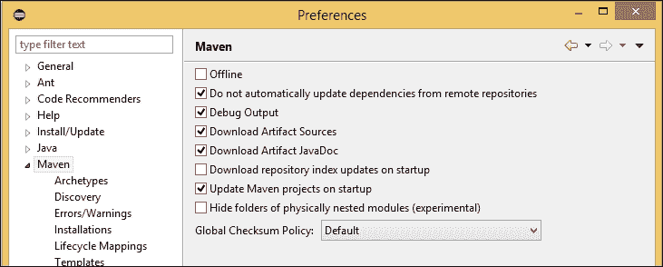
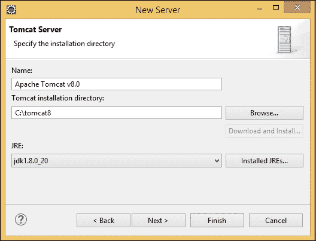
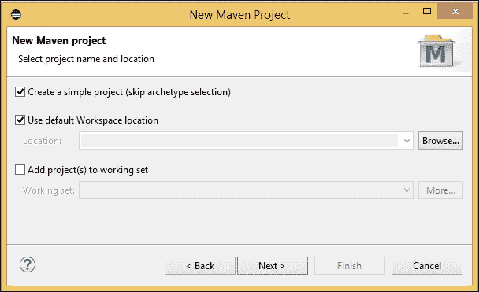
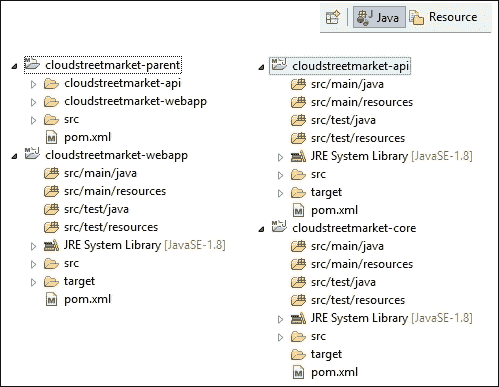
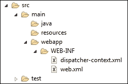
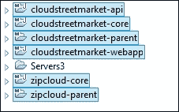
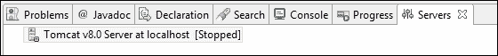
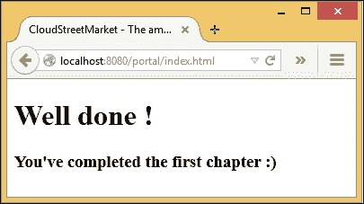

# 第八章：企业 Spring 应用程序的设置例程

本章涵盖的主题对应于这个四步例程：

+   为 JEE 开发人员和 Java SE 8 安装 Eclipse

+   为 Java SE 8、Maven 3 和 Tomcat 8 配置 Eclipse

+   使用 Maven 定义项目结构

+   安装 Spring、Spring MVC 和 Web 结构

# 介绍

在我们深入介绍这个初始化开发的例程之前，我们将回答一些问题，这些问题应该帮助您更好地理解这个例程。

请记住，本章的结果也将构成所有后续章节的最小起点。

### 注意

让我们愉快地做吧！

在本书中，我们将代表 ZipCloud 公司行事。ZipCloud 旨在在社交和金融行业构建不同的产品。我们将建立公司的第一个产品：`cloudstreetmarket.com`，这将是一个具有社交功能的精彩股票交易平台。这个项目必须是这个小 ZipCloud 初创公司的一个最佳开端！

## 为什么要有这样一个例程？

无论您最初的目标是什么，都有必要确保设计不会因早期阶段的失败而受到影响。这个例程应该保护您免受这种风险。

例程本身的理念是分享一种引导方法，以启动您现在需要的项目基础，并支持您未来的需求。这个例程也是驱动您的产品思想走向可持续架构的关键，这种架构将易于重构和维护。

为企业级架构设置新项目不会扼杀兴奋和创造力！

## 为什么要使用 Eclipse IDE？

在这个领域存在竞争，但 Eclipse 在 Java 社区中很受欢迎，因为它是一种活跃的开源解决方案；因此，任何人都可以在网上无限制地访问它。它还提供了对 Web 实现的很好支持，特别是对 MVC Web 实现的支持。

## 为什么要使用 Maven？

**Maven**是一个*软件项目管理和理解工具*。它是一个由 Apache 社区和 Apache 软件基金会支持的开源项目。在近 10 年里，Maven 带来了巨大的好处。它还为 Java 项目塑造了一个标准结构。通过其**项目对象模型**（**POM**）方法，它为任何人，潜在地也为任何第三方软件，提供了一种统一和彻底的方式来理解和构建 Java 项目层次结构及其所有依赖关系。

在早期的架构中，考虑以下决定是至关重要的：

+   打开项目定义，可能适用于不同的开发环境和持续集成工具。

+   监控依赖关系，可能确保它们的访问

+   在项目层次结构内强制使用统一的目录结构

+   使用自测组件构建自测软件

选择 Maven 可以确保这些点，并满足我们项目使项目可重用、安全和可测试（自动化）的需求。

## Spring 框架带来了什么？

Spring 框架及其社区已经为 Java 平台做出了超过十年的贡献。详细介绍整个框架需要我们写的不止一本书。然而，基于**控制反转**（**IOC**）和**依赖注入**（**DI**）原则的核心功能，通过对 bean 存储库的高效访问，允许相当大的可重用性。保持轻量级，它确保了很好的扩展能力，可能适用于所有现代架构。

# 为 JEE 开发人员和 Java SE 8 安装 Eclipse

以下食谱是关于下载和安装 Eclipse IDE for JEE 开发人员以及下载和安装 JDK 8 Oracle Hotspot 的。

## 准备工作

这个第一个步骤可能看起来多余或不必要，与您的教育或经验相关。然而，在整本书中拥有统一的配置将为您带来许多好处。

例如，您肯定会避免未知的错误（集成或开发）。您还将体验到与所呈现的屏幕截图中相同的界面。此外，由于第三方产品是活的，您不会遇到意外的屏幕或窗口。

## 如何做…

总的来说，整个第一章需要逐步合作。从下一章开始，我们将使用 GIT，您的积极参与将会减轻。

1.  下载一个 Eclipse IDE for Java EE developers 的发行版：

+   在本书中，我们将使用 Eclipse Luna 发行版。我们建议您安装此版本，以便完全匹配我们的指南和屏幕截图。从[`www.eclipse.org/downloads/packages/eclipse-ide-java-ee-developers/lunasr1`](https://www.eclipse.org/downloads/packages/eclipse-ide-java-ee-developers/lunasr1)下载 Luna 发行版，选择适合您选择的操作系统和环境。

要下载的产品不是已编译的安装程序，而是一个 zip 存档。

+   如果您对使用另一个版本（更近期）的 Eclipse IDE for Java EE Developers 感到足够自信，所有这些版本都可以在[`www.eclipse.org/downloads`](https://www.eclipse.org/downloads)找到。

### 提示

对于即将进行的安装，在 Windows 上，建议将一些目标位置放在根目录（`C:\`）中。为了避免与权限相关的问题，最好将您的 Windows 用户配置为本地管理员。如果您无法成为此组的一部分，请随意选择您有写访问权限的安装目录。

1.  按照以下步骤将下载的存档解压缩到一个`eclipse`目录中：

+   `C:\Users\{system.username}\eclipse`：如果您使用 Windows，请在此处提取

+   `/home/usr/{system.username}/eclipse`：如果您使用 Linux，请在此处提取

+   `/Users/{system.username}/eclipse`：如果您使用 Mac OS X，请在此处提取

1.  选择并下载 JDK 8：

+   我们建议您下载 Oracle Hotspot JDK。Hotspot 是最初由 Sun Microsystems 开发的高性能 JVM 实现。现在由 Oracle 拥有，Hotspot JRE 和 JDK 可免费下载。

+   然后，通过 Oracle 网站的链接[`www.oracle.com/technetwork/java/javase/downloads/jdk8-downloads-2133151.html`](http://www.oracle.com/technetwork/java/javase/downloads/jdk8-downloads-2133151.html)选择与您的机器相对应的产品。

### 注意

为了避免后期的兼容性问题，请保持与您之前为 Eclipse 存档选择的架构选择（32 位或 64 位）一致。

1.  使用以下说明在您选择的操作系统上安装 JDK 8：

在 Windows 上，这是一个由可执行文件启动的受监控的安装：

1.  执行下载的文件，并等待直到您达到下一个安装步骤

1.  在安装步骤窗口上，注意目标目录并将其更改为`C:\java\jdk1.8.X_XX`（`X_XX`指的是最新的当前版本。在本书中，我们将使用 jdk1.8.0_25。此外，不需要安装外部 JRE，因此取消选中公共 JRE 功能。）

在 Linux/Mac 上，执行以下步骤：

1.  下载与您的环境相对应的`tar.gz`存档

1.  将当前目录更改为您想要安装 Java 的位置。为了更容易的指导，让我们同意使用`/usr/java`目录

1.  将下载的`tar.gz`存档移动到当前目录

1.  使用以下命令解压缩存档，目标是您的存档名称：`tar zxvf jdk-8u25-linux-i586.tar.gz`（此示例适用于与 Linux x86 机器相对应的二进制存档）

您必须最终得到包含`/bin`、`/db`、`/jre`、`/include`子目录的`/usr/java/jdk1.8.0_25`目录结构。

## 工作原理…

在本节中，我们将提供有关我们使用的 Eclipse 版本以及我们选择特定版本的 JVM 的更多见解。

### Java EE 开发人员的 Eclipse

我们已经成功地在这里安装了 Eclipse IDE for Java EE developers。与 Eclipse IDE for Java Developers 相比，这个版本还附带了一些额外的包，如*Java EE Developer Tools*、*Data Tools Platform*和*JavaScript Development Tools*。这个版本因其能够作为 IDE 本身的一部分管理开发服务器、自定义项目要素以及支持 JPA 的能力而受到赞赏。Luna 版本官方上兼容 Java SE 8；这在撰写时是一个决定性因素。

### 选择 JVM

JVM 实现的选择可以根据性能、内存管理、垃圾回收和优化能力进行讨论。

有许多不同的 JVM 实现，包括一些开源解决方案，如 OpenJDK 和 IcedTea（RedHat）。选择 JVM 实际上取决于应用程序的要求。我们根据经验和在生产中部署的参考实现选择了*Oracle Hotspot*；这个 JVM 实现可以信任用于各种通用目的。*Hotspot*在运行 Java UI 应用程序时也表现得非常好。Eclipse 就是其中之一。

### Java SE 8

如果您还没有尝试过 Scala 或 Clojure，现在是时候用 Java 搭上函数式编程的列车了！使用 Java SE 8，*Lambda 表达式*大大减少了代码量，提供了更好的*可读性和可维护性*。我们不会实现这个 Java 8 功能，但由于它可能是最受欢迎的，因此必须强调它对范式变化的巨大贡献。如今，熟悉这些模式是很重要的。

# 为 Java 8、Maven 3 和 Tomcat 8 配置 Eclipse

这个教程涉及配置技术，以便在 Eclipse 上有效地开发 Java、Maven 和 Tomcat。

## 准备工作

安装了不同的产品后，我们需要遵循一些步骤，主要是使 Eclipse 与 Java SE 8、Maven 3 和 Tomcat 8 正常工作。在这个教程中，我们还将看看如何自定义 Eclipse 配置文件（`Eclipse.ini`），以充分利用运行 Java 的平台，并确保它能应对应用程序的任何显著增长。

## 如何做…

让我们来看看在桌面上配置 Eclipse 的以下步骤：

1.  您可以通过在桌面上创建一个指向 Eclipse 可执行文件的快捷方式来开始：

+   在 Windows 上，可执行文件是`Eclipse.exe`，位于`eclipse`目录根目录下。

+   在 Linux/Mac 上，文件名为`Eclipse`，也位于`eclipse`目录根目录下

1.  然后，我们需要自定义`eclipse.ini`文件：

在您之前解压缩 Eclipse 存档的 Eclipse 目录中，您可以找到`eclipse.ini`文件。*这是一个文本文件，包含一些命令行选项，以控制 Eclipse 的启动*。

+   Eclipse 社区建议在这里指定我们的 JVM 的路径。因此，根据您的系统，在文件顶部添加以下两行：

对于 Windows，添加以下内容：

```java

-vm 
C:\java\jdk1.8.0_25\jre\bin\server\jvm.dll

```

对于 Linux/Mac，添加以下内容：

```java

-vm 
/usr/java/jdk1.8.0_25/jre/lib/{your.architecture}/server/libjvm.so

```

以下是一个可选的设置，您可以考虑：

+   如果您的开发机器至少有 2GB 的 RAM，您可以输入以下选项，使 Eclipse 比默认设置更快运行。*此部分是可选的，因为 Eclipse 的默认设置已经经过优化，适合大多数用户的环境*：

```java

-vmargs
-Xms128m
-Xmx512m
-Xverify:none
-Dosgi.requiredJavaVersion=1.6
-XX:MaxGCPauseMillis=10
-XX:MaxHeapFreeRatio=70
-XX:+UseConcMarkSweepGC
-XX:+CMSIncrementalMode
-XX:+CMSIncrementalPacing

```

如果您的机器 RAM 少于 2GB，您仍然可以输入这组选项，而不会覆盖默认的`-Xms`和`-Xmx`参数。

### 提示

在`-vmargs`下的所有选项都是在启动时传递给 JVM 的参数。重要的是不要混淆 Eclipse 选项（文件的顶部部分）和 VM 参数（文件的底部部分）。

1.  之后，我们将按照以下步骤启动 Eclipse 并设置工作区：

启动步骤*2*中描述的可执行文件。

+   对于我们的项目，指定路径：`<home-directory>/workspace`

这个路径对于每个操作系统都是不同的：

+   `C:\Users\{system.username}\workspace`：这是 Windows 上的路径

+   `/home/usr/{system.username}/workspace`：这是在 Linux 上

+   `/Users/{system.username}/workspace`：这是在 Mac OS 上

+   单击**确定**，让 Eclipse 程序启动

### 注意

工作区是您管理 Java 项目的地方。它可以特定于一个应用程序，但不一定是。

1.  然后，我们需要检查 JRE 定义：

在 Eclipse 中，需要验证一些设置：

1.  在**窗口**下打开**首选项**菜单（在 Mac OS X 上，**首选项**菜单在**Eclipse**菜单下）。

1.  在左侧的导航面板中，打开 Java 层次结构，然后单击**Java**下的**已安装的 JRE**。

1.  在中央屏幕上，删除您可能已经拥有的任何现有 JRE。

1.  单击**添加...**按钮添加标准 JVM。

1.  输入`C:\java\jdk1.8.0_25`（或`/usr/java/...`）作为**JRE 主目录**。

1.  并输入`jdk1.8.0_25`作为**JRE 名称**。

### 注意

我们告诉 Eclipse 使用 JDK 8 的 Java 运行时环境。

完成这些步骤后，您应该得到以下配置：


1.  现在，我们将检查编译器兼容性级别：

1.  在导航面板中，单击**Java**下的**编译器**。

1.  检查下拉列表中的**编译器兼容性级别**是否设置为**1.8**。

1.  之后，我们需要检查 Maven 配置：

1.  仍然在**首选项**菜单的导航面板中，打开 Maven 层次结构，然后导航到**Maven** | **安装**。

1.  我们将在这里指定我们计划使用的 Maven 安装。对于本书的目的，嵌入式 Maven 将是完美的。

1.  返回到导航面板，转到**Maven** | **用户设置**。

1.  将本地存储库设置为`<home-directory>/.m2/repository`。

### 注意

在本地存储库中，我们将保存所需工件的本地缓存版本。这将防止我们的环境在每次构建时都需要下载它们。

1.  对于**用户设置**字段，在`.m2`目录中创建一个`settings.xml`文件：`<home-directory>/.m2/settings.xml`。

1.  编辑`settings.xml`文件并添加以下块：

（您还可以从`chapter_1/source_code/.m2`目录中复制/粘贴）：

```java
<settings  
  xsi:schemaLocation="http://maven.apache.org/SETTINGS/1.1.0 http://maven.apache.org/xsd/settings-1.1.0.xsd">
  <profiles>
    <profile>
      <id>compiler</id>
        <properties>
          <JAVA_HOME>C:\java\jdk1.8.0_25</JAVA_HOME>
        </properties>
    </profile>
  </profiles>
  <activeProfiles>
  <activeProfile>compiler</activeProfile>
  </activeProfiles>
</settings>
```

### 提示

如果您不是 Windows 机器，请将此文件中的`JAVA_HOME`更改为您的 JDK 安装目录（`/usr/java/jdk1.8.0_25`）。

1.  返回到导航面板，单击**Maven**。按照此截图中给出的配置进行操作：

1.  单击**确定**以保存这些配置更改。

1.  现在我们将在 Eclipse IDE 中安装 Tomcat 8。为此，请按照以下步骤进行：

1.  从 Tomcat 网站下载最新的 Tomcat8 核心版本的 ZIP 存档：[`tomcat.apache.org/download-80.cgi`](http://tomcat.apache.org/download-80.cgi)。

1.  将下载的存档解压缩到以下目录：

+   在 Windows 上，将存档解压缩到`C:\tomcat8`

+   在 Linux 上，将存档解压缩到`/home/usr/{system.username}/tomcat8`

+   在 Mac OS X 上，将存档解压缩到`/Users/{system.username}/tomcat8`

### 注意

根据您的系统，您必须能够从层次结构中访问 bin 目录：`C:\tomcat8\bin, /home/usr/{system.username}/tomcat8/bin 或 /Users/{system.username}/tomcat8/bin`。

1.  在 Eclipse 中，选择**窗口**下的**首选项**菜单，然后在左侧的导航面板中，打开**服务器**层次结构，然后选择**运行时环境**。

1.  在中央窗口中，单击**添加...**按钮。

1.  在下一步（**新服务器**环境窗口）中，导航到**Apache** | **Apache Tomcat v8.0**。

1.  还要检查此选项：**创建新的本地服务器**。

1.  单击**下一步**按钮。

1.  按照以下截图中显示的窗口中的详细信息填写：



### 注意

如果您使用 Linux（或 Mac OS X），请用您的 Tomcat 安装目录替换`C:\tomcat8`。

## 工作原理...

在本节中，我们将回顾这个食谱带我们经历的不同元素和概念。

### eclipse.ini 文件

正如我们已经看到的，`eclipse.ini`文件控制 Eclipse 的启动。它是使 Eclipse 平台非常可配置的额外组件。您可以在他们的文档中找到可以在命令行中使用的命令行参数列表

[`help.eclipse.org/luna/topic/org.eclipse.platform.doc.isv/reference/misc/runtime-options.html`](http://help.eclipse.org/luna/topic/org.eclipse.platform.doc.isv/reference/misc/runtime-options.html)

重要的是要注意文档中提到的以下警告：

+   在`-vmargs`之后的所有行都作为参数传递给 JVM；所有 Eclipse 的参数和选项都必须在`-vmargs`之前指定（就像在命令行上使用参数时一样）

### 注意

这解释了为什么我们在文件顶部插入了`–vm`选项。

+   在命令行上使用`-vmargs`会替换`.ini`文件中所有`-vmargs`的设置，除非在`.ini`文件中或在命令行上指定了`--launcher.appendVmargs`

### 设置`-vm`选项

设置`-vm`选项可以确保 Eclipse 作为程序运行的 JVM 实现。您可能已经注意到，我们已经将 JVM 作为库(`*.dll / *.so`)。它在启动时具有更好的性能，并且还将程序进程标识为 Eclipse 可执行文件，而不仅仅是 Java 可执行文件。

如果您想知道当未设置`–vm`选项时 Eclipse 使用哪个 JVM，请注意 Eclipse *不会*查看`JAVA_HOME`环境变量。（Eclipse wiki）。

相反，Eclipse 执行解析您的路径环境变量的 Java 命令。

### 自定义 JVM 参数

建议的 JVM 参数列表来自 Piotr Gabryanczyk 关于 Java 内存管理模型的工作。最初，对于 JetBRAINS IntelliJ 设置，这个配置对 Eclipse 环境也很有用。它有助于以下任务：

+   防止垃圾收集器暂停应用程序超过 10 毫秒(`-XX:MaxGCPauseMillis=10`)

+   将垃圾收集器开始的级别降低到占用内存的 30%（`-XX:MaxHeapFreeRatio=70`）

+   强制垃圾收集器作为并行线程运行，降低其对应用程序的干扰（`-XX:+UseConcMarkSweepGC`）

+   选择垃圾收集器的增量调整模式，生成 GC 作业中断，以便应用程序可以停止冻结(`–XX:+CMSIncrementalPacing`)

程序生命周期中实例化的对象存储在堆内存中。建议的参数定义了 JVM 启动堆空间为 128 mb（`-Xms`），总体上限为 512 mb（`–Xmx`）。堆分为两个子空间，如下所示：

+   **年轻代**: 新对象存储在这个区域。对于领先的 Hotspot 或 OpenJDK JVM，年轻内存空间分为两部分：

+   `伊甸园`: 新对象存储在这个分区中。寿命短的对象将从这里被释放。

+   `幸存者`: 这是年轻代和老年代之间的缓冲区。幸存者空间比伊甸园小，也分为两部分（`FROM`和`TO`区域）。您可以使用`-XX:SurvivorRatio`调整`伊甸园`和`幸存者`对象之间的比例（这里，`-XX: SurvivorRatio=10`表示`YOUNG = 12`，`EDEN = 10`，`FROM = 1`和`TO =1`）。

### 提示

年轻区的最小大小可以使用`-XX:NewSize`进行调整。最大大小可以使用`-XX:MaxNewSize`进行调整。

+   老一代：当`Eden`或`Survivor`空间中的对象在足够多的垃圾收集后仍然被引用时，它们会被移动到这里。可以使用`-XX:NewRatio`设置`Young`区域大小作为`Old`区域大小的比例。（也就是说，`-XX:NewRatio=2`表示`HEAP = 3，YOUNG = 1`和`OLD =2`）。

### 提示

新一代空间的最大大小`-XX:MaxNewSize`必须始终小于堆空间的一半（`-Xmx/2`），因为垃圾收集器可能会将所有`Young`空间移动到`Old`空间。

使用 Hotspot 或 OpenJDK，永久代空间用于存储与类的定义相关的信息（结构、字段、方法等）。当加载的结构变得太大时，您可能已经遇到过`PermGen space OutOfMemoryError`异常。在这种情况下，解决方案是增加`-XX:MaxPermSize`参数。*在 JDK8 中不再需要*。

为此，**Permanent Generation**（**PermGen**）空间已被一个不属于堆而属于本机内存的元数据空间所取代。这个空间的默认最大大小是无限的。然而，我们仍然可以使用`-XX:MetaspaceSize`或`-XX:MaxMetaspaceSize`来限制它。

### 更改 JDK 兼容级别

降低兼容级别允许我们运行一个比 JDK 本身识别的更低版本的 Java 编译器。它会影响 Eclipse 的构建、错误和警告，以及 JavaDocs。显然，不能设置比编译器的本机版本更高的编译版本。

### 配置 Maven

在 Eclipse 中，大部分的 Maven 配置来自`m2eclipse`插件（也称为 Eclipse 的 Maven 集成）。这个插件默认包含在 Eclipse Luna 中，因此不需要手动下载。在我们经历的 Maven 配置之后，m2eclipse 也非常有助于从 IDE 上下文触发 Maven 操作，并提供帮助来创建 Java Maven 项目。您将在下一节中了解更多关于 m2eclipse 的内容。

然后我们安装了一个基本的`settings.xml`文件。这个文件用于配置 Maven，而不直接绑定到任何项目。`settings.xml`最常见的用途可能是配置文件和凭据存储以访问存储库管理器。

使用 Maven 配置文件，您可以为特定环境运行构建，并匹配特定配置（变量值、依赖项集等）。Maven 配置文件可以相互叠加。它们可以通过命令行、在 Maven 设置中声明，或者通过环境配置（例如文件在文件系统上存在或缺失、使用的 JDK 等）来激活。

### 提示

在我们的`settings.xml`文件中，我们已经定义了一个具有自己`JAVA_HOME`属性的编译器配置文件。编译器配置文件默认激活，以在`<activeProfiles>`部分中声明定义。Maven 在查找系统变量之前将查阅`settings.xml`文件。

### 存储库管理器

存储库管理器是一个第三方应用程序，管理开发应用程序可能需要的所有必需的二进制文件和依赖项。作为开发环境和公共存储库之间的缓冲代理，存储库管理器提供了对关键参数的控制，如构建时间、依赖项的可用性、可见性和访问限制等。

著名的解决方案包括*Apache Archiva*，*Artifactory*，*Sonatype Nexus*。在我们的应用程序环境中，我们不会使用存储库管理器。

### Eclipse 中的 Tomcat 8

Eclipse for JEE 开发人员允许在开发环境中集成 Tomcat 与其他应用服务器。这是通过提供的**Web 工具平台**（**WTP**）插件实现的，可以管理 Web 工件、它们的编译和部署到 Web 服务器。

在`服务器`选项卡（之前可见），双击创建的 Tomcat v8.0 服务器，打开一个配置窗口，并启用设置通常在`tomcat8\conf`目录中的`server.xml` Tomcat 文件中定义的参数的可能性。

默认情况下，WTP 会抽象出这个配置，不会影响真正的`server.xml`文件。这种行为可以通过在**服务器配置**窗口中激活**将模块上下文发布到单独的 XML 文件**选项来更改。

## 还有更多...

+   在[`wiki.eclipse.org/Eclipse/Installation`](http://wiki.eclipse.org/Eclipse/Installation)了解更多关于 Eclipse 安装的信息

+   在`Eclipse.ini`文件中了解更多信息，请访问[`wiki.eclipse.org/Eclipse.ini`](http://wiki.eclipse.org/Eclipse.ini)

+   了解有关 m2eclipse 插件的更多信息，请访问[`maven.apache.org/plugins/maven-eclipse-plugin/`](https://maven.apache.org/plugins/maven-eclipse-plugin/)

+   要了解如何使用存储库管理器，请参阅[`maven.apache.org/repository-management.html`](http://maven.apache.org/repository-management.html)

+   关于 IDE 的垃圾收集优化的 Piotr Gabryanczyk 文章可以在[`piotrga.wordpress.com/2006/12/12/intellij-and-garbage-collection`](http://piotrga.wordpress.com/2006/12/12/intellij-and-garbage-collection)找到

+   您可以在[`pubs.vmware.com/vfabric52/topic/com.vmware.vfabric.em4j.1.2/em4j/conf-heap-management.html`](http://pubs.vmware.com/vfabric52/topic/com.vmware.vfabric.em4j.1.2/em4j/conf-heap-management.html)和[`blog.codecentric.de/en/2012/08/useful-jvm-flags-part-5-young-generation-garbage-collection`](https://blog.codecentric.de/en/2012/08/useful-jvm-flags-part-5-young-generation-garbage-collection)了解更多关于内存优化的信息

# 使用 Maven 定义项目结构

在这个教程中，我们将专注于使用 Maven 定义我们应用程序所需的项目结构。

## 准备工作

我们将首先创建两个 Eclipse 项目：一个用于应用程序，一个用于 ZipCloud 作为公司以后可能与其他项目共享的组件。看一下下面的图片，它展示了我们将要构建的项目组件：


应用程序项目**cloudstreetmarket-parent**将有三个模块。其中两个将被打包为 Web 存档（**war**）：主 Web 应用程序和 REST API。其中一个将被打包为**jar**依赖项（cloudstreetmarket-core）。

公司特定项目**zipcloud-parent**将只有一个子模块—**zipcloud-core**，它将被打包为**jar**。

## 如何做...

以下步骤将帮助我们创建一个 Maven 父项目：

1.  从 Eclipse 导航到**文件** | **新建** | **其他**。

1.  **新建**向导打开，您可以在其中选择层次结构内的项目类型。然后，打开**Maven**类别，选择**Maven 项目**，然后点击**下一步**。

新的 Maven 项目向导打开，如下截图所示：



1.  确保选中**创建一个简单的项目**选项。点击**下一步**。

1.  按照以下向导填写下一个向导：

+   `edu.zipcloud.cloudstreetmarket`作为**Group Id**

+   `cloudstreetmarket-parent`作为**Artifact Id**

+   `0.0.1-SNAPSHOT`作为**版本**

+   `pom`作为**包装**

+   `CloudStreetMarket Parent`作为**名称**

+   然后，点击**完成**按钮

父项目必须出现在仪表板左侧的包资源管理器中。


现在我们必须告诉 m2eclipse 你计划在这个项目中使用哪个 Java 编译器版本，以便它自动向我们即将创建的子模块添加正确的 JRE 系统库。这是通过`pom.xml`文件完成的。

1.  编辑`pom.xml`文件以指定 Java 编译器版本：

+   双击**pom.xml**文件。**m2eclipse** **概述**选项卡默认显示。您必须点击最后一个选项卡**pom.xml**才能访问完整的 XML 定义。

+   在此定义中，在**<project>**节点的末尾添加以下块。(*您也可以从* `chapter_1` *源代码的* `cloudstreetmarket-parent` *的* `pom.xml` *中复制/粘贴这段代码):*

```java
<build>
  <plugins>
    <plugin>
      <groupId>org.apache.maven.plugins</groupId>
      <artifactId>maven-compiler-plugin</artifactId>
      <version>3.1</version>
      <configuration>
          <source>1.8</source>
          <target>1.8</target>
          <verbose>true</verbose>
          <fork>true</fork>
          <executable>${JAVA_HOME}/bin/javac</executable>
          <compilerVersion>1.8</compilerVersion>
      </configuration>
    </plugin>
    <plugin>
      <groupId>org.apache.maven.plugins</groupId>
      <artifactId>maven-surefire-plugin</artifactId>
      <version>2.4.2</version>
      <configuration>
        <jvm>${JAVA_HOME}/bin/java</jvm>
        <forkMode>once</forkMode>
       </configuration>
    </plugin>
  </plugins>
</build>
```

### 注意

您可能已经注意到了**maven-surefire-plugin**的声明。我们很快将对其进行审查；它允许我们在构建过程中运行单元测试。

1.  现在，我们将创建子模块：

作为父项目的子模块，我们已经看到我们需要一个 Web 模块来处理和渲染网站的屏幕，一个用于 REST API 的 Web 模块，以及另一个模块，用于打包所有与第一个产品`cloudstreetmarket.com`相关的业务逻辑（服务，数据访问等）：

1.  从 Eclipse 的主 Webapp 模块中，导航到**文件** | **新建** | **其他**。一个**新建**向导会打开，您可以在其中选择层次结构中的项目类型。打开**Maven**类别，选择**Maven 模块**，然后点击**下一步**。

1.  在此之后，**新建 Maven 模块**向导打开，填写如下：

勾选创建一个简单的项目。

输入`cloudstreetmarket-webapp`作为**Module Name**。

输入`cloudstreetmarket-parent`作为**Parent project**。


1.  点击**下一步**按钮后，下一步将显示。在新窗口中输入以下条目：

输入`edu.zipcloud.cloudstreetmarket`作为**Group Id**。

输入`0.0.1-SNAPSHOT`作为**Version**。

将**war**作为**Packaging**选择。

输入`CloudStreetMarket Webapp`作为**Name**。

然后点击**完成**按钮。

1.  现在我们将继续创建 REST API 模块：

我们将使用不同的参数重复上述操作。

1.  从 Eclipse 中导航到**文件** | **新建** | **其他**。当您这样做时，选择向导会弹出。在此之后，打开**Maven**类别，选择**Maven 模块**，然后点击**下一步**：

1.  在**新建 Maven 模块**向导中，输入以下条目：

勾选**创建一个简单的项目**选项。

输入`cloudstreetmarket-api`作为**Module Name**。

输入`cloudstreetmarket-parent`作为**Parent project**。

1.  点击**下一步**按钮进入下一步。在该窗口中输入以下条目：

输入`edu.zipcloud.cloudstreetmarket`作为**Group Id**。

输入`0.0.1-SNAPSHOT`作为**Version**。

将**war**作为**Packaging**选择。

输入`CloudStreetMarket API`作为**Name**。

然后点击完成按钮。

1.  现在，我们将创建核心模块：

为此，导航到**文件** | **新建** | **其他**。当您这样做时，选择向导会弹出。打开**Maven**类别，选择**Maven 模块**，然后点击**下一步**。

1.  在**新建 Maven 模块**向导中，输入以下条目：

勾选**创建一个简单的项目**选项。

输入`cloudstreetmarket-core`作为**Module Name**。

输入`cloudstreetmarket-parent`作为**Parent project**。

1.  点击**下一步**按钮进入下一步。填写以下字段：

输入`edu.zipcloud.cloudstreetmarket`作为**Group Id**。

输入`0.0.1-SNAPSHOT`作为**Version**。

这次，将**jar**作为**Packaging**选择。

输入`CloudStreetMarket Core`作为**Name**。

然后点击完成按钮。

如果您已激活了 Java 透视图（在右上角），您应该看到整体创建的结构与此处的屏幕截图匹配：



1.  现在，我们将创建一个特定于公司的项目及其模块：

假设以后公司业务项目将包含许多不同类别的依赖项（核心，消息传递，报告等...）。

1.  我们需要一个父项目，因此从 Eclipse 中导航到**文件** | **新建** | **其他**。选择向导弹出。打开 Maven 类别，选择 Maven 项目，然后点击下一步。

1.  在新 Maven 项目向导的第一步中，对于我们之前创建的父项目，只需选中**创建简单项目**和**使用默认工作区位置**选项。

1.  单击**下一步**按钮，并填写下一个向导如下：

输入`edu.zipcloud`作为**Group Id**。

输入`zipcloud-parent`作为**Artifact Id**。

输入`0.0.1-SNAPSHOT`作为**版本**。

选择**pom**作为**打包**。

输入`ZipCloud Factory Business Parent`作为**名称**。

同样，在创建的`pom.xml`文件中，在`<project>`节点内添加以下块，以正确创建基础模块并启用自动测试执行。 (*您还可以从第一章源代码的 zipcloud-parent 的 pom.xml 文件中复制/粘贴此代码段*):

```java
<build>
  <plugins>
    <plugin>
    <groupId>org.apache.maven.plugins</groupId>
      <artifactId>maven-compiler-plugin</artifactId>
      <version>3.1</version>
      <configuration>
        <source>1.8</source>
        <target>1.8</target>
          <verbose>true</verbose>
          <fork>true</fork>
        <executable>${JAVA_HOME}/bin/javac</executable>
      <compilerVersion>1.8</compilerVersion>
      </configuration>
    </plugin>
    <plugin>
    <groupId>org.apache.maven.plugins</groupId>
      <artifactId>maven-surefire-plugin</artifactId>
        <version>2.4.2</version>
        <configuration>
        <jvm>${JAVA_HOME}/bin/java</jvm>
        <forkMode>once</forkMode>
      </configuration>
    </plugin>
  </plugins>
</build>
```

现在，我们将创建一个公司业务核心模块，它将是我们刚刚创建的父项目的子模块。

为此，请导航至**文件** | **新建** | **其他**。 选择向导弹出。 打开**Maven**类别，选择**Maven 模块**，然后单击**下一步**。

1.  在**新 Maven 模块**向导中，输入以下详细信息：

检查**创建简单项目**选项。

输入`zipcloud-core`作为**模块名称**。

输入`zipcloud-parent`作为**父项目**。

1.  单击**下一步**按钮，进入下一步。 在这里，输入以下详细信息：

输入`edu.zipcloud`作为**Group Id**。

输入`0.0.1-SNAPSHOT`作为**版本**。

选择**jar**作为**打包**。

选择`ZipCloud Factory Core Business`作为**名称**。

1.  现在，构建这两个项目：

如果结构正确，以下 Maven 命令可以成功运行：

```java

mvn clean install

```

### 提示

如果在开发机器上安装了 Maven，则可以在终端中启动此命令。

在我们的研究案例中，我们现在将使用 m2eclipse 修改后的**Run As**菜单进行启动：右键单击 zipcloud-parent 项目，然后单击**Run As** | **Maven Clean**。

### 注意

在 Maven 控制台中，您现在应该在底部看到这一行：

[INFO] BUILD SUCCESS

现在，重复安装构建阶段的操作。 您现在应该在控制台中看到以下输出：

```java

[INFO] ZipCloud Parent .......................SUCCESS [  0.313 s]
[INFO] ZipCloud Core .........................SUCCESS [  1.100 s]
[INFO] ----------------------------------------------------------
[INFO] BUILD SUCCESS
[INFO] ----------------------------------------------------------

```

好的，现在您应该能够构建`cloudstreetmarket-parent`。

为此，请右键单击**cloudstreetmarket-parent**项目，然后单击**Run As** | **Maven Clean**。 在此步骤之后，Maven 控制台应打印以下内容：

```java

[INFO] BUILD SUCCESS

```

再次右键单击**cloudstreetmarket-parent**项目，然后单击**Run As** | **Maven Install**。 Maven 控制台现在应该打印以下内容：

```java

[INFO] CloudStreetMarket Parent ..............SUCCESS [  0.313 s]
[INFO] CloudStreetMarket Webapp ..............SUCCESS [  6.129 s]
[INFO] CloudStreetMarket Core ................SUCCESS [  0.922 s]
[INFO] CloudStreetMarket API .................SUCCESS [  7.163 s]
[INFO] ----------------------------------------------------------
[INFO] BUILD SUCCESS
[INFO] ----------------------------------------------------------

```

向上滚动一点应该显示以下跟踪：

```java

-------------------------------------------------------
 T E S T S
-------------------------------------------------------
There are no tests to run.
Results :
Tests run: 0, Failures: 0, Errors: 0, Skipped: 0

```

### 注意

在这里，Maven 借助我们手动添加的 maven-surefire-plugin 解析`src/test/java`目录中遇到的所有类。 再次，此路径可以自定义。

在检测到的测试类中，Maven 还将运行使用 JUnit `@Test`注解标记的方法。 项目中需要 JUnit 依赖项。

## 它是如何工作的...

在本节中，我们将介绍有关 Maven 的许多概念，以便您更好地理解其标准。

### 新的 Maven 项目，新的 Maven 模块

我们刚刚经历的项目创建屏幕也来自 m2eclipse 插件。 这些屏幕用于使用预配置的`pom.xml`文件和标准目录结构初始化 Java 项目。

m2eclipse 插件还提供了一组快捷方式来运行 Maven 构建阶段以及一些方便的选项卡（已经看到）来管理项目依赖关系并可视化`pom.xml`配置。

### 标准项目层次结构

浏览创建的项目，您应该能够注意到以下目录的重复层次结构：`src/main/java`，`src/main/resource`，`src/test/java`和`src/test/resource`。 这种结构是 Maven 引导我们的默认结构。 *这种模型现在已经成为标准*。 但是，我们仍然可以覆盖它（在`pom.xml`文件中）并创建我们自己的层次结构。

如果您还记得在父项目的`pom.xml`文件中添加的**maven-compiler-plugin**定义，我们使用了以下四行代码：

```java
<verbose>true</verbose>
<fork>true</fork>
<executable>${JAVA_HOME}/bin/javac</executable>
<compilerVersion>1.8</compilerVersion>
```

这些行允许 Maven 使用外部 JDK 进行编译。最好能够控制 Maven 使用的编译器，特别是在管理不同环境时。

还有以下两行可能看起来过于配置：

```java
<source>1.8</source>
<target>1.8</target>
```

从严格的 Maven 观点来看，当使用指定的 compilerVersion 定义外部 JDK 时，这些行是可选的。最初，通过这两行，我们可以控制默认代码要在哪个 Java 版本中编译。在维护旧系统时，现有代码可能仍然在以前的 Java 版本中编译。

实际上，m2eclipse 特别希望这两行存在，以便将`JRE System Library [JavaSE-1.8]`添加到`jar`和`war`模块的构建路径中。现在，有了这些行，Eclipse 以与 Maven 相同的方式编译这些项目：在 Java SE 8 中。

### 提示

如果此依赖项仍显示为不同版本的 Java，您可能需要右键单击模块，然后导航到**Maven** | **Update Project**。

### IDE 中的项目结构

关于 Eclipse 项目层次结构中的父项目；您是否注意到创建的子模块似乎重复出现为独立项目和父项目的直接子项目？这是因为 Eclipse 目前在 Luna 中尚未处理项目层次结构。因此，模块显示为分开的项目。这可能会有点令人困惑，因为源代码似乎位于父项目旁边。*实际上并非如此，这只是它们呈现的方式，因此我们可以像通常绑定到项目级别一样拥有所有工具*。

### 注意

此时，JetBRAINS IntelliJ IDEA 已经支持项目的可视化层次结构。

最后，如果您打开父项目的`pom.xml`文件，您应该看到`<modules>`节点中填充了创建的子模块。这也是 m2eclipse 自动完成的。我们建议您密切关注此功能，因为根据您如何更改项目层次结构，m2eclipse 并不总是更新这些`<modules>`节点。

### Maven 的构建生命周期

Maven 中的构建生命周期是一组预定义操作（称为阶段）的特定顺序。Maven 中存在三个生命周期：默认、清理和站点。

让我们看看包括默认和清理生命周期的所有阶段（可能是开发人员最常用的生命周期）。

#### 清理生命周期

Maven 的**clean**阶段起着核心作用。它从 Maven 的角度重置项目构建。通常是删除 Maven 在构建过程中创建的目标目录。以下是**clean**生命周期中包含的一些阶段的详细信息。这些详细信息来自 Maven 文档：

| 阶段 | 描述 |
| --- | --- |
| `pre-clean` | 在实际项目清理之前执行必要的进程 |
| `clean` | 删除上一次构建生成的所有文件 |
| `post-clean` | 这执行需要完成项目清理的进程 |

#### 默认生命周期

在默认生命周期中，您可以找到处理源代码生成、编译、资源处理、测试、集成测试和构件部署的最有趣的构建阶段。以下是默认生命周期中包含的一些阶段的详细信息：

| 阶段 | 描述 |
| --- | --- |
| `validate` | 验证项目是否正确，是否有所有必要的信息可用。 |
| `initialize` | 这初始化构建状态，例如设置属性或创建目录。 |
| `generate-sources` | 生成要包含在编译中的源代码。 |
| `process-sources` | 处理源代码，例如过滤任何值。 |
| `generate-resources` | 这将生成要包含在包中的资源。 |
| `process-resources` | 这将资源复制并处理到目标目录，准备打包。 |
| `compile` | 这将编译项目的源代码。 |
| `process-classes` | 这将处理编译生成的文件，例如对 Java 类进行字节码增强。 |
| `generate-test-sources` | 这将生成任何要包含在编译中的测试源代码。 |
| `process-test-sources` | 这将处理测试源代码，例如过滤任何值。 |
| `generate-test-resources` | 这将创建用于测试的资源。 |
| `process-test-resources` | 这将资源复制并处理到测试目标目录中。 |
| `test-compile` | 这将测试源代码编译到测试目标目录中。 |
| `process-test-classes` | 这个过程处理来自测试编译的生成文件，例如对 Java 类进行字节码增强。适用于 Maven 2.0.5 及以上版本。 |
| `test` | 这将使用适当的单元测试框架运行测试。这些测试不应该需要代码打包或部署。 |
| `prepare-package` | 这将在实际打包之前执行必要的操作以准备包。这通常会导致包的未打包、处理版本。（Maven 2.1 及以上） |
| `package` | 这将编译后的代码打包成可分发的格式，比如 JAR。 |
| `pre-integration-test` | 这将在执行集成测试之前执行所需的操作。这可能涉及设置所需的环境。 |
| `integration-test` | 这将处理并部署包（如果需要）到可以运行集成测试的环境中。 |
| `post-integration-test` | 这在集成测试执行后执行所需的操作。这可能包括清理环境。 |
| `verify` | 这将运行检查以验证包是否有效并符合质量标准。 |
| `install` | 这将包安装到本地存储库中，以便在其他项目中作为依赖项使用。 |
| `deploy` | 这将把最终的包复制到远程存储库，与其他开发人员和项目共享（在集成或发布环境中完成）。 |

#### 插件目标

有了插件的概念，Maven 获得了更广泛的维度。Maven 本身提供了内置插件，但外部插件可以像其他依赖项一样引入（通过 groupIds 和 artefactIds 标识）。

每个构建阶段可以附加到零个、一个或多个插件目标。一个目标代表一个具体的任务，负责以某种方式构建或处理项目。一些阶段通过本机插件默认绑定了目标。

#### 内置生命周期绑定

现在我们已经看到了两个生命周期中每个阶段的目的，我们必须说，默认生命周期取决于我们选择的模块打包类型，只有一些阶段可能会潜在地被激活以执行目标。

让我们看看对于不同的打包类型，我们在默认生命周期中跳过了哪些阶段：

|   | 默认生命周期 |
| --- | --- |
| 打包类型 | jar/war/ejb/ejb3/rar | ear | maven-plugin | pom |
| --- | --- | --- | --- | --- |
| 激活的阶段 |   | generate-resources | generate-resources |   |
| process-resources | process-resources | process-resources |   |
| compile |   | compile |   |
| process-test-resources |   | process-test-resources |   |
| test-compile |   | test-compile |   |
| test |   | test |   |
| package | package | package | package |
| install | install | install | install |
| deploy | deploy | deploy | deploy |

### 提示

在第九章中，*测试和故障排除*，我们将实际将外部插件目标绑定到识别的构建阶段。

总之，在`jar`打包的模块上调用：mvn clean install 将导致执行以下阶段：clean，process-resources，compile，process-test-resources，test-compile，test，package 和 install。

#### 关于 Maven 命令

当告诉 Maven 执行一个或多个针对特定项目的`pom.xml`文件的阶段时，它将为每个模块执行请求的阶段。

然后，对于每个单独请求的阶段，Maven 将执行以下操作：

+   识别阶段所属的生命周期

+   查找当前模块的打包，并识别正确的生命周期绑定

+   执行在已识别的生命周期绑定的层次结构中位于请求阶段之前的所有阶段

### 注意

通过执行所有阶段，我们指的是执行所有检测到的和附加的插件目标（本地插件或非本地插件）。

总之，在`jar`打包的模块上调用`mvn clean install`将执行以下阶段：`clean`，`process-resources`，`compile`，`process-test-resources`，`test-compile`，`test`，`package`和`install`。

## 还有更多...

您可能想知道为什么我们要针对我们的应用程序创建这些项目和模块。

### 我们是如何选择 jar 模块的名称的？

关于 Maven 结构，非部署模块的最佳名称通常强调功能目的、业务创建的特定概念，或者由产品驱动（cloudstreetmarket-chat、cloudstreetmarket-reporting、cloudstreetmarket-user-management 等）。这种策略使得依赖管理更容易，因为我们可以推断一个新模块是否需要另一个模块。在宏观层面考虑控制器、服务和 DAO 层在这个阶段并不是很有意义，这可能会导致设计干扰或循环依赖。这些技术子组件（服务、DAO 等）将作为 Java 包存在或不存在，根据每个功能模块的需要，但不作为 JAR 包依赖。

### 我们是如何选择可部署模块的名称的？

选择可部署模块（`war`）的名称与选择 JAR 打包模块的名称有些不同。可部署的存档必须被视为可扩展和潜在负载平衡。可以合理地假设将针对应用程序检索 HTML 内容的请求可以与将返回 REST 内容的请求区分开来。

基于这一假设，在我们的情况下，我们希望将`war`拆分为两个。这样做可能会引发一个问题，即*web 会话*在两个 web 应用程序之间如何维护。我们将在稍后回答这一点。

### 我们为什么创建核心模块？

首先，我们创建了核心模块，因为可以肯定，在`cloudstreetmarket`应用程序和公司共享项目中，我们将拥有 POJOs、异常、常量、枚举和一些服务，这些服务将被几乎所有模块或应用程序水平使用。如果一个概念是特定于创建的功能模块，它就不应该是核心模块的一部分。

因此，*从大粒度开始*，*稍后再细化*可能更好，而不是考虑可能以不同方式实现甚至根本不实现的模块。在我们的情况下，我们是一家初创公司，可以说我们将要实现的 5 到 10 个功能可能构成这个应用程序的核心业务。

## 另请参阅...

+   我们还建议安装**代码样式格式化程序**。从**保存事件**触发，有了这些格式化程序，我们可以自动地使用统一的预定义重新排列我们的代码。在团队中拥有这样的格式化程序是非常受欢迎的，因为它可以保证在比较两个文件时具有相同的渲染。

# 安装 Spring、Spring MVC 和 Web 结构

在这个配方中，我们将使用继承为我们的`pom.xml`文件添加第三方依赖项。我们将加载`Spring 应用上下文`并创建我们应用的第一个控制器。最后，我们将在 Tomcat 中部署和启动 web 应用。

## 准备工作

现在我们已经准备好 Eclipse 并且正确配置了 Maven，接下来就可以开始了。我们需要在我们的`pom.xml`文件中指定所有必要的 Spring 依赖项，并且需要设置 Spring 以便为每个模块加载和检索其上下文。

我们还需要组织和可选地公开 web 资源，比如 JSP、JavaScript 文件、CSS 文件等。如果你完成了这个配置，我们应该得到一个由 Tomcat 服务器提供的静态欢迎页面，而且没有异常！

## 如何操作...

我们的第一组更改涉及到父项目：

1.  我们将为这些父项目定义依赖项和构建选项。让我们按照以下步骤进行：

1.  打开**chapter_1**源代码目录中的 cloudstreetmarket-parent 的`pom.xml`，然后选择主窗口下的**pom.xml**选项卡。

复制并粘贴`<properties>`、`<dependencyManagement>`和`<build>`块到你的 cloudstreetmarket-parent 的**pom.xml**文件中。

现在，对 zipcloud-parent 重复相同的操作。

1.  打开**chapter_1**源代码中的 zipcloud-parent 的`pom.xml`文件，然后点击**pom.xml**选项卡。

1.  复制并粘贴`<properties>`和`<dependencyManagement>`块到你的 zipcloud-parent 的**pom.xml**中。你应该已经复制了*第三个配方*中的`<build>`部分。

1.  现在，我们将为 web 模块定义依赖项和构建选项：

1.  打开**chapter_1**源代码中的 cloudstreetmarket-api 的`pom.xml`，然后选择**pom.xml**选项卡。

1.  复制并粘贴`<build>`和`<dependencies>`块到你的 cloudstreetmarket-api 的`pom.xml`中。

1.  现在，对 cloustreetmarket-webapp 重复相同的操作。

1.  打开**chapter_1**源代码目录中的 cloudstreetmarket-webapp 的`pom.xml`，然后点击**pom.xml**选项卡。

1.  复制并粘贴`<build>`和`<dependencies>`块到你的 cloudstreetmarket-webapp 的**pom.xml**文件中。

1.  之后，我们为 jar 模块定义依赖项：

1.  打开**chapter_1**源代码中的 cloudstreetmarket-core 的`pom.xml`，然后点击**pom.xml**选项卡。

1.  复制并粘贴整个`<dependencies>`块到你的 cloudstreetmarket-core 的**pom.xml**中。

1.  然后，我们放置 web 资源：

1.  从**chapter_1**源代码中，复制并粘贴整个**src/main/webapp/***目录到你的**cloudstreetmarket-webapp**项目中。你需要最终得到与**chapter_1**源代码相同的**webapp**目录结构：

1.  现在，对**cloudstreetmarket-api**执行相同的操作。从**chapter_1**源代码中复制并粘贴整个**src/main/webapp/***分支到你的**cloudstreetmarket-api**项目中。你需要最终得到与**chapter_1**源代码相同的 webapp 节点和子节点：



1.  现在，我们为 web 模块定位一个运行时：

1.  在 Eclipse 中，右键单击**cloudmarket-api**项目。

1.  选择**Properties**菜单。

1.  在导航面板上，选择**Targeted Runtimes**。

1.  在中央窗口中，勾选**Server Apache Tomcat v8.0**选项。

1.  点击**OK**，然后在**cloudstreetmarket-webapp**上重复第五个操作。

### 注意

在这之后，**index.jsp**文件中的一些 Eclipse 警告应该已经消失了。

如果你的项目仍然有警告，你的 Eclipse Maven 配置可能与本地仓库不同步。

1.  这一步应该清除现有项目的警告（如果有的话）：

在这种情况下，执行以下步骤：

1.  选择项目层次结构中的所有项目，除了服务器，如下所示：

1.  在选择的某个地方右键单击，然后在**Maven**下单击**更新项目**。此阶段的**警告**窗口应该消失！

1.  让我们部署`wars`并启动 Tomcat：

在 Eclipse 中添加**服务器**视图。为此，请执行以下操作：

1.  导航到**窗口** | **显示视图** | **其他**。

1.  打开**服务器**目录并选择服务器。您应该在仪表板上看到以下选项卡：



1.  要部署 Web 存档，请执行以下操作：

1.  在我们刚刚创建的视图中，右键单击**本地主机上的 Tomcat v8.0 服务器**，然后选择**添加和移除...**。

1.  在下一步，也就是**添加和移除**窗口中，选择两个可用的存档，然后单击**添加**，然后单击**完成**。

1.  要在 Tomcat 中启动应用程序，我们需要完成以下步骤：

1.  在**服务器**视图中，右键单击**本地主机上的 Tomcat v8.0 服务器**，然后单击**启动**。

1.  在**控制台**视图中，最后应该看到以下内容：

```java

INFO: Starting ProtocolHandler ["http-nio-8080"]
Oct 20, 2014 11:43:44 AM org.apache.coyote.AbstractProtocol start
INFO: Starting ProtocolHandler ["ajp-nio-8009"]
Oct 20, 2014 11:43:44 AM org.apache.catalina.startup.Cata.. start
INFO: Server startup in 6898 ms

```

### 注意

如果您浏览这些日志，您不应该有任何异常！

最后，如果您尝试使用浏览器访问`http://localhost:8080/portal/index.html`，您应该收到以下 HTML 内容：



### 注意

对于本章来说，对 HTML 页面的静态访问仍然是一个谦逊的视觉成就。在整本书中，您将发现我们并没有降低 Spring MVC 所处环境和上下文的重要性。

## 它是如何工作的...

通过这个配方，我们一直在处理与 Spring、Spring MVC 和 Web 环境相关的 Web 资源和 Maven 依赖关系。现在，我们将讨论 Maven 依赖关系和插件管理的方式。然后，我们将讨论 Spring Web 应用程序上下文，最后讨论 Web 资源的组织和打包。

### Maven 依赖的继承

关于父项目和子模块之间依赖关系的继承有两种策略。它们都是从父项目实施的。一方面，我们可以选择直接从`<dependencies>`节点中定义这些依赖关系，以这种方式塑造基本继承。另一方面，为了建立受控继承，我们可以将`<dependencies>`节点定义为`<dependencyManagement>`的子节点。让我们看看两者之间的区别。

#### 基本继承

通过基本继承，父`pom.xml`文件中指定的所有依赖关系都会自动继承到具有相同属性（范围、版本、打包类型等）的子模块中，除非您覆盖它们（使用相同的`groupId`/`artifactId`重新定义这些依赖关系）。

一方面，它提供了在我们想要的模块中使用我们想要的依赖关系版本的选项。另一方面，我们可能会得到一个非常复杂的依赖关系架构和子模块中的巨大`pom.xml`文件。此外，管理外部传递依赖关系的版本冲突可能会很痛苦。

### 提示

自 Maven 2.0 以来，传递依赖是一个需要的依赖关系。传递依赖关系已经自动导入。

在这种继承类型中，没有标准的外部依赖关系。

#### 受控继承

使用`<dependencyManagement>`机制，父`pom.xml`中定义的依赖关系不会自动继承到子模块中。但是，依赖属性（范围、版本、打包类型等）是从父依赖关系的定义中提取的，因此，重新定义这些属性是可选的。

这个过程将我们引向一个集中的依赖关系定义，所有子模块使用相同版本的依赖关系，除非特定的依赖关系需要自定义。

### 包括第三方依赖

在复制的依赖项中，你可能已经注意到了一些 Spring 模块，一些测试、Web、日志和实用程序依赖项。

这个想法是从一个基本的 Web 开发工具箱开始，然后使用所有的 Spring 模块进行增强。当我们面对特定情况时，我们将访问实际包含的大多数依赖项。

#### Spring 框架依赖模型

正如从[spring.io](http://spring.io)网站中提取的下图所示，如今，Spring 框架目前由 20 个模块组成，分组在不同的领域中：


这些模块已经被包含在父 POM 中作为受控依赖项。这将使我们以后能够快速地挑选所需的依赖项，为我们的`wars`缩小选择范围。

#### Spring MVC 依赖

Spring MVC 模块是在`spring-webmvc` jar 中自包含的。在 Web 应用程序中，Spring MVC 是一个基本元素，它处理传入的客户端请求，并从控制器中平稳地监视业务操作。最终，它提供了一些工具和接口，能够以客户端期望的格式准备响应。

所有这些工作流程都伴随着 spring-webmvc jar 输出 HTML 内容或 Web 服务。

Spring MVC 完全集成在 Spring 框架中，其所有组件都符合 Spring 架构选择的标准。

#### 使用 Maven 属性

在每个父`pom.xml`文件中，我们已经在`<project>`部分定义了一个`<properties>`块。这些属性是绑定到项目的用户定义属性，但我们也可以在**Maven Profile**选项中定义这些属性。与变量一样，属性在 POM 中被引用时，其名称被**${…}**包围。

有一个标准，使用句点作为单词分隔符来定义属性名称。这不仅仅是一个标准，它还是一种统一的表示法，可以访问用户定义的变量和构成 Maven 模型的对象的属性。Maven 模型是 Maven 的公共接口，从项目级别开始。

POM **XML 模式定义**（**xsd**）是从这个 Maven 模型生成的。这可能听起来很抽象，但最终，Maven 模型只是一组带有 getter 和 setter 的 POJOs。请查看下面 URL 中 Maven 模型的 JavaDoc，以识别与 pom.xml 文件特定的概念（构建、依赖、插件等）：

[`maven.apache.org/ref/3.0.3/maven-model/apidocs/index.html`](http://maven.apache.org/ref/3.0.3/maven-model/apidocs/index.html)

总之，我们可以检索在 POM 中定义的节点值，并使用基于点的表达语言导航 Maven 模型层次结构，以定位 getter。

例如，`${project.name}`引用了当前的`project.getName()`，`${project.parent.groupId}`引用了当前的`project.getParent().getGroupId()`，依此类推。

定义与 Maven 模型的现有路径匹配的用户属性是覆盖其值的一种方式。这就是我们为`project.build.sourceEncoding`所做的事情。

Maven 还提供了访问`settings.xml`文件中定义的属性的可能性，比如`${settings.localRepository}`；还可以访问环境变量，比如`${env.JAVA_HOME}`；以及 Java 系统属性，比如`${java.class.path}`、`${java.version}`、`${user.home}`或`${user.name}`。

### Web 资源

如果你还记得，我们从`chapter_1`源代码中复制/粘贴了整个`src/main/webapp`目录。`webapp`目录名称是 Maven 的标准。在 Eclipse 中，`webapp`文件夹不需要被标记为构建路径的源文件夹，因为这会为静态文件创建一个复杂且无用的包层次结构。最好是它显示为一个普通的目录树。

`webapp`目录必须被视为应用程序的文档根，并位于 WAR 的根级别。`webapp`下的公共静态 web 资源，如 HTML 文件、Javascript、CSS 和图像文件，可以放在我们选择的子目录和结构中。然而，正如*Servlet 3.0 规范*中所描述的，`WEB-INF`目录是应用程序层次结构中的一个特殊目录。它的所有内容都无法从应用程序外部访问；它的内容只能从调用`ServletContext`的 servlet 代码中访问`getResource`或`getResourceAsStream`。规范还告诉我们，`WEB-INF`目录的内容由以下内容组成：

+   `/WEB-INF/web.xml`部署描述符。

+   `/WEB-INF/classes/`目录用于存放 servlet 和实用类。该目录中的类必须对应用程序类加载器可用。

+   `/WEB-INF/lib/*.jar`区域用于存放 Java ARchive 文件。这些文件包含了打包在 JAR 文件中的 servlet、bean、静态资源和 JSP，以及对 web 应用程序有用的其他实用类。web 应用程序类加载器必须能够从这些存档文件中加载类。

在`WEB-INF`文件夹内创建一个`jsp`目录是一个良好的做法，这样`jsp`文件就不能直接被定位，而必须通过显式定义的控制器传递。

JSP 应用程序确实存在，并且根据定义，它们不会遵循这种做法。这种类型的应用程序可能适合某些需求，但它们也不特别推广 MVC 模式的使用，也不具有很好的关注点分离。

要在 web 应用程序中使用 JSP，必须在`web.xml`中启用该功能，并定义一个类型为`org.apache.jasper.servlet.JspServlet`的 servlet，将其映射到 JSP 文件的位置。

#### 目标运行时环境

我们在`index.jsp`文件中遇到了警告。我们通过向项目添加目标运行时来解决了这些问题。我们还发现 Tomcat 自带了 Eclipse Compilator for Java 作为一个 JAR 库。为了执行 JSP 编译，`tomcat8\lib`目录必须包括以下 JAR 库：`jsp-api`，`servlet-api`和`el-api`等。在 Eclipse 中为项目指定目标运行时模拟并预测应用程序将从外部 Tomcat 容器（使用这些库设置）运行的情况。这也解释了为什么在父 POM 中使用*provided*范围定义了`jsp-api`和`el-api`依赖项。

#### Spring web 应用程序上下文

在`web.xml`文件中，我们定义了一种特殊类型的 Servlet，即 Spring MVC `DispatcherServlet`，并将其命名为`spring`。这个 servlet 覆盖了最广泛的`/*` URL 模式。我们将在下一章重新讨论`DispatcherServlet`。

`DispatcherServlet`有自己的发现算法，构建`WebApplicationContext`。提供了一个可选的`contextConfigLocation`初始化参数，指向一个`dispatcher-context.xml`文件。这个参数覆盖了`DispatcherServlet`发现逻辑中默认的预期文件名和路径（`/WEB-INF/{servletName}-servlet.xml`）。

将`load-on-startup`属性设置为`1`后，一旦 servlet 容器准备就绪，就会加载一个新的`WebApplicationContext`，并且仅对启动 servlet 进行范围限定。现在，*我们不再等待第一个客户端请求来加载 WebApplicationContext*。

Spring `WebApplicationContext`文件通常定义或覆盖了 Spring MVC 为 web 应用程序提供的配置和 bean。

在`web.xml`文件中，设置了`org.sfw.web.context.ContextLoaderListener`监听器。这个监听器的目的是启动和关闭另一个 Spring `ApplicationContext`，它将是根据容器生命周期的根`ApplicationContext`。

要轻松加载多个 spring 上下文文件，这里的诀窍是使用类路径表示法（相对路径）和资源路径中的星号（`*`）字符：

```java
<context-param>
  <param-name>contextConfigLocation</param-name>
  <param-value>classpath*:/META-INF/spring/*-config.xml</param-value>
</context-param>
```

这样做可以*加载在类路径中遇到的所有符合标准表示法和位置的上下文文件*。这种方法受到赞赏，因为它强加了一致性，但也因为它定位底层 jar 中的上下文文件的方式。

所有匹配的上下文文件的聚合创建了一个具有更广泛范围的`ApplicationContext`根，并且`WebApplicationContext`继承它。我们在根上下文中定义的 bean 对`WebApplicationContext`上下文可见。如果需要，我们可以覆盖它们。但是，`DispatcherServlet`上下文的 bean 对根上下文不可见。

#### 插件

Maven 首先是一个插件执行框架。Maven 运行的每个任务都对应一个插件。插件具有一个或多个与生命周期阶段分别关联的目标。与依赖关系一样，插件也由`groupId`、`artifactId`和版本标识。当 Maven 遇到不在本地存储库中的插件时，会下载它。此外，默认情况下，Maven 的特定版本会针对与生命周期阶段匹配的一些插件。这些插件被冻结在固定版本上，因此具有定义行为—您需要覆盖它们的定义以获得更近期的版本或更改它们的默认行为。

##### Maven 编译器插件

maven-compiler-plugin 是 Maven 核心插件。核心插件之所以被命名为核心插件，是因为它们的目标是在 Maven 核心阶段（清理、编译、测试等）上触发的。非核心插件涉及打包、报告、实用工具等。重新定义 maven-compiler-plugin 以控制要使用的编译器版本或触发一些外部工具的操作（实际上是 m2eclipse 项目管理工具）是一个很好的做法。

顾名思义，maven 编译器插件编译 Java 源代码。为此，它使用`javax.tools.JavaCompiler`类，并有两个目标：`compiler:compile`（作为编译阶段的一部分触发，编译`java/main`源类）和`compiler:testCompile`（作为测试编译阶段的一部分触发，编译`java/test`源类）。

##### Maven surefire 插件

maven-surefire-plugin 也是一个 Maven 核心插件，只有一个目标：`surefire:test`。这是作为默认生命周期（测试阶段）的一部分调用，用于运行应用程序中定义的单元测试。默认情况下，它会在`${basedir}/target/surefire-reports`位置生成报告（*.txt 或*.xml）。

##### Maven 强制执行插件

maven-enforcer-plugin 非常有用，可以定义项目的环境条件为*关键*。它有两个目标：`enforcer:enforce`（默认绑定到验证阶段，在该阶段执行每个模块的每个定义规则一次）和`enforcer:display-info`（它在执行规则时显示检测到的信息）。

最有趣的标准规则可能是`DependencyConvergence`：它为我们分析所有使用的依赖关系（直接和传递）。如果版本发生分歧，它会将其突出显示并停止构建。当我们面对这种冲突时，很容易在以下之间做出决定：

+   从类路径中排除最低版本

+   不升级依赖

我们还简要讨论了与 maven-enforcer-plugin 相关联的`<pluginManagement>`部分。在这种情况下，这是因为 m2eclipse 不支持这个插件。因此，为了避免在 Eclipse 中出现警告，有必要添加这个部分，以便 m2eclipse 跳过强制执行目标。

##### Maven war 插件

使用 maven-war-plugin，我们在我们的 web POMs 中重新定义。我们再次覆盖了这个用于打包 web 模块的插件的默认行为。如果您有非 Maven 标准项目结构，这绝对是必要的。

我们可能希望以与 IDE 中组织方式不同的方式打包我们的 Web 资源。出于某种原因，我们可能需要从 war 包中排除一些资源，或者甚至希望为构建的 war 包命名，以便它可以被与应用程序 URL 中的特定上下文路径匹配的 servlet 容器使用（/api，/app 等）。过滤、移动 Web 资源以及管理生成的 war 是这个插件的目的。

### 提示

默认情况下，Web 资源会被复制到 WAR 根目录。要覆盖默认目标目录，请指定目标路径`*`。

## 还有更多...

这是一个相当广泛的概述，涉及到自然需要更深入了解的概念：

+   关于 Maven 管理其依赖项的方式，我们建议您阅读有关此主题的 Maven 文档：

[`maven.apache.org/guides/introduction/introduction-to-dependency-mechanism.html`](http://maven.apache.org/guides/introduction/introduction-to-dependency-mechanism.html)

+   Sonatype 的电子书很好地介绍了 Maven 属性。您可以在以下网址找到这本电子书：[`books.sonatype.com/mvnref-book/reference/resource-filtering-sect-properties.html#resource-filtering-sect-settings-properties`](https://books.sonatype.com/mvnref-book/reference/resource-filtering-sect-properties.html#resource-filtering-sect-settings-properties)

+   Maven 模型 API 文档也可以在以下网址找到：

[`maven.apache.org/ref/3.0.3/maven-model/apidocs/index.html`](http://maven.apache.org/ref/3.0.3/maven-model/apidocs/index.html)

+   关于我们之前提到的 servlet 3.0 规范，可以在以下网址找到有关`web.xml`文件定义以及 WebArchive 结构的更多信息：[`download.oracle.com/otn-pub/jcp/servlet-3.0-fr-eval-oth-JSpec/servlet-3_0-final-spec.pdf`](http://download.oracle.com/otn-pub/jcp/servlet-3.0-fr-eval-oth-JSpec/servlet-3_0-final-spec.pdf)

+   最后，有关 Maven 插件的更多信息；我们强烈建议您访问 Maven 列表：[`maven.apache.org/plugins`](http://maven.apache.org/plugins)

## 另外

+   Pivotal 的[spring.io](http://spring.io)网站，特别是 Spring Framework 概述页面，也可以更新或介绍一些关键概念。请访问以下网址：[`docs.spring.io/spring-framework/docs/current/spring-framework-reference/html/overview.html`](http://docs.spring.io/spring-framework/docs/current/spring-framework-reference/html/overview.html)

### Maven checkstyle 插件

另一个有趣的插件是 maven-checkstyle-plugin。当团队在壮大时，我们有时需要保证某些开发实践的维护，或者我们可能需要维护特定的与安全相关的编码实践。像 maven-enforcer-plugin 一样，maven-checkstyle-plugin 使我们的构建对这种类型的违规行为进行断言。

在 Maven 文档中再了解有关此插件的更多信息：[`maven.apache.org/plugins/maven-checkstyle-plugin`](http://maven.apache.org/plugins/maven-checkstyle-plugin)。

