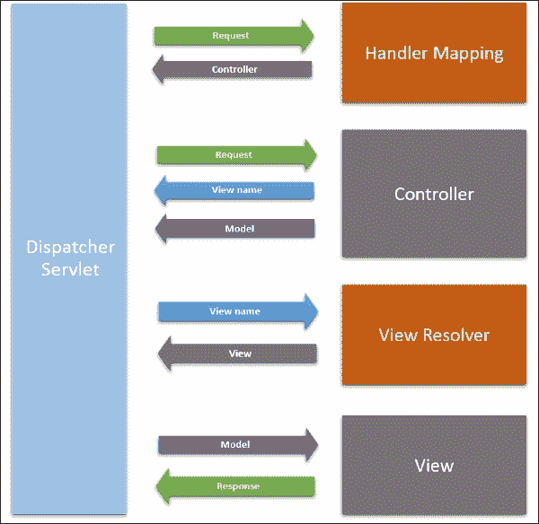
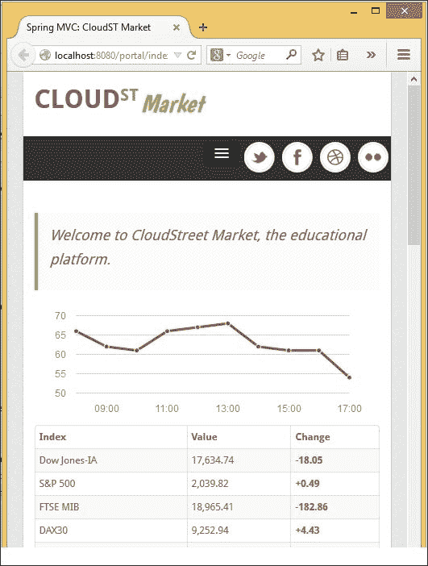
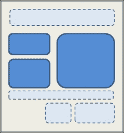

# 第九章：使用 Spring MVC 设计微服务架构

在这一章中，我们将涵盖以下主题：

+   配置一个具有简单 URL 映射的控制器

+   使用 ViewResolver 配置回退控制器

+   使用 Bootstrap 设置和自定义响应式单页 Web 设计

+   使用 JSTL 在视图中显示模型

+   定义一个常见的 WebContentInterceptor

+   使用 AngularJS 设计客户端 MVC 模式

# 介绍

在开始这一新章节之前，您需要完成第一章。第一章安装了我们正在构建的交易平台的基础。它还创建了一个模块化工具包，每个配方都将使用。

这第二章将产品放在加速坡道上。它将塑造整个责任链，并勾勒出微服务架构的大局。我们将再次为即将到来的章节建立必要的结构，但在另一个层面上。

## 用户体验范式

多年来，我们一直在协助一个非常活跃的前端革命。自从 HTML 5 和 CSS3 的兴起，以及移动开发平台（iOS，Android 等）的普及，再加上连接设备的数量增加，为开发者社区打开了许多门和机会。在开源领域中不断涌现的新 JavaScript 库的频率使其难以跟随。

但这是一场革命！它针对的是客户和用户体验。如今的客户希望能够从台式机、笔记本电脑、电视、平板电脑、手机，甚至是汽车上与品牌或产品进行互动。网络连接速度也各不相同，从每秒超过 150 兆字节到很少的字节。客户还可以期待离线功能，或者至少是一个体验良好的用户体验。显然，由于这种复杂性，出现了新的挑战，以改善用户体验。

随着我们通过不同方式的可及性大大增加，我们对垃圾邮件、直接招揽、广告以及一般营销的暴露程度从未如此之高。有趣的是，我们现在对每一条保持我们在线注意力的消息都更加敏感和自信。因为我们只需要一小部分时间就能决定某件事是否值得，所以我们也因为同样的原因拒绝了糟糕的设计。我们更加苛刻和饱和的目标，每个品牌都必须遵循最新的用户体验标准，以便我们与他们互动。

## 微服务架构

我们已经看到，通过向公众开放其 API（Facebook，Twitter，亚马逊等），互联网组织在沟通、形象和发展方面所产生的巨大好处。这种对 IT 基础设施的根本性变化现在正在成为中小企业和初创公司的常态。

现代架构为其客户提供了有文档的公共 API 和特定设备的安装包：移动应用程序或响应式 HTML 内容以特定的快照交付。REST API 也是**物联网**（**IoT**）更自主模块的可导航维度。

也许主要问题仍然是如何处理服务器端的负载，但更多的计算被转移到客户端设备上，而 REST 架构从定义上是无状态的，因此对可扩展性有很好的支持。

# 配置一个具有简单 URL 映射的控制器

这个配方介绍了 Spring MVC 控制器及其最简单的实现方式。

## 准备工作

我们将在以后发现，特别是在第三章中，*使用 Java 持久性和实体*，Spring MVC 是构建 REST API 的强大工具。在这里，我们将专注于如何创建一个控制器，以在响应中打印一些内容。

从这个配方开始，我们将使用 GIT 来跟踪对`cloudstreetmarket`应用程序所做的每次迭代。在初始设置之后，您将欣赏到您可以顺利升级的流畅性。

## 如何做...

这个配方有两个初始部分，用于安装和配置 GIT。

### 下载和安装 GIT

1.  要下载 GIT，请转到 GIT 下载页面[`git-scm.com/download`](https://git-scm.com/download)。选择与您的环境相对应的正确产品（Mac OS X，Windows，Linux 或 Solaris）。

1.  在 Linux 和 Solaris 上安装 GIT，请使用系统的本机软件包管理器执行建议的安装命令。

对于 Mac OS X，双击下载的`dmg`文件以在硬盘上提取包。转到提取的目录，双击`pkg`文件。选择所有默认选项，一步一步进行，直到**成功安装**屏幕。关闭屏幕。

对于 Windows，执行下载的程序，并按默认选项进行每一步，直到这些屏幕：

+   **调整您的 PATH 环境**：选择**从 Windows 命令提示符使用 Git**选项

+   **选择 SSH 可执行文件**：选择**使用 OpenSSH**选项

+   配置行结束转换：选择**检出 Windows 样式**和**提交 Unix 样式行结束**选项

+   **配置终端仿真器使用 Git Bash**：选择**使用 Windows 默认控制台窗口**

+   **配置实验性能调整**：不要勾选**启用文件系统缓存**复选框

让安装完成，然后单击**完成**按钮。

验证时，打开终端并输入以下命令：

```java

git –version

```

此命令应显示已安装的版本。所呈现的安装指南与`GIT 2.6.3`相关。

### 在 Eclipse 中配置 GIT

1.  我们将首先从终端初始化本地存储库。转到您的工作空间位置：`cd <home-directory>/workspace`。

用您自己的主目录路径替换`<home-directory>`。

1.  输入以下命令在此位置创建本地 Git 存储库：

```java

git init

```

1.  输入以下命令：

```java

git remote add origin https://github.com/alex-bretet/cloudstreetmarket.com

```

1.  然后，输入`git fetch`命令。

1.  选择您的父项目并右键单击其中一个。转到**Team** | **Add to index**：

1.  从右上角面板，单击**Git** **透视图**：

如果尚未拥有，请使用按钮添加此透视图。

1.  从左侧层次结构（**Git**透视图）中，选择**添加现有的本地 Git 存储库**。

1.  一个上下文窗口打开。定位到我们刚创建的本地 Git 存储库的位置（应该是当前工作空间目录）。

1.  **Git**透视图中现在应该出现一个新的存储库。

1.  如下截图所示，右键单击并选择**Checkout**以查看分支**origin/v1.x.x**的最新版本。

1.  提示时，检出为**新的本地分支**：

1.  实际工作空间现在应该与分支 v1.x.x 同步。该分支反映了第一章结束时环境的状态，设置*企业 Spring 应用程序的例程*。

1.  右键单击**zipcloud-parent**执行**Run as | Maven clean**和**Run as | Maven install**。然后在`cloudstreetmarket-parent`上执行相同的操作。每次都会观察到`BUILD SUCCESS`。

1.  最后，右键单击一个项目，转到**Maven** | **Update Project**。选择工作空间的所有项目，然后单击**确定**。

1.  如果您的一个项目仍然显示红色警告（如前一个截图所示），您可能需要重新附加目标运行时环境到**cloudstreetmarket-api**和**cloustreetmarket-webapp**（根据第一章*企业 Spring 应用程序的设置例程*，*第 2 个配方，第 7 步*）。

1.  从终端，转到本地 GIT 存储库：

```java

 cd <home-directory>/workspace 

```

1.  输入以下命令：

```java

 git pull origin v2.2.1

```

1.  重复步骤 13 和 14。（准备在拉取新更改后每次重复这两个步骤。）

1.  在**cloudstreetmarket-webapp**模块中，现在出现了一个新的包：

```java

 edu.zipcloud.cloudstreetmarket.portal.controllers.

```

1.  在这个包中，创建了一个`InfoTagController`类：

```java
@Controller
@RequestMapping("/info")
public class InfoTagController {
  @RequestMapping("/helloHandler")
  @ResponseBody
  public String helloController(){
    return "hello";
  }
}
```

1.  确保两个`war`文件部署在 Tomcat 服务器中。启动 Tomcat 服务器并使用浏览器访问`http://localhost:8080/portal/info/helloHandler` URL。

### 注意

您应该看到一个简单的 hello 显示为 HTML 内容*。*

1.  在`cloudstreetmarket-webapp/src/main/webapp/WEB-INF/dispatcher-context.xml`文件中，添加了以下 bean 定义：

```java
<bean id="webAppVersion" class="java.lang.String">
  <constructor-arg value="1.0.0"/>
</bean>
```

1.  `InfoTagController`类中的以下方法和成员也被添加：

```java
@Autowired
private WebApplicationContext webAppContext;
private final static LocalDateTime startDateTime = LocalDateTime.now();
private final static DateTimeFormatter DT_FORMATTER =  DateTimeFormatter.ofPattern("EEE, d MMM yyyy h:mm a");
@RequestMapping("/server")
@ResponseBody
public String infoTagServer(){
  return new StringJoiner("<br>")
    .add("-------------------------------------")
    .add(" Server: "+ 
    webAppContext.getServletContext().getServerInfo())
    .add(" Start date: "+ 
    startDateTime.format(DT_FORMATTER))
    .add(" Version: " + 
    webAppContext.getBean("webAppVersion"))
    .add("--------------------------------------")
    .toString();
}
```

1.  现在，使用浏览器访问`http://localhost:8080/portal/info/server` URL。

### 注意

您应该看到以下内容呈现为 HTML 文档：

```java

--------------------------------------------------
Server: Apache Tomcat/8.0.14
Start date: Sun, 16 Nov 2014 12:10 AM
Version: 1.0.0
---------------------------------------------------

```

## 它是如何工作的...

我们将草拟 Spring MVC 作为一个框架的概述。然后我们将审查如何从`DispatcherServlet`配置控制器，控制器级别的注解，以及从方法处理程序签名。

### Spring MVC 概述

Spring MVC 实现了两种常见的设计模式：前端控制器设计模式和 MVC 设计模式。

#### 前端控制器

作为前端控制器设计的系统为所有传入的请求公开了一个单一的入口点。在 Java Web 环境中，这个入口点通常是一个 servlet——一个唯一的 servlet，用于分发和委派给其他组件。

### 注意

在 Spring MVC 的情况下，这个唯一的 servlet 就是`DispatcherServlet`。

Servlet 在 Java Web 中是标准。它们与预定义的 URL 路径相关联，并在部署描述符（`web.xml`文件）中注册。解析部署描述符时，servlet 容器（如 Apache Tomcat）识别声明的 servlet 及其 URL 映射。在运行时，servlet 容器拦截每个 HTTP 客户端请求，并为每个请求创建一个新的线程。这些线程将使用 Java 转换的请求和响应对象调用匹配的相关 servlet。

#### MVC 设计模式

MVC 设计模式更多地是一种架构风格。它描述了整个应用程序。它鼓励在请求线程必须通过的三个不同层之间清晰地分离关注：**模型**，**视图**和**控制器**——控制器，模型，然后是视图。


当一个客户端请求被 servlet 容器拦截时，它被路由到`DispatcherServlet`。`DispatcherServlet`将请求发送到一个控制器（一个控制器方法处理程序），该控制器具有与请求状态匹配的配置（如果找到匹配）。

控制器协调业务逻辑，模型生成，并最终选择一个视图用于模型和响应。从这个角度来看，模型代表了由控制器处理并提供给视图进行可视化的填充数据结构。

但是这三个组件（模型、视图和控制器）也可以在宏观尺度上被视为独立的静态层。每个组件都是一个层，也是每个独立组成部分的占位符，属于该类别的一部分。**控制器层**包含所有注册的控制器以及 Web 拦截器和转换器；模型生成层（和业务逻辑层）包含业务服务和数据访问组件。视图层包含模板（例如 JSP）和其他 Web 客户端组件。

#### Spring MVC 流程

Spring MVC 流程可以用以下图表表示：



我们之前提到 Spring MVC 实现了前端控制器模式。入口点是`DispatcherServlet`。这个`DispatcherServlet`依赖于`HandlerMapping`的实现。使用不同的策略和特定性，`HandlerMapping`解析请求的控制器方法处理程序。

一旦`DispatcherServlet`有了一个控制器方法处理程序，它就会将请求分派给它。方法处理程序返回一个视图名称（或直接返回视图本身），还返回填充的模型对象给`DispatcherServlet`。

使用视图名称，`DispatcherServlet`要求`ViewResolver`实现查找并选择视图。

有了请求，视图和模型，`DispatcherServlet`就有了构建客户端响应的一切。视图使用所有这些元素进行处理，最终将响应返回给 servlet 容器。

### DispatcherServlet- Spring MVC 入口点

正如所解释的，`DispatcherServlet`在 Spring MVC 中是一个非常核心的部分。它拦截针对应用程序的预定义 URL 路径的客户端请求。它将它们映射到属于业务逻辑运算符（控制器，拦截器，过滤器等）的处理程序。它还提供一组工具，可用作 bean 来解决重复的 Web 开发问题和技术，例如提供集中和模块化的视图层，处理国际化，主题，处理异常等。

在一切之前，`DispatcherServlet`是一个 servlet，并且在`web.xml`文件中以 servlet 配置和 servlet 映射的形式进行定义。 代码如下：

```java
<servlet>
  <servlet-name>spring</servlet-name>
   <servlet-class>
      org.springframework.web.servlet.DispatcherServlet
  </servlet-class>
  <load-on-startup>1</load-on-startup>
</servlet>
<servlet-mapping>
   <servlet-name>spring</servlet-name>
   	<url-pattern>/*</url-pattern>
</servlet-mapping>
```

在我们的应用程序中，在**cloudstreetmarket-webapp**中，`DispatcherServlet`被命名为 spring，并覆盖了应用程序的完整上下文路径：`/*`。

我们已经看到每个`DispatcherServlet`都有一个受限范围的`WebApplicationContext`，它从根`ApplicationContext`继承 bean。

默认情况下，对于`WebApplicationContext`，Spring MVC 在`/WEB-INF`目录中查找名为`{servletName}-servlet.xml`的配置文件。但是，我们通过初始化参数`contextConfigLocation`覆盖了此默认名称和位置：

```java
<servlet>
 <servlet-name>spring</servlet-name>
   <servlet-class>
    org.springframework.web.servlet.DispatcherServlet
  </servlet-class>
   <init-param>
    <param-name>contextConfigLocation</param-name>
    <param-value>/WEB-INF/dispatcher-context.xml</param-value>
   </init-param>
   <load-on-startup>1</load-on-startup>
</servlet>
<servlet-mapping>
    <servlet-name>spring</servlet-name>
    <url-pattern>/*</url-pattern>
</servlet-mapping>
```

在`web.xml`中，您可以看到根应用程序上下文（`classpath*:/META-INF/spring/*-config.xml`）以`ContextLoaderListener`开头：

```java
<listener>
  <listener-class>
    org.springframework.web.context.ContextLoaderListener
  </listener-class>
</listener>
```

### 由注解定义的控制器

Spring MVC 控制器是客户端请求真正开始由特定于业务的代码处理的地方。自*Spring 2.5*以来，我们已经能够在控制器上使用注解，因此我们不必在配置中显式声明它们为 bean。这使得它们的实现更容易扩展和理解。

#### @Controller

`@Controller`注解标记一个类为 Web 控制器。它仍然是用于表示层的 Spring Stereotype。定义 Spring Stereotype 的主要目的是使目标类型或方法在 Spring 类路径扫描期间可发现，该扫描由以下命令激活：

```java
<context:component-scan base-package="edu.zipcloud.cloudstreetmarket.portal"/>
```

与此注解相关的自定义逻辑并不多。如果我们不介意使应用程序变得更清洁，我们可以使用其他 Stereotype 注解（`@Component`或`@Service`）运行控制器。

#### @RequestMapping

`@RequestMapping`注解将处理程序定义到控制器类和/或控制器方法上。这些注解在`DispatcherServlet`中在构造类中进行查找。 `@RequestMapping`注解背后的主要思想是在类级别上定义主要路径映射，并在方法上缩小 HTTP 请求方法，标头，参数和媒体类型。

为了实现这种缩小，`@RequestMapping`注解在括号内接受逗号分隔的参数。

考虑以下示例：

```java
@RequestMapping(value="/server", method=RequestMethod.GET)
```

`@RequestMapping`可用参数总结在以下表中：

| 参数和类型 | 使用/描述（来自 JavaDoc） |
| --- | --- |
| --- | --- |
| `name（String）` | 为映射分配一个名称。 |
| `value（String[]）` | 路径映射 URI（例如，`/myPath.do`）。还支持 Ant 样式路径模式（例如，`/myPath/*.do`）。 |
| 路径映射 URI 可能包含占位符（例如，`/${connect}`）针对本地属性和/或系统属性和环境变量。 |
| 路径实现 URI 模板，通过模式，变量，占位符和矩阵变量（请参阅 URI 模板部分）访问 URL 的选定部分。 |
| 在方法级别，主映射中支持相对路径（例如，`edit.do`）。 |
| `method``(RequestMethod[])` | GET、POST、HEAD、OPTIONS、PUT、PATCH、DELETE、TRACE。 |
| `params (String[])` | 一系列`myParam=myValue`风格的表达式。 |
| 表达式可以使用`!=`运算符否定，如`myParam!=myValue`。 |
| `headers (String[])` | 一系列`My-Header=myValue`风格的表达式。 |
| 仅指定标题名称（例如，`My-Header`）是受支持的（允许具有任何值）。 |
| 也支持否定标题名称（例如，`!My-Header`）（指定的标题不应出现在请求中）。 |
| 还支持媒体类型通配符（`*`），用于`Accept`和`Content-Type`等标题。 |
| `consumes (String[])` | 映射请求的可消耗媒体类型。 |
| 仅在`{@code Content-Type}`匹配这些媒体类型之一时映射。 |
| 否定表达式（例如，`!text/xml`）也受支持。 |
| `produces (String[])` | 映射请求的可生产媒体类型。 |
| 仅在`{@code Accept}`匹配这些媒体类型之一时映射。 |
| 否定表达式（例如，`!text/plain`）也受支持。它匹配所有具有`{@code Accept}`不是"text/plain"的请求。 |

所有这些参数都可以在类型级别和方法级别使用。在类型级别使用时，所有方法级参数都继承父级缩小。

### 控制器方法处理程序签名

多个组成部分构成控制器方法处理程序。以下是 Spring MVC 中这样一个处理程序的另一个示例：

```java
@RequestMapping(value="/index")
public ModelAndView getRequestExample(ServletRequest request){
    ModelAndView mav = new ModelAndView();
    mav.setViewName("index");
    mav.addObject("variable1", new ArrayList<String>());
    return mav;
}
```

我们刚刚讨论了如何使用`@RequestMapping`注解。关于方法签名，此注解只能放置在返回类型之前。

#### 支持的方法参数类型

声明处理程序方法的特定类型的参数可以让 Spring 自动在其中注入对外部对象的引用。这些对象与请求生命周期、会话或应用程序配置相关。由于这些参数类型受方法范围的限制，因此它们在以下表中呈现：

| 支持的参数 | 使用/描述 | 包 |
| --- | --- | --- |
| `ServletRequest /``HttpServletRequest` | 注入 servlet 请求/响应。 | `javax.servlet.http.*` |
| `ServletResponse /``HttpServletResponse` |
| `HttpSession` | 注入绑定到 servlet 请求的 HTTP 会话。如果为 null，Spring 将创建一个新的。如果应该在`AbstractController`或`RequestMappingHandlerAdapter`中共享会话，则必须设置`synchronizeOnSession`。 |
| `WebRequest / NativeWebRequest` | 注入一个包装器，用于仅访问请求参数和请求/会话属性。 | `org.springframework.web.context.request.*` |
| `Locale` | 使用配置的`LocaleResolver`注入请求的本地 e。 | `java.util.*` |
| `InputStream / Reader` | 直接访问请求/响应有效负载。 | `java.io.*` |
| `OutputStream / Writer` |
| `HttpMethod` | 注入请求的当前方法。 | `org.springframework.http.*` |
| `Principal` | 使用 Spring 安全上下文，它注入了经过身份验证的账户。 | `java.security.*` |
| `HttpEntity<?>` | Spring 将入站请求转换并注入到自定义类型中，同时提供对请求头的访问。 | `org.springframework.http.*` |
| `Map` | 为我们实例化一个`BindingAwareModelMap`，以在视图中使用。 | `java.util.*` |
| `Model` | `org.springframework.ui.*` |
| `ModelMap` |
| `RedirectAttributes` | 注入并重新填充在请求重定向期间维护的属性和闪存属性的映射。 | `org.springframework.web.servlet.mvc.support.*` |
| `Errors` | 注入参数列表中紧挨着的参数的验证结果。 | `org.springframework.validation.*` |
| `BindingResult` |
| `SessionStatus` | 允许使用`setComplete`(Boolean)标记会话的完成。此方法清除使用@SessionAttributes 在类型级别定义的会话属性。 | `org.springframework.web.bind.support.*` |
| `UriComponentsBuilder` | 注入 Spring URL 构建器 UriComponentsBuilder。 | `org.springframework.web.util.*` |

#### 方法参数的支持注解

一组用于方法处理程序参数的本机注解已经被设计出来。它们必须被视为配置控制器方法的 Web 行为的句柄，以便处理传入的请求或尚未构建的响应。

它们标识了方便的 Spring MVC 函数的抽象，例如请求参数绑定，URI 路径变量绑定，请求有效负载注入到参数，HTML 表单参数绑定等。

| 支持的注解参数 | 用途/描述 | 包 |
| --- | --- | --- |
| `@PathVariable` | 将 URI 模板变量注入到参数中。 | `org.springframework.web.bind.annotation.*` |
| `@MatrixVariable` | 将位于 URI 路径段中的名称-值对注入到参数中。 |
| `@RequestParam` | 将特定请求参数注入到参数中。 |
| `@RequestHeader` | 将特定请求的 HTTP 标头注入到参数中。 |
| `@RequestBody` | 允许直接访问请求有效负载，并将其注入到参数中。 |
| `@RequestPart` | 将多部分/表单编码请求的特定部分（元数据、文件数据等）的内容注入到匹配类型的参数中（MetaData、MultipartFile 等）。 |
| `@ModelAttribute` | 使用 URI 模板自动填充模型的属性。此绑定在方法处理程序处理之前操作。 |

这些注解必须放在要填充的方法参数之前：

```java
@RequestMapping(value="/index")
public ModelAndView getRequestExample(@RequestParam("exP1") String exP1){
   ModelAndView mav = new ModelAndView();
   mav.setViewName("index");
   mav.addObject("exP1", exP1);
   return mav;
}
```

#### 支持的返回类型

Spring MVC，具有不同可能的控制器方法返回类型，允许我们指定要发送回客户端的响应，或者用于定位或填充中间视图层变量的必要配置。根据我们想要做什么或实际应用状态，我们可以在以下选项中进行选择：

| 支持的返回类型 | 用途/描述 | 包 |
| --- | --- | --- |
| `Model` | Spring MVC 为处理程序方法创建模型接口的实现。模型的对象在处理程序方法内部手动填充，或者使用`@ModelAttribute`的帮助。需要使用 RequestToViewNameTranslator 将要呈现的视图映射到请求。 | `org.springframework.ui.*` |
| `ModelAndView` | 一个包装器对象，包含模型、视图和视图名称。如果提供了视图名称，Spring MVC 将尝试解析关联的视图。否则，将呈现嵌入式视图。模型对象在方法内部手动填充，或者使用`@ModelAttribute`。 |
| `Map` | 允许自定义模型实现。需要使用`RequestToViewNameTranslator`将要呈现的视图映射到请求。 | `java.util.*` |
| `View` | 允许呈现自定义视图对象。Spring MVC 为处理程序方法创建模型接口的实现。模型的对象在方法内部手动填充，或者使用`@ModelAttribute`的帮助。 | `org.springframework.web.servlet.*` |
| `String` | 如果处理程序方法上没有指定`@ResponseBody`注解，则返回的字符串将被处理为视图名称（视图标识符）。 | `java.lang.*` |
| `HttpEntity<?> / ResponseEntity<?>` | 两个包装对象，用于轻松管理响应头和 Spring 转换的主体（使用`HttpMessageConverters`）。 | `org.springframework.http.*` |
| `HttpHeaders` | 为 HEAD 响应提供一个包装器对象。 | `org.springframework.http .*` |
| `Callable<?>` | 当 Spring MVC 控制线程时，可以异步生成一个类型化对象。 | `java.util.concurrent.*` |
| `DeferredResult<?>` | 当线程不受 Spring MVC 控制时，可以异步产生一个类型化对象。 | `org.springframework.web.context.request.async.*` |
| `ListenableFuture<?>` | `org.springframework.util.concurrent.*` |
| `void` | 当视图由`RequestToViewNameTranslator`外部解析时，或者当方法直接在响应中打印时。 |   |

## 还有更多...

在`InfoTagController.infoTagServer()`方法处理程序中，我们在返回类型之前使用了`@ResponseBody`注解。这个注解是从特定于 REST 的工具中借来的。当您不需要处理视图时，`@ResponseBody`指令将使用注册的 Spring 转换器将返回的对象编组成期望的格式（XML、JSON 等）。然后将编组的内容写入响应主体（作为响应有效载荷）。

在没有更多配置的 String 对象的情况下，它会在响应主体中打印出来。我们可以使用`ResponseEntity<String>`返回类型来实现相同的目标。

# 使用 ViewResolver 配置回退控制器

这个配方介绍了一些与控制器相关的更高级的概念和工具，比如`ViewResolvers`、URI 模板模式和 Spring MVC 的注入作为参数。这个配方很简单，但还有更多要谈论。

## 准备工作

我们将继续从之前的配方中保持相同的代码库状态，其中我们从远程存储库中拉取了 v2.2.1 标签。这只涉及创建一个带有其处理程序方法的控制器。

## 如何做...

1.  在**cloudstreetmarket-webapp**模块和包`edu.zipcloud.cloudstreetmarket.portal.controllers`中，创建了以下`DefaultController`：

```java
@Controller
public class DefaultController {
  @RequestMapping(value="/*", method={RequestMethod.GET,RequestMethod.HEAD})
  public String fallback() {
    return "index";
  }
}
```

### 注意

我们将详细解释这种方法处理程序如何作为回退拦截器。

1.  使用浏览器访问`http://localhost:8080/portal/whatever`或`http://localhost:8080/portal/index` URL。

您还应该收到我们之前看到的 HTML 内容：


## 它是如何工作的...

这个第二个配方重新访问了`@RequestMapping`注解的使用。不再是固定的 URI 作为路径值，而是一个开放的模式（回退）。该配方还利用了我们之前没有使用的配置的视图解析器。

### URI 模板模式

模板词在 Spring 术语中是重复出现的。它通常指的是通用支持 Spring API，可以实例化以填充特定的实现或自定义（REST 模板用于进行 REST HTTP 请求，JMS 模板用于发送 JMS 消息，WS 模板用于进行 SOAP Web 服务请求，JDBC 模板等）。它们是开发人员需要 Spring 核心功能的桥梁。

在这种光线下，URI 模板允许配置具有模式和变量的通用 URI，用于控制器端点。可以实例化 URI 构建器来实现 URI 模板，但开发人员可能主要使用 URI 模板来支持`@RequestMapping`注解。

#### Ant 风格的路径模式

我们已经利用这些类型的模式来定义我们的回退处理程序方法的路径值：

```java

@RequestMapping(value="/*", ...)

```

这种特殊情况下，使用`*`通配符，允许以应用程序显示名称之后的`/`开头的任何请求 URI 都有资格由此方法处理。

通配符可以匹配一个字符、一个单词或一系列单词。考虑以下例子：

```java
/portal/1, /portal/foo, /portal/foo-bar
```

一个限制是在最后一个序列中使用另一个斜杠：

```java
/portal/foo/bar
```

请记住这里的表格的区别：

| `/*` | 所有资源和目录在该级别 |
| --- | --- |
| `/**` | 所有资源和目录在该级别和子级别 |

我们故意在`cloudstreetmarket-webapp`应用程序中使用了单个通配符。对于其他类型的应用程序，将每个不匹配的 URI 重定向到默认 URI 可能更合适。在我们的单页面应用程序中，它将是面向 REST 的，当找不到资源时，最好通知客户端出现`404`错误。

在路径模式的末尾使用通配符并不是唯一的选择。如果需要，我们可以实现以下类型的模式：

```java
/portal/**/foo/*/bar  	
```

（尽管不是为了回退目的）。

我们将看到 Spring MVC 如何选择一个处理程序，它会比较所有匹配的路径模式，并选择最具体的路径模式。

### 提示

在 Controller 类型级别，我们没有指定`@RequestMapping`。如果我们这样做了，方法级别的指定路径将被连接到类型级别的路径上（实现缩小范围）。

例如，以下定义将为我们的回退控制器定义路径模式`/portal/default/*`：

```java
@RequestMapping(value="/default"...)
@Controller
public class DefaultController…{
      @RequestMapping(value="/*"...)
      public String fallback(Model model) {...}
}
```

#### `/portal/*`

当给定的 URL 匹配多个已注册的路径模式时，Spring MVC 会进行路径模式比较，以选择将请求映射到哪个处理程序。

### 注意

被认为最具体的模式将被选择。

第一个标准是在比较的路径模式中计算变量和通配符的数量：具有最低数量变量和通配符的模式被认为是最具体的。

要区分具有相同累积变量和通配符数量的两个路径模式，请记住具有最低通配符数量的模式将是最具体的，然后最长的路径将是最具体的。

最后，具有双通配符的模式始终比没有任何通配符的模式不具体。

为了说明这一选择，让我们考虑以下从最具体到最不具体的层次结构：

`/portal/foo`

`/portal/{foo}`

路径模式比较

`/portal/{foo}/{bar}`

`/portal/default/*/{foo}`

`/portal/{foo}/*`

`/portal/**/*`

`/portal/**`

#### 视图解析器

在**cloudstreetmarket-webapp**的`dispatcher-context.xml`中，我们已经定义了`viewResolver` bean：

```java
<bean id="viewResolver" class="org.springframework.web.servlet.view.InternalResourceViewResolver">
  <property name="viewClass" value="org.springframework.web.servlet.view.JstlView" />
  <property name="prefix" value="/WEB-INF/jsp/" />
  <property name="suffix" value=".jsp" />
</bean>
```

`viewResolver` bean 是预定义类的特定实例，用于提供有组织和统一的视图层集合。在我们配置的情况下，`viewResolver` bean 是`InternalResourceViewResolver`的一个实例，它可以提供 JSP 页面，处理 JSTL 和 tiles。这个类还继承了`UrlBasedViewResolver`，可以导航应用程序资源，并可以将逻辑视图名称绑定到视图资源文件。这种能力可以防止创建额外的映射。

在我们的配置中，我们已经定义了视图存储库`(/WEB-INF/jsp/*.jsp)`，我们可以直接使用字符串`index`引用`index.jsp`。

最好将 JSP 存储库设置在`/WEB-INF`下，这样这些 JSP 就不能被公开访问。我们可以使用`VelocityViewResolver`或`FreeMarkerViewResolver`来代替 JSP 模板，而不是 JSP 模板。

此外，当我们构建 REST API 时，我们将在后面讨论`ContentNegotiatingViewResolver`。

## 还有更多...

本节特别强调了`@PathVariable`注解。这个注解是控制器方法处理程序参数的注解（我们在前面的示例中介绍了所有这些）。

### @PathVariable 用于读取 URI 模板模式中的变量

稍后您将在几个示例中找到方法级别的`@RequestMapping`注解。这些注解有时会与方法处理程序参数上的`@PathVariable`注解相关联。现在，让我们考虑以下示例：

```java
@RequestMapping(value="/example/{param}")
public HttpEntity<String> example(@PathVariable("param") String parameter) {
  return new HttpEntity<>(parameter);
}
```

如前所述，`@PathVariable`告诉 Spring MVC 在何处以及如何从请求 URI 中实现其注入作为参数。框架将解析当前 URI 模板模式以提取名为`param`的变量，并将匹配值注入当前 URI 中的目标方法参数。

我们还声明要返回的`HTTPEntity`。这个`HTTPEntity`将是一个 String 泛型类型的包装器。在方法处理程序内部，我们使用必要的 String 元素实例化这个包装器。

如果我们调用`/portal/example/foo` URI，它将作为返回的`HTTPEntity`的正文显示：String`foo`。

通过另一个有趣的特性，我们可以使用以下`@PathVariable`声明构建最后一个场景：

```java
@RequestMapping(value="/example/{param}")
public HttpEntity<String> example(@PathVariable String param) {
  return new HttpEntity<>(param);
}
```

### 提示

如果不向注释提供值，Spring MVC 默认会在 URI 模板模式中查找与目标参数同名的变量。

我们将探讨关于`@RequestMapping`和`@PathVariable`的其他功能。

# 使用 Bootstrap 设置和定制响应式单页网页设计

Bootstrap 最初是由 Twitter 的 Mark Otto 和 Jacob Thornton 创建的 UI 框架。它是一个了不起的样式、图标和行为来源，用于定义和丰富组件。Bootstrap 提供了一套易于理解、统一的样式定义模式。以前没有类似的。如果您从未使用过它，您将会对从 DOM 的快速定义中获得如此多的视觉反馈感到兴奋。

2014 年 6 月，它是 GitHub 上的第一个项目，拥有超过 73,000 颗星星和超过 27,000 个分支。他们的文档非常流畅，易于阅读。

## 准备工作

在这个配方中，我们将使用 Bootstrap 从现有的 Bootstrap 主题为 CloudStreet Market 项目设置 Web 设计基础。我们将重新制作`index.jsp`页面，以呈现一个外观更好的欢迎页面，可以通过以下屏幕截图预览。


## 如何做...

这个配方有三个主要步骤：

+   安装 Bootstrap 主题

+   定制 Bootstrap 主题

+   创建响应式内容

从 Eclipse 的 Git 视角，检出`v2.x.x`分支的最新版本：


### 安装 Bootstrap 主题

1.  在`chapter_2`目录中，您可以找到一个`freeme.zip`存档。这是一个可免费下载的响应式 Bootstrap 模板。这个 zip 来自[bootstrapmaster.com](http://bootstrapmaster.com)网站。

1.  在这个存档中，您会看到一个`css`目录，一个`js`目录，一个`img`目录，最后是一个`index.html`文件。使用 Web 浏览器打开`index.html`文件应该呈现以下主页：

我们正在使用此模板作为 webapp 模块的基础。

1.  所有位于`freeme/js`目录中的 JavaScript 文件已复制到`/cloudstreetmarket-webapp/src/main/webapp/js`目录中。

1.  所有位于`freeme/css`目录中的 CSS 文件已复制到`/cloudstreetmarket-webapp/src/main/webapp/css`目录中。

1.  所有位于`freeme/img`中的图片已复制到`/cloudstreetmarket-webapp/src/main/webapp/img`目录中。

1.  `freeme/index.html`文件的内容已被复制并粘贴到`/cloudstreetmarket-webapp/src/main/webapp/WEB-INF/jsp/index.jsp`文件中，使用 UTF-8。

1.  此外，`freeme/licence.txt`已被复制并粘贴到`/cloudstreetmarket-webapp/src/main/webapp/WEB-INF/jsp`目录中。

1.  此时，使用 Web 浏览器调用`http://localhost:8080/portal/index`将显示与之前看到的完全相同的视觉效果，但由我们的应用程序提供。

### 定制 Bootstrap 主题

在本节中，我们将详细介绍为了使下载的模板适应我们的用例而做了什么。

1.  以前位于`cloudstreetmarket-webapp\src\main\webapp\img\logos`中的所有图片已被删除，并用代表我们在整个应用程序和本书中一直在使用的技术产品品牌的六张新图片替换。

1.  在`cloudstreetmarket-webapp`模块中的`index.jsp`文件中已实现以下更改：

1.  以下两行已添加到顶部：

```java
<%@ page contentType="text/html;charset=UTF-8" language="java" %>
<%@ page isELIgnored="false" %>
```

1.  `<!-- start: Meta -->`部分已替换为以下内容：

```java
<!-- start: Meta -->
<meta charset="utf-8">
<title>Spring MVC: CloudST Market</title> 
<meta name="description" content="Spring MVC CookBook: Cloud Street Market"/>
<meta name="keywords" content="spring mvc, cookbook, packt publishing, microservices, angular.js" />
<meta name="author" content="Your name"/>
<!-- end: Meta -->
```

1.  `<!--start: Logo -->`部分已替换为以下内容：

```java
<!--start: Logo -->
<div class="logo span4">
  CLOUD<span class="sub">ST</span><span>Market</span>
</div>
<!--end: Logo -->
```

1.  导航菜单定义已更改：

```java
<ul class="nav">
  <li class="active"><a href="index">Home</a></li>
  <li><a href="markets">Prices and markets</a></li>
  <li><a href="community">Community</a></li>
  <li><a href="sources">Sources</a></li>
  <li><a href="about">About</a></li>
  <li><a href="contact">Contact</a></li>
</ul>
```

1.  已删除`<!-- start: Hero Unit -->`和`<!-- start: Flexslider -->`部分，并清空了导航菜单(`<!--end: Navigation-->`)后面的`<div class="row">`：

```java
<!-- start: Row -->
<div class="row"></div>
<!-- end: Row -->
```

1.  `<!-- start: Row -->`部分到`<!-- end: Row -->`部分，在`<!-- end Clients List -->`之后，已删除，并且紧随其后的`<hr>`也已删除。

1.  页脚部分`<!-- start: Footer Menu -->`到`<!-- end: Footer Menu -->`已替换为以下内容：

```java
<!-- start: Footer Menu -->
<div id="footer-menu" class="hidden-tablet hidden-phone">
  <!-- start: Container -->
  <div class="container">
    <!-- start: Row -->
    <div class="row">
      <!-- start: Footer Menu Logo -->
      <div class="span1">
      <div class="logoSmall">CLOUD<span class="sub">ST</span><span>M!</span>
        </div>
        </div>
      <!-- end: Footer Menu Logo -->
      <!-- start: Footer Menu Links-->
      <div class="span10" >
      <div id="footer-menu-links">
      <ul id="footer-nav" style="margin-left:35pt;">
        <li><a href="index">Home</a></li>
        <li><a href="markets">Prices and markets</a></li>
      <li><a href="community">Community</a></li>
        <li><a href="sources">Sources</a></li>
        <li><a href="about">About</a></li>
        <li><a href="contact">Contact</a></li>
        </ul>
        </div>
        </div>
        <!-- end: Footer Menu Links-->
        <!-- start: Footer Menu Back To Top -->
        <div class="span1">
        <div id="footer-menu-back-to-top">
          <a href="#"></a>
          </div>
        </div>
        <!-- end: Footer Menu Back To Top -->
    </div>
    <!-- end: Row -->
    </div>
  <!-- end: Container  -->	
</div>	
<!-- end: Footer Menu -->
```

1.  `<!-- start: Photo Stream -->`到`<!-- end: Photo Stream -->`部分已替换为：

```java
<!-- start: Leaderboard -->
<div class="span3">
  <h3>Leaderboard</h3>
  <div class="flickr-widget">
    <script type="text/javascript" src=""></script>
    <div class="clear"></div>
  </div>
</div>
<!-- end: Leaderboard -->
```

1.  在`index.jsp`文件中的最后一个更改是，版权部分已经调整。

1.  在先前复制的`cloudstreetmarket-webapp/src/main/webapp/css/style.css`文件中，已添加了以下类：

```java
.logo{
  font-family: 'Droid Sans';	font-size: 24pt; color: 	#666; width:157pt; font-weight:bold; margin-top:18pt; 	margin-left:10pt; height:30pt;
}
.logo span{
  position:relative;float:right; margin-top: 3pt;	font-weight:normal; font-family: 'Boogaloo'; font-	style:italic;	color: #89C236; padding-right: 3pt;
}
.logo .sub {
  vertical-align: super;	font-style:normal;font-size: 16pt; font-family: 'Droid Sans';	font-weight:bold; position: absolute;	color: #888; 	margin:-4pt 0 -4pt 0;
}
.logoSmall{
  font-family: 'Droid Sans';	font-size: 16pt; color: #888;width:80pt;	font-weight:bold; margin-top:10pt;height:20pt; margin-right:30pt;
}
.logoSmall span{
  position:relative;	float:right; margin-top: 3pt;
  font-weight:normal;font-family: 'Boogaloo';	font-style:italic;color: #89C236;
}
.logoSmall .sub {
  vertical-align: super;
  font-style:normal;	font-size: 10pt;font-family: 'Droid Sans';font-weight:bold;position: absolute; color: #666;margin:-2pt 0 -4pt 0;
}
```

1.  在所有这些更改之后，重新启动 Tomcat 并调用相同的 URL`http://localhost:8080/portal/index`导致了以下状态：

### 创建响应式内容

我们将在本节中重点关注填充欢迎页面的响应式内容所做的更改。通过响应式，理解为内容将根据设备大小和方向呈现适当的样式。

1.  在`index.jsp`文件中：

1.  `<div class="row">`已添加了以下内容：

```java
<div class='span12'>
  <div class="hero-unit hidden-phone"><p>Welcome to CloudStreet Market, the educational platform.</p></div>
</div>
<div class='span5'>
    <div id='landingGraphContainer'></div>
    <div id='tableMarketPrices'>
      <table class="table table-hover table-condensed table-bordered table-striped">
        <thead>
          <tr>
            <th>Index</th>
            <th>Value</th>
            <th>Change</th>
          </tr>
         </thead>
         <tbody>
       <tr>
           <td>Dow Jones-IA</td><td>17,634.74</td>
           <td class='text-success'><b>-18.05</b></td>
            </tr>
            ...
            <tr>
              <td>FTSE MIB</td><td>18,965.41</td>
              <td class='text-error'><b>-182.86</b></td>
            </tr>
            ...
        </tbody>
        </table>
      </div>
</div>
<div id="containerCommunity" class='span7'>
    <div id="divRss3"></div>
</div>
```

### 注意

在先前添加的*landingGraphContainer*中，我们已插入了一个生成的图表，显示了最近开放日内特定市场的发展情况。该图表使用了`morris.js`库([`morrisjs.github.io/morris.js`](http://morrisjs.github.io/morris.js))，它还依赖于`raphael.js`库([`cdnjs.com/libraries/raphael`](https://cdnjs.com/libraries/raphael))。

1.  在文件底部，已添加了`<!-- start: Java Script -->`部分到`<!-- end: Java Script -->`部分的以下内容：

```java
<script src="img/jquery-1.8.2.js"></script>
<script src="img/bootstrap.js"></script>
<script src="img/flexslider.js"></script>
<script src="img/carousel.js"></script>
<script def src="img/custom.js"></script>
<script src="img/FeedEk.js"></script>
<script src="img/raphael.js"></script>
<script src="img/morris.min.js"></script>
<script>
$(function () {
    var financial_data = [
     {"period": "08:00", "index": 66},{"period": "09:00", "index": 62},
	 {"period": "10:00", "index": 61},{"period": "11:00", "index": 66},
     {"period": "12:00", "index": 67},{"period": "13:00", "index": 68},
     {"period": "14:00", "index": 62},{"period": "15:00", "index": 61},
     {"period": "16:00", "index": 61},{"period": "17:00", "index": 54}
    ];
    Morris.Line({
      element: 'landingGraphContainer',
      hideHover: 'auto', data: financial_data,
      ymax: 70, ymin: 50,
      pointSize: 3, hideHover:'always',
      xkey: 'period', xLabels: 'month',
      ykeys: ['index'], postUnits: '',
      parseTime: false, labels: ['Index'],
      resize: true, smooth: false,
      lineColors: ['#A52A2A']
    });
});
</script>
```

1.  在`cloudstreetmarket-webapp\src\main\webapp\js`目录中，`morris.min.js`和`raphael.js`库已从它们各自的网站复制并粘贴。

1.  回到`index.jsp`文件：

1.  先前创建的`<div id='containerCommunity'>`已填充了以下内容：

```java
<div id="divRss3">
  <ul class="feedEkList">
    <li>
    <div class="itemTitle">
      <div class="listUserIco">
        
      </div>
      <span class="ico-white ico-up-arrow   listActionIco 	actionBuy"></span>
        <a href="#">happyFace8</a> buys 6 <a href="#">NXT.L</a> at $3.00
        <p class="itemDate">15/11/2014 11:12 AM</p>
    </div>
    </li>
    <li>
    <div class="itemTitle">
      <div class="ico-user listUserIco"></div>
      <span class="ico-white ico-down-arrow listActionIco actionSell"></span>
      <a href="#">actionMan9</a> sells 6 <a href="#">CCH.L</a> at $12.00
      <p class="itemDate">15/11/2014 10:46 	AM</p>
    </div>
    </li>
      ...
  </ul>
</div>
```

1.  此部分使用了 feedEk jQuery 插件。它带有自己的 CSS 和 JavaScript 文件。

1.  `cloudstreetmarket-webapp\src\main\webapp\js`目录包括与 feedEk jQuery 插件相关的`FeedEk.js`文件。此插件可以在线找到([`jquery-plugins.net/FeedEk/FeedEk.html`](http://jquery-plugins.net/FeedEk/FeedEk.html))。

1.  `cloudstreetmarket-webapp\src\main\webapp\css`目录还有相关的`FeedEk.css`文件。

1.  仍然在`index.jsp`中，在`<!-- start: CSS -->`注释下面，已添加了`FeedEk css`文档：

```java
<link href="css/FeedEk.css" rel="stylesheet">
```

1.  在`style.css`文件中，在第一个媒体查询定义`(@media only screen and (min-width: 960px)`之前，已经添加了以下样式定义：

```java
.listUserIco {
    background-color:#bbb;
    float:left;
    margin:0 7px 0 0;
}
.listActionIco {
    float:right; 
    margin-top:-3px;
}
.actionSell {
    background-color:#FC9090;
}
.actionBuy {
    background-color:#8CDBA0;
}
#landingGraphContainer{
    height:160px;
    padding: 0px 13px 0 10px;
}
.tableMarketPrices{
    padding: 13px 13px 0 15px;
}
```

1.  最后，两张新图片（个人资料图片）已添加到`cloudstreetmarket-webapp\src\main\webapp\img`。

1.  尝试动态调整渲染的浏览器窗口大小：`http://localhost:8080/portal/index`。您应该观察到响应式和自适应的样式，就像下面的图片一样：

## 它是如何工作的...

为了理解我们的 Bootstrap 部署，我们现在将回顾它是如何作为一个预设计的主题安装的。然后我们将发现 Bootstrap 框架的一些关键特性——不仅仅是已实现的特性，因为合乎逻辑的是，框架的一些特性只能在一个单独的页面示例上进行视觉使用。

### 主题安装

我们获得的主题不过是一个经典的静态主题，就像您可以在互联网上找到成千上万个一样。它们是由网页设计师制作并免费或商业分发的。这个主题是由 HTML 文件的基本结构、一个 JS 目录、一个 CSS 目录和一个 IMG 目录制作的。

主题安装非常容易理解，因为我们只是将 JavaScript 文件、CSS 文件和图像放在了应用程序的预期位置。

### 提示

Bootstrap 的核心特性包含在`bootstrap.js`、`bootstrap.css`和`bootstrap-responsive.css`中。您实际上不需要直接调整这些文件。

### Bootstrap 亮点

实现的主题（FreeME）使用了 Bootstrap 2。我们将回顾一些已在模板中实现并适用于我们项目需求的功能。

#### Bootstrap 脚手架

Bootstrap 脚手架有助于设计通常由网格模型构建的 HTML 结构。关于这个主题的 Bootstrap 策略在以下部分中有描述。

##### 网格系统和响应式设计

Bootstrap 提供了一个样式框架来处理特定页面的网格系统。关键点在于默认的网格系统由 12 列组成，设计用于 940 像素宽的非响应式容器。

通过使用`<meta name="viewport"…>`标签和导入`boostrap-responsive.css`文件，可以激活 Bootstrap 的响应特性。在这种情况下，容器宽度可以从 724 像素扩展到 1170 像素。

### 提示

此外，在 767 像素以下，列会变成流动并垂直堆叠。

这些 Bootstrap 规范定义了一组相当严格的约束条件，但 Bootstrap 在某种程度上为其实现创建了易于理解的设计统一性。

在我们的模板中，视口元标签如下：

```java
<meta name="viewport" content="width=device-width, initial-scale=1, maximum-scale=1">
```

### 注意

如果您对这个标签不熟悉，它的主要目的是在文档中定义特定设备的尺寸。从这些尺寸中，为特定方向和特定设备的渲染定义规则。绑定到样式定义的这些规则称为媒体查询。您可以在 style.css 文件中找到媒体查询的示例：

```java
/* Higher than 960 (desktop devices)
================================================================ */
@media only screen and (min-width: 960px) {
...
  #footer-menu {
    padding-left: 30px;
    padding-right: 30px;
    margin-left: -30px;
    margin-right: -30px;
  }
...
}
```

这个媒体查询覆盖了仅在设备宽度大于 960 像素时呈现的 id footer menu 的特定样式。

##### 定义列

为了在网格系统中定义列，Bootstrap 引导我们使用标记为`row`类元素的`row` div。然后，想法是定义用自定义`span*`类元素标记的子 div，其中`*`字符表示我们必须处理的 12 列网格的子分区。

例如，考虑以下两种可能的设计：


左侧示例中的两列可以从 DOM 定义中呈现出来：

```java
<div class="row">
  <div class="span4">...</div>
  <div class="span8">...</div>
</div>
```

右侧示例中的两列可以从 DOM 定义中呈现出来：

```java
<div class="row">
  <div class="span6">...</div>
  <div class="span6">...</div>
</div>
```

考虑到这一点，我们欢迎页面的网格实际上是这样的：


##### 偏移和嵌套

偏移列允许您创建一个与一个或多个不可见列相对应的固定大小的衰减。例如，考虑以下代码片段：

```java
<div class="row">
    <div class="span6">...</div>
    <div class="span4 offset2">...</div>
</div>
```

这个 DOM 定义将对应以下列：


一个列也可以嵌套在另一个列中，重新定义一个新的行。新创建的列的总和必须与父元素的大小相对应：

```java
<div class="row">
   <div class="span6">
      <div class="row">
        <div class="span2">...</div>
        <div class="span4">...</div>
      </div>
   </div>
</div>
```

##### 流动网格

我们之前说过，使用 Boostrap2，当屏幕宽度小于 767 像素时，*列会变成流动并垂直堆叠*。模板网格可以从静态变为流动，将`.row`类更改为`.row-fluid`。这个系统将使用百分比，而不是固定像素大小的列。

#### Bootstrap CSS 实用程序

Bootstrap 还提供了一些预设计的元素，如按钮、图标、表格、表单，以及支持排版或图像的实用程序。

##### 统一按钮

可以从`<a>`和`<button>`标签中创建默认样式的按钮，只需添加`.btn`类元素。然后可以以不同的颜色变化来拒绝创建的默认灰色按钮。例如，默认情况下，以下类组合：

+   `.btn .btn-primary`: 这会产生一个强烈的群青蓝色按钮，以标识主要操作

+   `.btn .btn-info`: 这会产生一个中等的绿松石蓝色按钮

+   `.btn .btn-success`: 这会产生一个积极的绿色按钮

+   `.btn .btn-warning`: 这会产生一个警告橙色按钮

+   `.btn .btn-danger`: 这会产生一个危险的红色按钮

+   `.btn .btn-inverse`: 这会产生一个黑色按钮，带有白色文本

+   `.btn .btn-link`: 这会产生一个链接，同时保持按钮行为

这些按钮也可以通过添加`.btn-large`类、添加`.btn-small`类或添加`.btn-mini`类来进行可调整大小的声明：


通过将其添加为**disabled**属性，可以禁用按钮。同样，可以通过添加`.disabled`类来禁用`<a>`标记的按钮。我们还没有使用按钮，但这是一个很好的功能，可以在这一点上进行介绍。

##### 图标

Bootstrap 2 带有一个令人印象深刻的 140 个深灰色图标集，可用作精灵并由 Glyphicons 提供：


### 提示

这些图标通常是商业可用的，但作为 Bootstrap 产品的一部分，它们也可以免费使用。但是 Bootstrap 要求我们提供一个可选的回链到[`glyphicons.com`](http://glyphicons.com)。

所有这些图标都可以通过简单的类从 DOM 中提取，例如`<i class="icon-search"></i>`。

令人惊讶的是，您实际上可以将这些图标嵌入到每个适合的 Bootstrap 组件中。例如，按钮定义：`<a class="btn btn-mini" href="#"><i class="icon-star"></i> Star</a>`，会产生以下结果：


##### 表格

我们已经为市场活动概览实现了一个 Bootstrap 表格。我们基本上设计了以下表格：

```java
<table class="table table-hover table-condensed table-bordered table-striped">
  <thead>
    <tr><th>Index</th>
       <th>Value</th>
       <th>Change</th></tr>
  </thead>
  <tbody>
      <tr><td>...</td>
       <td>...</td>
       <td>...</td>
    </tr>
  </tbody>
</table>
```

与我们可以定义一个使用自定义类覆盖的按钮类一样，我们已经定义了一个通用的 Bootstrap 表格，使用了`.table`类，然后我们使用了以下自定义类：

+   `.table .table-hover`: 这可以在`<tbody>`中的表格行上启用悬停状态

+   `.table .table-condensed`: 这使表格更紧凑

+   `.table .table-bordered`: 这为表格添加了边框和圆角

+   `.table .table-striped`: 这为`<tbody>`中的任何表格行添加斑马条纹

#### Bootstrap 组件

该框架还具有其他预设计的元素，称为组件。其中，下拉菜单、按钮组、面包屑、分页、导航栏、标签和徽章、缩略图、警报、进度条等。这里我们只介绍其中一些：

##### 导航栏

Bootstrap 导航栏提供了基本导航菜单的支持。它们默认不固定在页面顶部；它们必须包含在`.container`中。代码如下：

```java
<div class="navbar navbar-inverse">
  <div class="navbar-inner">
  ...
  <ul class="nav">
    <li class="active"><a href="index">Home</a></li>
    <li><a href="markets">Prices and markets</a></li>
    <li><a href="community">Community</a></li>
    <li><a href="sources">Sources</a></li>
    <li><a href="about">About</a></li>
    <li><a href="contact">Contact</a></li>
  </ul>
...
```

导航栏中最基本的功能是可激活的链接：


上面的示例可以根据以下 DOM 定义进行设计：

```java
<ul class="nav">
     <li class="active"><a href="#">Home</a></li>
     <li><a href="#">Link</a></li>
</ul>
```

我们强烈建议阅读 Bootstrap 文档。关于如何实现其他功能的更多细节可以在文档中找到。例如，Bootstrap 提供了以下工具：

+   例如输入文本、搜索字段和提交按钮的表单元素。

+   不同的定位变化，例如固定在顶部（使用`.navbar-fixed-top`）、固定在底部（使用`.navbar-fixed-bottom`），与随页面滚动而消失的全宽度导航栏相对（使用`.navbar-static-top`）。

+   可折叠的响应式导航栏（`.nav-collapse.collapse`）可以节省大量空间。通过使用 data-toggle HTML5 属性，可以在没有额外 JavaScript 配置的情况下进行动态处理。

##### 主要单元

提供的模板中定义了一个英雄单元。我们只是稍微移动了一下，以适应我们的响应需求。

这是一个轻量级、灵活的组件，用于在您的网站上展示关键内容。


上面的示例可以从以下 DOM 定义中设计：

```java
<div class="hero-unit"><p>Welcome to CloudStreet Market, the educational platform.</p></div>
```

##### 警报

Bootstrap 警报非常适合快速生成预定义样式的警告消息或其他上下文消息。Bootstrap 警报带有一个**可选的**关闭按钮（它将隐藏警报，无需额外的 JavaScript 配置）。代码如下：

```java
<div class="alert">
    <button type="button" class="close" data-dismiss="alert">&times;</button>
    <strong>Warning!</strong> Best check yo self, you're not looking too good.
</div>
```

此定义产生了这里呈现的输出：


警报是在`<div>`标签上用`.alert`类定义的，可以设置上下文颜色变化，提供额外的覆盖类，如`.alert-success`、`.alert-info`或`.alert-error`。

##### 徽章和标签

Bootstrap 标签非常适合丰富内容。它们在列表或表格中表现得特别好。在这里找到可能的上下文变化的概述：


这里的标签将被定义为：

```java
<span class="label">Default</span>
<span class="label label-success">Success</span>
<span class="label label-important">Important</span>
…
```

徽章将被定义为：

```java
<span class="badge">1</span>
<span class="badge badge-warning">4</span>
<span class="badge badge-important">6</span>
…
```

## 还有更多...

Bootstrap 还有比这个*小*概述更丰富的官方文档。再次强调，官方文档非常完善和易懂。

访问[`getbootstrap.com`](http://getbootstrap.com)获取与框架的最新支持版本相关的文档。转到[`getbootstrap.com/2.3.2`](http://getbootstrap.com/2.3.2)获取与我们项目中使用的版本相关的文档。

我们将在接下来的章节中实现更多功能，并且将尽可能地突出它们。

## 另请参阅

如果你喜欢 Bootstrap，并且希望在你的项目中使用它，你必须考虑版本 3。

### 提示

Bootstrap 3 与 Bootstrap 2 不是直接兼容的，但它实现了一个非常相似的网格系统和略有不同的标记。

+   Bootstrap 3 的新功能：这里是从 Bootstrap 2 到 Bootstrap 3 的重要变化的预览。

+   新的扁平化设计：新设计很容易注意到，按钮、导航栏和其他菜单的 3D 和纹理已经消失。他们现在采用了新的扁平风格，没有渐变。这确实符合当前的全球设计趋势。

+   列命名跨度重命名为 col-：除了不再作为 row-fluid 类（现在所有行都自动是流体的）的混淆，列命名模式已经重新思考，以获得更一致性。

+   移动优先：框架的响应特性现在原生地包含在`bootstrap.js`和`bootstrap.css`文件中（不再有`bootstrap-responsive.js`或`bootstrap-responsive.css`）。现在可以直接从 DOM 使用一组新的设备特定类来驱动媒体查询任务。

# 在视图中显示模型，使用 JSTL

此示例显示了如何使用数据填充 Spring MVC 视图以及如何在视图中呈现这些数据。

## 准备工作

在这一点上，我们没有任何真实的数据要在我们的视图中显示。为此，我们创建了三个 DTO 和两个服务层，它们从它们的接口注入到控制器中。

有两个虚拟的服务实现，旨在生成一组虚假数据。我们将使用**Java Server Tags Library**（**JSTL**）和**JSP Expression Language**（**JSP EL**）在我们的 JSP 中的正确位置呈现服务器数据。

## 如何做到...

1.  在检出`v2.x.x`分支（在上一个示例中），**cloudstreetmarket-core**模块中现在显示了一些新组件：两个接口，两个实现，一个枚举和三个 DTO。代码如下：

```java
public interface IMarketService {
  DailyMarketActivityDTO getLastDayMarketActivity(String string);
  List<MarketOverviewDTO> getLastDayMarketsOverview();
}
    public interface ICommunityService {
    List<UserActivityDTO> getLastUserPublicActivity(int number);
}
```

如你所见，它们指的是三个创建的 DTO：

```java
public class DailyMarketActivityDTO {
  String marketShortName;
  String marketId;
  Map<String, BigDecimal> values;
  Date dateSnapshot;
  ... //and constructors, getters and setters
}
public class MarketOverviewDTO {
  private String marketShortName;
  private String marketId;
  private BigDecimal latestValue;
  private BigDecimal latestChange;
  ... //and constructors, getters and setters
}
public class UserActivityDTO {
  private String userName;
  private String urlProfilePicture;
  private Action userAction;
  private String valueShortId;
  private int amount;
  private BigDecimal price;
  private Date date;
  ... //and constructors, getters and setters
}
```

这最后一个 DTO 是指`Action`枚举：

```java
public enum Action {
  BUY("buys"), SELL("sells");
  private String presentTense;
    Action(String present){
  presentTense = present;
  }
    public String getPresentTense(){
    return presentTense;
  }
}
```

此外，之前创建的`cloudstreetmarket-webapp`中的`DefaultController`已经被修改为：

```java
@Controller
public class DefaultController {
  @Autowired
  private IMarketService marketService;
  @Autowired
  private ICommunityService communityService;
  @RequestMapping(value="/*", method={RequestMethod.GET,RequestMethod.HEAD})
  public String fallback(Model model) {
    model.addAttribute("dailyMarketActivity", marketService.getLastDayMarketActivity("GDAXI"));
    model.addAttribute("dailyMarketsActivity", marketService.getLastDayMarketsOverview());
    model.addAttribute("recentUserActivity", communityService.getLastUserPublicActivity(10));
    return "index";
  }
}
```

这里有两个虚拟实现：

```java
@Service
public class DummyMarketServiceImpl implements IMarketService {
    private DateTimeFormatter formatter = DateTimeFormatter.ofPattern("yyyy-MM-dd HH:mm");
    public DailyMarketActivityDTO 
    getLastDayMarketActivity(String string){
    Map<String, BigDecimal> map = new HashMap<>();
    map.put("08:00", new BigDecimal(9523));
    map.put("08:30", new BigDecimal(9556));
    ...
    map.put("18:30", new BigDecimal(9758));
    LocalDateTime ldt = LocalDateTime.parse("2015-04-10 17:00", formatter);
    return new DailyMarketActivityDTO("DAX 30","GDAXI", map, Date.from(ldt.toInstant(ZoneOffset.UTC)));
  }
    @Override
  public List<MarketOverviewDTO> getLastDayMarketsOverview() {
      List<MarketOverviewDTO> result = Arrays.asList(
      new MarketOverviewDTO("Dow Jones-IA", "DJI", new BigDecimal(17810.06), new BigDecimal(0.0051)),
      ...
      new MarketOverviewDTO("CAC 40", "FCHI", new BigDecimal(4347.23), new BigDecimal(0.0267))
    );
    return result;
  }
}
  @Service
public class DummyCommunityServiceImpl implements ICommunityService {
  private DateTimeFormatter formatter = DateTimeFormatter.ofPattern("yyyy-MM-dd HH:mm");
    public List<UserActivityDTO> getLastUserPublicActivity(int number){
      List<UserActivityDTO> result = Arrays.asList(
      new UserActivityDTO("happyFace8", "img/young-lad.jpg", Action.BUY, "NXT.L", 6, new BigDecimal(3), LocalDateTime.parse("2015-04-10 11:12", formatter)),
      ...
       new UserActivityDTO("userB", null, Action.BUY, "AAL.L", 7, new BigDecimal(7), LocalDateTime.parse("2015-04-10 13:29", formatter))
      );
    return result;
  }
}
```

`index.jsp`已经被修改，增加了以下部分在图表容器下面：

```java
<div class='morrisTitle'>
  <fmt:formatDate value="${dailyMarketActivity.dateSnapshot}" pattern="yyyy-MM-dd"/>
</div>
<select class="form-control centeredElementBox">
  <option value="${dailyMarketActivity.marketId}"> ${dailyMarketActivity.marketShortName}
  </option>
</select> 
```

市场概览表，特别是主体部分，已经添加：

```java
<c:forEach var="market" items="${dailyMarketsActivity}">
  <tr>
    <td>${market.marketShortName}</td>
    <td style='text-align: right'>
      <fmt:formatNumber type="number" maxFractionDigits="3" value="${market.latestValue}"/>
  </td>
   <c:choose>
      <c:when test="${market.latestChange >= 0}">
      <c:set var="textStyle" scope="page" value="text-success"/>
      </c:when>
      <c:otherwise>
        <c:set var="textStyle" scope="page" value="text-error"/>
      </c:otherwise>
    </c:choose>        
      <td class='${textStyle}' style='text-align: right'>
        <b><fmt:formatNumber type="percent" maxFractionDigits="2" value="${market.latestChange}"/>
    </b>
  </td>
  </tr>
</c:forEach>
```

社区活动容器已添加：

```java
<c:forEach var="activity" items="${recentUserActivity}">
   <c:choose>
     <c:when test="${activity.userAction == 'BUY'}">
       <c:set var="icoUpDown" scope="page" value="ico-up-arrow actionBuy"/>
     </c:when>
     <c:otherwise>
       <c:set var="icoUpDown" scope="page" value="ico-down-	arrow actionSell"/>
     </c:otherwise>
    </c:choose>
    <c:set var="defaultProfileImage" scope="page" value=""/>
    <c:if test="${activity.urlProfilePicture == null}">
    <c:set var="defaultProfileImage" scope="page" value="ico-user"/>
    </c:if>
  <li>
  <div class="itemTitle">
    <div class="listUserIco ${defaultProfileImage}">
      <c:if test="${activity.urlProfilePicture != 	null}">
    
</c:if>
</div>
  <span class="ico-white ${icoUpDown} listActionIco"></span>
<a href="#">${activity.userName}</a> 
${activity.userAction.presentTense} ${activity.amount} 
  <a href="#">${activity.valueShortId}</a> 
  at $${activity.price}
    <p class="itemDate">
      <fmt:formatDate value="${activity.date}" pattern="dd/MM/yyyy hh:mm aaa"/>
    </p>
    </div>
  </li>
</c:forEach>
```

在文件底部，现在从服务器填充了一组硬编码的 JavaScript 数据：

```java
<script>
  var financial_data = [];
  <c:forEach var="dailySnapshot" items="${dailyMarketActivity.values}">
  financial_data.push({"period": '<c:out value="${dailySnapshot.key}"/>', "index": <c:out value='${dailySnapshot.value}'/>});
  </c:forEach>
</script>
<script>
  $(function () {
    Morris.Line({
      element: 'landingGraphContainer',
      hideHover: 'auto', data: financial_data,
      ymax: <c:out value="${dailyMarketActivity.maxValue}"/>,
      ymin: <c:out value="${dailyMarketActivity.minValue}"/>,
      pointSize: 3, hideHover:'always',
      xkey: 'period', xLabels: 'month',
      ykeys: ['index'], postUnits: '',
      parseTime: false, labels: ['Index'],
      resize: true, smooth: false,
      lineColors: ['#A52A2A']
    });
});
</script>
```

## 它是如何工作的...

这些改变并没有产生基本的 UI 改进，但它们塑造了我们视图层的数据供应。

### 处理我们的数据的方法

我们将在这里审查数据供应实现的服务器端。

#### 通过接口注入服务

预测应用需要为首页提供动态数据，选择将两个服务层`marketService`和`communityService`注入到控制器中。问题是我们还没有一个合适的数据访问层。（这将在第四章中讨论，*构建无状态架构的 REST API*！）。尽管如此，我们需要控制器连接以呈现首页。

控制器的连接需要与其服务层松散耦合。在本章中创建虚拟服务实现的想法下，使用接口设计了连接。然后依赖 Spring 来注入预期的实现到服务依赖中，使用相关接口进行类型化。

```java
@Autowired
private IMarketService marketService;
@Autowired
private ICommunityService communityService;
```

请注意类型`IMarketService`和`ICommunityService`，它们不是`DummyCommunityServiceImpl`或`DummyMarketServiceImpl`。否则，当切换到真实实现时，我们将受到这些类型的限制。

#### Spring 如何选择虚拟实现？

它在**cloudstreetmarket-core** Spring 上下文文件中选择这些实现：`csmcore-config.xml`。我们之前定义了这些 bean：

```java
<context:annotation-config/>
<context:component-scan base-package="edu.zipcloud.cloudstreetmarket.core" />  
```

Spring 扫描与根包`edu.zipcloud.cloudstreetmarket.core`匹配的所有类型，以查找构造型和配置注解。

与`DefaultController`标记为`@Controller`注解的方式相同，我们的两个虚拟实现类标记为`@Service`，这是一个 Spring 构造型。在检测到的构造型和 bean 中，虚拟实现是唯一可用于注入配置的实现：

```java
@Autowired
private IMarketService marketService;

@Autowired
private ICommunityService communityService;
```

Spring 只需每个字段匹配一个相应的类型，就可以自动识别，无需额外配置。

#### DTOs 用于视图层

我们在 JSP 中获取的变量中使用了 DTOs。在同时维护多个版本时，暴露的 DTOs 在 Web 服务中特别有用。更一般地，当目标和目的对象有显著差异时，实现了 DTOs。

我们将稍后实现**实体**。最好不要在呈现或特定版本的逻辑中使用这些**实体**，而是将它们推迟到专门用于此目的的层。

尽管必须指出，创建 DTO 层会产生大量与类型转换相关的样板代码（影响其他层、测试等）。

#### 虚拟服务实现

`DummyMarketServiceImpl`实现了`getLastDayMarketActivity`方法，构建了一个活动地图（由静态每日时间关联到市场、指数的值）。它返回一个新的`DailyMarketActivityDTO`实例（从这个地图构建），它最终是一个包含单个市场或指数的每日活动的包装，比如 DAX 30。

`getLastDayMarketsOverview`方法返回一个`MarketOverviewDTOs`列表，也是从硬编码数据构建的。它模拟了一些市场（指数）的每日活动概况。

`DummyCommunityServiceImpl`实现了`getLastUserPublicActivity`方法，返回一个实例化的`UserActivityDTO`列表，模拟了最近六次用户活动。

### 在控制器中填充模型

在本章的第一个示例中介绍了可能的方法处理程序参数，我们已经看到可以注入一个 Model。这个 Model 可以在方法内部填充数据，并且会透明地传递到预期的视图中。

这就是我们在`fallback`方法处理程序中所做的。我们已经将服务层的三个结果传递给了三个变量`dailyMarketActivity`，`dailyMarketsActivity`和`recentUserActivity`，以便它们可以在视图中使用。

### 使用 JSP EL 渲染变量

JSP 表达式语言允许我们访问存储在**JavaBeans 组件**中的应用程序数据。`${...}`表示访问变量，例如`${recentUserActivity}`或`${dailyMarketActivity.marketShortName}`通常是 JSP EL 表示法。

当我们想要访问对象的属性（比如`dailyMarketActivity`的`marketShortName`）时，一个重要的要点是对象类必须为目标属性提供 JavaBeans 标准的 getter。

换句话说，`dailyMarketActivity.marketShortName`在`MarketOverviewDTO`类中指的是一个期望的：

```java
public String getMarketShortName() {
  return marketShortName;
}
```

#### 隐式对象

JSP EL 还提供了隐式对象，可以作为 JSP 中的快捷方式使用，无需在模型中声明或预填充。在这些隐式对象中，不同的范围 pageScope、requestScope、sessionScope 和 applicationScope 反映了相关范围中属性的映射。

例如，考虑以下属性：

```java
request.setAttribute("currentMarket", "DAX 30");
request.getSession().setAttribute("userName", "UserA");
request.getServletContext().setAttribute("applicationState", "FINE");
```

这些可以在 JSP 中分别访问：

```java
${requestScope["currentMarket"]}
${sessionScope["username"]}
${applicationScope["applicationState"]}
```

其他有用的隐式对象是请求头的映射：`header`（即`${header["Accept-Encoding"]}`），请求 cookie 的映射：`cookies`（即`${cookie["SESSIONID"].value}`），请求参数的映射：`param`（即`${param["paramName"]}`）或者上下文初始化参数的映射（来自`web.xml`）`initParam`（即`${initParam["ApplicationID"]}`）。

最后，JSP EL 提供了一些基本运算符：

+   **算术**：`+`，`-`（二进制），`*`，`/`和`div`，`%`和`mod`，`-`（一元）。

+   **逻辑**：`and`，`&&`，`or`，`||`，`not`，`!`。

+   **关系**：`==`，`eq`，`!=`，`ne`，`<`，`lt`，`>`，`gt`，`<=`，`ge`，`>=`，`le`。

可以与其他值或布尔值、字符串、整数或浮点数文字进行比较。

+   **Empty**：空操作符是一个前缀操作，用于确定值是否为 null 或空。

+   条件：`A ? B : C`。

根据对`A`的评估结果，评估`B`或`C`。

这些操作符的描述来自于 JavaEE 5 教程。

### 使用 JSTL 渲染变量

**JSP 标准标签库**（**JSTL**）是用于 JSP 页面的一组工具。它并不是 Java web 的全新功能，但仍然在使用中。

当我们需要显示逻辑或者需要在视图层格式化数据或构建层次结构时，最常用的标签可能是 Core 和 I18N。

| 区域 | 功能 | 标签 | 描述 |
| --- | --- | --- | --- |
| `Core` | `变量支持` | `c:set``c:remove` | 从范围中设置/取消设置变量。 |
| `流程控制` | `c:choose``c:when``c:otherwise` | 实现条件块 IF/THEN/ELSE。 |
| `c:if` | 实现条件 IF 块。 |
| `c:forEach` | 遍历集合类型。 |
| `c:forTokens` | 遍历由提供的分隔符分隔的令牌。 |
| `URL 管理` | `c:import``c:param` | 解析 URL，将其内容导入页面、变量（var）或变量读取器（varReader）。可以使用 param 将参数传递给底层资源。 |
| `c:redirect``c:param` | 重定向到 URL。可以传递参数。 |
| `c:url``c:param` | 创建 URL。可以分配参数。 |
| `杂项` | `c:catch` | 捕获其块中发生的任何可抛出的异常。 |
| `c:out` | 获取表达式或变量。 |
| `I18N` | `设置 Locale` | `fmt:setLocale``fmt:requestEncoding` | 在特定范围内存储 Locale。设置页面的 HTTP 请求的编码类型。 |
| `消息传递` | `fmt:bundle``fmt:message``fmt:param``fmt:setBundle` | 为特定标签或范围设置 bundle。检索消息，输出其内容，传递可选参数。 |
| `数字和日期格式化` | `fmt:formatNumber``fmt:formatDate``fmt:parseDate``fmt:parseNumber``fmt:setTimeZone``fmt:timeZone` | 以不同格式输出不同内容。解析日期和数字。为特定标签或范围设置时区。 |

这些介绍的标签并不是 JSTL 的唯一功能，访问 Java EE 教程以获取更多详细信息：

[`docs.oracle.com/javaee/5/tutorial/doc/bnakc.html`](http://docs.oracle.com/javaee/5/tutorial/doc/bnakc.html)

#### JSP 中的 Taglib 指令

如果我们计划使用上述任何一个标签，我们首先需要在 JSP 页面中包含适当的指令：

```java
<%@ taglib uri="http://java.sun.com/jsp/jstl/core" prefix="c" %>
<%@ taglib uri="http://java.sun.com/jsp/jstl/fmt" prefix="fmt" %>
```

## 还有更多...

### 关于 JSP EL 的更多信息

JSP EL 还涵盖了更多功能。请随时阅读 Oracle 教程，比如[`docs.oracle.com/javaee/5/tutorial/doc/bnahq.html`](http://docs.oracle.com/javaee/5/tutorial/doc/bnahq.html)。

### 关于 JavaBeans 标准的更多信息

当使用 JSP EL 时，我们已经谈到了预期的 JavaBean 标准。关于 JavaBeans 的更多信息可以再次在 Oracle 教程中找到：

[`docs.oracle.com/javaee/5/tutorial/doc/bnair.html`](http://docs.oracle.com/javaee/5/tutorial/doc/bnair.html)

### 关于 JSTL 的更多信息

正如宣布的那样，您可以在 Java EE 教程中发现 JSTL 的更多模块：

[`docs.oracle.com/javaee/5/tutorial/doc/bnakc.html`](http://docs.oracle.com/javaee/5/tutorial/doc/bnakc.html)

# 定义一个通用的 WebContentInterceptor

在这个示例中，我们将重点介绍我们如何为控制器实现了一个`WebContentInterceptor`超类。

## 准备工作

我们将要介绍一个控制器超类，具有作为`WebContentInterceptor`注册的特性。这个超类允许我们全局控制会话并管理缓存选项。

它将帮助我们理解整个框架和其他潜在拦截器的请求生命周期。

## 如何做...

1.  使用特定配置注册默认的`WebContentInterceptor`可以完全通过配置方法完成：

```java
<mvc:interceptors>
  <bean id="webContentInterceptor" class="org.sfw.web.servlet.mvc.WebContentInterc	eptor">
    <property name="cacheSeconds" value="0"/>  
    <property name="requireSession" value="false"/>  
    ...
  </bean>
<mvc:interceptors>
```

### 提示

在我们的应用程序中，我们已经注册了自定义的`WebContentInterceptors`来覆盖默认的行为。

1.  在代码库中，仍然从先前检出的`v2.x.x`分支中，可以在`cloudstreetmarket-api`中找到一个新的`cloudstreetApiWCI`类：

```java
public class CloudstreetApiWCI extends WebContentInterceptor {
  public CloudstreetApiWCI(){
    setRequireSession(false);
    setCacheSeconds(0);
  }
  @Override
  public boolean preHandle(HttpServletRequest request, HttpServletResponse response, Object handler) throws ServletException {
      super.preHandle(request, response, handler);
      return true;
  }
  @Override
  public void postHandle(HttpServletRequest request, HttpServletResponse response, Object handler, 	ModelAndView modelAndView) throws Exception {
  }
  @Override
  public void afterCompletion(HttpServletRequest request, HttpServletResponse response, Object handler, Exception ex) throws Exception {
  }
}
```

1.  在**cloudstreetmarket-webapp**中也有一个类似的`CloudstreetWebAppWCI`：

```java
public class CloudstreetWebAppWCI extends WebContentInterceptor {
  public CloudstreetWebAppWCI(){
    setRequireSession(false);
    setCacheSeconds(120);
    setSupportedMethods("GET","POST", "OPTIONS", "HEAD");
  }
  @Override
  public boolean preHandle(HttpServletRequest request, HttpServletResponse  response, Object handler) throws ServletException {
      super.preHandle(request, response, handler);
      return true;
  }
  @Override
  public void postHandle(HttpServletRequest request, HttpServletResponse response, Object handler, ModelAndView 	modelAndView) throws Exception {
  }
  @Override
  public void afterCompletion(HttpServletRequest request, HttpServletResponse response, Object handler, Exception ex) throws Exception {
  }
}
```

1.  在**cloudstreetmarket-webapp**中，`DefaultController`和`InfoTagController`现在都继承自`CloudstreetWebAppWCI`：

```java
public class InfoTagController extends CloudstreetWebAppWCI {
...
}
public class DefaultController extends CloudstreetWebAppWCI {
...
}
```

1.  在**cloudstreetmarket-webapp**中，`dispatcher-context.xml`上下文文件注册了拦截器：

```java
<mvc:interceptors>
  <bean 	class="edu.zc...controllers.CloudstreetWebAppWCI">
    <property name="cacheMappings">
      <props>
        <prop key="/**/*.js">86400</prop>
        <prop key="/**/*.css">86400</prop>
        <prop key="/**/*.png">86400</prop>
        <prop key="/**/*.jpg">86400</prop>
      </props>
    </property>
  </bean> 
</mvc:interceptors>
```

1.  在**cloudstreetmarket-api**的`dispatcher-context.xml`中，另一个拦截器也已经注册：

```java
  <mvc:interceptors>
    <bean class="edu.zc...controllers.CloudstreetApiWCI"/>
  </mvc:interceptors>
```

1.  最后，在`dispatcher-context.xml`中，`RequestMappingHandlerAdapter` bean 已经设置了`synchronizeOnSession`属性：

```java
<bean class="org.sfw...annotation.RequestMappingHandlerAdapter">
    <property name="synchronizeOnSession" value="true"/>
    </bean>
```

## 它是如何工作的...

在每个 web 模块中，我们都为控制器创建了一个超类。例如，在**cloudstreetmarket-webapp**模块中，`InfoTagController`和`DefaultController`现在都继承自`CloudstreetWebAppWCI`超类。

### 控制器的常见行为

除了`WebContentInterceptor`的功能，如果它们与配置（应用程序或业务）相关，共享公共逻辑和属性是一个很好的做法；这样可以避免创建另一个服务层。我们将在进一步的实现中看到，这是一个定义用户上下文的好地方。

通过其`WebContentGenerator`超类，`WebContentInterceptor`提供了有用的请求和会话管理工具，我们现在将介绍。作为拦截器，它必须以声明方式注册。这就是为什么我们在上下文文件中添加了两个`<mvc:interceptors>`条目的原因。

### 全局会话控制

一个`WebContentInterceptor`，处理请求提供了控制应用程序如何与 HTTP 会话交互的能力。

#### 需要会话

`WebContentInterceptor`通过`WebContentGenerator`提供了`setRequireSession(boolean)`方法。这允许定义处理请求时是否需要会话。

如果请求没有绑定到会话（例如，会话已过期），控制器将抛出`SessionRequiredException`方法。在这种情况下，最好定义一个全局的`ExceptionHandler`。我们将在构建 REST API 时设置全局异常映射器。默认情况下，不需要会话。

#### 同步会话

另一个有趣的特性是我们在`RequestMappingHandlerAdapter`定义中将`synchronizeOnSession`属性设置为 true。当设置为 true 时，会话对象被序列化，并且在同步块中进行访问。这允许对相同会话进行并发访问，并避免在使用多个浏览器窗口或选项卡时有时会发生的问题。

### 缓存头管理

我们在`CloudstreetWebAppWCI`和`CloudstreetApiWCI`的构造函数中使用了`setCacheSeconds(int)`方法；`WebContentInterceptor`与`WebContentGenerator`可以管理与缓存相关的一些 HTTP 响应头。

设置为零，会在响应中添加额外的头，如 Pragma、Expires、Cache-control 等。

我们还在配置级别为静态文件定义了自定义缓存：

```java
<props>
  <prop key="/**/*.js">86400</prop>
  <prop key="/**/*.css">86400</prop>
  <prop key="/**/*.png">86400</prop>
  <prop key="/**/*.jpg">86400</prop>
</props>
```

我们所有的静态资源都是以这种方式缓存的，有效期为 24 小时，这要归功于原生的`WebContentInterceptor.preHandle`方法。

### HTTP 方法支持

我们还为 HTTP 方法定义了高级限制。可以通过控制器级别的`@RequestMapping`方法属性进行缩小。访问不允许的方法将导致`405 HTTP 错误：方法不受支持`。

### 高级拦截器

在`dispatcher-context.xml`中的拦截器注册中，我们没有为拦截器定义操作的路径映射。这是因为默认情况下，Spring 在这种独立的拦截器定义上应用双通配符操作符`/**`。

并不是因为我们让`DefaultController`扩展了一个拦截器，拦截器就会在控制器的`@RequestMapping`路径上起作用。拦截器的注册只是通过配置进行的。如果需要修改覆盖的路径映射，我们可以以以下方式覆盖我们的注册：

```java
  <mvc:interceptors>
    <mvc:interceptor>
    <mvc:mapping path="/**"/>
    <bean class="edu.zc.csm.portal...CloudstreetWebAppWCI">
    <property name="cacheMappings">
      <props>
      <prop key="/**/*.js">86400</prop>
      <prop key="/**/*.css">86400</prop>
      <prop key="/**/*.png">86400</prop>
      <prop key="/**/*.jpg">86400</prop>
      </props>
    </property>
    </bean>
    </mvc:interceptor>
  </mvc:interceptors>
```

我们还重写了`WebContentInterceptor`方法的`preHandle`、`postHandle`和`afterCompletion`。这将允许我们在控制器请求处理之前和之后定义常见的业务相关操作。

### 请求生命周期

在拦截器的整个过程中，每个请求都按照以下生命周期进行处理：

+   准备请求的上下文

+   定位控制器的处理程序

+   执行拦截器的`preHandle`方法

+   调用控制器的处理程序

+   执行拦截器的`postHandle`方法

+   处理异常

+   处理视图

+   执行拦截器的`afterCompletion`方法

为了更好地理解顺序，特别是在发生异常时，以下工作流程非常有用：


*参考：Santosh Kumar K.的 Spring 和 Hibernate*

从这个图表中，你可以看到：

+   调用控制器的处理程序，除非其中一个拦截器的`preHandle`方法抛出异常。

+   当控制器的处理程序完成而没有抛出异常，并且没有前面的`postHandler`方法抛出异常时，将调用拦截器的`postHandle`方法。

+   除非前面的`afterCompletion`抛出异常，否则总是调用拦截器的`afterCompletion`。

显然，如果没有注册拦截器，同样的顺序适用，跳过拦截器的步骤。

## 还有更多...

关于`WebContentGenerator`类还有更多要说。

### WebContentGenerator 提供的更多功能

再次强调，`WebContentGenerator`是`WebContentInterceptor`的超类。从其 JavaDoc 页面：[`docs.spring.io/spring/docs/current/javadoc-api/org/springframework/web/servlet/support/WebContentGenerator.html`](http://docs.spring.io/spring/docs/current/javadoc-api/org/springframework/web/servlet/support/WebContentGenerator.html) 您可以找到例如以下内容：

+   三个常量（String）`METHOD_GET`，`METHOD_POST`和`METHOD_HEAD`分别指代`GET`，`POST`和`HEAD`的值

+   一些特定于缓存的方法，如`setUseExpiresHeader`，`setUseCacheControlHeader`，`setUseCacheControlNoStore`，`setAlwaysMustRevalidate`和`preventCaching`

此外，通过`WebApplicationObjectSupport`，`WebContentGenerator`提供：

+   通过`getServletContext()`从请求或响应对象中访问`ServletContext`。

+   通过`getTempDir()`从当前 Web 应用程序的临时目录访问，由 Servlet 容器提供。

+   通过`getWebApplicationContext()`访问`WebApplicationContext`。

+   此外，还有一些工具可以设置和初始化`ServletContext`和`WebApplicationContext`，即使这些工具最初是用于 Framework 内部使用的。

## 另请参阅...

我们很快就通过了 Web 缓存。在这个领域有很多定制和标准。此外，Spring MVC 3.1 中还创建了一个新的`RequestMappingHandlerAdapter`。这将有助于理解这一变化。

### Web 缓存

通过这个非常完整的缓存教程了解更多关于 Web 缓存的信息：

[`www.mnot.net/cache_docs`](https://www.mnot.net/cache_docs)

### Spring MVC 3.1 以来的新的@RequestMapping 支持类

我们已经在`dispatcher-context.xml`中使用了`RequestMappingHandlerAdapter`及其 bean 定义。这个 bean 是 Spring MVC 3.1 的一个新特性，取代了以前的`AnnotationMethodHandlerAdapter`。此外，支持类`DefaultAnnotationHandlerMapping`现在已被`RequestMappingHandlerMapping`取代。

我们将在第四章中更深入地了解`RequestMappingHandlerAdapter`，*为无状态架构构建 REST API*。

与此同时，您可以阅读官方的变更说明：

[`docs.spring.io/spring-framework/docs/3.1.x/spring-framework-reference/html/mvc.html#mvc-ann-requestmapping-31-vs-30`](http://docs.spring.io/spring-framework/docs/3.1.x/spring-framework-reference/html/mvc.html#mvc-ann-requestmapping-31-vs-30)

# 使用 AngularJS 设计客户端 MVC 模式

本教程解释了安装和配置 AngularJS 来管理单页 Web 应用程序。

## 准备工作

在这个教程中，我们将解释如何摆脱先前在 JSP 中引入的渲染逻辑来构建 DOM。我们现在将依赖 AngularJS 来完成这项工作。

即使我们还没有一个 REST API，我们的前端可以查询，我们暂时会让 JSP 构建所需的 JavaScript 对象，就好像它们是由 API 提供的一样。

AngularJS 是一个开源的 Web 应用程序框架。它支持构建可以直接满足微服务架构要求的单页应用程序。AngularJS 的第一个版本于 2009 年发布。现在由 Google 和开源社区维护。

AngularJS 本身就是一个完整的话题。作为一个框架，它既深又广。试图将其作为一个整体呈现将超出本书的范围，也不太适合我们的方法。

因此，我们将重点介绍 Framework 的细节、特性和特点，以便我们可以利用它们来开发应用程序。

## 如何做...

### 设置 DOM 和创建模块

1.  仍然是之前检出的`v2.x.x`分支，`index.jsp`文件已经添加了一个 Angular 指令到 HTML 标签中：

```java
<HTML ng-app="cloudStreetMarketApp">
```

1.  AngularJS JavaScript 库（来自[`angularjs.org`](https://angularjs.org)的 angular.min.js）已放置在`cloudstreetmarket-webapp/src/main/webapp/js`目录中。

`index.jsp`文件在`landingGraphContainer`周围添加了一个包装器`landingGraphContainerAndTools` div，一个选择框和一个`ng-controller="homeFinancialGraphController"`：

```java
<div id='landingGraphContainer' ng-controller="homeFinancialGraphController">
    <select class="form-control centeredElementBox">
      <option value="${dailyMarketActivity.marketId}"> 
      ${dailyMarketActivity.marketShortName}</option>
    </select> 
  </div>
```

整个 tableMarketPrices div 已经以以下方式重新塑造：

```java
<div id='tableMarketPrices'>
    <script>
      var dailyMarketsActivity = [];
      var market;
    </script>
    <c:forEach var="market" items="${dailyMarketsActivity}">
    <script>
      market = {};
      market.marketShortName = '${market.marketShortName}';
      market.latestValue = (${market.latestValue}).toFixed(2);
      market.latestChange = 	(${market.latestChange}*100).toFixed(2);
      dailyMarketsActivity.push(market);
    </script>
    </c:forEach>
<div>
<table class="table table-hover table-condensed table-bordered table-striped" data-ng-controller='homeFinancialTableController'>
    <thead>
      <tr>
        <th>Index</th>
        <th>Value</th>
        <th>Change</th>
      </tr>
    </thead>
    <tbody>
        <tr data-ng-repeat="value in financialMarkets">
        <td>{{value.marketShortName}}</td>
        <td style="text-	align:right">{{value.latestValue}}</td>
        <td class='{{value.style}}' style="text-align:right">
        <strong>{{value.latestChange}}%</strong>
        </td>
      </tr>
    </tbody>
    </table>
    </div>
</div>	
```

然后，`<div id="divRss3">` div 已经进行了重大的重构：

```java
<div id="divRss3">
  <ul class="feedEkList" data-ng-controller='homeCommunityActivityController'>
    <script>
      var userActivities = [];
      var userActivity;
     </script>
      <c:forEach var="activity" items="${recentUserActivity}">
      <script>
        userActivity = {};
        userActivity.userAction = '${activity.userAction}';
         userActivity.urlProfilePicture = '${activity.urlProfilePicture}';
           userActivity.userName = '${activity.userName}';
           userActivity.urlProfilePicture = 	'${activity.urlProfilePicture}';
        userActivity.date = '<fmt:formatDate ="${activity.date}" pattern="dd/MM/yyyy hh:mm aaa"/>';
        userActivity.userActionPresentTense = '${activity.userAction.presentTense}';
        userActivity.amount = ${activity.amount};
        userActivity.valueShortId = '${activity.valueShortId}';
        userActivity.price = (${activity.price}).toFixed(2);
        userActivities.push(userActivity);
      </script>
       </c:forEach>
    <li data-ng-repeat="value in communityActivities">
    <div class="itemTitle">
    <div class="listUserIco {{value.defaultProfileImage}}">
      
    </div>
    <span class="ico-white {{value.iconDirection}} listActionIco"></span>
      <a href="#">{{value.userName}}</a> 
      {{value.userActionPresentTense}} {{value.amount}} 
      <a href="#">{{value.valueShortId}}</a> at {{value.price}}
      <p class="itemDate">{{value.date}}</p>
      </div>
    </li>
  </ul>
</div>
```

图表生成部分已经消失，现在被替换为：

```java
<script>
  var cloudStreetMarketApp = 
    angular.module('cloudStreetMarketApp', []);
  var tmpYmax = <c:out 
    value="${dailyMarketActivity.maxValue}"/>;
  var tmpYmin = <c:out 	
    value="${dailyMarketActivity.minValue}"/>;
</script>
```

这个图表生成已经外部化在其中一个三个自定义的 JavaScript 文件中，包括声明：

```java
<script src="img/angular.min.js"></script>

<script src="img/home_financial_graph.js"></script>
<script src="img/home_financial_table.js"></script>
<script src="img/home_community_activity.js"></script>
```

接下来我们将看到这三个自定义的 JavaScript 文件。

### 定义模块的组件

1.  如前所述，三个自定义的 JavaScript 文件位于`cloudstreetmarket-webapp/src/main/webapp/js`目录中。

1.  第一个文件`home_financial_graph.js`与图表相关。它创建了一个工厂，其最终作用是拉取和提供数据：

```java
cloudStreetMarketApp.factory("financialDataFactory", function () {
    return {
        getData: function (market) {
          return financial_data;
        },
        getMax: function (market) {
          return tmpYmax;
        },
        getMin: function (market) {
          return tmpYmin;
        }
    }
});
```

同样的文件还创建了一个控制器：

```java
cloudStreetMarketApp.controller('homeFinancialGraphController', function ($scope, financialDataFactory){
  readSelectValue();
  drawGraph();
  $('.form-control').on('change', function (elem) {
    $('#landingGraphContainer').html('');
    readSelectValue()
    drawGraph();
  });
  function readSelectValue(){
  $scope.currentMarket = $('.form-control').val();
  }
  function drawGraph(){
    Morris.Line({
      element: 'landingGraphContainer',
        hideHover: 'auto',
        data:financialDataFactory.getData($scope.currentMarket),
        ymax: financialDataFactory.getMax($scope.currentMarket),
        ymin: financialDataFactory.getMin($scope.currentMarket),
        pointSize: 3,
        hideHover:'always',
        xkey: 'period', xLabels: 'time',
        ykeys: ['index'], postUnits: '',
        parseTime: false, labels: ['Index'],
        resize: true, smooth: false,
        lineColors: ['#A52A2A']
      });
  }
});
```

第二个文件：`home_financial_table.js`与市场概览表相关。就像`home_financial_graph.js`一样，它创建了一个工厂：

```java
cloudStreetMarketApp.factory("financialMarketsFactory", function () {
  var data=[];
    return {
        fetchData: function () {
          return data;
        },
        pull: function () {
        $.each( dailyMarketsActivity, function(index, el ) {
          if(el.latestChange >=0){
            dailyMarketsActivity[index].style='text-success';
          }
          else{
            dailyMarketsActivity[index].style='text-error';
          }
        });
        data = dailyMarketsActivity;
        }
    }
});
```

`home_financial_table.js`文件也有自己的控制器：

```java
cloudStreetMarketApp.controller('homeFinancialTableController', function ($scope, financialMarketsFactory){
   financialMarketsFactory.pull();
   $scope.financialMarkets = financialMarketsFactory.fetchData();
});
```

1.  第三个也是最后一个文件`home_community_activity.js`与社区活动表相关。它定义了一个工厂：

```java
cloudStreetMarketApp.factory("communityFactory", function () {
  var data=[];
    return {
        fetchData: function () {
          return data;
        },
        pull: function () {

        $.each( userActivities, function(index, el ) {
        if(el.userAction =='BUY'){
          userActivities[index].iconDirection='ico-up-arrow actionBuy';
          }
          else{
          userActivities[index].iconDirection='ico-down-arrow actionSell';
        }
        userActivities[index].defaultProfileImage='';
        if(!el.urlProfilePicture){
          userActivities[index].defaultProfileImage='ico-	user';
        }
        userActivities[index].price='$'+el.price;
        });
        data = userActivities;
        }
    }
});
```

以及它的控制器：

```java
cloudStreetMarketApp.controller('homeCommunityActivityController', function ($scope, communityFactory){
   communityFactory.pull();
   $scope.communityActivities = communityFactory.fetchData();
});
```

## 它是如何工作的...

为了更好地理解我们的 AngularJS 部署是如何工作的，我们将看到 AngularJS 是如何启动的，以及我们的 Angular 模块（应用程序）是如何启动的。然后，我们将了解 AngularJS 控制器和工厂，最后是实现的 Angular 指令。

### 每个 HTML 文档只能有一个应用程序

当 DOM 加载时，AngularJS 会自动初始化。

### 注意

**文档对象模型**（**DOM**）是与 HTML、XHTML 对象交互的跨平台约定。当浏览器加载网页时，它会创建该页面的文档对象模型。

AngularJS 会查找 DOM 中的`ng-app`声明，以便将模块绑定到 DOM 元素并启动（自动引导）该模块。每个 HTML 文档只能自动引导一个应用程序（或模块）。

我们仍然可以为每个文档定义多个应用程序，并在需要时手动引导它们。但是，AngularJS 社区推动我们将应用程序绑定到 HTML 或 BODY 标记。

#### 模块自动引导

我们的应用程序是自动引导的，因为它在 HTML 标记中被引用：

```java
<HTML ng-app="cloudStreetMarketApp">
```

还有，因为模块已经创建（直接在 HTML 文档的`<script>`元素中）：

```java
var cloudStreetMarketApp= angular.module('cloudStreetMarketApp', []);
```

### 提示

注意模块创建中的空数组；它允许将依赖项注入到模块中。我们将很快详细介绍 AngularJS 依赖注入。

#### 手动模块引导

如前所述，我们可以手动引导应用程序，特别是如果我们想要控制初始化流程，或者如果我们在一个文档中有多个应用程序。代码如下：

```java
angular.element(document).ready(function() {
      angular.bootstrap(document, ['myApp']);
});
```

### AngularJS 控制器

AngularJS 控制器是框架的核心部分。它们监视前端发生的所有数据变化。控制器绑定到 DOM 元素，对应于屏幕的功能和视觉区域。

目前，我们已经为市场图表、市场列表和社区活动订阅定义了三个控制器。我们还需要为菜单和页脚元素定义控制器。



DOM 绑定是通过指令的 ng-controller 操作的：

```java
<div ng-controller="homeFinancialGraphController">
  <table data-ng-controller='homeFinancialTableController'>
  <ul data-ng-controller='homeCommunityActivityController'>
```

每个控制器都有一个作用域，这个作用域作为函数参数传递给控制器的声明。我们可以将其作为对象读取和更改：

```java
cloudStreetMarketApp.controller('homeCommunityActivityController', function ($scope, communityFactory){
  ...
  $scope.communityActivities = communityFactory.fetchData();
  $scope.example = 123;
}
```

#### 双向 DOM-scope 绑定

作用域与控制器绑定的 DOM 区域同步。AngularJS 管理 DOM 和控制器作用域之间的双向数据绑定。这可能是理解 AngularJS 最重要的特性。

### 提示

AngularJS 模型是控制器的作用域对象。与 Backbone.js 不同，例如，Angular 中没有真正的视图层，因为模型直接反映在 DOM 中。

可以使用`{{...}}`符号在 DOM 中呈现作用域变量的内容。例如，`$scope.example`变量可以在 DOM 中使用`{{example}}`获取。

### AngularJS 指令

指令也是 AngularJS 的一个著名特性。它们提供了直接附加到 DOM 的能力。我们可以创建自己的指令或使用内置的指令。

我们将尽量在本书中讨论尽可能多的指令。目前，我们已经使用了以下指令。

#### ng-repeat

为了迭代`communityActivities`和`financialMarkets`集合，我们在循环中定义一个本地变量名称，并使用`{{...}}`符号单独访问每个项目。 代码如下：

```java
<li data-ng-repeat="value in communityActivities">
  <div class="itemTitle">
    <div class="listUserIco {{value.defaultProfileImage}}">
     
    </div>
    ...
  </div>
</li>
```

#### ng-if

该指令允许根据条件删除、创建或重新创建整个 DOM 元素或 DOM 层次结构。

在下一个示例中，当用户没有自定义配置文件图片时，`{{value.defaultProfileImage}}`变量只会呈现 CSS 类`".ico-user"`（以显示默认的通用配置文件图片）。

当用户有配置文件图片时，`value.urlProfilePicture`变量因此被填充，`ng-if`条件得到满足，并且在 DOM 中创建``元素。 代码如下：

```java
<div class="listUserIco {{value.defaultProfileImage}}">
  
</div>
```

### AngularJS 工厂

工厂被用来获取新的对象实例。我们已经将工厂用作数据生成器。我们还将把它们用作服务协调员和服务与控制器之间的中间层。服务将从服务器 API 中拉取数据。 代码如下：

```java
cloudStreetMarketApp.factory("communityFactory", function () {
  var data=[];
    return {
        fetchData: function () {
        return data;
        },
        pull: function () {
        $.each( userActivities, function(index, el ) {
          if(el.userAction =='BUY'){
            userActivities[index].iconDirection='ico-up-arrow     actionBuy';
          }
          else{
          userActivities[index].iconDirection='ico-down-arrow actionSell';
          }
          userActivities[index].defaultProfileImage='';
          if(!el.urlProfilePicture){
          userActivities[index].defaultProfileImage='ico-user';
          }
          userActivities[index].price='$'+el.price;
        });
        data = userActivities;
        }
    }
});
```

在这个工厂中，我们定义了两个函数：`pull()`和`fetchData()`来填充和检索数据：

```java
cloudStreetMarketApp.controller('homeCommunityActivityController', function ($scope, communityFactory){
   communityFactory.pull();
   $scope.communityActivities = communityFactory.fetchData();
});
```

一旦控制器加载，它将`pull()`和`fetchData()`到`$scope.communityActivities`。这些操作在这种情况下只执行一次。

### 提示

我们的工厂被注入为依赖项到我们的控制器声明中：

cloudStreetMarketApp.controller(`'homeCommunityActivityController'`，function `($scope`，`communityFactory`)

#### 依赖注入

在我们的工厂、控制器和模块定义中，我们使用 AngularJS 依赖注入来处理组件的生命周期和它们的依赖关系。

AngularJS 使用注入器执行配置的注入。有三种注释依赖的方式使它们符合注入的条件：

+   使用内联数组注释：

```java
cloudStreetMarketApp.controller('homeCommunityActivityController', ['$scope', 'communityFactory', function ($scope, 
communityFactory){
   communityFactory.pull();
   $scope.communityActivities = communityFactory.fetchData();
}]);
```

+   使用`$inject`属性注释：

```java
var homeCommunityActivityController = function ($scope, 
communityFactory){
   communityFactory.pull();
   $scope.communityActivities = communityFactory.fetchData();
}
homeCommunityActivityController.$inject = ['$scope', 'communityFactory'];
cloudStreetMarketApp.controller('homeCommunityActivityController', homeCommunityActivityController);
```

+   使用函数参数名称的隐式注释模式：

```java
cloudStreetMarketApp.controller('homeCommunityActivityController', function ($scope, communityFactory){
    communityFactory.pull();
    $scope.communityActivities = communityFactory.fetchData();
});
```

虽然我们主要使用了隐式注释样式和内联数组注释样式，但我们必须强调隐式注释依赖注入在使用 JavaScript 缩小时将无法工作。

## 还有更多...

正如你可能想象的那样，这是对 AngularJS 的一个快速介绍。当我们的应用程序有一个 REST API 和更多功能时，我们将在现场发现更多关于它的内容。

AngularJS 变得非常流行，一个活跃的社区正在支持它。它的核心思想和实现，基于显式的 DOM，提供了一种与应用程序联系的激进和简化的方式。

文档非常详细：[`docs.angularjs.org`](https://docs.angularjs.org)。

网络上有大量的教程和视频：

+   [`www.w3schools.com/angular`](http://www.w3schools.com/angular)

+   [`tutorials.jenkov.com/angularjs`](http://tutorials.jenkov.com/angularjs)

+   [`egghead.io`](https://egghead.io)

