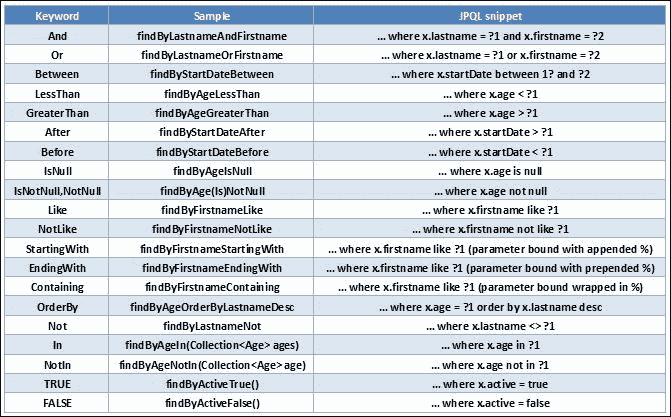

# 第十章：使用 Java 持久性和实体

在本章中，我们将开发以下配方：

+   在 Spring 中配置**Java 持久性 API**（**JPA**）

+   定义有用的 EJB3 实体和关系

+   利用 JPA 和 Spring Data JPA

# 介绍

**Java 持久化 API**（**JPA**）是一个规范，从 2006 年（JPA 1.0）到 2013 年（JPA 2.1）由一组各种专家发布了不同版本。从历史上看，它是 EJB 3.0 规范的三个部分之一，它随 JEE5 一起出现。

JPA 不仅仅是**企业 JavaBean**（**EJB**）的升级，它在很大程度上是一次完全的重新设计。当时，领先的对象关系映射解决方案提供商（如 Hibernate）和 J2EE 应用服务器提供商（如 WebSphere，JBoss）都参与其中，全局结果无疑更简单。所有类型的 EJB（有状态的，无状态的和实体）现在都是简单的**普通的旧 Java 对象**（**POJOs**），它们被特定的元数据丰富，这些元数据以注解的形式呈现。

## 实体的好处

实体在 EJB3 模型中扮演着关键角色。作为简单的 POJO，它们可以在应用程序的每一层中使用。

理想情况下，一个实体代表着业务领域内可识别的功能单元。通常是使一个实体代表数据库表行。作为简单的 POJO，实体可以依赖继承（IS-A 关系）并且可以有属性（HAS-A 关系），就像数据库模式通常描述的那样。通过这些关系，实体与其他实体建立连接。这些连接用`@Annotations`描述，这些注解构成了实体的元数据。

实体必须被视为数据库表行的应用程序等价元素。JPA 允许操作这个元素及其整个生态系统作为 Java 对象层次结构，并将其持久化为这样的对象。

实体已经带来了对持久化层的惊人革新（通过减少需要维护的硬编码 SQL 查询的数量），以及对服务和转换层的简化。能够通过所有层级（甚至在视图中使用），它们极大地驱动了应用程序中使用的领域特定名称和概念（方法，类和属性）。它们间接地专注于基本要素，并在应用程序概念和数据库概念之间强加一致性。

从一开始就拥有一个坚实而深思熟虑的模式显然是一个加分项。

### 注意

JPA 在 UI 应用程序上带来了惊人的性能和可维护性结果。然而，如果用于执行批处理或大量数据库操作，它可能并不总是符合性能期望。有时候，考虑直接使用 JDBC 访问可能更明智。

## 实体管理器及其持久化上下文

我们已经看到实体可以与其他实体有关系。为了我们能够对实体进行操作（从数据库中读取，更新，删除和持久化），有一个后台 API 生成 SQL 查询的准备工作。这个 API 在持久化提供者（Hibernate，Toplink 等）中被称为 EntityManager。一旦它为应用程序加载了对象，我们就可以信任它来管理其生命周期。

在继续之前，我们需要回顾一下与 EntityManager 相关的一些概念。一旦 EntityManager 从数据库读取（显式或隐式）获取了实体的实例，该实体就被管理。JPA 持久化上下文由整个受管理实体集的概念聚合形成。持久化上下文始终只携带一个实体的实例，通过其标识符（`@Id`或唯一 ID 类）进行区分。

如果由于某种原因，一个实体没有被管理，那么它被称为脱管（即脱离持久化上下文）。

# 在 Spring 中配置 Java 持久化 API

现在我们已经介绍了 JPA，它的作用以及使用实体的好处，我们现在可以专注于如何配置我们的 Spring 应用程序来处理它们。

## 准备工作

正如我们之前所说，JPA 是一个规范。选择持久性提供程序（Hibernate、OpenJPA、TopLink 等）或应用程序的数据库提供程序不会成为承诺，只要它们符合标准。

我们将看到，在 Spring 中，我们的 JPA 配置是通过定义两个 bean 来完成的：**dataSource**和**entityManagerFactory**。然后，可选的`Spring Data JPA`库提供了一个`JPA`存储库抽象，能够令一些数据库操作出人意料地简化。

## 如何做...

1.  从 Eclipse 的**Git Perspective**中，检出`v3.x.x`分支的最新版本。

1.  如前所介绍的，我们已经在 Spring 配置文件（核心模块中的`csmcore-config.xml`）中添加了一些 bean：

```java
<jpa:repositories base-package="edu.zc.csm.core.daos" />
<bean id="dataSource" class="org.sfw.jdbc.datasource.DriverManagerDataSource>
  <property name="driverClassName">
  <value>org.hsqldb.jdbcDriver</value>
  </property>
  <property name="url">
  <value>jdbc:hsqldb:mem:csm</value>
  </property>
  <property name="username">
  <value>sa</value>
  </property>
</bean>

<bean id="entityManagerFactory" class="org.sfw.orm.jpa.LocalContainerEntityManagerFactoryBean">
      <property name="persistenceUnitName" value="jpaData"/>
      <property name="dataSource" ref="dataSource" />
      <property name="jpaVendorAdapter">
      <beanclass="org.sfw.orm.jpa.vendor.HibernateJpaVendorAdapter"/>
      </property>
      <property name="jpaProperties">
      <props>
          <prop key="hibernate.dialect">
            org.hibernate.dialect.HSQLDialect
          </prop>
          <prop key="hibernate.show_sql">true</prop>
          <prop key="hibernate.format_sql">false</prop>
          <prop key="hibernate.hbm2ddl.auto">create-drop</prop>
          <prop key="hibernate.default_schema">public</prop>
      </props>
    </property>
</bean>
```

1.  最后，以下依赖项已添加到父项目和核心项目中：

+   `org.springframework.data:spring-data-jpa` (1.0.2.RELEASE)

+   `org.hibernate.javax.persistence:hibernate-jpa-2.0-api` (1.0.1.Final)

+   `org.hibernate:hibernate-core` (4.1.5.SP1)

添加此依赖项会导致 Maven 强制执行插件与`jboss-logging`引发版本冲突。这就是为什么 jboss-logging 已从这个第三方库中排除，并作为自己的依赖项引用的原因：

+   `org.hibernate:hibernate-entitymanager` (4.1.5.SP1)

`jboss-logging`也已从这个第三方库中排除，因为它现在被引用为自己的依赖项：

+   `org.jboss.logging:jboss-logging` (3.1.0.CR1)

+   `org.hsqldb:hsqldb` (2.3.2)

+   `org.javassist:javassist` (3.18.2-GA)

+   `org.apache.commons:commons-dbcp2` (2.0.1)

## 它是如何工作的...

我们将审查这三个配置点：**dataSource** bean、**entityManagerFactory** bean 和 Spring Data JPA。

### 由 Spring 管理的 DataSource bean

因为创建数据库连接是耗时的，特别是通过网络层，而且共享和重用已打开的连接或连接池是明智的，**数据源**有责任优化这些连接的使用。它是一个可扩展性指标，也是数据库和应用程序之间高度可配置的接口。

在我们的示例中，Spring 管理数据源就像管理任何其他 bean 一样。数据源可以通过应用程序创建，也可以通过 JNDI 查找远程访问（如果选择放弃连接管理给容器）。在这两种情况下，Spring 将管理配置的 bean，提供我们的应用程序所需的代理。

在我们的示例中，我们正在使用于 2014 年发布的 Apache Common DBCP 2 数据源。

### 提示

在生产环境中，切换到基于 JNDI 的数据源，例如本机 Tomcat JDBC 池，可能是一个好主意。

Tomcat 网站明确建议，在高并发系统上，使用 Tomcat JDBC 池而不是 DBCP1.x 可以显著提高性能。

### EntityManagerFactory bean 及其持久单元

正如其名称所示，`EntityManagerFactory` bean 生成实体管理器。`EntityManagerFactory`的配置条件了实体管理器的行为。

`EntityManagerFactory` bean 的配置反映了一个持久单元的配置。在 Java EE 环境中，可以在`persistence.xml`文件中定义和配置一个或多个持久单元，该文件在应用程序存档中是唯一的。

在 Java SE 环境中（我们的情况），使用 Spring 可以使`persistence.xml`文件的存在变得可选。`EntityManagerFactory` bean 的配置几乎完全覆盖了持久单元的配置。

持久单元的配置，因此`EntityManagerFactory` bean 的配置，可以声明覆盖的实体，也可以扫描包以找到它们。

### 注意

持久性单元可以被视为水平扩展生态系统中的一个子区域。产品可以被分解为每个功能区域的 war（web 存档）。功能区域可以用持久性单元限定的一组实体来表示。

主要的重点是避免创建与不同持久性单元重叠的实体。

### Spring Data JPA 配置

我们将使用 Spring Data JPA 项目中的一些非常有用的工具。这些工具旨在简化持久性层的开发（和维护）。最有趣的工具可能是存储库抽象。您将看到，为一些数据库查询提供实现可能是可选的。如果它们的声明符合标准，存储库接口的实现将在运行时从方法签名中生成。

例如，Spring 将推断以下方法`signature`的实现（如果`User`实体具有`String userName`字段）：

```java
List<User> findByUserName(String username);

```

Spring Data JPA 上我们的 bean 配置的更详细的例子可能是以下内容：

```java
<jpa:repositories base-package="edu.zipcloud.cloudstreetmarket.core.daos" 
    entity-manager-factory-ref="entityManagerFactory"
    transaction-manager-ref="transactionManager"/>
```

正如您所看到的，Spring Data JPA 包含一个自定义命名空间，允许我们定义以下存储库 bean。可以按照以下方式配置此命名空间：

+   在这个命名空间中提供`base-package`属性是强制性的，以限制 Spring Data repositories 的查找。

+   提供`entity-manager-factory-ref`属性是可选的，如果在`ApplicationContext`中只配置了一个`EntityManagerFactory` bean。它明确地连接`EntityManagerFactory`，用于检测到的 repositories。

+   如果在`ApplicationContext`中只配置了一个`PlatformTransactionManager` bean，提供`transaction-manager-ref`属性也是可选的。它明确地连接`PlatformTransactionManager`，用于检测到的 repositories。

有关此配置的更多详细信息，请访问项目网站：

[`docs.spring.io/spring-data/jpa/docs/1.4.3.RELEASE/reference/html/jpa.repositories.html`](http://docs.spring.io/spring-data/jpa/docs/1.4.3.RELEASE/reference/html/jpa.repositories.html)。

## 另请参阅

+   **HikariCP DataSource**：HikariCP（从其 BoneCP 祖先）是一个开源的 Apache v2 许可项目。它似乎在速度和可靠性方面表现比任何其他数据源都要好。在选择数据源时，现在可能应该考虑这个产品。有关更多信息，请参阅[`brettwooldridge.github.io/HikariCP`](https://brettwooldridge.github.io/HikariCP)。

# 定义有用的 EJB3 实体和关系

这个主题很重要，因为良好设计的映射可以防止错误，节省大量时间，并对性能产生重大影响。

## 准备工作

在本节中，我们将介绍大部分我们应用程序所需的实体。这里选择了一些实现技术（从继承类型到关系案例），并且为了示例目的进行了突出显示。

*它是如何工作的…*部分将解释为什么以及如何定义它们的方式，以及是什么思想驱使我们朝着我们所做的实体定义的方向前进。

## 如何做…

以下步骤将帮助您在应用程序中创建实体：

1.  这个配方的所有更改都位于新包`edu.zipcloud.cloudstreetmarket.core.entities`中。首先，按照这里所示创建了三个简单的实体：

+   `User`实体：

```java
  @Entity
  @Table(name="user")
  public class User implements Serializable{
    private static final long serialVersionUID = 1990856213905768044L;
    @Id
    @Column(nullable = false)
    private String loginName;
    private String password;
    private String profileImg;

  @OneToMany(mappedBy="user", cascade = {CascadeType.ALL}, fetch = FetchType.LAZY)
  @OrderBy("id desc")
  private Set<Transaction> transactions = new LinkedHashSet< >();
  ...
  }
```

+   `Transaction`实体：

```java
  @Entity
  @Table(name="transaction")
  public class Transaction implements Serializable{
    private static final long serialVersionUID = -6433721069248439324L;
    @Id
    @GeneratedValue
    private int id;

    @ManyToOne(fetch = FetchType.EAGER)
    @JoinColumn(name = "user_name")
    private User user;

    @Enumerated(EnumType.STRING)
    private Action type;

    @OneToOne(fetch = FetchType.EAGER)
    @JoinColumn(name = "stock_quote_id")
    private StockQuote quote;
    private int quantity;
  ...
  }
```

+   还有`Market`实体：

```java
  @Entity
  @Table(name="market")
  public class Market implements Serializable {
    private static final long serialVersionUID = -6433721069248439324L;
    @Id
  private String id;
  private String name;

  @OneToMany(mappedBy = "market", cascade = { CascadeType.ALL }, fetch = FetchType.EAGER)
  private Set<Index> indices = new LinkedHashSet<>();
  ...
  }
```

1.  然后，我们创建了一些更复杂的实体类型，比如抽象的`Historic`实体：

```java
@Entity
@Inheritance(strategy = InheritanceType.SINGLE_TABLE)
@DiscriminatorColumn(name = "historic_type")
@Table(name="historic")
public abstract class Historic {

  private static final long serialVersionUID = -802306391915956578L;

  @Id
  @GeneratedValue
  private int id;

  private double open;

  private double high;

  private double low;

  private double close;

  private double volume;

  @Column(name="adj_close")
  private double adjClose;

  @Column(name="change_percent")
  private double changePercent;

  @Temporal(TemporalType.TIMESTAMP)
  @Column(name="from_date")
  private Date fromDate;

  @Temporal(TemporalType.TIMESTAMP)
  @Column(name="to_date")
  private Date toDate;

  @Enumerated(EnumType.STRING)
  @Column(name="interval")
private QuotesInterval interval;
...
  }
```

我们还创建了两个 Historic 子类型，`HistoricalIndex`和`HistoricalStock`：

```java
  @Entity
  @DiscriminatorValue("idx")
  public class HistoricalIndex extends Historic implements Serializable {

  private static final long serialVersionUID = -802306391915956578L;

  @ManyToOne(fetch = FetchType.EAGER)
  @JoinColumn(name = "index_code")
  private Index index;
...
}
@Entity
@DiscriminatorValue("stk")
public class HistoricalStock extends Historic implements Serializable {

  private static final long serialVersionUID = -802306391915956578L;

  @ManyToOne(fetch = FetchType.LAZY)
  @JoinColumn(name = "stock_code")
  private StockProduct stock;

  private double bid;
  private double ask;
  ...
    }
```

1.  然后，我们还创建了带有其 StockProduct 子类型的`Product`实体：

```java
    @Entity
    @Inheritance(strategy = InheritanceType.TABLE_PER_CLASS)
    public abstract class Product {
      private static final long serialVersionUID = -    802306391915956578L;
      @Id
      private String code;
      private String name;
      ...
    }

    @Entity
    @Table(name="stock")
    public class StockProduct extends Product implements Serializable{
      private static final long serialVersionUID = 1620238240796817290L;
      private String currency;
      @ManyToOne(fetch = FetchType.EAGER)
      @JoinColumn(name = "market_id")
      private Market market;
      ...
    }
```

1.  实际上，在金融世界中，指数（标普 500 或纳斯达克）不能直接购买；因此，指数没有被视为产品：

```java
@Entity
@Table(name="index_value")
public class Index implements Serializable{
  private static final long serialVersionUID = -2919348303931939346L;
  @Id
  private String code;
  private String name;

  @ManyToOne(fetch = FetchType.EAGER)
  @JoinColumn(name = "market_id", nullable=true)
  private Market market;

  @ManyToMany(fetch = FetchType.LAZY)
  @JoinTable(name = "stock_indices", joinColumns={@JoinColumn(name = "index_code")}, inverseJoinColumns={@JoinColumn(name ="stock_code")})
  private Set<StockProduct> stocks = new LinkedHashSet<>();
  ...
}
```

1.  最后，具有两个子类型`StockQuote`和`IndexQuote`的`Quote`抽象实体已经创建（指数不是产品，但我们仍然可以从中获得即时快照，并且稍后将调用 Yahoo!财务数据提供商来获取这些即时报价）：

```java
@Entity
@Inheritance(strategy = InheritanceType.TABLE_PER_CLASS)
public abstract class Quote {
  @Id
  @GeneratedValue(strategy = GenerationType.TABLE)
  protected Integer id;
  private Date date;
  private double open;

  @Column(name = "previous_close")
  private double previousClose;
  private double last;
  ...
}

@Entity
@Table(name="stock_quote")
public class StockQuote extends Quote implements Serializable{
  private static final long serialVersionUID = -8175317254623555447L;
  @ManyToOne(fetch = FetchType.EAGER)
  @JoinColumn(name = "stock_code")
  private StockProduct stock;
  private double bid;
  private double ask;
  ...
}

@Entity
@Table(name="index_quote")
public class IndexQuote extends Quote implements Serializable{
  private static final long serialVersionUID = -8175317254623555447L;

  @ManyToOne(fetch = FetchType.EAGER)
  @JoinColumn(name = "index_code")
  private Index index;
  ...
}
```

## 工作原理...

我们将介绍一些基本和更高级的概念，这些概念我们用来构建我们的关系映射。

### 实体要求

要被 API 视为实体，实体需要满足以下条件：

+   它必须在类型级别上用`@Entity`注解进行注释。

+   它需要具有已定义的**标识符**，可以是基本类型或复杂类型。在大多数情况下，基本标识符就足够了（在特定实体字段上的`@Id`注解）。

+   它必须被定义为 public 并且不能声明为 final。

+   它需要有一个默认构造函数（隐式或非隐式）。

### 映射模式

数据库和 Java 对象都有特定的概念。实体的元数据注解以及默认配置描述了关系映射。

#### 映射表

实体类映射一个表。在类型级别上不指定`@Table(name="xxx")`注解将实体类映射到以实体名称命名的表（这是默认命名）。

### 注意

Java 的类命名标准是驼峰式命名，首字母大写。这种命名方案实际上并不符合数据库表命名标准。因此，经常使用`@Table`注解。

`@Table`注解还具有一个可选的`schema`属性，允许我们在 SQL 查询中将表绑定到模式（例如`public.user.ID`）。这个`schema`属性将覆盖默认的模式 JPA 属性，可以在持久性单元上定义。

#### 映射列

与表名一样，将字段映射到列名是使用`@Column(name="xxx")`注解指定的。同样，这个注解是可选的，不指定将使映射回退到默认命名方案，即字段的大小写名称（在单词的情况下，这通常是一个不错的选择）。

实体类的字段不能定义为 public。还要记住，几乎可以持久化所有标准的 Java 类型（原始类型、包装器、字符串、字节或字符数组和枚举）以及大型数值类型，如`BigDecimals`或`BigIntegers`，还有 JDBC 时间类型（`java.sql.Date`、`java.sql.TimeStamp`）甚至可序列化对象。

#### 注释字段或 getter

实体的字段（如果未标记为`@Transient`）对应于数据库行每列将具有的值。还可以从 getter 中定义列映射（而不一定要有相应的字段）。

`@Id`注解定义了实体标识符。同时，在字段或 getter 上定义这个`@Id`注解会定义表列是应该由字段还是 getter 映射的。

当使用 getter 访问模式时，如果未指定`@Column`注解，则列名的默认命名方案使用 JavaBeans 属性命名标准（例如，`getUser()` getter 对应于`user`列）。

#### 映射主键

正如我们已经看到的，`@Id`注解定义了实体的标识符。持久性上下文将始终管理具有单个标识符的实体的不超过一个实例。

`@Id`注解在实体类上必须映射表的持久标识符，即主键。

#### 标识符生成

`@GeneratedValue`注解允许从 JPA 级别生成 ID。在对象持久化之前，这个值可能不会被填充。

`@GeneratedValue`注解具有`strategy`属性，用于配置生成方法（例如，依赖于现有的数据库序列）。

### 定义继承

我们已经为“产品”、“历史”和“报价”的子类型定义了实体继承。当两个实体足够接近以被分组为单一概念，并且如果它们实际上可以与应用程序中的父实体关联，那么值得使用 JPA 继承。

根据特定数据的持久化策略，可以考虑不同的存储选项来进行继承映射。

JPA 允许我们从不同的策略中配置继承模型。

#### 单表策略

这种策略期望或创建一个带有模式上的鉴别器字段的大表。这个表包含父实体字段；这些字段对所有子实体都是通用的。它还包含所有子实体类的字段。因此，如果一个实体对应于一个子类型或另一个子类型，它将填充特定字段并留下其他字段为空。

以下表格代表了具有其`HISTORIC_TYPE`鉴别器的`Historic`表：


#### 表格每类策略

这种策略针对具体实体使用特定的表。这里没有涉及鉴别器，只是针对子类型的特定表。这些表包含通用和特定字段。

例如，我们已经为“报价”实体及其具体的“股票报价”和“指数报价”实体实施了这种策略：


### 定义关系

实体具有反映其类属性中的数据库外键和表与表之间关系的能力。

在应用程序端，由于这些关系是由实体管理器透明地构建的，因此可以绕过大量的开发工作。

#### 实体之间的关系是如何选择的

在讨论实体之间的关系之前，有必要了解我们计划在*cloudstreet-market*应用程序中做什么。

正如在第一章中介绍的，企业 Spring 应用程序的设置例程，我们将从开放其 API 的提供者（实际上是 Yahoo!）那里获取财务数据。为此，始终需要牢记每个 IP 或经过身份验证的用户的调用频率方面的限制。我们的应用程序还将在其内部拥有社区，其中将共享财务数据。对于财务数据提供者来说，当谈论给定股票时，股票的历史视图和股票的即时报价是两个不同的概念。我们必须处理这两个概念来构建我们自己的数据集。

在我们的应用程序中，用户将能够通过执行“交易”来购买和出售“产品”（股票、基金、期权等）：

+   首先，让我们考虑用户/交易关系的以下截图：

+   一个“用户”实体可以有多个“交易”实体。

### 注意

在用户类中，`@OneToMany`关系注解的第二部分（`Many`元素）驱动我们正在创建的属性类型。将`Many`指定为第二部分声明了起源实体（`User`）可以有多个目标实体（`Transactions`）。这些目标将必须包含在一个集合类型中。如果起源实体不能有多个目标，则关系的第二部分必须是`One`。

+   一个“交易”只能有一个“用户”实体。

### 注意

在用户类中，`@OneToMany`关系的第一部分（`@One`元素）是目标实体中定义的关系注解的第二部分（如果已定义）。必须知道目标实体是否可以有多个起源，以便完成起源中的注解。

+   然后我们可以推断出两个注解：`User`中的`@OneToMany`和`Transactions`中的`@ManyToOne`。

+   如果我们不是`@ManyToMany`关系的情况，我们谈论的是单向关系。从数据库的角度来看，这意味着两个表中的一个具有指向另一个表的连接列。在 JPA 中，具有这个连接列的表是关系的**所有者**。

### 提示

关系的所有者实体必须在关系上指定一个`@JoinColumn`注解。不是所有者的实体必须为其关系注解提供一个`mappedBy`属性，该属性指向相对实体中的相应 Java 字段名称。

+   这可以解释`Transaction`中的关系：

```java
@ManyToOne(fetch = FetchType.EAGER)
@JoinColumn(name = "user_name")
private User user;
```

`user_name`列预期（或自动添加）在交易表中。我们将在*还有更多……部分*中讨论 fetch 类型。

+   `User`实体中的关系定义如下：

```java
  @OneToMany(mappedBy="user", cascade ={CascadeType.ALL}, fetch = FetchType.LAZY)
  @OrderBy("id desc")
  private Set<Transaction> transactions = new LinkedHashSet<>();
```

### 提示

`@OrderBy`注解告诉 JPA 实现在其 SQL 查询中添加一个`ORDER BY`子句。

一个`Index`实体有一个`Market`实体。我们决定市场是地理区域（欧洲、美国、亚洲等）。一个市场有几个具体的指数。

这看起来又像是`@OneToMany`/`@ManyToOne`关系。关系的所有者是`Index`实体，因为我们期望在`Index`表中有一个`Market`列（而不是`Market`表中的`Index`列）。

在具体的`Product`（如`StockProduct`）和`Market`实体之间，情况与之前类似，只是因为在应用程序中直接从`Market`检索股票看起来不是必需的，关系没有在`Market`实体方面声明。我们只保留了所有者方面。

关于具体的`Quotes`实体（如`StockQuote`）和具体的`Products`实体（如`StockProduct`），一个报价将有一个产品。如果我们有兴趣从`Product`实体中检索`Quote`，一个产品将有多个报价。关系的所有者是具体的`Quote`实体。

对于`IndexQuote`和`Index`，情况与之前的点相同。

在`Index`和`StockProduct`之间，实际上，指数（标普 500、纳斯达克等）有组成部分，组成部分的值之和构成指数值。因此，一个`Index`实体有几个潜在的`StockProduct`实体。同样，一个`StockProduct`可以属于几个`Indices`。这看起来像是一个双向关系。我们在这里展示了`Index`方面：

```java
@ManyToMany(fetch = FetchType.LAZY)
@JoinTable(name = "stock_indices", joinColumns={@JoinColumn(name = "index_code")}, inverseJoinColumns={@JoinColumn(name ="stock_code")})
private Set<StockProduct> stocks = new LinkedHashSet<>();
```

这个关系指定了一个额外的连接表（JPA 预期或生成的）。基本上是一个具有两个连接列指向各自实体的`@Ids`字段的表。

## 还有更多...

我们将讨论两个尚未解释的元数据属性：`FetchType`属性和`Cascade`属性。

### FetchType 属性

我们已经看到关系注解`@OneToOne`、`@OneToMany`和`@ManyToMany`可以在 fetch 属性中指定，可以是`FetchType.EAGER`或`FetchType.LAZY`。

当选择`FetchType.EAGER`属性时，当实体被管理时，关系会被`entityManager`自动加载。JPA 执行的 SQL 查询总量显著增加，特别是因为一些可能每次都不需要的相关实体仍然被加载。如果我们有两个、三个或更多级别的实体绑定到根实体，我们可能应该考虑将一些字段本地切换到`FetchType.LAZY`。

`FetchType.LAZY`属性指定 JPA 实现在实体加载的 SQL 查询中不填充字段值。当程序明确要求时（例如，在`HistoricalStock`实体的情况下调用`getStock()`时），JPA 实现会生成额外的异步 SQL 查询来填充`LAZY`字段。在使用 Hibernate 作为实现时，`FetchType.LAZY`被视为关系的默认获取类型。

重要的是要考虑减轻关系加载的负担，特别是在集合上。

### 级联属性

在关系注解中要提到的另一个属性是 Cascade 属性。这个属性可以取值`CascadeType.DETACH`、`CascadeType.MERGE`、`CascadeType.PERSIST`、`CascadeType.REFRESH`、`CascadeType.REMOVE`和`CascadeType.ALL`。

这个属性指定了 JPA 实现在被要求对主实体执行操作（如持久化、更新、删除、查找等）时应该如何处理相关实体。这是一个可选属性，通常默认为**不进行级联操作**。

## 另请参阅

有第三种定义实体继承的策略：

+   **联接表继承策略**：我们还没有实现它，但这个策略与表对应的类策略有些相似。它与之不同之处在于，JPA 不会在具体的表中重复父实体字段（列），而是创建或期望一个只包含父实体列的额外表，并通过这个表透明地管理连接。

# 利用 JPA 和 Spring Data JPA

在本节中，我们将为我们的应用程序连接所需的业务逻辑。

因为我们已经为 JPA 和 Spring Data JPA 设置了配置，并且已经定义了我们的实体及其关系，现在我们可以使用这个模型来节省时间和精力。

## 如何做...

以下步骤将指导您完成这些更改：

1.  在`edu.zipcloud.cloudstreetmarket.core.daos`包中，我们可以找到以下两个接口：

```java
public interface HistoricalIndexRepository {
  Iterable<HistoricalIndex> findIntraDay(String code, Date of);
  Iterable<HistoricalIndex> findLastIntraDay(String code);
  HistoricalIndex findLastHistoric(String code);
}
public interface TransactionRepository {
  Iterable<Transaction> findAll();
  Iterable<Transaction> findByUser(User user);
  Iterable<Transaction> findRecentTransactions(Date from);
  Iterable<Transaction> findRecentTransactions(int nb);
}
```

1.  这两个接口都带有各自的实现。其中两个中的`HistoricalIndexRepositoryImpl`实现定义如下：

```java
@Repository
public class HistoricalIndexRepositoryImpl implements HistoricalIndexRepository{

  @PersistenceContext 
  private EntityManager em;

  @Override
  public Iterable<HistoricalIndex> findIntraDay(String code,Date of){
    TypedQuery<HistoricalIndex> sqlQuery = em.createQuery("from HistoricalIndex h where h.index.code = ? and h.fromDate >= ? and h.toDate <= ? ORDER BY h.toDate asc", HistoricalIndex.class);

    sqlQuery.setParameter(1, code);
    sqlQuery.setParameter(2, DateUtil.getStartOfDay(of));
    sqlQuery.setParameter(3, DateUtil.getEndOfDay(of));

    return sqlQuery.getResultList();
  }

  @Override
  public Iterable<HistoricalIndex> findLastIntraDay(String code) {
    return findIntraDay(code,findLastHistoric(code).getToDate());
  }

  @Override
  public HistoricalIndex findLastHistoric(String code){
     TypedQuery<HistoricalIndex> sqlQuery =  em.createQuery("from HistoricalIndex h where h.index.code = ? ORDER BY h.toDate desc", HistoricalIndex.class);

  sqlQuery.setParameter(1, code);

    return sqlQuery.setMaxResults(1).getSingleResult();
  }
}
```

`TransactionRepositoryImpl`的实现如下：

```java
@Repository
public class TransactionRepositoryImpl implements TransactionRepository{
  @PersistenceContext 
  private EntityManager em;
  @Autowired
  private TransactionRepositoryJpa repo;
  @Override
  public Iterable<Transaction> findByUser(User user) {
    TypedQuery<Transaction> sqlQuery = em.createQuery("from Transaction where user = ?", Transaction.class);
    return sqlQuery.setParameter(1, user).getResultList();
  }
  @Override
  public Iterable<Transaction> findRecentTransactions(Date from) {
    TypedQuery<Transaction> sqlQuery = em.createQuery("from Transaction t where t.quote.date >= ?", Transaction.class);
    return sqlQuery.setParameter(1, from).getResultList();
  }
  @Override
  public Iterable<Transaction> findRecentTransactions(int nb) {
  TypedQuery<Transaction> sqlQuery = em.createQuery("from Transaction t ORDER BY t.quote.date desc", Transaction.class);
    return sqlQuery.setMaxResults(nb).getResultList();
  }
  @Override
  public Iterable<Transaction> findAll() {
    return repo.findAll();
  }
}
```

1.  `dao`包中的所有其他接口都没有明确定义的实现。

1.  以下 bean 已经添加到 Spring 配置文件中：

```java
  <jdbc:initialize-database data-source="dataSource">
      <jdbc:script location="classpath:/META-INF/db/init.sql"/>
  </jdbc:initialize-database>
```

1.  这个最后的配置允许应用在启动时执行创建的`init.sql`文件。

1.  您会注意到`cloudstreetmarket-core`模块已经在其`pom.xml`文件中添加了一个依赖项，即我们创建的`zipcloud-core`的`DateUtil`类。

1.  为了替换我们在第二章中创建的两个虚拟实现，*使用 Spring MVC 设计微服务架构*，已经创建了`CommunityServiceImpl`和`MarketServiceImpl`的实现。

### 注意

我们使用`@Autowired`注解在这些实现中注入了存储库依赖。

另外，我们使用声明的`value`标识符为这两个实现添加了 Spring `@Service`注解：

```java
@Service(value="marketServiceImpl")
@Service(value="communityServiceImpl")
```

1.  在`cloudstreetmarket-webapp`模块中，`DefaultController`已经在其`@Autowired`字段中修改为针对这些新实现，而不再是虚拟的。这是通过在`@Autowired`字段上指定`@Qualifier`注解来实现的。

1.  启动服务器并调用主页 URL，`http://localhost:8080/portal/index`，应该在控制台中记录一些 SQL 查询：

另外，**欢迎**页面应该保持不变。

## 它是如何工作的...

让我们通过以下几个部分来分解这个配方。

### 注入 EntityManager 实例

我们在本章的第一个配方中看到，`entityManagerFactory` bean 的配置反映了持久化单元的配置。

由容器历史创建的 EntityManagers 需要处理事务（用户或容器管理器事务）。

`@PersistenceContext`注解是一个 JPA 注解。它允许我们注入一个由容器管理生命周期的 EntityManager 实例。在我们的情况下，Spring 处理了这个角色。有了 EntityManager，我们可以与持久化上下文交互，获取受管理或分离的实体，并间接地查询数据库。

### 使用 JPQL

使用**Java 持久化查询语言**（**JPQL**）是一种标准化的查询持久化上下文和间接地查询数据库的方式。JPQL 在语法上类似于 SQL，但是操作的是 JPA 管理的实体。

你一定注意到了存储库中的以下查询：

```java

from Transaction where user = ?

```

查询的选择部分是可选的。参数可以注入到查询中，这一步由持久性提供者的实现来管理。这些实现提供了防止 SQL 注入的保护（使用预编译语句）。通过这个例子，看看过滤子实体属性有多实用：

```java

from Transaction t where t.quote.date >= ?

```

在适当的情况下，它避免了声明连接。尽管如此，我们仍然可以声明`JOIN`：

```java

from HistoricalIndex h where h.index.code = ? ORDER BY h.toDate desc

```

一些关键字（如`ORDER`）可以作为 JPQL 的一部分来操作通常在 SQL 中可用的函数。在 JavaEE 6 教程的 JPQL 语法中找到关键字的完整列表：[`docs.oracle.com/javaee/6/tutorial/doc/bnbuf.html`](http://docs.oracle.com/javaee/6/tutorial/doc/bnbuf.html)。

JPQL 受到早期创建的**Hibernate 查询语言**（**HQL**）的启发。

### 使用 Spring Data JPA 减少样板代码

我们在*如何做…*部分讨论了一些我们的存储库接口没有明确定义实现的情况。这是 Spring Data JPA 非常强大的功能。

#### 查询创建

我们的`UserRepository`接口定义如下：

```java
@Repository
public interface UserRepository extends JpaRepository<User, String>{
  User findByUserName(String username);
  User findByUserNameAndPassword(String username, String password);
}
```

我们让它扩展了`JpaRepository`接口，通过通用类型`User`（这个存储库将关联的实体类型）和`String`（用户标识字段的类型）。

通过扩展`JpaRepository`，`UserRepository`从 Spring Data JPA 获得了定义查询方法的能力，只需声明它们的方法签名。我们已经在方法`findByUserName`和`findByUserNameAndPassword`中这样做了。

Spring Data JPA 会在运行时透明地创建我们的`UserRepository`接口的实现。它会根据我们在接口中命名方法的方式推断 JPA 查询。关键字和字段名用于这种推断。

从 Spring Data JPA 文档中找到以下关键字表：



在不指定任何配置的情况下，我们已经默认回到了 JPA 存储库的配置，它会注入我们单一的`EntityManagerFactory` bean 的实例和我们单一的`TransactionManager` bean 的实例。

我们的自定义`TransactionRepositoryImpl`是一个示例，它同时使用自定义的 JPQL 查询和`JpaRepository`实现。正如你可能猜到的那样，在`TransactionRepositoryImpl`中自动装配的`TransactionRepositoryJpa`实现继承了用于保存、删除和查找`Transaction`实体的多个方法。

我们还将使用这些方法提供的有趣的分页功能。我们提取的`findAll()`方法就是其中之一。

#### 持久化实体

Spring Data JPA 还指定了以下内容：

可以通过`CrudRepository.save(…)`方法来保存实体。它将使用底层的 JPA EntityManager 来持久化或合并给定的实体。如果实体尚未持久化，Spring Data JPA 将通过调用`entityManager.persist(…)`方法来保存实体；否则，将调用`entityManager.merge(…)`方法。

这是一个有趣的行为，我们将再次使用它来减少大量样板代码。

## 还有更多...

还有更多可以探索的方面。

### 使用本地 SQL 查询

我们还没有使用原生 SQL 查询，但我们将会使用。了解如何实现它们很重要，因为有时绕过 JPA 层在性能上可能是更好的选择。

以下链接指向 Oracle 网站的一篇文章，与原生 SQL 查询相关，非常有趣。

[`www.oracle.com/technetwork/articles/vasiliev-jpql-087123.html`](http://www.oracle.com/technetwork/articles/vasiliev-jpql-087123.html)

### 交易

我们还没有对我们的存储库实现应用任何特定的事务配置。有关事务的更多详细信息，请参阅第七章，“开发 CRUD 操作和验证”。

## 另请参阅

+   Spring Data 存储库的自定义实现：通过重新定义我们从 TransactionRepositoryJpa 中需要的方法的示例 TransactionRepositoryImpl，我们提出了创建数据存储库的自定义实现的模式。这在某种程度上迫使我们维护一个中间代理。相关的 Spring 文档提出了解决这个问题的不同技术。这种技术在[`docs.spring.io/spring-data/jpa/docs/current/reference/html/#repositories.custom-implementations`](http://docs.spring.io/spring-data/jpa/docs/current/reference/html/#repositories.custom-implementations)上有详细介绍。

