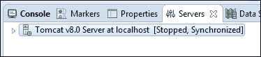
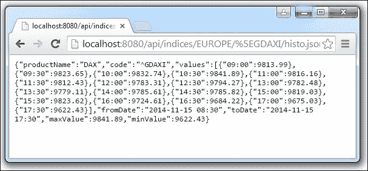
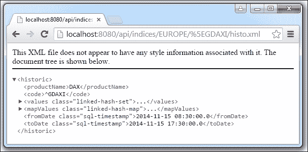
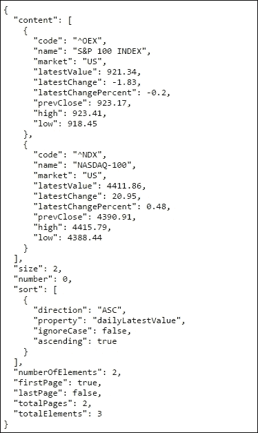
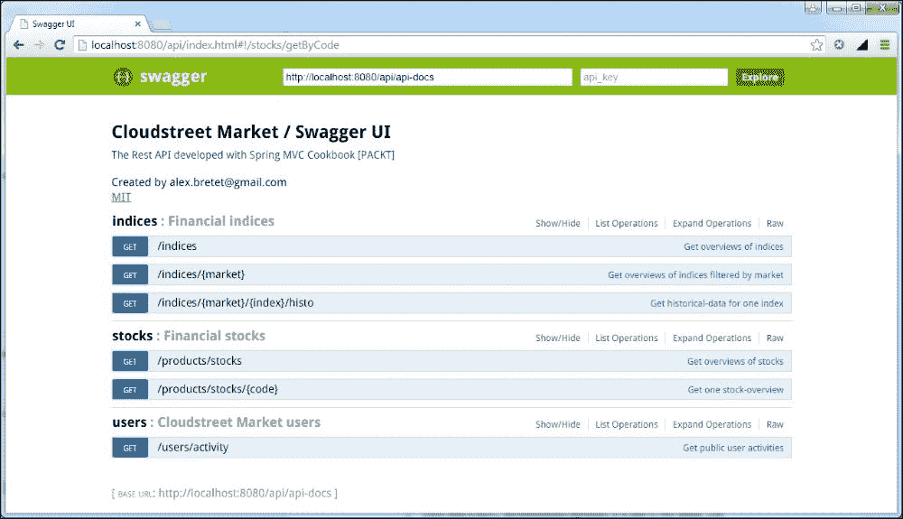

# 第十一章：为无状态架构构建 REST API

本章将介绍以下配方：

+   绑定请求和编组响应

+   配置内容协商（`json`、`xml`等）

+   添加分页、过滤和排序功能

+   全局处理异常

+   使用 Swagger 文档化和公开 API

# 介绍

在本章中，将实施相当多的变化。实际上，这一章真正加速了我们的应用程序开发。

在深入了解代码之前，我们需要复习一下关于 REST 的一些概念。

## REST 的定义

REST 是一种架构风格。它的名称是表述状态转移的缩写。这个术语是由 HTTP 规范的主要作者之一 Roy Fielding 发明的。REST 架构围绕着一些标记设计：

+   可识别资源：资源定义了领域。资源必须通过 URI 进行标识。这个 URI 必须尽可能清晰地使用资源类别和层次结构。我们的资源将是指数快照、股票快照、历史指数数据、历史股票数据、用户等等。

+   HTTP 作为通信协议：我们使用有限数量的 HTTP 方法（`GET`、`POST`、`PUT`、`DELETE`、`HEAD`和`OPTIONS`）与资源进行交互。

+   资源表示：资源以特定的表示形式呈现。表示通常对应于媒体类型（`application/json`、`application/xml`、`text/html`）和/或文件扩展名（`*.json`、`*.xml`、`*.html`）。

+   无状态对话：服务器不得保留对话的痕迹。禁止使用 HTTP 会话，而是通过资源提供的链接（超媒体）进行导航。客户端身份验证在每个请求中都会重复。

+   可扩展性：无状态设计意味着易于扩展。一个请求可以分派到一个或另一个服务器。这是负载均衡器的作用。

+   超媒体：正如我们刚才提到的，资源带来了链接，这些链接驱动了对话的转换。

## RESTful CloudStreetMarket

从本章开始，所有实现的数据检索现在都使用 AngularJS 通过 REST 处理。我们使用 Angular 路由来完成单页应用程序设计（从服务器加载一次）。还有一些新的服务，支持关于股票和指数的三个新屏幕。

尽管 REST 实现仍然是部分的。我们只实现了数据检索（`GET`）；我们还没有有效的身份验证，超媒体也将在以后介绍。

# 绑定请求和编组响应

这个配方解释了如何配置 Spring MVC 以使 REST 处理程序尽可能与其业务领域集成。我们专注于设计自解释的方法处理程序，外部化类型转换以及抽象响应编组（序列化为特定格式，如`json`，`xml`，`csv`等）。

## 准备工作

我们将审查应用于`cloudstreetmarket-api` webapp 的配置更改，以便从请求参数或 URI 模板变量设置类型转换。

我们将看到如何配置自动编组（用于响应）为`json`。我们将专注于为本章创建的两个非常简单的方法处理程序。

## 如何做...

以下步骤描述了与请求绑定和响应编组配置相关的代码库更改：

1.  在 Eclipse 的**Git Perspective**中，检出分支`v4.x.x`的最新版本。然后在`cloudstreetmarket-parent`模块上运行`maven clean install`命令。要这样做，右键单击模块，选择**Run as...** | **Maven Clean**，然后再次选择**Run as...** | **Maven Install**。之后，选择**Maven Update Project**以将 Eclipse 与 Maven 配置同步。要这样做，右键单击模块，然后选择**Maven** | **Update Project...**。

1.  主要的配置更改在`dispatcher-context.xml`文件中（在**cloudstreetmarket-api**模块中）。已定义`RequestMappingHandlerAdapter` bean 的三个`webBindingInitializer`，`messageConverters`和`customArgumentResolvers`属性：

```java
<bean class="org.sfw.web...
  method.annotation.RequestMappingHandlerAdapter">
  <property name="webBindingInitializer">
    <bean class="org.sfw...
     support.ConfigurableWebBindingInitializer">
      <property name="conversionService" ref="conversionService"/>
    </bean>
    </property>
  <property name="messageConverters">
    <list>
        <ref bean="jsonConverter"/>
      </list>
  </property>
  <property name="customArgumentResolvers">
    <list>
      <bean class="net.kaczmarzyk.spring.data.jpa.web.
      SpecificationArgumentResolver"/>
      <bean	class="org.sfw.data.web.PageableHandlerMethodArgumentResolver">
          <property name="pageParameterName" value="pn"/>
          <property name="sizeParameterName" value="ps"/>
          </bean>
    </list>
  </property>
  <property name="requireSession" value="false"/>
</bean>

<bean id="jsonConverter" class="org.sfw...
    converter.json.MappingJackson2HttpMessageConverter">
    <property name="supportedMediaTypes" value="application/json"/>
  <property name="objectMapper">
    <bean class="com.fasterxml.jackson. databind.ObjectMapper">
      <property name="dateFormat">
     <bean class="java.text.SimpleDateFormat">
       <constructor-arg type="java.lang.String" value="yyyy-MM-dd HH:mm"/>
       </bean>
      </property>
    </bean>
    </property>
</bean>
<bean id="conversionService" class="org.sfw.format.support.FormattingConversionServiceFactoryBean">
  <property name="converters">
    <list>
      <bean class="edu.zc.csm.core. converters.StringToStockProduct"/>
    </list>
  </property>
</bean>
```

1.  以下 Maven 依赖项已添加到父项目（间接添加到核心和 API 项目）中：

```java
      <dependency>
         <groupId>com.fasterxml.jackson.core</groupId>
             <artifactId>jackson-annotations</artifactId>
             <version>2.5.1</version>
       </dependency>
         <dependency>
             <groupId>com.fasterxml.jackson.core</groupId>
             <artifactId>jackson-databind</artifactId>
             <version>2.5.1</version>
         </dependency>
         <dependency>
             <groupId>commons-collections</groupId>
             <artifactId>commons-collections</artifactId>
             <version>3.2</version>
         </dependency>
         <dependency>
             <groupId>net.kaczmarzyk</groupId>
             <artifactId>specification-arg-resolver</artifactId>
             <version>0.4.1</version>
         </dependency>
```

1.  在我们控制器的超类`CloudstreetApiWCI`中，使用`@InitBinder`注解创建了`allowDateBinding`方法：

```java
  private DateFormat df = new SimpleDateFormat("yyyy-MM-dd");

  @InitBinder
  public void allowDateBinding ( WebDataBinder binder ){
    binder.registerCustomEditor( Date.class, new CustomDateEditor( df, true ));
  }
```

1.  所有这些配置使我们能够定义自解释和无逻辑的方法处理程序，例如`IndexController`中的`getHistoIndex()`方法：

```java
  @RequestMapping(value="/{market}/{index}/histo", method=GET)
  public HistoProductDTO getHistoIndex(
    @PathVariable("market") MarketCode market, 
    @PathVariable("index") String indexCode,
    @RequestParam(value="fd",defaultValue="") Date fromDate,
    @RequestParam(value="td",defaultValue="") Date toDate,
    @RequestParam(value="i",defaultValue="MINUTE_30") QuotesInterval interval){
    return marketService.getHistoIndex(indexCode, market, fromDate, toDate, interval);
  }
```

1.  现在部署`cloudstreetmarket-api`模块并重新启动服务器。要这样做，首先在**服务器**选项卡中右键单击 Tomcat 服务器：

1.  然后从右键菜单中选择**添加和删除...**。在添加和删除...窗口中，确保已设置以下配置，并启动服务器。

1.  尝试调用 URL `http://localhost:8080/api/indices/EUROPE/^GDAXI/histo.json`。

1.  此 URL 针对所呈现的`getHistoIndex`方法处理程序，并生成以下`json`输出：

1.  现在让我们看看`StockProductController`。它托管以下方法处理程序：

```java
@RequestMapping(value="/{code}", method=GET)
@ResponseStatus(HttpStatus.OK)
public StockProductOverviewDTO getByCode(
@PathVariable(value="code") StockProduct stock){
  return StockProductOverviewDTO.build(stock);
}
```

### 提示

这里没有对任何服务层进行显式调用。方法处理程序的返回类型是`StockProductOverviewDTO`，这是一个简单的 POJO。响应主体的编组是透明进行的。

1.  在**cloudstreetmarket-core**模块中，必须呈现`StringToStockProduct`转换器，因为它是实现前一步所需的：

```java
@Component
public class StringToStockProduct implements Converter<String, StockProduct> {

@Autowired
private ProductRepository<StockProduct> productRepository;

@Override
public StockProduct convert(String code) {
  StockProduct stock = productRepository.findOne(code);
  if(stock == null){
    throw new NoResultException("No result has been found for the value "+ code +" !");
  }
  return stock;
}
}
```

### 提示

此转换器已在*步骤 2*中注册到`conversionService`。

1.  尝试调用 URL `http://localhost:8080/api/products/stocks/NXT.L.json`。这应该针对所呈现的`getByCode`处理程序，并生成以下`json`响应：

## 它是如何工作的...

要了解前面的元素如何一起工作，我们必须介绍`RequestMappingHandlerAdapter`的关键作用。

### 一个超级 RequestMappingHandlerAdapter bean

我们在第二章中简要介绍了`RequestMappingHandlerAdapter`，*使用 Spring MVC 设计微服务架构*。这个 bean 实现了高级的`HandlerAdapter`接口，允许自定义 MVC 核心工作流实现。`RequestMappingHandlerAdapter`是框架自带的原生实现。

我们提到`RequestMappingHandlerAdapter`和`RequestMappingHandlerMapping`分别是现在已经弃用的`AnnotationMethodHandlerAdapter`和`DefaultAnnotationHandlerMapping`的两个替代类。

实际上，`RequestMappingHandlerAdapter`为所有方法处理程序提供了更好的集中化。此外，一些新的功能已经为`HandlerInterceptors`和`HandlerExceptionResolver`打开。

### 提示

实际上，在`preHandle`、`postHandle`和`afterCompletion`方法的签名中可以找到的处理程序参数（`WebContentInterceptors`）可以被转换为`HandlerMethod`对象。`HandlerMethod`类型提供了一些有趣的检查方法，比如`getReturnType`、`getMethodAnnotation`、`getMethodParameters`。

此外，关于`RequestMappingHandlerAdapter`和`RequestMappingHandlerMapping`，Spring 文档指定：

|   | *"MVC 命名空间和 MVC Java 配置默认情况下启用了新的支持类，但如果不使用这两者，则必须显式配置。"* |   |
| --- | --- | --- |
|   | --*JavaDoc* |

在我们的 web 应用程序中，我们都使用了`<mvc:annotation-driven/>`元素来特别使用 MVC 命名空间。

这个元素很受欢迎，因为它在一些 web 功能上激活了默认配置功能。然而，在许多情况下，可能仍然期望不同的行为。

在大多数情况下，自定义定义要么在命名空间本身上，要么在`RequestMappingHandlerAdapter`上。

#### @RequestMapping 注解得到了广泛的支持

`RequestMappingHandlerAdapter`的主要作用是为`HandlerMethod`类型的处理程序提供支持和定制。这些处理程序与`@RequestMapping`注解绑定。

|   | *"HandlerMethod 对象封装了有关处理程序方法的信息，包括方法和 bean。提供了对方法参数、方法返回值、方法注解的便捷访问。"* |   |
| --- | --- | --- |
|   | --*JavaDoc* |

`RequestMappingHandlerAdapter`大部分的支持方法都来自于历史悠久的`DefaultAnnotationHandlerMapping`。让我们更仔细地看看特别让我们感兴趣的方法。

##### setMessageConverters

`messageConverters`模板可以通过`setMessageConverters` setter 注册为`List<HttpMessageConverter>`。Spring 将为我们执行将 HTTP 请求体解组成 Java 对象和将 Java 资源组成 HTTP 响应体的编组。

重要的是要记住，框架为主要的媒体类型提供了转换器实现。这些默认情况下与`RequestMappingHandlerAdapter`和`RestTemplate`（在客户端上）注册。

以下表格总结了我们可以利用的原生转换器：

| 提供的实现 | 默认支持的媒体类型 | (默认)行为 |
| --- | --- | --- |
| `StringHttpMessageConverter` | `text/*` | 使用`text/plain`内容类型进行写入。 |
| `FormHttpMessageConverter` | `application/x-www-form-urlencoded` | 表单数据从`MultiValueMap<String, String>`中读取和写入。 |
| `ByteArrayHttpMessageConverter` | `*/*` | 使用`application/octet-stream`内容类型进行写入（可以被覆盖）。 |
| `MarshallingHttpMessageConverter` | `text/xml 和 application/xml` | 需要`org.springframework.oxm`和`Marshaller`/`Unmarshaller`。 |
| `MappingJackson2HttpMessageConverter` | `application/json` | 可以使用 Jackson 注解自定义 JSON 映射。如果需要映射特定类型，必须注入自定义的`ObjectMapper`属性。 |
| `MappingJackson2XmlHttpMessageConverter` | `application/xml` | XML 映射可以使用 JAXB 或 Jackson 注解进行自定义。如果需要映射特定类型，必须将自定义的`XmlMapper`属性注入到`ObjectMapper`属性中。 |
| `SourceHttpMessageConverter` | `text/xml 和 application/xml` | 可以从 HTTP 请求和响应中读取和写入`javax.xml.transform`.`Source`。只支持`DOMSource`、`SAXSource`和`StreamSource`。 |
| `BufferedImageHttpMessageConverter` |   | 可以从 HTTP 请求和响应中读取和写入`java.awt.image.BufferedImage`。 |

请查看以下地址，获取有关使用 Spring 进行远程和 Web 服务的信息：[`docs.spring.io/spring/docs/current/spring-framework-reference/html/remoting.html`](http://docs.spring.io/spring/docs/current/spring-framework-reference/html/remoting.html)。

在我们的应用程序中，我们已经重写了两个本地`MappingJackson2HttpMessageConverter`和`MarshallingHttpMessageConverter`类的定义。

##### setCustomArgumentResolvers

`setCustomArgumentResolvers` setter 为`RequestMappingHandlerAdapter`提供了对自定义参数的支持。如果你还记得第二章中的内容，*使用 Spring MVC 支持响应式设计*，第一个配方谈到了支持参数的注解。当时，我们看到了`@PathVariable`、`@MatrixVariable`、`@RequestBody`、`@RequestParam`等。

所有这些注解都是内置的`ArgumentResolver`。它们被映射到注册的实现，以从不同的来源外部预填充参数。

我们有可能定义自己的注解，并根据所需的业务逻辑预填充我们的方法参数。这些解析器必须实现`HandlerMethodArgumentResolver`接口。

我们的应用程序开发并没有特别需要开发`customArgumentResolver`。但是，我们已经注册了其中两个：

+   `net.kaczmarzyk.spring.data.jpa.web.SpecificationArgumentResolver`：这个解析器是一个第三方库，我们将在本章的第 3 个配方中进行解释

+   `org.springframework.data.web.PageableHandlerMethodArgumentResolver`：这将允许自动解析分页参数，以使用原生 Spring Data 分页支持

##### setWebBindingInitializer

`WebBindingInitializer`接口是一个回调接口，用于全局初始化`WebDataBinder`并在 web 请求的上下文中执行数据绑定。

在继续之前，我们必须停下来重新访问配方的第 4 步，定义了以下方法：

```java
  @InitBinder
  public void allowDateBinding(WebDataBinder binder){
    binder.registerCustomEditor(Date.class, new CustomDateEditor( df, true ));
  }
```

我们在控制器中定义了这个方法，以注册使用`PropertyEditor`进行抽象日期转换绑定。

现在让我们专注于`WebDataBinder`参数。在这一部分，我们谈论的是初始化部分。`WebDataBinder`接口提供了一些有趣的方法。这些方法大多与验证相关（`validate`、`setRequiredFields`、`isAllowed`、`getErrors`等）和转换相关（`getTypeConverter`、`registerCustomEditor`、`setBindingErrorProcessor`、`getBindingResult`等）。

`WebDataBinder`参数也可以设置为`ConversionService`对象。我们将使用全局和声明性初始化，而不是在我们的`allowDateBinding`方法中本地执行（使用`WebDataBinder.setConversion` setter）。

我们选择的`WebBindingInitializer`实现是 Spring 的`ConfigurableWebBindingInitializer` bean。这确实是一个在 Spring 应用程序上下文中进行声明性配置的方便类。它使得预配置的初始化器可以在多个控制器/处理程序上重复使用。

在我们的情况下，`WebBindingInitializer`将有助于全局初始化注册的类型转换器，比如`StringToStockProduct`，同时也可以实现我们的全局异常处理目标。

#### ConversionService API

第 11 步定义了一个`StringToStockProduct`转换器，允许定义一个简洁清晰的`getByCode`方法处理程序：

```java
@RequestMapping(value="/{code}", method=GET)
@ResponseStatus(HttpStatus.OK)
public StockProductOverviewDTO getByCode(
@PathVariable(value="code") StockProduct stock){
  return StockProductOverviewDTO.build(stock);
}
```

这些转换器可以在 Spring 应用程序中广泛使用，而不限于请求范围。它们的泛型使用可能非常有益。它们绑定到`conversionService` bean，没有特定的方法可以避免它们的单独声明。

#### 在`PropertyEditors`和转换器之间进行选择

`PropertyEditors`和`ConversionService`中的转换器在它们的字符串到类型使用中可能看起来是彼此的替代品。

Spring 在设置 bean 属性时大量使用`PropertyEditors`的概念。在 Spring MVC 中，它们用于解析 HTTP 请求。它们在 Spring MVC 中的声明与请求范围相关。

即使它们可以在全局初始化，你必须将`PropertyEditors`视为最初受限范围的元素。以这种方式看待它们合法地将它们附加到`@InitBinder`方法和`WebBinderData`上。它们比转换器更不通用。

在使用`PropertyEditors`处理枚举时，Spring 提供了一种命名约定，可以避免单独声明枚举。我们稍后将利用这个方便的约定。

## 还有更多...

我们将在下一个示例中查看其他`RequestMappingHandlerAdapter`属性。目前，还有更多关于`PropertyEditors`特别是内置编辑器的讨论。

### 内置的 PropertyEditor 实现

以下`PropertyEditors`实现是 Spring 原生支持的。它们可以在所有控制器中手动应用以进行绑定。你可能会认出`CustomDateEditor`，它已在`CloudstreetApiWCI`中注册。

| 提供的实现 | 默认行为 |
| --- | --- |
| `ByteArrayPropertyEditor` | 这是字节数组的编辑器。字符串将简单地转换为它们对应的字节表示。默认情况下由`BeanWrapperImpl`注册。 |
| `ClassEditor` | 将字符串表示的类解析为实际类，反之亦然。当找不到类时，会抛出`IllegalArgumentException`异常。默认情况下由`BeanWrapperImpl`注册。 |
| `CustomBooleanEditor` | 这是一个可定制的布尔属性编辑器。默认情况下由`BeanWrapperImpl`注册，但可以通过注册自定义实例来覆盖它。 |
| `CustomCollectionEditor` | 这是集合的属性编辑器，将任何源集合转换为给定的目标集合类型。 |
| `CustomDateEditor` | 这是一个可定制的`java.util.Date`属性编辑器，并支持自定义的`DateFormat`。默认情况下未注册。用户必须根据需要以适当的格式注册它。 |
| `CustomNumberEditor` | 这是任何数字子类（如`Integer`、`Long`、`Float`或`Double`）的可定制属性编辑器。默认情况下由`BeanWrapperImpl`注册，但可以通过注册自定义实例来覆盖它。 |
| `FileEditor` | 这个编辑器能够将字符串解析为`java.io.File`对象。默认情况下由`BeanWrapperImpl`注册。 |
| `InputStreamEditor` | 这是一个单向属性编辑器，能够接受文本字符串并生成`InputStream`（通过中间的`ResourceEditor`和`Resource`）。`InputStream`属性可以直接设置为字符串。默认情况下不会关闭`InputStream`属性。它默认由`BeanWrapperImpl`注册。 |

### Spring IO 参考文档

在 Spring IO 参考文档中查找有关类型转换和`PropertyEditors`的更多详细信息，请访问：[`docs.spring.io/spring/docs/3.0.x/spring-framework-reference/html/validation.html`](http://docs.spring.io/spring/docs/3.0.x/spring-framework-reference/html/validation.html)。

# 配置内容协商（JSON、XML 等）

在这个示例中，我们将看到如何配置系统根据客户端的期望来决定渲染格式的方式。

## 准备工作

我们主要将在这里审查 XML 配置。然后，我们将使用不同的请求测试 API，以确保对 XML 格式提供支持。

## 如何做...

1.  `RequestMappingHandlerAdapter`配置已在`dispatcher-context.xml`中更改。已添加了`contentNegotiationManager`属性，以及一个`xmlConverter` bean：

```java
<bean class="org.sfw.web...
  method.annotation.RequestMappingHandlerAdapter">
  <property name="messageConverters">
    <list>
      <ref bean="xmlConverter"/>
      <ref bean="jsonConverter"/>
      </list>
  </property>
  <property name="customArgumentResolvers">
    <list>
      <bean class="net.kaczmarzyk.spring.data.jpa. web.SpecificationArgumentResolver"/>
    <bean class="org.sfw.data.web. PageableHandlerMethodArgumentResolver">
      <property name="pageParameterName" value="pn"/>
      <property name="sizeParameterName" value="ps"/>
      </bean>
    </list>
  </property>
  <property name="requireSession" value="false"/>
  <property name="contentNegotiationManager" ref="contentNegotiationManager"/>
</bean>

<bean id="contentNegotiationManager" class="org.sfw.web.accept. ContentNegotiationManagerFactoryBean">
  <property name="favorPathExtension" value="true" />
  <property name="favorParameter" value="false" />
  <property name="ignoreAcceptHeader" value="false"/>
  <property name="parameterName" value="format" />
  <property name="useJaf" value="false"/>
  <property name="defaultContentType" value="application/json" />
  <property name="mediaTypes">
    <map>
      <entry key="json" value="application/json" />
      <entry key="xml" value="application/xml" />
   </map>
  </property>
</bean>
<bean id="xmlConverter" class="org.sfw.http...xml.MarshallingHttpMessageConverter">
  <property name="marshaller">
    <ref bean="xStreamMarshaller"/>
  </property>
  <property name="unmarshaller">
    <ref bean="xStreamMarshaller"/>
  </property>
</bean>
<bean id="xStreamMarshaller" class="org.springframework.oxm.xstream.XStreamMarshaller">
  <property name="autodetectAnnotations" value="true"/>
</bean>
```

1.  已添加了`XStream`的 Maven 依赖项如下：

```java
    <dependency>
      <groupId>com.thoughtworks.xstream</groupId>
       <artifactId>xstream</artifactId>
      <version>1.4.3</version>
    </dependency>
```

1.  调用 URL：`http://localhost:8080/api/indices/EUROPE/^GDAXI/histo.json`应该像以前一样定位`getHistoIndex()`处理程序，您应该收到相同的`json`响应：

1.  此外，现在调用 URL `http://localhost:8080/api/indices/EUROPE/^GDAXI/histo.xml`应该生成以下 XML 格式的响应：

## 它是如何工作的...

我们已经添加了对 XML 的支持，使用了`MarshallingHttpMessageConverter` bean，定义了默认媒体类型(`application/json`)，并定义了全局内容协商策略。

### 支持 XML 编组

正如我们在上一个示例中所说的，`MarshallingHttpMessageConverter`随框架提供，但它需要`spring-oxm`依赖项，以及编组器和解组器的定义。`spring-oxm`是要引用的 Maven 构件：

```java
<dependency>
  <groupId>org.springframework</groupId>
  <artifactId>spring-oxm</artifactId>
  <version>${spring.version}</version>
</dependency>
```

#### XStream 编组器

我们选择`XStreamMarshaller`作为 XML 编组操作的提供者：

```java
<bean class="org.springframework.oxm.xstream.XStreamMarshaller">
  <property name="autodetectAnnotations" value="true"/>
</bean>
```

`XStream`编组器是`spring-oxm`项目的一部分。即使它*不建议*用于外部源解析（这*不*是我们的意图），它非常好，并且默认情况下需要非常少的配置（不需要特定的类注册或初始映射策略）。

类型和字段可以被注释以自定义默认行为。您可以在这里找到一些来自他们文档的例子：

+   `@XStreamAlias`：用于类型、字段或属性

+   `@XStreamImplicit`：用于集合或数组

+   `@XStreamAsAttribute`：用于将字段标记为属性

+   `@XStreamConverter`：为字段指定特定的转换器

在我们的情况下，我们在 DTO 中应用了最小的编组自定义。

您可以在官方网站[`xstream.codehaus.org`](http://xstream.codehaus.org)上找到有关`XStream`的更多信息。

### ContentNegotiationManager 中的协商策略

在这里，我们谈论的是我们配置系统选择响应的媒体类型的方式。客户端在其请求中显示期望，服务器会尽力满足这些期望，以最大程度地满足可用的分辨率。

客户端有三种方式来指定其媒体类型的期望。我们将在以下部分讨论它们。

#### 接受标头

客户端请求指定 mime 类型或 mime 类型列表（`application/json`、`application/xml`等）作为`Accept`标头的值。这是 Spring MVC 的默认选择。

Web 浏览器可以发送各种`Accept`标头，因此完全依赖这些标头是有风险的。因此，至少支持一种替代方案是很好的。

这些标头甚至可以完全忽略`ContentNegotiationManager`中的`ignoreAcceptHeader`布尔属性。

#### URL 路径中的文件扩展名后缀

在 URL 路径中允许指定文件扩展名后缀是一种替代方案。这是我们配置中的判别器选项。

为此，`ContentNegotiationManager`中的`favorPathExtension`布尔属性已设置为 true，我们的 AngularJS 工厂实际上请求`.json`路径。

#### 请求参数

如果您不喜欢路径扩展选项，可以定义特定的查询参数。此参数的默认名称是`format`。它可以通过`parameterName`属性进行自定义，并且可能的预期值是已注册的格式后缀（`xml`、`html`、`json`、`csv`等）。

这个选项可以作为`favorParameter`布尔属性的判别器选项设置。

#### Java 激活框架

将`useJaf`布尔属性设置为 true，配置为依赖于 Java 激活框架，而不是 Spring MVC 本身，用于后缀到媒体类型的映射（`json`对应`application/json`，`xml`对应`application/xml`等）。

### @RequestMapping 注解作为最终过滤器

最后，带有`@RequestMapping`注解的控制器，特别是`produces`属性，应该对将呈现的格式有最终决定权。

## 还有更多...

现在我们将看一下 JAXB2 作为 XML 解析器的实现和`ContentNegotiationManagerFactoryBean`的配置。

### 使用 JAXB2 实现作为 XML 解析器

JAXB2 是当前的 Java XML 绑定规范。我们使用`XStream`的示例只是一个示例，当然可以使用另一个 XML 编组器。Spring 支持 JAXB2。它甚至在`spring-oxm`包中提供了默认的 JAXB2 实现：`org.springframework.oxm.jaxb.Jaxb2Marshaller`。

在 DTO 中使用 JAXB2 注解可能是可移植性更好的选择。访问`Jaxb2Marshaller`的 JavaDoc 以获取有关其配置的更多详细信息：[`docs.spring.io/autorepo/docs/spring/4.0.4.RELEASE/javadoc-api/org/springframework/oxm/jaxb/Jaxb2Marshaller.html`](http://docs.spring.io/autorepo/docs/spring/4.0.4.RELEASE/javadoc-api/org/springframework/oxm/jaxb/Jaxb2Marshaller.html)。

### ContentNegotiationManagerFactoryBean JavaDoc

`ContentNegotiationManagerFactoryBean`的完整配置在其 JavaDoc 中再次可访问：

[`docs.spring.io/spring/docs/current/javadoc-api/org/springframework/web/accept/ContentNegotiationManagerFactoryBean.html`](http://docs.spring.io/spring/docs/current/javadoc-api/org/springframework/web/accept/ContentNegotiationManagerFactoryBean.html)

# 添加分页、过滤和排序功能

现在我们已经介绍了 Spring MVC 的 REST 配置的基础，我们将通过添加分页、过滤和排序功能来改进我们的 REST 服务。

## 做好准备

分页是 Spring Data 项目中开发的一个概念。为了添加分页，我们将引入`Pageable`接口，用于从请求中填充的包装器实现。这些接口随后被 Spring Data 识别和处理。

`Page`接口，特别是`PageImpl`实例，可以由 Spring Data 生成以格式化其结果。我们将使用它们，因为它们非常适合于 REST 呈现。

最后，我们将详细介绍这里使用的两个数据绑定工具，以将过滤和分页从我们的控制器逻辑中抽象出来。

## 如何做到这一点...

1.  对于方法处理程序，我们已经添加了我们希望它们支持的参数。`IndexController`中的以下处理程序现在提供分页和排序：

```java
import org.springframework.data.domain.PageRequest;

    @RequestMapping(value="/{market}", method=GET)
    public Page<IndexOverviewDTO> getIndicesPerMarket(
      @PathVariable MarketCode market,
      @PageableDefault(size=10, page=0, sort={"dailyLatestValue"}, direction=Direction.DESC) Pageable pageable){
        return marketService. getLastDayIndicesOverview(market, pageable);
}
```

1.  在相应的服务层实现中，将`pageable`实例传递给 Spring Data JPA 的抽象实现：

```java
@Override
public Page<IndexOverviewDTO> getLastDayIndicesOverview(Pageable pageable) {
    Page<Index> indices = indexProductRepository.findAll(pageable);
    List<IndexOverviewDTO> result = new LinkedList<>();
    for (Index index : indices) {
      result.add(IndexOverviewDTO.build(index));
    }
    return new PageImpl<>(result, pageable,   indices.getTotalElements());
}
```

这基本上就是关于分页和排序模式的全部内容！所有样板代码都是透明的。它使我们能够神奇地检索一个包装在页面元素中的资源，该元素携带了前端可能需要的分页工具。对于我们特定的方法处理程序，调用 URL：

`http://localhost:8080/api/indices/US.json?size=2&page=0&sort=dailyLatestValue`,`asc`的结果是以下 JSON 响应：



1.  我们还将此模式应用于动态检索带有分页的索引，即使它几乎是相同的方法处理程序定义。

1.  我们还将相同的模式应用于检索用户活动（在`CommunityController`中）：

```java
@RequestMapping(value="/activity", method=GET)
@ResponseStatus(HttpStatus.OK)
public Page<UserActivityDTO> getPublicActivities(
  @PageableDefault(size=10, page=0, sort={"quote.date"},direction=Direction.DESC) Pageable pageable){
  return communityService.getPublicActivity(pageable);
}
```

1.  现在我们已经调整了 AngularJS 层（在本配方的*另请参阅...*部分有详细介绍），我们已经能够完全重构我们的欢迎页面，使用 REST 服务，并为用户活动提供无限滚动：

1.  为了充分利用 REST 服务的功能，现在有一个名为*INDICES BY MARKET*的新屏幕，可以从**价格和市场**菜单访问：

这里呈现的表格是完全自主的，因为它具有完全的 angular 化（AngularJS）和异步分页/排序功能。

1.  `StockProductController`对象在其`search()`方法处理程序中实现了分页和排序模式，还提供了一个过滤功能，允许用户操作`LIKE` SQL 操作符与`AND`限制相结合：

```java
@RequestMapping(method=GET)
@ResponseStatus(HttpStatus.OK)
public Page<ProductOverviewDTO> search(
@And(value = { @Spec(params = "mkt", path="market.code",spec = EqualEnum.class)},
   and = { @Or({
@Spec(params="cn", path="code", spec=LikeIgnoreCase.class),
@Spec(params="cn", path="name", spec=LikeIgnoreCase.class)})}
  ) Specification<StockProduct> spec,
@RequestParam(value="mkt", required=false) MarketCodeParam market, 
@RequestParam(value="sw", defaultValue="") String startWith, 
@RequestParam(value="cn", defaultValue="") String contain, 
@PageableDefault(size=10, page=0, sort={"dailyLatestValue"}, direction=Direction.DESC) Pageable pageable){
  return productService.getProductsOverview(startWith, spec, pageable);
}
```

1.  `productService`实现，在其`getProductsOverview`方法中（如所示），引用了一个创建的`nameStartsWith`方法：

```java
@Override
public Page<ProductOverviewDTO> getProductsOverview(String startWith, Specification<T> spec, Pageable pageable) {
  if(StringUtils.isNotBlank(startWith)){
    spec = Specifications.where(spec).and(new ProductSpecifications<T>().nameStartsWith(startWith);
  }
  Page<T> products = productRepository.findAll(spec, pageable);
  List<ProductOverviewDTO> result = new LinkedList<>();
  for (T product : products) {
    result.add(ProductOverviewDTO.build(product));
  }
  return new PageImpl<>(result, pageable, products.getTotalElements());
}
```

1.  `nameStartsWith`方法是位于核心模块内的`ProductSpecifications`类中的规范工厂：

```java
public class ProductSpecifications<T extends Product> {
public Specification<T> nameStartsWith(final String searchTerm) {
  return new Specification<T>() {
  private String startWithPattern(final String searchTerm) {
    StringBuilder pattern = new StringBuilder();
	pattern.append(searchTerm.toLowerCase());
    pattern.append("%");
    return pattern.toString();
  }
    @Override
      public Predicate toPredicate(Root<T> root,CriteriaQuery<?> query, CriteriaBuilder cb) {    
      return cb.like(cb.lower(root.<String>get("name")), startWithPattern(searchTerm));
}
    };
  }
}
```

1.  总的来说，`search()` REST 服务广泛地用于与股票检索相关的三个新屏幕。这些屏幕可以通过**价格和市场**菜单访问。这是新的**ALL PRICES SEARCH**表单：

1.  以下截图对应于**SEARCH BY MARKET**表单：

1.  最后，找到以下新的**Risers and Fallers**屏幕：

## 它是如何工作的...

再次强调，这个配方主要是关于 Spring Data 以及如何让 Spring MVC 为我们支持 Spring Data。

### Spring Data 分页支持（你会喜欢它！）

我们已经在上一章中看到了 Spring Data 存储库抽象的一些好处。

在本节中，我们将看到 Spring Data 如何在其抽象的存储库中支持分页概念。Spring MVC 还提供了一个非常有益的扩展，通过特定的参数解析器来防止任何自定义适配逻辑。

#### 存储库中的分页和排序

你可以注意到我们的存储库接口的方法中使用了 Pageable 参数。例如下面是`IndexRepositoryJpa`存储库：

```java
public interface IndexRepositoryJpa extends JpaRepository<Index, 
  String>{
  List<Index> findByMarket(Market market);
  Page<Index> findByMarket(Market market, Pageable pageable);
  List<Index> findAll();
  Page<Index> findAll(Pageable pageable);
  Index findByCode(MarketCode code);
}
```

Spring Data 将`org.springframework.data.domain.Pageable`类型识别为方法参数。当不需要完整的`Pageable`实例时，它还识别`org.springframework.data.domain.Sort`类型。它动态地应用分页和排序到我们的查询中。

你可以在这里看到更多例子（摘自 Spring 参考文档）：

```java
Page<User> findByLastname(String lastname, Pageable pageable);
Slice<User> findByLastname(String lastname, Pageable pageable);
List<User> findByLastname(String lastname, Sort sort);
List<User> findByLastname(String lastname, Pageable pageable);
```

### 提示

请记住，排序选项也是通过`Pageable`处理的。顺便说一句，这就是我们在应用程序中进行排序的方式。

从这些额外的例子中，你可以看到 Spring Data 可以返回一个`Page`（`org.springframework.data.domain.Page`）、一个`Slice`（`org.springframework.data.domain.Slice`）或者简单的`List`。

但是这里有一个惊人的部分：`Page`对象包含了构建强大分页工具所需的一切！之前，我们看到了提供了一个`Page`元素的`json`响应。

通过以下请求：`http://localhost:8080/api/indices/US.json?size=2&page=0&sort=dailyLatestValue,asc`，我们要求第一页，并收到一个`Page`对象告诉我们这一页是不是第一页或最后一页（`firstPage: true/false`，`lastPage: true/false`），页面内的元素数量（`numberOfElements: 2`），总页数和总元素数量（`totalPages: 2`，`totalElements: 3`）。

### 提示

这意味着 Spring Data 首先执行了我们想要执行的查询，然后透明地执行了一个不带分页过滤的计数查询。

`Slice`对象是`Page`的超级接口，不包含`numberOfElements`和`totalElements`的计数。

#### PagingAndSortingRepository<T,ID>

如果一个仓库还没有扩展`JpaRepository<T,ID>`，我们可以让它扩展`PagingAndSortingRepository<T,ID>`，这是`CrudRepository<T,ID>`的扩展。它将提供额外的方法来使用分页和排序抽象检索实体。这些方法包括：

```java

Iterable<T> findAll(Sort sort);
  Page<T> findAll(Pageable pageable);
```

#### Web 部分 - PageableHandlerMethodArgumentResolver

正如我们之前介绍的，我们已经将`org.springframework.data.web.PageableHandlerMethodArgumentResolver` bean 添加到我们的`RequestMappingHandlerAdapter`中作为`customArgumentResolver`。这样做使我们能够依赖 Spring 数据绑定来透明地预填充一个作为方法处理程序参数可用的`Pageable`实例（在本教程的第一步中以粗体显示）。

以下是关于我们可以用于绑定的请求参数的更多信息：

| 参数名称 | 目的/用法 | 默认值 |
| --- | --- | --- |
| `page` | 我们想要检索的页面。 | 0 |
| `size` | 我们想要检索的页面大小。 | 10 |
| `sort` | 应该按照`property,property(,ASC | DESC)`格式进行排序的属性。如果我们想要切换方向，例如：`?sort=firstname&sort=lastname,asc`，我们应该使用多个`sort`参数。 | 默认排序方向是升序。 |

正如我们在第一步中实现的那样，在特定参数缺失的情况下，可以自定义默认值。这是通过`@PageableDefault`注解实现的：

```java
@PageableDefault(
size=10, page=0, sort={"dailyLatestValue"}, direction=Direction.DESC
)
```

### 提示

页面、大小和排序参数名称可以通过在 Spring 配置中设置适当的`PageableHandlerMethodArgumentResolver`属性来进行覆盖。

如果由于某种原因我们不使用`PageableHandlerMethodArgumentResolver`，我们仍然可以捕获我们自己的请求参数（用于分页），并从中构建一个`PageRequest`实例（例如，`org.springframework.data.domain.PageRequest`是一个`Pageable`实现）。

### 一个有用的规范参数解析器

在引入这个有用的规范参数解析器之前，我们必须介绍规范的概念。

#### JPA2 criteria API 和 Spring Data JPA 规范

Spring Data 参考文档告诉我们，JPA 2 引入了一个可以用于以编程方式构建查询的 criteria API。在编写`criteria`时，我们实际上为域类定义了查询的 where 子句。

Spring Data JPA 从 Eric Evans 的书*Domain Driven Design*中引入了规范的概念，遵循相同的语义，并提供了使用 JPA criteria API 定义这些规范的 API。

为了支持规范，我们可以在我们的仓库接口中扩展`JpaSpecificationExecutor`接口，就像我们在我们的`ProductRepository`接口中所做的那样：

```java
@Repository
public interface ProductRepository<T extends Product> extends JpaRepository<T, String>, JpaSpecificationExecutor<T> {
  Page<T> findByMarket(Market marketEntity, Pageable pageable);
  Page<T> findByNameStartingWith(String param, Pageable pageable);
  Page<T> findByNameStartingWith(String param, Specification<T> spec, Pageable pageable);
}
```

在我们的示例中，`findByNameStartingWith`方法检索特定类型（`StockProduct`）的所有产品，这些产品的名称以`param`参数开头，并且与`spec`规范匹配。

#### 规范参数解析器

正如我们之前所说，这个`CustomArgumentResolver`还没有绑定到官方的 Spring 项目中。它的使用可以适用于一些用例，比如本地搜索引擎，以补充 Spring Data 动态查询、分页和排序功能。

与我们从特定参数构建`Pageable`实例的方式相同，这个参数解析器也允许我们从特定参数透明地构建一个`Specification`实例。

它使用`@Spec`注解来定义`like`、`equal`、`likeIgnoreCase`、`in`等`where`子句。这些`@Spec`注解可以通过`@And`和`@Or`注解的帮助组合在一起，形成`AND`和`OR`子句的组。一个完美的用例是开发我们的搜索功能，作为分页和排序功能的补充。

您应该阅读以下文章，这是该项目的介绍。这篇文章的标题是“使用 Spring MVC 和 Spring Data JPA 过滤数据的另一种 API”：

[`blog.kaczmarzyk.net/2014/03/23/alternative-api-for-filtering-data-with-spring-mvc-and-spring-data`](http://blog.kaczmarzyk.net/2014/03/23/alternative-api-for-filtering-data-with-spring-mvc-and-spring-data)

此外，使用以下地址找到项目的存储库和文档：

[`github.com/tkaczmarzyk/specification-arg-resolver`](https://github.com/tkaczmarzyk/specification-arg-resolver)

### 提示

尽管这个库的用户数量远远低于 Spring 社区，但它仍然非常有用。

## 还有更多...

到目前为止，我们一直在关注 Spring MVC。然而，随着呈现的新屏幕，前端（AngularJS）也发生了变化。

### Spring Data

要了解更多关于 Spring Data 功能的信息，请查看官方参考文档：

[`docs.spring.io/spring-data/jpa/docs/1.8.0.M1/reference/html`](http://docs.spring.io/spring-data/jpa/docs/1.8.0.M1/reference/html)

### Angular 路由

如果在**主页**和**价格和市场**菜单之间导航，您会发现整个页面从未完全刷新。所有内容都是异步加载的。

为了实现这一点，我们使用了 AngularJS 路由。`global_routes.js`文件是为此目的而创建的：

```java
cloudStreetMarketApp.config(function($locationProvider, $routeProvider) {
  $locationProvider.html5Mode(true);
  $routeProvider
    .when('/portal/index', {
      templateUrl: '/portal/html/home.html', 
      controller: 'homeMainController'
    })
  .when('/portal/indices-:name', {
    templateUrl: '/portal/html/indices-by-market.html', 
    controller: 'indicesByMarketTableController' 
  })
    .when('/portal/stock-search', {
      templateUrl: '/portal/html/stock-search.html', 
      controller:  'stockSearchMainController'
    })
    .when('/portal/stock-search-by-market', {
      templateUrl: '/portal/html/stock-search-by-market.html', 
      controller:  'stockSearchByMarketMainController'
    })
    .when('/portal/stocks-risers-fallers', {
      templateUrl: '/portal/html/stocks-risers-fallers.html', 
      controller:  'stocksRisersFallersMainController'
    })
    .otherwise({ redirectTo: '/' });
});
```

在这里，我们定义了路由（应用程序通过`href`标签的 URL 路径查询的一部分）和 HTML 模板（作为公共静态资源在服务器上可用）之间的映射表。我们为这些模板创建了一个`html`目录。

然后，AngularJS 在每次请求特定 URL 路径时异步加载一个模板。通常情况下，AngularJS 通过 transclusions 来操作这一点（它基本上删除并替换整个 DOM 部分）。由于模板只是模板，它们需要绑定到控制器，这些控制器通过我们的工厂操作其他 AJAX 请求，从我们的 REST API 中提取数据，并呈现预期的内容。

在前面的例子中：

+   `/portal/index`是一个路由，也就是一个请求的路径

+   `/portal/html/home.html`是映射的模板

+   `homeMainController`是目标控制器

## 另请参阅

您可以在以下网址了解更多关于 AngularJS 路由的信息：

[`docs.angularjs.org/tutorial/step_07`](https://docs.angularjs.org/tutorial/step_07)

### 使用 Angular UI 实现 Bootstrap 分页

我们使用了来自 AngularUI 团队（[`angular-ui.github.io`](http://angular-ui.github.io)）的 UI Bootstrap 项目（[`angular-ui.github.io/bootstrap`](http://angular-ui.github.io/bootstrap)）的分页组件。该项目提供了一个与 AngularJS 一起操作的`Boostrap`组件。

在分页的情况下，我们获得了一个`Bootstrap`组件（与 Bootstrap 样式表完美集成），由特定的 AngularJS 指令驱动。

我们的分页组件之一可以在`stock-search.html`模板中找到：

```java
<pagination page="paginationCurrentPage" 
  ng-model="paginationCurrentPage" 
  items-per-page="pageSize" 
  total-items="paginationTotalItems"
  ng-change="setPage(paginationCurrentPage)">   
</pagination>
```

`page`，`ng-model`，`items-per-page`，`total-items`和`ng-change`指令使用变量（`paginationCurrentPage`，`pageSize`和`paginationTotalItems`），这些变量附加到`stockSearchController`范围。

### 提示

要了解有关该项目的更多信息，请访问其文档：

[`angular-ui.github.io/bootstrap`](http://angular-ui.github.io/bootstrap)

# 全局处理异常

本教程介绍了在 Web 应用程序中全局处理异常的技术。

## 准备工作

在 Spring MVC 中处理异常有不同的方法。我们可以选择定义特定于控制器的`@ExceptionHandler`，或者我们可以选择在`@ControllerAdvice`类中全局注册`@ExceptionHandler`。

我们在 REST API 中开发了第二个选项，即使我们的`CloudstreetApiWCI`超类可以在其控制器之间共享`@ExceptionHandler`。

现在我们将看到如何自动将自定义和通用异常类型映射到 HTTP 状态代码，以及如何将正确的错误消息包装在通用响应对象中，该对象可被任何客户端使用。

## 如何做...

1.  当发生错误时，我们需要一个包装对象发送回客户端：

```java
public class ErrorInfo {
    public final String error;
    public int status;
    public final String date;

    private static final DateFormat dateFormat = new SimpleDateFormat("yyyy-MM-dd HH:mm:ss.SSS");
    public ErrorInfo(Throwable throwable, HttpStatus status){
      this.error = ExceptionUtil.getRootMessage(throwable);
      this.date = dateFormat.format(new Date());
      this.status = status.value();
   }
   public ErrorInfo(String message, HttpStatus status) {
      this.error = message;
      this.date = dateFormat.format(new Date());
      this.status = status.value();
   }
  @Override
  public String toString() {
    return "ErrorInfo [status="+status+", error="+error+ ", date=" + date + "]";
  }
}
```

1.  我们创建了一个带有`@ControllerAdvice`注释的`RestExceptionHandler`类。这个`RestExceptionHandler`类还继承了`ResponseEntityExceptionHandler`支持类，这使我们可以访问一个默认的映射异常/响应状态，可以被覆盖：

```java
@ControllerAdvice
public class RestExceptionHandler extends ResponseEntityExceptionHandler {

   @Override
protected ResponseEntity<Object> handleExceptionInternal(Exception ex, Object body, HttpHeaders headers, HttpStatus status, WebRequest request) {
if(body instanceof String){
return new ResponseEntity<Object>(new ErrorInfo((String) body, status), headers, status);
   }
  return new ResponseEntity<Object>(new ErrorInfo(ex, status), headers, status);
}

    // 400
    @Override
protected ResponseEntity<Object> handleHttpMessageNotReadable(final HttpMessageNotReadableException ex, final HttpHeaders headers, final HttpStatus status, final WebRequest request) {
return handleExceptionInternal(ex, "The provided request body is not readable!", headers, HttpStatus.BAD_REQUEST, request);
}

@Override
protected ResponseEntity<Object> handleTypeMismatch(TypeMismatchException ex, HttpHeaders headers, HttpStatus status, WebRequest request) {
  return handleExceptionInternal(ex, "The request parameters were not valid!", headers, HttpStatus.BAD_REQUEST, request);
  }
(...)

@ExceptionHandler({ InvalidDataAccessApiUsageException.class, DataAccessException.class , IllegalArgumentException.class })
protected ResponseEntity<Object> handleConflict(final RuntimeException ex, final WebRequest request) {
    return handleExceptionInternal(ex, "The request parameters were not valid!", new HttpHeaders(), HttpStatus.BAD_REQUEST, request);
}
(...)

// 500
@ExceptionHandler({ NullPointerException.class, IllegalStateException.class })
public ResponseEntity<Object> handleInternal(final RuntimeException ex, final WebRequest request) {
return handleExceptionInternal(ex,  "An internal 	error happened during the request! Please try 	again or contact an administrator.", new HttpHeaders(), HttpStatus.INTERNAL_SERVER_ERROR, request);
}
}
```

### 提示

`ErrorInfo`包装器和`RestExceptionHandler`都将支持国际化。这将在第七章中进行演示，*开发 CRUD 操作和验证*。

1.  我们为 MarketCode 和 QuotesInterval Enums 创建了以下两个属性编辑器：

```java
public class MarketCodeEditor extends PropertyEditorSupport{
public void setAsText(String text) {
    try{
      setValue(MarketCode.valueOf(text));
    } catch (IllegalArgumentException e) {
      throw new IllegalArgumentException("The provided value for the market code variable is invalid!");
    }
    }
}
public class QuotesIntervalEditor extends PropertyEditorSupport {
    public void setAsText(String text) {
    try{
       setValue(QuotesInterval.valueOf(text));
    } catch (IllegalArgumentException e) {
      throw new IllegalArgumentException("The provided value for the quote-interval variable is invalid!");
    }
  }
}
```

### 提示

这两个属性编辑器会自动注册，因为它们满足命名和位置约定。由于`MarketCode`和`QuotesInterval`是枚举值，Spring 会在枚举包中查找`MarketCodeEditor`（Editor 后缀）和`QuotesIntervalEditor`。

1.  就是这样！您可以通过在 AngularJS 工厂的`getHistoIndex`方法中提供一个不正确的市场代码来测试它（在`home_financial_graph.js`文件中）。将调用从`$http.get("/api/indices/"+market+"wrong/"+index+"/histo.json")`更改为`$http.get("/api/indices/"+market+"/"+index+"/histo.json")`。

1.  重新启动整个应用程序（**cloudstreetmarket-webapp**和**cloudstreetmarket-api**）后，对`http://localhost:8080/portal/index`的调用将导致**Ajax GET**请求加载索引的结果为**400**状态码：

1.  有关此失败请求的更多详细信息将显示在`json`响应中：

接收到的错误消息——**提供的市场变量值无效！**现在是可以接受的。

1.  在获得这个结果后，您可以重置`home_financial_graph.js`文件。

## 工作原理...

在这里，我们关注的是在 REST 环境中处理异常的方式。期望与纯 Web 应用程序略有不同，因为直接用户可能不一定是人类。因此，REST API 必须保持标准、一致和自解释的通信，即使过程生成了错误或失败。

这种一致性是通过始终向客户端返回适当的 HTTP 状态码反馈来实现的，服务器关于请求处理，并始终以客户端期望的格式返回响应主体（与 HTTP 请求的**Accept**头中列出的 MIME 类型之一匹配的格式）。

### 使用@ControllerAdvice 进行全局异常处理

Spring 3.2 带来了一种比以前的异常处理机制更适合 REST 环境的解决方案。使用这种解决方案，使用`@ControllerAdvice`注释的类可以在 API 的不同位置注册。这些注释通过类路径扫描查找，并自动注册到一个公共存储库中，以支持所有控制器（默认情况下）或控制器的子集（使用注释选项）。

在我们的情况下，我们定义了一个单一的`@ControllerAdvice`来监视整个 API。这个想法是在`@ControllerAdvice`注释的`class(es)`中定义相关的方法，这些方法可以将特定的异常类型匹配到特定的 ResponseEntity。一个 ResponseEntity 携带一个主体和一个响应状态码。

这些方法的定义都带有`@ExceptionHandler`注释。此注释的选项允许您针对特定的异常类型。在定义`@ControllerAdvice`时的一个常见模式是使其扩展支持类`ResponseEntityExceptionHandler`。

#### 支持 ResponseEntityExceptionHandler 类

支持`ResponseEntityExceptionHandler`类提供了本机异常（如`NoSuchRequestHandlingMethodException`、`ConversionNotSupportedException`、`TypeMismatchException`等）和 HTTP 状态码之间的预定义映射。

`ResponseEntityExceptionHandler`实现了响应呈现的常见模式。它调用了声明为受保护的特定情况呈现方法，比如下面的`handleNoSuchRequestHandlingMethod`。

```java
protected ResponseEntity<Object> handleNoSuchRequestHandlingMethod(NoSuchRequestHandlingMethod Exception ex, HttpHeaders headers, HttpStatus status, WebRequest request) {
    pageNotFoundLogger.warn(ex.getMessage());
  return handleExceptionInternal(ex, null, headers, status, request);
}
```

这些方法显然可以在`@ControllerAdvice`注解的类中完全重写。重要的是返回`handleExceptionInternal`方法。

这个`handleExceptionInternal`方法也被定义为受保护的，然后可以被重写。这就是我们所做的——返回一个统一的`ErrorInfo`实例：

```java
@Override
protected ResponseEntity<Object> handleExceptionInternal(Exception ex, Object body, HttpHeaders headers, HttpStatus status, WebRequest request) {
  return new ResponseEntity<Object>(new ErrorInfo(ex, (body!=null)? body.toString() : null, status), headers, status);
}
```

#### 统一的错误响应对象

关于统一错误响应对象应该公开的字段，没有具体的标准实践。我们决定为`ErrorInfo`对象提供以下结构：

```java
{
  error: "Global categorization error message",
  message: "Specific and explicit error message",
  status: 400,
  date: "yyyy-MM-dd HH:mm:ss.SSS"
}
```

使用两个不同级别的消息（来自异常类型的全局错误消息和特定情况的消息）允许客户端选择更合适的消息（甚至两者都选择！）在每种情况下呈现在应用程序中。

正如我们已经说过的，这个`ErrorInfo`对象目前还不支持国际化。我们将在第七章 *开发 CRUD 操作和验证*中进行改进。

## 还有更多...

我们在这里提供了一系列与 Web 环境中异常处理相关的资源：

### HTTP 状态码

**万维网联盟**为 HTTP/1.1 指定了明确的响应状态码。比错误消息本身更重要的是，对于 REST API 来说，实现它们至关重要。您可以在这里阅读更多相关信息：

[`www.w3.org/Protocols/rfc2616/rfc2616-sec010.html`](http://www.w3.org/Protocols/rfc2616/rfc2616-sec010.html)

### Spring MVC 异常处理的官方文章

spring.io 博客中的一篇文章是一个非常有趣的资源。它不仅限于 REST 用例。可以从这个地址访问：[`spring.io/blog/2013/11/01/exception-handling-in-spring-mvc`](http://spring.io/blog/2013/11/01/exception-handling-in-spring-mvc)。

### JavaDocs

在这里，我们提供了两个 JavaDoc 资源的 URL，用于配置或简单使用：

ExceptionHandlerExceptionResolver：

[`docs.spring.io/spring/docs/current/javadoc-api/org/springframework/web/servlet/mvc/method/annotation/ExceptionHandlerExceptionResolver.html`](http://docs.spring.io/spring/docs/current/javadoc-api/org/springframework/web/servlet/mvc/method/annotation/ExceptionHandlerExceptionResolver.html)

ResponseEntityExceptionHandler：

[`docs.spring.io/spring/docs/current/javadoc-api/org/springframework/web/servlet/mvc/method/annotation/ResponseEntityExceptionHandler.html`](http://docs.spring.io/spring/docs/current/javadoc-api/org/springframework/web/servlet/mvc/method/annotation/ResponseEntityExceptionHandler.html)

## 另请参阅

+   查看官方演示网站，展示了 Spring MVC 不同类型异常的呈现方式：[`mvc-exceptions-v2.cfapps.io`](http://mvc-exceptions-v2.cfapps.io)

# 使用 Swagger 文档化和公开 API

本节详细介绍了如何使用 Swagger 提供和公开关于 REST API 的元数据。

## 准备工作

我们经常需要为用户和客户文档化 API。在文档化 API 时，根据我们使用的工具，我们经常会得到一些额外的功能，比如能够从 API 元数据生成客户端代码，甚至生成 API 的集成测试工具。

目前还没有公认的和通用的 API 元数据格式标准。这种标准的缺乏导致了市场上有很多不同的 REST 文档解决方案。

我们选择了 Swagger，因为它拥有最大和最活跃的社区。它自 2011 年以来一直存在，并且默认提供了非常好的 UI/测试工具和出色的配置。

## 如何做...

本节详细介绍了在已检出的 v4.x.x 分支的代码库中可以做什么，以及我们已经做了什么。

1.  我们已经为**cloudstreetmarket-core**和**cloudstreetmarket-parent**添加了`swagger-springmvc`项目（版本 0.9.5）的 Maven 依赖：

```java
<dependency>
  <groupId>com.mangofactory</groupId>
  <artifactId>swagger-springmvc</artifactId>
  <version>${swagger-springmvc.version}</version>
</dependency> 
```

1.  已创建以下 swagger `configuration`类：

```java
@Configuration
@EnableSwagger //Loads the beans required by the framework
public class SwaggerConfig {

  private SpringSwaggerConfig springSwaggerConfig;
  @Autowired
    public void setSpringSwaggerConfig(SpringSwaggerConfig springSwaggerConfig) {
    this.springSwaggerConfig = springSwaggerConfig;
    }
  @Bean
  public SwaggerSpringMvcPlugin customImplementation(){
      return new SwaggerSpringMvcPlugin( this.springSwaggerConfig)
          .includePatterns(".*")
          .apiInfo(new ApiInfo(
          "Cloudstreet Market / Swagger UI",
          "The Rest API developed with Spring MVC Cookbook [PACKT]",
          "",
          "alex.bretet@gmail.com",
          "LGPL",
          "http://www.gnu.org/licenses/gpl-3.0.en.html"
      ));
  }
}
```

1.  以下配置已添加到`dispatch-context.xml`中：

```java
<bean class="com.mangofactory.swagger.configuration.SpringSwaggerConfig"/>

<bean class="edu.zc.csm.api.swagger.SwaggerConfig"/>
<context:property-placeholder location="classpath*:/META-INF/properties/swagger.properties" />
```

1.  根据先前的配置，在路径`src/main/resources/META-INF/properties`添加了一个 swagger.properties 文件，内容如下：

```java
  documentation.services.version=1.0
  documentation.services.basePath=http://localhost:8080/api
```

1.  我们的三个控制器已经添加了基本文档。请参阅添加到`IndexController`的以下文档注释：

```java
@Api(value = "indices", description = "Financial indices") 
@RestController
@RequestMapping(value="/indices", produces={"application/xml", "application/json"})
public class IndexController extends CloudstreetApiWCI {

@RequestMapping(method=GET)
@ApiOperation(value = "Get overviews of indices", notes = "Return a page of index-overviews")
public Page<IndexOverviewDTO> getIndices(
@ApiIgnore @PageableDefault(size=10, page=0, sort={"dailyLatestValue"}, direction=Direction.DESC) Pageable pageable){
    return 
    marketService.getLastDayIndicesOverview(pageable);
}

@RequestMapping(value="/{market}", method=GET)
@ApiOperation(value = "Get overviews of indices filtered by market", notes = "Return a page of index-overviews")
public Page<IndexOverviewDTO> getIndicesPerMarket(
  @PathVariable MarketCode market,
  @ApiIgnore 
@PageableDefault(size=10, page=0, sort={"dailyLatestValue"}, direction=Direction.DESC) Pageable pageable){
    return 
    marketService.getLastDayIndicesOverview(market, pageable);
}

@RequestMapping(value="/{market}/{index}/histo", method=GET)
@ApiOperation(value = "Get historical-data for one index", notes = "Return a set of historical-data from one index")
public HistoProductDTO getHistoIndex(
  @PathVariable("market") MarketCode market, 
  @ApiParam(value="Index code: ^OEX") 
  @PathVariable("index") String 
  indexCode,@ApiParam(value="Start date: 2014-01-01") @RequestParam(value="fd",defaultValue="") Date fromDate,
  @ApiParam(value="End date: 2020-12-12") 
  @RequestParam(value="td",defaultValue="") Date toDate,
  @ApiParam(value="Period between snapshots") @RequestParam(value="i",defaultValue="MINUTE_30") QuotesInterval interval){
    return marketService.getHistoIndex(indexCode, market, fromDate, toDate, interval);
  }
}
```

1.  我们从[`github.com/swagger-api/swagger-ui`](https://github.com/swagger-api/swagger-ui)下载了 swagger UI 项目。这是一个静态文件集合（JS、CSS、HTML 和图片）。它已经被粘贴到我们的**cloudstreetmarket-api**项目的 webapp 目录中。

1.  最后，以下 mvc 命名空间配置再次添加到`dispatch-context.xml`中，以便 Spring MVC 打开项目中的静态文件的访问权限：

```java
<!-- Serve static content-->
<mvc:default-servlet-handler/>
```

1.  当我们有了这个配置，访问服务器上的以下 URL `http://localhost:8080/api/index.html` 就会打开 Swagger UI 文档门户：

不仅仅是一个 REST 文档存储库，它也是一个方便的测试工具：


## 它是如何工作的...

Swagger 有自己的控制器，发布我们的 API 的元数据。Swagger UI 针对此元数据，解析它，并将其表示为可用的接口。

### 一个公开的元数据

在服务器端，通过将`com.mangofactory/swagger-springmvc`依赖添加到`swagger-springmvc`项目，并使用提供的`SwaggerConfig`类，该库在根路径上创建一个控制器：`/api-docs`，并在那里发布整个元数据供 REST API 使用。

如果您访问`http://localhost:8080/api/api-docs`，您将到达我们的 REST API 文档的根目录：


这个内容是实现 Swagger 规范的公开元数据。元数据是一个可导航的结构。在 XML 内容的`<path>`节点中可以找到到元数据其他部分的链接。

### Swagger UI

Swagger UI 只由静态文件（CSS、HTML、JavaScript 等）组成。JavaScript 逻辑实现了 Swagger 规范，并递归解析了整个公开的元数据。然后动态构建 API 文档网站和测试工具，挖掘出每个端点及其元数据。

## 还有更多...

在这一部分，我们建议您进一步了解 Swagger 及其 Spring MVC 项目的实现。

### Swagger.io

访问框架的网站和规范：[`swagger.io`](http://swagger.io)。

### swagger-springmvc 文档

swagger-springmvc 项目正在发生变化，因为它正在成为一个名为 SpringFox 的更大的项目的一部分。SpringFox 现在还支持 Swagger 规范的第二个版本。我们建议您访问他们当前的参考文档：

[`springfox.github.io/springfox/docs/current`](http://springfox.github.io/springfox/docs/current)

他们还提供了一个迁移指南，从我们实现的 swagger 规范 1.2 迁移到 swagger 规范 2.0：

[`github.com/springfox/springfox/blob/master/docs/transitioning-to-v2.md`](https://github.com/springfox/springfox/blob/master/docs/transitioning-to-v2.md)

## 另请参阅

本节指导您使用 Swagger 的替代工具和规范：

### 不同的工具，不同的标准

我们已经提到还没有一个明确合法化一个工具胜过另一个的共同标准。因此，可能很好地承认除了 Swagger 之外的工具，因为在这个领域事情发展得非常快。在这里，您可以找到两篇很好的比较文章：

+   [`www.mikestowe.com/2014/07/raml-vs-swagger-vs-api-blueprint.php`](http://www.mikestowe.com/2014/07/raml-vs-swagger-vs-api-blueprint.php)

+   [`apiux.com/2013/04/09/rest-metadata-formats`](http://apiux.com/2013/04/09/rest-metadata-formats)

