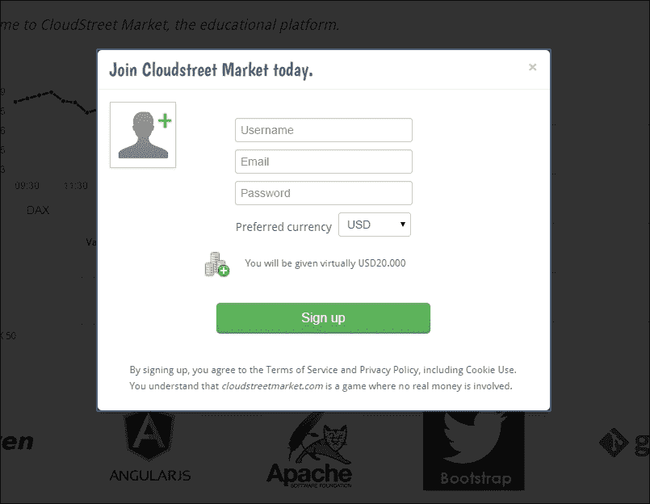
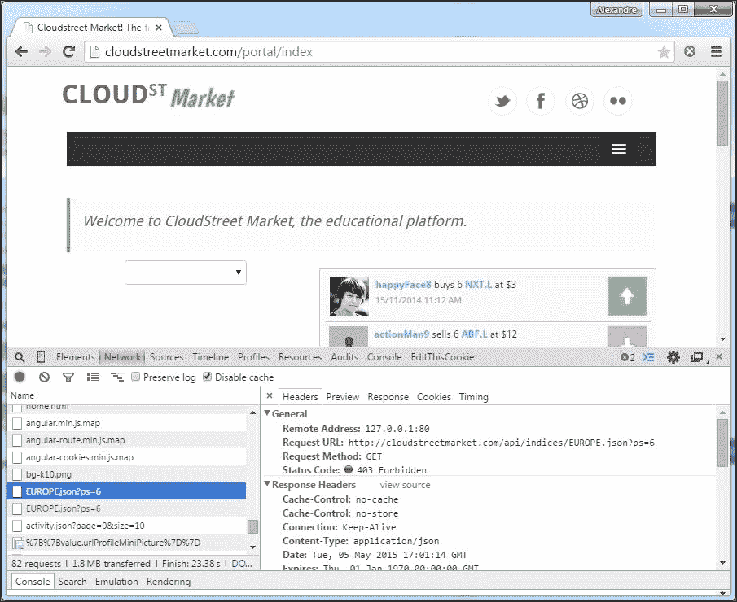
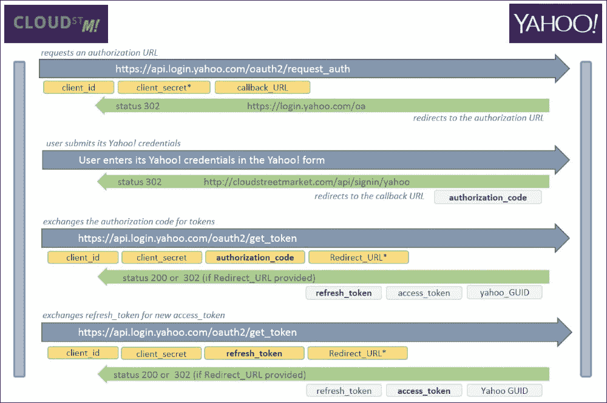
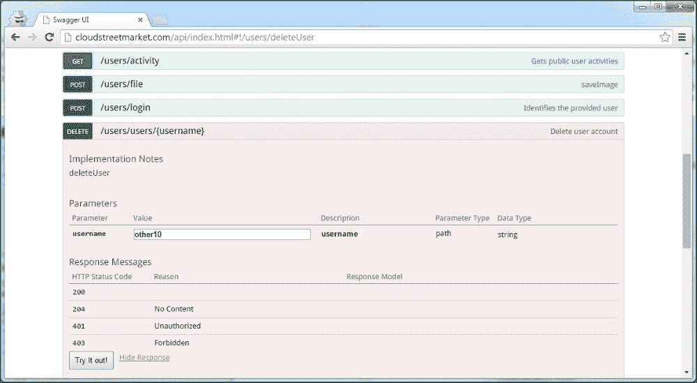

# 第十二章：使用 Spring MVC 进行身份验证

本章涵盖以下内容：

+   配置 Apache HTTP 以代理您的 Tomcat

+   调整用户和角色以适应 Spring 安全

+   通过 BASIC 方案进行身份验证

+   在 REST 环境中存储凭据

+   使用第三方 OAuth2 方案进行身份验证

+   在服务和控制器上进行授权

# 介绍

在本章中，我们将介绍在 Spring 环境中进行身份验证的两种方式。

我们认为只提供安全注释来限制控制器和服务不足以给出 Spring 身份验证的整体图景。如果没有一些关键概念，如`Authentication`对象的作用，Spring 安全过滤器链，`SecurityInterceptor`工作流程等，就不可能对可以与 Spring MVC 一起使用的安全工具感到自信。由于需要配置 OAuth，我们还将向您展示如何在您的机器上设置 Apache HTTP 代理和主机别名，以在本地模拟`cloudstreetmarket.com`域。

# 配置 Apache HTTP 以代理您的 Tomcat

我们将使用本地别名`cloudstreetmarket.com`（端口`80`）访问应用程序，而不是以前的`localhost:8080`。在开发第三方集成时，实施该配置有时是一个强制性步骤。在我们的情况下，第三方将是 Yahoo！及其 OAuth2 身份验证服务器。

## 准备工作

这主要是关于配置。我们将安装 Apache HTTP 服务器，并遵循 Apache Tomcat 操作指南。这将使我们更新 Tomcat 连接器并在 Apache 配置文件中创建虚拟主机。

您将发现这种配置如何允许灵活性，并简单地为客户提供高级和可扩展的架构来提供网页内容。

## 如何做...

1.  在 MS Windows 上，下载并安装 Apache HTTP 服务器。

+   最简单的方法可能是直接从官方分发商下载二进制文件。从以下 URL 之一选择并下载适当的最新 Zip 存档：

+   创建一个目录`C:\apache24`，并将下载的存档解压缩到此位置。

[`www.apachelounge.com/download`](http://www.apachelounge.com/download)

[`www.apachehaus.com/cgi-bin/download.plx`](http://www.apachehaus.com/cgi-bin/download.plx)

### 注意

您应该能够通过此表格访问 bin 目录：`C:\apache24\bin`。

1.  在 Linux / Mac OS 上，下载并安装 Apache HTTP 服务器。

1.  从 Apache 网站下载最新的源代码（压缩在`tar.gz`存档中）：

[`httpd.apache.org/download.cgi#apache24`](http://httpd.apache.org/download.cgi#apache24)

1.  从下载的存档中提取源代码：

```java

$ tar –xvzf httpd-NN.tar.gz
$ cd httpd-NN

```

### 注意

`NN`命令是当前版本的 Apache HTTP。

1.  自动配置目录结构：

```java

$ ./configure

```

1.  编译软件包：

```java

$ make

```

1.  安装目录结构：

```java

$ make install

```

1.  在 MS Windows 上，在 hosts 文件中添加一个新的别名。

1.  使用记事本编辑可以在以下路径找到的文件：

```java
%SystemRoot%\system32\drivers\etc\hosts
```

### 注意

这个文件没有扩展名，记事本在保存文件时不会抱怨。

1.  在文件末尾添加以下条目：

```java
127.0.0.1 cloudstreetmarket.com
```

1.  保存修改。

1.  在 Linux / Mac OS 上，在 hosts 文件中添加一个新的别名。

1.  编辑可以在以下路径找到的文件：`/etc/hosts`

1.  在文件末尾添加以下条目：

```java
127.0.0.1 cloudstreetmarket.com
```

1.  保存修改。

1.  对于所有操作系统，编辑`httpd.conf` Apache 配置文件。

1.  此文件可以在`C:\apache24\conf`（Windows 上）或`/usr/local/apache2/conf`（Linux 或 Mac 上）找到。

1.  取消以下两行的注释：

```java

LoadModule proxy_module modules/mod_proxy.so
LoadModule proxy_http_module modules/mod_proxy_http.so

```

1.  在文件的最底部添加以下块：

```java
<VirtualHost cloudstreetmarket.com:80>
  ProxyPass        /portal http://localhost:8080/portal
  ProxyPassReverse /portal http://localhost:8080/portal
  ProxyPass        /api  http://localhost:8080/api
  ProxyPassReverse /api  http://localhost:8080/api
  RedirectMatch ^/$ /portal/index
</VirtualHost>
```

### 注意

可以在`chapter_5/source_code/app/apache`目录中找到修改后的`httpd.conf`文件示例（适用于 Apache HTTP 2.4.18）。

1.  编辑`server.xml` Tomcat 配置文件。

1.  此文件可以在`C:\tomcat8\conf`（在 Windows 上）或`/home/usr/{system.username}/tomcat8/conf`（在 Linux 或 Mac 上）找到。

1.  找到`<Connector port"="8080"" protocol"="HTTP/1.1""... >`定义并编辑如下：

```java
    <Connector port"="8080"" protocol"="HTTP/1.1""
    connectionTimeout"="20000" redirectPort"="8443"" 
    proxyName"="cloudstreetmarket.com"" proxyPort"="80""/>
```

### 注意

可以在`chapter_5/source_code/app/tomcat`目录中找到修改后的`server.xml`文件示例（适用于 Apache Tomcat 8.0.30）。

1.  在 MS Windows 上，启动 Apache HTTP 服务器。

1.  打开命令提示符窗口。

+   输入以下命令：

```java
$ cd C:/apache24/bin
```

1.  安装 Apache 服务：

```java

$ httpd.exe –k install

```

+   启动服务器：

```java
$ httpd.exe –k start
```

1.  在 Linux/Mac OS 上，启动 Apache HTTP 服务器：

+   启动服务器：

```java
$ sudo apachectl start
```

现在启动 Tomcat 服务器并打开您喜欢的网络浏览器。转到`http://cloudstreetmarket.com`，您应该获得以下着陆页：


## 工作原理...

我们在这里进行的 Apache HTTP 配置现在在某种程度上是标准的。它提供了无限级别的网络定制。它还允许我们启动可扩展性。

### DNS 配置或主机别名

让我们重新审视一下网络浏览器的工作原理。当我们在网络浏览器中输入 URL 时，最终服务器是通过其 IP 访问的，以在特定端口上建立 TCP 连接。浏览器需要解析指定名称的 IP。

为此，它查询一系列域名服务器（在互联网上，该链通常从用户的**互联网服务提供商**（**ISP**）开始）。每个 DNS 基本上都是这样工作的：

+   它尝试自行解析 IP，查找其数据库或缓存中的 IP

+   如果不成功，它会询问另一个 DNS 并等待响应以缓存结果并将其发送回调用者

管理特定域名的 DNS 称为**权威起始**（**SOA**）。这样的 DNS 通常由注册商提供，我们通常使用他们的服务来为域区配置记录（和我们的服务器 IP）。

在网络上，每个 DNS 都尝试解析最终的 SOA。DNS 服务器的顶层层次结构称为**根名称服务器**。有数百个根名称服务器绑定到一个特定的**顶级域**（**TLD**，如.com、.net、.org...）。

当浏览器获得 IP 时，它会尝试在指定端口上建立 TCP 连接（默认为 80）。远程服务器接受连接并通过网络发送 HTTP 请求。

### 在生产中-编辑 DNS 记录

一旦我们接近生产阶段，我们需要真正的域名在域名提供商的网站上在线配置 DNS 记录。有不同类型的记录需要编辑。每个记录都有特定的目的或资源类型：主机、规范名称、邮件交换器、名称服务器等。通常可以在域名提供商的网站上找到具体的指导。

### 主机的别名

在联系任何类型的 DNS 之前，操作系统可能能够自行解析 IP。为此，主机文件是一个纯文本的`注册表`。向此注册表添加别名定义了对任何最终服务器的代理。这是开发环境的常见技术，但不限于它们。

每一行代表一个 IP 地址，后面跟着一个或多个主机名。每个字段由空格或制表符分隔。可以在一行的开头用`#`字符指定注释。空行将被忽略，IP 可以用*IPv4*或*IPv6*定义。

此文件仅用于主机别名，我们在此阶段不处理端口！

#### OAuth 开发的别名定义

在这一章中，我们将使用 OAuth2 协议进行身份验证。在 OAuth 中，有一个**认证服务器（AS）**和一个**服务提供商（SP）**。在我们的情况下，认证服务器将是一个第三方系统（Yahoo！），服务提供商将是我们的应用程序（`cloudstreetmarket.com`）。

OAuth2 认证和授权发生在第三方端。一旦完成这些步骤，认证服务器将 HTTP 请求重定向到服务提供商，使用作为参数传递或存储为变量的回调 URL。

第三方有时会阻止指向`localhost:8080`的回调 URL。在本地测试和开发 OAuth2 对话仍然是必要的。

为主机名配置代理（在 hosts 文件中）和在 HTTP 服务器中管理端口、URL 重写和重定向的虚拟主机是本地环境以及生产基础设施的一个好解决方案。

### Apache HTTP 配置

Apache HTTP 服务器使用 TCP/IP 协议并提供了 HTTP 的实现。TCP/IP 允许计算机在整个网络中相互通信。

在网络上使用 TCP/IP 的每台计算机（局域网或广域网）都有一个 IP 地址。当请求到达接口（例如以太网连接）时，会尝试将其映射到机器上的服务（DNS、SMTP、HTTP 等）使用目标端口号。Apache 通常使用端口 80 进行监听。这是 Apache HTTP 处理一个站点的情况。

#### 虚拟主机

这个功能允许我们从单个 Apache 实例运行和维护多个网站。我们通常在`<VirtualHost...>`部分中对一组专用站点的 Apache 指令进行分组。每个组由一个**站点 ID**标识。

不同的站点可以定义如下：

1.  按名称：

```java
NameVirtualHost 192.168.0.1
<VirtualHost portal.cloudstreetmarket.com>…</VirtualHost>
<VirtualHost api.cloudstreetmarket.com>…</VirtualHost>
```

1.  按 IP（你仍然需要在块内定义一个`ServerName`）：

```java
<VirtualHost 192.168.0.1>…</VirtualHost>
<VirtualHost 192.168.0.2>…</VirtualHost>
```

1.  按端口：

```java
Listen 80
Listen 8080
<VirtualHost 192.168.0.1:80>…</VirtualHost>
<VirtualHost 192.168.0.2:8080>…</VirtualHost>
```

我们当前的配置只有一台机器和一个 Tomcat 服务器，并不是展示虚拟主机所有好处的理想场景。然而，我们已经限定了一个站点及其配置。这是朝着可扩展性和负载平衡迈出的第一步。

#### mod_proxy 模块

这个 Apache 模块为 Apache HTTP 服务器提供了代理/网关功能。这是一个核心功能，因为它可以将 Apache 实例转变为一个能够管理网络上多台机器上的复杂应用程序集的独特接口。

它将 Apache 推向了其初始目的之外：通过 HTTP 在文件系统上公开目录。它依赖于五个特定的子模块：`mod_proxy_http`、`mod_proxy_ftp`、`mod_proxy_ajp`、`mod_proxy_balancer`和`mod_proxy_connect`。每当需要时，它们都需要主要的`mod_proxy`依赖项。代理可以被定义为正向（`ProxyPass`）和/或反向（`ProxyPassReverse`）。它们经常用于为位于防火墙后面的服务器提供互联网访问。

`ProxyPass`可以被替换为`ProxyPassMatch`以提供正则匹配功能。

#### ProxyPassReverse

反向代理处理响应和重定向，就好像它们是自己的 Web 服务器一样。要激活它们，它们通常绑定到`ProxyPass`定义，就像我们在这里的用例中一样：

```java
ProxyPass         /api  http://localhost:8080/api
ProxyPassReverse  /api  http://localhost:8080/api
```

##### 工作者

代理管理底层服务器的配置，还管理它们之间的通信参数，使用称为**workers**的对象（将它们视为一组参数）。当用于反向代理时，这些 workers 使用`ProxyPass`或`ProxyPassMatch`进行配置：

```java
ProxyPass /api http://localhost:8080/api connectiontimeout=5 timeout=30
```

一些 worker-parameters 的例子是：`connectiontimeout`（以秒为单位），`keepalive`（开/关），`loadfactor`（从 1 到 100），`route`（在负载均衡器内使用时绑定到`sessionid`），`ping`（它向 ajp13 连接发送 CPING 请求以确保 Tomcat 没有忙），`min/max`（到底层服务器的连接池条目数），`ttl`（到底层服务器的连接的到期时间）。

#### mod_alias 模块

这个模块提供了 URL 别名和客户端请求重定向。我们已经使用这个模块将请求（默认情况下）重定向到`cloudstreetmarket.com`到门户网站应用程序的索引页面（`cloudstreetmarket.com/portal/index`）。

请注意，与`ProxyPass`改进`ProxyPassMatch`的方式相同，`RedirectMatch`通过正则匹配功能改进了`Redirect`。

### Tomcat 连接器

**连接器**代表一个处理单元，它：监听特定端口以接收请求，将这些请求转发到特定的引擎，接收引擎生成的动态内容，最后将生成的内容发送回端口。在`Service`组件中可以定义多个连接器，共享一个*engine*。一个 Tomcat 实例（`Server`）可以定义一个或多个*service*。Tomcat 有两种类型的连接器。

#### HTTP 连接器

这个连接器在 Tomcat 的 8080 端口上默认设置。它支持 HTTP1/1 协议，并允许 Catalina 作为独立的 Web 服务器运行。HTTP 连接器可以在代理后面使用。Tomcat 支持`mod_proxy`作为负载均衡器。这是我们的预期配置。当在代理后面实现时，可以设置`proxyName`和`proxyPort`属性，以便 Servlet 将指定的值绑定到请求属性`request.getServerPort()`和`request.getServerName()`。

“这个连接器具有最低的延迟和最佳的整体性能。”

Tomcat 文档还指出了以下关于 HTTP 代理的内容：

“应该注意到，HTTP 代理的性能通常低于 AJP 的性能。”

然而，配置 AJP 集群会在架构上增加一个额外的层。对于无状态架构来说，这个额外层的必要性是值得商榷的。

#### AJP 连接器

AJP 连接器的行为与 HTTP 连接器相似，只是它们支持 AJP 协议而不是 HTTP。**Apache JServ Protocol**（**AJP**）是 HTTP 连接器的优化二进制版本。

它允许 Apache HTTP 有效地在不同的 Tomcat 之间平衡请求。它还允许 Apache HTTP 提供 Web 应用的静态内容，而 Tomcat 专注于动态内容。

在 Apache HTTP 方面，这个连接器需要`mod_proxy_ajp`。我们的配置可能是：

```java
ProxyPass / ajp://localhost:8009/api
ProxyPassReverse / http://cloudstreetmarket.com/api/
```

## 还有更多...

在本节中，我们将提供一些更深入了解这些主题的链接：

+   DNS 和分布式系统：

[`computer.howstuffworks.com/dns.htm`](http://computer.howstuffworks.com/dns.htm)

[`en.wikipedia.org/wiki/Root_name_server`](https://en.wikipedia.org/wiki/Root_name_server)

+   域名系统的工作原理：

[`wiki.bravenet.com/How_the_domain_name_system_works`](http://wiki.bravenet.com/How_the_domain_name_system_works)

+   Apache HTTP：

[`httpd.apache.org/docs/trunk/getting-started.html`](http://httpd.apache.org/docs/trunk/getting-started.html)

+   我们使用的模块：

[`httpd.apache.org/docs/2.2/mod/mod_alias.html`](http://httpd.apache.org/docs/2.2/mod/mod_alias.html)

[`httpd.apache.org/docs/2.2/en/mod/mod_proxy.html`](http://httpd.apache.org/docs/2.2/en/mod/mod_proxy.html)

+   Tomcat 连接器：

[`tomcat.apache.org/tomcat-8.0-doc/connectors.html`](http://tomcat.apache.org/tomcat-8.0-doc/connectors.html)

[`wiki.apache.org/tomcat/FAQ/Connectors`](http://wiki.apache.org/tomcat/FAQ/Connectors)

[`www.mulesoft.com/tcat/tomcat-connectors`](https://www.mulesoft.com/tcat/tomcat-connectors)

+   在代理模式下：

[`tomcat.apache.org/tomcat-8.0-doc/proxy-howto.html#Apache_2.0_Proxy_Support`](http://tomcat.apache.org/tomcat-8.0-doc/proxy-howto.html#Apache_2.0_Proxy_Support)

## 另请参阅

+   使用 AJP 连接器时，ProxyPassReverse 的定义与 HTTP 连接器略有不同：

[`www.apachetutor.org/admin/reverseproxies`](http://www.apachetutor.org/admin/reverseproxies)

[`www.humboldt.co.uk/the-mystery-of-proxypassreverse`](http://www.humboldt.co.uk/the-mystery-of-proxypassreverse)

+   如果您希望实现 AJP 集群，请查看以下网址：

[`www.richardnichols.net/2010/08/5-minute-guide-clustering-apache-tomcat/`](http://www.richardnichols.net/2010/08/5-minute-guide-clustering-apache-tomcat/)

### 替代方案 Apache HTTP

可以争论使用 Apache HTTP 在非常高的流量上，特别是因为默认配置可能导致程序为每个连接创建一个新进程。

如果我们只是寻找代理和负载均衡器，我们也应该考虑 HAProxy。HAProxy 是一个高可用的负载均衡器和代理服务器。它是一个免费的开源产品，被 GitHub、StackOverflow、Reddit、Twitter 等引用（[`haproxy.org`](http://haproxy.org)）。

Nginx 可能（目前）是对 Apache HTTP 最受欢迎的替代品。它专注于高并发和低内存使用，其许可证是 2 条款的 BSD 许可证（[`nginx.org`](http://nginx.org)）。

# 将用户和角色调整到 Spring Security

我们认为将这一部分拆分开是有趣的，因为用户和角色通常处于应用程序和 Spring Security 之间的边界。

## 准备工作

在这个配方中，我们将安装 Spring Security 依赖项并更新`User`实体。我们还将创建一个基于我们创建的自定义`Role`枚举的`Authority`实体。最后，我们更新`init.sql`脚本以添加一组现有用户。

## 如何做...

1.  从 Eclipse 的**Git Perspective**中，检出分支`v5.x.x`的最新版本。然后，在`cloudstreetmarket-parent`模块上运行`maven clean install`命令（右键单击模块，转到**Run as…** | **Maven Clean**，然后转到**Run as…** | **Maven Install**）。执行`Maven Update Project`以将 Eclipse 与 maven 配置同步（右键单击模块，然后转到**Maven** | **Update Project…)**。

### 注意

您将注意到前端和后端代码都有一些变化。

1.  Spring Security 附带以下依赖项，添加到`cloudstreetmarket-parent`、`cloudstreetmarket-core`和`cloudstreetmarket-api`中：

```java
<!-- Spring Security -->
<dependency>
  <groupId>org.springframework.security</groupId>
  <artifactId>spring-security-web</artifactId>
  <version>4.0.0.RELEASE</version>
</dependency>
<dependency>
  <groupId>org.springframework.security</groupId>
  <artifactId>spring-security-config</artifactId>
  <version>4.0.0.RELEASE</version>
</dependency>
```

1.  `User`实体已更新。它现在反映了`users`表（而不是以前的`user`表）。它还实现了`UserDetails`接口：

```java
@Entity
@Table(name="users")
public class User implements UserDetails{
private static final long serialVersionUID = 1990856213905768044L;

@Id
@Column(name = "user_name", nullable = false)
private String username;

@Column(name = "full_name")
private String fullName;

private String email;
private String password;
private boolean enabled = true;
private String profileImg;

@Column(name="not_expired")
private boolean accountNonExpired;

@Column(name="not_locked")
private boolean accountNonLocked;

@Enumerated(EnumType.STRING)
private SupportedCurrency currency;

@OneToMany(mappedBy= "user", cascade = CascadeType.ALL, fetch = FetchType.LAZY)
@OrderBy("id desc")
private Set<Action> actions = new LinkedHashSet<Action>();

@OneToMany(mappedBy="user", cascade = CascadeType.ALL, fetch = FetchType.EAGER)
private Set<Authority> authorities = new LinkedHashSet<Authority>();

@OneToMany(cascade=CascadeType.ALL, fetch = FetchType.LAZY)
private Set<SocialUser> socialUsers = new LinkedHashSet<SocialUser>();

//getters and setters as per the UserDetails interface
...
}
```

这个`User`实体与`SocialUser`有关联。`SocialUser`在 OAuth2 认证中发挥作用，我们将在稍后开发这部分。

1.  已创建一个 Authority 实体并映射了`authorities`表。该实体还实现了`GrantedAuthority`接口。该类如下：

```java
@Entity
@Table(name"="authorities"", uniqueConstraints={@UniqueConstraint(columnNames = "{"username""","authority""})})
public class Authority implements GrantedAuthority{
  private static final long serialVersionUID = 1990856213905768044L;
  public Authority() {}
  public Authority(User user, Role authority) {
    this.user = user;
    this.authority = authority;
  }
  @Id
  @GeneratedValue
  private Long  id;
  @OneToOne(fetch = FetchType.LAZY)
  @JoinColumn(name = ""username"", nullable=false)
  private User user;
  @Column(nullable = false)
  @Enumerated(EnumType.STRING)
  private Role authority;
  //getters and setters as per the GrantedAuthority 
  //interface
  ...
}
```

1.  为了使代码更易读，我们在`cloudstreetmarket-core`模块中创建了一个`Role`枚举，用于不同的角色：

```java
public enum Role {
  ROLE_ANONYMOUS,
  ROLE_BASIC,
  ROLE_OAUTH2,
  ROLE_ADMIN,
  ROLE_SYSTEM,
  IS_AUTHENTICATED_REMEMBERED; //Transitory role
}
```

1.  此外，我们在`init.sql`文件中进行了一些更改。现有的与用户相关的预初始化脚本已经适应了新的模式：

```java
insert into users(username, fullname, email, password, profileImg, enabled, not_expired, not_locked) values ('userC', '', 'fake12@fake.com', '123456', '', true, true, true);
insert into authorities(username, authority) values ('userC', 'ROLE_'BASIC');
```

1.  启动应用程序。（不应观察到任何异常）。

1.  单击主菜单右侧的**登录**按钮。您将看到以下弹出窗口，允许输入用户名和密码进行登录：

1.  您还可以选择创建一个新用户。在上一个弹出窗口中，单击右下角的**创建新帐户**链接。这将加载以下弹出内容：

1.  让我们用以下值创建一个新用户：

```java
username: <marcus>
email: <marcus@chapter5.com>
password: <123456>
preferred currency: <USD>
```

### 注意

对于个人资料图片，您必须在文件系统上创建与`cloudstreetmarket-api/src/main/resources/application.properties`中的属性`pictures.user.path`相对应的目录结构。

然后，点击用户图标以上传个人资料图片。


最后，点击**注册**按钮，弹出窗口应该消失。

1.  现在，调用以下 URI：`http://cloudstreetmarket.com/api/users/marcus`。应用程序应该获取 Marcus 用户的以下持久数据：

## 工作原理...

在这个阶段，我们预先配置了我们的实体，使它们符合 Spring Security。关于 Spring Security 的一些概念在这部分提到，并在接下来的部分中进行了开发。

### Spring Security 简介

Spring Security 围绕三个核心组件构建：`SecurityContextHolder`对象、`SecurityContext`和`Authentication`对象。

`SecurityContextHolder`对象允许我们为一个 JVM 定义并携带一个`SecurityContextHolderStrategy`实现（专注于存储和检索`SecurityContext`）。

### 注意

`SecurityContextHolder`有以下`static`字段：

```java
private static SecurityContextHolderStrategy strategy;
```

默认情况下，在大多数设计中，所选的策略使用`Threadlocals`（`ThreadLocalSecurityContextHolderStrategy`）。

### ThreadLocal 上下文持有者

一个 Tomcat 实例管理一个 Spring MVC servlet（像任何其他 servlet 一样）并使用多个线程来处理多个 HTTP 请求。代码如下：

```java
final class ThreadLocalSecurityContextHolderStrategy implements
    SecurityContextHolderStrategy {
  private static final ThreadLocal<SecurityContext> contextHolder = new ThreadLocal<SecurityContext>();
  ...
}
```

在 Spring MVC 上为请求分配的每个线程都可以访问携带一个用户（或其他可识别的事物）的`Authentication`对象的`SecurityContext`的副本。

一旦`SecurityContext`的副本不再被引用，它就会被垃圾回收。

### 显著的 Spring Security 接口

Spring Security 中有一堆显著的接口。我们将特别访问`Authentication`、`UserDetails`、`UserDetailsManager`和`GrantedAuthority`。

### Authentication 接口

Spring `Authentication`对象可以从`SecurityContext`中检索。这个对象通常由 Spring Security 管理，但应用程序仍经常需要访问它来进行业务处理。

这是`Authentication`对象的接口：

```java
public interface Authentication extends Principal, Serializable {
  Collection<? extends GrantedAuthority> getAuthorities();
  Object getCredentials();
  Object getDetails();
  Object getPrincipal();
  boolean isAuthenticated();
  void setAuthenticated(boolean isAuthenticated) throws IllegalArgumentException;
}
```

它提供对`Principal`（代表已识别的用户、实体、公司或客户）、其凭据、其权限以及可能需要的一些额外详细信息的访问。现在让我们看看如何从`SecurityContextHolder`中检索用户：

```java
Object principal = SecurityContextHolder.getContext()
  .getAuthentication()
  .getPrincipal();
if (principal instanceof UserDetails) {
    String username = ((UserDetails) principal).getUsername();
} else {
  String username = principal.toString();
}
```

`Principal`类可以转换为 Spring `UserDetails`类型，该类型由核心框架公开。该接口用作几个扩展模块（*Spring Social*、*Connect*、*Spring Security SAML*、*Spring Security LDAP*等）中的标准桥梁。

### UserDetails 接口

`UserDetails`实现以可扩展和特定于应用程序的方式表示主体。

您必须了解提供核心框架中账户检索的关键方法`loadUserByUsername`的单方法`UserDetailsService`接口：

```java
public interface UserDetailsService {
  UserDetails loadUserByUsername(String username) throws UsernameNotFoundException;
}
```

Spring Security 为这个接口提供了两种实现：`CachingUserDetailsService`和`JdbcDaoImpl`，无论我们是想要从内存中的`UserDetailsService`还是从基于 JDBC 的`UserDetailsService`实现中受益。更普遍地，通常重要的是用户和角色在哪里以及如何持久化，以便 Spring Security 可以自行访问这些数据并处理认证。

#### 认证提供者

Spring Security 访问用户和角色数据的方式是通过在 Spring Security 配置文件中使用安全命名空间中的身份验证提供程序的选择或引用进行配置的。

以下是使用原生`UserDetailsService`实现时的两个配置示例：

```java
<security:authentication-manager alias="authenticationManager">
  <security:authentication-provider>
    <security:jdbc-user-service data-source-ref="dataSource" />
  </security:authentication-provider>
</security:authentication-manager>
```

这个第一个例子指定了基于 JDBC 的`UserDetailsService`。下一个例子指定了一个内存中的`UserDetailsService`。

```java
<security:authentication-manager alias="authenticationManager">
  <security:authentication-provider>
    <security:user-service id="inMemoryUserDetailService"/>
  </security:authentication-provider>
</security:authentication-manager>
```

在我们的情况下，我们已经注册了我们自己的`UserDetailsService`实现（`communityServiceImpl`）如下：

```java
<security:authentication-manager alias="authenticationManager">
  <security:authentication-provider user-service-ref='communityServiceImpl'>
    <security:password-encoder ref="passwordEncoder"/>
  </security:authentication-provider>
</security:authentication-manager>
```

我们认为通过 JPA 抽象继续访问数据库层更合适。

##### UserDetailsManager 接口

Spring Security 提供了一个`UserDetails`实现`org.sfw.security.core.userdetails.User`，可以直接使用或扩展。User 类定义如下：

```java
public class User implements UserDetails, CredentialsContainer {
  private String password;
  private final String username;
  private final Set<GrantedAuthority> authorities;
  private final boolean accountNonExpired;
  private final boolean accountNonLocked;
  private final boolean credentialsNonExpired;
  private final boolean enabled;
  ...
}
```

### 注意

管理用户（创建、更新等）可以是 Spring Security 的共同责任。尽管通常主要由应用程序执行。

引导我们朝着`UserDetails`的结构，Spring Security 还提供了一个用于管理用户的`UserDetailsManager`接口：

```java
public interface UserDetailsManager extends UserDetailsService {
  void createUser(UserDetails user);
  void updateUser(UserDetails user);
  void deleteUser(String username);
  void changePassword(String oldPassword, String newPassword);
  boolean userExists(String username);
}
```

Spring Security 有两个原生实现，用于非持久化（`InMemoryUserDetailsManager`）和基于 JDBC 的（`JdbcUserDetailsManager`）用户管理。

当决定不使用内置的身份验证提供程序时，实现所提供的接口是一个很好的做法，特别是为了保证在 Spring Security 的未来版本中向后兼容。

#### GrantedAuthority 接口

在 Spring Security 中，`GrantedAuthorities`反映了授予`Principal`的应用程序范围的权限。Spring Security 引导我们朝着基于角色的身份验证。这种身份验证要求创建能够执行操作的用户组。

### 注意

除非某个功能有强烈的业务意义，最好使用例如`ROLE_ADMIN`或`ROLE_GUEST`而不是`ROLE_DASHBOARD`或`ROLE_PAYMENT`…

角色可以从`Authentication`对象的`getAuthorities()`中提取，作为`GrantedAuthority`实现的数组。

`GrantedAuthority`接口非常简单：

```java
public interface GrantedAuthority extends Serializable {
  String getAuthority();
}
```

`GrantedAuthority`实现是包装器，携带角色的文本表示。这些文本表示可能与安全对象的配置属性匹配（我们将在*服务和控制器授权*中详细介绍这个概念）。

`Role`嵌入在`GrantedAuthority`中，可以通过`getAuthority()` getter 访问，对于 Spring Security 来说，这比包装器本身更重要。

我们创建了自己的实现：`Authority`实体与`User`有关联。框架还提供了`SimpleGrantedAuthority`的实现。

在最后一个配方中，我们将讨论 Spring Security 的授权过程。我们将看到 Spring Security 提供了`AccessDecisionManager`接口和几个`AccessDecisionManager`实现。这些实现是基于投票的，并使用`AccessDecisionVoter`实现。其中最常用的是`RoleVoter`类。

### 注意

`RoleVoter`实现在配置属性（Authority 的文本表示）以预定义前缀开头时，对用户授权进行积极投票。默认情况下，此前缀设置为`ROLE_`。

## 还有更多…

Spring Security 的身份验证和授权过程将在服务和控制器授权的深度覆盖中进行。本节介绍了 Spring Security 参考文档中更多的细节。

### Spring Security 参考

Spring Security 安全参考是理论和实践信息的绝佳来源。

#### 技术概述

技术概述是 Spring Security 框架的一个很好的介绍：

[`docs.spring.io/spring-security/site/docs/3.0.x/reference/technical-overview.html`](http://docs.spring.io/spring-security/site/docs/3.0.x/reference/technical-overview.html)

#### 示例应用程序

Spring Security 参考提供了许多不同身份验证类型（*LDAP*、*OPENID*、*JAAS*等）的 Spring Security 示例。其他基于角色的示例也可以在以下找到：

[`docs.spring.io/spring-security/site/docs/3.1.5.RELEASE/reference/sample-apps.html`](http://docs.spring.io/spring-security/site/docs/3.1.5.RELEASE/reference/sample-apps.html)

#### 核心服务

了解更多关于内置的`UserDetailsService`实现（内存或 JDBC）的信息：

[`docs.spring.io/spring-security/site/docs/3.1.5.RELEASE/reference/core-services.html`](http://docs.spring.io/spring-security/site/docs/3.1.5.RELEASE/reference/core-services.html)

# 通过 BASIC 方案进行身份验证

通过 BASIC 方案进行身份验证是我们这种无状态应用程序的一种流行解决方案。凭据随着 HTTP 请求发送。

## 准备工作

在这个配方中，我们完成了 Spring Security 配置。我们使其支持应用程序所需的 BASIC 身份验证方案。

我们稍微定制了生成的响应头，这样它们就不会触发浏览器显示原生的 BASIC 认证表单（这对我们的用户来说不是最佳体验）。

## 如何做...

1.  为了使用 Spring 安全命名空间，我们将以下过滤器添加到`cloudstreetmarket-api web.xml`中：

```java
<filter>
  <filter-name>springSecurityFilterChain</filter-name>
  <filter-class> org.sfw.web.filter.DelegatingFilterProxy
  </filter-	class>
</filter>
<filter-mapping>
  <filter-name>springSecurityFilterChain</filter-name>
  <url-pattern>/*</url-pattern>
</filter-mapping>
```

1.  一个 Spring 配置文件已经专门为`cloudstreetmarket-api`模块的 Spring Security 创建。这个文件包含以下 bean 定义：

```java
<bean id="authenticationEntryPoint" class="edu.zc.csm.api.authentication.CustomBasicAuthenticationEntryPoint">
  <property name="realmName" value="cloudstreetmarket.com" />
</bean> 
<security:http create-session="stateless" authentication-manager-ref="authenticationManager" entry-point-ref="authenticationEntryPoint">
    <security:custom-filter ref="basicAuthenticationFilter" after="BASIC_AUTH_FILTER" />
   <security:csrf disabled="true"/>
</security:http>

<bean id="basicAuthenticationFilter" class="org.sfw.security.web.authentication.www.BasicAuthenticationFilter">
  <constructor-arg name="authenticationManager" ref="authenticationManager" />
  <constructor-arg name="authenticationEntryPoint" ref="authenticationEntryPoint" />
</bean>
<security:authentication-manager alias="authenticationManager">
    <security:authentication-provider user-service-ref='communityServiceImpl'>
      <security:password-encoder ref="passwordEncoder"/>
  </security:authentication-provider>
</security:authentication-manager>

<security:global-method-security secured-annotations="enabled" pre-post-annotations="enabled" authentication-manager-ref="authenticationManager"/>
```

1.  这个新的配置是指`CustomBasicAuthenticationEntryPoint`类。这个类有以下内容：

```java
public class CustomBasicAuthenticationEntryPoint extends BasicAuthenticationEntryPoint {
  @Override
  public void commence(HttpServletRequest request, HttpServletResponse response, AuthenticationException authException) throws IOException, ServletException {
    response.setHeader("WWW-Authenticate", "CSM_Basic realm=\ + getRealmName() + \");
    response.sendError(HttpServletResponse.SC_UNAUTHORIZED, authException.getMessage()
    );
  }
}
```

1.  已添加新的`@ExceptionHandler`来捕获认证异常：

```java
@ExceptionHandler({BadCredentialsException.class, AuthenticationException.class, AccessDeniedException.class})
protected ResponseEntity<Object> handleBadCredentials(final RuntimeException ex, final WebRequest request) {
  return handleExceptionInternal(ex, "The attempted  operation has been denied!", new HttpHeaders(),   FORBIDDEN, request);
}
...
```

### 注意

就是这样了！我们已经让我们的后端支持了 BASIC 认证。但是，我们还没有限制我们的服务（作为安全对象）。我们现在将这样做。

1.  出于示例目的，请更新`cloudstreetmarket-core`中的`IMarketService`接口。将`@Secured("ROLE_BASIC")`注解添加到`Type`中，如下所示：

```java
@Secured ("ROLE_BASIC")
public interface IMarketService {
  Page<IndexOverviewDTO> getLastDayIndicesOverview( MarketCode market, Pageable pageable);
  Page<IndexOverviewDTO> getLastDayIndicesOverview( Pageable pageable);
  HistoProductDTO getHistoIndex(String code, MarketCode market, Date fromDate, Date toDate, QuotesInterval interval);
}
```

1.  现在重新启动 Tomcat 服务器（这样做将删除您之前创建的用户）。

1.  在您喜欢的 Web 浏览器中，打开开发者选项卡，并在刷新主页时观察 AJAX 查询。您应该注意到有两个 AJAX 查询返回了`403`状态码（`禁止`）。

这些查询也返回了 JSON 响应：

```java
{"error":"Access is denied","message":"The attempted operation has been denied!","status":403","date":"2015-05-05 18:01:14.917"}
```

1.  现在，使用登录功能/弹出窗口，请使用之前创建的具有`BASIC`角色的用户之一登录：

```java
Username: <userC> 
Password: <123456>
```

1.  刷新页面并观察相同的两个 AJAX 查询。在请求头中，您可以看到我们的前端发送了一个特殊的**Authorization**头：

1.  这个授权头携带的值是：`Basic dXNlckM6MTIzNDU2`。编码后的`dXNlckM6MTIzNDU2`是`userC:123456`的 base64 编码值。

1.  让我们来看看对这些查询的响应：

状态现在是`200 (OK)`，您还应该收到正确的 JSON 结果：


1.  服务器在响应中发送了一个`WWW-Authenticate`头，其值为：**CSM_Basic realm"="cloudstreetmarket.com"**

1.  最后，撤销您在`IMarketService`（第 5 步）中所做的更改。

## 它是如何工作的...

我们将探讨使用 Spring Security 进行 BASIC 认证背后的概念：

### Spring Security 命名空间

与往常一样，Spring 配置命名空间带来了一个特定的语法，适合模块的需求和用法。它通过更好的可读性减轻了整体的 Spring 配置。命名空间通常带有默认配置或自动配置工具。

Spring Security 命名空间带有 spring-security-config 依赖项，并可以在 Spring 配置文件中定义如下：

```java
<beans   xmlns:xsi=http://www.w3.org/2001/XMLSchema-instance xsi:schemaLocation"="http://www.springframework.org/schema/beans http://www.springframework.org/schema/beans/spring-beans.xsd http://www.springframework.org/schema/security http://www.springframework.org/schema/security/spring-security-4.0.0.xsd">
    ...
</beans>
```

命名空间分为三个顶级组件：`<http>`（关于 Web 和 HTTP 安全），`<authentication-manager>`和`<global-method-security>`（服务或控制器限制）。

然后，其他概念被这些顶级组件引用为属性或子元素：`<authentication-provider>`，`<access-decision-manager>`（为 Web 和安全方法提供访问决策），和`<user-service>`（作为`UserDetailsService`实现）。

#### `<http>`组件

命名空间的`<http>`组件提供了一个我们没有在这里使用的`auto-config`属性。`<http auto-config"="true">`的定义将是以下定义的快捷方式：

```java
  <http>
    <form-login />
    <http-basic />
    <logout />
  </http>
```

对于我们的 REST API 来说不值得，因为我们没有计划为表单登录实现服务器端生成的视图。此外，`<logout>`组件对我们来说是无用的，因为我们的 API 不管理会话。

最后，`<http-basic>`元素创建了基础的`BasicAuthenticationFilter`和`BasicAuthenticationEntryPoint`到配置中。

我们使用我们自己的`BasicAuthenticationFilter`来自定义`WWW-Authenticate`响应头的值，从`Basic base64token`到`CSM_Basic base64token`。这是因为包含以**Basic**关键字开头的值的 AJAX HTTP 响应（来自我们的 API）会自动触发 Web 浏览器打开本机的基本表单弹出窗口。这不是我们想要建立的用户体验类型。

#### Spring Security 过滤器链

在食谱的第一步中，我们在`web.xml`中声明了一个名为`springSecurityFilterChain`的过滤器：

```java
  <filter>
    <filter-name>springSecurityFilterChain</filter-name>
  <filter-class>org.sfw.web.filter.DelegatingFilterProxy</filter-class>
</filter>
<filter-mapping>
  <filter-name>springSecurityFilterChain</filter-name>
  <url-pattern>/*</url-pattern>
</filter-mapping>
```

在这里，`springSecurityFilterChain`也是一个 Spring bean，它是由 Spring Security 命名空间（特别是`http`组件）在内部创建的。`DelegatingFilterProxy`是 Spring 的基础设施，它在应用程序上下文中寻找特定的 bean 并调用它。目标 bean 必须实现`Filter`接口。

整个 Spring Security 机制是通过一个单一的 bean 连接起来的。

`<http>`元素的配置在定义过滤器链的制定中起着核心作用。它直接定义的元素创建了相关的过滤器。

|   | *"一些核心过滤器总是在过滤器链中创建，其他的将根据存在的属性和子元素添加到堆栈中。"* |   |
| --- | --- | --- |
|   | --*Spring Security* |

重要的是要区分配置相关的过滤器和不能被移除的核心过滤器。作为核心过滤器，我们可以计算`SecurityContextPersistenceFilter`、`ExceptionTranslationFilter`和`FilterSecurityInterceptor`。这三个过滤器是与`<http>`元素本地绑定的，并且可以在下一个表中找到。

这个表来自 Spring Security 参考文档，它包含了所有核心过滤器（随框架提供）的内容，可以使用特定的元素或属性激活。它们按照它们在链中的位置顺序列在这里。

| 别名 | 过滤器类 | 命名空间元素或属性 |
| --- | --- | --- |
| --- | --- | --- |
| `CHANNEL_FILTER` | ChannelProcessingFilter | http/intercept-url@requires-channel |
| `SECURITY_CONTEXT_FILTER` | SecurityContextPersistenceFilter | http |
| `CONCURRENT_SESSION_FILTER` | ConcurrentSessionFilter | session-management/concurrency-control |
| `HEADERS_FILTER` | HeaderWriterFilter | http/headers |
| `CSRF_FILTER` | CsrfFilter | http/csrf |
| `LOGOUT_FILTER` | LogoutFilter | http/logout |
| `X509_FILTER` | X509AuthenticationFilter | http/x509 |
| `PRE_AUTH_FILTER` | AbstractPreAuthenticatedProcessingFilter Subclasses | N/A |
| `CAS_FILTER` | CasAuthenticationFilter | N/A |
| `FORM_LOGIN_FILTER` | UsernamePasswordAuthenticationFilter | http/form-login |
| `BASIC_AUTH_FILTER` | BasicAuthenticationFilter | http/http-basic |
| `SERVLET_API_SUPPORT_FILTER` | SecurityContextHolderAwareRequestFilter | http/@servlet-api-provision |
| `JAAS_API_SUPPORT_FILTER` | JaasApiIntegrationFilter | http/@jaas-api-provision |
| `REMEMBER_ME_FILTER` | RememberMeAuthenticationFilter | http/remember-me |
| `ANONYMOUS_FILTER` | AnonymousAuthenticationFilter | http/anonymous |
| `SESSION_MANAGEMENT_FILTER` | SessionManagementFilter | session-management |
| `EXCEPTION_TRANSLATION_FILTER` | ExceptionTranslationFilter | http |
| `FILTER_SECURITY_INTERCEPTOR` | FilterSecurityInterceptor | http |
| `SWITCH_USER_FILTER` | SwitchUserFilter | N/A |

请记住，自定义过滤器可以相对地定位，或者可以使用`custom-filter`元素替换这些过滤器中的任何一个：

```java
<security:custom-filter ref="myFilter" after="BASIC_AUTH_FILTER"/>
```

##### 我们的<http>配置

我们为`<http>`的'命名空间'组件定义了以下配置：

```java
<security:http create-session="stateless" entry-point-ref="authenticationEntryPoint" authentication-manager- ref="authenticationManager">
  <security:custom-filter ref="basicAuthenticationFilter" after="BASIC_AUTH_FILTER" />
  <security:csrf disabled="true"/>
</security:http>
<bean id="basicAuthenticationFilter" class="org.sfw.security.web.authentication.www.BasicAuthenticationFilter">
  <constructor-arg name="authenticationManager" ref="authenticationManager" />
  <constructor-arg name="authenticationEntryPoint" ref="authenticationEntryPoint" />
</bean>
<bean id="authenticationEntryPoint" class="edu.zc.csm.api. authentication.CustomBasicAuthenticationEntryPoint">
  <property name="realmName" value="${realm.name}" />
</bean>
```

在这里，我们告诉 Spring 不要创建会话，并使用`create-session=="stateless"`忽略传入的会话。我们这样做是为了追求无状态和可扩展的微服务设计。

出于同样的原因，我们目前已经禁用了**跨站请求伪造**（**csrf**）支持。这个功能自 3.2 版本以来默认已经被框架启用。

由于我们没有实现命名空间预配置的任何身份验证策略（`http-basic`或`login-form`），因此需要定义一个`entry-point-ref`。

我们定义了一个自定义过滤器`BasicAuthenticationFilter`，在核心`BASIC_AUTH_FILTER`的理论位置之后执行。

现在，我们将看看三个引用的角色：`authenticationEntryPoint`、`authenticationManager`和`basicAuthenticationFilter`。

### AuthenticationManager 接口

首先，`AuthenticationManager`是一个单方法接口：

```java
public interface AuthenticationManager {
  Authentication authenticate(Authentication authentication) throws AuthenticationException;
}
```

Spring Security 提供了一个实现：`ProviderManager`。这个实现允许我们插入多个`AuthenticationProviders`。`ProviderManager`按顺序尝试所有`AuthenticationProviders`，调用它们的`authenticate`方法。代码如下：

```java
public interface AuthenticationProvider {
  Authentication authenticate(Authentication authentication)
    throws AuthenticationException;
  boolean supports(Class<?> authentication);
}
```

`ProviderManager`在找到非空的`Authentication`对象时停止迭代。或者，在抛出`AuthenticationException`时，它会失败`Authentication`。

使用命名空间，可以使用`ref`元素来针对特定的`AuthenticationProviders`，如下所示：

```java
<security:authentication-manager >
  <security:authentication-provider ref='myAuthenticationProvider'/>
</security:authentication-manager>
```

现在，这是我们的配置：

```java
<security:authentication-manager alias"="authenticationManager"">
  <security:authentication-provider user-service-ref='communityServiceImpl'>
    <security:password-encoder ref="passwordEncoder"/>
  </security:authentication-provider>
</security:authentication-manager>
```

在我们的配置中没有`ref`元素。命名空间将默认实例化一个`DaoAuthenticationProvider`。它还将注入我们的`UserDetailsService`实现：`communityServiceImpl`，因为我们已经用`user-service-ref`指定了它。

当`DaoAuthenticationProvider`中`UserDetailsService`加载的密码与`UsernamePasswordAuthenticationToken`中提交的密码不匹配时，会抛出`AuthenticationException`。

在我们的项目中还有一些其他`AuthenticationProviders`可以使用，例如`RememberMeAuthenticationProvider`、`LdapAuthenticationProvider`、`CasAuthenticationProvider`或`JaasAuthenticationProvider`。

### 基本认证

正如我们所说，使用 BASIC 方案是 REST 应用程序的一个很好的技术。但是，在使用它时，使用加密通信协议（HTTPS）是至关重要的，因为密码是以明文形式发送的。

在*如何做*部分演示的，原则非常简单。HTTP 请求与通常相同，只是多了一个`Authentication`头。这个头的值由关键词`Basic`后跟一个空格，再跟一个 base 64 编码的字符串组成。

我们可以在线找到一堆免费的服务，快速对一个字符串进行 base 64 编码/解码。要进行 base 64 编码的字符串必须是以下形式：`<username>:<password>`。

#### BasicAuthenticationFilter

为了实现我们的基本认证，我们已经将`BasicAuthenticationFilter`添加到了我们的过滤器链中。这个`BasicAuthenticationFilter`（`org.sfw.security.web.authentication.www.BasicAuthenticationFilter`）需要一个`authenticationManager`，并且可以选择一个`authenticationEntryPoint`。

可选的`authenticationEntryPoint`配置驱动过滤器朝着下面介绍的两种不同行为。

两者都是从相同的方式开始：过滤器从链中的位置触发。它在请求中查找认证头，并委托给`authenticationManager`，后者依赖于`UserDetailsService`实现来与数据库中的用户凭据进行比较。

##### 使用 authenticationEntryPoint

这是我们的配置，它的行为如下：

+   当认证成功时，过滤器链停止，并返回一个`Authentication`对象。

+   当认证失败时，`authenticationEntryPoint`方法会在过滤器链中断时被调用。我们的认证入口点设置了一个自定义的`WWW-Authenticate`响应头和一个`401`状态码（`FORBIDDEN`）。

这种类型的配置提供了一个预身份验证，其中检查 HTTP 请求中的`Authentication Header`，以查看业务服务是否需要授权（安全对象）。

这种配置允许通过 Web 浏览器快速反馈，可能会提示一个本地 BASIC 表单。我们目前选择了这种配置在我们的应用程序中。

##### 没有 authenticationEntryPoint

没有 authenticationEntryPoint，过滤器的行为如下：

+   当身份验证成功时，过滤器链停止，并返回一个`Authentication`对象。

+   当身份验证失败时，过滤器链继续。之后，如果链中的另一个身份验证成功，用户将相应地进行身份验证。但是，如果链中没有其他身份验证成功，那么用户将以匿名角色进行身份验证，这可能适合或不适合服务访问级别。

## 还有更多...

### 在 Spring Security 参考中

这一部分在很大程度上受到了 Spring rsecurity 参考的启发，这又是一个很好的资源：

[`docs.spring.io/spring-security/site/docs/current/reference/htmlsingle`](http://docs.spring.io/spring-security/site/docs/current/reference/htmlsingle)

附录提供了 Spring Security 命名空间的非常完整的指南：

[`docs.spring.io/spring-security/site/docs/current/reference/html/appendix-namespace.html`](http://docs.spring.io/spring-security/site/docs/current/reference/html/appendix-namespace.html)

### 记住我 cookie/功能

我们跳过了`RememberMeAuthenticationFilter`，它提供了服务器在会话之间记住 Principal 身份的不同方式。Spring Security 参考提供了关于这个主题的广泛信息。

# 使用第三方 OAuth2 方案进行身份验证

这个配方使用 Spring social 项目，以便从客户端的角度使用 OAuth2 协议。

## 准备工作

我们不会在这里创建一个 OAuth2 **身份验证服务器** (**AS**)。我们将建立到第三方身份验证服务器（Yahoo!）的连接，以在我们的应用程序上进行身份验证。我们的应用程序将充当**服务提供商** (**SP**)。

我们将使用 Spring social，其第一个作用是透明地管理社交连接，并提供一个调用提供者 API（Yahoo! Finance）的外观，使用 Java 对象。

## 如何做...

1.  为 Spring social 添加了两个 Maven 依赖项：

```java
    <!– Spring Social Core –>
    <dependency>
      <groupId>org.springframework.social</groupId>
      <artifactId>spring-social-core</artifactId>
      <version>1.1.0.RELEASE</version>
    </dependency>
    <!– Spring Social Web (login/signup controllers) –>
    <dependency>
      <groupId>org.springframework.social</groupId>
      <artifactId>spring-social-web</artifactId>
      <version>1.1.0.RELEASE</version>
    </dependency>
```

1.  如果我们想要处理到 Twitter 或 Facebook 的 OAuth2 连接，我们还需要添加以下依赖项：

```java
  <!– Spring Social Twitter –>
    <dependency>
      <groupId>org.springframework.social</groupId>
      <artifactId>spring-social-twitter</artifactId>
      <version>1.1.0.RELEASE</version>
    </dependency>
    <!– Spring Social Facebook –>
      <dependency>
      <groupId>org.springframework.social</groupId>
      <artifactId>spring-social-facebook</artifactId>
      <version>1.1.0.RELEASE</version>
    </dependency>
```

1.  在 BASIC 身份验证部分之后，Spring Security 配置文件并没有太多改变。在`http` bean 中可以注意到一些拦截器：

```java
<security:http create-session="stateless" entry-point-ref="authenticationEntryPoint" authentication-manager-ref="authenticationManager">
  <security:custom-filter ref="basicAuthenticationFilter" after="BASIC_AUTH_FILTER" />
  <security:csrf disabled="true"/>
  <security:intercept-url pattern="/signup" access="permitAll"/>
  ...
  <security:intercept-url pattern="/**" access="permitAll"/>
</security:http>
```

使用以下`SocialUserConnectionRepositoryImpl`，我们已经创建了自己的`org.sfw.social.connect.ConnectionRepository`的实现，这是一个`Spring Social`的`core`接口，具有管理社交用户连接的方法。代码如下：

```java
@Transactional(propagation = Propagation.REQUIRED)
@SuppressWarnings("unchecked")
public class SocialUserConnectionRepositoryImpl implements ConnectionRepository {
@Autowired
private SocialUserRepository socialUserRepository;
private final String userId;
private final ConnectionFactoryLocator connectionFactoryLocator;
private final TextEncryptor textEncryptor;
public SocialUserConnectionRepositoryImpl(String userId, SocialUserRepository socialUserRepository, ConnectionFactoryLocator connectionFactoryLocator, TextEncryptor textEncryptor){
    this.socialUserRepository = socialUserRepository;
    this.userId = userId;
    this.connectionFactoryLocator = connectionFactoryLocator;
    this.textEncryptor = textEncryptor;
}
 ...
public void addConnection(Connection<?> connection) {
try {
   ConnectionData data = connection.createData();
  int rank = socialUserRepository.getRank(userId, data.getProviderId()) ;
  socialUserRepository.create(userId, data.getProviderId(), data.getProviderUserId(), rank, data.getDisplayName(), data.getProfileUrl(), data.getImageUrl(), encrypt(data.getAccessToken()), encrypt(data.getSecret()), encrypt(data.getRefreshToken()), data.getExpireTime()    );
    } catch (DuplicateKeyException e) {
  throw new   DuplicateConnectionException(connection.getKey());
}
}
...
public void removeConnections(String providerId) {
  socialUserRepository.delete(userId,providerId);
}
  ...
}
```

### 注意

实际上，这个自定义实现扩展并调整了[`github.com/mschipperheyn/spring-social-jpa`](https://github.com/mschipperheyn/spring-social-jpa)的工作，该工作是在 GNU GPL 许可下发布的。

1.  正如你所看到的，`SocialUserConnectionRepositoryImpl` 使用了一个自定义的 Spring Data JPA `SocialUserRepository` 接口，其定义如下：

```java
public interface SocialUserRepository {
  List<SocialUser> findUsersConnectedTo(String providerId);
  ...
  List<String> findUserIdsByProviderIdAndProviderUserIds( String providerId, Set<String> providerUserIds);
...
  List<SocialUser> getPrimary(String userId, String providerId);
  ...
  SocialUser findFirstByUserIdAndProviderId(String userId, String providerId);
}
```

1.  这个 Spring Data JPA 存储库支持我们创建的`SocialUser`实体（社交连接）。这个实体是`JdbcUsersConnectionRepository`期望找到的`UserConnection` SQL 表的直接模型，如果我们使用这个实现而不是我们自己的实现。`SocialUser`的定义如下代码：

```java
@Entity
@Table(name="userconnection", uniqueConstraints = {@UniqueConstraint(columnNames = { ""userId", "providerId", "providerUserId" }), 
@UniqueConstraint(columnNames = { "userId", "providerId", "rank" })})
public class SocialUser {
  @Id
  @GeneratedValue
  private Integer id;

  @Column(name = "userId")
  private String userId;

  @Column(nullable = false)
  private String providerId;
  private String providerUserId;

  @Column(nullable = false)
  private int rank;
  private String displayName;
  private String profileUrl;
  private String imageUrl;

  @Lob
  @Column(nullable = false)
  private String accessToken;
  private String secret;
  private String refreshToken;
  private Long expireTime;
  private Date createDate = new Date();
  //+ getters / setters
  ...
} 
```

1.  `SocialUserConnectionRepositoryImpl` 在更高级别的服务层中实例化：`SocialUserServiceImpl`，这是 Spring `UsersConnectionRepository`接口的实现。该实现如下创建：

```java
@Transactional(readOnly = true)
public class SocialUserServiceImpl implements SocialUserService {
   @Autowired
   private SocialUserRepository socialUserRepository;
  @Autowired
   private ConnectionFactoryLocator connectionFactoryLocator;
  @Autowired
  private UserRepository userRepository;
  private TextEncryptor textEncryptor = Encryptors.noOpText();
public List<String> findUserIdsWithConnection(Connection<?> connection) {
   ConnectionKey key = connection.getKey();
  return socialUserRepository. findUserIdsByProviderIdAndProviderUserId(key.getProviderId(), key.getProviderUserId());
}
public Set<String> findUserIdsConnectedTo(String providerId, Set<String> providerUserIds) {
    return Sets.newHashSet(socialUserRepository.findUserIdsByProviderIdAndProviderUserIds(providerId, providerUserIds));
}
public ConnectionRepository createConnectionRepository(String userId) {
  if (userId == null) {
    throw new IllegalArgumentException"("userId cannot be null"");
  }
  return new SocialUserConnectionRepositoryImpl(
      userId,
      socialUserRepository,
      connectionFactoryLocator,
      textEncryptor);
}
 	...
}
```

1.  这个更高级别的`SocialUserServiceImpl`在`cloudstreetmarket-api` Spring 配置文件（`dispatcher-context.xml`）中注册为一个工厂 bean，具有在请求范围内（对于特定的社交用户配置文件）生成`SocialUserConnectionRepositoryImpl`的能力。代码如下：

```java
<bean id="usersConnectionRepository" class="edu.zc.csm.core.services.SocialUserServiceImpl"/>
<bean id="connectionRepository" factory-method="createConnectionRepository" factory-bean="usersConnectionRepository" scope"="request">
  <constructor-arg value="#{request.userPrincipal.name}"/>
  <aop:scoped-proxy proxy-target-class"="false"" />
</bean>
```

1.  在`dispatcher-context.xml`文件中定义了另外三个 bean：

```java
<bean id="signInAdapter" class="edu.zc.csm.api.signin.SignInAdapterImpl"/>
<bean id="connectionFactoryLocator" 
  class="org.sfw.social.connect.support. ConnectionFactoryRegistry">
  <property name="connectionFactories">
    <list>
    <bean class"="org.sfw.social.yahoo.connect.YahooOAuth2ConnectionFactory"">
      <constructor-arg value="${yahoo.client.token}"/>
      <constructor-arg value="${yahoo.client.secret}" />
      <constructor-arg value="${yahoo.signin.url}" />
    </bean>
    </list>
  </property>
</bean>
<bean class="org.sfw.social.connect.web.ProviderSignInController">
  <constructor-arg ref="connectionFactoryLocator"/>
  <constructor-arg ref="usersConnectionRepository"/>
  <constructor-arg ref="signInAdapter"/>
  <property name="signUpUrl" value="/signup"/>
  <property name="postSignInUrl" value="${frontend.home.page.url}"/>
</bean>
```

1.  `SignInAdapterImpl`在我们的应用程序中对 OAuth2 认证后登录用户。从应用程序业务角度来看，它执行我们希望在这一步执行的操作。代码如下：

```java
@Transactional(propagation = Propagation.REQUIRED)
@PropertySource("classpath:application.properties")
public class SignInAdapterImpl implements SignInAdapter{
  @Autowired
  private UserRepository userRepository;
  @Autowired
  private CommunityService communityService;
  @Autowired
  private SocialUserRepository socialUserRepository;
  @Value("${oauth.success.view}")
  private String successView;
  public String signIn(String userId, Connection<?> connection, NativeWebRequest request) {
      User user = userRepository.findOne(userId);
      String view = null;
      if(user == null){
        //temporary user for Spring Security
        //won't be persisted
        user = new User(userId, communityService.generatePassword(), null, true, true, true, true, communityService.createAuthorities(newRole[]{Role.ROLE_BASIC, Role.ROLE_OAUTH2}));
    }
    else{
        //We have a successful previous oAuth 	//authentication
        //The user is already registered
        //Only the guid is sent back
        List<SocialUser> socialUsers = 
        socialUserRepository. findByProviderUserIdOrUserId(userId, userId);
        if(CollectionUtils.isNotEmpty(socialUsers)){
          //For now we only deal with Yahoo!
          view = successView.concat(
            "?spi=" + socialUsers.get(0) .getProviderUserId());
    }
    }
    communityService.signInUser(user);
    return view;
  }
}
```

1.  `connectionFactoryLocator`也可以引用多个连接工厂。在我们的情况下，我们只有一个：`YahooOAuth2ConnectionFactory`。这些类是社交提供商 API 的入口点（为 Java 编写）。我们通常可以在网络上找到它们（来自官方来源或其他来源），以满足我们的 OAuth 协议目标（OAuth1、OAuth1.0a 和 OAuth2）。

### 注意

目前对于 Yahoo!来说，现有的 OAuth2 适配器很少。我们不得不自己做。这就是为什么这些类作为源代码而不是作为 jar 依赖项（在 Zipcloud 项目中）可用的原因。

1.  在控制器声明方面，`dispatcher-context.xml`配置了一个`ProviderSignInController`，它在`Spring Social Core`中完全抽象。然而，为了在我们的应用程序中注册 OAuth2 用户（用户第一次访问网站时），我们创建了一个自定义的`SignUpController`：

```java
@Controller
@RequestMapping"("/signup"")
@PropertySource"("classpath:application.properties"")
public class SignUpController extends CloudstreetApiWCI{
  @Autowired
  private CommunityService communityService;
  @Autowired
  private SignInAdapter signInAdapter;
  @Autowired
  private ConnectionRepository connectionRepository;
  @Value("${oauth.signup.success.view}")
  private String successView;
  @RequestMapping(method = RequestMethod.GET)
  public String getForm(NativeWebRequest request, @ModelAttribute User user) {
    String view = successView;
    // check if this is a new user signing in via //Spring Social
    Connection<?> connection = ProviderSignInUtils.getConnection(request);
      if (connection != null) {
        // populate new User from social connection //user profile
        UserProfile userProfile = connection.fetchUserProfile();
        user.setUsername(userProfile.getUsername());
        // finish social signup/login
        ProviderSignInUtils. handlePostSignUp(user.getUsername(), request);
        // sign the user in and send them to the user //home page
        signInAdapter.signIn(user.getUsername(), connection, request);
      view += ?spi=+ user.getUsername();
    }
    return view;
  }
}
```

1.  现在是时候试一试了。为了继续，我们建议您创建一个 Yahoo!账户。我们实际上并不是雅虎的赞助商。这只是为了我们伟大的 Zipcloud 公司的战略，该公司以金融服务为导向。这不仅仅是为了玛丽莎·梅耶尔的蓝眼睛！（[`login.yahoo.com`](https://login.yahoo.com)）。

1.  启动 Tomcat 服务器，然后单击主菜单最右侧的登录按钮。然后点击**使用 Yahoo!登录**按钮

1.  您应该被重定向到 Yahoo!服务器，以便您在他们的一侧进行身份验证（如果您尚未登录）：

1.  登录后，同意 Cloudstreet Market 将能够访问您的个人资料和联系人。我们不会使用联系人；但是，我们有 Java 适配器来访问它们。如果这太可怕了，只需创建一个空的新 Yahoo!账户：

1.  单击**同意**按钮。

1.  Yahoo!现在应该重定向到本地的`cloudstreetmarket.com`服务器，特别是到`/api/signin/yahoo`处理程序，并带有授权码作为 URL 参数。

1.  应用程序检测到`Cloudstreet Market`数据库中没有为`SocialUser`注册的`User`。这将触发以下弹出窗口，并应该一直返回给用户，直到账户实际上被创建：

1.  用以下数据填写表格：

```java
username: <marcus>
email: <marcus@chapter5.com>
password: <123456>
preferred currency: <USD>
```

此外，单击用户图标以上传个人资料图片（如果需要）。在这样做时，请确保`cloudstreetmarket-api/src/main/resources/application.properties`中的`pictures.user.path`属性指向文件系统上创建的路径。

1.  完成此步骤后，欢迎页面上应该出现新的公共活动**Marcus 注册了一个新账户**。

1.  此外，与 API 的每个 REST 响应绑定，额外的头部**Authenticated**和**WWW-Authenticate**必须存在。这证明我们在应用程序中具有 OAuth2 功能的身份验证。

## 它是如何工作的...

在这个配方中，我们在我们的应用程序中进行了社交集成。OAuth2 认证涉及服务提供商（cloudstreetmarket.com）和身份提供商（Yahoo!）。

只有当用户拥有（或准备拥有）双方账户时才能发生这种情况。这是一种非常流行的身份验证协议。由于大多数互联网用户至少在主要的社交 SaaS 提供商（Facebook、Twitter、LinkedIn、Yahoo!等）中拥有一个账户，这种技术大大减少了在网络服务提供商上花费的注册时间和登录时间。

### 从应用程序的角度来看

当用户点击“使用 Yahoo!登录”按钮时，将向我们的 API 处理程序`/api/signin/yahoo`发出 HTTP POST 请求。这个处理程序对应于`ProviderSignInController`，由`Spring Social`抽象。

+   这个处理程序将用户重定向到 Yahoo!服务器，用户可以在那里进行身份验证，并授权应用程序使用他的社交身份和访问他的一些 Yahoo!数据。

+   Yahoo!将授权码作为重定向到回调 URL 的参数发送给应用程序。

+   应用程序使用授权码作为参数处理回调。此回调针对抽象的`ProviderSignInController`中的不同方法处理程序。这个处理程序完成连接，回调 Yahoo!以交换授权码和**刷新令牌**和**访问令牌**。这个操作在`Spring Social`后台透明地完成。

+   相同的处理程序在数据库中查找该用户的现有持久化社交连接：

+   如果找到一个连接，用户将在`Spring Security`中进行身份验证，并被重定向到门户的首页，Yahoo!用户 ID 作为请求参数（参数名为`spi`）。

+   如果找不到连接，用户将被重定向到`SignupController`，在那里创建和持久化他的连接。然后在 Spring Security 中进行身份验证，并被重定向到门户的首页，Yahoo!用户 ID 作为请求参数（名为`spi`）。

+   当加载门户首页时，检测到 Yahoo!用户 ID 请求参数，并将该标识符存储在 HTML5 的`sessionStorage`中（我们已经完成了所有这些）。

+   从现在开始，在用户向 API 发出的每个单独的 AJAX 请求中，`spi`标识符将作为请求头传递，直到用户实际注销或关闭浏览器。

### 从 Yahoo!的角度来看

Yahoo! API 提供了两种 OAuth2 认证方式。这导致了两种不同的流程：适用于服务器端（Web）应用程序的显式 OAuth2 流程，以及特别适用于前端 Web 客户端的隐式 OAuth2 流程。我们将重点介绍实现的显式流程。

#### OAuth2 显式授权流程

这是我们的应用程序和 Yahoo!之间通信协议的摘要图片。这更或多或少是一个标准的 OAuth2 对话：



在通信中带有`*`符号标记的参数是可选的。这个流程也在 OAuth2 Yahoo!指南中有详细说明：

[`developer.yahoo.com/oauth2/guide/flows_authcode`](https://developer.yahoo.com/oauth2/guide/flows_authcode)

#### 刷新令牌和访问令牌

必须理解这两个令牌之间的区别。访问令牌用于在 Yahoo! API 上执行操作时识别用户（Yahoo!用户）。例如，下面是一个可以执行的 GET 请求的示例，用于检索由 Yahoo! ID abcdef123 标识的用户的 Yahoo!个人资料：

```java
GET https://social.yahooapis.com/v1/user/abcdef123/profile
Authorization: Bearer aXJUKynsTUXLVY 
```

为了对这个调用提供标识，**访问令牌**必须作为`Authorization`请求头的值传递，带有`Bearer`关键字。一般来说，访问令牌的生命周期非常有限（对于 Yahoo!来说，它是一个小时）。

刷新令牌用于请求新的访问令牌。刷新令牌的生命周期更长（对于 Yahoo!来说，它们实际上永远不会过期，但可以被撤销）。

### Spring social - 角色和关键特性

Spring social 的作用是与 Facebook、Twitter 或 Yahoo!等“软件即服务”（SaaS）提供商建立连接。Spring social 还负责代表用户在应用程序（Cloudstreet Market）服务器端调用 API。

这两个职责都在 spring-social-core 依赖中使用“连接框架”和 OAuth 客户端支持来实现。

简而言之，Spring social 是：

+   一个处理与服务提供商的核心授权和连接流程的“连接框架”

+   一个“连接控制器”，处理 Web 应用环境中服务提供商、消费者和用户之间的 OAuth 交换

+   一个“登录控制器”，允许用户在我们的应用程序中进行身份验证，使用他们的 Saas 提供商账户登录

### 社交连接持久性

Spring social core 提供了能够使用 JDBC 在数据库中持久化社交连接的类（特别是使用`JdbcUsersConnectionRepository`）。该模块甚至嵌入了用于模式定义的 SQL 脚本：

```java
create table UserConnection (userId varchar(255) not null,
    providerId varchar(255) not null,
    providerUserId varchar(255),
    rank int not null,
    displayName varchar(255),
    profileUrl varchar(512),
    imageUrl varchar(512),
    accessToken varchar(255) not null,
    secret varchar(255),
    refreshToken varchar(255),
    expireTime bigint,
    primary key (userId, providerId, providerUserId));
create unique index UserConnectionRank on UserConnection(userId, providerId, rank);
```

当应用程序（比如我们的应用）使用 JPA 时，可以创建一个实体来表示持久化上下文中的表。我们在配方的第六步中为此目的创建了`SocialUser`实体。

在这个表实体中，你可以看到以下字段：

+   `userId`：这个字段匹配用户注册时的`@Id`（用户名）。`userId`是 GUID（Yahoo！用户 ID，在 Web 端也称为`spi`），如果用户尚未注册。

+   `providerId`：这个字段是提供商的小写名称：Yahoo，Facebook 或 Twitter。

+   `providerUserId`：这个字段是提供商系统中的 GUID，即唯一标识符（Yahoo！用户 ID 或“spi”）。

+   “accessToken，secret，refreshToken 和 expireTime”：这些是连接的 OAuth2 令牌（凭证）及其相关信息。

框架附带了两个接口：

+   `ConnectionRepository`：这个管理一个用户连接的持久化。实现是为了识别用户的请求范围。

+   `UsersConnectionRepository`：这提供了对所有用户的全局连接存储的访问。

如果你记得的话，我们创建了我们自己的`UsersConnectionRepository`实现（`SocialUserServiceImpl`）。在`dispatcher-servlet.xml`文件中注册，这个实现充当一个工厂，用于生成请求范围的`connectionRepository`实现（`SocialUserConnectionRepositoryImpl`）：

```java
<bean id="connectionRepository" factory-method="createConnectionRepository" factory-bean="usersConnectionRepository" scop="request">
  <constructor-arg value="#{request.userPrincipal.name}" />
  <aop:scoped-proxy proxy-target-class="false" />
</bean>
<bean id="usersConnectionRepository" class="edu.zc.csm.core.services.SocialUserServiceImpl"/>
```

这两个自定义实现都使用了我们为查找、更新、持久化和移除连接创建的 Spring Data JPA`SocialUserRepository`。

在`SocialUserServiceImpl`实现`UsersConnectionRepository`接口时，一个`ConnectionFactoryLocator`属性被`autowired`，并且一个`TextEncryptor`属性被初始化为默认的`NoOpTextEncryptor`实例。

### 注意

默认的`TextEncryptor`实例可以被适当的加密替换，用于在数据库中维护的 SocialUser 数据。查看 spring-security-crypto 模块：

[`docs.spring.io/spring-security/site/docs/3.1.x/reference/crypto.html`](http://docs.spring.io/spring-security/site/docs/3.1.x/reference/crypto.html)

### 特定于提供商的配置

特定于提供商的配置（Facebook，Twitter，Yahoo！）从`connectionFactoryLocator` bean 的定义开始。

#### 一个入口点 - connectionFactoryLocator

我们在`dispatcher-servlet.xml`中定义的`connectionFactoryLocator` bean 在 Spring Social 中扮演着一个核心角色。它的注册如下：

```java
<bean id="connectionFactoryLocator" class="org.sfw.social.connect.support.ConnectionFactoryRegistry">
  <property name="connectionFactories">
    <list>
    <bean class"="org.sfw.social.yahoo.connect. YahooOAuth2ConnectionFactory"">
        <constructor-arg value="${yahoo.client.token}" />
        <constructor-arg value="${yahoo.client.secret}" />
        <constructor-arg value="${yahoo.signin.url}" />
      </bean>
    </list>
  </property>
</bean>
```

有了这个 bean，Spring social 实现了一个`ServiceLocator`模式，允许我们轻松地插入/拔出新的社交连接器。最重要的是，它允许系统在运行时解析特定于提供商的连接器（一个`connectionFactory`）。

我们的`connectionFactoryLocator`的指定类型是`ConnectionFactoryRegistry`，这是`ConnectionFactoryLocator`接口的提供的实现：

```java
public interface ConnectionFactoryLocator {
    ConnectionFactory<?> getConnectionFactory(String providerId);
    <A> ConnectionFactory<A> getConnectionFactory(Class<A> apiType);
    Set<String> registeredProviderIds();
}
```

我们在`ProviderSignInController.signin`方法中有一个`connectionFactory`查找的示例：

```java
ConnectionFactory<?> connectionFactory = connectionFactoryLocator.getConnectionFactory(providerId);
```

在这里，`providerId`参数是一个简单的字符串（在我们的例子中是 yahoo）。

#### 特定于提供者的 ConnectionFactories

`ConnectionFactory`，如`YahooOAuth2ConnectionFactory`，在`ConnectionFactoryRegistry`中注册了 OAuth2 消费者密钥和消费者密钥，这些密钥（通过授权）在提供者端标识了我们的应用程序。

我们已经开发了`YahooOAuth2ConnectionFactory`类，但您应该能够从官方的`Spring Social`子项目（`spring-social-facebook`，`spring-social-twitter`等）或开源项目中找到您的`ProviderSpecificConnectionFactory`。

#### 使用提供者帐户登录

为了执行 OAuth2 认证步骤，Spring social 提供了一个抽象的 Spring MVC 控制器：`ProviderSignInController`。

这个控制器执行 OAuth 流程并与提供者建立连接。它尝试找到先前建立的连接，并使用连接的帐户来验证应用程序中的用户。

如果没有匹配的先前连接，流程将发送到创建的`SignUpController`，匹配特定的请求映射`/signup`。此时，用户不会自动注册为 CloudStreetMarket 的`User`。当 API 调用出现 OAuth2 认证但没有绑定本地用户时，我们会强制用户通过`Must-Register`响应头手动创建他的帐户。这个`Must-Register`响应头会在客户端触发**立即创建帐户**弹出窗口（请参见`home_community_activity.js`中的`loadMore`函数）。

就是在这个注册过程中，连接（`SocialUser`实体）与创建的`User`实体同步（请参见`CommunityController.createUser`方法）。

`ProviderSignInController`与`SignInAdapter`实现密切配合（我们也必须构建），实际上使用 Spring Security 将用户验证到 CloudStreetMarket。通过调用`communityService.signInUser(user)`触发验证。

以下是创建`Authentication`对象并将其存储到`SecurityContext`的方法的详细信息：

```java
@Override
public Authentication signInUser(User user) {
  Authentication authentication = new UsernamePasswordAuthenticationToken(user, user.getPassword(), user.getAuthorities());
  SecurityContextHolder.getContext().setAuthentication(authentication);
  return authentication;
}
```

我们使用以下配置为`ProviderSigninController`注册和初始化 Spring bean：

```java
<bean class"="org.sfw.social.connect.web.ProviderSignInController"">
  <constructor-arg ref="connectionFactoryLocator"/>
  <constructor-arg ref="usersConnectionRepository"/>
  <constructor-arg ref="signInAdapter"/>
  <property name="signUpUrl"" value"="/signup"/>
  <property name="postSignInUrl" value="${frontend.home.page.url}"/>
</bean>
```

正如您所看到的，我们已将`signUpUrl`请求映射指定为在数据库中找不到先前连接时重定向到我们自定义的`SignupController`。

或者，指定的`postSignInUrl`允许用户在`ProviderSignInController`解析现有连接以重用时重定向到门户的主页。

## 还有更多...

让我们来看看 Spring social 的其他特性。

### 执行经过身份验证的 API 调用

在本教程中，我们专注于介绍 OAuth2 客户端认证过程。在下一章中，我们将看到如何使用 Spring social 代表用户对 Yahoo! API 执行请求。我们将看到如何在此目的中使用现有库以及它们的工作原理。在我们的案例中，我们不得不开发 API 连接器到 Yahoo!金融 API。

### Spring social ConnectController

Spring social web 提供了另一个抽象的控制器，允许社交用户直接与他们的社交连接进行交互，连接、断开连接并获取他们的连接状态。`ConnectController`也可以用于构建一个交互式监控屏幕，用于管理站点可能处理的所有提供者的连接。查看 Spring social 参考了解更多详情：

[`docs.spring.io/spring-social/docs/current/reference/htmlsingle/#connecting`](http://docs.spring.io/spring-social/docs/current/reference/htmlsingle/#connecting)

## 另请参阅

### SocialAuthenticationFilter

这是一个要添加到 Spring Security 中的过滤器，以便可以从 Spring Security 过滤器链（而不是像我们之前那样外部地）执行社交认证。

[`docs.spring.io/spring-social/docs/current/reference/htmlsingle/#enabling-provider-sign-in-with-code-socialauthenticationfilter-code`](http://docs.spring.io/spring-social/docs/current/reference/htmlsingle/#enabling-provider-sign-in-with-code-socialauthenticationfilter-code)

### Spring 社交连接器列表

您将在项目的主页上找到一系列已实现的 Saas 提供商连接器：[`projects.spring.io/spring-social`](http://projects.spring.io/spring-social)

### 实现 OAuth2 认证服务器

您可以使用 Spring Security OAuth 项目：

[`projects.spring.io/spring-security-oauth`](http://projects.spring.io/spring-security-oauth)

### 和谐发展博客

关于 Spring 社交的文章启发了这个配方。欢迎访问这个博客：

[`harmonicdevelopment.tumblr.com/post/13613051804/adding-spring-social-to-a-spring-mvc-and-spring`](http://harmonicdevelopment.tumblr.com/post/13613051804/adding-spring-social-to-a-spring-mvc-and-spring)

# 在 REST 环境中存储凭据

这个配方提供了在 RESTful 应用程序中存储凭据的解决方案。

## 准备工作

这个解决方案是临时客户端存储和永久服务器端存储之间的折衷。

在客户端，我们使用 HTML5 会话存储来临时存储以 base 64 编码的用户名和密码。在服务器端，只有密码的哈希值被存储。这些哈希值是使用`passwordEncoder`创建的。这个`passwordEncoder`被注册在 Spring Security 中，自动装配，并在`UserDetailsService`实现中使用。

## 如何做...

### 客户端（AngularJS）

1.  我们已经使用了 HTML5 的`sessionStorage`属性。主要的变化是创建了一个`httpAuth`工厂。这个工厂在`http_authorized.js`文件中呈现，它是一个围绕`$http`的包装器，用于透明地处理客户端存储和身份验证头。这个工厂的代码如下：

```java
cloudStreetMarketApp.factory("httpAuth", function ($http) {
  return {
    clearSession: function () {
      var authBasicItem = sessionStorage.getItem('basicHeaderCSM');
      var oAuthSpiItem = sessionStorage.getItem('oAuthSpiCSM');
    if(authBasicItem || oAuthSpiItem){
      sessionStorage.removeItem('basicHeaderCSM');
      sessionStorage.removeItem('oAuthSpiCSM');
      sessionStorage.removeItem('authenticatedCSM');
      $http.defaults.headers.common.Authorization = undefined;
      $http.defaults.headers.common.Spi = undefined;
      $http.defaults.headers.common.OAuthProvider = undefined;
  }
  },
  refresh: function(){
    var authBasicItem = sessionStorage.getItem('basicHeaderCSM');
    var oAuthSpiItem = sessionStorage.getItem('oAuthSpiCSM');
    if(authBasicItem){
      $http.defaults.headers.common.Authorization = 
      $.parseJSON(authBasicItem).Authorization;
      }
      if(oAuthSpiItem){
        $http.defaults.headers.common.Spi = oAuthSpiItem;
        $http.defaults.headers.common.OAuthProvider = "yahoo";
    }
    },
    setCredentials: function (login, password) {
    //Encodes in base 64
    var encodedData = window.btoa(login+":"+password);
    var basicAuthToken = 'Basic '+encodedData;
    var header = {Authorization: basicAuthToken};
    sessionStorage.setItem('basicHeaderCSM', JSON.stringify(header));
    $http.defaults.headers.common.Authorization = basicAuthToken;
  },
  setSession: function(attributeName, attributeValue) {
    sessionStorage.setItem(attributeName, attributeValue);
  },
  getSession: function (attributeName) {
    return sessionStorage.getItem(attributeName);
  },
  post: function (url, body) {
    this.refresh();
  return $http.post(url, body);
  },
  post: function (url, body, headers, data) {
    this.refresh();
    return $http.post(url, body, headers, data);
  },
  get: function (url) {
    this.refresh();
    return $http.get(url);
  },
  isUserAuthenticated: function () {
    var authBasicItem = sessionStorage.getItem('authenticatedCSM');
  if(authBasicItem){
    return true;
    }
  return false;
  }
}});
```

1.  这个工厂在以前的地方（或几乎在所有地方）被调用，用于传递和处理 AJAX 请求所需的凭据或身份验证头。

1.  我们已经避免直接处理不同控制器中的`sessionStorage`属性，以防止与这个存储解决方案紧密耦合。

1.  `account_management.js`文件汇集了不同的控制器（`LoginByUsernameAndPasswordController`、`createNewAccountController`和`OAuth2Controller`），通过`httpAuth`将凭据和提供商 ID 存储在`sessionStorage`中。

1.  一些工厂也已经被修改，通过`httpAuth`工厂来拉取和推送数据。例如，`indiceTableFactory`（来自`home_financial_table.js`）透明地处理凭据来请求市场的指数：

```java
cloudStreetMarketApp.factory("indicesTableFactory", function (httpAuth) {
    return {
        get: function (market) {
        return httpAuth.get("/api/indices/" + market + ".json?ps=6");
        }
    }
});
```

### 服务器端

1.  我们在`security-config.xml`（在`cloudstreetmarket-core`模块中）中声明了一个`passwordEncoder` bean：

```java
<bean id="passwordEncoder" 
  class="org.sfw.security.crypto.bcrypt.BCryptPasswordEnco  der"/>
```

1.  在`security-config.xml`中，我们在`authenticationProvider`中做了对`password-encoder`的引用。

```java
<security:authentication-manager alias"="authenticationManager">
  <security:authentication-provider user-service-ref='communityServiceImpl'>
    <security:password-encoder ref="passwordEncoder"/>
  </security:authentication-provider>
</security:authentication-manager>
```

1.  `passwordEncoder` bean 在`CommunityServiceImpl`（我们的`UserDetailsService`实现）中被自动装配。在这里，当账户被注册时，密码会被哈希化。存储的哈希值然后与用户提交的密码进行比较，当用户尝试登录时。`CommunityServiceImpl`的代码如下：

```java
@Service(value="communityServiceImpl")
@Transactional(propagation = Propagation.REQUIRED)
public class CommunityServiceImpl implements CommunityService {
  @Autowired
  private ActionRepository actionRepository;	
  ...
  @Autowired
  private PasswordEncoder passwordEncoder;
  ...
  @Override
  public User createUser(User user, Role role) {
    if(findByUserName(user.getUsername()) != null){
      throw new ConstraintViolationException("The provided user name already exists!", null, null);
     }
    user.addAuthority(new Authority(user, role));
    user.addAction(new AccountActivity(user, UserActivityType.REGISTER, new Date()));
    user.setPassword(passwordEncoder. encode(user.getPassword()));
    return userRepository.save(user);
  }
  @Override
  public User identifyUser(User user) {
    Preconditions.checkArgument(user.getPassword() != null, "The provided password cannot be null!");
   Preconditions.checkArgument( StringUtils.isNotBlank(user.getPassword()), "The provided password cannot be empty!");
    User retreivedUser = userRepository.findByUsername(user.getUsername());
    if(!passwordEncoder.matches(user.getPassword(), retreivedUser.getPassword())){
      throw new BadCredentialsException"("No match has been found with the provided credentials!");
    }
  return retreivedUser;
  }
  ...
}
```

1.  我们的`ConnectionFactory`实现`SocialUserConnectionRepositoryImpl`在`SocialUserServiceImpl`中被实例化，使用 Spring 的`TextEncryptor`实例。这使得可以加密 OAuth2 的存储连接数据（最重要的是访问令牌和刷新令牌）。目前，这些数据在我们的代码中没有加密。

## 它是如何工作的...

在这一章中，我们试图保持我们的 RESTful API 的无状态性，以获得它所提供的好处（可扩展性、易部署、容错性等）。

### 微服务认证

保持无状态符合微服务的一个关键概念：我们的模块的自给自足。我们不会使用粘性会话来实现可扩展性。当状态被维护时，仅由客户端保留，有限时间内保留用户的标识和/或凭据。

微服务的另一个关键概念是有限和确定的责任（水平可扩展性）的概念。即使应用程序的大小不需要领域分割，我们的设计也支持这一原则。我们完全可以想象按领域（社区、指数和股票、监控等）拆分我们的 API。Spring Security 位于核心模块中，可以在每个 API war 中嵌入而不会出现任何问题。

让我们专注于客户端如何维护状态。我们为用户提供了两种登录方式：使用基本方案或使用 OAuth2。

+   用户可以为基本认证注册帐户，然后决定以 OAuth2 登录（为此，他必须将他的社交帐户绑定到他现有的帐户）。

+   或者，用户可以使用 OAuth2 注册他的帐户，然后以基本表单登录。他的 OAuth2 凭据自然会绑定到他的身份验证。

### 使用基本认证

当用户注册帐户时，他定义了用户名和密码。这些凭据使用`httpAuth`工厂和`setCredentials`方法存储。

在`account_management.js`文件中，特别是在`createNewAccountController`（通过`create_account_modal.html`模态调用），`setCredentials`调用可以在`createAccount`方法的成功处理程序中找到：

```java
httpAuth.setCredentials($scope.form.username, $scope.form.password);
```

目前，该方法使用 HTML5 的`sessionStorage`作为存储设备：

```java
setCredentials: function (login, password) {
  var encodedData = window.btoa(login"+":"+password);
  var basicAuthToken = 'Basic '+encodedData;
  var header = {Authorization: basicAuthToken};
  sessionStorage.setItem('basicHeaderCSM', JSON.stringify(header));
  $http.defaults.headers.common.Authorization = basicAuthToken;
}
```

`window.btoa(...)`函数对提供的字符串进行 base64 编码。`$httpProvider.defaults.headers`配置对象也添加了一个新的标头，可能会被下一个 AJAX 请求使用。

当用户使用基本表单登录（也可以参见`account_management.js`和特别是从`auth_modal.html`模态调用的`LoginByUsernameAndPasswordController`）时，用户名和密码也是使用相同的方法存储的：

```java
httpAuth.setCredentials($scope.form.username, $scope.form.password);
```

现在，通过`httpAuth`抽象层，我们确保每次使用`$http`进行 API 调用时都设置了**Authorization**标头。


#### 使用 OAuth2

从`auth_modal.html`发起，使用 OAuth2 登录会创建一个 POST HTTP 请求到 API 处理程序`/api/signin/yahoo`（此处理程序位于抽象的`ProviderSignInController`中）。

登录请求被重定向到 Yahoo!身份验证屏幕。整个页面都会跳转到 Yahoo!直到完成。当 API 最终将请求重定向到门户的主页时，会添加一个`spi`请求参数：`http://cloudstreetmarket.com/portal/index?spi=F2YY6VNSXIU7CTAUB2A6U6KD7E`

这个`spi`参数是 Yahoo!用户 ID（GUID）。它被`DefaultController`（`cloudstreetmarket-webapp`）捕获并注入到模型中：

```java
@RequestMapping(value="/*", method={RequestMethod.GET,RequestMethod.HEAD})
public String fallback(Model model, @RequestParam(value="spi", required=false) String spi) {
  if(StringUtils.isNotBlank(spi)){
    model.addAttribute("spi", spi);
  }
  return "index";
}
```

`index.jsp`文件直接在顶部菜单的 DOM 中呈现该值：

```java
<div id="spi" class="hide">${spi}</div>
```

当`menuController`（绑定到顶部菜单）初始化自身时，会读取并将该值存储在`sessionStorage`中：

```java
$scope.init = function () {
  if($('#spi').text()){
    httpAuth.setSession('oAuthSpiCSM', $('#spi').text());
  }
}
```

在我们的`httpAuth`工厂（`http_authorized.js`）中，每次调用 API 之前调用的`refresh()`方法都会检查是否存在该值，并添加两个额外的标头：带有 GUID 值的`Spi`和**OAuthProvider**（在我们的情况下是雅虎）。代码如下：

```java
refresh: function(){
  var authBasicItem = sessionStorage.getItem('basicHeaderCSM');
  var oAuthSpiItem = sessionStorage.getItem('oAuthSpiCSM');
  if(authBasicItem){
    $http.defaults.headers.common.Authorization = $.parseJSON(authBasicItem).Authorization;
  }
  if(oAuthSpiItem){
    $http.defaults.headers.common.Spi = oAuthSpiItem;
    $http.defaults.headers.common.OAuthProvider = "yahoo";
  }
}
```

这里的屏幕截图显示了我们的一个 AJAX 请求的这两个标头：


### HTML5 SessionStorage

我们在客户端使用 SessionStorage 作为用户凭据和社交标识（GUID）的存储解决方案。

在 HTML5 中，网页可以使用 Web Storage 技术在浏览器中本地存储数据。存储在 Web Storage 中的数据可以从页面脚本中访问，值可以相对较大（最多 5MB），对客户端性能没有影响。

Web Storage 是按来源（协议、主机名和端口号的组合）进行的。来自一个来源的所有页面都可以存储和访问相同的数据。有两种类型的对象可以用于本地存储数据：

+   `window.localStorage`：这会存储没有过期日期的数据。

+   `window.sessionStorage`：这会为一个会话存储数据（在标签关闭时数据丢失）。

这两个对象可以直接从 window 对象中访问，并且它们都带有自解释的方法：

```java
setItem(key,value);
getItem(key);
removeItem(key);
clear();
```

根据[`www.w3schools.com/`](http://www.w3schools.com/)，localStorage 现在几乎被所有浏览器支持（根据市场情况在 94%到 98%之间）。以下表格显示了完全支持它的第一个版本：


我们应该为不兼容的网络浏览器实现一个使用 cookies 的备用选项，或者至少在浏览器看起来过时时显示警告消息。

### SSL/TLS

在使用基本身份验证时必须设置加密通信协议。我们已经看到凭据用户名:密码和 Yahoo! GUID 被发送为请求头。即使这些凭据被编码为 base 64，这也不足以提供足够的保护。

### BCryptPasswordEncoder

在服务器端，我们不以明文形式存储`User`密码。我们只存储它们的编码描述（哈希）。因此，哈希函数被认为是不可逆的。

|   | *"哈希函数是任何可以用于将任意大小的数字数据映射到固定大小数字数据的函数。"* |   |
| --- | --- | --- |
|   | --*维基百科* |

让我们看一下以下映射：


这个图表显示了一个将`names`映射到 0 到 15 之间的`integers`的哈希函数。

我们在持久化和更新`Users`时手动调用了`PasswordEncoder`实现。`PasswordEncoder`也是 Spring Security 核心的一个接口。

```java
public interface PasswordEncoder {
  String encode(CharSequence rawPassword);
  boolean matches(CharSequence rawPassword, String encodedPassword);
}
```

Spring Security 提供了三种实现：`StandardPasswordEncoder`，`NoOpPasswordEncoder`和`BCryptPasswordEncoder`。

我们在新项目中推荐使用`BCryptPasswordEncoder`。`BCryptPasswordEncoder`使用更强大的哈希算法和随机生成的`salt`，而不是实现 MD5 或 SHA 哈希算法。

这允许为相同密码存储不同的哈希值。以下是`123456`值的不同`BCrypt`哈希的示例：

```java
$2a$10$Qz5slUkuV7RXfaH/otDY9udROisOwf6XXAOLt4PHWnYgOhG59teC6
$2a$10$GYCkBzp2NlpGS/qjp5f6NOWHeF56ENAlHNuSssSJpE1MMYJevHBWO
$2a$10$5uKS72xK2ArGDgb2CwjYnOzQcOmB7CPxK6fz2MGcDBM9vJ4rUql36
```

## 还有更多...

### 使用 AngularJS 设置 HTTP 头

由于我们已经设置了头部，请查看以下页面以获取有关使用 AngularJS 管理头部的更多信息：

[`docs.angularjs.org/api/ng/service/$http`](https://docs.angularjs.org/api/ng/service/%24http)

### localStorage 的浏览器支持

了解每个浏览器版本的整体支持情况：

[`caniuse.com/#search=localstorage`](http://caniuse.com/#search=localstorage)

### 关于 SSL 和 TLS

我们在生产服务器上安装了 SSL 证书。为了购买和颁发 SSL 证书，我们必须提供我们的 Web 服务器类型（Apache 2）和从 keytool 程序（嵌入在 JDK 中）生成的**证书签名请求**（**CSR**）。

+   [`arstechnica.com/information-technology/2012/11/securing-your-web-server-with-ssltls/`](http://arstechnica.com/information-technology/2012/11/securing-your-web-server-with-ssltls/)

+   [`en.wikipedia.org/wiki/Certificate_signing_request`](http://en.wikipedia.org/wiki/Certificate_signing_request)

+   [`www.namecheap.com/support/knowledgebase/article.aspx/9422/0/tomcat-using-keytool`](https://www.namecheap.com/support/knowledgebase/article.aspx/9422/0/tomcat-using-keytool)

# 对服务和控制器进行授权

在这个示例中，我们根据授予用户的权限限制对服务和控制器的访问。

## 准备工作

我们将在特定的 URL 路径和方法调用上安装拦截器，这将触发预定义的授权工作流程：`AbstractSecurityInterceptor`工作流程。

为了测试这些服务的限制，我们还稍微定制了 Swagger UI，以便在基本身份验证下使用它。

## 如何做...

1.  我们为这个新版本更新了我们的`CustomBasicAuthenticationEntryPoint`类，允许在从 Swagger UI 发出调用时提示浏览器原生的基本表单：

```java
public class CustomBasicAuthenticationEntryPoint extends BasicAuthenticationEntryPoint {
  @Override
  public void commence(HttpServletRequest request, HttpServletResponse response, AuthenticationException authException) throws IOException, ServletException {
    String referer = (String) request.getHeader("referer");
    if(referer != null && referer.contains(SWAGGER_UI_PATH)){
      super.commence(request, response, authException);
      return;
    }
    response.setHeader("WWW-Authenticate", "CSM_Basic realm=\" + getRealmName() + \");
    response.sendError( HttpServletResponse.SC_UNAUTHORIZED, authException.getMessage());
  }
}
```

1.  我们创建了一个`MonitoringController`（一个`RestController`），它提供了管理用户以进行管理目的的可能性。

1.  `GET`方法直接返回`User`对象（而不是`UserDTO`），其中包含有关用户的所有数据。此外，此位置还显示了一个`delete`方法。`MonitoringController`代码如下：

```java
@RestController
@RequestMapping(value="/monitoring", 	produces={"application/xml", "application/json"})
@PreAuthorize("hasRole('ADMIN')")
public class MonitoringController extends CloudstreetApiWCI{
  @Autowired
  private CommunityService communityService;
  @Autowired
  private SocialUserService socialUserService;
  @RequestMapping(value="/users/{username}", method=GET)
  @ResponseStatus(HttpStatus.OK)
  @ApiOperation(value = "Details one account", notes = )
  public User getUserDetails(@PathVariable String username){
    return communityService.findOne(username);
  }
  @RequestMapping(value="/users/{username}", method=DELETE)
  @ResponseStatus(HttpStatus.OK)
  @ApiOperation(value = "Delete user account", notes =)
  public void deleteUser(@PathVariable String username){
    communityService.delete(username);
  }
  @RequestMapping(value="/users", method=GET)
  @ResponseStatus(HttpStatus.OK)
  @ApiOperation(value = "List user accounts", notes =)
  public Page<User> getUsers(@ApiIgnore @PageableDefault(size=10, page=0) Pageable pageable){
    return communityService.findAll(pageable);
  }
}
```

1.  在`communityService`实现中，两个使用的方法（`findAll`，`delete`）已被保护：

```java
  @Override
  @Secured({"ROLE_ADMIN", "ROLE_SYSTEM"})
  public void delete(String userName) {
    userRepository.delete(userName);
  }
  @Override
  @Secured("ROLE_ADMIN")
  public Page<User> findAll(Pageable pageable) {
    return userRepository.findAll(pageable);
  }
```

1.  作为提醒，我们在`security-config.xml`中设置了全局方法安全性：

```java
<security:global-method-security secured-annotations"="enabled"" pre-post-annotations"="enabled"" authentication-manager-ref"="authenticationManager""/>
```

1.  现在让我们试一下。重新启动 Tomcat，并在您喜欢的浏览器中打开一个新窗口。打开**Swagger UI**（`http://cloudstreetmarket.com/api/index.html`），如下所示：

1.  打开**监控**选项卡。尝试调用**GET /monitoring/users**方法以列出用户帐户。

1.  您的网络浏览器应提示如下的基本身份验证表单：

1.  如果取消此表单，您应该收到**401（未经授权）**的响应代码。

1.  出于测试目的，在`communityController`中有一个未受任何注释保护的`delete`方法。还要记住，`communityController`路径没有定义特定的 URL 拦截器：

```java
@RequestMapping(value"="/{username"}", method=DELETE)
@ResponseStatus(HttpStatus.OK
@ApiOperation(value = "Delete a user account", notes =)
public void deleteUser(@PathVariable String username){
  communityService.delete(username);
}
```

1.  未登录的情况下，尝试从 Swagger UI 调用此处理程序。如下图所示，尝试删除名为**other10**的用户。

1.  您应该收到**403（禁止）**的响应状态，因为底层服务方法受到了保护！

1.  您会发现您没有收到基本登录表单的提示。还要查看响应头。您不应该看到任何**WWW-Authenticate**头，这可能会触发此弹出窗口。

### 提示

如果用户未经身份验证，并且所请求的 HTTP 资源似乎受到了保护，则会调用`AuthenticationEntryPoint`。仅保护服务对于 Spring Security 来说不足以将 Controller 方法处理程序视为受保护的。

1.  尝试在**监控**选项卡中再次`GET`用户。您应该再次看到基本身份验证表单。用以下详细信息填写它：

```java
<User Name> admin
<Password> admin 
```

现在您应该收到以下响应，状态码为**200**：


1.  当我们请求 JSON 响应时，Swagger UI 无法美化正文，但一切都在那里。

### 注意

注意响应代码：**WWW-Authenticate: CSM_Basic realm"="cloudstreetmarket.com"**。

## 它是如何工作的...

我们将看到 Spring Security 授权过程的工作原理以及如何配置它。

### Spring Security 权限

`AuthenticationManager`实现将`GrantedAuthorities`存储到`SecurityContext`中的`Authentication`对象中。`AccessDecisionManager`将尝试读取这些`GrantedAuthorities`，并将它们与访问要求进行匹配。

`AccessDecisionManager`实现可以是本地的或外部的，这解释了为什么基础设施强制要求权限被呈现为字符串。

如果`getAuthority()`方法无法将`GrantedAuthority`表示为字符串，则应返回`null`，表示`AuthenticationManager`必须支持此类型的`Authority`。

这种机制将不同的`getAuthority()`实现约束为有限的责任。

### 配置属性

我们在介绍`GrantedAuthority`对象（*在 BASIC 方案上进行身份验证*配方）时提到了配置属性。

配置属性在`SecurityInterceptor`中起着关键作用，间接影响`AccessDecisionManager`的实现，因为`SecurityInterceptor`委托给`AccessDecisionManager`。配置属性实现了一个方法的`ConfigAttribute`接口：

```java
public interface ConfigAttribute extends Serializable {
  String getAttribute();
}
```

### 注意

配置属性被指定为受保护方法上的注释，或者作为受保护 URL（拦截 URL）上的访问属性。

我们在`security-config.xml`文件中定义了以下指令，告诉 Spring Security 在匹配`/basic.html`模式的 Web 请求上期望配置属性`ROLE_BASIC`：

```java
<security:intercept-url pattern="/basic.html" access="hasRole('BASIC')"/>
```

使用默认的`AccessDecisionManager`实现，任何具有匹配的`GrantedAuthority`的用户都将被授予访问权限。

基于投票者的`AccessDecisionManager`实现，以`ROLE_`开头的配置属性将被视为角色，并应由`RoleVoter`检查。我们将在接下来的部分中更多地了解`AccessDecisionManager`。

SecurityInterceptor 保护的安全对象是需要进行安全检查的对象或操作。框架处理的两种类型的安全对象：

+   Web 资源，如`ServletRequest`或`ServletResponse`。这些将由**FilterSecurityInterceptor**检查：一个核心过滤器，位于过滤器链的最后。

+   方法调用，这些是`org.aopalliance.intercept.MethodInvocation`的实现。这些将由**MethodSecurityInterceptor**检查。

安全拦截器（方法或 HTTP 请求）在实际到达资源之前异步拦截（基于事件）每个安全对象调用。Spring Security 在处理这些调用时总是应用简单的模式。这种模式来自于使用`AbstractSecurityInterceptor`子类。

`AbstractSecurityInterceptor`的检查对安全对象施加了一致的工作流程：

+   查找与.secure 对象关联的**配置属性**。

+   将安全对象、当前身份验证对象和配置属性提交给`AccessDecisionManager`接口进行授权决定。

+   可选地更改调用发生的`Authentication`对象。

+   允许安全对象调用继续（假设已授予访问权限）。

+   如果配置了，调用`AfterInvocationManager`接口，一旦调用返回。如果调用引发异常，则不会调用`AfterInvocationManager`。

这个工作流程可以用以下图表总结：


此图片的原始图来自 Spring Security 参考。它很有趣，因为它突出了`SecurityInterceptor`在检查安全对象时可以使用的不同元素。

### 注意

主要思想是委托给`AccessDecisionManager`接口，然后可选地委托给`AfterInvocationManager`接口，使用从`SecurityMetadaSource`中提取的属性，最终使用`AuthenticationManager`的能力进行身份验证。

在`SecurityInterceptor`上可以可选地添加`RunAsManager`依赖项，这种情况很少发生，其中`SecurityContext Authentication`对象可能需要被更改（*工作流程的第 3 步*）。该接口定义如下：

```java
public interface RunAsManager {
  Authentication buildRunAs(Authentication authentication, Object object, Collection<ConfigAttribute> attributes);
  boolean supports(ConfigAttribute attribute);
  boolean supports(Class<?> clazz);
}
```

如果未设置`RunAsManager`的依赖项，`SecurityInterceptor`将运行`NullRunAsManager`实现。可以可选地配置`AfterInvocationManager`接口，并用于更改调用返回的`statusToken`对象（*工作流程的第 5 步*）。

### 预调用处理

`AccessDecisionManager`决定是否允许访问。

#### AccessDecisionManager

`AccessDecisionManager` 接口由 `SecurityInterceptor`（在其工作流程的 *步骤 2* 中）调用，并负责做出最终的访问控制决策。

该接口由以下三个方法组成：

```java
public interface AccessDecisionManager {
  void decide(Authentication authentication, Object object, 				Collection<ConfigAttribute> configAttributes) throws AccessDeniedException, InsufficientAuthenticationException;
  boolean supports(ConfigAttribute attribute);
  boolean supports(Class<?> clazz);
}
```

如您所见，方法名非常明确：

+   `decide` 方法解决了提供的参数的访问控制决策。`Authentication` 对象代表调用该方法的调用者，对象是要检查的受保护对象，`configAttributes` 是与受保护对象关联的配置属性。当拒绝访问时，它还会抛出 `AccessDeniedException`。

+   `supports(ConfigAttribute attribute)` 方法在检查的早期阶段被调用，以确定 `AccessDecisionManager` 是否可以处理特定的 `ConfigAttribute`。

+   在调用之前，会调用 `supports(Class<?> clazz)` 方法，以确保配置的 `AccessDecisionManager` 支持将要呈现的安全对象类型。

### 提示

在使用命名空间配置时，Spring Security 会根据在 intercept-url 和 protect-pointcut 声明中指定的访问属性（以及在使用注释来保护方法时的注释）自动注册一个默认的 `AccessDecisionManager` 实例，用于评估方法调用和 Web 访问。

在以下情况下可以指定特定或自定义的 `AccessDecisionManager`：

+   在处理 Web 资源时的 **http** 命名空间：

```java
  <security:http ... access-decision-manager-ref"="xxx"">
  </security:http>
```

+   在处理方法调用时的 **global-method-security** 命名空间：

```java
  <security:global-method-security access-decision-manager-ref""=""... />
```

Spring Security 包括三个 `AccessDecisionManager` 实现（`AffirmativeBased`、`ConsensusBased` 和 `UnanimousBased`），这些实现是基于投票的。投票者是合格的 `AccessDecisionVoter` 实现。该接口定义如下：

```java
public interface AccessDecisionVoter<S> {
  boolean supports(ConfigAttribute attribute);
  boolean supports(Class<?> clazz);
  int vote(Authentication authentication, S object,
  Collection<ConfigAttribute> attributes);
}
```

一些 `AccessDecisionVoter` 实现与框架一起提供（`AuthenticatedVoter`、`Jsr250Voter`、`PreInvocationAuthorizationAdviceVoter`、`WebExpressionVoter`、`RoleVoter` 等）。在检查过程中，合格的 `AccessDecisionVoters` 将被轮询进行授权决策。投票者的合格性取决于其在 `AccessDecisionManager.decisionVoters` 属性中的注册，也取决于其支持的方法。

`AccessDecisionManager` 根据其对票数的评估决定是否应该抛出 `AccessDeniedException`。每个 `AccessDecisionVoter` 根据不同的标准评估安全对象。

|   | *"Spring Security 提供的最常用的 AccessDecisionVoter 是简单的 RoleVoter，它将配置属性视为简单的角色名称，并在用户被分配该角色时投票以授予访问权限。"* |   |
| --- | --- | --- |
|   | --*Spring Security reference* |

### 调用后处理

Spring Security 中只有一个 `AfterInvocationManager` 实现：`AfterInvocationProviderManager`。这个类将所有合格的 `AfterInvocationProvider` 实现对齐，让它们有机会改变 `SecurityInterceptor` 的结果。

与 `AccessDecisionManager` 接口类似，`AfterInvocationProvider` 接口如下所示：

```java
public interface AfterInvocationProvider {
  Object decide(Authentication authentication, Object object, Collection<ConfigAttribute> attributes, Object returnedObject) throws AccessDeniedException;
  boolean supports(ConfigAttribute attribute);
  boolean supports(Class<?> clazz);
}
```

### 基于表达式的访问控制

自从 Spring Security 3 开始，现在可以使用 Spring **Expression Language** (**EL**) 来定义 Web 安全和方法安全。

|   | *"表达式作为评估上下文的一部分与根对象一起进行评估。Spring Security 使用特定的类作为根对象，用于提供内置表达式和访问值，如当前主体。"* |   |
| --- | --- | --- |
|   | --*Spring Security reference* |

表达式根对象的基类是 `SecurityExpressionRoot`。这个抽象类提供了以下方法和属性，代表了常见的内置表达式：

| 表达式 | 描述 |
| --- | --- |
| `hasRole([role])` | 如果当前主体具有指定的角色，则返回`true`。默认情况下，如果提供的角色不以`ROLE_`开头，则将其添加。这可以通过修改`DefaultWebSecurityExpressionHandler`上的`defaultRolePrefix`进行自定义。 |
| `hasAnyRole([role1,role2])` | 如果当前主体具有所提供的角色中的任何一个（以逗号分隔的字符串列表形式给出）则返回`true`。默认情况下，如果提供的角色不以`ROLE_`开头，则将其添加。这可以通过修改`DefaultWebSecurityExpressionHandler`上的`defaultRolePrefix`进行自定义。 |
| `hasAuthority([authority])` | 如果当前主体具有指定的权限，则返回`true`。 |
| `hasAnyAuthority([authority1,authority2])` | 如果当前主体具有所提供的角色中的任何一个（以逗号分隔的字符串列表形式给出）则返回`true`。 |
| `principal` | 允许直接访问表示当前用户的主体对象。 |
| `authentication` | 允许直接访问从`SecurityContext`获取的当前`Authentication`对象。 |
| `permitAll` | 始终评估为`true`。 |
| `denyAll` | 始终评估为`false`。 |
| `isAnonymous()` | 如果当前主体是匿名用户，则返回`true`。 |
| `isRememberMe()` | 如果当前主体是记住我用户，则返回`true`。 |
| `isAuthenticated()` | 如果用户不是匿名用户，则返回`true`。 |
| `isFullyAuthenticated()` | 如果用户不是匿名用户或记住我用户，则返回`true`。 |
| `hasPermission(Object target, Object permission)` | 如果用户对给定权限的提供的目标有访问权限，则返回`true`。例如，`hasPermission(domainObject, 'read').`。 |
| `hasPermission(Object targetId, String targetType, Object permission)` | 如果用户对给定权限的提供的目标有访问权限，则返回`true`。例如，`hasPermission(1,'com.example.domain.Message', 'read')`。 |

#### Web 安全表达式

使用 Spring Security 命名空间，`<http>`块有一个`use-expression`属性，默认为 true。此属性使`intercept-url`元素中的访问属性期望表达式作为值。

对于 Web 安全，表达式根对象的基类是`WebSecurityExpressionRoot`，它继承了`SecurityExpressionRoot`的方法并提供了一个额外的方法：`hasIpAddress(…)`。

此外，`WebSecurityExpressionRoot`在评估上下文中公开了`HttpServletRequest`对象，可在名称为`request`下访问。

如果正在使用表达式，将向`AccessDecisionManager`添加`WebExpressionVoter`。

#### 方法安全表达式

Spring Security 3.0 引入了用于方法安全的表达式。四个安全注释支持表达式的使用：`@PreAuthorize`，`@PostAuthorize`，`@PreFilter`和`@PostFilter`。

##### 使用@PreAuthorize 和@PostAuthorize 进行访问控制

这些注释的使用必须在全局安全 bean 中激活：

```java
<security:global-method-security pre-post-annotations"="enabled"">
```

`@PreAuthorize`通常用于允许或禁止方法的调用。

我们已经在`MonitoringController`类上实现了这个注释：

```java
@PreAuthorize("hasRole('ADMIN')")
public class MonitoringController extends CloudstreetApiWCI{
  ...
}
```

指定的表达式`hasRole('ADMIN')`表示对控制器的访问仅允许具有`ROLE_ADMIN`角色的用户。

### 提示

您可以注意到`ROLE`_ 的自动前缀，避免了单词重复。这个很好的特性可以在表达式中使用，无论是在 Web 安全（intercept-url: access 属性）还是方法安全中。

让我们也考虑一下 Spring 安全参考文档中的这个例子：

```java
@PreAuthorize("hasPermission(#contact, 'admin')")
public void deletePermission(Contact contact, Sid recipient, Permission permission);
```

在这里，将方法参数传递到表达式中，以决定当前用户是否对给定联系人具有`admin`权限。

`@PostAuthorize`较少使用，但可以在方法调用后执行访问控制检查。要在表达式中访问`AccessDecisionManager`的返回值，请使用内置名称`returnObject`。

##### 使用@PreFilter 和@PostFilter 进行集合过滤

现在可以依靠 Spring Security 来过滤可能从方法调用返回的集合（使用表达式）。

考虑一下参考文档中的这个例子：

```java
@PreAuthorize("hasRole('USER')")
@PostFilter("hasPermission(filterObject, 'read') or hasPermission(filterObject, 'admin')")
public List<Contact> getAll();
```

Spring Security 遍历返回的集合，并删除供应的表达式为 false 的任何元素。名称过滤对象指的是集合中的当前对象。您还可以在方法调用之前进行过滤，使用`@PreFilter`，尽管这是一个不太常见的要求。

实际上，为了在表达式中使用`hasPermission()`，需要在应用程序上下文中显式配置`PermissionEvaluator`。以下代码是一个例子：

```java
<security:global-method-security...>
  <security:expression-handler ref="expressionHandler"/>
</security:global-method-security>
<bean id="expressionHandler" class="org.sfw.security.access.expression.method.DefaultMethod SecurityExpressionHandler">
  <property name="permissionEvaluator" ref="myPermissionEvaluator"/>
</bean>
```

`myPermissionEvaluator`是`PermissionEvaluator`的实现：

```java
public interface PermissionEvaluator extends AopInfrastructureBean {
  boolean hasPermission(Authentication authentication, Object targetDomainObject, Object permission);
  boolean hasPermission(Authentication authentication, Serializable targetId, String targetType, Object permission);
}
```

### JSR-250 和传统的方法安全

JSR-250 是一个 Java 规范请求，已于 2006 年发布。它指定了一组注解来解决常见的语义模式。在这些注解中，有些与安全有关：

| 注解名称 | 描述 |
| --- | --- |
| `RolesAllowed` | 指定允许访问应用程序中方法的安全角色 |
| `PermitAll` | 指定所有安全角色都可以访问被注解的方法，或者注解类中的所有方法 |
| `DenyAll` | 指定不允许任何安全角色调用指定的方法 |
| `DeclareRoles` | 用于指定应用程序的安全角色 |

Spring Security 支持这些注解，但必须激活此支持：

```java
<security:global-method-security jsr250-annotations"="enabled""…/>
```

Spring Security 还支持其传统的`@Secured`注解，如果启用：

```java
<security:global-method-security secured-annotations"="enabled""…/>
```

## 还有更多...

### 领域对象安全（ACL）

一些更复杂的应用程序可能需要根据实际的领域对象对授权决策进行处理，这些对象受到方法调用的影响：

[`docs.spring.io/spring-security/site/docs/current/reference/htmlsingle/#domain-acls`](http://docs.spring.io/spring-security/site/docs/current/reference/htmlsingle/#domain-acls)

### Spring EL

您可能需要查找有关 Spring EL 的额外信息：

[`docs.spring.io/spring/docs/current/spring-framework-reference/html/expressions.html`](http://docs.spring.io/spring/docs/current/spring-framework-reference/html/expressions.html)

### Spring 安全参考

Spring 和 Security 参考以及 Spring JavaDoc 一直是本文的主要信息来源。我们希望您喜欢我们的信息选择、分析和观点。

[`docs.spring.io/spring-security/site/docs/current/apidocs/`](http://docs.spring.io/spring-security/site/docs/current/apidocs/)

[`docs.spring.io/spring-security/site/docs/current/reference/htmlsingle`](http://docs.spring.io/spring-security/site/docs/current/reference/htmlsingle)

## 另请参阅

+   层次角色和角色嵌套似乎是经常出现的要求：

[`docs.spring.io/spring-security/site/docs/current/reference/htmlsingle/#authz-hierarchical-roles`](http://docs.spring.io/spring-security/site/docs/current/reference/htmlsingle/#authz-hierarchical-roles)

