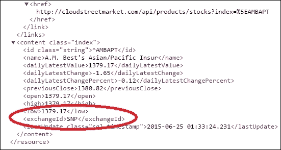
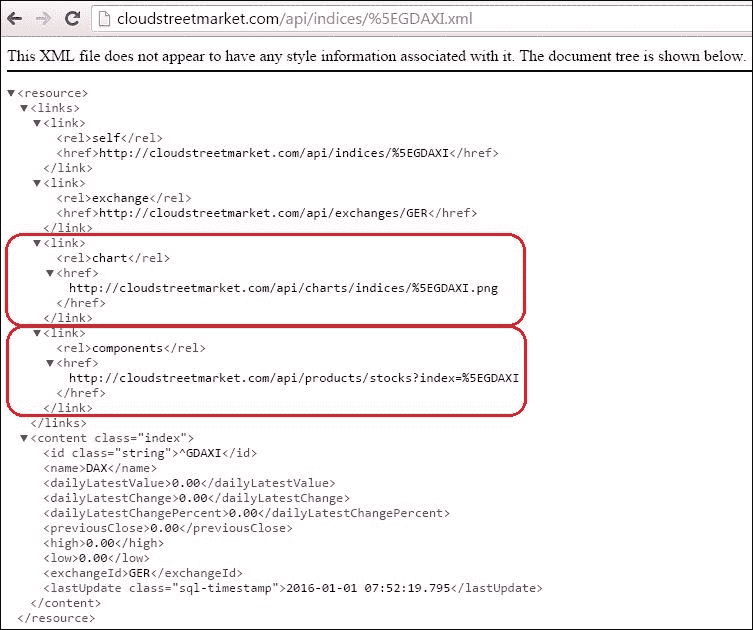

# 第十三章：实施 HATEOAS

本章包含以下配方：

+   将 DTO 转换为 Spring HATEOAS 资源

+   为超媒体驱动的 API 构建链接

+   选择暴露 JPA 实体的策略

+   使用 OAuth 从第三方 API 检索数据

# 介绍

什么是 HATEOAS？如果你以前从未见过这个词，它可能很难发音。有些人发音为 hate-ee-os；其他人说 hate O-A-S。重要的是要记住这个缩写代表**超媒体作为应用状态的引擎**（**HATEOAS**）。至少，你应该记住超媒体。超媒体作为资源嵌入节点，指向外部资源的能力。作为与其他资源连接的资源，超媒体资源也受到其领域的限制，因为它在技术上不能开发其他资源的领域（作为其一部分）。

把它想象成**维基百科**。如果我们创建一个页面，其各个部分不是在页面标题（域）中自包含的，如果其中一个部分已经在外部页面中涵盖，那么管理员几乎不可能提出这种情况。

HATEOAS 是适用于 REST 架构的约束。它对其资源施加域一致性，并同时对所有权者施加明确的自我文档化，以维护整体凝聚力。

## Richardson 成熟度模型

Richardson 成熟度模型（Leonard Richardson 编写）提供了一种通过 REST 约束级别对 REST API 进行评分和资格认定的方法：


API 越符合 REST 标准，评分越高。

该模型中的初始状态是**Level 0**：**POX 的沼泽**。在这里，协议（通常是 HTTP）仅用于其传输功能（而不是用于其状态描述功能）。此外，这里没有特定于资源的 URI，只使用一个端点用于一个方法（通常是 HTTP 中的`POST`）。

**Level 1: 资源**的特征是实现特定于资源的 URI。资源标识符可以在 URI 中找到。然而，仍然只使用协议的一个方法（再次是 HTTP 的 POST）。

**Level 2: HTTP 动词**反映了对协议属性的改进使用。对于 HTTP，这实际上意味着 API 正在使用 HTTP 方法来实现其目的（`GET`用于读取，`POST`用于创建，`PUT`用于编辑，`DELETE`用于删除等）。此外，API 提供可靠地通知用户有关操作状态的响应代码。

**Level 3: 超媒体控制**是该模型中的最高级别。它指示使用 HATEOAS，为客户端提供 API 发现功能。

您可以在 Martin Fowler 的博客上阅读有关 Richardson 成熟度模型的更多信息：

[`martinfowler.com/articles/richardsonMaturityModel.html`](http://martinfowler.com/articles/richardsonMaturityModel.html)

# 将 DTO 转换为 Spring HATEOAS 资源

本教程介绍了如何创建 Spring HATEOAS 资源。即使这里的重点是一个特定资源——`IndexResource`（代替以前的`IndexOverviewDTO`），也可以随意浏览**cloudstreetmarket-api**和**cloudstreetmarket-core**以发现更多更改。

HATEOAS 原则已应用于构成我们业务核心的所有资源，这在很大程度上反映了 Yahoo!的财务数据结构（指数、报价、产品、历史数据、图表等）。

## 如何做…

1.  从 Eclipse 的**Git Perspective**中，检出`v6.x.x`分支的最新版本。然后，在**cloudstreetmarket-parent**模块上运行`maven clean install`命令（右键单击**Run as…**下的**Maven Clean**菜单，然后再次单击**Run as…**下的**Maven Install**菜单），然后单击**Maven Update Project**菜单以将 Eclipse 与 Maven 配置同步（右键单击模块，然后导航到**Maven** | **Update Project…**）。

### 注意

此分支包括使用来自 Yahoo!的真实财务数据预填充数据库的 SQL 脚本。

1.  在拉取的更改中，一个新的`/app`配置目录出现在与`cloudstreetmarket-parent`和`zipcloud-parent`相同级别。必须将此`/app`目录复制到您系统的主目录：

+   将其复制到`C:\Users\{system.username}\app`，如果您使用的是 Windows

+   如果您使用的是 Linux，请将其复制到`/home/usr/{system.username}/app`

+   如果您使用的是 Mac OS X，请将其复制到`/Users/{system.username}/app`

1.  Spring HATEOAS 附带以下依赖项。此依赖项已添加到**cloudstreetmarket-parent**、**cloudstreetmarket-core**和**cloudstreetmarket-api**`：`

```java
<dependency>
  <groupId>org.springframework.hateoas</groupId>
  <artifactId>spring-hateoas</artifactId>
  <version>0.17.0.RELEASE</version>
</dependency>
```

1.  正如教程标题所示，目标是摆脱以前使用 REST API 公开的现有 DTO。目前，我们已删除了 IndexOverviewDTO、MarketOverviewDTO、ProductOverviewDTO 和 StockProductOverviewDTO。

1.  这些 DTO 已被这些类替换：IndexResource，StockProductResource，ChartResource，ExchangeResource，IndustryResource 和 MarketResource。

1.  正如所示的 IndexResource，它如下所示，所有这些新类都继承了 Spring HATEOAS Resource 类：

```java
@XStreamAlias("resource")
public class IndexResource extends Resource<Index> {
  public static final String INDEX = "index";
  public static final String INDICES = "indices";
  public static final String INDICES_PATH = "/indices";

  public IndexResource(Index content, Link... links) {
    super(content, links);
  }
}
```

1.  正如您所看到的，使用 IndexResource，资源是从 JPA 实体（这里是 Index.java）创建的。这些实体存储在资源超类型中的 content 属性名称下。

1.  我们已经将 JPA 实体转换为实现`Identifiable`接口的抽象类：

```java
@Entity
@Table(name="index_value")
@XStreamAlias("index")
public class Index extends ProvidedId<String> {

  private String name;

  @Column(name="daily_latest_value")
  private BigDecimal dailyLatestValue;

  @Column(name="daily_latest_change")
  private BigDecimal dailyLatestChange;

  @Column(name="daily_latest_change_pc")
  private BigDecimal dailyLatestChangePercent;

  @Column(name = "previous_close")
  private BigDecimal previousClose;

  private BigDecimal open;

  private BigDecimal high;

  private BigDecimal low;

  @ManyToOne(fetch = FetchType.EAGER)
  @JsonSerialize(using=IdentifiableSerializer.class)
  @JsonProperty("exchangeId")
  @XStreamConverter(value=IdentifiableToIdConverter.class, strings={"id"})
  @XStreamAlias("exchangeId")
   private Exchange exchange;

  @JsonIgnore
  @XStreamOmitField
  @ManyToMany(fetch = FetchType.LAZY)
  @JoinTable(name = "stock_indices", joinColumns = 
  {@JoinColumn(name = "index_code") },
  inverseJoinColumns = {@JoinColumn(name = "stock_code")})
  private Set<StockProduct> components = new LinkedHashSet<>();

  @Column(name="last_update", insertable=false, columnDefinition="TIMESTAMP DEFAULT CURRENT_TIMESTAMP")

  @Temporal(TemporalType.TIMESTAMP)
  private Date lastUpdate;

  public Index(){}

  public Index(String indexId) {
    setId(indexId);
  }

  //getters & setters

    @Override
    public String toString() {
    return "Index [name=" + name + ", dailyLatestValue=" + dailyLatestValue + ", dailyLatestChange=" + dailyLatestChange + ", dailyLatestChangePercent=" + dailyLatestChangePercent + ", previousClose=" + previousClose + ", open=" + open + ", high=" + high + ", low=" + low + ", exchange=" + exchange + ", lastUpdate=" + lastUpdate + ", id=" + id + "]";
    }
  }
```

1.  以下是 ProvidedId 类的详细信息，它是我们可识别实现中的一个：

```java
@MappedSuperclass
public class ProvidedId<ID extends Serializable> implements Identifiable<ID> {
  @Id 
  protected ID id;
  @Override
  public ID getId() {
    return id;
  }
  public void setId(ID id) {
    this.id = id;
  }
  @Override
  public String toString() {
    return id;
  }
  @Override
  public int hashCode() {
    return Objects.hash(id);
  }
  @Override
  public boolean equals(Object obj) {
    if (this == obj)
      return true;
    if (obj == null)
      return false;
    if (getClass() != obj.getClass())
      return false;
    ProvidedId <?> other = (ProvidedId <?>) obj;
    return Objects.equals(this.id, other.id);
  }
}
```

## 它是如何工作的...

一个新的 Spring 依赖项，一些新的资源对象（Resource 子类），最后对我们的实体进行一些修改，以便它们实现`Identifiable`接口。让我们详细讨论所有这些。

### Spring HATEOAS 资源

正如在本章开头介绍的，HATEOAS 是关于链接的。可以说，作为框架的一部分，我们可以期望存在一种现有类型来支持和标准化链接的表示。

这就是`ResourceSupport`类（Spring HATEOAS 的一部分）的作用：支持附加到资源的链接的收集和管理。

另外，REST 资源也是一种内容。框架还提供了一个`Resource`类，它已经继承了`ResourceSupport`。

总之，使用 Spring HATEOAS，我们可以决定以两种不同的方式对我们的资源对象（`IndexResource`，`StockProductResource`等）进行建模：

+   我们可以通过直接让它们继承`ResourceSupport`来对它们进行建模。这样做的话，我们必须自己管理包装对象的资源内容。这里的内容对于框架来说是不受控制的。

+   我们还可以通过让它们继承泛型`Resource<T>`类来对它们进行建模，其中类型`T`对应于资源的`POJO`内容的类型。这是我们选择的策略。框架为我们的资源对象（`Inde3xResource`）提供了内容绑定、链接创建，甚至在控制器级别也是如此。我们很快就会看到这一切。

#### ResourceSupport 类

`ResourceSupport`类是一个实现`Identifiable<Link>`的对象：

```java
public class ResourceSupport extends Object implements Identifiable<Link>
```

以下是`ResourceSupport` JavaDoc 中的示例，它将为您提供有关其构造函数和方法的见解：

| 构造函数 |
| --- | --- |
| `ResourceSupport()` | 这将创建一个新的`ResourceSupport`类 |
| 方法 | 描述 |
| --- | --- |
| `Void add(Iterable<Link> links)` | 这将所有给定的链接添加到资源中 |
| `Void add(Link... links)` | 这将所有给定的链接添加到资源中 |
| `Void add(Link link)` | 这将添加给定的链接到资源中 |
| `Link getId()` | 这将返回具有`Link.REL_SELF`的`rel`的链接 |
| `Link getLink(String rel)` | 这将返回具有给定`rel`的链接 |
| `List<Link> getLinks()` | 这将返回资源中包含的所有链接 |
| `boolean hasLink(String rel)` | 这将返回资源是否包含具有给定`rel`的链接 |
| `boolean hasLinks()` | 这将返回资源是否包含链接 |
| `boolean removeLinks()` | 这将删除到目前为止添加到资源中的所有链接 |
| `Boolean equals(Object obj)` |   |
| `int hashCode()` |   |
| `String toString()` |   |

正如之前介绍的，这个类与链接有关！我们将看到 Spring HATEOAS 提供了围绕链接的一些小机制。

#### 资源类

`Resource`类是`POJO`的包装器。`POJO`存储在这个类的`content`属性中。`Resource`类本质上扩展了`ResourceSupport`：

```java
public class Resource<T> extends ResourceSupport
```

以下是`Resource` JavaDoc 中的示例，它提供了有关其构造函数和方法的见解：

| 构造函数 | 描述 |
| --- | --- |
| `Resource(T content, Iterable<Link> links)` | 这将使用给定的内容和链接创建一个新的资源 |
| `Resource(T content, Link... links)` | 这将使用给定的内容和链接（可选）创建一个新资源 |
| 方法 | 描述 |
| --- | --- |
| `TgetContent()` | 这将返回底层实体 |
| `void add(Iterable<Link> links)` | 这将所有给定的链接添加到资源中 |
| `void add(Link... links)` | 这将所有给定的链接添加到资源中 |
| `void add(Link link)` | 这将给定的链接添加到资源中 |
| `Link getId()` | 这将返回具有`Link.REL_SELF`的`rel`的链接 |
| `Link getLink(String rel)` | 这将返回具有给定`rel`的链接 |
| `List<Link> getLinks()` | 这将返回此资源中包含的所有链接 |
| `boolean hasLink(String rel)` | 这将返回资源是否包含具有给定`rel`的链接 |
| `boolean hasLinks()` | 这将返回资源是否包含任何链接 |
| `boolean removeLinks()` | 这将删除到目前为止添加到资源中的所有链接 |
| `Boolean equals(Object obj)` |   |
| `int hashCode()` |   |
| `String toString()` |   |

两个方便的构造函数，一个用于获取内容的 getter，以及所有与链接相关的辅助函数，这就是 Resource 类的组成部分。

### 可识别的接口

`Identifiable`接口在 Spring HATEOAS 中扮演着重要角色，因为关键类`Resource`、`ResourceSupport`、`Resources`和`PagedResources`类，我们稍后将介绍的这些类都是`Identifiable`的实现。稍后我们将介绍所有这些关键类。

`Identifiable`接口是 Spring HATEOAS 的一个单方法接口（通用接口），用于在对象中定义`Id`：

```java
public interface Identifiable<ID extends Serializable> {
  ID getId();
}
```

因此，框架使用这种方法来检索 ID，对传入对象的性质几乎没有要求。由于一个类可以实现多个接口的能力，向对象添加这样的限定符是没有成本的。此外，这个接口的契约是最小的。

框架对这个接口（和方法）最重要的用途是从`Resource`对象构建链接。看一下`LinkBuilderSupport`的`slash`方法。您会注意到，如果`ID`不是`Identifiable`的实例（这通常是最终结果），则`Link`将附加到`ID`类型的`toString()`表示。

### 提示

如果您考虑实现自定义 ID 类型，请记住这种行为。

### 抽象化实体的@Id

如果您计划坚持使用 Spring HATEOAS 而不将其扩展到 Spring Data REST，那么将基本实体与它们的`@Id`解耦可能并不是绝对必要的。至少不是我们所做的方式。

这种做法来自 Oliver Gierke，在他的`Spring RestBucks`应用程序中。Spring RestBucks 是一个展示现代 Spring REST 功能的示例应用程序。

### 注意

Oliver Gierke 是 Pivotal Software, Inc.的 Spring Data 首席开发人员。他还参与了 Spring HATEOAS。Spring Data 是一个令人惊叹的项目和产品。我们可以信任 Oliver Gierke 的愿景和决定。

在他的`AsbtractId`实现中，O. Gierke 将`Id`属性定义为私有，并将其注释为`@JsonIgnore`。他引导我们不将`Id`属性作为资源内容的一部分暴露出来。在 REST 中，资源的 ID 应该是其 URI。

如果您有机会查看 Spring Data REST，这种方法完全符合框架的一部分，它将 REST 资源与 Spring Data 存储库强烈相关联。

我们选择不在本书的范围内涵盖 Spring Data REST。然而，不暴露实体 ID 对我们的应用程序并不是关键的。出于这些原因，也因为我们希望在这一点上保持与第七章“开发 CRUD 操作和验证”一致，ID 将作为资源属性公开。

## 还有更多...

如果我们的 HATEOAS 介绍还不够清晰，无法让您了解原则，请阅读 Pivotal（[Spring.io](http://Spring.io)）的这个演示：

[`spring.io/understanding/HATEOAS`](https://spring.io/understanding/HATEOAS)

## 另请参阅

+   我们建议您访问 O. Gierke 的 Spring REST 展示应用，该应用展示了 Spring HATEOAS 的实践，无论是否与 Spring Data REST 配合使用，网址为[`github.com/olivergierke/spring-restbucks`](https://github.com/olivergierke/spring-restbucks)。

+   您可以在[`github.com/spring-projects/spring-hateoas/issues/66`](https://github.com/spring-projects/spring-hateoas/issues/66)找到一些关于 ID 暴露的讨论。

+   我们建议您阅读更多关于 Spring Data REST 的内容，因为我们只是介绍了一点点。Spring Data REST 在 Spring Data 存储库的基础上构建 REST 资源，并自动发布它们的 CRUD 服务。您可以在[`docs.spring.io/spring-data/rest/docs/current/reference/html`](http://docs.spring.io/spring-data/rest/docs/current/reference/html)了解更多信息。

# 为超媒体驱动的 API 构建链接

在这个示例中，我们将重点介绍如何使用 Spring HATEOAS 创建链接以及如何将它们绑定到资源上。

我们将详细介绍资源装配器，这些是可重用的过渡组件，用于从实体（如`Index`）到它们的资源（`IndexResource`）的转换。这些组件还提供了链接创建的支持。

## 如何做…

1.  创建的资源（IndexResource，ChartResource，ExchangeResource，IndustryResource，MarketResource 等）是从它们关联的实体（Index，ChartIndex，ChartStock，Exchange，Industry，Market 等）使用资源装配器注册为`@Component`创建的：

```java
import static org.sfw.hateoas.mvc.ControllerLinkBuilder.linkTo;
import static org.sfw.hateoas.mvc.ControllerLinkBuilder.methodOn;
import org.sfw.hateoas.mvc.ResourceAssemblerSupport;
import org.sfw.hateoas.EntityLinks;
import static edu.zc.csm.api.resources.ChartResource.CHART;
import static edu.zc.csm.api.resources.ExchangeResource.EXCHANGE;
import static edu.zc.csm.api.resources.StockProductResource.COMPONENTS;

@Component
public class IndexResourceAssembler extends ResourceAssemblerSupport<Index, IndexResource> {
  @Autowired
  private EntityLinks entityLinks;
  public IndexResourceAssembler() {
    super(IndexController.class, IndexResource.class);
  }
  @Override
  public IndexResource toResource(Index index) {
    IndexResource resource = createResourceWithId(index.getId(), index);
    resource.add(
      entityLinks.linkToSingleResource(index.getExchange ()).withRel(EXCHANGE)
);
  resource.add(
  linkTo(methodOn(ChartIndexController.class).get(in dex.getId(), ".png", null, null, null, null, null, 	null, null)).withRel(CHART)
);
  resource.add(
    linkTo(methodOn(StockProductController.class).getS everal(null, null, index.getId(), null, null, 	null, null)).withRel(COMPONENTS)
);
return resource;
  }
  @Override
  protected IndexResource instantiateResource(Index entity) {
    return new IndexResource(entity);
  }
}
```

### 提示

我们使用这些装配器来生成资源的链接。它们使用`ControllerLinkBuilder`的静态方法（`linkTo`和`methodOn`）和在资源本身中定义为常量的显式标签（`EXCHANGE`，`CHART`和`COMPONENTS`）。

1.  我们已经修改了之前的 SwaggerConfig 类，使得这个类可以用于 Swagger 以外的其他领域的基于注解的配置。这个类已经改名为 AnnotationConfig。

1.  我们还在 AnnotationConfig 类中添加了以下两个注解：

```java
@EnableHypermediaSupport(type = { HypermediaType.HAL })

@EnableEntityLinks 
```

（因为这两个注解目前还没有 XML 等效项）。

1.  这些转换器中的所有目标控制器都已经在类级别上用@ExposesResourceFor 注解进行了注释。

1.  这些控制器现在也返回创建的资源或资源页面：

```java
@RestController
@ExposesResourceFor(Index.class)
@RequestMapping(value=INDICES_PATH, produces={"application/xml", "application/json"})
public class IndexController extends CloudstreetApiWCI<Index> {
  @Autowired
  private IndexService indexService;
  @Autowired
  private IndexResourceAssembler assembler;
  @RequestMapping(method=GET)
  public PagedResources<IndexResource> getSeveral(
    @RequestParam(value="exchange", required=false) String exchangeId,@RequestParam(value="market", required=false) MarketId marketId, @PageableDefault(size=10, page=0, sort={"previousClose"}, direction=Direction.DESC) Pageable pageable){
      return pagedAssembler.toResource( indexService.gather(exchangeId,marketId, pageable), assembler);
  }
  @RequestMapping(value="/{index:[a-zA-Z0-9^.-]+}{extension:\\.[a-z]+}", method=GET)
  public IndexResource get(
    @PathVariable(value="index") String indexId, @PathVariable(value="extension") String extension){
    return assembler.toResource( indexService.gather(indexId));
}
}
```

1.  在这里，我们使 CloudstreetApiWCI 成为通用的。这样，CloudstreetApiWCI 可以有一个通用的 PagedResourcesAssembler @Autowired：

```java
@Component
@PropertySource("classpath:application.properties")
public class CloudstreetApiWCI<T extends Identifiable<?>> 
  extends WebContentInterceptor {
...
    @Autowired
    protected PagedResourcesAssembler<T> pagedAssembler;
...
}
```

### 提示

由于`WebCommonInterceptor`类的传统目的不是作为一个超级控制器共享属性和实用方法，我们将在控制器和`WebCommonInterceptor`之间创建一个中间组件。

1.  为了@Autowire PagedResourcesAssemblers，就像我们做的那样，我们在 dispatcher-servlet.xml 中注册了一个 PagedResourcesAssembler bean：

```java
  <bean class="org.sfw.data.web.PagedResourcesAssembler">
    <constructor-arg><null/></constructor-arg>
    <constructor-arg><null/></constructor-arg>
  </bean>
```

1.  因此，现在调用^GDAXI 指数代码的 API（http://cloudstreetmarket.com/api/indices/%5EGDAXI.xml）会产生以下输出：

### 提示

作为链接，我们表达了端点和 URI 路径。从这些链接中，我们可以检索与指数相关的其他实体（如果我们想要公开它们的话）。

## 工作原理…

本节具体详细介绍了链接的创建。

### 资源装配器

这种专门的转换器（资源装配器）是为了可重用性而设计的。它们的主要功能如下：

+   实例化资源并用内容进行填充

+   从实体状态或静态全局设计创建资源的链接

该框架提供了一个`ResourceAssemblerSupport`超类，其作用是减少装配器职责中的样板代码。

`ResourceAssemblerSupport`类是一个抽象的泛型类。它通过提供一些额外的方法来丰富组装器。以`T`作为控制器的类或超级类型，其签名如下：

```java
public abstract class ResourceAssemblerSupport<T, D extends ResourceSupport> implements ResourceAssembler<T, D>
```

这里的表格提供了`ResourceAssemblerSupport`的 JavaDoc 的一瞥：

| 方法 | 描述 |
| --- | --- |
| `List<D> toResources(Iterable<? extends T> entities)` | 这将所有给定的实体转换为资源 |
| `protected D createResourceWithId(Object id, T entity)` | 这将创建一个带有给定 ID 的自链接的新资源 |
| `D createResourceWithId(Object id, T entity, Object... parameters)` | - |
| `protected D instantiateResource(T entity)` | 这将实例化资源对象。默认实现将假定一个`no-arg`构造函数并使用反射。但是，如果需要，可以重写它以手动设置对象实例（例如，以改善性能） |

`ResourceAssemblerSupport`类还实现了`ResourceAssembler`，这是一个单方法接口，强制组装器提供`toResource(T entity)`方法：

```java
public interface ResourceAssembler<T, D extends ResourceSupport> {
  D toResource(T entity);
} 
```

可以注意到我们在组装器中重写了`instantiateResource`方法。如 JavaDoc 中所述，不重写它会导致框架通过反射实例化资源，寻找资源中的`no-arg`构造函数。

我们更倾向于避免在我们的资源中使用这样的构造器，因为它们可能会有点超负荷。

### PagedResourcesAssembler

这个令人惊奇的通用超级组装器用于为客户端构建基于链接的资源页面。通过极少量的配置，Spring HATEOAS 为我们构建了一个完整且开箱即用的、完全填充的类型资源页面。

根据我们呈现的配置，您可以尝试调用以下 URL：

[`cloudstreetmarket.com/api/indices.xml`](http://cloudstreetmarket.com/api/indices.xml)

通过这样做，您应该获得以下输出：


你能看到**next rel**链接吗？它是如何通过反射从我们的方法处理程序注解及其默认和使用的值构建的？尝试跟随**next**链接，看看导航如何更新并平滑增加。

在`IndexController.getSeveral()`方法处理程序（如下面的代码片段所示）中，我们确保每个单独的资源都通过使用我们自定义的`IndexResourceAssembler`来构建（内容和链接）：

```java
@RequestMapping(method=GET)
public PagedResources<IndexResource> getSeveral(
@RequestParam(value="exchange", required=false) String exchangeId,
@RequestParam(value="market", required=false) MarketId marketId,
@PageableDefault(size=10, page=0, sort={"previousClose"}, direction=Direction.DESC) Pageable pageable){
  return pagedAssembler.toResource(
  indexService.gather(exchangeId, marketId, pageable), 
  assembler);
}
```

### 构建链接

让我们看看我们在组装器中构建资源链接的方式。在`IndexResourceAssembler`中呈现的`toResource()`方法使用了两种不同的技术。

通过**EntityLinks**的第一种技术使用 JPA 实体；第二种技术通过`ControllerLinkBuilder`静态方法直接使用`Controllers`。

#### EntityLinks

通过在配置类中声明`@EnableEntityLinks`注解，会注册一个`EntityLinks`实现：`ControllerEntityLinks`。查找**ApplicationContext**的所有 Spring MVC 控制器，以寻找携带`@ExposesResourceFor(xxx.class)`注解的控制器。

Spring MVC 控制器上的`@ExposesResourceFor`注解公开了控制器管理的模型类型。这种注册使控制器和 JPA 实体之间的必要映射得以实现。

还必须注意，注册的`ControllerEntityLinks`实现假定控制器上有特定的`@RequestMapping`配置。`@RequestMapping`配置如下所示：

+   对于资源集合，期望有一个类级别的`@RequestMapping`注解。然后控制器必须暴露一个映射到空路径的方法处理程序，例如`@RequestMapping(method = RequestMethod.GET)`。

+   对于单个资源，这些资源使用所管理的 JPA 实体的`id`公开，例如`@RequestMapping("/{id}")`。

承认这些观点，`EntityLinks`实现（`ControllerEntityLinks`）从`@Autowiring`中使用以生成使用其提供的方法集的`Links`：

```java
public interface EntityLinks extends Plugin<Class<?>>{ 
  LinkBuilder linkFor(Class<?> type);
  LinkBuilder linkFor(Class<?> type, Object... parameters);
  LinkBuilder linkForSingleResource(Class<?> type, Object id);
  LinkBuilder linkForSingleResource(Identifiable<?> entity);
  Link linkToCollectionResource(Class<?> type);
  Link linkToSingleResource(Class<?> type, Object id);
  Link linkToSingleResource(Identifiable<?> entity);
}
```

#### ControllerLinkBuilder

正如介绍的那样，Spring HATEOAS 提供了`ControllerLinkBuilder`实用程序，它允许通过指向控制器类来创建链接：

```java
resource.add(
  linkTo(
  methodOn(StockProductController.class)
  .getSeveral(null, null, index.getId(), null, null, null, null)
  )
  .withRel(COMPONENTS)
);
```

如 Spring HATEOAS 参考中所指定的，`ControllerLinkBuilder`在底层使用 Spring 的`ServletUriComponentsBuilder`来从当前请求中获取基本 URI 信息。

如果我们的应用程序在`http://cloudstreetmarket/api`上运行，那么框架将在这个根 URI 的基础上构建`Links`，并将其附加到根控制器映射（`/indices`），然后再附加到后续方法处理程序特定的路径。

## 还有更多…

### 在@RequestMapping 中使用正则表达式

在`IndexController`、`StockProductController`、`ChartStockController`和`ChartIndexController`中，用于检索单个资源的`GET`方法处理程序具有特殊的`@RequestMapping`定义。

这是 IndexController 的`get()`方法：

```java
@RequestMapping(value="/{index:[a-zA-Z0-9^.-]+}{extension:\\.[a-z]+}", method=GET)
public IndexResource get(
  @PathVariable(value="index") String indexId, 
  @PathVariable(value="extension") String extension){
  return assembler.toResource(indexService.gather(indexId));
}
```

我们最终选择了这个选项，因为 Yahoo!的指数代码似乎比简单的字符串复杂一些。特别是考虑到这些代码可能携带一个或多个点。

这种情况导致 Spring MVC 无法正确区分`@PathVariable`索引和`extension`（在一半的情况下将它们剥离）。

幸运的是，Spring MVC 允许我们使用正则表达式定义 URI 模板模式。语法是`{varName:regex}`，其中第一部分定义变量名，第二部分定义正则表达式。

您将注意到我们为我们的指数定义的正则表达式：

`[a-zA-Z0-9^.-]+`表达式，特别允许`^`和`.`字符，在 Yahoo!的指数代码中通常使用。

## 另请参阅

+   要了解有关 Spring HATEOAS 的更多信息，请参考[`docs.spring.io/spring-hateoas/docs/current/reference/html/`](http://docs.spring.io/spring-hateoas/docs/current/reference/html/)。

+   介绍的 HATEOAS 表示实现了**Hypertext Application Language** (**HAL**)。 HAL 是 Spring HATEOAS 支持的默认渲染。在[`tools.ietf.org/html/draft-kelly-json-hal-06`](https://tools.ietf.org/html/draft-kelly-js)和[`stateless.co/hal_specification.html`](http://stateless.co/hal_specification.html)了解更多关于 HAL 规范的信息。

# 选择一种公开 JPA 实体的策略

在资源中公开的`content`对象是 JPA 实体。将 JPA 实体包装在资源中的有趣之处在于实体本身的低级性质，它据说代表了一个受限的可识别领域。这个定义理想情况下应该完全转换为公开的 REST 资源。

那么，我们如何在 REST HATEOAS 中表示一个实体？我们如何安全而统一地表示 JPA 关联？

这个示例提供了一种简单而保守的方法来回答这些问题。

## 如何做到这一点…

1.  我们介绍了一个用作资源的实体（`Index.java`）。这里还有另一个用到的实体：`Exchange.java`。这个实体提供了一种类似的策略来公开其 JPA 关联：

```java
import edu.zc.csm.core.converters.IdentifiableSerializer;
import edu.zc.csm.core.converters.IdentifiableToIdConverter;

@Entity
public class Exchange extends ProvidedId<String> {
  private String name;

  @ManyToOne(fetch = FetchType.EAGER)
  @JoinColumn(name = "market_id", nullable=true)
  @JsonSerialize(using=IdentifiableSerializer.class)
  @JsonProperty("marketId")
  @XStreamConverter(value=IdentifiableToIdConverter.class, strings={"id"})
  @XStreamAlias("marketId")
  private Market market;

  @OneToMany(mappedBy = "exchange", cascade = CascadeType.ALL, fetch=FetchType.LAZY)
  @JsonIgnore
  @XStreamOmitField
  private Set<Index> indices = new LinkedHashSet<>();

  @OneToMany(mappedBy = "exchange", cascade = CascadeType.ALL, fetch=FetchType.LAZY)
  @JsonIgnore
  @XStreamOmitField
  private Set<StockProduct> stocks = new LinkedHashSet<>();

  public Exchange(){}
  public Exchange(String exchange) {
    setId(exchange);
  }

  //getters & setters

  @Override
      public String toString() {
        return "Exchange [name=" + name + ", market=" + market + ", id=" + id+ "]";
      }
} 
```

1.  `Exchange.java`实体引用了两个自定义实用程序类，用于以特定的方式转换外部实体作为主实体渲染的一部分（JSON 或 XML）。这些实用程序类是`IdentifiableSerializer`和`IdentifiableToIdConverter`：

+   `IdentifiableSerializer`类用于 JSON marshalling：

```java
import org.springframework.hateoas.Identifiable;
import com.fasterxml.jackson.core.JsonGenerator;
import com.fasterxml.jackson.core.JsonProcessingException;
import com.fasterxml.jackson.databind.JsonSerializer;
import com.fasterxml.jackson.databind.SerializerProvider;
public class IdentifiableSerializer extends JsonSerializer<Identifiable<?>> {
   @Override
   public void serialize(Identifiable<?> value, JsonGenerator jgen, SerializerProvider provider) throws IOException, JsonProcessingException {
    provider.defaultSerializeValue(value.getId(), jgen);
   }
}
```

+   `IdentifiableToIdConverter`类用于 XML marshlling，并且构建了 XStream 依赖项：

```java
import com.thoughtworks.xstream.converters.Converter;
public class IdentifiableToIdConverter implements Converter {
    private final Class <Identifiable<?>> type;
    public IdentifiableToIdConverter(final Class <Identifiable<?>> type, final Mapper mapper, final ReflectionProvider reflectionProvider, final ConverterLookup lookup, final String valueFieldName) {
        this(type, mapper, reflectionProvider, lookup, valueFieldName, null);
    }
  public IdentifiableToIdConverter(final Class<Identifiable<?>> type, final Mapper mapper, final ReflectionProvider reflectionProvider, final ConverterLookup lookup, final String valueFieldName, Class valueDefinedIn) {
        this.type = type;
        Field field = null;
        try {
  field = (valueDefinedIn != null? valueDefinedIn : type.getSuperclass()).getDeclaredField("id");
  if (!field.isAccessible()) {
    field.setAccessible(true);
    }
      } catch (NoSuchFieldException e) {
        throw new IllegalArgumentException( 	e.getMessage()+": "+valueFieldName);
          }
      }
      public boolean canConvert(final Class type) {
        return type.isAssignableFrom(this.type);
    }
    public void marshal(final Object source, final HierarchicalStreamWriter writer,final 	MarshallingContext context) {
          if(source instanceof Identifiable){
            writer.setValue( ((Identifiable<?>)source).getId() .toString()
          );
        }
      }
    public Object unmarshal(final HierarchicalStreamReader reader, final UnmarshallingContext context) {
      return null;
    }
}
```

## 它是如何工作的…

让我们了解一下这个策略是如何工作的。

### REST CRUD 原则

REST 的一个架构约束是提供统一的接口。通过从可以从不同的 HTTP 方法（如果适用）针对的端点公开资源来实现统一的接口。

资源也可以以多种表示形式（`json`，`xml`等）公开，并且信息或错误消息必须是自描述的。 HATEOAS 的实现为 API 的自解释特性提供了巨大的奖励。

在 REST 中，越直观和可推断的事物越好。从这个角度来看，作为 Web/UI 开发人员，我应该能够假设以下内容：

+   我从端点的`GET`调用接收到的对象的结构将是我必须在`PUT`调用（对象的编辑）中发送回去的预期结构

+   类似地，相同的结构应该用于创建新对象（`POST`方法）

在不同的 HTTP 方法之间保持一致的有效负载结构是在捍卫 API 利益时使用的*SOLID*和保守的论点。*捍卫 API 利益几乎总是时候*。

### 暴露最少

在重构本章期间，暴露最少量的信息是核心思想。通常这是确保一个端点不会用于暴露初始控制器之外的信息数据的好方法。

JPA 实体可以与其他实体（`@OneToOne`，`@OneToMany`，`@ManyToOne`或`@ManyToMany`）关联。

其中一些关联已经用`@JsonIgnore`（和`@XStreamOmitField`）进行了注释，另一些关联已经用`@JsonSerialize`和`@JsonProperty`（和`@XStreamConverter`和`@XStreamAlias`）进行了注释。

#### 如果实体不拥有关系

在这种情况下，实体的数据库表没有指向目标第二实体表的外键。

这里的策略是完全忽略 REST 中的关系，以反映数据库状态。

`ignore`指令取决于支持的表示和选择的实现。

对于`json`，我们使用`Jackson`，解决方案是：`@JsonIgnore`。

对于`xml`，我们使用`XStream`，解决方案是：`@XstreamOmitField`。

#### 如果实体拥有关系

在这里，实体的数据库表具有指向目标第二实体表的外键。

如果我们计划更新此表的实体，该实体依赖于另一个表的实体，我们将不得不为该实体提供此外键。

然后的想法是将这个外键作为专用字段公开，就像数据库表的所有其他列一样。再次，实现此的解决方案取决于支持的表示和配置的编组器。

对于`json`和`Jackson`，我们使用以下代码片段完成了这一点：

```java
@JsonSerialize(using=IdentifiableSerializer.class)
@JsonProperty("marketId")
```

正如您所看到的，我们重命名属性以表明我们正在呈现（并期望）一个 ID。我们创建了`IdentifiableSerializer`类，从实体（从`Identifiable`接口）中提取`ID`，并将仅此`ID`放入属性的值中。

对于`xml`和`XStream`，它已经是：

```java
@XStreamConverter(value=IdentifiableToIdConverter.class, strings={"id"})
@XStreamAlias("marketId")
```

同样，我们重命名属性以表明我们正在呈现一个`ID`，并且我们针对自定义转换器`IdentifiableToIdConverter`，该转换器也仅选择实体的**ID**作为属性的值。

这是`xml`表示示例的`^AMBAPT`索引的示例：



### 资源的分离

这种策略促进了资源之间的明确分离。每个资源的显示字段完全匹配数据库模式。这是 Web 开发中的标准做法，以保持不同 HTTP 方法的 HTTP 请求有效负载不变。

当采用 HATEOAS 时，我们应该充分鼓励使用链接来访问相关实体，而不是嵌套视图。

以前的配方*为超媒体驱动的 API 构建链接*提供了使用链接访问（使用链接）与`@...ToOne`和`@...ToMany`相关联的实体的示例。以下是在先前的配方中实现的公开实体中的这些链接的示例：



## 还有更多…

我们在这里详细介绍了实现的编组器的官方信息来源。

### Jackson 自定义序列化器

您可以在以下位置找到这些序列化器的官方 wiki 页面指南：

[`wiki.fasterxml.com/JacksonHowToCustomSerializers`](http://wiki.fasterxml.com/JacksonHowToCustomSerializers)

### XStream 转换器

XStream 已从[codehaus.org](http://codehaus.org)迁移到**Github**。要查看有关 XStream 转换器的官方教程，请转到：

[`x-stream.github.io/converter-tutorial.html`](http://x-stream.github.io/converter-tutorial.html)

# 使用 OAuth 从第三方 API 检索数据

在使用 OAuth2 对用户进行身份验证后，了解如何使用用户的 OAuth2 帐户调用远程第三方 API 是很有用的。

## 如何做…

1.  您可能已经注意到`IndexController`，`StockProductController`，`ChartIndexController`和`ChartStockController`调用了名为`gather(…)`的底层服务方法。这个概念表明对第三方提供商（Yahoo!）的查找是进行的。

1.  例如，在`IndexServiceImpl`中，您可以找到`gather(String indexId)`方法：

```java
@Override
public Index gather(String indexId) {
    Index index = indexRepository.findOne(indexId);
    if(AuthenticationUtil.userHasRole(Role.ROLE_OAUTH2)){
      updateIndexAndQuotesFromYahoo(index != null ? Sets.newHashSet(index) : Sets.newHashSet(new Index(indexId)));
      return indexRepository.findOne(indexId);
    }
  return index;
}
```

1.  真正起到了服务层与第三方 API 之间的桥梁的是`updateIndexAndQuotesFromYahoo(…)`方法：

```java
  @Autowired
  private SocialUserService usersConnectionRepository;

  @Autowired
  private ConnectionRepository connectionRepository;

  private void updateIndexAndQuotesFromYahoo(Set<Index> askedContent) {
      Set<Index> recentlyUpdated = askedContent.stream()
      .filter(t -> t.getLastUpdate() != null && DateUtil.isRecent(t.getLastUpdate(), 1))
        .collect(Collectors.toSet());

    if(askedContent.size() != recentlyUpdated.size()){
      String guid = AuthenticationUtil.getPrincipal().getUsername();
    String token = usersConnectionRepository .getRegisteredSocialUser(guid) .getAccessToken();
    Connection<Yahoo2> connection = connectionRepository .getPrimaryConnection(Yahoo2.class);
    if (connection != null) {
      askedContent.removeAll(recentlyUpdated);
        List<String> updatableTickers = askedContent.stream()
         .map(Index::getId)
         .collect(Collectors.toList());
     List<YahooQuote> yahooQuotes = connection.getApi() .financialOperations().getYahooQuotes(updatableTickers, token);

     Set<Index> upToDateIndex = yahooQuotes.stream()
       .map(t -> yahooIndexConverter.convert(t))
       .collect(Collectors.toSet());

      final Map<String, Index> persistedStocks = indexRepository.save(upToDateIndex) 	.stream()
        .collect(Collectors.toMap(Index::getId, Function.identity()));

     yahooQuotes.stream()
      .map(sq -> new IndexQuote(sq, persistedStocks.get(sq.getId())))
        .collect(Collectors.toSet());
      indexQuoteRepository.save(updatableQuotes);
    }
  }
} 
```

1.  在 Facebook、Twitter 或 LinkedIn 的情况下，您应该能够找到一个完整的 API 适配器，以执行对其 API 的调用，而无需进行修改。在我们的情况下，我们不得不开发所需的适配器，以便从 Yahoo!中检索和利用财务数据。

1.  我们在`FinancialOperations`接口中添加了两个方法，如下所示：

```java
public interface FinancialOperations {
  List<YahooQuote> getYahooQuotes(List<String> tickers, String accessToken) ;
  byte[] getYahooChart(String indexId, ChartType type, ChartHistoSize histoSize, ChartHistoMovingAverage histoAverage, ChartHistoTimeSpan histoPeriod, Integer intradayWidth, Integer intradayHeight, String token);
}
```

1.  这个接口有一个`FinancialTemplate`实现，如下所示：

```java
public class FinancialTemplate extends AbstractYahooOperations implements FinancialOperations {
    private RestTemplate restTemplate;
  public FinancialTemplate(RestTemplate restTemplate, boolean isAuthorized, String guid) {
    super(isAuthorized, guid);
    this.restTemplate = restTemplate;
    this.restTemplate.getMessageConverters() add( new YahooQuoteMessageConverter( MediaType.APPLICATION_OCTET_STREAM));
    }
  @Override
  public List<YahooQuote> getYahooQuotes(List<String> tickers, String token)  {
      requiresAuthorization();
      final StringBuilder sbTickers = new StringBuilder();
      String url = "quotes.csv?s=";
      String strTickers = "";
      if(tickers.size() > 0){
        tickers.forEach(t -> strTickers = sbTickers.toString();
          strTickers = strTickers.substring(0, strTickers.length()-1);
      }
       HttpHeaders headers = new HttpHeaders();
       headers.set("Authorization", "Bearer "+token);
       HttpEntity<?> entity = new HttpEntity<>(headers);
       return restTemplate.exchange(buildUri(FINANCIAL, url.concat(strTickers).concat("&f=snopl1c1p2hgbavx	c4")), HttpMethod.GET, entity , QuoteWrapper.class).getBody();
  } 
  ...
}
```

1.  `FinancialTemplate`类作为全局`Yahoo2Template`的一部分进行初始化，并在`IndexServiceImpl`的`connection.getApi()`调用中返回。

1.  使用这种技术，不仅可以从 Yahoo!中检索指数和股票报价，还可以检索图表，现在我们能够显示来自 25000 多支股票和 30000 多个指数的实时数据。

1.  客户端能够使用随每个结果元素一起提供的 HATEOAS 链接。它使用这些链接来呈现详细视图，如**指数详情**或**股票详情**（新屏幕）。

## 它是如何工作的…

让我们了解这个配方背后的理论。

### 介绍 Yahoo!的财务数据

在我们的应用程序环境中，仍然有一个需要解释的重构。这是关于历史数据和图表的。

Yahoo!财务 API 提供了历史数据。这些数据可以用来构建图表，最初计划是这样做的。现在，Yahoo!也生成图表（用于历史和盘中数据），这些图表是相当可定制的（时间段、平均线、图表或股票的显示选项等）。

我们决定放弃历史部分，这在技术上与报价检索（数据快照）非常相似，专门使用由 Yahoo!生成的图表。

#### 图表生成/显示

我们的实现提供了一个有趣的 REST 图像服务示例。看看`ChartIndexController`（或`ChartStockController`）并看看图像如何以字节数组返回。

还要看一下`home_financial_graph.js`文件，了解接收到的内容是如何设置到 HTML ``标记中的。

### 财务数据是如何拉取/刷新的？

这里的想法是依赖于 OAuth 认证的用户。雅虎！为经过身份验证和未经身份验证的用户提供不同的费率和限制。雅虎！认为来自我们 IP 的调用太多，这将是一个问题。但是，如果有太多来自特定用户的调用，雅虎！将限制该用户，而不会影响应用程序的其余部分（应用程序可以进一步通过应用程序恢复）。

正如您所看到的，潜在处理雅虎！金融数据的方法处理程序通过名为`gather()`的方法调用适当的底层服务。

在这些`gather()`方法中，雅虎第三方 API 介入了我们的数据库和我们的控制器之间。

如果用户使用 OAuth2 进行了身份验证，则底层服务会检查数据是否存在于数据库中，以及是否已经更新到足够近的时间来匹配数据类型的预定义缓冲期（`indices`和`stocks`为一分钟）：

+   如果答案是肯定的，则将这些数据返回给客户端

+   如果答案是否定的，则从雅虎！请求预期的数据，转换，存储在数据库中，并返回给客户端

目前没有计划针对未经 OAuth 认证的用户，但我们可以想象很容易使用通用的雅虎！OAuth 账户来创建它们。

### 调用第三方服务

对于所呈现的配方，这部分是在`updateIndexAndQuotesFromYahoo`方法中完成的。我们的 Spring 配置定义了一个`connectionRepository` bean，为每个用户创建了一个`request`范围。`connectionRepository`实例是从我们的`SocialUserServiceImpl`的`createConnectionRepository`工厂方法创建的。

基于此，我们在服务层中`@Autowire`这两个 bean：

```java
@Autowired
private SocialUserService usersConnectionRepository;
@Autowired
private ConnectionRepository connectionRepository;
```

然后，`updateIndexAndQuotesFromYahoo`方法从 Spring Security 中获取已登录的`userId`（`guid`）：

```java
String guid = AuthenticationUtil.getPrincipal().getUsername();
```

访问令牌从`SocialUser`实体（来自数据库）中提取：

```java
String token = usersConnectionRepository .getRegisteredSocialUser(guid).getAccessToken();
```

从数据库中检索雅虎！连接：

```java
Connection<Yahoo2> connection = connectionRepository.getPrimaryConnection(Yahoo2.class);
```

如果连接不为空，则从连接对象调用第三方 API：

```java
List<YahooQuote> yahooQuotes = connection.getApi() .financialOperations().getYahooQuotes(updatableTickers, token);
```

再次，我们不得不开发实际的`FinancialTemplate`（雅虎！金融 API 的 Java 表示），但是您应该能够为您的第三方提供商找到这样的现有实现。

## 还有更多...

本节提供了许多现有的开源 Spring Social 适配器的列表，我们可以在我们的项目中使用

### Spring Social - 现有的 API 提供商

以下地址提供了连接支持和 API 绑定到许多热门服务提供商的 Spring 社交扩展的最新聚合：

[`github.com/spring-projects/spring-social/wiki/Api-Providers`](https://github.com/spring-projects/spring-social/wiki/Api-Providers)

## 另请参阅

+   **雅虎！金融股票代码**：我们已经在数据库中预先填充了一组对雅虎的金融引用（股票引用和指数引用），这使我们能够指向和搜索可以通过雅虎 API 第二次更新的资源。这组引用来自**Samir Khan**在他的博客[`investexcel.net/all-yahoo-finance-stock-tickers`](http://investexcel.net/all-yahoo-finance-stock-tickers)上发布的伟大工作。然后，我们使用基本文本编辑器和宏将这些 XLS 数据转换为 SQL。

