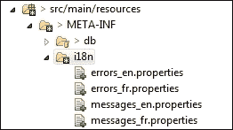

# 第十四章：开发 CRUD 操作和验证

到目前为止，我们已经看到了如何构建 API 的只读 HTTP 方法。Spring MVC 控制器中的这些方法要求您掌握或至少了解一些技术的呈现。开发非只读的 HTTP 方法会引发一系列新的基础主题。每个主题都直接影响客户体验，因此每个主题都很重要。我们引入以下四个配方作为涵盖主题的框架：

+   将 REST 处理程序扩展到所有 HTTP 方法

+   使用 bean 验证支持验证资源

+   为 REST 国际化消息和内容

+   使用 HTML5 和 AngularJS 验证客户端表单

# 介绍

在这个阶段开发 CRUD 操作和验证结果是最广泛的主题之一。

我们的应用程序将在许多方面进行转变，从交易管理标准化到错误（和内容）的国际化，通过 REST 处理程序、HTTP 合规性。

与前几章和本书的全局策略一致，我们专注于 Spring MVC 在可伸缩性和微服务通信方面的最佳实践。决定跳过一些内容是一个艰难的选择，但框架不断适应新的设计和挑战。本书试图在现代、可持续和可伸缩的应用程序中呈现 Spring MVC 的一致集成。

这里介绍了四个配方。第一个配方将两个控制器转换为支持其各自资源的 CRUD 操作。这样做需要对数据库事务和 HTTP 规范进行审查。

本章介绍了 Spring MVC 支持的两种验证策略。由于验证错误通常需要以多种语言呈现，我们确保我们的应用程序支持国际化。我们简要介绍了 AngularJS 如何在这个视角中使用，以及如何用它来处理前端验证，这总是必要的，以将客户体验限制在业务特定数据管理的现实中。

# 将 REST 处理程序扩展到所有 HTTP 方法

这是本章的核心配方。我们将详细介绍如何使用 Spring MVC 方法处理程序处理我们尚未涵盖的 HTTP 方法：非只读方法。

## 准备就绪

我们将看到返回的状态代码和驱动`PUT`、`POST`和`DELETE`方法使用的 HTTP 标准。这将使我们配置符合 HTTP 规范的 Spring MVC 控制器。

我们还将审查请求负载映射注释，如`@RequestBody`是如何在幕后工作的，以及如何有效地使用它们。

最后，我们将打开 Spring 事务的窗口，因为这本身是一个广泛而重要的主题。

## 如何做…

以下步骤将介绍对两个控制器、一个服务和一个存储库所应用的更改：

1.  从 Eclipse 的**Git Perspective**中，检出分支`v7.x.x`的最新版本。然后，在`cloudstreetmarket-parent`模块上运行`maven clean install`（右键单击模块，转到**Run as…** | **Maven Clean**，然后再次转到**Run as…** | **Maven Install**），然后进行`Maven Update`项目以使 Eclipse 与 maven 配置同步（右键单击模块，然后转到**Maven** | **Update Project…**）。

1.  在`zipcloud-parent`和`cloudstreetmarket-parent`上运行`Maven clean`和`Maven install`命令。然后，转到**Maven** | **Update Project**。

1.  在本章中，我们专注于两个 REST 控制器：`UsersController`和新创建的`TransactionController`。

### 注意

`TransactionController`允许用户处理财务交易（从而购买或出售产品）。

1.  这里提供了`UserController`的简化版本：

```java
@RestController
@RequestMapping(value=USERS_PATH, produces={"application/xml", "application/json"})
public class UsersController extends CloudstreetApiWCI{
  @RequestMapping(method=POST)
  @ResponseStatus(HttpStatus.CREATED)
  public void create(@RequestBody User user, 
  @RequestHeader(value="Spi", required=false) String 	guid, @RequestHeader(value="OAuthProvider", required=false) String provider,
  HttpServletResponse response) throws IllegalAccessException{
  ...
  response.setHeader(LOCATION_HEADER, USERS_PATH + user.getId());
  }
  @RequestMapping(method=PUT)
  @ResponseStatus(HttpStatus.OK)
  public void update(@RequestBody User user, 
    BindingResult result){
    ...
  }
  @RequestMapping(method=GET)
  @ResponseStatus(HttpStatus.OK)
  public Page<UserDTO> getAll(@PageableDefault(size=10, page=0) Pageable pageable){
  return communityService.getAll(pageable);
  }
  @RequestMapping(value="/{username}", method=GET)
  @ResponseStatus(HttpStatus.OK)
  public UserDTO get(@PathVariable String username){
    return communityService.getUser(username);
  }
  @RequestMapping(value="/{username}", method=DELETE)
  @ResponseStatus(HttpStatus.NO_CONTENT)
  public void delete(@PathVariable String username){
    communityService.delete(username);
  }
}
```

1.  这里以简化版本呈现了**TransactionController**：

```java
@RestController
@ExposesResourceFor(Transaction.class)
@RequestMapping(value=ACTIONS_PATH + TRANSACTIONS_PATH, produces={"application/xml", "application/json"})
public class TransactionController extends CloudstreetApiWCI<Transaction> {
```

（这里提供的`GET`方法处理程序来自先前的配方。）

```java
  @RequestMapping(method=GET)
  @ResponseStatus(HttpStatus.OK)
  public PagedResources<TransactionResource> search(
    @RequestParam(value="user", required=false) String userName,
    @RequestParam(value="quote:[\\d]+", required=false) Long quoteId,
    @RequestParam(value="ticker:[a-zA-Z0-9-:]+", required=false) String ticker,
    @PageableDefault(size=10, page=0, sort={"lastUpdate"}, direction=Direction.DESC) Pageable pageable){
    Page<Transaction> page = transactionService.findBy(pageable, userName, quoteId, ticker);
      return pagedAssembler.toResource(page, assembler);
  }
  @RequestMapping(value="/{id}", method=GET)
  @ResponseStatus(HttpStatus.OK)
public TransactionResource get(@PathVariable(value="id") Long transactionId){
  return assembler.toResource(
    transactionService.get(transactionId));
  }
```

（这里介绍的`PUT`和`DELETE`方法处理程序是非只读方法。）

```java
  @RequestMapping(method=POST)
  @ResponseStatus(HttpStatus.CREATED)
public TransactionResource post(@RequestBody Transaction transaction) {
    transactionService.hydrate(transaction);
    ...
  TransactionResource resource = assembler.toResource(transaction);
  response.setHeader(LOCATION_HEADER, resource.getLink("self").getHref());
    return resource;
  }
  @PreAuthorize("hasRole('ADMIN')")
  @RequestMapping(value="/{id}", method=DELETE)
  @ResponseStatus(HttpStatus.NO_CONTENT)
public void delete(@PathVariable(value="id") Long transactionId){
    transactionService.delete(transactionId);
  }
}
```

1.  在`post`方法中调用`hydrate`方法，为底层服务使用准备实体。它从请求有效负载中接收的 ID 填充了它的关系。

### 注意

这种技术将应用于用于 CRUD 的所有 REST 资源。

1.  这里是`transactionServiceImpl`中`hydrate`方法的详细信息：

```java
@Override
public Transaction hydrate(final Transaction transaction) {

  if(transaction.getQuote().getId() != null){
    transaction.setQuote(
      stockQuoteRepository.findOne(
        transaction.getQuote().getId()));
  }
  if(transaction.getUser().getId() != null){
   transaction.setUser(userRepository.findOne(transaction.getUser().getId()));
  }
  if(transaction.getDate() == null){
    transaction.setDate(new Date());
  }
  return transaction;
}
```

### 注意

这里没有什么惊人的；主要是为了构建我们的实体以满足我们的需求。可以创建一个接口来标准化这种做法。

1.  所有服务层都经过审查，以驱动统一的数据库事务。

1.  服务实现现在默认使用`@Transactional(readOnly = true)`进行注释。检查以下`TransactionServiceImpl`示例：

```java
@Service
@Transactional(readOnly = true)
public class TransactionServiceImpl implements TransactionService{
  ...
}
```

1.  这些服务实现的非只读方法使用`@Transactional`注解覆盖了类定义：

```java
  @Override
  @Transactional
  public Transaction create(Transaction transaction) {
  if(!transactionRepository.findByUserAndQuote(transaction.getUser(), transaction.getQuote()).isEmpty()){
      throw new DataIntegrityViolationException("A transaction for the quote and the user already exists!");
    }
    return transactionRepository.save(transaction);
  }
```

1.  这个原则也适用于自定义存储库实现（如`IndexRepositoryImpl`）：

```java
@Repository
@Transactional(readOnly = true)
public class IndexRepositoryImpl implements IndexRepository{
  @PersistenceContext 
  private EntityManager em;

  @Autowired
  private IndexRepositoryJpa repo;
  ...
  @Override
  @Transactional
  public Index save(Index index) {
    return repo.save(index);
  }
  ...
}
```

## 工作原理...

首先，让我们快速回顾一下本文中控制器中介绍的不同 CRUD 服务。以下表格对它们进行了总结：

| URI | 方法 | 目的 | 正常响应代码 |
| --- | --- | --- | --- |
| `/actions/transactions` | GET | 搜索交易 | 200 OK |
| `/actions/transactions/{id}` | GET | 获取交易 | 200 OK |
| `/actions/transactions` | POST | 创建交易 | 201 Created |
| `/actions/transactions/{id}` | DELETE | 删除交易 | 204 No Content |
| `/users/login` | POST | 登录用户 | 200 OK |
| `/users` | GET | 获取所有 | 200 OK |
| `/users/{username}` | GET | 获取用户 | 200 OK |
| `/users` | POST | 创建用户 | 201 Created |
| `/users/{username}` | PUT | 更新用户 | 200 OK |
| `/users/{username}` | DELETE | 删除用户 | 204 No Content |

### HTTP/1.1 规范 - RFC 7231 语义和内容

要理解本文中所做的一些决定（并合理化它们），我们必须对 HTTP 规范的一些要点进行一些解释。

在开始之前，可以随意访问与语义和内容相关的**HTTP 1/1**的互联网标准跟踪文档（RFC 7231）：

[`tools.ietf.org/html/rfc7231`](https://tools.ietf.org/html/rfc7231)

#### 基本要求

在 HTTP 规范文档中，请求方法概述（第 4.1 节）规定服务器必须支持`GET`和`HEAD`方法。所有其他请求方法都是可选的。

同一节还指定，使用已识别的方法名（`GET`、`POST`、`PUT`、`DELETE`等）进行的请求，但不匹配任何方法处理程序的请求应该以`405 Not supported`状态代码进行响应。同样，使用未识别的方法名（非标准）进行的请求应该以`501 Not implemented`状态代码进行响应。这两个语句都受 Spring MVC 的本地支持和自动配置。

#### 安全和幂等方法

该文档介绍了可以用来描述请求方法的安全和幂等限定符。安全方法基本上是只读方法。使用这种方法的客户端不会显式请求状态更改，并且不能期望请求的结果会导致状态更改。

正如“安全”一词所暗示的那样，这样的方法可以信任不会对系统造成任何伤害。

一个重要的元素是我们正在考虑客户端的观点。安全方法的概念不会阻止系统实施“潜在”有害的操作或过程，这些操作或过程实际上并非只读。无论发生什么，客户端都不会对此负责。在所有 HTTP 方法中，只有`GET`、`HEAD`、`OPTIONS`和`TRACE`方法被定义为安全方法。

规范使用幂等限定符来识别 HTTP 请求，当完全重复时，总是产生与第一个请求相同的后果。这里必须考虑客户端的观点。

幂等的 HTTP 方法是`GET`，`HEAD`，`OPTIONS`，`TRACE`（安全方法），以及`PUT`和`DELETE`。

方法的幂等性保证客户端，例如，即使在接收到任何响应之前发生连接问题，发送**PUT**请求也可以重复。

### 注意

客户端知道重复请求将产生相同的预期效果，即使原始请求成功，响应可能会有所不同。

#### 其他特定于方法的约束

`POST`方法通常与在服务器上创建资源相关联。因此，该方法应返回`201（已创建）`状态码，并提供一个标识符来创建资源的位置头字段。

然而，如果没有创建资源，`POST`方法（实际上）可能返回除`206（部分内容）`，`304（未修改）`和`416（范围不可满足）`之外的所有类型的状态码。

`POST`的结果有时可能是现有资源的表示。在这种情况下，例如，客户端可以通过`303`状态码和`Location`头字段重定向到该资源。作为`POST`方法的替代，`PUT`方法通常被选择来更新或更改现有资源的状态，并向客户端发送`200（OK）`或`204（无内容）`。

不一致匹配的边缘情况会引发`409（冲突）`或`415（不支持的媒体类型）`错误。

更新时找不到匹配项的边缘情况应该引发使用`201（已创建）`状态码创建资源。

另一组约束适用于成功接收的`DELETE`请求。这些请求应返回`204（无内容）`状态码，或者如果删除已经被处理，则返回`200（OK）`。如果没有，则状态码应为`202（已接受）`。

### 使用@RequestBody 映射请求有效载荷

在第四章中，*为无状态架构构建 REST API*，我们介绍了`RequestMappingHandlerAdapter`。我们已经看到 Spring MVC 委托给这个 bean 来提供对`@RequestMapping`注解的扩展支持。

从这个角度来看，`RequestMappingHandlerAdapter`是访问和重写`HttpMessageConverters`的中心组件，通过`getMessageConverters()`和`setMessageConverters(List<HttpMessageConverter<?>> messageConverters)`。

`@RequestBody`注解的作用与`HttpMessageConverters`紧密耦合。我们现在将介绍`HttpMessageConverters`。

### HttpMessageConverters

`HttpMessageConverters`，自定义或本机，绑定到特定的 MIME 类型。它们在以下情况下使用：

+   将 Java 对象转换为 HTTP 响应有效载荷。从`Accept`请求头 MIME 类型中选择，它们为`@ResponseBody`注解的目的提供服务（间接地为抽象`@ResponseBody`注解的`@RestController`注解提供服务）。

+   将 HTTP 请求有效载荷转换为 Java 对象。从`Content-Type`请求头 MIME 类型中选择，这些转换器在方法处理程序参数上存在`@RequestBody`注解时被调用。

更一般地说，`HttpMessageConverters`匹配以下`HttpMessageConverter`接口：

```java
public interface HttpMessageConverter<T> {
  boolean canRead(Class<?> clazz, MediaType mediaType);
  boolean canWrite(Class<?> clazz, MediaType mediaType);
  List<MediaType> getSupportedMediaTypes();
  T read(Class<? extends T> clazz, HttpInputMessage inputMessage) throws IOException, HttpMessageNotReadableException;
  void write(T t, MediaType contentType, HttpOutputMessage outputMessage) throws IOException, HttpMessageNotWritableException;
}
```

`getSupportedMediaTypes()`方法返回特定转换器支持的`mediaTypes`（MIME 类型）列表。这个方法主要用于报告目的和`canRead`和`canWrite`实现。这些`canRead`和`canWrite`资格方法由框架在运行时使用，首先选择`HttpMessageConverter`，它要么：

+   匹配客户端提供的`Content-Type`请求头，针对`@RequestBody`指定的 Java 类。

+   匹配客户端提供的`Accept`请求头，以便 HTTP 响应有效载荷对应于`@ResponseBody`指定的 Java 类（`@ResponseBody`指定的类型）。

#### 提供了 HttpMessageConverters

| 在最新版本的 Spring MVC（4+）中，一些额外的`HttpMessageConverters`与框架一起自然而然地出现。我们认为总结它们会有所帮助。以下表格表示了所有本地的`HttpMessageConverters`，mime 类型以及它们可以关联的 Java 类型。大部分来自 JavaDoc 的简短描述更多地揭示了它们的特点。 |

| URI | 支持的媒体类型（默认） | 转换为/从 |
| --- | --- | --- |
| `FormHttpMessage Converter` | 可以读/写 application/x-www-form-urlencoded，可以读取 multipart/form-data。 | `MultiValueMap<String, ?>` |
| 对于部分转换，默认还嵌入了`ByteArrayHttpMessageConverter`、`StringHttpMessageConverter`和`ResourceHttpMessageConverter`。 |
| `AllEncompassing FormHttpMessage Converter` | 可以读/写 application/x-www-form-urlencoded，可以读取 multipart/form-data。 | `MultiValueMap<String, ?>` |
| 这个转换器扩展了`FormHttpMessageConverter`，通过在类路径上找到 XML/JSON-based 部分的 JAXB 或 Jackson 来嵌入额外的`HttpMessageConverters`。 |
| `XmlAwareFormHttp MessageConverter` | 可以读/写 application/x-www-form-urlencoded，可以读取 multipart/form-data。 | `MultiValueMap<String, ?>` |
| 这个转换器扩展了`FormHttpMessageConverter`，通过`SourceHttpMessageConverter`添加了对基于 XML 的部分的支持。 |
| `BufferedImageHttp MessageConverter` | 可以读取所有已注册的图像阅读器支持的媒体类型。可以写入第一个可用的已注册图像写入器的媒体类型。 | `java.awt.image.BufferedImage` |
| `ByteArrayHttp MessageConverter` | 可以读取*/*，可以写入 application/octet-stream。 | `byte[]` |
| `GsonHttpMessage Converter` | 可以读/写 application/json, application/*+json。 | `java.lang.Object` |
| 使用 Google Gson 库的`Gson`类。这个转换器可以用来绑定带有类型的 bean 或无类型的 HashMap。 |
| `Jaxb2Collection HttpMessage Converter` | 可以读取 XML 集合。 | `T extends java.util.Collection` |
| 这个转换器可以读取包含带有`XmlRootElement`和`XmlType`注释的类的集合。请注意，这个转换器不支持写入。（JAXB2 必须存在于类路径上。） |
| `Jaxb2RootElement HttpMessage Converter` | 可以读/写 XML | `java.lang.Object` |
| 这个转换器可以读取带有`XmlRootElement`和`XmlType`注释的类，并写入带有`XmlRootElement`或其子类注释的类。（JAXB2 必须存在于类路径上。） |
| `MappingJackson2 HttpMessage Converter` | 可以读/写 application/json, application/*+json。 | `java.lang.Object` |
| 使用 Jackson 2.x ObjectMapper。这个转换器可以用来绑定带有类型的 bean 或无类型的 HashMap 实例。（Jackson 2 必须存在于类路径上。） |
| `MappingJackson2 XmlHttpMessage Converter` | 可以读/写 application/xml, text/xml, application/*+xml。 | `java.lang.Object` |
| 这使用了 Jackson 2.x 扩展组件来读取和写入 XML 编码的数据（[`github.com/FasterXML/jackson-dataformat-xml`](https://github.com/FasterXML/jackson-dataformat-xml)）。（Jackson 2 必须存在于类路径上。） |
| `MarshallingHttp MessageConverter` | 可以读/写 text/xml application/xml。 | `java.lang.Object` |
| 这使用了 Spring 的 Marshaller 和 Unmarshaller 抽象（OXM）。 |
| `ObjectToStringHttp MessageConverter` | 可以读/写 text/plain。 | `java.lang.Object` |
| 这使用`StringHttpMessageConverter`来读取和写入内容，并使用`ConversionService`来将字符串内容转换为目标对象类型和从目标对象类型转换为字符串内容。（必须进行配置。） |
| `ProtobufHttp MessageConverter` | 可以读取 application/json, application/xml, text/plain 和 application/x-protobuf。可以写入 application/json, application/xml, text/plain 和 application/x-protobuf, text/html。 | `javax.mail.Message` |
| 使用 Google 协议缓冲区（[`developers.google.com/protocol-buffers`](https://developers.google.com/protocol-buffers)）生成消息 Java 类，您需要安装`protoc`二进制文件。 |
| `ResourceHttp MessageConverter` | 可以读取/写入*/*。 | `org.springframework.core.io.Resource` |
| 如果可用，**Java 激活框架**（**JAF**）用于确定写入资源的内容类型。如果 JAF 不可用，则使用 application/octet-stream。 |
| `RssChannelHttp MessageConverter` | 可以读取/写入 application/rss+xml。 | `com.rometools.rome.feed.rss.Channel` |
| 此转换器可以处理来自 ROME 项目（[`github.com/rometools`](https://github.com/rometools)）的 Channel 对象。（ROME 必须存在于类路径上。） |
| `AtomFeedHttp MessageConverter` | 可以读取/写入 application/atom+xml。 | `com.rometools.rome.feed.atom.Feed` |
| 这可以处理来自 ROME 项目（[`github.com/rometools`](https://github.com/rometools)）的 Atom feeds。（ROME 必须存在于类路径上。） |
| `SourceHttpMessageConverter` | 可以读取/写入 text/xml，application/xml，application/*-xml。 | `javax.xml.transform.Source` |
| `StringHttpMessageConverter` | 可以读取/写入*/*。 | `java.lang.String` |

#### 使用 MappingJackson2HttpMessageConverter

在这个示例中，`MappingJackson2HttpMessageConverter`被广泛使用。我们将此转换器用于财务交易创建/更新方面和用户首选项更新方面。

或者，我们使用 AngularJS 将 HTML 表单映射到构建的 json 对象，其属性与我们的实体匹配。通过这种方式，我们将`json`对象作为`application/json`媒体类型进行`POST`/`PUT`。

之所以选择这种方法而不是发布`application/x-www-form-urlencoded`表单内容，是因为我们实际上可以将对象映射到实体。在我们的情况下，表单与后端资源完全匹配。这是 REST 设计的一个有益结果（和约束）。

### 使用@RequestPart 上传图像

`@RequestPart`注解可用于将`multipart/form-data`请求的一部分与方法参数关联起来。它可以与参数类型一起使用，例如`org.springframework.web.multipart.MultipartFile`和`javax.servlet.http.Part`。

对于任何其他参数类型，部分内容都会像`@RequestBody`一样通过`HttpMessageConverter`传递。

`@RequestBody`注解已被实现以处理用户个人资料图片。以下是我们从`UserImageController`的示例实现：

```java
    @RequestMapping(method=POST, produces={"application/json"})
    @ResponseStatus(HttpStatus.CREATED)
    public String save( @RequestPart("file") MultipartFile file, HttpServletResponse response){
    String extension = ImageUtil.getExtension(file.getOriginalFilename());
    String name = UUID.randomUUID().toString().concat(".").concat(extension);
    if (!file.isEmpty()) {
       try {
                byte[] bytes = file.getBytes();
                Path newPath = Paths.get(pathToUserPictures);
                Files.write(newPath, bytes, 	StandardOpenOption.CREATE);
       ...
  ...
  response.addHeader(LOCATION_HEADER, env.getProperty("pictures.user.endpoint").concat(name));
  return "Success";
  ...
  }
```

请求的文件部分被注入为参数。从请求文件的内容在服务器文件系统上创建一个新文件。响应中添加了一个新的`Location`头，其中包含指向创建的图像的链接。

在客户端上，此标头被读取并注入为我们 div 的`background-image` CSS 属性（请参见`user-account.html`）。

### 事务管理

该示例突出了我们在处理 REST 架构不同层之间的事务时应用的基本原则。事务管理本身是一个完整的章节，我们在这里只能呈现概述。

#### 简单的方法

在构建事务管理时，我们牢记 Spring MVC 控制器不是事务性的。在这种情况下，我们不能期望在控制器的同一方法处理程序中通过两个不同的服务调用进行事务管理。每个服务调用都会启动一个新的事务，并且预期该事务在返回结果时终止。

我们将服务定义为`@Transactional(readonly="true")`在类型级别，然后需要写访问权限的方法会在方法级别覆盖此定义，添加额外的`@Transactional`注解。我们的示例的第十步介绍了`TransactionServiceImpl`服务上的事务更改。使用默认传播，事务在事务性服务、存储库或方法之间得到维护和重用。

默认情况下，抽象的 Spring Data JPA 存储库是事务性的。我们只需要为我们的自定义存储库指定事务行为，就像我们为我们的服务所做的那样。

我们的配方的*第十一步*显示了对自定义存储库`IndexRepositoryImpl`进行的事务更改。

## 还有更多…

如前所述，我们在应用程序的不同层上配置了一致的事务管理。

### 事务管理

我们的覆盖范围有限，如果您对以下主题不熟悉，我们建议您寻找外部信息。

#### ACID 属性

有四个属性/概念经常用于评估事务的可靠性。因此，在设计事务时将它们牢记在心是有用且重要的。这些属性是原子性，一致性，隔离性和持久性。在维基百科页面上了解更多关于 ACID 事务的信息：

[`en.wikipedia.org/wiki/ACID`](https://en.wikipedia.org/wiki/ACID)

#### 全局与本地事务

我们只在应用程序中定义了本地事务。本地事务是在应用程序级别管理的，不能在多个 Tomcat 服务器之间传播。此外，当涉及多个事务资源类型时，本地事务无法确保一致性。例如，在与消息相关的数据库操作的用例中，当我们回滚无法传递的消息时，我们可能还需要回滚之前发生的相关数据库操作。只有实现了两阶段提交的全局事务才能承担这种责任。全局事务由 JTA 事务管理器实现处理。

在这个 Spring 参考文档中了解更多关于这个差异：

[`docs.spring.io/spring/docs/2.0.8/reference/transaction.html`](http://docs.spring.io/spring/docs/2.0.8/reference/transaction.html)

从历史上看，JTA 事务管理器是由 J2EE/JEE 容器专门提供的。现在，我们有其他选择，如 Atomikos ([`www.atomikos.com`](http://www.atomikos.com))，Bitronix ([`github.com/bitronix/btm`](https://github.com/bitronix/btm))或 JOTM ([`jotm.ow2.org/xwiki/bin/view/Main/WebHome`](http://jotm.ow2.org/xwiki/bin/view/Main/WebHome))等应用级 JTA 事务管理器实现，以确保 J2SE 环境中的全局事务。

Tomcat（7+）也可以与应用级 JTA 事务管理器实现一起工作，以反映容器中的事务管理，使用`TransactionSynchronizationRegistry`和 JNDI 数据源。

[`codepitbull.wordpress.com/2011/07/08/tomcat-7-with-full-jta`](https://codepitbull.wordpress.com/2011/07/08/tomcat-7-with-full-jta)

## 另请参阅

这三个标头可以从中获得性能和有用的元数据优势，这些在配方中没有详细说明。

+   **Cache-Control，ETag 和 Last-Modified**：Spring MVC 支持这些标头，作为入口点，我们建议您查看 Spring 参考：[`docs.spring.io/spring-framework/docs/current/spring-framework-reference/html/mvc.html#mvc-caching-etag-lastmodified`](http://docs.spring.io/spring-framework/docs/current/spring-framework-reference/html/mvc.html#mvc-caching-etag-lastmodified)

# 使用 bean 验证支持来验证资源

在介绍请求有效负载数据绑定过程之后，我们必须谈论验证。

## 准备工作

这个配方的目标是展示如何让 Spring MVC 拒绝不满足 bean 验证（JSR-303）或不满足定义的 Spring 验证器实现约束的请求体有效负载。

在 Maven 和 Spring 配置之后，我们将看到如何将验证器绑定到传入请求，如何定义验证器执行自定义规则，如何设置 JSR-303 验证，以及如何处理验证结果。

## 如何做…

1.  我们添加了一个 Maven 依赖项到 hibernate 验证器：

```java
<dependency>
  <groupId>org.hibernate</groupId>
  <artifactId>hibernate-validator</artifactId>
  <version>4.3.1.Final</version>
</dependency>
```

1.  在我们的`dispatcher-servlet.xml`（`cloudstreetmarket-api`）中注册了一个`LocalValidatorFactoryBean`：

```java
<bean id="validator" class="org.sfw.validation.beanvalidation.LocalValidatorFactoryBean"/>
```

1.  `UsersController`和`TransactionController`的`POST`和`PUT`方法签名已经改变，增加了`@Valid`注释在`@RequestBody`参数上：

```java
  @RequestMapping(method=PUT)
  @ResponseStatus(HttpStatus.OK)
  public void update(@Valid @RequestBody User user, 
  BindingResult result){
    ValidatorUtil.raiseFirstError(result);
    user = communityService.updateUser(user);
  }
```

### 注意

注意这里作为方法参数注入的`BindingResult`对象。我们将在大约一分钟内介绍`ValidatorUtil`类。

1.  我们的两个 CRUD 控制器现在有了一个新的`@InitBinder`注释的方法：

```java
  @InitBinder
    protected void initBinder(WebDataBinder binder) {
        binder.setValidator(new UserValidator());
    }
```

1.  这个方法将一个创建的验证器实现的实例绑定到请求。查看创建的`UserValidator`，它是`Validator`的实现：

```java
package edu.zipcloud.cloudstreetmarket.core.validators;
import java.util.Map;
import javax.validation.groups.Default;
import org.springframework.validation.Errors;
import org.springframework.validation.Validator;
import edu.zc.csm.core.entities.User;
import edu.zc.csm.core.util.ValidatorUtil;
public class UserValidator implements Validator {
  @Override
  public boolean supports(Class<?> clazz) {
    return User.class.isAssignableFrom(clazz);
  }
  @Override
  public void validate(Object target, Errors err) {
    Map<String, String> fieldValidation = ValidatorUtil.validate((User)target, Default.class);
    fieldValidation.forEach(
      (k, v) -> err.rejectValue(k, v)
    );
  }
}
```

1.  在`User`实体中，添加了一些特殊的注释：

```java
@Entity
@Table(name="users")
public class User extends ProvidedId<String> implements UserDetails{
  ...
  private String fullName;
  @NotNull
  @Size(min=4, max=30)
  private String email;
  @NotNull
  private String password;
  private boolean enabled = true;
  @NotNull
  @Enumerated(EnumType.STRING)
  private SupportedLanguage language;
  private String profileImg;

  @Column(name="not_expired")
  private boolean accountNonExpired;
  @Column(name="not_locked")
  private boolean accountNonLocked;

  @NotNull
  @Enumerated(EnumType.STRING)
  private SupportedCurrency currency;

  private BigDecimal balance;
  ...
}
```

1.  我们创建了`ValidatorUtil`类，以使这些验证更容易，并减少样板代码的数量：

```java
package edu.zipcloud.cloudstreetmarket.core.util;
import java.util.Arrays;
import java.util.HashMap;
import java.util.Map;
import java.util.Set;
import javax.validation.ConstraintViolation;
import javax.validation.Validation;
import javax.validation.Validator;
import javax.validation.ValidatorFactory;
import javax.validation.groups.Default;
import org.springframework.validation.BindingResult;

public class ValidatorUtil {
    private static Validator validator;
    static {
      ValidatorFactory factory = Validation.buildDefaultValidatorFactory();
      validator = factory.getValidator();
    }
```

以下的`validate`方法允许我们从任何可能需要的位置调用 JSR 验证：

```java
public static <T> Map<String, String> validate(T object, Class<?>... groups) {
  Class<?>[] args = Arrays.copyOf(groups, groups.length + 1);
  args[groups.length] = Default.class;
  return extractViolations(validator.validate(object, args));
}
private static <T> Map<String, String> extractViolations(Set<ConstraintViolation<T>> violations) {
  Map<String, String> errors = new HashMap<>();
  for (ConstraintViolation<T> v: violations) {
    errors.put(v.getPropertyPath().toString(), "["+v.getPropertyPath().toString()+"] " + StringUtils.capitalize(v.getMessage()));
  }
  return errors;
  }
```

以下的`raiseFirstError`方法不是特定标准的，这是我们向客户端呈现服务器端错误的方式：

```java
  public static void raiseFirstError(BindingResult result) {
    if (result.hasErrors()) {
      throw new IllegalArgumentException(result.getAllErrors().get(0).getCode());
    }
else if (result.hasGlobalErrors()) {
throw new IllegalArgumentException(result.getGlobalError().getDefaultMessage());
       }
}
}
```

1.  根据第四章，*为无状态架构构建 REST API*，cloudstreetmarket-api 的`RestExceptionHandler`仍然配置为处理`IllegalArgumentExceptions`，并以`ErrorInfo`格式化的响应呈现它们：

```java
@ControllerAdvice
public class RestExceptionHandler extends ResponseEntityExceptionHandler {
  @Autowired
  private ResourceBundleService bundle;
   @Override
  protected ResponseEntity<Object> handleExceptionInternal(Exception ex, Object body,
    HttpHeaders headers, HttpStatus status, WebRequest request) {
    ErrorInfo errorInfo = null;
    if(body!=null && bundle.containsKey(body.toString())){
        String key = body.toString();
        String localizedMessage = bundle.get(key);
        errorInfo = new ErrorInfo(ex, localizedMessage, key, status);
    }
    else{
      errorInfo = new ErrorInfo(ex, (body!=null)? body.toString() : null, null, status);
    }
return new ResponseEntity<Object>(errorInfo, headers, status);
}
  @ExceptionHandler({ InvalidDataAccessApiUsageException.class, DataAccessException.class, IllegalArgumentException.class })
  protected ResponseEntity<Object> handleConflict(final RuntimeException ex, final WebRequest request) {
      return handleExceptionInternal(ex, I18N_API_GENERIC_REQUEST_PARAMS_NOT_VALID, new HttpHeaders(), BAD_REQUEST, request);
    }
}
```

1.  在 UI 改进中浏览，您会注意到一个用于更新用户**首选项**的新表单。通过**登录**菜单可以访问这个表单，如下面的截图所示：

1.  在这个用户**首选项**表单中，当前端验证被停用（前端验证将在本章的最后一个配方中开发），不填写电子邮件字段会导致以下（可定制的）`ErrorInfo`对象在 HTTP 响应中：

```java
{"error":"[email] Size must be between 4 and 30",
"message":"The request parameters were not valid!",
"i18nKey":"error.api.generic.provided.request.parameters.not.valid",
"status":400,
"date":"2016-01-05 05:59:26.584"}
```

1.  在前端，为了处理这个错误，`accountController`（在`account_management.js`中）实例化时依赖于一个自定义的`errorHandler`工厂。代码如下：

```java
cloudStreetMarketApp.controller('accountController', function ($scope, $translate, $location, errorHandler, accountManagementFactory, httpAuth, genericAPIFactory){
      $scope.form = {
      id: "",
    email: "",
    fullName: "",
    password: "",
    language: "EN",
    currency: "",
    profileImg: "img/anon.png"
      };
  ...
}
```

1.  `accountController`有一个`update`方法，调用`errorHandler.renderOnForm`方法：

```java
  $scope.update = function () {
    $scope.formSubmitted = true;

    if(!$scope.updateAccount.$valid) {
        return;
    }
      httpAuth.put('/api/users', JSON.stringify($scope.form)).success(
      function(data, status, headers, config) {
        httpAuth.setCredentials($scope.form.id, $scope.form.password);
      $scope.updateSuccess = true;
      }
    ).error(function(data, status, headers, config) {
        $scope.updateFail = true;
        $scope.updateSuccess = false;
        $scope.serverErrorMessage = errorHandler.renderOnForms(data);
      }
    );
  };
```

1.  `main_menu.js`中定义了`errorHandler`如下。它具有从`i18n`代码中提取翻译消息的能力：

```java
cloudStreetMarketApp.factory("errorHandler", ['$translate', function ($translate) {
    return {
        render: function (data) {
        if(data.message && data.message.length > 0){
          return data.message;
        }
        else if(!data.message && data.i18nKey && data.i18nKey.length > 0){
          return $translate(data.i18nKey);
          }
        return $translate("error.api.generic.internal");
        },
        renderOnForms: function (data) {
        if(data.error && data.error.length > 0){
          return data.error;
        }
        else if(data.message && data.message.length > 0){
          return data.message;
        }
        else if(!data.message && data.i18nKey && data.i18nKey.length > 0){
          return $translate(data.i18nKey);
        }
        return $translate("error.api.generic.internal");
        }
    }
}]);
```

**首选项**表单如下所示：


### 提示

正如我们所说，要模拟这个错误，前端验证需要被停用。这可以通过在`user-account.html`中的`<form name="updateAccount" … novalidate>`标记中添加一个`novalidate`属性来实现。

1.  在服务器端，我们还为财务交易实体创建了一个自定义验证器。这个验证器利用了 Spring 的`ValidationUtils`：

```java
@Component
public class TransactionValidator implements Validator {
  @Override
  public boolean supports(Class<?> clazz) {
    return Transaction.class.isAssignableFrom(clazz);
  }
  @Override
  public void validate(Object target, Errors errors) {
    ValidationUtils.rejectIfEmpty(errors, "quote", " transaction.quote.empty");
    ValidationUtils.rejectIfEmpty(errors, "user", " transaction.user.empty");
    ValidationUtils.rejectIfEmpty(errors, "type", " transaction.type.empty");
  }
}
```

## 工作原理...

### 使用 Spring 验证器

Spring 提供了一个`Validator`接口(`org.sfw.validation.Validator`)，用于创建要注入或实例化在我们想要的层中的组件。因此，Spring 验证组件可以在 Spring MVC 控制器中使用。`Validator`接口如下：

```java
public interface Validator {
  boolean supports(Class<?> clazz);
  void validate(Object target, Errors errors);
}
```

`supports(Class<?> clazz)`方法用于评估`Validator`实现的域，也用于限制其使用到特定类型或超类型。

`validate(Object target, Errors errors)`方法规定了其标准，使得验证器的验证逻辑存在于这个位置。传递的`target`对象被评估，验证的结果存储在`org.springframework.validation.Errors`接口的实例中。这里显示了`Errors`接口的部分预览：

```java
public interface Errors {
  ...
  void reject(String errorCode);
  void reject(String errorCode, String defaultMessage);
void reject(String errorCode, Object[] errorArgs, String defaultMessage);
void rejectValue(String field, String errorCode); void rejectValue(String field, String errorCode, String defaultMessage);
void rejectValue(String field, String errorCode, Object[] errorArgs, String defaultMessage);
  void addAllErrors(Errors errors);
  boolean hasErrors();
  int getErrorCount();
  List<ObjectError> getAllErrors();
  ...
}
```

使用 Spring MVC，我们有可能将`Validator`绑定和触发到特定的方法处理程序。框架会寻找绑定到传入请求的验证器实例。我们在*第四步*的配方中配置了这样的绑定：

```java
  @InitBinder
    protected void initBinder(WebDataBinder binder) {
        binder.setValidator(new UserValidator());
    }
```

### 提示

我们已经使用了 `@InitBinder` 注解将其他对象（格式化程序）附加到传入请求（参见第四章 *构建无状态架构的 REST API* 中的 *绑定请求，编组响应* 教程）。

`Binders` (`org.springframework.validation.DataBinder`) 允许将属性值设置到目标对象上。Binders 还提供了对验证和绑定结果分析的支持。

`DataBinder.validate()` 方法在每个绑定步骤之后被调用，这个方法调用了附加到 `DataBinder` 的主验证器的 `validate`。

绑定过程填充了一个结果对象，这是 `org.springframework.validation.BindingResult` 接口的一个实例。可以使用 `DataBinder.getBindingResult()` 方法检索此结果对象。

实际上，`BindingResult` 实现也是一个 `Errors` 实现（如此处所示）。我们之前介绍过 `Errors` 接口。查看以下代码：

```java
public interface BindingResult extends Errors {
  Object getTarget();
  Map<String, Object> getModel();
  Object getRawFieldValue(String field);
  PropertyEditor findEditor(String field, Class<?> valueType);
  PropertyEditorRegistry getPropertyEditorRegistry();
  void addError(ObjectError error);
  String[] resolveMessageCodes(String errorCode);
  String[] resolveMessageCodes(String errorCode, String field);
  void recordSuppressedField(String field);
  String[] getSuppressedFields();
}
```

整个设计可以总结如下：

我们创建了一个验证器实现。当特定控制器方法处理程序的传入请求到达时，请求有效负载将转换为由 `@RequestBody` 注解（在我们的案例中是一个 `Entity`）所针对的类的实例。我们的验证器实现的一个实例绑定到注入的 `@RequestBody` 对象上。如果注入的 `@RequestBody` 对象使用 `@Valid` 注解定义，框架会要求 `DataBinder` 在每个绑定步骤上验证对象，并将错误存储在 `DataBinder` 的 `BindingResultobject` 中。

最后，这个 `BindingResult` 对象被注入为方法处理程序的参数，因此我们可以决定如何处理它的错误（如果有的话）。在绑定过程中，缺少字段和属性访问异常被转换为 `FieldErrors`。这些 `FieldErrors` 也被存储到 `Errors` 实例中。以下错误代码用于 `FieldErrors`：

```java
Missing field error: "required"
Type mismatch error: "typeMismatch"
Method invocation error: "methodInvocation"
```

当需要为用户返回更好的错误消息时，`MessageSource` 帮助我们处理查找并从 `MessageSourceResolvable` 实现中检索正确的本地化消息，方法如下：

```java
MessageSource.getMessage(org.sfw.context.MessageSourceResolvable, java.util.Locale). 
```

### 提示

`FieldError` 扩展了 `ObjectError`，而 `ObjectError` 扩展了 `DefaultMessageSourceResolvable`，它是 `MessageSourceResolvable` 的实现。

#### ValidationUtils

`ValodationUtils` 实用程序类 (`org.sfw.validation.ValidationUtils`) 提供了一些方便的静态方法，用于调用验证器和拒绝空字段。这些实用方法允许一行断言，同时处理 `Errors` 对象的填充。在这个教程中，第 14 步详细介绍了我们的 `TransactionValidator` 如何使用 `ValidationUtils`。

#### I18n 验证错误

下一个教程将专注于错误和内容的国际化。然而，让我们看看我们如何从控制器捕获错误以及如何显示它们。`UserController` 的 `update` 方法在第一行有这个自定义方法调用：

```java

ValidatorUtil.raiseFirstError(result);
```

我们为我们的需求创建了 `ValidatorUtil` 支持类；想法是对我们的验证器可以检测到的任何类型的错误抛出 `IllegalArgumentException`。`ValidatorUtil.raiseFirstError(result)` 方法调用也可以在 `TransactionController.update(…)` 方法处理程序中找到。这个方法处理程序依赖于 *第 14 步* 中介绍的 `TransactionValidator`。

如果你还记得这个 `TransactionValidator`，当财务交易对象中不存在报价对象时，它会创建一个带有 `transaction.quote.empty` 消息代码的错误。然后会抛出一个带有 `transaction.quote.empty` 消息详细信息的 `IllegalArgumentException`。

在下一个教程中，我们将重新审视如何构建并从 `IllegalArgumentException` 发送适当的国际化 JSON 响应给客户端。

### 使用 JSR-303/JSR-349 Bean 验证

Spring Framework 4 及以上版本支持 bean 验证 1.0（JSR-303）和 bean 验证 1.1（JSR-349）。它还将此 bean 验证适配到`Validator`接口，并允许使用注解创建类级验证器。

JSR-303 和 JSR-349 这两个规范定义了一组适用于 bean 的约束，作为`javax.validation.constraints`包中的注解。

通常，使用规范中的代码而不是实现中的代码的一个很大的优势是我们不必知道使用的是哪个实现。此外，实现总是可以潜在地被另一个实现替换。

Bean 验证最初是为持久性 bean 设计的。即使规范与 JPA 的耦合度相对较低，参考实现仍然是 Hibernate 验证器。具有支持这些验证规范的持久性提供程序绝对是一个优势。现在有了 JPA2，持久性提供程序在持久化之前会自动调用 JSR-303 验证。确保来自两个不同层（控制器和模型）的这些验证会提高我们的信心水平。

#### 字段约束注解

我们在所呈现的`User`实体上定义了`@NotNull`和`@Size` JSR-303 注解。显然，在规范中可以找到的注解不止两个。

这里是 JEE7 中`javax.validation.constraints`注解包的摘要表：

| 注解类型 | 描述 |
| --- | --- |
| `AssertFalse` | 被注释的元素必须为 false。 |
| `AssertFalse.List` | 在同一个元素上定义了几个`AssertFalse`注解。 |
| `AssertTrue` | 被注释的元素必须为 true。 |
| `AssertTrue.List` | 在同一个元素上定义了几个`AssertTrue`注解。 |
| `DecimalMax` | 被注释的元素必须是一个数，其值必须低于或等于指定的最大值。 |
| `DecimalMax.List` | 在同一个元素上定义了几个`DecimalMax`注解。 |
| `DecimalMin` | 被注释的元素必须是一个数，其值必须高于或等于指定的最小值。 |
| `DecimalMin.List` | 在同一个元素上定义了几个`DecimalMin`注解。 |
| `Digits` | 被注释的元素必须是在接受范围内的数字。支持的类型有：`BigDecimal`、`BigInteger`、`CharSequence`、`byte`、`short`、`int`、`long`及其相应的包装类型。但是，`null`元素被视为有效。 |
| `Digits.List` | 在同一个元素上定义了几个`Digits`注解。 |
| `Future` | 被注释的元素必须是将来的日期。 |
| `Future.List` | 在同一个元素上定义了几个`Future`注解。 |
| `Max` | 被注释的元素必须是一个数，其值必须低于或等于指定的最大值。 |
| `Max.List` | 在同一个元素上定义了几个`Max`注解。 |
| `Min` | 被注释的元素必须是一个数，其值必须高于或等于指定的最小值。 |
| `Min.List` | 在同一个元素上定义了几个`Min`注解。 |
| `NotNull` | 被注释的元素不得为`null`。 |
| `NotNull.List` | 在同一个元素上定义了几个`NotNull`注解。 |
| `Past` | 被注释的元素必须是过去的日期。 |
| `Past.List` | 在同一个元素上定义了几个`Past`注解。 |
| `Pattern` | 被注释的`CharSequence`必须匹配指定的正则表达式。 |
| `Pattern.List` | 在同一个元素上定义了几个`Pattern`注解。 |
| `Size` | 被注释的元素大小必须在指定的边界之间（包括在内）。 |
| `Size.List` | 在同一个元素上定义了几个`Size`注解。 |

##### 特定于实现的约束

Bean 验证实现也可以超出规范，并提供它们自己的一组额外验证注释。Hibernate 验证器有一些有趣的注释，如`@NotBlank`，`@SafeHtml`，`@ScriptAssert`，`@CreditCardNumber`，`@Email`等。这些都列在 hibernate 文档中，可在以下 URL 访问

[`docs.jboss.org/hibernate/validator/4.3/reference/en-US/html_single/#table-custom-constraints`](http://docs.jboss.org/hibernate/validator/4.3/reference/en-US/html_single/#table-custom-constraints)

#### LocalValidator（可重用）

我们在 Spring 上下文中定义了以下验证器 bean：

```java
<bean id="validator" class="org.sfw.validation.beanvalidation.LocalValidatorFactoryBean"/>
```

此 bean 生成实现 JSR-303 和 JSR-349 的验证器实例。您可以在这里配置特定的提供程序类。默认情况下，Spring 在类路径中查找 Hibernate Validator JAR。一旦定义了这个 bean，它就可以被注入到需要的任何地方。

我们已经在我们的`UserValidator`中注入了这样的验证器实例，这使其符合 JSR-303 和 JSR-349。

对于国际化，验证器生成其一组默认消息代码。这些默认消息代码和值看起来像下面这样：

```java
javax.validation.constraints.Max.message=must be less than or equal to {value}
javax.validation.constraints.Min.message=must be greater than or equal to {value}
javax.validation.constraints.Pattern.message=must match "{regexp}"
javax.validation.constraints.Size.message=size must be between {min} and {max}
```

请随意在您自己的资源文件中覆盖它们！

## 还有更多…

在本节中，我们突出了一些我们没有解释的验证概念和组件。

### ValidationUtils

`ValidationUtils` Spring 实用程序类提供了方便的静态方法，用于调用`Validator`并拒绝填充错误对象的空字段，一行中的错误对象：

[`docs.spring.io/spring/docs/3.1.x/javadoc-api/org/springframework/validation/ValidationUtils.html`](http://docs.spring.io/spring/docs/3.1.x/javadoc-api/org/springframework/validation/ValidationUtils.html)

### 分组约束

我们可以将约束耦合到多个字段上，以定义一组更高级的约束：

[`beanvalidation.org/1.1/spec/#constraintdeclarationvalidationpr ocess-groupsequence`](http://beanvalidation.org/1.1/spec/#constraintdeclarationvalidationpr%20ocess-groupsequence)

[`docs.jboss.org/hibernate/stable/validator/reference/en-US/ html_single/#chapter-groups`](http://docs.jboss.org/hibernate/stable/validator/reference/en-US/%20html_single/#chapter-groups)

### 创建自定义验证器

有时创建一个具有自己注释的特定验证器可能很有用。检查链接，它应该带我们到：

[`howtodoinjava.com/2015/02/12/spring-mvc-custom-validator-example/`](http://howtodoinjava.com/2015/02/12/spring-mvc-custom-validator-example/)

### 关于验证的 Spring 参考

最好的信息来源仍然是 Spring 关于`Validation`的参考。检查链接，它应该带我们到：

[`docs.spring.io/spring/docs/current/spring-framework-reference/html/validation.html`](http://docs.spring.io/spring/docs/current/spring-framework-reference/html/validation.html)

## 另请参阅

+   整个 bean 验证规范（JSR-303 和 JSR-349）都有自己的网站：[`beanvalidation.org/1.1/spec`](http://beanvalidation.org/1.1/spec)。

# 为 REST 国际化消息和内容

在谈论国际化内容和消息之前，有必要谈论验证。对于全球和基于云的服务，仅支持一种语言的内容通常是不够的。

在这个示例中，我们提供了一个适合我们设计的实现，因此继续满足我们的可扩展性标准，不依赖于 HTTP 会话。

我们将看到如何定义`MessageSource` bean 来获取给定位置的最合适的消息。我们将看到如何序列化资源属性，使其可用于前端。我们将在前端使用 AngularJS 和 angular-translate 实现内容的动态翻译。

## 如何做…

在这个示例中，既有后端工作，也有前端工作。

### 后端

1.  以下 bean 已在核心上下文（`csm-core-config.xml`）中注册：

```java
<bean id="messageBundle" class="edu.zc.csm.core.i18n.SerializableResourceBundleMessageSource">
<property name="basenames" value="classpath:/META-INF/i18n/messages,classpath:/META-INF/i18n/errors"/>
  <property name="fileEncodings" value="UTF-8" />
  <property name="defaultEncoding" value="UTF-8" />
</bean>
```

1.  这个 bean 引用了一个创建的`SerializableResourceBundleMessageSource`，它收集资源文件并提取属性：

```java
/**
 * @author rvillars
 * {@link https://github.com/rvillars/bookapp-rest} 
 */
public class SerializableResourceBundleMessageSource extends ReloadableResourceBundleMessageSource {
   public Properties getAllProperties(Locale locale) {
      clearCacheIncludingAncestors();
      PropertiesHolder propertiesHolder = getMergedProperties(locale);
      Properties properties = propertiesHolder.getProperties();
    return properties;
  }
}
```

1.  这个 bean 包从两个地方访问：

新创建的`PropertiesController`公开（序列化）特定位置（这里只是语言）的所有消息和错误：

```java
@RestController
@ExposesResourceFor(Transaction.class)
@RequestMapping(value="/properties")
public class PropertiesController{
  @Autowired
  protected SerializableResourceBundleMessageSource messageBundle;
  @RequestMapping(method = RequestMethod.GET, produces={"application/json; charset=UTF-8"})
  @ResponseBody
  public Properties list(@RequestParam String lang) {
    return messageBundle.getAllProperties(new Locale(lang));
  }
}
```

已构建了一个特定的服务层，用于轻松地在控制器和服务之间提供消息和错误：

```java
@Service
@Transactional(readOnly = true)
public class ResourceBundleServiceImpl implements ResourceBundleService {
  @Autowired
protected SerializableResourceBundleMessageSource messageBundle;
  private static final Map<Locale, Properties> localizedMap = new HashMap<>();
  @Override
  public Properties getAll() {
    return getBundleForUser();
  }
  @Override
  public String get(String key) {
    return getBundleForUser().getProperty(key);
  }
  @Override
  public String getFormatted(String key, String... arguments) {
    return MessageFormat.format( getBundleForUser().getProperty(key), arguments
    );
  }
  @Override
  public boolean containsKey(String key) {
    return getAll().containsKey(key);
  }
  private Properties getBundleForUser(){
    Locale locale = AuthenticationUtil.getUserPrincipal().getLocale();
    if(!localizedMap.containsKey(locale)){
      localizedMap.put(locale, messageBundle.getAllProperties(locale));
    }
    return localizedMap.get(locale);
}
}
```

### 注意

`ResourceBundleServiceImpl`目前使用相同的`SerializableResourceBundleMessageSource`。它还从已登录用户（Spring Security）中提取区域设置，如果失败则回退到英语。

1.  这个`ResourceBundleServiceImpl`服务被注入到我们的`WebContentInterceptor` `CloudstreetApiWCI:`中

```java
  @Autowired
  protected ResourceBundleService bundle;
```

1.  例如，在`TransactionController`中，bundle 被定位以提取错误消息：

```java
if(!transaction.getUser().getUsername()
    .equals(getPrincipal().getUsername())){
  throw new AccessDeniedException( bundle.get(I18nKeys.I18N_TRANSACTIONS_USER_FORBIDDEN)
);
}
```

1.  `I18nKeys`只是一个承载资源键的常量的类：

```java
public class I18nKeys {
  //Messages
public static final String I18N_ACTION_REGISTERS = "webapp.action.feeds.action.registers";
public static final String I18N_ACTION_BUYS = "webapp.action.feeds.action.buys";
public static final String I18N_ACTION_SELLS = "webapp.action.feeds.action.sells";
 ...
}
```

1.  资源文件位于核心模块中：

### 前端

1.  在`index.jsp`中添加了两个 angular-translate 的依赖项：

```java
<script src="img/angular-translate.min.js"></script>
<script src="img/angular-translate-loader-url.min.js"></script>
```

1.  在`index.jsp`中配置翻译模块如下：

```java
cloudStreetMarketApp.config(function ($translateProvider) {
   	$translateProvider.useUrlLoader('/api/properties.json');
  $translateProvider.useStorage('UrlLanguageStorage');
  $translateProvider.preferredLanguage('en');
  $translateProvider.fallbackLanguage('en');
});
```

### 注意

您可以看到它定位到我们的 API 端点，只提供消息和错误。

1.  用户语言是从主菜单(`main_menu.js`)中设置的。用户被加载，并且语言从用户对象中提取（默认为 EN）：

```java
cloudStreetMarketApp.controller('menuController',  function ($scope, $translate, $location, modalService, httpAuth, genericAPIFactory) {
    $scope.init = function () {
    ...
  genericAPIFactory.get("/api/users/"+httpAuth.getLoggedInUser()+".json")
  .success(function(data, status, headers, config) {
      $translate.use(data.language);
      $location.search('lang', data.language);
  });
  }
  ...
  }
```

1.  在 DOM 中，i18n 内容直接引用通过翻译指令进行翻译。例如，在`stock-detail.html`文件中查看：

```java
<span translate="screen.stock.detail.will.remain">Will remain</span>
```

`index-detail.html`文件中的另一个例子如下：

```java
<td translate>screen.index.detail.table.prev.close</td>
```

在`home.html`中，您可以找到其值如下翻译的作用域变量：

```java
{{value.userAction.presentTense | translate}}
```

1.  在应用程序中，更新您的个人偏好设置，并将您的语言设置为**法语**。例如，尝试访问可以从**stock-search**结果到达的**stock-detail**页面：

1.  从**stock-detail**页面，您可以处理一个交易（用法语！）：

## 它是如何工作的...

让我们来看看后端的变化。您首先需要了解的是自动装配的`SerializableResourceBundleMessageSource` bean，从中使用消息键提取国际化消息。

这个 bean 扩展了特定的`MessageSource`实现。存在几种类型的`MessageSource`，重要的是要理解它们之间的区别。我们将重新访问从用户那里提取`Locale`的方式，并看看如何使用`LocaleResolver`根据不同的可读性路径（会话、Cookie、接受标头等）来读取或猜测用户语言。

### MessageSource beans

首先，`MessageSource`是一个 Spring 接口（`org.sfw.context.MessageSource`）。`MessageSource`对象负责从不同的参数解析消息。

最有趣的参数是我们想要的消息的键和`Locale`（语言/国家组合），它将驱动正确的语言选择。如果没有提供`Locale`，或者`MessageSource`无法解析匹配的语言/国家文件或消息条目，它将退回到更通用的文件，并再次尝试，直到达到成功的解析。

如图所示，`MessageSource`实现仅公开`getMessage(…)`方法：

```java
public interface MessageSource {
  String getMessage(String code, Object[] args, String defaultMessage, Locale locale);
  String getMessage(String code, Object[] args, Locale locale) throws NoSuchMessageException;
  String getMessage(MessageSourceResolvable resolvable, Locale locale) throws NoSuchMessageException;
}
```

这个轻量级接口由 Spring 中的几个对象实现（特别是在上下文组件中）。但是，我们特别寻找`MessageSource`实现，Spring 4+中有三个特别值得一提。

#### ResourceBundleMessageSource

这个`MessageSource`实现使用指定的基本名称访问资源包。它依赖于底层 JDK 的`ResourceBundle`实现，结合 JDK 的标准消息解析提供的`MessageFormat`(`java.text.MessageFormat`)。

对于每条消息，访问的`ResourceBundle`实例和生成的`MessageFormat`都被缓存。`ResourceBundleMessageSource`提供的缓存比`java.util.ResourceBundle`类的内置缓存要快得多。

使用`java.util.ResourceBundle`时，当 JVM 正在运行时无法重新加载 bundle。因为`ResourceBundleMessageSource`依赖于`ResourceBundle`，它面临着相同的限制。

#### ReloadableResourceBundleMessageSource

与`ResourceBundleMessageSource`相比，这个类使用`Properties`实例作为消息的自定义数据结构。它通过使用 Spring Resource 对象的`PropertiesPersister`策略加载它们。

这种策略不仅能够根据时间戳更改重新加载文件，还能以特定字符编码加载属性文件。

`ReloadableResourceBundleMessageSource`支持使用`cacheSeconds`设置重新加载属性文件，并支持以编程方式清除属性缓存。

用于识别资源文件的基本名称是使用`basenames`属性（在 ReloadableResourceBundleMessageSource 配置中）定义的。定义的基本名称遵循基本的`ResourceBundle`约定，不指定文件扩展名或语言代码。我们可以引用任何 Spring 资源位置。使用`classpath`前缀，资源仍然可以从类路径加载，但在这种情况下，除了`-1`（永久缓存）之外的`cacheSeconds`值将不起作用。

#### StaticMessageSource

`StaticMessageSource`是一个简单的实现，允许以编程方式注册消息。它适用于测试而不是在生产中使用。

### 我们的 MessageSource bean 定义

我们实现了一个特定的控制器，用于序列化和公开我们资源包属性文件（错误和消息）的整个聚合，传递给作为查询参数的特定语言。

为了实现这一点，我们创建了一个自定义的`SerializableResourceBundleMessageSource`对象，借鉴了 Roger Villars 的*bookapp-rest*应用程序（[`github.com/rvillars/bookapp-rest`](https://github.com/rvillars/bookapp-rest)）。

这个自定义的`MessageSource`对象扩展了`ReloadableResourceBundleMessageSource`。我们已经用以下定义将其作为 Spring bean：

```java
<bean id="messageBundle" class="edu.zc.csm.core.i18n.SerializableResourceBundleMessageSource">
<property name="basenames" value="classpath:/META-INF/i18n/messages,classpath:/META-INF/i18n/errors"/>
  <property name="fileEncodings" value="UTF-8" />
  <property name="defaultEncoding" value="UTF-8" />
</bean>
```

我们已经在类路径中具体指定了资源文件的路径。这可以通过上下文中的全局资源 bean 来避免：

```java
<resources location="/, classpath:/META-INF/i18n" mapping="/resources/**"/>
```

请注意，Spring MVC 默认情况下期望 i18n 资源文件位于`/WEB-INF/i18n`文件夹中。

### 使用 LocaleResolver

在我们的应用程序中，为了将`Locale`切换到另一种语言/国家，我们通过用户偏好屏幕。这意味着我们以某种方式将这些信息持久化到数据库中。这使得`LocaleResolution`变得容易，实际上是在客户端上操作，读取用户数据并异步调用语言偏好的国际化消息。

然而，一些其他应用程序可能希望在服务器端操作`LocaleResolution`。为此，必须注册一个`LocaleResolver` bean。

`LocaleResolver`是一个 Spring 接口（`org.springframework.web.servlet.LocaleResolver`）：

```java
public interface LocaleResolver {
  Locale resolveLocale(HttpServletRequest request);
  void setLocale(HttpServletRequest request, HttpServletResponse response, Locale locale);
}
```

在 Spring MVC（版本四及以上）中有四种具体的实现：

#### AcceptHeaderLocaleResolver

AcceptHeaderLocaleResolver 利用 HTTP 请求的`Accept-Language`头。它提取值中包含的第一个 Locale。这个值通常由客户端的 Web 浏览器设置，从操作系统配置中读取。

#### FixedLocaleResolver

这个解析器总是返回一个固定的默认 Locale，可选地带有一个时区。默认的 Locale 是当前 JVM 的默认 Locale。

#### SessionLocaleResolver

当应用程序实际上使用用户会话时，这个解析器是最合适的。它读取并设置一个会话属性，其名称仅用于内部使用：

```java
public static final String LOCALE_SESSION_ATTRIBUTE_NAME = SessionLocaleResolver.class.getName() + ".LOCALE";
```

默认情况下，它从默认的`Locale`或`Accept-Language`头部设置值。会话还可以可选地包含一个关联的时区属性。或者，我们可以指定一个默认时区。

在这些情况下的最佳实践是创建一个额外的特定的 Web 过滤器。

#### CookieLocaleResolver

`CookieLocaleResolver`是一个适用于像我们这样的无状态应用程序的解析器。可以使用`cookieName`属性自定义 cookie 名称。如果在内部定义的请求参数中找不到`Locale`，它会尝试读取 cookie 值，并回退到`Accept-Language`头部。

cookie 还可以可选地包含一个关联的时区值。我们也可以指定一个默认时区。

## 还有更多...

### 使用 angular-translate.js 在客户端进行翻译

我们使用`angular-translate.js`来处理翻译，并从客户端端切换用户区域设置。`angular-translate.js`库非常完整并且有很好的文档。作为一个依赖项，它非常有用。

这个产品的主要点是提供：

+   组件（过滤器/指令）来翻译内容

+   异步加载 i18n 数据

+   使用`MessageFormat.js`支持复数形式

+   通过易于使用的接口进行扩展

这个图中显示了**angular-translate**的简要概述：


国际资源可以从 API 端点动态拉取（就像我们所做的那样），也可以从发布在 Web 应用程序路径上的静态资源文件中拉取。这些特定区域设置的资源存储在客户端上，可以使用`LocalStorage`或`cookies`。

存储的数据对应于一个变量（在我们的情况下是`UrlLanguageStorage`），该变量可以在任何可能需要翻译功能的模块中访问和注入。

如下例所示，`translate`指令可用于实际呈现翻译的消息：

```java
  <span translate>i18n.key.message</span> or  
  <span translate=" i18n.key.message" >fallBack translation in English (better for Google indexes) </span>
```

或者，我们可以使用预定义的翻译过滤器来在 DOM 中翻译我们的翻译键，而不让任何控制器或服务知道它们：

```java
{{data.type.type == 'BUY' ? 'screen.stock.detail.transaction.bought' : 'screen.stock.detail.transaction.sold' | translate}}
```

您可以在他们非常完善的文档中了解更多关于 angular-translate 的信息：

[`angular-translate.github.io`](https://angular-translate.github.io)

# 使用 HTML5 AngularJS 验证客户端表单

验证提交的数据在前端和后端都是一个很好的实践。谈到验证，区分用户体验和数据完整性保护也是很好的。这两者是两个不同的责任，可能由不同的团队负责。

我们相信*前端*验证已经取代了以前由*后端*管理的表单验证。在一个 API 与 Web 内容解耦的可扩展环境中，验证体验现在是客户端界面的责任，可以是多个（甚至由第三方实现）如网站、移动网站、移动应用等。

在这个示例中，我们将专注于表单验证，更具体地说是 AngularJS 表单验证。

## 如何做...

1.  让我们再次考虑**用户首选项**表单。这是 HTML 定义（`user-account.html`）：

```java
<form name="updateAccount" action="#" ng-class="formSubmitted ? 'submitted':''">
  <fieldset>
    <div class="clearfix span">
      <label for="id" translate> screen.preference.field.username</label>
        <div class="input">
<input type="text" name="id" placeholder="Username" ng-model="form.id" ng-minlength="4" ng-maxlength="15" readonly required/>
<span class="text-error" ng-show="formSubmitted && updateAccount.id.$error.required" translate>   error.webapp.user.account.username.required</span>
        </div>
<label for="email" translate> screen.preference.field.email</label>
      <div class="input">
<input type="email" name="email" placeholder="Email" ng-model="form.email"/>
<span class="text-error" ng-show="formSubmitted && 
  updateAccount.email.$error" translate>error.webapp.user.account.email</span>
      </div>
<label for="password" translate> screen.preference.field.password</label>
      <div class="input">
<input type="password" name="password" ng-minlength="5" placeholder="Please type again" ng-model="form.password" required/>
<span class="text-error" ng-show="formSubmitted && updateAccount.password.$error.required" translate>   error.webapp.user.account.password.type.again</span>
<span class="text-error" ng-show="formSubmitted && updateAccount.password.$error.minlength" translate>   error.webapp.user.account.password.too.short</span>
</div>   
<label for="fullname" translate>   screen.preference.field.full.name</label>
        <div class="input" >
<input type="text" name="fullname" placeholder="Full name" ng-model="form.fullname"/>
        </div>
<label for="currencySelector" translate>   screen.preference.field.preferred.currency</label>
        <div class="input">
<select class="input-small"  id="currencySelector" ng-model="form.currency" ng-init="form.currency='USD'" ng-selected="USD" ng-change="updateCredit()">
        <option>USD</option><option>GBP</option>
        <option>EUR</option><option>INR</option>
        <option>SGD</option><option>CNY</option>
        </select>
        </div>
<label for="currencySelector" translate>   screen.preference.field.preferred.language</label>
        <div class="input">
      <div class="btn-group">
<button onclick="return false;" class="btn" tabindex="-1"><span class="lang-sm lang-lbl" lang="{{form.language | lowercase}}"></button>
<button class="btn dropdown-toggle" data-toggle="dropdown" tabindex="-1">
        <span class="caret"></span>
        </button>
       <ul class="dropdown-menu">
<li><a href="#" ng-click="setLanguage('EN')"><span class="lang-sm lang-lbl-full" lang="en"></span></a></li>
<li><a href="#" ng-click="setLanguage('FR')">  <span class="lang-sm lang-lbl-full" lang="fr"></span></a></li>
        </ul>
        </div>
        </div>
     </div>
  </fieldset>
</form>
```

1.  `account_management.js`控制器中的 JavaScript 部分包括两个引用函数和四个变量，用于控制表单验证及其样式：

```java
  $scope.update = function () {
      	$scope.formSubmitted = true;
      if(!$scope.updateAccount.$valid) {
       return;
  }
httpAuth.put('/api/users', JSON.stringify($scope.form)).success(
    function(data, status, headers, config) {
      httpAuth.setCredentials(
        $scope.form.id, $scope.form.password);
        $scope.updateSuccess = true;
        }).error(function(data,status,headers,config) {
          $scope.updateFail = true;
          $scope.updateSuccess = false;
$scope.serverErrorMessage = errorHandler.renderOnForms(data);
    });
 };
    $scope.setLanguage = function(language) {
    $translate.use(language);
    $scope.form.language = language;
   }

   //Variables initialization
   $scope.formSubmitted = false;
   $scope.serverErrorMessage ="";
   $scope.updateSuccess = false;
   $scope.updateFail = false;
```

已创建两个 CSS 类以正确呈现字段上的错误：

```java
.submitted  input.ng-invalid{
  border: 2px solid #b94a48;
  background-color: #EBD3D5;!important;
} 
.submitted .input .text-error {
  font-weight:bold;
  padding-left:10px;
}
```

1.  如果您尝试输入错误的电子邮件或者尝试在不输入密码的情况下提交表单，您应该观察到以下验证控件：

## 它是如何工作的...

AngularJS 提供了设置客户端表单验证的工具。与 AngularJS 一样，这些工具与现代 HTML5 技术和标准很好地集成在一起。

HTML5 表单提供了本地验证，可以使用标签和属性在不同的表单元素（输入、选择...）上定义基本字段验证（最大长度、必填...）

AngularJS 从一开始就完善和扩展了这些标准定义，使它们具有交互性和响应性，而且没有额外开销。

### 验证约束

让我们更仔细地看一下可以放置在表单控件上的可用验证选项。

#### 必填

`input`字段可以被标记为`required`（HTML5 标签）：

```java
<input type="text" required /> 
```

#### 最小/最大长度

`ng-minlength`指令可用于断言输入字符的数量是否达到给定的阈值：

```java
<input type="text" ng-minlength="3" /> 
```

同样，`ng-maxlength`可以大大限制输入字符的数量到最大值：

```java
<input type="text" ng-maxlength="15" /> 
```

#### 正则表达式模式

`ng-pattern`指令通常用于确保输入的数据与预定义的形状匹配：

```java
<input type="text" ng-pattern="[a-zA-Z]" />
```

#### 数字/电子邮件/URL

这些 HTML5 输入类型由 AngularJS 处理，以便限制在它们所代表的格式内：

```java
<input type="number" name="quantity" ng-model="form.quantity" />
<input type="email" name="email" ng-model=" form.email" />
<input type="url" name="destination" ng-model=" form.url" />
```

### 表单中的控制变量

AngularJS 在包含的`$scope`上发布属性，以匹配 DOM 中的表单状态。这使得 JavaScript 表单验证非常容易控制错误并呈现状态。

这些属性可以从以下结构中访问：

```java
  formName.inputFieldName.property
```

#### 修改/未修改状态

可以使用以下属性来评估这种状态：

```java
formName.inputFieldName.$pristine;
formName.inputFieldName.$dirty;
```

#### 有效/无效状态

可以根据字段或全局定义的验证来评估表单的有效状态：

```java
formName.inputFieldName.$valid;
formName.inputFieldName.$invalid;
formName.$valid;
formName.$invalid;
```

#### 错误

在我们之前定义的有效性评估之后，可以从`$error`属性中提取有关出现了什么问题的更多信息：

```java
myForm.username.$error.pattern
myForm.username.$error.required
myForm.username.$error.minlength
```

`$error`对象包含特定表单的所有验证信息，并反映这些验证是否令人满意。

### 表单状态转置和样式

与 AngularJS 一样，转置是为了将 DOM 状态与作用域绑定。因此，表单状态和控件状态会实时反映在 CSS 类中。这些 CSS 类可以被定义/覆盖，以便定义全局验证样式：

```java
input.ng-invalid {
  border: 1px solid red;
}
input.ng-valid {
  border: 1px solid green;
}
```

## 参见

+   **AngularJS 表单文档**：了解有关 AngularJS 表单验证功能的更多信息（我们只是在这里介绍了它们）：[`docs.angularjs.org/guide/forms`](https://docs.angularjs.org/guide/forms)

