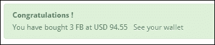
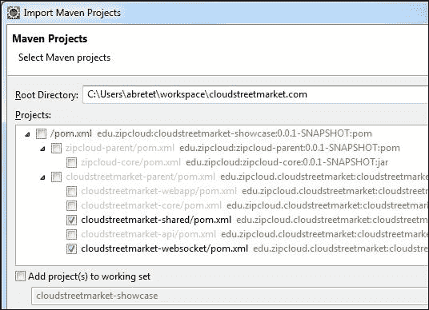
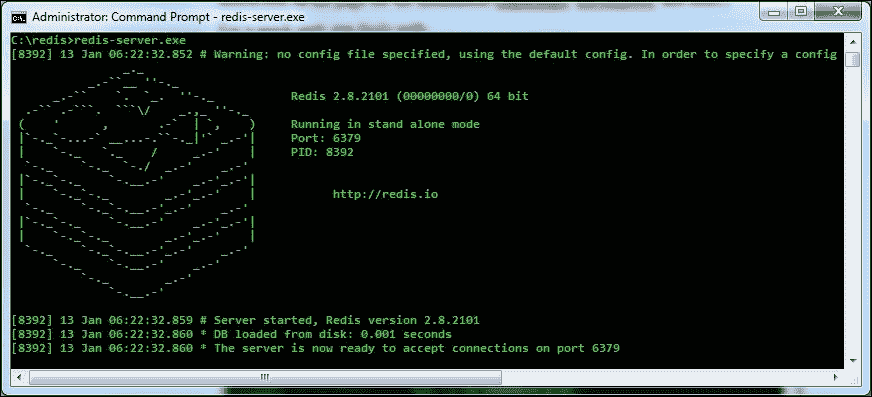
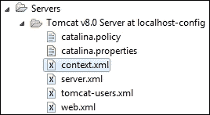

# 第十五章：通过 WebSockets 和 STOMP 进行通信

本章涵盖了四个配方。它们都充分拥抱了我们的 CloudStreet Market 应用程序。通过改进，使其更具反应性，更具互动性。

这些配方有以下标题：

+   使用 STOMP 通过 SockJS 流式传输社交事件

+   使用 RabbitMQ 作为多协议消息代理

+   在 RabbitMQ 中堆叠和消费任务与 AMQP

+   使用 Spring Session 和 Redis 保护消息

# 介绍

让我们快速回顾一下在前几章中希望你已经学到的内容。逐章，你必须已经发现：

+   如何启动一个项目，以及如何依赖标准来保持代码库的可扩展性和适应性。这些标准来自于一系列工具的选择，例如 Maven 或 Java Persistence API。所呈现的标准还伴随着一系列常见实践，例如在客户端，使用 AngularJS MVC 模式或 Bootstrap Framework UI。

+   如何在面对现代挑战时充分利用 Spring MVC。Spring MVC 已被证明是一个 Web MVC 框架（具有其请求流程、内容协商、视图解析、模型绑定、异常处理等），但也作为 Spring 环境中集成的 Spring 组件进行了演示。它是一个集成框架，能够传递 Spring Security 身份验证或 Spring Social 抽象。它还能够提供 Spring Data 分页工具以及对 HTTP 规范的竞争性实现。

+   如何设计一个实现高级无状态和超媒体 API 的微服务架构，促进职责的分离。前端和后端之间的职责分离，以及组件的功能可分割性（水平可伸缩性）在独立的 Web 存档（`.war`）中的职责分离。

本章重点介绍新兴的 WebSocket 技术以及为我们的应用程序构建**面向消息的中间件**（**MOM**）。这是一个罕见的展示，它在 Spring 中实现了如此多关于 WebSocket 的内容。从使用默认的嵌入式 WebSocket 消息代理到完整功能的 RabbitMQ 代理（使用 STOMP 和 AMQP 协议）。我们将看到如何向多个客户端广播消息并推迟执行耗时任务，提供显著的可伸缩性优势。

通过一个专门用于需要访问常见数据库服务器的 WebSockets 的新 Java 项目，并且在类似生产环境的角度上，我们将用 MySQL 服务器替换 HSQLDB。

我们将看到如何动态创建私有队列以及如何让经过身份验证的客户端从这些私有队列中发布和接收消息。我们将做所有这些，以在我们的应用程序中实现真正的应用程序功能。

为了实现 WebSocket 身份验证和消息认证，我们将使 API 有状态。有状态意味着 API 将使用 HTTP 会话在用户请求之间保持用户经过身份验证。借助 Spring Session 的支持和高度可集群化的 Redis 服务器的使用，会话将在多个 Web 应用程序之间共享。

# 使用 STOMP 通过 SockJS 流式传输社交事件

在这个示例中，我们使用 STOMP 通过 SockJS 广播用户活动（事件）。SockJS 提供了 WebSocket 的自定义实现。

## 准备工作

有一些配置工作需要事先完成，特别是在 Apache HTTP 代理上。之后，我们将看到如何在客户端使用 SockJS 和 AngularJS 初始化 WebSocket。

我们的 WebSocket 将订阅通过 Spring 从`cloudstreetmarket-api`模块发布的主题（用于广播）。

## 如何做…

1.  在 Eclipse 的**Git Perspective**中，检出`v8.1.x`分支的最新版本。

1.  在`zipcloud-parent`项目上运行`Maven clean`和`Maven install`命令（右键单击项目，选择**Run as…** | **Maven Clean**，然后选择**Run as…** | **Maven Install)**。之后，进行**Maven | Update** **Project**以使 Eclipse 与 Maven 配置同步（右键单击项目，然后单击**Maven** | **Update Project…**）。

1.  类似地，在`cloudstreetmarket-parent`上运行**Maven clean**和**Maven install**命令，然后运行**Maven** | **Update Project…**（以更新所有`cloudstreetmarket-parent`模块）。

### Apache HTTP 代理配置

1.  在 Apache `httpd.conf`文件中，更改`VirtualHost`定义为：

```java
<VirtualHost cloudstreetmarket.com:80>
  ProxyPass        /portal http://localhost:8080/portal
  ProxyPassReverse /portal http://localhost:8080/portal
  ProxyPass        /api  	http://localhost:8080/api
  ProxyPassReverse /api  	http://localhost:8080/api
  RewriteEngine on
  RewriteCond %{HTTP:UPGRADE} ^WebSocket$ [NC]
  RewriteCond %{HTTP:CONNECTION} ^Upgrade$ [NC]
  RewriteRule .* ws://localhost:8080%{REQUEST_URI} [P]
  RedirectMatch ^/$ /portal/index
</VirtualHost>
```

1.  在`httpd.conf`中，取消注释以下行：

```java
LoadModule proxy_wstunnel_module modules/mod_proxy_wstunnel.so
```

### 前端

1.  在`cloudstreetmarket-webapp`模块的`index.jsp`文件中，导入了两个额外的 JavaScript 文件：

```java
<script src="img/sockjs-1.0.2.min.js"></script>
<script src="img/stomp-2.3.3.js"></script> 
```

### 注意

这两个文件已经被本地复制，但最初，两者都是在线找到的：

[`cdnjs.cloudflare.com/ajax/libs/sockjs-client/1.0.2/sockjs.min.js`](https://cdnjs.cloudflare.com/ajax/libs/sockjs-client/1.0.2/sockjs.min.js)

[`cdnjs.cloudflare.com/ajax/libs/stomp.js/2.3.3/stomp.js`](https://cdnjs.cloudflare.com/ajax/libs/stomp.js/2.3.3/stomp.js)

1.  对于这个示例，客户端方面的所有更改都与文件`src/main/webapp/js/home/home_community_activity.js`有关（它驱动着登陆页面上**用户活动**的反馈）。这个文件与模板`/src/main/webapp/html/home.html`相关联。

1.  在`homeCommunityActivityController`的`init()`函数中，添加了以下部分：

```java
cloudStreetMarketApp.controller('homeCommunityActivityController', function ($scope, $rootScope, httpAuth, modalService, communityFactory, genericAPIFactory, $filter){
  var $this = this,
  socket = new SockJS('/api/users/feed/add'),
  stompClient = Stomp.over(socket);
  pageNumber = 0;
  $scope.communityActivities = {};
  $scope.pageSize=10;
  $scope.init = function () {
    $scope.loadMore();
    socket.onclose = function() {
      stompClient.disconnect();
    };
    stompClient.connect({}, function(frame) {
    stompClient.subscribe('/topic/actions', 	function(message){
     var newActivity = $this.prepareActivity( JSON.parse(message.body)
       );
        $this.addAsyncActivityToFeed(newActivity);
        $scope.$apply();
    });
    });
  ...
  }
...
```

1.  `loadMore()`函数仍然被调用以在滚动到底部时拉取新的活动。但是现在，因为新的活动可以异步插入，`communityActivities`变量不再是数组，而是一个用作映射的对象，其中活动 ID 作为键。这样做可以让我们将同步结果与异步结果合并：

```java
  $scope.loadMore = function () {
    communityFactory.getUsersActivity(pageNumber, $scope.pageSize).then(function(response) {
      var usersData = response.data,
      status = response.status,
      headers  = response.headers,
      config = response.config;
      $this.handleHeaders(headers);
      if(usersData.content){
        if(usersData.content.length > 0){
          pageNumber++;
        }
        $this.addActivitiesToFeed(usersData.content);
      }
    });
  };
```

1.  与以前一样（自第四章，“为无状态架构构建 REST API”），我们循环遍历社区活动以构建活动源。现在，每个活动都带有一定数量的**喜欢**和**评论**。目前，如果用户已经通过身份验证，他就有能力看到**喜欢**的数量：

1.  与点赞图像绑定的 Angular 化 HTML 如下：

```java
    <span ng-if="userAuthenticated() && value.amountOfLikes == 0">
    
  </span>
```

1.  在控制器中，`like()`作用域函数支持此 DOM 元素来创建一个新的`like`活动，该活动针对原始活动：

```java
  $scope.like = function (targetActionId){
    var likeAction = {
      id: null,
      type: 'LIKE',
      date: null,
      targetActionId: targetActionId,
      userId: httpAuth.getLoggedInUser()
    };
    genericAPIFactory.post("/api/actions/likes", likeAction);
  }
```

1.  相反的逻辑也可以找到**不喜欢**一个活动。

### 后端

1.  已添加以下 Maven 依赖项到`cloudstreetmarket-api`：

```java
    <dependency>
      <groupId>org.springframework</groupId>
      <artifactId>spring-websocket</artifactId>
      <version>${spring.version}</version>
   </dependency>
   <dependency>
      <groupId>org.springframework</groupId>
      <artifactId>spring-messaging</artifactId>
      <version>${spring.version}</version>
   </dependency>
```

1.  在`web.xml`文件（来自`cloudstreetmarket-api`），必须将以下属性添加到我们的 servlet 及其每个过滤器中：

```java
<async-supported>true</async-supported>
```

1.  已创建以下专用配置 bean：

```java
@Configuration
@ComponentScan("edu.zipcloud.cloudstreetmarket.api")
@EnableWebSocketMessageBroker
public class WebSocketConfig extends AbstractWebSocketMessageBrokerConfigurer {

   @Override
   public void registerStompEndpoints(final StompEndpointRegistry registry) {
         registry.addEndpoint("/users/feed/add")
            .withSockJS();
    }
   @Override
   public void configureMessageBroker(final MessageBrokerRegistry registry) {
      registry.setApplicationDestinationPrefixes("/app");
       registry.enableSimpleBroker("/topic");
    }
}
```

已添加新的控制器`ActivityFeedWSController`如下：

```java
@RestController
public class ActivityFeedWSController extends CloudstreetApiWCI{
    @MessageMapping("/users/feed/add")
    @SendTo("/topic/actions")
    public UserActivityDTO handle(UserActivityDTO message) throws Exception{
        return message;
    }
    @RequestMapping(value="/users/feed/info", method=GET)
    public String infoWS(){
        return "v0";
    }
}
```

1.  作为 Spring 配置，我们已将以下 bean 添加到`dispatcher-servlet.xml`中：

```java
<bean
  class="org.sfw.web.socket.server.support.OriginHandshakeInterceptor">
    <property name="allowedOrigins">
      <list>
      <value>http://cloudstreetmarket.com</value>
      </list>
    property>
</bean>
```

在`security-config.xml`中，已将以下配置添加到 http Spring Security 命名空间：

```java
    <security:http create-session="stateless" 
        entry-point-ref="authenticationEntryPoint" authentication-manager-ref="authenticationManager">
    ...
    <security:headers>
      <security:frame-options policy="SAMEORIGIN"/>
    </security:headers>
    ...
    </security:http>
```

现在让我们看看事件是如何生成的。

1.  创建新的财务交易时，会向主题`/topic/actions`发送消息。这是在`TransactionController`中完成的：

```java
@RestController
@ExposesResourceFor(Transaction.class)
@RequestMapping(value=ACTIONS_PATH + TRANSACTIONS_PATH, produces={"application/xml", "application/json"})
public class TransactionController extends CloudstreetApiWCI<Transaction> {
  @Autowired
  private SimpMessagingTemplate messagingTemplate;
  @RequestMapping(method=POST)
  @ResponseStatus(HttpStatus.CREATED)
  public TransactionResource post(@Valid @RequestBody Transaction transaction, HttpServletResponse response, BindingResult result) {
    ...
   messagingTemplate.convertAndSend("/topic/actions", new UserActivityDTO(transaction));
    ...
  }
}
```

同样，当创建一个`like`活动时，也会向`/topic/actions`主题发送消息，这是在`LikeActionController`中完成的：

```java
 @RequestMapping(method=POST)
@ResponseStatus(HttpStatus.CREATED)
public LikeActionResource post(@RequestBody LikeAction likeAction, HttpServletResponse response) {
   ...
    likeAction = likeActionService.create(likeAction);
   messagingTemplate.convertAndSend("/topic/actions", new UserActivityDTO(likeAction));
   ...
}
```

1.  现在启动 Tomcat 服务器。使用 Yahoo! Oauth2 和您的个人 Yahoo!帐户登录应用程序（如果您还没有，请创建一个）。为`Cloudstreet Market`应用程序注册一个新用户。

1.  在您的网络浏览器中，使用已登录的用户在应用程序中打开两个不同的选项卡。将其中一个选项卡保留在登陆页面上。

1.  使用另一个选项卡，导航到**价格和市场** | **所有价格搜索**菜单。搜索一个股票代码，比如 Facebook，并购买三股。

1.  等待接收信息消息：

然后检查浏览器的第一个选项卡（您没有使用的选项卡）。


您会注意到活动源在顶部收到了一个新元素！

1.  此外，在控制台中，您应该有以下日志跟踪：

1.  同样，**like**事件会实时刷新：

## 它是如何工作的...

在这里，我们将在介绍 Spring-WebSocket 支持工具之前，看一下关于 WebSocket、STOMP 和 SockJS 的一些一般概念。

### WebSocket 简介

WebSocket 是基于 TCP 的全双工通信协议。全双工通信系统允许两方通过双向通道同时*发言*和*被听到*。电话对话可能是全双工系统的最佳例子。

这项技术特别适用于需要利用新 HTTP 连接引起的开销的应用程序。自 2011 年以来，WebSocket 协议一直是互联网标准（[`tools.ietf.org/html/rfc6455`](https://tools.ietf.org/html/rfc6455)）。

#### WebSocket 生命周期

在建立 WebSocket 连接之前，客户端发起握手 HTTP 请求，服务器做出响应。握手请求还代表了一个协议升级请求（从 HTTP 到 WebSocket），用`Upgrade`头正式化。服务器通过响应中相同的`Upgrade`头（和值）确认了这个协议升级。除了`Upgrade`头之外，为了防范缓存代理攻击，客户端还发送了一个 base-64 编码的随机密钥。对此，服务器在`Sec-WebSocket-Accept`头中发送了这个密钥的哈希。

以下是我们应用程序中发生的握手的示例：


该协议生命周期可以通过以下序列图进行总结：


#### 两个专用的 URI 方案

该协议为`WebSockets ws://`和`wss://`定义了两个 URI 方案（`wss`允许加密连接）。

### STOMP 协议

**STOMP**代表**简单文本定向消息协议**。该协议提供了一种基于帧的可互操作格式，允许 STOMP 客户端与 STOMP 消息代理通信。

这是一个需要并信任现有的双向流式网络协议的消息协议。WebSocket 提供基于帧的数据传输，WebSocket 帧确实可以是 STOMP 格式的帧。

以下是一个 STOMP 帧的示例：

```java
CONNECTED
session:session-4F_y4UhJTEjabe0LfFH2kg
heart-beat:10000,10000
server:RabbitMQ/3.2.4
version:1.1
user-name:marcus
```

帧具有以下结构：


STOMP 协议规范定义了一组客户端命令（`SEND`，`SUBSCRIBE`，`UNSUBSCRIBE`，`BEGIN`，`COMMIT`，`ABORT`，`ACK`，`NACK`，`DISCONNECT`，`CONNECT`和`STOMP`）和服务器命令（`CONNECTED`，`MESSAGE`，`RECEIPT`和`ERROR`）。

只有`SEND`，`MESSAGE`和`ERROR`帧可以有主体。协议规范可以在网上找到：[`stomp.github.io/stomp-specification-1.2.html`](http://stomp.github.io/stomp-specification-1.2.html)。

在客户端，我们使用了 JavaScript 库**STOMP Over WebSocket**，文件名为`stomp.js`。该库将 STOMP 格式的帧映射到 WebSocket 帧。默认情况下，它查找 web 浏览器的`WebSocket`类，以使 STOMP 客户端创建 WebSocket。

该库还可以从自定义的`WebSocket`实现中创建 STOMP 客户端。从 SockJS WebSockets，我们可以这样创建 STOMP 客户端：

```java
    var socket = new SockJS('/app/users/feed/add');
    var stompClient = Stomp.over(socket);
        stompClient.connect({}, function(frame) {
  ...
    });
    socket.onclose = function() {
    stompClient.disconnect();
  };
```

### SockJS

WebSockets 现在几乎被所有浏览器支持。但是，我们无法控制客户使用的版本。在许多情况下，对 7%到 15%的受众隐藏这样的技术根本不是一个选择。

在客户端，SockJS 提供了一个自定义实现，可以看作是浏览器原生`WebSocket`实现的装饰器。通过一个简单而方便的库，SockJS 确保了跨浏览器的兼容性。通过一系列回退传输选项（`xhr-streaming`，`xdr-streaming`，`iframe-eventsource`，`iframe-htmlfile`，`xhr-polling`等），它尽可能地模拟了 WebSockets。

对于服务器实现，为了匹配客户端的回退行为，SockJS 还定义了自己的协议：

[`sockjs.github.io/sockjs-protocol/sockjs-protocol-0.3.3.html`](http://sockjs.github.io/sockjs-protocol/sockjs-protocol-0.3.3.html)

### Spring WebSocket 支持

根据 Java WebSocket API 规范（JSR-356），Spring 4+提供了一个解决方案，该解决方案打包在模块`spring-websocket`和`spring-messaging`中。但是 Spring 提供的不仅仅是 JSR-356 的实现。例如，基于以下事实：

+   没有使用消息协议的 WebSocket 太低级，无法直接在应用程序中使用，需要自定义处理框架：Spring 团队选择提供和支持消息协议实现（STOMP）。

+   WebSockets 目前并不受所有浏览器支持：Spring 还通过其实现的 SockJS 协议提供了 WebSocket 回退支持。

#### 一体化配置

我们已经启用了 WebSocket 引擎，并为 SockJS 和 STOMP 配置了一个配置 bean——`WebSocketConfig`：

```java
@Configuration
@ComponentScan("edu.zipcloud.cloudstreetmarket.api")
@EnableWebSocketMessageBroker
public class WebSocketConfig extends   AbstractWebSocketMessageBrokerConfigurer {

  @Override
  public void registerStompEndpoints(final StompEndpointRegistry registry) {
        registry.addEndpoint("/users/feed/add")
        .withSockJS();
  }

  @Override
  public void configureMessageBroker(final MessageBrokerRegistry registry) {
        registry.setApplicationDestinationPrefixes("/app");
        registry.enableSimpleBroker("/topic");
  }
}
```

WebSocket 端点定义为上下文路径`/users/feed/add`。它在客户端端匹配了定义的 SockJS 客户端构造函数参数：

```java
var socket = new SockJS('/api/users/feed/add');
```

从端点（`clientInboundChannel`）到消息处理程序的路由，WebSocket 引擎需要选择将消息路由到何处，我们在这里有两个选项。根据情况和我们想要实现的目标，我们可以将消息定位到应用内消费者（消息处理程序）或直接将消息路由到消息代理，以便将消息分发给订阅的客户端。

这个分割是通过定义两个不同的目的地前缀来配置的。在我们的情况下，我们决定使用`/app`前缀将消息路由到相应的消息处理程序，使用`/topic`前缀来识别准备分发给客户端的消息。

现在让我们看看如何定义消息处理程序以及如何使用它们。

#### 通过@MessageMapping 定义消息处理程序

`@MessageMapping`注解用于 Spring MVC 控制器方法，标记它们可用作消息处理程序方法。

从`clientInboundChannel`中的消息到路由到消息处理程序，WebSocket 引擎根据它们配置的值缩小到正确的`@MessageMapping`方法。

与 Spring MVC 一样，这个值可以用 Ant 样式（例如`/targets/**`）来定义。然而，与`@RequestParam`和`@PathVariable`注解一样，模板变量也可以通过在方法参数上使用`@DestinationVariable`注解来传递（目标模板定义如下：`/targets/{target}`）。

### 发送消息以进行分发

必须配置消息代理。在这个示例中，我们使用了一个`simple`消息代理（`simpMessageBroker`），我们已经从`MessageBrokerRegistry`中启用了它。这种内存中的代理适用于在没有外部代理（RabbitMQ、ActiveMQ 等）的情况下堆叠 STOMP 消息。当有可用性将消息分发给 WebSocket 客户端时，这些消息被发送到`clientOutboundChannel`。

我们已经看到，当消息目的地以`/topic`为前缀时（就像我们的情况一样），消息会直接发送到消息代理。但是当我们在消息处理程序方法或后端代码的其他地方发送调度消息时怎么办？我们可以使用下一节中描述的`SimpMessagingTemplate`来实现这一点。

#### SimpMessagingTemplate

我们在 CSMReceiver 类中自动装配了一个`SimpMessagingTemplate`，稍后我们将使用它将 AMQP 消息的有效载荷转发给 WebSocket 客户端。

`SimpMessagingTemplate`与 Spring 的`JmsTemplate`具有相同的目的（如果您熟悉它），但它适用于简单的消息协议（如 STOMP）。

一个方便且继承自著名的方法是`convertAndSend`方法，它尝试识别并使用`MessageConverter`来序列化一个对象，并将其放入一个新消息中，然后将此消息发送到指定的目的地：

```java
simpMessagingTemplate.convertAndSend(String destination, Object message);
```

这个想法是为消息代理目标（在我们的情况下是带有`/topic`前缀）定位。

#### @SendTo 注解

这个注解使我们不必显式使用`SimpMessagingTemplate`。目的地被指定为注解值。这个方法还将处理从有效载荷到消息的转换：

```java
@RestController
public class ActivityFeedWSController extends CloudstreetApiWCI{

  @MessageMapping("/users/feed/add")
  @SendTo("/topic/actions")
  public UserActivityDTO handle(UserActivityDTO payload) throws Exception{
        return payload;
 }
}
```

## 还有更多...

在本节中，我们提供了与 SockJS 回退选项相关的额外信息来源。

正如之前介绍的，Spring 提供了 SockJS 协议实现。在 Spring 中使用`withSockJS()`功能方法配置 SockJS 很容易，在`StompEndPoint`注册期间。这个小小的配置片段告诉 Spring 在我们的端点上激活 SockJS 回退选项。

SockJS 客户端对服务器的第一个调用是一个 HTTP 请求，到端点路径连接`/info`以评估服务器配置。如果此 HTTP 请求不成功，则不会尝试任何其他传输（甚至不会尝试 WebSocket）。

如果您想了解 SockJS 客户端如何查询服务器以获取合适的回退选项，可以在 Spring 参考指南中阅读更多内容：

[`docs.spring.io/spring/docs/current/spring-framework-reference/html/websocket.html#websocket-server-handshake`](http://docs.spring.io/spring/docs/current/spring-framework-reference/html/websocket.html#websocket-server-handshake)

## 另请参阅

+   **JSR-356**：您可以在线找到规范文档，了解有关 Java WebSocket 规范的更多信息，spring-websocket 正在遵循该规范：[`jcp.org/en/jsr/detail?id=356`](https://jcp.org/en/jsr/detail?id=356)

# 使用 RabbitMQ 作为多协议消息代理

安装和使用外部 RabbitMQ 作为功能齐全的消息代理可以开启新的技术机会，并设计类似生产环境的基础设施。

## 准备工作

在本教程中，我们将安装 RabbitMQ 作为独立服务器，并配置它以支持 STOMP 消息。

我们还将更新我们的 WebSocket Spring 配置，以依赖于这个功能齐全的消息代理，而不是内部简单的消息代理。

## 如何做…

1.  在 Eclipse 的**Git Perspective**中，这次检出`v8.2.x`分支。

1.  已添加了两个新的 Java 项目，必须导入。从 Eclipse 中，选择**File** | **Import…**菜单。

1.  **导入**向导打开，以便您可以在层次结构中选择项目类型。打开**Maven**类别，选择**Existing Maven Projects**选项，然后单击**Next**。

1.  **导入 Maven 项目**向导打开。选择（或输入）工作区位置（应为`<home-directory>/workspace`）作为根目录。

1.  如下截图所示，选择以下两个**pom.xml**文件：**cloudstreetmarket-shared/pom.xml**和**cloudstreetmarket-websocket/pom.xml**。

1.  两个项目`cloudstreetmarket-shared`和`cloudstreetmarket-websocket`必须显示在项目层次结构中。

1.  在 Web 模块上定位运行时环境，按照以下说明操作：在 Eclipse 中，右键单击**cloudmarket-websocket**项目，选择**Properties**菜单，在导航面板中选择**Targeted Runtimes**。在中央窗口中，勾选服务器**Apache Tomcat v8.0**的复选框。

1.  在`/app`目录中，`cloudstreetmarket.properties`文件已更新。反映在位于`<home-directory>/app/cloudstreetmarket.properties`的文件中的更改。

1.  在`zipcloud-parent`上运行`Maven clean`和`Maven install`命令，然后在`cloudstreetmarket-parent`上运行，然后在所有模块上运行**Maven** | **Update Project**。

1.  以我们想要的方式运行 RabbitMQ，需要我们下载并安装该产品作为独立产品。

1.  根据本地机器的配置，不同的操作方式适用。您将在 RabbitMQ 网站上找到适当的链接和安装指南：[`www.rabbitmq.com/download.html`](https://www.rabbitmq.com/download.html)

### 提示

如果您使用 Windows 操作系统，请注意，下载和安装 Erlang（[`www.erlang.org/download.html`](http://www.erlang.org/download.html)）是先决条件。

1.  一旦安装了 RabbitMQ 并且其服务正在运行，打开您喜欢的 Web 浏览器，以检查 RabbitMQ 是否作为 Web 控制台运行在 URL：`http://localhost:15672`（就像下面的截图中一样）。

### 注意

我们将在稍后回来设置 RabbitMQ 配置。现在，只需记住这个控制台可以用于监视消息和管理连接、队列、主题和交换。

1.  需要激活 RabbitMQ STOMP 插件。这是从`rabbitmq_server-x.x.x\sbin`目录中执行以下命令行完成的：

```java
rabbitmq-plugins enable rabbitmq_stomp
```

1.  已添加以下 Maven 依赖项：

```java
<dependency>
  <groupId>org.springframework.amqp</groupId>
  <artifactId>spring-rabbit</artifactId>
  <version>1.4.0.RELEASE</version>
</dependency>
<dependency>
  <groupId>io.projectreactor</groupId>
  <artifactId>reactor-core</artifactId>
  <version>2.0.5.RELEASE</version>
</dependency>
<dependency>
  <groupId>io.projectreactor</groupId>
  <artifactId>reactor-net</artifactId>
  <version>2.0.5.RELEASE</version>
</dependency>
<dependency>
  <groupId>io.projectreactor.spring</groupId>
  <artifactId>reactor-spring-context</artifactId>
  <version>2.0.5.RELEASE</version>
</dependency>
<dependency>
  <groupId>io.netty</groupId>
  <artifactId>netty-all</artifactId>
  <version>4.0.31.Final</version>
</dependency>
```

1.  在`cloudstreetmarket-api`模块的`dispatcher-servlet.xml`中，已添加以下 bean，使用`rabbit`命名空间：

```java
<beans 

   ...

   xsi:schemaLocation="http://www.sfw.org/schema/beans
   ...
   http://www.sfw.org/schema/rabbit
  http://www.sfw.org/schema/rabbit/spring-rabbit-1.5.xsd">
    ...
  <rabbit:connection-factory id="connectionFactory" host="localhost" username="guest" password="guest" />
  <rabbit:admin connection-factory="connectionFactory" />
  <rabbit:template id="messagingTemplate" connection-factory="connectionFactory"/>
</beans>
```

1.  在`csmcore-config.xml`文件（在`cloudstreetmarket-core`中），以下 bean 已添加了`task`命名空间：

```java
<beans 

    ...
    xmlns:task=http://www.sfw.org/schema/task
    http://www.sfw.org/schema/task/spring-task-4.0.xsd">
    ...
    <task:annotation-driven scheduler="wsScheduler"/>
    <task:scheduler id="wsScheduler" pool-size="1000"/>
    <task:executor id="taskExecutor"/>
</beans>
```

1.  在 Spring 配置方面，我们的`AnnotationConfig` bean（`cloudstreetmarket-api`的主配置 bean）已添加了两个注释：

```java
@EnableRabbit
@EnableAsync
public class AnnotationConfig {
	...
}
```

1.  最后，`WebSocketConfig` bean 也已更新；特别是经纪人注册。我们现在使用的是`StompBrokerRelay`而不是简单的经纪人：

```java
@Configuration
@ComponentScan("edu.zipcloud.cloudstreetmarket.api")
@EnableWebSocketMessageBroker
@EnableScheduling
@EnableAsync
public class WebSocketConfig extends AbstractWebSocketMessageBrokerConfigurer {
...
    @Override
    public void configureMessageBroker(final MessageBrokerRegistry registry) {
     registry.setApplicationDestinationPrefixes( WEBAPP_PREFIX_PATH);
     registry.enableStompBrokerRelay(TOPIC_ROOT_PATH);
    }
}
```

### 提示

就是这样！一切都准备好使用 RabbitMQ 作为我们系统的外部代理。但是，请注意，如果您现在尝试启动服务器，代码将期望 MySQL 已安装以及 Redis 服务器。这两个第三方系统将在接下来的两个配方中详细介绍。

## 它是如何工作的…

### 使用全功能消息代理

与简单消息代理相比，使用 RabbitMQ 等全功能消息代理提供了有趣的好处，我们现在将讨论这些好处。

#### 集群性-RabbitMQ

RabbitMQ 代理由一个或多个 Erlang 节点组成。这些节点分别代表 RabbitMQ 的一个实例，并可以独立启动。节点可以使用命令行工具`rabbitmqctl`相互链接。例如，`rabbitmqctl join_cluster rabbit@rabbit.cloudstreetmarket.com`实际上会将一个节点连接到现有的集群网络。RabbitMQ 节点使用 cookie 相互通信。为了连接到同一个集群，两个节点必须具有相同的 cookie。

#### 更多的 STOMP 消息类型

与简单消息代理相比，使用全功能消息代理（而不是简单消息代理）支持额外的 STOMP 帧命令。例如，简单消息代理不支持`ACK`和`RECEIPT`。

### StompMessageBrokerRelay

在上一个配方中，我们讨论了消息在 Spring WebSocket 引擎中经过的流程。如下图所示，当切换到外部消息代理中继时，这个流程不受影响。


只有 RabbitMQ 外部消息代理显示为额外的部分。`BrokerMessageHandler`（`StompBrokerRelayMessageHandler`）只充当一个代理，将目标定位到幕后的 RabbitMQ 节点。`StompBrokerRelay`和其消息代理之间只维护一个 TCP 连接。`StompBrokerRelay`通过发送心跳消息来维护连接。

## 另请参阅

+   **RabbitMQ 指南和文档**：这个配方只是一个概述，但 RabbitMQ 文档做得很好，非常完整。这是一个很好的信息来源，你可以在这里找到：

[`www.rabbitmq.com/documentation.html`](http://www.rabbitmq.com/documentation.html)

[`www.rabbitmq.com/stomp.html`](http://www.rabbitmq.com/stomp.html)

# 使用 RabbitMQ 和 AMQP 堆叠和消费任务

这个配方将演示如何实现**面向消息的中间件**（**MoM**）。这是一种基于组件之间异步通信的可伸缩性技术。

## 准备工作

我们已经介绍了新的`cloudstreetmarket-shared`和`cloudstreetmarket-websocket` Java 项目。现在，WebSockets 已从`cloudstreetmarket-api`中分离出来，但`cloudstreetmarket-websocket`和`cloudstreetmarket-api`仍将使用消息进行通信。

为了将次要任务（如事件生成）与请求线程解耦，您需要学习如何使用 RabbitMQ 配置和使用 AMQP 消息模板和监听器。

## 如何做…

1.  访问 RabbitMQ Web 控制台`http://localhost:15672`。

### 注意

如果由于某种原因无法访问网络控制台，请返回到先前的教程，在那里可以找到下载和安装指南。

1.  在网络控制台的**队列**选项卡中，创建一个名为`AMQP_USER_ACTIVITY`的新队列。使用**持久**和**自动删除: "否"**参数创建它：

### 发送方

当 API 被请求执行操作，如**创建交易**或**创建喜欢活动**时，我们会产生事件。

### 提示

通过非常少的调整，我们现在使用`RabbitTemplate`而不是以前的`SimpMessagingTemplate`，并且将目标定位到一个中间的 AMQP 队列，而不是最终的 STOMP 客户端。

在`TransactionController`中，POST 处理程序已更新如下：

```java
import org.springframework.amqp.rabbit.core.RabbitTemplate;
@RestController
public class TransactionController extends CloudstreetApiWCI<Transaction> {
  @Autowired
  private RabbitTemplate messagingTemplate;

  @RequestMapping(method=POST)
  @ResponseStatus(HttpStatus.CREATED)
  public TransactionResource post(@Valid @RequestBody Transaction transaction, HttpServletResponse response, BindingResult result) {
   ...
   messagingTemplate.convertAndSend("AMQP_USER_ACTIVITY", new UserActivityDTO(transaction));
   ...
   return resource;
  }
}
```

在`LikeActionController`中，POST 处理程序已更新如下：

```java
import org.springframework.amqp.rabbit.core.RabbitTemplate;

@RestController
public class LikeActionController extends CloudstreetApiWCI<LikeAction> {
  @Autowired
  private RabbitTemplate messagingTemplate;
  @RequestMapping(method=POST)
  @ResponseStatus(HttpStatus.CREATED)
  public LikeActionResource post(@RequestBody LikeAction likeAction, HttpServletResponse response) {
  ...
   messagingTemplate.convertAndSend("AMQP_USER_ACTIVITY", new UserActivityDTO(likeAction));
   ...
   return resource;
  }
}
```

### 消费方

如前所述，`cloudstreetmarket-websocket`模块现在监听`AMQP_USER_ACTIVITY`队列。

1.  必要的配置设置在`displatcher-servlet.xml`（`cloudstreetmarket-websocket`）中。在那里，我们创建了一个`rabbitConnectionFactory`和一个`rabbitListenerContainerFactory` bean：

```java
<rabbit:connection-factory id="rabbitConnectionFactory" username="guest" host="localhost" password="guest"/>
<bean id="rabbitListenerContainerFactory" class="org.sfw.amqp.rabbit.config.SimpleRabbitListenerContainerFactory">
    <property name="connectionFactory" ref="rabbitConnectionFactory"/>
    <property name="concurrentConsumers" value="3"/>
    <property name="maxConcurrentConsumers" value="10"/>
    <property name="prefetchCount" value="12"/>
</bean>
```

1.  最后，监听器 bean 的创建如下，使用`CSMReceiver`类：

```java
@Component
public class CSMReceiver {
  @Autowired
  private SimpMessagingTemplate simpMessagingTemplate;

  @RabbitListener(queues = "AMQP_USER_ACTIVITY_QUEUE")
  public void handleMessage(UserActivityDTO payload) {
  simpMessagingTemplate.convertAndSend("/topic/actions", payload);
  }
} 
```

### 提示

您可以在这里识别使用的`SimpMessagingTemplate`，将传入的消息负载转发给最终的 STOMP 客户端。

1.  在`cloudstreetmarket-websocket`中创建了一个新的`WebSocketConfig` bean。这个 bean 与我们在`cloudstreetmarket-api`中的 bean 非常相似。

### 客户端

我们在客户端（`cloudstreetmarket-webapp`）上没有改变太多东西，因为我们目前仍专注于着陆页（`home_community_activity.js`）。

主要区别在于 STOMP 端点现在将目标定位到`/ws`上下文路径。WebSockets 在 5 秒延迟后从`init()`函数中启动。此外，`SockJS`套接字和 STOMP 客户端现在集中在全局变量（使用`Window`对象）中，以简化用户导航期间的 WebSockets 生命周期：

```java
var timer = $timeout( function(){ 
  window.socket = new SockJS('/ws/channels/users/broadcast');
  window.stompClient = Stomp.over(window.socket);
    window.socket.onclose = function() {
        window.stompClient.disconnect();
      };
  window.stompClient.connect({}, function(frame) {
    window.stompClient.subscribe('/topic/actions', function(message){
        var newActivity = $this.prepareActivity(JSON.parse(message.body));
        $this.addAsyncActivityToFeed(newActivity);
        $scope.$apply();
      });
    });
     $scope.$on(
      "$destroy",
        function( event ) {
          $timeout.cancel( timer );
          window.stompClient.disconnect();
          }
      );
                }, 5000);
```

## 它是如何工作的...

这种类型的基础设施以一种松散但可靠的方式将应用程序组件耦合在一起。

### 消息架构概述

在这个教程中，我们给我们的应用程序添加了一个 MoM。主要想法是尽可能地将进程与客户端请求生命周期解耦。

为了使我们的 REST API 专注于资源处理，一些业务逻辑显然是次要的，比如：

+   通知社区有新用户注册了一个帐户

+   通知社区用户执行了特定交易

+   通知社区用户已喜欢另一个用户的动作

我们决定创建一个专门处理 WebSockets 的新 webapp。我们的 API 现在通过向`ws` web app 发送消息与之通信。

消息负载是社区`Action`对象（来自`Action.java`超类）。从`cloudstreetmarket-api` web app 到`cloudstreetmarket-websocket` webapp，这些动作对象被序列化并包装在 AMQP 消息中。一旦发送，它们被堆叠在一个单一的 RabbitMQ 队列（`AMQP_USER_ACTIVITY`）中。

发送方和接收方部分都是 AMQP 实现（`RabbitTemplate`和`RabbitListener`）。这种逻辑现在将以`websocket` web app 可以承受的速度进行处理，而不会对用户体验产生影响。当在`cloudstreetmarket-websocket`端接收到时，消息负载将作为 STOMP 消息即时发送到 WebSocket 客户端。

在这里直接性能的好处是值得商榷的（在这个例子中）。毕竟，我们大部分时间都是通过额外的消息传递层推迟了次要事件的发布。然而，在设计清晰度和业务组件分离方面的好处是无价的。

#### 可扩展的模型

我们已经谈论了保持 web 应用程序无状态的好处。这是我们迄今为止尝试做的事情，我们为此感到自豪！

没有 HTTP 会话，我们很容易就能对`api`网络应用程序或`portal`网络应用程序的流量激增做出反应。在 Apache HTTP 代理上，我们可以很容易地使用`mod_proxy_balancer`设置负载均衡器来处理 HTTP 连接。

您可以在 Apache HTTP 文档中了解更多信息：[`httpd.apache.org/docs/2.2/mod/mod_proxy_balancer.html`](http://httpd.apache.org/docs/2.2/mod/mod_proxy_balancer.html)


对于 WebSocket 网络应用程序，它在无状态时基本上是一样的。在 Apache HTTP 配置中，配置的`mod_proxy_wstunnel`应该处理 WebSocket 的负载平衡，并提供应用程序故障转移。

### AMQP 还是 JMS？

**高级消息队列协议**（AMQP）定义了一种**线级**协议，并保证了发送方和消费方之间的互操作性。符合该协议的任何一方都可以创建和解释消息，因此可以与任何其他符合该协议的组件进行互操作，而不受底层技术的影响。

相比之下，JMS 是 Java 平台**企业版（EE）**的一部分。随着 JSR-914 的到来，JMS 是一个定义 API 应该如何创建、发送、接收和读取消息的标准。JMS 不提供线级指导，也不保证各方之间的互操作性。

AMQP 控制消息的格式和这些消息经过的流程，而 JMS 控制边界（操作员）的技术实现。当我们在一个潜在复杂的环境中寻求通信一致性时，AMQP 似乎是 MoM 协议的一个不错的选择。

## 还有更多...

本节提供了扩展您对 AMQP 和事件发布方法的知识的外部资源。

### Pivotal 公司对 AMQP 的很好介绍

如果您想更好地了解 AMQP 及其与 JMS 的区别，请查看[spring.io](http://spring.io)网站上的以下文章：

[`spring.io/understanding/AMQP`](https://spring.io/understanding/AMQP)

### 发布应用程序事件的更好方法

现在，我们还没有实现一个适当的模式来发布事件。下面链接的文章来自[spring.io](http://spring.io)博客。它介绍了在 Spring 4.2+中发布事件的最佳实践：

[`spring.io/blog/2015/02/11/better-application-events-in-spring-framework-4-2`](https://spring.io/blog/2015/02/11/better-application-events-in-spring-framework-4-2)

## 另请参阅

+   **负载均衡 WebSockets**：在以下文章中了解更多关于这个主题的内容，作者是 Arun Gupta（当时在红帽公司）：

[`blog.arungupta.me/load-balance-websockets-apache-httpd-techtip48`](http://blog.arungupta.me/load-balance-websockets-apache-httpd-techtip48)

# 使用 Spring Session 和 Redis 保护消息

总之，到目前为止，我们已经看到了如何向 StockJS 客户端广播 STOMP 消息，如何在外部多协议代理中堆叠消息，以及如何与这个代理（RabbitMQ）在 Spring 生态系统中进行交互。

## 准备工作

这个示例是关于实现专用队列，而不再是主题（广播），以便用户可以接收与他们正在查看的特定内容相关的实时更新。这也演示了 SockJS 客户端如何将数据发送到他们的私有队列。

对于私有队列，我们必须保护消息和队列访问。我们已经打破了我们对 API 的无状态原则，以利用 Spring Session。这扩展了`cloudstreetmarket-api`执行的身份验证，并在`cloudstreetmarket-websocket`中重用了 Spring Security 上下文。

## 如何做到这一点...

### Apache HTTP 代理配置

因为`v8.2.x`分支引入了新的`cloudstreetmarket-websocket`网络应用程序，Apache HTTP 代理配置需要更新以完全支持我们的 WebSocket 实现。我们的`VirtualHost`定义现在是：

```java
<VirtualHost cloudstreetmarket.com:80>
  ProxyPass        /portal http://localhost:8080/portal
  ProxyPassReverse /portal http://localhost:8080/portal
  ProxyPass        /api  	http://localhost:8080/api
  ProxyPassReverse /api  	http://localhost:8080/api
  ProxyPass        /ws  	http://localhost:8080/ws
  ProxyPassReverse /ws  	http://localhost:8080/ws
  RewriteEngine on
  RewriteCond %{HTTP:UPGRADE} ^WebSocket$ [NC]
  RewriteCond %{HTTP:CONNECTION} ^Upgrade$ [NC]
  RewriteRule .* ws://localhost:8080%{REQUEST_URI} [P]
  RedirectMatch ^/$ /portal/index
</VirtualHost>
```

### Redis 服务器安装

1.  如果您使用的是基于 Linux 的机器，请在[`redis.io/download`](http://redis.io/download)下载最新稳定版本（3+）。要下载的存档格式是`tar.gz`。按照页面上的说明进行安装（解包，解压缩，并使用 make 命令构建）。

安装完成后，要快速启动 Redis，请运行：

```java
$ src/redis-server
```

1.  如果您使用的是基于 Windows 的机器，我们建议使用此存储库：[`github.com/ServiceStack/redis-windows`](https://github.com/ServiceStack/redis-windows)。请按照`README.md`页面上的说明进行操作。运行 Microsoft 的 Redis 本机端口允许您在没有任何其他第三方安装的情况下运行 Redis。

要快速启动 Redis 服务器，运行以下命令：

```java
$ redis-server.exe redis.windows.conf
```

1.  当 Redis 运行时，您应该能够看到以下欢迎屏幕：

1.  在 Eclipse 中更新 Tomcat 配置以使用本地 Tomcat 安装。要这样做，请双击当前服务器（**服务器**选项卡）：

1.  这将打开以下配置面板：

确保**使用 Tomcat 安装**单选按钮已被选中。

### 提示

如果面板变灰，右键单击当前服务器，然后单击**添加**，**删除**...从服务器中删除三个部署的 web 应用程序，然后再次右键单击服务器，然后单击**发布**。

1.  现在，下载以下 jar 包：

+   **jedis-2.5.2.jar**：一个小型的 Redis Java 客户端库

+   **commons-pool2-2.2.jar**：Apache 通用对象池库

您可以分别从[`central.maven.org/maven2/redis/clients/jedis/2.5.2/jedis-2.5.2.jar`](http://%20http://central.maven.org/maven2/redis/clients/jedis/2.5.2/jedis-2.5.2.jar)和[`central.maven.org/maven2/org/apache/commons/commons-pool2/2.2/commons-pool2-2.2.jar`](http://central.maven.org/maven2/org/apache/commons/commons-pool2/2.2/commons-pool2-2.2.jar)下载它们。

你也可以在`chapter_8/libs`目录中找到这些 jar 包。

1.  在`chapter_8/libs`目录中，您还将找到**tomcat-redis-session-manager-2.0-tomcat-8.jar**存档。将三个 jar 包`tomcat-redis-session-manager-2.0-tomcat-8.jar`，`commons-pool2-2.2.jar`和`jedis-2.5.2.jar`复制到 Eclipse 引用的本地 Tomcat 安装的`lib`目录中。如果我们在第一章中的说明已经被遵循，那么这应该是`C:\tomcat8\lib`或`/home/usr/{system.username}/tomcat8/lib`。

1.  现在在你的工作空间中，打开**Server**项目的**context.xml**文件。

1.  添加以下`Valve`配置：

```java
<Valve asyncSupported="true" className="edu.zipcloud.catalina.session.RedisSessionHandlerValve"/>
<Manager className="edu.zipcloud.catalina.session.RedisSessionManager"
      host="localhost" 
      port="6379" 
      database="0" 
      maxInactiveInterval="60"/>
```

### MySQL 服务器安装

在创建新的`cloudstreetmarket-websocket`web 应用程序时，我们还将数据库引擎从 HSQLDB 更改为了 MySQL。这样做使我们能够在`api`和`websocket`模块之间共享数据库。

1.  本节的第一步是从[`dev.mysql.com/downloads/mysql`](http://dev.mysql.com/downloads/mysql)下载并安装 MySQL 社区服务器。下载适合您系统的通用版本。如果您使用的是 MS Windows，我们建议安装安装程序。

1.  您可以按照 MySQL 团队在[`dev.mysql.com/doc/refman/5.7/en/installing.html`](http://dev.mysql.com/doc/refman/5.7/en/installing.html)提供的安装说明进行操作。

我们现在要为模式用户和数据库名称定义一个通用配置。

1.  创建一个以您选择的密码为密码的根用户。

1.  创建一个技术用户（具有管理员角色），应用程序将使用该用户。此用户需要被称为`csm_tech`，并且需要有密码`csmDB1$55`：

1.  启动 MySQL 客户端（命令行工具），如下所示：

+   在 MS Windows 上，启动 MySQL 服务器安装目录中的`mysql.exe`程序：`\MySQL Server 5.6\bin\mysql.exe`

+   在 Linux 或 Mac OS 上，从终端调用`mysql`命令

在两个平台上，第一步是提供之前选择的 root 密码。

1.  使用 MySQL Workbench 或 MySQL 客户端创建`csm`数据库：

```java

mysql> CREATE DATABASE csm; 

```

1.  选择`csm`数据库作为当前数据库：

```java

mysql> USE csm;

```

1.  从 Eclipse 启动本地 Tomcat 服务器。一旦它启动，您可以再次关闭它；这一步只是为了让 Hibernate 生成模式。

1.  然后我们需要手动插入数据。为此，依次执行以下导入命令：

```java

mysql> csm < <home-directory>\cloudstreetmarket-parent\cloudstreetmarket-core\src\main\resources\META-INF\db\currency_exchange.sql;
mysql> csm < <home-directory>\cloudstreetmarket-parent\cloudstreetmarket-core\src\main\resources\META-INF\db\init.sql;
mysql> csm < <home-directory>\cloudstreetmarket-parent\cloudstreetmarket-core\src\main\resources\META-INF\db\stocks.sql;
mysql> csm < <home-directory>\cloudstreetmarket-parent\cloudstreetmarket-core\src\main\resources\META-INF\db\indices.sql;

```

### 应用级别的更改

1.  在`cloudstreetmarket-api`和`cloudstreetmarket-websocket`中，已向`web.xml`文件添加了以下过滤器。此过滤器必须在 Spring Security 链定义之前放置：

```java
<filter>
  <filter-name>springSessionRepositoryFilter</filter-name>
  <filter-class>
  org.springframework.web.filter.DelegatingFilterProxy
  </filter-class>
  <async-supported>true</async-supported>
</filter>
<filter-mapping>
  <filter-name>springSessionRepositoryFilter</filter-name>
  <url-pattern>/*</url-pattern>
</filter-mapping>
```

1.  还添加了一些 Maven 依赖项到`cloudstreetmarket-api`：

```java
<!-- Spring Session -->
<dependency>
  <groupId>org.springframework.session</groupId>
  <artifactId>spring-session</artifactId>
  <version>1.0.2.RELEASE</version>
</dependency>
<dependency>
  <groupId>org.apache.commons</groupId>
  <artifactId>commons-pool2</artifactId>
  <version>2.2</version>
</dependency>
<dependency>
  <groupId>org.springframework.session</groupId>
  <artifactId>spring-session-data-redis</artifactId>
  <version>1.0.2.RELEASE</version>
</dependency>
<!-- Spring Security -->
<dependency>
  <groupId>org.springframework.security</groupId>
  <artifactId>spring-security-messaging</artifactId>
  <version>4.0.2.RELEASE</version>
</dependency>
  <dependency>
    <groupId>commons-io</groupId>
    <artifactId>commons-io</artifactId>
    <version>2.4</version>
  </dependency>
```

1.  再次在`cloudstreetmarket-api`中，`security-config.xml`已更新以反映 Spring Security 过滤器链中的以下更改：

```java
<security:http create-session="ifRequired" 
  authentication-manager-ref="authenticationManager" entry-point-ref="authenticationEntryPoint">
 <security:custom-filter ref="basicAuthenticationFilter" after="BASIC_AUTH_FILTER" />
   <security:csrf disabled="true"/>
 <security:intercept-url pattern="/oauth2/**" access="permitAll"/>
 <security:intercept-url pattern="/basic.html" access="hasRole('ROLE_BASIC')"/>
   <security:intercept-url pattern="/**" access="permitAll"/>
 <security:session-management session-authentication-strategy-ref="sas"/>
</security:http>
<bean id="sas" class="org.springframework.security.web.authentication.session.SessionFixationProtectionStrategy" />
```

1.  同时，`security-config.xml`文件和`cloudstreetmarket-websocket`中的`security-config.xml`文件现在定义了三个额外的 bean：

```java
<bean class="org.springframework.data.redis.connection.jedis.JedisConnectionFactory" p:port="6379"/>
<bean class="org.springframework.session.data.redis.config.annotation.web.http.RedisHttpSessionConfiguration"/>
<bean class="edu.zipcloud.cloudstreetmarket.core.util.RootPath CookieHttpSessionStrategy"/>
```

1.  在`cloudstreetmarket-webapp`中小心翼翼地不要创建会话。我们希望会话只在`cloudstreetmarket-api`中创建。我们通过向`cloudstreetmarket-webapp`中的`web.xml`文件添加以下配置来实现这一点：

```java
<session-config>
    <session-timeout>1</session-timeout>
    <cookie-config>
        <max-age>0</max-age>
    </cookie-config>
</session-config>
```

1.  关于 Spring Security，`cloudstreetmarket-websocket`具有以下配置：

```java
<bean id="securityContextPersistenceFilter" class="org.springframework.security.web.context.SecurityContextPersistenceFilter"/>
<security:http create-session="never" 
authentication-manager-ref="authenticationManager" entry-point-ref="authenticationEntryPoint">
  <security:custom-filter ref="securityContextPersistenceFilter" before="FORM_LOGIN_FILTER" />
  <security:csrf disabled="true"/>
  <security:intercept-url pattern="/channels/private/**" access="hasRole('OAUTH2')"/>
  <security:headers>
      <security:frame-options policy="SAMEORIGIN" />
  </security:headers>
</security:http>
<security:global-method-security secured-annotations="enabled" pre-post-annotations="enabled" authentication-manager-ref="authenticationManager"/>
```

1.  `cloudstreetmarket-websocket`中的两个配置 bean 完成了 XML 配置：

在`edu.zipcloud.cloudstreetmarket.ws.config`中定义的`WebSocketConfig` bean 如下：

```java
@EnableScheduling
@EnableAsync
@EnableRabbit
@Configuration
@EnableWebSocketMessageBroker
public class WebSocketConfig extends   AbstractSessionWebSocketMessageBrokerConfigurer<Expiring Session> {
  @Override
  protected void configureStompEndpoints(StompEndpointRegistry registry) {
          registry.addEndpoint("/channels/users/broadcast")
          .setAllowedOrigins(protocol.concat(realmName))
          .withSockJS()
          .setClientLibraryUrl( Constants.SOCKJS_CLIENT_LIB);

        registry.addEndpoint("/channels/private")
          .setAllowedOrigins(protocol.concat(realmName))
          .withSockJS()
          .setClientLibraryUrl( Constants.SOCKJS_CLIENT_LIB);
  }

  @Override
  public void configureMessageBroker(final MessageBrokerRegistry registry) {
        registry.enableStompBrokerRelay("/topic", "/queue");
        registry.setApplicationDestinationPrefixes("/app");
  }

  @Override
  public void configureClientInboundChannel(ChannelRegistration registration) {
        registration.taskExecutor() corePoolSize(Runtime.getRuntime().availableProcessors() *4);
  }

  @Override
  //Increase number of threads for slow clients
  public void configureClientOutboundChannel( 
     ChannelRegistration registration) {
        registration.taskExecutor().corePoolSize( Runtime.getRuntime().availableProcessors() *4);
  }
  @Override
  public void configureWebSocketTransport(  
    WebSocketTransportRegistration registration) {
        registration.setSendTimeLimit(15*1000) 
          .setSendBufferSizeLimit(512*1024); 
  }
}
```

在`edu.zipcloud.cloudstreetmarket.ws.config`中定义的`WebSocketSecurityConfig` bean 如下：

```java
@Configuration
public class WebSocketSecurityConfig extends AbstractSecurityWebSocketMessageBrokerConfigurer {
    @Override
    protected void configureInbound( MessageSecurityMetadataSourceRegistry messages) {
    messages.simpMessageDestMatchers("/topic/actions", "/queue/*", "/app/queue/*").permitAll();
    }
    @Override
    protected boolean sameOriginDisabled() {
    return true;
    }
}
```

1.  `ActivityFeedWSController`类已复制到`cloudstreetmarket-websocket`以广播用户活动。它仍然不需要任何特定的角色或身份验证：

```java
@RestController
public class ActivityFeedWSController extends CloudstreetWebSocketWCI{

    @MessageMapping("/channels/users/broadcast")
    @SendTo("/topic/actions")
    public UserActivityDTO handle(UserActivityDTO message) throws Exception {
        return message;
    }

    @RequestMapping(value="/channels/users/broadcast/info", produces={"application/json"})
    @ResponseBody
    public String info(HttpServletRequest request) {
      return "v0";
    }
}
```

1.  一个额外的控制器将消息（即最新的股票价值）发送到私有队列：

```java
@RestController
public class StockProductWSController extends CloudstreetWebSocketWCI<StockProduct>{

  @Autowired
  private StockProductServiceOffline stockProductService;

  @MessageMapping("/queue/CSM_QUEUE_{queueId}")
  @SendTo("/queue/CSM_QUEUE_{queueId}")
  @PreAuthorize("hasRole('OAUTH2')")
  public List<StockProduct> sendContent(@Payload List<String> tickers, @DestinationVariable("queueId") String queueId) throws Exception {
      String username = extractUserFromQueueId(queueId);
      if(!getPrincipal().getUsername().equals(username)){
        throw new IllegalAccessError("/queue/CSM_QUEUE_"+queueId);
      }
      return stockProductService.gather(username,      tickers.toArray(new String[tickers.size()]));
  }

  @RequestMapping(value=PRIVATE_STOCKS_ENDPOINT+"/info", produces={"application/xml", "application/json"})
  @ResponseBody
  @PreAuthorize("hasRole('OAUTH2')")
  public String info(HttpServletRequest request) {
      return "v0";
  }

  private static String extractUserFromQueueId(String token){
        Pattern p = Pattern.compile("_[0-9]+$");
        Matcher m = p.matcher(token);
        String sessionNumber = m.find() ? m.group() : "";
        return token.replaceAll(sessionNumber, "");
	}
}
```

1.  在客户端上，新的 WebSockets 是从股票搜索屏幕（股票结果列表）发起的。特别是在`stock_search.js`和`stock_search_by_market.js`中，已添加以下块，以便定期请求对已显示给经过身份验证的用户的结果集的数据更新：

```java
if(httpAuth.isUserAuthenticated()){
  window.socket = new SockJS('/ws/channels/private');
  window.stompClient = Stomp.over($scope.socket);
  var queueId = httpAuth.generatedQueueId();

  window.socket.onclose = function() {
    window.stompClient.disconnect();
  };
  window.stompClient.connect({}, function(frame) {
    var intervalPromise = $interval(function() {
      window.stompClient.send( '/app/queue/CSM_QUEUE_'+queueId, {}, JSON.stringify($scope.tickers)); 
    }, 5000);

    $scope.$on(
        "$destroy",
        function( event ) {
          $interval.cancel(intervalPromise);
          window.stompClient.disconnect();
        }
    );

  window.stompClient.subscribe('/queue/CSM_QUEUE_'+queueId, function(message){
    var freshStocks = JSON.parse(message.body);
    $scope.stocks.forEach(function(existingStock) {
      //Here we update the currently displayed stocks
    });

    $scope.$apply();
    dynStockSearchService.fadeOutAnim(); //CSS animation   
      //(green/red backgrounds…)
     });
    });
};
```

`httpAuth.generatedQueueId()`函数基于经过身份验证的用户名生成一个随机队列名称（有关详细信息，请参见`http_authorized.js`）。

### RabbitMQ 配置

1.  打开 RabbitMQ WebConsole，选择**Admin**选项卡，然后选择**Policy**菜单（也可以从`http://localhost:15672/#/policies` URL 访问）。

1.  添加以下策略：

此策略（命名为`PRIVATE`）适用于所有与模式`CSM_QUEUE_*`匹配的自动生成的队列，自动过期时间为 24 小时。

### 结果

1.  让我们来看看...在启动 Tomcat 服务器之前，请确保：

+   MySQL 正在加载数据运行

+   Redis 服务器正在运行

+   RabbitMQ 正在运行

+   Apache HTTP 已重新启动/重新加载

1.  当所有这些信号都是绿色时，启动 Tomcat 服务器。

1.  使用 Yahoo!帐户登录应用程序，注册新用户，并导航到屏幕：**价格和市场** | **按市场搜索**。如果您选择的市场可能在您的时间开放，您应该能够注意到结果列表上的实时更新：

## 它是如何工作的...

### Redis 服务器

Redis 是一个开源的内存数据结构存储。日复一日，它越来越受欢迎，作为 NoSQL 数据库和键值存储。

它能够存储具有可选过期时间和非常高的可用性（在其显著的集群中）的键，使其成为会话管理器实现的非常可靠的底层技术。这正是我们通过 Spring Session 所做的使用。

### Spring 会话

Spring Session 是一个相对较新的 Spring 项目，但它旨在成长并在 Spring 生态系统中占据重要位置，特别是最近的微服务和物联网趋势。该项目由 Pivotal inc 的 Rob Winch 管理。正如之前介绍的，Spring Session 提供了一个 API 来管理不同 Spring 组件的用户会话。

Spring Session 最有趣和显著的特性是其能够与容器（Apache Tomcat）集成，以提供`HttpSession`的自定义实现。

#### SessionRepositoryFilter

为了使用自定义的`HttpSession`实现，Spring Session 完全替换了`HttpServletRequest`，使用自定义包装器（`SessionRepositoryRequestWrapper`）。这个操作是在`SessionRepositoryFilter`内执行的，它是需要在`web.xml`中配置的 servlet 过滤器，以拦截请求流（在 Spring MVC 之前）。

为了完成其工作，`SessionRepositoryFilter`必须有一个`HttpSession`实现。在某个时候，我们注册了`RedisHttpSessionConfiguration` bean。这个 bean 定义了其他几个 bean，其中包括一个`sessionRepository`，它是一个`RedisOperationsSessionRepository`。

看到`SessionRepositoryFilter`如何对跨应用程序的所有执行的会话操作进行桥接，以实际执行这些操作的引擎实现。

##### RedisConnectionFactory

为了生成适合连接到 Redis 的连接，需要一个`RedisConnectionFactory`实现。在选择`RedisConnectionFactory`实现时，我们一直遵循 Spring 团队的选择，这似乎是`JedisConnectionFactory`。这个`RedisConnectionFactory`依赖于 Jedis（一个轻量级的 Redis Java 客户端）。[`github.com/xetorthio/jedis`](https://github.com/xetorthio/jedis)。

#### CookieHttpSessionStrategy

我们已经注册了一个`HttpSessionStrategy`实现：`RootPathCookieHttpSessionStrategy`。这个类是我们代码库中 Spring `CookieHttpSessionStrategy`的定制版本。

因为我们想要将 cookie 从`cloudstreetmarket-api`传递到`cloudstreetmarket-websocket`，所以 cookie 路径（cookie 的属性）需要设置为根路径（而不是 servlet 上下文路径）。Spring Session 1.1+应该提供可配置的路径功能。

[`github.com/spring-projects/spring-session/issues/155`](https://github.com/spring-projects/spring-session/issues/155)

目前，我们的`RootPathCookieHttpSessionStrategy`（基本上是`CookieHttpSessionStrategy`）生成并期望带有**SESSION**名称的 cookie：


目前，只有`cloudstreetmarket-api`生成这样的 cookie（其他两个 web 应用程序在生成 cookie 时受到限制，以免干扰我们的会话）。

#### Spring Data Redis 和 Spring Session Data Redis

你还记得我们的好朋友 Spring Data JPA 吗？现在，Spring Data Redis 遵循类似的目的，但用于 Redis NoSQL 键值存储：

|   | *"Spring Data Redis（框架通过消除与 Spring 的出色基础设施支持交互所需的冗余任务和样板代码，使编写使用 Redis 键值存储的 Spring 应用程序变得容易。"* |   |
| --- | --- | --- |
|   | --*Spring Data Redis 参考* |

Spring Session Data Redis 是专门为 Spring Session 管理目的实现 Spring Data Redis 的 Spring 模块。

### Tomcat 的 Redis 会话管理器

Apache Tomcat 本身提供了集群和会话复制功能。然而，这些功能依赖于负载均衡器的粘性会话。粘性会话在可伸缩性方面有利有弊。作为缺点，我们可以记住当服务器宕机时会话可能丢失。此外，会话的粘性可能会在我们实际需要应对交通激增时导致加载时间缓慢。

我们还使用了 James Coleman 的一个开源项目，允许 Tomcat 服务器在会话创建时立即将非粘性会话存储在 Redis 中，以供其他 Tomcat 实例使用。这个开源项目可以在以下地址找到：

[`github.com/jcoleman/tomcat-redis-session-manager`](https://github.com/jcoleman/tomcat-redis-session-manager)

然而，这个项目并不正式支持 Tomcat 8。因此，另一个分支在 Tomcat 发布过程中更进一步，并且更接近 Tomcat 8 的要求：

[`github.com/rmohr/tomcat-redis-session-manager`](https://github.com/rmohr/tomcat-redis-session-manager)

我们分叉了这个存储库，并为 Tomcat 8 提供了一个适配器，网址是 https://github.com/alex-bretet/tomcat-redis-session-manager。

`tomcat-redis-session-manager-2.0-tomcat-8.jar`复制到`tomcat/lib`来自这个存储库。

### 注意

Tomcat 8 仍然很新，外围工具需要时间来跟进发布。我们不提供`tomcat-redis-session-manager-2.0-tomcat-8.jar`供生产使用。

### 在 Redis 中查看/清除会话

在 Redis 的主安装目录中，可以找到一个命令行工具（`Cli`）的可执行文件。可以从命令行启动这个可执行文件：

```java

$ src/redis-cli

```

或者：

```java

$ redis-cli.exe

```

这个可执行文件可以访问 Redis 控制台。例如，`KEY *`命令列出所有活动会话：

```java
127.0.0.1:6379> keys *
1) "spring:session:sessions:4fc39ce3-63b3-4e17-b1c4-5e1ed96fb021"
2) "spring:session:expirations:1418772300000"
```

`FLUSHALL`命令清除所有活动会话：

```java
redis 127.0.0.1:6379> FLUSHALL
OK
```

### 提示

通过在线教程了解 Redis 客户端语言，网址是[`try.redis.io`](http://try.redis.io)。

### securityContextPersistenceFilter

我们在`cloudstreetmarket-websocket` Spring Security 过滤器链中使用这个过滤器。它的作用是从配置的`SecurityContextRepository`中将外部 Spring Security 上下文注入到`SecurityContextHolder`中：

```java
<bean id="securityContextPersistenceFilter" class="org.sfw.security.web.context.SecurityContextPersistence Filter">
    <constructor-arg name="repo" ref="httpSessionSecurityContextRepo" />
</bean>

<bean id="httpSessionSecurityContextRepo" class='org.sfw.security.web.context.HttpSessionSecurityContext Repository'>operty name='allowSessionCreation' value='false' />
</bean> 
```

这个过滤器与`SecurityContextRepository`交互，以便在过滤器链完成后持久化上下文。结合 Spring Session，当您需要重用在另一个组件（在我们的情况下是另一个 Web 应用程序）中执行的身份验证时，这个过滤器非常有用。

在这一点上，我们还能够声明一个`global-method-security`元素（Spring Security 命名空间的一部分），允许我们在`@MessageMapping`注释的方法（我们的消息处理方法）中使用`@PreAuthorize`注释：

```java
<global-method-security secured-annotations="enabled" pre-post-annotations="enabled" />
```

### AbstractSessionWebSocketMessageBrokerConfigurer

这是一个很长的标题。我们使用这个抽象类为我们的`WebSocketConfig`提供以下功能：

+   确保会话在传入的 WebSocket 消息上保持活动状态

+   确保 WebSocket 会话在会话终止时被销毁

### AbstractSecurityWebSocketMessageBrokerConfigurer

以类似的方式，这个抽象类为我们的`WebSocketSecurityConfig` bean 提供了授权功能。有了它，`WebSocketSecurityConfig` bean 现在控制着允许传入消息的目的地。

## 还有更多...

### Spring Session

再次推荐 Spring Session 的 Spring 参考文档，非常好。请查看：

[`docs.spring.io/spring-session/docs/current/reference/html5`](http://docs.spring.io/spring-session/docs/current/reference/html5)

### Apache HTTP 代理额外配置

在`httpd.conf`中添加的几行用于在 WebSocket 握手期间将 WebSocket 方案重写为`ws`。不这样做会导致 SockJS 退回到其**XHR**选项（WebSocket 模拟）。

### Spring Data Redis

此外，我们建议您阅读有关 Spring Data Redis 项目的更多信息（在其参考文档中）：

[`docs.spring.io/spring-data/data-redis/docs/current/reference/html`](http://docs.spring.io/spring-data/data-redis/docs/current/reference/html)

## 另请参阅

+   **深入了解 Spring WebSockets** by Sergi Almar: 这是在 SpringOne2GX 2014 上进行的演示：

[`www.slideshare.net/sergialmar/websockets-with-spring-4`](http://www.slideshare.net/sergialmar/websockets-with-spring-4)

+   **Spring-websocket-portfolio，展示应用程序**：我们还必须强调 Rossen Stoyanchev 的 Spring WebSocket 展示应用程序：

[`github.com/rstoyanchev/spring-websocket-portfolio`](https://github.com/rstoyanchev/spring-websocket-portfolio)

