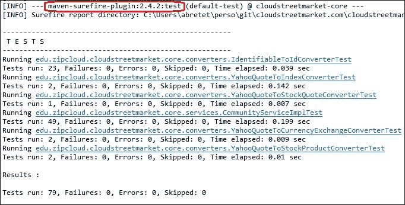
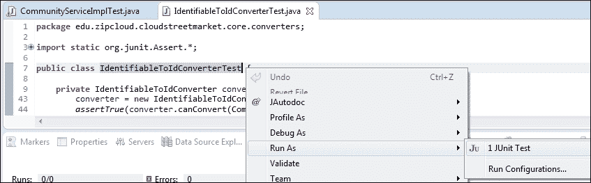

# 第十六章：测试和故障排除

通过列出的以下配方，本章介绍了一套用于维护、调试和改进应用程序状态的常见实践：

+   使用 Flyway 自动化数据库迁移

+   使用 Mockito 和 Maven Surefire 进行单元测试

+   使用 Cargo、Rest-assured 和 Maven Failsafe 进行集成测试

+   在集成测试中注入 Spring Bean

+   使用 Log4j2 进行现代应用程序日志记录

# 介绍

随着我们现在接近这段旅程的结束，我们必须看到如何巩固工作。在现实世界中，测试必须在开发功能之前编写（或至少同时进行）。在软件开发中编写自动化测试传达了对应用程序状态的巨大信心。这是确保没有遗漏的最佳方式。拥有一个能够通过现代持续集成工具自行测试的系统，确保功能不会在任何时候受到损害。

通过 UI 进行手动测试不能被信任来覆盖开发人员必须考虑的每一个边缘情况。开发人员有责任确保所有漏洞并覆盖所有可能的路径，这是一个很大的责任。

我们的开发人员工作是一项了不起的工作。永恒的技术提升为我们每个人设定了无与伦比的步伐-保持竞争，应对市场，有时引领市场。

我们的工作是长时间的高度专注、搜索信息、设计、重新设计等。编写测试为周期带来了健康的稳定性。它使我们能够在开发的功能上完成一天，甚至在几周和几个月后也是如此。

# 使用 FlyWay 自动化数据库迁移

在交付生命周期中，跨版本和多个环境维护数据库可能会成为一个真正的头疼事。Flyway 是对模式更改可能引起的熵的肯定保护。管理和自动化迁移，Flyway 是软件制造商的一项非常有价值的资产。

## 准备就绪

在这个配方中，我们审查了 Flyway 配置。我们特别审查了它与 Maven 的集成。这将使每个构建都升级（如果有必要）相应的数据库，以使其达到期望水平。

## 如何做…

1.  在 Eclipse 的**Git Perspective**中，检出分支`v9.x.x`的最新版本。

1.  在您的工作区的`/app`目录中，`cloudstreetmarket.properties`文件已更新。此外，还出现了一个额外的`db/migration`目录，其中包含一个`Migration-1_0__init.sql`文件，以及一个新的`/logs`目录。

1.  请确保将所有这些更改反映到位于您的操作系统用户`home` `directory`中的 app 目录中：`<home-directory>/app`。

1.  还要确保您的**MySQL 服务器**正在运行。

1.  在`zipcloud-parent`项目上运行**Maven clean**和**Maven install**命令（右键单击项目**Run as…** | **Maven Clean**，然后**Run as…** | **Maven Install**）。

1.  现在，在`cloudstreetmarket-parent`项目上运行**Maven clean**和**Maven install**命令。

1.  在堆栈跟踪的顶部（在 Maven 阶段的包），您应该看到以下日志：

1.  在这个阶段，数据库应该已经被重置，以匹配结构和数据的标准状态。

1.  如果您重新运行构建，现在应该看到以下日志：

1.  在父`pom.xml`（在`cloudstreetmarket-parent`中），您可以注意到一个新的插件定义：

```java
<plugin>
  <groupId>com.googlecode.flyway</groupId>
  <artifactId>flyway-maven-plugin</artifactId>
  <version>2.3.1</version>
  <inherited>false</inherited>
  <executions>
      <execution>
      <id>package</id>
      <goals>
      <goal>migrate</goal>
      </goals>
      </execution>
  </executions>
  <configuration>
    <driver>${database.driver}</driver>
    <url>${database.url}</url>
    <serverId>${database.serverId}</serverId>
    <schemas>
      <schema>${database.name}</schema>
      </schemas>
    <locations>
      <location>
        filesystem:${user.home}/app/db/migration
        </location>
      </locations>
      <initOnMigrate>true</initOnMigrate>
        <sqlMigrationPrefix>Migration-</sqlMigrationPrefix>
        <placeholderPrefix>#[</placeholderPrefix>
        <placeholderSuffix>]</placeholderSuffix>
        placeholderReplacement>true</placeholderReplacement>
        <placeholders>
        <db.name>${database.name}</db.name>
        </placeholders>
  </configuration>
  <dependencies>
        <dependency>
        <groupId>mysql</groupId>
        <artifactId>mysql-connector-java</artifactId>
        <version>5.1.6</version>
        </dependency>
  </dependencies>
  </plugin>
```

1.  一些变量（例如`${database.driver}`）在此定义中使用的默认属性对应于`pom.xml`的顶层设置：

```java
  <database.name>csm</database.name>
  <database.driver>com.mysql.jdbc.Driver</database.driver>
  <database.url>jdbc:mysql://localhost</database.url>
  <database.serverId>csm_db</database.serverId>
```

1.  `database.serverId`必须与 Maven `settings.xml`文件中的新`Server`条目匹配（在下一点中描述）。

1.  编辑 Maven `settings.xml`文件（您必须在第一章中创建的*企业 Spring 应用程序的设置例程*中找到位于`<home-directory>/.m2/settings.xml`）。在根节点的某个位置添加以下块：

```java
  <servers>
      <server>  
      <id>csm_db</id>
      <username>csm_tech</username>
      <password>csmDB1$55</password>
      </server>
  </servers>
```

1.  在父`pom.xml`（在`cloudstreetmarket-parent`中），已添加了一个新的`Profile`，用于可选地覆盖此`pom.xml`的默认属性：

```java
<profiles>
  <profile>
  <id>flyway-integration</id>
  <properties>
  <database.name>csm_integration</database.name>
  <database.driver>com.mysql.jdbc.Driver</database.driver>
  <database.url>jdbc:mysql://localhost</database.url>
  <database.serverId>csm_db</database.serverId>
  </properties>
  </profile>
</profiles>
```

### 提示

使用`csm_integration`配置文件运行`Maven Clean Install`（`mvn clean install –Pcsm_integration`）在这种情况下会升级`csm_integration`数据库（如果有必要）。

## 它是如何工作的…

Flyway 是一个数据库版本控制和迁移工具，采用 Apache v2 许可证（免费软件）。它是 Boxfuse GmbH 公司的注册商标。

Flyway 不是这个类别中唯一的产品，但在行业中以其简单性和易配置性而广泛存在。迁移脚本可以用普通的 SQL 编写，并支持许多提供程序。从传统的 RDBMS（Oracle、MySQL、SQL Server 等）到内存数据库（HSQLDB、solidDB 等），甚至云解决方案（AWS Redshift、SQL Azure 等）都得到支持。

### 有限数量的命令

Flyway 提供了以下六个命令，用于报告和操作目的。

#### 迁移

`Migrate`命令是我们集成到 Maven 打包阶段的目标。它查找类路径或文件系统以执行潜在的迁移。可以配置多个`locations`（脚本存储库）。在 Flyway Maven 插件中，这些`locations`在根`configuration`节点中定义。设置模式以保留特定的文件名。

#### 清理

`Clean`命令还原了数据库模式的原始状态。使用此命令删除所有对象（表、视图、函数等）。

#### 信息

`Info`命令提供有关给定模式的当前状态和迁移历史的反馈。如果您查看本地 MySQL 服务器，在`csm`模式中，您会注意到已创建一个名为`schema_version`的元数据表。Flyway 使用以下表来比较脚本存储库状态与数据库状态，并填补差距。

| 版本 | 描述 | 脚本 | 安装于 | 成功 |
| --- | --- | --- | --- | --- |
| `0` | `<< Flyway 模式创建 >>` | `'csm'` | `2015 年 11 月 12 日 18:11` | `1` |
| `1` | `删除并创建` | `/Migration-1_0__drop_and_create.sql` | `2015 年 11 月 12 日 18:11` | `1` |

`Info`命令基本上将此表打印为报告。

#### 验证

`Validate`命令可用于确保在数据库上执行的迁移实际上与当前存储库中的脚本相对应。

#### Baseline

当我们有一个尚未由 Flyway 管理的现有数据库时，可以使用`Baseline`命令。创建一个 Baseline 版本来标记数据库的状态，并使其准备好与即将到来的版本一起使用。在此 Baseline 之前的版本将被简单地忽略。

#### 修复

`Repair`命令可以清理元数据表的损坏状态。为此，Flyway 删除了失败的迁移条目，并重置了存储的校验和以匹配脚本的校验和。

### 关于 Flyway Maven 插件

Flyway Maven 插件提供了 Maven 控制 Flyway 程序的接口。我们对插件的配置如下：

```java
<plugin>
    <groupId>com.googlecode.flyway</groupId>
    <artifactId>flyway-maven-plugin</artifactId>
    <version>2.3.1</version>
    <inherited>false</inherited>
    <executions>
      <execution>
        <id>package</id>
        <goals>
          <goal>migrate</goal>
        </goals>
      </execution>
    </executions>
    <configuration>
      <driver>${database.driver}</driver>
    <url>${database.url}</url>
    <serverId>${database.serverId}</serverId>
    <schemas>
       <schema>${database.name}</schema>
    </schemas>
    <locations>
      <location>
          filesystem:${user.home}/app/db/migration
        </location>
        </locations>
    <initOnMigrate>true</initOnMigrate>
      <sqlMigrationPrefix>Migration-</sqlMigrationPrefix>
      <placeholderPrefix>#[</placeholderPrefix>
      <placeholderSuffix>]</placeholderSuffix>
      <placeholderReplacement>true</placeholderReplacement>
      <placeholders>
      <db.name>${database.name}</db.name>
     </placeholders>
  </configuration>
</plugin>
```

与 Maven 插件一样，执行部分允许将 Maven 阶段绑定到插件的一个或多个目标。对于 Flyway Maven 插件，目标是先前介绍的 Flyway 命令。我们告诉 Maven 何时考虑插件以及在该插件中调用什么。

我们的`configuration`部分介绍了在迁移期间检查的一些参数。例如，`locations`指定要递归扫描的迁移存储库（它们可以以`classpath`:或`filesystem:`开头）。`schemas`定义了 Flyway 管理的整套迁移的模式列表。第一个模式将成为迁移中的默认模式。

一个有趣的功能是能够在迁移脚本中使用变量，以便这些脚本可以用作多个环境的模板。变量名称使用`placeholders`定义，并且脚本中标识变量的方式可以通过`placeholderPrefix`和`placeholderSuffix`进行配置。

整个配置参数列表可以在以下位置找到：

[`flywaydb.org/documentation/maven/migrate.html`](http://flywaydb.org/documentation/maven/migrate.html)。

## 还有更多…

### 官方文档

Flyway 有很好的文档，并得到其社区的积极支持。在[`flywaydb.org`](http://flywaydb.org)上在线阅读有关该产品的更多信息。

您还可以通过 GitHub 存储库[`github.com/flyway/flyway`](https://github.com/flyway/flyway)来关注或贡献该项目。

## 另请参阅

+   **Liquibase**：Flyway 的主要竞争对手可能是 Liquibase。Liquibase 不使用纯 SQL 来编写脚本；它有自己的多重表示 DSL。有关更多信息，请访问：

[`www.liquibase.org`](http://www.liquibase.org)。

# 使用 Mockito 和 Maven Surefire 进行单元测试

单元测试对于监视组件的实现非常有用。Spring 的传统理念促进了应用程序范围内可重用的组件。这些组件的核心实现可能会改变状态（瞬时对象的状态）或触发与其他组件的交互。

单元测试中使用模拟特别评估了组件方法的行为，以及与其他组件的关系。当开发人员习惯于使用模拟时，令人惊讶的是设计在多大程度上受到了不同层和逻辑外部化的影响。同样，对象名称和方法名称变得更加重要。因为它们总结了在其他地方发生的事情，模拟节省了下一个开发人员在代码区域操作时的精力。

开发单元测试在本质上是企业政策。由于测试覆盖的代码百分比可以很容易地反映产品的成熟度，这种代码覆盖率也正在成为评估公司及其产品的标准参考。还必须指出，作为开发流程进行代码审查的公司从拉取请求中获得了有价值的见解。当拉取请求通过测试突出显示行为变化时，潜在变化的影响变得更加清晰。

## 如何做…

1.  在`cloudstreetmarket-parent`项目上重新运行`Maven Install`，就像在上一个示例中一样。当构建过程开始构建核心模块时，您应该看到以下日志，表明在**test**阶段（在**compile**和**package**之间）执行了单元测试：

1.  这些测试可以在`cloudstreetmarket-core`模块中找到，特别是在`src/test/java`源文件夹中：

单元测试和集成测试都使用 JUnit：

```java
    <dependency>
         <groupId>junit</groupId>
         <artifactId>junit</artifactId>
         <version>4.9</version>
    </dependency>
```

1.  JUnit 在 Eclipse IDE 中得到了原生支持，该 IDE 提供了从类或方法外部运行和调试测试的处理程序：

1.  一个非常简单的 JUnit 测试类是`IdentifiableToIdConverterTest`（见下面的代码）。该类断言所有注册的实体都可以通过`IdentifiableToIdConverter`进行转换，以成为`Identifiable`实现（记住 HATEOAS）：

```java
import static org.junit.Assert.*;
import org.junit.Test;
import edu.zipcloud.cloudstreetmarket.core.entities.*;

public class IdentifiableToIdConverterTest {

  private IdentifiableToIdConverter converter;

  @Test
  public void canConvertChartStock(){
    converter = new IdentifiableToIdConverter(ChartStock.class);
    assertTrue(converter.canConvert(ChartStock.class));
    }

  @Test
  public void canConvertAction(){
    converter = new IdentifiableToIdConverter(Action.class);
    assertTrue(converter.canConvert(Action.class));
  }
}
```

1.  更高级的单元测试使用 Mockito 库。例如，在以下`YahooQuoteToCurrencyExchangeConverterTest`中：

```java
@RunWith(MockitoJUnitRunner.class)
public class YahooQuoteToCurrencyExchangeConverterTest {
  @InjectMocks
  private YahooQuoteToCurrencyExchangeConverter converter;
  @Mock
  private CurrencyExchangeRepository currencyExchangeRepository;
  @Test
  public void transferCriticalData(){
      when(currencyExchangeRepository.findOne(
      any(String.class))
      )
      .thenReturn(new CurrencyExchange("WHATEVER_ID""));
    CurrencyExchange currencyExchange = converter.convert(buildYahooQuoteInstance());
    assertEquals("WHATEVER_ID"",currencyExchange.getId());
    assertEquals("USDGBP=X"", currencyExchange.getName());
    assertEquals(BigDecimal.valueOf(10), 
      currencyExchange.getBid());
    ...
    assertEquals(BigDecimal.valueOf(17), 
    currencyExchange.getOpen());	
    verify(currencyExchangeRepository, times(1))
      .findOne(any(String.class));
  }
  ...
}
```

在这里，突出显示的`transferCriticalData()`测试获取了一个未使用真实的`@Autowired CurrencyExchangeRepository`而是使用**Mock**的`YahooQuoteToCurrencyExchangeConverter`实例。转换器使用`convert()`方法调用`YahooQuote`实例。

### 注意

Mock 被告知在其`convert()`方法内调用其`findOne`(`String s`)方法时返回特定的`CurrencyExchange`实例。然后，返回的`currencyExchange`对象逐个字段进行评估，以确保它们与各自的期望匹配。

1.  已在不同的模块中添加了对 Mockito 的 Maven 依赖项：

```java
    <dependency>
      <groupId>org.mockito</groupId>
      <artifactId>mockito-all</artifactId>
      <version>1.9.5<version>
    </dependency>
```

1.  在`CommunityServiceImplTest`中可以找到对 Mockito 的更广泛使用。例如，在以下示例中，`registerUser_generatePasswordAndEncodeIt`测试使用了`ArgumentCaptor`：

```java
@Test
public void registerUser_generatesPasswordAndEncodesIt() {
  when(communityServiceHelper.generatePassword())
    .thenReturn("newPassword");
  when(passwordEncoder.encode("newPassword"))
    .thenReturn("newPasswordEncoded");
  ArgumentCaptor<User>userArgumentCaptor = 
    ArgumentCaptor.forClass(User.class);
  userA.setPassword(null);
  communityServiceImpl.registerUser(userA);
  verify(userRepository, times(1))
    .save(userArgumentCaptor.capture());
  verify(passwordEncoder, times(1))
    .encode("newPassword");
  String capturedGeneratedPassword = 
    userArgumentCaptor.getValue().getPassword();
  assertEquals("newPasswordEncoded", capturedGeneratedPassword);
}
```

## 它是如何工作的...

### @Test 注释

`@Test`注释必须放置在 public void 方法上，以便 JUnit 将其视为测试用例。在这些方法中引发的异常将被视为测试失败。因此，没有引发任何异常的执行代表成功。

`@Test`注释可以通过传递以下两个可选参数进行自定义。

#### 预期和超时参数

`@Test`注释上的**expected**参数指定测试预期引发特定类型的异常才能成功。当引发不同类型的异常或根本没有引发异常时，JUnit 必须将执行视为失败。当测试用例在其`@Test`注释中提供了**timeout**参数时，当执行时间超过指定时间时，此测试将失败。

### @RunWith 注释

如配方中介绍的，`@RunWith`注释允许使用外部测试运行器（而不是默认的`BlockJUnit4ClassRunner`）。顺便说一句，指定默认 JUnit 运行器的声明性技术可能是将`@RunWith`定位到`JUnit4.class`，如下所示：`@RunWith(JUnit4.class)`。

| | *运行器运行测试并在执行过程中通知`RunNotifier`发生重要事件* | |
| --- | --- | --- |
| | --*JUnit.org Javadoc* |

自定义的`Runner`必须实现`org.junit.runner.Runner`中的抽象方法，例如`run(RunNotifier notifier)`和`getDescription()`。它还必须跟进核心 JUnit 函数，例如驱动测试执行流程。JUnit 具有一组注释，例如`@BeforeClass`，`@Before`，`@After`和`@AfterClass`，这些注释由`org.junit.runner.ParentRunner`本地处理。我们将在下面讨论这些注释。

### @Before 和@After 注释

在包含多个测试用例的测试类中，尝试使测试逻辑尽可能清晰是一个很好的做法。从这个角度来看，变量初始化和上下文重新初始化是人们经常尝试外部化以实现可重用性的操作。`@Before`注释可以定义在`public void`方法上，以便 Runner 在**每个单独的测试**之前执行它们。同样，`@After`注释标记了`public void`方法，以便在**每个测试**之后执行（通常用于清理资源或销毁上下文）。

关于继承，父类的`@Before`方法将在当前类的`@Before`方法之前运行。同样，超类中声明的`@After`方法将在当前类的`@After`方法之后运行。

Javadoc 中的另一个有趣的点指定了**所有**`@After`方法都保证会运行，**即使**`@Before`或`@Test`注释的方法引发异常。

### @BeforeClass 和 @AfterClass 注解

`@BeforeClass` 和 `@AfterClass` 注解可以应用于**public static void** 方法。`@BeforeClass` 使方法在测试生命周期中运行**一次**。该方法将在任何其他 `@Test` 或 `@Before` 标注的方法之前运行。

一个被标注为 `@AfterClass` 的方法保证在所有测试之后运行**一次**，并且在所有 `@BeforeClass`，`@Before` 或 `@After` 标注的方法之后运行，即使其中一个抛出异常。

`@BeforeClass` 和 `@AfterClass` 对于处理与测试上下文准备相关的消耗性能的操作（数据库连接管理和前/后业务处理）是有价值的工具。

关于继承，超类中标注为 `@BeforeClass` 的方法将在当前类的方法**之前**执行，而超类中标注为 `@AfterClass` 的方法将在当前类的方法**之后**执行。

### 使用 Mockito

Mockito 是一个支持测试驱动开发和行为驱动开发的开源测试框架。它允许创建双对象（模拟对象）并有助于隔离被测试系统。

#### MockitoJUnitRunner

我们一直在谈论自定义运行器。`MockitoJUnitRunner` 在实现上实际上是在默认的 `JUnitRunner` 周围实现了一个装饰模式。

这种设计使得使用这个运行器是可选的（所有提供的服务也可以用 Mockito 声明式地实现）。

`MockitoJUnitRunner` 自动初始化 `@Mock` 注解的依赖项（这样我们就不需要在 `@Before` 标注的方法中调用 `MockitoAnnotations.initMocks(this)`）。

`initMocks(java.lang.Object testClass)`

|   | *为给定的 testClass 初始化使用 Mockito 注解标注的对象：`@Mock`* |   |
| --- | --- | --- |
|   | --*Javadoc* |

`MockitoJUnitRunner` 也通过在每个测试方法之后调用 `Mockito.validateMockitoUsage()` 来验证我们实现框架的方式。这种验证通过明确的错误输出使我们更有效地使用库。

#### transferCriticalData 示例

被测试系统是 `YahooQuoteToCurrencyExchangeConverter`。`@InjectMocks` 注解告诉 Mockito 在每个测试之前使用初始化的 Mock 对象对目标转换器执行依赖注入（构造函数注入、属性设置器或字段注入）。

`Mockito.when(T methodCall)` 方法，结合 `thenReturn(T value)`，允许在 `converter.convert(...)` 测试方法内部实际调用 `currencyExchangeRepository.findOne` 时定义一个假的 `CurrencyExchange` 返回对象。

`Mockito verify` 方法与 `verify(currencyExchangeRepository, times(1)).findOne(any(String.class))` 告诉 Mockito 验证被测试的 `convert` 方法如何与 Mock(s) 交互。在下面的例子中，我们希望 `convert` 方法只调用了存储库一次。

#### registerUser 示例

更具体地，在 `registerUser_generatesPasswordAndEncodesIt` 测试中，我们使用 `MockitoArgumentCaptor` 手动对被调用的模拟方法的对象进行更深入的分析。

当我们没有中间层并且结果被重用来调用其他方法时，`MockitoArgumentCaptor` 是很有用的。

比表面的（但仍然非常有用的）类型检查更多的内省工具可能是必需的（例如，`any(String.class)`）。解决方案是在测试方法中使用 `ArgumentCaptor` 与额外的局部变量。

### 提示

记住，实现方法中的局部变量和瞬态状态总是增加相关测试的复杂性。更短、明确和内聚的方法总是更好的选择。

## 还有更多…

### 关于 Mockito

我们建议查看 Mockito 的 Javadoc，它非常完善并且包含了很多实用的例子。

[`docs.mockito.googlecode.com/hg/org/mockito/Mockito.html`](http://docs.mockito.googlecode.com/hg/org/mockito/Mockito.html)

### JUnit 规则

到目前为止，我们还没有涵盖 JUnit 规则。JUnit 提供了`@Rule`注解，可以应用于测试类字段，以抽象出重复的业务特定准备工作。通常用于准备测试上下文对象（固定装置）。

[`www.codeaffine.com/2012/09/24/junit-rules`](http://www.codeaffine.com/2012/09/24/junit-rules)

[`junit.org/javadoc/latest/org/junit/Rule.html`](http://junit.org/javadoc/latest/org/junit/Rule.html)

## 另请参阅

+   **代码覆盖率，JaCoCo**：JaCoCo 是一个库，用于帮助维护和增加应用程序中测试覆盖的代码百分比；它位于：[`eclemma.org/jacoco`](http://eclemma.org/jacoco)。

+   在以下位置阅读有关 JaCoCo Maven 插件的更多信息：

[`eclemma.org/jacoco/trunk/doc/maven.html`](http://eclemma.org/jacoco/trunk/doc/maven.html)

# 使用 Cargo、Rest-assured 和 Maven failsafe 进行集成测试

集成测试与单元测试一样重要。它们从更高的层面验证功能，并同时涉及更多的组件或层。当环境需要快速演变时，集成测试（IT 测试）变得更加重要。设计过程通常需要迭代，而单元测试有时会严重影响我们重构的能力，而高级别测试相对来说受到的影响较小。

## 准备就绪

本文介绍了如何开发重点放在 Spring MVC Web 服务上的自动化 IT 测试。这些 IT 测试不是行为测试，因为它们根本不评估用户界面。要测试行为，需要更高的测试级别，模拟用户通过应用程序界面的旅程。

我们将配置 Cargo Maven 插件，作为 pre-integration-test Maven 阶段的一部分来建立一个测试环境。在 integration-test 阶段，我们将让 Maven failsafe 插件执行我们的 IT 测试。这些 IT 测试将使用 Rest-assured 库对测试环境运行 HTTP 请求并断言 HTTP 响应。

## 如何做…

1.  我们已经在`cloudstreetmarket-api`模块中设计了集成测试。这些测试旨在测试 API 控制器方法。

1.  伟大的 Rest-assured 库附带以下 Maven 依赖项：

```java
  <dependency>
    <groupId>com.jayway.restassured</groupId>
    <artifactId>rest-assured</artifactId>
    <version>2.7.0</version>
  </dependency>
```

1.  使用 REST-assured 进行 IT 测试的典型示例是`UserControllerIT.createUserBasicAuth()`：

```java
public class UserControllerIT extends AbstractCommonTestUser{
  private static User userA;
  @Before
  public void before(){
    userA = new User.Builder()
      .withId(generateUserName())
      .withEmail(generateEmail())
      .withCurrency(SupportedCurrency.USD)
      .withPassword(generatePassword())
      .withLanguage(SupportedLanguage.EN)
      .withProfileImg(DEFAULT_IMG_PATH)
      .build();
  }
  @Test
  public void createUserBasicAuth(){
    Response responseCreateUser = given()
      .contentType("application/json;charset=UTF-8")
      .accept("application/json"")
      .body(userA)
      .expect
      .when()
      .post(getHost() + CONTEXT_PATH + "/users");
  String location = 
      responseCreateUser.getHeader("Location");
  assertNotNull(location);
  Response responseGetUser = given()
      .expect().log().ifError()
      .statusCode(HttpStatus.SC_OK)
      .when()
      .get(getHost() + CONTEXT_PATH + location + 
      		JSON_SUFFIX);
    UserDTO userADTO = 
      deserialize(responseGetUser.getBody().asString());
    assertEquals(userA.getId(), userADTO.getId());
    assertEquals(userA.getLanguage().name(), 
    userADTO.getLanguage());
    assertEquals(HIDDEN_FIELD, userADTO.getEmail());
    assertEquals(HIDDEN_FIELD, userADTO.getPassword());
    assertNull(userA.getBalance());
  }
}
```

1.  因为它们需要更长的时间来执行，我们希望将 IT 测试的执行与主 Maven 生命周期解耦。我们已将这些 IT 测试关联到名为`integration`的 Maven 配置文件。

### 注意

Maven 配置文件提供了使用额外生命周期绑定来丰富 Maven 构建的可能性。例如，我们的集成配置文件是通过在通常的命令中传递此配置文件 ID 作为`Profile`参数来激活的：

`$ mvn clean install -P integration`

1.  对于我们的 API IT 测试，我们已将特定于配置文件的配置放在了`cloudstreetmarket-api pom.xml`文件中：

```java
<profiles>
  <profile>
  <id>integration</id>
  <build>
  <plugins>
    <plugin>
      <groupId>org.apache.maven.plugins</groupId>
      <artifactId>maven-failsafe-plugin</artifactId>
      <version>2.12.4</version>
      <configuration>
      <includes>
        <include>**/*IT.java</include>
      </includes>
      <excludes>
        <exclude>**/*Test.java</exclude>
      </excludes>
   </configuration>
   <executions>
      <execution>
        <id>integration-test</id>
        <goals>
          <goal>integration-test</goal>
        </goals>
      </execution>
      <execution>
        <id>verify</id>
        <goals><goal>verify</goal></goals>
      </execution>
   </executions>
 </plugin>
 <plugin>
  <groupId>org.codehaus.cargo</groupId>
  <artifactId>cargo-maven2-plugin</artifactId>
  <version>1.4.16</version>
      <configuration>
      <wait>false</wait>
      <container>
      <containerId>tomcat8x</containerId>
            <home>${CATALINA_HOME}</home>
      <logLevel>warn</logLevel>
      </container>
      <deployer/>
      <type>existing</type>
      <deployables>
      <deployable>
      <groupId>edu.zc.csm</groupId>
      <artifactId>cloudstreetmarket-api</artifactId>
      <type>war</type>
        <properties>
          <context>api</context>
        </properties>
      </deployable>
      </deployables>
    </configuration>
    <executions>
      <execution>
        <id>start-container</id>
        <phase>pre-integration-test</phase>
        <goals>
         <goal>start</goal>
         <goal>deploy</goal>
      </goals>
    </execution>
    <execution>
      <id>stop-container</id>
      <phase>post-integration-test</phase>
      <goals>
         <goal>undeploy</goal>
         <goal>stop</goal>
      </goals>
         </execution>
      </executions>
    </plugin>
  </plugins>
  </build>
  </profile>
</profiles>
```

1.  在尝试在您的计算机上运行它们之前，请检查您的**CATALINA_HOME**环境变量是否指向 Tomcat 目录。如果没有，您必须创建它。要设置的变量应该是以下内容（如果您已经按照第一章进行了设置，则应该是）：

+   `C:\tomcat8`：在 MS Windows 上

+   `/home/usr/{system.username}/tomcat8`：在 Linux 上

+   `/Users/{system.username}/tomcat8`：在 Mac OS X 上

1.  此外，请确保 Apache HTTP、Redis 和 MySQL 在您的本地计算机上运行正常（如果您跳过了上一章，请参阅上一章）。 

1.  准备就绪后：

+   在终端中执行以下 Maven 命令（如果 Maven 目录在您的路径中）：

```java

 mvn clean verify -P integration

```

+   或者在 Eclipse IDE 中从**Run** | **Run Configurations…**菜单中创建此自定义构建的快捷方式。要创建的构建配置如下：


1.  运行此命令（或快捷方式）应该：

1.  将**api.war**部署到本地 Tomcat 服务器

1.  启动本地 Tomcat

1.  执行与**/*IT.java 模式匹配的测试类

如果所有测试都通过，您应该看到`[INFO] BUILD SUCCESS`消息。

1.  在构建到 API 时，您应该看到以下一小段堆栈跟踪，表明我们的 IT 测试成功执行：

## 它是如何工作的…

我们将在本节中解释为什么我们引入了 Maven failsafe 插件，Cargo 插件配置如何满足我们的需求，我们如何使用 REST-assured，以及这个 REST-assured 库有多有用。

### Maven Failsafe 与 Maven Surefire

我们使用 Maven failsafe 来运行集成测试，使用 Maven Surefire 来运行单元测试。这是使用这些插件的标准方式。以下表反映了这一点，插件的默认命名模式用于测试类：

|   | Maven Surefire | Maven Failsafe |
| --- | --- | --- |
| **默认测试包含模式** |

```java

**/Test*.java
**/*Test.java
**/*TestCase.java

```

|

```java

**/IT*.java
**/*IT.java
**/*ITCase.java

```

|

| **默认输出目录** |
| --- |

```java

${basedir}/target/surefire-reports

```

|

```java

${basedir}/target/failsafe-reports

```

|

| **绑定到构建阶段** |
| --- |

```java

test

```

|

```java

pre-integration-test
integration-test
post-integration-test
verify

```

|

对于 Maven Failsafe，您可以看到我们覆盖的模式包含/排除是可选的。关于绑定到 Maven 构建阶段，我们选择在`integration-test`和`verify`阶段触发我们的集成测试的执行。

### Code Cargo

Cargo 是一个轻量级库，为操作多个支持的容器（Servlet 和 JEE 容器）提供标准 API。覆盖的 API 操作示例包括部署构件、远程部署和容器启动/停止。当通过 Maven、Ant 或 Gradle 使用时，它主要用于提供对集成测试的支持，但也可以用于其他范围。

#### Cargo Maven 插件

我们通过其 Maven 插件`org.codehaus.cargo:cargo-maven2-plugin`使用 Cargo 自动准备一个集成环境，我们可以对其运行集成测试。在集成测试之后，我们期望此环境关闭。

##### 绑定到 Maven 阶段

以下执行已声明为`cargo-maven2-plugin`配置的一部分：

```java
<executions>
  <execution>
    <id>start-container</id>
    <phase>pre-integration-test</phase>
    <goals>
      <goal>start</goal>
    <goal>deploy</goal>
      </goals>
  </execution>
  <execution>
        <id>stop-container</id>
    <phase>post-integration-test</phase>
      <goals>
      <goal>undeploy</goal>
      <goal>stop</goal>
        </goals>
  </execution>
</executions>
```

让我们看看执行`mvn install`命令时会发生什么。

`install`是默认 Maven 生命周期的一个阶段。如第一章中所解释的*企业 Spring 应用程序的设置例程*，默认生命周期有 23 个构建阶段，从`validate`到`deploy`。`install`阶段是第 22 个阶段，因此会检查 22 个阶段，看是否有插件目标可以附加到它们上面。

在这里，`pre-integration-test`阶段（出现在默认生命周期的`validate`和`install`之间）将触发位于我们的 maven Cargo 插件的`start`和`deploy`目标下的进程。与此相同的逻辑是`post-integration-test`触发`undeploy`和`stop`目标。

在执行 IT 测试之前，我们启动和部署 Tomcat 服务器。这些 IT 测试在`integration-test`阶段使用 Maven failsafe 进行处理。最后，Tomcat 服务器被取消部署并停止。

IT 测试也可以在`verify`阶段执行（如果服务器在默认 Maven 生命周期之外启动）。

##### 使用现有的 Tomcat 实例

在 Cargo Maven 插件配置中，我们针对现有的 Tomcat 实例。我们的应用当前依赖于 MySQL、Redis、Apache HTTP 和自定义会话管理。我们决定 IT 测试执行将需要在适当的集成环境中运行。

如果没有这些依赖关系，我们将让 Cargo 下载 Tomcat 8 实例。

### Rest assured

REST-assured 是一个由 Jayway 公司支持的 Apache v2 许可的开源库。它是用 Groovy 编写的，允许通过其独特的功能 DSL 进行 HTTP 请求和验证 JSON 或 XML 响应，从而大大简化了 REST 服务的测试。

#### 静态导入

为了有效地使用 REST-assured，文档建议添加以下包的静态导入：

+   `com.jayway.restassured.RestAssured.*`

+   `com.jayway.restassured.matcher.RestAssuredMatchers.*`

+   `org.hamcrest.Matchers.*`

#### 一种给定、当、然后的方法

要了解 REST-assured DSL 的基础知识，让我们考虑我们的一个测试（在`UserControllerIT`中），它提供了 REST-assured 使用的简要概述：

```java
  @Test
  public void createUserBasicAuthAjax(){
    Response response = given()
    .header("X-Requested-With", "XMLHttpRequest")
    .contentType("application/json;charset=UTF-8")
    .accept("application/json\")
    .body(userA)
    .when()
    .post(getHost() + CONTEXT_PATH + "/users");
    assertNotNull(response.getHeader("Location"));
  }
```

语句的`given`部分是 HTTP 请求规范。使用 REST-assured，一些请求头，如`Content-Type`或`Accept`，可以以直观的方式使用`contentType(…)`和`accept(…)`来定义。其他**头部**可以通过通用的`.header(…)`来访问。请求参数和身份验证也可以以相同的方式定义。

对于`POST`和`PUT`请求，有必要向请求传递一个 body。这个`body`可以是普通的 JSON 或 XML，也可以直接是 Java 对象（就像我们在这里做的那样）。这个`body`作为 Java 对象，将根据规范中定义的`content-type`（JSON 或 XML）由库进行转换。

在 HTTP 请求规范之后，`when()`语句提供了有关实际 HTTP 方法和目的地的信息。

在这个阶段，返回的对象允许我们从`then()`块中定义期望，或者像我们在这里做的那样，从中检索`Response`对象，从中可以单独定义约束。在我们的测试用例中，预期`Response`的`Location`头部应该被填充。

## 还有更多…

更多信息可以在以下 Cargo 和 REST-assured 各自的文档中找到：

### 关于 Cargo

有关产品及其与第三方系统集成的更多信息，请参阅[`codehaus-cargo.github.io/cargo/Home.html`](https://codehaus-cargo.github.io/cargo/Home.html)。

### 更多 REST-assured 示例

有关更多示例，REST-assured 在线 Wiki 提供了大量信息：

[`github.com/jayway/rest-assured/wiki/Usage`](https://github.com/jayway/rest-assured/wiki/Usage)

# 将 Spring Bean 注入集成测试

这个示例是如何将 Spring 管理的 bean 注入到集成测试类中的一个示例。即使对于其首要目标是将后端作为黑匣子进行评估的 IT 测试，有时也需要从中间层访问技术对象。

## 准备工作

我们将看到如何重用 Spring 管理的`datasource`实例，将其注入到我们的测试类中。这个`datasource`将帮助我们构建一个`jdbcTemplate`的实例。从这个`jdbcTemplate`，我们将查询数据库并模拟/验证否则无法测试的过程。

## 如何做…

1.  我们在我们的`UserControllerIT`测试中`@Autowired`了一个`dataSource` SpringBean。这个 bean 在测试特定的 Spring 配置文件（`spring-context-api-test.xml`）`resources`目录（`cloudstreetmarket-api`）中定义：

```java
<context:property-placeholderlocation="
  file:${user.home}/app/cloudstreetmarket.properties""/>
<bean id="dataSource" 		
  class="org.apache.commons.dbcp2.BasicDataSource" 	
  destroy-method="close"">
  <property name="driverClassName"">
     <value>com.mysql.jdbc.Driver</value>
  </property>
  <property name="url"">
    <value>${db.connection.url}</value>
  </property>
<property name="username"">
  <value>${db.user.name}</value>
</property>
<property name="password"">
  <value>${db.user.passsword}</value>
</property>
<property name="defaultReadOnly">
  <value>false</value>
</property>
</bean>
```

在`UserControllerIT`类中，从`@Autowired dataSource` bean 创建了一个`jdbcTemplate`实例：

```java
    @Autowired
    private JdbcTemplate jdbcTemplate;
    @Autowired
    public void setDataSource(DataSource dataSource) {
    	this.jdbcTemplate = new JdbcTemplate(dataSource);
    }
```

1.  我们使用`jdbcTemplate`直接在数据库中插入和删除`Social Connections`（参见第五章，“使用 Spring MVC 进行身份验证”）。这使我们能够绕过并模拟成功的用户 OAuth2 身份验证流程（通常通过 Web 浏览器进行）。

对于删除社交连接，我们创建了以下私有方法，根据需要由测试调用：

```java
    private void deleteConnection(String spi, String id) {
    	this.jdbcTemplate.update("delete from userconnection where providerUserId = ? and userId = "?", new Object[] {spi, id});
   }
```

1.  在`UserControllerIT`类的顶部，可以注意到以下两个注解：

+   `@RunWith(SpringJUnit4ClassRunner.class)`告诉 JUnit 使用 JUnit 的自定义扩展（`SpringJUnit4ClassRunner`）来运行，支持 Spring`TestContext`框架。

+   `@ContextConfiguration("classpath:spring-context-api-test.xml")`指定了加载和配置 Spring 应用程序上下文的位置和方式：

```java
    @RunWith(SpringJUnit4ClassRunner.class)
    @ContextConfiguration("classpath:spring-context-api-test.xml"")
    public class UserControllerIT extends AbstractCommonTestUser{
    private static User userA;
    private static User userB;
    ...
    }
```

## 它是如何工作的...

### SpringJUnit4ClassRunner

在设计上，`SpringJUnit4ClassRunner`是 JUnit 的`BlockJUnit4ClassRunner`的直接子类。`SpringJUnit4ClassRunner`在加载`TestContextManager`时初始化。`TestContextManager`管理`TestContext`的生命周期，并且还可以将测试事件反映给注册的`TestExecutionListeners`（来自`@BeforeClass`、`@AfterClass`、`@Before`和`@After`注解）。

通过加载 Spring 上下文，`SpringJUnit4ClassRunner` Spring 上下文，`SpringJUnit4ClassRunner`使得在测试类中可以使用 Spring 管理的 bean。`SpringJUnit4ClassRunner`还支持一组注解（来自 JUnit 或 Spring 测试），可以在测试类中使用。可以信任这些注解的使用，以便随后为上下文定义的对象提供适当的生命周期管理。

这些注解是`@Test`（带有其`expected`和`timeout`注解参数）、`@Timed`、`@Repeat`、`@Ignore`、`@ProfileValueSourceConfiguration`和`@IfProfileValue`。

### @ContextConfiguration 注解

这个类级别的注解是特定于 Spring 测试的。它定义了如何以及从哪里加载 Spring 上下文用于测试类。

我们在配方中的定义针对特定的 Spring XML 配置文件`@ContextConfiguration("classpath:spring-context-api-test.xml")`。

然而，自 Spring 3.1 以来，上下文可以以编程方式定义，`@ContextConfiguration`也可以以以下方式针对配置类：

`@ContextConfiguration(classes={AnnotationConfig.class,` `WebSocketConfig.class})`

如下面的片段所示，两种声明类型可以组合在同一个注解中：

`@ContextConfiguration(classes={AnnotationConfig.class,` `WebSocketConfig.class}, locations={`"`classpath:spring-context-api-test.xml`"`})`

## 还有更多...

我们将在本节中更多地了解为测试目的而使用的 Spring JdbcTemplate。

### JdbcTemplate

在*第一章，企业 Spring 应用程序的设置例程*中，我们介绍了使 Spring 框架成为今天的样子的不同模块。其中一组模块是**数据访问和集成**。这个组包含了 JDBC、ORM、OXM、JMS 和事务模块。

`JdbcTemplate`是 Spring JDBC 核心包的关键部分。它可靠地允许使用简单的实用方法执行数据库操作，并为大量的模板代码提供了抽象。再次，这个工具节省了我们的时间，并提供了设计高质量产品的模式。

### 模板逻辑的抽象

让我们以我们的测试类中删除连接的方法为例：

```java
jdbcTemplate.update("delete from userconnection where 
  providerUserId = ? and userId = "?", new Object[] {spi, id});
```

使用`jdbcTemplate`，删除数据库元素是一条指令。它在内部创建一个`PreparedStatement`，根据我们实际传递的值选择正确的类型，并为我们管理数据库连接，确保无论发生什么都关闭这个连接。

`jdbcTemplate.update`方法被设计用于发出单个 SQL 更新操作。它可以用于插入、更新，也可以删除。

就像在 Spring 中经常发生的那样，`jdbcTemplate`也会将产生的已检查异常（如果有的话）转换为未检查异常。在这里，潜在的`SQLExceptions`将被包装在`RuntimeException`中。

#### 自动生成 ID 的提取

`jdbcTemplate.update`方法还提供其他参数类型：

```java
jdbcTemplate.update(final PreparedStatementCreator psc, final
  KeyHolder generatedKeyHolder);
```

在插入的情况下，可以在需要时调用此方法来读取并可能重用生成的 ID（在查询执行之前是未知的）。

在我们的示例中，如果我们想要在插入新连接时重用生成的连接 ID，我们将这样做：

```java
KeyHolder keyHolder = new GeneratedKeyHolder();
jdbcTemplate.update(
  new PreparedStatementCreator() {
    public PreparedStatement createPreparedStatement(Connection 
    connection) throws SQLException {
    PreparedStatement ps = connection.prepareStatement("insert into userconnection (accessToken, ... , secret, userId ) values (?, ?, ... , ?, ?)", new String[] {"id""});
    ps.setString(1, generateGuid());
    ps.setDate(2, new Date(System.currentTimeMillis()));
    ...
    return ps;
    }
  }, keyHolder);
  Long Id = keyHolder.getKey().longValue();
```

但我们并没有明确要求这样的用例。

# 使用 Log4j2 的现代应用程序日志记录

在 Java 生态系统的 20 年演变之后，日志记录的方式已经看到了不同的策略、趋势和架构。如今，可以在使用的第三方依赖项中找到几种日志框架。我们必须支持它们所有来调试应用程序或跟踪运行时事件。

## 准备就绪

这个配方为`CloudStreet Market`应用程序提供了一个未来的`Log4j2`实现。它需要将几个 Maven 依赖项添加到我们的模块中。作为解决方案，它可能看起来相当复杂，但实际上需要支持的日志框架数量有限，`Log4j2`迁移背后的逻辑相当简单。

## 如何做...

1.  已将以下 Maven 依赖项添加到父模块（`cloudstreetmarket-parent`）的依赖项管理部分：

```java
    <!-- Logging dependencies -->
    <dependency>
      <groupId>org.apache.logging.log4j</groupId>
      <artifactId>log4j-api</artifactId>
      <version>2.4.1</version>
    </dependency>
    <dependency>
      <groupId>org.apache.logging.log4j</groupId>
      <artifactId>log4j-core</artifactId>
      <version>2.4.1</version>
    </dependency>
    <dependency>
      <groupId>org.apache.logging.log4j</groupId>
      <artifactId>log4j-slf4j-impl</artifactId>
      <version>2.4.1</version>
    </dependency>
    <dependency>
      <groupId>org.apache.logging.log4j</groupId>
      <artifactId>log4j-1.2-api</artifactId>
      <version>2.4.1</version>
    </dependency>
    <dependency>
      <groupId>org.apache.logging.log4j</groupId>
      <artifactId>log4j-jcl</artifactId>
      <version>2.4.1</version>
      </dependency>
    <dependency>
      <groupId>org.apache.logging.log4j</groupId>
      <artifactId>log4j-web</artifactId>
        <scope>runtime</scope>
      <version>2.4.1</version>
    </dependency>
    <dependency>
      <groupId>org.slf4j</groupId>
      artifactId>slf4j-api</artifactId>
      <version>${slf4j.version}</version>
    </dependency>
```

### 提示

最后一个依赖项管理，`org.slf4j`，允许我们确保`slf4j`的一个版本将在所有地方使用。

1.  然后在`api`，`ws`和`core`模块中添加了以下依赖项：`log4j-api`，`log4j-core`，`log4j-slf4j-impl`，`log4j-1.2-api`和`log4j-jcl`。

1.  在 web 模块（`api`，`ws`和`webapp`）中，已添加了`log4j-web`。

1.  请注意，`slf4j-api`仅用于依赖项管理。

1.  使用**额外的 JVM 参数**启动 Tomcat 服务器：

```java
-Dlog4j.configurationFile=<home-directory>\app\log4j2.xml.
```

### 提示

将`<home-directory>`替换为您在计算机上实际使用的路径。

1.  用户主目录中的应用程序目录现在包含`log4j2`配置文件：

```java
<?xml version="1.0" encoding="UTF-8"?>
<Configuration status="OFF" monitorInterval="30">
<Appenders
  <Console name="Console" target="SYSTEM_OUT">
    <PatternLayout pattern"="%d{HH:mm:ss.SSS} %-5level %logger{36} - %msg%n""/>
  </Console>
  <RollingFile name="FileAppender" fileName="${sys:user.home}/app/logs/cloudstreetmarket.log"
        filePattern="${sys:user.home}/app/logs/${date:yyyy-MM}/cloudstreetmarket-%d{MM-dd-yyyy}-%i.log.gz">
      <PatternLayout>
        <Pattern>%d %p %C{1} %m%n</Pattern>
      </PatternLayout>
      <Policies>
        <TimeBasedTriggeringPolicy />
        <SizeBasedTriggeringPolicy size="250 MB"/>
      </Policies>
  </RollingFile>
</Appenders>
<Loggers>
  <Logger name="edu.zipcloud" level="INFO"/>
  <Logger name="org.apache.catalina" level="ERROR"/>
  <Logger name="org.springframework.amqp" level="ERROR"/>
  <Logger name="org.springframework.security" level="ERROR"/>

  <Root level="WARN">
    <AppenderRef ref="Console"/>
  <AppenderRef ref="FileAppender"/>
  </Root>
</Loggers>
</Configuration>
```

1.  作为备选方案，每个单个模块的类路径（`src/main/resources`）中也存在一个`log4j2.xml`文件。

1.  已在不同的类中放置了一些日志说明，以跟踪用户的旅程。

在`SignInAdapterImpl`中记录说明：

```java
    import org.apache.logging.log4j.LogManager;
import org.apache.logging.log4j.Logger;

@Transactional
public class SignInAdapterImpl implements SignInAdapter{
  private static final Logger logger = 
    LogManager.getLogger(SignInAdapterImpl.class);
  ...
  public String signIn(String userId, Connection<?>connection, NativeWebRequest request) {
  ...
  communityService.signInUser(user);
  logger.info("User {} logs-in with OAUth2 account", user.getId());
  return view;
  }
}
```

在`UsersController`中记录说明：

```java
@RestController
@RequestMapping(value=USERS_PATH, produces={"application/xml", "application/json"})
public class UsersController extends CloudstreetApiWCI{
  private static final Logger logger = LogManager.getLogger(UsersController.class);
  ...
  @RequestMapping(method=POST)
  @ResponseStatus(HttpStatus.CREATED)
  public void create(@Valid @RequestBody User user, 
    @RequestHeader(value="Spi", required=false) String guid, 
  @RequestHeader(value="OAuthProvider", required=false) String provider, HttpServletResponse response) throws IllegalAccessException{
      if(isNotBlank(guid)){
      ...
      communityService.save(user);
      logger.info("User {} registers an OAuth2 account: "{}", user.getId(), guid);
      }
      else{
    user = communityService.createUser(user, ROLE_BASIC);
    ...
    logger.info("User registers a BASIC account"", user.getId());
      }
    ...
  }
  ...
}
```

1.  启动本地 Tomcat 服务器，并简要浏览应用程序。与以下示例一样，您应该能够在聚合文件`<home-directory>/apps/logs/cloudstreetmarket.log`中观察到客户活动的跟踪：

### 提示

通过我们制作的`log4j2.xml`配置，`cloudstreetmarket.log`文件将在达到 250MB 时自动被压缩并分类到目录中。

## 工作原理...

我们主要将在本节中审查 Log4j2 如何设置与其他日志框架一起工作。配置的其他部分（此处未涵盖）被认为更直观。

### Apache Log4j2 和其他日志框架

Log4j1+作为一个项目正在消亡，因为它不再与 Java 5+兼容。

Log4j 2 是作为 log4j 代码库的一个分支构建的。从这个角度来看，它与 Logback 项目竞争。Logback 最初是 Log4j 的合法继续。

Log4j 2 实际上实现了 Logback 的许多改进，但也修复了 Logback 架构固有的问题。

Logback 提供了很好的性能改进，特别是在多线程方面。相比之下，Log4j 2 提供了类似的性能。

#### SLF4j 的情况

SLF4j 本身不是一个日志框架；它是一个抽象层，允许用户在部署时插入任何日志系统。

SLF4j 在类路径中需要一个 SLF4j 绑定。绑定的示例如下：

+   `slf4j-log4j12-xxx.jar`：（log4j 版本 1.2），

+   `slf4j-jdk14-xxx.jar`：（来自 jdk 1.4 的`java.util.logging`），

+   `slf4j-jcl-xxx.jar`：（Jakarta Commons Logging）

+   `logback-classic-xxx.jar`。

它通常还需要目标日志框架的核心库。

### 迁移到 log4j 2

Log4j2 不提供对 Log4j1+的向后兼容性。 这可能听起来像一个问题，因为应用程序（如`CloudStreetMarket`）经常使用嵌入其自己的日志框架的第三方库。 例如，Spring 核心具有对 Jakarta Commons Logging 的传递依赖。

为了解决这种情况，Log4j 2 提供了适配器，确保内部日志不会丢失，并将桥接到加入 log4j 2 日志流的日志。 几乎所有可能产生日志的系统都有适配器。

#### Log4j 2 API 和核心

Log4j 2 带有 API 和实现。 两者都是必需的，并且具有以下依赖项：

```java
<dependency>
  <groupId>org.apache.logging.log4j</groupId>
  <artifactId>log4j-api</artifactId>
  <version>2.4.1</version>
</dependency>
<dependency>
  <groupId>org.apache.logging.log4j</groupId>
  <artifactId>log4j-core</artifactId>
  <version>2.4.1</version>
</dependency>
```

#### Log4j 2 适配器

如前所介绍，一组**适配器**和**桥接**可用于为我们的应用程序提供向后兼容性。

##### Log4j 1.x API 桥接

当在特定模块中注意到对 Log4j 1+的传递依赖时，应添加以下桥接：

```java
<dependency>
  <groupId>org.apache.logging.log4j</groupId>
  <artifactId>log4j-1.2-api</artifactId>
  <version>2.4.1</version>
</dependency>
```

##### Apache Commons Logging 桥接

当在特定模块中注意到对 Apache（Jakarta）Commons Logging 的传递依赖时，应添加以下桥接：

```java
<dependency>
  <groupId>org.apache.logging.log4j</groupId>
  <artifactId>log4j-jcl</artifactId>
  <version>2.4.1</version>
</dependency>
```

##### SLF4J 桥接

相同的逻辑适用于覆盖 slf4j 的使用；应添加以下桥接：

```java
<dependency>
  <groupId>org.apache.logging.log4j</groupId>
  <artifactId>log4j-slf4j-impl</artifactId>
  <version>2.4.1</version>
</dependency>
```

##### Java Util Logging 适配器

我们的应用程序中没有注意到对`java.util.logging`的传递依赖，但如果有的话，我们将使用以下桥接：

```java
<dependency>
  <groupId>org.apache.logging.log4j</groupId>
  <artifactId>log4j-jul</artifactId>
  <version>2.4.1</version>
</dependency>
```

##### Web Servlet 支持

Apache Tomcat 容器有自己的一组库，也会产生日志。 在 Web 模块上添加以下依赖项是确保容器日志路由到主 Log4j2 管道的一种方法。

```java
<dependency>
  <groupId>org.apache.logging.log4j</groupId>
  <artifactId>log4j-web</artifactId>
  <version>2.4.1</version>
  <scope>runtime</scope>
</dependency>
```

### 配置文件

此食谱的第六步详细介绍了我们的 log4j2 配置。 它由不同的可配置的`Appenders`（基本上是输出通道）组成。 我们正在使用控制台和基于文件的`Appender`，但是 Log4j 2 具有关于`Appenders`的基于插件的架构，如果需要，可以使用外部输出通道（SMTP，打印机，数据库等）。

## 还有更多...

作为外部信息源，我们指出了有趣的 Log4j2 自动配置，该配置由级联查找配置文件、官方文档和用于直接记录到 Redis 的`Appender`组成。

### 自动配置

Log4j2 实现级联查找以定位 log4j2 配置文件。 从查找提供的`log4j.configurationFile`系统属性开始，到类路径中的`log4j2-test.xml`和`log4j2.xml`文件，官方文档详细介绍了所有遵循的级联步骤。 此文档可在以下地址找到：

[`logging.apache.org/log4j/2.x/manual/configuration.html`](https://logging.apache.org/log4j/2.x/manual/configuration.html)

### 官方文档

官方文档非常完善，可在以下地址找到：

[`logging.apache.org/log4j/2.x.`](https://logging.apache.org/log4j/2.x.)

### 有趣的 Redis Appender 实现

以下地址介绍了一个 Apache 许可的项目，该项目提供了一个 Log4j2 **Appender**，可以直接记录到 Redis 中：

[`github.com/pavlobaron/log4j2redis`](https://github.com/pavlobaron/log4j2redis)


