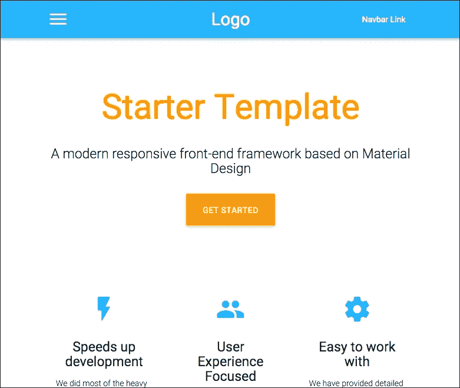

#  第十七章：掌握 MVC 架构

在本章中，我们将讨论 MVC 架构原则，并了解 Spring MVC 如何实现这些原则。

我们的目标是设计一个简单的页面，用户可以在其中搜索符合某些条件的推文，并将它们显示给我们的用户。

为了实现这一点，我们将使用 Spring Social Twitter 项目，该项目可在[`projects.spring.io/spring-social-twitter/`](http://projects.spring.io/spring-social-twitter/)上找到。

我们将看到如何使 Spring MVC 与现代模板引擎 Thymeleaf 配合工作，并尝试理解框架的内部机制。我们将引导用户通过不同的视图，最后，我们将使用 WebJars 和 Materialize（[`materializecss.com`](http://materializecss.com)）为我们的应用程序提供出色的外观。

# MVC 架构

我希望 MVC 首字母缩略词的含义对大多数人来说是熟悉的。它代表模型视图控制器，被认为是一种非常流行的通过解耦数据和表示层构建用户界面的方式。


MVC 模式在从 Smalltalk 世界中出现并进入 Ruby on Rails 框架后变得非常流行。

这种架构模式包括三个层：

+   **模型**：这包括应用程序了解的数据的各种表示形式。

+   **视图**：这由将显示给用户的数据的几种表示形式组成。

+   **控制器**：这是应用程序处理用户交互的部分。它是模型和视图之间的桥梁。

MVC 背后的理念是将视图与模型解耦。模型必须是自包含的，并且对 UI 一无所知。这基本上允许相同的数据在多个视图中重复使用。这些视图是查看数据的不同方式。深入或使用不同的渲染器（HTML，PDF）是这一原则的很好的例证。

控制器充当用户和数据之间的中介。它的作用是控制最终用户可用的操作，以及在应用程序的不同视图之间进行路由。

# MVC 的批评和最佳实践

虽然 MVC 仍然是设计 UI 的首选方法，但随着其流行，出现了许多批评。大多数批评者实际上是在指责模式的错误使用。

## 贫血领域模型

Eric Evans 的具有影响力的书籍《领域驱动设计》，也缩写为**DDD**，定义了一组架构规则，以实现更好地将业务领域整合到代码中。

其中一个核心思想是利用领域对象内的面向对象范例。违背这一原则有时被称为**贫血领域模型**。这个问题的一个很好的定义可以在 Martin Fowler 的博客上找到（[`www.martinfowler.com/bliki/AnemicDomainModel.html`](http://www.martinfowler.com/bliki/AnemicDomainModel.html)）。

贫血模型通常表现出以下症状：

+   模型由非常简单的**普通的 Java 对象**（**POJO**）组成，只有 getter 和 setter

+   所有业务逻辑都在服务层内处理

+   模型的验证在模型之外，例如在控制器中

这取决于您的业务领域的复杂性，这可能是一种不良实践。一般来说，领域驱动设计（DDD）实践需要额外的努力来将领域与应用程序逻辑隔离开来。

架构始终是一种权衡。值得注意的是，设计 Spring 应用程序的典型方式可能会导致在某个时候出现复杂的维护。

如何避免领域贫血在这里有解释：

+   服务层适用于应用级抽象，如事务处理，而不是业务逻辑。

+   您的领域应始终处于有效状态。使用验证器或 JSR-303 的验证注释将验证留在表单对象内。

+   将输入转化为有意义的领域对象。

+   将数据层视为具有领域查询的存储库（例如参考 Spring Data 规范）

+   将领域逻辑与底层持久性框架解耦

+   尽可能使用真实对象。例如，操作`FirstName`类而不是字符串。

领域驱动设计比这些简单的规则要复杂得多：实体、值类型、通用语言、有界上下文、洋葱架构和防腐层。我强烈鼓励您自行研究这些原则。就我们而言，通过本书，我们将努力记住前面列出的指导方针，因为我们打造我们的 Web 应用程序时，这些问题将变得更加熟悉。

## 从源代码中学习

如果您熟悉 Spring，您可能已经访问过 Spring 的网站[`spring.io`](http://spring.io)。它完全由 Spring 制作，好消息是它是开源的。

该项目的代号是 sagan。它有许多有趣的特性：

+   一个 gradle 多模块项目

+   安全集成

+   Github 集成

+   Elasticsearch 集成

+   一个 JavaScript 前端应用程序

与该项目相关的 GitHub 维基非常详细，将帮助您轻松开始使用该项目。

### 注意

如果您对 Spring 的真实世界应用程序架构感兴趣，请访问以下网址：

[`github.com/spring-io/sagan`](https://github.com/spring-io/sagan)

# Spring MVC 1-0-1

在 Spring MVC 中，模型是 Spring MVC 的`Model`或`ModelAndView`类中封装的简单映射。它可以来自数据库、文件、外部服务等。由您定义如何获取数据并将其放入模型。与数据层交互的推荐方式是通过 Spring Data 库：Spring Data JPA、Spring Data MongoDB 等。有数十个与 Spring Data 相关的项目，我鼓励您查看[`projects.spring.io/spring-data`](http://projects.spring.io/spring-data)。

Spring MVC 的控制器端通过使用`@Controller`注解来处理。在 Web 应用程序中，控制器的作用是响应 HTTP 请求。使用`@Controller`注解标记的类将被 Spring 捕获，并有机会处理即将到来的请求。

通过`@RequestMapping`注解，控制器声明处理特定请求，基于它们的 HTTP 方法（例如`GET`或`POST`方法）和它们的 URL。然后控制器决定是直接在 Web 响应中写入内容，还是将应用程序路由到视图并将属性注入该视图。

一个纯粹的 RESTful 应用程序将选择第一种方法，并使用`@ResponseBody`注解直接在 HTTP 响应中公开模型的 JSON 或 XML 表示。在 Web 应用程序的情况下，这种类型的架构通常与前端 JavaScript 框架（如 Backbone.js、AngularJS 或 React）相关联。在这种情况下，Spring 应用程序将仅处理 MVC 模型的模型层。我们将在第三章中学习这种类型的架构，*文件上传和错误处理*。

通过第二种方法，模型被传递到视图，由模板引擎呈现，然后写入响应。

视图通常与模板方言相关联，这将允许在模型内进行导航。用于模板的流行方言包括 JSP、FreeMarker 或 Thymeleaf。

混合方法可以利用模板引擎与应用程序的某些方面进行交互，然后将视图层委托给前端框架。

# 使用 Thymeleaf

Thymeleaf 是一个模板引擎，受到 Spring 社区的特别关注。

它的成功主要归功于其友好的语法（它几乎看起来像 HTML）和它可以轻松扩展的特性。

Spring Boot 有各种可用的扩展和集成：

| 支持 | 依赖 |
| --- | --- |
| 布局 | `nz.net.ultraq.thymeleaf:thymeleaf-layout-dialect` |
| HTML5 data-* 属性 | `com.github.mxab.thymeleaf.extras:thymeleaf-extras-data-attribute` |
| Internet Explorer 条件注释 | `org.thymeleaf.extras:thymeleaf-extras-conditionalcomments` |
| 支持 spring 安全 | `org.thymeleaf.extras:thymeleaf-extras-springsecurity3` |

Thymeleaf 与 Spring 集成的非常好的教程可以在[`www.thymeleaf.org/doc/tutorials/2.1/thymeleafspring.html`](http://www.thymeleaf.org/doc/tutorials/2.1/thymeleafspring.html)找到。

不多说了，让我们添加`spring-boot-starter-thymeleaf`依赖项来启动 thymeleaf 模板引擎：

```java
buildscript {
    ext {
        springBootVersion = '1.2.5.RELEASE'
    }
    repositories {
        mavenCentral()
    }
    dependencies {
        classpath("org.springframework.boot:spring-boot-gradle-plugin:${springBootVersion}") 
        classpath("io.spring.gradle:dependency-management-plugin:0.5.1.RELEASE")
    }
}

apply plugin: 'java'
apply plugin: 'eclipse'
apply plugin: 'idea'
apply plugin: 'spring-boot' 
apply plugin: 'io.spring.dependency-management' 

jar {
    baseName = 'masterSpringMvc'
    version = '0.0.1-SNAPSHOT'
}
sourceCompatibility = 1.8
targetCompatibility = 1.8

repositories {
    mavenCentral()
}

dependencies {
    compile 'org.springframework.boot:spring-boot-starter-web'
    compile 'org.springframework.boot:spring-boot-starter-thymeleaf'
    testCompile 'org.springframework.boot:spring-boot-starter-test'
}

eclipse {
    classpath {
         containers.remove('org.eclipse.jdt.launching.JRE_CONTAINER')
         containers 'org.eclipse.jdt.launching.JRE_CONTAINER/org.eclipse.jdt.internal.debug.ui.launcher.StandardVMType/JavaSE-1.8'
    }
}

task wrapper(type: Wrapper) {
    gradleVersion = '2.3'
}
```

## 我们的第一个页面

现在我们将第一个页面添加到我们的应用程序中。它将位于`src/main/resources/templates`。让我们把文件命名为`resultPage.html`：

```java
<!DOCTYPE html>
<html >
<head lang="en">
    <meta charset="UTF-8"/>
    <title>Hello thymeleaf</title>
</head>
<body>
    <span th:text="|Hello thymeleaf|">Hello html</span>
</body>
</html>
```

我们从一开始就可以看到 Thymeleaf 与 html 完美地集成在一起，它的语法几乎感觉自然。

`th:text`的值放在管道符号之间。这意味着文本中的所有值将被连接起来。

起初可能有点尴尬，但实际上，在我们的页面中很少会硬编码文本；因此，Thymeleaf 在这里做出了一个有见地的设计决定。

Thymeleaf 对于网页设计师有一个很大的优势：模板中的所有动态内容都可以在没有运行服务器的情况下回退到默认值。资源 URL 可以相对指定，每个标记都可以包含占位符。在我们之前的例子中，当视图在我们的应用程序的上下文中呈现时，文本"Hello html"将不会被显示，但如果文件直接在 Web 浏览器中打开，它将会被显示。

为了加快开发速度，将这个属性添加到你的`application.properties`文件中：

```java
spring.thymeleaf.cache=false
```

这将禁用视图缓存，并导致模板在每次访问时重新加载。

当然，当我们进入生产阶段时，这个设置将需要被禁用。我们将在第七章中看到这一点，*优化您的请求*。

### 提示

**重新加载视图**

禁用缓存后，只需在 eclipse 中保存你的视图，或者在 IntelliJ 中使用`Build > Make Project`操作来在更改后刷新视图。

最后，我们需要修改我们的`HelloController`类。现在，它不再显示纯文本，而是必须路由到我们新创建的视图。为了实现这一点，我们将删除`@ResponseBody`注解。这样做并且仍然返回一个字符串将告诉 Spring MVC 将这个字符串映射到一个视图名称，而不是直接在响应中显示特定的模型。

我们的控制器现在看起来像这样：

```java
@Controller
public class HelloController {

    @RequestMapping("/")
    public String hello() {
        return "resultPage";
    }
}
```

在这个例子中，控制器将重定向用户到视图名称`resultPage`。`ViewResolver`接口将把这个名称与我们的页面关联起来。

让我们再次启动我们的应用程序，然后转到`http://localhost:8080`。

你将看到以下页面：


# Spring MVC 架构

让我们从这个令人惊叹的新的"Hello World"中退一步，试着理解我们的 Web 应用程序内部发生了什么。为了做到这一点，我们将追溯浏览器发送的 HTTP 请求的旅程，以及它从服务器得到的响应。

## DispatcherServlet

每个 Spring Web 应用程序的入口点是`DispatcherServlet`。下图说明了 Dispatcher Servlet 的架构：


这是一个经典的`HttpServlet`类，它将 HTTP 请求分派给 HandlerMapping。**HandlerMapping**是资源（URL）和控制器的关联。

然后在 Controller 上调用带有`@RequestMapping`注解的适当方法。在这个方法中，控制器设置模型数据并返回视图名称给分派程序。

`DispatcherServlet`然后将询问`ViewResolver`接口以找到视图的相应实现。

在我们的情况下，`ThymeleafAutoConfiguration`类已经为我们设置了视图解析器。

您可以在`ThymeleafProperties`类中看到，我们视图的默认前缀是`classpath:/templates/`，默认后缀是`.html`。

这意味着，鉴于视图名称`resultPage`，视图解析器将在我们类路径的模板目录中查找名为`resultPage.html`的文件。

在我们的应用程序中，`ViewResolver`接口是静态的，但更高级的实现可以根据请求标头或用户的区域设置返回不同的结果。

视图最终将被呈现，并将结果写入响应。

## 将数据传递给视图

我们的第一个页面完全是静态的；它实际上并没有充分利用 Spring MVC 的强大功能。让我们稍微调整一下。如果“Hello World”字符串不是硬编码的，而是来自服务器呢？

你说这仍然是一个无聊的“hello world”？是的，但它将开启更多的可能性。让我们修改我们的`resultPage.html`文件，以显示来自模型的消息：

```java
<!DOCTYPE html>
<html >
<head lang="en">
    <meta charset="UTF-8"/>
    <title>Hello thymeleaf</title>
</head>
<body>
    <span th:text="${message}">Hello html</span>
</body>
</html>
```

然后，让我们修改我们的控制器，以便将此消息放入此模型中：

```java
@Controller
public class HelloController {

    @RequestMapping("/")
    public String hello(Model model) {
        model.addAttribute("message", "Hello from the controller");
        return "resultPage";
    }
}
```

我知道，悬念让你着急！让我们看看`http://localhost:8080`是什么样子。


首先要注意的是，我们向控制器的方法传递了一个新的参数，`DispatcherServlet`为我们提供了正确的对象。实际上，控制器的方法可以注入许多对象，例如`HttpRequest`或`HttpResponse`，`Locale`，`TimeZone`和`Principal`，代表经过身份验证的用户。此类对象的完整列表可在文档中找到，网址为[`docs.spring.io/spring/docs/current/spring-framework-reference/html/mvc.html#mvc-ann-arguments`](http://docs.spring.io/spring/docs/current/spring-framework-reference/html/mvc.html#mvc-ann-arguments)。

# Spring 表达式语言

使用`${}`语法时，实际上使用的是**Spring 表达式语言**（**SpEL**）。在野外有几种变体的 EL 可用；SpEl 是最强大的变体之一。

以下是其主要特点的概述：

| 功能 | 语法 | 解释 |
| --- | --- | --- |
| 访问列表元素 | `list[0]` |   |
| 访问映射条目 | `map[key]` |   |
| 三元运算符 | `condition ? 'yes' : 'no'` |   |
| Elvis 运算符 | `person ?: default` | 如果 person 的值为 null，则返回 default |
| 安全导航 | `person?.name` | 如果 person 或她的姓名为 null，则返回 null |
| 模板化 | `'Your name is #{person.name}'` | 将值注入到字符串中 |
| 投影 | `${persons.![name]}` | 提取所有人的姓名并将它们放入列表中 |
| 选择 | `persons.?[name == 'Bob']'` | 从列表中检索姓名为 Bob 的人 |
| 函数调用 | `person.sayHello()` |   |

### 注意

有关完整参考，请查看[`docs.spring.io/spring/docs/current/spring-framework-reference/html/expressions.html`](http://docs.spring.io/spring/docs/current/spring-framework-reference/html/expressions.html)的手册。

SpEl 的用法不仅限于视图。您还可以在 Spring 框架内的各个地方使用它，例如，在使用`@Value`注解将属性注入到 bean 中时。

## 使用请求参数获取数据

我们能够在视图中显示来自服务器的数据。但是，如果我们想要从用户那里获取输入怎么办？使用 HTTP 协议，有多种方法可以做到这一点。最简单的方法是将查询参数传递给我们的 URL。

### 注意

**查询参数**

您肯定知道查询参数。它们在 URL 中的`?`字符之后找到。它们由名称和值的列表组成，由&符号（和号）分隔，例如，`page?var1=value1&var2=value2`。

我们可以利用这种技术来询问用户的姓名。让我们再次修改我们的`HelloController`类：

```java
@Controller
public class HelloController {

    @RequestMapping("/")
    public String hello(@RequestParam("name") String userName, Model model) {
        model.addAttribute("message", "Hello, " + userName);
        return "resultPage";
    }
}
```

如果我们导航到`localhost:8080/?name=Geoffroy`，我们可以看到以下内容：


默认情况下，请求参数是必需的。这意味着如果我们导航到`localhost:8080`，我们将看到错误消息。

查看`@RequestParam`代码，我们可以看到除了值参数之外，还有两个可能的属性：`required`和`defaultValue`。

因此，我们可以更改我们的代码，并为我们的参数指定默认值，或指示它不是必需的：

```java
@Controller
public class HelloController {

    @RequestMapping("/")
    public String hello(@RequestParam(defaultValue = "world") String name, Model model) {
        model.addAttribute("message", "Hello, " + name);
        return "resultPage";
    }
}
```

### 提示

在 Java 8 中，可以不指定值参数。在这种情况下，将使用带注释的方法参数的名称。

# 够了，Hello World，让我们获取推文！

好了，这本书的名字毕竟不是“精通 Hello Worlds”。使用 Spring，查询 Twitter 的 API 真的很容易。

## 注册您的应用程序

在开始之前，您必须在 Twitter 开发者控制台中注册您的应用程序。

转到[`apps.twitter.com`](https://apps.twitter.com)并创建一个新应用程序。

随便给它起个名字。在网站和回调 URL 部分，只需输入`http://127.0.0.1:8080`。这将允许您在本地开发环境中测试应用程序。


现在，转到密钥，访问令牌，并复制**Consumer Key**和**Consumer Secret**。我们马上会用到这个。看一下下面的屏幕截图：


默认情况下，我们的应用程序具有只读权限。这对我们的应用程序足够了，但如果您愿意，可以进行调整。

## 设置 Spring Social Twitter

我们将在我们的`build.gradle`文件中添加以下依赖项：

```java
compile 'org.springframework.boot:spring-boot-starter-social-twitter'
```

### 注意

**Spring Social**是一组项目，提供对各种社交网络的公共 API 的访问。Spring Boot 默认提供与 Twitter、Facebook 和 LinkedIn 的集成。Spring Social 总共包括约 30 个项目，可以在[`projects.spring.io/spring-social/`](http://projects.spring.io/spring-social/)找到。

将以下两行添加到`application.properties`中：

```java
spring.social.twitter.appId= <Consumer Key>
spring.social.twitter.appSecret= <Consumer Secret>
```

这些是与我们刚创建的应用程序相关联的密钥。

您将在第五章中了解有关 OAuth 的更多信息，*保护您的应用程序*。目前，我们将只使用这些凭据代表我们的应用程序向 Twitter 的 API 发出请求。

## 访问 Twitter

现在我们可以在我们的控制器中使用 Twitter。让我们将其名称更改为`TweetController`，以便更好地反映其新的责任：

```java
@Controller
public class HelloController {

    @Autowired
    private Twitter twitter;

    @RequestMapping("/")
    public String hello(@RequestParam(defaultValue = "masterSpringMVC4") String search, Model model) {
        SearchResults searchResults = twitter.searchOperations().search(search);
        String text = searchResults.getTweets().get(0).getText();
        model.addAttribute("message", text);
        return "resultPage";
    }
}
```

如您所见，该代码搜索与请求参数匹配的推文。如果一切顺利，您将在屏幕上看到第一条推文的文本被显示出来：


当然，如果搜索没有结果，我们笨拙的代码将会出现`ArrayOutOfBoundException`错误。所以，不要犹豫，发推文来解决问题！

如果我们想要显示一系列推文怎么办？让我们修改`resultPage.html`文件：

```java
<!DOCTYPE html>
<html >
<head lang="en">
    <meta charset="UTF-8"/>
    <title>Hello twitter</title>
</head>
<body>
    <ul>
 <li th:each="tweet : ${tweets}" th:text="${tweet}">Some tweet</li>
 </ul>
</body>
</html>
```

### 注意

`th:each`是 Thymeleaf 中定义的一个标签，允许它遍历集合并将每个值分配给循环内的变量。

我们还需要更改我们的控制器：

```java
@Controller
public class TweetController {

    @Autowired
    private Twitter twitter;

    @RequestMapping("/")
    public String hello(@RequestParam(defaultValue = "masterSpringMVC4") String search, Model model) {
        SearchResults searchResults = twitter.searchOperations().search(search);
        List<String> tweets =
 searchResults.getTweets()
 .stream()
 .map(Tweet::getText)
 .collect(Collectors.toList());
 model.addAttribute("tweets", tweets);
        return "resultPage";
    }
}
```

请注意，我们正在使用 Java 8 流来仅收集推文中的消息。`Tweet`类包含许多其他属性，例如发送者、转发计数等。但是，目前我们将保持简单，如下面的屏幕截图所示：


# Java 8 流和 lambda

你可能还不熟悉 lambda。在 Java 8 中，每个集合都有一个默认方法`stream()`，它可以访问函数式操作。

这些操作可以是返回流的中间操作，从而允许链接，也可以是返回值的终端操作。

最著名的中间操作如下：

+   `map`：这将对列表中的每个元素应用一个方法，并返回结果列表

+   `filter`：这返回与谓词匹配的每个元素的列表

+   `reduce`：这使用操作和累加器将列表投影到单个值

Lambda 是函数表达式的简写语法。它们可以被强制转换为 Single Abstract Method，即只有一个函数的接口。

例如，您可以按照以下方式实现`Comparator`接口：

```java
Comparator<Integer> c = (e1, e2) -> e1 - e2;
```

在 lambda 中，return 关键字隐式地是其最后的表达式。

我们之前使用的双冒号运算符是获取类上函数引用的快捷方式，

```java
Tweet::getText
```

上述等同于以下内容：

```java
(Tweet t) -> t.getText()
```

`collect`方法允许我们调用终端操作。`Collectors`类是一组终端操作，它将结果放入列表、集合或映射中，允许分组、连接等。

调用`collect(Collectors.toList())`方法将产生一个包含流中每个元素的列表；在我们的例子中，是推文名称。

# 使用 WebJars 的 Material 设计

我们的应用程序已经很棒了，但在美学方面确实还有些不足。您可能听说过 Material 设计。这是谷歌对扁平设计的看法。

我们将使用 Materialize ([`materializecss.com`](http://materializecss.com))，一个外观极佳的响应式 CSS 和 JavaScript 库，就像 Bootstrap 一样。



我们现在将使用 WebJars。将 jQuery 和 Materialize CSS 添加到我们的依赖项中：

```java
compile 'org.webjars:materializecss:0.96.0'
compile 'org.webjars:jquery:2.1.4'
```

WebJar 的组织方式是完全标准化的。您将在`/webjars/{lib}/{version}/*.js`中找到任何库的 JS 和 CSS 文件。

例如，要将 jQuery 添加到我们的页面，可以在网页中添加以下内容：

```java
<script src="img/jquery.js"></script>
```

让我们修改我们的控制器，以便它给我们一个所有推文对象的列表，而不是简单的文本：

```java
package masterSpringMvc.controller;

import org.springframework.beans.factory.annotation.Autowired;
import org.springframework.social.twitter.api.SearchResults;
import org.springframework.social.twitter.api.Tweet;
import org.springframework.social.twitter.api.Twitter;
import org.springframework.stereotype.Controller;
import org.springframework.ui.Model;
import org.springframework.web.bind.annotation.RequestMapping;
import org.springframework.web.bind.annotation.RequestParam;

import java.util.List;

@Controller
public class TweetController {

    @Autowired
    private Twitter twitter;

    @RequestMapping("/")
    public String hello(@RequestParam(defaultValue = "masterSpringMVC4") String search, Model model) {
        SearchResults searchResults = twitter.searchOperations().search(search);
        List<Tweet> tweets = searchResults.getTweets();
        model.addAttribute("tweets", tweets);
        model.addAttribute("search", search);
        return "resultPage";
    }
}
```

让我们在视图中包含 materialize CSS：

```java
<!DOCTYPE html>
<html >
<head lang="en">
    <meta charset="UTF-8"/>
    <title>Hello twitter</title>

    <link href="/webjars/materializecss/0.96.0/css/materialize.css" type="text/css" rel="stylesheet" media="screen,projection"/>
</head>
<body>
<div class="row">

    <h2 class="indigo-text center" th:text="|Tweet results for ${search}|">Tweets</h2>

    <ul class="collection">
        <li class="collection-item avatar" th:each="tweet : ${tweets}">
            
            <span class="title" th:text="${tweet.user.name}">Username</span>
            <p th:text="${tweet.text}">Tweet message</p>
        </li>
    </ul>

</div>

<script src="img/jquery.js"></script>
<script src="img/materialize.js"></script>
</body>
</html>
```

结果看起来已经好多了！


## 使用布局

我们想要做的最后一件事是将我们的 UI 的可重用部分放入模板中。为此，我们将使用`thymeleaf-layout-dialect`依赖项，该依赖项包含在我们项目的`spring-boot-starter-thymeleaf`依赖项中。

我们将在`src/main/resources/templates/layout`中创建一个名为`default.html`的新文件。它将包含我们将从页面到页面重复的代码：

```java
<!DOCTYPE html>
<html 
      >
<head>
    <meta http-equiv="Content-Type" content="text/html; charset=UTF-8"/>
    <meta name="viewport" content="width=device-width, initial-scale=1, maximum-scale=1.0, user-scalable=no"/>
    <title>Default title</title>

    <link href="/webjars/materializecss/0.96.0/css/materialize.css" type="text/css" rel="stylesheet" media="screen,projection"/>
</head>
<body>

<section layout:fragment="content">
    <p>Page content goes here</p>
</section>

<script src="img/jquery.js"></script>
<script src="img/materialize.js"></script>
</body>
</html>
```

我们现在将修改`resultPage.html`文件，使其使用布局，这将简化其内容：

```java
<!DOCTYPE html>
<html 

      layout:decorator="layout/default">
<head lang="en">
    <title>Hello twitter</title>
</head>
<body>
<div class="row" layout:fragment="content">

    <h2 class="indigo-text center" th:text="|Tweet results for ${search}|">Tweets</h2>

    <ul class="collection">
        <li class="collection-item avatar" th:each="tweet : ${tweets}">
            
            <span class="title" th:text="${tweet.user.name}">Username</span>

            <p th:text="${tweet.text}">Tweet message</p>
        </li>
    </ul>
</div>
</body>
</html>
```

`layout:decorator="layout/default"`将指示我们的布局的位置。然后我们可以将内容注入到布局的不同`layout:fragment`部分中。请注意，每个模板都是有效的 HTML 文件。您也可以非常容易地覆盖标题。

## 导航

我们有一个很好的推文显示应用程序，但是我们的用户应该如何找出他们需要提供一个“搜索”请求参数呢？

如果我们为我们的应用程序添加一个小表单会很好。

让我们做一些类似这样的事情：


首先，我们需要修改我们的`TweetController`，以在我们的应用程序中添加第二个视图。搜索页面将直接在我们的应用程序的根目录下可用，当在`search`字段中按下回车时，结果页面将可用：

```java
@Controller
public class TweetController {

    @Autowired
    private Twitter twitter;

    @RequestMapping("/")
    public String home() {
        return "searchPage";
    }

    @RequestMapping("/result")
    public String hello(@RequestParam(defaultValue = "masterSpringMVC4") String search, Model model) {
        SearchResults searchResults = twitter.searchOperations().search(search);
        List<Tweet> tweets = searchResults.getTweets();
        model.addAttribute("tweets", tweets);
        model.addAttribute("search", search);
        return "resultPage";
    }
}
```

我们将在`templates`文件夹中添加另一个页面，名为`searchPage.html`文件。它将包含一个简单的表单，通过`get`方法将搜索词传递到结果页面：

```java
<!DOCTYPE html>
<html 

      layout:decorator="layout/default">
<head lang="en">
    <title>Search</title>
</head>
<body>

<div class="row" layout:fragment="content">

    <h4 class="indigo-text center">Please enter a search term</h4>

    <form action="/result" method="get" class="col s12">
        <div class="row center">
            <div class="input-field col s6 offset-s3">
                <i class="mdi-action-search prefix"></i>
                <input id="search" name="search" type="text" class="validate"/>
                <label for="search">Search</label>
            </div>
        </div>
    </form>
</div>

</body>
</html>
```

这是非常简单的 HTML，它完美地工作。您现在可以尝试一下。

如果我们想要禁止某些搜索结果怎么办？假设我们想要在用户输入`struts`时显示错误消息。

实现这一点的最佳方法是修改表单以发布数据。在控制器中，我们可以拦截所发布的内容，并相应地实现这个业务规则。

首先，我们需要更改`searchPage`中的表单，如下所示：

```java
<form action="/result" method="get" class="col s12">
```

现在，我们将表单更改为：

```java
<form action="/postSearch" method="post" class="col s12">
```

我们还需要在服务器上处理这个发布。将这个方法添加到`TweetController`中：

```java
@RequestMapping(value = "/postSearch", method = RequestMethod.POST)
public String postSearch(HttpServletRequest request,
    RedirectAttributes redirectAttributes) {
        String search = request.getParameter("search");
        redirectAttributes.addAttribute("search", search);
        return "redirect:result";
}
```

这里有几个新奇之处：

+   在请求映射注解中，我们指定了要处理的 HTTP 方法，即`POST`。

+   我们直接将两个属性作为方法参数注入。它们是请求和`RedirectAttributes`。

+   我们检索请求上发布的值，并将其传递给下一个视图。

+   我们不再返回视图的名称，而是重定向到一个 URL。

`RedirectAttributes`是一个 Spring 模型，将专门用于在重定向场景中传播值。

### 注意

**重定向/转发**是 Java Web 应用程序上下文中的经典选项。它们都会改变用户浏览器上显示的视图。不同之处在于`Redirect`将发送一个触发浏览器内导航的 302 标头，而`Forward`不会导致 URL 更改。在 Spring MVC 中，您可以通过简单地在方法返回字符串前加上`redirect:`或`forward:`来使用任一选项。在这两种情况下，您返回的字符串不会像我们之前看到的那样解析为视图，而是会触发导航到特定的 URL。

前面的例子有点牵强，我们将在下一章中看到更智能的表单处理。如果您在`postSearch`方法中设置断点，您将看到它将在我们的表单发布后立即被调用。

那么错误消息呢？

让我们修改`postSearch`方法：

```java
@RequestMapping(value = "/postSearch", method = RequestMethod.POST)
public String postSearch(HttpServletRequest request,
    RedirectAttributes redirectAttributes) {
        String search = request.getParameter("search");
        if (search.toLowerCase().contains("struts")) {
                redirectAttributes.addFlashAttribute("error", "Try using spring instead!");
                return "redirect:/";
        }
        redirectAttributes.addAttribute("search", search);
        return "redirect:result";
}
```

如果用户的搜索词包含"struts"，我们将重定向他们到`searchPage`并使用 flash 属性添加一条小错误消息。

这些特殊类型的属性仅在请求的时间内存在，并且在刷新页面时会消失。当我们使用`POST-REDIRECT-GET`模式时，这是非常有用的，就像我们刚才做的那样。

我们需要在`searchPage`结果中显示这条消息：

```java
<!DOCTYPE html>
<html 

      layout:decorator="layout/default">
<head lang="en">
    <title>Search</title>
</head>
<body>

<div class="row" layout:fragment="content">

    <h4 class="indigo-text center">Please enter a search term</h4>

 <div class="col s6 offset-s3">
 <div id="errorMessage" class="card-panel red lighten-2" th:if="${error}">
 <span class="card-title" th:text="${error}"></span>
 </div>

        <form action="/postSearch" method="post" class="col s12">
            <div class="row center">
                <div class="input-field">
                    <i class="mdi-action-search prefix"></i>
                    <input id="search" name="search" type="text" class="validate"/>
                    <label for="search">Search</label>
                </div>
            </div>
        </form>
    </div>
</div>

</body>
</html>
```

现在，如果用户尝试搜索"struts2"的推文，他们将得到一个有用且合适的答案：


# 检查点

在本章结束时，您应该有一个控制器，`TweetController`，处理搜索和未经修改的生成配置类`MasterSpringMvcApplication`，在`src/main/java`目录中：


在`src/main/resources`目录中，您应该有一个默认布局和两个使用它的页面。

在`application.properties`文件中，我们添加了 Twitter 应用程序凭据，以及一个属性告诉 Spring 不要缓存模板以便开发：


# 摘要

在本章中，您了解了构建良好的 MVC 架构需要什么。我们看到了 Spring MVC 的一些内部工作原理，并且使用了 Spring Social Twitter，几乎没有配置。现在，我们可以设计一个美丽的 Web 应用程序，这要归功于 WebJars。

在下一章中，我们将要求用户填写他们的个人资料，以便我们可以自动获取他们可能喜欢的推文。这将让您有机会了解更多关于表单、格式化、验证和国际化的知识。

