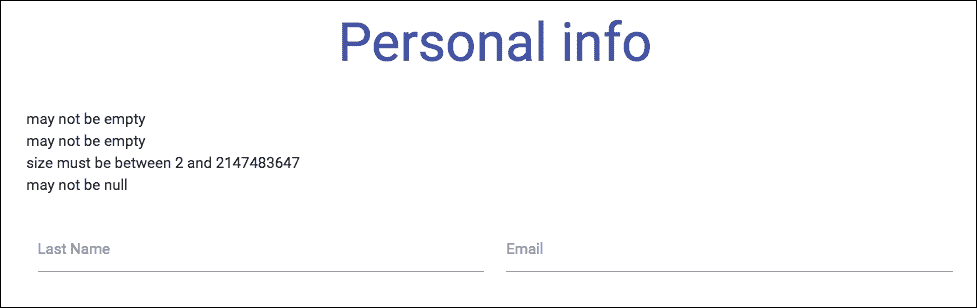

# 第十八章：处理表单和复杂的 URL 映射

我们的应用程序，尽管看起来很漂亮，但会受益于更多关于我们用户的信息。

我们可以要求他们提供他们感兴趣的主题。

在本章中，我们将构建一个个人资料页面。它将具有服务器端和客户端验证以及用于个人资料图片上传的文件上传。我们将保存该信息在用户会话中，并通过将应用程序翻译成多种语言来确保我们的受众尽可能广泛。最后，我们将显示与用户口味匹配的 Twitter 活动摘要。

听起来不错吧？让我们开始吧，我们有一些工作要做。

# 个人资料页面 - 一个表单

表单是每个 Web 应用程序的基石。自互联网诞生以来，它们一直是获取用户输入的主要方式！

我们在这里的第一个任务是创建一个像这样的个人资料页面：


它将允许用户输入一些个人信息以及一系列口味。然后，这些口味将被提供给我们的搜索引擎。

让我们在`templates/profile/profilePage.html`中创建一个新页面：

```java
<!DOCTYPE html>
<html 

      layout:decorator="layout/default">
<head lang="en">
    <title>Your profile</title>
</head>
<body>
<div class="row" layout:fragment="content">

    <h2 class="indigo-text center">Personal info</h2>

    <form th:action="@{/profile}" method="post" class="col m8 s12 offset-m2">

        <div class="row">
            <div class="input-field col s6">
                <input id="twitterHandle" type="text"/>
                <label for="twitterHandle">Last Name</label>
            </div>
            <div class="input-field col s6">
                <input id="email" type="text"/>
                <label for="email">Email</label>
            </div>
        </div>
        <div class="row">
            <div class="input-field col s6">
                <input id="birthDate" type="text"/>
                <label for="birthDate">Birth Date</label>
            </div>
        </div>
        <div class="row s12">
            <button class="btn waves-effect waves-light" type="submit" name="save">Submit
                <i class="mdi-content-send right"></i>
            </button>
        </div>
    </form>
</div>
</body>
</html>
```

请注意`@{}`语法，它将通过将服务器上下文路径（在我们的情况下为`localhost:8080`）前置到其参数来构造资源的完整路径。

我们还将在`profile`包中创建名为`ProfileController`的相关控制器：

```java
package masterspringmvc4.profile;

import org.springframework.stereotype.Controller;
import org.springframework.web.bind.annotation.RequestMapping;

@Controller
public class ProfileController {

    @RequestMapping("/profile")
    public String displayProfile() {
        return "profile/profilePage";
    }
}
```

现在，您可以转到`http://localhost:8080`，看到一个漂亮的表单，什么也不做。这是因为我们没有将任何操作映射到 post URL。

让我们在与我们的控制器相同的包中创建一个**数据传输对象**（**DTO**）。我们将其命名为`ProfileForm`。它的作用将是映射我们的 Web 表单字段并描述验证规则：

```java
package masterSpringMvc.profile;

import java.time.LocalDate;
import java.util.ArrayList;
import java.util.List;

public class ProfileForm {
    private String twitterHandle;
    private String email;
    private LocalDate birthDate;
    private List<String> tastes = new ArrayList<>();

    // getters and setters
}
```

这是一个常规的**普通旧 Java 对象**（**POJO**）。不要忘记生成 getter 和 setter，否则我们的数据绑定将无法正常工作。请注意，我们有一个口味列表，我们现在不会填充，稍后再填充。

由于我们使用的是 Java 8，我们的用户的出生日期将使用新的 Java 日期时间 API（JSR 310）。这个 API 比旧的`java.util.Date` API 要好得多，因为它在人类日期的所有细微差别之间做出了明确的区分，并使用了流畅的 API 和不可变的数据结构。

在我们的示例中，`LocalDate`类是一个简单的没有与之关联的时间的日期。它可以与`LocalTime`类区分开，后者表示一天内的时间，`LocalDateTime`类表示两者，或者`ZonedDateTime`类使用时区。

### 注意

如果您想了解更多关于 Java 8 日期时间 API 的信息，请参考 Oracle 教程，网址为[`docs.oracle.com/javase/tutorial/datetime/TOC.html`](https://docs.oracle.com/javase/tutorial/datetime/TOC.html)。

### 提示

一个好的建议是始终生成我们的数据对象的`toString`方法，就像这个表单一样。这对于调试非常有用。

为了指示 Spring 将我们的字段绑定到此 DTO，我们必须在`profilePage`中添加一些元数据：

```java
<!DOCTYPE html>
<html 

      layout:decorator="layout/default">
<head lang="en">
    <title>Your profile</title>
</head>
<body>
<div class="row" layout:fragment="content">

    <h2 class="indigo-text center">Personal info</h2>

    <form th:action="@{/profile}" th:object="${profileForm}" method="post" class="col m8 s12 offset-m2">

        <div class="row">
            <div class="input-field col s6">
                <input th:field="${profileForm.twitterHandle}" id="twitterHandle" type="text"/>
                <label for="twitterHandle">Last Name</label>
            </div>
            <div class="input-field col s6">
                <input th:field="${profileForm.email}" id="email" type="text"/>
                <label for="email">Email</label>
            </div>
        </div>
        <div class="row">
            <div class="input-field col s6">
                <input th:field="${profileForm.birthDate}" id="birthDate" type="text"/>
                <label for="birthDate">Birth Date</label>
            </div>
        </div>
        <div class="row s12">
            <button class="btn waves-effect waves-light" type="submit" name="save">Submit
                <i class="mdi-content-send right"></i>
            </button>
        </div>
    </form>
</div>
</body>
</html>
```

您会注意到两件事：

+   表单中的`th:object`属性

+   所有字段中的`th:field`属性

第一个将通过其类型将对象绑定到控制器。第二个将将实际字段绑定到我们的表单 bean 属性。

为了使`th:object`字段起作用，我们需要在我们的请求映射方法中添加一个`ProfileForm`类型的参数：

```java
@Controller
public class ProfileController {

    @RequestMapping("/profile")
    public String displayProfile(ProfileForm profileForm) {
        return "profile/profilePage";
    }

    @RequestMapping(value = "/profile", method = RequestMethod.POST)
    public String saveProfile(ProfileForm profileForm) {
        System.out.println("save ok" + profileForm);
        return "redirect:/profile";
    }
}
```

我们还添加了一个`POST`方法的映射，当表单提交时将被调用。此时，如果您尝试使用日期（例如 1980 年 10 月 10 日）提交表单，它将完全不起作用，并且会给您一个 400 错误和没有有用的日志信息。

### 提示

**Spring Boot 中的日志记录**

使用 Spring Boot，日志配置非常简单。只需在`application.properties`文件中添加`logging.level.{package} = DEBUG`，其中`{package}`是应用程序中一个类或包的完全限定名称。当然，您可以将 debug 替换为任何您想要的日志级别。您还可以添加经典的日志配置。有关更多信息，请参阅[`docs.spring.io/spring-boot/docs/current/reference/html/howto-logging.html`](http://docs.spring.io/spring-boot/docs/current/reference/html/howto-logging.html)。

我们需要稍微调试我们的应用程序以了解发生了什么。将此行添加到您的文件`application.properties`中：

```java
logging.level.org.springframework.web=DEBUG
```

`org.springframework.web`包是 Spring MVC 的基本包。这将允许我们查看 Spring web 生成的调试信息。如果您再次提交表单，您将在日志中看到以下错误：

```java
Field error in object 'profileForm' on field 'birthDate': rejected value [10/10/1980]; codes [typeMismatch.profileForm.birthDate,typeMismatch.birthDate,typeMismatch.java.time.LocalDate,typeMismatch]; … nested exception is org.springframework.core.convert.ConversionFailedException: Failed to convert from type java.lang.String to type java.time.LocalDate for value '10/10/1980'; nested exception is java.time.format.DateTimeParseException: Text '10/10/1980' could not be parsed, unparsed text found at index 8]
```

为了了解发生了什么，我们需要查看 Spring 的`DateTimeFormatterRegistrar`类。

在这个类中，您将看到半打 JSR 310 的解析器和打印机。它们都将回退到短格式日期格式，如果您住在美国，则为`MM/dd/yy`，否则为`dd/MM/yy`。

这将指示 Spring Boot 在我们的应用程序启动时创建一个`DateFormatter`类。

在我们的情况下，我们需要做同样的事情，并创建我们自己的格式化程序，因为用两位数写年份有点奇怪。

Spring 中的`Formatter`是一个可以同时`print`和`parse`对象的类。它将用于解码和打印值从和到字符串。

我们将在`date`包中创建一个非常简单的格式化程序，名为`USLocalDateFormatter`：

```java
public class USLocalDateFormatter implements Formatter<LocalDate> {
    public static final String US_PATTERN = "MM/dd/yyyy";
    public static final String NORMAL_PATTERN = "dd/MM/yyyy";

    @Override public LocalDate parse(String text, Locale locale) throws ParseException {
        return LocalDate.parse(text, DateTimeFormatter.ofPattern(getPattern(locale)));
    }

    @Override public String print(LocalDate object, Locale locale) {
        return DateTimeFormatter.ofPattern(getPattern(locale)).format(object);
    }

    public static String getPattern(Locale locale) {
        return isUnitedStates(locale) ? US_PATTERN : NORMAL_PATTERN;
    }

    private static boolean isUnitedStates(Locale locale) {
        return Locale.US.getCountry().equals(locale.getCountry());
    }
}
```

这个小类将允许我们以更常见的格式（年份为四位数）解析日期，根据用户的语言环境。

让我们在`config`包中创建一个名为`WebConfiguration`的新类：

```java
package masterSpringMvc.config;

import masterSpringMvc.dates.USLocalDateFormatter;
import org.springframework.context.annotation.Configuration;
import org.springframework.format.FormatterRegistry;
import org.springframework.web.servlet.config.annotation.WebMvcConfigurerAdapter;

import java.time.LocalDate;

@Configuration
public class WebConfiguration extends WebMvcConfigurerAdapter {

    @Override public void addFormatters(FormatterRegistry registry) {
        registry.addFormatterForFieldType(LocalDate.class, new USLocalDateFormatter());
    }
}
```

这个类扩展了`WebMvcConfigurerAdapter`，这是一个非常方便的类，可以自定义 Spring MVC 配置。它提供了许多常见的扩展点，您可以通过覆盖方法来访问，比如`addFormatters()`方法。

这一次，提交我们的表单不会导致任何错误，除非您没有使用正确的日期格式输入日期。

目前，用户无法看到他们应该输入出生日期的格式，所以让我们将这些信息添加到表单中。

在`ProfileController`中，让我们添加一个`dateFormat`属性：

```java
@ModelAttribute("dateFormat")
public String localeFormat(Locale locale) {
    return USLocalDateFormatter.getPattern(locale);
}
```

`@ModelAttribute`注释将允许我们将属性暴露给网页，就像我们在上一章中看到的`model.addAttribute()`方法一样。

现在，我们可以通过为我们的日期字段添加占位符来在我们的页面中使用这些信息：

```java
<div class="row">
    <div class="input-field col s6">
        <input th:field="${profileForm.birthDate}" id="birthDate" type="text" th:placeholder="${dateFormat}"/>
        <label for="birthDate">Birth Date</label>
    </div>
</div>
```

这些信息现在将显示给用户：


# 验证

我们不希望用户输入无效或空信息，这就是为什么我们需要向我们的`ProfileForm`添加一些验证逻辑。

```java
package masterspringmvc4.profile;

import org.hibernate.validator.constraints.Email;
import org.hibernate.validator.constraints.NotEmpty;

import javax.validation.constraints.NotNull;
import javax.validation.constraints.Past;
import javax.validation.constraints.Size;
import java.util.ArrayList;
import java.util.Date;
import java.util.List;

public class ProfileForm {
    @Size(min = 2)
    private String twitterHandle;

    @Email
    @NotEmpty
    private String email;

   @NotNull
    private Date birthDate;

    @NotEmpty
    private List<String> tastes = new ArrayList<>();
}
```

如您所见，我们添加了一些验证约束。这些注释来自 JSR-303 规范，该规范指定了 bean 验证。这个规范最流行的实现是`hibernate-validator`，它包含在 Spring Boot 中。

您可以看到，我们使用来自`javax.validation.constraints`包（在 API 中定义）的注释和一些来自`org.hibernate.validator.constraints`包（附加约束）的注释。两者都有效，我鼓励您查看这些包中在`validation-api`和`hibernate-validator`中可用的内容。

您还可以在[`docs.jboss.org/hibernate/stable/validator/reference/en-US/html_single/#section-builtin-constraints`](http://docs.jboss.org/hibernate/stable/validator/reference/en-US/html_single/#section-builtin-constraints)的文档中查看 hibernate 验证器中可用的约束。

我们需要添加一些其他内容才能使验证工作。首先，控制器需要声明它希望在表单提交时获得一个有效的模型。通过向表示表单的参数添加`javax.validation.Valid`注释来实现这一点：

```java
@RequestMapping(value = "/profile", method = RequestMethod.POST)
public String saveProfile(@Valid ProfileForm profileForm, BindingResult bindingResult) {
    if (bindingResult.hasErrors()) {
        return "profile/profilePage";
    }

    System.out.println("save ok" + profileForm);
    return "redirect:/profile";
}
```

请注意，如果表单包含任何错误，我们不会重定向用户。这将允许我们在同一网页上显示它们。

说到这一点，我们需要在网页上添加一个地方来显示这些错误。

在`profilePage.html`的表单标签的开头添加以下行：

```java
<ul th:if="${#fields.hasErrors('*')}" class="errorlist">
    <li th:each="err : ${#fields.errors('*')}" th:text="${err}">Input is incorrect</li>
</ul>
```

这将遍历表单中发现的每个错误，并在列表中显示它们。如果您尝试提交空表单，您将看到一堆错误：



请注意，对于口味的`@NotEmpty`检查将阻止表单被提交。事实上，我们还没有提供一种方法来提供它们。

## 自定义验证消息

这些错误消息对我们的用户来说还不是很有用。我们需要做的第一件事是将它们正确地与它们各自的字段关联起来。让我们修改`profilePage.html`：

```java
<!DOCTYPE html>
<html 

      layout:decorator="layout/default">
<head lang="en">
    <title>Your Profile</title>
</head>
<body>
<div class="row" layout:fragment="content">

    <h2 class="indigo-text center">Personal info</h2>

    <form th:action="@{/profile}" th:object="${profileForm}" method="post" class="col m8 s12 offset-m2">

        <div class="row">
            <div class="input-field col s6">
                <input th:field="${profileForm.twitterHandle}" id="twitterHandle" type="text" th:errorclass="invalid"/>
                <label for="twitterHandle">Twitter handle</label>

                <div th:errors="*{twitterHandle}" class="red-text">Error</div>
            </div>
            <div class="input-field col s6">
                <input th:field="${profileForm.email}" id="email" type="text" th:errorclass="invalid"/>
                <label for="email">Email</label>

                <div th:errors="*{email}" class="red-text">Error</div>
            </div>
        </div>
        <div class="row">
            <div class="input-field col s6">
                <input th:field="${profileForm.birthDate}" id="birthDate" type="text" th:errorclass="invalid" th:placeholder="${dateFormat}"/>
                <label for="birthDate">Birth Date</label>

                <div th:errors="*{birthDate}" class="red-text">Error</div>
            </div>
        </div>
        <div class="row s12">
            <button class="btn indigo waves-effect waves-light" type="submit" name="save">Submit
                <i class="mdi-content-send right"></i>
            </button>
        </div>
    </form>
</div>
</body>
</html>
```

您会注意到我们在表单中的每个字段下面添加了一个`th:errors`标签。我们还为每个字段添加了一个`th:errorclass`标签。如果字段包含错误，则相关的 css 类将添加到 DOM 中。

验证看起来已经好多了：

自定义验证消息

我们需要做的下一件事是自定义错误消息，以更好地反映我们应用程序的业务规则。

记住，Spring Boot 会为我们创建一个消息源 bean？这个消息源的默认位置在`src/main/resources/messages.properties`中。

让我们创建这样一个包，并添加以下文本：

```java
Size.profileForm.twitterHandle=Please type in your twitter user name
Email.profileForm.email=Please specify a valid email address
NotEmpty.profileForm.email=Please specify your email address
PastLocalDate.profileForm.birthDate=Please specify a real birth date
NotNull.profileForm.birthDate=Please specify your birth date

typeMismatch.birthDate = Invalid birth date format.
```

### 提示

在开发中，将消息源配置为始终重新加载我们的包可能非常方便。在`application.properties`中添加以下属性：

`spring.messages.cache-seconds=0`

0 表示始终重新加载，而-1 表示永不重新加载。

在 Spring 中负责解析错误消息的类是`DefaultMessageCodesResolver`。在字段验证的情况下，该类尝试按照给定的顺序解析以下消息：

+   代码+“。”+对象名称+“。”+字段

+   代码+“。”+字段

+   代码+“。”+字段类型

+   代码

在前面的规则中，代码部分可以是两种情况：注释类型，如`Size`或`Email`，或异常代码，如`typeMismatch`。还记得我们因日期格式不正确而引发异常吗？相关的错误代码确实是`typeMismatch`。

在前面的消息中，我们选择了非常具体的方式。一个好的做法是定义默认消息如下：

```java
Size=the {0} field must be between {2} and {1} characters long
typeMismatch.java.util.Date = Invalid date format.
```

注意占位符；每个验证错误都有与之关联的一些参数。

声明错误消息的最后一种方式将涉及直接在验证注释中定义错误消息，如下所示：

```java
@Size(min = 2, message = "Please specify a valid twitter handle")
private String twitterHandle;
```

然而，这种方法的缺点是它与国际化不兼容。

## 自定义验证的自定义注释

对于 Java 日期，有一个名为`@Past`的注释，它确保日期是过去的日期。

我们不希望我们的用户假装他们来自未来，所以我们需要验证出生日期。为此，我们将在`date`包中定义我们自己的注释：

```java
package masterSpringMvc.date;

import javax.validation.Constraint;
import javax.validation.ConstraintValidator;
import javax.validation.ConstraintValidatorContext;
import javax.validation.Payload;
import java.lang.annotation.*;
import java.time.LocalDate;

@Target({ElementType.FIELD})
@Retention(RetentionPolicy.RUNTIME)
@Constraint(validatedBy = PastLocalDate.PastValidator.class)
@Documented
public @interface PastLocalDate {
    String message() default "{javax.validation.constraints.Past.message}";

    Class<?>[] groups() default {};

    Class<? extends Payload>[] payload() default {};

    class PastValidator implements ConstraintValidator<PastLocalDate, LocalDate> {
        public void initialize(PastLocalDate past) {
        }

        public boolean isValid(LocalDate localDate, ConstraintValidatorContext context) {
            return localDate == null || localDate.isBefore(LocalDate.now());
        }
    }
}
```

简单吧？这段代码将验证我们的日期确实是过去的日期。

现在我们可以将其添加到个人资料表单中的`birthDate`字段中：

```java
@NotNull
@PastLocalDate
private LocalDate birthDate;
```

# 国际化

国际化，通常缩写为 i18n，是设计可以翻译成各种语言的应用程序的过程。

通常，这涉及将翻译放在名称后缀为目标区域设置的属性包中，例如，`messages_en.properties`，`messages_en_US.properties`和`messages_fr.properties`文件。

正确的属性包是通过首先尝试最具体的区域设置，然后回退到不太具体的区域设置来解析的。

对于美国英语，如果尝试从名为`x`的包中获取翻译，应用程序首先会查找`x_en_US.properties`文件，然后是`x_en.properties`文件，最后是`x.properties`文件。

我们要做的第一件事是将我们的错误消息翻译成法语。为此，我们将现有的`messages.properties`文件重命名为`messages_en.properties`。

我们还将创建一个名为`messages_fr.properties`的第二个包：

```java
Size.profileForm.twitterHandle=Veuillez entrer votre identifiant Twitter
Email.profileForm.email=Veuillez spécifier une adresse mail valide
NotEmpty.profileForm.email=Veuillez spécifier votre adresse mail
PastLocalDate.profileForm.birthDate=Veuillez donner votre vraie date de naissance
NotNull.profileForm.birthDate=Veuillez spécifier votre date de naissance

typeMismatch.birthDate = Date de naissance invalide.
```

默认情况下，Spring Boot 使用固定的`LocaleResolver`接口。`LocaleResolver`是一个简单的接口，有两个方法：

```java
public interface LocaleResolver {

    Locale resolveLocale(HttpServletRequest request);

    void setLocale(HttpServletRequest request, HttpServletResponse response, Locale locale);
}
```

Spring 提供了一堆这个接口的实现，比如`FixedLocaleResolver`。这个本地解析器非常简单；我们可以通过属性配置应用程序的区域设置，一旦定义就无法更改。要配置我们应用程序的区域设置，让我们在`application.properties`文件中添加以下属性：

```java
spring.mvc.locale=fr
```

这将在法语中添加我们的验证消息。

如果我们看一下 Spring MVC 中捆绑的不同`LocaleResolver`接口，我们会看到以下内容：

+   `FixedLocaleResolver`：这会固定在配置中定义的区域设置。一旦固定，就无法更改。

+   `CookieLocaleResolver`：这允许从 cookie 中检索和保存区域设置。

+   `AcceptHeaderLocaleResolver`：这使用用户浏览器发送的 HTTP 标头来查找区域设置。

+   `SessionLocaleResolver`：这在 HTTP 会话中查找并存储区域设置。

这些实现涵盖了许多用例，但在更复杂的应用程序中，可以直接实现`LocaleResolver`以允许更复杂的逻辑，例如从数据库获取区域设置并回退到浏览器区域设置。

## 更改区域设置

在我们的应用程序中，区域设置与用户相关联。我们将在会话中保存他们的个人资料。

我们将允许用户使用一个小菜单更改站点的语言。这就是为什么我们将使用`SessionLocaleResolver`。让我们再次编辑`WebConfiguration`：

```java
package masterSpringMvc.config;

import masterSpringMvc.date.USLocalDateFormatter;
import org.springframework.context.annotation.Bean;
import org.springframework.context.annotation.Configuration;
import org.springframework.format.FormatterRegistry;
import org.springframework.web.servlet.LocaleResolver;
import org.springframework.web.servlet.config.annotation.InterceptorRegistry;
import org.springframework.web.servlet.config.annotation.WebMvcConfigurerAdapter;
import org.springframework.web.servlet.i18n.LocaleChangeInterceptor;
import org.springframework.web.servlet.i18n.SessionLocaleResolver;

import java.time.LocalDate;

@Configuration
public class WebConfiguration extends WebMvcConfigurerAdapter {

    @Override
    public void addFormatters(FormatterRegistry registry) {
        registry.addFormatterForFieldType(LocalDate.class, new USLocalDateFormatter());
    }

    @Bean
    public LocaleResolver localeResolver() {
        return new SessionLocaleResolver();
    }

    @Bean
    public LocaleChangeInterceptor localeChangeInterceptor() {
        LocaleChangeInterceptor localeChangeInterceptor = new LocaleChangeInterceptor();
        localeChangeInterceptor.setParamName("lang");
        return localeChangeInterceptor;
    }

    @Override
    public void addInterceptors(InterceptorRegistry registry) {
        registry.addInterceptor(localeChangeInterceptor());
    }
}
```

我们声明了一个`LocaleChangeInterceptor` bean 作为 Spring MVC 拦截器。它将拦截对`Controller`的任何请求，并检查`lang`查询参数。例如，导航到`http://localhost:8080/profile?lang=fr`将导致区域设置更改。

### 提示

**Spring MVC 拦截器**可以与 Web 应用程序中的 Servlet 过滤器进行比较。拦截器允许自定义预处理，跳过处理程序的执行以及自定义后处理。过滤器更强大，例如，它们允许交换传递给链的请求和响应对象。过滤器在`web.xml`文件中配置，而拦截器在应用程序上下文中声明为 bean。

现在，我们可以通过输入正确的 URL 来更改区域设置，但最好是添加一个导航栏，允许用户更改语言。我们将修改默认布局（`templates/layout/default.html`）以添加一个下拉菜单：

```java
<!DOCTYPE html>
<html 
      >
<head>
    <meta http-equiv="Content-Type" content="text/html; charset=UTF-8"/>
    <meta name="viewport" content="width=device-width, initial-scale=1, maximum-scale=1.0, user-scalable=no"/>
    <title>Default title</title>

    <link href="/webjars/materializecss/0.96.0/css/materialize.css" type="text/css" rel="stylesheet" media="screen,projection"/>
</head>
<body>

<ul id="lang-dropdown" class="dropdown-content">
    <li><a href="?lang=en_US">English</a></li>
    <li><a href="?lang=fr">French</a></li>
</ul>
<nav>
    <div class="nav-wrapper indigo">
        <ul class="right">
            <li><a class="dropdown-button" href="#!" data-activates="lang-dropdown"><i class="mdi-action-language right"></i> Lang</a></li>
        </ul>
    </div>
</nav>

<section layout:fragment="content">
    <p>Page content goes here</p>
</section>

<script src="img/jquery.js"></script>
<script src="img/materialize.js"></script>
<script type="text/javascript">
    $(".dropdown-button").dropdown();
</script>
</body>
</html>
```

这将允许用户在两种支持的语言之间进行选择。


## 翻译应用程序文本

为了使我们的应用程序完全支持双语，我们需要做的最后一件事是翻译应用程序的标题和标签。为此，我们将编辑我们的网页并使用`th:text`属性，例如在`profilePage.html`中：

```java
<!DOCTYPE html>
<html 

      layout:decorator="layout/default">
<head lang="en">
    <title>Your profile</title>
</head>
<body>
<div class="row" layout:fragment="content">

    <h2 class="indigo-text center" th:text="#{profile.title}">Personal info</h2>

    <form th:action="@{/profile}" th:object="${profileForm}" method="post" class="col m8 s12 offset-m2">

        <div class="row">
            <div class="input-field col s6">
                <input th:field="${profileForm.twitterHandle}" id="twitterHandle" type="text" th:errorclass="invalid"/>
                <label for="twitterHandle" th:text="#{twitter.handle}">Twitter handle</label>

                <div th:errors="*{twitterHandle}" class="red-text">Error</div>
            </div>
            <div class="input-field col s6">
                <input th:field="${profileForm.email}" id="email" type="text" th:errorclass="invalid"/>
                <label for="email" th:text="#{email}">Email</label>

                <div th:errors="*{email}" class="red-text">Error</div>
            </div>
        </div>
        <div class="row">
            <div class="input-field col s6">
                <input th:field="${profileForm.birthDate}" id="birthDate" type="text" th:errorclass="invalid"/>
                <label for="birthDate" th:text="#{birthdate}" th:placeholder="${dateFormat}">Birth Date</label>

                <div th:errors="*{birthDate}" class="red-text">Error</div>
            </div>
        </div>
        <div class="row s12 center">
            <button class="btn indigo waves-effect waves-light" type="submit" name="save" th:text="#{submit}">Submit
                <i class="mdi-content-send right"></i>
            </button>
        </div>
    </form>
</div>
</body>
</html>
```

`th:text`属性将使用表达式替换 HTML 元素的内容。在这里，我们使用`#{}`语法，表示我们要显示来自属性源（如`messages.properties`）的消息。

让我们向我们的英语包中添加相应的翻译：

```java
NotEmpty.profileForm.tastes=Please enter at least one thing
profile.title=Your profile
twitter.handle=Twitter handle
email=Email
birthdate=Birth Date
tastes.legend=What do you like?
remove=Remove
taste.placeholder=Enter a keyword
add.taste=Add taste
submit=Submit
```

现在是法语的：

```java
NotEmpty.profileForm.tastes=Veuillez saisir au moins une chose
profile.title=Votre profil
twitter.handle=Pseudo twitter
email=Email
birthdate=Date de naissance
tastes.legend=Quels sont vos goûts ?
remove=Supprimer
taste.placeholder=Entrez un mot-clé
add.taste=Ajouter un centre d'intérêt
submit=Envoyer
```

一些翻译尚未使用，但很快就会用到。Et voilà！法国市场已经准备好迎接 Twitter 搜索风暴。

## 表单中的列表

现在，我们希望用户输入一个“品味”列表，实际上是一个我们将用于搜索推文的关键字列表。

将显示一个按钮，允许用户输入新关键字并将其添加到列表中。该列表的每个项目将是可编辑的输入文本，并且可以通过删除按钮进行删除：


在表单中处理列表数据可能是一项繁琐的工作，但是使用 Spring MVC 和 Thymeleaf 相对来说比较简单，只要你理解了原则。

在`profilePage.html`文件中添加以下行，就在包含出生日期的行下方，正好在提交按钮上方：

```java
<fieldset class="row">
    <legend th:text="#{tastes.legend}">What do you like?</legend>
    <button class="btn teal" type="submit" name="addTaste" th:text="#{add.taste}">Add taste
        <i class="mdi-content-add left"></i>
    </button>

    <div th:errors="*{tastes}" class="red-text">Error</div>

    <div class="row" th:each="row,rowStat : *{tastes}">
        <div class="col s6">
            <input type="text" th:field="*{tastes[__${rowStat.index}__]}" th:placeholder="#{taste.placeholder}"/>
        </div>

        <div class="col s6">
            <button class="btn red" type="submit" name="removeTaste" th:value="${rowStat.index}" th:text="#{remove}">Remove
                <i class="mdi-action-delete right waves-effect"></i>
            </button>
        </div>
    </div>
</fieldset>
```

此片段的目的是对我们的`LoginForm`的`tastes`变量进行迭代。这可以通过`th:each`属性实现，它看起来很像 Java 中的`for…in`循环。

与我们之前看到的搜索结果循环相比，迭代存储在两个变量中而不是一个。第一个变量实际上将包含数据的每一行。`rowStat`变量将包含有关迭代当前状态的附加信息。

新代码片段中最奇怪的事情是：

```java
th:field="*{tastes[__${rowStat.index}__]}"
```

这是一个相当复杂的语法。你可以自己想出一些更简单的东西，比如：

```java
th:field="*{tastes[rowStat.index]}"
```

好吧，那行不通。`${rowStat.index}`变量代表迭代循环的当前索引，需要在表达式的其余部分之前进行评估。为了实现这一点，我们需要使用预处理。

双下划线包围的表达式将被预处理，这意味着它将在正常处理阶段之前进行处理，允许它被评估两次。

现在我们的表单上有两个新的提交按钮。它们都有一个名称。我们之前有的全局提交按钮称为`save`。两个新按钮分别称为`addTaste`和`removeTaste`。

在控制器端，这将使我们能够轻松区分来自我们表单的不同操作。让我们在`ProfileController`中添加两个新的操作：

```java
@Controller
public class ProfileController {

    @ModelAttribute("dateFormat")
    public String localeFormat(Locale locale) {
        return USLocalDateFormatter.getPattern(locale);
    }

    @RequestMapping("/profile")
    public String displayProfile(ProfileForm profileForm) {
        return "profile/profilePage";
    }

    @RequestMapping(value = "/profile", params = {"save"}, method = RequestMethod.POST)
    public String saveProfile(@Valid ProfileForm profileForm, BindingResult bindingResult) {
        if (bindingResult.hasErrors()) {
            return "profile/profilePage";
        }
        System.out.println("save ok" + profileForm);
        return "redirect:/profile";
    }

    @RequestMapping(value = "/profile", params = {"addTaste"})
    public String addRow(ProfileForm profileForm) {
        profileForm.getTastes().add(null);
        return "profile/profilePage";
    }

    @RequestMapping(value = "/profile", params = {"removeTaste"})
    public String removeRow(ProfileForm profileForm, HttpServletRequest req) {
        Integer rowId = Integer.valueOf(req.getParameter("removeTaste"));
        profileForm.getTastes().remove(rowId.intValue());
        return "profile/profilePage";
    }
}
```

我们为每个提交操作添加了一个`param`参数以加以区分。我们之前使用的那个现在绑定到`save`参数。

当我们单击按钮时，其名称将自动添加到浏览器发送的表单数据中。请注意，我们在删除按钮中指定了一个特定值：`th:value="${rowStat.index}"`。该属性将指示相关参数应具体采用哪个值。如果不存在此属性，将发送空值。这意味着当我们单击删除按钮时，将向`POST`请求添加一个`removeTaste`参数，其中包含我们想要删除的行的索引。然后我们可以在`Controller`中使用以下代码获取它：

```java
Integer rowId = Integer.valueOf(req.getParameter("removeTaste"));
```

这种方法的唯一缺点是每次单击按钮时都会发送整个表单数据，即使并不严格需要。我们的表单足够小，因此可以接受这种折衷方案。

就是这样！表单现在已经完成，可以添加一个或多个口味。

# 客户端验证

作为额外的奖励，客户端验证现在变得非常容易，因为 HTML5 表单验证规范。如果你的目标浏览器是 Internet Explorer 10 及以上版本，添加客户端验证就像指定正确的输入类型一样容易，而不仅仅是使用文本。

通过添加客户端验证，我们可以预先验证表单，并避免向服务器发送我们知道是不正确的请求。有关客户端验证规范的更多信息，请访问[`caniuse.com/#search=validation`](http://caniuse.com/#search=validation)。

我们可以修改我们的输入以启用简单的客户端验证。之前的输入，如下面的代码所示：

```java
<input th:field="${profileForm.twitterHandle}" id="twitterHandle" type="text" th:errorclass="invalid"/>
<input th:field="${profileForm.email}" id="email" type="text" th:errorclass="invalid"/>
<input th:field="${profileForm.birthDate}" id="birthDate" type="text" th:errorclass="invalid"/>
<input type="text" th:field="*{tastes[__${rowStat.index}__]}" th:placeholder="#{taste.placeholder}"/>
```

变成了：

```java
<input th:field="${profileForm.twitterHandle}" id="twitterHandle" type="text" required="required" th:errorclass="invalid"/>
<input th:field="${profileForm.email}" id="email" type="email" required="required" th:errorclass="invalid"/>
<input th:field="${profileForm.birthDate}" id="birthDate" type="text" required="required" th:errorclass="invalid"/>
<input type="text" required="required" th:field="*{tastes[__${rowStat.index}__]}" th:placeholder="#{taste.placeholder}"/>
```

通过这种方法，您的浏览器将在提交表单时检测并根据其类型验证每个属性。`required`属性强制用户输入非空值。`email`类型对相应字段强制执行基本的电子邮件验证规则。


还有其他类型的验证器。请查看[`www.the-art-of-web.com/html/html5-form-validation`](http://www.the-art-of-web.com/html/html5-form-validation)。

这种方法的缺点是我们的添加口味和删除口味按钮现在会触发验证。为了解决这个问题，我们需要在默认布局的底部包含一个脚本，就在 jQuery 声明之后。

然而，最好只在个人资料页面上包含它。为了做到这一点，我们可以在`layout/default.html`页面中，在 body 标签结束之前添加一个新的片段部分：

```java
<script type="text/javascript" layout:fragment="script">
</script>
```

这将允许我们在需要时在每个页面上包含额外的脚本。

现在，我们可以在个人资料页面中添加以下脚本，就在关闭 body 标签之前：

```java
<script layout:fragment="script">
    $('button').bind('click', function(e) {
        if (e.currentTarget.name === 'save') {
            $(e.currentTarget.form).removeAttr('novalidate');
        } else {
            $(e.currentTarget.form).attr('novalidate', 'novalidate');
        }
    });
</script>
```

当表单上存在`novalidate`属性时，表单验证不会被触发。这个小脚本将动态地移除`novalidate`属性，如果表单的操作名称是`save`，如果输入的名称不同，`novalidate`属性将始终被添加。因此，验证只会被保存按钮触发。

# 检查点

在进入下一章之前，让我们检查一下是否一切就绪。

在 Java 源代码中，你应该有以下内容：

+   一个新的控制器，`ProfileController`

+   与日期相关的两个新类：日期格式化程序和验证`LocalDate`的注释

+   一个新的`WebConfiguration`文件夹来自定义 Spring MVC 的配置


在资源中，你应该有一个新的模板在 profile 目录下和两个新的包：


# 摘要

在本章中，您学会了如何制作一个完整的表单。我们使用 Java 8 日期创建了一个模型，并学会了如何格式化来自用户的信息并相应地显示它。

我们确保表单填写了有效的信息，包括我们自己的验证器注解。此外，我们通过包括一些客户端验证非常容易地阻止明显不正确的信息甚至触及服务器。

最后，我们甚至将整个应用程序翻译成了英语和法语，包括日期格式！

在下一章中，我们将建立一个空间，用户将能够上传他们的图片，并了解更多关于 Spring MVC 应用程序中的错误处理。

