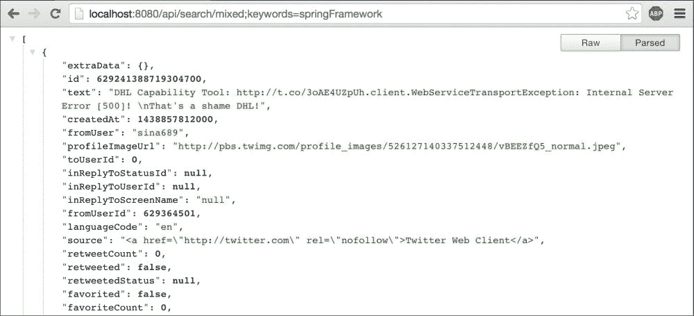
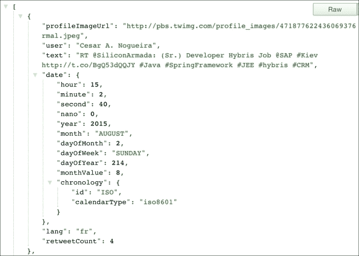
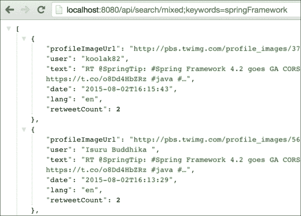
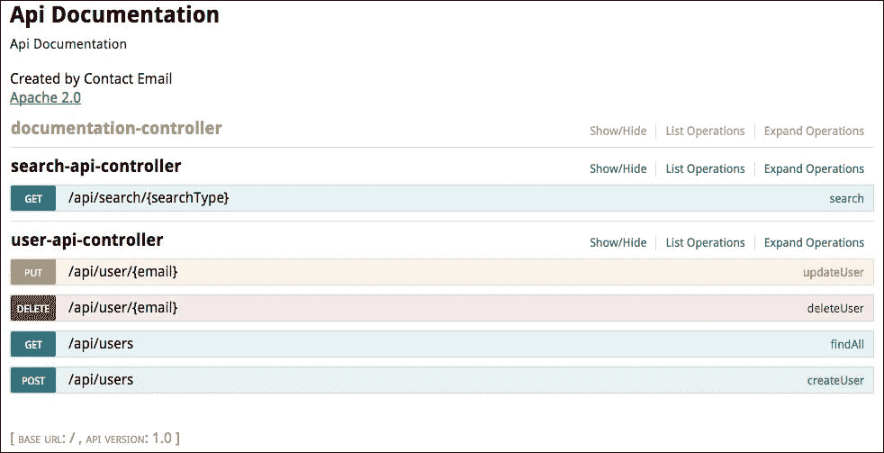
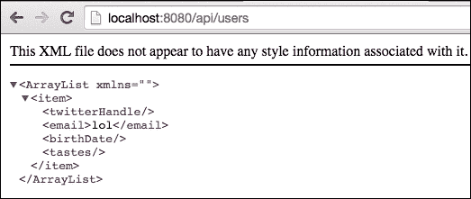
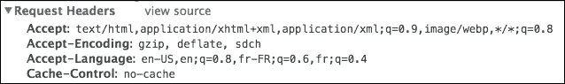
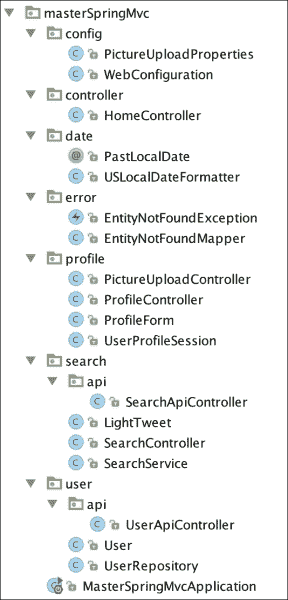

# 第二十章：打造 RESTful 应用程序

在本章中，我们将介绍 RESTful 架构的主要原则。然后，借助非常方便的工具，我们将设计一个友好的 API，利用 Jackson 的能力将我们的模型序列化为 JSON。

我们将使用适当的错误代码和 HTTP 动词记录我们的应用程序，并使用 Swagger UI 自动生成我们应用程序的整洁前端。

最后，我们将研究其他形式的序列化，并了解更多关于 Spring MVC 的内容协商机制。

# 什么是 REST？

**REST**（表述状态转移）是一种定义创建可扩展 Web 服务的最佳实践的架构风格，利用了 HTTP 协议的能力。

一个 RESTful 的 Web 服务应该自然地表现出以下特性：

+   **客户端-服务器**: UI 与数据存储分离

+   **无状态**: 每个请求都包含足够的信息，以便服务器在不维护任何状态的情况下运行

+   **可缓存**: 服务器的响应包含足够的信息，允许客户端对数据存储做出明智的决定

+   **统一接口**: URI 唯一标识资源，超链接允许发现 API

+   **分层**: API 的每个资源提供了合理的细节水平

这种架构的优势在于它易于维护和发现。它还具有良好的可扩展性，因为无需在服务器和客户端之间维护持久连接，这消除了负载平衡或粘性会话的需要。最后，服务更有效，因为信息布局整齐，易于缓存。

让我们看看如何通过使用 Richardson 的成熟度模型逐步设计更好的 API。

# Richardson 的成熟度模型

Leonard Richardson 因定义了从 0 到 3 的四个级别而闻名，描述了 Web API 的“RESTfulness”级别。每个级别都需要额外的工作和投资在 API 中，但也提供了额外的好处。

## 级别 0 – HTTP

级别 0 真的很容易达到；你只需要通过 HTTP 协议在网络上提供你的资源。你可以使用你认为最适合你的用例的任何数据表示（XML、JSON 等）。

## 级别 1 – 资源

大多数人在听到 REST 这个词时会想到资源。资源是我们模型中元素的唯一标识符，例如用户或推文。使用 HTTP，资源显然与统一资源标识符 URI 相关联，如下例所示：

+   `/users` 包含我们所有用户的列表

+   `/user/42` 包含特定用户

+   `/user/42/tweets` 包含与特定用户关联的所有推文的列表

也许你的 API 可以允许访问与用户相关的特定推文，使用`/user/42/tweet/3`，或者每条推文都有唯一标识，这种情况下你可能更喜欢`/tweet/3`。

这个级别的目标是通过公开多个专门的资源来处理应用程序的复杂性。

关于服务器可以返回的响应类型没有规则。当你列出所有资源时，你可能只想包含稀缺信息，并在请求特定资源时提供更多细节。一些 API 甚至允许你在提供给你之前列出你感兴趣的字段。

真的取决于你来定义 API 的形式，记住一个简单的规则：最少惊讶原则。给你的用户他们期望的东西，你的 API 就已经很好了。

## 级别 2 – HTTP 动词

这个级别是关于使用 HTTP 动词来识别资源上可能的操作。这是描述 API 可以做什么的一个非常好的方式，因为 HTTP 动词是开发人员之间的一个众所周知的标准。

主要动词列在这里：

+   `GET`: 这读取特定 URI 上的数据。

+   `HEAD`：这与`GET`相同，但没有响应主体。这对于获取资源的元数据（缓存信息等）很有用。

+   `DELETE`：这会删除一个资源。

+   `PUT`：这会更新或创建一个资源。

+   `POST`：这会更新或创建一个资源。

+   `PATCH`：这会部分更新一个资源。

+   `OPTIONS`：这会返回服务器在特定资源上支持的方法列表。

大多数允许**创建读取更新删除**（**CRUD**）操作的应用只需要三个动词：`GET`、`DELETE`和`POST`。你实现的动词越多，你的 API 就会变得越丰富和更有语义。它帮助第三方通过允许他们输入一些命令并查看发生了什么来与你的服务交互。

`OPTIONS`和`HEAD`动词很少见，因为它们在元数据级别上工作，通常对任何应用程序都不是至关重要的。

乍一看，`PUT`和`POST`动词似乎做着相同的事情。主要区别在于`PUT`动词被认为是幂等的，这意味着多次发送相同的请求应该导致相同的服务器状态。这条规则的含义基本上是，`PUT`动词应该在给定的 URI 上操作，并包含足够的信息使请求成功。

例如，客户端可以在`/user/42`上使用`PUT`数据，结果将是更新或创建，取决于请求之前实体是否存在。

另一方面，当你不确定应该写入什么 URI 时，应该使用`POST`。你可以发送`POST`到`/users`而不在请求中指定 ID，并期望用户被创建。你也可以发送`POST`到相同的`/users`资源，这次在请求实体中指定一个用户 ID，并期望服务器更新相应的用户。

正如你所看到的，这两个选项都有效。一个常见的用例是使用`POST`进行创建（因为大多数情况下，服务器应该负责 ID），并使用`PUT`来更新已知 ID 的资源。

服务器也可能允许部分修改资源（而不需要客户端发送完整的资源内容）。在这种情况下，它应该响应`PATCH`方法。

在这个级别上，我也鼓励你在提供响应时使用有意义的 HTTP 代码。我们马上会看到最常见的代码。

## Level 3 - 超媒体控制

超媒体控制也被称为**超文本作为应用状态的引擎**（**HATEOAS**）。在这个生僻的首字母缩略词背后，隐藏着 RESTful 服务最重要的特性：通过超文本链接使其可发现。这本质上是服务器告诉客户端它的选项是什么，使用响应头或响应实体。

例如，在使用`PUT`创建资源后，服务器应该返回一个带有`201 CREATED`代码的响应，并发送一个包含创建的资源 URI 的`Location`头。

没有一个标准定义了 API 其他部分的链接应该是什么样子。Spring Data REST，一个允许你使用最少的配置创建 RESTful 后端的 Spring 项目，通常会输出这样：

```java

{
 "_links" : {
 "people" : {
 "href" : "http://localhost:8080/users{?page,size,sort}",
 "templated" : true
 }
 }
}

```

然后，去`/users`：

```java

{
 "_links" : {
 "self" : {
 "href" : "http://localhost:8080/users{?page,size,sort}",
 "templated" : true
 },
 "search" : {
 "href" : "http://localhost:8080/users/search"
 }
 },
 "page" : {
 "size" : 20,
 "totalElements" : 0,
 "totalPages" : 0,
 "number" : 0
 }
}

```

这给了你一个关于你可以用 API 做什么的好主意，不是吗？

# API 版本控制

如果第三方客户端使用你的 API，你可以考虑对 API 进行版本控制，以避免在更新应用程序时出现破坏性变化。

对 API 进行版本控制通常是提供一组稳定资源在子域下可用的问题。例如，GitLab 维护其 API 的三个版本。它们可以在`https://example/api/v3`下访问，等等。像软件中的许多架构决策一样，版本控制是一种权衡。

设计这样的 API 并识别 API 中的破坏性变化将需要更多的工作。通常情况下，添加新字段不会像移除或转换 API 实体结果或请求那样成为问题。

大多数情况下，您将负责 API 和客户端，因此不需要这样的复杂性。

### 注意

有关 API 版本控制的更深入讨论，请参阅此博客文章：

[`www.troyhunt.com/2014/02/your-api-versioning-is-wrong-which-is.html`](http://www.troyhunt.com/2014/02/your-api-versioning-is-wrong-which-is.html)

# 有用的 HTTP 代码

良好的 RESTful API 的另一个重要方面是以明智的方式使用 HTTP 代码。HTTP 规范定义了许多标准代码。它们应该涵盖良好 API 需要向其用户传达的 99%内容。以下列表包含最重要的代码，每个 API 都应该使用并且每个开发人员都应该知道：

| 代码 | 意义 | 用法 |
| --- | --- | --- |
| **2xx - 成功** | **当一切顺利时使用这些代码。** |   |
| `200` | 一切正常。 | 请求成功。 |
| `201` | 已创建资源 | 资源已成功创建。响应应包括与创建相关联的位置列表。 |
| `204` | 没有内容可返回。 | 服务器已成功处理请求，但没有内容可返回。 |
| **3xx - 重定向** | **当客户端需要进一步操作以满足请求时使用这些代码**。 |   |
| `301` | 永久移动 | 资源的 URI 已更改，并且其新位置在`Location`标头中指示。 |
| `304` | 资源未被修改。 | 资源自上次以来未发生更改。此响应必须包括日期、ETag 和缓存信息。 |
| **4xx - 客户端错误** | **由于客户端的错误而导致请求未成功执行**。 |   |
| `400` | 错误的请求 | 服务器无法理解客户端发送的数据。 |
| `403` | 禁止 | 请求已理解但不允许。这可以丰富错误描述信息。 |
| `404` | 未找到 | 没有与此 URI 匹配的内容。这可以用来替代 403，如果不应该透露有关安全性的信息。 |
| `409` | 冲突 | 请求与另一个修改冲突。响应应包括有关如何解决冲突的信息。 |
| **5xx - 服务器错误** | **服务器端发生错误**。 |   |
| `500` | 内部服务器错误 | 服务器意外地未能处理请求。 |

### 注意

有关更详细的列表，请参阅[`www.restapitutorial.com/httpstatuscodes.html`](http://www.restapitutorial.com/httpstatuscodes.html)。

# 客户是王者

我们将允许第三方客户端通过 REST API 检索搜索结果。这些结果将以 JSON 或 XML 的形式提供。

我们希望处理`/api/search/mixed;keywords=springFramework`形式的请求。这与我们已经创建的搜索表单非常相似，只是请求路径以`api`开头。在此命名空间中找到的每个 URI 都应返回二进制结果。

让我们在`search.api`包中创建一个新的`SearchApiController`类：

```java
package masterSpringMvc.search.api;

import masterSpringMvc.search.SearchService;
import org.springframework.beans.factory.annotation.Autowired;
import org.springframework.social.twitter.api.Tweet;
import org.springframework.web.bind.annotation.*;

import java.util.List;

@RestController
@RequestMapping("/api/search")
public class SearchApiController {
    private SearchService searchService;

    @Autowired
    public SearchApiController(SearchService searchService) {
        this.searchService = searchService;
    }

    @RequestMapping(value = "/{searchType}", method = RequestMethod.GET)
    public List<Tweet> search(@PathVariable String searchType, @MatrixVariable List<String> keywords) {
        return searchService.search(searchType, keywords);
    }
}
```

这与我们以前的控制器非常相似，有三个细微的差异：

+   控制器类使用`@RequestMapping`注解。这将是我们的基本地址，并将前缀在此控制器中声明的每个其他映射。

+   我们不再重定向到视图，而是在搜索方法中返回一个普通对象。

+   控制器使用`@RestController`而不是`@Controller`进行注释。

`RestController`是一种快捷方式，用于声明将每个响应返回为如果使用`@ResponseBody`注解进行注释的控制器。它告诉 Spring 将返回类型序列化为适当的格式，默认为 JSON。

在使用 REST API 时，一个良好的实践是始终指定您将响应的方法。对于`GET`或`POST`方法，请求能够以相同的方式处理的可能性非常小。

如果您访问`http://localhost:8080/api/search/mixed;keywords=springFramework`，您应该会得到一个非常大的结果，如下所示：



确实，Spring 自动处理了整个`Tweet`类的属性的序列化，使用了 Jackson。

# 调试 RESTful API

使用浏览器，您只能对特定 API 执行`GET`请求。好的工具将使您的开发变得更简单。有很多工具可以测试 RESTful API。我只会列出我使用和喜爱的工具。

## JSON 格式化扩展

通常，您只会测试`GET`方法，您的第一反应将是将地址复制到浏览器中检查结果。在这种情况下，您有可能获得更多的内容，而不仅仅是纯文本，例如 Chrome 的 JSON Formatter 或 Firefox 的 JSONView 等扩展。

## 浏览器中的 RESTful 客户端

浏览器是处理 HTTP 请求的自然工具。然而，使用地址栏很少能够详细测试您的 API。

Postman 是 Chrome 的一个扩展，RESTClient 是其 Firefox 的对应物。它们都具有类似的功能，例如创建和共享查询集合、修改标头以及处理身份验证（基本、摘要和 OAuth）。在撰写本文时，只有 RESTClient 处理 OAuth2。

## httpie

**httpie**是一个类似 curl 但面向 REST 查询的命令行实用程序。它允许您输入诸如此类的命令：

```java

http PUT httpbin.org/put hello=world

```

这比这个丑陋的版本要友好得多：

```java

curl -i -X PUT httpbin.org/put -H Content-Type:application/json -d '{"hello": "world"}'

```

# 自定义 JSON 输出

使用我们的工具，我们能够轻松地查看服务器生成的请求。它很大。默认情况下，Spring Boot 使用的 JSON 序列化库 Jackson 将序列化所有可以通过 getter 方法访问的内容。

我们希望有一些更轻量级的东西，比如这样：

```java
{
 "text": "original text",
 "user": "some_dude",
 "profileImageUrl": "url",
 "lang": "en",
 "date": 2015-04-15T20:18:55,
 "retweetCount": 42
}

```

自定义将被序列化的字段的最简单方法是向我们的 bean 添加注释。您可以在类级别使用`@JsonIgnoreProperties`注释来忽略一组属性，或者在希望忽略的属性的 getter 上添加`@JsonIgnore`。

在我们的情况下，`Tweet`类不是我们自己的类。它是 Spring Social Twitter 的一部分，我们无法对其进行注释。

直接使用模型类进行序列化很少是一个好选择。这将使您的模型与您的序列化库绑定在一起，而这应该保持为一个实现细节。

在处理不可修改的代码时，Jackson 提供了两个选项：

+   创建一个专门用于序列化的新类。

+   使用 mixins，这些是简单的类，将与您的模型关联起来。这些将在您的代码中声明，并且可以用任何 Jackson 注释进行注释。

由于我们只需要对模型的字段进行一些简单的转换（大量隐藏和少量重命名），我们可以选择使用 mixins。

这是一种良好的、非侵入式的方式，可以通过一个简单的类或接口在运行时重命名和排除字段。

另一种指定应用程序不同部分中使用的字段子集的选项是使用`@JsonView`注解对其进行注释。这不会在本章中涵盖，但我鼓励您查看这篇优秀的博客文章[`spring.io/blog/2014/12/02/latest-jackson-integration-improvements-in-spring`](https://spring.io/blog/2014/12/02/latest-jackson-integration-improvements-in-spring)。

我们希望能够控制我们 API 的输出，所以让我们创建一个名为`LightTweet`的新类，可以从一条推文中构建出来：

```java
package masterSpringMvc.search;

import org.springframework.social.twitter.api.Tweet;
import org.springframework.social.twitter.api.TwitterProfile;

import java.time.LocalDateTime;
import java.time.ZoneId;
import java.util.Date;

public class LightTweet {
    private String profileImageUrl;
    private String user;
    private String text;
    private LocalDateTime date;
    private String lang;
    private Integer retweetCount;

    public LightTweet(String text) {
        this.text = text;
    }

    public static LightTweet ofTweet(Tweet tweet) {
        LightTweet lightTweet = new LightTweet(tweet.getText());
        Date createdAt = tweet.getCreatedAt();
        if (createdAt != null) {
            lightTweet.date = LocalDateTime.ofInstant(createdAt.toInstant(), ZoneId.systemDefault());
        }
        TwitterProfile tweetUser = tweet.getUser();
        if (tweetUser != null) {
            lightTweet.user = tweetUser.getName();
            lightTweet.profileImageUrl = tweetUser.getProfileImageUrl();
        }
        lightTweet.lang = tweet.getLanguageCode();
        lightTweet.retweetCount = tweet.getRetweetCount();
        return lightTweet;
    }

  // don't forget to generate getters
  // They are used by Jackson to serialize objects
}
```

现在我们需要让我们的`SearchService`类返回`LightTweets`类而不是 tweets：

```java
    public List<LightTweet> search(String searchType, List<String> keywords) {
        List<SearchParameters> searches = keywords.stream()
                .map(taste -> createSearchParam(searchType, taste))
                .collect(Collectors.toList());

        List<LightTweet> results = searches.stream()
                .map(params -> twitter.searchOperations().search(params))
                .flatMap(searchResults -> searchResults.getTweets().stream())
                .map(LightTweet::ofTweet)
                .collect(Collectors.toList());

        return results;
    }
```

这将影响`SearchApiController`类的返回类型，以及`SearchController`类中的 tweets 模型属性。在这两个类中进行必要的修改。

我们还需要更改`resultPage.html`文件的代码，因为一些属性已更改（我们不再有嵌套的`user`属性）：

```java
<ul class="collection">
    <li class="collection-item avatar" th:each="tweet : ${tweets}">
        }" alt="" class="circle"/>
        <span class="title" th:text="${tweet.user}">Username</span>

        <p th:text="${tweet.text}">Tweet message</p>
    </li>
</ul>
```

我们快要完成了。如果重新启动应用程序并转到`http://localhost:8080/api/search/mixed;keywords=springFramework`，您会发现日期格式不是我们期望的那个：



这是因为 Jackson 没有内置对 JSR-310 日期的支持。幸运的是，这很容易解决。只需将以下库添加到 build.gradle 文件中的依赖项中：

```java
compile 'com.fasterxml.jackson.datatype:jackson-datatype-jsr310'
```

这确实改变了日期格式，但现在它输出的是一个数组而不是格式化的日期。

要更改这一点，我们需要了解库做了什么。它包括一个名为 JSR-310 Module 的新 Jackson 模块。Jackson 模块是一个扩展点，用于自定义序列化和反序列化。这个模块将由 Spring Boot 在启动时自动注册到 JacksonAutoConfiguration 类中，该类将创建一个默认的 Jackson ObjectMapper 方法，并支持众所周知的模块。

我们可以看到前一个模块为 JSR-310 中定义的所有新类添加了一堆序列化器和反序列化器。这将尝试将每个日期转换为 ISO 格式，如果可能的话。请参阅[`github.com/FasterXML/jackson-datatype-jsr310`](https://github.com/FasterXML/jackson-datatype-jsr310)。

例如，如果我们仔细看 LocalDateTimeSerializer，我们会发现它实际上有两种模式，并且可以使用称为 WRITE_DATES_AS_TIMESTAMPS 的序列化特性在两种模式之间切换。

要定义此属性，我们需要自定义 Spring 的默认对象映射器。从自动配置中可以看出，Spring MVC 提供了一个实用类来创建我们可以使用的 ObjectMapper 方法。将以下 bean 添加到您的 WebConfiguration 类中：

```java
@Bean
@Primary
public ObjectMapper objectMapper(Jackson2ObjectMapperBuilder builder) {
   ObjectMapper objectMapper = builder.createXmlMapper(false).build();
   objectMapper.configure(SerializationFeature.WRITE_DATES_AS_TIMESTAMPS, false);
   return objectMapper;
}
```

这次，我们完成了，日期已经格式化正确，如您在这里所见：



# 用户管理 API

我们的搜索 API 非常好，但让我们做一些更有趣的事情。像许多 Web 应用程序一样，我们将需要一个用户管理模块来识别我们的用户。为此，我们将创建一个新的 user 包。在此包中，我们将添加一个模型类，如下所示：

```java
package masterSpringMvc.user;

import java.time.LocalDate;
import java.util.ArrayList;
import java.util.List;

public class User {
    private String twitterHandle;
    private String email;
    private LocalDate birthDate;
    private List<String> tastes = new ArrayList<>();

    // Getters and setters for all fields
}
```

由于我们暂时不想使用数据库，我们将在同一个包中创建一个 UserRepository 类，由一个简单的 Map 支持：

```java
package masterSpringMvc.user;

import org.springframework.stereotype.Repository;

import java.util.ArrayList;
import java.util.List;
import java.util.Map;
import java.util.concurrent.ConcurrentHashMap;

@Repository
public class UserRepository {
    private final Map<String, User> userMap = new ConcurrentHashMap<>();

    public User save(String email, User user) {
        user.setEmail(email);
        return userMap.put(email, user);
    }

    public User save(User user) {
        return save(user.getEmail(), user);
    }

    public User findOne(String email) {
        return userMap.get(email);
    }

    public List<User> findAll() {
        return new ArrayList<>(userMap.values());
    }

    public void delete(String email) {
        userMap.remove(email);
    }

    public boolean exists(String email) {
        return userMap.containsKey(email);
    }
}
```

最后，在 user.api 包中，我们将创建一个非常天真的控制器实现：

```java
package masterSpringMvc.user.api;

import masterSpringMvc.user.User;
import masterSpringMvc.user.UserRepository;
import org.springframework.beans.factory.annotation.Autowired;
import org.springframework.web.bind.annotation.*;

import java.util.List;

@RestController
@RequestMapping("/api")
public class UserApiController {

    private UserRepository userRepository;

    @Autowired
    public UserApiController(UserRepository userRepository) {
        this.userRepository = userRepository;
    }

    @RequestMapping(value = "/users", method = RequestMethod.GET)
    public List<User> findAll() {
        return userRepository.findAll();
    }

    @RequestMapping(value = "/users", method = RequestMethod.POST)
    public User createUser(@RequestBody User user) {
        return userRepository.save(user);
    }

    @RequestMapping(value = "/user/{email}", method = RequestMethod.PUT)
    public User updateUser(@PathVariable String email, @RequestBody User user) {
        return userRepository.save(email, user);
    }

    @RequestMapping(value = "/user/{email}", method = RequestMethod.DELETE)
    public void deleteUser(@PathVariable String email) {
        userRepository.delete(email);
    }
}
```

我们使用 RESTful 存储库实现了所有经典的 CRUD 操作，使用用户的电子邮件地址作为唯一标识符。

在这种情况下，您将很快面临问题，因为 Spring 会删除点后面找到的内容。解决方案与我们在 URL 映射中使用的支持 URL 中的分号的解决方案非常相似，该解决方案在第三章中有所介绍，*文件上传和错误处理*。

在我们已经在 WebConfiguration 类中定义的 configurePathMatch（）方法中添加 useRegisteredSuffixPatternMatch 属性，该属性设置为 false：

```java
@Override
public void configurePathMatch(PathMatchConfigurer configurer) {
    UrlPathHelper urlPathHelper = new UrlPathHelper();
    urlPathHelper.setRemoveSemicolonContent(false);
    configurer.setUrlPathHelper(urlPathHelper);
    configurer.setUseRegisteredSuffixPatternMatch(true);
}
```

现在我们已经有了 API，可以开始与之交互了。

以下是一些使用 httpie 的示例命令：

```java

~ $ http get http://localhost:8080/api/users
HTTP/1.1 200 OK
Content-Type: application/json;charset=UTF-8
Date: Mon, 20 Apr 2015 00:01:08 GMT
Server: Apache-Coyote/1.1
Transfer-Encoding: chunked

[]

~ $ http post http://localhost:8080/api/users email=geo@springmvc.com birthDate=2011-12-12 tastes:='["spring"]'
HTTP/1.1 200 OK
Content-Length: 0
Date: Mon, 20 Apr 2015 00:02:07 GMT
Server: Apache-Coyote/1.1

~ $ http get http://localhost:8080/api/users
HTTP/1.1 200 OK
Content-Type: application/json;charset=UTF-8
Date: Mon, 20 Apr 2015 00:02:13 GMT
Server: Apache-Coyote/1.1
Transfer-Encoding: chunked

[
 {
 "birthDate": "2011-12-12",
 "email": "geo@springmvc.com",
 "tastes": [
 "spring"
 ],
 "twitterHandle": null
 }
]

~ $ http delete http://localhost:8080/api/user/geo@springmvc.com
HTTP/1.1 200 OK
Content-Length: 0
Date: Mon, 20 Apr 2015 00:02:42 GMT
Server: Apache-Coyote/1.1

~ $ http get http://localhost:8080/api/users
HTTP/1.1 200 OK
Content-Type: application/json;charset=UTF-8
Date: Mon, 20 Apr 2015 00:02:46 GMT
Server: Apache-Coyote/1.1
Transfer-Encoding: chunked

[]

```

这很好，但不够好。状态码还没有处理。我们需要更多的 RESTfulness 来爬上 Richardson 阶梯。

# 状态码和异常处理

我们要做的第一件事是正确处理响应状态。默认情况下，Spring 会自动处理一些状态：

+   `500 Server Error`：表示处理请求时发生异常。

+   `405 Method not Supported`：当在现有处理程序上使用不正确的方法时出现。

+   `404 Not Found`：当处理程序不存在时出现。

+   `400 Bad Request`：表示请求体或参数与服务器的期望不匹配。

+   `200 OK`：对于任何没有错误处理的请求抛出。

使用 Spring MVC，有两种返回状态码的方式：

+   从 REST 控制器返回 ResponseEntity 类

+   抛出一个异常，将在专用处理程序中捕获

## 使用 ResponseEntity 的状态码

HTTP 协议规定我们在创建新用户时应返回`201 Created`状态。在我们的 API 中，可以使用`POST`方法实现这一点。在处理不存在的实体时，我们还需要抛出一些 404 错误。

Spring MVC 有一个将 HTTP 状态与响应实体关联起来的类，称为`ResponseEntity`。让我们更新我们的`UserApiController`类来处理错误代码：

```java
package masterSpringMvc.user.api;

import masterSpringMvc.user.User;
import masterSpringMvc.user.UserRepository;
import org.springframework.beans.factory.annotation.Autowired;
import org.springframework.http.HttpStatus;
import org.springframework.http.ResponseEntity;
import org.springframework.web.bind.annotation.*;

import java.util.List;

@RestController
@RequestMapping("/api")
public class UserApiController {

    private UserRepository userRepository;

    @Autowired
    public UserApiController(UserRepository userRepository) {
        this.userRepository = userRepository;
    }

    @RequestMapping(value = "/users", method = RequestMethod.GET)
    public List<User> findAll() {
        return userRepository.findAll();
    }

    @RequestMapping(value = "/users", method = RequestMethod.POST)
    public ResponseEntity<User> createUser(@RequestBody User user) {
        HttpStatus status = HttpStatus.OK;
        if (!userRepository.exists(user.getEmail())) {
            status = HttpStatus.CREATED;
        }
        User saved = userRepository.save(user);
        return new ResponseEntity<>(saved, status);
    }

    @RequestMapping(value = "/user/{email}", method = RequestMethod.PUT)
    public ResponseEntity<User> updateUser(@PathVariable String email, @RequestBody User user) {
        if (!userRepository.exists(user.getEmail())) {
            return new ResponseEntity<>(HttpStatus.NOT_FOUND);
        }
        User saved = userRepository.save(email, user);
        return new ResponseEntity<>(saved, HttpStatus.CREATED);
    }

    @RequestMapping(value = "/user/{email}", method = RequestMethod.DELETE)
    public ResponseEntity<User> deleteUser(@PathVariable String email) {
        if (!userRepository.exists(email)) {
            return new ResponseEntity<>(HttpStatus.NOT_FOUND);
        }
        userRepository.delete(email);
        return new ResponseEntity<>(HttpStatus.OK);
    }
}
```

您可以看到我们朝着第一级 RESTful 发展，但涉及了大量样板代码。

## 异常状态代码

在我们的 API 中处理错误的另一种方法是抛出异常。有两种方法可以将异常映射到 Spring MVC 中：

+   在类级别使用`@ExceptionHandler`，就像我们在第三章中的上传控制器中对`IOException`所做的那样，*文件上传和错误处理*

+   使用`@ControllerAdvice`来捕获所有控制器抛出的全局异常或一部分控制器抛出的异常

这两个选项可以帮助您做出一些面向业务的决策，并在应用程序中定义一套实践。

要将这些处理程序与 HTTP 状态代码关联起来，我们可以在注释方法中注入响应，并使用`HttpServletResponse.sendError()`方法，或者只需在方法上注释`@ResponseStatus`注解。

我们将定义自己的异常，`EntityNotFoundException`。当用户正在处理的实体找不到时，我们的业务存储库将抛出此异常。这将有助于简化 API 代码。

这是异常的代码。我们可以将其放在一个名为`error`的新包中：

```java
package masterSpringMvc.error;

public class EntityNotFoundException extends Exception {
    public EntityNotFoundException(String message) {
        super(message);
    }

    public EntityNotFoundException(String message, Throwable cause) {
        super(message, cause);
    }
}
```

我们的存储库现在将在各个位置抛出异常。我们还将区分保存和更新用户：

```java
package masterSpringMvc.user;

import masterSpringMvc.error.EntityNotFoundException;
import org.springframework.stereotype.Repository;

import java.util.ArrayList;
import java.util.List;
import java.util.Map;
import java.util.concurrent.ConcurrentHashMap;

@Repository
public class UserRepository {
    private final Map<String, User> userMap = new ConcurrentHashMap<>();

    public User update(String email, User user) throws EntityNotFoundException {
        if (!exists(email)) {
            throw new EntityNotFoundException("User " + email + " cannot be found");
        }
        user.setEmail(email);
        return userMap.put(email, user);
    }

    public User save(User user) {
        return userMap.put(user.getEmail(), user);
    }

    public User findOne(String email) throws EntityNotFoundException {
        if (!exists(email)) {
            throw new EntityNotFoundException("User " + email + " cannot be found");
        }
        return userMap.get(email);
    }

    public List<User> findAll() {
        return new ArrayList<>(userMap.values());
    }

    public void delete(String email) throws EntityNotFoundException {
        if (!exists(email)) {
            throw new EntityNotFoundException("User " + email + " cannot be found");
        }
        userMap.remove(email);
    }

    public boolean exists(String email) {
        return userMap.containsKey(email);
    }
}
```

我们的控制器变得更简单，因为它不必处理 404 状态。我们现在从我们的控制器方法中抛出`EntityNotFound`异常：

```java
package masterSpringMvc.user.api;

import masterSpringMvc.error.EntityNotFoundException;
import masterSpringMvc.user.User;
import masterSpringMvc.user.UserRepository;
import org.springframework.beans.factory.annotation.Autowired;
import org.springframework.http.HttpStatus;
import org.springframework.http.ResponseEntity;
import org.springframework.web.bind.annotation.*;

import java.util.List;

@RestController
@RequestMapping("/api")
public class UserApiController {

    private UserRepository userRepository;

    @Autowired
    public UserApiController(UserRepository userRepository) {
        this.userRepository = userRepository;
    }

    @RequestMapping(value = "/users", method = RequestMethod.GET)
    public List<User> findAll() {
        return userRepository.findAll();
    }

    @RequestMapping(value = "/users", method = RequestMethod.POST)
    public ResponseEntity<User> createUser(@RequestBody User user) {
        HttpStatus status = HttpStatus.OK;
        if (!userRepository.exists(user.getEmail())) {
            status = HttpStatus.CREATED;
        }
        User saved = userRepository.save(user);
        return new ResponseEntity<>(saved, status);
    }

    @RequestMapping(value = "/user/{email}", method = RequestMethod.PUT)
    public ResponseEntity<User> updateUser(@PathVariable String email, @RequestBody User user) throws EntityNotFoundException {
        User saved = userRepository.update(email, user);
        return new ResponseEntity<>(saved, HttpStatus.CREATED);
    }

    @RequestMapping(value = "/user/{email}", method = RequestMethod.DELETE)
    public ResponseEntity<User> deleteUser(@PathVariable String email) throws EntityNotFoundException {
        userRepository.delete(email);
        return new ResponseEntity<>(HttpStatus.OK);
    }
}
```

如果我们不处理此异常，Spring 将默认抛出 500 错误。为了处理它，我们将在错误包中创建一个小类，就在我们的`EntityNotFoundException`类旁边。它将被称为`EntityNotFoundMapper`类，并负责处理异常：

```java
package masterSpringMvc.error;

import org.springframework.http.HttpStatus;
import org.springframework.web.bind.annotation.ControllerAdvice;
import org.springframework.web.bind.annotation.ExceptionHandler;
import org.springframework.web.bind.annotation.ResponseStatus;

@ControllerAdvice
public class EntityNotFoundMapper {

    @ExceptionHandler(EntityNotFoundException.class)
    @ResponseStatus(value = HttpStatus.NOT_FOUND, reason = "Entity could not be found")
    public void handleNotFound() {
    }
}
```

@ControllerAdvice`注解允许我们通过对 bean 进行注解来为一组控制器添加一些行为。这些控制器建议可以处理异常，还可以使用`@ModelAttribute`声明模型属性或使用`@InitBinder`声明验证器策略。

通过我们刚刚编写的代码，我们可以在一个地方处理我们的控制器抛出的所有`EntityNotFoundException`类，并将其与 404 状态关联起来。这样，我们可以抽象这个概念，并确保我们的应用程序在所有控制器中一致地处理它。

我们不打算在我们的 API 中处理超链接。相反，我鼓励您查看 Spring HATEOAS 和 Spring Data REST，它们提供了非常优雅的解决方案，使您的资源更易发现。

# Swagger 文档

Swagger 是一个非常棒的项目，它可以让您在 HTML5 网页中记录和与 API 进行交互。以下截图展示了 API 文档：



Swagger 以前很庞大（用 Scala 编写）并且在 Spring 设置中有些复杂。自 2.0 版本以来，该库已经被重写，一个名为`spring-fox`的非常整洁的项目将允许轻松集成。

### 注意

`spring-fox`，以前称为`swagger-springmvc`，已经存在三年多了，仍然是一个非常活跃的项目。

将以下依赖项添加到构建文件中：

```java
compile 'io.springfox:springfox-swagger2:2.1.2'
compile 'io.springfox:springfox-swagger-ui:2.1.2'
```

第一个将提供一个注解，以在您的应用程序中启用 Swagger，并使用注解描述您的资源。Swagger 然后将生成您的 API 的 JSON 表示。

第二个是一个 WebJar，其中包含通过 Web 客户端使用生成的 JSON 的静态资源。

现在您唯一需要做的就是将`@EnableSwagger2`注解添加到您的`WebConfiguration`类中：

```java
@Configuration
@EnableSwagger2
public class WebConfiguration extends WebMvcConfigurerAdapter {
 }
```

我们刚刚添加的`swagger-ui.jar`文件中包含了`META-INF/resources`中的 HTML 文件。

当您访问`http://localhost:8080/swagger-ui.html`时，Spring Boot 会自动提供它。

默认情况下，Springfox 将扫描整个类路径，并显示应用程序中声明的所有请求映射。

在我们的情况下，我们只想公开 API：

```java
@Bean
public Docket userApi() {
    return new Docket(DocumentationType.SWAGGER_2)
        .select()
        .paths(path -> path.startsWith("/api/"))
        .build();
}
```

Springfox 与`Docket`组合一起工作，您必须在配置类中定义它们作为 bean。它们是 RESTful 资源的逻辑分组。一个应用程序可以有很多。

查看文档（[`springfox.github.io/springfox`](http://springfox.github.io/springfox)）以查看所有可用的不同设置。

# 生成 XML

RESTful API 有时会以不同的媒体类型（JSON、XML 等）返回响应。负责选择正确媒体类型的机制在 Spring 中称为内容协商。

在 Spring MVC 中，默认情况下，`ContentNegotiatingViewResolver` bean 将负责根据应用程序中定义的内容协商策略来解析正确的内容。

您可以查看`ContentNegotiationManagerFactoryBean`，了解这些策略在 Spring MVC 中是如何应用的。

内容类型可以通过以下策略解析：

+   根据客户端发送的`Accept`头部

+   使用参数，如`?format=json`

+   使用路径扩展，如`/myResource.json`或`/myResource.xml`

您可以通过覆盖`WebMvcConfigurerAdapter`类的`configureContentNegotiation()`方法来自定义这些策略在 Spring 配置中的使用。

默认情况下，Spring 将使用`Accept`头部和路径扩展。

要在 Spring Boot 中启用 XML 序列化，您可以将以下依赖项添加到类路径中：

```java
compile 'com.fasterxml.jackson.dataformat:jackson-dataformat-xml'
```

如果您使用浏览器浏览您的 API 并转到`http://localhost:8080/api/users`，您将看到以下结果为 XML：



这是因为您的浏览器通常不会请求 JSON，但 XML 在 HTML 之后。如下截图所示：



要获取 JSON，您可以转到`http://localhost:8080/api/users.json`，或者使用 Postman 或 httpie 发送适当的`Accept`头部。

# 检查点

在本章中，我们添加了一个搜索`ApiController`类。因为 Twitter API 返回的推文不适合我们的使用，我们引入了一个`LightTweet`类来将它们转换为更友好的格式。

我们还开发了一个用户 API。`User`类是模型。用户通过`UserRepository`类存储和检索，`UserApiController`类公开 HTTP 端点以执行用户的 CRUD 操作。我们还添加了一个通用异常和一个将异常与 HTTP 状态关联的映射器。

在配置中，我们添加了一个文档化我们的 API 的 bean，感谢 Swagger，并且我们自定义了 JSR-310 日期的序列化。我们的代码库应该如下所示：



# 总结

在本章中，我们已经看到如何使用 Spring MVC 创建 RESTful API。这种后端在性能和维护方面都有很大的好处，当与 JavaScript MVC 框架（如 Backbone、Angular JS 或 React.js）配合使用时，效果更佳。

我们看到了如何正确处理错误和异常，并学会了如何利用 HTTP 状态来创建更好的 API。

最后，我们使用 Swagger 添加了自动文档，并增加了生成 XML 和 JSON 的能力。

在下一章中，我们将学习如何保护我们的应用程序，并使用 Twitter API 注册我们的用户。

