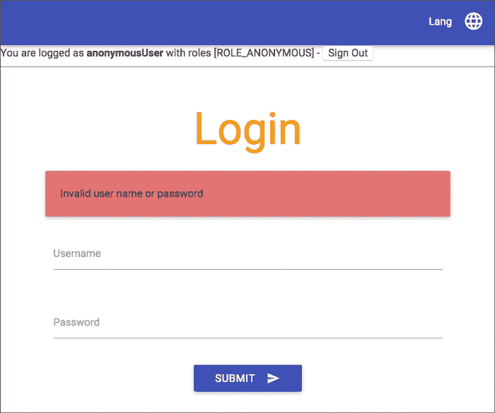
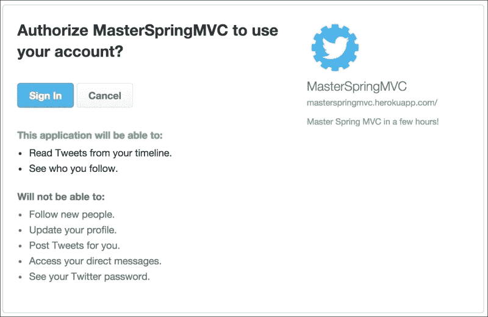

# 第二十一章：保护您的应用程序

在本章中，我们将学习如何保护我们的 Web 应用程序，以及如何应对现代分布式 Web 应用程序的安全挑战。

本章将分为五个部分：

+   首先，我们将在几分钟内设置基本的 HTTP 认证

+   然后，我们将为网页设计基于表单的认证，保留 RESTful API 的基本认证

+   我们将允许用户通过 Twitter OAuth API 进行注册

+   然后，我们将利用 Spring Session 来确保我们的应用程序可以使用分布式会话机制进行扩展

+   最后，我们将配置 Tomcat 使用 SSL 进行安全连接

# 基本认证

最简单的身份验证机制是基本认证（[`en.wikipedia.org/wiki/Basic_access_authentication`](http://en.wikipedia.org/wiki/Basic_access_authentication)）。简而言之，如果没有用户名和密码，我们的页面将无法访问。

我们的服务器将通过发送“401 未经授权”的 HTTP 状态码并生成`WWW-Authenticate`头来指示我们的资源受到保护。

为了成功通过安全检查，客户端必须发送一个包含`Basic`值后面跟着`user:password`字符串的 base 64 编码的`Authorization`头。浏览器窗口将提示用户输入用户名和密码，如果认证成功，用户将获得对受保护页面的访问权限。

让我们将 Spring Security 添加到我们的依赖项中：

```java
compile 'org.springframework.boot:spring-boot-starter-security'
```

重新启动应用程序并导航到应用程序中的任何 URL。系统将提示您输入用户名和密码：


如果您未能进行身份验证，您将看到抛出`401`错误。默认用户名是`user`。身份验证的正确密码将在每次应用程序启动时随机生成，并显示在服务器日志中：

```java

Using default security password: 13212bb6-8583-4080-b790-103408c93115

```

默认情况下，Spring Security 保护除`/css/`、`/js/`、`/images/`和`**/favicon.ico`等少数经典路由之外的所有资源。

如果您希望配置默认凭据，可以将以下属性添加到`application.properties`文件中：

```java
security.user.name=admin
security.user.password=secret
```

## 授权用户

在我们的应用程序中只有一个用户不允许进行细粒度的安全控制。如果我们想要更多地控制用户凭据，我们可以在`config`包中添加以下`SecurityConfiguration`类：

```java
package masterSpringMvc.config;

import org.springframework.beans.factory.annotation.Autowired;
import org.springframework.context.annotation.Configuration;
import org.springframework.security.config.annotation.authentication.builders.AuthenticationManagerBuilder;
import org.springframework.security.config.annotation.method.configuration.EnableGlobalMethodSecurity;
import org.springframework.security.config.annotation.web.configuration.WebSecurityConfigurerAdapter;

@Configuration
@EnableGlobalMethodSecurity(securedEnabled = true)
public class SecurityConfiguration extends WebSecurityConfigurerAdapter {

    @Autowired
    public void configureAuth(AuthenticationManagerBuilder auth)
            throws Exception {
        auth.inMemoryAuthentication()
                .withUser("user").password("user").roles("USER").and()
                .withUser("admin").password("admin").roles("USER", "ADMIN");
    }
}
```

这段代码将设置一个包含我们应用程序用户及其角色的内存系统。它将覆盖先前在应用程序属性中定义的安全名称和密码。

`@EnableGlobalMethodSecurity`注释将允许我们对应用程序的方法和类进行注释，以定义它们的安全级别。

例如，假设我们的应用程序只有管理员才能访问用户 API。在这种情况下，我们只需在资源中添加`@Secured`注释，以允许仅对 ADMIN 角色进行访问：

```java
@RestController
@RequestMapping("/api")
@Secured("ROLE_ADMIN")
public class UserApiController {
  // ... code omitted
}
```

我们可以使用 httpie 轻松测试，通过使用`-a`开关使用基本认证和`-p=h`开关，只显示响应头。

让我们尝试一下没有管理员配置文件的用户：

```java

> http GET 'http://localhost:8080/api/users' -a user:user -p=h
HTTP/1.1 403 Forbidden
Cache-Control: no-cache, no-store, max-age=0, must-revalidate
Content-Type: application/json;charset=UTF-8
Date: Sat, 23 May 2015 17:40:09 GMT
Expires: 0
Pragma: no-cache
Server: Apache-Coyote/1.1
Set-Cookie: JSESSIONID=2D4761C092EDE9A4DB91FA1CAA16C59B; Path=/; HttpOnly
Transfer-Encoding: chunked
X-Content-Type-Options: nosniff
X-Frame-Options: DENY
X-XSS-Protection: 1; mode=block

```

现在，使用管理员：

```java

> http GET 'http://localhost:8080/api/users' -a admin:admin -p=h
HTTP/1.1 200 OK
Cache-Control: no-cache, no-store, max-age=0, must-revalidate
Content-Type: application/json;charset=UTF-8
Date: Sat, 23 May 2015 17:42:58 GMT
Expires: 0
Pragma: no-cache
Server: Apache-Coyote/1.1
Set-Cookie: JSESSIONID=CE7A9BF903A25A7A8BAD7D4C30E59360; Path=/; HttpOnly
Transfer-Encoding: chunked
X-Content-Type-Options: nosniff
X-Frame-Options: DENY
X-XSS-Protection: 1; mode=block

```

您还会注意到 Spring Security 自动添加了一些常见的安全头：

+   `Cache Control`：这可以防止用户缓存受保护的资源

+   `X-XSS-Protection`：这告诉浏览器阻止看起来像 CSS 的东西

+   `X-Frame-Options`：这将禁止我们的网站嵌入到 IFrame 中

+   `X-Content-Type-Options`：这可以防止浏览器猜测用于伪造 XSS 攻击的恶意资源的 MIME 类型

### 注意

这些头的全面列表可在[`docs.spring.io/spring-security/site/docs/current/reference/htmlsingle/#headers`](http://docs.spring.io/spring-security/site/docs/current/reference/htmlsingle/#headers)上找到。

## 授权的 URL

注释我们的控制器非常容易，但并不总是最可行的选择。有时，我们只想完全控制我们的授权。

删除`@Secured`注释；我们将想出更好的办法。

让我们看看通过修改`SecurityConfiguration`类，Spring Security 允许我们做什么：

```java
@Configuration
@EnableGlobalMethodSecurity(securedEnabled = true)
public class SecurityConfiguration extends WebSecurityConfigurerAdapter {

    @Autowired
    public void configureAuth(AuthenticationManagerBuilder auth)
        throws Exception {
        auth.inMemoryAuthentication()
            .withUser("user").password("user").roles("USER").and()
            .withUser("admin").password("admin").roles("USER", "ADMIN");
    }

    @Override
    protected void configure(HttpSecurity http) throws Exception {
        http
            .httpBasic()
            .and()
            .csrf().disable()
            .authorizeRequests()
            .antMatchers("/login", "/logout").permitAll()
            .antMatchers(HttpMethod.GET, "/api/**").hasRole("USER")
            .antMatchers(HttpMethod.POST, "/api/**").hasRole("ADMIN")
            .antMatchers(HttpMethod.PUT, "/api/**").hasRole("ADMIN")
            .antMatchers(HttpMethod.DELETE, "/api/**").hasRole("ADMIN")
            .anyRequest().authenticated();
    }
}
```

在前面的代码示例中，我们使用 Spring Security 的流畅 API 配置了应用程序的安全策略。

通过调用与不同安全问题相关的方法并与`and()`方法链接，此 API 允许我们全局配置 Spring Security。

我们刚刚定义的是基本身份验证，没有 CSRF 保护。所有用户将允许在`/login`和`/logout`上的请求。对 API 的`GET`请求只允许具有`USER`角色的用户，而对 API 的`POST`、`PUT`和`DELETE`请求只对具有 ADMIN 角色的用户可访问。最后，每个其他请求将需要任何角色的身份验证。

CSRF 代表**跨站点请求伪造**，指的是一种攻击，恶意网站会在其网站上显示一个表单，并在您的网站上发布表单数据。如果您网站的用户没有注销，`POST`请求将保留用户的 cookie，因此将被授权。

CSRF 保护将生成短暂的令牌，这些令牌将与表单数据一起发布。我们将在下一节中看到如何正确启用它；现在，让我们先禁用它。有关更多详细信息，请参见[`docs.spring.io/spring-security/site/docs/current/reference/htmlsingle/#csrf`](http://docs.spring.io/spring-security/site/docs/current/reference/htmlsingle/#csrf)。

### 注意

要了解有关授权请求 API 的更多信息，请查看[`docs.spring.io/spring-security/site/docs/current/reference/htmlsingle/#authorize-requests`](http://docs.spring.io/spring-security/site/docs/current/reference/htmlsingle/#authorize-requests)。

## Thymeleaf 安全标签

有时，您需要显示来自身份验证层的数据，例如用户的名称和角色，或根据用户的权限隐藏和显示网页的一部分。`thymeleaf-extras-springsecurity`模块将允许我们这样做。

将以下依赖项添加到您的`build.gradle`文件中：

```java
compile 'org.thymeleaf.extras:thymeleaf-extras-springsecurity3'
```

使用此库，我们可以在`layout/default.html`的导航栏下添加一个小块，以显示已登录的用户：

```java
<!DOCTYPE html>
<html 

      >
<head>
  <!-- content trimmed -->
</head>
<body>

<!-- content trimmed -->
<nav>
    <div class="nav-wrapper indigo">
        <ul class="right">
        <!-- content trimmed -->
        </ul>
    </div>
</nav>
<div>
 You are logged as <b sec:authentication="name" /> with roles <span sec:authentication="authorities" />
 -
 <form th:action="@{/logout}" method="post" style="display: inline-block">
 <input type="submit" value="Sign Out" />
 </form>
 <hr/>
</div>

<section layout:fragment="content">
    <p>Page content goes here</p>
</section>

<!-- content trimmed -->
</body>
</html>
```

请注意 HTML 声明中的新命名空间和`sec:authentication`属性。它允许访问`org.springframework.security.core.Authentication`对象的属性，该对象表示当前登录的用户，如下截图所示：


暂时不要点击注销链接，因为它与基本身份验证不兼容。我们将在下一部分使其工作。

`lib`标签还有一些其他标签，例如用于检查用户授权的标签：

```java
<div sec:authorize="hasRole('ROLE_ADMIN')">
    You are an administrator
</div>
```

### 注意

请参阅[`github.com/thymeleaf/thymeleaf-extras-springsecurity`](https://github.com/thymeleaf/thymeleaf-extras-springsecurity)上可用的文档，以了解有关该库的更多信息。

# 登录表单

基本身份验证对于我们的 RESTful API 很好，但我们更希望有一个由我们团队精心设计的登录页面，以改善网页体验。

Spring Security 允许我们定义尽可能多的`WebSecurityConfigurerAdapter`类。我们将把我们的`SecurityConfiguration`类分成两部分：

+   `ApiSecurityConfiguration`：这将首先进行配置。这将使用基本身份验证保护 RESTful 端点。

+   `WebSecurityConfiguration`：然后将为我们应用程序的其余部分配置登录表单。

您可以删除或重命名`SecurityConfiguration`，并创建`ApiSecurityConfiguration`代替：

```java
@Configuration
@Order(1)
public class ApiSecurityConfiguration extends WebSecurityConfigurerAdapter {

    @Autowired
    public void configureAuth(AuthenticationManagerBuilder auth)
        throws Exception {
        auth.inMemoryAuthentication()
            .withUser("user").password("user").roles("USER").and()
            .withUser("admin").password("admin").roles("USER", "ADMIN");
    }

    @Override
    protected void configure(HttpSecurity http) throws Exception {
        http
            .antMatcher("/api/**")
            .httpBasic().and()
            .csrf().disable()
            .authorizeRequests()
            .antMatchers(HttpMethod.GET).hasRole("USER")
            .antMatchers(HttpMethod.POST).hasRole("ADMIN")
            .antMatchers(HttpMethod.PUT).hasRole("ADMIN")
            .antMatchers(HttpMethod.DELETE).hasRole("ADMIN")
            .anyRequest().authenticated();
    }
}
```

请注意`@Order(1)`注解，这将确保在执行其他配置之前执行此配置。然后，创建第二个用于 Web 的配置，称为`WebSecurityConfiguration`：

```java
package masterSpringMvc.config;

import org.springframework.context.annotation.Configuration;
import org.springframework.security.config.annotation.web.builders.HttpSecurity;
import org.springframework.security.config.annotation.web.configuration.WebSecurityConfigurerAdapter;

@Configuration
public class WebSecurityConfiguration extends WebSecurityConfigurerAdapter {

    @Override
    protected void configure(HttpSecurity http) throws Exception {
        http
                .formLogin()
                .defaultSuccessUrl("/profile")
                .and()
                .logout().logoutSuccessUrl("/login")
                .and()
                .authorizeRequests()
                .antMatchers("/webjars/**", "/login").permitAll()
                .anyRequest().authenticated();
    }
}
```

此代码的结果是，与`/api/**`匹配的任何内容都将受到基本身份验证的保护，而不受 CSRF 保护。然后，将加载第二个配置。它将保护其他所有内容。应用程序的这一部分中的所有内容都需要客户端进行身份验证，除了 WebJars 上的请求和登录页面上的请求（这将避免重定向循环）。

如果未经身份验证的用户尝试访问受保护的资源，他们将自动重定向到登录页面。

默认情况下，登录 URL 是`GET /login`。默认登录将通过`POST /login`请求发布，其中将包含三个值：用户名（`username`）、密码（`password`）和 CSRF 令牌（`_csrf`）。如果登录不成功，用户将被重定向到`/login?error`。默认注销页面是一个带有 CSRF 令牌的`POST /logout`请求。

现在，如果您尝试在应用程序上导航，此表单将自动生成！

如果您已经从以前的尝试中登录，请关闭浏览器；这将清除会话。


我们现在可以登录和退出应用程序了！

这很可爱，但我们可以用很少的努力做得更好。首先，我们将在`WebSecurityConfiguration`类中定义一个`/login`登录页面：

```java
@Override
protected void configure(HttpSecurity http) throws Exception {
    http
        .formLogin()
        .loginPage("/login") // <= custom login page
        .defaultSuccessUrl("/profile")
        // the rest of the configuration stays the same
}
```

这将让我们创建自己的登录页面。为此，我们需要一个非常简单的控制器来处理`GET login`请求。您可以在`authentication`包中创建一个：

```java
package masterSpringMvc.authentication;

import org.springframework.stereotype.Controller;
import org.springframework.web.bind.annotation.RequestMapping;

@Controller
public class LoginController {

    @RequestMapping("/login")
    public String authenticate() {
        return "login";
    }
}
```

这将触发位于模板目录中的`login.html`页面的显示。让我们创建它：

```java
<!DOCTYPE HTML>
<html 

      layout:decorator="layout/default">
<head>
    <title>Login</title>
</head>
<body>
<div class="section no-pad-bot" layout:fragment="content">
    <div class="container">

        <h2 class="header center orange-text">Login</h2>

        <div class="row">
            <div id="errorMessage" class="card-panel red lighten-2" th:if="${param.error}">
                <span class="card-title">Invalid user name or password</span>
            </div>

            <form class="col s12" action="/login" method="post">
                <div class="row">
                    <div class="input-field col s12">
                        <input id="username" name="username" type="text" class="validate"/>
                        <label for="username">Username</label>
                    </div>
                </div>
                <div class="row">
                    <div class="input-field col s12">
                        <input id="password" name="password" type="password" class="validate"/>
                        <label for="password">Password</label>
                    </div>
                </div>
                <div class="row center">
                    <button class="btn waves-effect waves-light" type="submit" name="action">Submit
                        <i class="mdi-content-send right"></i>
                    </button>
                </div>
                <input type="hidden" th:name="${_csrf.parameterName}" th:value="${_csrf.token}"/>
            </form>
        </div>
    </div>
</div>
</body>
</html>
```

请注意，我们处理错误消息，并发布 CSRF 令牌。我们还使用默认的用户名和密码输入名称，但如果需要，这些是可配置的。结果看起来已经好多了！



您可以立即看到，Spring Security 默认为所有非经过身份验证的用户分配匿名凭据。

我们不应该向匿名用户显示登出按钮，因此我们可以将相应的 HTML 部分包装在`sec:authorize="isAuthenticated()"`中，只显示给经过身份验证的用户，如下所示：

```java
<div sec:authorize="isAuthenticated()">
    You are logged as <b sec:authentication="name"/> with roles <span sec:authentication="authorities"/>
    -
    <form th:action="@{/logout}" method="post" style="display: inline-block">
        <input type="submit" value="Sign Out"/>
    </form>
    <hr/>
</div>
```

# Twitter 身份验证

我们的应用程序与 Twitter 强烈集成，因此允许我们通过 Twitter 进行身份验证似乎是合乎逻辑的。

在继续之前，请确保您已在 Twitter 应用程序上启用了 Twitter 登录（[`apps.twitter.com`](https://apps.twitter.com)）：


## 设置社交身份验证

Spring social 通过 OAuth 提供程序（如 Twitter）实现身份验证，通过登录/注册场景。它将拦截`/signin/twitter`上的`POST`请求。如果用户未知于`UsersConnectionRepository`接口，则将调用`signup`端点。这将允许我们采取必要措施在我们的系统上注册用户，也许要求他们提供额外的细节。

让我们开始工作。我们需要做的第一件事是将`signin/**`和`/signup` URL 添加为公开可用的资源。让我们修改我们的`WebSecurityConfiguration`类，更改`permitAll`行：

```java
.antMatchers("/webjars/**", "/login", "/signin/**", "/signup").permitAll()
```

为了启用登录/注册场景，我们还需要一个`SignInAdapter`接口，一个简单的监听器，当已知用户再次登录时将被调用。

我们可以在我们的`LoginController`旁边创建一个`AuthenticatingSignInAdapter`类。

```java
package masterSpringMvc.authentication;

import org.springframework.security.authentication.UsernamePasswordAuthenticationToken;
import org.springframework.security.core.context.SecurityContextHolder;
import org.springframework.social.connect.Connection;
import org.springframework.social.connect.UserProfile;
import org.springframework.social.connect.web.SignInAdapter;
import org.springframework.stereotype.Component;
import org.springframework.web.context.request.NativeWebRequest;

@Component
public class AuthenticatingSignInAdapter implements SignInAdapter {

    public static void authenticate(Connection<?> connection) {
        UserProfile userProfile = connection.fetchUserProfile();
        String username = userProfile.getUsername();
        UsernamePasswordAuthenticationToken authentication = new UsernamePasswordAuthenticationToken(username, null, null);
        SecurityContextHolder.getContext().setAuthentication(authentication);
        System.out.println(String.format("User %s %s connected.", userProfile.getFirstName(), userProfile.getLastName()));
    }

    @Override
    public String signIn(String userId, Connection<?> connection, NativeWebRequest request) {
        authenticate(connection);
        return null;
    }
}
```

正如您所看到的，此处理程序在完美的时间调用，允许用户使用 Spring Security 进行身份验证。我们马上就会回到这一点。现在，我们需要在同一个包中定义我们的`SignupController`类，负责首次访问用户：

```java
package masterSpringMvc.authentication;

import org.springframework.beans.factory.annotation.Autowired;
import org.springframework.social.connect.Connection;
import org.springframework.social.connect.ConnectionFactoryLocator;
import org.springframework.social.connect.UsersConnectionRepository;
import org.springframework.social.connect.web.ProviderSignInUtils;
import org.springframework.stereotype.Controller;
import org.springframework.web.bind.annotation.RequestMapping;
import org.springframework.web.context.request.WebRequest;

@Controller
public class SignupController {
    private final ProviderSignInUtils signInUtils;

    @Autowired
    public SignupController(ConnectionFactoryLocator connectionFactoryLocator, UsersConnectionRepository connectionRepository) {
        signInUtils = new ProviderSignInUtils(connectionFactoryLocator, connectionRepository);
    }

    @RequestMapping(value = "/signup")
    public String signup(WebRequest request) {
        Connection<?> connection = signInUtils.getConnectionFromSession(request);
        if (connection != null) {
            AuthenticatingSignInAdapter.authenticate(connection);
            signInUtils.doPostSignUp(connection.getDisplayName(), request);
        }
        return "redirect:/profile";
    }
}
```

首先，此控制器从会话中检索当前连接。然后，它通过与之前相同的方法对用户进行身份验证。最后，它将触发`doPostSignUp`事件，这将允许 Spring Social 在我们之前提到的`UsersConnectionRepository`接口中存储与我们的用户相关的信息。

我们需要做的最后一件事是在我们的登录页面下方的前一个表单下面添加一个成功的“使用 Twitter 登录”按钮：

```java
<form th:action="@{/signin/twitter}" method="POST" class="center">
    <div class="row">
        <button class="btn indigo" name="twitterSignin" type="submit">Connect with Twitter
            <i class="mdi-social-group-add left"></i>
        </button>
    </div>
</form>
```


当用户点击**使用 Twitter 连接**按钮时，他们将被重定向到 Twitter 登录页面：



## 解释

代码不多，但要理解所有部分有点棘手。理解正在发生的事情的第一步是查看 Spring Boot 的`SocialWebAutoConfiguration`类。

在这个类中声明的`SocialAutoConfigurationAdapter`类包含以下 bean：

```java
@Bean
@ConditionalOnBean(SignInAdapter.class)
@ConditionalOnMissingBean(ProviderSignInController.class)
public ProviderSignInController signInController(
        ConnectionFactoryLocator factoryLocator,
        UsersConnectionRepository usersRepository, SignInAdapter signInAdapter) {
    ProviderSignInController controller = new ProviderSignInController(
            factoryLocator, usersRepository, signInAdapter);
    if (!CollectionUtils.isEmpty(this.signInInterceptors)) {
 controller.setSignInInterceptors(this.signInInterceptors);
    }
    return controller;
}
```

如果在我们的配置中检测到一个`ProviderSignInController`类，那么`ProviderSignInController`类将自动设置。这个控制器是登录过程的基石。看一下它的功能（我只会总结重要的部分）：

+   它将处理我们的连接按钮的`POST /signin/{providerId}`

+   它将重定向用户到我们身份提供者的适当登录 URL

+   它将通过`GET /signin/{providerId}`从身份提供者接收到 OAuth 令牌

+   然后它将处理登录

+   如果在`UsersConnectionRepository`接口中找不到用户，它将使用`SessionStrategy`接口来存储待处理的登录请求，然后重定向到`signupUrl`页面

+   如果找到用户，则会调用`SignInAdapter`接口，并将用户重定向到`postSignupUrl`页面。

这个身份验证的两个重要组件是`UsersConnectionRepository`接口，负责从某种存储中存储和检索用户，以及`SessionStrategy`接口，它将临时存储用户连接，以便可以从`SignupController`类中检索到。

默认情况下，Spring Boot 为每个身份验证提供程序创建一个`InMemoryUsersConnectionRepository`接口，这意味着我们的用户连接数据将存储在内存中。如果重新启动服务器，用户将变为未知用户，并且将再次通过注册流程。

`ProviderSignInController`类默认使用`HttpSessionSessionStrategy`，它会将连接存储在 HTTP 会话中。我们在`SignupController`类中使用的`ProviderSignInUtils`类也默认使用这个策略。如果我们在多个服务器上分发我们的应用程序，这可能会有问题，因为会话可能不会在每台服务器上都可用。

通过为`ProviderSignInController`和`ProviderSignInUtils`类提供自定义的`SessionStrategy`接口，可以轻松地覆盖这些默认设置，以将数据存储在 HTTP 会话之外的其他位置。

同样，我们可以通过提供`UsersConnectionRepository`接口的另一个实现来为我们的用户连接数据使用另一种存储方式。

Spring Social 提供了一个`JdbcUsersConnectionRepository`接口，它会自动将经过身份验证的用户保存在数据库中的`UserConnection`表中。这本书不会对此进行详细介绍，但您应该可以通过将以下 bean 添加到配置中来轻松配置它：

```java
@Bean
@Primary
public UsersConnectionRepository getUsersConnectionRepository(
  DataSource dataSource, ConnectionFactoryLocator connectionFactoryLocator) {
    return new JdbcUsersConnectionRepository(
      dataSource, connectionFactoryLocator, Encryptors.noOpText());
}
```

### 注意

查看我的博客上的这篇文章[`geowarin.github.io/spring/2015/08/02/social-login-with-spring.html`](http://geowarin.github.io/spring/2015/08/02/social-login-with-spring.html)以获取更多详细信息。

# 分布式会话

正如我们在前面的部分中看到的，Spring Social 在几个时刻将东西存储在 HTTP 会话中。我们的用户配置文件也存储在会话中。这是一个经典的方法，可以在用户浏览网站时将东西保存在内存中。

然而，如果我们想要扩展我们的应用程序并将负载分布到多个后端服务器，这可能会带来麻烦。我们现在已经进入了云时代，第七章，“优化您的请求”将讨论将我们的应用程序部署到云端。

为了使我们的会话在分布式环境中工作，我们有几种选择：

+   我们可以使用粘性会话。这将确保特定用户始终被重定向到同一台服务器并保持其会话。这需要额外的部署配置，并不是特别优雅的方法。

+   重构我们的代码，将数据放入数据库而不是会话中。然后，如果我们将其与客户端发送的每个请求一起使用的 cookie 或令牌相关联，我们可以从数据库中加载用户的数据。

+   使用 Spring Session 项目透明地使用分布式数据库，如 Redis 作为底层会话提供程序。

在本章中，我们将看到如何设置第三种方法。设置起来非常容易，并且提供了惊人的好处，即可以在不影响应用程序功能的情况下关闭它。

我们需要做的第一件事是安装 Redis。在 Mac 上安装它，使用`brew`命令：

```java

brew install redis

```

对于其他平台，请按照[`redis.io/download`](http://redis.io/download)上的说明进行操作。

然后，您可以使用以下命令启动服务器：

```java

redis-server

```

将以下依赖项添加到您的`build.gradle`文件中：

```java
compile 'org.springframework.boot:spring-boot-starter-redis'
compile 'org.springframework.session:spring-session:1.0.1.RELEASE'
```

在`application.properties`旁边创建一个名为`application-redis.properties`的新配置文件：

```java
spring.redis.host=localhost
spring.redis.port=6379
```

Spring Boot 提供了一种方便的方式来将配置文件与配置文件关联。在这种情况下，只有在 Redis 配置文件处于活动状态时，才会加载`application-redis.properties`文件。

然后，在`config`包中创建一个`RedisConfig`类：

```java
package masterSpringMvc.config;

import org.springframework.context.annotation.Configuration;
import org.springframework.context.annotation.Profile;
import org.springframework.session.data.redis.config.annotation.web.http.EnableRedisHttpSession;

@Configuration
@Profile("redis")
@EnableRedisHttpSession
public class RedisConfig {
}
```

正如您所看到的，此配置仅在`redis`配置文件处于活动状态时才会生效。

我们完成了！现在我们可以使用以下标志启动我们的应用程序：

```java

-Dspring.profiles.active=redis

```

您还可以使用`gradlew build`生成 JAR 文件，并使用以下命令启动它：

```java

java -Dserver.port=$PORT -Dspring.profiles.active=redis -jar app.jar

```

或者，您可以在 Bash 中使用 Gradle 启动它，如下所示：

```java

SPRING_PROFILES_ACTIVE=redis ./gradlew bootRun

```

您还可以简单地将其设置为 IDE 运行配置中的 JVM 选项。

就是这样！现在您有一个服务器存储着您已登录用户的详细信息。这意味着我们可以扩展并为我们的 Web 资源拥有多个服务器，而我们的用户不会注意到。而且我们不必在我们这边编写任何代码。

这也意味着即使重新启动服务器，您也将保留会话。

为了验证它是否有效，请使用`redis-cli`命令连接到 Redis。一开始，它将不包含任何键：

```java

> redis-cli
127.0.0.1:6379> KEYS *
(empty list or set)

```

转到您的应用程序并开始将内容放入会话中：

```java

127.0.0.1:6379> KEYS *
1) "spring:session:expirations:1432487760000"
2) "spring:session:sessions:1768a55b-081a-4673-8535-7449e5729af5"
127.0.0.1:6379> HKEYS spring:session:sessions:1768a55b-081a-4673-8535-7449e5729af5
1) "sessionAttr:SPRING_SECURITY_CONTEXT"
2) "sessionAttr:org.springframework.security.web.csrf.HttpSessionCsrfTokenRepository.CSRF_TOKEN"
3) "lastAccessedTime"
4) "maxInactiveInterval"
5) "creationTime"

```

### 注意

您可以在[`redis.io/commands`](http://redis.io/commands)上查看可用命令的列表。

# SSL

**安全套接字层**（**SSL**）是一种安全协议，其中数据经过加密并通过证书发送给受信任的一方。在本部分中，我将向您展示使用 Spring Boot 创建安全连接的不同方法。完成这些步骤对于开始下一章并不是强制性的。它们包含在内是为了完整起见，因此如果您急于将应用程序部署到云端，可以随意跳过它们。

在第八章，“将您的 Web 应用程序部署到云端”中，我们将看到大多数云平台已经处理 SSL，因此我们不必在我们这边进行配置。

## 生成自签名证书

通常，X.509 证书由证书颁发机构提供。他们通常会向您收费，因此，为了测试目的，我们可以创建自己的自签名密钥库文件。

JDK 自带一个名为 keytool 的二进制文件，用于管理证书。使用它，您可以创建一个密钥库并将证书导入现有的密钥库中。您可以在项目根目录内发出以下命令来创建一个：

```java

$ keytool -genkey -alias masterspringmvc -keyalg RSA -keystore src/main/resources/tomcat.keystore
Enter keystore password: password
Re-enter new password: password
What is your first and last name?
 [Unknown]:  Master Spring MVC
What is the name of your organizational unit?
 [Unknown]:  Packt
What is the name of your organization?
 [Unknown]:  Packt
What is the name of your City or Locality?
 [Unknown]:  Paris
What is the name of your State or Province?
 [Unknown]:  France
What is the two-letter country code for this unit?
 [Unknown]:  FR
Is CN=Master Spring MVC, OU=Packt, O=Packt, L=Paris, ST=France, C=FR correct?
 [no]:  yes

Enter key password for <masterspringmvc>
 (RETURN if same as keystore password): password2
Re-enter new password: password2

```

这将生成一个名为`masterspringmvc`的密钥库，使用 RSA 算法，并将其存储在`src/main/resources`中的密钥库中。

### 提示

不要将密钥库推送到您的存储库中。它可能会被暴力破解，这将使您的网站的安全性失效。您还应该使用强大的、随机生成的密码生成密钥库。

## 简单的方法

如果你只关心有一个安全的 https 通道而没有 http 通道，那就很容易了：

```java

server.port = 8443
server.ssl.key-store = classpath:tomcat.keystore

server.ssl.key-store-password = password
server.ssl.key-password = password2

```

### 提示

不要将密码推送到您的存储库中。使用`${}`符号导入环境变量。

## 双重方式

如果您希望在应用程序中同时使用 http 和 https 通道，您应该向应用程序添加这种配置：

```java
@Configuration
public class SslConfig {

    @Bean
    public EmbeddedServletContainerFactory servletContainer() throws IOException {
        TomcatEmbeddedServletContainerFactory tomcat = new TomcatEmbeddedServletContainerFactory();
        tomcat.addAdditionalTomcatConnectors(createSslConnector());
        return tomcat;
    }

    private Connector createSslConnector() throws IOException {
        Connector connector = new Connector(Http11NioProtocol.class.getName());
        Http11NioProtocol protocol =
                (Http11NioProtocol) connector.getProtocolHandler();
        connector.setPort(8443);
        connector.setSecure(true);
        connector.setScheme("https");
        protocol.setSSLEnabled(true);
        protocol.setKeyAlias("masterspringmvc");
        protocol.setKeystorePass("password");
        protocol.setKeyPass("password2");
        protocol.setKeystoreFile(new ClassPathResource("tomcat.keystore").getFile().getAbsolutePath());
        protocol.setSslProtocol("TLS");
        return connector;
    }
}
```

这将加载先前生成的密钥库，以在 8080 端口之外创建一个额外的 8443 端口的通道。

您可以使用 Spring Security 自动将连接从`http`重定向到`https`，配置如下：

```java
@Configuration
public class WebSecurityConfiguration extends WebSecurityConfigurerAdapter {

    @Override
    protected void configure(HttpSecurity http) throws Exception {
        http
            .requiresChannel().anyRequest().requiresSecure()
            .and()
            /* rest of the configuration */;
    }
}
```

## 在一个安全的服务器后面

通常，使用 SSL 保护应用程序的最便捷方式是将其放在一个启用了 SSL 的 Web 服务器后面，如 Apache 或 CloudFlare。这些通常会使用事实上的标头来指示连接先前是使用 SSL 发起的。

如果您告诉 Spring Boot 您的`application.properties`文件中正确的标头是什么，它就可以理解这个协议：

```java

server.tomcat.remote_ip_header=x-forwarded-for
server.tomcat.protocol_header=x-forwarded-proto

```

### 注意

有关更多详细信息，请参阅此处的文档[`docs.spring.io/spring-boot/docs/current/reference/html/howto-embedded-servlet-containers.html#howto-use-tomcat-behind-a-proxy-server`](http://docs.spring.io/spring-boot/docs/current/reference/html/howto-embedded-servlet-containers.html#howto-use-tomcat-behind-a-proxy-server)。

# 检查点

在本章中，我们添加了三个配置项：`ApiSecurityConfiguration`，用于配置我们的 REST API 使用基本的 HTTP 身份验证；`WebSecurityConfiguration`，为我们的 Web 用户设置一个登录表单，以便使用帐户或 Twitter 登录；以及`RedisConfig`，允许我们的会话存储和从 Redis 服务器检索。

在认证包中，我们添加了一个`LoginController`类，用于重定向到我们的登录页面，一个`SignupController`类，第一次用户使用 Twitter 注册时将调用它，以及一个`AuthenticatingSignInAdapater`类，每次使用 Twitter 登录时都会调用它：


# 总结

使用 Spring 来保护我们的 Web 应用程序非常简单。可能性是无限的，高级配置如社交登录也近在咫尺。分发会话和扩展也只需要几分钟。

在下一章中，我们将看到如何测试我们的应用程序，并确保它永远不会退化。

