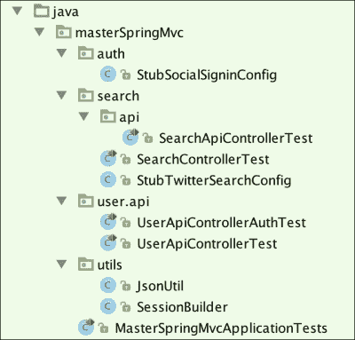

# 第二十二章：不留任何机会——单元测试和验收测试

在本章中，我们将看到为什么以及如何测试我们的应用程序。我们将看到单元测试和验收测试之间的区别，并学习如何进行两者。

本章分为两部分。在第一部分中，我们将使用 Java 编写测试，同时学习不同的测试方法。在第二部分中，我们将使用 Groovy 编写完全相同的测试，并看看如何使用这种令人敬畏的语言来提高我们的代码可读性。

如果您在本章中做了所有的事情，您将有双重测试，所以请随意保留对您最易读的测试。

# 为什么我要测试我的代码？

在 Java 世界工作使许多开发人员意识到测试的重要性。一系列良好的测试可以及早发现回归，并在我们发布产品时让我们更有信心。

现在很多人都熟悉持续集成的概念（[`www.thoughtworks.com/continuous-integration`](http://www.thoughtworks.com/continuous-integration)）。这是一种实践，其中服务器负责在源代码控制系统上进行更改时构建应用程序。

构建应该尽可能快，并且能够自我测试。这种实践的主要思想是获得快速的反馈循环；一旦系统中的某些东西出现问题，你应该尽快了解出了什么问题。

你为什么要在意？毕竟，测试你的应用程序是额外的成本；花在设计和维护测试上的时间必然会占用一些开发时间。

实际上，bug 被发现得越晚，成本就越高。如果你仔细想想，甚至由你的 QA 团队发现的 bug 的成本也比你自己发现的 bug 更高。它迫使你回到编写代码时的上下文：我为什么写这一行？那个函数的基础业务规则是什么？

如果你早早地编写测试，并且能够在几秒钟内启动它们，那么在你的代码中解决潜在 bug 肯定会花费更少的时间。

测试的另一个好处是它们作为代码的活文档。写大量的文档，甚至是代码注释，可能会变得无效，因为它们很容易过时，养成为极限情况或意外行为编写良好测试的习惯将成为未来的安全网。

这行代码是干什么用的？你有没有发现自己问过这种问题？如果你有一套良好的单元测试，你可以删除它并查看结果！测试给了我们对代码和重构能力前所未有的信心。软件非常脆弱。如果你不在乎它，它会慢慢腐烂和死亡。

要负责任——不要让你的代码死掉！

# 我应该如何测试我的代码？

我们可以对软件进行不同类型的测试，比如安全测试、性能测试等。作为开发人员，我们将专注于我们可以自动化的测试，并且将有助于改进我们的代码。

测试分为两类：单元测试和验收测试。测试金字塔（[`martinfowler.com/bliki/TestPyramid.html`](http://martinfowler.com/bliki/TestPyramid.html)）显示了这些测试应该以什么比例编写：


在金字塔的底部，你有单元测试（启动快，相对容易维护），在顶部是 UI 测试（成本更高，执行速度更慢）。集成测试位于中间：它们可以被视为具有单元之间复杂交互的大型单元测试。

金字塔的理念是提醒你把焦点放在你影响最大并且获得最佳反馈循环的地方。

# 测试驱动开发

许多开发人员养成了良好的测试驱动开发（TTD）的习惯。这种实践是从极限编程（XP）继承而来的，它将每个开发阶段分成小步骤，然后为每个步骤编写一个失败的测试。你进行必要的修改，使测试再次通过（测试变绿）。然后你可以重构你的代码，只要测试仍然是绿色的。以下图示了 TDD 的循环：


你可以通过非常短的反馈循环迭代，直到功能完成，保证没有回归，并且保证你从一开始就测试了所有的代码。

TDD 受到了批评。最有趣的批评是这些：

+   编写测试比实际实现需要更多的时间

+   它可能导致设计不良的应用程序

事实上，成为一个优秀的 TDD 实践者需要时间。一旦你知道应该测试什么，并且足够了解你的工具，你将不会浪费太多时间。

使用 TDD（或任何其他方法）来设计一个具有良好设计的应用程序也需要有经验的开发人员。如果你陷入了 baby steps 的咒语并忘记了看大局，那么糟糕的设计可能是 TDD 的副作用。TDD 不会奇迹般地导致出色的应用程序设计，所以要小心，并记得在完成每个功能后退一步。

从书的开头，我们的代码中只有一个自动生成的单元测试。这很糟糕！我们没有遵循良好的实践。这一章是为了解决这个问题而存在的。

# 单元测试

我们可以编写的较低级别的测试称为单元测试。它们应该测试代码的一小部分，因此称为单元。如何定义一个单元取决于你；它可以是一个类或一组密切相关的类。定义这个概念将决定什么将被模拟（用虚拟对象替换）。你要用轻量级替代品替换数据库吗？你要替换与外部服务的交互吗？你要模拟行为与被测试的上下文无关的密切相关的对象吗？

我的建议是保持平衡的态度。保持你的测试干净和快速，其他一切都会随之而来。

我很少完全模拟数据层。我倾向于在测试中使用嵌入式数据库。它们提供了一种在测试时加载数据的简单方法。

作为一个规则，我总是模拟与外部服务的协作，原因有两个，如下：

+   测试的速度和在不连接到网络的情况下运行测试的可能性

+   为了能够在与这些服务通信时测试错误情况

此外，模拟和存根之间存在微妙的区别。我们将尝试使用这两种方法来看它们之间的关系。

## 适合工作的正确工具

测试新手的第一个障碍是缺乏编写相关和可维护测试的好工具和库的知识。

我将在这里列出一些。这个列表绝不是详尽无遗的，但它包含了我们将要使用的工具，并且与 Spring 轻松兼容：

| JUnit | 最广泛采用的 Java 测试运行器。默认由所有构建工具启动。 |
| --- | --- |
| AssertJ | 一种流畅的断言库。比 Hamcrest 更容易使用。 |
| Mockito | 一个简单的模拟框架。 |
| DbUnit | 用于使用 XML 数据集模拟和断言数据库内容。 |
| Spock | 一种优雅的 Groovy DSL，用于以行为驱动开发（BDD）风格（Given/When/Then）编写测试。 |

Groovy 在我的测试工具集中占据了重要位置。即使你还没有准备好将一些 Groovy 代码投入生产，你仍然可以在测试中轻松使用这种语言的便利性。使用 Gradle 非常容易实现，但我们将在几分钟内看到。

# 验收测试

在 Web 应用程序的背景下，“验收测试”通常指的是在浏览器中的端到端测试。在 Java 世界中，Selenium 显然是最可靠和成熟的库之一。

在 JavaScript 世界中，我们可以找到其他替代方案，如 PhantomJS 或 Protractor。PhantomJS 在我们的案例中非常相关，因为这里有一个 Web 驱动程序可用于在这个无头浏览器中运行 Selenium 测试，这将提高启动时间，而且不需要模拟 X 服务器或启动单独的 Selenium 服务器：

| Selenium 2 | 提供 Web 驱动程序以操纵浏览器进行自动化测试。 |
| --- | --- |
| PhantomJS | 一个无头浏览器（没有 GUI）。可能是最快的浏览器。 |
| FluentLenium | 用于操纵 Selenium 测试的流畅库。 |
| Geb | 用于操纵 Selenium 测试的 Groovy 库。 |

# 我们的第一个单元测试

现在是时候编写我们的第一个单元测试了。

我们将专注于在控制器级别编写测试，因为我们几乎没有业务代码或服务。编写 Spring MVC 测试的关键是我们类路径中的`org.springframework.boot:spring-boot-starter-test`依赖项。它将添加一些非常有用的库，比如这些：

+   `hamcrest`：这是 JUnit 的断言库

+   `mockito`：这是一个模拟库

+   `spring-test`：这是 Spring 测试库

我们将测试当用户尚未创建其个人资料时，重定向到个人资料页面的情况。

我们已经有一个名为`MasterSpringMvc4ApplicationTests`的自动生成测试。这是使用 Spring 测试框架编写的最基本的测试：如果上下文无法加载，它将什么也不做，只会失败。

```java
@RunWith(SpringJUnit4ClassRunner.class)
@SpringApplicationConfiguration(classes = MasterSpringMvc4Application.class)
@WebAppConfiguration
public class MasterSpringMvc4ApplicationTests {

    @Test
    public void contextLoads() {
    }
}
```

我们可以删除这个测试，并创建一个新的测试，确保没有个人资料的用户将默认重定向到个人资料页面。它实际上测试了`HomeController`类的代码，所以让我们称之为`HomeControllerTest`类，并将其放在与`HomeController`相同的包中，即`src/test/java`。所有的 IDE 都有从类创建 JUnit 测试用例的快捷方式。现在找出如何使用您的 IDE 来完成这个操作！

这是测试：

```java
package masterSpringMvc.controller;

import masterSpringMvc.MasterSpringMvcApplication;
import org.junit.Before;
import org.junit.Test;
import org.junit.runner.RunWith;
import org.springframework.beans.factory.annotation.Autowired;
import org.springframework.boot.test.SpringApplicationConfiguration;
import org.springframework.test.context.junit4.SpringJUnit4ClassRunner;
import org.springframework.test.context.web.WebAppConfiguration;
import org.springframework.test.web.servlet.MockMvc;
import org.springframework.test.web.servlet.setup.MockMvcBuilders;
import org.springframework.web.context.WebApplicationContext;

import static org.springframework.test.web.servlet.request.MockMvcRequestBuilders.*;
import static org.springframework.test.web.servlet.result.MockMvcResultHandlers.print;
import static org.springframework.test.web.servlet.result.MockMvcResultMatchers.*;

@RunWith(SpringJUnit4ClassRunner.class)
@SpringApplicationConfiguration(classes = MasterSpringMvcApplication.class)
@WebAppConfiguration
public class HomeControllerTest {
    @Autowired
    private WebApplicationContext wac;

    private MockMvc mockMvc;

    @Before
    public void setup() {
        this.mockMvc = MockMvcBuilders.webAppContextSetup(this.wac).build();
    }

    @Test
    public void should_redirect_to_profile() throws Exception {
        this.mockMvc.perform(get("/"))
                .andDo(print())
                .andExpect(status().isFound())
                .andExpect(redirectedUrl("/profile"));
    }
}
```

我们使用`MockMvc`来模拟与 Spring 控制器的交互，而不会产生 Servlet 容器的实际开销。

我们还使用了 Spring 提供的一些匹配器来断言我们的结果。它们实际上实现了 Hamcrest 匹配器。

`.andDo(print())`语句将为测试场景的请求和响应生成整洁的调试输出。如果您觉得太啰嗦，可以将其注释掉。

就是这样！语法在开始时有点棘手，但一个具有良好代码补全功能的 IDE 将能够帮助您。

现在我们想测试的是，如果用户填写了其个人资料的测试部分，我们是否可以将其重定向到正确的搜索。为此，我们需要使用`MockHttpSession`类对会话进行存根。

```java
import org.springframework.mock.web.MockHttpSession;
import masterSpringMvc.profile.UserProfileSession;

// put this test below the other one
@Test
public void should_redirect_to_tastes() throws Exception {
    MockHttpSession session = new MockHttpSession();
    UserProfileSession sessionBean = new UserProfileSession();
    sessionBean.setTastes(Arrays.asList("spring", "groovy"));
    session.setAttribute("scopedTarget.userProfileSession", sessionBean);

    this.mockMvc.perform(get("/").session(session))
        .andExpect(status().isFound())
        .andExpect(redirectedUrl("/search/mixed;keywords=spring,groovy"));
}
```

您将不得不为测试添加`setTastes()` setter 到`UserProfileSession` bean 中。

在`org.springframework.mock.web`包中有很多用于 Servlet 环境的模拟工具。

请注意，表示我们会话中的 bean 的属性以`scopedTarget`为前缀。这是因为 Spring 会对会话 bean 进行代理。因此，在 Spring 上下文中实际上有两个对象，我们定义的实际 bean 和最终会出现在会话中的代理。

模拟会话是一个很好的类，但我们可以使用一个构建器来重构测试，该构建器将隐藏实现细节，并且以后可以重复使用：

```java
@Test
public void should_redirect_to_tastes() throws Exception {

    MockHttpSession session = new SessionBuilder().userTastes("spring", "groovy").build();
    this.mockMvc.perform(get("/")
        .session(session))
        .andExpect(status().isFound())
        .andExpect(redirectedUrl("/search/mixed;keywords=spring,groovy"));
}
```

构建器的代码如下：

```java
public class SessionBuilder {
    private final MockHttpSession session;
    UserProfileSession sessionBean;

    public SessionBuilder() {
        session = new MockHttpSession();
        sessionBean = new UserProfileSession();
        session.setAttribute("scopedTarget.userProfileSession", sessionBean);
    }

    public SessionBuilder userTastes(String... tastes) {
        sessionBean.setTastes(Arrays.asList(tastes));
        return this;
    }

    public MockHttpSession build() {
        return session;
    }
}
```

在这次重构之后，您的测试应该始终通过，当然。

# 模拟和存根

如果我们想测试`SearchController`类处理的搜索请求，我们肯定会想要模拟`SearchService`。

有两种方法可以做到这一点：使用模拟对象或存根。

## 使用 Mockito 进行模拟

首先，我们可以使用 Mockito 创建一个模拟对象：

```java
package masterSpringMvc.search;

import masterSpringMvc.MasterSpringMvcApplication;
import org.junit.Before;
import org.junit.Test;
import org.junit.runner.RunWith;
import org.mockito.InjectMocks;
import org.mockito.Mock;
import org.mockito.MockitoAnnotations;
import org.springframework.boot.test.SpringApplicationConfiguration;
import org.springframework.test.context.junit4.SpringJUnit4ClassRunner;
import org.springframework.test.context.web.WebAppConfiguration;
import org.springframework.test.web.servlet.MockMvc;
import org.springframework.test.web.servlet.setup.MockMvcBuilders;

import java.util.Arrays;

import static org.hamcrest.Matchers.*;
import static org.mockito.Matchers.*;
import static org.mockito.Mockito.*;
import static org.springframework.test.web.servlet.request.MockMvcRequestBuilders.get;
import static org.springframework.test.web.servlet.result.MockMvcResultMatchers.*;

@RunWith(SpringJUnit4ClassRunner.class)
@SpringApplicationConfiguration(classes = MasterSpringMvcApplication.class)
@WebAppConfiguration
public class SearchControllerMockTest {
    @Mock
    private SearchService searchService;

    @InjectMocks
    private SearchController searchController;

    private MockMvc mockMvc;

    @Before
    public void setup() {
        MockitoAnnotations.initMocks(this);
        this.mockMvc = MockMvcBuilders
                .standaloneSetup(searchController)
                .setRemoveSemicolonContent(false)
                .build();
    }

    @Test
    public void should_search() throws Exception {

        when(searchService.search(anyString(), anyListOf(String.class)))
                .thenReturn(Arrays.asList(
                        new LightTweet("tweetText")
                ));

        this.mockMvc.perform(get("/search/mixed;keywords=spring"))
                .andExpect(status().isOk())
                .andExpect(view().name("resultPage"))
                .andExpect(model().attribute("tweets", everyItem(
                        hasProperty("text", is("tweetText"))
                )));

        verify(searchService, times(1)).search(anyString(), anyListOf(String.class));
    }
}
```

您可以看到，我们创建了一个独立的上下文，而不是使用 web 应用程序上下文来设置`MockMvc`。这个上下文只包含我们的控制器。这意味着我们可以完全控制控制器及其依赖项的实例化和初始化。这将使我们能够轻松地在我们的控制器中注入一个模拟对象。

缺点是我们必须重新声明我们的配置的一部分，比如说我们不想在分号后删除 URL 字符的配置。

我们使用了一些 Hamcrest 匹配器来断言最终会出现在视图模型中的属性。

模拟的方法有其好处，比如能够验证与模拟对象的交互并在运行时创建期望。

这也会使您的测试与对象的实际实现耦合。例如，如果您更改了控制器中获取推文的方式，您很可能会破坏与该控制器相关的测试，因为它们仍然尝试模拟我们不再依赖的服务。

## 在测试时存根我们的 bean

另一种方法是在我们的测试中用另一个实现类替换`SearchService`类的实现。

我们早些时候有点懒，没有为`SearchService`定义一个接口。*始终根据接口而不是实现进行编程*。在这句谚语背后的智慧中，隐藏着*四人帮*最重要的教训。

控制反转的好处之一是允许在测试或实际系统中轻松替换我们的实现。为了使其工作，我们将不得不修改所有使用`SearchService`的地方，使用新的接口。有了一个好的 IDE，有一个叫做`提取接口`的重构，它会做到这一点。这应该创建一个包含我们的`SearchService`类的`search()`公共方法的接口：

```java
public interface TwitterSearch {
    List<LightTweet> search(String searchType, List<String> keywords);
}
```

当然，我们的两个控制器，`SearchController`和`SearchApiController`，现在必须使用接口而不是实现。

现在我们有能力为`TwitterSearch`类创建一个测试替身，专门用于我们的测试用例。为了使其工作，我们将需要声明一个名为`StubTwitterSearchConfig`的新 Spring 配置，其中将包含`TwitterSearch`的另一个实现。我将其放在 search 包中，紧邻`SearchControllerMockTest`：

```java
package masterSpringMvc.search;

import org.springframework.context.annotation.Bean;
import org.springframework.context.annotation.Configuration;
import org.springframework.context.annotation.Primary;

import java.util.Arrays;

@Configuration
public class StubTwitterSearchConfig {
    @Primary @Bean
    public TwitterSearch twitterSearch() {
        return (searchType, keywords) -> Arrays.asList(
                new LightTweet("tweetText"),
                new LightTweet("secondTweet")
        );
    }
}
```

在这个配置类中，我们使用`@Primary`注解重新声明了`TwitterSearch` bean，这将告诉 Spring 优先使用这个实现，如果在类路径中找到其他实现。

由于`TwitterSearch`接口只包含一个方法，我们可以使用 lambda 表达式来实现它。

这是使用我们的`StubConfiguration`类以及带有`SpringApplicationConfiguration`注解的主配置的完整测试：

```java
package masterSpringMvc.search;

import masterSpringMvc.MasterSpringMvcApplication;
import org.junit.Before;
import org.junit.Test;
import org.junit.runner.RunWith;
import org.springframework.beans.factory.annotation.Autowired;
import org.springframework.boot.test.SpringApplicationConfiguration;
import org.springframework.test.context.junit4.SpringJUnit4ClassRunner;
import org.springframework.test.context.web.WebAppConfiguration;
import org.springframework.test.web.servlet.MockMvc;
import org.springframework.test.web.servlet.setup.MockMvcBuilders;
import org.springframework.web.context.WebApplicationContext;

import static org.hamcrest.Matchers.*;
import static org.springframework.test.web.servlet.request.MockMvcRequestBuilders.get;
import static org.springframework.test.web.servlet.result.MockMvcResultMatchers.*;

@RunWith(SpringJUnit4ClassRunner.class)
@SpringApplicationConfiguration(classes = {
        MasterSpringMvcApplication.class,
        StubTwitterSearchConfig.class
})
@WebAppConfiguration
public class SearchControllerTest {
    @Autowired
    private WebApplicationContext wac;

    private MockMvc mockMvc;

    @Before
    public void setup() {
        this.mockMvc = MockMvcBuilders.webAppContextSetup(this.wac).build();
    }

    @Test
    public void should_search() throws Exception {

        this.mockMvc.perform(get("/search/mixed;keywords=spring"))
                .andExpect(status().isOk())
                .andExpect(view().name("resultPage"))
                .andExpect(model().attribute("tweets", hasSize(2)))
                .andExpect(model().attribute("tweets",
                                hasItems(
                                        hasProperty("text", is("tweetText")),
                                        hasProperty("text", is("secondTweet"))
                                ))
                );
    }
}
```

## 我应该使用模拟对象还是存根对象？

这两种方法都有各自的优点。有关详细解释，请查看 Martin Fowler 的这篇伟大的文章：[`martinfowler.com/articles/mocksArentStubs.html`](http://martinfowler.com/articles/mocksArentStubs.html)。

我的测试例程更多地是关于编写存根，因为我喜欢测试对象的输出而不是它们的内部工作原理。但这取决于你。Spring 作为一个依赖注入框架，意味着你可以轻松选择你喜欢的方法。

# 单元测试 REST 控制器

我们刚刚测试了一个传统的控制器重定向到视图。原则上，测试 REST 控制器非常类似，但有一些微妙之处。

由于我们将测试控制器的 JSON 输出，我们需要一个 JSON 断言库。将以下依赖项添加到您的`build.gradle`文件中：

```java
testCompile 'com.jayway.jsonpath:json-path'
```

让我们为`SearchApiController`类编写一个测试，该控制器允许搜索推文并以 JSON 或 XML 格式返回结果：

```java
package masterSpringMvc.search.api;

import masterSpringMvc.MasterSpringMvcApplication;
import masterSpringMvc.search.StubTwitterSearchConfig;
import org.junit.Before;
import org.junit.Test;
import org.junit.runner.RunWith;
import org.springframework.beans.factory.annotation.Autowired;
import org.springframework.boot.test.SpringApplicationConfiguration;
import org.springframework.http.MediaType;
import org.springframework.test.context.junit4.SpringJUnit4ClassRunner;
import org.springframework.test.context.web.WebAppConfiguration;
import org.springframework.test.web.servlet.MockMvc;
import org.springframework.test.web.servlet.setup.MockMvcBuilders;
import org.springframework.web.context.WebApplicationContext;

import static org.hamcrest.Matchers.*;
import static org.springframework.test.web.servlet.request.MockMvcRequestBuilders.get;
import static org.springframework.test.web.servlet.result.MockMvcResultHandlers.print;
import static org.springframework.test.web.servlet.result.MockMvcResultMatchers.*;

@RunWith(SpringJUnit4ClassRunner.class)
@SpringApplicationConfiguration(classes = {
        MasterSpringMvcApplication.class,
        StubTwitterSearchConfig.class
})
@WebAppConfiguration
public class SearchApiControllerTest {
    @Autowired
    private WebApplicationContext wac;

    private MockMvc mockMvc;

    @Before
    public void setup() {
        this.mockMvc = MockMvcBuilders.webAppContextSetup(this.wac).build();
    }

    @Test
    public void should_search() throws Exception {

        this.mockMvc.perform(
                get("/api/search/mixed;keywords=spring")
                        .accept(MediaType.APPLICATION_JSON))
                .andDo(print())
                .andExpect(status().isOk())
                .andExpect(content().contentTypeCompatibleWith(MediaType.APPLICATION_JSON))
                .andExpect(jsonPath("$", hasSize(2)))
                .andExpect(jsonPath("$[0].text", is("tweetText")))
                .andExpect(jsonPath("$[1].text", is("secondTweet")));
    }
}
```

注意 JSON 输出上的简单而优雅的断言。测试我们的用户控制器将需要更多的工作。

首先，让我们将`assertj`添加到类路径中；它将帮助我们编写更清晰的测试：

```java
testCompile 'org.assertj:assertj-core:3.0.0'
```

然后，为了简化测试，在我们的`UserRepository`类中添加一个`reset()`方法，这将帮助我们进行测试：

```java
void reset(User... users) {
        userMap.clear();
        for (User user : users) {
                save(user);
        }
}
```

在现实生活中，我们可能应该提取一个接口并创建一个存根进行测试。我会把这留给你作为练习。

这是第一个获取用户列表的测试：

```java
package masterSpringMvc.user.api;

import masterSpringMvc.MasterSpringMvcApplication;
import masterSpringMvc.user.User;
import masterSpringMvc.user.UserRepository;
import org.junit.Before;
import org.junit.Test;
import org.junit.runner.RunWith;
import org.springframework.beans.factory.annotation.Autowired;
import org.springframework.boot.test.SpringApplicationConfiguration;
import org.springframework.http.MediaType;
import org.springframework.test.context.junit4.SpringJUnit4ClassRunner;
import org.springframework.test.context.web.WebAppConfiguration;
import org.springframework.test.web.servlet.MockMvc;
import org.springframework.test.web.servlet.setup.MockMvcBuilders;
import org.springframework.web.context.WebApplicationContext;

import static org.hamcrest.Matchers.*;
   import static org.springframework.test.web.servlet.request.MockMvcRequestBuilders.*;
import static org.springframework.test.web.servlet.result.MockMvcResultMatchers.*;

@RunWith(SpringJUnit4ClassRunner.class)
@SpringApplicationConfiguration(classes = MasterSpringMvcApplication.class)
@WebAppConfiguration
public class UserApiControllerTest {

    @Autowired
    private WebApplicationContext wac;

    @Autowired
    private UserRepository userRepository;

    private MockMvc mockMvc;

    @Before
    public void setup() {
        this.mockMvc = MockMvcBuilders.webAppContextSetup(this.wac).build();
        userRepository.reset(new User("bob@spring.io"));
    }

    @Test
    public void should_list_users() throws Exception {
        this.mockMvc.perform(
                get("/api/users")
                        .accept(MediaType.APPLICATION_JSON)
        )
                .andExpect(status().isOk())
                .andExpect(content().contentTypeCompatibleWith(MediaType.APPLICATION_JSON))
                .andExpect(jsonPath("$", hasSize(1)))
                .andExpect(jsonPath("$[0].email", is("bob@spring.io")));
    }
}
```

为了使其工作，为`User`类添加一个构造函数，以电子邮件属性作为参数。注意：您还需要为 Jackson 添加一个默认构造函数。

该测试与之前的测试非常相似，另外设置了`UserRepository`。

现在让我们测试创建用户的`POST`方法：

```java
import static org.assertj.core.api.Assertions.assertThat;

// Insert this test below the previous one
@Test
public void should_create_new_user() throws Exception {
        User user = new User("john@spring.io");
        this.mockMvc.perform(
                post("/api/users")
                        .contentType(MediaType.APPLICATION_JSON)
                        .content(JsonUtil.toJson(user))
        )
                .andExpect(status().isCreated());

        assertThat(userRepository.findAll())
                .extracting(User::getEmail)
                .containsOnly("bob@spring.io", "john@spring.io");
}
```

有两件事需要注意。第一件事是使用 AssertJ 来断言测试后存储库的内容。您需要以下静态导入才能使其工作：

```java
import static org.assertj.core.api.Assertions.assertThat;
```

第二个是我们使用一个实用方法，在将对象发送到控制器之前将其转换为 JSON。为此，我在`utils`包中创建了一个简单的实用程序类，如下所示：

```java
package masterSpringMvc.utils;

import com.fasterxml.jackson.annotation.JsonInclude;
import com.fasterxml.jackson.databind.ObjectMapper;

import java.io.IOException;

public class JsonUtil {
    public static byte[] toJson(Object object) throws IOException {
        ObjectMapper mapper = new ObjectMapper();
        mapper.setSerializationInclusion(JsonInclude.Include.NON_NULL);
        return mapper.writeValueAsBytes(object);
    }
}
```

`DELETE`方法的测试如下：

```java
@Test
public void should_delete_user() throws Exception {
        this.mockMvc.perform(
                delete("/api/user/bob@spring.io")
                        .accept(MediaType.APPLICATION_JSON)
        )
                .andExpect(status().isOk());

        assertThat(userRepository.findAll()).hasSize(0);
}

@Test
public void should_return_not_found_when_deleting_unknown_user() throws Exception {
        this.mockMvc.perform(
                delete("/api/user/non-existing@mail.com")
                        .accept(MediaType.APPLICATION_JSON)
        )
                .andExpect(status().isNotFound());
}
```

最后，这是用于更新用户的`PUT`方法的测试：

```java
@Test
public void put_should_update_existing_user() throws Exception {
        User user = new User("ignored@spring.io");
        this.mockMvc.perform(
                put("/api/user/bob@spring.io")
                        .content(JsonUtil.toJson(user))
                        .contentType(MediaType.APPLICATION_JSON)
        )
                .andExpect(status().isOk());

        assertThat(userRepository.findAll())
                .extracting(User::getEmail)
                .containsOnly("bob@spring.io");
}
```

糟糕！最后一个测试没有通过！通过检查`UserApiController`的实现，我们很容易看出原因：

```java
   @RequestMapping(value = "/user/{email}", method = RequestMethod.PUT)
    public ResponseEntity<User> updateUser(@PathVariable String email, @RequestBody User user) throws EntityNotFoundException {
        User saved = userRepository.update(email, user);
        return new ResponseEntity<>(saved, HttpStatus.CREATED);
    }
```

我们在控制器中返回了错误的状态！将其更改为`HttpStatus.OK`，测试应该再次变为绿色。

使用 Spring，可以轻松地使用应用程序的相同配置编写控制器测试，但我们也可以有效地覆盖或更改测试设置中的一些元素。

在运行所有测试时，您将注意到的另一件有趣的事情是应用程序上下文只加载一次，这意味着开销实际上非常小。

我们的应用程序也很小，因此我们没有努力将配置拆分为可重用的部分。不在每个测试中加载完整的应用程序上下文可能是一个非常好的做法。您实际上可以使用`@ComponentScan`注释将组件扫描拆分为不同的单元。

此注释有几个属性，允许您使用`includeFilter`和`excludeFilter`定义过滤器（例如仅加载控制器）并使用`basePackageClasses`和`basePackages`注释扫描特定包。

您还可以将配置拆分为多个`@Configuration`类。一个很好的例子是将我们应用程序的用户和推文部分的代码拆分为两个独立的部分。

现在我们将看一下验收测试，这是一种非常不同的测试。

# 测试身份验证

如果您希望在 MockMvc 测试中设置 Spring Security，可以在我们之前的测试旁边编写此测试：

```java
package masterSpringMvc.user.api;

import masterSpringMvc.MasterSpringMvcApplication;
import masterSpringMvc.user.User;
import masterSpringMvc.user.UserRepository;
import org.junit.Before;
import org.junit.Test;
import org.junit.runner.RunWith;
import org.springframework.beans.factory.annotation.Autowired;
import org.springframework.boot.test.SpringApplicationConfiguration;
import org.springframework.http.MediaType;
import org.springframework.security.web.FilterChainProxy;
import org.springframework.test.context.junit4.SpringJUnit4ClassRunner;
import org.springframework.test.context.web.WebAppConfiguration;
import org.springframework.test.web.servlet.MockMvc;
import org.springframework.test.web.servlet.setup.MockMvcBuilders;
import org.springframework.web.context.WebApplicationContext;

import java.util.Base64;

import static org.springframework.test.web.servlet.request.MockMvcRequestBuilders.get;
import static org.springframework.test.web.servlet.result.MockMvcResultMatchers.status;

@RunWith(SpringJUnit4ClassRunner.class)
@SpringApplicationConfiguration(classes = MasterSpringMvcApplication.class)
@WebAppConfiguration
public class UserApiControllerAuthTest {

    @Autowired
    private FilterChainProxy springSecurityFilter;

    @Autowired
    private WebApplicationContext wac;

    @Autowired
    private UserRepository userRepository;

    private MockMvc mockMvc;

    @Before
    public void setup() {
        this.mockMvc = MockMvcBuilders.webAppContextSetup(this.wac).addFilter(springSecurityFilter).build();
        userRepository.reset(new User("bob@spring.io"));
    }

    @Test
    public void unauthenticated_cannot_list_users() throws Exception {
        this.mockMvc.perform(
                get("/api/users")
                        .accept(MediaType.APPLICATION_JSON)
        )
                .andExpect(status().isUnauthorized());
    }

    @Test
    public void admin_can_list_users() throws Exception {
        this.mockMvc.perform(
                get("/api/users")
                        .accept(MediaType.APPLICATION_JSON)
                        .header("Authorization", basicAuth("admin", "admin"))
        )
                .andExpect(status().isOk());
    }

    private String basicAuth(String login, String password) {
        byte[] auth = (login + ":" + password).getBytes();
        return "Basic " + Base64.getEncoder().encodeToString(auth);
    }
}
```

在前面的示例中，我们将`SpringSecurityFilter`添加到了我们的配置中。这将激活 Spring 安全检查。要测试身份验证是否有效，我们只需在请求中发送正确的标头。

基本身份验证的优势在于它非常容易模拟。对于更复杂的设置，您将不得不在身份验证端点上执行模拟请求。

在撰写本文时，Spring Boot 的版本为 1.2.3，并依赖于 Spring Security 3。

几周后，Spring Boot 1.3.0 将可用，它将更新 Spring Security 并使用版本 4。

这是一个好消息，因为 Spring Security 4 包括使用简单注释轻松设置经过身份验证的用户。有关更多详细信息，请参见[`docs.spring.io/spring-security/site/docs/4.0.x/reference/htmlsingle/#test`](http://docs.spring.io/spring-security/site/docs/4.0.x/reference/htmlsingle/#test)。

# 编写验收测试

单元测试只能覆盖应用程序组件之间的不同交互的子集。为了再进一步，我们需要设置验收测试，这些测试将实际启动完整的应用程序，并允许我们与其界面进行交互。

## Gradle 配置

在将集成测试添加到项目中时，我们想要做的第一件事是将它们放在与单元测试不同的位置。

其原因实质上是，验收测试比单元测试慢。它们可以成为不同集成作业的一部分，例如每晚构建，我们希望开发人员能够轻松地从他们的 IDE 启动不同类型的测试。要使用 Gradle 实现这一点，我们将不得不添加一个名为`integrationTest`的新配置。对于 Gradle 来说，配置是一组工件及其依赖项。我们的项目中已经有几个配置：`compile`，`testCompile`等。

您可以通过在项目的根目录键入`./gradlew properties`来查看项目的配置等更多信息。

在`build.gradle`文件的末尾添加新的配置：

```java
configurations {
    integrationTestCompile.extendsFrom testCompile
    integrationTestRuntime.extendsFrom testRuntime
}
```

这将允许您为`integrationTestCompile`和`integrationTestRuntime`声明依赖项。更重要的是，通过继承测试配置，我们可以访问它们的依赖项。

### 提示

我不建议将集成测试依赖项声明为`integrationTestCompile`。就 Gradle 而言，这样做是可以的，但 IDE 内的支持是不存在的。我通常会将我的集成测试依赖项声明为`testCompile`依赖项。这只是一个小不便。

现在我们有了新的配置，我们必须创建一个与它们关联的`sourceSet`类。`sourceSet`类表示 Java 源代码和资源的逻辑组。当然，它们也必须继承自测试和主类；请参阅以下代码：

```java
sourceSets {
    integrationTest {
        compileClasspath += main.output + test.output
        runtimeClasspath += main.output + test.output
    }
}
```

最后，我们需要添加一个任务来从我们的构建中运行它们，如下所示：

```java
task integrationTest(type: Test) {
    testClassesDir = sourceSets.integrationTest.output.classesDir
    classpath = sourceSets.integrationTest.runtimeClasspath
    reports.html.destination = file("${reporting.baseDir}/integrationTests")
}
```

要运行我们的测试，我们可以输入`./gradlew integrationTest`。除了配置我们的类路径和查找测试类的位置之外，我们还定义了一个目录，用于生成测试报告。

这个配置允许我们在`src/integrationTest/java`或`src/integrationTest/groovy`中编写我们的测试，这将使我们更容易识别它们并单独运行它们，而不是与我们的单元测试一起运行。

默认情况下，它们将生成在`build/reports/tests`中。如果我们不覆盖它们，如果我们使用`gradle clean test integrationTest`同时运行测试和集成测试，它们将互相覆盖。

值得一提的是，Gradle 生态系统中的一个新插件旨在简化声明新的测试配置，详细信息请访问[`plugins.gradle.org/plugin/org.unbroken-dome.test-sets`](https://plugins.gradle.org/plugin/org.unbroken-dome.test-sets)。

## 我们的第一个 FluentLenium 测试

FluentLenium 是一个用于操纵 Selenium 测试的惊人库。让我们向我们的构建脚本添加一些依赖项：

```java
testCompile 'org.fluentlenium:fluentlenium-assertj:0.10.3'
testCompile 'com.codeborne:phantomjsdriver:1.2.1'
testCompile 'org.seleniumhq.selenium:selenium-java:2.45.0'
```

默认情况下，`fluentlenium`带有`selenium-java`。我们重新声明它，只是为了明确要求使用最新版本。我们还添加了对`PhantomJS`驱动程序的依赖，这不是 Selenium 官方支持的。`selenium-java`库的问题在于它捆绑了所有支持的 web 驱动程序。

您可以通过输入`gradle dependencies`来查看我们项目的依赖树。在底部，您将看到类似于以下内容：

```java
+--- org.fluentlenium:fluentlenium-assertj:0.10.3
|    +--- org.fluentlenium:fluentlenium-core:0.10.3
|    |    \--- org.seleniumhq.selenium:selenium-java:2.44.0 -> 2.45.0
|    |         +--- org.seleniumhq.selenium:selenium-chrome-driver:2.45.0

|    |         +--- org.seleniumhq.selenium:selenium-htmlunit-driver:2.45.0

|    |         +--- org.seleniumhq.selenium:selenium-firefox-driver:2.45.0

|    |         +--- org.seleniumhq.selenium:selenium-ie-driver:2.45.0

|    |         +--- org.seleniumhq.selenium:selenium-safari-driver:2.45.0

|    |         +--- org.webbitserver:webbit:0.4.14 (*)
|    |         \--- org.seleniumhq.selenium:selenium-leg-rc:2.45.0
|    |              \--- org.seleniumhq.selenium:selenium-remote-driver:2.45.0 (*)
|    \--- org.assertj:assertj-core:1.6.1 -> 3.0.0
```

由于我们只会使用`PhantomJS`驱动程序，将所有这些依赖项放在类路径中是非常不必要的。为了排除我们不需要的依赖项，我们可以在依赖项声明之前的构建脚本中添加以下部分：

```java
configurations {
    testCompile {
        exclude module: 'selenium-safari-driver'
        exclude module: 'selenium-ie-driver'
        //exclude module: 'selenium-firefox-driver'
        exclude module: 'selenium-htmlunit-driver'
        exclude module: 'selenium-chrome-driver'
    }
}
```

我们只需将`firefox`驱动程序准备好。`PhantomJS`驱动程序是一个无头浏览器，因此理解没有 GUI 发生的事情可能会很棘手。切换到 Firefox 来调试复杂的测试可能会很好。

有了正确配置的类路径，我们现在可以编写我们的第一个集成测试。Spring Boot 有一个非常方便的注解来支持这个测试：

```java
import masterSpringMvc.MasterSpringMvcApplication;
import masterSpringMvc.search.StubTwitterSearchConfig;
import org.fluentlenium.adapter.FluentTest;
import org.junit.Test;
import org.junit.runner.RunWith;
import org.openqa.selenium.WebDriver;
import org.openqa.selenium.phantomjs.PhantomJSDriver;
import org.springframework.beans.factory.annotation.Value;
import org.springframework.boot.test.SpringApplicationConfiguration;
import org.springframework.boot.test.WebIntegrationTest;
import org.springframework.test.context.junit4.SpringJUnit4ClassRunner;

import static org.assertj.core.api.Assertions.assertThat;

@RunWith(SpringJUnit4ClassRunner.class)
@SpringApplicationConfiguration(classes = {
        MasterSpringMvcApplication.class,
        StubTwitterSearchConfig.class
})
@WebIntegrationTest(randomPort = true)
public class FluentIntegrationTest extends FluentTest {

    @Value("${local.server.port}")
    private int serverPort;

    @Override
    public WebDriver getDefaultDriver() {
        return new PhantomJSDriver();
    }

    public String getDefaultBaseUrl() {
        return "http://localhost:" + serverPort;
    }

    @Test
    public void hasPageTitle() {
        goTo("/");
        assertThat(findFirst("h2").getText()).isEqualTo("Login");
    }
}
```

请注意，FluentLenium 具有一个用于请求 DOM 元素的简洁 API。使用 AssertJ，我们可以在页面内容上编写易于阅读的断言。

### 注意

请查看[`github.com/FluentLenium/FluentLenium`](https://github.com/FluentLenium/FluentLenium)上的文档以获取更多信息。

使用`@WebIntegrationTest`注解，Spring 实际上会创建嵌入式 Servlet 容器（Tomcat）并在随机端口上启动我们的 Web 应用程序！我们需要在运行时检索此端口号。这将允许我们为我们的测试提供一个基本 URL，这个 URL 将成为我们在测试中进行的所有导航的前缀。

如果您尝试在这个阶段运行测试，您将看到以下错误消息：

```java

java.lang.IllegalStateException: The path to the driver executable must be set by the phantomjs.binary.path capability/system property/PATH variable; for more information, see https://github.com/ariya/phantomjs/wiki. The latest version can be downloaded from http://phantomjs.org/download.html

```

实际上，PhantomJS 需要安装在您的机器上才能正常工作。在 Mac 上，只需使用`brew install phantomjs`。对于其他平台，请参阅[`phantomjs.org/download.html`](http://phantomjs.org/download.html)上的文档。

如果您不想在您的机器上安装新的二进制文件，请用`new FirefoxDriver()`替换`new PhantomJSDriver()`。您的测试会慢一点，但您会有一个 GUI。

我们的第一个测试是着陆在个人资料页面，对吧？现在我们需要找到一种登录的方法。

使用存根进行伪登录怎么样？

将这个类放在测试源代码中（`src/test/java`）：

```java
package masterSpringMvc.auth;

import org.springframework.beans.factory.annotation.Autowired;
import org.springframework.context.annotation.Bean;
import org.springframework.context.annotation.Configuration;
import org.springframework.context.annotation.Primary;
import org.springframework.security.authentication.UsernamePasswordAuthenticationToken;
import org.springframework.security.core.context.SecurityContextHolder;
import org.springframework.social.connect.ConnectionFactoryLocator;
import org.springframework.social.connect.UsersConnectionRepository;
import org.springframework.social.connect.web.ProviderSignInController;
import org.springframework.social.connect.web.SignInAdapter;
import org.springframework.web.context.request.NativeWebRequest;
import org.springframework.web.servlet.view.RedirectView;

@Configuration
public class StubSocialSigninConfig {

    @Bean
    @Primary
    @Autowired
    public ProviderSignInController signInController(ConnectionFactoryLocator factoryLocator,
                                                     UsersConnectionRepository usersRepository,
                                                     SignInAdapter signInAdapter) {
        return new FakeSigninController(factoryLocator, usersRepository, signInAdapter);
    }

    public class FakeSigninController extends ProviderSignInController {
        public FakeSigninController(ConnectionFactoryLocator connectionFactoryLocator,
                                    UsersConnectionRepository usersConnectionRepository,
                                    SignInAdapter signInAdapter) {
            super(connectionFactoryLocator, usersConnectionRepository, signInAdapter);
        }

        @Override
        public RedirectView signIn(String providerId, NativeWebRequest request) {
            UsernamePasswordAuthenticationToken authentication =
                    new UsernamePasswordAuthenticationToken("geowarin", null, null);
            SecurityContextHolder.getContext().setAuthentication(authentication);
            return new RedirectView("/");
        }
    }
}
```

这将认证任何点击 Twitter 登录按钮的用户为 geowarin。

我们将编写第二个测试，填写个人资料表单并断言搜索结果是否显示：

```java
import masterSpringMvc.MasterSpringMvcApplication;
import masterSpringMvc.auth.StubSocialSigninConfig;
import masterSpringMvc.search.StubTwitterSearchConfig;
import org.fluentlenium.adapter.FluentTest;
import org.junit.Test;
import org.junit.runner.RunWith;
import org.openqa.selenium.WebDriver;
import org.openqa.selenium.phantomjs.PhantomJSDriver;
import org.springframework.beans.factory.annotation.Value;
import org.springframework.boot.test.SpringApplicationConfiguration;
import org.springframework.boot.test.WebIntegrationTest;
import org.springframework.test.context.junit4.SpringJUnit4ClassRunner;

import static org.assertj.core.api.Assertions.assertThat;
import static org.fluentlenium.core.filter.FilterConstructor.withName;

@RunWith(SpringJUnit4ClassRunner.class)
@SpringApplicationConfiguration(classes = {
        MasterSpringMvcApplication.class,
        StubTwitterSearchConfig.class,
        StubSocialSigninConfig.class
})
@WebIntegrationTest(randomPort = true)
public class FluentIntegrationTest extends FluentTest {

    @Value("${local.server.port}")
    private int serverPort;

    @Override
    public WebDriver getDefaultDriver() {
        return new PhantomJSDriver();
    }

    public String getDefaultBaseUrl() {
        return "http://localhost:" + serverPort;
    }

    @Test
    public void hasPageTitle() {
        goTo("/");
        assertThat(findFirst("h2").getText()).isEqualTo("Login");
    }

    @Test
    public void should_be_redirected_after_filling_form() {
        goTo("/");
        assertThat(findFirst("h2").getText()).isEqualTo("Login");

        find("button", withName("twitterSignin")).click();
 assertThat(findFirst("h2").getText()).isEqualTo("Your profile");

        fill("#twitterHandle").with("geowarin");
        fill("#email").with("geowarin@mymail.com");
        fill("#birthDate").with("03/19/1987");

        find("button", withName("addTaste")).click();
        fill("#tastes0").with("spring");

        find("button", withName("save")).click();

        takeScreenShot();
        assertThat(findFirst("h2").getText()).isEqualTo("Tweet results for spring");
        assertThat(findFirst("ul.collection").find("li")).hasSize(2);
    }
}
```

请注意，我们可以轻松地要求我们的网络驱动程序对当前用于测试的浏览器进行截图。这将产生以下输出：


## 使用 FluentLenium 的页面对象

以前的测试有点混乱。我们在测试中硬编码了所有选择器。当我们使用相同的元素编写大量测试时，这可能变得非常危险，因为每当我们更改页面布局时，所有测试都会失败。此外，测试有点难以阅读。

为了解决这个问题，一个常见的做法是使用一个页面对象来表示我们应用程序中的特定网页。使用 FluentLenium，页面对象必须继承`FluentPage`类。

我们将创建三个页面，分别对应我们 GUI 的每个元素。第一个将是具有单击`twitterSignin`按钮选项的登录页面，第二个将是具有填写个人资料表单的便利方法的个人资料页面，最后一个将是我们可以断言显示结果的结果页面。

让我们立即创建登录页面。我把所有三个页面都放在了`pages`包中：

```java
package pages;

import org.fluentlenium.core.FluentPage;
import org.fluentlenium.core.domain.FluentWebElement;
import org.openqa.selenium.support.FindBy;

import static org.assertj.core.api.Assertions.assertThat;

public class LoginPage extends FluentPage {
    @FindBy(name = "twitterSignin")
    FluentWebElement signinButton;

    public String getUrl() {
        return "/login";
    }

    public void isAt() {
        assertThat(findFirst("h2").getText()).isEqualTo("Login");
    }

    public void login() {
        signinButton.click();
    }
}
```

让我们为我们的个人资料页面创建一个页面：

```java
package pages;

import org.fluentlenium.core.FluentPage;
import org.fluentlenium.core.domain.FluentWebElement;
import org.openqa.selenium.support.FindBy;

import static org.assertj.core.api.Assertions.assertThat;

public class ProfilePage extends FluentPage {
    @FindBy(name = "addTaste")
    FluentWebElement addTasteButton;
    @FindBy(name = "save")
    FluentWebElement saveButton;

    public String getUrl() {
        return "/profile";
    }

    public void isAt() {
        assertThat(findFirst("h2").getText()).isEqualTo("Your profile");
    }

    public void fillInfos(String twitterHandle, String email, String birthDate) {
        fill("#twitterHandle").with(twitterHandle);
        fill("#email").with(email);
        fill("#birthDate").with(birthDate);
    }

    public void addTaste(String taste) {
        addTasteButton.click();
        fill("#tastes0").with(taste);
    }

    public void saveProfile() {
        saveButton.click();
    }
}
```

让我们也为搜索结果页面创建另一个：

```java
package pages;

import com.google.common.base.Joiner;
import org.fluentlenium.core.FluentPage;
import org.fluentlenium.core.domain.FluentWebElement;
import org.openqa.selenium.support.FindBy;

import static org.assertj.core.api.Assertions.assertThat;

public class SearchResultPage extends FluentPage {
    @FindBy(css = "ul.collection")
    FluentWebElement resultList;

    public void isAt(String... keywords) {
        assertThat(findFirst("h2").getText())
                .isEqualTo("Tweet results for " + Joiner.on(",").join(keywords));
    }

    public int getNumberOfResults() {
        return resultList.find("li").size();
    }
}
```

现在我们可以使用这些页面对象重构测试：

```java
@Page
private LoginPage loginPage;
@Page
private ProfilePage profilePage;
@Page
private SearchResultPage searchResultPage;

@Test
public void should_be_redirected_after_filling_form() {
    goTo("/");
    loginPage.isAt();

    loginPage.login();
    profilePage.isAt();

    profilePage.fillInfos("geowarin", "geowarin@mymail.com", "03/19/1987");
    profilePage.addTaste("spring");

    profilePage.saveProfile();

    takeScreenShot();
    searchResultPage.isAt();
    assertThat(searchResultPage.getNumberOfResults()).isEqualTo(2);
}
```

更易读了，不是吗？

## 使我们的测试更加 Groovy

如果你不了解 Groovy，可以将其视为 Java 的近亲，但没有冗长。Groovy 是一种具有可选类型的动态语言。这意味着当需要时，您可以获得类型系统的保证，并且在知道自己在做什么时，可以使用鸭子类型的多功能性。

使用这种语言，您可以编写没有 getter、setter、`equals`和`hashcode`方法的 POJOs。一切都为您处理。

写`==`实际上会调用`equals`方法。操作符可以被重载，这允许使用小箭头（例如`<<`）向文件中写入文本。这也意味着您可以将整数添加到`BigIntegers`并获得正确的结果。

**Groovy 开发工具包**（**GDK**）还为经典的 Java 对象添加了几种非常有趣的方法。它还将正则表达式和闭包视为一等公民。

### 注意

如果您想对 Groovy 有一个扎实的介绍，请查看[`www.groovy-lang.org/style-guide.html`](http://www.groovy-lang.org/style-guide.html)上的 Groovy 风格指南。

您还可以观看 Peter Ledbrook 在[`www.infoq.com/presentations/groovy-for-java`](http://www.infoq.com/presentations/groovy-for-java)上的精彩演示。

就我个人而言，我总是试图在我工作的应用程序的测试方面推动 Groovy。这确实提高了代码的可读性和开发人员的生产力。

## 使用 Spock 进行单元测试

为了能够在我们的项目中编写 Groovy 测试，我们需要使用 Groovy 插件而不是 Java 插件。

以下是您构建脚本中的内容：

```java
apply plugin: 'java'
```

将其更改为以下内容：

```java
apply plugin: 'groovy'
```

这种修改是完全无害的。Groovy 插件扩展了 Java 插件，因此它唯一的区别是它可以在`src/main/groovy`、`src/test/groovy`和`src/integrationTest/groovy`中添加 Groovy 源。

显然，我们还需要将 Groovy 添加到类路径中。我们还将通过`spock-spring`依赖项添加 Spock，这将使其与 Spring 兼容，这是最受欢迎的 Groovy 测试库：

```java
testCompile 'org.codehaus.groovy:groovy-all:2.4.4:indy'
testCompile 'org.spockframework:spock-spring'
```

现在我们可以用不同的方法重写`HomeControllerTest`。让我们在`src/test/groovy`中创建一个`HomeControllerSpec`类。我将其添加到`masterSpringMvc.controller`包中，就像我们的第一个`HomeControllerTest`实例一样：

```java
package masterSpringMvc.controller

import masterSpringMvc.MasterSpringMvcApplication
import masterSpringMvc.search.StubTwitterSearchConfig
import org.springframework.beans.factory.annotation.Autowired
import org.springframework.boot.test.SpringApplicationContextLoader
import org.springframework.test.context.ContextConfiguration
import org.springframework.test.context.web.WebAppConfiguration
import org.springframework.test.web.servlet.MockMvc
import org.springframework.test.web.servlet.setup.MockMvcBuilders
import org.springframework.web.context.WebApplicationContext
import spock.lang.Specification

import static org.springframework.test.web.servlet.request.MockMvcRequestBuilders.*;
import static org.springframework.test.web.servlet.result.MockMvcResultMatchers.*;

@ContextConfiguration(loader = SpringApplicationContextLoader,
        classes = [MasterSpringMvcApplication, StubTwitterSearchConfig])
@WebAppConfiguration
class HomeControllerSpec extends Specification {
    @Autowired
    WebApplicationContext wac;

    MockMvc mockMvc;

    def setup() {
        mockMvc = MockMvcBuilders.webAppContextSetup(this.wac).build();
    }

    def "User is redirected to its profile on his first visit"() {
        when: "I navigate to the home page"
        def response = this.mockMvc.perform(get("/"))

        then: "I am redirected to the profile page"
        response
                .andExpect(status().isFound())
                .andExpect(redirectedUrl("/profile"))
    }
}
```

我们的测试立即变得更易读，因为我们可以使用字符串作为方法名，并且 Spock 提供了小的 BDD DSL（领域特定语言）。这在这里并不直接可见，但`then`块内的每个语句都将隐式地成为一个断言。

在撰写本文时，由于 Spock 不读取元注解，因此无法使用`@SpringApplicationConfiguration`注解，因此我们只是用`@ContextConfiguration(loader = SpringApplicationContextLoader)`替换了它，这本质上是一样的。

现在我们有了相同测试的两个版本，一个是 Java，另一个是 Groovy。由您来选择最适合您编码风格的版本，并删除另一个版本。如果您决定坚持使用 Groovy，您将不得不用 Groovy 重写`should_redirect_to_tastes()`测试。这应该很容易。

Spock 还对模拟有强大的支持。我们可以稍微不同地重写之前的`SearchControllerMockTest`类：

```java
package masterSpringMvc.search

import masterSpringMvc.MasterSpringMvcApplication
import org.springframework.boot.test.SpringApplicationContextLoader
import org.springframework.test.context.ContextConfiguration
import org.springframework.test.context.web.WebAppConfiguration
import org.springframework.test.web.servlet.setup.MockMvcBuilders
import spock.lang.Specification

import static org.hamcrest.Matchers.*;
import static org.springframework.test.web.servlet.request.MockMvcRequestBuilders.*;
import static org.springframework.test.web.servlet.result.MockMvcResultMatchers.*;

@ContextConfiguration(loader = SpringApplicationContextLoader,
        classes = [MasterSpringMvcApplication])
@WebAppConfiguration
class SearchControllerMockSpec extends Specification {
    def twitterSearch = Mock(TwitterSearch)
    def searchController = new SearchController(twitterSearch)

    def mockMvc = MockMvcBuilders.standaloneSetup(searchController)
            .setRemoveSemicolonContent(false)
            .build()

    def "searching for the spring keyword should display the search page"() {
        when: "I search for spring"
        def response = mockMvc.perform(get("/search/mixed;keywords=spring"))

        then: "The search service is called once"
        1 * twitterSearch.search(_, _) >> [new LightTweet('tweetText')]

        and: "The result page is shown"
        response
                .andExpect(status().isOk())
                .andExpect(view().name("resultPage"))

        and: "The model contains the result tweets"
        response
                .andExpect(model().attribute("tweets", everyItem(
                hasProperty("text", is("tweetText"))
        )))
    }
}
```

Mockito 的所有冗长都已经消失。`then`块实际上断言了`twitterSearch`方法被调用一次(`1 *`)，并且带有任何参数(`_, _`)。与 mockito 一样，我们也可以期望特定的参数。

双箭头`>>`语法用于从模拟方法返回对象。在我们的情况下，它是包含一个元素的列表。

只需在我们的类路径中添加少量依赖，我们就已经编写了更易读的测试，但我们还没有完成。我们还将重构我们的验收测试以使用 Geb，这是一个可以驱动 Selenium 测试的 Groovy 库。

## 使用 Geb 进行集成测试

Geb 是在 Grails 框架中编写测试的事实上的库。尽管它的版本是 0.12.0，但它非常稳定，非常舒适。

它提供了类似 jQuery 的选择器 API，使得即使对于前端开发人员来说，编写测试也变得很容易。Groovy 也是一种具有一些 JavaScript 影响的语言，这也会吸引他们。

让我们在类路径中添加支持 Spock 规范的 Geb：

```java
testCompile 'org.gebish:geb-spock:0.12.0'
```

可以通过在`src/integrationTest/groovy`的根目录下找到的 Groovy 脚本`GebConfig.groovy`来配置 Geb：

```java
import org.openqa.selenium.Dimension
import org.openqa.selenium.firefox.FirefoxDriver
import org.openqa.selenium.phantomjs.PhantomJSDriver

reportsDir = new File('./build/geb-reports')
driver = {
        def driver = new FirefoxDriver()
    // def driver = new PhantomJSDriver()
    driver.manage().window().setSize(new Dimension(1024, 768))
    return driver
}
```

在这个配置中，我们指示 Geb 将生成其报告的位置以及要使用的驱动程序。Geb 中的报告是增强版的屏幕截图，还包含当前页面的 HTML。可以通过在 Geb 测试中调用`report`函数来随时触发它们的生成。

让我们用 Geb 重写我们的第一个集成测试：

```java
import geb.Configuration
import geb.spock.GebSpec
import masterSpringMvc.MasterSpringMvcApplication
import masterSpringMvc.search.StubTwitterSearchConfig
import org.springframework.beans.factory.annotation.Value
import org.springframework.boot.test.SpringApplicationContextLoader
import org.springframework.boot.test.WebIntegrationTest
import org.springframework.test.context.ContextConfiguration

@ContextConfiguration(loader = SpringApplicationContextLoader,
        classes = [MasterSpringMvcApplication, StubTwitterSearchConfig])
@WebIntegrationTest(randomPort = true)
class IntegrationSpec extends GebSpec {

    @Value('${local.server.port}')
    int port

    Configuration createConf() {
        def configuration = super.createConf()
        configuration.baseUrl = "http://localhost:$port"
        configuration
    }

    def "User is redirected to the login page when not logged"() {
        when: "I navigate to the home page"
        go '/'
//        report 'navigation-redirection'

        then: "I am redirected to the profile page"
        $('h2', 0).text() == 'Login'
    }
}
```

目前，它与 FluentLenium 非常相似。我们已经可以看到`$`函数，它将允许我们通过其选择器抓取 DOM 元素。在这里，我们还声明了我们要通过给定的`0`索引在页面中找到第一个`h2`。

## 使用 Geb 的页面对象

使用 Geb 的页面对象真是一种真正的乐趣。我们将创建与之前相同的页面对象，以便您可以欣赏到其中的区别。

使用 Geb，页面对象必须继承自`geb.Page`类。首先，让我们创建`LoginPage`。我建议避免将其放在与之前相同的包中。我创建了一个名为`geb.pages`的包：

```java
package geb.pages

import geb.Page

class LoginPage extends Page {

    static url = '/login'
    static at = { $('h2', 0).text() == 'Login' }
    static content = {
        twitterSignin { $('button', name: 'twitterSignin') }
    }

    void loginWithTwitter() {
        twitterSignin.click()
    }
}
```

然后我们可以创建`ProfilePage`：

```java
package geb.pages

import geb.Page

class ProfilePage extends Page {

    static url = '/profile'
    static at = { $('h2', 0).text() == 'Your profile' }
    static content = {
        addTasteButton { $('button', name: 'addTaste') }
        saveButton { $('button', name: 'save') }
    }

    void fillInfos(String twitterHandle, String email, String birthDate) {
        $("#twitterHandle") << twitterHandle
        $("#email") << email
        $("#birthDate") << birthDate
    }

    void addTaste(String taste) {
        addTasteButton.click()
        $("#tastes0") << taste
    }

    void saveProfile() {
        saveButton.click();
    }
}
```

这基本上与以前的页面相同。请注意小的`<<`用于为输入元素分配值。您也可以在它们上调用`setText`。

`at`方法完全属于框架的一部分，当您导航到相应的页面时，Geb 将自动断言这些方法。

让我们创建`SearchResultPage`：

```java
package geb.pages

import geb.Page

class SearchResultPage extends Page {
    static url = '/search'
    static at = { $('h2', 0).text().startsWith('Tweet results for') }
    static content = {
        resultList { $('ul.collection') }
        results { resultList.find('li') }
    }
}
```

由于能够重用先前定义的内容，它会变得更短。

在没有设置页面对象的情况下，我们可以编写以下测试：

```java
import geb.Configuration
import geb.pages.LoginPage
import geb.pages.ProfilePage
import geb.pages.SearchResultPage
import geb.spock.GebSpec
import masterSpringMvc.MasterSpringMvcApplication
import masterSpringMvc.auth.StubSocialSigninConfig
import masterSpringMvc.search.StubTwitterSearchConfig
import org.springframework.beans.factory.annotation.Value
import org.springframework.boot.test.SpringApplicationContextLoader
import org.springframework.boot.test.WebIntegrationTest
import org.springframework.test.context.ContextConfiguration

@ContextConfiguration(loader = SpringApplicationContextLoader,
        classes = [MasterSpringMvcApplication, StubTwitterSearchConfig, StubSocialSigninConfig])
@WebIntegrationTest(randomPort = true)
class IntegrationSpec extends GebSpec {

    @Value('${local.server.port}')
    int port

    Configuration createConf() {
        def configuration = super.createConf()
        configuration.baseUrl = "http://localhost:$port"
        configuration
    }

    def "User is redirected to the login page when not logged"() {
        when: "I navigate to the home page"
        go '/'

        then: "I am redirected to the login page"
        $('h2').text() == 'Login'
    }

    def "User is redirected to its profile on his first visit"() {
        when: 'I am connected'
        to LoginPage
        loginWithTwitter()

        and: "I navigate to the home page"
        go '/'

        then: "I am redirected to the profile page"
        $('h2').text() == 'Your profile'
    }

    def "After filling his profile, the user is taken to result matching his tastes"() {
        given: 'I am connected'
        to LoginPage
        loginWithTwitter()

        and: 'I am on my profile'
        to ProfilePage

        when: 'I fill my profile'
        fillInfos("geowarin", "geowarin@mymail.com", "03/19/1987");
        addTaste("spring")

        and: 'I save it'
        saveProfile()

        then: 'I am taken to the search result page'
        at SearchResultPage
        page.results.size() == 2
    }
}
```

哇，多么美丽！您肯定可以直接使用 Geb 编写用户故事！

通过我们简单的测试，我们只是触及了 Geb 的表面。还有更多功能可用，我鼓励您阅读*Geb 之书*，这是一份非常好的文档，可在[`www.gebish.org/manual/current/`](http://www.gebish.org/manual/current/)上找到。

# 检查点

在本章中，我们在 `src/test/java` 中添加了一堆测试。我选择使用 Groovy，所以我删除了重复的测试：



在 `src/test/groovy` 目录中，我已经重构了两个测试如下：


在 `src/integrationTest/groovy` 中，我们有一个使用 Geb 编写的集成测试：


最后，我们在 Gradle 构建中添加了一个 `integrationTest` 任务。运行 `gradle clean test` 和 `gradle clean integrationTest` 来确保所有测试都通过。

如果构建成功，我们准备进入下一章。

# 总结

在本章中，我们研究了单元测试和集成测试之间的区别。

我们看到测试是一个健康的习惯，将使我们对我们构建和发布的内容充满信心。这将在长远来看为我们节省金钱并减少一些头痛。

Spring 与经典的使用 Java 编写的 JUnit 测试很好配合，并且对集成测试有一流的支持。但我们也可以轻松地使用其他语言，比如 Groovy，使测试更易读和更易写。

测试无疑是 Spring 框架的最大优势之一，也是首次使用依赖注入的主要原因之一。

敬请关注下一章，我们将优化我们的应用程序，使其准备好在云中部署！

