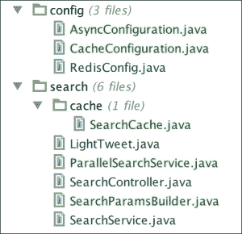

# 第二十三章：优化您的请求

在本章中，我们将研究不同的技术来提高我们应用程序的性能。

我们将实现优化 Web 应用程序的经典方法：缓存控制头、Gzipping、应用程序缓存和 ETags，以及更具反应性的内容，如异步方法调用和 WebSockets。

# 生产配置文件

在上一章中，我们看到了如何定义一个应用程序属性文件，该文件只在使用特定配置文件启动应用程序时才会被读取。我们将使用相同的方法，在 `src/main/resources` 目录中创建一个 `application-prod.properties` 文件，就在现有的 `application.properties` 文件旁边。这样，我们将能够使用优化设置配置生产环境。

我们将在这个文件中放入一些属性以开始。在第二章中，*处理表单和复杂的 URL 映射*，我们停用了 Thymeleaf 缓存，并强制翻译捆绑包在每次访问时重新加载。

这对开发很有用，但在生产中是无用且耗时的。所以让我们来解决这个问题：

```java
spring.thymeleaf.cache=true
spring.messages.cache-seconds=-1
```

缓存期限为 `-1` 表示永久缓存捆绑包。

现在，如果我们使用 "prod" 配置文件启动应用程序，模板和捆绑包应该永久缓存。

来自 "prod" 配置文件的属性确实会覆盖我们 `application.properties` 文件中声明的属性。

# Gzipping

**Gzipping** 是一种被浏览器广泛理解的压缩算法。您的服务器将提供压缩响应，这将消耗更多的 CPU 周期，但将节省带宽。

然后客户端浏览器将为解压资源和向用户显示资源而付费。

要利用 Tomcat 的 Gzipping 能力，只需将以下行添加到 `application-prod.properties` 文件中：

```java
server.tomcat.compression=on
server.tomcat.compressableMimeTypes=text/html,text/xml,text/css,text/plain,\
  application/json,application/xml,application/javascript
```

这将在提供与列表中指定的 MIME 类型匹配且长度大于 2048 字节的任何文件时启用 Tomcat 的 Gzipping 压缩。您可以将 `server.tomcat.compression` 设置为 `force` 以强制压缩，或者将其设置为数字值，如果您想更改 Gzipped 资产的最小长度值。

如果您想更多地控制压缩，比如压缩级别，或者想排除用户代理不进行压缩，您可以通过将 `org.eclipse.jetty:jetty-servlets` 依赖项添加到您的项目中，使用 Jetty 中的 `GzipFilter` 类。

这将自动触发`GzipFilterAutoConfiguration`类，可以通过以`spring.http.gzip`为前缀的一些属性进行配置。查看`GzipFilterProperties`以了解其自定义级别。

### 注意

有关更多信息，请参阅[`docs.spring.io/spring-boot/docs/current/reference/html/howto-embedded-servlet-containers.html#how-to-enable-http-response-compression`](http://docs.spring.io/spring-boot/docs/current/reference/html/howto-embedded-servlet-containers.html#how-to-enable-http-response-compression)上的文档。

# 缓存控制

缓存控制是由服务器发送的一组 HTTP 头，用于控制用户的浏览器允许缓存资源的方式。

在上一章中，我们已经看到 Spring Security 自动禁用了受保护资源的缓存。

如果我们想要从缓存控制中受益，我们必须首先禁用该功能：

```java
security.headers.cache=false

# Cache resources for 3 days
spring.resources.cache-period=259200
```

现在，启动应用程序，转到主页，并检查 Chrome 开发者控制台。您会看到我们的 JavaScript 文件已经被 Gzip 压缩和缓存，如下截图所示：


如果您想对缓存有更多控制，可以在配置中为自己的资源添加处理程序：

```java
@Override
public void addResourceHandlers(ResourceHandlerRegistry registry) {
    // This is just an example
    registry.addResourceHandler("/img/**")
            .addResourceLocations("classpath:/static/images/")
            .setCachePeriod(12);
}
```

我们还可以覆盖 Spring Security 的默认设置。如果我们想要为我们的 API 停用“无缓存控制”策略，我们可以像这样更改`ApiSecurityConfiguration`类：

```java
@Override
protected void configure(HttpSecurity http) throws Exception {
    http
        .antMatcher("/api/**")
// This is just an example – not required in our case
        .headers().cacheControl().disable()
        .httpBasic().and()
        .csrf().disable()
        .authorizeRequests()
        .antMatchers(HttpMethod.GET).hasRole("USER")
        .antMatchers(HttpMethod.POST).hasRole("ADMIN")
        .antMatchers(HttpMethod.PUT).hasRole("ADMIN")
        .antMatchers(HttpMethod.DELETE).hasRole("ADMIN")
        .anyRequest().authenticated();
}
```

# 应用程序缓存

现在我们的网络请求已经被压缩和缓存，我们可以采取的下一步措施是将昂贵操作的结果放入缓存以减少服务器负载。Twitter 搜索需要一些时间，并且会消耗我们在 Twitter API 上的应用程序请求比例。使用 Spring，我们可以轻松地缓存搜索并在每次使用相同参数调用搜索时返回相同的结果。

我们需要做的第一件事是使用`@EnableCache`注解激活 Spring 缓存。我们还需要创建一个`CacheManager`来解析我们的缓存。让我们在`config`包中创建一个`CacheConfiguration`类：

```java
package masterSpringMvc.config;

import org.springframework.cache.CacheManager;
import org.springframework.cache.annotation.EnableCaching;
import org.springframework.cache.concurrent.ConcurrentMapCache;
import org.springframework.cache.support.SimpleCacheManager;
import org.springframework.context.annotation.Bean;
import org.springframework.context.annotation.Configuration;

import java.util.Arrays;

@Configuration
@EnableCaching
public class CacheConfiguration {

    @Bean
    public CacheManager cacheManager() {
        SimpleCacheManager simpleCacheManager = new SimpleCacheManager();
        simpleCacheManager.setCaches(Arrays.asList(
                new ConcurrentMapCache("searches")
        ));
        return simpleCacheManager;
    }
}
```

在上一个例子中，我们使用了最简单的缓存抽象。还有其他可用的实现，比如`EhCacheCacheManager`或`GuavaCacheManager`，我们一会儿会用到。

现在我们已经配置了缓存，我们可以在我们的方法上使用`@Cacheable`注解。这样做时，Spring 将自动缓存方法的结果，并将其与当前参数关联以进行检索。

Spring 需要在缓存方法的 bean 周围创建代理。这通常意味着在同一个 bean 内调用缓存方法不会失败地使用 Spring 的缓存。

在我们的情况下，在`SearchService`类中，我们调用搜索操作的部分将受益于缓存。

作为预备步骤，最好将负责创建`SearchParameters`类的代码放在一个名为`SearchParamsBuilder`的专用对象中：

```java
package masterSpringMvc.search;

import org.springframework.social.twitter.api.SearchParameters;

import java.util.List;
import java.util.stream.Collectors;

public class SearchParamsBuilder {

    public static SearchParameters createSearchParam(String searchType, String taste) {
        SearchParameters.ResultType resultType = getResultType(searchType);
        SearchParameters searchParameters = new SearchParameters(taste);
        searchParameters.resultType(resultType);
        searchParameters.count(3);
        return searchParameters;
    }

    private static SearchParameters.ResultType getResultType(String searchType) {
        for (SearchParameters.ResultType knownType : SearchParameters.ResultType.values()) {
            if (knownType.name().equalsIgnoreCase(searchType)) {
                return knownType;
            }
        }
        return SearchParameters.ResultType.RECENT;
    }
}
```

这将帮助我们在我们的服务中创建搜索参数。

现在我们想为我们的搜索结果创建一个缓存。我们希望每次调用 Twitter API 时都会缓存。Spring 缓存注解依赖于代理来对`@Cacheable`方法进行检测。因此，我们需要一个新的类，其中的方法带有`@Cacheable`注解。

当您使用 Spring 抽象 API 时，您不知道缓存的底层实现。许多都要求缓存方法的返回类型和参数类型都是可序列化的。

`SearchParameters`不是可序列化的，这就是为什么我们将搜索类型和关键字（都是字符串）传递给缓存方法的原因。

由于我们想要将`LightTweets`对象放入缓存，我们希望使它们可序列化；这将确保它们始终可以从任何缓存抽象中写入和读取：

```java
public class LightTweet implements Serializable {
    // the rest of the code remains unchanged
}
```

让我们创建一个`SearchCache`类，并将其放在`search.cache`包中：

```java
package masterSpringMvc.search.cache;

import masterSpringMvc.search.LightTweet;
import masterSpringMvc.search.SearchParamsBuilder;
import org.apache.commons.logging.Log;
import org.apache.commons.logging.LogFactory;
import org.springframework.beans.factory.annotation.Autowired;
import org.springframework.boot.autoconfigure.social.TwitterProperties;
import org.springframework.cache.annotation.Cacheable;
import org.springframework.social.twitter.api.SearchParameters;
import org.springframework.social.twitter.api.Twitter;
import org.springframework.social.twitter.api.impl.TwitterTemplate;
import org.springframework.stereotype.Service;

import java.util.List;
import java.util.stream.Collectors;

@Service
public class SearchCache {
    protected final Log logger = LogFactory.getLog(getClass());
    private Twitter twitter;

    @Autowired
    public SearchCache(TwitterProperties twitterProperties) {
        this.twitter = new TwitterTemplate(twitterProperties.getAppId(), twitterProperties.getAppSecret());
    }

    @Cacheable("searches")
    public List<LightTweet> fetch(String searchType, String keyword) {
        logger.info("Cache miss for " + keyword);
        SearchParameters searchParam = SearchParamsBuilder.createSearchParam(searchType, keyword);
        return twitter.searchOperations()
                .search(searchParam)
                .getTweets().stream()
                .map(LightTweet::ofTweet)
                .collect(Collectors.toList());
    }
}
```

它真的不能再简单了。我们使用`@Cacheable`注释来指定将使用的缓存的名称。不同的缓存可能有不同的策略。

请注意，我们手动创建了一个新的`TwitterTemplate`方法，而不是像以前那样注入它。这是因为稍后我们将不得不从其他线程访问缓存。在 Spring Boot 的`TwitterAutoConfiguration`类中，`Twitter` bean 绑定到请求范围，因此在 Servlet 线程之外不可用。

有了这两个新对象，我们的`SearchService`类的代码就变成了这样：

```java
package masterSpringMvc.search;

import masterSpringMvc.search.cache.SearchCache;
import org.springframework.beans.factory.annotation.Autowired;
import org.springframework.context.annotation.Profile;
import org.springframework.stereotype.Service;

import java.util.List;
import java.util.stream.Collectors;

@Service
@Profile("!async")
public class SearchService implements TwitterSearch {
    private SearchCache searchCache;

    @Autowired
    public SearchService(SearchCache searchCache) {
        this.searchCache = searchCache;
    }

    @Override
    public List<LightTweet> search(String searchType, List<String> keywords) {
        return keywords.stream()
                .flatMap(keyword -> searchCache.fetch(searchType, keyword).stream())
                .collect(Collectors.toList());
    }
}
```

请注意，我们使用`@Profile("!async")`对服务进行了注释。这意味着只有在未激活`async`配置文件时，我们才会创建这个 bean。

稍后，我们将创建`TwitterSearch`类的另一个实现，以便能够在两者之间切换。

不错！假设我们重新启动应用程序并尝试一个大请求，比如以下内容：

`http://localhost:8080/search/mixed;keywords=docker,spring,spring%20boot,spring%20mvc,groovy,grails`

一开始可能需要一点时间，但然后我们的控制台将显示以下日志：

```java
2015-08-03 16:04:01.958  INFO 38259 --- [nio-8080-exec-8] m.search.cache.SearchCache               : Cache miss for docker
2015-08-03 16:04:02.437  INFO 38259 --- [nio-8080-exec-8] m.search.cache.SearchCache               : Cache miss for spring
2015-08-03 16:04:02.728  INFO 38259 --- [nio-8080-exec-8] m.search.cache.SearchCache               : Cache miss for spring boot
2015-08-03 16:04:03.098  INFO 38259 --- [nio-8080-exec-8] m.search.cache.SearchCache               : Cache miss for spring mvc
2015-08-03 16:04:03.383  INFO 38259 --- [nio-8080-exec-8] m.search.cache.SearchCache               : Cache miss for groovy
2015-08-03 16:04:03.967  INFO 38259 --- [nio-8080-exec-8] m.search.cache.SearchCache               : Cache miss for grails

```

之后，如果我们点击刷新，结果将立即显示，并且控制台中不会出现缓存未命中。

就我们的缓存而言，就缓存 API 而言还有很多内容。您可以使用以下方法对方法进行注释：

+   `@CachEvict`：这将从缓存中删除条目

+   `@CachePut`：这将把方法的结果放入缓存，而不会干扰方法本身

+   `@Caching`：这将重新组合缓存注释

+   `@CacheConfig`：这指向不同的缓存配置

`@Cacheable`注释也可以配置为根据某些条件缓存结果。

### 注意

有关 Spring 缓存的更多信息，请参阅以下文档：

[`docs.spring.io/spring/docs/current/spring-framework-reference/html/cache.html`](http://docs.spring.io/spring/docs/current/spring-framework-reference/html/cache.html)

## 缓存失效

目前，搜索结果将被永久缓存。使用默认的简单缓存管理器并不能给我们很多选项。我们可以做的另一件事是改进我们的应用程序缓存。由于我们的类路径中有 Guava，我们可以用以下代码替换缓存配置中的现有缓存管理器：

```java
package masterSpringMvc.config;

import com.google.common.cache.CacheBuilder;
import org.springframework.cache.CacheManager;
import org.springframework.cache.annotation.EnableCaching;
import org.springframework.cache.guava.GuavaCacheManager;
import org.springframework.context.annotation.Bean;
import org.springframework.context.annotation.Configuration;

import java.util.concurrent.TimeUnit;

@Configuration
@EnableCaching
public class CacheConfiguration {

    @Bean
    public CacheManager cacheManager() {
        GuavaCacheManager cacheManager = new GuavaCacheManager("searches");
        cacheManager
                .setCacheBuilder(
                        CacheBuilder.newBuilder()
                                .softValues()
                                .expireAfterWrite(10, TimeUnit.MINUTES)
                );
        return cacheManager;
    }
}
```

这将构建一个在 10 分钟后过期并使用软值的缓存，这意味着如果 JVM 内存不足，条目将被清理。

尝试玩弄 Guava 的缓存构建器。您可以为测试指定更小的时间单位，甚至指定不同的缓存策略。

### 注意

请参阅[`code.google.com/p/guava-libraries/wiki/CachesExplained`](https://code.google.com/p/guava-libraries/wiki/CachesExplained)上的文档。

## 分布式缓存

我们已经有了一个 Redis 配置文件。如果 Redis 可用，我们还可以将其用作缓存提供程序。这将允许我们在多个服务器上分发缓存。让我们更改`RedisConfig`类：

```java
package masterSpringMvc.config;

import org.springframework.beans.factory.annotation.Qualifier;
import org.springframework.cache.CacheManager;
import org.springframework.context.annotation.Bean;
import org.springframework.context.annotation.Configuration;
import org.springframework.context.annotation.Primary;
import org.springframework.context.annotation.Profile;
import org.springframework.data.redis.cache.RedisCacheManager;
import org.springframework.data.redis.connection.RedisConnectionFactory;
import org.springframework.data.redis.core.RedisTemplate;
import org.springframework.session.data.redis.config.annotation.web.http.EnableRedisHttpSession;

import java.util.Arrays;

@Configuration
@Profile("redis")
@EnableRedisHttpSession
public class RedisConfig {

    @Bean(name = "objectRedisTemplate")
    public RedisTemplate objectRedisTemplate(RedisConnectionFactory redisConnectionFactory) {
        RedisTemplate<Object, Object> template = new RedisTemplate<>();
        template.setConnectionFactory(redisConnectionFactory);
        return template;
    }

    @Primary @Bean
    public CacheManager cacheManager(@Qualifier("objectRedisTemplate") RedisTemplate template) {
        RedisCacheManager cacheManager = new RedisCacheManager(template);
        cacheManager.setCacheNames(Arrays.asList("searches"));
        cacheManager.setDefaultExpiration(36_000);
        return cacheManager;
    }
}
```

有了这个配置，如果我们使用"Redis"配置文件运行我们的应用程序，那么 Redis 缓存管理器将被用来代替`CacheConfig`类中定义的缓存管理器，因为它被`@Primary`注释。

这将允许缓存在需要在多个服务器上进行扩展时进行分布。Redis 模板用于序列化缓存返回值和参数，并且需要对象是`Serializable`。

# 异步方法

我们的应用程序仍然存在瓶颈；当用户搜索十个关键字时，每次搜索都会按顺序执行。我们可以通过使用不同的线程并同时启动所有搜索来轻松提高应用程序的速度。

要启用 Spring 的异步功能，必须使用`@EnableAsync`注释。这将透明地执行任何使用`@Async`注释的方法，使用`java.util.concurrent.Executor`。

可以通过实现`AsyncConfigurer`接口来自定义默认的执行程序。让我们在`config`包中创建一个名为`AsyncConfig`的新配置类：

```java
package masterSpringMvc.config;

import org.apache.commons.logging.Log;
import org.apache.commons.logging.LogFactory;
import org.springframework.aop.interceptor.AsyncUncaughtExceptionHandler;
import org.springframework.context.annotation.Configuration;
import org.springframework.scheduling.annotation.AsyncConfigurer;
import org.springframework.scheduling.annotation.EnableAsync;

import java.util.concurrent.Executor;
import java.util.concurrent.Executors;

@Configuration
@EnableAsync
public class AsyncConfiguration implements AsyncConfigurer {

    protected final Log logger = LogFactory.getLog(getClass());

    @Override
    public Executor getAsyncExecutor() {
        return Executors.newFixedThreadPool(10);
    }

    @Override
    public AsyncUncaughtExceptionHandler getAsyncUncaughtExceptionHandler() {
        return (ex, method, params) -> logger.error("Uncaught async error", ex);
    }
}
```

通过这种配置，我们确保在整个应用程序中不会分配超过 10 个线程来处理我们的异步任务。这在 Web 应用程序中非常重要，因为每个客户端都有一个专用的线程。您使用的线程越多，它们阻塞的时间越长，您可以处理的客户端请求就越少。

让我们注释我们的搜索方法并使其异步化。我们需要使其返回`Future`的子类型，这是一个表示异步结果的 Java 并发类。

我们将创建`TwitterSearch`类的新实现，该实现将在不同的线程中查询搜索 API。该实现有点棘手，所以我会将其分解成小部分。

首先，我们需要使用`@Async`注解对将查询 API 的方法进行注释，以告诉 Spring 使用我们的执行程序安排任务。同样，Spring 将使用代理来完成其工作，因此这个方法必须在调用它的服务的不同类中。如果这个组件也能使用我们的缓存，那就太好了。这将导致我们创建这个组件：

```java
@Component
private static class AsyncSearch {
    protected final Log logger = LogFactory.getLog(getClass());
    private SearchCache searchCache;

    @Autowired
    public AsyncSearch(SearchCache searchCache) {
        this.searchCache = searchCache;
    }

    @Async
    public ListenableFuture<List<LightTweet>> asyncFetch(String searchType, String keyword) {
        logger.info(Thread.currentThread().getName() + " - Searching for " + keyword);
        return new AsyncResult<>(searchCache.fetch(searchType, keyword));
    }
}
```

现在不要创建这个类。让我们先看看我们的服务需要什么。

`ListenableFuture`抽象允许我们在未来完成后添加回调，无论是在正确结果的情况下还是在发生异常时。

等待一堆异步任务的算法看起来像这样：

```java
@Override
public List<LightTweet> search(String searchType, List<String> keywords) {
    CountDownLatch latch = new CountDownLatch(keywords.size());
    List<LightTweet> allTweets = Collections.synchronizedList(new ArrayList<>());
    keywords
            .stream()
            .forEach(keyword -> asyncFetch(latch, allTweets, searchType, keyword));

    await(latch);
    return allTweets;
}
```

如果您不了解`CountDownLatch`方法，它只是一个简单的阻塞计数器。

`await()`方法将等待，直到锁存器达到 0 才解锁线程。

在前面的代码中显示的`asyncFetch`方法将为我们的`asynFetch`方法附加一个回调。回调将结果添加到`allTweets`列表中，并递减锁存器。一旦每个回调都被调用，该方法将返回所有推文。

明白了吗？这是最终代码：

```java
package masterSpringMvc.search;

import masterSpringMvc.search.cache.SearchCache;
import org.apache.commons.logging.Log;
import org.apache.commons.logging.LogFactory;
import org.springframework.beans.factory.annotation.Autowired;
import org.springframework.context.annotation.Profile;
import org.springframework.scheduling.annotation.Async;
import org.springframework.scheduling.annotation.AsyncResult;
import org.springframework.social.twitter.api.SearchParameters;
import org.springframework.stereotype.Component;
import org.springframework.stereotype.Service;
import org.springframework.util.concurrent.ListenableFuture;

import java.util.ArrayList;
import java.util.Collections;
import java.util.List;
import java.util.concurrent.CountDownLatch;

@Service
@Profile("async")
public class ParallelSearchService implements TwitterSearch {
    private final AsyncSearch asyncSearch;

    @Autowired
    public ParallelSearchService(AsyncSearch asyncSearch) {
        this.asyncSearch = asyncSearch;
    }

    @Override
    public List<LightTweet> search(String searchType, List<String> keywords) {
        CountDownLatch latch = new CountDownLatch(keywords.size());
        List<LightTweet> allTweets = Collections.synchronizedList(new ArrayList<>());

        keywords
                .stream()
                .forEach(keyword -> asyncFetch(latch, allTweets, searchType, keyword));

        await(latch);
        return allTweets;
    }

    private void asyncFetch(CountDownLatch latch, List<LightTweet> allTweets, String searchType, String keyword) {
        asyncSearch.asyncFetch(searchType, keyword)
                .addCallback(
                        tweets -> onSuccess(allTweets, latch, tweets),
                        ex -> onError(latch, ex));
    }

    private void await(CountDownLatch latch) {
        try {
            latch.await();
        } catch (InterruptedException e) {
            throw new IllegalStateException(e);
        }
    }

    private static void onSuccess(List<LightTweet> results, CountDownLatch latch, List<LightTweet> tweets) {
        results.addAll(tweets);
        latch.countDown();
    }

    private static void onError(CountDownLatch latch, Throwable ex) {
        ex.printStackTrace();
        latch.countDown();
    }

    @Component
    private static class AsyncSearch {
        protected final Log logger = LogFactory.getLog(getClass());
        private SearchCache searchCache;

        @Autowired
        public AsyncSearch(SearchCache searchCache) {
            this.searchCache = searchCache;
        }

        @Async
        public ListenableFuture<List<LightTweet>> asyncFetch(String searchType, String keyword) {
            logger.info(Thread.currentThread().getName() + " - Searching for " + keyword);
            return new AsyncResult<>(searchCache.fetch(searchType, keyword));
        }
    }
}
```

现在，要使用这个实现，我们需要使用`async`配置文件运行应用程序。

我们可以通过用逗号分隔它们来同时运行多个活动配置文件，如下所示：

`--spring.profiles.active=redis,async`

如果我们对多个术语进行搜索，我们可以看到类似这样的东西：

```java
pool-1-thread-3 - Searching groovy
pool-1-thread-1 - Searching spring
pool-1-thread-2 - Searching java
```

这表明不同的搜索是并行进行的。

Java 8 实际上引入了一种称为`CompletableFuture`的新类型，这是一个更好的 API 来操作 futures。可完成的未来的主要问题是没有执行程序可以在没有一点代码的情况下与它们一起工作。这超出了本文的范围，但您可以查看我的博客了解有关该主题的文章：[`geowarin.github.io/spring/2015/06/12/completable-futures-with-spring-async.html`](http://geowarin.github.io/spring/2015/06/12/completable-futures-with-spring-async.html)。

### 注意

**免责声明**

以下部分包含大量的 JavaScript。显然，我认为你应该看一下代码，特别是如果 JavaScript 不是你最喜欢的语言的话。现在是学习它的时候了。话虽如此，即使 WebSocket 非常酷，也不是必需的。您可以放心地跳到最后一章并立即部署您的应用程序。

# ETags

我们的 Twitter 结果被整洁地缓存，因此刷新结果页面的用户不会触发对 Twitter API 的额外搜索。但是，即使结果没有改变，响应也会多次发送给这个用户，这将浪费带宽。

ETag 是 Web 响应数据的哈希值，并作为标头发送。客户端可以记住资源的 ETag，并使用`If-None-Match`标头将最后已知版本发送到服务器。这使得服务器可以在请求在此期间不发生变化时回答`304 Not Modified`。

Spring 有一个特殊的 Servlet 过滤器，称为`ShallowEtagHeaderFilter`，用于处理 ETags。只需将其添加为`MasterSpringMvc4Application`配置类中的一个 bean：

```java
@Bean
public Filter etagFilter() {
    return new ShallowEtagHeaderFilter();
}
```

只要响应没有缓存控制标头，这将自动生成响应的 ETags。

现在，如果我们查询我们的 RESTful API，我们可以看到 ETag 随服务器响应一起发送：

```java
> http GET 'http://localhost:8080/api/search/mixed;keywords=spring' -a admin:admin
HTTP/1.1 200 OK
Content-Length: 1276
Content-Type: application/json;charset=UTF-8
Date: Mon, 01 Jun 2015 11:29:51 GMT
ETag: "00a66d6dd835b6c7c60638eab976c4dd7"
Server: Apache-Coyote/1.1
Set-Cookie: JSESSIONID=662848E4F927EE9A1BA2006686ECFE4C; Path=/; HttpOnly

```

现在，如果我们再次请求相同的资源，在`If-None-Match`标头中指定我们知道的最后一个 ETag，服务器将自动以`304 Not Modified`状态响应：

```java
> http GET 'http://localhost:8080/api/search/mixed;keywords=spring' If-None-Match:'"00a66d6dd835b6c7c60638eab976c4dd7"' -a admin:admin
HTTP/1.1 304 Not Modified
Date: Mon, 01 Jun 2015 11:34:21 GMT
ETag: "00a66d6dd835b6c7c60638eab976c4dd7"
Server: Apache-Coyote/1.1
Set-Cookie: JSESSIONID=CA956010CF268056C241B0674C6C5AB2; Path=/; HttpOnly

```

### 提示

由于我们搜索的并行性质，不同关键字获取的推文可能以不同的顺序到达，这将导致 ETag 发生变化。如果您希望这种技术适用于多个搜索，请在将搜索结果发送到客户端之前考虑对搜索结果进行排序。

如果我们想利用它，显然需要重写我们的客户端代码来处理它们。我们将看到一个简单的解决方案，使用 jQuery 来做到这一点，使用浏览器的本地存储来保存用户的最新查询。

首先，从我们的模型中删除`tweets`变量；我们将不再从服务器进行搜索。您将需要修改一个或两个测试以反映这一变化。

在继续之前，让我们将 lodash 添加到我们的 JavaScript 库中。如果您不了解 lodash，可以将其添加到项目依赖项中，如下所示：

```java
compile 'org.webjars.bower:lodash:3.9.3'
```

将其添加到`default.html`布局中，就在 materialize 的 JavaScript 下面：

```java
<script src="img/lodash.js"></script>
```

我们将修改`resultPage.html`文件，并将推文应该出现的部分留空：

```java
<!DOCTYPE html>
<html 

      layout:decorator="layout/default">
<head lang="en">
    <title>Hello twitter</title>
</head>
<body>
<div class="row" layout:fragment="content">

    <h2 class="indigo-text center" th:text="|Tweet results for ${search}|">Tweets</h2>

    <ul id="tweets" class="collection">
 </ul>
</div>
</body>
</html>
```

然后，我们将在页面底部添加一个脚本元素，就在关闭 body 之前：

```java
<script layout:fragment="script" th:inline="javascript">
    /*<![CDATA[*/
    var baseUrl = /*[[@{/api/search}]]*/ "/";
    var currentLocation = window.location.href;
    var search = currentLocation.substr(currentLocation.lastIndexOf('/'));
    var url = baseUrl + search;
    /*]]>*/
</script>
```

上述脚本将负责构建我们请求的 URL。我们将通过发出简单的 jQuery AJAX 调用来使用它：

```java
$.ajax({
    url: url,
    type: "GET",
    beforeSend: setEtag,
    success: onResponse
});
```

我们将使用`beforeSend`回调在发出调用之前有机会修改请求标头：

```java
function getLastQuery() {
    return JSON.parse(localStorage.getItem('lastQuery')) || {};
}

function storeQuery(query) {
    localStorage.setItem('lastQuery', JSON.stringify(query));
}

function setEtag(xhr) {
    xhr.setRequestHeader('If-None-Match', getLastQuery().etag)
}
```

如您所见，我们可以轻松地从本地存储中读取和写入。这里的问题是本地存储只能处理字符串，因此我们必须将查询对象解析和序列化为 JSON。

如果 HTTP 状态是`304 Not Modified`，我们可以通过从本地存储中检索内容来处理响应：

```java
function onResponse(tweets, status, xhr) {
  if (xhr.status == 304) {
      console.log('Response has not changed');
      tweets = getLastQuery().tweets
  }

  var etag = xhr.getResponseHeader('Etag');
  storeQuery({tweets: tweets, etag: etag});

  displayTweets(tweets);
}

function displayTweets(tweets) {
  $('#tweets').empty();
  $.each(tweets, function (index, tweet) {
      addTweet(tweet);
  })
}
```

对于接下来将看到的`addTweet`函数，我使用了 lodash，这是一个非常有用的 JavaScript 实用程序库，用于生成模板。将推文添加到页面的函数可以编写如下：

```java
function addTweet(tweet) {
    var template = _.template('<li class="collection-item avatar">' +
        '' +
        '<span class="title">${tweet.user}</span>' +
        '<p>${tweet.text}</p>' +
        '</li>');

    $('#tweets').append(template({tweet: tweet}));
}
```

这是很多 JavaScript！使用 Backbone.js 等库将这种模式概括为单页面应用程序可能更有意义。尽管如此，这将作为一个简单的示例，展示如何在应用程序中实现 ETags。

如果您尝试多次刷新搜索页面，您会发现内容不会改变，并且会立即显示：


ETags 还有其他用途，例如用于事务的乐观锁定（它让您知道客户端应该在任何时间上使用对象的哪个版本）。在服务器端在发送数据之前对数据进行哈希处理也是额外的工作，但它将节省带宽。

# WebSockets

我们可以考虑的另一种优化是在数据可用时将数据发送到客户端。由于我们在多个线程中获取搜索结果，数据将以多个块的形式到达。我们可以逐步发送它们，而不是等待所有结果。

Spring 对 WebSockets 有很好的支持，这是一种允许客户端与服务器保持长时间连接的协议。数据可以在连接的两端推送到 WebSockets，消费者将实时获取数据。

我们将使用一个名为 SockJS 的 JavaScript 库，以确保与所有浏览器兼容。如果我们的用户使用过时的浏览器，Sockjs 将自动切换到另一种策略。

我们还将使用 StompJS 连接到我们的消息代理。

将以下库添加到您的构建中：

```java
compile 'org.springframework.boot:spring-boot-starter-websocket'
compile 'org.springframework:spring-messaging'

compile 'org.webjars:sockjs-client:1.0.0'
compile 'org.webjars:stomp-websocket:2.3.3'
```

将 WebJars 添加到我们的默认 Thymeleaf 模板中：

```java
<script src="img/sockjs.js"></script>
<script src="img/stomp.js"></script>
```

要在我们的应用程序中配置 WebSockets，我们还需要添加一些配置：

```java
@Configuration
@EnableWebSocketMessageBroker
public class WebSocketConfiguration extends AbstractWebSocketMessageBrokerConfigurer {

    @Override
    public void configureMessageBroker(MessageBrokerRegistry config) {
        config.enableSimpleBroker("/topic");
        config.setApplicationDestinationPrefixes("/ws");
    }

    @Override
    public void registerStompEndpoints(StompEndpointRegistry registry) {
        registry.addEndpoint("/twitterSearch").withSockJS();
    }

}
```

这将配置我们应用程序中可用的不同频道。SockJS 客户端将连接到`twitterSearch`端点，并将数据推送到服务器上的`/ws/ channel`，并能够监听`/topic/`以进行更改。

这将允许我们在新的控制器中注入`SimpMessagingTemplate`，以便通过`/topic/searchResult`频道向客户端推送数据，如下所示：

```java
@Controller
public class SearchSocketController {
    private CachedSearchService searchService;
    private SimpMessagingTemplate webSocket;

    @Autowired
    public SearchSocketController(CachedSearchService searchService, SimpMessagingTemplate webSocket) {
        this.searchService = searchService;
        this.webSocket = webSocket;
    }

    @MessageMapping("/search")
    public void search(@RequestParam List<String> keywords) throws Exception {
        Consumer<List<LightTweet>> callback = tweet -> webSocket.convertAndSend("/topic/searchResults", tweet);
        twitterSearch(SearchParameters.ResultType.POPULAR, keywords, callback);
    }

    public void twitterSearch(SearchParameters.ResultType resultType, List<String> keywords, Consumer<List<LightTweet>> callback) {
        keywords.stream()
            .forEach(keyword -> {
                searchService.search(resultType, keyword)
                    .addCallback(callback::accept, Throwable::printStackTrace);
            });
    }
}
```

在我们的`resultPage`中，JavaScript 代码非常简单：

```java
var currentLocation = window.location.href;
var search = currentLocation.substr(currentLocation.lastIndexOf('=') + 1);

function connect() {
  var socket = new SockJS('/hello');
  stompClient = Stomp.over(socket);
  // stompClient.debug = null;
  stompClient.connect({}, function (frame) {
      console.log('Connected: ' + frame);

      stompClient.subscribe('/topic/searchResults', function (result) {
          displayTweets(JSON.parse(result.body));
      });

      stompClient.send("/app/search", {}, JSON.stringify(search.split(',')));
  });
}
```

`displayTweets`函数基本上与以前相同：

```java
function displayTweets(tweets) {
    $.each(tweets, function (index, tweet) {
        addTweet(tweet);
    })
}

function addTweet(tweet) {
    var template = _.template('<li class="collection-item avatar">' +
        '' +
        '<span class="title">${tweet.userName}</span>' +
        '<p>${tweet.text}</p>' +
        '</li>');

    $('#tweets').append(template({tweet: tweet}));
}
```

就是这样！客户端现在将实时接收应用程序中所有搜索的结果！

在将其推向生产之前，这将需要更多的工作。以下是一些想法：

+   为客户端创建子频道，以便私下监听更改

+   当客户端使用完毕时关闭频道

+   为新推文添加 CSS 过渡，以便用户感觉到它是实时的

+   使用真正的代理，如 RabbitMQ，允许后端与连接一起扩展

WebSocket 还有比这个简单示例更多的内容。不要忘记查看[`docs.spring.io/spring/docs/current/spring-framework-reference/html/websocket.html`](http://docs.spring.io/spring/docs/current/spring-framework-reference/html/websocket.html)上的文档以获取更多信息。

# 检查点

在本章中，我们创建了两个新的配置：`AsyncConfiguration`，它将允许我们使用`@Async`注解将任务提交给执行器，并且`CacheConfiguration`，它将创建一个`CacheManager`接口，并允许我们使用`@Cacheable`注解。由于我们可以使用 Redis 作为缓存管理器，我们还修改了`RedisConfig`类。

我们创建了一个`SearchCache`类，其中包含了推文的缓存，现在我们有两个`TwitterSearch`实现可供选择：老旧的`SearchService`，它将同步获取每个结果，以及`ParallelSearchService`，它将在不同的线程中发出每个查询：



# 总结

在本章中，我们看到了与性能改进相关的两种不同哲学。一开始，我们试图通过缓存数据并尽可能少地使用与服务器的连接来减少客户端使用的带宽。

然而，在第二部分，我们开始做一些更高级的事情，允许搜索并行运行，并且每个客户端通过 Web 套接字与服务器保持同步的持久连接。这将允许客户端实时接收更新，我们的应用程序将感觉更具反应性，但会消耗更多的线程。

我强烈建议您在我们进入下一章并永久部署我们的应用程序之前，对结果进行完善！

