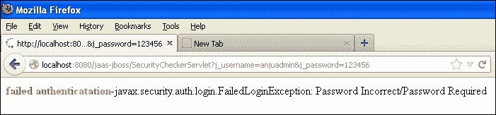
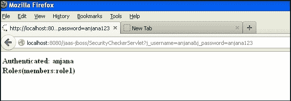
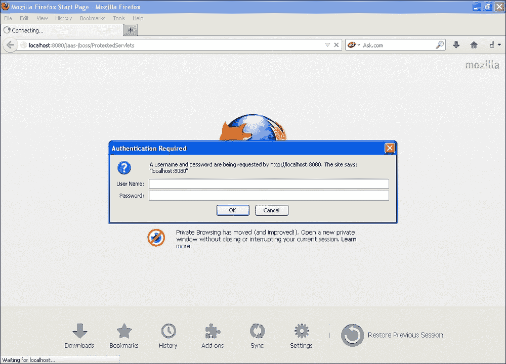
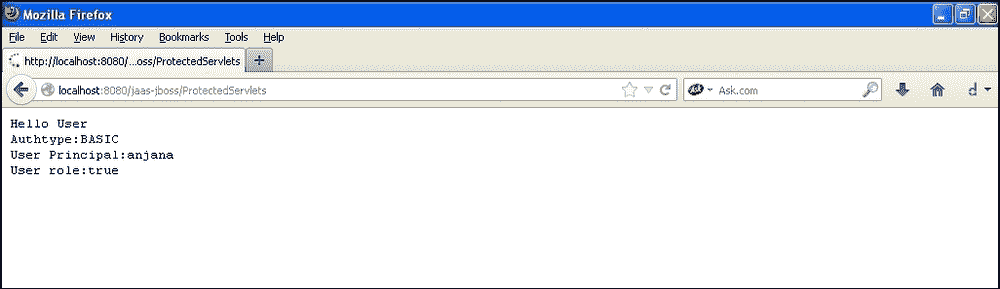
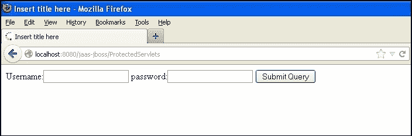
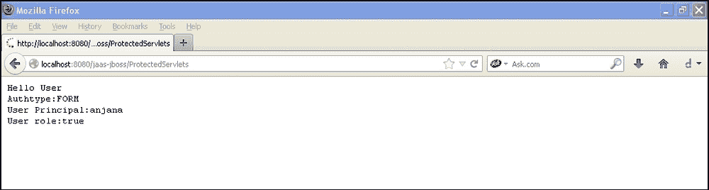
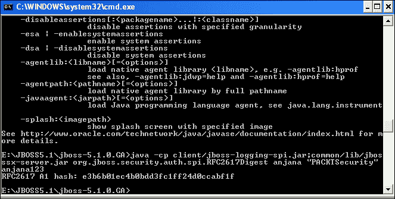
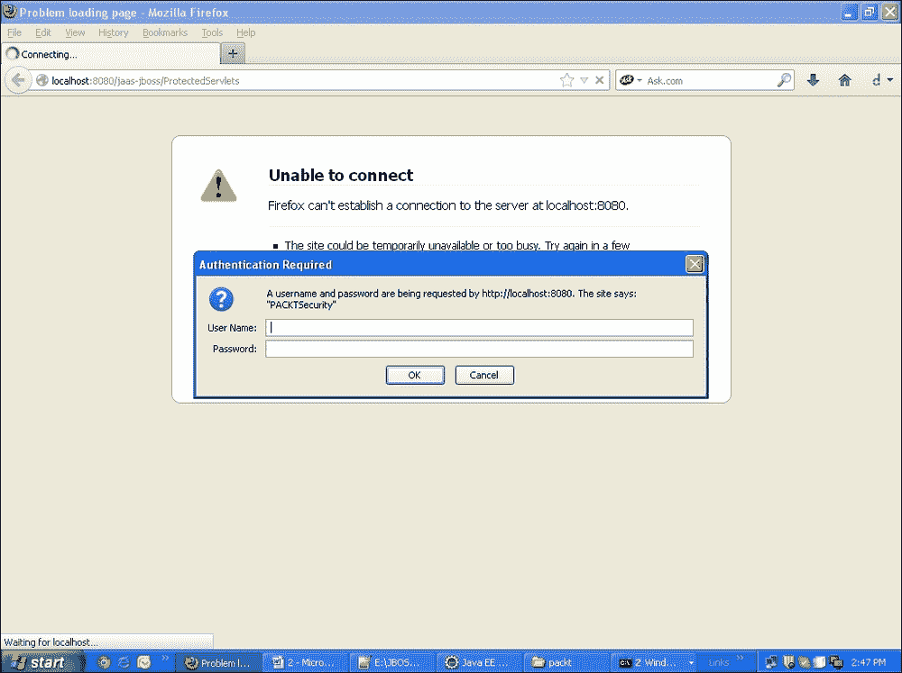

# 第一章：基本安全

在本章中，我们将涵盖：

+   基于 JAAS 的 JSP 的安全身份验证

+   基于 JAAS 的 servlet 安全身份验证

+   基于 servlet 的基本容器身份验证

+   基于 servlet 的基于表单的身份验证

+   使用开放 LDAP 和 servlet 进行基于表单的身份验证

+   在 servlet 上进行哈希/摘要身份验证

+   JAX-WS 和 JAX-RS 的基本身份验证

+   启用和禁用文件列表

# 介绍

身份验证和授权已成为所有 Web 应用程序的重要组成部分。身份验证涉及检查谁正在访问应用程序。授权是检查用户访问权限的过程。在本机方法中，我们通常将用户的信息存储在数据库中，并在应用程序中编写代码。我们还为用户创建角色并进行映射。在这里，它与应用程序紧密耦合，因为当我们连接到新数据库或使用其他工具（如 LDAP 或 Kerbose）时，我们必须重写整个代码。但是有高级选项来处理身份验证和授权。 J2EE 容器通过配置 XML 文件提供了不同的用户身份验证方式。我们可以将身份验证分类为两种类型，即基于容器的身份验证和授权以及应用程序级别的身份验证和授权。

J2EE 容器提供接口和类来提供身份验证。在本章中，我们将看到如何使用 JAAS，基本身份验证和基于表单的身份验证来对用户进行身份验证。

在本书中，我们使用了 JAAS，因为它是身份验证的标准框架。 JAAS 基于**PAM**（可插入身份验证模块）框架工作。

身份验证和授权可以通过以下方式提供：

+   基本身份验证：在这种技术中，应用程序服务器提供带有用户名和密码文本框的登录表单，因此您无需自己创建登录页面。您还将知道调用者身份。

+   基于表单的身份验证：在这种技术中，容器处理身份验证，但登录表单由用户提供为 JSP 页面。

+   基于摘要的身份验证：在这种方法中，用户凭据使用特定算法进行哈希处理。

+   基于证书的身份验证：在这种技术中，客户端和服务器交换证书以验证其身份。获得 SSL 证书使网络上的数据传输安全。

# 基于 JAAS 的 JSP 的安全身份验证

部署描述符是所有 Web 应用程序的主要配置文件。容器在启动任何应用程序之前首先查找部署描述符。

部署描述符是`WEB-INF`文件夹中的 XML 文件`web.xml`。

如果查看`web.xml`文件的 XSD，可以看到与安全相关的模式。

可以使用以下 URL 访问模式：[`java.sun.com/xml/ns/j2ee/web-app_2_4.xsd`](http://java.sun.com/xml/ns/j2ee/web-app_2_4.xsd)。

以下是 XSD 中可用的模式元素：

```java
<xsd:element name="security-constraint" type="j2ee:security-constraintType"/>
<xsd:element name="login-config" type="j2ee:login-configType"/>
<xsd:element name="security-role "type="j2ee:security-roleType"/>
```

## 准备就绪

您将需要以下内容来演示身份验证和授权：

+   JBoss 7

+   Eclipse Indigo 3.7

+   创建一个动态 Web 项目，命名为`Security Demo`

+   创建一个包，`com.servlets`

+   在`WebContent`文件夹中创建一个 XML 文件，`jboss-web.xml`

+   创建两个 JSP 页面，`login.jsp`和`logoff.jsp`

## 如何做...

执行以下步骤以实现 JSP 的基于 JAAS 的安全性：

1.  编辑`login.jsp`文件，使用输入字段`j_username`，`j_password`，并将其提交给`SecurityCheckerServlet`：

```java
<%@ page contentType="text/html; charset=UTF-8" %>
<%@ page language="java" %>
<html >
  <HEAD>
    <TITLE>PACKT Login Form</TITLE>
    <SCRIPT>
      function submitForm() {
        var frm = document. myform;
        if( frm.j_username.value == "" ) {
          alert("please enter your username, its empty");
          frm.j_username.focus();
          return ;
        }

        if( frm.j_password.value == "" ) {
          alert("please enter the password,its empty");
          frm.j_password.focus();
          return ;
        }
        frm.submit();
      }
    </SCRIPT>
  </HEAD>
  <BODY>
    <FORM name="myform" action="SecurityCheckerServlet" METHOD=get>
    <TABLE width="100%" border="0" cellspacing="0" cellpadding="1" bgcolor="white">
    <TABLE width="100%" border="0" cellspacing="0" cellpadding="5">
    <TR align="center">
    <TD align="right" class="Prompt"></TD>
    <TD align="left">
      <INPUT type="text" name="j_username" maxlength=20>
    </TD>
    </TR>
    <TR align="center">
    <TD align="right" class="Prompt"> </TD>
    <TD align="left">
    <INPUT type="password"name="j_password" maxlength=20 >
    <BR>
    <TR align="center">
    <TD align="right" class="Prompt"> </TD>
    <TD align="left">
    <input type="submit" onclick="javascript:submitForm();" value="Login">
    </TD>
    </TR>
    </TABLE>
    </FORM>
  </BODY>
</html>
```

`j_username`和`j_password`是使用基于表单的身份验证的指示符。

1.  让我们修改`web.xml`文件以保护所有以`.jsp`结尾的文件。如果您尝试访问任何 JSP 文件，您将收到一个登录表单，该表单反过来调用`SecurityCheckerServlet`文件对用户进行身份验证。您还可以看到角色信息被显示。按照以下代码片段中所示更新`web.xml`文件。我们使用了`2.5 xsd`。以下代码需要放置在`web.xml`文件中的`webapp`标签之间：

```java
<display-name>jaas-jboss</display-name>
 <welcome-file-list>
    <welcome-file>index.html</welcome-file>
    <welcome-file>index.htm</welcome-file>
    <welcome-file>index.jsp</welcome-file>
    <welcome-file>default.html</welcome-file>
    <welcome-file>default.htm</welcome-file>
    <welcome-file>default.jsp</welcome-file>
 </welcome-file-list>

 <security-constraint>
    <web-resource-collection>
     <web-resource-name>something</web-resource-name>
     <description>Declarative security tests</description>
     <url-pattern>*.jsp</url-pattern>
     <http-method>HEAD</http-method>
     <http-method>GET</http-method>
     <http-method>POST</http-method>
     <http-method>PUT</http-method>
     <http-method>DELETE</http-method>
    </web-resource-collection>
    <auth-constraint>
     <role-name>role1</role-name>
    </auth-constraint>
    <user-data-constraint>
     <description>no description</description>
     <transport-guarantee>NONE</transport-guarantee>
    </user-data-constraint>
 </security-constraint>
 <login-config>
    <auth-method>FORM</auth-method>
    <form-login-config>
     <form-login-page>/login.jsp</form-login-page>
     <form-error-page>/logoff.jsp</form-error-page>
    </form-login-config>
 </login-config>
 <security-role>
    <description>some role</description>
    <role-name>role1</role-name>
 </security-role>
 <security-role>
    <description>packt managers</description>
    <role-name>manager</role-name>
 </security-role>
 <servlet>
    <description></description>
    <display-name>SecurityCheckerServlet</display-name>
    <servlet-name>SecurityCheckerServlet</servlet-name>
    <servlet-class>com.servlets.SecurityCheckerServlet</servlet-class>
 </servlet>
 <servlet-mapping>
    <servlet-name>SecurityCheckerServlet</servlet-name>
    <url-pattern>/SecurityCheckerServlet</url-pattern>
 </servlet-mapping>
```

1.  JAAS 安全检查器和凭证处理程序：Servlet 是一个安全检查器。由于我们正在使用 JAAS，这是用于身份验证的标准框架，为了执行以下程序，您需要导入`org.jboss.security.SimplePrincipal`和`org.jboss.security.auth.callback.SecurityAssociationHandle`并添加所有必要的导入。在以下的`SecurityCheckerServlet`中，我们从 JSP 文件获取输入并将其传递给`CallbackHandler`。

然后我们将 Handler 对象传递给`LoginContext`类，该类具有`login()`方法来进行身份验证。在成功身份验证后，它将为用户创建`Subject`和`Principal`，并提供用户详细信息。我们使用迭代器接口来迭代`LoginContext`对象，以获取用于身份验证的用户详细信息。

在`SecurityCheckerServlet`类中：

```java
package com.servlets;
public class SecurityCheckerServlet extends HttpServlet {
  private static final long serialVersionUID = 1L;

    public SecurityCheckerServlet() {
      super();
    }

    protected void doGet(HttpServletRequest request, HttpServletResponse response) throws ServletException, IOException {
       char[] password = null;
       PrintWriter out=response.getWriter();
       try
       {

         SecurityAssociationHandler handler = new SecurityAssociationHandler();
         SimplePrincipal user = new SimplePrincipal(request.getParameter("j_username"));
         password=request.getParameter("j_password").toCharArray();
         handler.setSecurityInfo(user, password);
         System.out.println("password"+password);

         CallbackHandler myHandler = new UserCredentialHandler(request.getParameter("j_username"),request.getParameter("j_password"));
         LoginContext lc = new LoginContext("other", handler);
         lc.login();

         Subject subject = lc.getSubject();
         Set principals = subject.getPrincipals();

         List l=new ArrayList();
         Iterator it = lc.getSubject().getPrincipals().iterator();
         while (it.hasNext()) {
           System.out.println("Authenticated: " + it.next().toString() + "<br>");
           out.println("<b><html><body><font color='green'>Authenticated: " + request.getParameter("j_username")+"<br/>"+it.next().toString() + "<br/></font></b></body></html>");
              }
           it = lc.getSubject().getPublicCredentials(Properties.class).iterator();
           while (it.hasNext()) System.out.println(it.next().toString());

           lc.logout();
       }     catch (Exception e) {
             out.println("<b><font color='red'>failed authenticatation.</font>-</b>"+e);

       }
    }
  protected void doPost(HttpServletRequest request, HttpServletResponse response) throws ServletException, IOException {
   }

}
```

创建`UserCredentialHandler`文件：

```java
package com.servlets;
class UserCredentialHandler implements CallbackHandler {
  private String user, pass;

  UserCredentialHandler(String user, String pass) {
    super();
    this.user = user;
    this.pass = pass;
  }
  @Override
  public void handle(Callback[] callbacks) throws IOException, UnsupportedCallbackException {
      for (int i = 0; i < callbacks.length; i++) {
        if (callbacks[i] instanceof NameCallback) {
          NameCallback nc = (NameCallback) callbacks[i];
          nc.setName(user);
        } else if (callbacks[i] instanceof PasswordCallback) {
          PasswordCallback pc = (PasswordCallback) callbacks[i];
          pc.setPassword(pass.toCharArray());
        } else {
        throw new UnsupportedCallbackException(callbacks[i], "Unrecognized Callback");
      }
    }
  }
 }
```

在`jboss-web.xml`文件中：

```java
<?xml version="1.0" encoding="UTF-8"?>
<jboss-web>
<security-domain>java:/jaas/other</security-domain>
</jboss-web>
```

`Other`是在`login-config.xml`文件中定义的应用程序策略的名称。

所有这些将被打包为`.war`文件。

1.  配置 JBoss 应用服务器。转到 JBoss 中的`jboss-5.1.0.GA\server\default\conf\login-config.xml`。如果您查看文件，您可以看到用于数据库 LDAP 的各种配置以及使用属性文件的简单配置，我已在以下代码片段中使用：

```java
<application-policy name="other">
  <!-- A simple server login module, which can be used when the number of users is relatively small. It uses two properties files:
  users.properties, which holds users (key) and their password (value).
  roles.properties, which holds users (key) and a comma-separated list of
  their roles (value).
  The unauthenticatedIdentity property defines the name of the principal
  that will be used when a null username and password are presented as is
  the case for an unauthenticated web client or MDB. If you want to allow such users to be authenticated add the property, e.g.,
    unauthenticatedIdentity="nobody"
  -->
  <authentication>
  <login-module code="org.jboss.security.auth.spi.UsersRolesLoginModule"
    flag="required"/>
    <module-option name="usersProperties">users.properties</module-option>
    <module-option name="rolesProperties">roles.properties</module-option>
    <module-option name="unauthenticatedIdentity">nobody</module-option> 
  </authentication>
</application-policy>
```

1.  在相同的文件夹中创建`users.properties`文件。以下是带有用户名映射角色的`Users.properties`文件。

User.properties

```java
anjana=anjana123
```

roles.properties

```java
anjana=role1
```

1.  重新启动服务器。

### 提示

**下载示例代码**

您可以从您在[`www.PacktPub.com`](http://www.PacktPub.com)购买的所有 Packt 图书的帐户中下载示例代码文件。如果您在其他地方购买了本书，您可以访问[`www.PacktPub.com/support`](http://www.PacktPub.com/support)并注册以直接通过电子邮件接收文件。

## 它是如何工作的...

JAAS 由一组接口组成，用于处理身份验证过程。它们是：

+   `CallbackHandler`和`Callback`接口

+   `LoginModule`接口

+   `LoginContext`

`CallbackHandler`接口获取用户凭据。它处理凭据并将它们传递给`LoginModule`，后者对用户进行身份验证。

JAAS 是特定于容器的。每个容器都将有自己的实现，这里我们使用 JBoss 应用服务器来演示 JAAS。

在我的先前的示例中，我已经明确调用了 JASS 接口。

`UserCredentialHandler`实现了`CallbackHandler`接口。

因此，`CallbackHandler`是用户凭据和`LoginModule`的存储空间对用户进行身份验证。

`LoginContext`将`CallbackHandler`接口与`LoginModule`连接起来。它将用户凭据传递给`LoginModule`接口进行身份验证：

```java
CallbackHandler myHandler = new UserCredentialHandler(request.getParameter("j_username"),request.getParameter("j_password"));
  LoginContext lc = new LoginContext("other", handler);
  lc.login();
```

`web.xml`文件定义了安全机制，并指向我们应用程序中的受保护资源。

以下屏幕截图显示了一个身份验证失败的窗口：



以下屏幕截图显示了一个成功的身份验证窗口：



## 参见

+   *基于 servlet 的 JAAS 安全身份验证*的方法

+   *基于容器的 servlet 基本身份验证*的方法

+   *基于表单的 servlet 身份验证*的方法

+   *基于表单的 LDAP 和 servlet 身份验证*的方法

+   *在 servlet 上进行哈希/摘要身份验证*的方法

+   *JAX-WS 和 JAX-RS 的基本身份验证*的方法

+   *启用和禁用文件列表*的方法

# 基于 JAAS 的 servlet 安全身份验证

基于 JAAS 的 servlet 安全身份验证是对 JSP 的基于 JAAS 的安全身份验证的扩展。在本节中，我们演示了我们甚至可以在 servlet 上应用安全性。

## 准备工作

+   在 Eclipse 中创建一个新的**Web 项目**

+   创建一个名为`com.packt.security.servlets`的包

+   创建一个名为`ProtectedServlets`的 Servlet

## 如何做...

以下是 servlet 的基于 JAAS 的安全性步骤：

1.  创建一个名为`ProtectedServlets`的 servlet：

```java
public class ProtectedServlets extends HttpServlet {
  private static final long serialVersionUID = 1L;

  public ProtectedServlets() {
    super();

  }
  protected void doGet(HttpServletRequest request, HttpServletResponse response) throws ServletException, IOException {
    PrintWriter out=response.getWriter();
    try
    {
      out.println("Hello User");
      out.println("Authtype:"+request.getAuthType());
      out.println("User Principal:"+request.getUserPrincipal());
      out.println("User role:"+request.isUserInRole("role1"));
    }
    catch (Exception e) {
      out.println("<b><font color='red'>failed authenticatation</font>-</b>"+e);

    }
  }

  protected void doPost(HttpServletRequest request, HttpServletResponse response) throws ServletException, IOException {
    // TODO Auto-generated method stub
  }

}
```

1.  现在，编辑`web.xml`文件以保护 servlet：

```java
<web-resource-collection>
<web-resource-name>Servlet Protection</web-resource-name>
<description>Declarative security tests</description>
<url-pattern>/ProtectedServlets</url-pattern>
<http-method>HEAD</http-method>
<http-method>GET</http-method>
<http-method>POST</http-method>
<http-method>PUT</http-method>
<http-method>DELETE</http-method>
</web-resource-collection>
```

## 它是如何工作的...

重新启动服务器并访问 URL：`http://localhost:8080/jaas-jboss/ProtectedServlets`。

您将获得一个登录表单，该表单将对用户进行身份验证。Servlet 是受保护的资源，任何访问该 servlet 的人都将被要求登录。身份验证由 JAAS API 处理，该 API 是特定于应用服务器的。每个应用服务器都将有自己的安全实现。

## 另请参阅

+   *基于容器的 servlet 基本身份验证*食谱

+   *servlet 上的基于表单的身份验证*食谱

+   *使用开放 LDAP 和 servlet 进行基于表单的身份验证*食谱

+   *在 servlet 上进行哈希/摘要身份验证*食谱

+   *JAX-WS 和 JAX-RS 的基本身份验证*食谱

+   *启用和禁用文件列表*食谱

# 基于容器的 servlet 基本身份验证

在我们之前的示例中，我们使用了 JAAS 提供的接口来通过`loginform.jsp`进行身份验证。先前的应用程序具有自定义的登录表单设计，身份验证由应用服务器提供的 JAAS API 处理。

## 准备工作

+   创建一个简单的 Web 应用程序项目

+   创建一个 servlet 类

+   编辑`web.xml`文件以进行基本身份验证

+   添加约束以限制用户访问 servlet

## 如何做...

现在，我们将看到基本身份验证。容器提供登录表单并对用户进行身份验证，验证成功后将用户重定向到 servlet。这里不涉及登录表单。

在`web.xml`文件中进行以下更改：

```java
<login-config>
   <auth-method>BASIC</auth-method>
<form-login-config>  
```

将`.war`文件导出到 JBoss，重新启动服务器，并访问 servlet。

## 它是如何工作的...

在先前的示例中，容器通过读取`web.xml`文件决定了对 servlet 进行身份验证的机制。这里的`<auth-method>`标签已将`BASIC`定义为身份验证的模式。当我们访问受保护的资源时，应该会弹出一个登录对话框。

以下截图显示了实现的工作流程：



## 另请参阅

+   *servlet 上的基于表单的身份验证*食谱

+   *使用开放 LDAP 和 servlet 进行基于表单的身份验证*食谱

+   *在 servlet 上进行哈希/摘要身份验证*食谱

+   *JAX-WS 和 JAX-RS 的基本身份验证*食谱

+   *启用和禁用文件列表*食谱

# servlet 上的基于表单的身份验证

在前几节中，我们演示了 servlet 和 JSP 上的基本身份验证。现在让我们在 servlet 上使用基于表单的身份验证。

## 准备工作

让我们在 servlet 上应用基于表单的身份验证。您将需要一个简单的 Web 应用程序，其中包括一个 servlet、一个 Web 容器来处理身份验证，以及告诉容器要进行身份验证的`web.xml`文件。

## 如何做...

让我们看一些在 servlet 上实现基于表单的身份验证的简单步骤：

1.  创建一个名为`Containerform.jsp`的 JSP 文件：

```java
<%@ page language="java" contentType="text/html; charset=ISO-8859-1"
    pageEncoding="ISO-8859-1"%>
<!DOCTYPE html PUBLIC "-//W3C//DTD HTML 4.01 Transitional//EN" "http://www.w3.org/TR/html4/loose.dtd">
<html>
<head>
<meta http-equiv="Content-Type" content="text/html; charset=ISO-8859-1">
<title>Insert title here</title>
</head>
<body>
<form method="POST" action="j_security_check">
Username:<input type="text" name="j_username">
password:<input type="password" name="j_password">
<input type=submit>
</form>
</body>
</html>
```

您在先前的代码中观察到了什么？

`action=j_security_check`是默认的 URL，被 Web 容器识别。它告诉容器它有用户凭据需要进行身份验证。

1.  现在，编辑`web.xml`文件：

```java
<login-config>
  <auth-method>FORM</auth-method>
  <form-login-config>
    <form-login-page>/Containerform.jsp</form-login-page>
    <form-error-page>/logoff.jsp</form-error-page>
  </form-login-config>
</login-config>
```

构建项目并将`.war`文件导出到 JBoss。

## 它是如何工作的...

先前的示例演示了基于表单的身份验证。J2EE 容器读取`web.xml`文件，`<auth-method>`标签具有设置为`form`属性。然后它进一步寻找需要显示以进行基于表单的身份验证的`login.jsp`文件。`<form-error-page>`和`<form-login-page>`具有登录文件名和在身份验证失败时需要显示的错误页面。当用户尝试访问受保护的资源时，J2EE 容器将请求重定向到登录页面。用户凭据提交给`j_security_check`操作。容器识别此操作并进行身份验证和授权；成功后，用户被重定向到受保护的资源，失败时会显示错误页面。

以下是工作流程的屏幕截图，显示用户的登录页面，并在成功验证时显示用户信息：



## 参见

+   *使用 open LDAP 和 servlet 进行基于表单的身份验证*配方

+   *在 servlet 上进行哈希/摘要身份验证*配方

+   *JAX-WS 和 JAX-RS 的基本身份验证*配方

+   *启用和禁用文件列表*配方

# 使用 open LDAP 和 servlet 进行基于表单的身份验证

在本节中，我们将看到如何通过检索存储在 open LDAP 和 JAAS 中的用户信息来对用户进行身份验证。Open LDAP，顾名思义，是轻量级用户目录协议的免费版本，允许我们创建组并向其中添加用户。

## 准备工作

下载 open LDAP，创建角色、组和用户。

在 JBoss 应用服务器中，编辑`login-config.xml`文件。

## 如何做...

执行以下步骤配置应用服务器从 Open LDAP 检索用户：

1.  在`login-config.xml`文件中提供 LDAP 端口的 URL、凭据和需要搜索的域，以找到应用程序提供的用户名和密码：

```java
<application-policy name="example">
 <authentication>
 <login-module code="org.jboss.security.auth.spi.LdapExtLoginModule" flag="required" >
 <module-option name="java.naming.factory.initial">com.sun.jndi.ldap.LdapCtxFactory</module-option>
 <module-option name="java.naming.provider.url">ldap://localhost:389</module-option>
 <module-option name="java.naming.security.authentication">simple</module-option>
 <module-option name="bindDN">cn=Manager,dc=maxcrc,dc=com</module-option>
 <module-option name="bindCredential">secret</module-option>
 <module-option name="baseCtxDN">ou=People,dc=maxcrc,dc=com</module-option>
 <module-option name="baseFilter">(uid={0})</module-option>

 <module-option name="rolesCtxDN">ou=Roles,dc=maxcrc,dc=com</module-option>
  <module-option name="rolesCtxDN">ou=Department,dc=maxcrc,dc=com</module-option>
 <module-option name="roleFilter">(member={1})</module-option>
 <module-option name="roleAttributeID">cn</module-option>
 <module-option name="searchScope">ONELEVEL_SCOPE</module-option>
 <module-option name="allowEmptyPasswords">true</module-option>
 </login-module>
</authentication>
</application-policy>
```

1.  在`jboss-web.xml`文件中，我们将为 JAAS 指定查找名称：

```java
jboss-web.xml
<?xml version="1.0" encoding="UTF-8"?>
<jboss-web>
<security-domain>java:/jaas/example</security-domain>
</jboss-web>
```

## 它是如何工作的...

在 JBoss 上构建和部署 WAR，重新启动服务器，并访问浏览器。

您将收到一个登录表单，并且 JBoss 根据提供的 open LDAP 凭据对用户进行身份验证。用户被检索并根据应用程序策略中提到的角色进行授权。容器为身份验证提供了内置的 API。模块`org.jboss.security.auth.spi.LdapExtLoginModule`处理 LDAP 身份验证过程。

## 参见

+   *在 servlet 上进行哈希/摘要身份验证*配方

+   *JAX-WS 和 JAX-RS 的基本身份验证*配方

+   *启用和禁用文件列表*配方

# 在 servlet 上进行哈希/摘要身份验证

在先前的身份验证机制中，客户端发送用户凭据，容器进行验证。

客户端不尝试加密密码。

因此，我们的应用程序仍然不安全，容易受到攻击。

本节是关于向服务器传递加密的用户凭据，并告诉服务器可以使用哪种加密算法来解密数据。

JBoss 是我选择来演示的应用服务器。

## 准备工作

+   修改`Login-config.xml`

+   创建`encrypt-users. properties`

+   创建`encrypt-roles. properties`

## 如何做....

1.  修改`web.xml`文件：

```java
<login-config>
    <auth-method>DIGEST</auth-method>
    <realm-name>PACKTSecurity</realm-name>
</login-config>
```

1.  现在，修改`jboss-web.xml`文件。领域名称用于哈希：

```java
<?xml version="1.0" encoding="UTF-8"?>
<!-- <jboss-web> -->
<!-- <security-domain>java:/jaas/other</security-domain> -->
<!-- </jboss-web> -->
<jboss-web>
<security-domain>java:/jaas/encryptme</security-domain>
</jboss-web>
```

1.  修改`login-config.xml`文件

```java
<application-policy name="encryptme">
    <!--this is used to demonstrate DIGEST Authentication
    -->
    <authentication>
      <login-module code="org.jboss.security.auth.spi.UsersRolesLoginModule"
        flag="required"/>
    <module-option name="usersProperties">encrypt-users.properties</module-option>
    <module-option name="rolesProperties">encrypt-roles.properties</module-option>
    <module-option name="hashAlgorithm">MD5</module-option>
    <module-option name="hashEncoding">rfc2617</module-option>
    <module-option name="hashUserPassword">false</module-option>
    <module-option name="hashStorePassword">true</module-option>
    <module-option name="passwordIsA1Hash">true</module-option>
   <module-option name="storeDigestCallback">
                org.jboss.security.auth.spi.RFC2617Digest
    </module-option>	
    </authentication>
  </application-policy>
```

1.  现在，我们需要告诉 JBoss 加密用户的密码。要做到这一点，执行以下步骤：

+   转到`E:\JBOSS5.1\jboss-5.1.0.GA\common\lib`

+   打开`jbosssx-server.jar`

+   转到安装 JBoss 的文件夹。我已经在我的`E:`上安装了 JBoss

+   现在在命令行上，写`cd E:\JBOSS5.1\jboss-5.1.0.GA>`

+   然后粘贴以下命令：`java -cp client/jboss-logging-spi.jar;common/lib/jbosssx-server.jar org.jboss.security.auth.spi.RFC2617Digest anjana "PACKTSecurity" role1`

+   现在编辑`Encrypt-users. properties`：

```java
anjana=e3b6b01ec4b0bdd3fc1ff24d0ccabf1f
```

+   加密角色并更新`roles.properties`

## 它是如何工作的...

前面的示例演示了摘要身份验证机制。在 J2EE 容器中给定的密码使用 MD5 算法进行加密。容器对其进行解密，并根据解密后的密码验证用户凭据。身份验证机制是`digest`，容器弹出一个与基本身份验证机制类似的摘要机制登录对话框。

以下屏幕截图显示了工作流程：



它的行为类似于基本身份验证，但使用加密密码以及领域名称进行解密。

## 另请参阅

+   *JAX-WS 和 JAX-RS 的基本身份验证*配方

+   *启用和禁用文件列表*配方

# JAX-WS 和 JAX-RS 的基本身份验证

JAX-WS 和 JAX-RS 的身份验证配置保持不变。

我们需要在`<web-resource collection>`中给出 JAX-WS 或 JAX-RS URL。

`Auth_type`可以是基本的。容器将提供一个表单，供用户输入用户名和密码。

**由容器处理的身份验证**

我们将首先创建一个 Web 服务，然后让容器处理其安全性。

让我们创建一个将公开`service`方法的接口，然后声明一个`implementation`类。

让我们使用 Tomcat 6.0 来演示这一点。

## 准备工作

+   在 Eclipse-Indigo 中，创建一个动态 Web 项目

+   服务器：Tomcat 6

+   要添加到 Tomcat `lib`文件夹的 JAR 文件：[`jax-ws.java.net/2.2.7/`](https://jax-ws.java.net/2.2.7/)

+   下载项目并复制`lib`文件夹

## 如何做...

1.  创建一个`interface`和一个`implementation`类。为其添加`@WebService`注释。创建一个名为`com.packt.ws`的包。创建一个名为`EmployeeProfile`的接口和一个`implementation`类：

接口：

```java
package com.packt.ws;
import javax.jws.WebMethod;
import javax.jws.WebService;
import javax.jws.soap.SOAPBinding;
import javax.jws.soap.SOAPBinding.Style;
@WebService
@SOAPBinding(style = Style.RPC)
public interface EmployeeProfile {
  @WebMethod
  String getSalary();
}
```

实施：

```java
package com.packt.ws;
import javax.jws.WebService;
import javax.jws.WebMethod;
import javax.jws.WebService;
@WebService(endpointInterface = "com.packt.ws.EmployeeProfile")
public class EmployeeProfileImpl implements EmployeeProfile {
         @Override
public String getSalary() {
    return "no salary for the month";
}
}
```

1.  还在`WEB-INF`下添加`sun-jaxws.xml`文件

```java
<?xml version="1.0" encoding="UTF-8"?>
<endpoints

  version="2.0">
  <endpoint
      name="EmployeeProfile"
      implementation="com.packt.EmployeeProfileImpl"
      url-pattern="/employee"/>
</endpoints>
```

1.  修改`web.xml`文件如下所示：

```java
<?xml version="1.0" encoding="UTF-8"?>
<web-app    xsi:schemaLocation="http://java.sun.com/xml/ns/javaee http://java.sun.com/xml/ns/javaee/web-app_2_5.xsd" id="WebApp_ID" version="2.5">
  <display-name>JAX-WS-Authentication-Tomcat</display-name>
   <listener>
        <listener-class>
           com.sun.xml.ws.transport.http.servlet.WSServletContextListener
        </listener-class>
    </listener>
    <servlet>
        <servlet-name>employee</servlet-name>
        <servlet-class>
        com.sun.xml.ws.transport.http.servlet.WSServlet
        </servlet-class>
        <load-on-startup>1</load-on-startup>
    </servlet>
    <servlet-mapping>
        <servlet-name>employee</servlet-name>
        <url-pattern>/employee</url-pattern>
    </servlet-mapping>
   <security-role>
     <description>Normal operator user</description>
     <role-name>operator</role-name>
   	</security-role>

<security-constraint>
      <web-resource-collection>
        <web-resource-name>Operator Roles Security</web-resource-name>
        <url-pattern>/employee</url-pattern>
      </web-resource-collection>

      <auth-constraint>
        <role-name>operator</role-name>
      </auth-constraint>
      <user-data-constraint>
          <transport-guarantee>NONE</transport-guarantee>
      </user-data-constraint>
   </security-constraint>

<login-config>
      <auth-method>BASIC</auth-method>
   </login-config>

</web-app>
```

1.  验证 Web 服务。编辑`tomcat-users.xml`文件并将其添加到`server.xml`：

```java
<Realm className="org.apache.catalina.realm.UserDatabaseRealm"
             resourceName="UserDatabase"/>
```

## 它是如何工作的...

通过访问以下 URL，您应该会被提示登录。

每个 Web 服务 URL 都经过身份验证。

您将被提示输入登录页面（`http://localhost:8080/EmployeeProfile/employee`）

## 另请参阅

+   *启用和禁用文件列表*配方

# 启用和禁用文件列表

通常不建议在应用程序中启用目录列表。默认情况下，JBoss 上将禁用目录列表。

如果启用了，转到您的 JBoss 安装文件夹。

## 如何做...

以下步骤将帮助在应用程序服务器中禁用和启用文件列表：

1.  浏览到路径`\server\default\deployers\jbossweb.deployer`。

1.  在`WEB-INF`文件夹中打开`web.xml`。

1.  将列表设置为`false`。

```java
<servlet>
      <servlet-name>default</servlet-name>
      <servlet-class>org.apache.catalina.servlets.DefaultServlet</servlet-class>
      <init-param>
         <param-name>debug</param-name>
         <param-value>0</param-value>
      </init-param>
      <init-param>
         <param-name>listings</param-name>
         <param-value>false</param-value>
      </init-param>
      <load-on-startup>1</load-on-startup>
   </servlet>
```

## 另请参阅

+   *Spring Security with Struts2*配方
