# 第二章：Struts 2 中的 Spring Security

在本章中，我们将涵盖：

+   将 Struts 2 与 Spring Security 集成

+   具有基本 Spring Security 的 Struts 2 应用程序

+   在 Struts 2 中使用基于摘要/哈希的 Spring Security

+   在 Struts 2 中使用 Spring Security 注销

+   使用 Struts 2 和 Spring Security 进行数据库身份验证

+   在 Struts 2 中使用 Spring Security 获取已登录用户信息

+   在 Struts 2 中显示自定义错误消息以处理身份验证失败

+   使用 ApacheDS 进行 Spring Security 和 Struts 2 应用程序的身份验证

# 介绍

我们在第一章中学习了安全的基础知识，*基本安全*，这有助于我们更好地理解 Spring Security，也了解了 Spring 框架中 Spring Security 组件的起源。

在本章中，让我们看看如何在基于 Struts 2 框架的 Web 应用程序中使用 Spring Security 来对用户进行身份验证。

Apache Struts 2 可以与 JSF 和 Spring 集成。它是一个非常灵活的基于 POJO Action 的 MVC 框架。POJO 本身扮演一个动作类的角色来满足请求。Struts 2 源自另一个称为 WebWork 的框架，它与 Servlet 过滤器一起工作，拦截请求和响应。

**探索 Spring 包**

您可以直接从 MAVEN 下载 JAR 文件，或者在您的 POM 文件中添加依赖项。

我们更喜欢使用最新的 JAR 文件 3.1.4，从[`mvnrepository.com/artifact/org.springframework.security/spring-security-core/`](http://mvnrepository.com/artifact/org.springframework.security/spring-security-core/)下载：

```java
<dependency>
    <groupId>org.springframework.security</groupId>
    <artifactId>spring-security-core</artifactId>
    <version>3.1.4.RELEASE</version>
 </dependency> 
 <dependency>
    <groupId>org.springframework.security</groupId>
    <artifactId>spring-security-web</artifactId>
    <version>3.1.4.RELEASE</version>
  </dependency> 
  <dependency>
    <groupId>org.springframework.security</groupId>
    <artifactId>spring-security-config</artifactId>
    <version>3.1.4.RELEASE</version>
  </dependency>
```

**Spring Security 中的主要包**

+   `org.springframework.security.authentication`：这是我们感兴趣的领域

+   `org.springframework.security.crypto`：这用于加密和解密

+   `org.springframework.security.util`：这是 Spring Security API 中使用的通用实用程序类

+   `org.springframework.security.core`：这包含与身份验证和授权相关的安全核心类

+   `org.springframework.security.access`：这包含基于投票者的安全访问控制注释和决策接口

+   `org.springframework.security.provisioning`：这包含用户和组配置接口

**Spring Security 的关键特性**

+   支持 JAAS。

+   支持数据库。

+   支持 MongoDB 身份验证。

+   提供 OpenID 身份验证。

+   演示多租户。

+   提供基本身份验证。

+   提供摘要身份验证。

+   Spring Security 像一个独立的模块一样工作。身份验证代码由 Spring Security 框架独立处理。

+   支持与 ApacheDS 进行身份验证。

+   支持 Open LDAP 身份验证。

**身份验证机制**

1.  用户提交他们的凭据到系统中；也就是说，用户名和密码。

1.  `org.springframework.security.authentication.UsernamePasswordAuthenticationToken`接受凭据并将它们传递给`org.springframework.security.authentication.AuthenticationManager`进行验证。

1.  系统对用户进行身份验证。

1.  凭据流如下：`UsernamePasswordAuthenticationToken` | `AuthenticationManager` | `Authentication`。

1.  最后返回一个完全加载的身份验证实例。

1.  `SecurityContextHolder`接受身份验证实例。

1.  系统还会检查角色或组的授权。

1.  最后，根据用户的授权，允许用户访问系统。

# 将 Struts 2 与 Spring Security 集成

让我们首先设置一个 Struts 2 应用程序，并将 Spring Security 与其集成。

## 准备工作

+   Eclipse Indigo 或更高版本

+   JBoss 作为服务器

+   Struts 2 JARs：2.1.x

+   Spring-core JAR 文件 3.1.4。发布和 Spring-Security 3.1.4。发布

+   Struts 2 Spring 插件 jar

## 如何做...

在本节中，我们将学习如何使用基于表单的 Spring Security 设置 Struts 2 应用程序：

1.  在您的 Eclipse IDE 中，创建一个动态 Web 项目并命名为`Spring_Security_Struts2`。

1.  在`src/main/java`下创建一个源文件夹。

1.  在源文件夹`src/main/java`下创建一个`struts.xml`文件。

1.  要将 Struts 2 与 Spring 应用程序集成，需要在此处添加`application-context.xml`文件引用。

1.  在`web.xml`中添加 Struts 过滤器映射。还需要在`web.xml`文件中添加 Spring 监听器。监听器条目应位于 Struts 2 过滤器条目之上。

1.  `contextLoaderListener`将告诉`servletcontainer`有关`springcontextLoader`，并且它将跟踪事件。这还允许开发人员创建`BeanListeners`，以便跟踪 Bean 中的事件。

1.  在`web.xml`文件中，添加以下代码：

```java
<?xml version="1.0" encoding="UTF-8"?>
<web-app    xsi:schemaLocation="http://java.sun.com/xml/ns/javaee http://java.sun.com/xml/ns/javaee/web-app_2_5.xsd" id="WebApp_ID" version="2.5">
<display-name>Struts2x</display-name>
<listener>  
<listener-class>org.springframework.web.context.ContextLoaderListener</listener-class>  
</listener>
<!—to integrate spring with struts2->
<context-param>
<param-name>contextConfigLocation</param-name>
<param-value>/WEB-INF/applicationContext.xml</param-value>
</context-param>
<filter>
<filter-name>struts2</filter-name>
<filter-class>org.apache.struts2.dispatcher.FilterDispatcher</filter-class>
</filter>

<filter-mapping>
<filter-name>struts2</filter-name>
<url-pattern>/*</url-pattern>
</filter-mapping>

</web-app>
```

1.  要设置基于表单的安全性，我们需要创建`login.jsp`。表单操作为`j_spring_security_check`：

```java
<%@ taglib prefix="c" url="http://java.sun.com/jsp/jstl/core"%>
<html>
  <head>
  <title>Login Page</title>
  <style>
    .errorblock {
      color: #ff0000;
      background-color: #ffEEEE;
      border: 3px solid #ff0000;
      padding: 8px;
      margin: 16px;
    }
  </style>
  </head>
  <body onload='document.f.j_username.focus();'>
    <h3>Login with Username and Password (Custom Page)</h3>
    <% String error=request.getParameter("error");

    if(error!=null){
      %>

      <div class="errorblock">
      Your login attempt was not successful, try again.<br /> Caused :

      </div>

    <%} %>
    <form name='f' action="<c:url value='/j_spring_security_check'/>"
    method='POST'>

    <table>
      <tr>
        <td>User:</td>
        <td><input type='text' name='j_username' value=''>
        </td>
      </tr>
      <tr>
        <td>Password:</td>
        <td><input type='password' name='j_password' />
        </td>
      </tr>
      <tr>
        <td colspan='2'><input name="submit" type="submit"
        value="submit" />
        </td>
      </tr>
      <tr>
        <td colspan='2'><input name="reset" type="reset" />
        </td>
      </tr>
    </table>

    </form>
  </body>
</html>
```

1.  创建一个名为`secure/hello.jsp`的文件夹。

1.  将`login`操作与`login.jsp`进行映射。

1.  将`loginfailed`操作与`login.jsp?error=true`进行映射。

1.  将`welcome`操作与`secure/hello.jsp`进行映射，操作类为`HelloWorld`：

`struts.xml`：

```java
<!DOCTYPE struts PUBLIC
"-//Apache Software Foundation//DTD Struts Configuration 2.0//EN"
"http://struts.apache.org/dtds/struts-2.0.dtd">
<struts>
  <package name="default" namespace="/" extends="struts-default">
  <action name="helloWorld">
    <result>success.jsp</result>
  </action>

  <action name="login">
    <result>login.jsp</result>
  </action>

  <action name="loginfailed">
    <result>login.jsp?error=true</result>
  </action>

  <action name="welcome" >
    <result>secure/hello.jsp</result>
  </action>

  </package>
</struts>
```

1.  `login page` URL 与 Struts 2 操作`'/login'`进行了映射。

1.  安全性应用于 Struts 2 操作`'/welcome'`。

1.  用户将被提示登录。

1.  具有`role_user`的用户将被授权访问页面

`Applicationcontext-security.xml`：

```java
<beans:beans xmlns="http://www.springframework.org
/schema/security"
   xmlns:beans="http://www.springframework.org
/schema/beans" 

   xsi:schemaLocation="http://www.springframework.org
/schema/beans
   http://www.springframework.org/schema/beans/spring-
beans-3.0.xsd
   http://www.springframework.org/schema/security
   http://www.springframework.org/schema/security/spring-
security-3.1.xsd">

 <global-method-security pre-post-annotations="enabled">
        <!-- AspectJ pointcut expression that locates our "post" method and applies security that way
        <protect-pointcut expression="execution(* bigbank.*Service.post*(..))" access="ROLE_TELLER"/>
        -->
    </global-method-security>
   <http auto-config="true" use-expressions="true" >
          <intercept-url pattern="/welcome" 
access="hasRole('ROLE_USER')"/>
          <form-login login-page="/login" default-target-
url="/welcome" authentication-failure-
url="/loginfailed?error=true" />
          <logout/>
   </http>
    <authentication-manager>
     <authentication-provider>
       <user-service>
          <user name="anjana" password="packt123" authorities="ROLE_USER" />
       </user-service>
     </authentication-provider>
   </authentication-manager>

</beans:beans>
```

## 工作原理...

只需运行应用程序。您将获得一个链接来访问受保护的页面。点击链接后，将提示您登录。这实际上是基于表单的登录。

在提交后，操作被发送到 Spring 框架进行用户身份验证。

成功后，用户将看到经过身份验证的页面。

Struts 2 框架与 Spring 框架及其模块非常容易融合，只需进行非常小的修改。

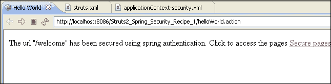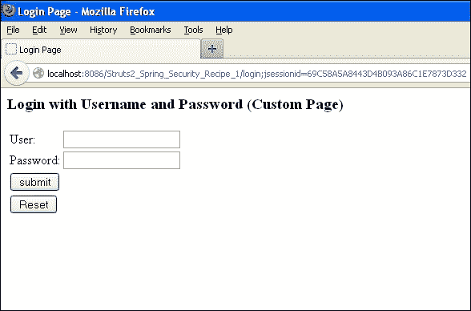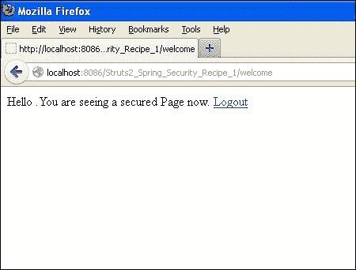

## 另请参阅

+   *具有基本 Spring Security 的 Struts 2 应用程序*配方

+   *使用基于摘要/哈希的 Spring Security 与 Struts 2*配方

+   *在 Struts 2 中显示自定义身份验证失败消息*配方

+   *使用 Struts 2 和 Spring Security 进行数据库身份验证*配方

+   *使用 Spring Security 和 Struts 2 应用程序进行 ApacheDS 身份验证*配方

+   *使用 Spring Security 与 Struts 2 进行注销*配方

+   *在 Struts 2 中获取 Spring Security 中已登录用户信息*配方

# 具有基本 Spring Security 的 Struts 2 应用程序

在本节中，我们将演示如何在 Struts 2 中进行基本的 Spring Security 身份验证。我们将创建一个示例 Struts 2 应用程序，并向操作添加 Spring Security 功能，使其受到保护。只有经过身份验证的授权用户才能访问它。

## 准备工作

+   更新`Applicationcontext-security.xml`文件

+   在 Eclipse 中创建一个新的动态项目：`Struts2_Spring_BASIC_Security_Recipe2`

## 如何做...

执行以下步骤，将 Struts 2 应用程序与 Spring Security 集成以实现基本身份验证：

1.  修改`applicationcontext-security.xml`文件以支持基本安全性：

`Applicationcontext-security.xml`：

```java
<beans:beans 

   xsi:schemaLocation="http://www.springframework.org/schema/beans
   http://www.springframework.org/schema/beans/spring-beans-3.0.xsd
   http://www.springframework.org/schema/security
   http://www.springframework.org/schema/security/spring-security-3.1.xsd">

 <global-method-security pre-post-annotations="enabled">
        <!-- AspectJ pointcut expression that locates our "post" method and applies security that way
        <protect-pointcut expression="execution(* bigbank.*Service.post*(..))" access="ROLE_TELLER"/>
        -->
    </global-method-security>

  <http>
   <intercept-url pattern="/welcome" access="ROLE_TELLER" />
   <http-basic />
  </http>
   <authentication-manager>
     <authentication-provider>
       <user-service>
         <user name="anjana" password="123456" authorities="ROLE_TELLER" />
       </user-service>
     </authentication-provider>
   </authentication-manager>
</beans:beans>
```

## 工作原理...

当用户运行 Struts 2 应用程序并尝试访问受保护的资源时，Spring Security 上下文将被初始化，并且 Spring 的登录对话框将中断 Struts 2 操作，该对话框将请求用户名和密码。验证成功后，用户将被重定向到 Struts 2 操作页面。

以下是应用程序的工作流程：

在浏览器上的 Struts 2 和 Spring 基本安全性：

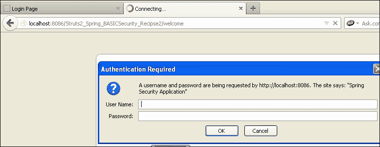

## 另请参阅

+   *使用基于摘要/哈希的 Spring Security 与 Struts 2*配方

# 使用基于摘要/哈希的 Spring Security 与 Struts 2

使用基于表单或基本身份验证并不会使 Struts 2 应用程序变得安全，因为密码会以明文形式暴露给用户。Spring Security JAR 中有一个加密包。该包可以解密加密的密码，但我们需要告诉 Spring Security API 有关加密算法的信息。

## 准备工作

+   在 Eclipse 中创建一个动态 Web 项目

+   添加 Struts 2 JAR 包

+   添加与 Spring Security 相关的 JAR 包

+   `web.xml`，`struts2.xml`和 JSP 设置与先前的应用程序相同

## 如何做...

让我们加密密码：`packt123456`。

我们需要使用外部 JAR，`JACKSUM`，这意味着 Java 校验和。它支持 MD5 和 SHA1 加密。

下载`jacksum.zip`文件（[`www.jonelo.de/java/jacksum/#Download`](http://www.jonelo.de/java/jacksum/#Download)）并解压缩 ZIP 文件。

```java
packt>java -jar jacksum.jar -a sha -q"txt:packt123456"
```

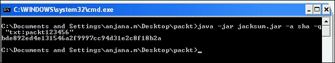

更新`applicationcontext-security.xml`文件：

```java
<beans:beans 

   xsi:schemaLocation="http://www.springframework.org/schema/beans
   http://www.springframework.org/schema/beans/spring-beans-3.0.xsd
   http://www.springframework.org/schema/security
   http://www.springframework.org/schema/security/spring-security-3.1.xsd">

 <global-method-security pre-post-annotations="enabled">
        <!-- AspectJ pointcut expression that locates our "post" method and applies security that way
        <protect-pointcut expression="execution(* bigbank.*Service.post*(..))" access="ROLE_TELLER"/>
        -->
    </global-method-security>
  <http>
   <intercept-url pattern="/welcome" access="ROLE_TELLER" />
   <http-basic />
  </http>
   <authentication-manager>
      <authentication-provider>
   <password-encoder hash="sha" />
      <user-service>
         <user name="anjana" password="bde892ed4e131546a2f9997cc94d31e2c8f18b2a" 
          authorities="ROLE_TELLER" />
      </user-service>
   </authentication-provider>
   </authentication-manager>
</beans:beans>
```

## 它是如何工作的...

我们需要更新`Applicationcontext-security.xml`文件。注意，认证类型是基本的，但密码是使用算法进行哈希处理。我们希望 Spring Security 使用 SHA 算法对其进行解密并对用户进行身份验证。

Spring Security 在处理摘要身份验证方面非常灵活。您还可以看到没有基于容器的依赖关系。

可以在以下截图中看到来自浏览器的基本身份验证：

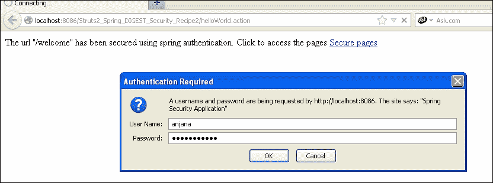

Spring 已通过解密密码对用户进行了身份验证：

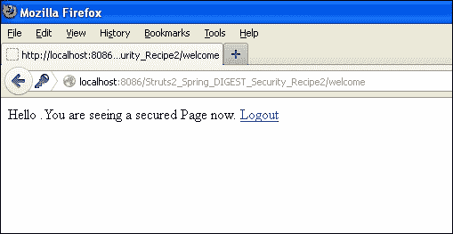

## 另请参阅

+   *在 Struts 2 中显示自定义错误消息以处理身份验证失败*配方

+   *使用 Struts 2 和 Spring Security 进行身份验证数据库*配方

+   *使用 Spring Security 和 Struts 2 应用程序进行 ApacheDS 身份验证*配方

+   *在 Struts 2 中使用 Spring Security 注销*配方

+   *在 Struts 2 中使用 Spring Security 获取已登录用户信息*配方

# 在 Struts 2 中使用 Spring Security 注销

在本节中，让我们实现一个注销场景，已登录用户将从应用程序中注销。注销操作将由 Spring Security 框架处理。我们需要配置`struts.xml`文件以处理`j_spring_security_logout`操作。

## 准备工作

+   在 Eclipse 中创建一个动态 Web 项目

+   添加与 Struts 2 相关的 JAR 包

+   添加与 Spring Security 相关的 JAR 包

+   `web.xml`，`struts2.xml`和 JSP 设置与先前的应用程序相同

## 如何做...

1.  让我们更新安全页面`hello.jsp`：

```java
<%@ taglib prefix="c" uri="http://java.sun.com/jsp/jstl/core"%>
<%@page import="java.security.Principal" %>
<html>
<body>
Hello .You are seeing a secured Page now.

   <a href="<c:url value="/j_spring_security_logout" />" > Logout</a>
 </body>
</html>
```

1.  让我们将`j_spring_security_logout`与`struts.xml`文件进行映射：

当用户点击**注销**时，用户将被注销并重定向到`index.jsp`。

```java
<!DOCTYPE struts PUBLIC
"-//Apache Software Foundation//DTD Struts Configuration 2.0//EN"
"http://struts.apache.org/dtds/struts-2.0.dtd">
<struts>
   <package name="default" namespace="/" extends="struts-default">
        <action name="helloWorld">
            <result>success.jsp</result>
        </action>

      <action name="login">
                <result>login.jsp</result>
         </action>

         <action name="loginfailed">
                <result>login.jsp?error=true</result>
         </action>

         <action name="welcome" >
         <result>secure/hello.jsp</result>
         </action>

   <action name="j_spring_security_logout">
   <result>index.jsp</result>
         </action>
    </package>
</struts>
```

1.  更新`applicationcontext-security.xml`文件：

```java
<beans:beans 

   xsi:schemaLocation="http://www.springframework.org/schema/beans
   http://www.springframework.org/schema/beans/spring-beans-3.0.xsd
   http://www.springframework.org/schema/security
   http://www.springframework.org/schema/security/spring-security-3.1.xsd">

 <global-method-security pre-post-annotations="enabled">
    </global-method-security>
  <http>
   <intercept-url pattern="/welcome" access="ROLE_TELLER" />
   <logout logout-success-url="/helloWorld" />
   <http-basic />
  </http>
   <authentication-manager>
      <authentication-provider>
   <password-encoder hash="sha" />
      <user-service>
         <user name="anjana" password="bde892ed4e131546a2f9997cc94d31e2c8f18b2a" 
             authorities="ROLE_TELLER" />
      </user-service>
   </authentication-provider>
   </authentication-manager>
</beans:beans>
```

## 它是如何工作的...

Spring Security 还提供了处理注销的选项。当用户点击**注销**时，用户将被重定向到指定页面。

`j_spring_secuurity_logout`为 Struts 2 应用程序提供了注销选项。

Struts 2 应用程序具有其操作的地图和 URL。

注销选项通常在受保护的页面中提供。

## 还有更多...

到目前为止，我们已将身份验证信息存储在`.xml`文件中。我们还对密码进行了哈希处理。如何在外部系统上存储信息并获取它呢？让我们看看 Struts 2 如何在以下部分与此数据库身份验证一起工作。

## 另请参阅

+   *在 Struts 2 中显示自定义错误消息以处理身份验证失败*配方

+   *在 Struts 2 中使用 Spring Security 进行身份验证数据库*配方

+   *使用 Spring Security 和 Struts 2 应用程序进行 ApacheDS 身份验证*配方

+   *在 Struts 2 中使用 Spring Security 获取已登录用户信息*配方

# 使用 Struts 2 和 Spring Security 进行身份验证数据库

在本节中，让我们使用存储在数据库中的信息对登录到 Struts 2 应用程序的用户进行授权。Spring Security 需要在 Struts 2 应用程序中进行配置，以便它了解数据库的位置和需要执行的 SQL，以使用 Spring Security 对用户进行身份验证。

## 准备工作

+   在 Eclipse 中创建一个动态 Web 项目：`Struts2_Spring_DBAuthentication_Recipe4`

+   将`struts.xml`文件复制到`src/main/java`

+   将`db-beans.xml`文件添加到`WEB-INF`

+   从上一个配方中复制`webContent`文件夹

+   将以下 JAR 文件添加到`lib`文件夹中，或者如果使用 maven，则更新您的 POM 文件：

+   spring-jdbc-3.0.7.RELEASE

+   mysql-connector-java-5.1.17

+   commons-dbcp

+   commons-pool-1.5.4

## 如何做...

1.  要使用 Struts 2 和 Spring 进行数据库身份验证，我们需要创建一个`db-beans.xml`文件。`db-beans.xml`文件将包含数据库信息：

```java
<beans 

   xsi:schemaLocation="http://www.springframework.org/schema/beans
   http://www.springframework.org/schema/beans/spring-beans-3.0.xsd">
    <bean id="MySqlDatasource" class="org.springframework.jdbc.datasource.DriverManagerDataSource">
   <property name="driverClassName" value="com.mysql.jdbc.Driver" />
   <property name="url" value="jdbc:mysql://localhost:3306/test1" />
   <property name="username" value="root" />
   <property name="password" value="prdc123" />
   </bean>
 </beans>
```

1.  在与`applicationcontext-security.xml`相同的位置添加`db-beans.xml`文件。更新`web.xml`文件以读取`db-beans.xml`文件：

```java
<?xml version="1.0" encoding="UTF-8"?>
<web-app    xsi:schemaLocation="http://java.sun.com/xml/ns/javaee http://java.sun.com/xml/ns/javaee/web-app_2_5.xsd" id="WebApp_ID" version="2.5">
  <display-name>SpringStruts2Security</display-name>
 <context-param>
          <param-name>contextConfigLocation</param-name>
          <param-value>
                /WEB-INF/db-beans.xml,
                /WEB-INF/applicationContext-security.xml
          </param-value>
   </context-param>

  <filter>
    <filter-name>springSecurityFilterChain</filter-name>
    <filter-class>
                  org.springframework.web.filter.DelegatingFilterProxy
                </filter-class>
  </filter>
  <filter-mapping>
    <filter-name>springSecurityFilterChain</filter-name>
    <url-pattern>/*</url-pattern>
  </filter-mapping>
  <filter>
    <filter-name>struts2</filter-name>
    <filter-class>org.apache.struts2.dispatcher.ng.filter.StrutsPrepareAndExecuteFilter</filter-class>
  </filter>
  <listener>
    <listener-class>org.springframework.web.context.ContextLoaderListener</listener-class>
  </listener>
  <filter-mapping>
    <filter-name>struts2</filter-name>
    <url-pattern>/*</url-pattern>
  </filter-mapping>
  <error-page>
          <error-code>403</error-code>
          <location>/secure/denied.jsp</location>
   </error-page>

  <welcome-file-list>
    <welcome-file>index.jsp</welcome-file>
  </welcome-file-list>
</web-app>
```

1.  在数据库中运行以下 SQL 脚本：

```java
CREATE TABLE `users1` (  `USER_ID` INT(10) UNSIGNED NOT NULL,
  `USERNAME` VARCHAR(45) NOT NULL,
  `PASSWORD` VARCHAR(45) NOT NULL,
  `ENABLED` tinyint(1) NOT NULL,
  PRIMARY KEY (`USER_ID`)
) ENGINE=InnoDB DEFAULT CHARSET=utf8;
CREATE TABLE `user_roles` (
  `USER_ROLE_ID` INT(10) UNSIGNED NOT NULL,
  `USER_ID` INT(10) UNSIGNED NOT NULL,
  `ROLE` VARCHAR(45) NOT NULL,
  PRIMARY KEY (`USER_ROLE_ID`),
  KEY `FK_user_roles` (`USER_ID`),
  CONSTRAINT `FK_user_roles` FOREIGN KEY (`USER_ID`) REFERENCES `users` (`USER_ID`)
) ENGINE=InnoDB DEFAULT CHARSET=utf8;

INSERT INTO test1.users (USER_ID, USERNAME,PASSWORD, ENABLED)
VALUES (100, 'anjana', 'packt123456', TRUE);

INSERT INTO test1.user_roles (USER_ROLE_ID, USER_ID,AUTHORITY)
VALUES (1, 100, 'ROLE_TELLER');
```

1.  更新`applicationContext-security.xml`文件以读取数据库配置：

```java
<beans:beans 

   xsi:schemaLocation="http://www.springframework.org/schema/beans
   http://www.springframework.org/schema/beans/spring-beans-3.0.xsd
   http://www.springframework.org/schema/security
   http://www.springframework.org/schema/security/spring-security-3.1.xsd">

 <global-method-security pre-post-annotations="enabled">
        <!-- AspectJ pointcut expression that locates our "post" method and applies security that way
        <protect-pointcut expression="execution(* bigbank.*Service.post*(..))" access="ROLE_TELLER"/>
        -->
    </global-method-security>

  <http>
   <intercept-url pattern="/welcome" access="ROLE_TELLER" />
   <logout logout-success-url="/helloWorld" />
   <http-basic />
  </http>

   <authentication-manager> 
      <authentication-provider> 
         <jdbc-user-service data-source-ref="MySqlDS" 

            users-by-username-query=" 
                select username,password, enabled   
               from users1 where username=?"  

            authorities-by-username-query=" 
               select u.username, ur.role from users1 u, user_roles ur  
         where u.user_id = ur.user_id and u.username =?  "  
         /> 
      </authentication-provider>
   </authentication-manager>
</beans:beans>
```

## 它是如何工作的...

Struts 2 框架提供了一个链接来访问受保护的页面。但是 Spring Security 框架会中断并提供身份验证对话框。身份验证由 Spring Security 框架通过查询数据库完成。身份验证管理器配置了数据源引用，该引用将加载用于基于查询对用户进行身份验证的安全框架的信息。

## 还有更多...

到目前为止，我们只是在 JSP 文件中应用了安全性，该文件在`struts2.xml`中没有操作映射。让我们看看如何将操作类与 JSP 映射，然后与 Spring Security 集成。理想情况下，它应该以相同的方式工作。让我们在操作类中获取已登录用户的信息并在浏览器上显示出来。

## 另请参阅

+   *在 Struts 2 中显示身份验证失败的自定义错误消息*示例

+   *使用 Spring Security 和 Struts 2 应用程序进行 ApacheDS 身份验证*示例

+   *在 Struts 2 中使用 Spring Security 获取已登录用户信息*示例

# 在 Struts 2 中使用 Spring Security 获取已登录用户信息

到目前为止，在我们的示例中，我们还没有使用任何 Struts 2 操作类。

让我们创建一个操作类并查看安全性如何与此操作类一起运行。我们将在此示例中使用基于表单的身份验证。

## 准备工作

到目前为止，在我们的示例中，我们还没有使用任何 Struts 2 操作类。

让我们创建一个操作类并查看安全性如何与此操作类一起运行。我们将在此示例中使用基于表单的身份验证：

+   创建一个动态 Web 项目：`Struts2_Spring_Security_Recipe5`

+   创建一个包：`com.packt.action`

+   从上一个示例中复制`struts.xml`文件到`src/main/java`

+   还要复制`WebContent`文件夹

+   我们需要向包中添加一个操作类

+   更新`struts.xml`文件

## 如何做...

1.  `HelloAction`文件如下：

```java
package com.packt.action;
public class HelloAction {
         public String execute(){
         return "SUCCESS";
   }
}
```

1.  使用`HelloAction`更新`Struts.xml`文件。因此，当用户经过身份验证时，它将将请求传递给操作类，该操作类将执行`execute()`方法，然后将重定向到`hello.jsp`：

```java
<!DOCTYPE struts PUBLIC
"-//Apache Software Foundation//DTD Struts Configuration 2.0//EN"
"http://struts.apache.org/dtds/struts-2.0.dtd">
<struts>
   <package name="default" namespace="/" extends="struts-default">
        <action name="helloWorld">
            <result>success.jsp</result>
        </action>

      <action name="login">
               <result>login.jsp</result>
         </action>

         <action name="loginfailed">
               <result>login.jsp?error=true</result>
         </action>

         <action name="welcome" class="com.packt.action.HelloAction">
         <result name="SUCCESS">secure/hello.jsp</result>
         </action>

    </package>
</struts>
```

1.  获取已登录用户：

我们可以在操作类中获取已登录的用户名，并在页面上显示它，或者在我们的应用程序中进一步使用它。

我们可以在我们的操作类中使用`request.getUserPrincipal`来获取已登录用户的信息。

1.  对于项目设置：

+   在 Eclipse 中创建一个动态 Web 项目：`Struts2_Spring_Security_Recipe6`

+   从上一个示例中复制`src/main/java`文件夹

+   从上一个示例中复制`Web content`文件夹

+   修改`HelloAction.java`文件

```java
package com.packt.action;
import javax.servlet.http.HttpServletRequest;
import org.apache.struts2.ServletActionContext;
public class HelloAction {
   private String name;
               public String execute(){
               HttpServletRequest request = ServletActionContext.getRequest();
               String logged_in_user=request.getUserPrincipal().getName();
               setName(logged_in_user);
               return "SUCCESS";
         }

         public String getName() {
               return name;
         }

         public void setName(String name) {
               this.name = name;
         }
}
```

+   修改`secure/Hello.jsp`文件：

```java
<%@ taglib prefix="c" uri="http://java.sun.com/jsp/jstl/core"%>
<%@taglib uri="/struts-tags" prefix="s" %>
<%@page import="java.security.Principal" %>
<html>
  <body>
    Hello <h1><s:property value="name" /></h1>.You are seeing a secured Page now.
    <a href="<c:url value="/j_spring_security_logout" />" > Logout</a>
  </body>
</html>
```

## 它是如何工作的...

用户信息存储在 principal 中：

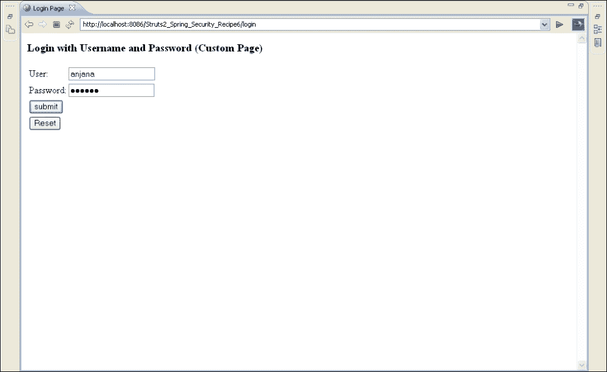

在浏览器上显示已登录用户：

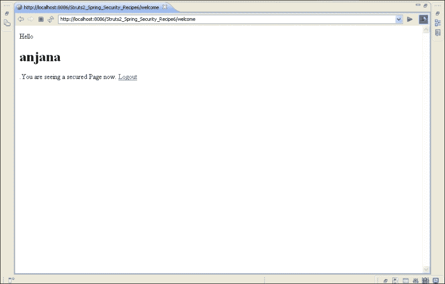

## 还有更多...

显示用户信息后，我们可以在身份验证失败时向用户显示自定义错误消息。

## 另请参阅

+   *在 Struts 2 中显示身份验证失败的自定义错误消息*示例

+   *使用 Spring Security 和 Struts 2 应用程序进行 ApacheDS 身份验证*示例

# 在 Struts 2 中显示身份验证失败的自定义错误消息

在本节中，我们将在 Struts 2 应用程序中捕获 Spring Security 的身份验证失败消息，并查看如何将其显示给用户。

## 准备工作

+   在身份验证失败时重定向到失败操作

+   向用户显示自定义消息

## 如何做...

执行以下步骤以捕获 Spring Security 在 JSP 应用程序中的身份验证失败消息：

1.  在`applicationcontext.xml`文件中，我们可以将 URL 重定向到另一个操作：`Authentication-failure-url="/loginfailed? error=true"`。

```java
<http auto-config="true" use-expressions="true" >
         <intercept-url pattern="/welcome" access="hasRole('ROLE_TELLER')"/>
         <form-login login-page="/login" default-target-url="/welcome" authentication-failure-url="/loginfailed?error=true" />
         <logout/>
   </http>
```

1.  使用以下代码更新`login.jsp`页面：

```java
<% String error=request.getParameter("error");

 if(error!=null){
 %>

          <div class="errorblock">
                Your login attempt was not successful, try again.<br /> Caused :

          </div>

 <%} %>
```

## 它是如何工作的...

登录失败操作与`struts2.xml`中的`login.jsp`文件进行了映射。`application-context.xml`中添加了`authentication-failure-url`。当用户输入错误的凭据时，身份验证失败，用户将被重定向到带有错误消息的登录页面。

错误消息配置在 JSP 文件中完成。

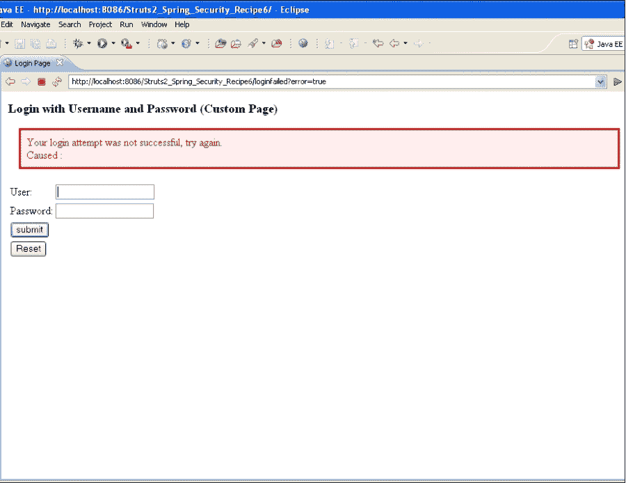

## 另请参阅

+   使用 Spring Security 和 Struts 2 应用程序进行 ApacheDS 身份验证的食谱

# 使用 Spring Security 和 Struts 2 应用程序进行 ApacheDS 身份验证

在本节中，我们将在 Apache 目录服务器中存储用户凭据和角色信息。Spring Security 必须找到服务器并登录到服务器。它应该通过比较用户提交的凭据和 Apache 目录服务器中存在的凭据和角色信息来对用户进行身份验证。

## 准备就绪

+   在 Eclipse 中创建一个动态 Web 项目

+   `src/main/java`文件夹和`WebContent`文件夹保持不变

+   安装 Apache 目录工作室：1.5.3

+   安装 Apache 目录服务器：2.0

+   10389 是 apache-ds 端口

+   将与 LDAP 相关的安全 JAR 添加到`WebContent Lib`文件夹中。

+   spring-ldap-core-tiger-1.3.X 版本

+   spring-ldap-odm-1.3.X 版本

+   spring-security-ldap-1.3.X 版本

+   spring-ldap-ldif-batch-1.3.X 版本

+   spring-ldap-test-1.3.X 版本

+   spring-ldap-core-1.3.X 版本

+   spring-ldap-ldif-core-1.3.X 版本

## 如何做...

执行以下步骤设置 Apache 目录以使用 Spring Security 在 Struts 2 应用程序中对用户进行身份验证：

1.  在安装了上述先决条件之后配置 Apache DS 服务器。

1.  使用以下步骤创建一个分区：

+   打开`server.xml`文件：`C:\Program Files\Apache Directory Server\instances\default\conf\server.xml`。

+   添加 JDM 分区：`<jdbmPartition id="packt" suffix="o=packt"/>`。

+   您可以重新启动 Apache DS 服务器以查看更改。然后使用 Apache 目录工作室连接到 Apache DS。右键单击**DIT**。从**Scratch**创建**Entry**。选择**Organization**，选择**o**，在**Value**中输入`packt`。选择**Finish**并刷新**DIT**以查看更新。

1.  配置 Apache 目录工作室。

1.  连接到 Apache 目录服务器。

1.  Apache DS 运行在 10389 端口。

1.  创建两个组`ou=groups`和`ou=user`。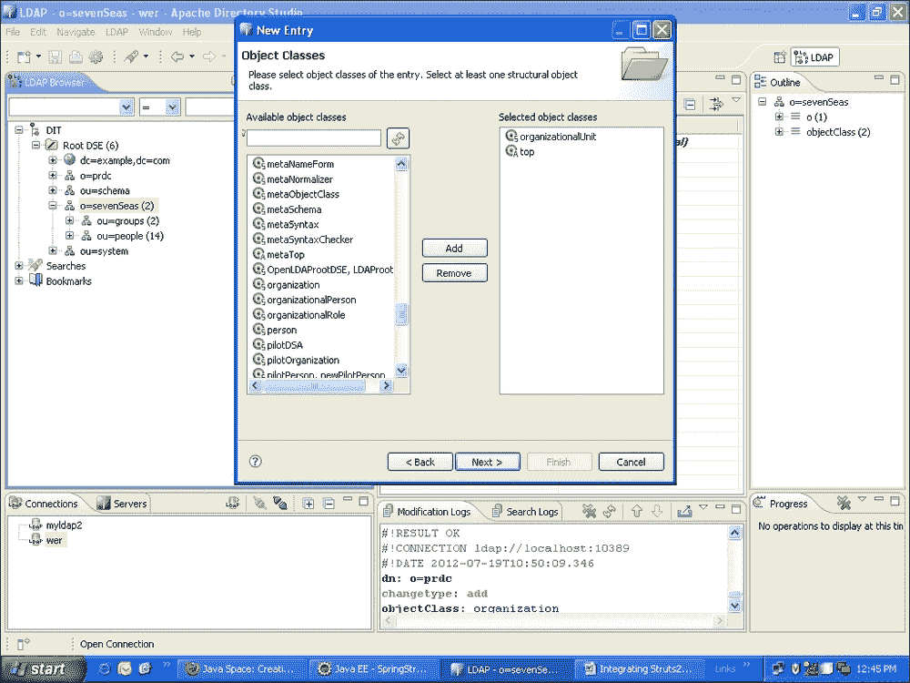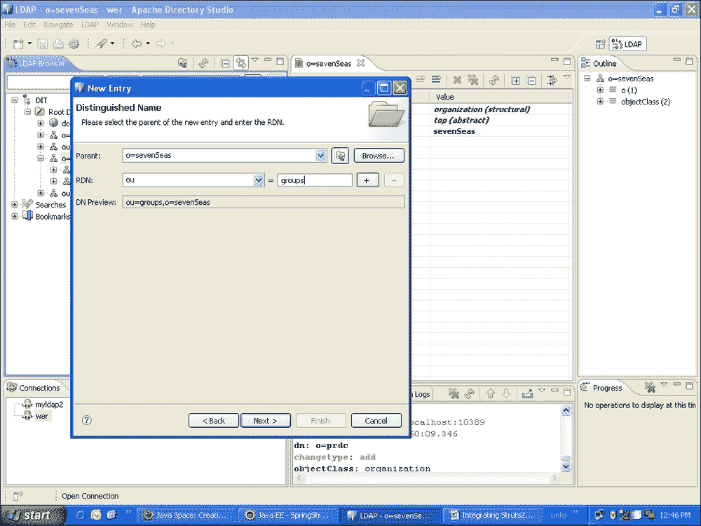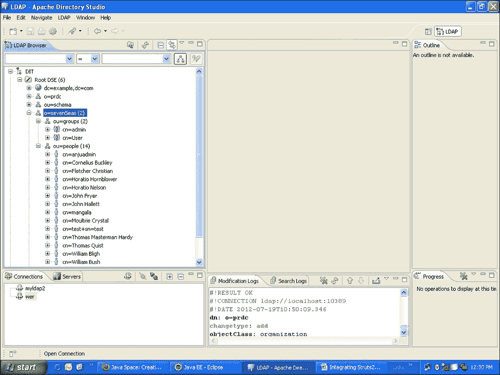

1.  在这里，对象类是用于向`ou=groups`添加条目，因为这维护了角色：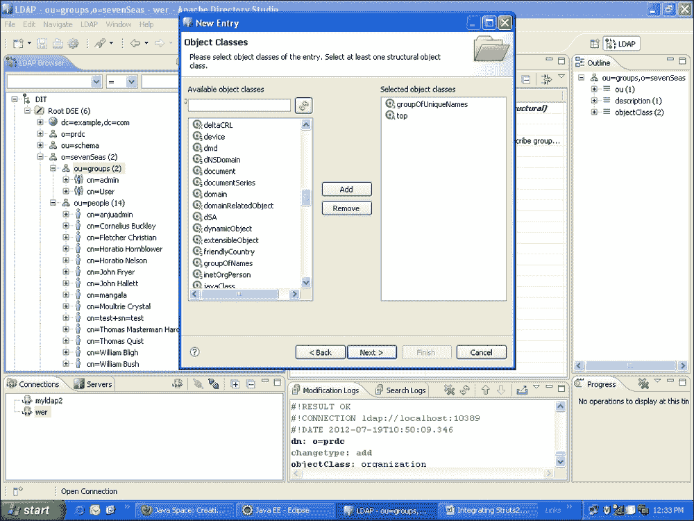

1.  在这里，对象类是为了向`ou=people`添加条目：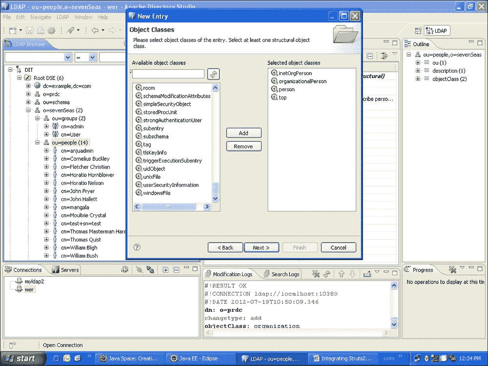

1.  通过向`cn=admin`添加`UniqueMember`为用户分配角色。

`Spring-security-ldap.xml`：

```java
<beans:beans 

   xsi:schemaLocation="http://www.springframework.org/schema/beans
   http://www.springframework.org/schema/beans/spring-beans-3.0.xsd
   http://www.springframework.org/schema/security
   http://www.springframework.org/schema/security/spring-security-3.1.xsd">

 <global-method-security pre-post-annotations="enabled">
        <!-- AspectJ pointcut expression that locates our "post" method and applies security that way
        <protect-pointcut expression="execution(* bigbank.*Service.post*(..))" access="ROLE_TELLER"/>
        -->
    </global-method-security>
   <http auto-config="true" use-expressions="true" >
          <intercept-url pattern="/welcome" access="hasRole('ROLE_ADMIN')"/>
<!--            <intercept-url pattern="/admin" access="hasRole('ROLE_admin')"/> -->

         <form-login login-page="/login" default-target-url="/secure/common.jsp" authentication-failure-url="/loginfailed?error=true" />

<authentication-manager>
           <ldap-authentication-provider 
                            user-search-filter="(mail={0})" 
                            user-search-base="ou=people"
                            group-search-filter="(uniqueMember={0})"
                      group-search-base="ou=groups"
                      group-role-attribute="cn"
                      role-prefix="ROLE_">
           </ldap-authentication-provider>
   </authentication-manager>

   <ldap-server url="ldap://localhost:10389/o=sevenSeas" manager-dn="uid=admin,ou=system" manager-password="secret" />
</beans:beans>
```

## 它是如何工作的...

`Spring Security-ldap.xml`将包含有关服务器位置和域的详细信息。它应该连接以检索用户信息。域是`sevenSeas`。1039 是 LDAP 服务器的端口号。Spring Security 使用`ldap-server`标签提供 LDAP 信息。它还提供密码和将连接的域。Struts 2 请求将被 Spring Security 中断，并且对于身份验证，将从登录页面接收用户信息。Spring Security 需要 LDAP 来获取用户名；成功后，用户将获得对受保护资源的访问权限。

## 另请参阅

+   第三章, *使用 JSF 的 Spring 安全性*
