# 第三章：JSF 的 Spring Security

在本章中，我们将涵盖：

+   将 JSF 与 Spring Security 集成

+   JSF 与基于表单的 Spring Security

+   使用 JSF 和基于表单的 Spring Security 进行身份验证以显示已登录用户

+   使用 JSF 与基于摘要/哈希的 Spring Security

+   使用 Spring Security 在 JSF 中注销

+   使用 Spring Security 和 JSF 进行身份验证

+   使用 JSF 和 Spring Security 进行 ApacheDS 身份验证

+   JSF 和 Spring Security 的身份验证错误消息

# 介绍

有许多在 Apache Faces/JSF 中开发的应用程序。它不像 Struts 2 那样是一个面向动作的框架，而纯粹是为了视图层。要在 JSF 中实现 Spring Security，我们需要找出一些解决方法。让我们看看关于 JSF 和 Spring Security 的一些配方。

我使用了最新的稳定版本的 Spring Security 和 Spring-core。如果您想更新您的库，可以阅读以下部分。对于 Maven 用户，这一切都是关于更新依赖项，对于普通的 Eclipse 用户，这是将`.jar`文件添加到`lib`文件夹。

**在 Eclipse 上设置 JSF 应用程序**

1.  使用 Eclipse Java EE 开发人员工具并设置一个动态 Web 项目。

1.  给项目命名：`JSf_Spring_Security_Chapter_3_Recipe1`。

1.  选择动态 Web 模块版本 2.5。

1.  配置：JavaServer Faces v1.2 项目。

1.  在下一个**新动态 Web 项目**窗口中，单击**下载库**。

1.  选择 Apache MyFaces 库。

**Spring Security MAJOR/MINOR/PATCH 版本**

当我为我的应用程序设置安全性时，我遇到了很多与模式版本相关的错误。

Spring 源提供了关于要下载哪个版本的很好描述。它建议使用 PATCH 版本是最安全的，不会影响现有代码，因为它将使用向后兼容性。MINOR 版本带有设计更改，MAJOR 版本带有主要 API 更改。对于 JSF 配方，我一直在使用 3.1.4 安全版本，并且已经下载了与 Spring-3.1.4 相关的 JAR 文件。

您可以下载 spring-security-3.1.4.RELEASE-dist，其中包含所有最新的 JAR 文件。

JAR 文件：

+   `spring-security-config`执行命名空间解析，并将读取`spring-security.xml`文件

+   Spring Security web 与 Web 应用程序过滤器进行交互

+   Spring Security 核心

将这些 JAR 文件保存在您的 Web 应用程序的`WEB-INF/lib`文件夹中。

# 将 JSF 与 Spring Security 集成

让我们在 Eclipse 中创建一个简单的 Apache MyFaces 应用程序。还让我们将 Spring Security 集成到 JSF 中，然后演示基本身份验证。

## 准备工作

+   您将需要 Eclipse Indigo 或更高版本

+   创建一个动态 Web 项目 JSF

+   在您的 Eclipse IDE 中，创建一个动态 Web 项目：`JSf_Spring_Security_Chapter_3_Recipe1`

+   创建一个源文件夹：`src/main/java`

+   创建一个包：`com.packt.jsf.bean`

+   创建一个托管 Bean：`User.java`

+   使用 Tomcat 服务器部署应用程序

## 如何做...

执行以下步骤来实现 JSF 和 Spring Security 的基本身份验证机制：

1.  `User.java`是应用程序的托管 Bean。它有两个方法：`sayHello()`和`reset()`：

`User.java 类`：

```java
package com.packt.jsf.bean;
public class User {
   private String name;
   private boolean flag= true; 
   public String getName() {
         return this.name;
   }
   public void setName(String name) {
         this.name = name;
   }
    public String  sayHello(){
          flag= false;
          name="Hello "+ name;
         return this.name;

    }
    public String  reset(){
          flag= true;
          name=null;
         return "reset";

    }
   public boolean isFlag() {
         return flag;
   }

   public void setFlag(boolean flag) {
         this.flag = flag;
   }
}
```

1.  让我们创建一个基于`ApacheMyFaces`标签的 JSP 文件。它期望一个强制的`<f:view>`标签。按照惯例，创建一个与其 bean 名称相同的 JSP 文件。它有一个表单，接受名称，并在单击按钮时显示**“你好”**：

`User.jsp`：

```java
<%@ page language="java" contentType="text/html; charset=ISO-8859-1" pageEncoding="ISO-8859-1"%>
<%@ taglib prefix="f"  uri="http://java.sun.com/jsf/core"%>
<%@ taglib prefix="h"  uri="http://java.sun.com/jsf/html"%>
<!DOCTYPE html PUBLIC "-//W3C//DTD HTML 4.01 Transitional//EN" "http://www.w3.org/TR/html4/loose.dtd">
<html>
<head>
<meta http-equiv="Content-Type" content="text/html; charset=ISO-8859-1">
<title>User</title>
</head>
<body>
<f:view>
  <h:form>
    <h:panelGrid columns="2">
      <h:outputLabel value="Name"></h:outputLabel>
      <h:inputText  value="#{user.name}"></h:inputText>
    </h:panelGrid>
    <h:commandButton action="#{user.sayHello}" value="sayHello"></h:commandButton>
    <h:commandButton action="#{user.reset}" value="Reset"></h:commandButton>
     <h:messages layout="table"></h:messages>
  </h:form>

  <h:panelGroup rendered="#{user.flag!=true}">
  <h3> Result </h3>
  <h:outputLabel value="Welcome "></h:outputLabel>
  <h:outputLabel value="#{user.name}"></h:outputLabel>
  </h:panelGroup>
</f:view>
</body>
</html>
```

1.  使用托管 Bean 更新`faces-config.xml`文件：

```java
<?xml version="1.0" encoding="UTF-8"?>
<faces-config

    xsi:schemaLocation="http://java.sun.com/xml/ns/javaee http://java.sun.com/xml/ns/javaee/web-facesconfig_1_2.xsd"
    version="1.2">
    <application>

         <el-resolver>org.springframework.web.jsf.el.SpringBeanFacesELResolver</el-resolver>   
           <!-- 
           <variable-resolver>org.springframework.web.jsf.SpringBeanVariableResolver</variable-resolver>
           -->
   </application>
   <managed-bean>
          <managed-bean-name>user</managed-bean-name>
          <managed-bean-class>com.packt.jsf.bean.User</managed-bean-class>
          <managed-bean-scope>session</managed-bean-scope>
   </managed-bean>

</faces-config>
```

1.  `Spring-security.xml`文件保持不变，但我使用了最新的 jar- 3.1.4 安全 jar：

```java
<beans:beans    xsi:schemaLocation="http://www.springframework.org/schema/beans http://www.springframework.org/schema/beans/spring-beans-3.0.xsd 
 http://www.springframework.org/schema/security
 http://www.springframework.org/schema/security/spring-security-3.1.xsd">

 <global-method-security pre-post-annotations="enabled">

    </global-method-security>
    <http auto-config="true" use-expressions="true" >
          <intercept-url pattern="/faces/User.jsp" access="hasRole('ROLE_DIRECTOR')"/>
          <http-basic />
    </http>
    <authentication-manager>
      <authentication-provider>
        <user-service>
          <user name="packt" password="123456" authorities="ROLE_DIRECTOR" />
        </user-service>
      </authentication-provider>
    </authentication-manager>
</beans:beans>
```

1.  `web.xml`文件应更新 Spring 过滤器和监听器。它还具有 MyFaces 的配置：

`Spring-security.xml`：

```java
<?xml version="1.0" encoding="UTF-8"?><web-app    xsi:schemaLocation="http://java.sun.com/xml/ns/javaee http://java.sun.com/xml/ns/javaee/web-app_2_5.xsd" id="WebApp_ID" version="2.5">
  <display-name>JSf_Spring_Security_Chapter_3_Recipe1</display-name>
  <welcome-file-list>
    <welcome-file>index.jsp</welcome-file>
  </welcome-file-list>

  <context-param>
    <param-name>contextConfigLocation</param-name>
    <param-value>
          /WEB-INF/spring-security.xml

          </param-value>
  </context-param>
 <filter>
    <filter-name>springSecurityFilterChain</filter-name>
    <filter-class>
  org.springframework.web.filter.DelegatingFilterProxy
                </filter-class>
  </filter>
  <filter-mapping>
    <filter-name>springSecurityFilterChain</filter-name>
    <url-pattern>/*</url-pattern>
  </filter-mapping>
  <listener>
    <listener-class>org.springframework.web.context.ContextLoaderListener</listener-class>
  </listener>
  <servlet>
    <servlet-name>Faces Servlet</servlet-name>
    <servlet-class>javax.faces.webapp.FacesServlet</servlet-class>
    <load-on-startup>1</load-on-startup>
  </servlet>
  <servlet-mapping>
    <servlet-name>Faces Servlet</servlet-name>
    <url-pattern>/faces/*</url-pattern>
  </servlet-mapping>
  <context-param>
    <param-name>javax.servlet.jsp.jstl.fmt.localizationContext</param-name>
    <param-value>resources.application</param-value>
  </context-param>
  <context-param>
    <description>State saving method: 'client' or 'server' (=default). See JSF Specification 2.5.2</description>
    <param-name>javax.faces.STATE_SAVING_METHOD</param-name>
    <param-value>client</param-value>
  </context-param>
  <context-param>
    <description>
   This parameter tells MyFaces if javascript code should be allowed in
   the rendered HTML output.
   If javascript is allowed, command_link anchors will have javascript code
   that submits the corresponding form.
   If javascript is not allowed, the state saving info and nested parameters
   will be added as url parameters.
   Default is 'true'</description>
    <param-name>org.apache.myfaces.ALLOW_JAVASCRIPT</param-name>
    <param-value>true</param-value>
  </context-param>
  <context-param>
    <description>
   If true, rendered HTML code will be formatted, so that it is 'human-readable'
   i.e. additional line separators and whitespace will be written, that do not
   influence the HTML code.
   Default is 'true'</description>
    <param-name>org.apache.myfaces.PRETTY_HTML</param-name>
    <param-value>true</param-value>
  </context-param>
  <context-param>
    <param-name>org.apache.myfaces.DETECT_JAVASCRIPT</param-name>
    <param-value>false</param-value>
  </context-param>
  <context-param>
    <description>
   If true, a javascript function will be rendered that is able to restore the
   former vertical scroll on every request. Convenient feature if you have pages
   with long lists and you do not want the browser page to always jump to the top
   if you trigger a link or button action that stays on the same page.
   Default is 'false'
</description>
    <param-name>org.apache.myfaces.AUTO_SCROLL</param-name>
    <param-value>true</param-value>
  </context-param>
  <listener>
    <listener-class>org.apache.myfaces.webapp.StartupServletContextListener</listener-class>
  </listener>
</web-app>:beans>
```

## 它是如何工作的...

当用户尝试访问受保护的`user.jsp`页面时，Spring Security 会拦截 URL 并将用户重定向到登录页面。成功身份验证后，用户将被重定向到`spring-security.xml`文件中提到的成功`url`。以下屏幕截图显示了使用 JSF 和 Spring Security 实现基本身份验证的工作流程。

现在访问以下 URL：`http://localhost:8086/JSf_Spring_Security_Chapter_3_Recipe1/faces/User.jsp`。

您应该看到一个基本的身份验证对话框，要求您如下登录：

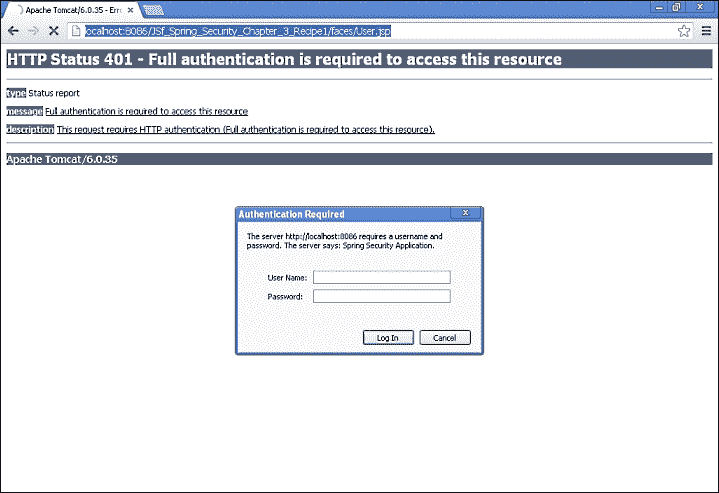

以下屏幕截图是 JSF 的安全页面，可以在成功身份验证后访问：

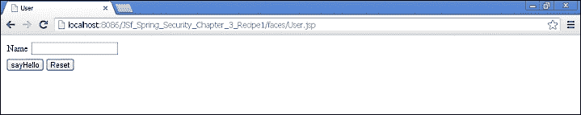

## 另请参阅

+   使用基于表单的 Spring Security 的 JSF

+   使用 Spring Security 显示已登录用户的*JSF 和基于表单的身份验证*食谱

+   使用基于摘要/哈希的 Spring Security 的*使用 JSF*食谱

+   使用 Spring Security 注销 JSF 的*Logging out with JSF using Spring Security*食谱

+   使用 Spring Security 和 JSF 进行数据库身份验证的*身份验证数据库*食谱

+   使用 JSF 和 Spring Security 进行 ApacheDS 身份验证的*ApacheDS 身份验证*食谱

+   使用 JSF 和 Spring Security 的*身份验证错误消息*食谱

# 使用基于表单的 Spring Security 的 JSF

在本节中，我们将使用 JSF 和 Spring Security 实现基于表单的身份验证。将 Apache MyFaces 与 Spring Security 集成并不像 Struts 2 集成那样简单。

它需要一个解决方法。ApacheMyfaces 无法理解`/j_spring_security`方法。解决方法是在我们的 Managed Bean 类中创建一个自定义登录方法。我们将使用 JSF 外部上下文类将认证请求传递给 Spring Security 框架。

## 准备工作

+   在 Eclipse IDE 中创建一个新项目：`JSF_Spring_Security_Chapter_3_Recipe2`

+   按照以下屏幕截图中显示的配置进行配置

+   创建一个包：`com.packt.jsf.beans`

## 如何做...

执行以下步骤将 JSF 与 Spring Security 集成以实现基于表单的身份验证：

1.  在 Eclipse 中创建一个 Web 项目：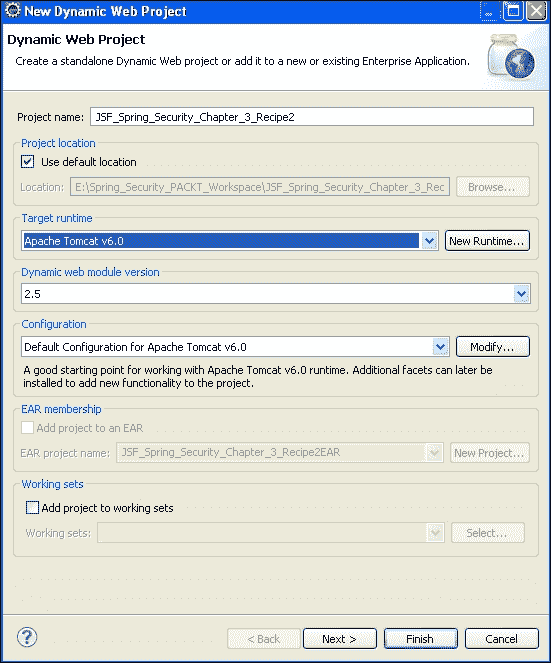

1.  创建一个 Credential Manager Bean：

此 bean 具有基于表单的身份验证 bean 的所有属性和自定义登录方法（）;

将设置`j_username`和`j_password`值，并在安全页面中显示用户。

`doSpringSecurityLogin()` bean：就像我们访问`ServletContext`并将其与请求分派器绑定一样，我们可以使用`ExternalContext`和请求分派器来执行`/j_spring_security_check`。

`phaseListener`实现旨在捕获身份验证异常。

`CredentialManager.java`：

```java
public class CredentialManager implements PhaseListener{
   private String j_username;
   private String j_password;

    public String getJ_password() {
         return j_password;
   }
   public void setJ_password(String j_password) {
         this.j_password = j_password;
   }
   public String doSpringSecurityLogin() throws IOException, ServletException
       {
           ExternalContext context = FacesContext.getCurrentInstance().getExternalContext();
           RequestDispatcher dispatcher = ((ServletRequest) context.getRequest()).getRequestDispatcher("/j_spring_security_check");
           dispatcher.forward((ServletRequest) context.getRequest(),(ServletResponse) context.getResponse());
           FacesContext.getCurrentInstance().responseComplete();
           return null;
       }
   public String getJ_username() {
         return j_username;
   }
   public void setJ_username(String j_username) {
         this.j_username = j_username;
   }
   @Override
   public void afterPhase(PhaseEvent arg0) {
         // TODO Auto-generated method stub

   }
   @Override
   public void beforePhase(PhaseEvent event) {
         Exception e = (Exception) FacesContext.getCurrentInstance().getExternalContext().getSessionMap().get(
          WebAttributes.AUTHENTICATION_EXCEPTION);

          if (e instanceof BadCredentialsException) {
              System.out.println("error block"+e);
               FacesContext.getCurrentInstance().getExternalContext().getSessionMap().put(
                   WebAttributes.AUTHENTICATION_EXCEPTION, null);
               FacesContext.getCurrentInstance().addMessage(null, new FacesMessage(FacesMessage.SEVERITY_ERROR,"Username or password not valid.", "Username or password not valid"));
           }
   }

   @Override
   public PhaseId getPhaseId() {
          return PhaseId.RENDER_RESPONSE;
   }
}
```

1.  让我们更新`Spring-security.xml`文件。`login-processing`-`url`映射到`j_security_check`：

```java
<beans:beans    xsi:schemaLocation="http://www.springframework.org/schema/beans http://www.springframework.org/schema/beans/spring-beans-3.0.xsd http://www.springframework.org/schema/securityhttp://www.springframework.org/schema/security/spring-security-3.1.xsd">

 <global-method-security pre-post-annotations="enabled">

    </global-method-security>
   <http auto-config="true" use-expressions="true" >

          <intercept-url pattern="/faces/Supplier.jsp" access="hasRole('ROLE_USER')"/>  

         <form-login login-processing-url="/j_spring_security_check" login-page="/faces/login.jsp" default-target-url="/faces/Supplier.jsp" authentication-failure-url="/faces/login.jsp" />
         <logout/>
   </http>

   <authentication-manager>
     <authentication-provider>
       <user-service>
         <user name="anjana" password="anju123456" authorities="ROLE_USER"/>
       </user-service>
     </authentication-provider>
   </authentication-manager>
</beans: beans>
```

1.  将 Managed Bean 添加到`faces-config.xml`文件中：

```java
<?xml version="1.0" encoding="UTF-8"?>

<faces-config

    xsi:schemaLocation="http://java.sun.com/xml/ns/javaee http://java.sun.com/xml/ns/javaee/web-facesconfig_1_2.xsd"
    version="1.2">
    <lifecycle>
         <phase-listener>com.packt.jsf.beans.CredentialManager</phase-listener>
   </lifecycle>
    <application>

          <el-resolver>org.springframework.web.jsf.el.SpringBeanFacesELResolver</el-resolver>	
          <!-- 
          <variable-resolver>org.springframework.web.jsf.SpringBeanVariableResolver</variable-resolver>
           -->
   </application>

         <managed-bean>
         <managed-bean-name>credentialmanager</managed-bean-name>
         <managed-bean-class>com.packt.jsf.beans.CredentialManager</managed-bean-class>
         <managed-bean-scope>session</managed-bean-scope>
   </managed-bean>

</faces-config>
```

1.  现在是 Apache MyFaces 的`login.jsp`文件。

`login.jsp`文件应该包含以下内容：

`prependID=false`

它应该提交到`ManagedBean`中定义的自定义登录方法

```java
<%@ page language="java" contentType="text/html; charset=ISO-8859-1" pageEncoding="ISO-8859-1"%>
<%@ taglib prefix="f" uri="http://java.sun.com/jsf/core"%>
<%@ taglib prefix="h" uri="http://java.sun.com/jsf/html"%>
<!DOCTYPE html PUBLIC "-//W3C//DTD HTML 4.01 Transitional//EN" "http://www.w3.org/TR/html4/loose.dtd">
<html>
<head>
<meta http-equiv="Content-Type" content="text/html; charset=ISO-8859-1">
<title>Spring Security Login</title>
</head>
<body>
<f:view>
<h:form prependId="false">
<h:panelGrid columns="2">
<h:outputLabel value="j_username"></h:outputLabel>
<h:inputText   id="j_username" required="true" value="#{credentialmanager.j_username}"></h:inputText>
<h:outputLabel value="j_password"></h:outputLabel>
<h:inputSecret  id ="j_password" required="true" value="#{credentialmanager.j_password}"></h:inputSecret>
</h:panelGrid>
<h:commandButton action="#{credentialmanager.doSpringSecurityLogin}" value="SpringSecurityLogin"/>
 </h:form>
</f:view>
</body>
</html>
```

## 它是如何工作的...

访问以下 URL：`localhost:8086/JSF_Spring_Security_Chapter_3_Recipe2/faces/Supplier.jsp`。

当用户访问 URL 时，他们将被重定向到登录页面。然后用户输入其凭据并单击**提交**。使用`FacesContext`对象使用`PhaseListener`实现来实例化`ExternalContext`对象。将`context`对象传递给请求对象，其中包含`'j_spring_security_check'` URL。Spring Security 将进行身份验证和授权。身份验证失败时，将抛出异常。

## 另请参阅

+   使用 Spring Security 显示已登录用户的*JSF 和基于表单的身份验证*食谱

+   使用基于摘要/哈希的 Spring Security 的*使用 JSF*食谱

+   使用 Spring Security 注销 JSF 的*Logging out with JSF using Spring Security*食谱

+   使用 Spring Security 进行数据库身份验证的*身份验证数据库*食谱

+   使用 JSF 和 Spring Security 进行 ApacheDS 身份验证的*ApacheDS 身份验证*食谱

+   *使用 JSF 和 Spring Security 进行身份验证错误消息*配方

# 使用 Spring Security 和 JSF 进行基于表单的认证以显示已登录用户

在上一个配方中，我们演示了使用 Spring Security 和 JSF `phaseListener`实现基于表单的认证。在本节中，我们将显示已登录的用户。

## 准备工作

您必须在`Supplier.jsp`文件中进行一些小的更改。

## 如何做...

执行以下步骤在浏览器上显示已登录用户的详细信息：

1.  要显示已登录的用户，请访问受保护页面中的托管 bean 对象。

1.  在`Supplier.jsp`文件中，编辑以下内容：

```java
<%@ page language="java" contentType="text/html; charset=ISO-8859-1" pageEncoding="ISO-8859-1"%>
<%@ taglib prefix="f" uri="http://java.sun.com/jsf/core"%>
<%@ taglib prefix="h" uri="http://java.sun.com/jsf/html"%>
<!DOCTYPE html PUBLIC "-//W3C//DTD HTML 4.01 Transitional//EN" "http://www.w3.org/TR/html4/loose.dtd">
<html>
<head>
<meta http-equiv="Content-Type" content="text/html; charset=ISO-8859-1">
<title>Insert title here</title>
</head>
<body>
<f:view>
<h:panelGroup>
  <h3> Result </h3>
  <h:outputLabel value="Welcome "></h:outputLabel>
  <h:outputLabel value="#{credentialmanager.j_username}"></h:outputLabel>
  </h:panelGroup>
</f:view>
</body>
</html>
```

## 它是如何工作的...

当用户被重定向到登录页面时，faces 上下文对象将用户信息提交给 Spring Security。成功后，用户 POJO 的 getter 和 setter 设置用户信息，用于在 JSP 页面上显示用户信息。

以下截图显示了使用 JSF 和 Spring Security 进行基于表单的认证，在浏览器中显示用户信息的工作流程：

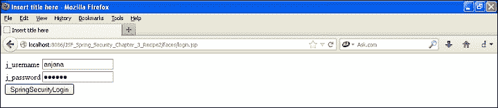

成功认证后，用户将被引导到以下页面：

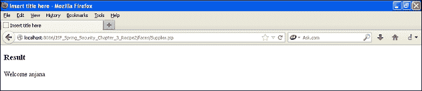

## 另请参阅

+   *使用基于摘要/哈希的 Spring Security 的 JSF*配方

+   *使用 JSF 和 Spring Security 进行注销*配方

+   *使用 Spring Security 和 JSF 进行身份验证数据库*配方

+   *使用 JSF 和 Spring Security 进行 ApacheDS 认证*配方

+   *使用 JSF 和 Spring Security 进行身份验证错误消息*配方

# 使用基于摘要/哈希的 Spring Security 进行 JSF

在本节中，我们将使用 JSF 和 Spring Security 实现摘要认证。用户的密码使用其中一种加密算法进行哈希处理，并在`.xml`文件中进行配置。用于哈希密码的算法也在配置文件中提到。

## 准备工作

Spring 摘要认证在 JSF 中也可以正常工作。我们需要使用`jacksum.jar`对密码进行哈希处理。在配置文件中提供哈希密码。还在配置文件中提到用于哈希处理的算法。

## 如何做...

执行以下步骤来实现 JSF 和 Spring Security 的摘要认证机制：

1.  让我们加密密码：`packt123456`。

1.  我们需要使用一个外部的 jar 包，Jacksum，这意味着 Java 校验和。

1.  它支持 MD5 和 SHA1 加密。

1.  下载`jacksum.zip`文件并解压缩 ZIP 文件夹。

```java
packt>java -jar jacksum.jar -a sha -q"txt:packt123456"
```


1.  让我们创建一个新项目来演示这一点，我们将使用基本认证。在 Eclipse 中创建一个动态 Web 项目，并将其命名为`JSF_Spring_Security_DIGEST_Recipe3`。

1.  `web.xml`，`face-config.xml`和 JSP 设置与`JSF_Spring_Security_Chapter3_Recipe1`相同。我们需要更新`Spring-security.xml`文件以使用 SHA 加密和解密进行认证：

`Spring-security.xml`：

```java
<beans:beans    xsi:schemaLocation="http://www.springframework.org/schema/beans http://www.springframework.org/schema/beans/spring-beans-3.0.xsd http://www.springframework.org/schema/securityhttp://www.springframework.org/schema/security/spring-security-3.1.xsd">

 <global-method-security pre-post-annotations="enabled">

    </global-method-security>
   <http auto-config="true" use-expressions="true" >
         <intercept-url pattern="/faces/User.jsp" access="hasRole('ROLE_DIRECTOR')"/>
         <http-basic />
   </http>

   <authentication-manager>
      <authentication-provider>
 <password-encoder hash="sha" />
 <user-service>
 <user name="anjana" password="bde892ed4e131546a2f9997cc94d31e2c8f18b2a" 
 authorities="ROLE_DIRECTOR" />
 </user-service>
 </authentication-provider>
 </authentication-manager>
</beans:beans>
```

## 它是如何工作的...

当您运行应用程序时，将提示您输入对话框。

输入用户名和密码后，Spring 框架将解密密码并将其与用户输入的详细信息进行比较。当它们匹配时，它会标记一个认证成功的消息，这将使上下文对象将用户重定向到成功的 URL。

以下截图显示了 JSF 和 Spring 进行摘要认证的工作流程。

这是一个基本的表单，但认证机制是摘要的。

Spring 通过解密密码对用户进行了身份验证：

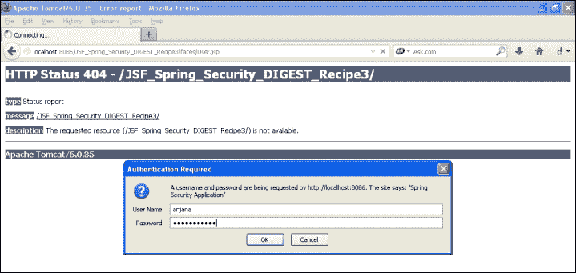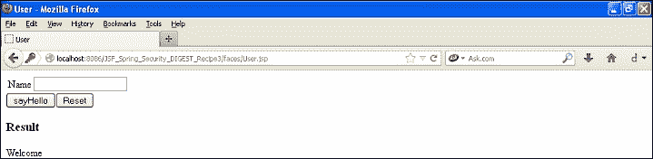

## 另请参阅

+   *使用 JSF 和 Spring Security 进行注销*配方

+   *使用 Spring Security 和 JSF 进行身份验证数据库*配方

+   *使用 JSF 和 Spring Security 进行 ApacheDS 认证*配方

+   *使用 JSF 和 Spring Security 进行身份验证错误消息*配方

# 使用 JSF 和 Spring Security 进行注销

在本节中，我们将使用 Spring Security 在 JSF 应用程序中实现注销场景。

## 准备工作

+   实现`PhaseListener`类

+   在 JSF 页面上添加一个`commandButton`

## 如何做...

执行以下步骤来实现 JSF 应用程序中的 Spring Security 注销：

1.  在 Eclipse 中创建一个**新的动态 Web 项目**：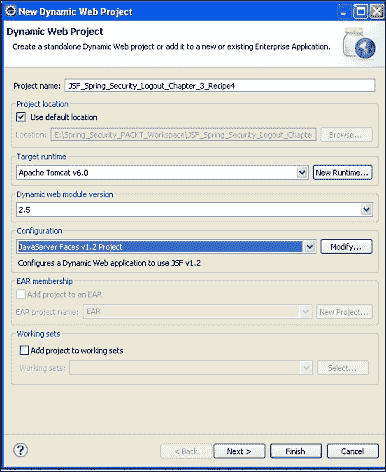

1.  我们将再次创建一个`CredentialManager` bean。它将有另一个自定义的注销方法。 `Login.jsp`与上一个示例相同。不要忘记将其复制到新项目中。我们将在这里使用基于表单的身份验证：

```java
package com.packt.jsf.beans;

import java.io.IOException;

import javax.faces.context.ExternalContext;
import javax.faces.context.FacesContext;
import javax.faces.event.PhaseEvent;
import javax.faces.event.PhaseId;
import javax.faces.event.PhaseListener;
import org.springframework.security.authentication.BadCredentialsException;
import javax.faces.application.FacesMessage;

import org.springframework.security.web.WebAttributes;

public class CredentialManager implements PhaseListener{
   /**
    * 
    */
   private static final long serialVersionUID = 1L;
   private String j_username;
   private String j_password;

    public String getJ_password() {
         return j_password;
   }
   public void setJ_password(String j_password) {
         this.j_password = j_password;
   }
   public String doSpringSecurityLogin() throws IOException, ServletException
       {
           ExternalContext context = FacesContext.getCurrentInstance().getExternalContext();
           RequestDispatcher dispatcher = ((ServletRequest) context.getRequest()).getRequestDispatcher("/j_spring_security_check");
           dispatcher.forward((ServletRequest) context.getRequest(),(ServletResponse) context.getResponse());
           FacesContext.getCurrentInstance().responseComplete();
           return null;
       }
   public String doSpringSecurityLogout() throws IOException, ServletException
 {
 ExternalContext context = FacesContext.getCurrentInstance().getExternalContext();
 RequestDispatcher dispatcher = ((ServletRequest) context.getRequest()).getRequestDispatcher("/j_spring_security_logout");
 dispatcher.forward((ServletRequest) context.getRequest(),(ServletResponse) context.getResponse());
 FacesContext.getCurrentInstance().responseComplete();
 return null;
 }
   public String getJ_username() {
         return j_username;
   }
   public void setJ_username(String j_username) {
         this.j_username = j_username;
   }
   public void afterPhase(PhaseEvent arg0) {
         // TODO Auto-generated method stub

   }
   public void beforePhase(PhaseEvent arg0) {
         Exception e = (Exception) FacesContext.getCurrentInstance().getExternalContext().getSessionMap().get(
            WebAttributes.AUTHENTICATION_EXCEPTION);

          if (e instanceof BadCredentialsException) {
              System.out.println("error block"+e);
               FacesContext.getCurrentInstance().getExternalContext().getSessionMap().put(
                   WebAttributes.AUTHENTICATION_EXCEPTION, null);
               FacesContext.getCurrentInstance().addMessage(null, new FacesMessage(FacesMessage.SEVERITY_ERROR,"Username or password not valid.", "Username or password not valid"));
           }
   }
   public PhaseId getPhaseId() {
          return PhaseId.RENDER_RESPONSE;
   }

}
```

1.  让我们在我们的安全页面上提供一个**注销**按钮：

`Supplier.jsp`：

```java
<%@ page language="java" contentType="text/html; charset=ISO-8859-1" pageEncoding="ISO-8859-1"%>
<%@ taglib prefix="f"  uri="http://java.sun.com/jsf/core"%>
<%@ taglib prefix="h"  uri="http://java.sun.com/jsf/html"%>
<!DOCTYPE html PUBLIC "-//W3C//DTD HTML 4.01 Transitional//EN" "http://www.w3.org/TR/html4/loose.dtd">
<html>
<head>
<meta http-equiv="Content-Type" content="text/html; charset=ISO-8859-1">
<title>Insert title here</title>
</head>
<body>
<f:view>
  <h:form prependId="false">
<h:panelGroup>
  <h:outputLabel value="Welcome "></h:outputLabel>
  <h:outputLabel value="#{credentialmanager.j_username}"></h:outputLabel>
  </h:panelGroup>

 <h:commandButton action="#{credentialmanager.doSpringSecurityLogout}" value="SpringSecurityLogout" />
  </h:form>
</f:view>
</body>
</html>
```

1.  更新`Spring-security.xml`文件：

```java
<beans:beans    xsi:schemaLocation="http://www.springframework.org/schema/beans http://www.springframework.org/schema/beans/spring-beans-3.0.xsd 
 http://www.springframework.org/schema/securityhttp://www.springframework.org/schema/security/spring-security-3.1.xsd">

 <global-method-security pre-post-annotations="enabled">

    </global-method-security>
   <http auto-config="true" use-expressions="true" >

          <intercept-url pattern="/faces/Supplier.jsp" access="hasRole('ROLE_USER')"/>  
         <form-login login-processing-url="/j_spring_security_check" login-page="/faces/login.jsp" default-target-url="/faces/Supplier.jsp" authentication-failure-url="/faces/login.jsp" />
         <logout  logout-success-url="/faces/login.jsp" />
   </http>

   <authentication-manager>
     <authentication-provider>
       <user-service>
         <user name="anjana" password="123456" authorities="ROLE_USER"/>
       </user-service>
     </authentication-provider>
   </authentication-manager>
</beans:beans>
```

## 它是如何工作的...

`CredentialManager`类实现了`phaseListener`接口。`doSpringSecurityLogout`方法通过使用`ExternalContext`创建一个上下文对象来处理 Spring 注销。然后，上下文提交注销请求，即`"/j_spring_security_logout"`到 Spring Security 框架，该框架注销用户。

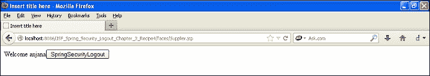

单击注销后，用户将被重定向到登录页面。

## 另请参阅

+   *使用 Spring Security 和 JSF 进行数据库认证*食谱

+   *使用 JSF 和 Spring Security 进行 ApacheDS 身份验证*食谱

+   *使用 JSF 和 Spring Security 进行身份验证错误消息*食谱

# 使用 Spring Security 和 JSF 进行数据库认证

在本节中，我们将使用数据库来验证 JSF 应用程序中的用户身份验证。我们已经参考了注销示例，并且已经使用数据库进行了身份验证。

## 准备工作

+   在 Eclipse 中创建一个动态 Web 项目：`JSF_Spring_DBAuthentication_Recipe6`

+   所有文件和文件夹与注销应用程序相同

+   更新`security.xml`文件和`web.xml`文件

+   将以下 JAR 文件添加到`lib`文件夹中，或者如果您使用 Maven，则更新您的 POM 文件：

+   spring-jdbc-3.1.4RELEASE

+   mysql-connector-java-5.1.17-bin

+   commons-dbcp

+   commons-pool-1.5.4

## 如何做...

以下步骤将帮助我们通过从数据库中检索数据来验证用户信息：

1.  更新`Spring-security.xml`文件以读取数据库配置：

`applicationContext-security.xml`：

```java
<beans: beans    xsi:schemaLocation="http://www.springframework.org/schema/beans http://www.springframework.org/schema/beans/spring-beans-3.0.xsd http://www.springframework.org/schema/securityhttp://www.springframework.org/schema/security/spring-security-3.1.xsd">

 <global-method-security pre-post-annotations="enabled">

    </global-method-security>
   <http auto-config="true" use-expressions="true" >

           <intercept-url pattern="/faces/Supplier.jsp" access="hasRole('ROLE_USER')"/>  
         <form-login login-processing-url="/j_spring_security_check" login-page="/faces/login.jsp" default-target-url="/faces/Supplier.jsp" authentication-failure-url="/faces/login.jsp" />
         <logout  logout-success-url="/faces/login.jsp" />

   </http>

   <authentication-manager> 
      <authentication-provider> 
          <jdbc-user-service data-source-ref="MySqlDS" 
            users-by-username-query=" 
              select username,password, enabled   
              from users1 where username=?"  

            authorities-by-username-query=" 
               select u.username, ur.role from users1 u, user_roles ur  
         where u.user_id = ur.user_id and u.username =?  " /> 
      </authentication-provider>
         </authentication-manager> 
</beans: beans>
```

## 它是如何工作的...

数据源引用在`Sping-security.xml`文件中给出。当用户点击**登录**时，Spring Security 过滤器将调用与数据库身份验证相关的类，这些类将读取`db-beans.xml`文件以建立连接。`<jdbc-user-service>`标签通过执行查询并根据用户在浏览器中提交的参数从数据库中检索用户信息来实现数据库身份验证。

## 另请参阅

+   *使用 JSF 和 Spring Security 进行 ApacheDS 身份验证*食谱

+   *使用 JSF 和 Spring Security 进行身份验证错误消息*食谱

# 使用 JSF 和 Spring Security 进行 ApacheDS 身份验证

在本节中，我们将使用 ApacheDS 和 Spring Security 在 JSF 应用程序中对用户进行身份验证。

## 准备工作

ApacheDS 身份验证类似于 Struts 2 ApacheDS 身份验证：

+   在 Eclipse 中创建一个动态 Web 项目：`JSF_Spring_ApacheDSAuthentication_Recipe7`

+   所有文件和文件夹与注销应用程序相同

+   更新`security.xml`文件

+   将`spring-security-ldap.jar`添加到您的`web-inf/lib`文件夹

## 如何做...

执行以下步骤来配置 Spring 和 JSF 应用程序的 LDAP：

1.  更新`Spring-security.xml`文件以读取 LDAP 配置：

```java
<beans:beans    xsi:schemaLocation="http://www.springframework.org/schema/beans http://www.springframework.org/schema/beans/spring-beans-3.0.xsd http://www.springframework.org/schema/securityhttp://www.springframework.org/schema/security/spring-security-3.1.xsd">

 <global-method-security pre-post-annotations="enabled">

    </global-method-security>
   <http auto-config="true" use-expressions="true" >

           <intercept-url pattern="/faces/Supplier.jsp" access="hasRole('ROLE_USER')"/>  
         <form-login login-processing-url="/j_spring_security_check" login-page="/faces/login.jsp" default-target-url="/faces/Supplier.jsp" authentication-failure-url="/faces/login.jsp" />
         <logout  logout-success-url="/faces/login.jsp" />
               </http>
         <authentication-manager>
           <ldap-authentication-provider 
                            user-search-filter="(mail={0})" 
                            user-search-base="ou=people"
                            group-search-filter="(uniqueMember={0})"
                      group-search-base="ou=groups"
                      group-role-attribute="cn"
                      role-prefix="ROLE_">
           </ldap-authentication-provider>
   </authentication-manager>

   <ldap-server url="ldap://localhost:389/o=example" manager-dn="uid=admin,ou=system" manager-password="secret" /></beans:beans>
```

## 它是如何工作的...

JSF 过滤器用于委托。Spring 过滤器用于身份验证。我们使用 ldap-authentication-provider 来设置 LDAP 参数到 Spring Security 引擎。当应用程序收到身份验证和授权请求时，spring-security-ldap 提供程序设置 LDAP 参数并使用 ldap-server-url 参数连接到 LDAP。然后检索用户详细信息并将其提供给 Spring 身份验证管理器和过滤器来处理身份验证的响应。

## 另请参阅

+   *JSF 和 Spring Security 的身份验证错误消息*配方

# JSF 和 Spring Security 的身份验证错误消息

在本节中，我们将看到如何捕获身份验证错误消息并在浏览器上向用户显示。如前面的示例中所示的`credentialmanager` bean 将捕获身份验证失败的异常。我们将看到如何在 JSP 中捕获它。

## 准备工作

`credentialmanager` bean 已捕获了错误凭据异常。

我们需要将其显示给用户。这可以通过在我们的 JSP 文件中使用`<h: messages>`标签来实现。这应该放在 grid 标记内。在托管 bean 中实现`phaselistener`的目的是捕获消息并将其显示给用户。这是更新后的`login.jsp`。

## 如何做...

执行以下步骤来捕获 JSP 中的身份验证失败消息：

+   编辑`login.jsp`文件：

```java
<!DOCTYPE html PUBLIC "-//W3C//DTD HTML 4.01 Transitional//EN" "http://www.w3.org/TR/html4/loose.dtd">
<%@ page language="java" contentType="text/html; charset=ISO-8859-1" pageEncoding="ISO-8859-1"%>
<%@ taglib prefix="f"  uri="http://java.sun.com/jsf/core"%>
<%@ taglib prefix="h"  uri="http://java.sun.com/jsf/html"%>

<html>
<head>
<meta http-equiv="Content-Type" content="text/html; charset=ISO-8859-1">
<title>Insert title here</title>
</head>
<body>
<f:view>
<h:form prependId="false">
                <h:panelGrid columns="2">

                 <h:outputLabel value="j_username"></h:outputLabel>
            <h:inputText    id="j_username" required="true" value="#{credentialmanager.j_username}"></h:inputText>
               <h:outputLabel value="j_password"></h:outputLabel>
            <h:inputSecret    id ="j_password" required="true" value="#{credentialmanager.j_password}"></h:inputSecret>
             <h:outputLabel value="_spring_security_remember_me"></h:outputLabel>
               <h:selectBooleanCheckbox
                      id="_spring_security_remember_me" />

              </h:panelGrid>
              <h:commandButton action="#{credentialmanager.doSpringSecurityLogin}" value="SpringSecurityLogin" />
 <h:messages />

         </h:form>
         </f:view>
</body>
</html>
```

## 它是如何工作的...

`credentialmanager`中的`beforePhase()`方法捕获了身份验证异常消息。异常被添加到`FacesMessage`，在 JSP 文件中捕获。

```java
FacesContext.getCurrentInstance().addMessage(null, new FacesMessage(FacesMessage.SEVERITY_ERROR,"Username or password not valid.", "Username or password not valid"));
```

以下截图显示了实现：

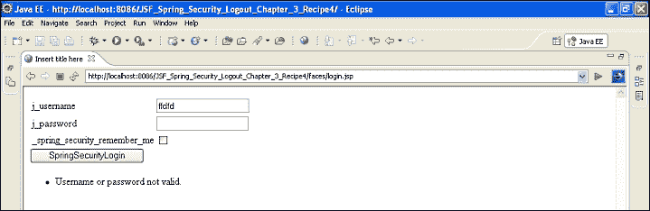

以下截图显示了身份验证失败时的屏幕：

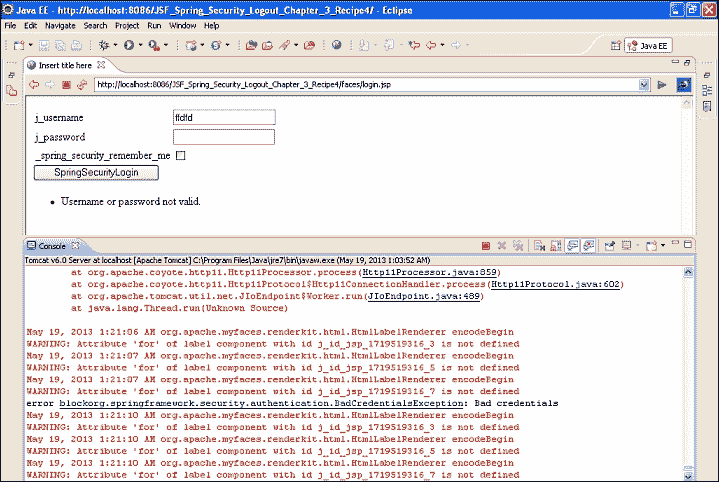

以下截图显示了当在用户名和密码字段中输入空凭据时的屏幕：

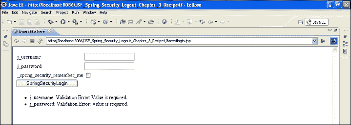

## 另请参阅

+   第四章, *与 Grails 一起使用 Spring Security*
