# 第四章：Spring Security with Grails

在本章中，我们将涵盖：

+   使用 Groovy Grails 设置 Spring Security 身份验证

+   使用 Grails 保护 Grails 控制器的 Spring Security

+   使用 Groovy Grails 注销场景的 Spring Security

+   使用 Groovy Grails 基本身份验证的 Spring Security

+   使用 Groovy Grails 摘要身份验证的 Spring Security

+   Spring Security with Groovy Grails 多重身份验证

+   使用 Groovy Grails LDAP 身份验证的 Spring Security

# 介绍

Grails 是一个基于插件的框架，它只需要在命令提示符上输入一些直观的命令即可工作。

在本章中，我们将看到如何轻松地将 Spring Security 与 Groovy on Grails 集成，编码量较少。

# 使用 Groovy Grails 设置 Spring Security 身份验证

在这个食谱中，我们首先将设置 Groovy 和 Grails。然后我们将展示如何将 Spring Security 与 Grails 集成。

## 准备工作

+   从[`groovy.codehaus.org/Download`](http://groovy.codehaus.org/Download)获取 Groovy 安装

+   从[`groovy.codehaus.org/Download`](http://groovy.codehaus.org/Download)下载并解压 Grails 2.3 到一个文件夹

+   设置环境变量：`GRAILS_HOME`

+   检查`Groovy_HOME`

+   通过输入`grails-version`来检查 Grails 安装

## 如何做...

以下步骤用于将 Spring Security 与 Groovy Grails 集成：

1.  创建一个目录：`Grails 项目`。

```java
cd Grails_Project
grails create-app myfirstapp
cd myfirstapp
grails create-controller MyFirstController

```

这将创建一个控制器，该控制器将在控制器包内可用。

1.  您可以打开生成的控制器文件并查看它。它将具有 Grails 自动生成的包名称`myfirstapp`。

```java
package myfirstapp
class MyFirstController {
    def index() { }
}
```

1.  更新生成的控制器文件。

```java
package myfirstapp
class MyFirstController {
  def index() { 
    render "Hello PACKT"
  }
}
```

1.  通过访问此 URL`http://localhost:8080/myfirstapp/`来测试 Grails 设置。

```java
cd myfirstapp

```

1.  为 Grails 下载安全 jar 文件。

```java
grails install-plugin spring-security-core
grails  s2-quickstart org.packt SecuredUser SecuredRole

```

如果安装程序不支持您的 Grails 版本，您可以向`BuildConfig.groovy`文件添加依赖项：

```java
plugins {

    compile ':spring-security-core:2.0-RC2'

}
```

1.  更新`Bootstrap.groovy`文件：

```java
import org.packt.SecuredUser;
import org.packt.SecuredRole;
import org.packt.SecuredUserSecuredRole
class BootStrap {

  def springSecurityService

    def init = { servletContext ->

    if(!SecuredUser.count()){
      /*The default password is 'password'*/
      def password = 'password'
      def user = new SecuredUser(username : 'anjana', password:'anjana123',enabled:true,accountExpired : false , accountLocked : false ,passwordExpired : false).save(flush: true, insert: true)
      def role = new SecuredUser(authority : 'ROLE_USER').save(flush: true, insert: true)
      /*create the first user role map*/
      SecuredUserSecuredRole.create user , role , true
    }

    }
    def destroy = {
    }
}
```

在前面的文件中，我们已经用用户名`anjana`和密码`anjana123`填充了用户。

只需这样做，我们就可以验证用户。

您可以看到我们没有更新任何 XML 文件。我们只是安装了插件并修改了文件。

## 工作原理...

让我们看看运行 Grails 时会得到什么样的输出：`grails run-app`。

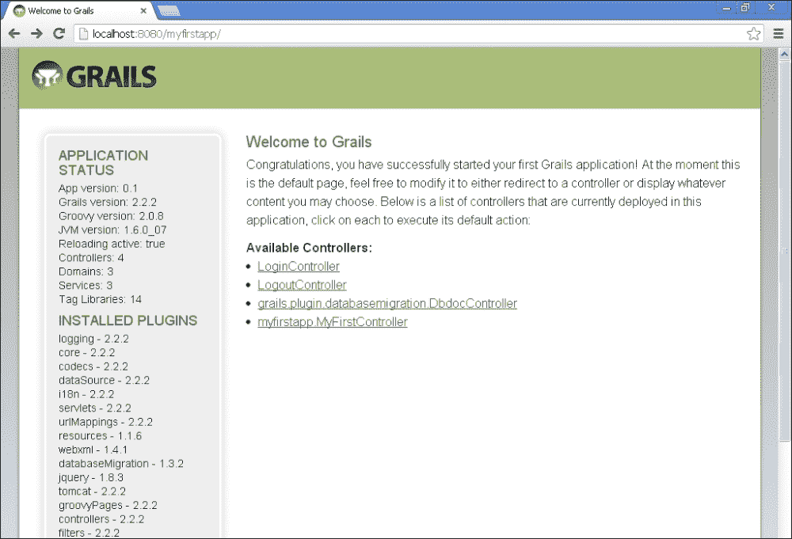

更新`i18n`文件夹中的`Messages.properties`文件：

```java
springSecurity.login.header=Spring Security login
springSecurity.login.username.label=UserName
springSecurity.login.password.label=Password
springSecurity.login.remember.me.label=remember me
springSecurity.login.button=Login
springSecurity.errors.login.fail=Authentication failed
```

单击`http://localhost:8080/myfirstapp/login/auth`上的**LoginController**链接。

您应该能够看到登录屏幕，该屏幕是在安装安全插件时由 Grails 框架生成的。页面位于视图文件夹中。现在您可以使用用户名和密码`anjana`，`anjana123`登录。您将被重定向到 Grails 主页。身份验证失败时，您将收到身份验证失败消息。

当您单击**LogoutController**链接时，您将注销。当您再次单击控制器时，将要求您重新登录。

以下是应用程序的工作流程：

这是 Grails 登录屏幕——单击**登录**按钮，在输入用户名和密码后，将提交凭据到 Spring Security 框架：

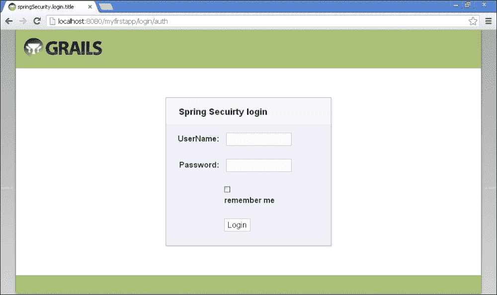

在身份验证失败时，用户将被重定向到登录屏幕，并显示**身份验证失败**消息。

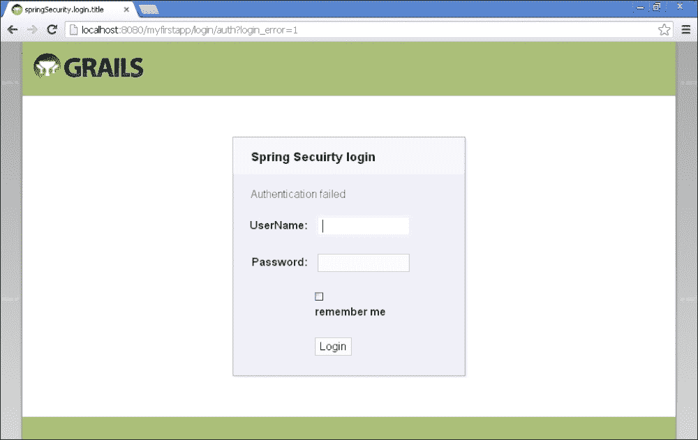

## 另请参阅

+   *Spring Security with Grails 保护 Grails 控制器*食谱

+   *Spring Security with Groovy Grails 注销场景*食谱

+   *Spring Security with Groovy Grails 基本身份验证*食谱

+   *Spring Security with Groovy Grails 摘要身份验证*食谱

+   *Spring Security with Groovy Grails 多级身份验证*食谱

+   *Spring Security with Groovy Grails LDAP 身份验证*食谱

# 使用 Grails 的 Spring Security 来保护 Grails 控制器

让我们将 Spring Security 应用于 Grails 控制器。场景是用户将访问 Grails 应用程序，并将提供一个登录链接。成功验证后，用户将提供可以访问的链接。这些链接只对已登录用户可见。

## 准备工作

为了演示目的，我们将创建以下内容：

+   一个简单的 Grails 控制器：`myfirstapp`

+   一个将使用 Spring Security 保护的`MyFirstController`控制器

+   修改`index.gsp`

## 操作步骤...

以下步骤用于将 Spring Security 与 Grails 集成以保护 Grails 控制器：

1.  转到`myfirstapp\grails-app\views`。

1.  您将看到`index.gsp`文件，将其重命名为`index.gsp_backup`。我已经从`index.gsp_backup`中复制了样式。

1.  创建一个新的`index.gsp`文件，编辑文件如下：

```java
<!DOCTYPE html>
<html>
  <head>
  </head>
  <body>
    <h1>Welcome to Grails</h1>
    <sec:ifLoggedIn>Access the <g:link controller='myFirst' action=''>Secured Controller</g:link><br/>
        <g:link controller='logout' action=''>Spring Logout</g:link>
    </sec:ifLoggedIn>

    <sec:ifNotLoggedIn>
    <h2>You are seeing a common page.You can click on login.After login success you will be provided with the links which you can access.</h2>
    <g:link controller='login' action='auth'>Spring Login</g:link>
    </sec:ifNotLoggedIn>

  </body>
</html>
```

## 工作原理...

访问 URL：`http://localhost:8080/myfirstapp/`。

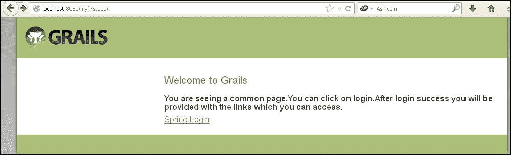

现在单击**Spring 登录**链接，您将被重定向到登录页面。Spring Security 处理身份验证机制，在成功登录后，用户将提供一个链接以访问受保护的控制器。

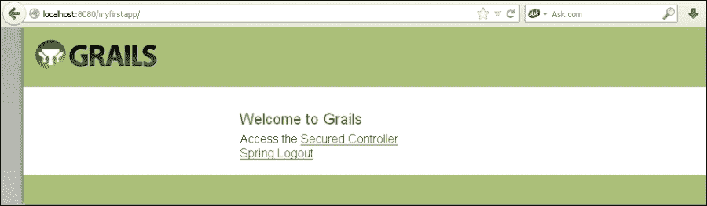

链接在`index.gsp`页面中提供，根据登录或注销状态显示和隐藏链接。这是使用`index.gsp`页面中的安全标签提供的。

单击**受保护的控制器**链接。您应该能够在浏览器上看到受保护控制器的输出消息。

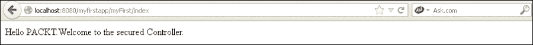

## 另请参阅

+   *使用 Groovy Grails 注销场景的 Spring Security*配方

+   *使用 Groovy Grails 基本身份验证的 Spring Security*配方

+   *使用 Groovy Grails 摘要身份验证的 Spring Security*配方

+   *使用 Groovy Grails 多级身份验证的 Spring Security*配方

+   *使用 Groovy Grails LDAP 身份验证的 Spring Security*配方

# Groovy Grails Spring Security 身份验证注销场景

在这个配方中，让我们看看在 Grails 应用程序中使用 Spring Security 的注销实现。

## 准备工作

当我们在 Grails 中安装 Spring Security 插件时，`Login Controller`和`Logout Controller`类将自动创建。`Login Controller`将处理身份验证。`Logout Controller`将处理注销过程，它将重定向用户到公共页面。

## 操作步骤...

以下步骤用于在 Groovy on Grails 应用程序中实现注销操作：

1.  在`index.jsp`文件中，我们添加以下内容：

```java
<g:link controller='logout' action=''>Spring Logout</g:link>
```

1.  `Logout Controller`类将请求重定向到`j_spring_security`：

```java
import org.codehaus.groovy.grails.plugins.springsecurity.SpringSecurityUtils

class LogoutController {

  /**
   * Index action. Redirects to the Spring security logout uri.
   */
  def index = {
    // TODO put any pre-logout code here
    redirect uri: SpringSecurityUtils.securityConfig.logout.filterProcessesUrl // '/j_spring_security_logout'
  }
}
```

## 工作原理...

单击注销链接。用户将被重定向到主页。`SpringSecurityUtils.securityConfig.logout.filterProcessesUrl`默认设置为`/j_spring_security_logout`。因此，当用户单击注销时，他们将被重定向到`/j_spring_security_logout`操作。这将注销用户并且用户必须再次登录到 Grails 应用程序。

## 另请参阅

+   *使用 Groovy Grails 基本身份验证的 Spring Security*配方

+   *使用 Groovy Grails 摘要身份验证的 Spring Security*配方

+   *使用 Groovy Grails 多级身份验证的 Spring Security*配方

+   *使用 Groovy Grails LDAP 身份验证的 Spring Security*配方

# 使用 Groovy Grails 基本身份验证的 Spring Security

在这个配方中，我们将演示使用基本身份验证机制在 Grails 上使用 Groovy 的安全性。

## 准备工作

+   我们需要创建一个 Grails 应用程序：`grailsbasicauthexample`

+   将 Spring Security 插件安装到新应用程序中

+   创建`User`和`Role`类

+   编辑`Config.groovy`文件

+   编辑`BootStrap.groovy`文件

+   创建一个控制器：`GreetingsController`

## 操作步骤...

以下步骤用于演示在 Groovy on Grails 中使用 Spring Security 进行基本身份验证：

1.  在命令提示符中运行以下命令：

+   `Grails create-app grailsbasicauthexample`

+   `cd grailsbasicauthexample`

+   `grails install-plugin spring-security-core`

+   `grails s2-quickstart com.packt SecuredUser SecuredRole`

1.  编辑 `config.groovy` 文件并设置以下值：

```java
grails.plugins.springsecurity.useBasicAuth = true
grails.plugins.springsecurity.basic.realmName = "HTTP Basic Auth Demo"
```

1.  编辑 `Bootstrap.groovy` 文件：

```java
import com.packt.*;
class BootStrap {
  def init = { servletContext ->
    def userRole = SecuredRole.findByAuthority("ROLE_USER") ?: new SecuredRole(authority: "ROLE_USER").save(flush: true)
    def user = SecuredUser.findByUsername("anjana") ?: new SecuredUser(username: "anjana", password: "anjana123", enabled: true).save(flush: true)
    SecuredUserSecuredRole.create(user, userRole, true)
  }
  def destroy = {
  }
}
```

1.  运行命令 `$grails create-controller Greetings` 并添加注解：

```java
package grailsbasicauthexample
import grails.plugins.springsecurity.Secured
class GreetingsController {
  @Secured(['ROLE_USER'])
  def index() { 
    render "Hello PACKT"
  }
}
```

## 它是如何工作的...

访问 URL：`http://localhost:8080/grailsbasicauthexample/`。

点击 **Greetings Controller** 链接。这是一个受 Spring Security 限制的安全链接。当用户点击链接时，基本认证机制会触发一个登录对话框。用户必须输入用户名/密码：`anjana`/`anjana123`，然后进行身份验证，用户将被重定向到一个授权页面，也就是，您将会看到 **Greetings Controller** 链接。

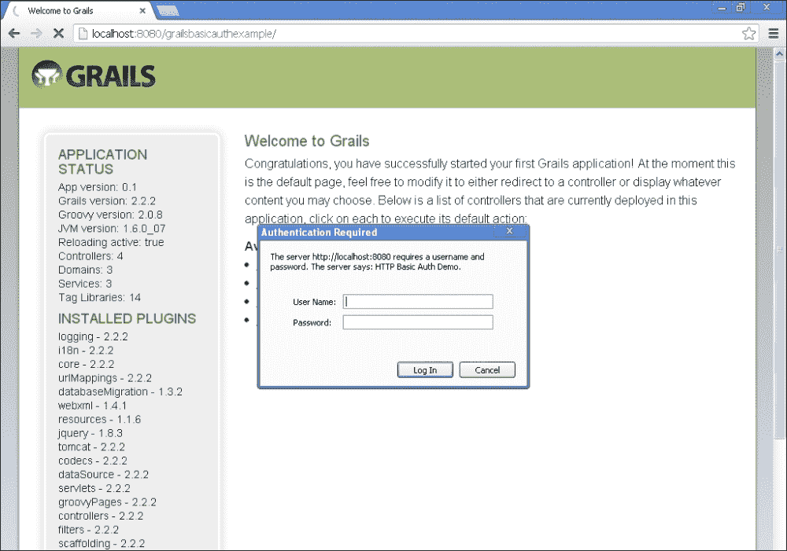

成功认证后，用户将获得对问候控制器的访问权限。

## 另请参阅

+   *Spring Security with Groovy Grails Digest authentication* 食谱

+   *Spring Security with Groovy Grails multilevel authentication* 食谱

+   *Spring Security with Groovy Grails LDAP authentication* 食谱

# Spring Security with Groovy Grails Digest authentication

在这个食谱中，让我们看看摘要认证机制，其中密码将被哈希。让我们将其与 Grails 应用程序集成，并查看它如何进行身份验证和授权。

## 准备工作

+   我们需要创建一个 Grails 应用程序：`grailsdigestauthexample`

+   将 Spring Security 插件安装到新应用程序中

+   创建 `User` 和 `Role` 类

+   编辑 `Config.groovy` 文件

+   编辑 `BootStrap.groovy` 文件

+   创建一个控制器：`SecuredPackt`

## 如何做…

以下步骤用于演示使用 Spring Security 在 Grails 上进行摘要认证：

1.  在命令提示符中运行以下命令：

```java
$grails create-app grailsdigestauthexample
$cd grailsdigestauthexample
$grails install-plug-in spring-security-core
$grails s2-quickstart com.packt SecuredUser SecuredRole
$grails create-controller SecuredPackt

```

1.  将以下内容添加到 `config.groovy` 文件并编辑 `Bootstrap.groovy` 文件：

```java
import com.packt.*;
class BootStrap {
  def init = { servletContext ->
    def userRole = SecuredRole.findByAuthority("ROLE_USER") ?: new SecuredRole(authority: "ROLE_USER").save(flush: true)
    def user = SecuredUser.findByUsername("anjana") ?: new SecuredUser(username: "anjana", password: "anjana123", enabled: true).save(flush: true)
    SecuredUserSecuredRole.create(user, userRole, true)
  }
  def destroy = {
  }
}
```

1.  编辑 `SecuredPacktController` 文件并添加注解：

```java
package grailsdigestauthexample
import grails.plugins.springsecurity.Secured
class SecuredPacktController {
  @Secured(['ROLE_USER'])
  def index() { 
  render "Hello PACKT"
  }
}
```

Grails 与 Spring Security 插件需要传递用户名作为盐值。

我们需要对生成的 `SecuredUser.groovy` 文件进行一些调整。

1.  更新 `SecuredUser.groovy` 文件，如下所示：

```java
package com.packt
class SecuredUser {
 transient passwordEncoder

  String username
  String password
  boolean enabled
  boolean accountExpired
  boolean accountLocked
  boolean passwordExpired

  static constraints = {
    username blank: false, unique: true
    password blank: false
  }

  static mapping = {
    password column: '`password`'
  }

  Set<SecuredRole> getAuthorities() {
    SecuredUserSecuredRole.findAllBySecuredUser(this).collect { it.securedRole } as Set
  }

  def beforeInsert() {
    encodePassword()
  }

  def beforeUpdate() {
    if (isDirty('password')) {
      encodePassword()
    }
  }

  protected void encodePassword() {
    password = passwordEncoder.encodePassword(password,       username)
  }
}
```

显示已登录用户：

```java
<!DOCTYPE html>
<html>
  <head>
    <meta name="layout" content="main"/>
    <title>Welcome to Grails</title>

  </head>
  <body>

    <div id="page-body" role="main">
      <h1>Welcome to Grails</h1>

        <sec:ifLoggedIn>
        Hello <sec:username/>
        Access the 
        <g:link controller='securedPackt' action=''>Secured Controller</g:link><br/>
        <g:link controller='logout' action=''>Spring Logout</g:link>
        </sec:ifLoggedIn>

        <sec:ifNotLoggedIn>
          <h2>You are seeing a common page.You can click on login. After login success you will be provided with the links which you can access.</h2>
        <g:link controller='securedPackt' action=''>Secured Controller</g:link><br/>

        </sec:ifNotLoggedIn>
    </div>
    </div>
  </body>
</html>
```

## 它是如何工作的...

当用户访问 URL `http://localhost:8080/grailsdigestauthexample/` 时，Spring Security 将提示用户一个登录对话框，要求输入用户名和密码。当用户输入用户名和密码时，Spring Security 对其进行身份验证，并将用户重定向到受保护的页面。

应用程序的工作流程如下：

`http://localhost:8080/grailsdigestauthexample/`

以下截图描述了尝试访问受保护资源时弹出的登录对话框：

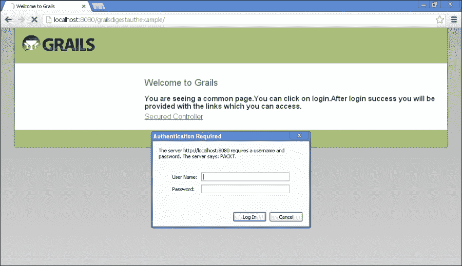

它的工作方式类似于基本认证。

成功登录后，您将获得一个注销链接。用户现在已经可以访问受保护的控制器：

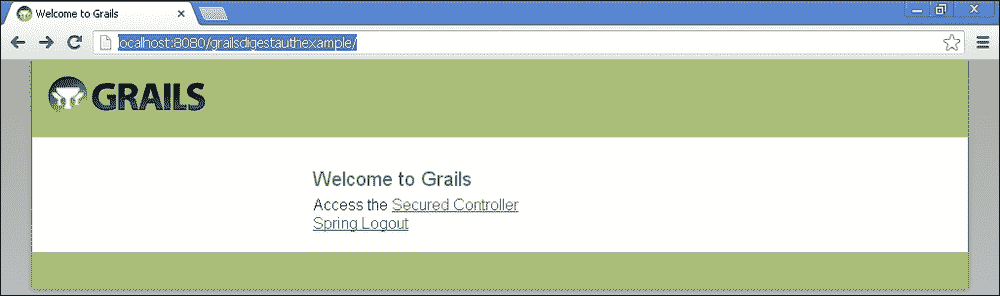

显示已登录用户：

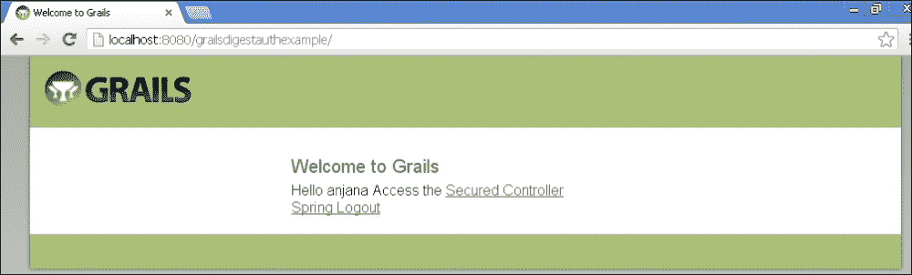

## 另请参阅

+   *Spring Security with Groovy Grails multilevel authentication* 食谱

+   *Spring Security with Groovy Grails LDAP authentication* 食谱

# Spring Security with Groovy Grails multiple authentication

到目前为止，我们已经看到了单角色认证。让我们看看多角色的演示。该食谱使用了另一个名为 `spring-security-ui` 的插件。

它有许多控制器，为用户提供用户管理屏幕。

这样可以节省开发人员编写这些屏幕的时间。它还提供了带自动完成的搜索选项。

`spring-security-ui` 插件还需要安装其他插件，将在控制台提示。还有一种安装插件的替代方法，即可以直接在 `BuildConfig.groovy` 文件中给出依赖项。

```java
grails.project.dependency.resolution = {
  ...
  plugins {
    compile ":spring-security-ui:0.2""
  }
}
```

## 准备工作

我们需要执行以下操作以实现多级身份验证：

+   创建一个 Grails 应用

+   安装`spring-security-core`插件

+   安装`spring-security-ui`插件

+   使用`quickstart`命令创建`Role`和`User`领域类

+   创建`Sample`控制器

+   编辑`BootStrap.groovy`文件

+   编辑`SampleController`类以添加角色

+   更新`.gsp`文件

## 如何做…

实施多重身份验证的以下步骤使用 Groovy on Grails 和 Spring Security：

1.  转到 Grails 工作区并运行以下命令：

+   `grails create-app multilevelroledemo`

+   `cd multilevelroledemo`

+   `grails install-plugin spring-security-core`

+   使用`grails install-plugin spring-security-ui`命令安装插件

+   使用`grails s2-quickstart com.packt.security SecuredUser SecuredRole`命令

+   `grails create-controller Sample`

1.  编辑`SampleController`文件：

```java
package multilevelroledemo
import grails.plugins.springsecurity.Secured
class SampleController {

  def index = {}

  @Secured(['ROLE_USER'])
  def user = {
    render 'Secured for ROLE_USER'
  }

  @Secured(['ROLE_ADMIN'])
  def admin = {
    render 'Secured for ROLE_ADMIN'
  }

  @Secured(['ROLE_SUPERADMIN'])
  def superadmin = {
    render 'Secured for ROLE_SUPERADMIN'
  }
}
```

1.  编辑`BootStrap.groovy`文件。我已添加了多个角色。这些角色和用户将从生成的领域 groovy 文件中创建：

```java
import com.packt.security.SecuredRole
import com.packt.security.SecuredUser
import com.packt.security.SecuredUserSecuredRole
class BootStrap {
  def init = { servletContext ->
    def userRole = SecuredRole.findByAuthority("ROLE_USER") ?: new SecuredRole(authority: "ROLE_USER").save(flush: true)
    def user = SecuredUser.findByUsername("anjana") ?: new SecuredUser(username: "anjana", password: "anjana123", enabled: true).save(flush: true)
    SecuredUserSecuredRole.create(user, userRole, true)

    def userRole_admin = SecuredRole.findByAuthority("ROLE_ADMIN") ?: new SecuredRole(authority: "ROLE_ADMIN").save(flush: true)
    def user_admin = SecuredUser.findByUsername("raghu") ?: new SecuredUser(username: "raghu", password: "raghu123", enabled: true).save(flush: true)
    SecuredUserSecuredRole.create(user_admin, userRole_admin, true)

    def userRole_superadmin = SecuredRole.findByAuthority("ROLE_SUPERADMIN") ?: new SecuredRole(authority: "ROLE_SUPERADMIN").save(flush: true)
    def user_superadmin = SecuredUser.findByUsername("packt") ?: new SecuredUser(username: "packt", password: "packt123", enabled: true).save(flush: true)
    SecuredUserSecuredRole.create(user_superadmin, userRole_superadmin, true)
  }
  def destroy = {
  }
}
```

1.  修改`.gsp`文件。在`views/sample`中添加一个`index.gsp`文件：

```java
<head>
  <meta name='layout' content='main' />
  <title>Multi level  Roles in Grails</title>
</head>

<body>
  <div class='nav'>
    <span class='menuButton'><a class='home' href='${createLinkTo(dir:'')}'>Home</a></span>
  </div>
  <div class='body'>
    <g:link action='user'> ROLE_USER</g:link><br/>
    <g:link action='admin'>ROLE_ADMIN</g:link><br/>
    <g: link action='superadmin'> ROLE_SUPERADMIN</g:link><br/>
  </div>
</body>
```

1.  在`config`文件夹中添加`SecurityConfig.groovy`文件：

```java
security {
  active = true
  loginUserDomainClass = 'com.packt.security.SecuredUser'
  authorityDomainClass = 'com.packt.security.SecuredPackt'
  useRequestMapDomainClass = false
  useControllerAnnotations = true
}
```

## 它是如何工作的…

让我们看看它是如何工作的。我们还将看到`spring-security-ui`提供的控制器及其功能。

我们在这里有三个具有不同角色的用户。它们是在`Bootstrap.groovy`文件中使用领域类创建的：

+   `anjana`/`anjana123` 作为 `ROLE_USER`

+   `raghu`/`raghu123` 作为 `ROLE_ADMIN`

+   `packt`/`packt123` 作为 `ROLE_SUPERADMIN`

访问 URL：`http://localhost:8080/multilevelroledemo/`。

您将看到 Grails 主页以及控制器列表。

单击**spring.security.ui.usercontroller**链接。该控制器属于`spring-security-ui`插件。该控制器提供了用户管理屏幕。该控制器为用户提供了搜索功能。这是一个很棒的 UI，它甚至具有带有搜索过滤器的自动完成选项。您可以转到以下链接：

`http://localhost:8080/multilevelroledemo/user/search`

下面的截图显示了 Spring 用户管理控制台，您可以在其中看到搜索用户的选项：

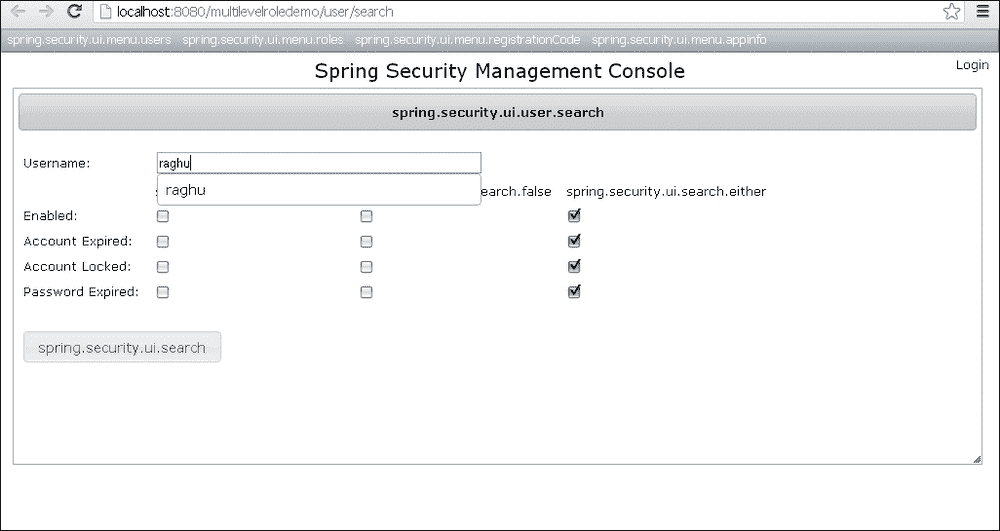

让我们看一下搜索结果，如下截图所示：

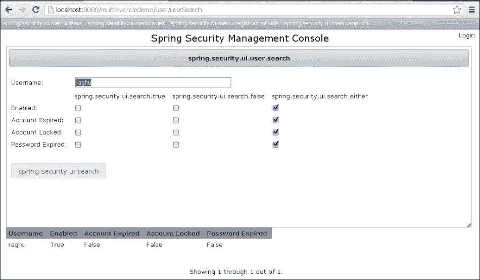

现在让我们检查`spring-security-ui`插件中提供的角色控制器。该控制器提供了搜索角色的选项，并提供了角色与用户的映射。它还提供了更新角色的选项：

`http://localhost:8080/multilevelroledemo/role/roleSearch`

您还可以创建用户，该选项可在菜单中找到。访问以下链接创建用户：

`http://localhost:8080/multilevelroledemo/user/create`

让我们看看我们为应用程序创建的示例控制器：

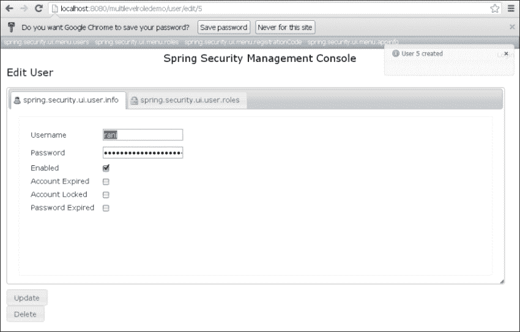

以下 URL 显示了具有各种角色的示例控制器映射。这也是`spring-security-ui`插件提供的：

`http://localhost:8080/multilevelroledemo/securityInfo/mappings`

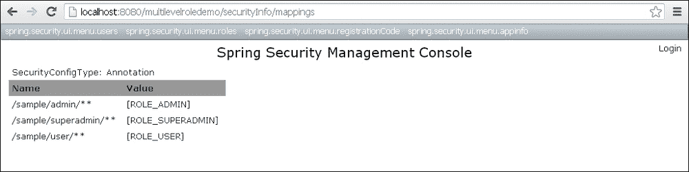

让我们访问`http://localhost:8080/multilevelroledemo/sample/index`的示例控制器。

它显示了三个角色。单击链接，您将被提示登录。

使用适当的用户名和密码登录，您的角色信息将被显示。

`spring-security-ui`插件本身提供了登录和注销的选项，适用于整个应用程序。

我们只能使用注解，即`@Secured`注解来对用户进行身份验证和授权以执行某些操作。

我们还可以省略在`Bootstrap.groovy`中创建用户。

## 另请参阅

+   *Groovy Grails LDAP 身份验证的 Spring 安全*配方

# Groovy Grails LDAP 身份验证的 Spring 安全

让我们进一步探索使用 LDAP 身份验证的 Groovy on Grails 上的`spring-security`插件。在这个示例中，我在我的机器上安装了**Apache DS**和 Apache Studio。我将使用这个进行身份验证。

Burt Beckwith 在此方面写了非常好的博客。您可以在以下网址查看：[`burtbeckwith.com/blog/`](http://burtbeckwith.com/blog/)

## 准备工作

+   创建一个 Grails 应用程序：`grailssecurityldapexamplex`。

+   让我们创建一个控制器：`SampleController`。

+   安装以下插件：

+   `spring-security-core`

+   `spring-security-ldap`

+   编辑`Config.groovy`文件。

+   我们将在成功验证后显示角色和用户详细信息。在这个示例中，我们将根据电子邮件地址和密码对用户进行身份验证。

+   我们需要在`Config.groovy`中提供 Apache DS 详细信息和端口号。

+   我正在使用一个单独的分区`sevenseas`。您可以通过添加一个单独的`jdmpartition`来创建自己的域。

+   有两种角色：用户和管理员。角色与 Apache DS 中的用户映射。我在 Apache DS 中创建了两个“组织单位”：

+   **people**：这将有用户

+   **groups**：这将具有映射到它的用户的角色

+   我从 Apache DS 获取`username`，`role`和`email`。

## 如何做…

采取以下步骤来使用 Grails 实现`spring-security`与 LDAP 进行身份验证：

1.  安装以下命令以安装插件：

+   `create-app grailssecurityldapexample`

+   `cd grailssecurityldapexample`

+   `grails install-plugin spring-security-core`

+   `grails install-plugin spring-security-ldap`

+   `grails create-controller Sample`

1.  让我们首先更新`message.properties`文件以获得清晰的 UI：

```java
springSecurity.login.header=Spring Security login
springSecurity.login.username.label=UserName
springSecurity.login.password.label=Password
springSecurity.login.remember.me.label=remember me
springSecurity.login.button=Login
springSecurity.errors.login.fail=Authentication failed
```

然后在`Config.groovy`文件中配置 Apache DS 属性。

1.  此配置将告诉 Grails 根据其电子邮件 ID 对用户进行身份验证：

```java
grails.plugins.springsecurity.ldap.search.filter = '(mail={0})'
grails.plugins.springsecurity.ldap.context.server = 'ldap://localhost:10389/o=sevenSeas'
grails.plugins.springsecurity.ldap.context.managerDn = 'uid=admin,ou=system'
grails.plugins.springsecurity.ldap.context.managerPassword = 'secret'
grails.plugins.springsecurity.ldap.authorities.groupSearchBase ='ou=groups'
grails.plugins.springsecurity.ldap.authorities.groupSearchFilter = '(uniqueMember={0})'
grails.plugins.springsecurity.ldap.authorities.retrieveDatabaseRoles = false
grails.plugins.springsecurity.ldap.authorities.ignorePartialResultException= true
grails.plugins.springsecurity.ldap.search.base = 'ou=people'
grails.plugins.springsecurity.ldap.search.filter = '(mail={0})'
grails.plugins.springsecurity.ldap.search.attributesToReturn = ['cn', 'sn','mail']
grails.plugins.springsecurity.ldap.authenticator.attributesToReturn = ['cn', 'sn','mail']
```

1.  编辑控制器：

```java
package grailssecurityldapexample
class SampleController {
  def index() { 
    render "Hello PACKT"
    }
}
```

1.  编辑`resource.groovy`文件以进行 Bean 映射。

```java
beans = { 
ldapUserDetailsMapper(MyUserDetailsContextMapper) { 
}
}
```

1.  用以下代码替换`index.gsp`的现有`body`标记：

```java
<body>
  <a href="#page-body" class="skip"><g:message code="default.link.skip.label" default="Skip to content&hellip;"/></a>

  <div id="page-body" role="main">
      <h1>Welcome to Grails</h1>
      <sec:ifLoggedIn>
Your Details<br/>
      Name:<sec:loggedInUserInfo field="fullname"/> <br/>
      Email:<sec:loggedInUserInfo field="email"/> <br/>
      Role:<sec:loggedInUserInfo field="title"/> <br/>
      <g:link controller='sample' action=''>Sample Controller</g:link><br/>
      (<g:link controller="logout">Logout</g:link>)
     </sec:ifLoggedIn> 
     <sec:ifNotLoggedIn>
      <h2>You are seeing a common page. You can click on login. After login success you will be provided with the links which you can access.</h2>
      <g:link controller='login' action='auth'>Spring Login</g:link>
      </sec:ifNotLoggedIn>

    </div>
  </body>
```

1.  在`src/groovy`下创建`MyUserDetails.groovy`：

```java
import org.springframework.security.core.GrantedAuthority 
import org.springframework.security.core.userdetails.User

class MyUserDetails extends User {   
 String fullname 
 String email 
 String title 

MyUserDetails(String username, String password, boolean enabled, boolean accountNonExpired, boolean credentialsNonExpired, boolean accountNonLocked, Collection authorities, String fullname,
String email, String title) {  
  super(username, password, enabled, accountNonExpired, credentialsNonExpired, accountNonLocked, authorities)
this.fullname = fullname 
this.email = email 
this.title = title 
}
}
```

1.  让我们为 LDAP 创建一个`ContextMapper`。

我们在这里获取 LDAP 属性：

```java
import org.springframework.ldap.core.DirContextAdapter
import org.springframework.ldap.core.DirContextOperations
import org.springframework.security.core.userdetails.UserDetails
import org.springframework.security.ldap.userdetails.UserDetailsContextMapper
class MyUserDetailsContextMapper implements UserDetailsContextMapper {
    UserDetails mapUserFromContext(DirContextOperations ctx, String username, Collection authorities) {
      String fullname = ctx.originalAttrs.attrs['cn'].values[0]
      String email = ctx.originalAttrs.attrs['mail'].values[0].toString().toLowerCase() 
      def title = ctx.originalAttrs.attrs['sn']
      def userDetails = new MyUserDetails(username, '', true, true, true, true,authorities, fullname,email,  title == null ? '' : title.values[0])
      return userDetails
    }
    void mapUserToContext(UserDetails user,
		DirContextAdapter ctx) {
			throw new IllegalStateException("Only retrieving
				data from LDAP is currently supported")
    }

}
```

执行以下命令以启动应用程序：

```java
grails run-app

```

## 它是如何工作的…

当用户访问 URL：`http://localhost:8080/grailssecurityldapexample/`时，他们将看到一个带有链接的常规页面。在登录表单中输入用户名和密码。单击**提交**，Grails 将 URL 提交给 Spring Security。Spring Security 连接提供的 LDAP 详细信息并查询 LDAP 以获取用户名。成功后，用户将被重定向到成功的 URL。

访问 URL：`http://localhost:8080/grailssecurityldapexample/`。

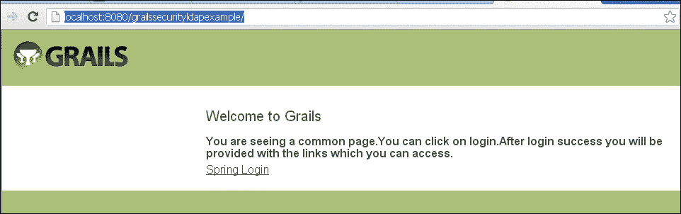

单击**Spring 登录**链接，输入用户名：`admin@test.com`和密码：`123456`。

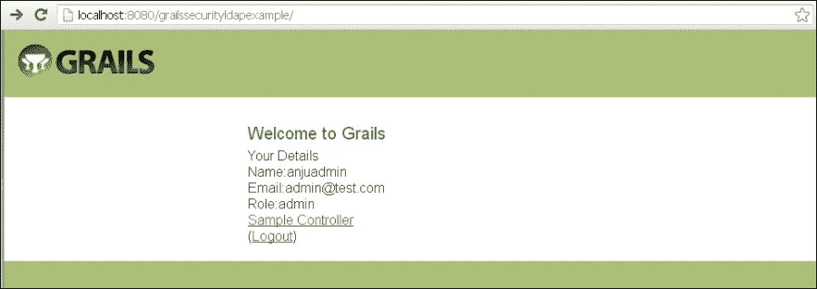

单击**注销**。

单击**Spring 登录**链接，输入用户名：`test@test.com`和密码：`pass`。Grails 应用程序将凭据提交给 Spring Security 框架，后者查询 LDAP 并检索用户详细信息，并在安全页面上显示它：

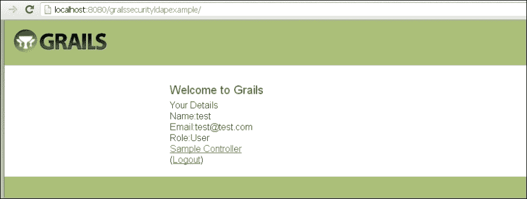

## 另请参阅

+   第六章，*使用 Vaadin 的 Spring 安全性*

+   第五章，*使用 GWT 的 Spring 安全性*
