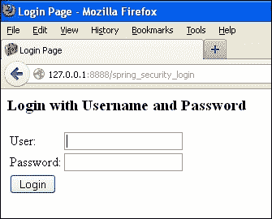
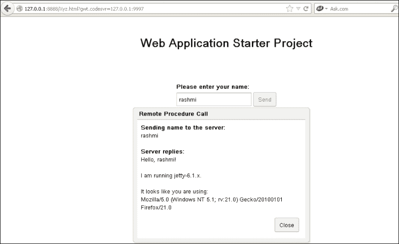
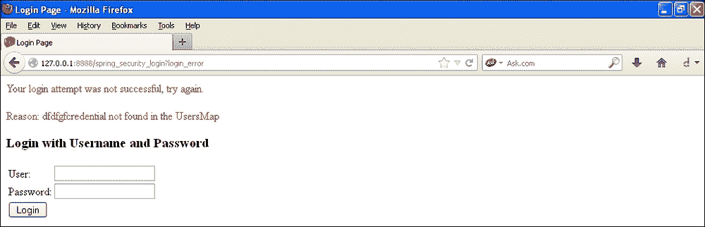
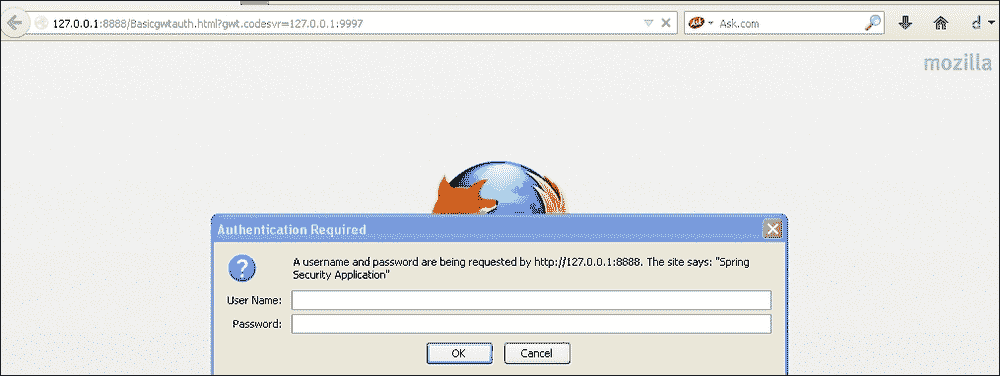

# 第五章：使用 GWT 的 Spring Security

在本章中，我们将涵盖：

+   使用 Spring Security Beans 进行 GWT 身份验证的 Spring Security

+   使用 GWT 和 Spring Security 进行基于表单的身份验证

+   使用 GWT 和 Spring Security 进行基本身份验证

+   使用 GWT 和 Spring Security 进行摘要身份验证

+   使用 GWT 和 Spring Security 进行数据库身份验证

+   使用 GWT 和 Spring Security 进行 LDAP 身份验证

# 介绍

**Google Web 开发工具包**（**GWT**）提供了一个用于开发 Java Web 应用程序的标准框架。GWT 旨在创建丰富的互联网应用程序，并且如果您想要实现跨浏览器兼容性，它将是一个很好的选择。现代浏览器，例如 Mozilla 和 Chrome，提供了可以安装在所有浏览器上的 GWT 插件。不同的 IDE 包括 Eclipse、NetBeans 和许多其他 IDE 都提供了各种插件。这些插件提高了开发速度。Eclipse 的 GWT 插件带有一个内部 Jetty 服务器，应用程序会自动部署在上面。GWT 还减少了对 javascript 开发人员的依赖，因为 GWT 代码通过 GWT 编译器转换为所有浏览器兼容的 javascript 和 HTML。

在本章中，我们将演示使用各种方法集成 GWT 的 Spring Security。首先，让我们进行基本设置。这就是下载插件并创建一个示例 GWT 项目。

# 使用 Spring Security Beans 进行 GWT 身份验证的 Spring Security

到目前为止，在我们之前的所有演示中，我们一直在`applicationContext.xml`文件中提供配置。在下面的示例中，我们将采用不同的方法。在这种方法中，我们将看到如何使用 Spring Security API 中可用的身份验证提供程序接口和身份验证接口来进行身份验证。

默认情况下，GWT 插件将创建一个问候应用程序，该应用程序将通过接受用户名来向用户问候。我们的目标是在此基础上应用安全性。我们希望在启动时提示用户输入 Spring Security 登录页面，然后将用户带入应用程序。

## 准备就绪

+   从[`dl.google.com/eclipse/plugin/3.7`](http://dl.google.com/eclipse/plugin/3.7)下载 Eclipse Indigo。

+   如果您使用不同的插件，请访问：[`developers.google.com/eclipse/docs/download`](https://developers.google.com/eclipse/docs/download)。

+   在 Eclipse 中创建一个 GWT Web 项目-这将生成一个默认的 GWT 应用程序，用于向用户问候。

+   在任何 GWT 应用程序中，您可以看到以下模块：

+   **配置模块**：这将有`gwt.xml`文件

+   **客户端**：这将有两个接口-异步接口和另一个接口，它扩展了*RemoteService*接口

+   **服务器**：将具有实现客户端接口并扩展远程服务 Servlet 的`Implementation`类

+   **共享**：这将有用于数据验证的类

+   **测试**：您可以在这里添加您的 junit 测试用例

+   **War**：这将有`web-inf`文件夹

+   在内部服务器上运行应用程序。您将获得一个 URL。

+   在 Mozilla Firefox 浏览器中打开 URL；您将收到一个提示，要下载 GWT 插件并安装它。

+   您将被提示输入用户名，输入后，您将收到一个对话框，其中将显示用户详细信息。

+   我们的目标是在应用程序启动时应用安全性，也就是说，我们希望识别访问 GWT 应用程序的用户。

+   创建一个`applicationContext.xml`文件。必须将其命名为`applicationContext`，否则我们将在控制台中收到错误消息。

+   使用 spring 监听器编辑`web.xml`文件。

+   确保`war/web-inf/lib`文件夹中有以下 JAR 文件：

+   `gwt-servlet`

+   `spring-security-config-3.1.4.Release`

+   `spring-security-core-3.1.4.Release`

+   `spring-security-web-3.1.4.Release`

+   `org.spring-framework.core-3.1.4.Release`

+   `org.spring-framework.context.support-3.1.4.Release`

+   `org.springframework.context-3.1.4.Release`

+   `org.springframework.expression-3.1.4.Release`

+   `org.springframework.aop-3.1.4.Release`

+   `org.springframework.aspects-3.1.4.Release`

+   `org.springframework.asm-3.1.4.Release`

+   `org.springframework.web-3.1.4.Release`

+   `org.springframework.web.servelet-3.1.4.Release`

+   `org.springframework.instrument-3.1.4.Release`

+   `org.springframework.instrument-tomcat-3.1.4.Release`

## 如何做...

1.  使用 Spring 监听器和 Spring 过滤器更新`Web.xml`文件：

```java
<filter>
  <filter-name>springSecurityFilterChain</filter-name>
  <filter-class>org.springframework.web.filter.DelegatingFilterProxy</filter-class>
</filter>

<filter-mapping>
  <filter-name>springSecurityFilterChain</filter-name>
  <url-pattern>/*</url-pattern>
</filter-mapping>

<listener>
  <listener-class>
  org.springframework.web.context.ContextLoaderListener
  </listener-class>
</listener>
```

您可以观察到我们没有像在以前的应用程序中那样配置`<context-param>`。Spring 将自动寻找`applicationContext.xml`文件。

1.  编辑`applicationContext.xml`文件：

```java
<http auto-config="true">
  <intercept-url pattern="/xyz/**" access="ROLE_AUTHOR"/>
  <intercept-url pattern="/xyz/**" access="ROLE_AUTHOR"/>
  <intercept-url pattern="/**/*.html" access="ROLE_AUTHOR"/>
  <intercept-url pattern="/**" 
    access="IS_AUTHENTICATED_ANONYMOUSLY" />
</http>
<beans:bean id="packtAuthenticationListener" 
  class="com.demo.xyz.server.PacktAuthenticationListener"/>
<beans:bean id="packtGWTAuthenticator" 
  class="com.demo.xyz.server.PacktGWTAuthenticator" />    
<authentication-manager alias="authenticationManager">
  <authentication-provider ref="packtGWTAuthenticator"/>
</authentication-manager>
</beans:beans>
```

这个配置也会给出下一步的提示。您可以观察到我们没有配置任何`<login-page>`或其 URL。我们只给出了需要安全的 URL。`<authentication-provider>`与自定义类映射。

我们还配置了两个 Bean，即监听器和认证者。

Spring 的上下文 API 允许我们创建监听器来跟踪应用程序中的事件。如果您回忆一下，我们还在我们的 JSF 应用程序中使用了监听器阶段监听器来跟踪与安全相关的事件和错误。

`PacktGWTAuthenticator`实现了认证提供程序接口。

1.  使用 Spring 认证提供程序创建一个认证者：

```java
Package com.demo.xyz.server
public class PacktGWTAuthenticator implements AuthenticationProvider{
  static Users users=new Users();
  private static Map<String, String> usersMap =users.loadUsers();

  @Override
  public Authentication authenticate
    (Authentication authentication) 
  throws AuthenticationException {

    String mylogin_name = (String) authentication.getPrincipal();
    String mypassword = (String)authentication.getCredentials();
    //check username
    if (usersMap.get(mylogin_name)==null)
    throw new UsernameNotFoundException
      (mylogin_name+"credential not found in the UsersMap");
//get password
    String password = usersMap.get(mylogin_name);

    if (!password.equals(mypassword))
      throw new BadCredentialsException("Incorrect password-
        or credential not found in the UsersMap");

      Authentication packtauthenticator =  new 
        PacktGWTAuthentication("ROLE_AUTHOR", authentication);
      packtauthenticator .setAuthenticated(true);

      return packtauthenticator;

    }

    @Override
    public boolean supports(Class<? extends Object>
       authentication) {
    return UsernamePasswordAuthenticationToken.class
      .isAssignableFrom(authentication);
  }
}
```

在这里，`authenticate()`和`supports()`是认证提供程序接口方法。用户类将加载用户。

1.  创建一个`User`类来加载用户：

```java
package com.demo.xyz.server;
import java.util.HashMap;
import java.util.Map;
public class Users {
  public Map<String, String> getUsersMap() {
    return usersMap;
  }

  public void setUsersMap(Map<String, String> usersMap) {

    this.usersMap = usersMap;
  }

  private Map<String, String> usersMap = new HashMap
    <String, String>();

  public Map<String, String> loadUsers(){
    usersMap.put("rashmi", "rashmi123");
    usersMap.put("shami", "shami123");
    usersMap.put("ravi", "ravi123");
    usersMap.put("ratty", "ratty123");
    return usersMap;
  }

}
```

上述类有一些 getter 和 setter。还有一个加载用户的方法。

1.  实现 Spring 认证类以获取用户信息：

```java
public class PacktGWTAuthentication implements Authentication{

  private static final long serialVersionUID = -3091441742758356129L;

  private boolean authenticated;

  private GrantedAuthority grantedAuthority;
  private Authentication authentication;

  public PacktGWTAuthentication(String role, Authentication authentication) {
    this.grantedAuthority = new GrantedAuthorityImpl(role);
    this.authentication = authentication;
  }

  @Override
  public Object getCredentials() {
    return authentication.getCredentials();
  }

  @Override
  public Object getDetails() {
    return authentication.getDetails();
  }

  @Override
  public Object getPrincipal() {
    return authentication.getPrincipal();
  }

  @Override
  public boolean isAuthenticated() {
    return authenticated;
  }

  @Override
  public void setAuthenticated(boolean authenticated)throws IllegalArgumentException {
    this.authenticated = authenticated;
  }

  @Override
  public String getName() {
    return this.getClass().getSimpleName();
  }
  @Override
  public Collection<GrantedAuthority> getAuthorities() {
    Collection<GrantedAuthority> authorities = new ArrayList<GrantedAuthority>();
    authorities.add(granted Authority);
    return authorities;
  }

}
```

认证接口处理用户详细信息、主体和凭据。认证提供程序使用此类传递角色信息。

1.  实现在 GWT 客户端包中声明的接口：

```java
package com.demo.xyz.server;
public class PacktAuthenticatorServiceImpl extends RemoteServiceServlet  implements PacktAuthenticatorService {

  @Override
  public String authenticateServer() {
  Authentication authentication =SecurityContextHolder.getContext().getAuthentication();
  if (authentication==null){
    System.out.println("looks like you have not logged in.");
    return null;
  }
  else {
    System.out.println(authentication.getPrincipal().toString());
    System.out.println(authentication.getName().toString());
    System.out.println(authentication.getDetails().toString());
    return (String) authentication.getPrincipal();
    }

  }

}
```

在这个类中找到`authenticate Server`方法的实现。这将打印调试语句以检查用户是否已登录。如果已登录，那么我们将必须获取主体和用户详细信息。

1.  使用 Spring 监听器跟踪事件：

```java
package com.demo.xyz.server;
public class PacktAuthenticationListener implements 
  ApplicationListener<AbstractAuthenticationEvent>{
  @Override
  public void onApplicationEvent
    (AbstractAuthenticationEvent event) {

    final StringBuilder mybuilder = new StringBuilder();
    mybuilder.append("AN AUHTHENTICATION EVENT ");
    mybuilder.append(event.getClass().getSimpleName());
    mybuilder.append("*** ");
    mybuilder.append(event.getAuthentication().getName());
    mybuilder.append("$$$DETAILS OF THE EVENT: ");
    mybuilder.append(event.getAuthentication().getDetails());

    if (event instanceof 
      AbstractAuthenticationFailureEvent) {
      mybuilder.append("$$$ EXCEPTION HAS OCCURED: ");
      mybuilder.append(((AbstractAuthenticationFailureEvent)
       event).getException().getMessage());
    }
    System.out.println(mybuilder.toString());
  }
}
```

该类实现了 Springs 应用程序监听器，类型为`AbstractAuthenticationEvent`。我们捕获认证事件并在控制台中打印出来；您也可以使用记录器来跟踪此类事件。

1.  在`ModuleLoad()`上更新 GWT 类：

```java
package com.demo.xyz.client;

/**
 * Entry point classes define <code>onModuleLoad()</code>.
 */
public class Xyz implements EntryPoint {
/**
 * The message displayed to the user when the server cannot be reached or
 * returns an error.
 */
private static final String SERVER_ERROR = 
  "An error occurred while "+ "attempting to contact
   the server. Please check your network "
  + "connection and try again.";

/**
 * Create a remote service proxy to talk to the server-side Greeting service.
 */
private final GreetingServiceAsync greetingService = 
  GWT.create(GreetingService.class);
private final PacktAuthenticatorServiceAsync 
  packtAuthenticatorService = 
  GWT.create(PacktAuthenticatorService.class);
/**
 * This is the entry point method.
 */
public void onModuleLoad() {
  final Button sendButton = new Button("Send");
  final TextBox nameField = new TextBox();
  nameField.setText("GWT User");
  final Label errorLabel = new Label();
  sendButton.addStyleName("sendButton");
  RootPanel.get("nameFieldContainer").add(nameField);
  RootPanel.get("sendButtonContainer").add(sendButton);
  RootPanel.get("errorLabelContainer").add(errorLabel);

// Focus the cursor on the name field when the app loads
  nameField.setFocus(true);
  nameField.selectAll();

  // Create the popup dialog box
  final DialogBox dialogBox = new DialogBox();
  dialogBox.setText("Remote Procedure Call");
  dialogBox.setAnimationEnabled(true);
  final Button closeButton = new Button("Close");
// We can set the id of a widget by accessing its Element
  closeButton.getElement().setId("closeButton");
  final Label textToServerLabel = new Label();
  final HTML serverResponseLabel = new HTML();
  VerticalPanel dialogVPanel = new VerticalPanel();
  dialogVPanel.addStyleName("dialogVPanel");
  dialogVPanel.add(new HTML
    ("<b>Sending name to the server:</b>"));
  dialogVPanel.add(textToServerLabel);
  dialogVPanel.add(new HTML("<br><b>Server replies:</b>"));
  dialogVPanel.add(serverResponseLabel);
  dialogVPanel.setHorizontalAlignment
    (VerticalPanel.ALIGN_RIGHT);
dialogVPanel.add(closeButton);
dialogBox.setWidget(dialogVPanel);

  // Add a handler to close the DialogBox
  closeButton.addClickHandler(new ClickHandler() {
    public void onClick(ClickEvent event) {
      dialogBox.hide();
      sendButton.setEnabled(true);
      sendButton.setFocus(true);
    }
  });

  // Create a handler for the sendButton and nameField
  class MyHandler implements ClickHandler, KeyUpHandler {

  public void onClick(ClickEvent event) {
    sendNameToServer();
  }

  public void onKeyUp(KeyUpEvent event) {
    if (event.getNativeKeyCode() == KeyCodes.KEY_ENTER) {
      sendNameToServer();
    }
  }

  /**
   * Send the name from the nameField to the server and wait for a response.
   */
  private void sendNameToServer() {
  // First, we validate the input.
  errorLabel.setText("");
  String textToServer = nameField.getText();
  if (!FieldVerifier.isValidName(textToServer)) {
    errorLabel.setText("Please enter at least four 
      characters");
    return;
    }

// Then, we send the input to the server.
    sendButton.setEnabled(false);
    textToServerLabel.setText(textToServer);
    serverResponseLabel.setText("");
    greetingService.greetServer(textToServer,
    new AsyncCallback<String>() {
      public void onFailure(Throwable caught) {
        // Show the RPC error message to the user dialogBox
        setText("Remote Procedure Call - Failure");
        serverResponseLabel.addStyleName
          ("serverResponseLabelError");
        serverResponseLabel.setHTML(SERVER_ERROR);
        dialogBox.center();
        closeButton.setFocus(true);
      }

      public void onSuccess(String result) {
        dialogBox.setText("Remote Procedure Call");
        serverResponseLabel.removeStyleName
          ("serverResponseLabelError");
        serverResponseLabel.setHTML(result);
        dialogBox.center();
        closeButton.setFocus(true);
      }
    });
  }
}

// Add a handler to send the name to the server
MyHandler handler = new MyHandler();
sendButton.addClickHandler(handler);
nameField.addKeyUpHandler(handler);
packtAuthenticatorService.authenticateServer(new AsyncCallback<String>() {
  public void onFailure(Throwable caught) {
    dialogBox.setText("Remote Procedure Call - Failure");
  }
  public void onSuccess(String result) {
    nameField.setText(result);
  }
}
);
}
}
```

在`onModuleLoad`方法的末尾添加此代码。这类似于在加载时注册我们的服务。

1.  编辑`PacktAuthenticationService`类：

```java
package com.demo.xyz.client;

/**
* Entry point classes define <code>onModuleLoad()</code>.
*/
public class Xyz implements EntryPoint {
  /**
   * The message displayed to the user when the server cannot be reached or
   * returns an error.
   */
  private static final String SERVER_ERROR = 
    "An error occurred while "+ "attempting to contact
     the server. Please check your network "
    + "connection and try again.";

  /**
   * Create a remote service proxy to talk to the server-side Greeting service.
   */
  private final GreetingServiceAsync greetingService
     = GWT.create(GreetingService.class);
  private final PacktAuthenticatorServiceAsync 
    packtAuthenticatorService = 
    GWT.create(PacktAuthenticatorService.class);
  /**
   * This is the entry point method.
   */
  public void onModuleLoad() {
    final Button sendButton = new Button("Send");
    final TextBox nameField = new TextBox();
    nameField.setText("GWT User");
    final Label errorLabel = new Label();

    // We can add style names to widgets
    sendButton.addStyleName("sendButton");

    // Add the nameField and sendButton to the RootPanel
    // Use RootPanel.get() to get the entire body element
    RootPanel.get("nameFieldContainer").add(nameField);
    RootPanel.get("sendButtonContainer").add(sendButton);
    RootPanel.get("errorLabelContainer").add(errorLabel);

    // Focus the cursor on the name field when the app loads nameField.setFocus(true);
    nameField.selectAll();

    // Create the popup dialog box
    final DialogBox dialogBox = new DialogBox();
    dialogBox.setText("Remote Procedure Call");
    dialogBox.setAnimationEnabled(true);
    final Button closeButton = new Button("Close");
    //We can set the id of a widget by accessing its Element
    closeButton.getElement().setId("closeButton");
    final Label textToServerLabel = new Label();
    final HTML serverResponseLabel = new HTML();
    VerticalPanel dialogVPanel = new VerticalPanel();
    dialogVPanel.addStyleName("dialogVPanel");
    dialogVPanel.add(new HTML
      ("<b>Sending name to the server:</b>"));
    dialogVPanel.add(textToServerLabel);
    dialogVPanel.add(new HTML("<br><b>Server replies:</b>"));
    dialogVPanel.add(serverResponseLabel);
    dialogVPanel.setHorizontalAlignment
      (VerticalPanel.ALIGN_RIGHT);
    dialogVPanel.add(closeButton);
    dialogBox.setWidget(dialogVPanel);

    // Add a handler to close the DialogBox
    closeButton.addClickHandler(new ClickHandler() {
      public void onClick(ClickEvent event) {
        dialogBox.hide();
        sendButton.setEnabled(true);
        sendButton.setFocus(true);
      }
    });

    // Create a handler for the sendButton and nameField
    class MyHandler implements ClickHandler, KeyUpHandler {
      /**
       * Fired when the user clicks on the sendButton.
       */
      public void onClick(ClickEvent event) {
        sendNameToServer();
      }

      /**
       * Fired when the user types in the nameField.
       */
      public void onKeyUp(KeyUpEvent event) {
        if (event.getNativeKeyCode() == KeyCodes.KEY_ENTER) {
          sendNameToServer();
        }
      }

        /**
         * Send the name from the nameField to the server and wait for a response.
         */
        private void sendNameToServer() {
        // First, we validate the input.
        errorLabel.setText("");
        String textToServer = nameField.getText();
        if (!FieldVerifier.isValidName(textToServer)) {
          errorLabel.setText("Please enter at least
             four characters");
          return;
        }

        // Then, we send the input to the server.
        sendButton.setEnabled(false);
        textToServerLabel.setText(textToServer);
        serverResponseLabel.setText("");
        greetingService.greetServer(textToServer,
        new AsyncCallback<String>() {
          public void onFailure(Throwable caught) {
            // Show the RPC error message to the user
          dialogBox.setText("Remote Procedure Call
             - Failure");
          serverResponseLabel.addStyleName
            ("serverResponseLabelError");
          serverResponseLabel.setHTML(SERVER_ERROR);
          dialogBox.center();
          closeButton.setFocus(true);
        }

        public void onSuccess(String result) {
        dialogBox.setText("Remote Procedure Call");
        serverResponseLabel.removeStyleName
          ("serverResponseLabelError");
        serverResponseLabel.setHTML(result);
        dialogBox.center();
        closeButton.setFocus(true);
      }
    });
  }
}

// Add a handler to send the name to the server
MyHandler handler = new MyHandler();
sendButton.addClickHandler(handler);
nameField.addKeyUpHandler(handler);
packtAuthenticatorService.authenticateServer(new AsyncCallback<String>() {
  public void onFailure(Throwable caught) {
  dialogBox.setText("Remote Procedure Call - Failure");
}
public void onSuccess(String result) {
  nameField.setText(result);
}
}
);
}
}
```

## 它是如何工作的...

现在访问以下 URL：

`http://127.0.0.1:8888/Xyz.html?gwt.codesvr=127.0.0.1:9997`

用户将被重定向到 Spring Security 内部登录页面。当用户输入**用户**和**密码**并点击提交时，`PacktGWTAuthenticator`类从`Users`类中加载用户，并比较输入。如果映射具有与用户提供的相同的凭据，授权将被启动，并且成功后，用户将被引导到 GWT 应用程序。该示例已经显式使用了 Spring Security 的`Authentication Provider`和`Authenticator Bean`类，通过实现接口和`application-context.xml`调用`PacktGWTAuthenticator`和`PacktGWTAuthentication implementation`类来进行认证和授权。



成功登录时将看到先前的图像。

Eclipse 控制台中生成的监听器输出：

```java
PacktGWTAuthentication
org.springframework.security.web.authentication.WebAuthenticationDetails@fffdaa08: RemoteIpAddress: 127.0.0.1; SessionId: 1cdb5kk395o29

```

登录失败时显示以下图像：



## 另请参阅

+   *使用 GWT 和 Spring Security 进行基于表单的身份验证*食谱

+   *使用 GWT 和 Spring Security 进行基本身份验证*食谱

+   *使用 GWT 和 Spring Security 进行摘要身份验证*食谱

+   *使用 GWT 和 Spring Security 进行数据库身份验证*食谱

+   *使用 GWT 和 Spring Security 进行 LDAP 身份验证*食谱

# 使用 GWT 和 Spring Security 进行基于表单的身份验证

我们将演示 GWT 中的基于表单的身份验证。这与我们在以前的配方中所做的身份验证非常相似。我们将编辑`applicationContext.xml`。

## 准备工作

+   创建一个样本 GWT 项目。

+   在构建路径中添加与 spring 相关的 JAR 包。

+   添加与 Spring Security 相关的 JAR 包。

+   添加`applicationContext.xml`文件。

+   按照上一节所示编辑`web.xml`文件。

+   还要在`web-inf lib`文件夹中添加与 spring 相关的 JAR 包。

## 如何做...

编辑`applicationContext.xml`文件：

```java
<http auto-config="true" >
  <intercept-url pattern="/basicgwtauth/**"
     access="ROLE_AUTHOR"/>
        <intercept-url pattern="/basicgwtauth/**" access="ROLE_AUTHOR"/>
        <intercept-url pattern="/**/*.html" access="ROLE_AUTHOR"/>
        <intercept-url pattern="/**" access="IS_AUTHENTICATED_ANONYMOUSLY" />

</http>
<authentication-manager>
  <authentication-provider>
    <user-service>
      <user name="anjana" password="123456" 
      authorities="ROLE_AUTHOR" />
    </user-service>
  </authentication-provider>
</authentication-manager>
```

此配置调用内部 Spring Security 登录表单。其想法是展示另一种情景，在这种情况下我们不指定身份验证机制，而是 spring 默认使用其登录表单页面来对用户进行身份验证。

## 工作原理...

现在访问以下 URL：

`http://127.0.0.1:8888/Basicgwtauth.html?gwt.codesvr=127.0.0.1:9997`


输入登录用户名和密码；您将被带到 GWT 页面。这也是一种机制，用于调用 spring 的内部登录 jsp 页面，如果开发人员不想创建自己定制的 jsp。它仍然读取提供的身份验证提供程序详细信息以对用户进行身份验证和授权。

以类似的方式，您也可以通过编辑身份验证管理器配置来使用数据库和 LDAP 进行身份验证。

## 另请参阅

+   使用 GWT 和 Spring Security 进行基本身份验证的配方

+   使用 GWT 和 Spring Security 进行摘要身份验证的配方

+   使用 GWT 和 Spring Security 进行数据库身份验证的配方

+   使用 GWT 和 Spring Security 进行 LDAP 身份验证的配方

# 使用 GWT 和 Spring Security 进行基本身份验证

我们将演示 GWT 中的基本身份验证。这与我们稍后将要做的基本身份验证非常相似。我们将编辑`applicationContext.xml`。

## 准备工作

+   创建一个样本 GWT 项目

+   在构建路径中添加与 spring 相关的 JAR 包

+   添加与 Spring Security 相关的 JAR 包

+   添加`applicationContext.xml`文件

+   按照上一节所示编辑`web.xml`文件

+   还要在`web-inf lib`文件夹中添加与 spring 相关的 JAR 包

## 如何做...

编辑`applicationContext.xml`文件：

```java
<http auto-config="true" >
  <intercept-url pattern="/basicgwtauth/**"
     access="ROLE_AUTHOR"/>
  <intercept-url pattern="/basicgwtauth/**"
     access="ROLE_AUTHOR"/>
  <intercept-url pattern="/**/*.html" access="ROLE_AUTHOR"/>
  <intercept-url pattern="/**"
     access="IS_AUTHENTICATED_ANONYMOUSLY" />
  <http-basic />
</http>
<authentication-manager>
  <authentication-provider>
    <user-service>
      <user name="anjana" password="123456" 
        authorities="ROLE_AUTHOR" />
    </user-service>
  </authentication-provider>
</authentication-manager>
```

在这里，我们将指定基本的身份验证机制。

## 工作原理..

现在访问 URL：

`http://127.0.0.1:8888/Basicgwtauth.html?gwt.codesvr=127.0.0.1:9997`

Spring Security 将阻止用户访问 GWT 应用程序。安全机制将从`application-context.xml`文件中读取。对于此应用程序，安全机制是基本的。Spring Security 将弹出一个对话框，要求输入用户名和密码。用户输入的登录用户名和密码将被验证和授权，用户将被带到 GWT 页面。



输入登录用户名和密码，您将被带到 GWT 页面。

## 另请参阅

+   使用 GWT 和 Spring Security 进行摘要身份验证的配方

+   使用 GWT 和 Spring Security 进行数据库身份验证的配方

+   使用 GWT 和 Spring Security 进行 LDAP 身份验证的配方

# 使用 GWT 和 Spring Security 进行摘要身份验证

我们现在将演示 GWT 中的摘要身份验证。这与我们在以前的配方中所做的基本身份验证非常相似。我们将编辑`applicationContext.xml`。我们将对密码进行哈希处理。设置保持不变，唯一的变化是`applicationcontext.xml`。

## 准备工作

+   创建一个样本 GWT 项目

+   在构建路径中添加与 spring 相关的 JAR 包

+   添加与 Spring Security 相关的 JAR 包

+   添加`applicationContext.xml`文件

+   按照上一节所示编辑`web.xml`文件

+   还要在`web-inf lib`文件夹中添加与 spring 相关的 JAR 包

## 如何做...

编辑`applicationContext.xml`文件：

```java
<http auto-config="true" >
  <intercept-url pattern="/basicgwtauth/**" access="
     ROLE_EDITOR "/>
  <intercept-url pattern="/basicgwtauth/**" access="
     ROLE_EDITOR "/>
  <intercept-url pattern="/**/*.html" access=
    " ROLE_EDITOR "/>
  <intercept-url pattern="/**" access
    ="IS_AUTHENTICATED_ANONYMOUSLY" />
  <http-basic />
</http>
<authentication-manager>
  <authentication-provider>
    <password-encoder hash="sha" />
    <user-service>
      <user name="anjana" 
        password="bde892ed4e131546a2f9997cc94d31e2c8f18b2a" 
      authorities="ROLE_EDITOR" />
    </user-service>
  </authentication-provider>
</authentication-manager>
```

在这里，我们指定身份验证机制为基本，并在此处给出了哈希密码。要对密码进行哈希处理，请使用`jacksum jar`。这已经在第二章中进行了演示，“Spring Security with Sturts2”。

## 它是如何工作的...

现在访问以下 URL：

`http://127.0.0.1:8888/Basicgwtauth.html?gwt.codesvr=127.0.0.1:9997`

用户应通过访问此 URL 重定向到 GWT 应用程序。但是 Spring 框架会中断此操作，以检查用户是否有权查看应用程序。它会弹出一个登录屏幕。输入登录用户名和密码，您将进入 GWT 页面。

根据配置文件中提到的算法对密码进行解码以进行身份验证。这里提到的算法是*Sha*。因此，密码将使用*Sha 算法*进行加密和解密。


输入登录用户名和密码，您将进入 GWT 页面。根据配置文件中提到的算法，将对密码进行解码以进行身份验证。

## 另请参阅

+   *使用 GWT 和 Spring Security 进行数据库身份验证*配方

+   *LDAP 身份验证与 GWT 和 Spring Security*配方

# GWT 和 Spring Security 的数据库身份验证

我们将演示 GWT 中的数据库身份验证。设置保持不变。在我们以前的所有示例中，我们都使用了`applicationContext.xml`，这是 Spring 框架很容易识别的，因为它具有默认文件名。在当前示例中，我们将为此提供一个新的文件名，并查看应用程序的响应。此外，我们需要添加`spring-jdbc.xml`。

## 准备就绪

+   创建一个示例 GWT 项目

+   在构建路径中添加与 spring 相关的 JAR 包

+   添加与 Spring Security 相关的 JAR 包

+   添加`spring-security.xml`文件

+   添加与 spring-jdbc 相关的 JAR 包

+   根据前一部分的示例编辑`web.xml`文件

+   还要在`web-inf lib`文件夹中添加与 spring 相关的 JAR 包

## 如何做...

编辑`spring-security.xml`文件：

```java
<http auto-config="true" >
  <intercept-url pattern="/springgwtdbsecurity/**"
     access="ROLE_AUTHOR"/>
  <intercept-url pattern="/springgwtdbsecurity/**"
     access="ROLE_AUTHOR"/>
  <intercept-url pattern="/**/*.html" access="ROLE_AUTHOR"/>
  <intercept-url pattern="/**"
     access="IS_AUTHENTICATED_ANONYMOUSLY" />
  <http-basic />
</http>
<authentication-manager alias="authenticationManager">
  <authentication-provider>
  <jdbc-user-service data-source-ref="dataSource"
  users-by-username-query="
  select username,password, enabled 
  from users where username=?" 

  authorities-by-username-query="
  select u.username, ur.authority from users u,
     user_roles ur 
        where u.user_id = ur.user_id and u.username =?"/>
  </authentication-provider>
</authentication-manager>
```

在`xml`文件的 beans 标记中添加上述内容。在这里，我们指定身份验证机制为基本，并且用户信息存储在数据库中。

编辑`spring-jdbc.xml`文件：

```java
<beans 

  xsi:schemaLocation="http://www.springframework.org/
    schema/beans
  http://www.springframework.org/schema/beans/
    spring-beans-3.0.xsd">

  <bean id="MySqlDatasource" class="org.springframework.
    jdbc.datasource.DriverManagerDataSource">
    <property name="driverClassName" value=
      "com.mysql.jdbc.Driver" />
    <property name="url" value=
      "jdbc:mysql://localhost:3306/packtdb" />
    <property name="username" value="root" />
  <property name="password" value="packt123" />
  </bean>
</beans>
```

我们正在提供数据库信息。

编辑`web.xml`文件：

```java
<context-param>
  <param-name>contextConfigLocation</param-name>
  <param-value>
    /WEB-INF/spring-security.xml,
    /WEB-INF/spring-jdbc.xml
  </param-value>
</context-param>

<listener>
  <listener-class>
    org.springframework.web.context.ContextLoaderListener
  </listener-class>
</listener>
```

我们必须配置`springsecurityFilterchain`，如前面的示例所示，在其中添加上述部分。

## 它是如何工作的...

现在访问以下 URL：

`http://127.0.0.1:8888/springgwtdbsecurity.html?gwt.codesvr=127.0.0.1:9997`

输入登录用户名和密码，您将进入 GWT 页面。将创建数据库连接并执行查询。用户输入的值将与检索到的值进行身份验证。通过这种方式，我们可以看到 GWT 与 Spring Security 无缝集成。

## 另请参阅

+   *LDAP 身份验证与 GWT 和 Spring Security*配方

# GWT 和 Spring Security 的 LDAP 身份验证

我们将演示 GWT 中的 LDAP 身份验证。设置保持不变：用户必须创建组和用户。

## 准备就绪

+   创建一个示例 GWT 项目

+   在构建路径中添加与 spring 相关的 JAR 包

+   添加与 Spring Security 相关的 JAR 包

+   添加`spring-security.xml`文件

+   添加与 spring-LDAP 相关的 JAR 包

+   根据前一部分显示的内容编辑`web.xml`文件

+   还要在`web-inf lib`文件夹中添加与 spring 相关的 JAR 包

## 如何做...

编辑`spring-security.xml`文件：

```java
<http auto-config="true" >
  <intercept-url pattern="/springgwtldapsecurity/**"
     access="ROLE_AUTHOR"/>
  <intercept-url pattern="/springgwtldapsecurity/**"
     access="ROLE_AUTHOR"/>
  <intercept-url pattern="/**/*.html" access="ROLE_AUTHOR"/>
  <intercept-url pattern="/**"
     access="IS_AUTHENTICATED_ANONYMOUSLY" />
  <http-basic />
</http>
<authentication-manager>
  <ldap-authentication-provider 
    user-search-filter="(mail={0})" 
    user-search-base="ou=people"
    group-search-filter="(uniqueMember={0})"
    group-search-base="ou=groups"
    group-role-attribute="cn"
    role-prefix="ROLE_">
    </ldap-authentication-provider>
  </authentication-manager>

<ldap-server url="ldap://localhost:389/o=example"
   manager-dn="uid=admin,ou=system"
   manager-password="secret" />
```

将此代码添加到 xml 的`beans`标记中。在这里，我们指定身份验证机制为基本，并且用户信息存储在 LDAP 服务器中。

编辑`web.xml`文件：

```java
<context-param>
  <param-name>contextConfigLocation</param-name>
  <param-value>
    /WEB-INF/spring-security.xml
  </param-value>
</context-param>

<listener>
  <listener-class>
    org.springframework.web.context.ContextLoaderListener
  </listener-class>
</listener>
```

我们必须像前面的示例中那样配置`springsecurityFilterchain`。

## 它是如何工作的...

现在访问以下 URL：

`27.0.0.1:8888/springgwtldapsecurity.html?gwt.codesvr=127.0.0.1:9997`

输入登录用户名和密码，您将被带到 GWT 页面。Spring 将使用`<ldap-server>`标签中提供的详细信息来访问开放 LDAP。Spring Security LDAP 将与开放 LDAP 通信，并将用户输入的值与检索到的值进行身份验证。成功后，用户将被重定向到应用程序。通过这一点，我们可以看到 GWT 与 Spring Security 无缝集成。

## 还有更多...

谷歌上有一个活跃的项目`code-gwtsecurity`包，旨在将 Spring Security 与 GWT 应用程序集成。它通过 GWT 弹出窗口进行登录。在身份验证失败时，它会在 GWT 窗口上向用户显示错误消息。文件`Spring4GWT jar`通过拦截 RPC 中的错误消息来工作。

让我们看看在下一章中 Spring 如何与 Vaadin 集成。
