# 第六章：使用 Vaadin 的 Spring Security

在本章中，我们将涵盖：

+   *使用 Vaadin 的 Spring Security - 基本身份验证*

+   *使用 Vaadin 的 Spring Security - Spring 基于表单的身份验证*

+   *使用 Vaadin 的 Spring Security - 自定义 JSP 基于表单的身份验证*

+   *使用 Vaadin 的 Spring Security - 使用 Vaadin 表单*

# 介绍

Vaadin 已成为当前项目中流行的框架。它提供了类似 GWT 的 RIA。它没有 RPC 调用和异步服务类。它的工作方式类似于 GWT 小部件。Vaadin 还很容易与 portlet 集成。在 GWT 中，我们必须安装与浏览器兼容的 GWT 插件，但在 Vaadin 中我们不需要这样做。在 Vaadin 开发的应用程序在所有现代浏览器上都兼容。Vaadin 可以编写为服务器端和客户端应用程序。Vaadin UI 组件实际上是一个 JavaServlet 组件，可以轻松运行在诸如 Tomcat 之类的 Web 服务器上，也可以运行在 JBOSS 和 Glassfish 等应用服务器上。在当前演示中，我正在使用 Tomcat 和 Eclipse Indigo。

在本章中，我们将演示使用各种方法集成 Spring Security 与 Vaadin。让我们首先进行基本设置。这就是下载插件并创建一个示例 Vaadin 项目。

# 使用 Vaadin 的 Spring Security - 基本身份验证

我们的目标是在 Vaadin 应用程序上进行简单的基本身份验证。当我们访问 Vaadin 应用程序的 URL 时，我希望出现一个登录对话框。我创建了一个简单的产品目录应用程序，它看起来与地址簿非常相似。

## 准备工作

+   在 Eclipse 上设置 Vaadin 应用程序：

+   下载 Vaadin [`vaadin.com/eclipse`](http://vaadin.com/eclipse) 适用于 Eclipse Indigo。

在本章中，我们将演示 Spring Security 与 Vaadin 两个版本（Vaadin 6 和 Vaadin 7）的集成。

+   在 Eclipse 中创建一个 Vaadin 7 的 Vaadin Web 项目 - 这将生成一个带有点击按钮的默认应用程序，我们将对其进行修改。

+   在 Tomcat 服务器上运行应用程序。

+   创建一个`applicationContext.xml`文件。必须将其命名为`applicationContext`，否则我们将在控制台中收到错误消息。

+   编辑`web.xml`文件，添加 spring 监听器。

+   将所有 jar 包添加到类路径中。

## 如何做...

以下步骤是为了将 Spring Security 与 Vaadin 集成以演示基本身份验证：

1.  使用 spring 监听器和 spring 过滤器更新`web.xml`文件，使用 Vaadin servlet：

```java
<display-name>Vaadin_Project1</display-name>
<filter>
  <filter-name>springSecurityFilterChain</filter-name>
  <filter-class>org.springframework.web.filter.
    DelegatingFilterProxy</filter-class>
</filter>

<filter-mapping>
  <filter-name>springSecurityFilterChain</filter-name>
  <url-pattern>/*</url-pattern>
</filter-mapping>

<listener>
  <listener-class>
    org.springframework.web.context.ContextLoaderListener
  </listener-class>
</listener>

  <context-param>
    <description>
    Vaadin production mode</description>
    <param-name>productionMode</param-name>
    <param-value>false</param-value>
  </context-param>

  <servlet>
    <servlet-name>Vaadin_Project1</servlet-name>
    <servlet-class>com.vaadin.server.VaadinServlet
      </servlet-class>
  <init-param>
    <description>
      Vaadin UI class to use</description>
    <param-name>UI</param-name>
    <param-value>com.example.vaadin_project1
      .Vaadin_project1UI</param-value>
  </init-param>
  <init-param>
    <description>
    Legacy mode to return the value of
       the property as a string from 
      AbstractProperty.toString()</description>
    <param-name>legacyPropertyToString</param-name>
    <param-value>false</param-value>
  </init-param>
</servlet>
<servlet-mapping>
  <servlet-name>Vaadin_Project1</servlet-name>
  <url-pattern>/*</url-pattern>
</servlet-mapping>
```

1.  您可以观察到我们没有像在以前的应用程序中那样配置`<context-param>`。Spring 将自动查找`applicationContext.xml`文件。为了设置 Vaadin，我们需要使用两个参数`PropertyToString`和一个名为`com.example.vaadin_project1`的 UI 类来配置 Vaadin servlet 类。使用以下代码编辑`applicationContext.xml`文件：

```java
<http auto-config="true">
 <intercept-url pattern="/Vaadin_Project1/**"access="ROLE_EDITOR"/> 
 <intercept-url pattern="/Vaadin_Project1/*.*"access="ROLE_EDITOR"/> 
 <intercept-url pattern="/**" access="ROLE_EDITOR" />
 <http-basic /> 
</http>

<authentication-manager>
  <authentication-provider>
    <user-service>
      <user name="anjana" password="123456"authorities="ROLE_EDITOR" />
    </user-service>
  </authentication-provider>
</authentication-manager>
</beans:beans>
```

这是一个简单的基本身份验证配置。使用此配置，我们期望在显示 Vaadin 应用程序之前出现登录对话框。我创建了一个新的编辑器角色。

在这里，我们创建了一个`ProductList`组件来显示产品列表。

## 它是如何工作的...

在这个例子中，我们演示了 Vaadin 应用程序的基本身份验证机制。有时我们不需要为用户显示 jsp 页面或 Vaadin 登录表单，在这种情况下，我们选择基本身份验证，其中会弹出一个对话框要求用户输入他们的凭据。成功后，用户将获得对 Vaadin 应用程序的访问权限。应用程序的工作流程如下所示：

现在访问以下 URL：

`http://localhost:8086/Vaadin_Project1/`

您应该看到以下截图中显示的页面：

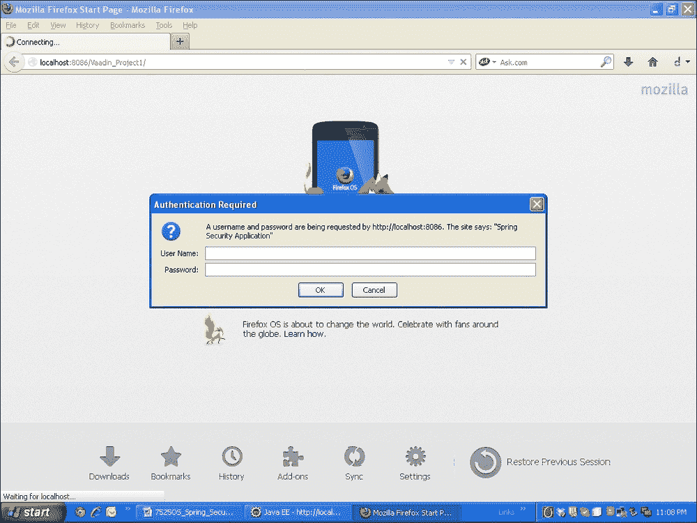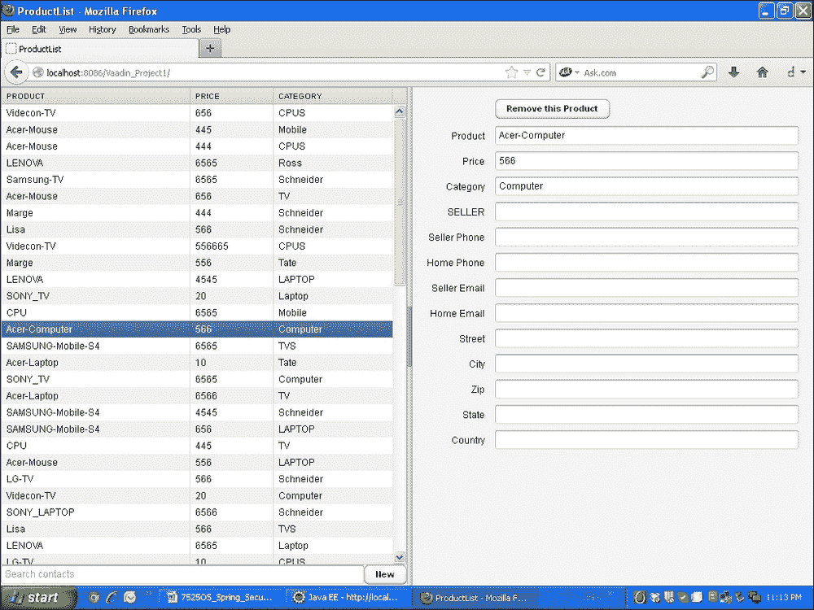

## 另请参阅

+   *使用 Vaadin 的 Spring Security - Spring 基于表单的身份验证*配方

+   *使用 Vaadin 的 Spring Security - 自定义 JSP 基于表单的身份验证*配方

+   *使用 Vaadin 的 Spring Security - 使用 Vaadin 表单*配方

# Spring Security with Vaadin – Spring 表单认证

我们将演示 Vaadin 中的基于表单的认证。这与我们在之前的配方中使用的认证非常相似。我们将编辑 `applicationContext.xml` 文件。我们不会创建任何自定义登录表单，我们希望使用 spring 内部登录表单。

## 准备工作

您必须在 `application-Context.xml` 文件中注释掉 `<http-basic/>` 标记。

## 如何做...

按照以下代码编辑 `applicationContext.xml` 文件：

```java
<http auto-config="true">
  <intercept-url pattern="/Vaadin_Project1/**"
     access="ROLE_EDITOR"/> 
  <intercept-url pattern="/Vaadin_Project1/*.*"
     access="ROLE_EDITOR"/> 
  <intercept-url pattern="/**" access="ROLE_EDITOR" />
</http>
<authentication-manager>
  <authentication-provider>
    <user-service>
       <user name="anjana" password="123456"
       authorities="ROLE_EDITOR" />
    </user-service>
  </authentication-provider>
</authentication-manager>
```

## 工作原理...

在这个例子中，调用了 spring 的内部登录表单来对 Vaadin 应用程序进行认证。这个配置是在 `applicationConext.xml` 文件中完成的。Spring 框架弹出了自己的内部 jsp 文件供用户使用。当用户输入凭据并点击 **提交** 时，他们将被重定向到 Vaadin 应用程序。运行 Tomcat 服务器。

现在访问以下 URL：

`http://localhost:8086/Vaadin_Project1/`

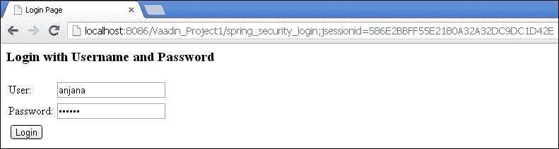

这是 Spring 提供的内置登录表单。

输入登录用户名和密码，您将进入 Vaadin 产品列表。

同样，您可以通过编辑 authentication-manager 配置来使用数据库和 LDAP 进行认证。

## 另请参阅

+   *Spring Security with Vaadin – 自定义 JSP 表单认证* 配方

+   *Spring Security with Vaadin – 使用 Vaadin 表单* 配方

# Spring Security with Vaadin – 自定义 JSP 表单认证

到目前为止，我们已经演示了使用 Spring Security API 登录表单和登录弹出对话框的 Vaadin 7 应用程序。我们所做的一切都是在应用程序上下文文件中创建用户。

这次我们将为应用程序上下文赋予不同的名称，并提供一个自定义的登录表单，并使用 Vaadin 6 项目。

## 准备工作

+   创建一个示例 Vaadin 6 项目

+   在构建路径中添加与 Spring 相关的 jar 包

+   添加与 Spring Security 相关的 jar 包

+   添加 `vaadin-spring-security.xml` 文件

+   添加 `mybeans.xml` 文件

+   按照上一节中的示例编辑 `web.xml` 文件

+   还要在 `web-inf lib` 文件夹中添加与 Spring 相关的 jar 包

## 如何做...

以下步骤是使用自定义 JSP 实现基于表单的认证，使用 Vaadin 应用程序。

由于 Vaadin 6 应用程序的入口点是 `AbstractApplicationServlet`，我们将创建一个扩展 `AbstractApplicationServlet` 的类。这将给我们一个选择来重写类的方法。

我们还将创建一个扩展 `Application` 类的类。在这个类中，我们将创建一个窗口。例如，我们将在登录后添加一些文本。

我们还将在 `web.xml` 文件中添加 jsp 文件映射。

我们需要将 `MyAbstractApplicationServlet` 类映射为 `web.xml` 文件中的 Servlet。

我们还需要配置 Spring 上下文监听器和 Spring 过滤器。

1.  编辑 `web.xml` 文件：

```java
<display-name>Vaadin_Project3</display-name>
  <context-param>
    <description>Vaadin production mode</description>
    <param-name>productionMode</param-name>
    <param-value>true</param-value>
  </context-param>
  <context-param>
    <param-name>contextConfigLocation</param-name>
    <param-value>
      /WEB-INF/vaadin-spring-security.xml
      /WEB-INF/mybeans.xml
    </param-value>

  </context-param>

  <servlet>
    <servlet-name>login</servlet-name>
    <jsp-file>/jsp/login.jsp</jsp-file>
  </servlet>

  <servlet>
    <servlet-name>login_error</servlet-name>
    <jsp-file>/jsp/login_error.jsp</jsp-file>
  </servlet>

  <servlet-mapping>
    <servlet-name>login</servlet-name>
    <url-pattern>/jsp/login</url-pattern>
  </servlet-mapping>

  <servlet-mapping>
    <servlet-name>login_error</servlet-name>
    <url-pattern>/jsp/login_error</url-pattern>
  </servlet-mapping>

 <servlet>
 <servlet-name>Vaadin Application Servlet</servlet-name>
 <servlet-class>packt.vaadin.MyAbstractApplicationServlet</servlet-class>
 </servlet>

  <servlet-mapping>
    <servlet-name>Vaadin Application Servlet</servlet-name>
    <url-pattern>/*</url-pattern>

  </servlet-mapping>
```

1.  编辑 `vaadin-spring-security.xml` 文件：

```java
<global-method-security pre-post-annotations="enabled" />

<http auto-config='true'>
  <intercept-url pattern="/jsp/login*"access="IS_AUTHENTICATED_ANONYMOUSLY" />
  <intercept-url pattern="/jsp/login_error*"access="IS_AUTHENTICATED_ANONYMOUSLY" />
  <intercept-url pattern="/**" access="ROLE_USER" />
  <form-login login-page='/jsp/login'authentication-failure-url="/jsp/login_error" />
</http>

<authentication-manager>
  <authentication-provider>
    <user-service>
      <user name="raghu" password="anju"authorities="ROLE_USER,ROLE_ADMIN" />
      <user name="onju" password="bonju"authorities="ROLE_USER" />
    </user-service>
  </authentication-provider>
</authentication-manager>
```

1.  子类化并重写 `AbstractApplicationServlet` 方法。

`AbstractApplicationServlet` 类是一个抽象类，扩展了 `HttpServlet` 并实现了一个名为 *Constants* 的接口。 `Service()` 和 `init()` 方法是由 servlet 容器使用的 servlet 方法。我们创建了一个 `appContext` 对象，并在 `init()` 方法中对其进行了初始化。已重写 `getNewApplication()` 方法以获取扩展应用程序的类。已重写 `getApplication()` 方法。

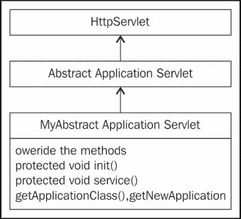

1.  实现如下：

`MyAbstractApplicationServlet`

```java
public class MyAbstractApplicationServlet extends AbstractApplicationServlet
{
  private WebApplicationContext appContext;
  private Class<? extends Application> applicationClass;

  @Override
  protected Application getNewApplication(HttpServletRequest httpServletRequest) throws ServletException {
      MainApplication mainApplication = (MainApplication)appContext.getBean("applicationBean");
      mainApplication.setWebApplicationContext(appContext);
      return  mainApplication;
    }

    @Override
    protected void service(HttpServletRequest request, HttpServletResponse response)throws ServletException, IOException {
      super.service(request, response); 
    }

    @Override
    public void init(ServletConfig servletConfig)throws ServletException {
      super.init(servletConfig);   
      appContext = WebApplicationContextUtils.getWebApplicationContext(servletConfig.getServletContext());
    }

    @Override
    protected Class<? extends Application>getApplicationClass() throws ClassNotFoundException {
    return MainApplication.class;
  }
}
```

1.  子类化并重写 `ApplicationClass` 方法。

`ApplicationClass` 是一个抽象类，实现了一些接口。我们已经重写了抽象类的 `init()` 方法。您需要创建 `HeaderHorizontalLayout` 类并将它们作为组件添加到窗口中。

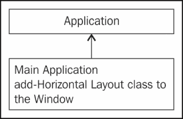

MainApplication

```java
@Component("applicationBean")
@Scope("prototype")

public class MainApplication extends Application {

  public WebApplicationContext webappContext;

  @Override
  public void init() {
    Window window;
    window = new Window("My Vaadin Application");
    window.addComponent(new HeaderHorizontalLayout(this));
    window.addComponent(new BodyHorizontalLayout(this));
    window.addComponent(new FooterHorizontalLayout(this));
    setMainWindow(window);
  }

  public void setWebApplicationContext(WebApplicationContext appContext){
  this.webappContext = webappContext;
  }

}
```

## 工作原理...

在此示例中，我们使用定制的 jsp 页面来处理对 Vaadin 应用程序的访问。当用户尝试访问 Vaadin 应用程序时，定制的 jsp 会显示给用户。用户输入用户名和密码，然后由 Spring 框架进行验证。验证成功后，Vaadin 页面将显示。

工作流程如下所示：

现在访问 URL：

`http://localhost:8086/Vaadin_Project3/`

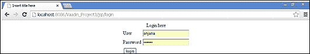

输入登录用户名和密码，您将被带到 Vaadin 页面。


## 另请参阅

+   *使用 Vaadin 表单的 Spring Security - 使用 Vaadin 表单*配方

# Spring Security 与 Vaadin - 使用 Vaadin 表单

到目前为止，我们已经使用了定制的 JSP 页面或 Spring 提供的登录弹出框或 JSP 文件。我们还演示了 Spring Security 与 Vaadin 6 和 Vaadin 7 的集成。因此，我很想提供一个完整的 Vaadin 与 Spring Security 实现。让我们创建一个 Vaadin 表单，并将其与 Spring Security 集成。

## 准备工作

+   在 Eclipse IDE 中创建一个 Vaadin 7 项目

+   创建一个扩展面板的`MyLoginView`类

+   创建一个扩展面板的`SecuredView`类

+   创建一个扩展`VaadinServlet`的`MyVaadinServlet`类

+   创建一个`VaadinRequestHolder`类

+   配置`web.xml`文件

+   编辑`applicationContext.xml`文件

+   为面板类实现`View`接口

## 如何做...

以下给出的步骤是为了创建一个 Vaadin 登录表单，并将其用于使用 Spring Security 对用户进行认证：

1.  `MyLoginView`将在应用程序启动时加载登录表单。

```java
public class MyLoginView extends Panel implements View {
  private Layout mainLayout;
  Navigator navigator;
  protected static final String CountView = "SecuredView";
  public MyLoginView() {
    final FormLayout loginlayout=new FormLayout();
    final TextField nameField=new TextField("name");
    final PasswordField passwordField=new PasswordField("password");
    loginlayout.addComponent(nameField);
    loginlayout.addComponent(passwordField);
    Button loginButton = new Button("Login");
    loginlayout.addComponent(loginButton);
    mainLayout = new VerticalLayout();
    mainLayout.addComponent(loginlayout);
    setContent(mainLayout);

    loginButton.addClickListener(new Button.ClickListener() {
      public void buttonClick(ClickEvent event) {
        try{
          ServletContext servletContext = VaadinRequestHolder.getRequest().getSession().getServletContext();
          UsernamePasswordAuthenticationToken token = new UsernamePasswordAuthenticationToken(nameField.getValue(),passwordField.getValue());
            token.setDetails( new WebAuthenticationDetails(VaadinRequestHolder.getRequest()));
            WebApplicationContext wac = WebApplicationContextUtils.getRequiredWebApplicationContext(servletContext);
            AuthenticationManager authManager = wac.getBean(AuthenticationManager.class);
            Authentication authentication = authManager.authenticate(token);
            SecurityContextHolder.getContext().setAuthentication(authentication);
            if(authentication.isAuthenticated()){
              Notification.show("You are authenticated");
            navigator = new Navigator(getUI().getCurrent(), mainLayout);
            navigator.addView(CountView, new SecuredView());
            navigator.navigateTo(CountView);
          }

    } catch (BadCredentialsException e) {

      Notification.show("Bad credentials");
    }
  }
});

}
@Override
public void enter(ViewChangeEvent event) {
}
```

我们使用了表单布局，并添加了用户名和密码字段。我们添加了一个按钮。点击按钮时，我们进行认证。

我们在`requestHolder.UserNamePasswords`中捕获`VaadinRequest`对象。认证令牌接收来自用户名和密码字段的输入。然后将令牌传递给`AuthenticationManger`以验证字段。如果认证成功，它将导航到受保护的页面。它还会向用户发出通知。

1.  在认证后使用`Secured View`并提供注销功能。

```java
public class SecuredView extends Panel implements View {
  public static final String NAME = "count";
  private Layout mainLayout;
  Navigator navigator;
  protected static final String MainView = "LoginView";
  public SecuredView() {
    mainLayout = new VerticalLayout();
    mainLayout.addComponent(new Label("You are seeing a secured page"));
    Button logoutButton = new Button("Logout");
    mainLayout.addComponent(logoutButton);
    setContent(mainLayout);
    logoutButton.addClickListener(new Button.ClickListener() {
    public void buttonClick(ClickEvent event) {
    try{
      ServletContext servletContext = VaadinRequestHolder.getRequest().getSession().getServletContext();
      WebApplicationContext wac = WebApplicationContextUtils.getRequiredWebApplicationContext(servletContext);
      LogoutHandler logoutHandler = wac.getBean(LogoutHandler.class);
      Authentication authentication = SecurityContextHolder.getContext().getAuthentication();
      logoutHandler.logout(VaadinRequestHolder.getRequest(), null, authentication);

 Notification.show("You are logged out");
 navigator = new Navigator(getUI().getCurrent(), mainLayout);
 navigator.addView(MainView, new MyLoginView());
 navigator.navigateTo(MainView);
    } catch (BadCredentialsException e) {

    Notification.show("Bad credentials");
    }
  }
});
}

public void enter(ViewChangeEvent event) {

}

}
```

受保护的视图有一个标签和一个注销按钮。注销按钮点击事件处理`springlogout`。注销时，用户将被重定向到登录页面。`LogoutHandler`类有一个`logout()`方法来处理认证。我使用了导航器类。您可以使用 UI 类`getUI.Current`创建导航器的实例，它会给出一个 UI 对象。

这种方法可以在您的面板类中使用。我还将布局对象传递给构造函数。

```java
navigator = new Navigator(getUI().getCurrent(),mainLayout);
navigator.addView(MainView, new MyLoginView());
navigator.navigateTo(MainView);
```

以下是两个类的图示表示：

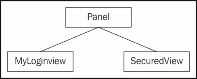

1.  扩展 Vaadin servlet 以捕获请求对象。

`MyVaadinServlet`

```java
public class MyVaadinServlet extends VaadinServlet {
  @Override
  protected void service(HttpServletRequest request,HttpServletResponse response) throws ServletException,IOException {
  SecurityContextHolder.setContext(SecurityContextHolder.createEmptyContext());
  VaadinRequestHolder.setRequest(request);
  super.service(request, response);
  VaadinRequestHolder.clean();
  SecurityContextHolder.clearContext();
  }
}
```

Vaadin servlet 在`web.xml`文件中进行配置。它接受 UI 类作为参数。在前面的代码中，我们扩展了 Vaadin servlet 并重写了`service()`方法，在其中我们将请求传递给`VaadinRequestHolder`类。通过这样做，我们将上下文对象传递给`SecurityContextHolder`以开始认证。

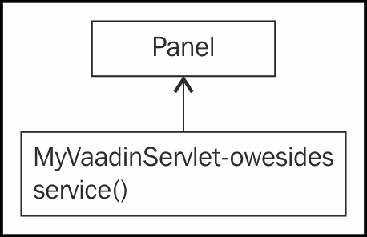

1.  在 UI 类中注册视图。

`Vaadin_project5UI`

```java
@SuppressWarnings("serial")
@Theme("vaadin_project5")
public class Vaadin_project5UI extends UI{
  private Layout mainLayout;
  Navigator navigator;
  protected static final String CountView = "main";
  @Override
  protected void init(VaadinRequest request) {
    getPage().setTitle("Navigation Example");
    // Create a navigator to control the views
    navigator = new Navigator(this, this);
    // Create and register the views
    navigator.addView("", new MyLoginView());
    navigator.addView(CountView, new SecuredView());
  }
}
```

在此代码中，我们注册了`LoginView`和`SecuredView`，默认登录视图将被调用。

1.  配置`web.xml`文件：

```java
<display-name>Vaadin_Project5</display-name>
<context-param>
  <description>
  Vaadin production mode</description>
  <param-name>productionMode</param-name>
  <param-value>false</param-value>
</context-param>
<servlet>
 <servlet-name>Vaadin_project5 Application</servlet-name>
 <servlet-class>com.example.vaadin_project5.MyVaadinServlet</servlet-class>
 <init-param>
 <description>
 Vaadin UI class to use</description>
 <param-name>UI</param-name>
 <param-value>com.example.vaadin_project5.Vaadin_project5UI</param-value>
 </init-param>
 <init-param>
 <description>
 Legacy mode to return the value of the propertyas a string from AbstractProperty.toString()</description>
 <param-name>legacyPropertyToString</param-name>
 <param-value>false</param-value>
 </init-param>
</servlet>
<servlet-mapping>
 <servlet-name>Vaadin_project5 Application</servlet-name>
 <url-pattern>/*</url-pattern>
</servlet-mapping>
<listener>
 <listener-class>org.springframework.web.context.ContextLoaderListener</listener-class>
</listener>
</web-app>
```

我们在`web.xml`中配置了`MyVaadinServlet`。

1.  编辑`application-Context.xml`文件。

```java
<global-method-security pre-post-annotations="enabled" />
<authentication-manager>
  <authentication-provider>
    <user-service>
    <user name="anjana" password="123456"authorities="ROLE_EDITOR" />
    </user-service>
  </authentication-provider>
</authentication-manager>
<beans:bean class="org.springframework.security.web.authentication.logout.SecurityContextLogoutHandler">
  <beans:property name="invalidateHttpSession"value="false" />
</beans:bean>
</beans:beans>
```

## 它是如何工作的...

在这个例子中，我们创建了一个 Vaadin 登录表单。如果开发人员不想使用外部 jsp，这是使用 Vaadin 框架类创建登录表单的另一个选项。这将使它成为一个纯 Vaadin 应用程序，其中包含一个 Spring Security 应用程序。在显示实际的产品目录页面之前，用户会通过 Spring Security 进行身份验证和授权。Vaadin 表单将用户的凭据提交给 Spring Security 框架，进行身份验证和授权。`MyVaadinServlet`类与 Spring Security 上下文通信，以在 Vaadin 应用程序中设置安全上下文。

Spring Security 与 Vaadin 的工作流程如下所示：

+   运行 Tomcat 服务器。

+   现在访问 URL：

`http://localhost:8086/Vaadin_Project5/`

以下截图显示了 Vaadin 登录表单：

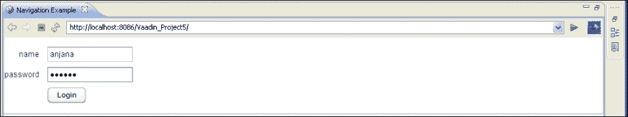

它还会显示有关错误凭据的消息：

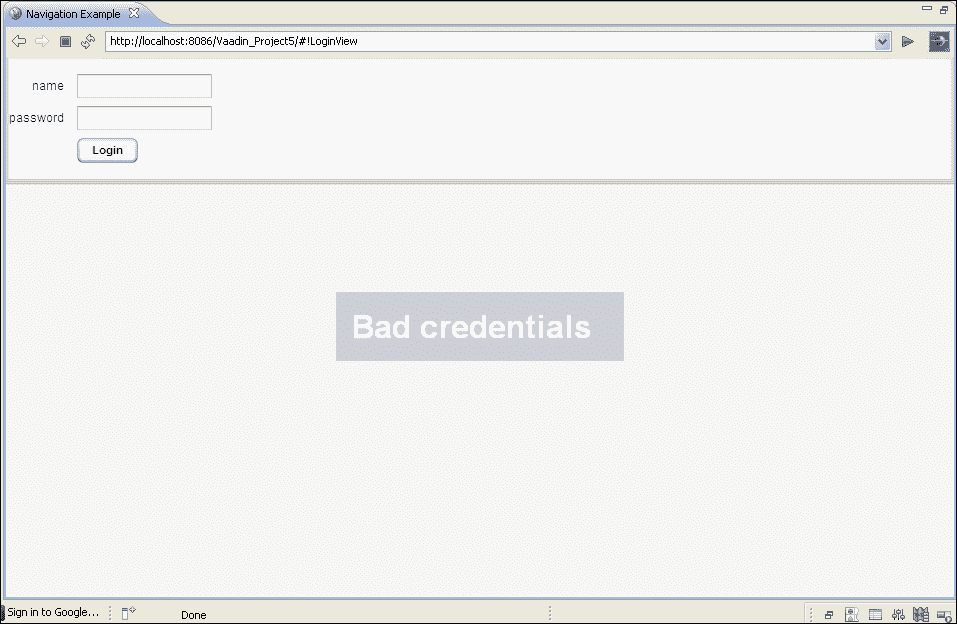

身份验证后，您将被导航到受保护的页面：

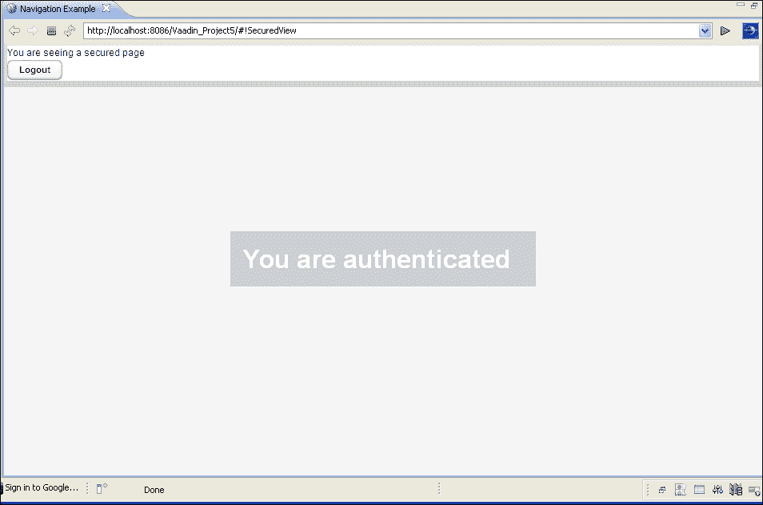

单击**注销**，您将被带回登录视图。以下截图显示了信息：

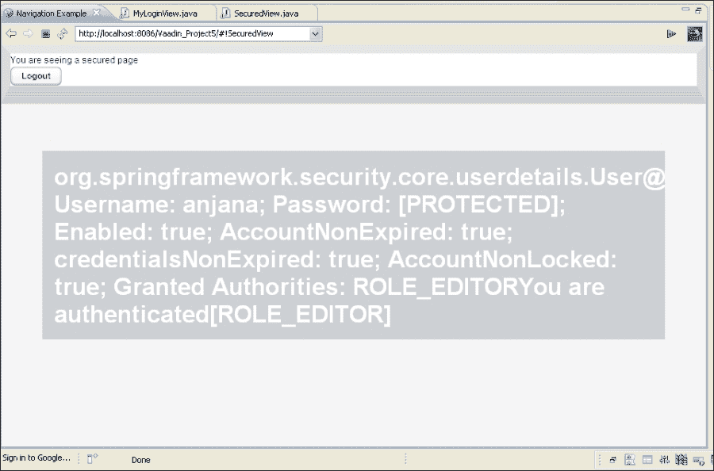
