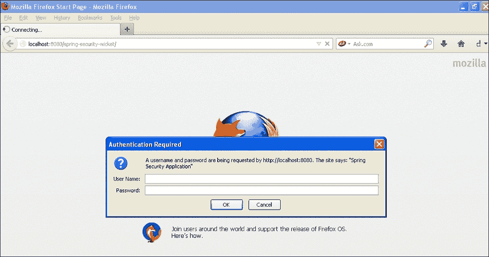
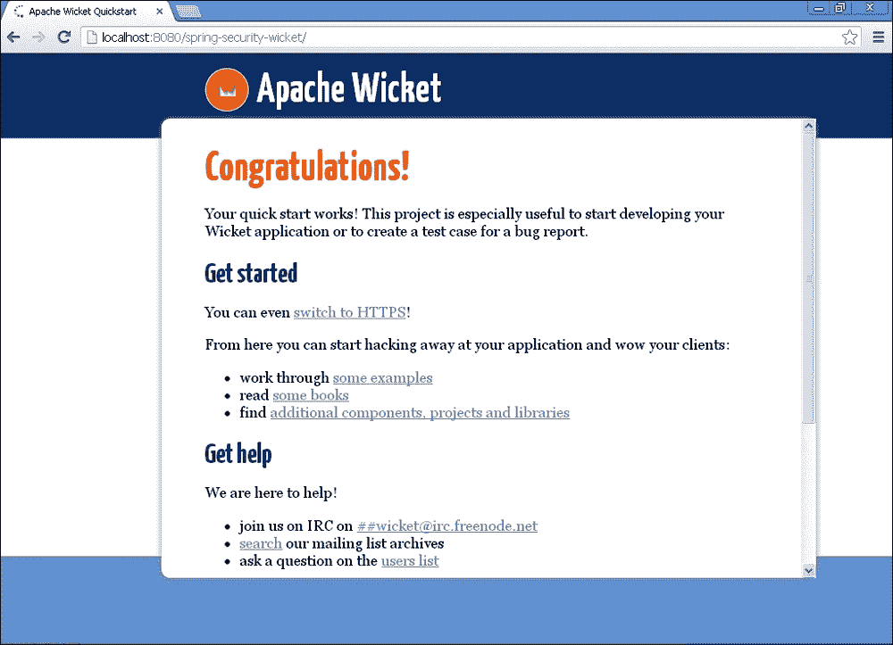
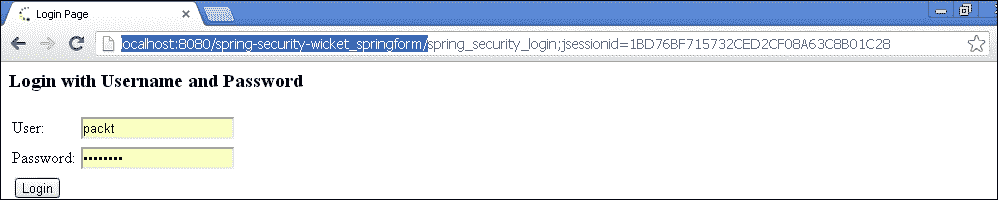
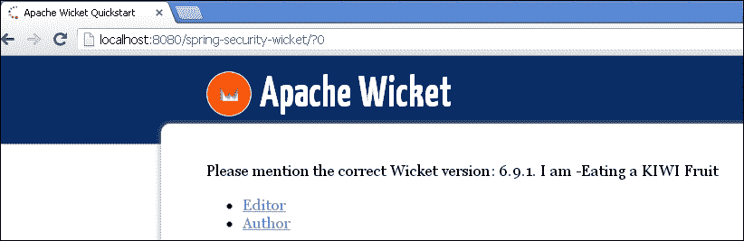
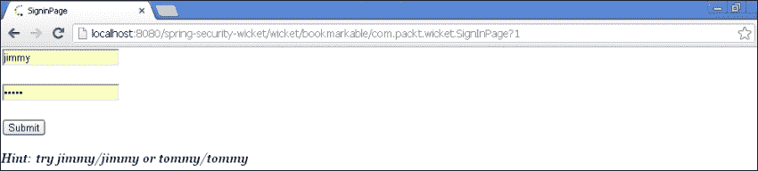
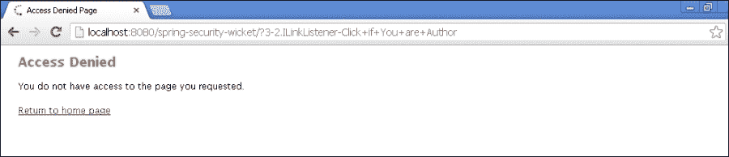
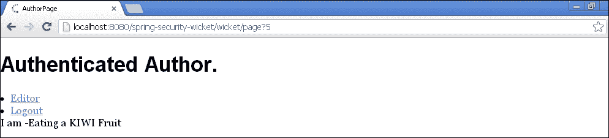
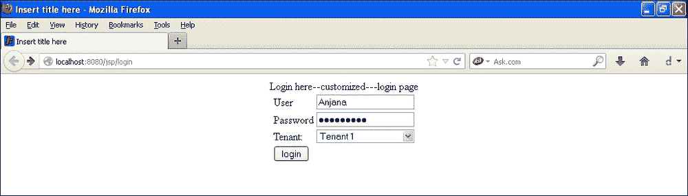
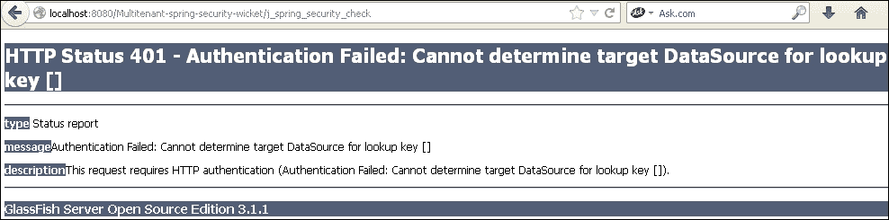
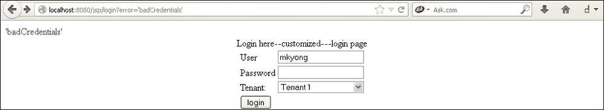

# 第七章：使用 Wicket 的 Spring Security

在本章中，我们将涵盖：

+   Spring Security 与 Wicket - 基本数据库身份验证

+   Spring Security 与 Wicket - Spring 基于表单的数据库身份验证

+   Spring Security 与 Wicket - 自定义 JSP 基于表单的数据库身份验证

+   使用 Wicket 授权的 Spring 身份验证

+   使用 Wicket 和 Spring Security 的多租户

# 介绍

在启动 Wicket 之前，我们正在检查可用版本。最新版本是 6.9。在 Apache Wicket 网站上明确指出，最新项目应该使用版本 6.9 作为基础。我们在下载了 NetBeans 7.1 后，发现 NetBeans Wicket 插件支持 Wicket 的 1.5 版本。

我们更喜欢使用最新的稳定版本；它将有许多错误修复和升级，并且将更容易开发。

Wicket 还使用*Wicket 过滤器*来分派请求和响应。就像 GWT 和 Vaadin 应用程序一样，它们有 servlet，期望一些参数，如 UI 类来初始化，我们需要提供一个扩展`Web Application`类的类名作为过滤器的参数。然后有一些类，它们扩展了`WebPage`类。创建一个与扩展`WebPage`类相同名称的 HTML 页面是一个很好的惯例和实践。

Wicket 使用多级继承方法。我们必须扩展`Wicket`类以实现各种场景。它还具有内置的身份验证和授权 API。

## 设置数据库

以下代码将设置数据库：

```java
CREATE TABLE `users1` (
  `USER_ID` INT(10) UNSIGNED NOT NULL,
  `USERNAME` VARCHAR(45) NOT NULL,
  `PASSWORD` VARCHAR(45) NOT NULL,
  `ENABLED` tinyint(1) NOT NULL,
  PRIMARY KEY (`USER_ID`)
) ENGINE=InnoDB DEFAULT CHARSET=utf8;
CREATE TABLE `user_roles` (
  `USER_ROLE_ID` INT(10) UNSIGNED NOT NULL,
  `USER_ID` INT(10) UNSIGNED NOT NULL,
  `AUTHORITY` VARCHAR(45) NOT NULL,
  PRIMARY KEY (`USER_ROLE_ID`),
  KEY `FK_user_roles` (`USER_ID`),
  CONSTRAINT `FK_user_roles` FOREIGN KEY (`USER_ID`) REFERENCES `users` (`USER_ID`)
) ENGINE=InnoDB DEFAULT CHARSET=utf8;
```

## 设置 Wicket 应用程序

以下语句是需要执行的 Maven 命令。您应该在您的机器上安装 Maven，并且应该有一个本地存储库。默认情况下，它在`.m2\repository`中。运行命令后，您应该获得构建成功的信号，这将让我们开始 Wicket 实现：

```java
mvn archetype:generate -DarchetypeGroupId=org.apache.wicket -DarchetypeArtifactId=wicket-archetype-quickstart -DarchetypeVersion=6.9.1 -DgroupId=com.packt -DartifactId=spring-security-wicket -DarchetypeRepository=https://repository.apache.org/ -DinteractiveMode=false

```

在命令提示符上可见以下输出：

```java
[INFO] Parameter: groupId, Value: com.packt
[INFO] Parameter: artifactId, Value: spring-security-wicket
[INFO] Parameter: version, Value: 1.0-SNAPSHOT
[INFO] Parameter: package, Value: com.packt
[INFO] Parameter: packageInPathFormat, Value: com/packt
[INFO] Parameter: version, Value: 1.0-SNAPSHOT
[INFO] Parameter: package, Value: com.packt
[INFO] Parameter: groupId, Value: com.packt
[INFO] Parameter: artifactId, Value: spring-security-wicket
[INFO] project created from Archetype in dir: E:\spring-security-wicket
[INFO] ------------------------------------------------------------------------
[INFO] BUILD SUCCESS
[INFO] ------------------------------------------------------------------------
[INFO] Total time: 1:22.610s
[INFO] Finished at: Mon Jul 15 21:17:24 IST 2013
[INFO] Final Memory: 7M/13M
[INFO] ------------------------------------------------------------------------

```

以下命令将完成 Wicket 的完整设置。它们还将下载 Wicket 框架源文件到存储库中。

```java
Spring-security-wicket>mvn clean compile install
Spring-security-wicket>mvn tomcat:run
Spring-security-wicket>mvn eclipse: eclipse

```

访问以下 URL：

`http://localhost:8080/spring-security-wicket/`

该 URL 将显示 Wicket 应用程序的欢迎页面。Wicket 应用程序设置已准备就绪。

Wicket 还配备了自己的身份验证和授权 API。让我们看看如何使用它。

# Spring Security 与 Wicket - 基本数据库身份验证

我们的目标是在 Wicket 应用程序上进行简单的基本身份验证。当我们访问 Wicket 应用程序的 URL 时，我希望出现登录对话框。成功后，它应该重定向到主页。我们需要向`pom.xml`文件添加 Spring Security 依赖项并重新构建 Wicket 应用程序。下一步将是在`web.xml`文件中配置 spring 监听器。我们还需要添加`applicationContext.xml`文件。

## 准备工作

+   使用 Spring 依赖项更新`pom.xml`文件。

+   创建一个`applicationContext.xml`文件。必须将其命名为`applicationContext`，否则我们将在控制台中收到错误消息。

+   使用 Spring 监听器编辑`web.xml`。

+   创建一个`database-details.xml`文件并添加数据库详细信息。

+   将`db-details.xml`文件添加为`context-param`到 spring 监听器。

## 如何做...

以下是使用 Wicket 实现 Spring Security 以演示基本身份验证的步骤，其中凭据存储在数据库中：

1.  向`POM.xml`文件添加依赖项：

```java
<!-- Spring dependecncies -->
  <dependency>
    <groupId>org.springframework</groupId>
    <artifactId>spring-core</artifactId>
    <version>${spring.version}</version>
  </dependency>

  <dependency>
    <groupId>org.springframework</groupId>
    <artifactId>spring-web</artifactId>
    <version>${spring.version}</version>
  </dependency>

  <dependency>
    <groupId>org.springframework</groupId>
    <artifactId>spring-webmvc</artifactId>
    <version>${spring.version}</version>
  </dependency>

  <!-- Spring Security -->
  <dependency>
    <groupId>org.springframework.security</groupId>
    <artifactId>spring-security-core</artifactId>
    <version>${spring.version}</version>
  </dependency>

  <dependency>
    <groupId>org.springframework.security</groupId>
    <artifactId>spring-security-web</artifactId>
    <version>${spring.version}</version>
  </dependency>

  <dependency>
    <groupId>org.springframework.security</groupId>
    <artifactId>spring-security-config</artifactId>
    <version>${spring.version}</version>
  </dependency>
  <!-- WICKET DEPENDENCIES -->
  <dependency>
    <groupId>org.apache.wicket</groupId>
    <artifactId>wicket-core</artifactId>
    <version>${wicket.version}</version>
  </dependency>
  <!-- WICKET Authentication-DEPENDENCIES -->
  <dependency>
    <groupId>org.apache.wicket</groupId>
    <artifactId>wicket-auth-roles</artifactId>
    <version>6.9.1</version>
  </dependency>
```

1.  使用 Spring 监听器和 Spring 过滤器更新`Web.xml`文件与 Wicket 过滤器：

```java
<filter>
  <filter-name>springSecurityFilterChain</filter-name>
  <filter-class>
    org.springframework.web.filter.DelegatingFilterProxy
    </filter-class>
</filter>

<filter-mapping>
  <filter-name>springSecurityFilterChain</filter-name>
  <url-pattern>/*</url-pattern>
</filter-mapping>

<listener>
  <listener-class>
    org.springframework.web.context.ContextLoaderListener
    </listener-class>
</listener>

<filter>
  <filter-name>wicket.spring-security-wicket</filter-name>
<filter-class>
  org.apache.wicket.protocol.http.WicketFilter</filter-class>
  <init-param>
    <param-name>applicationClassName</param-name>
    <param-value>com.packt.WicketApplication</param-value>
  </init-param>
</filter>

<filter-mapping>
  <filter-name>wicket.spring-security-wicket</filter-name>
  <url-pattern>/*</url-pattern>
</filter-mapping>
```

1.  编辑`applicationContext.xml`文件：

```java
<global-method-security pre-post-annotations="enabled" />

<http auto-config="true">
  <intercept-url pattern="/spring-security-wicket/**" 
    access="ROLE_SELLER"/> 
  <intercept-url pattern="/spring-security-wicket/*.*" 
    access="ROLE_SELLER"/> 
  <intercept-url pattern="/**"access="ROLE_SELLER" />
  <http-basic />
</http>

<authentication-manager>
  <authentication-provider>
    <jdbc-user-service data-source-ref="MySqlDS" 
      users-by-username-query=" 
      select username,password, enabled   
      from users1 where username=?"  
      authorities-by-username-query=" 
      select u.username, ur.role from users1 u,user_roles ur  
    where u.user_id = ur.user_id and u.username =?  " />
  </authentication-provider>
</authentication-manager>
```

这是一个简单的基本身份验证配置。通过此配置，我们期望在显示 Wicket 应用程序之前出现登录对话框。我创建了一个新角色，卖家。

## 它是如何工作的...

现在访问以下 URL：

`http://localhost:8080/spring-security-wicket/`

这是将 Spring Security 与 Wicket 集成的初始设置示例。我们已经演示了基本的身份验证机制。通过登录表单，Spring Security 中断对 Wicket 应用程序的访问。成功认证后，用户将获得对 Wicket 应用程序的访问权限。

显示的页面如下截图所示：



## 另请参阅

+   使用 Wicket 的 Spring Security-Spring 基于表单的身份验证

+   使用 Wicket 的 Spring Security-定制的 JSP 基于表单的身份验证

+   使用 Wicket 授权的 Spring 身份验证

+   使用 Wicket 和 Spring Security 的多租户

# 使用 Wicket 的 Spring Security-Spring 基于表单的数据库身份验证

在我们之前的示例中，我们发现 Wicket 6.9 与 Spring Security 非常兼容，并且很容易集成。我们所做的就是添加 spring 依赖项并配置`applicationContext.xml`文件。

在本节中，我们将使用 Spring 表单进行身份验证。我们期望 Spring 表单出现在对话框的位置，并为我们进行身份验证。

## 准备工作

+   创建一个 Maven Wicket 项目：`spring-security-wicket_springform`。

+   使用 Spring 依赖项更新`pom.xml`文件。

+   创建一个`applicationContext.xml`文件。必须将其命名为`applicationContext`，否则我们将在控制台中收到错误消息。

+   编辑`web.xml`，使用 Spring 监听器。

+   创建一个数据库`details.xml`文件，并添加数据库详细信息。

+   将文件添加为 Spring 监听器的上下文参数。

## 如何做...

使用以下代码编辑`applicationContext.xml`文件：

```java
<global-method-security pre-post-annotations="enabled" />

<http auto-config="true">
  <intercept-url pattern="/spring-security-wicket/**" 
    access="ROLE_SELLER"/> 
  <intercept-url pattern="/spring-security-wicket/*.*" 
    access="ROLE_SELLER"/> 
  <intercept-url pattern="/**" access="ROLE_SELLER" />
</http>

<authentication-manager> 
  <authentication-provider> 
    <jdbc-user-service data-source-ref="MySqlDS" 
    users-by-username-query=" 
    select username,password, enabled   
    from users1 where username=?"  

    authorities-by-username-query=" 
    select u.username, ur.role from users1 u, user_roles ur  
    where u.user_id = ur.user_id and u.username =?  " /> 
  </authentication-provider>
</authentication-manager>
```

这是一个简单的表单身份验证配置。使用此配置，我们期望在显示 Wicket 应用程序之前有一个**登录页面**。唯一的变化是我们已经删除了先前应用程序的`<http-basic>`标签。还要注意 URL，它将具有会话 ID。

## 它是如何工作的...

现在访问以下 URL：

`http://localhost:8080/spring-security-wicket_springform/`

在这个示例中，我们展示了如何在 Wicket 应用程序中调用 Spring 的内部登录表单。当我们访问 Wicket 应用程序时，我们将被重定向到 Spring 自己的登录页面。用户输入他们的用户名和密码，这将由 Spring 的身份验证提供者进行验证和授权。成功后，用户将获得对 Wicket 应用程序的访问权限。

当您访问上述 URL 时，您应该看到以下屏幕：



## 另请参阅

+   使用 Wicket 的 Spring Security-定制的 JSP 基于表单的身份验证

+   使用 Wicket 授权的 Spring 身份验证

+   使用 Wicket 和 Spring Security 进行多租户

# 使用 Wicket 的 Spring Security-定制的 JSP 基于表单的数据库身份验证

前两个示例是为了测试 Wicket 与 Spring Security 的兼容性。它还演示了将 Spring 与 Wicket 集成的简单性。我们从我们的两个 Wicket 示例中学到，我们可以很容易地使用基于 Spring 和基于表单的身份验证与数据库，并且同样可以扩展到 LDAP。

在这个示例中，我们将添加一个定制的 JSP 表单。我们期望 Wicket 应用程序调用我们的 JSP 表单进行登录。如果开发人员不想创建一个 Wicket 表单，他们可以使用这种方法。这种方法也适用于 GWT 和 Vaadin。

您还需要为登录页面提供匿名访问权限。

## 准备工作

+   创建一个 Maven Wicket 项目：`spring-security-wicket_customized_jsp`。

+   使用 Spring 依赖项更新`pom.xml`文件。

+   创建一个`applicationContext.xml`文件。必须将其命名为`applicationContext`，否则我们将在控制台中收到错误消息。

+   编辑`web.xml`，使用 Spring 监听器。

+   还要将`login.js`p 配置添加为`web.xml`中的 servlet。

+   创建一个数据库，`details.xml`文件，并添加数据库详细信息。

+   将文件添加为 Spring 监听器的上下文参数。

+   此外，您需要添加一个`login.jsp`；您可以使用上一章中使用的`login.jsp`文件。

## 操作步骤...

以下步骤是为了将 Spring Security 与 Wicket 框架集成，以演示使用自定义 JSP 的基于表单的身份验证：

1.  编辑`applicationContext.xml`文件：

```java
<global-method-security pre-post-annotations="enabled" />

<http auto-config='true'>
  <intercept-url pattern="/jsp/login*" 
    access="IS_AUTHENTICATED_ANONYMOUSLY" />
  <intercept-url pattern="/jsp/login_error*" 
    access="IS_AUTHENTICATED_ANONYMOUSLY" />
  <intercept-url pattern="/**" access="ROLE_SELLER" />
  <form-login login-page='/jsp/login' 
    authentication-failure-url="/jsp/login_error" />
</http> 
<authentication-manager> 
  <authentication-provider> 
    <jdbc-user-service data-source-ref="MySqlDS" 
    users-by-username-query=" 
    select username,password, enabled   
    from users1 where username=?"  

    authorities-by-username-query=" 
    select u.username, ur.role from users1 u, user_roles ur  
    where u.user_id = ur.user_id and u.username =?  " /> 
  </authentication-provider>
</authentication-manager>
```

`login.jsp`已在`applicationContext.xml`文件中配置为匿名用户。

1.  编辑`web.xml`文件：

```java
<servlet>
  <servlet-name>login</servlet-name>
  <jsp-file>/jsp/login.jsp</jsp-file>
</servlet>

<servlet>
  <servlet-name>login_error</servlet-name>
  <jsp-file>/jsp/login_error.jsp</jsp-file>
</servlet>

<servlet-mapping>
  <servlet-name>login</servlet-name>
  <url-pattern>/jsp/login</url-pattern>
</servlet-mapping>

<servlet-mapping>
  <servlet-name>login_error</servlet-name>
  <url-pattern>/jsp/login_error</url-pattern>
</servlet-mapping>
```

`login.jsp`已配置为一个 servlet。

## 工作原理...

现在访问以下 URL：

`http://localhost:8080/spring-security-wicket_springform/`

在这个示例中，我们将 Wicket 应用与我们自己的`login.jsp`文件集成，以进行身份验证和授权。当用户尝试访问 Wicket 应用时，Spring Security 会阻止用户访问提供在`applicationContext.xml`中创建和配置的 jsp 页面的应用。提交后，将触发 Spring Security 身份验证操作，进行身份验证和授权。成功后，用户将获得访问 Wicket 应用的权限。

访问此 URL 时，您应该看到以下屏幕截图：


## 另请参阅

+   *使用 Wicket 授权的 Spring 身份验证*示例

+   *使用 Wicket 和 Spring Security 进行多租户*示例

# 使用 Wicket 授权的 Spring 身份验证

到目前为止，我们已经看到了在 Wicket 应用之外使用 Spring Security 的各种选项。现在我们将看到如何在 wicket 框架中创建安全表单，并在 Spring 框架中使用它来实现两种不同的角色。该示例还演示了如何在 Wicket 应用中使用 Spring bean。

## 准备工作完成。

+   创建一个 Maven Wicket 项目：`spring-security-wicket`。

+   使用 Spring 依赖项更新`pom.xml`文件。

+   创建`applicationContext.xml`文件。必须将其命名为`applicationContext`，否则将在控制台中收到错误消息。

+   添加一个`spring-wicket-security`依赖项。

+   使用 Spring 监听器编辑`web.xml`。

+   分别创建`EditorPage.html`和`AuthorPage.html`以及相应的`EditorPage.java`和`AuthorPage.java`。作者页面和编辑页面是相似的页面，但根据角色调用。

+   创建`HomePage.java`和`HomePage.html`。

+   创建`SignInPage.html`和`SignInPage.java`。

+   子类化`AuthenticatedWebSession`类，并覆盖超类中的方法。默认情况下，它使用 Wicket 身份验证，因此覆盖它以使用 Spring 身份验证。

## 操作步骤...

1.  下一步是使用 Spring 安全进行身份验证和使用 spring Wicket 进行授权，编辑`application-Context.xml`。

```java
<!-- Enable annotation scanning -->
<context:component-scan base-package="com.packt.wicket" />

</beans>
```

1.  编辑`spring-wicket-security.xml`文件：

```java
<security:authentication-manager alias="springauthenticationManager">
  <security:authentication-provider>
<!--  TODO change this to reference a real production environment user service -->
    <security:user-service>
      <security:user name="jimmy" password="jimmy" authorities="ROLE_EDITOR, ROLE_AUTHOR"/>
      <security:user name="tommy" password="tommy" authorities="ROLE_EDITOR"/>
    </security:user-service>
  </security:authentication-provider>
</security:authentication-manager>

<security:global-method-security secured-annotations="enabled" />
```

1.  编辑`AuthorPage.java`文件：

```java
@AuthorizeInstantiation("ROLE_AUTHOR")
public class AuthorPage extends WebPage {

  @SpringBean
  private SomeInterfaceImpl someInterfaceImpl;

  public AuthorPage(final PageParameters parameters) {
    super(parameters);
    add(new Label("msg", someInterfaceImpl.method1()));
    add(new Link("Editor"){
      @Override
      public void onClick() {
        Page next = new EditorPage();
        setResponsePage(next);
      }
    });
    add(new Link("Logout"){
      @Override
      public void onClick() {
        getSession().invalidate();
        Page next = new HomePage(parameters);
        setResponsePage(next);
      }
    });
  }
}
```

1.  编辑`SigInPage.java`文件：

```java
public final class SignInPage extends WebPage
{
  /**
  * Constructor
  */
  public SignInPage()
  {
    final SignInForm form = new SignInForm("signinForm");
    add(form);
  }

  /**
  * Sign in form
  */
  public final class SignInForm extends Form<Void>
  {
    private String username;
    private String password;

    public SignInForm(final String id)
    {
      super(id);
      setModel(new CompoundPropertyModel(this));
      add(new RequiredTextField("username"));
      add(new PasswordTextField("password"));
      add(new FeedbackPanel("feedback"));
    }

    @Override
    public final void onSubmit()
    {
      MyWebSession session = getMySession();
      if (session.signIn(username,password))
      {

        setResponsePage(getApplication().getHomePage());

      }
      else
      {
        String errmsg = getString("loginError", null,
           "Unable to sign you in");

      }
    }
    private MyWebSession getMySession()
    {
      return (MyWebSession)getSession();
    }
  }
}
```

1.  编辑`HomePage.java`文件：

```java
public class HomePage extends WebPage {
  private static final long serialVersionUID = 1L;
  @SpringBean
  private SomeInterfaceImpl someInterfaceImpl;
  public HomePage(final PageParameters parameters) {
    super(parameters);
    add(new Label("version", getApplication()
      .getFrameworkSettings().getVersion()));
    add(new Label("msg", someInterfaceImpl.method1()));
    add(new Link("click if you are Editor"){
      @Override
      public void onClick() {
        Page next = new EditorPage();
        setResponsePage(next);
      }
    });

    add(new Link("Click if You are Author"){
      @Override
      public void onClick() {
        Page next = new AuthorPage(parameters);
        setResponsePage(next);
      }
    });

  }

}
```

1.  编辑`MyWebSession.java`文件：

```java
public class HomePage extends WebPage {
  private static final long serialVersionUID = 1L;
  @SpringBean
  private SomeInterfaceImpl someInterfaceImpl;
  public HomePage(final PageParameters parameters) {
    super(parameters);
    add(new Label("version", getApplication()
      .getFrameworkSettings().getVersion()));
    add(new Label("msg", someInterfaceImpl.method1()));
    add(new Link("click if you are Editor"){
      @Override
      public void onClick() {
        Page next = new EditorPage();
        setResponsePage(next);
      }
    });

    add(new Link("Click if You are Author"){
      @Override
      public void onClick() {
        Page next = new AuthorPage(parameters);
        setResponsePage(next);
      }
    });

  }

}
```

## 工作原理...

实现非常简单；我们需要做的就是拥有一个 Wicket 登录表单。单击**提交**后，我们需要获得经过身份验证的会话，这种方法将为我们提供一个选项，将 Spring 安全集成到我们使用 Wicket 应用创建的登录表单中。成功后，Spring 将验证用户凭据，并与 Wicket 框架通信以显示相应的授权页面。

Wicket 应用与 Spring 安全集成的工作流程如下所述。

当用户单击 URL：`http://localhost:8080/spring-security-wicket/`时，允许用户访问主页。主页显示两个链接，表示两个不同的角色和用户。成功验证后，用户将被授权使用基于角色的相应页面。这些页面显示在以下屏幕截图中：



应用启动时的主页



登录页面



作者页面



## 另请参阅

+   使用 Wicket 和 Spring Security 实现多租户

# 使用 Wicket 和 Spring Security 实现多租户

多租户已成为云中的流行词。在多租户设置中，每个租户将有一个单独的数据源。我们需要为数据源创建两个不同的数据源和查找。让我们使用一个简单的 Wicket 应用程序和一个自定义的 JSP，其中将有一个租户下拉菜单。用户从下拉菜单中选择一个租户，将设置与租户对应的数据源。

我正在使用 NetBeans IDE，它可以轻松识别 Maven 项目。NetBeans 还带有 glassfish 应用服务器和 derby 数据库。

## 准备工作

+   更新`login.jsp`文件

+   使用 derby 数据库依赖更新`pom.xml`文件

+   编辑`applicationContext.xml`

+   编辑`spring-security.xml`

+   编辑`web.xml`文件

+   创建一个过滤器来捕获租户 ID

+   还在 derby 中创建两个数据库

+   在两个数据库中创建两个表`USERS`和`USER_ROLES`

+   在`USERS`（`USER_ID`，`USERNAME`和`PASSWORD`）中添加列

+   在`USER_ROLES`（`USER_ID`，`USER_ROLE_ID`和`AUTHORITY`）中添加列

## 如何做...

以下步骤用于在 Wicket 应用程序中使用 Spring Security API 实现多租户：

1.  在`application-Context.xml`文件中编辑两个数据源：

```java
<!-- Enable annotation scanning -->
<context:component-scan base-package="com.packt.wicket" />

  <bean id="derbydataSource" class="com.packt.wicket.TenantRoutingDataSource ">
    <property name="targetDataSources">
      <map>
        <entry key="Tenant1" value-ref="tenant1DataSource"/>
        <entry key="Tenant2" value-ref="tenant2DataSource"/>
      </map>
    </property>
  </bean>
 <bean id="tenant1DataSource" class="org.springframework.jdbc.datasource.DriverManagerDataSource">
 <property name="driverClassName" value="org.apache.derby.jdbc.EmbeddedDriver" />
 <property name="url" value="jdbc:derby://localhost:1527/client1" />
 <property name="username" value="client1" />
 <property name="password" value="client1" />

 </bean>
<bean id="tenant2DataSource" class="org.springframework.jdbc.datasource.DriverManagerDataSource">
 <property name="driverClassName" value="org.apache.derby.jdbc.EmbeddedDriver" />
 <property name="url" value="jdbc:derby://localhost:1527/client2" />
 <property name="username" value="client2" />
 <property name="password" value="client2" />

</bean>

```

1.  编辑`spring-wicket-security.xml`文件，并添加`ExceptionMappingAuthenticationFailureHandler` bean 来捕获 SQL 异常：

```java
<bean id="authenticationFailureHandler"
  class="org.springframework.security.web.authentication.ExceptionMappingAuthenticationFailureHandler">
  <property name="exceptionMappings">
    <props>
      <prop key="org.springframework.security.authentication.BadCredentialsException">/jsp/login?error='badCredentials'</prop>
      <prop key="org.springframework.security.authentication.CredentialsExpiredException">/jsp/login?error='credentialsExpired'</prop>
      <prop key="org.springframework.security.authentication.LockedException">/jsp/login?error='accountLocked'</prop>
      <prop key="org.springframework.security.authentication.DisabledException">/jsp/login?error='accountDisabled'</prop>
      </props>
    </property>
  </bean>
  <security:http auto-config='true'>
    <security:intercept-url pattern="/jsp/login*" access="IS_AUTHENTICATED_ANONYMOUSLY" />
    <security:intercept-url pattern="/jsp/login_error*"access="IS_AUTHENTICATED_ANONYMOUSLY" />
    <security:intercept-url pattern="/**" access="ROLE_SELLER" />
    <security:form-login login-page='/jsp/login' authentication-failure-handler-ref="authenticationFailureHandler" />
  </security:http>
  <security:authentication-manager>
    <security:authentication-provider>
      <security:jdbc-user-service data-source-ref="derbydataSource"
          users-by-username-query=" select username,password,'true'as enabled from users where username=?"  

          authorities-by-username-query=" 
          select u.username as username, ur.authority as authority from users u, user_roles ur  
          where u.user_id = ur.user_id and u.username =?"
      /> 
    </security:authentication-provider>  
  </security:authentication-manager>

<security:global-method-security secured-annotations="enabled" />
```

1.  编辑`login.jsp`文件：

```java
Login here--customized---login page
<form action="/ /Multitenant-spring-security-
  wicket//j_spring_security_check" method="post">
  <table>
    <tr>
      <td>
        User
      </td>
      <td>
        <input name="j_username">
      </td>
    </tr>
    <tr>
      <td>
        Password
      </td>
      <td>
        <input type="password" name="j_password"/>
      </td>
    </tr>

    <tr><td><label>Tenant:&nbsp;</label></td><td> 
      <select style="width:146px" id="tenant" name="tenant">
      <option value="">Choose Tenant</option>
      <option value="Tenant1">Tenant 1</option>
      <option value="Tenant2">Tenant 2</option></select></td>
    </tr>
    <tr>
      <td>
        <input type="submit" value="login">
      </td>
    </tr>
  </table>
</form>
</div>
```

1.  编辑`TenantRoutingDataSource.java`文件以将租户路由到不同的数据源。该类是 spring 的`AbstractRoutingDataSource`的子类。它用于设置数据源。

URL：[`docs.spring.io/spring/docs/3.1.x/javadoc-api/org/springframework/jdbc/datasource/lookup/AbstractRoutingDataSource.html`](http://docs.spring.io/spring/docs/3.1.x/javadoc-api/org/springframework/jdbc/datasource/lookup/AbstractRoutingDataSource.html)。

```java
public class TenantRoutingDataSource extends AbstractRoutingDataSource {
  protected final Log logger = LogFactory.getLog(this.getClass());

  protected Object determineCurrentLookupKey() {

    String lookupKey = (String)ThreadLocalContextUtil.getTenantId();
    System.out.println(lookupKey+"------lookupKey");

    return lookupKey;
  }
}
```

1.  编辑`MultitenantFilter`以捕获租户类型并设置数据源：

```java
public void doFilter(ServletRequest request,
   ServletResponse response,FilterChain chain)
   throws IOException, ServletException {
  if (null == filterConfig) {
    return;
  }
  HttpServletRequest httpRequest = (HttpServletRequest)
     request;

  ThreadLocalContextUtil.clearTenant();
  if (httpRequest.getRequestURI()
    .endsWith(SPRING_SECURITY_LOGOUT_MAPPING)) {
    httpRequest.getSession()
      .removeAttribute(TENANT_HTTP_KEY);
  }

  String tenantID = null;
  if (httpRequest.getRequestURI()
    .endsWith(SPRING_SECURITY_CHECK_MAPPING)) {
    tenantID = request.getParameter(TENANT_HTTP_KEY);
    httpRequest.getSession().setAttribute
      (TENANT_HTTP_KEY, tenantID);
  } else {
    tenantID = (String) httpRequest.getSession()
      .getAttribute(TENANT_HTTP_KEY);
  }

  if (null != tenantID) {
    ThreadLocalContextUtil.setTenantId(tenantID);
    if (logger.isInfoEnabled()) logger.info
      ("Tenant context set with Tenant ID: " + tenantID);
    }

  chain.doFilter(request, response);
}
```

## 工作原理...

当用户尝试访问应用程序时，他们将被重定向到登录表单，在该表单中用户输入他们的用户名和密码并选择租户。这也可以是根据业务需求的公司名称或位置。根据所选的租户，Spring 设置认证提供程序。`MultitenantFilter`与`TenantRoutingDataSource`类在`threadLocalUtil`中设置租户信息。用户使用租户数据源进行身份验证，并进入主页。

应用程序启动时的登录页面将如下截图所示：



登录页面



如果租户不存在，则出现异常



显示选择的错误凭证异常
