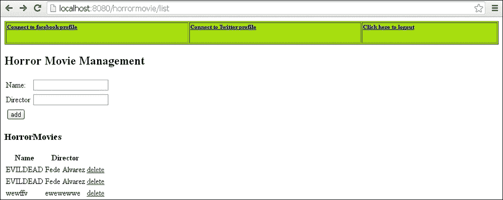
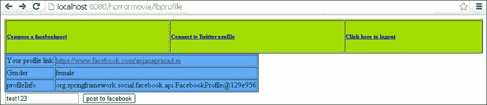
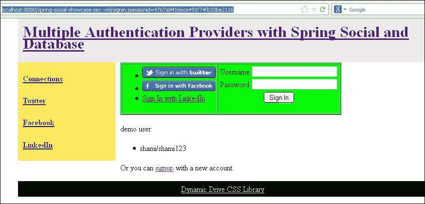
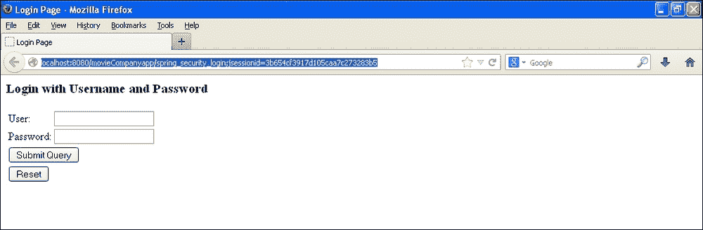
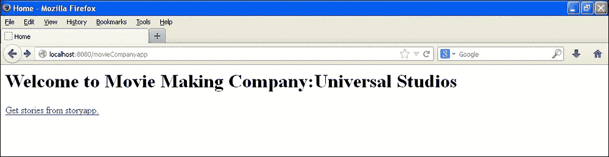
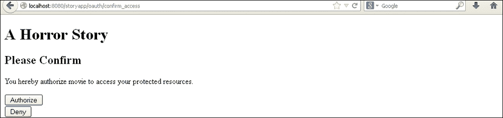
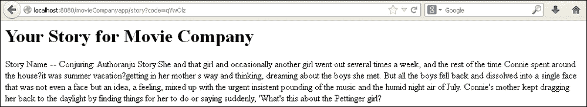

# 第九章：Spring Security 与 Spring Social

在本章中，我们将涵盖：

+   Spring Security 与 Spring Social 访问 Facebook

+   Spring Security 与 Spring Social 访问 Twitter

+   Spring Security 与多个身份验证提供程序

+   OAuth 的 Spring Security

# 介绍

Spring Social 是一个著名的 API。大多数 Web 应用程序希望为用户提供从其应用程序到社交网络站点（如 Facebook 和 Twitter）的发布选项。Spring Social 是为满足此要求而构建的。

在本章中，我们将集成 Spring Security 与 Spring Social 以连接到 Facebook 和 Twitter 帐户。

# Spring Security 与 Spring Social 访问 Facebook

Spring Social 在身份验证方面使用`spring-security` API。我们需要在`pom.xml`中添加 spring-social 依赖项，以及`spring-core`和`spring-security`包。在本节中，我们将演示 Spring Social 如何将我们的 Java 应用程序与 Facebook 连接起来。我们可以在我们的 Java 应用程序中登录到 Facebook 应用程序。

一旦与社交网络站点建立连接，用户就可以在其中发布和检索消息。

我们使用了相同的 hibernate 恐怖电影应用程序。我使用了 derby 数据库，并在 glassfish 服务器上部署了应用程序。Spring Social 内部使用 Spring 的`jdbctemplate`类来检索数据库信息。

## 准备工作

要使用 Spring Security 与 Spring Social 访问 Facebook，您需要执行以下任务：

+   注册为 Facebook 开发人员并创建应用程序。您将获得可用于集成的 appID 和秘钥

+   将请求映射添加到控制器以处理 Facebook 创建的`jsp`页面以将消息发布到 Facebook

+   创建`UserConnection`表

+   将 Jackson 依赖项添加到您的`pom.xml`文件中。演示项目将随本书提供下载

+   添加 Spring Social 依赖项，如：

+   `Spring-social-core`

+   `Spring-social-web`

+   `Spring-social-facebook`

+   `Spring-social-twitter`

+   `Spring-social-linkedin`

+   `Spring-social-github`

+   为用户登录和注销创建`.jsp`页面

+   在`spring.properties`文件中提供数据库连接属性

+   在`jdbc.properties`文件中提供 Facebook 的应用程序秘钥和 appID

## 如何做...

以下是实现允许用户使用 Spring Social 和 Spring Security 登录到 Facebook 应用程序的应用程序的步骤：

1.  创建名为`MyController`的控制器来处理 Facebook 页面。

```java
  @RequestMapping(value = "/fbprofile", method = RequestMethod.GET)
  public String getfbProfile(ModelMap model,HttpServletRequest request, 
      HttpServletResponse response) {
    model.addAttribute("request.userPrincipal.name", request.getUserPrincipal().getName());
    Facebook facebook = connectionRepository.getPrimaryConnection(Facebook.class).getApi();
    model.addAttribute("profileLink", facebook.userOperations().getUserProfile().getLink());
    model.addAttribute("Gender", facebook.userOperations().getUserProfile().getGender());
    model.addAttribute("profileInfo", facebook.userOperations().getUserProfile());
    model.addAttribute("userpermissions", facebook.userOperations().getUserPermissions());
    List<Reference> friends = facebook.friendOperations().getFriends();
    model.addAttribute("friends", friends);
    model.addAttribute("friendlist", facebook.friendOperations().getFriendLists());
    return "facebookprofile";
  }
```

1.  在`Spring-social.xml`文件中提供连接工厂：

```java
  <bean id="connectionFactoryLocator" class="org.springframework.social.connect.support.ConnectionFactoryRegistry">
    <property name="connectionFactories">
      <list>
        <bean class="org.springframework.social.facebook.connect.FacebookConnectionFactory">
          <constructor-arg value="${facebook.clientId}" />
          <constructor-arg value="${facebook.clientSecret}" />
        </bean>
      </list>
    </property>
  </bean>
```

`ConnectionFactory`定位器创建了 Facebook bean。在这里，您可以添加其他社交网络提供商，如 Digg 和 Flickr。`UsersConnectionRepository`使用 JDBC 模板执行与各种社交网络提供商的连接查询。

1.  在`spring-social.xml`文件中使用连接工厂：

```java
  <bean id="textEncryptor" class="org.springframework.security.crypto.encrypt.Encryptors" factory-method="noOpText" />
  <bean id="usersConnectionRepository" class="org.springframework.social.connect.jdbc.JdbcUsersConnectionRepository">
    <constructor-arg ref="mydataSource" />
    <constructor-arg ref="connectionFactoryLocator" />
    <constructor-arg ref="textEncryptor" />
  </bean>
  <bean id="connectionRepository" factory-method="createConnectionRepository" factory-bean="usersConnectionRepository" scope="request">
      <constructor-arg value="#{request.userPrincipal.name}" />
      <aop:scoped-proxy proxy-target-class="false"/>
  </bean>
```

1.  在`spring-social`文件中配置`ConnectController`类。`ConnectController`类在连接到提供程序时起着重要作用。它与(`/connect`) URL 映射。为了充分利用`ConnectController`类，为 Facebook 和 Twitter 创建单独的文件夹。

```java
  <bean class="org.springframework.social.connect.web.ConnectController"
    p:applicationUrl="${application.url}"/>
```

1.  在您的 derby 数据库中运行 SQL 命令。

```java
create table UserConnection (userId varchar(255) not null,
  providerId varchar(255) not null,
  providerUserId varchar(255),
  rank int not null,
  displayName varchar(255),
  profileUrl varchar(512),
  imageUrl varchar(512),
  accessToken varchar(255) not null,
  secret varchar(255),
  refreshToken varchar(255),
  expireTime bigint,
  primary key (userId, providerId, providerUserId));

create unique index UserConnectionRank on UserConnection(userId, providerId, rank);
```

## 它是如何工作的...

Spring Social 使用`UserConnection`表存储网络站点提供程序信息以及用户信息。Spring Social 使用 Spring Security 以及 appID 和秘钥对用户进行身份验证。

访问 URL：`http://localhost:8080/horrormovie/list`

您将被重定向到`http://localhost:8080/horrormovie/login;jsessionid=581813e14c1752d2260521830d3d`。

使用用户名和密码登录。您将连接到`horromovie`数据库，如下截图所示：



单击**连接到 Facebook 个人资料**链接，用户将被重定向到以下网页：



该页面显示以下字段：

+   个人资料链接

+   性别

+   个人资料信息

+   发布消息到 Facebook 的文本框

您可以从此应用程序发布消息，然后打开 Facebook 个人资料以查看已发布的消息。该消息将以您创建的 Facebook 应用程序的名称发布。

## 另请参阅

+   *使用 Spring Social 访问 Twitter 的 Spring 安全*示例

+   *使用多个身份验证提供程序的 Spring 安全*示例

+   *使用 OAuth 进行 Spring 安全*示例

# 使用 Spring Social 访问 Twitter 的 Spring 安全

我们刚刚连接了 Facebook 并能够发布消息。在本节中，我们将看到如何连接 Twitter。让我们使用与 Facebook 相同的应用程序，该应用程序使用 derby 数据库和 hibernate 身份验证服务。

## 准备工作

您需要执行以下任务，以使用 Spring Social 和 Spring Security 访问 Twitter：

+   创建一个 Twitter 应用程序：[`dev.twitter.com/apps/new`](https://dev.twitter.com/apps/new)

+   将消费者 ID 和密钥添加到`.properties`文件中。

+   更新控制器以处理 Twitter 请求

+   创建 JSP 文件以访问和显示 Twitter 对象

## 如何做...

以下是在上一节演示的应用程序中实现 Twitter 登录选项的步骤：

1.  更新名为`HorrorMovie Controller`的控制器以处理 Twitter 请求。

```java
< @RequestMapping(value = "/posttofb", method = RequestMethod.GET)
  public String posttofb(String message, ModelMap model) {
    try {
      Facebook facebook = connectionRepository.getPrimaryConnection(Facebook.class).getApi();
      facebook.feedOperations().updateStatus(message);
      model.addAttribute("status", "success");
      model.addAttribute("message", message);
      return "redirect:/list";
    } catch (Exception e) {
      model.addAttribute("status", "failure");
      return "/facebook/fbconnect";
    }
  }
  @RequestMapping(value = "/twprofile", method = RequestMethod.GET)
  public String gettwProfile(ModelMap model) {
    try{
      Twitter twitter = connectionRepository.getPrimaryConnection(Twitter.class).getApi();
      model.addAttribute("twprofileLink", twitter.userOperations().getUserProfile().getUrl());
      model.addAttribute("twprofileInfo", twitter.userOperations().getUserProfile());
      model.addAttribute("twfollowers", twitter.friendOperations().getFollowers());
      model.addAttribute("twfriends", twitter.friendOperations().getFriends());
      return "/twitter/twitterprofile";
    } catch (Exception e) {
      model.addAttribute("status", "failure");
      return "/twitter/twconnect";
    }
  }
  @RequestMapping(value = "/posttotw", method = RequestMethod.GET)
  public String posttotw(String message, ModelMap model) {
    try {
      Twitter twitter = connectionRepository.getPrimaryConnection(Twitter.class).getApi();
      twitter.timelineOperations().updateStatus(message);
      model.addAttribute("status", "success");
      model.addAttribute("message", message);
      return "redirect:/list";
    } catch (Exception e) {
      model.addAttribute("status", "failure");
      return "/twitter/twconnect";
    }
  }
```

## 工作原理...

访问 URL：`http://localhost:8080/horrormovie/list.`

Spring Social 将检查用户是否已连接到 Twitter。如果用户已经连接，用户将被重定向到 Twitter 页面并被要求登录。Spring Social 使用 Twitter 消费者 ID 和密钥与 Spring Security 一起从应用程序登录到 Twitter 帐户。这是大多数手机应用程序允许我们登录到 Twitter 和 Facebook 的基础。

## 另请参阅

+   *使用 Spring Social 访问 Facebook 的 Spring 安全*示例

+   *使用多个身份验证提供程序的 Spring 安全*示例

+   *使用 OAuth 进行 Spring 安全*示例

# 具有多个身份验证提供程序的 Spring 安全

在本节中，我们将演示使用 Spring Social 和数据库进行多重身份验证。在我们之前的示例中，我们使用了`ConnectController`类来处理 Facebook 和 Twitter 的连接。对 Facebook 和 Twitter 的访问受限于 Spring Security URL，即只有`ROLE_EDITOR`可以访问 Facebook 和 Twitter。用户必须经过身份验证和授权才能使用 Facebook 和 Twitter。在本例中，我们将允许用户使用 Facebook 和 Twitter 或普通用户 ID 登录应用程序。

*Craig Walls*是 Spring Social API 的负责人，并在 gitHub 上提供了各种示例，其中使用了 Spring Social 和 Spring Security。这是*Craig Walls*提供的示例之一。

## 准备工作

您需要执行以下任务：

1.  创建一个通用页面，以用户身份登录或使用 Twitter、Facebook 或 linked-in 配置文件进行注册。

1.  Spring Social API 具有`ConnectController`类，该类会自动查找连接文件夹。创建一个连接文件夹，添加`${provider}Connect.jsp`和`${provider} Connected.jsp。$provider{twitter,facebook,linked-in,github}`

1.  Spring Social 在内部使用`spring-security`。它有自己的用户详细信息类——`SocialUserDetailsService`。创建一个实现`SocialUserDetailsService`并覆盖该方法的类。

1.  在`social-security.xml`文件中配置社交认证提供程序。`SocialAuthenticationProvider`类接受两个输入，例如：

+   `usersConnectionRepository`

+   `socialuserDetailsService`——实现`SocialUserDetailsService`的类

1.  在`security-xml`中配置多个身份验证提供程序：

+   `SocialAuthenticationProvider`

+   `UserDetailsService`，提供用户详细信息服务的 jdbc 接口

1.  配置`SocialAuthenticationFilter`过滤器，以处理 Spring Security 过滤器链中的提供程序登录流程。它应该被添加到`PRE_AUTH_FILTER`位置或之前的位置。

## 如何做...

以下是使用 Spring Security 实现多个提供程序进行身份验证的步骤：

1.  使用`SocialUsersDetailServiceImpl`类来实现`SocialUserDetailsService`类：

```java
public class SocialUsersDetailServiceImpl implements SocialUserDetailsService {
  private UserDetailsService userDetailsService;
  public SocialUsersDetailServiceImpl(UserDetailsService userDetailsService) {
    this.userDetailsService = userDetailsService;
  }
  @Override
    public SocialUserDetails loadUserByUserId(String userId) throws UsernameNotFoundException, DataAccessException {
    UserDetails userDetails = userDetailsService.loadUserByUsername(userId);
    return new SocialUser(userDetails.getUsername(), userDetails.getPassword(), userDetails.getAuthorities());
  }}
```

1.  在`Security.xml`文件中配置`SocialAuthenticationProvider`类：

```java
  <bean id="socialAuthenticationProvider" class="org.springframework.social.security.SocialAuthenticationProvider"
    c:_0-ref="usersConnectionRepository"
    c:_1-ref="socialUsersDetailService" />
  <bean id="socialUsersDetailService" class="org.springframework.social.showcase.security.SocialUsersDetailServiceImpl"
    c:_-ref="userDetailsService" />
```

1.  在`Security.xml`文件中配置多个身份验证提供程序：

```java
  <authentication-manager alias="authenticationManager">
    <authentication-provider user-service-ref="userDetailsService">
      <password-encoder ref="passwordEncoder" />
    </authentication-provider>
    <!-- Spring Social Security authentication provider -->
    <authentication-provider ref="socialAuthenticationProvider" />
 </authentication-manager>
  <jdbc-user-service id="userDetailsService" data-source-ref="dataSource" users-by-username-query="select username, password, true from Account where username = ?"
      authorities-by-username-query="select username, 'ROLE_USER' from Account where username = ?"/>
  <beans:bean id="textEncryptor" class="org.springframework.security.crypto.encrypt.Encryptors"
    factory-method="noOpText" />
  <beans:bean id="passwordEncoder" class="org.springframework.security.crypto.password.NoOpPasswordEncoder"
    factory-method="getInstance" />
```

1.  在`Social-security.xml`文件中配置`SocialAuthenticationFilter`类：

```java
<bean id="socialAuthenticationFilter" class="org.springframework.social.security.SocialAuthenticationFilter"
    c:_0-ref="authenticationManager"
    c:_1-ref="userIdSource"
    c:_2-ref="usersConnectionRepository"
    c:_3-ref="connectionFactoryLocator"
    p:signupUrl="/spring-social-showcase/signup"
    p:rememberMeServices-ref="org.springframework.security.web.authentication.rememberme.TokenBasedRememberMeServices#0" />
```

1.  在`security.xml`文件中配置`SocialAuthenticationFilter`类与安全：

```java
<http use-expressions="true">
    <!-- Authentication policy -->
    <form-login login-page="/signin" login-processing-url="/signin/authenticate" authentication-failure-url="/signin?param.error=bad_credentials" />
    <logout logout-url="/signout" delete-cookies="JSESSIONID" />
    <intercept-url pattern="/favicon.ico"access="permitAll" />
    <intercept-url pattern="/resources/**" access="permitAll" />
    <intercept-url pattern="/auth/**" access="permitAll" />
    <intercept-url pattern="/signin/**" access="permitAll" />
    <intercept-url pattern="/signup/**" access="permitAll"/>
    <intercept-url pattern="/disconnect/facebook" access="permitAll" />
    <intercept-url pattern="/**" access="isAuthenticated()"/>
    <remember-me />
    <!--  Spring Social Security authentication filter -->
    <custom-filter ref="socialAuthenticationFilter" before="PRE_AUTH_FILTER" />
  </http>
```

## 它是如何工作的...

在这个实现中，用户可以通过数据库中的一些凭据或使用社交网络站点的 ID 和密码登录应用程序。`SocialAuthenticationProvider`类与`SocialAuthenticationFilter`处理对社交网络站点的身份验证，`UserDetailsService`管理数据库身份验证。这两个类在`security.xml`文件中配置。

以下是实施的工作流程。访问 URL：`http://localhost:8080/spring-social-showcase-sec-xml/signin`。您将被引导到以下网页：



## 另请参阅

+   *使用 Spring Security 与 Spring Social 访问 Facebook*配方

+   *使用 Spring Security 与 Spring Social 访问 Twitter*配方

+   *使用 Spring Security 与 OAuth*配方

# Spring Security 与 OAuth

OAuth 身份验证已被许多应用程序广泛使用。OAuth 是一种协议，通过该协议，应用程序可以以安全的方式共享数据。例如，考虑一个简单的场景，其中一个照片分享应用程序允许用户上传照片，第二个应用程序集成了所有照片存储应用程序，如 Flickr、Dropbox 和类似的网站。当第二个应用程序想要访问第一个应用程序以打印已上传的照片时，它使用 OAuth 身份验证来从用户那里获得确认以访问照片。理想情况下，它在应用程序之间交换一些安全令牌，即，消费者的私钥和服务器的公钥应匹配以使授权成功。

第一个应用程序充当服务器，第二个应用程序充当想要访问某些经过身份验证的数据的消费者。

客户端和服务器应用程序之间交换的一些参数如下：

+   `Oauth_consumerKey`：我们可以使用应用程序生成 OAuth 请求

+   `Oauth_token`：此令牌被编码并传递到 URL

+   `Oauth_timestamp`：此参数与 nonce 一起添加到每个请求中，以防止服务请求被再次使用，称为重放攻击

+   `Oauth_version`：这定义了正在使用的 OAuth 协议的版本

+   `Oauth_signaturemethod`：此参数用于签名和验证请求

+   `Oauth_nonce`：此参数与时间戳一起使用

+   `Size`：此参数定义文件的大小

+   `File`：此参数定义文件的名称

让我们开发一个样本客户端-服务器应用程序来演示 Spring Security 的 OAuth：

+   服务器应用程序：让我们想象一个电影故事应用程序。该应用程序接受用户的故事。用户可以将他们的故事上传到应用程序。这个应用程序的行为类似于服务提供商。用户写一些恐怖故事并将它们提交给电影制作公司。

+   客户端应用程序：想象另一个电影制作公司的应用程序，该应用程序接受从服务器应用程序上传的故事。电影制作公司必须从电影故事应用程序获取授权以下载故事。

## 准备工作

执行以下任务，将 Spring Security 与 OAuth 集成：

+   创建一个带有`ConfirmAccessController`和`StoryController`类的服务器应用程序

+   创建一个客户端应用程序以访问服务器数据

+   将`spring-security-oauth`依赖项添加到`pom.xml`文件

## 如何做...

以下是将`spring-security`与`spring-oauth`集成的步骤：

1.  为故事创建`CreateStoryController`类。

```java
@Controller
public class CreateStoryController {
  @RequestMapping(value="/stories", method=RequestMethod.GET)
  @ResponseBody
  public String loadStory() {
    StringBuilder horrorStory = new StringBuilder();
    horrorStory.append("Story Name -- Conjuring: Author").append(getAuthorName()).append(" Story:She and that girl and occasionally another girl went out several times a week, and the rest of the time Connie spent around the house—it was summer vacation—getting in her mother's way and thinking, dreaming about the boys she met. But all the boys fell back and dissolved into a single face that was not even a face but an idea, a feeling, mixed up with the urgent insistent pounding of the music and the humid night air of July. Connie's mother kept dragging her back to the daylight by finding things for her to do or saying suddenly, 'What's this about the Pettinger girl?");
    return horrorStory.toString();
  }
  private String getAuthorName() {
    Object principal = SecurityContextHolder.getContext().getAuthentication().getPrincipal();
    String author;
    if (principal instanceof UserDetails) {
      author = ((UserDetails)principal).getUsername();
    } else {
      author = principal.toString();
    }
    return author;
  }
}
```

1.  创建`ConfirmAccessController`类。

```java
@Controller
public class ConfirmAccessController {
  private ClientAuthenticationCache clientauthenticationCache = new DefaultClientAuthenticationCache();
  private ClientDetailsService clientDetailsService;
  public ClientAuthenticationCache getAuthenticationCache() {
    return clientauthenticationCache;
  }
  @RequestMapping(value="/oauth/confirm_access")
  public ModelAndView accessConfirmation(HttpServletRequest request, HttpServletResponse response) {
    ClientAuthenticationToken clientAuthtoken = getAuthenticationCache().getAuthentication(request, response);
    if (clientAuthtoken == null) {
      throw new IllegalStateException("We did not recive any client authentication to authorize");
    }
    ClientDetails client = getClientDetailsService().loadClientByClientId(clientAuthtoken.getClientId());
    TreeMap<String, Object> model = new TreeMap<String, Object>();
    model.put("auth_request", clientAuthtoken);
    model.put("client", client);
    return new ModelAndView("access_confirmation", model);
  }
  public ClientDetailsService getClientDetailsService() {
    return clientDetailsService;
  }
  @Autowired
  public void setClientDetailsService(
      ClientDetailsService clientDetailsService) {
    this.clientDetailsService = clientDetailsService;
  }
}
```

1.  配置 Spring 安全与 OAuth。

```java
<!-- Root Context: defines shared resources visible to all other web components -->
  <http auto-config='true'>
  <intercept-url pattern="/**" access="ROLE_EDITOR" />
  </http>
 <authentication-manager>
 <authentication-provider>
 <user-service>
 <user name="anju" password="anju123" authorities="ROLE_EDITOR" />
 </user-service>
 </authentication-provider>
 </authentication-manager>
 <!--apply the oauth client context -->
 <oauth:client token-services-ref="oauth2TokenServices" />
 <beans:bean id="oauth2TokenServices"
 class="org.springframework.security.oauth2.consumer.token.InMemoryOAuth2ClientTokenServices" />
 <oauth:resource id="story" type="authorization_code"
 clientId="movie" accessTokenUri="http://localhost:8080/story/oauth/authorize"
 userAuthorizationUri="http://localhost:8080/story/oauth/user/authorize" />
 <beans:bean id="storyService" class="org.springsource.oauth.StoryServiceImpl">
 <beans:property name="storyURL" value="http://localhost:8080/story/stories"></beans:property>
 <beans:property name="storyRestTemplate">
 <beans:bean class="org.springframework.security.oauth2.consumer.OAuth2RestTemplate">
 <beans:constructor-arg ref="story"/>
 </beans:bean>
 </beans:property>
 <beans:property name="tokenServices" ref="oauth2TokenServices"></beans:property>
 </beans:bean>
</beans:beans>

```

## 它是如何工作的...

您必须首先访问`movieCompanyapp`站点。`movieCompanyapp`反过来从`storyapp`站点获取故事。因此，我们必须在相同的端口上部署这两个应用程序。

我们创建了两个用户（`raghu`/`raghu123`用于`movieCompanyapp`和`anju`/`anju123`用于`storyapp`）。当用户单击**从 storyapp 获取故事**链接时，用户将被要求再次登录。这次用户必须输入他们的凭据，然后他们将能够阅读故事。

访问 URL：`http://localhost:8080/movieCompanyapp/spring_security_login;jsessionid=3b654cf3917d105caa7c273283b5`



您将被要求授权以向公司展示故事。这发生在`storyapp`应用程序中。



授权后，故事将在`movieCompanyapp`中可用。



## 另请参阅

+   *使用 Spring Social 访问 Facebook 的 Spring 安全*配方

+   *使用 Spring Social 访问 Twitter 的 Spring 安全*配方

+   *具有多个身份验证提供程序的 Spring 安全*配方
