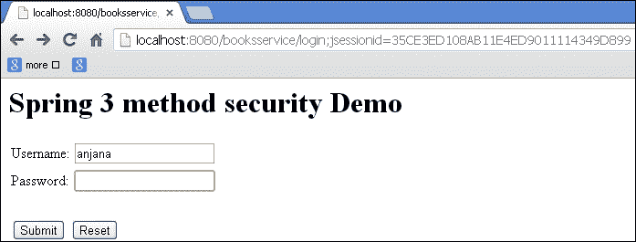
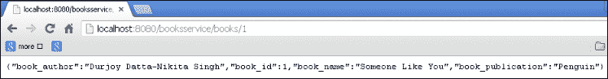
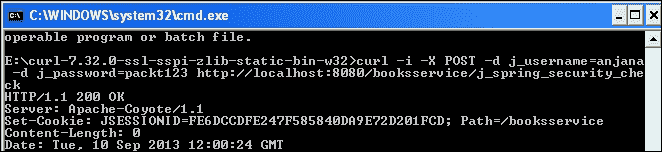
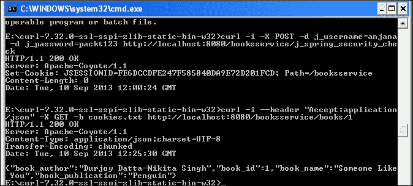
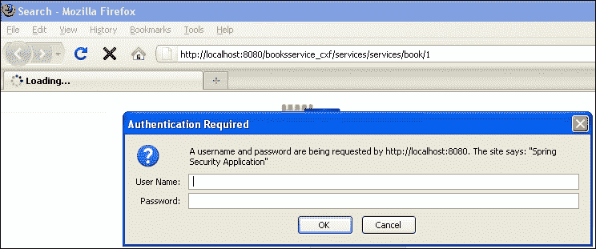
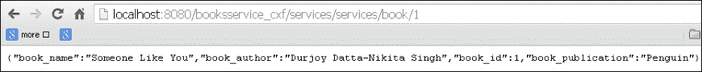
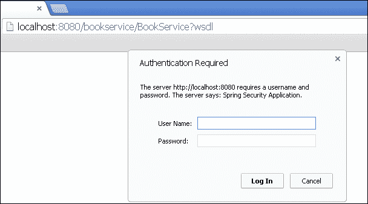
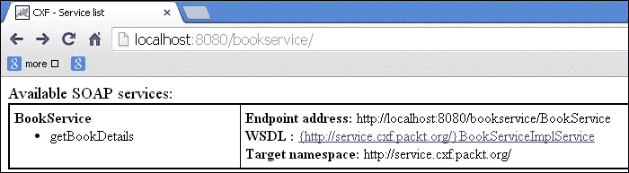
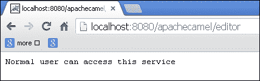

# 第十章：Spring 安全与 Spring Web 服务

在本章中，我们将涵盖：

+   在 RESTful web 服务上应用 Spring Security

+   使用 cURL 工具为 Spring RESTful web 服务配置 Spring Security

+   将 Spring Security 与 Apache CXF RESTful 服务集成

+   将 Spring Security 与 Apache CXF 基于 SOAP 的 web 服务集成

+   将 Spring Security 与 Apache Camel 集成

# 介绍

**SOAP**（**Simple Object Access Protocol**）是基于 XML 的 web 服务。它用于在 web 服务之间传输请求和响应消息。

**REST**（**Representational State Transfer**）是一种以 XML、文本或 JSON 文件形式通过 HTTP 协议发送数据的手段。

在本节中，我们将向 web 服务应用 Spring Security。任何 web 服务的正常流程是将服务 WSDL 或 URL 暴露给最终用户。在应用 Spring Security 后，最终用户可以被验证和授权使用服务。

# 在 RESTful web 服务上应用 Spring Security

REST 已成为提供 web 服务的另一种手段。

数据可以使用 XML、文本或 JSON 格式在应用程序之间共享。REST web 服务被认为是轻量级的 web 服务。

让我们应用 Spring Security 来访问 REST web 服务，以便只有经过授权的用户才能访问 RESTful web 服务。由于 RESTful web 服务是通过 URL 访问并使用 HTTP 协议，我们可以轻松应用 URL 级别的安全性。此示例演示了基于表单的身份验证。但用户也可以使用基本和摘要身份验证。

以下是与 Spring 一起使用的注释，用于生成 RESTful web 服务：

+   `@PathVariable`

+   `@RequestMapping`

+   `@RequestMethod`

## 准备工作

+   使用 Spring web 服务 API 创建一个 RESTful web 服务

+   添加 Spring Security 依赖项

+   将 Spring 过滤器配置添加到`Web.xml`文件中

+   配置`application-security.xml`文件

+   创建一个`AccessController`类来处理登录和注销操作

+   在应用程序中配置 Spring Security 以对用户进行身份验证

## 如何做...

以下是将 RESTful web 服务与 Spring Security 集成的步骤：

1.  让我们创建一个`BookController`类，其中包含`@PathVariable`，如下面的代码片段所示：

```java
package org.springframework.rest;
@Controller
public class BookController {
  private static final Map<Integer, Books> books = new HashMap<Integer, Books>();
  static {
    try {
      books.put(1, new Books(1, "Someone Like You", "Penguin", "Durjoy Datta-Nikita Singh"));
      books.put(2, new Books(2, "The Secret Wish List", "Westland", " Preeti Shenoy"));
      books.put(3, new Books(3, "Love Stories That Touched My Heart ", "Metro Reads", " Preeti Shenoy"));
    } catch (Exception e) {
      e.printStackTrace();
    }
  }
  @RequestMapping(value = "/books/{book_id}", method = RequestMethod.GET)
  @ResponseBody
  public Books findCharacter(@PathVariable int book_id) {
    return books.get(book_id);
  }
}
```

1.  创建一个`Books` POJO 类，其中包含`@JsonAutoDetect`注释，如下面的代码片段所示：

```java
@JsonAutoDetect
public class Books {
    private int book_id;
    private String book_name;
    private String book_publication;
    private String book_author;
    public Books(int book_id, String book_name, String book_publication, String book_author) {
      this.book_id = book_id;
      this.book_name = book_name;
      this.book_publication = book_publication;
      this.book_author = book_author;
    }
    public String getBook_author() {
      return book_author;
    }
    public void setBook_author(String book_author) {
      this.book_author = book_author;
    }
    public int getBook_id() {
      return book_id;
    }
    public void setBook_id(int book_id) {
      this.book_id = book_id;
    }
    public String getBook_name() {
      return book_name;
    }
    public void setBook_name(String book_name) {
      this.book_name = book_name;
    }
    public String getBook_publication() {
      return book_publication;
    }
    public void setBook_publication(String book_publication) {
      this.book_publication = book_publication;
    }
}
```

1.  创建一个`AccessController`类来处理登录和注销操作：

```java
package org.springframework.booksservice;
@Controller
public class AccessController {
  @RequestMapping(value = "/", method = RequestMethod.GET)
  public String defaultPage(ModelMap map) {
    return "redirect:/login";
  }
  @RequestMapping(value = "/login", method = RequestMethod.GET)
  public String login(ModelMap model) {
    return "login";
  }
  @RequestMapping(value = "/accessdenied", method = RequestMethod.GET)
  public String loginerror(ModelMap model) {
    model.addAttribute("error", "true");
    return "denied";
  }
  @RequestMapping(value = "/logout", method = RequestMethod.GET)
  public String logout(ModelMap model) {
    return "logout";
  }
}
```

1.  配置`Application-security.xml`文件，如下面的代码片段所示：

```java
  <http auto-config="false"  use-expressions="true">
    <intercept-url pattern="/login" access="permitAll" />
    <intercept-url pattern="/logout" access="permitAll" />
    <intercept-url pattern="/accessdenied" access="permitAll" />
    <intercept-url pattern="/**" access="hasRole('ROLE_EDITOR')" />
    <form-login login-page="/login" default-target-url="/books" authentication-failure-url="/accessdenied" />
    <logout logout-success-url="/logout" />
  </http>
  <authentication-manager>
    <authentication-provider>
    <user-service>
      <user name="anjana" password="packt123" authorities="ROLE_EDITOR" />
    </user-service>
  </authentication-provider>
</authentication-manager>
```

## 工作原理...

访问 URL：`http://localhost:8080/booksservice/books/1`。这是基于 REST 的 URL，使用 Spring Security 限制了访问。当用户调用基于 REST 的 web 服务 URL 时，Spring Security 将用户重定向到登录页面。在成功验证后，用户将被重定向到授权的基于 REST 的 web 服务页面。

以下是基于 REST 的应用程序与 Spring Security 的工作流程。您将被重定向到登录页面，如下面的屏幕截图所示：



在认证和授权后，您将能够访问 RESTful web 服务，如下面的屏幕截图所示：



## 另请参阅

+   *将 Spring Security 与 Apache CXF RESTful web 服务集成*配方

+   *将 Spring Security 与 Apache CXF 基于 SOAP 的 web 服务集成*配方

+   *将 Spring Security 与 Apache Camel 集成*配方

# 使用 cURL 工具为 Spring RESTful web 服务配置 Spring Security

在这个例子中，我们明确使用 Spring Security API 类和接口。我们将使用`curl`命令对 RESTful web 服务进行身份验证。使用 cURL 工具，您可以通过 URL 传输数据。它可以用来测试身份验证。这是一个相同的书籍服务示例，其中包含一些明确的 Spring Security 相关 API 类，如`AuthenticationEntryPoint`和`SimpleURLAuthenticationSuccessHandler`。在这里，目标是演示它们在 Spring Security 中的内部使用。

## 准备工作

+   实现`AuthenticationEntryPoint`接口并在 XML 文件中进行配置

+   扩展`SimpleUrlAuthenticationSuccessHandler`并在 XML 文件中进行配置

+   配置`Application-security.xml`文件

+   将安全相关的过滤器添加到`Web.xml`文件

+   下载适用于您操作系统的 cURL 工具

## 如何做...

以下是使用`AuthenticationEntryPoint`接口和`SimpleURLAuthenticationSuccessHandler`类应用 Spring Security 身份验证和授权机制的步骤：

1.  `AuthenticationEntryPoint`类是身份验证的入口类，它实现了`AuthenticationEntryPointImpl`类。

```java
public final class AuthenticationEntryPointImpl implements AuthenticationEntryPoint {
  @Override
  public void commence(final HttpServletRequest request, final HttpServletResponse response, final AuthenticationException authException) throws IOException {
    response.sendError(HttpServletResponse.SC_UNAUTHORIZED, "Unauthorized");
  }
}
```

1.  扩展`SimpleURLAuthenticationSuccessHandler`类，如下面的代码片段所示：

```java
  public class MySimpleUrlAuthenticationSuccessHandler extends SimpleUrlAuthenticationSuccessHandler {
    private RequestCache requestCache = new HttpSessionRequestCache();
    @Override
    public void onAuthenticationSuccess(final HttpServletRequest request, final HttpServletResponse response, final Authentication authentication) throws ServletException, IOException {
      final SavedRequest savedRequest = requestCache.getRequest(request, response);
      if (savedRequest == null) {
        clearAuthenticationAttributes(request);
        return;
      }
      final String targetUrlParameter = getTargetUrlParameter();
      if (isAlwaysUseDefaultTargetUrl() || (targetUrlParameter != null && StringUtils.hasText(request.getParameter(targetUrlParameter)))) {
        requestCache.removeRequest(request, response);
        clearAuthenticationAttributes(request);
        return;
      }
      clearAuthenticationAttributes(request);
    }
    public void setRequestCache(final RequestCache requestCache) {
      this.requestCache = requestCache;
    }
  }
```

1.  配置`Application-security.xml`文件。

```java
  <http entry-point-ref="authenticationEntryPoint">
    <intercept-url pattern="/**" access="ROLE_EDITOR"/>
    <form-login authentication-success-handler-ref="mySuccessHandler" />
    <logout />
  </http>
  <beans:bean id="mySuccessHandler"class="org.springframework.booksservice.MySimpleUrlAuthenticationSuccessHandler"/>
  <beans:bean id="authenticationEntryPoint"class="org.springframework.booksservice.AuthenticationEntryPointImpl"/>
  <authentication-manager>
    <authentication-provider>
      <user-service>
        <user name="anjana" password="packt123" authorities="ROLE_EDITOR" />
      </user-service>
    </authentication-provider>
  </authentication-manager>
  </beans:beans>
```

## 它是如何工作的...

现在访问 URL：`http://localhost:8080/booksservice/books/1`

您将看到一个页面，上面写着您没有权限查看页面。

让我们使用 cURL 工具，它会给我们一个 cookie。`200 OK`消息意味着我们已经通过身份验证。

```java
Command: curl -i -X POST -d j_username=anjana -d j_password=packt123 http://localhost:8080/booksservice/j_spring_security_check
curl -i --header "Accept:application/json" -X GET -b cookies.txt http://localhost:8080/booksservice/books/1

```

cookie 存储在名为`mycookies.txt`的文件中。



## 另请参阅

+   *将 Spring Security 与 Apache CXF RESTful web 服务集成*的方法

+   *将 Spring Security 与 Apache CXF 基于 SOAP 的 web 服务集成*的方法

+   *将 Spring Security 与 Apache Camel 集成*的方法

# 将 Spring Security 与 Apache CXF RESTful web 服务集成

在这一部分，让我们创建一个 Apache CXF RESTful web 服务。这是一个开源的 web 服务框架。让我们为这个演示使用基本身份验证。

CXF 支持契约优先和契约后的 web 服务。它还支持 RESTful web 服务。

让我们将 Spring Security 与 CXF 集成，并授权 RESTful web 服务。

## 准备工作

+   将`cxf`依赖项添加到`pom`文件中

+   使用 CXF 设置 RESTful web 服务

+   配置`spring-security.xml`文件

## 如何做...

以下是将 Spring Security 与 Apache CXF RESTful web 服务集成的步骤：

1.  配置`Book` POJO 类。

```java
@XmlRootElement(name = "book")
public class Book {
    private int book_id;
    private String book_name;
    private String book_publication;
    private String book_author;
    public Book(int book_id, String book_name, String book_publication, String book_author) {
      this.book_id = book_id;
      this.book_name = book_name;
      this.book_publication = book_publication;
      this.book_author = book_author;
    }
    public String getBook_author() {
      return book_author;
    }
    public void setBook_author(String book_author) {
      this.book_author = book_author;
    }
    public int getBook_id() {
      return book_id;
    }
    public void setBook_id(int book_id) {
      this.book_id = book_id;
    }
    public String getBook_name() {
      return book_name;
    }
    public void setBook_name(String book_name) {
      this.book_name = book_name;
    }
    public String getBook_publication() {
      return book_publication;
    }
    public void setBook_publication(String book_publication) {
      this.book_publication = book_publication;
    }
}
```

1.  配置`BookCollection` POJO 类。

```java
  @XmlType(name = "BookCollection")
  @XmlRootElement
  public class BookCollection {
    private Collection books;
    public BookCollection() {
    }
    public BookCollection(Collection books) {
      this.books = books;
    }
    @XmlElement(name="books")
    @XmlElementWrapper(name="books")
    public Collection getUsers() {
      return books;
    }
  }
```

1.  配置`BookService`接口。

```java
public interface BookService {
    BookCollection getBooks();
    Book getBook(Integer id);
    Response add(Book book);
}
```

1.  配置`BookServiceImpl`类。

```java
  @Path ("/services/")
  public class BookServiceImpl implements BookService {
    private static final Map<Integer, Book> books = new HashMap<Integer, Book>();
    private static int index = 4;
    static {
      try {
        books.put(1, new Book(1, "Someone Like You", "Penguin", "Durjoy Datta-Nikita Singh"));
          books.put(2, new Book(2, "The Secret Wish List", "Westland", " Preeti Shenoy"));
          books.put(3, new Book(3, "Love Stories That Touched My Heart ", "Metro Reads", " Preeti Shenoy"));
        } catch (Exception e) {
          e.printStackTrace();
        }
    }
 @Override
 @POST
 @Path("/book")
 @Consumes("application/json")
    public Response add(Book book) {
      System.out.println("Adding :" + book.getBook_name());
      book.setBook_id(index++);
      return Response.status(Response.Status.OK).build();
    }
 @Override
 @GET
 @Path("/book/{book_id}")
 @Produces("application/json")
    public Book getBook(@PathParam("book_id") Integer book_id) {
      return books.get(book_id);
    }
 @Override
 @GET
 @Path("/books")
 @Produces("application/json")
    public BookCollection getBooks() {
      return new BookCollection(books.values());
    }
}
```

1.  配置`application-security.xml`文件：

```java
  <sec:global-method-security pre-post-annotations="enabled" />
  <sec:http auto-config="true"  use-expressions="true">
    <sec:intercept-url pattern="/**" access="hasRole('ROLE_EDITOR')"/>
    <sec:http-basic></sec:http-basic>
    <sec:logout logout-success-url="/logout" />
  </sec:http>
  <import resource="classpath:META-INF/cxf/cxf.xml" />
  <import resource="classpath:META-INF/cxf/cxf-servlet.xml"/>
  <jaxrs:server address="/" id="myService">
    <jaxrs:serviceBeans>
      <ref bean="bookserviceImpl"/>
    </jaxrs:serviceBeans>
    <jaxrs:providers>
      <ref bean="jacksonProvider"/>
    </jaxrs:providers>
  </jaxrs:server>
  <bean id="jacksonProvider"
  class="org.codehaus.jackson.jaxrs.JacksonJaxbJsonProvider"/>
  <bean id="bookserviceImpl"
  class="org.springframework.booksservice.BookServiceImpl"/>
  <sec:authentication-manager>
    <sec:authentication-provider>
      <sec:user-service>
        <sec:user name="anjana" password="packt123" authorities="ROLE_EDITOR" />
      </sec:user-service>
    </sec:authentication-provider>
  </sec:authentication-manager>
</beans>
```

1.  配置`Web.xml`文件。

```java
    <!-- The definition of the Root Spring Container shared by all Servlets and Filters -->
  <context-param>
    <param-name>contextConfigLocation</param-name>
    <param-value>/WEB-INF/spring/application-security.xml</param-value>
  </context-param>
  <!-- Creates the Spring Container shared by all Servlets and Filters -->
  <listener>
  <listener-class>org.springframework.web.context.ContextLoaderListener</listener-class>
  </listener>
  <!-- Processes application requests -->
  <servlet>
    <servlet-name>cxf</servlet-name>
    <servlet-class>org.apache.cxf.transport.servlet.CXFServlet</servlet-class>
    <load-on-startup>1</load-on-startup>
  </servlet>
  <servlet-mapping>
    <servlet-name>cxf</servlet-name>
    <url-pattern>/services/*</url-pattern>
  </servlet-mapping>
  <!-- Spring child -->
  <!-- <servlet>
  <servlet-name>bookservice_cxf</servlet-name>
    <servlet-class>org.springframework.web.servlet.DispatcherServlet</servlet-class>
    <load-on-startup>1</load-on-startup>
  </servlet>
  <servlet-mapping>
    <servlet-name>bookservice_cxf</servlet-name>
    <url-pattern>/bookservice_cxf/*</url-pattern>
  </servlet-mapping>-->
  <filter>
    <filter-name>springSecurityFilterChain</filter-name>
    <filter-class>org.springframework.web.filter.DelegatingFilterProxy</filter-class>
  </filter>
  <filter-mapping>
    <filter-name>springSecurityFilterChain</filter-name>
    <url-pattern>/*</url-pattern>
  </filter-mapping>
</web-app>
```

## 它是如何工作的...

这个例子中，RESTful 服务是由 CXF 框架提供的。然后应用程序集成了 Spring Security，以提供安全的身份验证和授权模块给 RESTful web 服务。Spring Security 过滤器链管理身份验证和授权过程。当您访问服务时，将提示您登录，如下面的屏幕截图所示。登录后，您可以查看 RESTful 数据。Mozilla Firefox 浏览器将提示用户以文件格式下载数据。



现在访问 URL：`http://localhost:8080/booksservice_cxf/services/services/book/1`



## 另请参阅

+   *将 Spring Security 与 Apache CXF RESTful web 服务集成*的方法

+   *将 Spring Security 与 Apache Camel 集成*的方法

# 将 Spring Security 与 Apache CXF 基于 SOAP 的 web 服务集成

在这一部分，让我们创建一个基于 SOAP 的 web 服务。我们将演示 Spring Security 与 Apache CXF 基于 SOAP 的 web 服务的集成。

使用 Apache CXF 创建基于 SOAP 的 web 服务已经变得简单。

## 准备就绪

+   将 CXF-SOAP 依赖项添加到`pom`文件中。

+   向`pom`文件添加基于 Spring Security 的依赖项。

+   使用`interface`和`Impl`类设置基于 SOAP 的 Web 服务。

+   配置`spring-security.xml`文件。

+   将 jar 添加到`Tomcat_7.0/lib`文件夹作为设置的一部分。 Tomcat 需要以下 jar 文件才能与 CXF Web 服务一起工作。缺少这些 jar 可能会导致一些错误：

+   `streambuffer.jar`

+   `stax-ex`

+   `jaxws-ap-2.1`

+   `jaxws-rt`

## 如何做...

以下是将 Apache CXF 基于 SOAP 的 Web 服务与 Spring Security 集成的步骤：

1.  `Book` POJO 具有 getter 和 setter 方法。它还具有参数化构造函数。`Book` POJO 在`BookService`接口中使用，以提供有关从客户端应用程序请求的`Book`的详细信息。

```java
package org.packt.cxf.domain;
public class Book {
  private int book_id;
  private String book_name;
  private String book_publication;
  private String book_author;
  public Book() {
  }
  public Book(int book_id, String book_name, String book_publication, String book_author) {
    this.book_id = book_id;
    this.book_name = book_name;
    this.book_publication = book_publication;
    this.book_author = book_author;
  }
  public String getBook_author() {
    return book_author;
    }
    public void setBook_author(String book_author) {
        this.book_author = book_author;
  }
  public int getBook_id() {
    return book_id;
  }
  public void setBook_id(int book_id) {
    this.book_id = book_id;
  }
  public String getBook_name() {
    return book_name;
  }
  public void setBook_name(String book_name) {
    this.book_name = book_name;
  }
  public String getBook_publication() {
    return book_publication;
  }
  public void setBook_publication(String book_publication) {
    this.book_publication = book_publication;
  }
}
```

1.  `BookService`接口使用`@WebService`注解创建，其中`getBookDetails`是 WSDL 中的服务方法。

```java
package org.packt.cxf.service;
import javax.jws.WebService;
import org.packt.cxf.domain.Book;
@WebService
public interface BookService {
  public Book getBookDetails(int book_id);
}
```

1.  `BookServiceImpl`类是`BookService`接口的实现类，并使用`@webservice`注解包`org.packt.cxf.service`配置为端点接口。

```java
import java.util.HashMap;
import java.util.Map;
import javax.jws.WebService;
import org.packt.cxf.domain.Book;
@WebService(endpointInterface = "org.packt.cxf.service.BookService")
public class BookServiceImpl implements BookService{
    private static final Map<Integer, Book> books = new HashMap<Integer, Book>();
    private static int index = 4;
    static {
      try {
        books.put(1, new Book(1, "Someone Like You", "Penguin", "Durjoy Datta-Nikita Singh"));
        books.put(2, new Book(2, "The Secret Wish List", "Westland", " Preeti Shenoy"));
        books.put(3, new Book(3, "Love Stories That Touched My Heart ", "Metro Reads", " Preeti Shenoy"));
      } catch (Exception e) {
        e.printStackTrace();
      }
    }
    @Override
    public Book getBookDetails(int book_id) {
      return books.get(book_id);
    }}
```

1.  在`Cxf-servlet.xml`文件中，我们注册了 Web 服务接口和实现类。

```java
  <beans 

  xsi:schemaLocation="http://www.springframework.org/schema/beans http://www.springframework.org/schema/beans/spring-beans.xsdhttp://cxf.apache.org/jaxwshttp://cxf.apache.org/schemas/jaxws.xsd">
  <import resource="classpath:META-INF/cxf/cxf.xml" />
  <import resource="classpath:META-INF/cxf/cxf-servlet.xml" />
  <import resource="classpath:META-INF/cxf/cxf-extension-http.xml" />
  <import resource="classpath:META-INF/cxf/cxf-extension-soap.xml" />
  <jaxws:endpoint id="bookService"implementor="org.packt.cxf.service.BookServiceImpl" address="/BookService" />
  </beans>
```

1.  在`Web.xml`文件中，我们引用`cxf-servlet.xml`的位置，并配置`CXFSservlet`。

```java
  <web-app version="2.5"   xsi:schemaLocation="http://java.sun.com/xml/ns/javaee http://java.sun.com/xml/ns/javaee/web-app_2_5.xsd">
    <display-name>SampleWSCxf</display-name>
    <listener>
      <listener-class>org.springframework.web.context.ContextLoaderListener</listener-class>
    </listener>
    <context-param>
      <param-name>contextConfigLocation</param-name>
      <param-value>WEB-INF/cxf-servlet.xml</param-value>
    </context-param>
    <servlet>
      <servlet-name>CXFServlet</servlet-name>
      <servlet-class>org.apache.cxf.transport.servlet.CXFServlet</servlet-class>
      <load-on-startup>1</load-on-startup>
    </servlet>
    <servlet-mapping>
      <servlet-name>CXFServlet</servlet-name>
      <url-pattern>/*</url-pattern>
    </servlet-mapping>
  </web-app>
```

## 工作原理...

在本节中，我们演示了 Web 服务的基本身份验证。访问 URL：`http://localhost:8080/bookservice/`

我们使用了 CXF 框架创建基于 SOAP 的 Web 服务。当用户访问 URL 时，期望的行为是允许访问 WSDL 及其服务。但是 Spring Security 中断了请求，并为用户弹出登录对话框。成功验证后，用户可以访问 WSDL。



生成的 WSDL 可在以下 URL 找到：`http://localhost:8080/bookservice/BookService?wsdl`

```java
<wsdl:definitions    name="BookServiceImplService" targetNamespace="http://service.cxf.packt.org/">
  <wsdl:types>
  <xs:schema elementFormDefault="unqualified" targetNamespace="http://service.cxf.packt.org/" version="1.0">
  <xs:element name="getBookDetails"type="tns:getBookDetails"/>
  <xs:element name="getBookDetailsResponse" type="tns:getBookDetailsResponse"/>
  <xs:complexType name="getBookDetails">
    <xs:sequence>
      <xs:element name="arg0" type="xs:int"/>
    </xs:sequence>
  </xs:complexType>
  <xs:complexType name="getBookDetailsResponse">
    <xs:sequence>
      <xs:element minOccurs="0" name="return"type="tns:book"/>
    </xs:sequence>
  </xs:complexType>
  <xs:complexType name="book">
    <xs:sequence>
      <xs:element minOccurs="0" name="book_author" type="xs:string"/>
      <xs:element name="book_id" type="xs:int"/>
      <xs:element minOccurs="0" name="book_name" type="xs:string"/>
      <xs:element minOccurs="0" name="book_publication" type="xs:string"/>
      </xs:sequence>
    </xs:complexType>
  </xs:schema>
  </wsdl:types>
  <wsdl:message name="getBookDetails">
    <wsdl:part element="tns:getBookDetails" name="parameters"></wsdl:part>
  </wsdl:message>
  <wsdl:message name="getBookDetailsResponse">
    <wsdl:part element="tns:getBookDetailsResponse" name="parameters"></wsdl:part>
    </wsdl:message>
  <wsdl:portType name="BookService">
    <wsdl:operation name="getBookDetails">
      <wsdl:input message="tns:getBookDetails"name="getBookDetails"></wsdl:input>
      <wsdl:outputmessage="tns:getBookDetailsResponse"name="getBookDetailsResponse"></wsdl:output>
    </wsdl:operation>
  </wsdl:portType>
  <wsdl:bindingname="BookServiceImplServiceSoapBinding"type="tns:BookService">
    <soap:bindingstyle="document"transport="http://schemas.xmlsoap.org/soap/http"/>
      <wsdl:operationname="getBookDetails">
        <soap:operationsoapAction=""style="document"/>
      <wsdl:inputname="getBookDetails">
        <soap:bodyuse="literal"/>
      </wsdl:input>
      <wsdl:outputname="getBookDetailsResponse">
        <soap:bodyuse="literal"/>
      </wsdl:output>
    </wsdl:operation>
  </wsdl:binding>
  <wsdl:servicename="BookServiceImplService">
    <wsdl:portbinding="tns:BookServiceImplServiceSoapBinding"name="BookServiceImplPort">
      <soap:addresslocation="http://localhost:8080/bookservice/BookService"/>
    </wsdl:port>
  </wsdl:service>
</wsdl:definitions>
```

## 另请参阅

+   *将 Spring Security 与 Apache CXF RESTful Web 服务集成*配方

+   *将 Spring Security 与 Apache Camel 集成*配方

# 将 Spring Security 与 Apache Camel 集成

Apache Camel 可用于定义路由和调解应用程序的规则。 Spring Security 可用于与 Apache Camel 一起对路由器进行身份验证。 Spring Security 身份验证策略对象控制对路由器的访问。 Spring Security 身份验证策略对象包含角色信息，并引用 Spring 身份验证管理器。您可以从网站下载源代码。

## 准备就绪

+   创建 Camel 上下文

+   使用 XML 配置添加路由规则

+   在 Spring XML 文件中配置以下内容：

+   访问决策管理器

+   角色投票者

+   身份验证管理器

+   用户详细信息服务

+   使用权限配置身份验证策略对象

+   添加`camel-spring-security`依赖

## 如何做...

以下是将 Apache Camel 与 Spring Security 集成的步骤：

1.  创建`Camel–context.xml`文件，并使用 Spring Security 定义路由规则。

```java
  <spring-security:http realm="User Access Realm">
    <spring-security:intercept-url pattern="/apachecamel/**"     access="ROLE_EDITOR"/>
    <spring-security:http-basic/>
    <spring-security:remember-me/>
  </spring-security:http>
  <spring-security:authentication-manager alias="authenticationManager">
    <spring-security:authentication-provider user-service-ref="userDetailsService"/>
  </spring-security:authentication-manager>
  <spring-security:user-service id="userDetailsService">
    <spring-security:user name="anju" password="anju123" authorities="ROLE_EDITOR,ROLE_AUTHOR"/>
    <spring-security:user name="shami" password="shami123" authorities="ROLE_EDITOR"/>
  </spring-security:user-service>
  <bean id="accessDecisionManager" class="org.springframework.security.access.vote.AffirmativeBased">
    <property name="allowIfAllAbstainDecisions" value="true"/>
    <property name="decisionVoters">
      <list>
        <bean class="org.springframework.security.access.vote.RoleVoter"/>
      </list>
    </property>
  </bean>
  <!-- The Policy for checking the authentication role of AUTHOR -->
  <authorizationPolicy id="author" access="ROLE_AUTHOR"
    authenticationManager="authenticationManager"
    accessDecisionManager="accessDecisionManager"
    />
  <!-- The Policy for checking the authentication role of EDITOR -->
  <authorizationPolicy id="editor" access="ROLE_EDITOR"/>
  <camelContext id="myCamelContext" >
    <!-- Catch the authorization exception and set the Access Denied message back -->
    <onException>
    <exception>org.apache.camel.CamelAuthorizationException</exception>
    <handled>
      <constant>true</constant>
    </handled>
    <transform>
      <simple>Access Denied with the Policy of ${exception.policyId} !</simple>
      </transform>
    </onException>
 <route>
 <from uri="servlet:///editor"/>
 <!-- wrap the route in the policy which enforces security check -->
 <policy ref="editor">
 <transform>
 <simple>Normal user can access this service</simple>
 </transform>
 </policy>
 </route>
 <route>
 <from uri="servlet:///author"/>
 <!-- wrap the route in the policy which enforces security check -->
 <policy ref="author">
 <transform>
 <simple>Call the admin operation OK</simple>
 </transform>
 </policy>
 </route>
  </camelContext>
</beans>
```

1.  在`Web.xml`中配置 Camel servlet。

```java
<!-- location of spring xml files -->
  <context-param>
    <param-name>contextConfigLocation</param-name>
    <param-value>classpath:camel-context.xml</param-value>
  </context-param>
  <!-- the listener that kick-starts Spring -->
  <listener>
    <listener-class>org.springframework.web.context.ContextLoaderListener</listener-class>
  </listener>
  <filter>
    <filter-name>springSecurityFilterChain</filter-name>
    <filter-class>org.springframework.web.filter.DelegatingFilterProxy</filter-class>
  </filter>
  <filter-mapping>
    <filter-name>springSecurityFilterChain</filter-name>
    <url-pattern>/*</url-pattern>
  </filter-mapping>
  <servlet>
    <servlet-name>CamelServlet</servlet-name>
    <servlet-class>org.apache.camel.component.servlet.CamelHttpTransportServlet</servlet-class>
    <load-on-startup>1</load-on-startup>
  </servlet>
  <servlet-mapping>
    <servlet-name>CamelServlet</servlet-name>
    <url-pattern>/apachecamel/*</url-pattern>
  </servlet-mapping>
</web-app>
```

## 工作原理...

现在访问 URL：`http://localhost:8080/apachecamel/editor`

`camel-context.xml`文件具有路由规则；`camel-context.xml`文件的位置在`Web.xml`中配置，同时配置了`CamelServlet`来处理路由机制。`<authorizationpolicy>`标签处理在`spring-security.xml`文件中配置的资源的身份验证和授权。`<spring-security:user-service>`标签包含用户和角色的详细信息，在路由请求之前可以给予访问权限。以下是 Apache Camel 使用 Spring Security 中断路由过程的工作流程。用户被授权使用两个角色中的任意一个：`EDITOR`或`AUTHOR`。



## 另请参阅

+   *将 Spring Security 与 Apache CXF RESTful Web 服务集成*配方

+   Spring Security 与 Apache Camel 集成的配方
