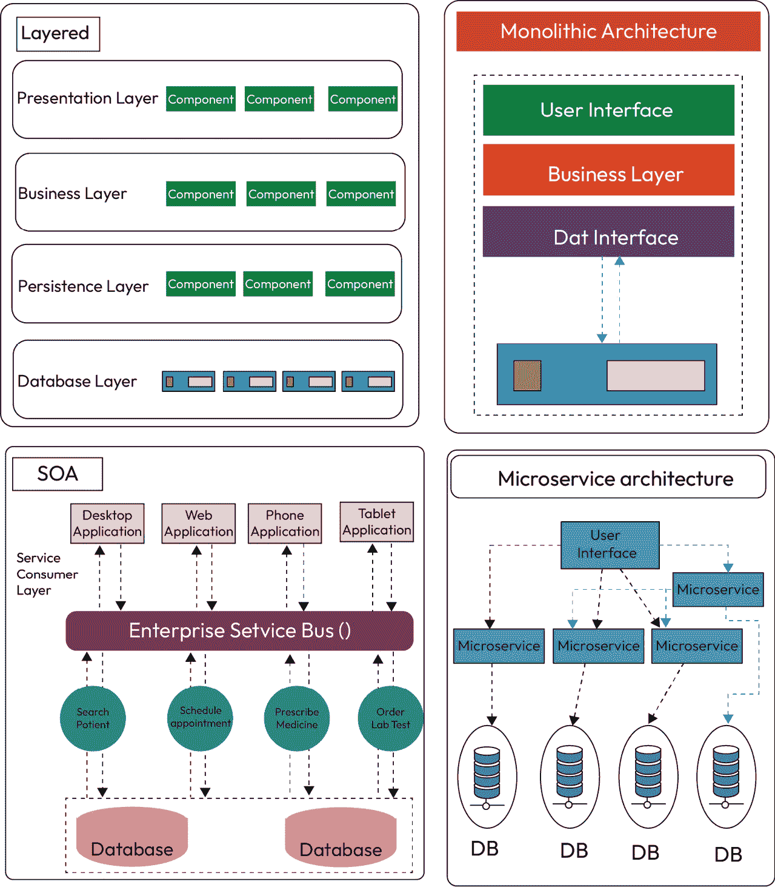
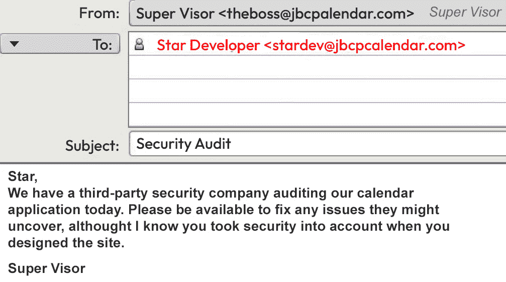
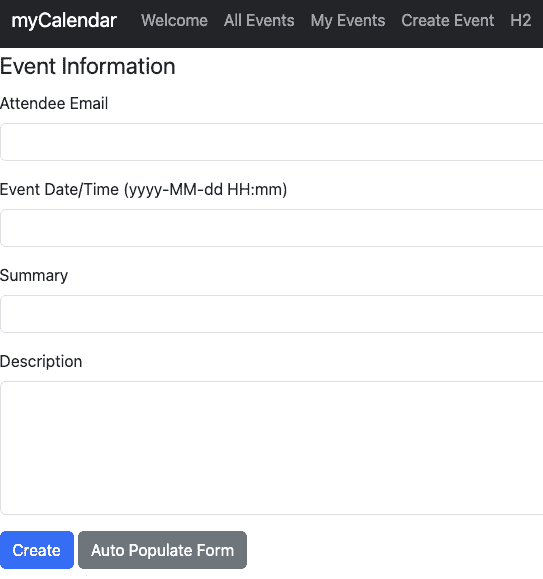
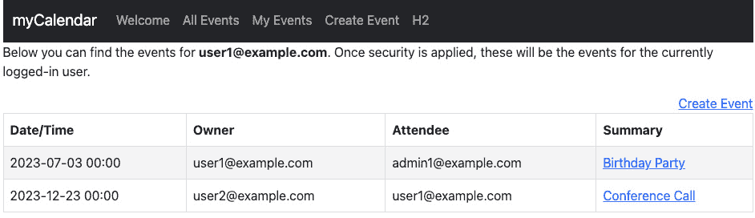
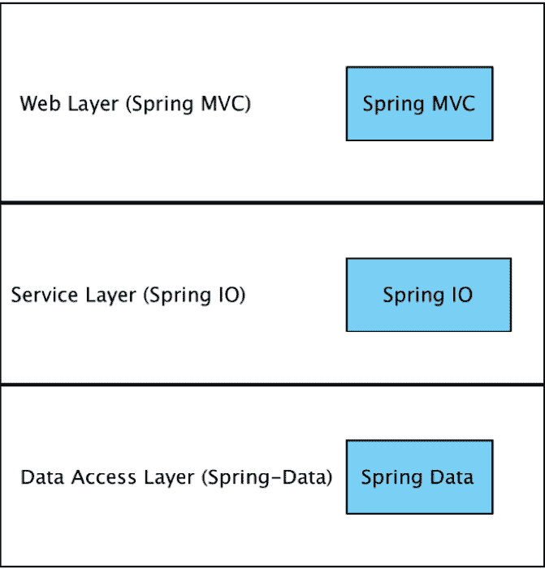
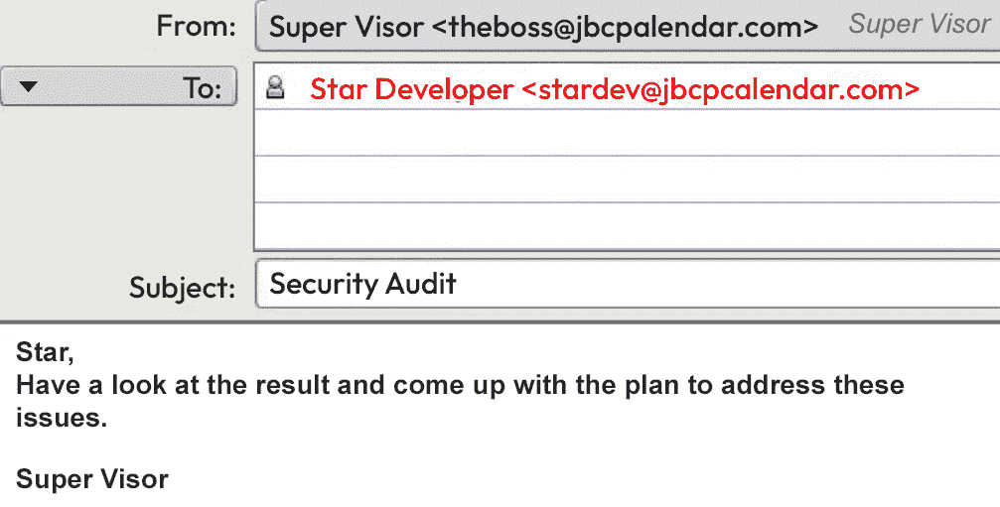
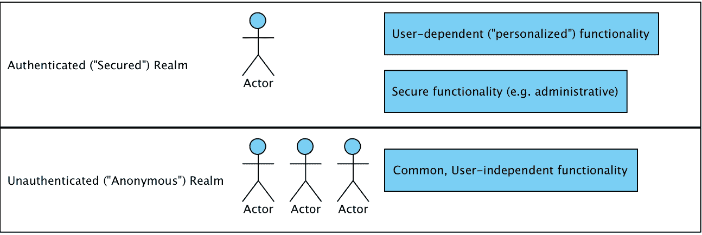
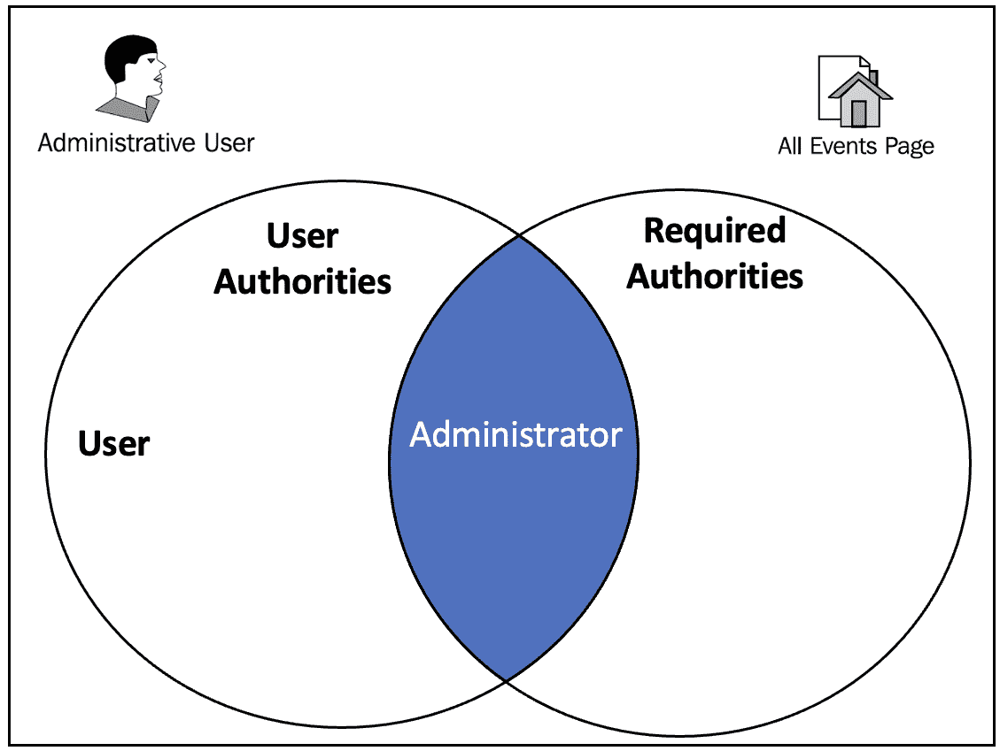
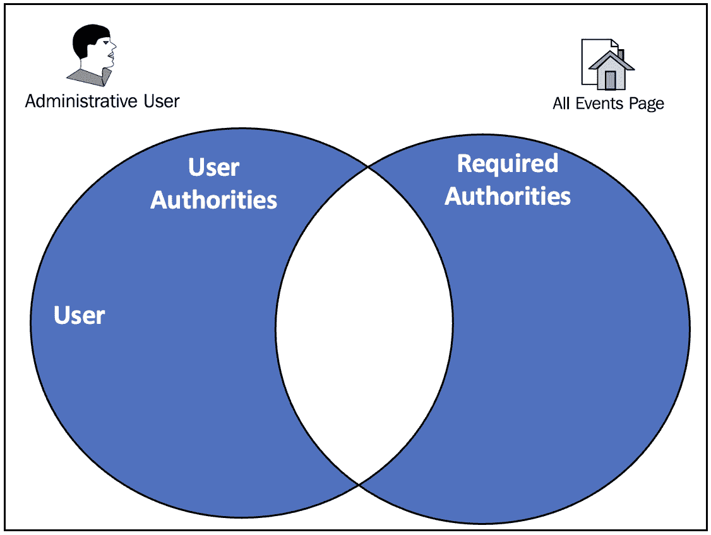

# 第一章：不安全应用程序的解剖结构

安全性可以说是 21 世纪任何基于 Web 的应用程序最重要的架构组件之一。在恶意软件、犯罪分子和恶意员工始终存在并积极测试软件以寻找**漏洞**的时代，智能和全面的安全使用是您将负责的任何项目的关键要素。

这本书的编写是为了遵循一种开发模式，我们认为这种模式为处理复杂主题提供了一个有用的前提——以 Spring 6 为基础的基于 Web 的应用程序，并理解使用 Spring Security 6 对其进行安全保护的核心概念和策略。我们通过为每一章提供完整的 Web 应用程序的示例代码来补充这种方法。

在本章中，我们将深入探讨一个示例场景，以突出几个常见的安全漏洞。我们的旅程将从检查安全编码的基本原则开始。然后，我们将转向下一章，探讨常见的漏洞，如 SQL 注入、**跨站脚本攻击**（**XSS**）和**跨站请求伪造**（**CSRF**）。

无论您是否已经在使用 Spring Security，还是希望将您对软件的基本使用提升到更复杂的水平，您都会在这本书中找到一些有用的内容。

在本章的讨论过程中，我们将涵盖以下主题：

+   探索软件架构风格

+   理解安全审计

+   应对安全审计发现

建议在深入研究后续部分之前，您对 Spring 框架有一个基本的了解。

在本章结束时，您将了解应用程序可能受到攻击的方式，并且您将掌握可以用来保护应用程序的核心安全机制。

如果您已经熟悉基本的安全术语，您可以跳转到*第二章*，*Spring Security 入门*，在那里我们开始使用框架的基本功能。

# 探索软件架构风格

许多企业正在从在线云服务平台获取计算能力，并主要依赖云来开发大多数应用程序。这种转变促使应用程序设计发生了变化。



图 1.1 – 单体架构与分层架构与 SOA 与微服务架构的比较

选择最合适的应用架构取决于您的具体业务需求。我们将探讨四种旨在促进数字化转型并满足一般业务需求的设计方案。

## 单体架构

一种传统架构，其中整个应用程序作为一个统一且紧密集成的实体构建。

虽然最初开发和部署很容易，但随着项目的扩展，扩展和维护可能会带来挑战。

## N-Tier 架构（分层架构）

N 层架构，也称为具有明显层的层次结构，是指一种软件系统的设计方法，它将应用程序组织成多个层，通常是四层：*表示层*、*业务层*、*持久层*和*数据层*。这种架构模型在企业应用程序中常用，通过分室化和促进模块化开发来提高可维护性。每一层都有特定的职责。

**模型-视图-控制器**（**MVC**）软件设计模式将应用程序分为三个相互关联的组件：模型（数据和业务逻辑）、视图（用户界面）和控制器（处理用户输入并相应地更新模型和视图）。

这种分割有助于可扩展性、易于维护和适应不断变化的业务需求。

## SOA

**服务导向模式**，也称为**服务导向架构**（**SOA**），是一种将软件应用程序构建为一系列松散耦合且可独立部署的服务集合的架构风格。

在 20 世纪 90 年代末服务导向架构（SOA）开始使用之前，将应用程序连接到另一个系统中的服务是一个复杂的过程，涉及点到点的集成。

## 微服务架构

微服务源于 SOA，但 SOA 与微服务不同。

这种架构涉及将应用程序分解成小型、自主的服务，通过 API 进行通信。它提供了可扩展性、灵活性和简化了维护，但引入了处理分布式系统复杂性的挑战。

重要提示

从历史上看，重点是功能性和有状态性，但现在，大多数面向消费者的应用程序正在转向**软件即服务**（**SaaS**）和数字平台。目前，在应用程序设计中的重点是提高用户体验、拥抱无状态性和优先考虑敏捷性。

## 在传统 Web 应用程序和单页应用程序之间进行选择

在当代的景观中，构建 Web 应用程序主要有两种主要方法：传统的 Web 应用程序，其中大多数应用程序逻辑在服务器上执行，以及**单页应用程序**（**SPA**），它们在 Web 浏览器中处理大多数用户界面逻辑，并通过 Web API 主要与 Web 服务器通信。一种可行的混合方法是，在更大的传统 Web 应用程序中托管一个或多个功能丰富的 SPA-like 子应用程序。

在以下情况下选择传统的 Web 应用程序：

+   您的应用程序客户端需求简单，甚至仅限于只读功能

+   您的应用程序需要在缺少 JavaScript 支持的浏览器中运行

+   您的应用程序是公开可访问的，并从搜索引擎可见性和推荐中受益

在以下情况下选择一个单页应用程序（SPA）：

+   您的应用程序需要一个复杂的用户界面，具有众多功能

+   您的开发团队精通 JavaScript、Angular、ReactJS、VueJS、TypeScript 或 WebAssembly

+   您的应用程序已经向其他客户端公开了 API，无论是内部还是公开

由 SPA 方法促进的用户体验改进应仔细考虑这些因素。

在本书的下一部分，我们将使用传统的 Spring MVC 应用程序作为示例，来说明各种安全原则。

重要提示

需要注意的是，这些安全原则适用于本章讨论的所有架构风格。

# 理解安全审计

您作为`JBCPCalendar.com`的软件开发人员，早上很早，您正在喝第一杯咖啡，这时您收到了以下来自管理员的电子邮件：



图 1.2 – 管理员的电子邮件

什么？您在设计应用程序时没有考虑到安全性？实际上，到目前为止，您甚至不确定什么是**安全审计**。听起来您将从安全审计员那里学到很多东西！在本章的后面部分，我们将回顾什么是审计，以及审计的结果。首先，让我们花点时间检查正在审查的应用程序。

## 探索示例应用程序

虽然我们将在本书的进展过程中处理一个虚构的场景，但应用程序的设计以及我们将对其进行的更改都是基于基于 Spring 的应用程序的实际使用。日历应用程序允许用户创建和查看事件：



图 1.3 – 日历应用程序事件信息

在输入新事件的详细信息后，您将看到以下截图：



图 1.4 – 日历应用程序摘要

该应用程序设计得简单，以便我们能够专注于安全性的重要方面，而不是陷入**对象关系映射**（**ORM**）和复杂的 UI 技术的细节。我们希望您参考其他补充材料，例如*附录*、*附加参考资料*（本书*补充材料*部分），以涵盖示例代码中提供的部分基本功能。

代码是用 Spring 和 Spring Security 6 编写的，但将许多示例适应到其他版本的 Spring Security 相对容易。有关 Spring Security 4 和 6 之间详细更改的讨论，请参阅*第十六章*，*迁移到 Spring Security 6*，以帮助将示例转换为 Spring Security 6 语法。

重要提示

请不要将此应用程序作为构建真实在线日历应用程序的基准。它已被有意设计得简单，并专注于我们在本书中阐述的概念和配置。

在下一节中，我们将探讨应用程序架构。

## JBCP 日历应用程序架构

Web 应用程序遵循标准的三层架构，包括 Web 层、服务层和数据访问层，如下面的图所示：



图 1.5 – JBCP 日历应用程序架构

你可以在*附录*的[*补充材料*]部分找到有关 MVC 架构的额外材料，*附加* *参考资料*。

Web 层封装了 MVC 代码和功能。在这个示例应用程序中，我们将使用 Spring MVC 框架，但同样可以轻松地使用**Spring Web Flow**（**SWF**）、**Apache Struts**，甚至是一个 Spring 友好的 Web 栈，如**Apache Wicket**。

在典型的使用 Spring Security 的 Web 应用程序中，Web 层是配置和代码增强的主要发生地。例如，`EventsController`类被用来将 HTTP 请求转换为将事件存储到数据库的过程。如果你在 Web 应用程序和 Spring MVC 方面没有太多经验，那么在继续更复杂主题之前仔细审查基准代码并确保你理解它是明智的。再次强调，我们已尽力使网站尽可能简单，而日历应用程序的构建只是为了给网站提供一个合理的标题和轻量级结构。

重要提示

你可以在*附录*的[*附加*] *参考资料*中找到设置示例应用程序的详细说明。

服务层封装了应用程序的业务逻辑。在我们的应用程序中，我们使用`DefaultCalendarService`作为数据访问层的一个非常轻量级的门面，以说明关于保护应用程序服务方法的一些特定点。服务层还用于在单个方法调用中操作 Spring Security API 和我们的日历 API。我们将在*第三章*中更详细地讨论这一点，*自定义身份验证*。

在典型的 Web 应用程序中，服务层包含业务规则验证、业务对象的组合和分解以及如审计等横切关注点。

数据访问层封装了操纵数据库表内容的代码。在许多 Spring 应用程序中，你会在这一层看到 ORM，例如 Hibernate 或 JPA。数据访问层向服务层公开基于对象的 API。在我们的应用程序中，我们使用基本的 JDBC 功能在内存中的 H2 数据库中实现持久性。例如，`JdbcEventDao`用于将事件对象保存到数据库中。

在典型的 Web 应用程序中，将利用更全面的数据访问解决方案。由于 ORM 和更广泛的数据访问对一些开发者来说可能很复杂，我们选择尽可能简化这一领域，以便于理解。

在下一节中，我们将审查审计结果。

## 审查审计结果

让我们回到我们的电子邮件，看看审计进展如何。哎呀…结果看起来不太好：



图 1.6 – 审计结果电子邮件

**应用程序审计结果**：此应用程序表现出以下不安全行为：

+   由于缺乏 URL 保护和一般认证，意外提升权限

+   授权使用不当或不存在

+   缺少数据库凭证安全

+   可识别的个人或敏感信息容易被访问或未加密

+   由于缺乏 SSL 加密，传输层保护不安全

风险等级很高。我们建议在此问题解决之前，应将此应用程序下线。

哎呀！这个结果对我们公司来说看起来很糟糕。我们最好尽快努力解决这些问题。

第三方安全专家通常由公司（或其合作伙伴或客户）雇佣，通过结合白帽黑客、源代码审查以及与应用程序开发人员和架构师进行的正式或非正式对话，来审计其软件安全的有效性。

**白帽黑客**或**道德黑客**是由受雇于公司（或其合作伙伴或客户）的专业人士进行的，他们的目的是指导公司如何更好地保护自己，而不是出于恶意意图。

通常，**安全审计**的目标是为管理层或客户提供保证，即已遵循基本的安全开发实践，以确保客户数据和系统功能的完整性和安全性。根据软件针对的行业，审计员还可能使用行业特定标准或合规性指标进行测试。

重要提示

在您的职业生涯中，您可能会遇到两种特定的安全标准：**支付卡行业数据安全标准**（**PCI DSS**）和**健康保险隐私和问责法案**（**HIPAA**）的隐私规则。这两个标准都是为了通过流程和软件控制相结合来确保特定敏感信息（如信用卡和医疗信息）的安全。

许多其他行业和国家都有关于敏感或**个人身份信息**（**PII**）的类似规则。未能遵守这些标准不仅是不良的做法，而且在发生安全漏洞的情况下，还可能使您或您的公司面临重大的法律责任（更不用说不良的舆论了）。

接收**安全审计**的结果可能是一次令人大开眼界的经历。按照所需的软件改进进行操作可能是自我教育和软件改进的绝佳机会，并允许您实施导致安全软件的实践和政策。

在下一节中，我们将回顾审计员发现的问题，并制定一个详细计划来应对这些问题。

# 应对安全审计发现

在本节中，我们将仔细检查我们的安全审计结果，揭示我们应用程序安全领域中的漏洞和关注区域。我们将分析审计结果，并开始探索各种有效的策略和模式，以保障和减轻这些已识别的风险。本章为增强我们应用程序的安全性提供了路线图，确保它能够抵御潜在的威胁和漏洞。

## 认证

认证是您在开发安全应用程序时必须内化的两个关键安全概念之一（另一个是授权）。认证确定谁正在尝试请求资源。您可能对日常在线和离线生活中的认证很熟悉，在不同的环境中，如下所示：

+   **基于凭证的认证**：当您登录基于网络的电子邮件账户时，您很可能提供了您的用户名和密码。电子邮件服务提供商将您的用户名与其数据库中的已知用户进行匹配，并验证您的密码是否与记录相符。这些凭证是电子邮件系统用来验证您是该系统有效用户的方法。首先，我们将使用这种类型的认证来保护 JBCP 日历应用中的敏感区域。从技术角度讲，电子邮件系统不仅可以在数据库中检查凭证，还可以在任何地方检查，例如，一个企业目录服务器，如**微软活动目录**。本书中涵盖了这种类型集成的几个示例。

+   **双因素认证**：当您从银行的 ATM 机取款时，您需要在被允许取现金或进行其他交易之前，先刷您的身份证并输入您的个人识别号码。这种认证方式与用户名和密码认证类似，只是用户名被编码在卡的磁条上。物理卡片和用户输入的 PIN 码的组合使得银行能够确保您有权访问该账户。密码和物理设备（您的塑料 ATM 卡）的组合是双因素认证的普遍形式。在专业、注重安全的环镜中，这些类型的设备在访问高度安全系统时经常被使用，尤其是在处理财务信息或 PII 时。例如，**RSA SecurID**这样的硬件设备将基于时间的硬件设备与基于服务器的认证软件相结合，使得环境极其难以被攻破。

+   **硬件认证**：当您早上启动汽车时，您将金属钥匙插入点火开关并转动以启动汽车。尽管这可能与其他两个例子感觉不同，但钥匙上的凸起与点火开关中的转轮的正确匹配作为一种硬件认证方式。

实际上存在数十种认证形式可以应用于软件和硬件安全的问题，每种都有其自身的优缺点。我们将在本书的前半部分回顾一些这些方法，它们如何应用于 Spring Security。我们的应用程序缺乏任何类型的认证，这就是为什么审计包括了意外权限提升的风险。

通常，一个软件系统将被分为两个高级领域，例如非认证（或匿名）和认证，如下面的截图所示：



图 1.7 – 软件系统中的高级领域

匿名领域中的应用功能是独立于用户身份的功能（例如，在线应用程序的欢迎页面）。

匿名区域不执行以下操作：

+   要求用户登录系统或以其他方式识别自己才能使用

+   显示敏感信息，如姓名、地址、信用卡和订单

+   提供操作系统整体状态或其数据的功能

系统的非认证区域旨在供所有人使用，甚至包括我们尚未明确识别的用户。然而，在这些区域中，可能存在一些额外的功能似乎用于识别用户（例如，无处不在的`欢迎 {名字}`文本）。通过使用 Spring Security 标签库，对认证用户选择性显示内容得到了完全支持，并在*第十一章*的*细粒度访问控制*中进行了介绍。

我们将在第二章“使用 Spring Security 入门”中解决这个发现，并利用 Spring Security 的自动配置功能实现基于表单的身份验证。之后，我们将探讨执行身份验证的各种其他方法（这通常围绕与企业或其他外部身份验证存储的系统集成）。

在下一节中，我们将探讨**授权**。

## 授权

授权是两个核心安全概念中的第二个，在实现和理解应用程序安全中至关重要。授权使用在身份验证过程中验证的信息来确定是否应授予特定资源的访问权限。围绕应用程序的授权模型构建，授权将应用程序的功能和数据分区，以便可以通过将权限、功能和数据组合与用户匹配来控制这些项目的可用性。我们应用程序在审计此点时的失败表明，应用程序的功能没有被用户角色所限制。想象一下，如果你正在运行一个电子商务网站，查看、取消或修改订单和客户信息的能力对任何网站用户都是可用的！

授权通常涉及以下两个独立的方面，它们结合在一起描述了受保护系统的可访问性：

+   第一个是将经过验证的主实体映射到一个或多个权限（通常称为**角色**）。例如，你网站的一个普通用户可能被视为拥有访客权限，而网站管理员可能被分配管理权限。

+   第二个是将权限检查分配给系统中的受保护资源。这通常在系统开发时完成，无论是通过代码中的显式声明还是通过配置参数。例如，允许查看其他用户事件的屏幕应该仅对具有管理权限的用户可用。

重要提示

受保护资源可以是系统中的任何方面，其可用性应根据用户的权限有条件地提供。

基于 Web 的应用程序的受保护资源可以是单个网页、整个网站的部分或单个网页的部分。相反，受保护的业务资源可能是类上的方法调用或单个业务对象。

你可能会想象一个权限检查，它会检查主实体（当前用户或与应用程序交互的系统的身份），查找其用户账户，并确定该主实体是否确实是管理员。如果这个权限检查确定尝试访问受保护区域的主体确实是管理员，那么请求将成功。然而，如果主体没有足够的权限，请求应该被拒绝。

让我们更详细地看看一个特定的受保护资源示例，即**所有事件**页面。**所有事件**页面需要管理员访问权限（毕竟，我们不希望普通用户查看其他用户的事件），因此它会在访问该页面的主体中寻找一定级别的权限。

如果我们考虑当网站管理员尝试访问受保护资源时可能做出的决定，我们会想象实际权限与所需权限的对比可以用集合论来简洁地表达。我们可能会选择将这个决定表示为针对管理用户的**维恩图**：



图 1.8 – 管理用户的维恩图

对于该页面，**用户权限**（用户和管理员）与**所需权限**（管理员）之间存在交集，因此用户被赋予了访问权限。

与此相对比的是未经授权的用户，如下所示：



图 1.9 – 访问（未经授权）用户的维恩图

我们有一个对称差集。权限集是互斥的，没有共同元素。因此，用户被拒绝访问该页面。这样，我们就展示了资源访问授权的基本原理。

实际上，有真正的代码在做出这个决定，结果是用户被授予或拒绝访问请求的保护资源。我们将在*第二章*“Spring Security 入门”中解决基本的授权问题，随后在第*第十二章*“访问控制列表”和*第十三章*“自定义授权”中探讨更高级的授权。

现在我们已经涵盖了授权的概念，我们将探讨它如何应用于数据库安全。

## 数据库凭证安全

在 Spring 术语中，数据库凭证通常指的是在 Spring 应用程序和数据库之间建立连接所需的信息。这些凭证包括以下内容：

+   用户名：与 Spring 应用程序使用的数据库账户关联的用户名或用户 ID。

+   密码：对应于指定用户名的密码，提供对数据库访问的认证。

+   数据库 URL：指定数据库位置和详细信息的 URL。它包括诸如主机、端口和数据库名称等信息。

通过检查应用程序源代码和配置文件，审计员注意到用户密码以纯文本形式存储在配置文件中，这使得任何有权访问服务器的恶意用户都能轻易地访问应用程序。

由于应用程序包含个人和财务数据，一个恶意用户能够访问任何数据可能会使公司面临身份盗窃或篡改的风险。保护用于访问应用程序的凭证应该是我们的首要任务，而一个重要的第一步是确保安全中的一个故障点不会破坏整个系统。

我们将在*第四章*“*基于 JDBC 的认证*”中检查 Spring Security 中数据库访问层的配置，该配置需要**JDBC 连接**。在同一章节中，我们还将探讨提高数据库中存储的密码安全性的内置技术。

在介绍数据库凭证安全之后，我们将探讨敏感信息审计发现。

## 敏感信息

可识别的个人或敏感信息容易被访问或未加密。审计员指出，系统中的某些重要且敏感的数据完全未加密或未在任何地方进行屏蔽。幸运的是，有一些简单的设计模式和工具可以帮助我们安全地保护这些信息，Spring Security 提供了基于注解的**面向切面编程**（**AOP**）支持。

## 传输层保护

由于缺乏 SSL 加密，存在不安全的传输层保护。

虽然在现实世界中，一个包含私人信息的在线应用程序在没有 SSL 保护的情况下运行是不可想象的，但不幸的是，JBCP 日历就处于这种状况。SSL 保护确保浏览器客户端与 Web 应用程序服务器之间的通信能够抵御多种篡改和窃听。

在“*Tomcat 中的 HTTPS 设置*”部分，在*附录*，“*附加参考资料*”，我们将回顾使用传输层安全作为应用程序安全结构定义的一部分的基本选项。

## 使用 Spring Security 6 解决安全担忧

**Spring Security 6**提供了丰富的资源，允许许多常见的安全实践以简单的方式声明或配置。在接下来的章节中，我们将结合源代码和应用配置更改来应对安全审计员提出的所有担忧（以及更多），以增强我们对自己日历应用程序安全的信心。

在 Spring Security 6 中，我们将能够进行以下更改以提升我们应用程序的安全性：

+   将系统用户划分为用户类别

+   为用户角色分配授权级别

+   将用户角色分配给用户类别

+   在应用程序资源全局应用认证规则

+   在应用程序架构的所有级别应用授权规则

+   防止旨在操纵或窃取用户会话的常见攻击类型

Spring Security 的存在是为了填补 Java 第三方库宇宙中的一个空白，就像 Spring 框架最初推出时那样。像**Java 身份验证和授权服务**（**JAAS**）或**Jakarta EE 安全**这样的标准确实提供了一些执行相同身份验证和授权功能的方法，但 Spring Security 之所以成为赢家，是因为它包括了实现自上而下的应用程序安全解决方案所需的所有内容，简洁且合理。

此外，Spring Security 因其提供开箱即用的许多常见企业身份验证系统集成而受到许多人的青睐，因此它几乎不需要开发者进行额外努力（除了配置）即可适应大多数情况。它被广泛使用，因为实际上没有其他主流框架与它相当！

# 技术要求

我们已经努力使应用程序尽可能易于运行，通过关注几乎每个 Spring 开发者都会在其开发机器上拥有的基本工具和技术。尽管如此，我们在*附录*中的*使用 JBCP 日历示例代码入门*部分提供了*入门*部分作为补充信息，*附加* *参考材料*。

与示例代码集成的首选方法是提供与**Gradle**和**Maven**兼容的项目。由于许多 IDE 与 Gradle 和 Maven 有丰富的集成，用户应该能够将代码导入支持 Gradle 或 Maven 的任何 IDE。由于许多开发者使用 Gradle 和 Maven，我们认为这是打包示例的最直接方法。无论你熟悉哪种开发环境，希望你能找到一种方法来通过本书中的示例进行工作。

许多 IDE 提供了 Gradle 或 Maven 工具，可以自动为你下载 Spring 和 Spring Security 6 的 Javadoc 和源代码。然而，有时这可能不可行。在这种情况下，你将需要下载 Spring 6 和 Spring Security 6 的完整版本。Javadoc 和源代码都是一流的。如果你感到困惑或需要更多信息，示例可以为你提供额外的支持或保证你的学习。请访问*附录*中的*补充材料*部分，*附加参考材料*，以找到有关 Gradle 和 Maven 的更多信息，包括运行示例以及获取源代码和 Javadoc。

要运行示例应用程序，你需要一个**集成开发环境**（**IDEs**），例如 IntelliJ IDEA 或 Eclipse，并使用 Gradle 或 Maven 构建，它们对硬件要求并不严格。然而，以下是一些一般性建议，以确保开发体验顺畅：

+   系统要求：

    +   一台现代计算机，至少有 4GB 的 RAM（建议 8GB 或更多）

    +   多核处理器以实现更快的构建和开发

+   操作系统：Spring 应用可以在 Windows、macOS 或 Linux 上开发。选择您最舒适的一个。

+   集成开发环境（IDE）：IntelliJ IDEA 和 Eclipse 都是 Spring 开发的流行选择。确保您的 IDE 是最新的。

+   **Java 开发工具包**（**JDK**）：Spring 应用需要至少 Java 17。安装与您的 IDE 兼容的最新 JDK 版本。

    在本书出版时，所有代码都已使用最新的**长期支持**（**LTS**）版本 Java 21 进行了验证。

+   磁盘空间：您需要磁盘空间来存储项目文件、依赖项以及您可能使用的任何数据库。至少建议有 10 GB 的空闲磁盘空间。

+   网络连接：在项目设置期间下载依赖项、插件和库可能需要稳定的互联网连接。

重要提示

您现在可以查看 JBCP 日历应用的示例代码：`chapter01.00-calendar`。

从*第三章*的*自定义认证*开始，我们将重点转向深入探讨`spring-security`，特别是在与`spring-boot`框架结合使用时。

如果您选择`Maven`，请从项目目录中使用 Maven 运行以下命令：

```java
./mvnw package cargo:run
```

如果您使用`Gradle`，请从项目目录中运行以下命令：

```java
./gradlew tomcatRun
```

然后在浏览器中打开`http://localhost:8080/`。

# 摘要

在本章中，我们回顾了未受保护的网络应用中的常见风险点以及我们示例应用的基本架构。我们首先仔细审查了审计结果，突出了关注区域和潜在漏洞。然后章节转向了关键安全概念，包括**认证**、**授权**和**数据库凭证安全**。我们还讨论了基于 Spring 框架的应用安全策略。

在下一章中，我们将探讨如何快速设置**Spring Security**并对其工作有一个基本的了解。
