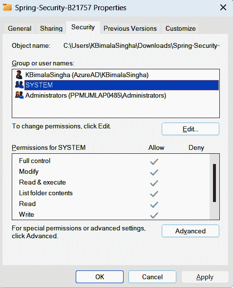
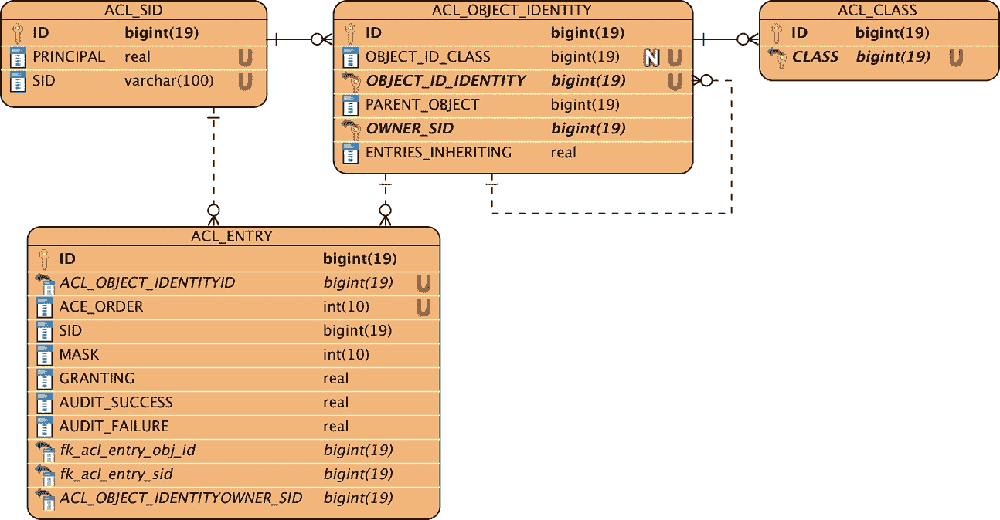
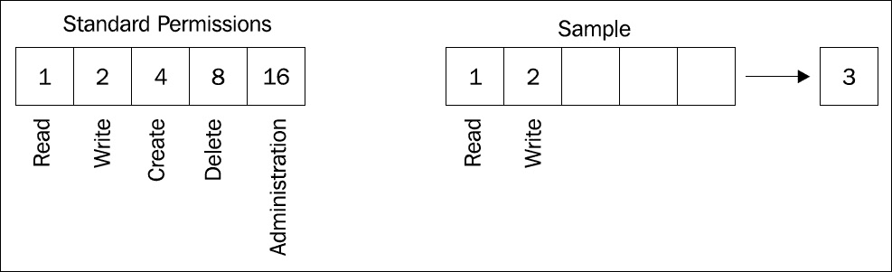
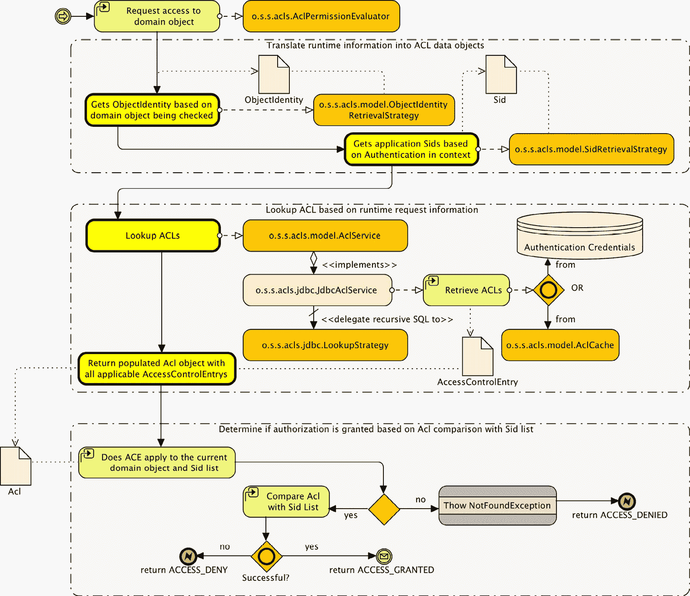
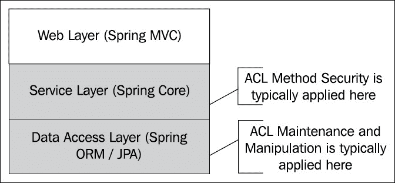

# 第十二章：访问控制列表

在本章中，我们将讨论复杂主题 **访问控制列表**（**ACLs**），它可以提供丰富的域对象实例级授权模型。Spring Security 随带了一个强大但复杂的 ACL 模块，可以很好地满足从小型到中型实施的需求。

在本章中，我们将涵盖以下主题：

+   理解 ACL 的概念模型

+   检查 Spring Security ACL 模块中 ACL 概念的术语和应用

+   构建和审查支持 Spring ACL 所需的数据库模式

+   配置 **Jim Bob CP 日历**（**JBCP**）日历以使用通过注解和 Spring 容器配置的 ACL-安全业务方法

+   执行高级配置，包括自定义 ACL 权限、启用 ACL 的 **JavaServer Page**（**JSP**）标签检查和方法安全、可变 ACL 和智能缓存

+   检查 ACL 在 ACL 部署中的架构考虑因素和规划场景

本章代码的实际链接在此：[`packt.link/hRby2`](https://packt.link/hRby2)。

# ACL 的概念模块

非网络层安全难题的最后一部分是在业务对象级别应用的安全，位于或低于业务层。这一级别的安全是通过称为 ACL 的技术实现的，或称为 ACLs。用一句话总结 ACL 的目标，ACL 允许根据组、业务对象和逻辑操作的独特组合来指定一组组权限。

例如，JBCP 日历的 ACL 声明可能声明特定用户必须对其自己的事件有写入访问权限。这可以表示如下：

| **用户名** | **组** | **对象** | **权限** |
| --- | --- | --- | --- |
| josh |  | event_01 | 读取，写入 |
|  | 角色用户 | event_123 | 读取 |
|  | 匿名用户 | 任何事件 | 无 |

表 12.1 – 用户 ACL 声明示例

您可以看到这个 ACL 对人类来说非常易于阅读——`josh` 对他自己的事件（`event_01`）有`read`和`write`访问权限；其他注册用户可以读取`josh`的事件，但匿名用户不能。

简而言之，这种规则矩阵就是 ACL 尝试将受保护系统及其业务数据综合成代码、访问检查和元数据的组合。大多数真正的 ACL 启用系统具有极其复杂的 ACL 列表，整个系统可能包含数百万条记录。尽管这听起来令人恐惧地复杂，但通过适当的初步推理和具备能力的安全库的实施，可以使 ACL 管理变得相当可行。

如果你使用基于 Microsoft Windows 或 Unix/Linux 的计算机，你每天都会体验到 ACL 的魔力。大多数现代计算机**操作系统**（**OSs**）将 ACL 指令作为其文件存储系统的一部分，允许基于用户或组、文件或目录和权限的组合进行权限授予。在 Microsoft Windows 中，你可以通过右键单击文件并检查其安全属性（**属性** | **安全**）来查看文件的一些 ACL 能力，如下面的截图所示：



图 12.1 – 使用 Microsoft Windows 的 ACL 能力示例

当你浏览各种组或用户和权限时，你会看到 ACL 的输入组合是可见且直观的。

在本节中，我们探讨了 ACL 的概念模块。在下一节中，我们将继续深入研究 Spring Security 中 ACL 的工作原理。

# Spring Security 中的 ACL

Spring Security 支持通过 ACL 驱动的授权检查，以对受保护系统中个别用户的单个域对象访问进行控制。正如在操作系统文件系统示例中，可以使用 Spring Security ACL 组件来构建业务对象、组或主体的逻辑树结构。请求者和请求者之间权限（继承或显式）的交集用于确定允许的访问。

对于接近 Spring Security ACL 能力的用户来说，其复杂性是很常见的，结合相对缺乏的文档和示例。这种情况由于 ACL 基础设施的设置可能相当复杂，存在许多相互依赖性和对基于 bean 的配置机制的依赖而加剧，这与 Spring Security 的大部分其他部分相当不同（正如我们在设置初始配置时将看到的）。

Spring Security ACL 模块被编写为合理的基线，但打算在功能上大量构建的用户可能会遇到一系列令人沮丧的限制和设计选择，这些限制和设计选择在 Spring Security 早期阶段首次引入时（大部分未得到纠正）。不要让这些限制让你气馁！ACL 模块是嵌入丰富访问控制到你的应用程序的强大方式，并进一步审查和确保用户行为和数据的安全。

在我们深入配置 Spring Security ACL 支持之前，我们需要回顾一些关键术语和概念。

Spring ACL 系统中受保护行为身份的主要单元是`GrantedAuthority`。你构建的 ACL 数据模型中定义的 SID 对象用作确定特定主体允许访问级别的显式和派生访问控制规则的基础。

如果使用 SIDs 在 ACL 系统中定义操作者，那么安全等式的另一半是对受保护对象的定义。单个受保护对象的识别被称为（不出所料）**对象标识**。默认的 Spring ACL 对象标识实现要求在单个对象实例级别定义 ACL 规则，这意味着，如果需要，系统中的每个对象都可以有一个单独的访问规则。

单个访问规则被称为**访问控制条目**（**ACEs**）。ACE 是以下因素的组合：

+   应用该规则的操作者的 SID

+   应用该规则的对象标识

+   应应用于给定 `SID` 和指定对象标识的权限

+   对于给定的 `SID` 和对象标识，是否允许或拒绝指定的权限

Spring ACL 系统的目的是评估每个受保护方法的调用，并确定在方法中操作的对象是否应允许根据适用的 ACEs。适用的 ACEs 在运行时根据调用者和参与的对象进行评估。

Spring Security ACL 在其实现上具有灵活性。尽管本章的大部分内容详细介绍了 Spring Security ACL 模块开箱即用的功能，但请记住，其中许多规则表示默认实现，在许多情况下可以根据更复杂的需求进行覆盖。

Spring Security 使用有用的值对象来表示与这些概念实体相关的数据。以下表格列出了这些对象：

| **ACL** **概念对象** | **Java 对象** |
| --- | --- |
| SID | `o.s.s.acls.model.Sid` |
| 对象标识 | `o.s.s.acls.model.ObjectIdentity` |
| ACL | `o.s.s.acls.model.Acl` |
| ACE | `o.s.s.acls.model.AccessControlEntry` |

表 12.2 – Spring Security ACL Java 对象

让我们通过在 JBCP 日历应用程序中启用 Spring Security ACL 组件的过程来进行一个简单的演示。

# Spring Security ACL 支持的基本配置

虽然我们之前暗示过，在 Spring Security 中配置 ACL 支持需要基于 bean 的配置（确实如此），但如果你选择，你可以在保留更简单的安全 XML 命名空间配置的同时使用 ACL 支持。在本章的剩余示例中，我们将专注于基于 Java 的配置。

## Gradle 依赖项

与大多数章节一样，我们需要添加一些依赖项才能使用本章中的功能。以下是如何检查我们添加的依赖项及其所需情况的列表和注释：

```java
//build.gradle
//Spring ACL
implementation "org.springframework.security:spring-security-acl"
```

一旦更新了你的项目依赖项，我们就可以研究在 JBCP 日历应用程序中实现细粒度权限访问控制的具体实现。

## 定义一个简单的目标场景

我们简单的目标场景是授予 `user2@example.com` 只能访问生日派对活动的读取权限。

所有其他用户将无法访问任何事件。您会注意到这与我们的其他示例不同，因为`user2@example.com`与生日派对事件没有其他关联。

尽管有几种设置 ACL 检查的方法，但我们的偏好是遵循本章方法级注解中使用的基于注解的方法。这很好地抽象了 ACL 的使用，使其远离实际的接口声明，并允许（如果您想）在以后（如果您选择）用非 ACL 的其他东西替换角色声明。

我们将在`CalendarService.getEvents`方法上添加一个注解，该注解根据当前用户对事件的权限来过滤每个事件：

```java
//src/main/java/com/packtpub/springsecurity/service/CalendarService.java
@PostFilter("hasPermission(filterObject, 'read')")
List<Event> getEvents();
```

重要提示

您应该从`chapter12.00-calendar`的代码开始。

## 将 ACL 表添加到 H2 数据库

我们首先需要做的是在我们的内存 H2 数据库中添加所需的表和数据，以支持持久的 ACL 条目。为此，我们将添加一个新的 SQL `schema.sql`。我们将在本章后面详细说明这些文件。

我们已经包含了一个`schema.sql`文件，该文件与本章源代码一起提供，基于 Spring Security 参考的*附录*中的*附加* *参考资料*：

```java
// src/main/resources/schema.sql
--- ACLs ----------------------------------------
-- ACL Schema --
create table acl_sid (
  id bigint generated by default as identity(start with 23) not null primary key,
  principal boolean not null,
  sid varchar_ignorecase(100) not null,
  constraint uk_acl_sid unique(sid,principal) );
create table acl_class (
  id bigint generated by default as identity(start with 100) not null primary key,
  class varchar_ignorecase(500) not null,
  constraint uk_acl_class unique(class) );
create table acl_object_identity (
  id bigint generated by default as identity(start with 33) not null primary key,
  object_id_class bigint not null,
  object_id_identity bigint not null,
  parent_object bigint,
  owner_sid bigint not null,
  entries_inheriting boolean not null,
  constraint uk_acl_objid unique(object_id_class,object_id_identity),
  constraint fk_acl_obj_parent foreign key(parent_object)references acl_object_identity(id),
  constraint fk_acl_obj_class foreign key(object_id_class)references acl_class(id),
  constraint fk_acl_obj_owner foreign key(owner_sid)references acl_sid(id) );
create table acl_entry (
  id bigint generated by default as identity(start with 100) not null primary key,
  acl_object_identity bigint not null,
  ace_order int not null,
  sid bigint not null,
  mask integer not null,
  granting boolean not null,
  audit_success boolean not null,
  audit_failure boolean not null,
  constraint uk_acl_entry unique(acl_object_identity,ace_order),
  constraint fk_acl_entry_obj_id foreign key(acl_object_identity)
  references acl_object_identity(id),
  constraint fk_acl_entry_sid foreign key(sid) references acl_sid(id) );
-- the end --
```

上述代码将导致以下数据库模式：



图 12.2 – ACL 数据库模式

您可以看到`SIDs`、`OBJECT_IDENTITY`和`ACEs`的概念如何直接映射到数据库模式。从概念上讲，这是方便的，因为我们可以直接将我们对 ACL 系统的心理模型及其执行方式映射到数据库。

如果您已经将此与 Spring Security 文档中提供的 H2 数据库模式进行了交叉引用，您会注意到我们对一些常见问题进行了调整。具体如下：

+   将`ACL_CLASS.CLASS`列的长度从默认值`100`更改为`500`字符。一些长而完全限定的类名无法放入`100`个字符内。

+   使用有意义的名称命名外键，以便更容易诊断故障。

如果您使用的是其他数据库，例如 Oracle，您必须将 DDL 翻译成您数据库特定的 DDL 和数据类型。

一旦我们配置了 ACL 系统的其余部分，我们将返回数据库以设置一些基本的 ACEs，以证明 ACL 功能在最原始的形式。

## 配置 SecurityExpressionHandler

我们需要配置`@EnableMethodSecurity`以启用注解（我们将根据预期的 ACL 权限进行注解）并引用一个自定义访问决策管理器。

我们还需要提供一个`o.s.s.access.expression.SecurityExpressionHandler`实现，该实现了解如何评估权限。更新您的`SecurityConfig.java`配置，如下所示：

```java
//src/main/java/com/packtpub/springsecurity/configuration/SecurityConfig.java
@Configuration
@EnableWebSecurity
@EnableMethodSecurity(securedEnabled = true)
public class SecurityConfig {
    @Bean
    public SecurityFilterChain filterChain(HttpSecurity http) throws Exception {
        http.authorizeHttpRequests( authz -> authz
// NOTE: "/events/" is now protected by ACL:
//.requestMatchers(antMatcher("/events/")).hasRole("ADMIN")
...
        return http.build();
    }
}
```

这是一个对我们在 `AclConfig.java` 文件中定义的 `DefaultMethodSecurityExpressionHandler` 对象的 bean 引用，如下所示：

```java
//src/main/java/com/packtpub/springsecurity/configuration/AclConfig.java
   @Bean
   public DefaultMethodSecurityExpressionHandler expressionHandler(){
       DefaultMethodSecurityExpressionHandler dmseh = new DefaultMethodSecurityExpressionHandler();
       dmseh.setPermissionEvaluator(permissionEvaluator());
       dmseh.setPermissionCacheOptimizer(permissionCacheOptimizer());
       return dmseh;
   }
```

即使是相对简单的 ACL 配置，正如我们在我们的场景中所做的那样，也有许多必需的依赖项需要设置。正如我们之前提到的，Spring Security ACL 模块自带了许多组件，您可以将它们组装起来以提供一套合理的 ACL 功能。

## `AclPermissionCacheOptimizer` 对象

`DefaultMethodSecurityExpressionHandler` 对象有两个依赖项。`AclPermissionCacheOptimizer` 对象用于使用单个 JDBC 选择语句为对象集合中的所有 ACL 预填充缓存。本章中包含的相对简单的配置可以按以下方式进行检查：

```java
//src/main/java/com/packtpub/springsecurity/configuration/AclConfig.java @Bean
@Bean
public AclPermissionCacheOptimizer permissionCacheOptimizer(MutableAclService aclService){
    return new AclPermissionCacheOptimizer(aclService);
}
```

## 优化 AclPermission 缓存

`DefaultMethodSecurityExpressionHandler` 对象随后委托给一个 `PermissionEvalulator` 实例。在本章的目的上，我们使用 ACL，因此我们将使用 `AclPermissionEvaluator`，它将读取我们在数据库中定义的 ACL。您可以查看提供的 `permissionEvaluator` 配置，如下所示：

```java
//src/main/java/com/packtpub/springsecurity/configuration/AclConfig.j ava
@Bean
public AclPermissionEvaluator permissionEvaluator(MutableAclService aclService){
    return new AclPermissionEvaluator(aclService);
}
```

## `JdbcMutableAclService` 对象

到目前为止，我们已经两次看到了带有 `aclService` ID 的 `th` 的引用。`aclService` ID 解析为 `o.s.s.acls.model.AclService` 的一个实现，该实现通过委托负责将关于由 ACL 保护的对象的信息转换为预期的 ACE：

```java
//src/main/java/com/packtpub/springsecurity/configuration/AclConfig.j ava
@Bean
public MutableAclService aclService(LookupStrategy lookupStrategy, SpringCacheBasedAclCache aclCache){
    return new JdbcMutableAclService(dataSource,
                lookupStrategy,
                aclCache);
}
```

我们将使用 `o.s.s.acls.jdbc.JdbcMutableAclService`，这是 `o.s.s.acls.model.AclService` 的默认实现。这个实现自带，并且已经准备好使用我们在本练习的最后一步中定义的模式。`JdbcMutableAclService` 对象将使用递归 SQL 和后处理来理解对象和 `SID` 层次结构，并确保这些层次结构的表示被传递回 `AclPermissionEvaluator`。

## `BasicLookupStrategy` 类

`JdbcMutableAclService` 类使用与嵌入式数据库声明中定义的相同的 JDBC `dataSource` 实例，并且它还委托给 `o.s.s.acls.jdbc.LookupStrategy` 的一个实现，该实现负责实际执行数据库查询并解决对 ACL 的请求。Spring Security 供应的唯一 `LookupStrategy` 实现是 `o.s.s.acls.jdbc.BasicLookupStrategy`，其定义如下：

```java
//src/main/java/com/packtpub/springsecurity/configuration/AclConfig.j ava
@Bean
 public LookupStrategy lookupStrategy(AclCache aclCache,
                AclAuthorizationStrategy aclAuthorizationStrategy, ConsoleAuditLogger consoleAuditLogger){
     return new BasicLookupStrategy(
                  dataSource,
                  aclCache,
                  aclAuthorizationStrategy,
                  consoleAuditLogger);
 }
```

现在，`BasicLookupStrategy` 是一个相对复杂的实体。记住，它的目的是将需要保护的 `ObjectIdentity` 声明列表转换为数据库中的实际、适用的 ACE 列表。

由于 `ObjectIdentity` 声明可能是递归的，这证明是一个相当具有挑战性的问题，一个可能会经历大量使用的系统应该考虑 SQL 的性能影响，这些 SQL 是为了性能而生成的。

### 使用最低公倍数进行查询

注意，`BasicLookupStrategy`旨在通过严格遵循`left [outer] joins`与所有数据库兼容。一些较旧的数据库不支持这种连接语法，因此，请确保验证 SQL 的语法和结构与你所使用的数据库兼容！

当然，还有许多更有效的基于数据库的方法来使用非标准 SQL 执行分层查询，例如 Oracle 的`CONNECT BY`语句和许多其他数据库（包括 PostgreSQL 和 Microsoft SQL Server）的**公共表表达式**（**CTE**）功能。

就像你在*第四章*的示例中学习的那样，*基于 JDBC 的认证*，使用自定义模式为`JdbcDaoImpl`实现`UserDetailsService`属性暴露出来，以便配置`BasicLookupStrategy`使用的 SQL。查阅 Javadoc 和源代码本身，以了解它们是如何使用的，以便正确应用于你的自定义模式。

我们可以看到`LookupStrategy`需要一个引用与`AclService`使用的相同 JDBC `dataSource`实例。其他三个引用几乎带我们到达依赖链的尽头。

### AclCache 接口

`o.s.s.acls.model.AclCache`接口声明了一个用于缓存`ObjectIdentity`到 ACL 映射的接口，以防止冗余（且昂贵）的数据库查找。Spring Security 支持`JCache (JSR-107)`的任何实现。

例如，为了启用对开源、基于内存和磁盘的缓存库`Ehcache`的支持，该库在许多开源和商业 Java 产品中得到广泛使用，你需要添加以下 Gradle 依赖项：

```java
//build.gradle
//Enabling Ehcache support
implementation "org.ehcache:ehcache"
```

我们将通过更新`AclConfig.java`中的配置来在我们的示例中设置`ConcurrentMapCache`：

```java
//src/main/java/com/packtpub/springsecurity/configuration/AclConfig.java
@Bean
public AclCache aclCache( Cache concurrentMapCache,
       PermissionGrantingStrategy permissionGrantingStrategy, AclAuthorizationStrategy aclAuthorizationStrategy){
    return new SpringCacheBasedAclCache(concurrentMapCache,
          permissionGrantingStrategy,
          aclAuthorizationStrategy);
}
@Bean
public PermissionGrantingStrategy permissionGrantingStrategy(){
    return new DefaultPermissionGrantingStrategy(consoleAuditLogger());
}
@Bean
public ConcurrentMapCache concurrentMapCache(){
    return new ConcurrentMapCache("aclCache");
}
@Bean
public CacheManager cacheManager(){
    return new ConcurrentMapCacheManager();
}
```

### ConsoleAuditLogger 类

接下来，与`o.s.s.acls.jdbc.BasicLookupStrategy`相关的简单依赖项是一个`o.s.s.acls.domain.AuditLogger`接口的实现，该接口被`BasicLookupStrategy`类用于审计 ACL 和 ACE 查找。类似于`AclCache`接口，Spring Security 只提供了一个实现，它只是简单地记录到控制台。我们将通过另一行 bean 声明来配置它：

```java
//src/main/java/com/packtpub/springsecurity/configuration/AclConfig.j ava
@Bean
public ConsoleAuditLogger consoleAuditLogger(){
    return new ConsoleAuditLogger();
}
```

### AclAuthorizationStrategyImpl 接口

需要解决的最后一个依赖项是实现`o.s.s.acls.domain.AclAuthorizationStrategy`接口，这个接口在从数据库加载 ACL 时实际上没有任何直接责任。相反，该接口的实现负责确定是否允许对 ACL 或 ACE 的运行时更改，这取决于更改的类型。

我们将在稍后当我们介绍可变 ACLs 时进一步解释这一点，因为逻辑流程既有些复杂，又与完成我们的初始配置不相关。最终的配置要求如下：

```java
//src/main/java/com/packtpub/springsecurity/configuration/AclConfig.j ava
@Bean
public AclAuthorizationStrategy aclAuthorizationStrategy() {
    return new AclAuthorizationStrategyImpl(
            new SimpleGrantedAuthority("ROLE_ADMINISTRATOR")
    );
}
```

你可能会想知道对具有`adminAuthority` ID 的 bean 的引用是为什么——`AclAuthorizationStrategyImpl`提供了指定`GrantedAuthority`的能力，这是在运行时对可变 ACL 执行特定操作所必需的。我们将在本章后面介绍这些内容。

我们终于完成了 Spring Security ACL 实现的初始配置。接下来的最后一步需要我们在 H2 数据库中插入一个简单的 ACL 和 ACE，并对其进行测试！

## 创建简单的 ACL 条目

回想一下，我们的非常简单的场景是仅允许`user2@example.com`访问生日派对活动，并确保其他活动不可访问。

你可能需要参考数据库模式图（**图 12**.2）的几页，以了解我们正在插入哪些数据以及为什么。

我们已经在示例应用程序中包含了一个名为`data.sql`的文件。

本节中解释的所有 SQL 都将来自文件——你可以自由地实验并基于我们提供的示例 SQL 添加更多测试用例。实际上，我们鼓励你使用示例数据进行实验！

让我们看看创建简单 ACL 条目的以下步骤：

1.  首先，我们需要用任何或所有具有 ACL 规则的域对象类填充`ACL_CLASS`表，在我们的例子中，这仅仅是我们的`Event`类：

```java
//src/main/resources/data.sql
insert into acl_class (id, class) values (10, 'com.packtpub.springsecurity.domain.Event');
```

我们选择使用`ACL_CLASS`表的 10 到 19 之间的主键，`ACL_SID`表的 20 到 29 之间，依此类推。

这将有助于更容易地理解哪些数据与哪些表相关联。请注意，我们的`Event`表以`100`为主键。这些便利性是为了示例目的而做的，并不建议用于生产目的。

1.  接下来，`ACL_SID`表被注入了将与 ACE 关联的 SIDs。记住，SIDs 可以是角色或用户——我们在这里填充角色和`user2@example.com`。

1.  虽然角色的 SID 对象很简单，但用户的 SID 对象并不那么明确。在我们的用途中，用户名用于 SID。要了解更多关于如何解析角色和用户的 SIDs 的信息，请参考`o.s.s.acls.domain.SidRetrievalStrategyImpl`。如果默认值不符合你的需求，可以将自定义的`o.s.s.acls.model.SidRetrievalStrategy`默认值注入到`AclPermissionCacheOptimizer`和`AclPermissionEvaluator`中。在我们的例子中，我们不需要这种定制，但了解它在必要时是可用的总是好的：

```java
//src/main/resources/data.sql
-- User specific:
insert into acl_sid (id, principal, sid) values (20, true, 'user2@example.com');
-- Role specific:
insert into acl_sid (id, principal, sid) values (21, false, 'ROLE_USER');
insert into acl_sid (id, principal, sid) values (22, false, 'ROLE_ADMIN');
```

开始变得复杂的是`ACL_OBJECT_IDENTITY`表，它用于声明单个域对象实例、其父对象（如果有）以及拥有`SID`。

例如，这个表代表我们正在保护的对象`Event`。我们将插入具有以下属性的一行：

+   一个`Event`类型的域对象，它是通过`OBJECT_ID_CLASS`列指向我们的`ACL_CLASS`表的外键，值为`10`。

+   一个域对象的`100`（`OBJECT_ID_IDENTITY`列）主键。这是一个外键（尽管不是通过数据库约束强制执行）到我们的`Event`对象。

+   `user2@example.com`的`SID`所有者，这是一个外键，通过`OWNER_SID`列指向`ACL_SID`，其值为`20`。

表示具有 ID 为`100`（生日事件）、`101`和`102`的事件的 SQL 语句如下：

```java
//src/main/resources/data.sql
-- object identity
-- Event entry for user2 SID
insert into acl_object_identity (id,object_id_identity,object_id_class,parent_object,owner_sid,entries_inheriting)
values (30,100, 10, null, 20, false);
-- Event entry for ROLE_USER SID
insert into acl_object_identity (id,object_id_identity,object_id_class,parent_object,owner_sid,entries_inheriting)
values (31,101, 10, null, 21, false);
-- Event entry for ROLE_ADMIN SID
insert into acl_object_identity (id,object_id_identity,object_id_class,parent_object,owner_sid,entries_inheriting)
values (32,102, 10, null, 21, false);
```

请记住，拥有`SID`的所有者也可能代表一个角色——这两种类型的规则在 ACL 系统中都同样有效。

最后，我们将添加一个与该对象实例相关的 ACE，声明`user2@example.com`被允许读取生日事件的访问权限：

```java
//src/main/resources/data.sql
-- ACEntry list ---------------------------------
-- mask == R
-- Entry for Event entry for user2 SID
insert into acl_entry (acl_object_identity, ace_order, sid, mask, granting, audit_success, audit_failure)
values(30, 1, 20, 1, true, true, true);
```

这里的`MASK`列代表一个位掩码，用于在相关对象上授予指定`SID`的权限。我们将在本章后面详细解释这一点——不幸的是，它可能不像听起来那么有用。

现在，我们可以启动应用程序并运行我们的示例场景。尝试使用`user2@example.com/user2`登录并访问**所有事件**页面。你会看到只有生日事件被列出。

当以`admin1@example.com/admin1`登录并查看**所有事件**页面时，不会显示任何事件。

然而，如果我们直接导航到一个事件，它将不会受到保护。你能根据本章所学的内容想出如何确保直接访问一个事件的方法吗？

如果你还没有想出来，你可以通过以下方式更新`CalendarService.java`来确保直接访问一个事件：

```java
//src/main/java/com/packtpub/springsecurity/service/CalendarService.java
@PostAuthorize("hasPermission(filterObject, 'read') ")
Event getEvent(int eventId);
```

现在我们已经有一个基于 ACL 的安全的基本工作设置（尽管，场景非常简单）。

让我们继续解释我们在这次演练中看到的一些概念，然后回顾一下典型的 Spring ACL 实现中的一些考虑事项，在使用它之前你应该考虑这些事项。

重要注意事项

你应该从`chapter12.01-calendar`的代码开始。

值得注意的是，我们在创建事件时没有创建新的 ACL 条目。因此，在当前状态下，如果你创建一个事件，你将收到一个类似于以下错误的错误：

```java
Exception during execution of Spring Security application! Unable to find ACL information for object identity 'org.springframework.security.acls.domain.ObjectIdentityImpl[Type: com.packtpub.springsecurity.domain.Event; Identifier: 1]'
```

在检查创建简单 ACL 条目的过程之后，我们现在深入理解权限如何运作，重点关注高级 ACL 配置。

# 高级 ACL 主题

我们在配置 ACL 环境时略过的一些高级主题与 ACE 权限和`GrantedAuthority`指示器的使用有关，这些指示器有助于 ACL 环境确定是否允许某些类型的 ACL 运行时更改。现在我们有了工作环境，我们将回顾这些更高级的主题。

## 权限如何工作

权限不过是整数中由位表示的单个逻辑标识符。ACE 基于位掩码授予`SIDs`权限，该位掩码包含所有适用于该 ACE 的权限的逻辑或。

默认权限实现 `o.s.s.acls.domain.BasePermission` 定义了一系列表示常见 ACL 授权动词的整数值。这些整数值对应于整数中设置的单一位，因此 `BasePermission` 的 `WRITE` 值为 `1` 的位运算值为 `21` 或 `2`。

这些在以下图中进行了说明：



图 12.3 – 默认和自定义权限掩码

我们可以看到，由于将 `Read` 和 `Write` 权限应用于权限值，`Sample` 权限掩码将具有整数值 `3`。

在前面图中展示的所有标准整数单一权限值都在 `BasePermission` 对象中定义为静态常量。

包含在 `BasePermission` 中的逻辑常量只是 ACE 中常用权限的合理基线，在 Spring Security 框架中没有任何语义意义。对于非常复杂的 ACL 实现，发明自己的自定义权限是很常见的，这些权限补充了最佳实践示例，并依赖于领域或业务依赖性。

用户经常混淆的一个问题是，在实际应用中位掩码是如何使用的，因为许多数据库要么不支持位逻辑，要么不支持可扩展的方式。Spring ACL 旨在通过将计算与位掩码相关的适当权限的负载更多地放在应用程序上而不是数据库上来解决这个问题。

审查解析过程是很重要的，我们可以看到 `AclPermissionEvaluator` 是如何将方法本身上声明的权限（在我们的例子中，使用 `@PostFilter` 注解）解析为实际的 ACL 权限的。

下图展示了 Spring ACL 对声明权限与请求主体相关的相关 ACE 进行评估的过程：



图 12.4 – Spring ACL 权限评估过程

我们可以看到，`AclPermissionEvaluator` 依赖于实现两个接口的类，即 `o.s.s.acls.model.ObjectIdentityRetrievalStrategy` 和 `o.s.s.acls.model.SidRetrievalStrategy`，以检索适合授权检查的 `ObjectIdentity` 和 SIDs。关于这些策略需要注意的是，默认实现类实际上是如何根据授权检查的上下文来确定要返回的 `ObjectIdentity` 和 SIDs 对象的。

`ObjectIdentity` 对象有两个属性，`type` 和 `identifier`，它们是从运行时检查的对象派生出来的，并用于声明 ACE 条目。默认的 `ObjectIdentityRetrievalStrategy` 接口使用完全限定的类名来填充 `type` 属性。`identifier` 属性则填充了在实际对象实例上调用具有 `Serializable getId()` 签名的方 法的结果。

由于你的对象不需要实现接口以与 ACL 检查兼容，因此对于实现具有特定签名的方法的必要性可能会让实现 Spring Security ACL 的开发者感到惊讶。请提前规划并确保你的域对象包含此方法！你也可以实现自己的`ObjectIdentityRetrievalStrategy`类（或实现现成的子类）来调用你选择的方法。不幸的是，该方法的名字和类型签名是无法配置的。

不幸的是，`AclImpl`的实际实现直接比较了我们`@PostFilter`注解中指定的权限和数据库中 ACE 上存储的权限，而没有使用位运算逻辑。在声明具有权限组合的用户时，你需要注意，要么必须配置`AclEntryVoter`以包含所有权限组合，或者 ACE 需要忽略权限字段旨在存储多个值的事实，并改为每个 ACE 存储单个权限。

如果你想要通过我们的简单场景验证这一点，将授予`user2@example.com` SID 的`READ`权限更改为`读和写`的位掩码组合，这相当于值`3`。这将更新到`data.sql`文件中，如下所示：

```java
//src/main/resources/data.sql
-- READ / WRITE Entry for Event entry for user2 SID
insert into acl_entry
(acl_object_identity, ace_order, sid, mask, granting, audit_success, audit_failure)
values(30, 1, 20, 3, true, true, true);
```

重要提示

你应该从`chapter12.02-calendar`的代码开始。

## 自定义 ACL 权限声明

如前所述，在权限声明讨论中，权限不过是整数位值的逻辑名称。因此，可以扩展`o.s.s.acls.domain.BasePermission`类并声明你自己的权限。在这里，我们将涵盖一个非常直接的场景，其中我们创建一个新的 ACL 权限，称为`ADMIN_READ`。

这是一个仅授予管理用户的权限，并将分配以保护只有管理员才能读取的资源。尽管这是一个针对 JBCP 日历应用的虚构示例，但这种自定义权限的使用在处理**个人身份信息**（**PII**）的情况中相当常见（例如，社会保险号等——回想一下我们在*第一章*，*不安全应用程序的解剖*）中讨论了 PII）。

让我们开始进行必要的更改以支持此操作，按照以下步骤操作：

1.  第一步是使用我们的`com.packtpub.springsecurity.acls.domain.CustomPermission`类扩展`BasePermission`类，如下所示：

    ```java
    package com.packtpub.springsecurity.acls.domain;
    public class CustomPermission extends BasePermission {
        public static final Permission ADMIN_READ = new CustomPermission(1 << 5, 'M'); // 32
        public CustomPermission(int mask, char code) {
            super(mask, code);
        }
    }
    ```

1.  接下来，我们需要配置`o.s.s.acls.domain.PermissionFactory`默认实现，`o.s.s.acls.domain.DefaultPermissionFactory`，以注册我们的自定义权限逻辑值。`PermissionFactory`的作用是将权限掩码解析为逻辑权限值（可以在应用程序的其他区域通过常量值或名称，如`ADMIN_READ`进行引用）。`PermissionFactory`实例要求任何自定义权限都必须注册到其中以进行适当的查找。我们已包含以下配置，如下注册我们的`CustomPermission`类：

    ```java
    //src/main/java/com/packtpub/springsecurity/configuration/AclConfig.java
    @Bean
    public DefaultPermissionFactory permissionFactory(){
        return new DefaultPermissionFactory(CustomPermission.class);
    }
    ```

1.  接下来，我们需要为我们的`BasicLookupStrategy`和`AclPermissionEvaluator`接口覆盖默认的`PermissionFactory`实例，使用自定义的`DefaultPermissionFactory`接口：

    ```java
    //src/main/java/com/packtpub/springsecurity/configuration/AclConf ig.java
    @Bean
    public AclPermissionEvaluator permissionEvaluator(MutableAclService aclService){
            AclPermissionEvaluator pe = new AclPermissionEvaluator(aclService);
            pe.setPermissionFactory(permissionFactory());
            return pe;
    }
    @Bean
    public LookupStrategy lookupStrategy(AclCache aclCache,
           AclAuthorizationStrategy aclAuthorizationStrategy, ConsoleAuditLogger consoleAuditLogger) {
            BasicLookupStrategy lookupStrategy = new BasicLookupStrategy(
                    dataSource,
                    aclCache,
                    aclAuthorizationStrategy,
                    consoleAuditLogger);
            lookupStrategy.setPermissionFactory(permissionFactory());
            return lookupStrategy;
    }
    ```

1.  我们还需要添加 SQL 查询以利用新的权限，允许访问会议电话（`acl_object_identity ID 为 31`）事件给`admin1@example.com`。请在`data.sql`中进行以下更新：

    ```java
    -- custom permission
    insert into acl_sid (id, principal, sid) values (23, true, 'admin1@example.com');
    insert into acl_entry
    (acl_object_identity, ace_order, sid, mask, granting, audit_success, audit_failure)
    values(31, 1, 23, 32, true, true, true);
    ```

    我们可以看到新的整数掩码值`32`已在 ACE 数据中引用。这有意对应于我们在 Java 代码中定义的新`ADMIN_READ ACL`权限。会议电话事件通过其在`ACL_OBJECT_IDENTITY`表中的主键（存储在`object_id_identity`列中）值`31`进行引用。

1.  最后一步是更新我们的`CalendarService`的`getEvents()`方法，以便利用我们新的权限，如下所示：

```java
@PostFilter("hasPermission(filterObject, 'read') " +
       "or hasPermission(filterObject, 'admin_read')")
List<Event> getEvents()
```

在所有这些配置到位后，我们可以再次启动网站并测试自定义 ACL 权限。根据我们配置的样本数据，以下是当各种可用用户点击类别时应该发生的情况：

| **用户名/密码** | **生日派对活动** | **会议电话活动** | **其他活动** |
| --- | --- | --- | --- |
| `user2@example.com/user2` | 通过`READ`允许 | 拒绝 | 拒绝 |
| `admin1@example.com/admin1` | 拒绝 | 通过`ADMIN_READ`允许 | 拒绝 |
| `user1@example.com/user1` | 拒绝 | 拒绝 | 拒绝 |

表 12.3 – 用户 ACL Java 对象

我们可以看到，即使使用我们简单的情况，我们现在已经能够以非常有限的方式扩展 Spring ACL 功能，以展示这个细粒度访问控制系统的能力。

重要提示

您应该从`chapter12.03-calendar`的代码开始。

## 启用 ACL 权限评估

在*第二章*《Spring Security 入门》中，我们了解到 Spring Security JSP 标签库提供了向用户暴露与认证相关的数据以及根据各种规则限制用户可见性的功能。到目前为止，在这本书中，我们使用了建立在 Spring Security 之上的`Thymeleaf Security 标签库`。

同样的标签库也可以直接与一个 ACL 启用的系统交互！从我们的简单实验中，我们已经在主页列表的前两个类别周围配置了一个简单的 ACL 授权场景。让我们看看以下步骤，学习如何在我们的 Thymeleaf 页面中启用 ACL 权限评估：

1.  首先，我们需要从我们的`CalendarService`接口中的`getEvents()`方法移除`@PostFilter`注解，以便让我们的 JSP 标签库有机会过滤掉不允许显示的事件。现在就移除`@PostFilter`注解，如下所示：

    ```java
    // src/main/java/com/packtpub/springsecurity/service/ CalendarService.java
    List<Event> getEvents();
    ```

1.  现在我们已经移除了`@PostFilter`，我们可以利用`<sec:authorize-acl>`标签来隐藏用户实际上没有访问权限的事件。参考前一个章节中的表格，以刷新我们对已配置的访问规则的了解！

1.  我们将使用`<sec:authorize-acl>`标签包装每个事件的显示，声明要检查显示对象上的权限列表：

    ```java
    //src/main/resources/templates/events/list.xhtml
    <th:block th:each="event : ${events}">
        <tr sec:authorize-acl="${event} :: '1,32'" >
            <td th:text="${#calendars.format(event.dateWhen, 'yyyy-MM-dd HH:mm')}">today</td>
            <td th:text="${event.owner.name}">Chuck Norris</td>
            <td th:text="${event.attendee.name}">Josh Knutson</td>
            <td><a th:href="@{'/events/{id}'(id=${event.id})}" th:text="${event.summary}">-1</a></td>
        </tr>
    </th:block>
    ```

1.  仔细思考一下我们在这里想要实现的目标——我们希望用户只能看到他们实际具有`READ`或`ADMIN_READ`（我们的自定义权限）访问权限的项目。然而，为了使用标签库，我们需要使用权限掩码，这可以从以下表中引用：

| **名称** | **掩码** |
| --- | --- |
| `READ` | 1 |
| `WRITE` | 2 |
| `ADMIN_READ` | 32 |

表 12.4 – 权限掩码表

在幕后，标签实现使用了之前在本章中讨论过的相同的`SidRetrievalStrategy`和`ObjectIdentityRetrievalStrategy`接口。因此，访问检查的计算遵循与 ACL 启用的方法安全性投票相同的流程。正如我们一会儿将看到的，标签实现也将使用相同的`PermissionEvaluator`。

我们已经通过带有引用`DefaultMethodSecurity` **ExpressionHandler**的`expressionHandler`元素的`@EnableMethodSecurity`注解启用了我们的`@EnableMethodSecurity`。`DefaultMethodSecurityExpressionHandler`实现了解我们的`AclPermissionEvaluator`接口，但我们必须也让 Spring Security 的 Web 层了解`AclPermissionEvalulator`。如果你这么想，这种对称性是有意义的，因为保护方法和 HTTP 请求是在保护两种非常不同的资源。幸运的是，Spring Security 的抽象使得这一点相当简单。

5. 添加一个引用 ID 为`permissionEvaluator`的`DefaultWebSecurityExpressionHandler`处理器，因为我们已经定义了该 bean：

```java
//src/main/java/com/packtpub/springsecurity/configuration/AclConfig.java
@Bean
public DefaultWebSecurityExpressionHandler webExpressionHandler(AclPermissionEvaluator permissionEvaluator){
    DefaultWebSecurityExpressionHandler webExpressionHandler = new DefaultWebSecurityExpressionHandler();
    webExpressionHandler.setPermissionEvaluator(permissionEvaluator);
    return webExpressionHandler;
}
```

你可以看到这些步骤与我们添加对方法安全性的权限处理支持的方式非常相似。这次，它稍微简单一些，因为我们能够重用具有`PermissionEvaluator` ID 的同一个 bean，我们之前已经配置了它。

启动我们的应用程序并尝试访问`@PostFilter`注解。

我们仍然意识到，直接访问事件会允许用户看到它。然而，这可以通过结合你在本章中学到的内容以及关于本章中`@PostAuthorize`注解的内容轻松实现。

重要提示

你应该从`chapter12.04-calendar`的代码开始。

## 可变 ACL 和授权

虽然 JBCP 日历应用没有实现完整的用户管理功能，但你的应用很可能会有一些常见功能，例如新用户注册和行政用户维护。到目前为止，这些功能的缺失——我们通过在应用启动时使用 SQL 插入来解决这个问题——并没有阻止我们展示 Spring Security 和 Spring ACL 的许多功能。

然而，正确处理声明 ACL 的运行时更改，或者系统中用户的添加或删除，对于维护基于 ACL 的授权环境的一致性和安全性至关重要。Spring ACL 通过可变 ACL 的概念（`o.s.s.acls.model.MutableAcl`）解决了这个问题。

扩展标准 ACL 接口，`MutableAcl`接口允许在运行时操作 ACL 字段以更改特定 ACL 的内存表示。这项附加功能包括创建、更新或删除 ACE、更改 ACL 所有权以及其他有用功能。

因此，我们可能期望 Spring ACL 模块能够直接提供一种将运行时 ACL 更改持久化到 JDBC 数据存储的方式，确实如此。`o.s.s.acls.jdbc.JdbcMutableAclService`类可以用来在数据库中创建、更新和删除`MutableAcl`实例，以及进行 ACL 的其他支持表的常规维护（处理`SIDs`、`ObjectIdentity`和域对象类名）。

回想本章前面的内容，`AclAuthorizationStrategyImpl`类允许我们指定对可变 ACL 的操作的管理角色。这些作为 bean 配置的一部分提供给构造函数。构造函数参数及其含义如下：

| **参数编号** | **功能** |
| --- | --- |
| 1 | 它表示主体在运行时对 ACL 保护对象拥有所有权的权限 |
| 2 | 它表示主体在运行时更改 ACL 保护对象的审计所需的权限 |
| 3 | 它表示主体在运行时对 ACL 保护对象进行任何其他类型的更改（创建、更新和删除）所需的权限 |

表 12.5 – AclAuthorizationStrategyImpl 构造函数的参数

可能会让人困惑的是，当我们列出了三个参数时，我们只指定了一个构造函数参数。`AclAuthorizationStrategyImpl` 类也可以接受一个 `GrantedAuthority`，然后它将被用于所有三个参数。如果我们想对所有操作使用相同的 `GrantedAuthority`，这将很方便。

`JdbcMutableAclService` 接口包含许多用于在运行时操作 ACL 和 ACE 数据的方法。虽然这些方法本身相当容易理解（`createAcl`、`updateAcl` 和 `deleteAcl`），但即使是高级 Spring Security 用户，正确配置和使用 `JdbcMutableAclService` 也往往很困难。

让我们修改 `CalendarService` 以为新创建的事件创建一个新的 ACL。

目前，如果用户创建了一个新事件，它将不会在 `<sec:authorize-acl>` 标签中对该用户可见，该标签仅显示用户有权访问的事件对象。让我们更新我们的 `DefaultCalendarService` 接口，以便当用户创建一个新事件时，他们被授予对该事件的读取访问权限，并且它将在他们的 **所有事件** 页面上显示。

让我们看看以下步骤，以将 ACL 添加到新创建的事件中：

1.  第一步是更新我们的构造函数以接受 `MutableAclService` 和 `UserContext`：

    ```java
    //src/main/java/com/packtpub/springsecurity/service/ DefaultCalendarService.java
    @Repository
    public class DefaultCalendarService implements CalendarService {
        private final EventDao eventDao;
        private final CalendarUserDao userDao;
        private final MutableAclService aclService;
        private final UserContext userContext;
        public DefaultCalendarService(EventDao eventDao, CalendarUserDao userDao, MutableAclService aclService, UserContext userContext) {
           this.eventDao = eventDao;
           this.userDao = userDao;
           this.aclService = aclService;
           this.userContext = userContext;
        }
    ```

1.  然后，我们需要更新我们的 `createEvent` 方法，以便为当前用户创建 ACL。进行以下更改：

    ```java
    //src/main/java/com/packtpub/springsecurity/service/ DefaultCalendarService.java
    @Transactional
    @Override
    public int createEvent(Event event) {
        int result = eventDao.createEvent(event);
        event.setId(result);
        // Add new ACL Entry:
        MutableAcl acl = aclService.createAcl(new ObjectIdentityImpl(event));
        PrincipalSid sid = new PrincipalSid(userContext.getCurrentUser().getEmail());
        acl.setOwner(sid);
        acl.insertAce(0,  BasePermission.READ, sid, true);
        aclService.updateAcl(acl);
        return result;
    }
    ```

1.  `JdbcMutableAclService` 接口使用当前用户作为创建的 `MutableAcl` 接口的默认所有者。我们选择再次显式设置所有者，以演示如何覆盖此设置。

1.  然后，我们添加一个新的 ACE 并保存我们的 ACL。就这么简单。

1.  启动应用程序并使用 `user1@example.com/user1` 登录。

1.  访问 **所有事件** 页面，并查看目前没有列出任何事件。然后创建一个新事件，下次您访问 **所有事件** 页面时，它将显示出来。如果您以任何其他用户登录，该事件将不会在 **所有** **事件** 页面上可见。

    然而，由于我们没有对其他页面应用安全措施，它可能会对用户可见。我们再次鼓励您尝试自己保护这些页面。

重要提示

您应该从 `chapter12.05-calendar` 中的代码开始。

在掌握 Spring Security ACL 的工作原理后，接下来的部分将讨论标准 ACL 部署中需要考虑的因素。

# 典型 ACL 部署的考虑因素

实际上，在真正的业务应用程序中部署 Spring ACL 通常相当复杂。我们通过考虑大多数 Spring ACL 实现场景中出现的考虑因素来结束对 Spring ACL 的介绍。

## ACL 可扩展性和性能建模

对于小型和中型应用，ACL 的添加是相当可控的，尽管它增加了数据库存储和运行时性能的负担，但影响不太可能显著。然而，根据 ACL 和 ACE 建模的粒度，中型到大型应用中的数据库行数可能会非常庞大，甚至可能让经验最丰富的数据库管理员感到压力。

假设我们要将 ACL 扩展到覆盖 JBCP 日历应用的扩展版本。假设用户可以管理账户，将图片发布到事件中，并从事件中管理（添加/删除用户）。我们将数据建模如下：

+   所有用户都有账户。

+   10%的用户能够管理事件。一个用户可以管理的事件的平均数量将是两个。

+   事件将按客户进行保护（只读），但同时也需要由管理员可访问（读/写）。

+   10%的客户将被允许发布图片。每个用户的平均帖子数将是 20。

+   发布的图片将按用户以及管理员进行保护（读/写）。发布的图片对所有其他用户将是只读的。

根据我们对 ACL 系统的了解，我们知道数据库表具有以下可扩展属性：

| **表** | **与数据**一起**扩展** | **可扩展性说明** |
| --- | --- | --- |
| `ACL_CLASS` | 否 | 每个域类需要一个行。 |
| `ACL_SID` | 是（用户） | 每个角色（`GrantedAuthority`）需要一个行。每个用户账户（如果域对象按用户进行保护）需要一个行。 |
| `ACL_OBJECT_IDENTITY` | 是（每个类的域类实例） | 每个受保护域对象的实例需要一个行。 |
| `ACL_ENTRY` | 是（域对象实例的 ACE 条目） | 每个 ACE 需要一个行；可能需要为单个域对象多个行。 |

表 12.6 – 数据库表的可扩展属性

我们可以看到，`ACL_CLASS`实际上没有可扩展性问题（大多数系统将拥有少于 1,000 个域类）。

`ACL_SID`表将根据系统中的用户数量线性扩展。这可能不是一个问题，因为其他与用户相关的表也将以这种方式扩展（用户账户等）。

我们关注的两个表是`ACL_OBJECT_IDENTITY`和`ACL_ENTRY`。如果我们对为单个客户建模订单所需的估计行数进行建模，我们得到以下估计：

| **表** | **每个事件**的 ACL 数据 | **每个图片帖子**的 ACL 数据 |
| --- | --- | --- |
| `ACL_OBJECT_IDENTITY` | 单个事件需要一个行。 | 单个帖子需要一个行。 |
| `ACL 条目` | 三行——一行是所有者（用户 SID）读取访问所需的，两行是管理组 SID 所需的（一行用于读取访问，一行用于写入访问）。 | 四行——一行是用户组 SID 读取访问所需的，一行是所有者写入访问所需的，两行是管理组 SID 所需的（与事件相同）。 |

表 12.7 – 每个事件或发布的图片的可扩展性估计

然后，我们可以从上一页的使用假设中计算出以下 ACL 可扩展性矩阵，如下所示：

| **表/对象** | **缩放因子** | **低估计** | **高估计** |
| --- | --- | --- | --- |
| `用户` |  | `10,000` | `1,000,000` |
| `事件` | `#` `用户` `*` `0.1` `*` `2` | `2,000` | `200,000` |
| `图片帖子` | `#` `用户` `*` `0.1` `*` `20` | `20,000` | `2,000,000` |
| `ACL_SID` | `#` `用户` | `10,000` | `1,000,000` |
| `ACL_OBJECT_IDENTITY` | `#` `事件` `+` `#` `图片帖子` | `220,000` | `2,200,000` |
| `ACL 条目` | `(#` `事件` `*` `3)` `+` `(#` `图片帖子` `*` `4)` | `86,000` | `8,600,000` |

表 12.8 – ACL 可扩展性矩阵

从仅基于典型 ACL 实现可能涉及和受保护的业务对象子集的预测来看，您可以看到，用于存储 ACL 信息的数据库行数可能会与您的实际业务数据成线性（或更快）增长。特别是在大型系统规划中，预测您可能使用的 ACL 数据量非常重要。对于非常复杂的系统来说，有数亿行与 ACL 存储相关的行数并不罕见。

## 不要低估定制开发成本

利用 Spring ACL 安全环境通常需要比我们到目前为止所描述的配置步骤更多的开发工作。我们的示例配置场景有以下局限性：

+   没有提供对事件操作修改或权限修改进行响应的设施。

+   并非所有应用程序都使用权限。例如，**我的事件**页面和直接导航到事件都不是受保护的。

应用程序没有有效地使用 ACL 层次结构。如果我们要将 ACL 安全推广到整个网站，这些局限性将严重影响功能。这就是为什么在计划在应用程序中推广 Spring ACL 时，您必须仔细审查所有处理域数据的位置，并确保这些位置正确更新 ACL、ACE 规则并使缓存失效。通常，方法和数据的安全发生在服务或业务应用层，而维护 ACL 和 ACE 所需的钩子发生在数据访问层。



图 12.6 – Spring ACL 权限评估过程

如果你正在处理一个相对标准的应用程序架构，具有适当的功能隔离和封装，那么很可能存在一个易于识别的中心位置来处理这些更改。另一方面，如果你正在处理一个已经退化（或者一开始就没有设计得很好）的架构，那么在数据操作代码中添加 ACL 功能和支持钩子可能会非常困难。

如前所述，重要的是要记住，Spring ACL 架构自`Acegi 1.x`（Spring Security 的父项目）时代以来并没有发生重大变化。

以下是一些与 Spring ACL 架构最常见和最重要的问题：

+   ACL 基础设施需要一个数字主键。对于使用**全局唯一标识符**（**GUID**）或**通用唯一标识符**（**UUID**）主键的应用程序（由于现代数据库中更有效的支持，这种情况更为常见），这可能是一个重大的限制。

+   在配置 Spring ACL 的方法和 Spring Security 的其他部分之间存在几个不一致之处。一般来说，你可能会遇到一些区域，其中类代理或属性没有通过**依赖注入**（**DI**）公开，这需要一种耗时且昂贵的覆盖和重写策略。

+   权限掩码被实现为一个整数，因此有 32 个可能的位。将默认位分配扩展以表示单个对象属性的权限（例如，分配一个位来读取员工的社保号码）是相当常见的。复杂的部署可能每个域对象有超过 32 个属性，在这种情况下，唯一的替代方案可能是在这个限制下重新设计你的域对象。

根据你的应用程序需求，你可能会遇到更多的问题，特别是关于在实现某些类型的自定义时需要更改的类数量。

## 我应该使用 Spring Security ACL 吗？

正如应用 Spring Security 的细节高度依赖于业务一样，Spring ACL 支持的应用也是如此。事实上，由于它与业务方法和域对象的紧密耦合，ACL 支持往往更是如此。我们希望本指南解释了分析 Spring ACL 以用于你的应用程序所需的重要高级和低级配置和概念，并可以帮助你确定和匹配其实际应用的能力。

# 摘要

在本章中，我们重点介绍了基于 ACL 的安全性和 Spring ACL 模块实现这种类型安全性的具体细节。

我们回顾了 ACLs 的基本概念，以及为什么它们可以成为授权的有效解决方案的许多原因。我们还了解了与 Spring ACL 实现相关的关键概念，包括 ACEs、SIDs 和对象标识。我们检查了支持分层 ACL 系统所需的数据库模式和逻辑设计。我们配置了所有必需的 Spring beans 以启用 Spring ACL 模块，并增强了一个服务接口以使用注解方法授权。

我们随后将数据库中的现有用户和网站本身使用的业务对象与一组示例 ACE 声明和支持数据关联起来。我们回顾了 Spring ACL 权限处理的概念。我们扩展了我们对 Spring Security Thymeleaf 标签库和 SpEL（用于方法安全）的知识，以利用 ACL 检查。

我们讨论了可变 ACL 的概念，并回顾了在可变 ACL 环境中所需的基本配置和自定义编码。我们开发了一个自定义 ACL 权限，并配置了应用程序以展示其有效性。我们配置并分析了使用`Spring`缓存管理器以减少 Spring ACL 对数据库的影响。我们分析了在复杂业务应用程序中使用 Spring ACL 系统的影响和设计考虑因素。

这就结束了我们对 Spring Security ACLs 的讨论。在下一章中，我们将进一步探讨 Spring Security 的工作原理。
