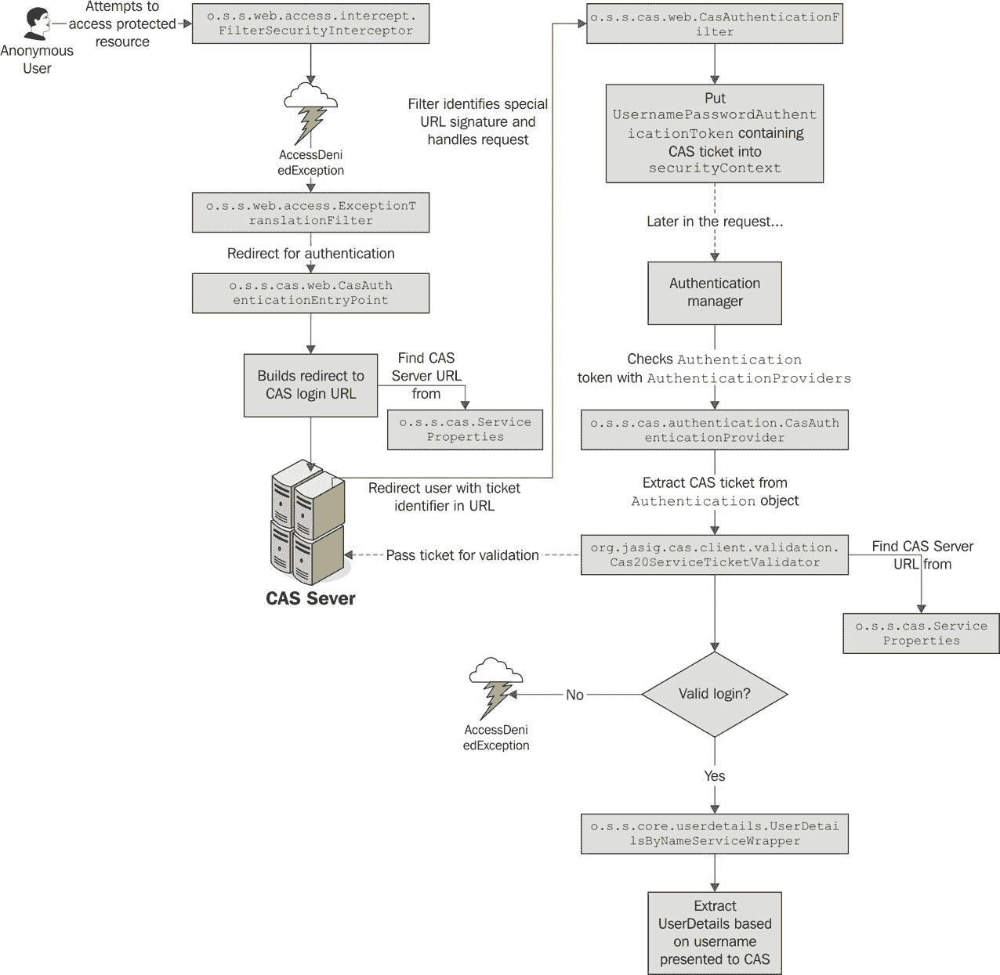
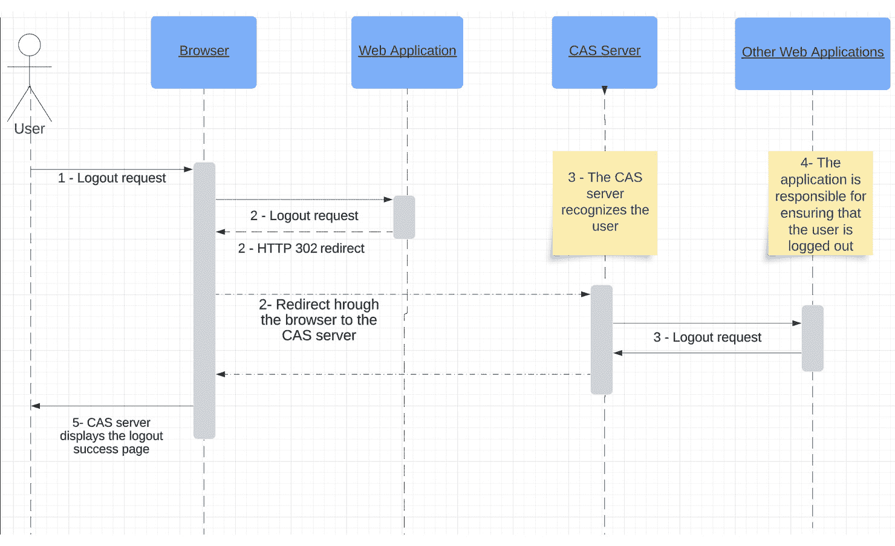
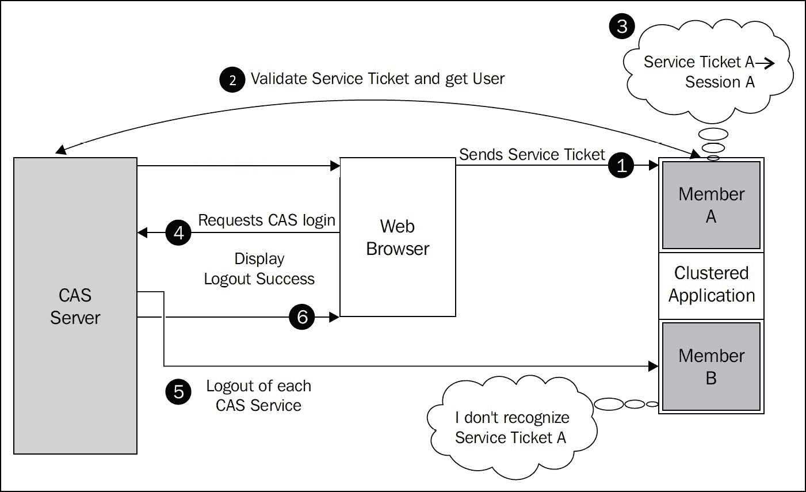
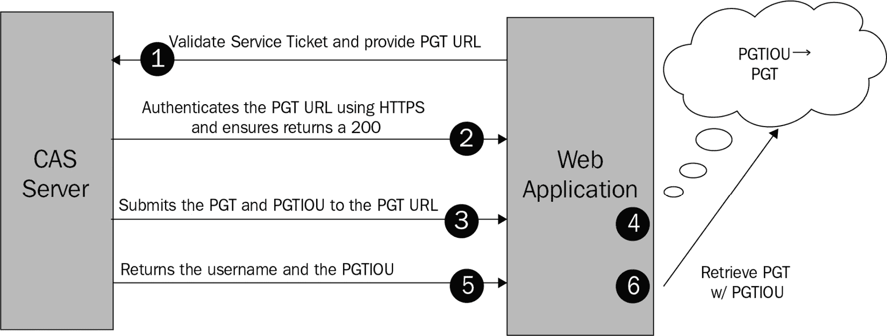
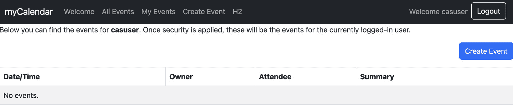
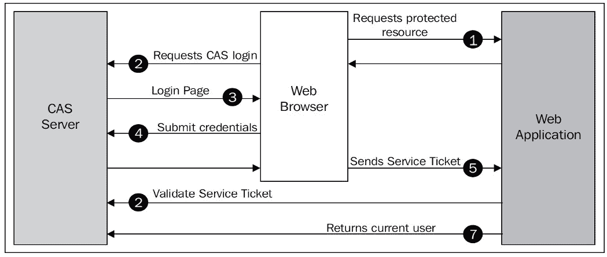

# 第十八章：使用中央认证服务实现单点登录

在本章中，我们将探讨将**中央认证服务**（**CAS**）用作基于 Spring Security 的应用程序的**单点登录**（**SSO**）门户。

在本章的讨论过程中，我们将涵盖以下主题：

+   了解**CAS**、其架构以及它如何为任何规模的系统管理员和组织带来好处

+   理解如何重新配置 Spring Security 以处理认证请求的拦截并将它们重定向到**CAS**

+   配置**JBCP 日历**应用程序以利用 CAS SSO

+   理解如何实现**单点登出**功能，并配置我们的应用程序以支持它

+   讨论如何使用**CAS**代理票据认证服务，并配置我们的应用程序以利用代理票据认证

+   讨论如何使用推荐的 war 覆盖方法自定义开箱即用的**JA-SIG CAS**服务器

+   将**CAS**服务器与**LDAP**集成，并通过**CAS**将数据从**LDAP**传递到**Spring Security**

本章代码示例链接在此：[`packt.link/lFJjp`](https://packt.link/lFJjp)。

# 介绍中央认证服务

**CAS**是一个开源的 SSO 服务器，为组织内的基于 Web 的资源提供集中的访问控制和认证。**CAS**对管理员的好处众多，它支持许多应用程序和多样化的用户社区。以下是一些好处：

+   可以在一个位置配置对资源（应用程序）的个体或组访问

+   广泛支持各种认证存储（以集中用户管理），在广泛分布的跨机环境中提供单一的认证和控制点

+   通过**CAS**客户端库为基于 Web 和非基于 Web 的 Java 应用程序提供广泛的认证支持

+   提供一个用户凭据的单一点参考（通过**CAS**），这样**CAS**客户端应用程序就不需要了解用户的凭据，或者了解如何验证它们

在本章中，我们将不会过多关注**CAS**的管理，而是关注认证以及**CAS**如何作为我们网站用户的认证点。尽管**CAS**通常在企业或教育机构的内网环境中使用，但它也可以在高调的位置，如索尼在线娱乐的公共网站中使用。

# 高级**CAS**认证流程

在高层次上，**CAS**由一个**CAS**服务器组成，它是确定认证的中心 Web 应用程序，以及一个或多个**CAS**服务，它们是使用 CAS 服务器进行认证的独立 Web 应用程序。**CAS**的基本认证流程通过以下操作进行：

1.  用户尝试访问网站上的受保护资源。

1.  用户通过浏览器从 **CAS** 服务重定向到 **CAS** 服务器以请求登录。

1.  **CAS** 服务器负责用户认证。如果用户尚未在 **CAS** 服务器上认证，则后者会请求用户的凭证。如图所示，用户会看到一个登录页面。

1.  用户提交他们的凭证（即用户名和密码）。

1.  如果用户的凭证有效，**CAS** 服务器将通过浏览器重定向响应一个服务票据。服务票据是一个一次性使用的令牌，用于识别用户。

1.  **CAS** 服务调用 **CAS** 服务器以验证票据是否有效、是否已过期等。请注意，这一步骤不是通过浏览器进行的。

1.  **CAS** 服务器响应一个断言，表明信任已经建立。如果票据是可接受的，则信任已经建立，用户可以通过正常的授权检查继续操作。

    这种行为在以下图中进行了视觉展示：



图 18.1 – 高级 CAS 认证流程

我们可以看到 **CAS** 服务器与受保护应用之间有高度的交互，在建立对用户的信任之前需要几个数据交换握手。我们假设其他网络安全预防措施，如使用 **安全套接字层**（**SSL**）和网络监控，已经到位。

这种复杂性的结果是，一个很难通过常见技术欺骗的 SSO 协议。

现在我们已经了解了 **CAS** 认证的一般工作原理，让我们看看它如何应用于 Spring Security。

# Spring Security 和 CAS

Spring Security 与 **CAS** 具有强大的集成能力，尽管它不像我们在本书后半部分所探讨的 **OAuth2** 和 **LDAP** 集成那样紧密地集成到安全命名空间风格的配置中。相反，大部分配置依赖于通过安全命名空间元素到 Bean 声明的 Bean 连接和引用配置。

在使用 Spring Security 时，**CAS** 认证的两大基本组成部分包括以下内容：

+   替换标准的 `AuthenticationEntryPoint` 实现，该实现通常处理将未认证用户重定向到登录页面的操作，而这里使用的是将用户重定向到 CAS 服务器的实现

+   当用户从 **CAS** 服务器重定向回受保护资源时，通过使用自定义的 Servlet 过滤器处理服务票据

关于**CAS**的一个重要理解是，在典型部署中，**CAS**旨在替换我们应用程序中所有替代登录机制。因此，一旦我们为 Spring Security 配置了**CAS**，我们的用户必须仅使用**CAS**作为我们应用程序的认证机制。在大多数情况下，这不会成为问题；正如我们在上一节中讨论的，**CAS**被设计为代理认证请求到一个或多个认证存储（正如 Spring Security 在委托到数据库或**LDAP**进行认证时所做的）。从之前的图（*图 18.1*）中，我们可以看到我们的应用程序不再检查其自己的认证存储来验证用户。相反，它使用服务票据来认证用户。然而，正如我们将在*从 CAS 断言获取 UserDetails 对象*部分中讨论的，最初，Spring Security 仍然需要一个数据存储来确定用户的授权。我们将在本章后面讨论如何去除这个限制。

在完成基本的 Spring Security 与**CAS**集成后，我们可以从主页上删除登录链接，并享受自动重定向到**CAS**的登录屏幕，在那里我们尝试访问受保护资源。当然，根据应用程序的不同，仍然允许用户明确登录（这样他们可以看到定制的内容等）也是有益的。

## 必需的依赖项

在我们走得太远之前，我们应该确保我们的依赖项已更新。以下是我们添加的依赖项列表，并附有它们何时需要的注释：

```java
//build.gradle
//Spring CAS Support
implementation " org.springframework.security:spring-security-cas"
```

## 安装和配置 CAS

**CAS**的好处是有一个极其专注的团队支持它，这个团队在开发高质量的软件和如何使用它的准确、简洁的文档方面做得非常出色。如果您选择跟随本章中的示例，我们鼓励您阅读您**CAS**平台的适当入门手册。您可以在[`apereo.github.io/cas/`](https://apereo.github.io/cas/)找到此手册。

为了使集成尽可能简单，我们为本章包含了一个**CAS**服务器应用程序，该应用程序可以在 Eclipse 或 IntelliJ 中部署，以及日历应用程序。

对于本章中的示例，我们将假设`https://localhost:9443/cas/`和日历应用程序部署在`https://localhost:8443/`。为了正常工作，**CAS**需要使用 HTTPS。

重要提示

本章中的示例是使用当时可用的最新版本的`CAS`服务器编写的，即写作时的`7.0.1`版本，该版本需要 Java 21。因此，如果您使用的是早期版本的服务器，这些说明可能对您的环境略有不同，或者可能显著不同。

让我们继续配置 CAS 认证所需的组件。

重要提示

您应该从`chapter18.00-calendar`和`chapter18.00-cas-server`的源开始。

要启动 CAS 服务器，请从`chapter18.00-cas-server`项目运行以下命令：

```java
./gradlew build run
```

我们使用以下默认 CAS 登录/密码作为此示例：`casuser`/`Mellon`。

在**JBCP 日历**应用程序中，我们应该能够使用相同的凭据登录。请注意，用户具有管理员权限。

对于接下来的步骤，我们需要执行以下操作：

+   在`chapter18.00-cas-server/src/main/resources/etc/cas`内部导入 CAS SSL 证书：

    ```java
    $JBCP_JAVA_HOME variable is the JVM used by the JBCP Calendar application.
    ```

+   要检查导入是否成功，请运行以下命令。如果您被要求输入 keystore 密码，默认密码是*更改它*。

    ```java
    keytool -list -keystore $JBCP_JAVA_HOME/lib/security/cacerts -alias cas-server
    ```

    输出应类似于以下内容：

    ```java
    cas-server, May 6, 2024, trustedCertEntry,
    chapter18.00-calendar/src/main/resources/keys. If you are asked for the password the keystore password, the default one is *change it*:

    ```

    `$CAS_JAVA_HOME`变量是 CAS 服务器使用的 JVM。

    ```java

    ```

+   要检查导入是否成功，您可以运行以下命令。如果您被要求输入 keystore 密码，默认密码是*更改它*：

    ```java
    keytool -list -keystore $CAS_JAVA_HOME/lib/security/cacerts -alias jbcpcalendar
    ```

    输出应类似于以下内容：

    ```java
    jbcpcalendar, May 6, 2024, PrivateKeyEntry,
    Certificate fingerprint (SHA-256): 79:0D:62:D7:E7:A1:25:1D:A3:C7:93:F6:03:A8:E4:B8:20:BA:FA:2B:03:9F:5C:E3:5D:6C:61:A5:6F:CD:83:57
    ```

重要提示

`$JBCP_JAVA_HOME`代表`cacerts`文件使用的*Java*路径，默认如下：`$$JBCP_JAVA_HOME/lib/security/cacerts`。

`$CAS_JAVA_HOME`代表`cacerts`文件使用的*Java*路径，默认如下：`$CAS_JAVA_HOME/lib/security/cacerts`。

如果您不依赖于默认的 JDK `cacerts`文件，则应将此路径调整为您的当前`cacerts`文件位置。

要将命令适配到 Windows，您需要将`$JBCP_JAVA_HOME` Unix/Linux 环境变量语法替换为`%JBCP_JAVA_HOME%` Windows 语法。在此命令中，`%JBCP_JAVA_HOME%`假定是一个指向 Java 安装目录的 Windows 环境变量。请确保将其替换为您系统中的实际路径。

如果您没有将*CAS 服务器 SSL 证书*导入到*JBCP 日历 JVM*，以及*JBCP 日历 SSL 证书*导入到*CAS 服务器 JVM*，您将在日志中看到以下错误：

`javax.net.ssl.SSLHandshakeException: PKIX 路径构建失败：sun.security.provider.certpath.SunCertPathBuilderException：无法找到到请求目标的有效证书路径`

# 配置基本的 CAS 集成

由于 Spring Security 命名空间不支持 CAS 配置，我们需要实施更多步骤才能获得基本的工作设置。

## 配置 CAS 属性

Spring Security 设置依赖于一个`o.s.s.cas.ServiceProperties`豆来存储关于`ServiceProperties`对象的一般信息，它在协调各种**CAS**组件之间的数据交换中发挥作用——它用作数据对象来存储由**Spring CAS**堆栈中不同的参与者共享（并期望匹配）的 CAS 配置设置。您可以在以下代码片段中查看包含的配置：

```java
//src/main/java/com/packtpub/springsecurity/configuration/CasConfig.java
@Configuration
public class CasConfig {
    @Value("${cas.base.url}")
    private String casBaseUrl;
    @Value("${cas.login.url}")
    private String casLoginUrl;
    @Value("${service.base.url}")
    private String serviceBaseUrl;
    @Bean
    public ServiceProperties serviceProperties() {
       ServiceProperties serviceProperties = new ServiceProperties();
       serviceProperties.setService(serviceBaseUrl+ "/login/cas");
       return serviceProperties;
    }
}
```

您可能已经注意到，我们利用系统属性来使用名为`${cas.base.url}`和`${service.base.url}`的变量。这两个值都可以包含在您的应用程序中，Spring 会自动将它们替换为`PropertySources`配置中提供的值。这是一种常见的策略，当默认部署到`https://localhost:9443/cas`时，对于日历应用程序，它将部署到`https://localhost:8443`。

此配置可以在应用程序投入生产时使用系统参数进行覆盖。或者，配置可以外部化到一个 Java 属性文件中。这两种机制都允许我们正确地外部化我们的配置。

您可以对您的`application.yml`文件进行以下更新：

```java
cas:
  base:
    url: https://localhost:9443/cas
  login:
    url: ${cas.base.url}/login
service:
  base:
    url: https://localhost:8443
```

## 添加 CasAuthenticationEntryPoint 对象

正如我们在*Spring Security 和 CAS*部分简要提到的，`Spring Security`使用一个`o.s.s.web.AuthenticationEntryPoint`接口从用户请求凭证。通常，这涉及到将用户重定向到登录页面。通过`service`参数指示`o.s.s.cas.web.CasAuthenticationEntryPoint`对象的位置，该对象专门为此目的而设计。示例应用程序中包含的配置如下：

```java
//src/main/java/com/packtpub/springsecurity/configuration/CasConfig.java
@Bean
public CasAuthenticationEntryPoint casAuthenticationEntryPoint(ServiceProperties serviceProperties) {
    CasAuthenticationEntryPoint casAuthenticationEntryPoint = new CasAuthenticationEntryPoint();
    casAuthenticationEntryPoint.setLoginUrl(this.casLoginUrl);
    casAuthenticationEntryPoint.setServiceProperties(serviceProperties);
    return casAuthenticationEntryPoint;
}
```

`CasAuthenticationEntryPoint`对象使用`ServiceProperties`类指定用户认证后服务票据的发送位置。CAS 允许根据配置对每个用户、每个应用程序进行选择性授权。我们将在配置预期处理该 URL 的 servlet 过滤器时，稍后检查这个 URL 的细节。

接下来，我们需要更新 Spring Security 以利用具有`casAuthentication` **入口点** ID 的 bean。对我们的`SecurityConfig.java`文件进行以下更新：

```java
//src/main/java/com/packtpub/springsecurity/configuration/ SecurityConfig.java
@Bean
public SecurityFilterChain filterChain(HttpSecurity http,
       CasAuthenticationEntryPoint casAuthenticationEntryPoint) throws Exception {
...omitted for brevity
          // Exception Handling
          http.exceptionHandling(exceptions -> exceptions
                .authenticationEntryPoint(casAuthenticationEntryPoint)
                .accessDeniedPage("/errors/403"));
...
    return http.build();
}
```

## 启用 CAS 票据验证

参考我们之前看到的图表（*图 18.1*），我们可以看到 Spring Security 负责识别未认证的请求，并通过`FilterSecurityInterceptor`类将用户重定向到 CAS。添加`CasAuthenticationEntryPoint`对象已覆盖了标准重定向到登录页面的功能，并提供了从应用程序到 CAS 服务器的预期重定向。现在，我们需要配置一些设置，以便一旦用户在 CAS 上认证成功，用户就能正确地认证到应用程序。

如果您还记得第九章中的内容，即**OAuth2 的开放**，**OAuth2**使用类似的重定向方法，通过将未经认证的用户重定向到**OAuth2**提供者进行认证，然后带着可验证的凭证返回到应用程序。与**OAuth2**不同，**CAS**协议在用户返回应用程序时，应用程序预期会回调**CAS**服务器，明确验证提供的凭证是否有效和准确。与使用基于日期的 nonce 和基于密钥的签名来独立验证**OAuth2**提供者传递的凭证相比，这是一个区别。

`CasConfig.java`文件的好处如下：

```java
//src/main/java/com/packtpub/springsecurity/configuration/CasConfig.java
@Bean
public CasAuthenticationFilter casAuthenticationFilter(CasAuthenticationProvider casAuthenticationProvider) {
    CasAuthenticationFilter filter = new CasAuthenticationFilter();
    filter.setAuthenticationManager(new ProviderManager(casAuthenticationProvider));
    return filter;
}
@Bean
public CasAuthenticationProvider casAuthenticationProvider(UserDetailsService userDetailsService,
       ServiceProperties serviceProperties, TicketValidator cas30ServiceTicketValidator) {
    CasAuthenticationProvider provider = new CasAuthenticationProvider();
    provider.setAuthenticationUserDetailsService(new UserDetailsByNameServiceWrapper<>(userDetailsService));
    provider.setServiceProperties(serviceProperties);
    provider.setTicketValidator(cas30ServiceTicketValidator);
    provider.setKey("key");
    return provider;
}
@Bean
public TicketValidator cas30ServiceTicketValidator() {
    return new Cas30ServiceTicketValidator(this.casBaseUrl);
}
```

接下来，我们需要更新 Spring Security 以利用带有`CasAuthenticationFilter` Bean 的 Bean。请更新我们的`SecurityConfig.java`文件如下：

```java
//src/main/java/com/packtpub/springsecurity/configuration/ SecurityConfig.java
public SecurityFilterChain filterChain(HttpSecurity http,
       CasAuthenticationEntryPoint casAuthenticationEntryPoint,
       CasAuthenticationFilter casAuthenticationFilter) throws Exception {
...omitted for brevity
     // CAS Filter
    http.addFilterAt(casAuthenticationFilter, CasAuthenticationFilter.class);
     // Exception Handling
    http.exceptionHandling(exceptions -> exceptions
                .authenticationEntryPoint(casAuthenticationEntryPoint)
                .accessDeniedPage("/errors/403"));
...
    return http.build();
}
```

最后一步是删除`SecurityFilterChain` Bean 中现有的`formLogin` `Spring Security`定义，因为我们将会依赖**CAS**登录表单进行用户认证。

重要提示

您的代码应该看起来像`chapter18.01-calendar`中的那样。

到目前为止，我们应该能够启动`https://localhost:8443/`，并选择`casuser`用户和密码`Mellon`。认证成功后，您将被重定向回**JBCP 日历**应用程序。做得好！

重要提示

如果您遇到问题，最可能的原因是**不正确的 SSL 配置**。请确保您已将 CAS SSL 证书导入到您的**JBCP 日历**应用程序的 JRE 密钥库中。

现在我们已经介绍了 CAS 配置的基础知识，我们将进一步深入探讨**单点注销**。

# 单点注销

您可能会注意到，如果您注销应用程序，您会看到一个注销确认页面。然而，如果您点击一个受保护的页面，例如**我的事件**页面，您仍然处于认证状态。问题是注销只发生在本地。因此，当您在**JBCP 日历**应用程序中请求另一个受保护的资源时，会从**CAS**服务器请求登录。由于用户仍然登录到**CAS**服务器，它立即返回一个服务票据并将用户重新登录到**JBCP 日历**应用程序。

这也意味着，如果用户使用**CAS**服务器登录了其他应用程序，他们仍然会认证到那些应用程序，因为我们的日历应用程序对其他应用程序一无所知。幸运的是，**CAS**和 Spring Security 提供了解决这个问题的方案。正如我们可以从**CAS**服务器请求登录一样，我们也可以请求注销。

您可以在`chapter18.01-calendar`中看到如何注销**CAS**的高级示意图：



图 18.2 – CAS 单点注销

以下步骤解释了**单点注销**功能是如何工作的：

1.  用户请求从网络应用程序登出。

1.  网络应用程序随后通过浏览器发送重定向请求到 CAS 服务器，请求从 CAS 登出。

1.  CAS 服务器识别用户，然后向每个已认证的 CAS 服务发送登出请求。请注意，这些登出请求不是通过浏览器发生的。

1.  CAS 服务器通过提供用于登录用户的原始服务票据来指示哪个用户应该登出。然后应用程序负责确保用户已登出。

1.  CAS 服务器向用户显示登出成功页面。

## 配置单点登出

**单点登出**的配置相对简单：

1.  首先，更新你的 `application.yml` 文件，添加**CAS**登出 URL：

    ```java
    cas:
      base:
        url: https://localhost:9443/cas
      login:
        url: ${cas.base.url}/login
      logout:
        url: ${cas.base.url}/logout
    service:
      base:
        url: https://localhost:8443
    ```

1.  第一步是指定一个`logout-success-url`属性，使其成为`SecurityConfig.java`文件的登出 URL。这意味着在我们本地登出后，我们将自动将用户重定向到**CAS**服务器的登出页面：

    ```java
    //src/main/java/com/packtpub/springsecurity/configuration/ SecurityConfig.java
    @Configuration
    @EnableWebSecurity
    public class SecurityConfig {
        @Value("${cas.logout.url}")
        private String casLogoutUrl;
        @Bean
        public SecurityFilterChain filterChain(HttpSecurity http,
              CasAuthenticationEntryPoint casAuthenticationEntryPoint) throws Exception {
    ...omitted for brevity
           // Logout
           http.logout(form -> form
                       .logoutUrl("/logout")
                       .logoutSuccessUrl(casLogoutUrl))
    ...
           return http.build();
        }
    }
    ```

    由于我们只有一个应用程序，这就足够让它看起来像发生了单点登出。这是因为我们在重定向到`CasConfig.java`的`LogoutFilter`之前登出了我们的日历应用程序，如下所示：

    ```java
    //src/main/java/com/packtpub/springsecurity/configuration/ CasConfig.java
    @Bean
    public LogoutFilter logoutFilter() {
        LogoutFilter logoutFilter = new LogoutFilter(casLogoutUrl, new SecurityContextLogoutHandler());
        logoutFilter.setFilterProcessesUrl("/logout/cas");
        return logoutFilter;
    }
    ```

1.  如果有多个应用程序，并且用户从另一个应用程序登出，则需要创建一个`SingleSignoutFilter`对象。然后我们需要让 Spring Security 意识到我们的`SecurityConfig.java`中的`singleLogoutFilter`对象。

    将**单点登出**过滤器放在常规登出之前，以确保它接收登出事件，如下所示：

    ```java
    //src/main/java/com/packtpub/springsecurity/configuration/ SecurityConfig.java
    @Bean
    public SecurityFilterChain filterChain(HttpSecurity http,
           CasAuthenticationEntryPoint casAuthenticationEntryPoint,
           CasAuthenticationFilter casAuthenticationFilter,
           LogoutFilter logoutFilter) throws Exception {
    ...omitted for brevity
          // Logout Filter
          http
             .addFilterBefore(new SingleSignOutFilter(), CasAuthenticationFilter.class)
             .addFilterBefore(logoutFilter, LogoutFilter.class);
        // Logout
        http.logout(form -> form
                    .logoutUrl("/logout")
                    .logoutSuccessUrl(casLogoutUrl));
    ...
        return http.build();
    }
    ```

1.  继续启动应用程序并尝试现在登出。你会观察到你已经登出。

1.  现在，尝试重新登录并访问`https://localhost:9443/cas/logout`。

1.  现在，尝试访问**JBCP 日历**应用程序。你会注意到，除非再次进行身份验证，否则你无法访问该应用程序。这表明**单点登出**功能是可操作的。

重要提示

你的代码应该看起来像`chapter18.02-calendar`中的那样。

在本节中，我们介绍了使用**CAS**的**单点登出**实现。接下来，我们将讨论集群环境。

# 集群环境

在我们最初将 `HttpSession` 作为内存映射的图示中，我们未能提及的一件事。这意味着在集群环境中**单点登出**将无法正常工作：



图 18.3 – 集群环境中的 CAS 身份验证

考虑以下情况，在先前的图示背景下：

1.  用户登录到**集群成员 A**。

1.  **集群成员 A**验证服务票据。

1.  然后，它在内存中存储服务票据到用户会话的映射。

1.  用户请求从**CAS**服务器登出。

**CAS**服务器向**CAS**服务发送注销请求，但**集群成员 B**接收到了注销请求。它在内存中查找，但没有找到**Service Ticket A**的会话，因为它只存在于**集群成员 A**中。这意味着用户将无法成功注销。

## 无状态服务的代理票据认证

使用**CAS**集中我们的认证对于 Web 应用来说似乎工作得相当好，但如果我们想使用**CAS**调用 Web 服务怎么办？为了支持这一点，CAS 有一个**代理票据**（**PT**）的概念。以下是如何工作的示意图：



图 18.4 – CAS 代理票据认证

流程与标准**CAS**认证相同，直到以下事情发生：

1.  当包含一个名为代理票据回调 URL（**PGT URL**）的附加参数时，**Service Ticket**将被验证。

1.  **CAS**服务器通过**HTTPS**调用**PGT URL**以验证**PGT URL**确实是它所声称的。像 CAS 中的大多数过程一样，这是通过执行适当的 URL 的 SSL 握手来完成的。

1.  **CAS**服务器通过**HTTPS**将**Proxy Granting Ticket**（**PGT**）和**Proxy Granting Ticket I Owe You**（**PGTIOU**）提交到**PGT URL**，以确保票据被提交到它们声称的来源。

1.  **PGT URL**接收两个票据，并必须存储**PGTIOU**到**PGT**的关联。

1.  **CAS**服务器最终返回一个包含用户名和**PGTIOU**的响应到*步骤 1*。

1.  **CAS**服务可以使用**PGTIOU**查找**PGT**。

## 配置代理票据认证

现在我们已经了解了**PT**认证的工作原理，我们将通过以下步骤更新我们的当前配置以获取一个**PGT**：

1.  第一步是添加对`ProxyGrantingTicketStorage`实现的引用。请将以下代码添加到我们的`CasConfig.java`文件中：

    ```java
    //src/main/java/com/packtpub/springsecurity/configuration/ CasConfig.java
    @Bean
    public ProxyGrantingTicketStorage pgtStorage() {
        return new ProxyGrantingTicketStorageImpl();
    }
    @Scheduled(fixedRate = 300_000)
    public void proxyGrantingTicketStorageCleaner(){
        logger.info("Running ProxyGrantingTicketStorage#cleanup() at {}",
              LocalDateTime.now());
        pgtStorage().cleanUp();
    }
    ```

1.  `ProxyGrantingTicketStorageImpl`实现是将**PGTIOU**映射到**PGT**的内存映射。就像注销一样，这意味着我们会在集群环境中使用此实现时遇到问题。请参考 JA-SIG 文档以确定如何在集群环境中设置它：[`apereo.github.io/cas/7.0.x/high_availability/High-Availability-Guide.xhtml`](https://apereo.github.io/cas/7.0.x/high_availability/High-Availability-Guide.xhtml)。

1.  我们还需要定期通过调用其`cleanUp()`方法来清理`ProxyGrantingTicketStorage`。如您所见，Spring 的任务抽象使这变得非常简单。您可以考虑调整配置，以便在适合您环境的单独线程池中清除票据。有关更多信息，请参阅 Spring 框架参考文档的*任务执行和调度*部分，网址为[`docs.spring.io/spring-framework/reference/integration/scheduling.xhtml`](https://docs.spring.io/spring-framework/reference/integration/scheduling.xhtml)。

1.  现在我们需要使用我们刚刚创建的`ProxyGrantingTicketStorage`。我们只需要更新`ticketValidator`方法，使其引用我们的存储，并了解`CasConfig.java`：

    ```java
    //src/main/java/com/packtpub/springsecurity/configuration/ CasConfig.java
    @Value("${service.proxy.callback-url}")
    private String calendarServiceProxyCallbackUrl;
    @Bean
    public TicketValidator cas30ServiceTicketValidator() {
        Cas30ProxyTicketValidator tv = new Cas30ProxyTicketValidator(this.casBaseUrl);
        tv.setProxyCallbackUrl(calendarServiceProxyCallbackUrl);
        tv.setProxyGrantingTicketStorage(pgtStorage());
        return tv;
    }
    ```

1.  然后，我们需要通过添加代理回调 URL 来更新`application.yml`文件：

    ```java
    service:
      base:
        url: https://localhost:8443
      proxy:
        callback-url: ${service.base.url}/callback
    ```

1.  我们需要做的最后一个更新是对我们的`CasAuthenticationFilter`对象，当`proxyReceptorUrl`属性与`Cas20ProxyTicketValidator`对象的`proxyCallbackUrl`属性匹配时，存储`ProxyGrantingTicketStorage`实现，以确保`CasConfig.java`：

    ```java
    //src/main/java/com/packtpub/springsecurity/configuration/ CasConfig.java
    @Bean
    public CasAuthenticationFilter casAuthenticationFilter(CasAuthenticationProvider casAuthenticationProvider,
           ProxyGrantingTicketStorage pgtStorage) {
        CasAuthenticationFilter filter = new CasAuthenticationFilter();
        filter.setAuthenticationManager(new ProviderManager(casAuthenticationProvider));
        filter.setProxyGrantingTicketStorage(pgtStorage);
        filter.setProxyReceptorUrl("/pgtUrl");
        return filter;
    }
    ```

现在我们有了**PGT**，我们该如何使用它？服务票据是一个一次性令牌。然而，**PGT**可以用来生成**PT**。让我们看看我们如何使用**PGT**来创建**PT**。

重要提示

在`application.yml`配置文件中，我们可以观察到`proxyCallBackUrl`属性与我们的上下文相关`proxyReceptorUrl`属性路径的绝对路径相匹配。由于我们将基础应用程序部署到`${service.base.url}`，我们的`proxyReceptor` URL 的完整路径将是`${service.base.url}/pgtUrl`。

在对**CAS**服务器集群环境中的配置进行此检查之后，我们将深入了解 CAS 代理票据的详细使用。

# 使用代理票据

我们现在可以使用我们包含在本章代码中的`EchoController`类。您可以在下面的代码片段中看到它的相关部分。有关更多详细信息，请参阅示例源代码：

```java
//src/main/java/com/packtpub/springsecurity/web/controllers/ EchoController.java
@GetMapping("/echo")
   public String echo()  {
       final CasAuthenticationToken token = (CasAuthenticationToken) SecurityContextHolder
               .getContext()
               .getAuthentication();
    // The proxyTicket could be cached in session and reused if we wanted to
       final String proxyTicket = token.getAssertion().getPrincipal().getProxyTicketFor(targetUrl);
       // Make a remote call using the proxy ticket
       return restTemplate.getForObject(targetUrl+"?ticket={pt}", String.class, proxyTicket);
   }
```

这个控制器是一个虚构的例子，它将获取一个`EchoController`对象，实际上是在对同一应用程序中的`MessagesController`对象进行 RESTful 调用。这意味着日历应用程序正在对自己进行 RESTful 调用。

前往`https://localhost:8443/echo`查看其效果。页面看起来非常像**CAS**登录页面（除了 CSS）。这是因为控制器试图回显我们的**我的事件**页面，而我们的应用程序还不知道如何验证**PT**。这意味着它被重定向到**CAS**登录页面。让我们看看我们如何验证代理票据。

重要提示

您的代码应该看起来像`chapter18.03-calendar`中的那样。

## 验证代理票据

让我们看看以下步骤来了解如何验证代理票据：

1.  我们首先需要告诉 `ServiceProperties` 对象，我们想要验证所有票据，而不仅仅是提交给 `filterProcessesUrl` 属性的票据。请对 `CasConfig.java` 进行以下更新：

    ```java
    //src/main/java/com/packtpub/springsecurity/configuration/ CasConfig.java
    @Bean
    public ServiceProperties serviceProperties() {
        ServiceProperties serviceProperties = new ServiceProperties();
        serviceProperties.setService(serviceBaseUrl+ "/login/cas");
        serviceProperties.setAuthenticateAllArtifacts(true);
        return serviceProperties;
    }
    ```

1.  然后，我们需要更新我们的 `CasAuthenticationFilter` 对象，使其知道我们想要验证所有工件（即票据），而不仅仅是监听特定 URL。我们还需要使用一个 `AuthenticationDetailsSource` 接口，该接口可以在验证任意 URL 上的代理票据时动态提供 CAS 服务 URL。这很重要，因为当 CAS 服务询问票据是否有效时，它还必须提供用于创建票据的 CAS 服务 URL。由于代理票据可能出现在任何 URL 上，我们必须能够动态发现此 URL。这是通过利用 `ServiceAuthenticationDetailsSource` 对象来完成的，该对象将提供 HTTP 请求中的当前 URL：

    ```java
    //src/main/java/com/packtpub/springsecurity/configuration/ CasConfig.java
    @Bean
    public CasAuthenticationFilter casAuthenticationFilter(CasAuthenticationProvider casAuthenticationProvider,
           ProxyGrantingTicketStorage pgtStorage, ServiceProperties serviceProperties) {
        CasAuthenticationFilter filter = new CasAuthenticationFilter();
        filter.setAuthenticationManager(new ProviderManager(casAuthenticationProvider));
        filter.setProxyGrantingTicketStorage(pgtStorage);
        filter.setProxyReceptorUrl("/pgtUrl");
        filter.setServiceProperties(serviceProperties);
        filter.setAuthenticationDetailsSource(new ServiceAuthenticationDetailsSource(serviceProperties));
        return filter;
    }
    ```

1.  我们还需要确保我们正在使用 `Cas30ProxyTicketValidator` 对象，而不是 `Cas30ServiceTicketValidator` 实现，并指出我们将接受哪些代理票据。我们将配置我们的 `Cas30ProxyTicketValidator` 以接受来自任何 CAS 服务的代理票据。在生产环境中，您可能希望仅限于信任的 CAS 服务：

    ```java
    //src/main/java/com/packtpub/springsecurity/configuration/ CasConfig.java
    @Bean
    public TicketValidator cas30ServiceTicketValidator() {
        Cas30ProxyTicketValidator tv = new Cas30ProxyTicketValidator(this.casBaseUrl);
        tv.setProxyCallbackUrl(calendarServiceProxyCallbackUrl);
        tv.setProxyGrantingTicketStorage(pgtStorage());
        tv.setAcceptAnyProxy(true);
        return tv;
    }
    ```

1.  最后，我们希望为我们的 `CasAuthenticationProvider` 对象提供一个缓存，这样我们就不需要为每次调用我们的服务而击中 CAS 服务。为此，我们需要配置一个 `StatelessTicketCache`，如下所示：

    ```java
    //src/main/java/com/packtpub/springsecurity/configuration/ CasConfig.java
    @Bean
    public CasAuthenticationProvider casAuthenticationProvider(UserDetailsService userDetailsService,
           ServiceProperties serviceProperties, TicketValidator cas30ServiceTicketValidator, SpringCacheBasedTicketCache springCacheBasedTicketCache) {
        CasAuthenticationProvider provider = new CasAuthenticationProvider();
        provider.setAuthenticationUserDetailsService(new UserDetailsByNameServiceWrapper<>(userDetailsService));
        provider.setServiceProperties(serviceProperties);
        provider.setTicketValidator(cas30ServiceTicketValidator);
        provider.setKey("key");
        provider.setStatelessTicketCache(springCacheBasedTicketCache);
        return provider;
    }
    @Bean
    public SpringCacheBasedTicketCache springCacheBasedTicketCache(CacheManager cacheManager) {
        return new SpringCacheBasedTicketCache(cacheManager.getCache("castickets"));
    }
    ```

重要提示

不要忘记在 `CasConfig.java` 中添加 `@EnableCaching`，以便 Spring 可以自动启用缓存。

1.  如您所怀疑的，Spring 缓存可以依赖于外部实现，包括 `EhCache`。请继续启动应用程序并再次访问 `https://localhost:8443/echo`。这次，您应该看到对调用我们的 **我的** **事件** 页面的响应：



图 18.5 – 验证代理票据响应

重要提示

您的代码应该看起来像 `chapter18.04-calendar` 中的那样。

在使用代理票据之后，我们将接下来探讨定制 **CAS** 服务器的过程。

# 定制 CAS 服务器

本节的所有更改都将应用于 **CAS** 服务器，而不是日历应用程序。本节仅旨在介绍配置 **CAS** 服务器的过程，因为详细的设置显然超出了本书的范围。就像对日历应用程序所做的更改一样，我们鼓励您跟随本章中的更改。有关更多信息，您可以参考 **CAS Aperero** 文档：https://apereo.github.io/cas。

## CAS WAR 透明覆盖

作为依赖项，首选的定制 `cas-server-webapp` 的方式，然后提供将合并到现有 **WAR 透明覆盖** 中的额外文件。

## CAS 内部认证是如何工作的？

在我们深入到 CAS 配置之前，我们将简要说明 CAS 认证处理的标准行为。以下图表应有助于您跟随允许 CAS 与我们的嵌入式 LDAP 服务器通信所需的配置步骤：



图 18.6 – CAS 内部认证流程

虽然前面的图描述了 **CAS** 服务器内部的认证流程，但如果你正在实现 Spring Security 和 **CAS** 之间的集成，你可能需要调整 **CAS** 服务器的配置。因此，了解 **CAS** 认证在高级别上是如何工作的是非常重要的。

`org.apereo.cas.authentication.AuthenticationManager` 接口（不要与同名的 Spring Security 接口混淆）负责根据提供的凭据对用户进行认证。在 Spring Security 中，凭据的实际处理委托给一个（或多个）实现 `org.apereo.cas.authentication.AuthenticationHandler` 接口的处理类。我们认识到 `Spring Security` 中的类似接口将是 `AuthenticationProvider`。

虽然这不是对 CAS 服务器背后功能的全面审查，但这应该有助于您理解接下来几个练习中的配置步骤。我们鼓励您阅读 **CAS** 的源代码并参考基于网络的文档。

## 配置 CAS 连接到我们的嵌入式 LDAP 服务器

**CAS** 通过对 Active Directory 或 OpenLDAP 等 LDAP 目录进行认证来验证用户名/密码。存在各种目录架构，我们为四种常见场景提供了配置选项。

重要的是要注意，**CAS** 会根据指定的设置自动内部生成必要的组件。如果您想对多个 LDAP 服务器进行认证，您可以增加索引并指定下一个 LDAP 服务器设置。

此外，请注意，在 **LDAP** 认证期间获得的属性，如果适用，将与来自其他属性存储源的属性结合。直接通过 **LDAP** 认证获得的属性优先于所有其他属性。

您可以在 CAS 文档中找到可用的设置和属性（[`apereo.github.io/cas/`](https://apereo.github.io/cas/))。

让我们看看以下步骤来配置带有 **CAS** 的嵌入式 LDAP 服务器：

1.  首先，我们更新 `chapter18.00-cas-server` 项目的 `build.gradle` 依赖项。我们启用 CAS LDAP 支持，并添加嵌入式 LDAP 服务器的 `spring-security` 内置支持：

    ```java
    //CAS LDAP Support
    implementation "org.apereo.cas:cas-server-support-ldap"
    // Spring Security LDAP
    implementation("org.springframework.security:spring-security-ldap")
    implementation("org.springframework.security:spring-security-config")
    // Embedded LDAP Server
    implementation("com.unboundid:unboundid-ldapsdk")
    ```

1.  然后我们需要在我们的 `application.yml` 文件中添加以下部分，包含嵌入式 LDAP 服务器的连接参数：

    ```java
    // Embedded LDAP
    spring:
      ldap:
        embedded:
          ldif: classpath:/ldif/calendar.ldif
          baseDn: dc=jbcpcalendar,dc=com
          port: 33389
          credential:
            username: uid=admin,ou=system
            password: secret
    // CAS configuration for LDAP
    cas:
      authn:
        ldap[0]:
          useStartTls: false
          search-filter: uid={user}
          type: AUTHENTICATED
          ldapUrl: ldap://localhost:${spring.ldap.embedded.port}
          baseDn: ${spring.ldap.embedded.baseDn}
          bindDn: ${spring.ldap.embedded.credential.username}
          bindCredential: ${spring.ldap.embedded.credential.password}
    ```

1.  对于这个练习，我们将使用为本书创建的 LDIF 文件，旨在捕获许多与 LDAP 和 Spring Security 的常见配置场景（就像我们在 *第六章*，*LDAP 目录服务*）中所做的那样）。将提供的 LDIF 文件复制到以下项目位置：`src/main/resources/ldif/calendar.ldif`。

1.  最后，我们需要按照以下方式配置 `CasOverlayOverrideConfiguration.java`：

    ```java
    //src/main/java/org/apereo/cas/config/CasOverlayOverrideConfiguration.java
    @Lazy(false)
    @AutoConfiguration
    public class CasOverlayOverrideConfiguration {
        private final BaseLdapPathContextSource contextSource;
        public CasOverlayOverrideConfiguration(BaseLdapPathContextSource contextSource) {
           this.contextSource = contextSource;
        }
    }
    ```

重要提示

你的代码应该看起来像 `chapter18.05-cas-server` 和 `chapter18.05-calendar` 中的那样。

现在，我们已经配置了基本的 `admin1@example.com/admin` 或 `user1@example.com/user1`。尝试运行它以检查是否正常工作。如果不起作用，请检查日志并比较您的配置与示例配置。

在从 **CAS** 断言对 `UserDetails` 对象进行自定义之后。

# 从 CAS 断言中获取 UserDetails 对象

到目前为止，我们一直使用 `InMemoryUserDetailsManager` 对象进行身份验证。然而，我们可以像使用 **OAuth2** 一样从 **CAS** 断言中创建 `UserDetails` 对象。第一步是配置 **CAS** 服务器以返回额外的属性。

## 在 CAS 响应中返回 LDAP 属性

我们知道 **CAS** 可以在 **CAS** 响应中返回用户名，但它也可以在 **CAS** 响应中返回任意属性。让我们看看如何更新 CAS 服务器以返回额外的属性。同样，本节的所有更改都在 *CAS 服务器中，而不是在* *日历应用程序中*。

## 将 LDAP 属性映射到 CAS 属性

第一步需要我们将 `GrantedAuthority` 映射。

我们将在 CAS 的 `application.yml` 文件中添加更多的配置。这个新的配置项是为了指导 `Principal` 对象到 `principalAttributeList`，这将最终作为票据验证的一部分进行序列化。该配置应在 `chapter18.06-cas-server` 项目中如下声明：

```java
//src/main/resources/application.yml
cas:
  service-registry:
    core:
      init-from-json: true
    json:
      location: classpath:/etc/cas/services
  authn:
    ldap[0]:
      principalAttributeList: sn:lastName,cn:fullName,description:role
      useStartTls: false
      search-filter: uid={user}
      type: AUTHENTICATED
      ldapUrl: ldap://localhost:${spring.ldap.embedded.port}
      baseDn: ${spring.ldap.embedded.baseDn}
      bindDn: ${spring.ldap.embedded.credential.username}
      bindCredential: ${spring.ldap.embedded.credential.password}
```

背后的功能有些令人困惑——本质上，这个类的目的是将 `org.apereo.cas.authentication.principal.Principal` 映射回 LDAP 目录。使用 LDAP 查询（`uid=user1@example.com`）搜索提供的 `baseDN` Java 实体属性，并从匹配条目中读取属性。这些属性使用 `principalAttributeList` 属性中的键/值对映射回 `org.apereo.cas.authentication.principal.Principal`。我们认识到 LDAP 的 `cn` 和 `sn` 属性被映射到有意义的名称，而 `description` 属性被映射到用于确定我们用户授权的角色。

最后，我们希望将相同类型的查询设置在`Principal`上，到一个完整的 LDAP 唯一名称，然后使用`groupOfUniqueNames`条目的`uniqueMember`属性。不幸的是，CAS LDAP 代码还没有这种灵活性，这导致我们得出结论，更高级的**LDAP**映射将需要在**CAS**的基类中进行扩展。

## 从 CAS 获取 UserDetails

当我们最初设置`UserDetailsByNameServiceWrapper`时，它只是将呈现给`UserDetails`对象的用户名转换为`UserDetailsService`中引用的对象。现在，正如我们在*第六章*的末尾讨论的，*LDAP 目录服务*，一切都会顺利。

注意，在下一节中，我们将切换回修改*日历应用程序而不是* *CAS 服务器*。

## GrantedAuthorityFromAssertionAttributesUser 对象

现在我们已经修改了`AuthenticationUserDetailsService`实现中的`UserDetails`，将其从`AuthenticationUserDetailsService`实现修改为

`o.s.s.cas.userdetails.GrantedAuthorityFromAssertionAttributesUser` **DetailsService**对象，其任务是读取用户的`GrantedAuthority`对象。假设有一个属性为 role 的属性将随断言返回。我们只需在`CaseConfig.java`文件中配置一个新的`authenticationUserDetailsService` bean（确保替换之前定义的`authenticationUserDetailsService` bean）：

```java
//src/main/java/com/packtpub/springsecurity/configuration/CasConfig.java
@Bean
public AuthenticationUserDetailsService userDetailsService() {
    return new GrantedAuthorityFromAssertionAttributesUserDetailsService(new String[] { "role" });
}
```

重要提示

您的代码应该看起来像`chapter18.06-cas-server`和`chapter18.06-calendar`中的那样。

## 属性检索有什么用？

记住，**CAS**为我们提供了一个抽象层，消除了我们的应用程序直接访问用户存储库的能力，并强制所有此类访问都通过**CAS**作为代理进行。

这非常强大！这意味着我们的应用程序不再关心用户存储在哪种类型的存储库中，也不必担心如何访问它们的细节。这证实了使用**CAS**进行身份验证足以证明用户应该能够访问我们的应用程序。对于系统管理员来说，这意味着如果 LDAP 服务器被重命名、移动或进行其他调整，他们只需要在单个位置重新配置它——**CAS**。通过**CAS**集中访问允许组织整体安全架构具有高度的灵活性和适应性。

现在所有通过**CAS**进行身份验证的应用程序对用户都有相同的视图，并且可以在任何**CAS**启用环境中一致地显示信息。

请注意，一旦经过身份验证，Spring Security 不需要`Authentication`对象可能会随着时间的推移而变得过时，并且可能与源**CAS**服务器不同步。请妥善设置会话超时，以避免此潜在问题！

# 附加 CAS 功能

**CAS**提供了超出通过 Spring Security **CAS**包装器公开的配置功能。以下是一些这些功能：

+   为在**CAS**服务器上配置的时间窗口内访问多个**CAS**受保护应用程序的用户提供透明的 SSO。

+   应用程序可以强制用户在`TicketValidator`上`renew`属性设置为`true`进行身份验证；你可能希望在用户尝试访问应用程序的高安全区域时，在某些自定义代码中条件性地设置此属性。

+   获取服务票据的**RESTful API**。

+   Aperero CAS 服务器也可以充当**OAuth2**服务器。如果你这么想，这很有道理，因为**CAS**与**OAuth2**非常相似。

+   为**CAS**服务器提供**OAuth**支持，以便它可以获取访问令牌到代理 OAuth 提供者（即，Google），或者使**CAS**服务器本身成为 OAuth 服务器。

我们鼓励您探索 CAS 客户端和服务器全部功能，并向**CAS Aperero**社区论坛中的热心人士提出任何问题！

# 摘要

在本章中，我们了解了**CAS** SSO 门户以及它如何与 Spring Security 集成，我们还介绍了**CAS**架构以及**CAS**启用环境中参与者之间的通信路径。我们还看到了**CAS**启用应用程序对应用程序开发人员和系统管理员的益处。我们还学习了如何配置**JBCP Calendar**应用程序与基本**CAS**安装交互。我们还介绍了**CAS**的**单点****注销**支持。

我们还看到了如何实现代理票据身份验证以及如何利用它来验证无状态服务。

我们还介绍了如何将**CAS**更新为与**LDAP**交互以及如何与我们的**CAS**启用应用程序共享**LDAP**数据。我们甚至学习了如何使用行业标准**SAML**协议实现属性交换。

我们希望这一章能成为对 SSO 世界有趣介绍的入门。市场上有很多其他 SSO 系统，大多是商业性的，但**CAS**是开源 SSO 领域的领导者之一，并为任何组织构建**SSO**能力提供了一个卓越的平台。

在最后一章中，我们将学习更多关于构建 GraalVM 本地图像的内容。
