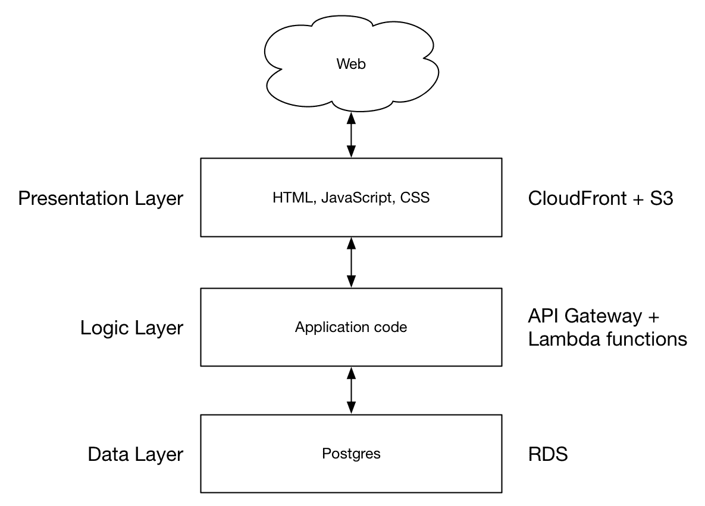
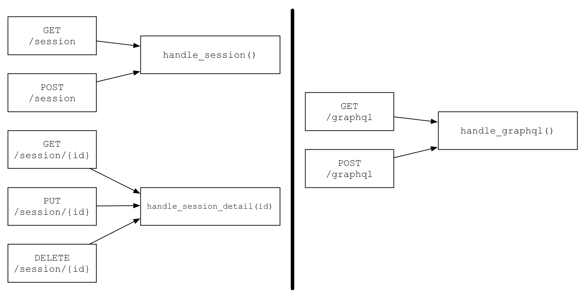
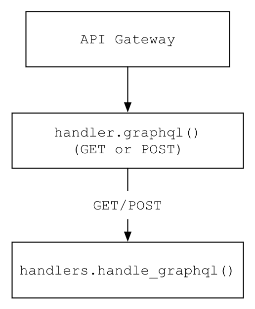
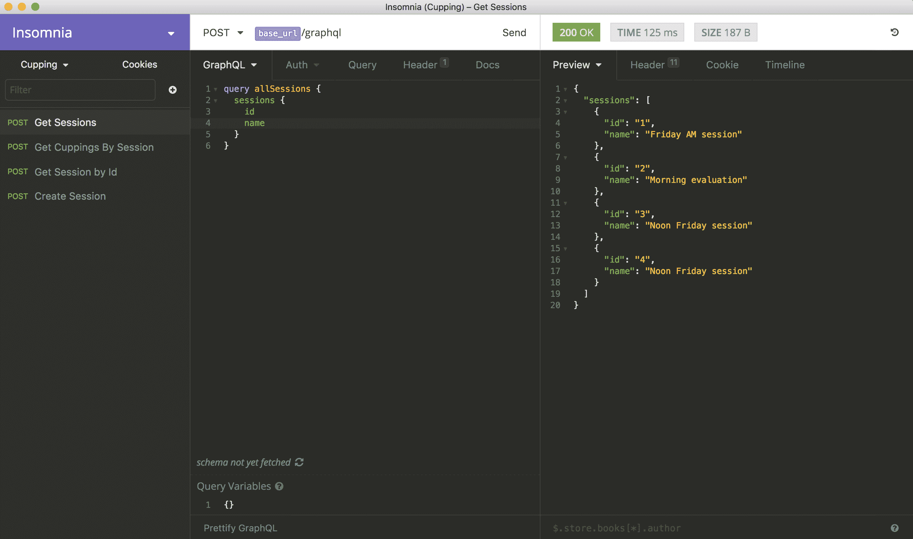
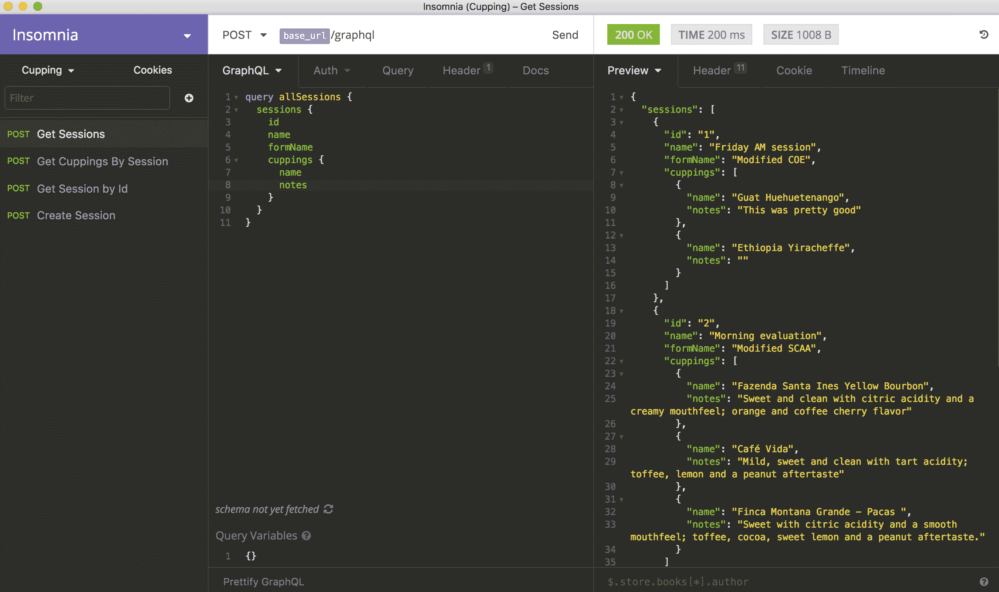
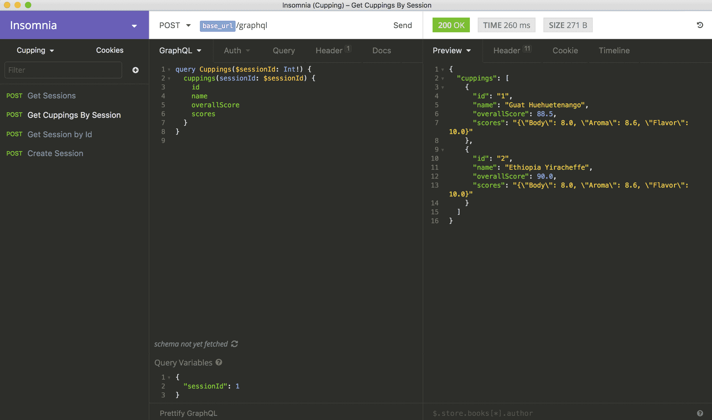

# 第三章：基于 GraphQL 的三层 Web 应用程序模式

在第二章“使用 REST 的三层 Web 应用程序”，我们介绍了在无服务器系统上编写 REST API 的整个过程，包括数据层和表示层的配套托管服务。我们的无服务器逻辑层使用 AWS Lambda 和 API Gateway 实现，这为部署、迭代速度和可扩展性提供了许多优势。REST API 在 Web 开发社区中得到了很好的理解，并且在构建新的基于 Web 的 API 时是一个安全的选择。然而，新兴的工具和协议正在形成，为我们提供了 REST 的替代方案。GraphQL 可以说是最近最流行的 REST API 替代方案之一，这从 AWS 和其他平台发布托管 GraphQL 服务中可以看出。你不需要深入挖掘就能发现 GraphQL 的受欢迎程度正在上升。

在本章中，我们将介绍将三层示例 API 更新为使用 GraphQL 接口而不是 REST 接口的过程。这些更改将仅关注逻辑层，因为数据层将完全不变。我们将学习如何设置和编写一个单一的 GraphQL 无服务器端点，而不是像基于 REST 的设计那样多个端点。

在本章中，我们将探讨和讨论以下内容：

+   如何使用 AWS Lambda 和 Python 编写 GraphQL API

+   GraphQL 与 REST 无服务器应用程序之间功能布局的差异

+   如何作为客户端查询我们的 GraphQL 端点

# GraphQL 简介

REST 已经存在了近 20 年，并且仍然是内部和公共 Web API 的一个流行选择。尽管 REST 如此受欢迎，但它确实有其缺陷，更多的是一个理念，而不是一个规范。任何设计或与第三方 API 合作过的人都知道，从一种 API 到另一种 API 在实现和设计选择上往往重叠很少。这最多使得使用或设计 REST API 具有挑战性。在接触新的 REST API 时，总是需要探索各种 API 端点，寻找所需的数据，理解不同的资源类型及其相互关系，等等。当然，当与新的 API 一起工作时，总会有一段时间的投资和发现，以学习将要工作的数据。

Facebook 于 2012 年在内部设计了 GraphQL，并于 2015 年向公众发布。GraphQL 是新生事物，作为 REST 的替代品正在获得大量关注。虽然最终目标与 REST 相同（从客户端获取数据到服务器），但实现和机制却截然不同。也许与 REST 最不同的是，GraphQL 是一个客户端和服务器实现可以参考并达成一致的规范。相比之下，REST 是一套原则和思想，容易受到解释的影响。GraphQL 定义了一种新的查询语言，并允许客户端一致地请求所需的数据。在 REST 中，返回值的添加、删除或排列通常需要服务器端代码更改。在 GraphQL 中，客户端能够根据查询逐个定义返回负载的结构。对于客户端来说，REST API 的边界是在特定时间点提供的端点和它们的返回值，而在 GraphQL API 中的限制是 API 的全域。

GraphQL 是一个庞大且复杂的话题。它相对较新，尤其是与 REST 和其他 Web 技术相比。由于 GraphQL 消化了 Web API 的许多复杂性，关于 GraphQL 的任何对话很快就会变成关于 GraphQL 本身的细节讨论。在本章中，我试图提供足够的 GraphQL 细节来展示底层无服务器模式。如果你在阅读过程中或本章结束时想要更深入地了解 GraphQL，我鼓励你阅读许多关于这个主题的文章和博客文章。以下是从 Facebook 开始的极好介绍：[`reactjs.org/blog/2015/05/01/graphql-introduction.html`](https://reactjs.org/blog/2015/05/01/graphql-introduction.html)。[`reactjs.org/blog/2015/05/01/graphql-introduction.html`](https://reactjs.org/blog/2015/05/01/graphql-introduction.html)

简而言之，与 GraphQL API 一起工作的客户端可以获取他们确切需要的数据，不多也不少。当使用 GraphQL 时，过度获取（获取比客户端需要的更多数据）和不足获取（需要多次 API 调用才能获取客户端需要的数据）的问题消失了，这在 Facebook 设计 GraphQL 时是一个重要的推动因素，并为客户端提供了许多好处。GraphQL 另一个令人兴奋且强大的特性是它不是一个仅限 HTTP 的规范。虽然 HTTP 目前是主要用例，但 GraphQL 并没有直接绑定到 HTTP，并且可以与其他传输协议一起使用。

# 系统架构

我们的系统架构在高级别上将与我们的示例应用的 REST API 版本相同。来自网络的请求将击中由 S3 支持的 CloudFront CDN，我们的 JavaScript 代码将从提供的 HTML 文件中查询无服务器 API，该 API 本身将与由 RDS 支持的数据层进行通信：



从自上而下的角度思考这个应用程序，获取数据的步骤将取决于逻辑层的实现方式：

+   最终用户请求网站

+   静态资源通过 CloudFront 和 S3 提供给用户

+   静态资源通过逻辑层/网络 API（在这种情况下是 GraphQL）请求数据

+   逻辑层从数据层中的 Postgres 数据库获取/写入数据

将我们的示例 Web 应用程序从 REST 设计迁移到 GraphQL 意味着关注**逻辑层**，因为表示层和数据层不会改变太多，如果有的话。当然，对我们 API 的任何更改都意味着我们的表示层（即客户端）需要更改；然而，由于这并不是我们的主要关注点，我们不会深入探讨客户端方面的更改。

你可以在这个章节的以下仓库中找到所有代码：

[`github.com/brianz/serverless-design-patterns/tree/master/ch3`](https://github.com/brianz/serverless-design-patterns/tree/master/ch3)

# 逻辑层

GraphQL 简化了客户端的生活，因为它有一个单一的 HTTP 端点。在某种程度上，这使得无服务器 GraphQL API 的模式极其简单，在某种程度上又相当单调。

如果我们从零开始构建这个 GraphQL Web 应用程序，将会有很多决策要做，有很多材料要覆盖，以使我们的应用程序代码模块化、易于测试和设计良好。由于我们正在移植示例 REST Web 应用程序，我们已经实现了大部分所需的功能和软件层。这些部分可能看起来比预期的要简短，尤其是如果你跳过了第二章，*使用 REST 的分层 Web 应用程序*。任何代码组织或布局、配置策略、部署等方面的空白都可以通过回顾第二章，*使用 REST 的分层 Web 应用程序*来填补。

# Lambda 函数的组织

REST API 是围绕资源构建的，每个资源都有自己的 URI，部分原因是为了给客户端提供一个已知或可预测的交互方式。GraphQL 采取了不同的方法。请注意，GraphQL 中的*QL*代表*查询语言*。数据获取逻辑被移动到查询语言本身，而不是像 REST 那样分散在不同的 API 端点。客户端不再需要经历以下过程：

+   确定他们需要什么资源以及它在 URL 列表中的位置

+   查找文档以确定输入参数和输出数据

+   如果适用，阅读有关分页或返回数据限制的文档

当前可在[`facebook.github.io/graphql/October2016/`](http://facebook.github.io/graphql/October2016/)找到的正式规范从绝对角度定义了 GraphQL。与任何规范一样，任何旨在向用户提供 GraphQL 功能的框架或库都必须遵守这一正式合同。客户端和服务器都在这一规范的范围内工作，以确保处理常见功能的方式是统一的。为了保持这些点的上下文，这一功能的逻辑是在单个端点中实现的，因此是 Lambda 函数，无论请求的资源或任何其他数据。

以下图表显示了从 REST API 迁移到 GraphQL 在支持的 URL 和后端函数方面的样子：



如我们在第二章，*使用 REST 的**三层 Web 应用**中看到的那样，在无服务器系统中，REST API 是由一个或多个 API 端点的无服务器函数（AWS Lambda 或类似）组成的。随着 API 的增长，无服务器函数的数量也会增加。

与此相反，GraphQL 包含了整个 API 的所有逻辑，包括数据的创建、读取和更新。从前面的图中可以看出，无论系统如何变化，支持 GraphQL API 的后端无服务器函数都不需要做出任何更改。业务逻辑或应用逻辑的任何更改都封装在应用代码中，而不是需要更改 URL 结构，从而更改无服务器函数或布局。

对于本章，我们将专注于一个 AWS Lambda 函数和一个 HTTP 端点，该端点将处理所有 GraphQL 请求。请注意，然而，GraphQL 客户端可以通过`GET`和`POST`两种方式发出请求，因此我们的 Lambda 函数将配置为处理这两种请求类型。

您可以在官方文档中找到更多关于通过 HTTP 提供 GraphQL 的详细信息，文档地址为[`graphql.org/learn/serving-over-http/`](http://graphql.org/learn/serving-over-http/)。[`graphql.org/learn/serving-over-http/`](http://graphql.org/learn/serving-over-http/)

# 应用代码的组织结构

如前所述，组织无服务器函数和应用代码并不完全相同。在 GraphQL 系统中，作为开发者的我们生活稍微舒适一些，因为只有一个端点需要支持。我们的应用代码的整体组织结构并没有从 REST API 中改变。唯一真正的变化是，将会有更少的**应用代码**需要管理，但整体布局、结构和路由策略将不会发生任何变化。有关详细信息，读者可以查阅第二章，*使用 REST 的**三层 Web 应用**。

在 GraphQL 实现中保持不变的 API 的其他部分如下：

+   通过环境变量进行配置策略

+   整体代码结构和布局

# 函数布局

我们的 GraphQL 端点将由单个 AWS Lambda 函数处理，通过 `GET` 或 `POST` HTTP 方法。为了完整性，AWS API Gateway 请求到 AWS Lambda 函数的图如下：



虽然审查这一点可能显得有些繁琐，但我认为强调这种模式的简单性和采用 GraphQL 所获得的优点很重要。当然，总是有权衡，GraphQL 也不例外。由于大量功能被推到逻辑层，你大部分的时间可能都会花在应用程序代码上，确保你的 API 提供与之前相同的功能，并学习 GraphQL 的细节。由于我不是 GraphQL 专家，并且 GraphQL 不是本书的主要主题，我们不会涵盖所有可能的 GraphQL API 场景和功能。

# 表示层

在 [第二章](https://cdp.packtpub.com/serverless_design_patterns_and_best_practices/wp-admin/post.php?post=50&action=edit#post_27)，*使用 REST 的三层 Web 应用程序*中，我们的 React 应用程序正在向我们的 REST 端点发起 API 调用。我们构建的这个 REST API 返回 JSON，我们的前端代码可以轻松消化并将其输入到我们的 React 代码中，用于渲染 UI 元素。

在将 API 更改为基于 GraphQL 之后，我们的前端代码在数据获取部分需要做相当大的改变。GraphQL 与 REST 的行为非常不同，REST 端点（返回已知数据集）与 GraphQL 之间没有对应关系。每个 GraphQL 查询都是独特的，因为客户端负责请求特定的数据集。

我们不会回顾前端代码的更改。在撰写本文时，Apollo 和 Relay 是前端 GraphQL 的流行选择。Apollo 来自 Meteor 开发组，而 Relay 背后有 Facebook。两者都是开源的，在 GraphQL 社区中很受欢迎。互联网上到处都是这两个主题的资源，鼓励读者自行学习更多。对于本章，我们将使用 API 客户端与我们的 GraphQL 后端进行交互。

# 编写逻辑层

添加此 GraphQL 端点将包括以下内容：

+   添加新的入口点以处理新的 Lambda 函数

+   将 HTTP 有效负载（即 GraphQL 查询或突变）传递给一个将执行 GraphQL 代码的函数

承认，GraphQL 还相对较新，库和生态系统在我的经验中还没有完全完善或丰富文档。尽管如此，仍然可以快速取得进展，一旦基础知识解决，GraphQL 本身就允许实现广泛的功能。

由于咖啡杯测示例应用程序是使用 Python 实现的，我们将继续沿着这条路径前进，并使用一些额外的库来增强 GraphQL。在撰写本文时，Graphene 是 Python 中处理 GraphQL 的事实上的库。除了基本库之外，还有其他几个库可以简化与各种数据存储库的工作。幸运的是，对于我们来说，其中一个附加库是 Graphene-SQLAlchemy，它将与我们自己的 SQLAlchemy 代码一起工作。

你可以在[`graphene-python.org`](http://graphene-python.org)了解更多关于 Graphene 及其相关集成信息。[`graphene-python.org`](http://graphene-python.org)

# 实现入口点

随着新增的一个 Lambda 函数，该函数将响应`/graphql`端点的请求，我们需要在我们的现有`handler.py`文件中添加一个新条目。为了与文件中的其他处理程序保持一致性，该函数将执行以下操作：

+   从请求中提取 HTTP 方法和有效载荷

+   将 HTTP 方法和有效载荷传递给另一个函数进行处理

+   构建并返回最终的响应给 API 网关：

```java
        def graphql(event, context):
        http_method = event['httpMethod']

        response = handle_graphql(http_method, event)
        status_code = 200

        response = {
          'statusCode': status_code,
          'body': json.dumps(response),
          'headers': CORS_HEADERS,
        }

        return response
```

在这个函数中没有什么太多的事情要做，可以看到大部分的逻辑都在`handle_graphql`函数中，我们在文件顶部导入了这个函数，它位于`cupping/handlers/graphql.py`。使用这种模式非常有帮助，因为我们的所有路径设置已经完成，其他标准代码，例如`cors`头，也已经完成。

# 实现 GraphQL 查询

在移除了样板代码之后，现在是时候专注于我们的实际 GraphQL 实现了。许多为 REST API 提供动力的软件层也将为 GraphQL API 提供动力，特别是模型/验证层和持久化/SQLAlchemy 层。

如果你刚开始接触 GraphQL，了解有两种类型的操作，GraphQL 会以不同的方式处理它们，并且需要稍微不同的代码，至少当使用 Python 和 Graphene 时是这样。这两个动作是查询和突变，或者说是读取和写入。在本节中，我们将介绍查询。此代码提供了我们示例 API 中每个查询交互的所有功能。此代码每个部分的详细信息将在后续章节中讨论。主要入口点是此处理程序的`handle_graphql`函数：

```java
import json
import graphene

from graphene_sqlalchemy import SQLAlchemyObjectType

from .decorators import decode_json

from ..models import SessionModel
from ..persistence.cupping import Cupping
from ..persistence.session import Session
from ..persistence.queries import (
        get_cuppings,
        get_sessions,
)

class CuppingObject(SQLAlchemyObjectType):
    class Meta:
        model = Cupping

class SessionObject(SQLAlchemyObjectType):
    class Meta:
        model = Session

class Query(graphene.ObjectType):
    sessions = graphene.List(SessionObject, id=graphene.Int(), 
    account_id=graphene.Int())
    cuppings = graphene.List(CuppingObject, session_id=graphene.Int())

    def resolve_cuppings(self, info, **filters):
        return get_cuppings(**filters)

    def resolve_sessions(self, info, **filters):
        return get_sessions(**filters)

# Global schema which will handle queries and mutations
schema = graphene.Schema(
        query=Query,
        types=[CuppingObject, SessionObject],
)

@decode_json
def _handle_graphql(payload):
    query = payload['query']
    variables = payload.get('variables', {})
    result = schema.execute(query, variable_values=variables)
    success = True if not result.errors else False
    return success, result

def handle_graphql(http_method, payload):
    success, result = _handle_graphql(payload)
    if not success:
        errors = []
        for e in result.errors:
            try:
                e = json.loads(e.message)
            except:
                e = str(e)
            errors.append(e)
        return {'errors': errors}
    return result.data
```

上一段代码实现了与我们的 REST API 的 `GET` 端点相同的功能，获取所有 `cupping` 会话和单个 `cupping` 会话的列表。从顶层的 `handler.py` 开始，`handle_graphql` 函数接受一个 HTTP 方法，这个方法甚至没有被使用，以及来自请求的 JSON 编码的有效负载。从那里，它被传递给一个小型的辅助函数，该函数通过我们之前编写的装饰器解码 JSON 有效负载。一些轻量级的错误处理确保错误以正确的格式返回。这个函数最终返回一个包含错误或 GraphQL 执行结果的 Python 字典。最终，这个字典被 JSON 编码并返回给客户端，正如我们在 `handler.py` 中所看到的。

`Query` 类是大多数（如果不是所有）功能发生的地方，用于从我们的后端获取数据。我们的 API 有两个主要资源，`Session` 和 `Cupping`。由于我们使这个 API 与我们的 REST API 具有功能一致性，两个类属性将使我们能够响应对 `cuppings` 或 `sessions` 的查询：

```java
    class Query(graphene.ObjectType):
      sessions = graphene.List(SessionObject,
         id=graphene.Int(), account_id=graphene.Int())
      cuppings = graphene.List(CuppingObject, 
         session_id=graphene.Int())

      def resolve_cuppings(self, info, **filters):
          return get_cuppings(**filters)

      def resolve_sessions(self, info, **filters):
          return get_sessions(**filters)
```

以 `sessions` 为例，我们将 `sessions` 属性定义为 GraphQL 对象的列表，其中列表中的每个项目都是一个 `SessionObject`。幸运的是，`SessionObject` 的实现非常简单，因为我们可以利用 Graphene-SQLAlchemy 将 Session SQLAlchemy 模型映射到兼容的 Graphene 对象类型。实际上，我们完全可以自己完成这项工作，但这将需要手动构建一个将 SQLAlchemy 字段映射到 Graphene 字段的对象，并编写更多的代码。Graphene-SQLAlchemy 自动处理所有这些工作。

向 `graphene.List` 传递了两个额外的关键字参数，`id` 和 `account_id`。当我们构建 `Query` 项目时，需要明确定义我们想要用于查询的属性。添加 `id` 和 `account_id` 意味着 API 现在可以接受来自客户端的任一或两个字段，并使用它们来过滤结果。请注意，尽管只有细微的改进，但我们已经超越了 REST API 的功能。通过添加 `account_id` 作为查询字段，我们为我们的 API 提供了 REST 版本中不存在的新功能。此外，这个 GraphQL API 可以返回一个包含 `cupping` 资源的列表，这在 REST API 中是不可能的。如果你考虑将此功能添加到 REST API 的步骤，我们需要添加一个新的端点来返回单独的新 `cupping` 资源，或者提出一个全新的 API 端点，或者将一些查询参数作为 `GET` 参数来过滤 `Sessions`。虽然两种方法都可以工作，但应该清楚，这反映了 REST API 中的一些不一致性和解释区域。在这里，添加查询参数到 GraphQL 查询的方式只有一个，且仅有一个。

现在我们已经定义了返回值，但仍需实际获取数据。Graphene 通过要求一个以`resolve_`开头的方法来获取我们已实现的任何资源，使得这个过程变得非常简单。前面代码中的`resolve_sessions`和`resolve_cuppings`两个解析函数调用了我们的 SQLAlchemy 查询函数，并且还传递了通过之前描述的`graphene.List`属性上定义的额外关键字参数到达的任何过滤器。这两个解析函数都将返回 SQLAlchemy 对象的列表；然而，因为请求数据的属性本身被定义为`SQLAlchemyObjectType`，所以 SQLAlchemy 的返回值被转换成正确的数据类型以满足 GraphQL 查询。

本章后面的几个示例查询可能有助于巩固数据流和代码。

# 实现 GraphQL 突变

在查询之后是突变，这是一种写入或以其他方式转换数据的操作。在我们的 API 中，我们将实现一个突变，该突变将创建新的`Session`记录，这些记录本身有伴随的 cupping 记录。同样，我们能够重用辅助函数和代码来执行一些这项工作，并专注于 GraphQL 代码。以下是对`handlers/graphql.py`代码的以下添加，实现了创建新的`Session`记录。在创建`schema`对象时，我们传入了对我们的`Mutation`类的引用：

```java
class CuppingInput(graphene.InputObjectType):
    name = graphene.String(required=True)
    scores = graphene.types.json.JSONString()
    overall_score = graphene.Float(required=True)
    notes = graphene.String()
    descriptors = graphene.List(graphene.String)
    defects = graphene.List(graphene.String)
    is_sample = graphene.Boolean()

class CreateSessionMutation(graphene.Mutation):

    class Arguments:
        name = graphene.String()
        form_name = graphene.String()
        account_id = graphene.Int()
        user_id = graphene.Int()
        cuppings = graphene.List(CuppingInput)

    ok = graphene.Boolean()
    session = graphene.Field(SessionObject)

    def mutate(self, info, *args, **kwargs):
        session = create_session_from_kwargs(kwargs)
        return CreateSessionMutation(session=session, ok=True)

class Mutation(graphene.ObjectType):
    create_session = CreateSessionMutation.Field()

# Global schema which will handle queries and mutations
schema = graphene.Schema(
        query=Query,
        mutation=Mutation,
        types=[CuppingObject, SessionObject],
)
```

首先，请注意，`Mutation`类是所有需要定义并传递给我们的`Schema`的突变的包装器。就像`Query`类一样，`Mutation`类将指定一个或多个突变类型，这些类型本身是`graphene.Mutation`的子类。`Mutation`类的入口点是`mutate`方法。

在调用`mutate`方法之前，类需要定义一组输入属性，这些属性将接受用于创建新数据的实际输入数据。在这种情况下，我们需要手动使用原始的`graphene`类型来识别输入数据类型。查看`Arguments`类，你应该能够看到它与 SQLAlchemy 模型之间的一对一对应关系。GraphQL 对象可以嵌套任意深度，这可以从之前的例子中看到，其中`cuppings`属性是一个`CuppingInput`对象的列表，它本身是我们 API 的特定自定义输入类型。

正如在`Query`属性的`resolve_`函数中一样，`mutate`方法最终将记录的创建委托给一个现有的 SQLAlchemy 函数。客户端的 GraphQL 突变中所有输入数据都以`kwargs`的形式传递给`mutate`。这些以 Python 字典形式存在的键值对用于创建模型、验证，并最终将新记录写入数据库。在这个阶段，任何验证错误都由我们的模型层处理，并将错误向上冒泡到客户端。

# 部署

随着新的 Lambda 函数的出现，我们需要部署我们的代码，这需要通过 `sls deploy` 进行完整部署。作为提醒，每次你添加、删除或以其他方式更新 AWS 资源时，都需要完整的 `CloudFormation` 更新。我们需要在 `serverless.yml` 文件中添加几个新条目，这将调用新的 `graphql` 处理程序函数：

```java
    functions:
     GraphQL:
       handler: handler.graphql
       events:
         - http:
             path: graphql
             method: get
             cors: true
         - http:
             path: graphql
             method: post
             cors: true
```

GraphQL 将接受 `GET` 和 `POST` 请求，因此我们将方法连接到相同的 `/graphql` 端点并确保我们启用了 CORS。

由于我们正在使用新的库，Graphene 和 Graphene-SQLAlchemy，我们需要更新我们的需求文件并重新构建我们的支持库。我已经将以下库添加到 `requirements.txt` 文件的特定提交中：

```java
git+https://github.com/graphql-python/graphene-sqlalchemy.git@08a0072
```

Graphene 是 Graphene-SQLAlchemy 的一个要求，所以我们通过这个单一的要求获取这两个库。

我们使用我们的 Docker 容器作为构建工具：

```java
brianz@gold(graphql=)$ ENV=dev make shell
root@7466ff009753:/code#
root@7466ff009753:/code# make libs 
pip install -t serverless/lib -r requirements.txt 
Collecting git+https://github.com/graphql-python/
 graphene-sqlalchemy.git@08a0072 (from -r requirements.txt
 (line 8)) 
 Cloning https://github.com/graphql-python/
 graphene-sqlalchemy.git (to 08a0072) to /tmp/pip-3tnr1e2k-build 
 Could not find a tag or branch '08a0072', assuming commit.
```

现在，可以安全地进行完整部署，如下所示：

```java
root@a2484038a502:/code# make deploy
cd serverless && sls deploy -s dev
Serverless: Packaging service...
Serverless: Excluding development dependencies...
Serverless: Uploading CloudFormation file to S3...
Serverless: Uploading artifacts...
Serverless: Uploading service .zip file to S3 (5.55 MB)...
Serverless: Validating template...
Serverless: Updating Stack...
Serverless: Checking Stack update progress...
..........................
Serverless: Stack update finished... 
Service Information 
service: coffee-cupping 
stage: dev 
region: us-west-2 
api keys: 
None 
endpoints: 
GET - https://4mvnd1tewe.execute-api.us-west-
 2.amazonaws.com/dev/graphql 
POST - https://4mvnd1tewe.execute-api.us-west-
 2.amazonaws.com/dev/graphql GET - https://4mvnd1tewe.execute-api.us-west-
 2.amazonaws.com/dev/session 
POST - https://4mvnd1tewe.execute-api.us-west-
 2.amazonaws.com/dev/session 
GET - https://4mvnd1tewe.execute-api.us-west-
 2.amazonaws.com/dev/session/{id} 
DELETE - https://4mvnd1tewe.execute-api.us-west-
 2.amazonaws.com/dev/session/{id} 
functions: 
GraphQL: coffee-cupping-dev-GraphQL 
HandleSession: coffee-cupping-dev-HandleSession 
HandleSessionDetail: coffee-cupping-dev-HandleSessionDetail 
```

因此，我们有一个新的 `/graphql` 端点，它接受 `GET` 和 `POST` 请求。接下来，是时候在我们的无服务器端点上测试一些 GraphQL 查询了。

聪明的读者可能会注意到示例部署之间根 URL 的变化。在开发过程中，这种情况经常发生，因为你经常会部署新的堆栈，然后在不再需要时将其拆除。对于每次部署，API Gateway 通过 CloudFormation 创建一个唯一的基 URL。当然，如果这是一个生产 API，你不会每晚拆除你的无服务器堆栈并在早上重建它。

# 查看已部署的应用程序

学习 GraphQL 语言本身就是一个主题。在本节中，我将展示在 macOS 上的 Insomnia 客户端使用的一些查询和突变。Insomnia 是一个客户端应用程序，可以用来发送标准的 REST API 请求，并且在与 GraphQL 端点一起工作时还有一个漂亮的 GraphQL 界面。

一个简单的查询以获取拔罐疗程列表，只返回 `Sessions` 的 ID 和名称，如下所示：

```java
    query allSessions { 
      sessions {
        id
        name
      }
    }
```

当你回想起 `Query` 类的实现时，你可能会记得以下内容：

```java
    class Query(graphene.ObjectType):
      sessions = graphene.List(SessionObject, id=graphene.Int(),    
         account_id=graphene.Int())
```

希望现在事情变得清晰起来。前面的查询被命名为 `allSessions`，在其中明确请求 `sessions`。我们的 GraphQL 代码相应地通过注意到查询是关于 sessions 的并调用 `resolve_sessions` 函数来响应。以下截图显示了使用 Insomnia 客户端的 `allSessions` 查询：



这很棒，返回的数据可能足以满足拥有所有`Sessions`列表的客户端。但当我们想要更多数据时会发生什么？在 GraphQL 中，我们只需请求我们所需的数据。假设我们的客户端应用程序现在想要一个`Sessions`的列表，但包含一些额外的字段，包括每个`Session`相关的`cupping`对象。为了完成这个任务，我们更新要发送到`/graphql`端点的查询模式。而不是只请求`id`和`name`，我会添加`formName`，以及相关`cuppings`项的两个属性：

```java
    query allSessions { 
      sessions {
          id
          name
          formName
            cuppings {
                name
                notes
            }
      }
    }
```

以下截图显示了 Insomnia 客户端中的此查询及其响应：



我必须承认，当我看到这个功能有多容易控制输出时，我非常兴奋。那么如果我们需要过滤一些数据怎么办？记得我们 REST API 中不存在的 API 现在有了？让我们获取与单个`Session`相关的所有`cupping`对象：

```java
    query Cuppings($sessionId: Int!) { 
      cuppings(sessionId: $sessionId) {
         id
         name
         overallScore
         scores
      }
    }
```

再次，让我们将这一点与我们应用程序代码联系起来，并记住我们的`Query`类中的`cuppings`属性。在`Query`内部，我们有以下内容：

```java
    cuppings = graphene.List(CuppingObject, 
       session_id=graphene.Int())
```

Graphene 确实包含一些自动将输入和输出数据转换为*CamelCase*的魔法。尽管`cuppings`属性指定`session_id`作为输入过滤器，但客户端使用`SessionId`。最终结果是 Python 代码接收`session_id`作为关键字参数传递给 SQLAlchemy 查询。结果是 SQLAlchemy 执行类似于以下 SQL 语句的查询：

```java
     select * from cuppings where session_id = 1
```

以下截图显示了一个 GraphQL 查询，该查询将根据我们的 GraphQL API 中的数字 ID 获取单个`Session`：



最后，让我们来看看我们的代码中的变异部分，并创建一些新的数据。你可能期望这会相当简单，大部分确实是这样的。有一点小复杂的是，数据库中的杯测分数字段是 PostgreSQL JSONB 类型，这提供了最大的灵活性。输入 JSON 需要转义这个字段，这也是变异请求中所有反斜杠的原因。以下是一个创建新`Session`记录的 GraphQL 变异代码片段：

```java
    mutation CreateSession { 
      createSession (
        name: "Noon Friday session"
        formName: "Roastery custom"
        accountId: 234
        cuppings: [
        {
          name: "Ethiopia Cochere"
          overallScore: 91
          scores: "{\"Aroma\": 10, \"Flavor\": 9, \"Body\": 8, 
                \"Clean Cup\": 6}"
          descriptors: ["port-wine" "chocolate"]
          notes: "deep and dark"
        }
        ]
      ) 
       {
         ok
         session {
           id
           name
           formName
           cuppings {
             sessionId
             name
             overallScore
             scores
             defects
             descriptors
             notes
           }
         }
       }
    }
```

我不会详细说明所有应用程序代码，但总的来说，我们的请求向应用程序发送一个`createSession`变异。这个输入负载直接映射到`Mutation`类上的`create_session`属性，这得益于 Graphene 的自动*CamelCasing*：

```java
    class Mutation(graphene.ObjectType):
       create_session = CreateSessionMutation.Field()
```

在前面的变异中，输入数据相对较小。更详细的是返回值的部分。我们的变异返回一个`ok`属性，它是一个布尔值，以及新创建的`Session`资源。正因为如此，我们的变异可以精确地请求新创建的资源所需的内容。

以下截图显示了在 Insomnia 客户端中创建新`Session`记录时的输入和输出：


GraphQL 有很多东西可以提供，我只希望有更多的时间来介绍它。

# 迭代和部署

在使用现有仓库开发此代码时，我反复需要只更新堆栈中的 GraphQL 部分。使用 Serverless Framework 及其更新单个 Lambda 函数的能力使得这个过程变得非常简单。通过`Makefile`中的快捷方式，部署单个函数看起来如下：

```java
root@7466ff009753:/code# make deploy function=GraphQL 
cd serverless && sls deploy function -s dev -f GraphQL 
Serverless: Packaging function: GraphQL... 
Serverless: Excluding development dependencies... 
Serverless: Uploading function: GraphQL (5.74 MB)... 
Serverless: Successfully deployed function: GraphQL 
root@7466ff009753:/code# make deploy
```

给出精确数字比较困难，但经过代码迭代后的部署大约需要两到五秒。部署速度主要取决于你的上传速度和应用程序包的最终大小。

当然，迭代和添加新代码意味着需要编写更多的测试。无服务器应用程序可能有点棘手，因为你可以编写一套丰富的单元测试，但最终部署的应用程序可能会因为堆栈中更高层次的缺失或假设性测试而失败。我的建议是编写合适的单元测试组合，不要过于学术化，同时编写一套非常丰富的集成测试，作为最高级别的实际代码。

使用具体的例子，上面的 GraphQL 查询和突变代码是 100%经过测试的，`cupping.handlers.graphql.handle_graphql`函数也是如此。这种策略确保了所有的错误处理、有效载荷的 JSON 解码和其他实用代码都按预期运行，除了测试 GraphQL 业务逻辑。

# 摘要

在本章中，我们通过使用 GraphQL 接口创建三层无服务器架构的 Web 应用程序的整个过程。这个应用程序的大部分内容与相同应用程序的 REST 版本相似。我们学习了从 REST 接口和设计迁移到 GraphQL 设计所需的变化，这既包括应用程序代码的视角，也包括无服务器函数的视角。

读者现在应该对在无服务器架构中采用 GraphQL 接口的优势有一个高层次的理解，并且拥有足够的知识来开始实现他们自己的无服务器 GraphQL 应用程序。

在第四章，“使用代理模式集成遗留 API”，我们将探讨另一种代理客户端通过无服务器应用程序向遗留 API 发送 API 请求的 Web 应用程序模式。
