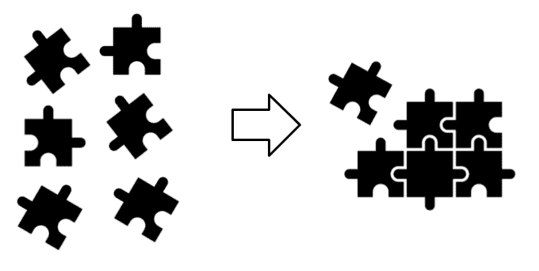
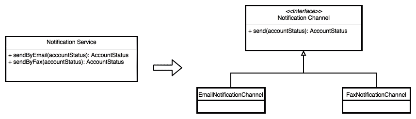

# 第一章：今天的软件架构

在本章中，我们将回顾软件架构是什么，以及为什么它今天仍然很重要。我们还将讨论近年来引导软件开发世界的新业务需求，以及它们如何影响整个软件行业。

软件和技术每天都在发展，引入了新的需求，企业必须满足这些需求，以保持在竞争激烈的市场中的竞争力。无论其核心业务如何，每个有竞争力的公司都必须转向技术。在线交易和全球客户只是必须掌握的一些挑战，以保持领先地位。

为了支持这些新需求，我们一直在发现新的工作方式。已经进行了重大的变革，并被采纳，直接影响了我们的软件开发生命周期。这些变化的一些例子反映在我们如何在以下阶段工作上：

+   收集需求

+   组织团队

+   设计软件架构

+   编写代码

+   部署应用程序

在本章中，我们将重新审视软件架构的基本概念，这些概念已经存在很长时间，而且今天仍然很重要。

本章将涵盖以下主题：

+   定义软件架构

+   创建架构时常见的错误

+   架构和架构师

+   软件架构原则

+   应用高内聚和低耦合来创建组件

+   SOLID 原则

+   康威定律

+   为自己选择合适的技术

+   新技术趋势

# 定义软件架构

无论某人是否在团队中担任软件架构师的角色，每个应用程序都有一个需要有人负责的架构。这是一个重要的步骤，因为它帮助我们避免编写纠缠不清的代码，这使得软件系统在未来无法发展。

首先要明确的是：为了知道为什么需要记住软件架构，我们首先需要了解它是什么，以及为什么它很重要。

在软件中，“架构”这个词很难定义。作者们经常从建筑行业借用定义，这是错误的。软件架构不仅仅是关于图表，比如建筑或房屋的计划 - 它不仅仅是这些。它关乎技术甚至非技术人员对整个团队正在创建的应用程序的共享知识，模块如何连接以塑造它，以及围绕它的所有复杂和重要元素。良好的软件架构主要关注业务需求，而不是框架、编程语言、图表和编程范式。当然，我们需要这些，因为我们使用它们来创建应用程序。但是，它们不必定义我们构思软件的基本原则。相反，这个角色应该根据业务需求来发挥作用。

应用程序的长期成功主要取决于其架构，这必须是为了支持一组明确定义的业务需求而创建的，正如前面提到的。由于应用程序需要解决这些特定需求，它们必须引导应用程序的架构。然而，有两种主要情况下，我们基于技术而不是业务需求来指导软件架构决策：

+   我知道我的领域

+   我想保持领先

# 我知道我的领域

当我们使用已知的框架和编程语言创建软件架构时，而不是密切关注业务需求时，就会出现这种情况。

假设 ABC 公司需要一个用于处理大型日志文件中文本的应用程序。如果有人要求处理这个需求，那么他们在开发过程中会选择一种他们熟悉的编程语言，而不是在其他地方寻找最佳方法。

想象一下负责创建此应用程序的人已经精通 JavaScript。在这种情况下，您认为使用 Node JS 或另一个在服务器上运行的 JavaScript 框架编写代码来编写操作日志文件的应用程序是个好主意吗？我并不是说这是不可能的 - 您可以做到。但是，您认为使用这种方法创建的应用程序能够比使用 Perl、Python 或 C 等语言编写的系统表现和扩展得更好吗？这并不是说 JavaScript 很糟糕 - 只是重要的是要知道这种方法不适合 JavaScript。

# 我想保持领先

我们都希望保持技术领先，利用编程世界中的最新趋势来拥有更好的技术背景，从而获得很酷的工作。有些人倾向于在编写应用程序时牢记这一点。让我们使用前一节中提到的操作日志文件的应用程序示例来解释这种情况。

假设您被要求解决我们在“我了解我的土地”部分提到的问题。在这种情况下，您唯一关心的是技术。例如，假设您想尝试最新的 PHP 版本中的最新功能。在这种情况下，您将使用 PHP 构建此应用程序。尽管自从 Facebook 开始向其添加新功能以来，这种编程语言在过去几年中一直在改进，但使用 PHP 编写应用程序来操作大型日志文件的想法是疯狂的。正如您可能知道的那样，这种编程语言旨在创建其他类型的应用程序，主要是那些必须使用 Web 浏览器访问且没有高事务要求的应用程序。

再次，您可以使用 PHP 编写应用程序来操作大型日志文件，但是当需要更多功能时会发生什么？您认为以这种方式创建的软件架构能够快速响应新需求和本示例中使用的应用程序的固有特性吗？

# 预测未来

虽然我们在创建应用程序时无法预测每个细节，但我们可以牢记一些明显的假设，以避免明显的错误，就像在前面的部分中暴露的那些错误一样。即使您使用了错误的方法创建了一个应用程序，软件架构过程的一部分是定期评估代码库并根据此采取纠正措施。这很重要，因为现有的软件架构需要不断发展以避免变得无用。在开发过程中，因为我们不想错过已建立的项目截止日期，我们经常使用`FIXME`和`TODO`标签。但是，我们应该密切关注这些并尽快采取行动，因为它们代表随着时间推移而恶化的技术债务。想象一下在下一个迭代中摆脱最近引入的债务有多容易。现在，想象一下，如果添加了该债务的开发人员不再在项目上工作，甚至不在同一家公司内，那将会有多困难。

请记住，这些标签代表一种债务，债务会随着时间的推移而增加利息。

改进现有软件架构的过程有时倾向于比从头开始创建一个新的更有趣。这是因为您现在对业务需求以及应用程序在生产中的表现有更多信息。

当您向现有应用程序添加新功能时，您将会发现最初的想法有多好。如果添加新功能的过程简单，并且只需要对其结构进行少量更改，那么我们可以得出结论，软件架构正在很好地发挥作用。否则，如果我们需要对原始设计的基本部分进行重大更改，我们可以说最初的想法和假设都是错误的。然而，在这一点上，负责产品的团队应该有足够的责任心，使其不断发展，而不是编写额外的补丁来支持新功能。

尽管修补某些东西听起来与使其发展类似，但实际上并不是。这个想法在《构建进化架构》一书中得到了清楚的解释，该书由 Neal Ford、Rebecca Parsons 和 Patrick Kua 撰写。

积极的团队不断应用变化，使其能够更好地支持现有和新功能，而不是坐等混乱失控。更改最初的设计没有错，总是值得的。以下图表说明了这个过程，应用于几何形状：


演变的原始设计

现在我们知道业务需求必须引导应用程序架构，我们可以得出结论，如果它无法支持新功能，那么新的商机将被错过，使应用程序及其架构变得无用。

# 架构和架构师

在敏捷和 DevOps 方法出现之前，架构师通常专注于创建编写代码的标准和规则。过去，常常会发现编写代码的架构师，但这种方法在编程方面目前已经过时。在过去的几年里，架构师的概念已经消失，这要归功于创建团队的新兴模式。敏捷运动在软件行业已经存在一段时间，帮助我们重新思考我们如何构建软件和组织团队。

如今，几乎不可能找到有架构师与之合作的软件团队。此外，使用独立样式（一个任务必须在开始新任务之前完成）的组织中，将不同的人员组成不同的团队的想法正在消失。几年前，我们有明确定义的角色，甚至为以下角色设立了专门的部门：

+   业务分析师

+   开发人员

+   QA 工程师

+   架构师

+   数据库管理员

+   在基础设施上工作的人员

+   运营

+   安全

以下图表显示了团队使用独立样式的工作方式：


作为独立团队工作的团队

前面的列表在特定情况下也在增长。使用独立样式工作的团队过去通常致力于制作定义的工件，如文档、UML 图和通常不完整的其他东西。

这种方法正在改变，现在更常见的是由小型和多学科团队负责照顾应用程序的每一个细节。这种方法有助于创建具有强大技能的积极团队，使我们能够确保软件架构一直在发生。

显然，并非每个团队成员都具备从收集需求到将应用程序部署到生产环境的所有阶段所需的技能，但他们之间的沟通使我们能够减少技术差距，并更好地理解应用程序的整体情况。这是软件架构中最重要的方面之一。

这种共享的知识帮助团队不断改进现有的软件架构，克服最复杂的问题。负责编写软件的所有团队都可以理解正在开发的系统的细节，而不是将这一责任委托给一个人或一个部门。这种方法可能导致我们依赖于可能与应用程序创建的业务背景略有不同的人或团队。这是因为曾经参与项目但现在由于同时参与多个项目而不再积极参与的人无法完全理解每个系统的所有细节。

# 软件架构原则

遵循两个简单的原则可以改进软件架构，但通常很难实现：

+   低耦合

+   高内聚

无论使用什么编程语言、范例或工具来设计应用程序，这两个原则都应该在构建软件架构组件时指导你。

为了构建塑造你的架构的组件，始终遵循指导方针是值得的。即使在存在多年后，这些指导方针仍然相关，并且在创建组件时应始终考虑它们。在这一部分，我谈论的是 SOLID 原则和康威定律，我们将在本章后面更详细地讨论它们。现在是时候更详细地了解组件是什么了。

# 组件

组件是解决一个问题的一组函数、数据结构和算法。这意味着用于构建组件的所有代码和工件都与彼此具有高内聚性；规则是创建组件的类或文件应该同时且出于同样的原因而进行更改。

软件架构是由许多组件构建的，你不应该担心拥有过多的组件。你写的组件越多，就越自由地将它们分配给不同的开发人员甚至不同的团队。可以使用许多较小的组件创建大型软件架构，这些组件可以独立开发和部署。 

一旦我们将这些组件连接在一起，它们就允许我们创建所需的软件架构。

如下图所示，我们可以将组件看作是拼图的一部分，它们汇聚在一起形成一个应用程序：



组件构成了一个更大的应用程序

连接的组件定义了应用程序的架构，它们的设计描述了每个组件内部是如何创建的。在这里，必须使用模式设计和 SOLID 原则来创建良好的设计。

# 低耦合

低耦合指的是组件之间依赖于它们的低层结构而不是它们的接口的程度，从而在它们之间创建了紧密的耦合。让我们通过一个简单的例子来更容易理解。想象一下，你需要处理下一个用户故事：

*作为银行客户，我希望通过电子邮件或传真收到我的银行对账单，以避免必须打开银行应用程序。*

正如你可能会发现的，开发人员应该解决这个问题的两个方面：

+   增加在系统中保存用户偏好的能力

+   通过使用请求的通知渠道向客户发送银行对账单的可能性

第一个要求似乎非常直接。为了测试这个实现，我们可以使用一些相当简单的东西，比如以下代码：

```java
@Test 
public void 
theNotificationChannelsAreSavedByTheDataRepository() 
throws Exception 
{ 
  // Test here 
} 
```

对于第二个要求，我们需要读取这些首选通知渠道，并使用它们发送银行对账单。将指导这个实现的测试看起来像下面这样：

```java
@Test 
public void 
theBankStatementIsSendUsingThePreferredNotificationChannels() 
 throws Exception 
{ 
  // Test here 
} 
```

现在是时候展示一个紧密耦合的代码，以便理解这个问题。让我们看一下以下的实现：

```java
public void sendBankStatement(Customer customer) 
{
  List<NotificationChannel> preferredChannels = customerRepository
  .getPreferredNotificationChannels(customer);
  BankStatement bankStatement = bankStatementRepository
  .getCustomerBankStatement(customer);
  preferredChannels.forEach
  (
    channel -> 
    {
      if ("email".equals(channel.getChannelName())) 
      {
        notificationService.sendByEmail(bankStatement);
      } 
      else if ("fax".equals(channel.getChannelName())) 
      {
        notificationService.sendByFax(bankStatement);
      }
    }
  );
}
```

请注意，此代码与`NotificationService`类的实现紧密耦合；它甚至知道此服务具有的方法的名称。现在，想象一下，我们需要添加一个新的通知渠道。为了使此代码工作，我们需要添加另一个`if`语句，并从此类调用相应的方法。即使示例是指紧密耦合的类，这种设计问题经常发生在模块之间。

我们现在将重构此代码并展示其低耦合版本：

```java
public void sendBankStatement(Customer customer) 
{
  List<NotificationType> preferredChannels = customerRepository
  .getPreferredNotificationChannels(customer);
  BankStatement bankStatement = bankStatementRepository
  .getCustomerBankStatement(customer);
  preferredChannels.forEach
  (
    channel ->
    notificationChannelFactory
    .getNotificationChannel(channel)
    .send(bankStatement)
  );
}
```

这一次，获取通知渠道的责任被传递给了`Factory`类，无论需要哪种类型的渠道。我们需要从`channel`类知道的唯一细节是它有一个`send`方法。

以下图表显示了发送通知的类是如何重构的，以使用不同的渠道发送通知，并在通知渠道的实现前支持一个接口：



重构后的类

这个小但重要的改变导致我们封装了用于发送通知的机制的细节。这只暴露了一个明确定义的接口，应该被其他类使用。

尽管我们已经展示了使用类的示例，但同样的原则也适用于组件，并且应该使用相同的策略来实现它们并避免它们之间的耦合。

# 高内聚

高内聚原则也有一个非常简单的定义：一个组件应该执行一个且仅执行一个明确定义的工作。尽管描述非常简单，但我们经常会感到困惑并违反这个原则。

在前面的例子中，我们有`NotificationService`，负责通过电子邮件和传真发送通知。当我们识别到这个原则的违反时，`and`这个词对我们可能会有所帮助。现在我们有两个不同的类（每个通知渠道一个），可以说我们的类只有一个责任。

同样，对于组件也是如此，另一个保持相同想法的原因是，您可能会有每个组件只完成一个特定的要求。例如，如果我们所有的客户都只想通过电子邮件收到他们的银行对账单，您认为依赖于具有发送传真能力的类是否可以接受？

尽管前面的问题可能看起来不重要，但想象一下，您解决了使用传真作为通知机制发送通知的现有问题，并且随后错误地引入了一个新问题，以便通过电子邮件发送通知。

请记住，组件塑造了您的软件架构，架构师应该以最大化团队生产力的方式设计它们。将您的组件与高内聚原则对齐是一个很好的方法，可以将它们分开，并允许团队独立地在应用程序的不同部分上工作。创建具有明确责任的各种组件的能力将使在解决其他问题和添加新功能时更容易，并且也会使您更不容易引入错误。

关于前面的例子，您可能想知道为什么`NotificationChannel`类显然要使用`BankStatement`参数发送通知。

常识告诉我们，我们需要用任何其他通用类型替换这个类。允许应用程序发送不同类型的通知可能会有所帮助，而不仅仅是银行对账单：这可能包括缺点，或者当账户收到新存款时。即使支持新需求的想法看起来像是你可能想在这个阶段包含在程序中的东西，但应用程序目前并不需要这种能力。这就是为什么我们现在不需要添加这个功能。相反，当这变得必要时，这个设计应该发展；这样，我们遵循了 KISS 原则（https://www.techopedia.com/definition/20262/keep-it-simple-stupid-principle-kiss-principle）并且只构建最基本的功能来使应用程序工作。

# SOLID 原则

SOLID 是一个缩略词，代表着指导良好软件设计的五个基本原则。这个设计与塑造软件架构的组件的创建有关。

2004 年，Michael Feathers 向这些原则的作者 Robert C. Martin 建议了这个缩略词。创建它们的过程花了他大约 20 年的时间，在这期间，许多原则被添加、删除和合并，以实现一个强大的名为 SOLID 的原则集。让我们审查每一个原则，并提供一个简明清晰的解释，这将有助于准确理解我们如何使用它们。

我们将使用术语“模块”来配合模块塑造组件的想法，并且我们将引用面向对象编程（OOP）世界的术语，比如类和接口，以便更精确地解释模块。

# 单一职责原则（SRP）

SRP 与我们之前审查的高内聚性密切相关。这个原则背后的想法是，一个模块应该只因一个原因而被改变。

这个定义让我们得出结论，一个模块应该只有一个职责。验证你的设计是否实现了这个原则的一种方法是回答以下问题：

+   模块的名称是否代表其公开的功能？

答案应该是肯定的。例如，如果模块的名称指的是领域，那么模块应该包含领域类和围绕模块名称本身的领域对象的一些功能。例如，你不会希望有支持审计元素或任何其他超出你正在处理的模块范围的代码。如果模块支持额外的功能，支持这些额外功能的代码可能需要移动到现有的审计模块，或者需要创建一个新的审计模块。

+   当需要进行新的更改时，模块的多少部分会受到影响？

对这个问题的答案应该是很多；模块中的所有类都高度相关，一个新的更改会因此改变它们。期望的行为通过公开接口阻止被更改，但后台实现通常是不稳定的。

# 开闭原则（OCP）

OCP 很容易写，但很难解释。因此，我将首先写下以下定义，然后再描述它：

*可以通过扩展而不是修改向现有模块添加新功能。*

听起来很简单，不是吗？为了从实际角度理解这个概念，有必要重新审视我们上一个例子。让我们通过回答以下问题来检查我们是否遵循了这个原则：

+   为了支持新的通知渠道，我们需要什么？

我们需要编写一个新的类（模块），这个类应该实现一个现有的接口。注意到开闭原则与提供的答案是如何合理的。为了在我们的应用程序中支持新的通知渠道，我们需要创建一个新的类，但不需要修改现有的代码。根据我们之前进行的重构，如果我们需要支持这个需求，我们必须调整现有的服务来发送通知。

验证这一原则实现程度的一些问题如下：

+   +   我需要在我的代码中添加一个新的`IF`语句吗？

不。如果你想要添加一个新功能，你会编写一个新的类而不是修改现有的类。这是因为你是在添加而不是改变功能。

+   +   为了支持一个新功能，我需要修改多少代码？

希望只是一点点。在理想的世界里，你不需要修改任何东西，但有时为了支持现实世界中的新功能，可能需要改变一些部分。规则是，如果你要添加一个新功能，你的原始设计应该能够以最小的改动来支持这个需求。如果不是这样，建议重构或更改初始设计。

+   +   我的源代码文件应该有多大？

大型源代码文件是一个坏主意，也没有理由让它们变得庞大。如果你的源代码文件有成百上千行，重新审视你的函数，并考虑将代码移动到一个新文件中，以使源代码文件变得更小且易于理解。

+   +   我应该在我的代码中使用抽象吗？

这是一个棘手的问题。如果对于某个东西你只有一个具体的实现，那么就不需要有一个抽象类或接口。编写代码和想象新的可能场景都是不可取的，但如果你至少有两个相互关联的具体实现，你必须考虑为它们编写一个抽象。例如，如果我们只需要发送电子邮件通知，那就没有理由为此编写一个接口。然而，由于我们通过两种不同的渠道发送通知，我们肯定需要一个抽象来处理它们。

# 里氏替换原则

**里氏替换原则**（LSP）有一个花哨的定义：

模块 A 可以被模块 B 替换，只要 B 是 A 的子类型。

明确定义的契约大大支持这一定义，并帮助我们减少模块之间的耦合。以下问题可以帮助你确定这一原则的实现程度：

+   模块之间是使用抽象还是具体实现进行互动的？

在这里，答案应该是模块不应该与任何选项互动。没有理由使用它们的具体实现而不是它们的接口来建立模块之间的互动。

+   我应该强制转换对象以便使用它们吗？

希望不需要。如果需要，那是因为接口设计不好，应该创建一个新的接口来避免这种行为。也不希望使用`instanceOf`函数。

+   模块之间的互动是否由`IF`语句引导？

没有理由这样做。你的模块应该以一种可以通过接口和正确的依赖注入来解决它们的具体实现的方式相互连接。

# 接口隔离原则（ISP）

接口隔离原则的主要动机与精益运动一致，即用更少的资源创建价值至关重要。以下是它的简短定义：

*避免不使用的东西。*

你可能已经看到类（模块）实现了一些方法实现的接口，例如以下内容：

```java
public  class Abc implements Xyz 
{ 
  @Override 
  public void doSomething(Param a) 
  { 
 throw new UnsupportedOperationException 
    ("A good explanation here"); 
  } 
  // Other method implementations 
} 

```

另一个选择是*comment as* *implementation*，如下所示：

```java
public  class Abc implements Xyz 
{ 
  @Override 
  public void doSomething(Param a) 
  { 
 // This method is not necessary here because of ... 
  } 
  // Other method implementations 
} 
```

前面的例子成功地描述了创建这一原则的问题。解决这个问题的最佳方法是创建更一致的接口，符合其他解释的原则。这个问题的主要问题与有空方法实现无关，而是具有根本没有被使用的额外功能。

假设一个应用程序依赖于*XYZ*库，系统只使用了可用功能的 10%。如果应用了新的更改来解决其他 90%存在的问题，那么修改后的代码对应用程序正在使用的部分构成风险，即使它与之没有直接关联。

以下问题将帮助您确定您的表现如何：

+   我是否有空的或愚蠢的实现，就像前面提到的那样？

请不要回答 YES。

+   我的接口有很多方法吗？

希望不是，因为这将使在具体实现中实现所有抽象方法变得更加困难。如果你有很多方法，请参考下一个问题。

+   所有方法名称是否与接口名称一致？

方法名称应该与接口名称一致。如果一个或多个方法根本没有意义，那么应该创建一个新的接口来放置它们。

+   我可以将这个接口分成两个而不是一个吗？

如果是的话，继续做。

+   我从所有公开函数中使用了多少个功能？

如果与接口交互的模块只使用了少量公开函数，那么其他函数可能应该移动到另一个接口，甚至移动到新模块。

# 依赖反转（DI）原则

现在是时候定义依赖反转原则了：

*模块应该依赖于抽象而不是具体实现。*

抽象代表模块的高级细节，模块之间的交互应该在这个级别进行。低级细节是不稳定的，不断发展的。我们之前说过，进化的模块没有问题，但当然，我们不希望因为低级细节而破坏模块之间的交互，一个很好的方法是使用抽象而不是具体实现。以下问题将帮助您确定您的表现如何：

+   我的模块中有抽象吗？

正如本章前面讨论的那样，许多具体实现应该在其前面有一个抽象。然而，当涉及到一个特定的实现时，情况可能并非如此。

+   我是自己每次都创建新实例吗？

这里的答案应该是否定的。负责应用程序内部依赖注入的框架或机制负责执行此操作。

# 康威定律

Mel Conway 在 1968 年发表了一篇至今仍然相关的论文，阐述了公司应该朝着的方向。长期以来，我们一直致力于为一切定义规则，例如以下内容：

+   你应该在什么时间到达办公室

+   人们应该工作的最少小时数

+   每周工作几天

+   在工作时间穿什么类型的服装是合适的

这些规则适用于任何类型的公司，在许多情况下，它们仍然具有相关性。在 IT 世界（尤其是软件行业）中，我们创建了另一套规则来指导我们的团队（如果你不想感到无聊，可以随意避免阅读这些规则）：

+   业务分析师应该创建具有明确定义结构的用例，使开发人员可以忽略业务细节，专注于流程的技术部分。

+   开发人员应该遵循产品软件架构师多年前编写的标准文档。

+   每天写的代码行数应该表明开发人员的生产力。

+   当你创建一个新的数据库对象时，你必须更新现有的可信数据库字典。

+   一旦你的代码准备好推送，使用电子邮件模板请求 QA 团队进行审查。经过他们的批准后，再次与设计团队重复此过程，然后再次与架构团队重复此过程。

+   对推送的代码进行任何更改都将迫使你重复前面规则中解释的过程。

+   在完成编码分配的用例后，不要忘记 UML 图。并非所有图都是必需的，只有最重要的图，比如这里列出的图：

+   类图

+   对象图

+   包图

+   组件图

+   序列图

+   部署图

在某些情况下，前面列出的图表将更大。幸运的是，现在情况已经改变，不再使用迫使我们编写大量文件并创建不注意的不同图表的疯狂流程。在这些前提下，Mel Conway 在他的论文中写道：

“任何设计系统的组织最终都会产生一个结构与组织沟通结构相同的设计。”

Conway 的论点仍然相关，并且自那时以来一直影响着我们构建团队以创建成功项目并避免浪费资源的方式。

人们组成团队，如何安排这些人以创建成功的团队的问题在过去几年中已有多种回答。所有这些答案都建议建立小型和多学科团队，这些团队应该足够小，可以用一块披萨来供应，并且多学科足够，以避免在 SDLC 期间创建孤立。

这样，公司正在促进团队内的共享文化和持续学习。团队不断从成功和失败中学习。他们直接相互交流，而不是使用中介或其他通信协议。

团队定义了业务边界，使他们能够使用明确定义的接口进行通信，由于通信是由他们自己直接管理的，快速反馈将使他们能够在必要时解决问题并采取纠正措施。

# 为自己选择合适的技术

在本章的前面，我们定义了软件架构是什么，以及围绕它的相关元素是什么。我们还提到，框架、编程语言、范例等并不是应该指导你的软件架构的基本元素。许多人支持尽可能推迟尽可能多的技术决策的想法，以便使你的设计对新选项开放，这是值得做的。然而，你不能永远推迟这些选择。

市场上有很多框架可用。其中许多是新的，但旧的框架仍然可用。即使在过程的开始阶段，当所有这些都只是细节时，你也需要仔细选择你将用来构建软件架构的框架，因为这个细节将根据你实现的功能来解决业务需求，使你的生活更轻松（或更困难）。我将向你展示在决定使用哪个框架时需要考虑的一些因素：

+   有多少文档可用？

这是一个重要的考虑因素。在这里，你必须考虑为供应商编写了多少文档，以及在线有多少课程（不仅供应商提供的，还有其他开发人员提供的）。如果你能找到书籍、文章和展示，总是值得探索，因为它们将使你了解你决定使用的工具。

+   你选择的技术周围的社区有多大？

有很多人致力于改进产品是你应该欣赏的。你的选择不仅应得到供应商的支持，还应得到其他开发人员和公司的支持，他们使用产品来解决他们的需求。

+   使用你心目中的定义的技术编写测试是否困难？

无论你的编程风格是什么，将测试包括在你的 SDLC 中总是有益的。你还将受益于为软件的另一个方面（或至少单元测试、集成测试、功能测试和负载测试）包括测试。如果你的框架使这项任务变得困难，最好选择另一个。如果你正在使用依赖注入框架 ABC，这应该被测试，但如果这些测试很难编写，你就不会想浪费时间在这上面。考虑到这一点，Spring 对测试有很好的支持，我们将在后续章节中使用实际操作来介绍这一点。

+   我可以插入组件以添加更多功能吗？

你可能会想“如果我想添加一个新组件，我可以简单地包含一个 JAR 文件”。在某些情况下，这是正确的，而在其他情况下，你需要发现一整套依赖项来使其工作。这是一个痛苦的过程，因为有时你需要特定版本的特定库，这更难以自己解决，这不是你应该花太多时间的事情。Spring 包括 Spring Boot，它有一种很好的方法来以简单的方式向你的项目添加依赖。你只需要在应用程序创建过程中指示 Spring 你想要使用 JPA（例如），Spring 本身就能够找出使其工作所需的所有依赖项。

当你第一次寻找合适的构件来启动你的应用程序时，可能会在 Maven 上遇到一些困难。Spring 的好消息是，你可以使用 Spring Initializer，在几次点击中启动你的应用程序。你可以参考[`start.spring.io`](https://start.spring.io)获取更多详情。

+   公司使用这个产品做什么？

即使市场上充斥着看起来很有前途的新工具，当选择技术和框架时，你也不会想要赌博。在选择框架或技术之前，我鼓励你观看一些 YouTube 上的会议视频。如果有机会，最好能去参加其中之一。你还将受益于阅读关于特定技术的论文、展示和案例研究，以及哪些公司正在使用这些技术。你甚至可以根据这些信息开始建立类比，以便弄清楚特定技术对你的适应程度。

然而，多年来，我看到人们如何使用 Spring 来满足不同行业的业务需求。

这个框架是成熟的，并不断发展，以拥抱软件行业中的新编程风格和新技术。例如，最新版本的 Spring 包括对 Java 世界和整个行业引入的最新功能的支持，如响应式编程、最新的 Java 版本，甚至对其他变得流行的编程语言的支持，如 Kotlin 和 Groovy。

# 新趋势

在过去几年里，许多编程语言已经出现，以解决新的业务需求，其中许多在 JVM 上运行，这给 Java 开发人员带来了重大优势，使得接受新的编程语言变得不那么困难。

新兴的软件架构的出现并非偶然。业务已经扩展到全球，这使得扩展旧应用程序变得更具挑战性。这种方法迫使我们重新思考如何划分业务边界，以便提供可扩展的服务来解决业务需求。由于我们需要向全球客户提供服务，云出现了，如今我们甚至可以选择区域来减少应用程序的延迟。

随着云计算准备就绪，X 作为服务范式出现了。我们现在有针对特定要求创建的服务，比如在线支付、身份验证、数据存储等。这导致了无服务器架构的创建；通过这些，公司更多地关注他们的业务需求，而不是那些被其他公司解决并作为现成服务提供的细节。

拥有世界各地的客户意味着有更多的数据需要存储，改进的数据存储正在取代旧的关系模型。NoSQL 被迫被构想出来，而像规范化这样的推荐技术已被这些模型取代，使以前良好的做法和建议现在完全无用。这一运动甚至迫使围绕它产生了新的职业。我们目前正在研究这些数据并使其有价值。数据科学家如今变得很受欢迎，他们的角色是识别数据背后隐藏的其他业务机会，以及基于此需要采取什么行动的 IT 人员。

让客户快速消费服务是公司正在寻找的功能，而会话界面正在引导我们走向正确的道路。包含软件的设备允许人们使用他们的语音建立对话（如 Alexa、Cortana 和 Siri 等），为消费服务提供了更简单、更快速的新可能性。SDK 工具目前适用于许多编程语言的开发人员，因为多语言开发人员如今是最常见的。

并非所有企业都需要拥抱这些新趋势。然而，这些新选择正在向公司介绍一个充满机遇的世界，这将使它们比不拥抱这些趋势的公司具有优势。

# 摘要

在本章中，我们探讨了与软件架构相关的基本概念。即使这些原则在行业中已经存在一段时间，它们仍然是相关的，而且在处理架构方面时值得考虑。需要记住的是，高内聚和低耦合是指如何连接组件来塑造软件架构，而 SOLID 原则适用于每个组件的设计。

总之，在本章中，我们讨论了软件行业如何发展以应对公司目前面临的新业务挑战。在下一章中，我们将深入了解软件架构的维度，并学习如何使用 C4 模型来记录软件架构。
