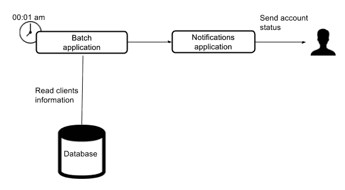
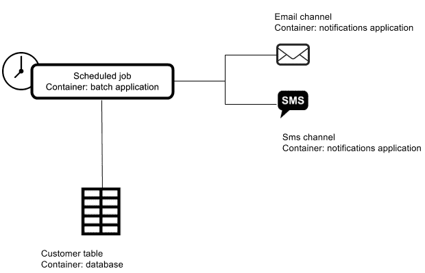
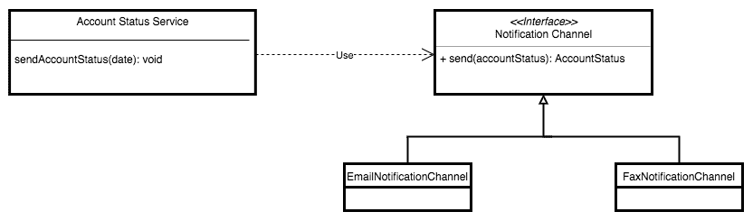

# 第二章：软件架构维度

在上一章中，您了解到软件架构是团队在构建产品或服务时的共享知识，以及围绕这一概念的其他重要方面。架构师的工作是与整个团队分享这些知识。即使团队没有专门的架构师，个人通常最终会成为系统架构的负责人。

在本章中，我们将审查软件架构维度以及它们如何影响我们的应用程序。我们还将介绍一种用于记录软件架构并使团队更容易共享和理解架构的模型。最终，这将使他们能够理解软件架构的整体情况。

本章将涵盖以下主题和子主题：

+   软件架构维度：

+   业务维度

+   数据维度

+   技术维度

+   操作维度

+   C4 模型：

+   上下文图

+   容器图

+   组件图

+   类图

# 维度

根据谷歌的说法，“维度”一词有几个含义。让我们使用以下定义，它适用于我们将在本节讨论的上下文中：

“情况、问题或事物的一个方面或特征。”

从这个定义开始，我们将把维度视为影响和指导我们构建的软件架构的方面或特征。

在上一章中，我们谈到了在制定解决方案时理解业务领域的重要性。当然，当生成能够满足所有业务需求的系统时，这种知识是不够的。您还需要考虑从技术角度支持这些解决方案的机制，同时不要忘记业务需求。作为技术人员，我们需要提供一个能够随着时间推移而发展的解决方案，以满足新的业务需求并有效实现目标。

以下列表包括在制定软件架构过程中最常见的维度：

+   业务

+   数据

+   技术

+   操作

根据您正在处理的解决方案的上下文，您可以向此列表添加一些额外的要点。当您从技术角度查看产品时，这四个维度在很大程度上是相互关联的，并且应该被负责系统的整个团队理解。

# 业务维度

这是我们构建软件时最关键的方面，这就是为什么软件行业一直在发明新的方法来收集需求。在这个维度内，应该有效地完成两项相关活动，如下所示：

+   管理用户需求并清晰了解业务领域模型

+   识别和跟踪业务指标

# 管理用户需求

几年前，我们习惯于编写用例，最近几年已经改名为“用户故事”。然而，这里的关键并不在于名称，无论您使用老式方法（如 Ration Unified Process（RUP））还是最前沿的框架（如 Scrum）来构建项目，都没有关系。了解业务领域并拥有产品将使团队能够开发成功的项目。

你可能知道，RUP 是一个软件开发框架，定义了一系列阶段，并且每个阶段都有大量的文档。这里的想法是确定在每个阶段生成什么样的文档。这项任务很繁琐，团队经常会定义大量无用且耗时的文档，而没有为产品提供任何附加值。作为创建文档的替代方案，我们将在本章后面讨论 C4 模型。

多年来，已经有很多书籍介绍了如何管理用户需求。其中两本是 Alistair Cockburn 的《编写有效的用例》和 Mike Cohn 的《用户故事应用》。这些书是最相关的，您应该考虑阅读并将它们作为您的图书馆的一部分，以便在必要时用作参考来源。

高效地收集用户需求的过程应该是项目愿景和目标的一部分。与尽可能多参与项目的人进行头脑风暴会有利于让负责软件实施的团队区分“最小可行产品”（MVP）和期望的可有可无的功能，这些功能将作为新版本的一部分在 MVP 版本完成后实施。

了解正在构建的软件的 MVP 至关重要；它应该为您提供满足用户需求的最少功能。一旦确定了这些功能，还需要为其定义验收标准。从这里构建的产品将用作从业务人员那里获取反馈（以纠正任何误解）的基础，并且还将用于添加新功能（以扩展解决方案）。

今天，我们还依靠缺陷跟踪系统将用户需求编写为具有不同分类的工单，例如缺陷、用户故事和突发事件等。这些工单用于更好地了解实施一个功能需要多长时间，以及涉及多少缺陷。

以这种方式处理业务需求为我们提供了有用的信息，可以在以后进行分析，以改进团队的绩效以及其组织方式。有很多关于如何管理工单的解释，但如果您想更好地了解缺陷跟踪的原则，我鼓励您阅读 Yegor Bugayenko 撰写的一篇有用的文章，该文章可在[`www.yegor256.com/2014/11/24/principles-of-bug-tracking.html`](http://www.yegor256.com/2014/11/24/principles-of-bug-tracking.html)上找到。

# 识别和跟踪业务指标

收集了业务需求之后，业务维度的另一部分出现了，其中包括一种识别解决的业务问题周围的基本指标的方法。这些指标应该根据业务领域确定并表达，以便了解应用程序如何满足其设计的业务需求。

让我们重新审视前一章中使用的一个例子。假设银行目前正在使用邮局向客户发送每月的银行对账单。在这种情况下，您预先知道成本和实现目标所涉及的任务。此外，您甚至知道您有多少客户以及根据特定日期应该打印多少纸张。在系统实施后，您将希望知道所有客户是否都收到了他们的银行对账单。因此，您将希望实施一种机制来识别应用程序发送了多少银行对账单，以及哪种通知渠道更受欢迎。这些信息将在不久的将来用于识别新的商机，发现系统存在问题的时间，并监控应用程序的投资回报率。毕竟，系统的实施是由企业需求引导的，您必须验证这些需求是否得到满足。

一旦应用程序投入生产，评估应用程序在实际环境中的业务健康状况的一个绝佳技术是构建机器人。这些机器人会像普通用户一样使用您的应用程序；您至少应该围绕应用程序最重要的功能创建机器人。否则，您如何知道您的应用程序是否正常工作呢？

通过执行定期检查来实现这个目标，这些检查将向您发送通知并提供获得的结果。这种简单的技术将让您确信应用程序正在按预期工作，并为您的客户提供服务——他们是系统的目的。

# 数据维度

数据被认为是任何业务中最关键的资产之一，这就是为什么你必须投入大量时间来找出处理它的最佳方法。

如今，在选择我们的数据处理方法时，我们有很多选择。在过去几年里，许多种数据库和数据存储已经被创建，包括以下内容：

+   文件云存储

+   关系数据库

+   面向文档的数据库

+   实时数据库

+   图数据库

+   内存数据库

你的选择应该取决于你要解决的问题，而不是取决于像 Facebook、Google 和 Amazon 这样有影响力的在线公司所使用的选项。

记住，不同的业务需求需要不同的方法。

你现在可能想知道应该选择什么样的数据存储。对这个问题最常见的答案是，这取决于上下文。

然而，依赖于上下文可能不是理想的答案，因为它并没有提供太多指导。考虑到这一点，可以给出的最佳建议是尽量多地进行类比，以找出最佳的数据存储方法。要记住的一点是：不要因为 NoSQL 数据库固有的最终一致性而感到害怕。我见过很多人因为这个原因而放弃这种类型的数据库。你必须明白，最终一致性根本不是技术问题，而是业务问题。让我解释一下为什么。

考虑第一章中提到的例子，《今日软件架构》，假设你被要求在一个具有以下描述的系统中实现一个新功能：

"我们注意到通知渠道并不总是按预期工作，所以我们决定在这种情况下使用备用渠道。例如，如果用户将电子邮件配置为首选渠道，那么如果失败，应该使用短信渠道。另一方面，如果用户将短信配置为首选通知渠道，那么如果失败，应该使用电子邮件通知作为备用。"

注意，这个要求不符合标准的用户故事格式：

"作为<用户类型>，我希望<目标>，以便<原因>..."

然而，对于负责处理它们的团队来说，这些要求很容易理解和实现。因此，我之前提到，即使你仍在处理用例或用户故事，业务需求也是最重要的方面。

一个不需要最终一致性的例子是 Facebook 帖子的排序，其中每个帖子都有时间戳。在这里，当一个人给帖子添加评论时，他们认为他们看到的是他们上面的最后一条评论，但几秒钟后，他们会看到其他评论确实在他们的评论之前添加了。当这种情况发生时，可能会令人困惑。然而，不对评论顺序施加原子性要求允许 Facebook 全球扩展数据库，每秒覆盖数百万帖子。相比之下，对于转账交易，需要原子事务以保持一致性，避免欺诈或浪费金钱。

总之，你首先必须了解你想要完成的业务需求，尽可能多地将其与市场上可用的选项进行类比，然后从这些选项中做出选择。一旦你做出了决定，就值得依靠框架来让你与你选择的数据存储进行交互。幸运的是，Spring Data 支持大量的数据存储选项。我们将在下一章讨论使用这个 Spring 项目的好处。

# 技术维度

这一维度涉及深入探讨技术细节。让我们讨论一些有用的问题，你将不得不回答以实现这个目标，如下：

+   我应该选择什么样的软件架构风格？

目前有很多选择。本书的后续章节将详细解释其中的许多选择，你可能会在那里找到答案。

+   哪种编程语言适合我的应用程序？

市场上有许多编程语言承诺是最好的。因此，你必须避免仅仅因为它是最新的或最新的而选择一个。相反，你必须选择一个广为人知的适合你的。

依靠庞大的工具生态系统始终是必要的，并且应该成为你决策的一部分。你决策的另一部分应该是找到合作伙伴的难度。你不太可能想要使用不太熟悉的编程语言来构建你的软件。毕竟，你希望创建一个长期存在的应用程序，这意味着许多人将参与编写代码，使其随着时间的推移而发展。

由于这本书的重点是 Spring 平台，我将讨论使用 Java 和 Java 虚拟机（JVM）的好处。

我们都知道 Java 是一种得到广泛支持的编程语言，已经被用来构建大量的企业应用程序；这个事实让我们有信心说它已经足够成熟，可以编写几乎任何类型的企业软件。另一方面，JVM 建立在“一次编写，到处运行”的前提下。这一点很重要，因为目前有相当一部分企业应用程序正在 Linux 服务器上运行；然而，这并不意味着你需要强迫你的团队使用 Linux。相反，他们可以继续使用他们喜欢的操作系统，因为 JVM 可以在 Windows、Linux 和 Mac 上运行。

在过去的几年里，许多编程语言已经被编写并广泛采用来解决不同类型的问题。其中许多运行在 JVM 上，比如 Scala、Groovy、Kotlin 和 Jython，因为这样做带来的好处。所有这些编程语言的编译代码都转换成了字节码，可以与 Java 代码互动，引入了新的机会。尝试新的编程语言总是一个好主意，看看它们在不同的场景中如何工作，以及如何满足不同的需求。例如，Groovy 是一种友好的编程语言，简单易用。在接下来的章节中，我们将使用在 JVM 上运行的不同编程语言开发一些示例应用程序。这些示例将帮助你将 Groovy 作为你的工具箱的一部分。

+   哪种框架适合我？

即使 Java 世界拥有大量的框架，我们仍然鼓励你使用 Spring，不仅因为这本书是关于它的，而且因为它提供了以下好处：

+   许多之前列出的编程语言都得到了支持

+   Spring 提供了几乎任何类型的应用程序构建的机会

+   学习曲线不是什么大问题

+   它对单元测试和集成测试有很好的支持

+   Spring 项目使你的解决方案能够成长（我们将在下一章讨论这些）

+   它与你选择的 IDE 的集成非常出色

+   它有一个伟大的社区

+   在互联网上有大量关于 Spring 的学习资源

+   它提供了与最常见的 Java 框架（如 Hibernate、iBatis、Atomikos、Vaadin 和 Thymeleaf）的平滑集成

如果这个列表对您来说还不够，随时在 Google 中输入“*为什么我应该使用 Spring*”，您会得到一个惊喜，并且会有信心使用 Spring 框架。

# 运营维度

这个维度指的是将您的架构组件映射到服务器上。这些服务器可以在本地或云上运行。在过去几年中，云计算变得越来越重要，现在，我们可以说，对于每个企业来说，依赖云上的服务几乎是必不可少的。

您的软件架构组件的映射将取决于它们的功能以及组件之间的交互方式。

# 如何部署应用程序

这一点非常重要，因为部署 Rest API 不同于部署分布式数据库或大型单体应用程序。为了更好地了解部署组件的最佳方法，您需要研究支持它的产品。这可能非常简单；例如，通过部署一个可以像常规 Java 应用程序一样运行的 Spring Boot 应用程序，使用以下广为人知的命令：

```java
java -jar artifact_name.jar
```

然而，在其他情况下，一些产品提供了作为集群部署的机会，您需要考虑所有可用的选项以及您的需求。根据您的软件需求有多高，您将需要有更少或更多的节点来满足用户的需求。您可能已经注意到，即使这个维度也是从业务中衍生出来的。

# 您的组件之间的交互如何发生

让我们想象一下，我们有一个常规的 Web 应用程序，将信息保存在数据库中。这个 Web 应用程序部署在服务器 A 上，数据库部署在服务器 B 上。常识告诉我们，无论这两台服务器位于同一个数据中心还是不同的数据中心，延迟都不会相同。另一个考虑因素当然是最终用户的位置。如今，云计算提供了选择在哪里部署组件的机会，这取决于您的需求，这在提供更好的用户体验时非常有帮助。

# 处理基础设施

考虑了这些因素之后，需要考虑的另一个方面是如何管理基础设施。

我们都知道，当我们需要从头开始启动新服务器时，总是一件头疼的事，因为我们需要安装操作系统和所有必需的工具，使我们的应用程序正常工作。其中一些需要特定的文件、目录、环境变量和其他工件才能正常工作，这使得这个过程变得更加复杂。幸运的是，下一节讨论的基础设施即代码方法将帮助我们减少新服务器的配置工作量，并为我们带来其他好处，例如以下几点：

+   了解基础设施

+   版本控制

+   测试

# 了解基础设施

文件用于存储所需的配置和步骤，以可执行脚本的形式来配置服务器。当需要对现有服务器进行新的调整时，想法是使用脚本文件进行这些更改，而不是直接在服务器上进行。这将使我们获得以下好处：

+   不可变服务器

+   轻松应用更改

+   拥有多个相同的服务器

+   快速从头开始重建新服务器，无错误

此外，技术人员将能够阅读和理解这些脚本，从而增加对新基础设施配置过程的共享理解，这是非常好的。

# 版本控制

使用**版本控制系统**（VCS）对编写的脚本进行版本控制将使我们能够跟踪脚本文件的更改；这有助于增加正在用于塑造你的基础设施的编写代码的可审计性。在版本控制过程中，可以（也应该）触发构建来验证编写的代码。

版本控制的另一个好处是在需要时可以回滚更改。想象一下，你正在编写代码来升级你的服务器；如果在这个过程中引入了问题，你总是可以进行回滚，并继续使用上一个稳定版本，直到问题解决。

# 测试

如果没有经过测试，就无法知道某个东西是否按预期工作。将基础设施视为代码使我们能够测试用于实现此目标的代码，以验证并确保其按预期工作。否则，你将需要手动进行这些验证，并考虑在此级别涉及的调试过程，以确定错误的位置。即使你可以在没有测试的情况下拥有基础设施作为代码，也强烈建议对已创建的脚本运行测试。

采用基础设施作为代码的方法将帮助我们充分利用计算机和系统，以使这个过程对我们来说变得不那么繁琐，人们应该只在出现问题时才在数据中心前工作。这也将帮助你以一种快速简便的方式保持你的基础设施更新。如果你想深入了解如何有效地采用这种方法，我鼓励你阅读 Kief Morris 的《基础设施作为代码》一书。

# 云与本地

在使用云上服务器和使用本地服务器之间做出选择是一个重大决定，受到你的业务的限制和需求的影响。出于安全原因，一些公司受限于使用本地基础设施，这可能是因为对云安全管理方式的误解。无论如何，这种限制都使得任何将基础设施迁移到云上的尝试都变得无效。

另一方面，如果你有机会在这两个选项之间进行选择，我鼓励你使用云。它提供了许多好处，比如按需付费，这将使你在应用程序首次发布期间节省大量资金。一些服务根据你的需求和所使用软件的许可模式，每小时收取几美分的费用。例如，使用免费和专有软件与使用带有 Windows 或 Linux 的服务器是不同的。同样，使用关系型数据库管理系统（RDBMS），如 MariaDB 或 Oracle，也是不同的。

即使你选择使用云，你也需要考虑一些因素，以便根据所需的功能选择适合你的云服务提供商。一些云服务提供商，如 AWS，提供了大量的计算、存储、管理工具、分析等服务，而其他一些，如 Heroku，提供了足够的功能，取决于你的需求。选择一个提供商仅仅因为它提供更多服务并不是一个好主意，因为这也意味着更高的成本。即使不同供应商提供的服务数量相似，使用前面提到的供应商部署应用程序的过程的简单性也是显著的。

# 部署你的应用程序

编写不会被投入生产的代码是没有意义的。无论你是将应用程序部署到云上还是在本地环境中，你都可以使用一些技术和工具来自动化部署过程。这将帮助你减少所需的工作量。

在几年前的软件系统部署过程中，整个应用程序编写团队不得不与运营团队一起坐在一起，以防万一出了问题。因此，部署日期过去对于项目中涉及的技术和业务人员来说都是可怕的。幸运的是，这种情况已经改变了。让我们回顾一下这种变化是如何发生的。

当我们进入这个领域时，自动化是必须的。有许多 CI 工具可用于创建流水线，这将帮助您自动化部署。其中最广泛使用的是 Jenkins、Travis CI、Go CD、Codeship 和 Bamboo 等。借助这些工具，您可以创建一个通常包括以下内容的流水线：

1.  下载源代码

1.  编译代码

1.  运行一组定义的测试

1.  部署代码

主要步骤是第三步，涉及不同类型的测试，比如这里列出的测试：

+   单元测试

+   集成测试

+   功能测试

+   性能测试

如果你在应用程序中包含更多的测试，你将获得更多的信心。这是摆脱部署恐惧的唯一途径。毕竟，如果你的测试验证功能按预期工作，就没有理由担心部署。

这些 CI 工具还包括支持发送有关流水线的通知，生成围绕代码的指标，执行配置脚本，并完成一些与部署相关的其他步骤。这些流水线通常由提交触发，也可以被调度。

采用 CI 工具是朝着更好地自动化和管理部署的第一步。在这一点上，你将希望采用持续集成、持续交付和 DevOps 等实践，我们将在第十一章中深入解释，*DevOps 和发布管理*。

# C4 模型

一般来说，如果某事物不可见，它就不会产生期望的效果。即使是使用最尖端技术生产的最先进软件，如果工作在其上的团队无法理解它，那么它就是完全无用的。团队所付出的所有努力都将是浪费时间。

仅仅设计软件架构是不够的。它必须以一种允许整个团队正确使用它的方式与整个团队共享。架构师制作的文档今天代表了他们，当他们应该做其他事情而不是回答关于软件架构的一百个问题时，它代表了他们，明天当他们离开项目，其他人负责其演进和维护时，它也代表了他们。

敏捷宣言的第二个原则([`agilemanifesto.org`](http://agilemanifesto.org))是“团队应该重视可工作的软件，而不是全面的文档。”这经常被人们错误地解释为不应该产生任何文档。相反，这个原则背后的想法是鼓励团队只产生有价值的文档，这正是 C4 模型所寻求的。

这个模型提供了一种向整个团队传达系统设计的简单方法。它从高层视角开始，并可以用来深入到（或将要）生产的软件的最小细节。这个模型提出了四个图表，如下：

+   上下文图

+   容器图

+   组件图

+   类图

# 上下文图

上下文图提供了用户和其他软件系统的整体情况，以及它所互动的情况。为了保持简单易懂，所有技术元素都应该避免。上下文图应该足够简单，以便非技术人员能够理解。

以下显示了一个为第一章中提出的示例进行上下文化的图表，*今日软件架构*：


上下文图

# 容器图

容器是负责承载代码或数据的单元。因此，这个图表展示了应用中涉及的容器，提供了它们如何相互交互的高层细节，以及一些其他技术细节来说明系统的工作原理。让我们看看这个图表如何适用于我们的例子：



容器图

# 组件图

这个图表的理念是展示容器是如何由组件和它们之间的交互所塑造的。我们例子的组件图如下：



组件图

# 类图

由于 C4 模型的主要理念是去除不必要的图表，类图应该被避免，只有在必要时才应该用于说明应用程序的具体细节。这个图表是为技术人员设计的，当应用程序中有一些元素需要人们密切关注时可以使用它；它也可以用于澄清可能导致混淆的代码中的特定部分。

虽然这个图表对我们的例子来说并不必要，但我们将展示它以作说明用途：



类图

正如你可能已经注意到的，我们提出的这四个图表并不难创建，而且在获得对系统更好理解时是有帮助的。即使它们很简单，定期审查这些图表以确保它们是最新的总是一个好主意。过时的文档可能导致误解，而不是改善对系统的理解。

请随意避免创建任何你认为不必要的图表。投入时间建立不必要的工件是应该避免的事情。

# 摘要

在本章中，我们讨论了与软件架构相关的四个主要维度，并看了它们如何影响我们构建应用程序的方式。我们还回顾了用于记录系统架构的 C4 模型，使用了一种精简的方法，帮助我们避免浪费时间创建不必要的文档。

在下一章中，我们将回顾 Spring 项目以及它们如何用于创建满足不同业务需求的应用程序。
