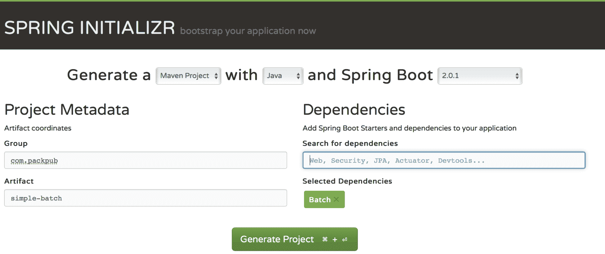
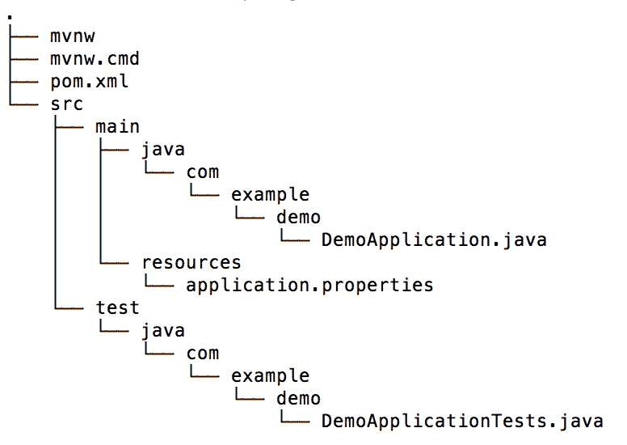
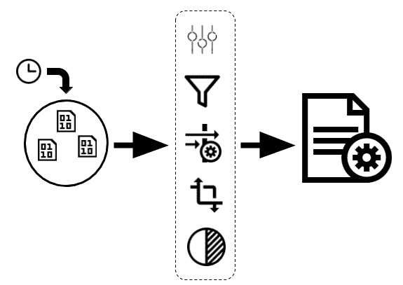
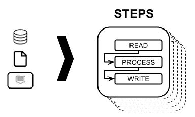
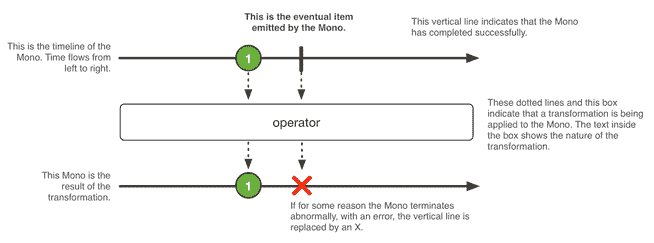
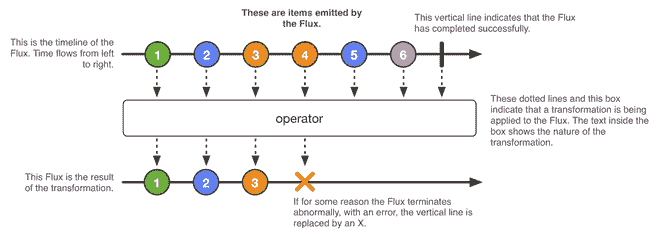

# 第三章：Spring 项目

在本章中，我们将回顾一些 Spring 项目，简要解释每个项目，并探讨它们可能被使用的一些场景。

本章将涵盖以下主题：

+   为什么出现了 Spring

+   Spring 项目：

+   Spring Initializr

+   Spring Boot 简介

+   使用开发者工具避免重新部署

+   Spring Data

+   使用 Spring Integration 支持 EIP

+   Spring Batch

+   使用 Spring Security 保护应用程序

+   拥抱（Spring）HATEOAS

+   Spring Cloud 和微服务世界

+   响应式和 Spring

+   响应式 Spring Data

+   响应式 REST 服务

# 为什么出现了 Spring

正如你可能知道的，Spring 是为了简化 J2EE 世界的所有复杂性而创建的。它被创建为一个依赖注入框架，作为 EJB 堆栈的替代品，分布式对象在大多数应用程序中是不必要的。传统的 J2EE 方法在用于引导应用程序时引入了很多复杂性，当用于解决业务需求时，这甚至更加复杂。因此，我们留下了难以测试且开发和维护成本过高的应用程序。

Spring 和 J2EE 是在 Java 还没有注解时创建的，因此需要大量的 XML 文件来连接类。幸运的是，在 Java 开发工具（JDK）的 1.5 版本中引入了注解，这有助于减少这些描述文件的需求。

Spring 的发展速度比 JEE 快，因为它不必满足与 JEE 所需的大型委员会交流的正式性。当需要将新功能纳入 JEE 规范时，必须创建 JSR 文档，并经 JCP 批准。这样做的主要动机是确保规范的不同版本之间的向后和向前兼容性。另一方面，Spring 是一个不断发展的项目，考虑到软件行业不断变化的性质。

当需要新功能时，它要么作为现有项目的一部分，要么创建一个由 Spring 项目支持的新项目。不必担心兼容性问题，因为 Spring 被设计为可以在任何 servlet 容器上运行，如 Apache Tomcat、Jetty 等。这与 JEE 应用程序相反，后者只能在实现 Java EE 规范并提供标准 Java EE 服务的服务器上运行。

# Spring 项目

Spring 项目利用了一个生态系统的工具，可以用来创建不同类型的应用程序，以实现不同的目标。所有这些项目都围绕 Spring 构建，这是一个合法的模块化框架，可以将单独的 Spring 项目插入，以使应用程序处理更多的技术需求。如果您对 Spring 项目的完整列表感兴趣，可以访问它们的主页[`Spring.io/projects`](https://spring.io/projects)。

我们将回顾最常用的 Spring 项目来构建企业应用程序，但首先，我们将介绍 Spring Initializr，这是 Spring 开发人员首选的网站之一。

# Spring Initializr

当我们计划从头开始创建一个新项目时，我们倾向于考虑使用哪种构建工具，使用哪种框架等。最困难的任务之一是找到使项目工作的正确依赖关系。这就是 Spring Initializr 的创建目的。这个出色的 Spring 倡议使得可以在几分钟甚至几秒钟内启动应用程序，无论你喜欢哪个版本。Spring Initializr 可以在 Web 上使用，也可以在您喜欢的 IDE（Eclipse 或 IntelliJ）上使用，甚至有一个很酷的 CLI 工具。我喜欢的方法是 Web，下面的截图说明了原因：



Spring Initializr 主页

在页面顶部，您可以选择您喜欢的构建工具。可用的选项有 Maven 和 Gradle。接下来的选项允许您选择您喜欢的编程语言（目前支持 Java、Groovy 和 Kotlin）。网页顶部的最后一个选项询问您想要使用哪个 Spring Boot 版本。在此部分，甚至包括快照和里程碑版本。在项目元数据部分，您可以指定项目的组和构件名称。依赖项部分有一个搜索依赖项的文本字段，有助于定义您想要包含在应用程序中的 Spring 项目。如果您想了解更多，请点击切换到完整版本的链接；这将显示所有可用依赖项的大列表。

所有这些项目都是使用 Spring Boot 框架创建的，这使得创建独立应用程序并准备投入生产变得容易。现在，让我们快速了解一下 Spring Boot。

# Spring Boot 简介

Spring Boot 框架旨在使以下任务更加容易：

+   Servlet 容器集成

+   自动配置

+   依赖管理

# Servlet 容器集成

以前，我们创建了`.war`文件，然后将它们放入相应的 servlet 容器部署目录中。然而，Spring Boot 包含了一个嵌入式 servlet 容器，这样就不再需要这样做了。其思想是生成一个包含所有相关依赖项的 JAR 文件，然后将其作为常规 Java 应用程序执行。虽然仍然可以使用生成 WAR 文件的旧方法，但不建议这样做。

# 自动配置

Spring Boot 始终尝试根据您添加的依赖项自动配置应用程序。例如，如果 H2 是您依赖项的一部分，将自动配置使用内存数据库的数据源。您始终可以通过使用注释、环境变量、配置文件甚至在运行`.jar`文件时使用参数来覆盖这些默认配置。

# 依赖管理

每个 Spring Boot 版本都包含一个经过精心筛选的依赖项列表。因此，您甚至不需要知道哪些构件和版本是应用程序的一部分。您始终可以选择覆盖这些依赖项，但通常是不必要的。这种方法使我们能够轻松升级 Spring Boot 应用程序。

通过运行以下`curl`命令来创建一个简单的 Spring Boot 应用程序：

```java
curl https://start.Spring.io/starter.zip -o Spring-boot-demo.zip
```

上述命令将下载一个包含以下文件结构的`.zip`文件：



Spring Boot 项目结构

让我们快速查看这些文件。

# mvnw 和 mvnw.cmd

这两个文件是 Maven 包装器的一部分（[`github.com/takari/maven-wrapper`](https://github.com/takari/maven-wrapper)）。这里的想法是避免强制开发人员从头开始安装 Maven，而是提供一个内置脚本，能够下载正确的版本并使其准备好工作。

# pom.xml

该文件包含运行 Spring Boot 应用程序所需的必要依赖项。让我们按照以下方式查看文件的内容：

```java
<?xml version="1.0" encoding="UTF-8"?>
  ...
  <parent>
    <groupId>org.springframework.boot</groupId>
    <artifactId>Spring-boot-starter-parent</artifactId>
    <version>1.5.8.RELEASE</version>
    <relativePath/>
  </parent>
  ...
  <dependencies>
    <dependency>
      <groupId>org.springframework.boot</groupId>
      <artifactId>Spring-boot-starter</artifactId>
    </dependency>
    <dependency>
      <groupId>org.springframework.boot</groupId>
      <artifactId>Spring-boot-starter-test</artifactId>
      <scope>test</scope>
    </dependency>
  </dependencies>
  ...
</project>
```

`parent` pom 部分为应用程序提供了必要的依赖项和插件管理。

`Spring-boot-starter`依赖项包含了您需要启动项目并使用一组受控的传递依赖项的所有依赖项。还有其他启动器，您可能想要使用，这取决于您的项目需要（例如，JPA、队列、安全等）。

`Spring-boot-starter-test`依赖项包含了整套测试所需的依赖项。它将允许您编写单元测试和集成测试。

# DemoApplication.java

这是一个带有`main`方法的简单类，负责运行应用程序。由于`@SpringBootApplication`注解，可以以这种方式执行这个`main`类，它启用了所有必需的自动配置，如下所示：

```java
@SpringBootApplication
public class DemoApplication 
{
  public static void main(String[] args) 
  {
    SpringApplication.run(DemoApplication.class, args);
  }
}
```

# application.properties 文件

在这个文件中，您必须定义应用程序的所有配置属性。例如，如果您正在与 SQL 数据库交互，该文件将具有诸如 JDBC URL、数据库用户名、密码等属性。如果您愿意，可以将其扩展名从`.properties`更改为`.yml`，以便通过使用 YAML 格式（[`www.yaml.org/start.html`](http://www.yaml.org/start.html)）使其更具表现力。

# DemoApplicationTests.java

作为奖励，以下是一个简单的集成测试示例，您可以将其用作指南，为新代码编写测试。由于注释，编写这种测试相对简单：

```java
@RunWith(SpringRunner.class)
@SpringBootTest
public class DemoApplicationTests 
{
  @Test
  public void contextLoads() 
  {
  }
}
```

上述解释应该足以为您提供简要概述，以便您了解 Spring Boot 是什么以及其好处是什么。现在，是时候审查其他您会喜欢的 Spring 项目了。

# 使用开发人员工具避免重新部署

这个模块很棒，因为它旨在帮助您在开发 Spring Boot 应用程序时避免重新部署。它类似于 JRebel，但这个产品是完全免费的，您可以通过简单添加以下依赖项将其作为应用程序的一部分包含进来：

```java
<dependency>
  <groupId>org.springframework.boot</groupId>
  <artifactId>spring-boot-devtools</artifactId>
  <optional>true</optional>
</dependency>
```

一旦添加了依赖项，您只需重新编译类即可触发应用程序重新启动。根据您的 IDE 配置，此过程将自动完成或手动完成。

# Spring Data

该项目为您提供了一个额外的访问数据存储的抽象层；它有一堆接口，您需要扩展这些接口，以利用 Spring Data 提供的内置功能。当您扩展这些接口时，所有围绕数据存储的标准操作都将准备就绪。

Spring Data 支持关系型和非关系型数据库、MapReduce 框架和基于云的数据服务等技术。这些技术由模块支持；如果您对现有模块的完整列表感兴趣，可以访问[`projects.Spring.io/Spring-data/`](http://projects.spring.io/spring-data/)。

让我们通过使用 SQL 数据库（如 H2）来玩 Spring Data。假设您想为国家数据库表构建**创建、读取、更新、删除**（CRUD）操作。使用这个框架，您只需要创建实体类和一个空接口，该接口扩展了 Spring Data 提供的`CrudRepository`接口，如下所示：

```java
@Component
public interface CountryRepository extends CrudRepository<Country, Integer> {
}
```

由于`CrudRepository`接口中包含了所有的 CRUD 操作，您不需要实现任何内容；您只需要使用它的功能。让我们看看它的运行方式，如下所示：

```java
@SpringBootApplication
public class SpringDataDemoApplication 
{
  @Bean
  InitializingBean populateDatabase(CountryRepository
  countryRepository) 
  {
    return () -> 
    {
      countryRepository.save(new Country(1, "USA"));
      countryRepository.save(new Country(2, "Ecuador"));
    };
  }
  @Bean
  CommandLineRunner queryDatabase(CountryRepository 
  countryRepository) 
  {
    return args -> 
    {
      countryRepository.findAll()
      .forEach(System.out::println);
    };
  }
  public static void main(String[] args) 
  {
    SpringApplication.run(SpringDataDemoApplication.class,args);
  }
}
```

我们有两个使用先前创建的存储库接口的**Bean**。第一个方法将运行，并将向表中插入两行。第二个方法将查询表中的所有行，然后在控制台中打印它们。运行此应用程序后，当应用程序启动时，您将在控制台中看到以下输出：

```java
...
Country [id: 1 name: USA ]
Country [id: 2 name: Ecuador ]
...
```

Spring Data 还具有更多功能；它还让您有机会以一种迷人的方式创建查询。假设您想按名称过滤国家。在这种情况下，您需要将该方法添加到您的接口存储库中，如下所示：

```java
@Component
public interface CountryRepository extends CrudRepository<Country, Integer> 
{
 List<Country> findByName(String name); }
```

然后，我们可以以以下方式使用先前的方法：

```java
countryRepository.findByName("USA")
```

这个方法根本没有实现，这是一个很大的优势。Spring Data 使用方法的名称来生成所需的实现，让我们忘记这些类型的查询的琐碎实现。有许多接口提供更多的功能，如分页、排序和响应式扩展。

# 使用 Spring Integration 支持 EIPs

集成很重要，因为应用程序旨在相互交互。强迫它们独立工作会使它们变得无用。

通常会发现一些公司有他们自己的内部开发的软件，以解决他们特定的业务需求；但是，由于某些情景往往对于不止一个公司是共同的，因此有第三方服务可以满足这些需求。由于这些系统提供的功能是可用的，我们必须找到一种方法使这些应用程序作为一个单一系统工作，这就是**企业集成模式**（EIP）发挥作用的地方。

EIP 提供了针对不同上下文中可以应用的经常出现的问题的成熟解决方案，具体取决于特定的业务需求进行轻微修改。互联网上有大量这些模式的目录，而在这个领域必读的是 Gregor Hohpe 和 Bobby Woolf 的书《企业集成模式》。该书采用技术无关的方法，解释了大量模式以及示例场景。

一旦理解了 EIP 的理论，您会发现 Spring Integration 非常方便用于实现它们；它将具有之前讨论过的 Spring Framework 固有的所有优势。

当我们讨论集成时，可以考虑使用三步方法。让我们开始审查以下显示这三个步骤的图表：



EIP

以下是作为前述过程一部分执行的步骤列表：

1.  有一个数据源，从中提取信息；有时需要进行轮询，以请求数据。

1.  摄入的数据根据需要进行过滤、转换、组合、分解、路由等。EIP 就是在这里使用的。

1.  处理后的数据已准备好交付或存储，具体取决于需要什么。

Spring Integration 提供了内置支持，用于从队列、数据库、系统文件、FTP 服务器和许多其他选项中检索或发送信息。此外，如果需要，您可以编写自己的实现并将其插入，以使其作为流程的一部分工作。Spring 提供的 DSL 使阅读和实现 EIP 变得容易。

# Spring Batch

无论我们使用什么类型的架构，有时我们都需要处理大量数据并应用一些转换使其有用。这种处理通常发生在我们需要从一个或多个数据源中整合（或简单处理）数据，使其可用于特定的业务目的。

这些批处理过程需要一组明确定义的步骤来实现所需的目标。使用 Spring Batch，您可以通过使用由读取、处理和写入处理数据的步骤组成的作业来实现它们。一个作业可以有多个所需的步骤，如下图所示：



Spring Batch - 作业结构

# 读取步骤

在这种情况下，信息是使用 Spring Batch 的内置`ItemReader`对象从外部数据源读取的。`ItemReader`对象将提供一个`<T>`对象，稍后将被使用。

# 处理步骤

在这里，数据处理是由一个`ItemProcessor`对象完成的，它可以转换和操作从`ItemReader`对象读取的`<T>`数据。`ItemProcessor`可以返回与读取的相同的`<T>`对象，或者如果需要的话，可以返回完全不同的`<O>`对象。

# 写入步骤

一旦处理步骤完成，就可以使用`ItemWriter`对象，将处理阶段获得的`<O>`转换对象写入。

Spring 提供了与传统数据源交互的能力，例如以下内容：

+   文件

+   JMS 提供者

+   数据库

使用 Spring Batch，一个很酷的功能是它提供了重新运行和跳过作业的机会，因为它有自己的数据库，其中存储了执行作业的状态。

由于 Spring Batch 旨在处理大量数据，为了加速处理，该框架提供了将信息作为数据块处理的机会。这也使得可以减少处理所需的服务器资源。

# 使用 Spring Security 保护应用程序

Spring Security 是一个可扩展的框架，可用于保护 Java 应用程序。它还可以用于处理身份验证和授权，并且它使用一种声明式风格，完全不会侵入现有代码。

该框架支持不同的身份验证方法，例如以下方法：

+   LDAP

+   JDBC

+   内存中

您还可以通过实现`AuthenticationProvider`接口添加自定义的身份验证机制，如下所示：

```java
@Component
public class CustomAuthenticationProvider 
implements AuthenticationProvider 
{
  @Override
  public Authentication authenticate(Authentication 
  authentication)
  throws AuthenticationException 
  {
    // get the entered credentials
    String username = authentication.getName();
    String password = authentication.getCredentials().toString();
    // check the entered data
    if ("user".equals(username) && "password".
    equals(password)) 
    {
      return new UsernamePasswordAuthenticationToken(
      username, password, new ArrayList<>());
    }
    ...
  }
  ...
}
```

在上面的例子中，`user`和`password`硬编码字符串预期作为凭据，以便成功的身份验证过程，并且您应该用必要的逻辑替换该验证。

上述身份验证机制遵循**基本身份验证**模型，这是 Web 应用程序的首选模型。但是，当您编写 API 时，您将需要其他方法来处理安全性。一个很好的选择是使用基于令牌的模型，例如 JWT 或 OAuth，我们将在后续章节中进行审查和实施。

# 拥抱（Spring）HATEOAS

在谈论 REST 主题时，讨论 Leonard Richardson 创建的成熟度模型总是值得的，该模型规定了 REST API 应该完成的三个步骤才能被认为是成熟的：

+   资源

+   HTTP 动词

+   超媒体控制：HATEOAS

在这一部分，我们将重点放在最后一个元素上。**HATEOAS**旨在提供关于我们可以使用什么的信息，使用作为资源的一部分包含的附加**统一资源标识符（URIs）**。

让我们重新访问我们的银行示例，以便从实际角度解释 HATEOAS。假设您有以下 URI 来查询客户的银行对账单：`http://your-api/customer/{customer_id}/bankStatements`。

```java
[
  {
    "accountStatusId": 1,
    "information": "Some information here"
  },
  {
    "accountStatusId": 2,
    "information": "Some information here"
  }
]
```

另外，假设 API 具有重新发送银行对账单或将其标记为失败的能力。根据先前提到的有效负载提供的信息，无法了解这些操作。这就是 HATEOAS 可以使用的地方，让我们的 API 用户了解这些附加功能的存在。应用 HATEOAS 后，有效负载将如下所示：

```java
{
  "_embedded": 
  {
    "bankStatementList": 
    [
      {
        "bankStatementId": 1,
        "information": "Some information here",
        "_links": 
        {
          "markAsFailed": 
          [
            {
              "href": "http://localhost:8080/customer/
              1/bankStatements/1/markAsFailed"
            }, 
            {
              "href": "http://localhost:8080/customer/
              1/bankStatements/1/markAsFailed"
            }
          ],
          "resend": 
          [
            {
              "href": "http://localhost:8080/customer/
              1/bankStatements/1/resend"
            }, 
            {
              "href": "http://localhost:8080/customer/
              1/bankStatements/1/resend"
            }
          ]
        }
      }, 
      ...
        }
      }
    ]
  }
}
```

请注意，在应用 HATEOAS 作为 API 的一部分之前，了解这些操作的存在是多么容易。

# Spring Cloud 和微服务世界

该项目提供了一套工具来处理分布式应用程序。Spring Cloud 主要用于微服务世界，我们将在第八章中深入研究微服务。该项目由提供不同功能的模块组成，可以根据您的需求一次性全部采用，也可以逐个采用。让我们简要地回顾一些 Spring Cloud 中最常见的模块，并看看它们是如何工作的。

# 配置服务器

该模块提供了一个集中的工具，用于存储应用程序工作所需的所有配置。在 Java 世界中，拥有存储所有必需配置的`.properties`和`.yml`文件是非常常见的。

Spring 提供了创建不同配置文件的能力，以处理不同的环境，使用之前提到的扩展名的文件。但是，它还可以选择将所有配置集中在服务器中，您可以在其中存储值甚至加密信息。当客户端需要访问此秘密信息时，配置服务器具有解密信息并使其可用于客户端的能力。此外，您可以动态更改配置值。存储此配置的文件位于 Git 存储库中，这使我们能够考虑应用于配置的更改的额外好处。

# 服务注册表

服务注册表就像云的电话簿，可以找出服务的位置以及有多少个实例可用于处理传入请求。

Spring 支持大多数常见的服务注册表，包括以下内容：

+   Zookeeper

+   Consul

+   Netflix Eureka

使用服务注册表提供以下好处：

+   Sophisticated load balancing, such as availability zone awareness

+   客户端负载均衡

+   请求路由

# 边缘服务

边缘服务充当代理。它旨在接收所有传入请求并在将其发送到负载均衡器、防火墙等后面的服务之前对其进行有用处理。

有两种主要类型的边缘服务：

+   微代理

+   API 网关

使用边缘服务的好处之一是，您可以在集中的位置管理所有特定客户端的详细信息，而不是在每个服务中编写代码来处理这些详细信息。例如，如果您需要针对移动客户端进行特定考虑，这是执行此操作的理想位置。

# 微代理

微代理是一种边缘服务，仅检索传入请求，然后将请求重定向到相应服务。

这种类型的边缘服务的经典示例涉及处理**跨域资源共享（CORS）**，如[`en.wikipedia.org/wiki/Cross-origin_resource_sharing`](https://en.wikipedia.org/wiki/Cross-origin_resource_sharing)中定义的。您可能知道，CORS 限制了从与资源所在不同的域请求资源时的访问。您可以允许每个服务上的资源访问，或者您可以利用边缘服务器，以便允许从其他域请求服务。

# API 网关

API 网关的使用可以在重定向到相应服务之前转换传入请求。不仅可以修改请求，还可以提供响应。

网关还可以作为门面工作，应在将响应发送给客户端之前协调一些服务。当我们处理这种特定用例时，我们可以实现断路器模式以更具防御性。

# 断路器

断路器是一种用于处理失败调用的模式。如果发生错误，通常可以抛出异常并让用户知道出了问题，但也可以使用替代路径提供替代响应。例如，假设服务 A 失败了。现在，您可以调用类似于服务 A 的替代服务 B，以向客户端提供有效响应，从而改善用户体验，而不是返回失败响应。

# Reactive 和 Spring

Reactive 编程是围绕一个简单概念构建的范式，即使用事件传播变化。这种编程风格在 JavaScript 等编程语言中已经使用了一段时间，其主要好处之一是其异步和非阻塞行为。

为了在 Java 世界中采用这种编程范式，创建了 Reactive Stream 规范，遵循了 Reactive Manifesto（[`www.reactivemanifesto.org`](https://www.reactivemanifesto.org)）中声明的目标，该宣言是几年前编写的。

该规范主要由四个接口组成，如下所示：

+   发布者

+   订阅者

+   订阅

+   处理器

让我们简要回顾一下这些接口。

# 发布者

该接口具有一个简单的方法，可以注册订阅者，当数据可供消费时，订阅者最终会接收到数据。以下是`Publisher`接口的代码：

```java
public interface Publisher<T> 
{
  public void subscribe(Subscriber<? super T> s);
}
```

# 订阅者

这个接口是发生操作的地方。以下方法的名称是自描述的：

```java
public interface Subscriber<T> 
{
  public void onSubscribe(Subscription s);
  public void onNext(T t);
  public void onError(Throwable t);
  public void onComplete();
}
```

使用前面提到的每个方法，您可以注册一个回调，在适当的情况下调用它，如下所示：

+   `onSubscribe`：当订阅过程发生时执行此方法

+   `onNext`：当接收到新事件时执行此方法

+   `onError`：当发生错误时执行此方法

+   `onComplete`：当生产者完成并且没有更多结果可接收时执行此方法

# 订阅

当您想要请求对`Publisher`接口的订阅时，应使用此接口，指定要向上游请求的元素数量；当订阅者不再对接收数据感兴趣时，应调用`cancel`方法：

```java
public interface Subscription 
{
  public void request(long n);
  public void cancel();
}
```

# 处理器

`processor`接口实现了两个额外的接口：`Publisher`和`Subscriber`。此接口用于订阅和发布事件。

# 项目反应器

该项目是 Reactive Streams 规范的实现，Spring Framework 首选。还有适配器，如果需要，可以使用其他实现，但通常是不必要的。

项目反应器也可以用于实现反应式应用程序，而不使用 Spring。

当我们注册处理事件的函数时，我们倾向于嵌套回调，这使得难以理解书面代码。为了简化这类要求，Reactor 有自己的一套操作符（访问[`goo.gl/y7kcgS`](https://goo.gl/y7kcgS)查看所有可用操作符的完整列表）。这些操作符允许我们以更清晰的方式与 API 交互，而无需将回调函数链接在一起。

有两个主要的生产者类处理结果，可以应用操作符：

+   Mono

+   Flux

# Mono

Mono 表示单个或空值（0...1）的异步结果。

以下图表摘自项目反应器文档，指示了`Mono`对象如何发出项目：



由 Mono 对象发出的项目

前面的图表说明了以下流程：

+   产生了一个新值

+   对产生的值应用了一个操作符

+   结果被传递

以下示例显示了如何使用空值：

```java
@Test
public void givenAnEmptyMono_WhenTheDefaultIfEmptyOperatorIsUsed_ 
ThenTheDefaultValueIsDeliveredAsResult() throws Exception 
{
  String defaultMessage = "Hello world";
  Mono<String> emptyMonoMessageProduced = Mono.empty();
  Mono<String> monoMessageDelivered = emptyMonoMessageProduced
  .defaultIfEmpty(defaultMessage);
  monoMessageDelivered.subscribe(messageDelivered ->
  Assert.assertEquals(defaultMessage, messageDelivered));
}
```

# Flux

Flux 表示 0 到*n*个项目的异步序列。

我们将再次借用项目反应器文档中的图表，解释了`Flux`对象如何发出项目：



由 Flux 对象发出的项目

前面的图表说明了以下过程：

+   至少已产生了六个值

+   对产生的值应用了一个操作符

+   结果被传递

在下面的例子中，我们将首先将每个产生的值转换为大写，以便传递这些值：

```java
@Test
public void givenAListOfCapitalizedStrings_WhenThe
FlatMapConvertsToUpperCaseTheStrings_ThenTheStringsAre
InUpperCase() throws Exception 
{
  List<String> namesCapitalized = Arrays.asList("John", 
  "Steve", "Rene");
  Iterator<String> namesCapitalizedIterator = namesCapitalized.
  iterator();
  Flux<String> fluxWithNamesCapitalized = Flux.fromIterable
  (namesCapitalized);
  Flux<String> fluxWithNamesInUpperCase = fluxWithNamesCapitalized
  .map(name -> name.toUpperCase());
  fluxWithNamesInUpperCase.subscribe 
  (
    nameInUpperCase -> 
    {
      String expectedString =namesCapitalizedIterator.
      next().toUpperCase();                
 Assert.assertEquals(expectedString, nameInUpperCase);
    }
  );
}
```

# 反压

反压是一种机制，允许我们指定一次要读取的所需元素数量。当您对具有定义数量的*n*元素的数据块感兴趣时，就会使用它。数据以块的形式传递，直到整个数据集被达到。

假设您想要从一个包含十个元素的`Flux`对象中获取三个元素的数据块。在这种情况下，您将检索数据四次，如下例所示：

```java
@Test
public void givenAFluxWith10Elements_WhenBack
PressureAsksForChunksOf3Elements_ThenYouHave4Chunks()
throws Exception 
{
  List<Integer> digitsArray = Arrays.asList(1, 2, 3, 4, 
  5, 6, 7, 8, 9, 0);
  Flux<Integer> fluxWithDigits = Flux.fromIterable
  (digitsArray);
  fluxWithDigits.buffer(3)
  .log()
  .subscribe
  (
    elements -> 
    {
 Assert.assertTrue(elements.size() <= 3);
    }
  );
}
```

以下是日志生成的输出：

```java
[ INFO] (main) onSubscribe(FluxBuffer.BufferExactSubscriber)
[ INFO] (main) request(unbounded)
[ INFO] (main) onNext([1, 2, 3])
[ INFO] (main) onNext([4, 5, 6])
[ INFO] (main) onNext([7, 8, 9])
[ INFO] (main) onNext([0])
[ INFO] (main) onComplete()
```

如前所述，Spring 5 通过使用 Reactor 项目支持反应式编程。我们有能力将其作为 Spring MVC 和 Spring Data 的一部分来使用。

# 反应式 Spring Data

由于 Reactor 可以与 Spring Data 一起使用，因此我们可以充分利用这种反应式编程模型。这意味着您可以持久化表示为`Flux`或`Mono`对象的数据。让我们来看下面的例子，使用 MongoDB 实现：

```java
@Test
public void findAllShouldFindTheTotalAmountOfRecordsInserted() 
{
  int quantityOfEntitiesToPersistAsFlux = 100;
  // Saving a Flux with 100 items
  repository.saveAll
  (
    Flux.just(generateArrayWithElements
    (quantityOfEntitiesToPersistAsFlux))
  )
  .then()
  .block();
  // Saving a Mono
  repository.saveAll(Mono.just(new Customer("Rene")))
  .then()
  .block();
  List<String> customerIds = repository.findAll()
  .map(customer -> customer.getId())
  .collectList()
  .block();
  int totalAmountOfInserts = quantityOfEntitiesTo
  PersistAsFlux + 1;
 Assert.assertEquals(totalAmountOfInserts, customerIds.size());
}
```

请注意，提供的信息表示为`Flux`和`Mono`对象，查询的数据以`Flux`对象的形式获取，并使用 map 运算符进行操作，以仅恢复 ID 作为`List<String>`来验证创建的实体数量。

# 反应式 REST 服务

通过使用`WebFlux`作为 Spring Web 堆栈的一部分，我们添加了反应式 REST 服务。这使我们能够实现能够以流的形式传递信息的端点。

让我们从实际角度来看看这是如何工作的。假设您想要检索用户经常推送的通知。如果不使用反应式方法，您可以在发出请求之前检索到所有创建的通知；但是，使用反应式方法，您可以不断接收新的通知，这意味着如果创建了新的通知，您将立刻收到它。让我们分析下面的代码片段：

```java
@GetMapping(value = "/{singer}/comments", produces = 
MediaType.TEXT_EVENT_STREAM_VALUE)
public Flux<Comment> querySingerComments(@PathVariable 
String singer) 
{
  // generate one flux element per second
  Flux<Long> intervalToGenerateComments = 
 Flux.interval(Duration.ofSeconds(1));
  Flux<Comment> comments = Flux.fromStream(Stream.generate(()
  ->new Comment(composeComment(singer), new Date())));
  return Flux.zip(intervalToGenerateComments, comments)
  .map(fluxTuple -> fluxTuple.getT2());
}
```

首先，注意生成的内容。这是一个流值，而不是 JSON、XML 或任何其他内容类型。接下来，我们模拟每秒创建一个新评论（查看粗体代码）。在过程结束时，该信息通过端点传递。您可以使用以下`curl`命令尝试一下：

```java
curl http://localhost:8080/jlo/comments
```

现在，您可以看到每秒都在检索一个新评论。这个功能为我们的应用程序开辟了新的机会和功能。

# 总结

在本章中，我们审查了 Spring 中一些常见的项目，以及每个项目的简要说明和用例。我们还研究了 Spring Reactor 项目及其相关特性，这些特性可以使用 Spring Data 来实现。然后，我们看了如何编写 RESTful Web 服务。

有了您所掌握的所有知识，现在是时候深入下一章，审查一些架构风格并学习如何使用 Spring 框架来实现它们了。
