# 第四章：客户端-服务器架构

客户端-服务器架构是当今最常见的架构风格之一，并且已经以许多不同的方式使用。

当我们听到客户端-服务器架构这个术语时，我们经常会想到提供 UI 用于编辑复杂数据库的旧应用程序，其中大部分业务逻辑驻留。然而，事实是，这种架构风格为几乎每种现代架构风格提供了基础支持，包括微服务、事件驱动架构或任何分布式计算系统。

在本章中，我们将回顾客户端-服务器架构的工作原理，以及如何实现它。我们将使用 Spring 框架构建服务器端，然后使用 Java 编写与服务器交互的客户端。

本章将涵盖以下内容：

+   理解客户端-服务器架构

+   何处应用客户端-服务器架构

+   实现客户端-服务器架构：

+   使用 Spring 编写服务器

+   介绍 Spring 执行器

+   监控应用程序的健康状况

+   使用 Java FX 和 Android 编写客户端

+   测试实现的代码

# 理解客户端-服务器架构

在客户端-服务器架构中，每个运行的进程都是服务器或客户端。它们通过定义的通信渠道在网络中相互交互。我们都使用过电子邮件服务，并且了解这样的服务是如何工作的；这是客户端-服务器架构的典型例子，如下图所示：

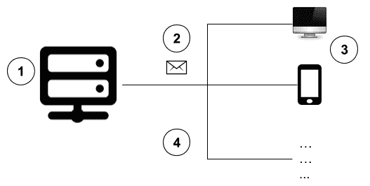

电子邮件服务组件

现在，我们将简要概述前面图表中的每个组件，以解释它们如何适用于客户端-服务器架构风格。前面的图表由以下部分组成：

+   服务器（**1**）

+   请求有效载荷（2）

+   访问服务器资源的客户端（**3**）

# 服务器

服务器负责处理接收到的请求（应符合预定义格式），然后生成结果。

一旦数据被检索，整个过程开始，检查请求之前进行处理。这个过程从验证和授权检查开始，验证客户端的身份。然后开始验证过程，以审查客户端提供的输入，并测试提供的请求主体以验证其结构。之后，执行验证数据是否符合业务逻辑约束的检查。最后，服务器处理请求。

这些步骤使得在应用程序中实现一定程度的可靠性成为可能，因为恶意或损坏的请求根本不会被处理，这些请求最终会破坏数据或使系统变得不一致。

服务器提供的响应通常是稍后由客户端使用的服务或资源。当请求未能成功处理时，将向客户端发送包含合理信息的响应。

高性能服务器用于支持所需的处理。服务器位于本地或基于云的基础设施中。

# 扩展

一旦服务器投入生产，监控其资源消耗和与应用程序相关的业务指标是个好主意。如果我们发现任何异常或高流量，我们应该考虑扩展服务器以提供更好的用户体验。

由于客户端可以是任何能够连接到服务器的设备，包括独立的计算机，我们可能会突然有数百万个客户端访问服务器。当应用程序在一台机器上运行时，应用程序的客户端和服务器部分之间的资源消耗平衡是固定的。然而，一旦客户端和服务器可以独立扩展，客户端的规模就变得远远超过服务器的容量。今天，客户端只需要与一个用户进行交互。因此，他们很容易获得足够的资源。然而，服务器可能被要求支持跨广泛、动态范围的客户端数量。在这种情况下，扩展成为一个重要的技术要求。

我们有两种选项来扩展服务器，如下所示：

+   垂直

+   水平

对于因其自身特性而无法部署在多个节点上的服务，我们可以考虑垂直扩展。一个节点可以由运行服务的计算机或进程来表示。

在这种扩展选项中，我们只能通过增加更多资源（如 RAM、CPU、硬盘等）来扩展服务，如下图所示：

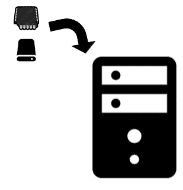

垂直扩展

我们的一个明确限制是，我们只能增加运行服务的唯一进程的功率。

另一方面，如果您有一个无状态的服务，比如 REST API，它可以部署在多个节点上，从而可以水平扩展服务。这种方法允许我们更好地扩展应用程序，但负载均衡器应该放在它们的前面，以便使用算法适当地路由请求。一个典型的算法是轮询，它将请求均匀地分配给所有可用的节点。

下图显示了服务器在负载均衡器后面排列，使用水平扩展方法：

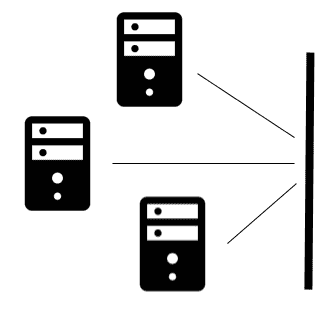

水平扩展

# 请求

请求是客户端向服务器发送的一段信息。客户端和服务器必须就它们用于通信的协议达成一致，以便允许它们相互交互。

为了促进数据交换，建议产品供应商提供 SDK（或某种库）。例如，如果您想从 Java 应用程序与数据库进行交互，那么有以库形式编码的驱动程序可供使用。此外，数据库供应商还为不同的编程语言、桌面应用程序或 UI 提供与服务器交互的驱动程序，如 pgAdmin 或 MySQL Workbench。

提供 SDK 并不是必须的；即使提供了 SDK，易于理解的文档也会避免在服务器和客户端之间引入顺从关系。

**顺从关系**是领域驱动设计提出的一个术语。它表明一个服务有一个复杂和庞大的模型，当服务器引入新的变化或发布新的功能时，强制下游依赖关系进行修改。修改应该发生，因为编写自己的模型适应或与服务器交互的机制所需的工作量非常大，难以实现。

# 客户端

可以用于应用程序客户端的选项有很多。以电子邮件为例，众所周知，计算机操作系统中包含原生应用程序，移动设备如智能手机、iPad 或平板电脑也可以配置为与现有的电子邮件服务器进行交互。有两种类型的客户端，如下所示：

+   Fat clients

+   Thin clients

Fat clients 具有实现逻辑，负责执行一些验证、格式化数据和履行其他相关职责。它们旨在使最终用户与服务器之间的交互更加容易。

想象一下运行 Outlook 的 Windows PC。这代表了一个典型的厚客户端的例子。相比之下，与 Web 邮件站点进行通信的 Web 浏览器是一个瘦客户端的典型例子。

我们还可以将厚客户端与在我们的手机上运行的本机应用程序进行比较，当它们无法与服务器建立通信时，它们可以部分工作；与之相反，像 Web 浏览器这样的瘦客户端是绝对无用的。

在厚客户端类别中，我们还有中间件，它通常消耗多个服务并编排请求以实现业务目标。最常见的例子是作为 SOA 架构的一部分常用的**企业服务总线**（**ESB**）。

瘦客户端非常简单，并且具有一个简单的机制，可以与服务器进行交互。一个常见的例子是使用`curl`命令通过 HTTP(S)协议与 Rest-API 进行交互。

# 网络

网络是一种支持服务器和客户端之间通信的媒介，遵循请求-响应消息传递模式，其中客户端通过这种媒介向服务器发送请求，服务器通过这种媒介响应请求。网络的一个典型例子是互联网，它使我们能够与连接到它的所有设备进行通信。今天，有大量设备可以连接到互联网，包括计算机、平板电脑、智能手机、Arduino、树莓派等。这些设备的使用已经推动了**物联网**（**IoT**）的发展，使我们有机会创新并创建一个新的应用时代。还有其他类型的网络，如蓝牙、LiFi、局域网等，可以根据业务需求允许客户端和服务器之间的交互。

# 在哪里应用客户端-服务器架构

有许多情况下可以使用客户端-服务器架构风格。让我们回顾一些典型的例子，以更好地理解这种方法。

如前所述，数据库通常适用于这种架构风格。目前，市场上有许多数据库供应商，其中大多数只提供垂直扩展的机会。这种方法的两个经典例子是 SQL Server 和 PostgreSQL。然而，也有水平扩展的选项。按照这种模型的最著名的数据库是 Cassandra，这是 Facebook 创建的数据库，后来被采纳为 Apache 项目。这个数据库使用环模型连接不同的节点，数据存储在其中。通过这种方式，您可以根据需要添加尽可能多的节点，以支持高可用性。

像 Slack 这样的聊天服务是使用云的客户端-服务器架构的经典例子。这个聊天软件几乎为任何计算机操作系统提供客户端，也为移动平台提供客户端；甚至可以直接在浏览器上使用，如果您不想在设备上安装本机应用程序。

代理也是这种架构风格的一个有趣的应用。代理是负责将客户端发送的信息发送到服务器的软件部分，无需人类交互。例如，New Relic（[`newrelic.com/`](https://newrelic.com/)）是一个用于监控服务器和应用程序健康状况的**应用性能监控和管理**（**APM**），使用代理发送数据。

假设您想要监视现有的 Java 应用程序。为了实现这个目标，您只需要在应用程序启动时添加 New Relic 代理，使用`javaagent`选项。这样，代理将不断向 New Relic 发送信息，这将为我们提供与内存和 CPU 消耗、响应时间等相关的信息。在这种情况下，处理代理发送的数据的服务器也在云中。

物联网也严重依赖于客户端-服务器架构的使用，其中具有传感器（或其他机制）的小型设备不断向负责分析数据的服务器发送信息，以执行操作，具体取决于所需的操作。

# 使用 Spring 实现客户端-服务器架构

现在您对客户端-服务器架构有了更好的理解，我们将编写一个遵循此图表的示例：

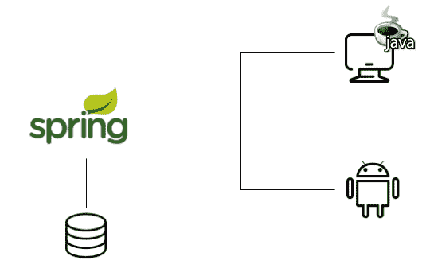

客户端-服务器架构示例

我们的应用程序的功能将是简单的。服务器将公开一个包含客户银行对账单的端点，然后我们将编写几个客户端来使用该信息。

# 服务器

使用 Spring 框架构建服务器端的选项有很多，包括以下内容：

+   SOAP Web 服务

+   RESTful Web 服务

+   **公共对象请求代理架构**（**CORBA**）

+   套接字

+   AMQP

# SOAP Web 服务

在 REST 风格出现之前，开发人员广泛实现了 SOAP Web 服务，它们严重依赖于 XML 的使用。还有一堆库可用于处理它们，包括 Apache CXF 和 JAX-WS。以下屏幕截图代表了一个简单加法操作的请求有效载荷：

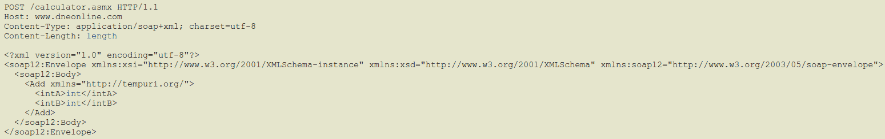

请求有效载荷

以下屏幕截图显示了响应的外观：

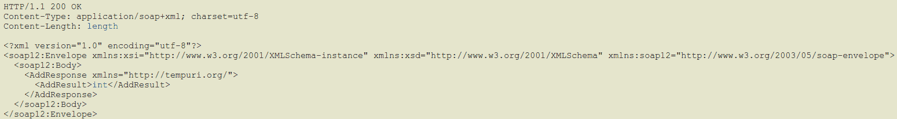

响应有效载荷

前面的例子取自[`www.dneonline.com/calculator.asmx?op=Add`](http://www.dneonline.com/calculator.asmx?op=Add)。

这些 XML 文件遵循 SOAP Web 服务使用的**Web 服务描述语言**（**WSDL**）格式。

# RESTful Web 服务

另一方面，目前更受欢迎的是 RESTful 风格，有很多公共 API 使用它。常见的例子是 GitHub 和 Yahoo 等公司。这种风格基于 HTTP 动词的功能，使人们很容易理解它们的工作原理。例如，以下 HTTP 请求可以查询 GitHub 的存储库：

```java
GET https://api.github.com/users/{{GITHUB_USERNAME}}/repos
```

这种风格于 2000 年出现，由 Roy Fielding 的博士论文解释了 REST 原则，并规定了良好设计的 Web 应用程序应该如何行为。使用 HTTP 动词的方法在下表中描述：

| **HTTP 方法/动词** | **用途** |
| --- | --- |
| `GET` | 列出指定 URI 下的所有资源 |
| `POST` | 在指定的 URI 中创建新资源 |
| `PUT` | 用另一个资源替换指定 URI 下的现有资源 |
| `DELETE` | 删除指定 URI 中的资源 |
| `PATCH` | 部分更新驻留在指定 URI 中的资源 |

# CORBA

CORBA 是一个非常古老的标准，旨在允许用不同编程语言编写的应用程序相互交互。由于需要所有必需的管道代码来实现目标，使用这个标准很困难。CORBA 如今不再流行，但一些遗留应用程序仍然使用它与主要用 Cobol 编写的旧代码进行交互，Cobol 是编写银行核心的首选编程语言之一。

# 套接字

套接字是一种常见的协议，随着 WebSockets 的出现变得更加流行，它在服务器和客户端之间建立了全双工通信通道。这种协议通常用于包括 Slack 在内的信使应用程序的典型场景。

# AMQP

使用 AMQP 或任何类似的消息传递协议的应用程序旨在允许异构应用程序之间的互操作性，采用异步方法。有许多商业和开源实现，如 AWS-SQS/SNS 和 RabbitMQ 等，可以用于实现使用此模型的应用程序。我们将在第六章中详细审查这个工作原理，*事件驱动架构*。这种方法的基本概念是使用消息代理来接收消息，然后将它们分发给订阅者。

对于我们的示例，我们将选择 RESTful Web 服务，这是目前很受欢迎的选择。为了实现我们的目标，我们将使用 Spring Boot（引导我们的应用程序）以及 Spring Data（使用 H2 持久化信息，H2 是一个内存数据库）。我们的应用程序将使用 JSON Web Tokens RFC（[`tools.ietf.org/html/rfc7519`](https://tools.ietf.org/html/rfc7519)）进行安全保护。

JWT 是一个开放标准，旨在允许服务器对客户进行身份验证。另一个用例是验证消息的完整性。为了将 JWT 用作身份验证机制，客户端应该将他们的凭据发送到服务器，服务器将以字符串形式的令牌回应他们。这个令牌应该用于后续的请求。当执行它们时，如果提供的令牌无效或过期，我们将从服务器收到 401 未经授权的状态代码。否则，请求将成功：

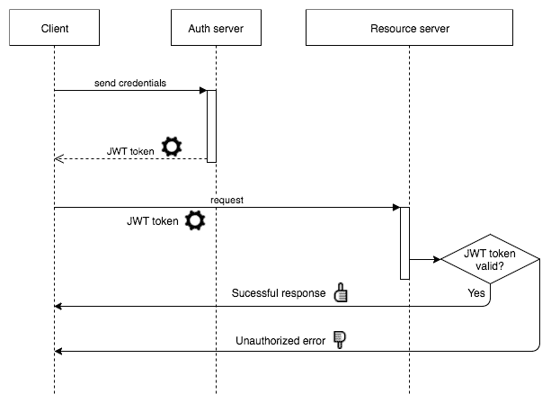

JWT 身份验证流程

由于此应用程序的功能不需要大量的计算或实时处理，我们使用 Groovy 作为编程语言。Groovy 的语法与 Java 非常相似，但具有大量内置功能，可以避免编写冗长的代码。与 Groovy 一起，我们将使用 Spock 作为测试框架。这将使我们能够使用**行为驱动开发**（BDD）方法编写高度表达性的测试，使用`given`，`when`和`then`语法。BDD 的主要思想是通过具有帮助理解测试失败原因的表达性测试名称，减少对测试方法正在测试什么的不确定性。

BDD 方法基于用户故事的结构，其思想是编写能清楚表明正在测试什么的测试。一个经典的例子是由 BDD 的创始人 Dan North 提供的，以以下与 ATM 工作相关的用户故事为例：

| **标题 - 客户取款** | **场景 1 - 账户有余额** | **场景 2 - 账户透支超过透支限额** |
| --- | --- | --- |
| 作为客户，我想从 ATM 取款，这样我就不必在银行排队等候。 | 假设账户有余额，卡片有效，取款机有现金，当客户请求现金时，确保账户被借记，现金被发放，卡片被归还。 | 假设账户透支，卡片有效，当客户请求现金时，确保显示拒绝消息。确保不发放现金并归还卡片。 |

通过使用 Spock，前面的验证可以很容易地用代码表达。让我们检查我们实现的测试之一，以了解它是如何工作的：

```java
def "when the credentials are not found, an UNAUTHORIZED code is returned"() 
{
  given:
  def nonExistentCredentials = 
  new Credentials(username: "foo", password: "bar")
  def loginService = Mock(LoginService)
  loginService.login(nonExistentCredentials) >> 
  {
    throw new LoginException()
  }
  def securityController = new SecurityController(loginService)
  when:
  def response = securityController.auth(nonExistentCredentials)
  then:
  response.statusCode == HttpStatus.UNAUTHORIZED
}
```

正如您所看到的，测试使用 Spock 提供的`given`，`when`和`then`语法，能够很好地解释自己。

Spock 还允许使用模拟，无需额外的库，如 Mockito，因为这个功能是内置的。如果您对 Spock 想了解更多，我鼓励您访问[`spockframework.org/`](http://spockframework.org/)。

# 实现服务器

让我们为我们的示例实现服务器项目。我们将以模块的形式组织其功能，以便易于演变和理解。为简单起见，我们将添加一个简单的功能，稍后将由不同的应用程序客户端使用。服务器示例将有三个模块，如下所示：

+   银行业务

+   银行 API

+   银行客户端

# 银行业务

此模块包含构建我们应用程序所需的所有领域对象；将它们作为另一个模块保持分离是个好主意。通过这样做，您可以稍后将模块包含为其他模块的依赖项，这将有助于避免重复编写相同的代码。以下图表显示了此模块的内容：

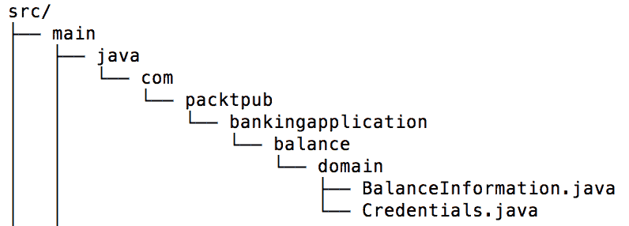

银行业务模块

如您所见，此模块仅包含两个类。`Credentials`类用作有效负载，用于验证用户并检索 JSON Web 令牌，而`BalanceInformation`类包含查询客户账户余额的有效负载结果。

# 银行 API

银行 API 模块包含服务器公开的功能，稍后将由不同的应用程序客户端使用；该功能将可用于 RESTful Web 服务。让我们回顾一下此 API 的项目结构：

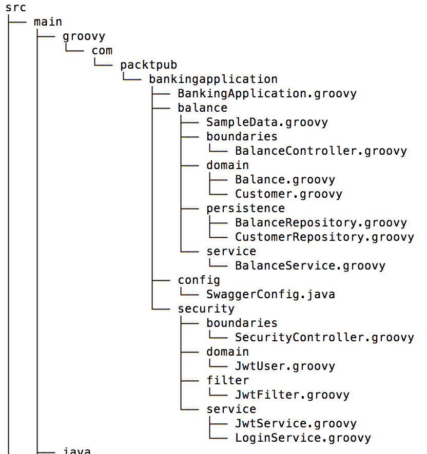

银行 API 模块

如前所述，此模块完全使用 Groovy 实现，这就是为什么所有文件都具有`.groovy`扩展名。项目结构在这里更为重要，因为项目分为`balance`、`config`和`security`包，这使得理解它们的目的相当简单。以这种方式组织代码总是值得的，以便易于理解。

我们之前提到不仅应提供 SDK，而且还应强烈推荐提供适当的文档。编写文档的繁琐部分在于您需要将其与项目中添加的新功能保持同步。为了实现这一目标，我们已将 Swagger 集成到我们的应用程序中。这是一个有用的工具，可以生成一个网站，其中包含消费应用程序端点的示例。此外，当需要时，它还为每个端点创建有效负载演示，如下图所示：

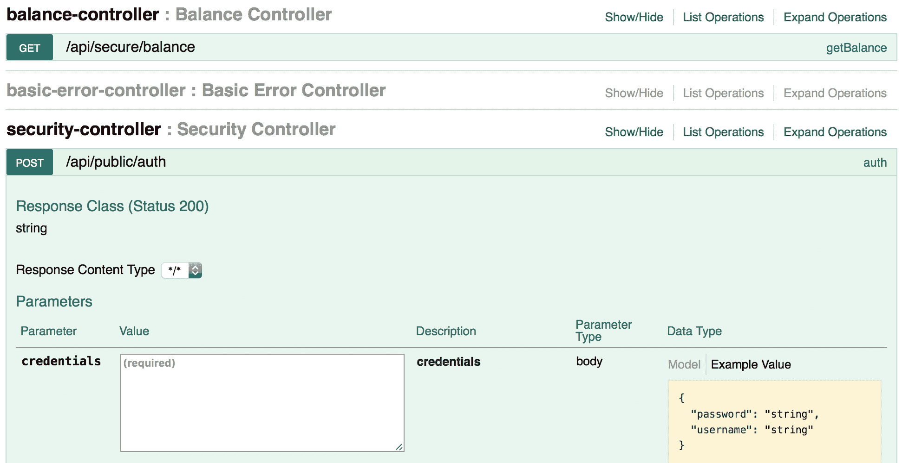

自动生成的 Swagger UI

该门户网站可在`http://localhost:8080/swagger-ui.html`上使用。

现在，让我们简要回顾一下每个模块中屏幕截图中列出的包。

# 边界

`boundaries`包含应用程序公开的功能，用于与客户端进行交互。在这种情况下，我们将放置我们服务的端点。

# 领域

领域包含此模块所需的领域对象。放置在这里的类不会在任何其他地方使用，这就是为什么将它们放在银行业务模块中没有意义的原因。

# 持久化

顾名思义，我们将在此包中编写持久化信息所需的代码。由于我们应用程序的持久化存储是数据库，并且我们已经定义了要使用 Spring-data，我们在这里有我们的 Spring-data 存储库。

# 服务

我们已将所需的业务逻辑放入此包中。这是与许多类进行交互以实现业务需求的地方。

# 监控服务器

我们之前提到监控对于了解应用程序在实际中的表现非常重要。幸运的是，Spring 有`actuator`，这是一个可以轻松附加到现有 Spring Boot 应用程序的库，只需添加以下依赖项：

```java
compile("org.springframework.boot:spring-boot-starter-actuator")
```

Spring Boot 执行器提供了一堆准备好供使用的端点，并提供有关应用程序的有用信息。让我们在下表中审查其中一些：

| **端点** | **简要描述** |
| --- | --- |
| `/health` | 这提供了有关应用程序状态及其主要依赖项（如数据库或消息系统）的简要信息。 |
| `/autoconfig` | 这提供了关于 Spring 框架为应用程序提供的自动配置的信息。请记住，Spring 更喜欢约定胜过配置，所以你会在这里找到大量的默认值。 |
| `/beans` | 这显示了作为应用程序上下文的一部分配置的 Spring bean 列表。 |
| `/dump` | 这在请求端点的确切时刻执行线程转储。 |
| `/env` | 这列出了服务器中配置的所有变量。作为`.properties`/`.yml`文件的一部分提供的值以及提供给运行应用程序的参数也会列出。 |
| `/metrics` | 这显示了应用程序中公开的可用端点周围的一些指标。 |
| `/trace` | 这提供了有关最后 100 个（默认值）请求的信息，包括有关请求和响应的详细信息。 |

如果您对默认可用的端点完整列表感兴趣，我鼓励您访问[`docs.spring.io/spring-boot/docs/current/reference/html/production-ready-endpoints.html`](https://docs.spring.io/spring-boot/docs/current/reference/html/production-ready-endpoints.html)。

所有前述的端点主要可以配置三个参数：

+   `id`：这是端点标识

+   `sensitive`：这表示 Spring 执行器是否应强制执行安全性

+   `enabled`：这表示 Spring 执行器端点是否可用

如果要配置端点，必须在配置（`.properties`/`.yml`）文件中使用以下条目：

```java
endpoints.endpoint_name.property
```

以下要点扩展了这个想法：

+   `endpoints`：这是一个常量值。

+   `endpoint_name`：这应该替换为所需的端点。

+   `property`：这可以是`id`、`sensitive`或`enabled`。

例如，假设您想要启用`health`端点，将其重命名为`status`，并且不强制执行`security`。为了满足这个要求，配置应该如下所示：

```java
endpoints.health.id = status
endpoints.health.sensitive = false
endpoints.health.enabled = true
```

所有端点默认情况下都是启用的，除了`/shutdown`，它旨在优雅地停止应用程序。

此外，Spring 执行器也可以配置生成业务指标。这是一个很棒的功能，可以与其他工具集成，从而可以使用图形界面可视化收集的指标。我们将在第十二章中详细审查此功能，*监控*。

# 测试

到目前为止，我们已经介绍了单元测试来验证代码是否按预期工作。但是，我们希望添加更多的测试。毕竟，我们在系统中包含的测试越多，我们就会获得越多的信心。

由于我们正在编写一个 rest API，我们将创建一个简单的脚本，定期测试我们的端点，从而确保应用程序始终正常工作。为了实现这个目标，我们的测试将遵循一个简单的流程：

1.  使用端点对用户进行身份验证。

1.  验证响应中的状态代码。

1.  从响应体中获取令牌。

1.  使用令牌击中余额端点。

1.  验证响应中的状态代码。

实现这个目标的最简单方法是使用 Postman（[`www.getpostman.com/`](https://www.getpostman.com/)）。这是一个方便的工具，可以尝试 RESTful web 服务，并为它们创建测试。

让我们讨论为验证用户身份而生成的端点的测试，如下面的屏幕截图所示：

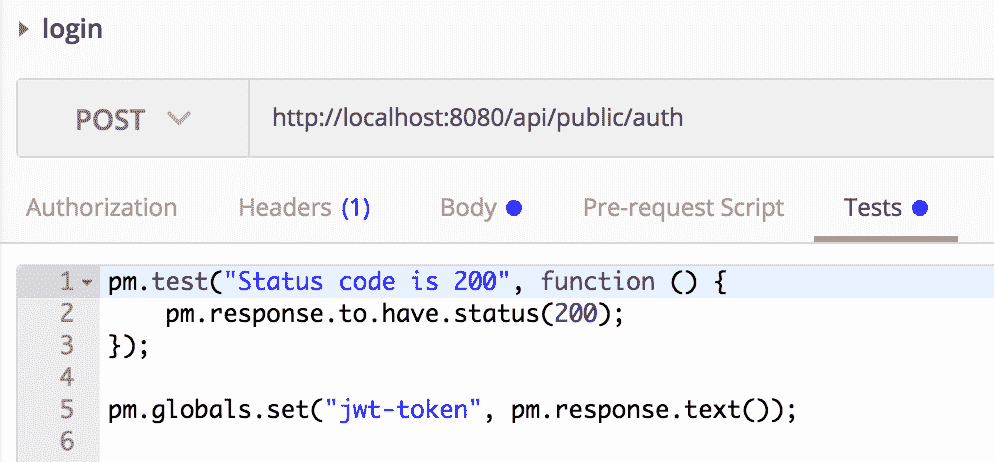

在 Postman 中对身份验证端点进行测试

前面代码的前三行检查了检索到的状态码，第 5 行将检索到的响应体作为名为`jwt-token`的变量存储。

使用前面的代码，我们可以将这个变量的值注入到后续的请求中，并执行任何我们想要的验证。

一旦所有测试都创建好了，我们可以生成一个链接，指向包含它们的集合，如下面的截图所示：

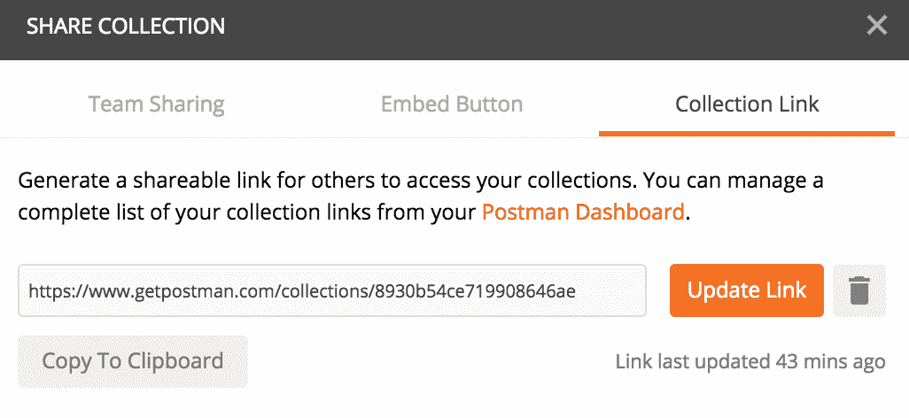

Postman 集合链接

有了这个链接，测试集合可以一遍又一遍地执行，使用一个名为 Newman 的命令行集成运行器（[`www.npmjs.com/package/newman`](https://www.npmjs.com/package/newman)）和以下命令：

```java
newman run https://www.getpostman.com/collections/8930b54ce719908646ae
```

下面的截图显示了 Newman 命令的执行结果：

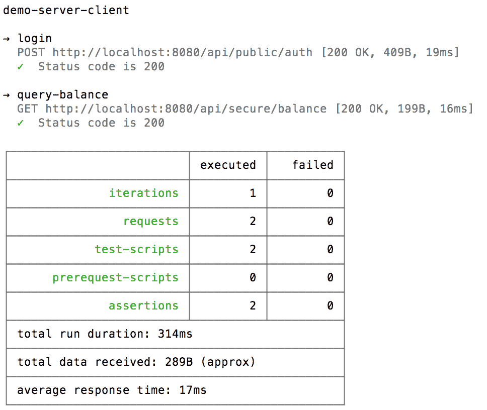

Newman 命令执行的结果

这个工具可以与任何 CI 服务器集成，比如 Jenkins，以定期安排任务来验证应用程序的健康状况，这将给我们带来信心，确保我们的应用程序一直在工作。

# 银行客户端

由于我们的服务器是使用 RESTful web 服务实现的，有很多选项可以编写客户端，并使用 Netflix Feign、OkHttp、Spring Rest Template 和 Retrofit 等库来消耗它们。

因此，客户端可以有自己实现的机制来消耗服务。这种方法并不坏；实际上，我们应该保持开放，编写自己的工具与服务器交互的决定应该是客户端的选择，以避免前面描述的顺从关系。然而，提供一个内置的 SDK 或库与服务器交互并减少所需的工作量总是一个好主意，这就是我们有银行客户端模块的原因。

产品供应商通常提供 SDK。例如，AWS 提供了支持多种编程语言的 SDK，配合开发者指南文件，解释了如何使用它们。这有助于加速和鼓励其他开发者构建应用程序来采用产品。另一个例子是 Google Firebase，它是一个实时数据库，提供了准备在不同平台上使用的 SDK；它有一个网站，上面有出色的演示，让开发者能够理解它的工作原理和如何使用它。

这个银行客户端模块是使用一个名为 Retrofit 的库实现的（[`square.github.io/retrofit/`](http://square.github.io/retrofit/)），它可以编写类型安全的 HTTP 客户端，几乎可以用于任何类型的 Java 应用程序。这也提供了许多好处，比如：

+   支持移动应用，比如 Android

+   易于阅读并且解释自身良好的代码

+   支持同步和异步资源消耗

+   与转换器的顺畅集成，比如 GSON

让我们来看一下实现的客户端，以便消耗这些终端。

# 认证终端客户端

为了消耗 RESTful web 服务，我们只需要创建一个带有一些注解的接口，提供一些元数据：

```java
public interface SecurityApi 
{
  @POST("/api/public/auth")
  Call<String> login(@Body Credentials credentials);
}
```

很容易理解认证终端使用`POST` HTTP 动词。它位于 URI`/api/public/auth`，并且需要一个`Credentials`对象作为请求体。

# 账户余额终端客户端

在这种情况下，我们将消耗一个终端，位于 URI`/api/secure/balance`，使用`GET` HTTP 动词，并要求在请求中使用令牌作为标头：

```java
public interface BankingApi 
{
  @GET("/api/secure/balance")
  Call<BalanceInformation> queryBalance(@Header("x-auth-token") 
  String token);
}
```

正如你可能已经注意到的，这个模块使用了`BalanceInformation`和`Credentials`类，所以我们不需要再次编写它们；我们只需要将银行域模块作为依赖添加进来。

你可能想知道在哪里指定服务器的 IP 地址和端口，这是在`Retrofit`对象中完成的，如下所示：

```java
Retrofit retrofit = new Retrofit.Builder()
        .baseUrl("http://IP:PORT")
        .addConverterFactory(GsonConverterFactory.create(gson))
        .build();
```

在客户端的实现中，我们将审查如何使用`Retrofit`对象与接口一起进行请求。

# 客户端

现在我们已经实现了服务器，我们将构建三个客户端，如下所示：

+   JavaFX 客户端

+   安卓客户端

+   瘦客户端，使用 CURL

这些客户端将使用 HTTP 协议发送请求并检索响应。由于我们编写了一个客户端模块，与服务器的交互将非常简单。

# JavaFX 客户端

这个客户端是一个简单的 JavaFX 应用程序，它依赖于 banking-client 模块与服务器进行交互。我们可以说这个客户端是一种类似于 fat client 的客户端，因为它有一些代码用于简化与服务器的交互。

让我们在以下截图中审查项目结构：

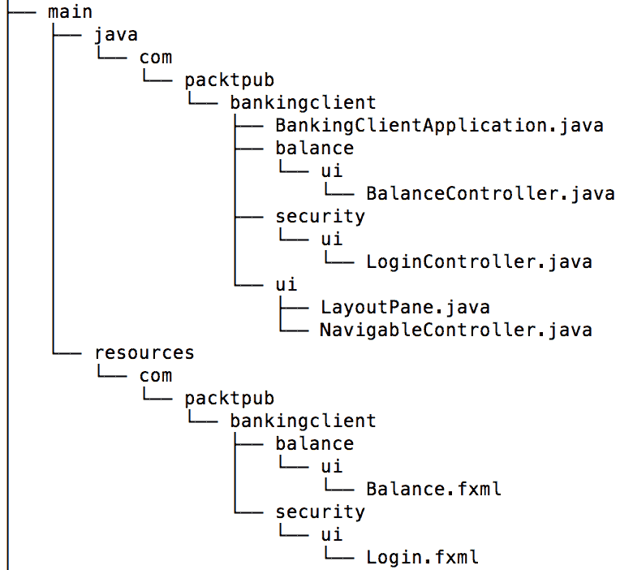

JavaFX 客户端项目结构

这个项目非常简单，只有两个屏幕，允许用户输入他们的凭据然后查询他们的账户余额。

Retrofit 提供了进行同步和异步请求的功能。在这个客户端中，我们将使用同步请求，如下所示：

```java
SecurityApi api = BankClient.getRetrofit().create(SecurityApi.class);
Call<String> call = api.login(
            new Credentials(username.getText(), password.getText()));
Response<String> response = call.execute();
// do something with the response
```

`execute`方法允许进行同步请求。`Retrofit`对象包含将与客户端接口中提供的部分 URI 一起使用的基本 URI，以形成命中端点的完整 URI。

这个客户端应用程序的流程如下截图所示：

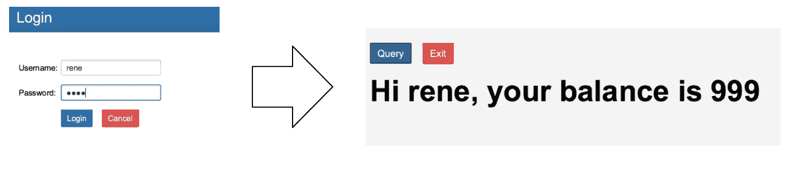

JavaFX 客户端应用程序

# 安卓客户端

安卓客户端还使用提供的 banking-client 模块与服务器进行交互，但在这种情况下，需要使用异步方法进行请求（这个要求来自安卓的工作方式）。我们也可以说这是一个 fat client，通过之前提供的定义来看。

让我们在以下截图中审查该项目的结构：

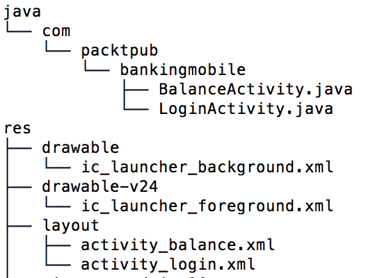

安卓客户端项目结构

`Activity`类包含编写异步请求的代码，如下所示：

```java
SecurityApi api = BankClient.getRetrofit().create(SecurityApi.class);
Call<String> call = api.login(new Credentials(username, password));
call.enqueue(new Callback<String>() 
{
  @Override
  public void onResponse(Call<String> call, 
  Response<String> response)
  {
    // do something with the reponse
  }
  @Override
  public void onFailure(Call<String> call, Throwable t) 
  {
    // handle the error properly
  }
}
```

`enqueue`方法允许异步地命中端点，并注册两个回调函数，这些函数将根据响应是失败还是成功而执行。

这个客户端应用程序的执行流程如下截图所示：

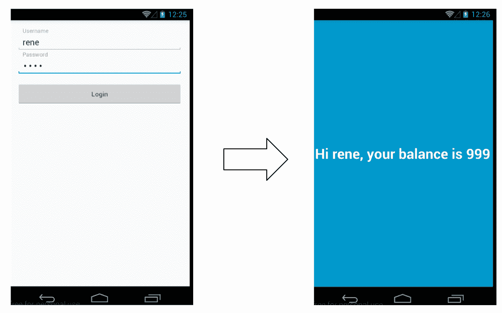

安卓客户端应用程序

# 瘦客户端

如前所述，还有瘦客户端，它们不包括大量与服务器交互的代码；`curl`是一个瘦 RESTful web 服务客户端的很好的例子。

为了与服务器提供的端点进行交互，我们可以使用两个`curl`命令，如下所示：

+   以下代码提供了检索认证 JWT 令牌的功能：

```java
$ curl -H "Content-Type: application/json" \
-X POST -d '{"username":"rene","password":"rene"}' \
http://localhost:8080/api/public/auth
```

+   以下代码提供了使用 JWT 令牌查询用户账户余额的功能：

```java
$ curl -H "x-auth-token: JWT_TOKEN" \
-X GET http://localhost:8080/api/secure/balance
```

对于这种类型的客户端，我们不必编写自己的代码；与服务器的交互没有花哨的前端，这可能是好事（例如，在 API 用于其他中间件的情况下）。

正如你所看到的，我们的客户端-服务器架构实现是简单的，但它使用了所有必要的部分使其工作。在这种情况下，我们使用 HTTP 协议作为通信渠道。然而，根据你实现的服务器类型，可能会有所不同，并且也可能会影响认证机制。例如，当你使用消息代理（如 RabbitMQ）允许服务器和客户端之间的交互时，用于建立通信的协议是 AMQP，这是一种不同的协议（与 HTTP 相比）。

你的应用程序将拥有的客户端类型也会影响你构建解决方案的方式。假设你正在使用代理作为客户端；一个更安全的身份验证机制将基于证书而不是令牌，就像前面的例子中所示。

# 总结

在本章中，我们回顾了什么是客户端-服务器架构以及如何使用 Spring 框架实现它们。要记住的一个重要方面是，当我们按照这种架构风格构建应用程序时，值得提供一个 SDK 来使服务器资源易于消耗。

提供适当的文档可以帮助客户端编写他们自己的代码与服务器进行交互，如果有必要的话。在这种情况下，我们将避免在服务器和客户端之间引入一种顺从的关系。我们还探讨了 Spring Actuator，这是一个可以用来添加提供有关应用程序信息的端点的库。此外，我们还回顾了如何使用 Postman 创建测试，以便定期评估应用程序的健康状况。

最后，我们使用 Retrofit 实现的库创建了一些客户端，这大大减少了消耗服务器资源的工作量。

在下一章中，我们将回顾 MVC 架构以及如何使用 Spring 编写它们。
