# 第五章：模型-视图-控制器架构

在本章中，我们将深入研究当今框架中使用的最常见的架构模式之一。

**模型-视图-控制器**（**MVC**）架构模式是由 Trygve Reenskaug 于 1979 年制定的。这是对图形用户界面进行组织化工作的最早尝试之一。尽管从那时起已经过去了许多年，但这种模式在最现代的 UI 框架中仍然非常受欢迎。这是因为它旨在构建几乎任何类型的应用程序，包括最常见的应用程序类型，如移动应用程序、桌面应用程序和 Web 应用程序。

这种模式的流行主要归结于易于理解。MVC 提供了一种将应用程序分成三个不同组件的绝佳方法，我们将在本章中进行审查。

在本章中，我们将涵盖以下主题：

+   MVC 的元素：

+   模型

+   查看

+   控制器

+   使用 MVC 架构的好处

+   常见陷阱

+   使用 MVC 实现应用程序：

+   Spring MVC

+   测试

+   UI 框架：Thymeleaf

+   保护 MVC 应用程序：

+   基本身份验证

+   HTTP 和 HTTPS

# MVC

支持 MVC 模式的想法是作为 Trygve Reenskaug 研究的一部分而发展的，他得出了以下关键思想：

“MVC 被构想为解决用户控制大型和复杂数据集的问题的一般解决方案。最困难的部分是找到不同架构组件的良好名称。模型-视图-编辑器是第一套。”

- [`heim.ifi.uio.no/~trygver/themes/mvc/mvc-index.html`](http://heim.ifi.uio.no/~trygver/themes/mvc/mvc-index.html)

计算机科学中最大的问题之一与命名有关，这就是为什么最初的名称是模型-视图-编辑器。后来演变成了 MVC，如前面的链接中所述：

“经过长时间的讨论，特别是与 Adele Goldberg 的讨论，我们最终确定了模型-视图-控制器这些术语。”

MVC 是一种软件架构模式，可以在应用程序的领域对象（业务逻辑所在的地方）和用于构建 UI 的元素之间建立明确的分离。

牢记这个概念，这些部分之间的隔离和关注点的分离非常重要。它们也构成了使用这种模式构建应用程序的基本原则。在接下来的章节中，让我们来看看应用程序的业务逻辑和表示层如何适应 MVC 模式。

# 模型（M）

在这种情况下，**模型**代表了表达支持应用程序固有要求的业务逻辑所需的领域对象。在这里，所有用例都被表示为现实世界的抽象，并且一个明确定义的 API 可供任何一种交付机制（如 Web）使用。

关于传统应用程序，与数据库或中间件交互的所有逻辑都是在模型中实现的。然而，模型（MVC 中的 M）应该暴露易于理解的功能（从业务角度）。我们还应该避免构建贫血模型，这些模型只允许与数据库交互，并且对于项目其他成员来说很难理解。

一旦应用程序的这一部分被编码，我们应该能够创建任何允许用户与模型交互的 UI。此外，由于 UI 可能彼此不同（移动应用程序、Web 和桌面应用程序），模型应该对所有这些都是不可知的。

在理想的世界中，一个独立的团队将能够构建应用程序的这一部分，但在现实生活中，这种假设完全是错误的。需要与负责构建 GUI 的团队进行交互，以创建一个能够满足所有业务需求并公开全面 API 的有效模型。

# 视图（V）

**视图**是模型（MVC 中的 M）的视觉表示，但有一些细微的差异。作为这些差异的一部分，视图倾向于删除、添加和/或转换特定的模型属性，目的是使模型对与视图交互的用户可理解。

由于模型有时很复杂，可以使用多个视图来表示其一部分，反之亦然，模型的许多部分可以作为视图的一部分。

# 控制器（C）

**控制器**是应用程序的最终用户和模型实现的业务逻辑之间的链接。控制器是负责接受用户输入并确定应调用模型的哪个部分以实现定义的业务目标的对象。作为这种交互的结果，模型经常会发生变化，并且应该使用控制器将这些变化传播到视图中。

视图和模型之间绝对不能直接通信，因为这构成了对这种模式工作方式的违反。

牢记前面的提示，所有通信应按照 MVC 模式的特定顺序进行，从视图传递信息到控制器，从控制器传递信息到模型，而不是直接从模型到视图，如下面的交互图所示：

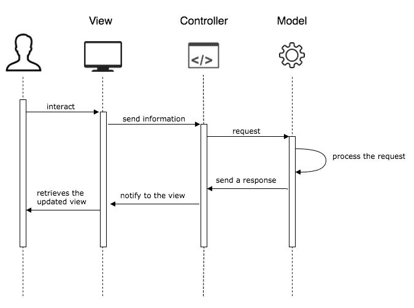

MVC 交互图

为了传播这些变化，视图元素与控制器中的表示绑定在一起，这样就可以根据需要对其进行操作。当模型更新时，更新视图的过程会发生，并且通常涉及重新加载数据或在视图中隐藏/显示某些元素。

当需要将更改传播到视图中的多个元素时，各种控制器可以协同工作以实现目标。在这些情况下，观察者设计模式的简单实现通常可以有助于避免纠缠的代码。

以下图表是这种模式中的部分如何排列的图形表示，无论是在演示层还是业务逻辑层：

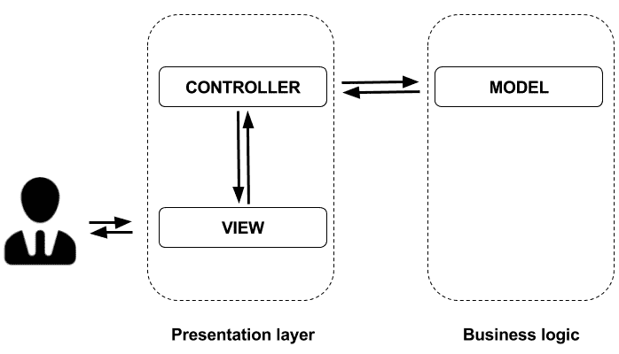

MVC 图形表示

# 使用 MVC 的好处

MVC 为使用它实现的应用程序提供了许多好处；主要好处是关注点的清晰分离，每个应用程序部分都有单一的责任，从而避免混乱的代码并使代码易于理解。

虽然控制器和视图在使用 MVC 构建应用程序的可视表示时是相互关联的，但模型是绝对隔离的。这使得可以重用相同的模型来创建不同类型的应用程序，包括但不限于以下内容：

+   移动

+   网络

+   桌面

你可能会认为使用这种模型开发的项目可以依靠在开发阶段同时但分别工作的团队，这在某些情况下是正确的，但并不是普遍规则。如前所述，跨团队的有效沟通仍然对整体构建应用程序是必要的。

# 常见陷阱

当我们使用 MVC 开发应用程序时，通常会发现项目按照 MVC 首字母缩写结构化，如下图所示：

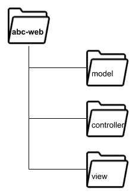

MVC 项目结构

此目录结构表示以下内容：

+   项目名称是**abc-web**

+   这是一个 Web 应用程序

+   该应用程序使用 MVC 架构（结构）

不幸的是，这些观点都没有为负责创建或维护应用程序的团队提供有意义的信息。这是因为一个项目的团队并不关心文件组织。相反，根据业务规则、用例或与业务本身相关的其他因素来组织代码要更有用得多，而不是技术方面。

考虑到这个想法，我们建议一个更有用的目录结构如下：

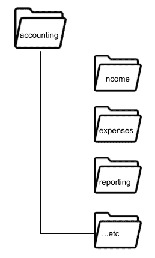

可理解的项目结构

从这个图表中，我们可以推断出以下几点：

+   这是一个**会计**系统。

+   项目的主要特点与以下内容相关：

+   Income

+   Expenses

+   报告

使用前面图表中显示的项目布局，如果我们被要求修复一个不再工作的报告，我们可以考虑审查报告文件夹。这种方法有助于减少完成项目任务所需的时间和精力。

我们可以得出结论，第二个项目结构提供的信息比第一个更有用和实用，因为第一个根本没有提供有关业务的信息。

项目的每个部分都应该传达有关业务的信息，而不是关于使用的交付机制或模式。

这些细节很小，但很重要。在本书的开头，我们提到一个良好的架构是围绕业务需求构建的，架构追求的任何目标都应该被整个团队理解。我们应该以实现这个目标为目标来处理每一个细节。记住：细节很重要。

# 使用 MVC 实现应用程序

现在你已经了解了 MVC 架构背后的理论，是时候将你学到的概念付诸实践，看看 Spring 框架如何实现它们。我们将从回顾 Spring MVC 开始，这是一个允许我们实现这种架构风格的项目。

# Spring MVC

Spring 通过 Spring MVC 提供对 MVC 架构模式的支持。这个 Spring 项目允许整合大量的 UI 框架，以构建表单和相关组件，使用户能够与应用程序进行交互。

Spring MVC 是建立在 servlet API 之上的，它旨在创建 Web 应用程序。没有办法使用它来创建桌面或任何其他类型的应用程序。尽管 MVC 架构模式可以应用于所有这些应用程序，但 Spring MVC 只专注于 Web。

Spring MVC 正式称为 Spring Web MVC。

尽管 Spring MVC 支持大量的视图技术，但最常用的技术往往是 Thymeleaf，因为它的集成非常顺畅。但是，你也可以使用其他框架，比如以下的：

+   JSF

+   FreeMarker

+   Struts

+   GWT

Spring MVC 是围绕前端控制器模式设计的，它依赖于一个对象来处理所有传入的请求并提供相应的响应。在 Spring MVC 的情况下，这个对象由`Servlet`实现，由`org.springframework.web.servlet.DispatcherServlet`类表示。

这个`Servlet`负责将请求委托给控制器，并在屏幕上呈现相应的页面，带有所需的数据。以下图表显示了`DispatcherServlet`如何处理请求：

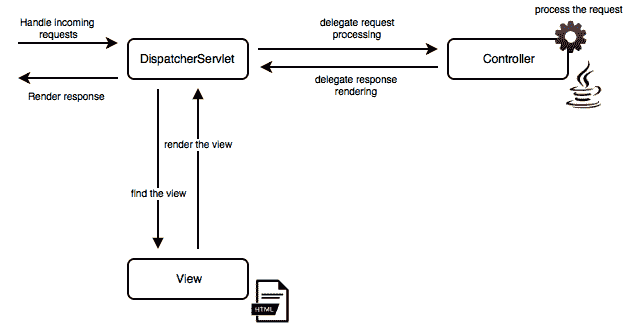

DispatcherServlet 请求处理

在前面的图表中，我们可以看到`Controller`是一个 Java 类，`View`是一个 HTML 文件。在后一种情况下，我们还可以使用任何`tag-library/template-engine`标签，它将被编译为在 Web 浏览器中呈现的 HTML 代码。

在 Spring 中，使用`@Controller`注解在类名上创建一个控制器，如下面的代码片段所示：

```java
import org.springframework.stereotype.Controller;

@Controller
public class DemoController 
{
  ...
}
```

现在，这个类被标记为一个控制器，我们需要指示将处理什么请求映射，并作为请求处理的一部分需要执行什么操作。为了支持这个功能，我们需要使用`@RequestMapping`注解编写一个简单的方法，如下面的代码所示：

```java
@RequestMapping(value = "/ABC", method = RequestMethod.GET)
public String handleRequestForPathABC() {
    // do something
    return "ui-template";
}
```

正如您所看到的，前面的方法处理来自`/ABC`路径的传入请求，一旦处理完成，将提供一个`ui-template`，以在浏览器上呈现。

这个操作是由 Spring MVC 使用视图解析器完成的，它将查找渲染名为`ui-template.html`的文件。如果需要，您还可以编写自定义解析器来为视图添加后缀或前缀。

当我们需要从控制器传递数据到视图时，我们可以使用`Model`对象，由 Spring 视图解析器启用。这个对象可以填充任何您想在视图中使用的数据。同样，当用户从视图提交数据时，这个对象将填充输入的信息，控制器可以使用它来执行任何所需的逻辑。

为了从控制器发送数据到视图，我们需要在处理请求的方法中将`Model`对象作为参数包含，如下所示：

```java
@RequestMapping(value = "/ABC", method = RequestMethod.GET)
public String passDataToTheView(Model Model) {
    Model.addAttribute("attributeName", "attributeValue");
    // do something
    return "ui-template";
}
```

所有模板都可以使用`${...}`语法（称为表达式语言）读取从控制器传递的属性：

```java
<!DOCTYPE html>
<html lang="en">
    <head>
        <title>Title</title>
    </head>
```

```java
    <body>
        ${attributeName} 
    </body>
</html>
```

或者，如果您想要将数据从视图组件传递到控制器，您必须在视图中填充一个对象（例如使用表单），如下所示：

```java
<!DOCTYPE html>
<html lang="en">
    <head>
        <title>Title</title>
    </head>
    <body>
        <form action="#" th:action="@{/process}"   
        th:object="${myObject}">
            <label for="name">Name:</label>
            <input type="text" id="name" th:field="*{name}"/>
            <button type="submit">OK</button>
         </form>
    </body>
</html>
```

一旦对象字段被填充并且提交按钮被按下，请求将被发送，以便我们可以声明一个方法来处理请求：

```java
@RequestMapping(value = "/process", method = POST)
public String processForm(@ModelAttribute MyObject myObject) {
    String name = myObject.getName();
    // do something
    return "ui-template";
}
```

在这种情况下，您可能已经注意到我们使用`@ModelAttribute`来捕获请求中发送的数据。

# 测试

测试对我们的应用程序至关重要。当我们使用 Spring MVC 时，我们可以依赖`spring-test`模块来添加对上下文感知的单元测试和集成测试的支持，这意味着我们可以依赖注解来连接依赖项。我们还可以使用`@Autowired`注解来测试特定组件。

以下是一个示例，演示了编写一个上下文感知的测试有多简单：

```java
@RunWith(SpringRunner.class)
@SpringBootTest
public class ContextAwareTest {

    @Autowired
    ClassUnderTest classUnderTest;

    @Test
    public void validateAutowireWorks() throws Exception {
        Assert.assertNotNull(classUnderTest);
    }
}
```

让我们回顾一下粗体字的代码，以了解它是如何工作的：

+   前两个注解为我们完成了所有的工作；它们将允许我们在 Servlet 容器内运行我们的测试，并且用于测试的 Spring Boot 注解将以与在生产中运行的代码相同的方式连接所有类。

+   由于我们添加了前面提到的注解，现在我们可以使用`@Autowired`注解来连接我们想要测试的组件。

+   代码验证了被测试的类已成功实例化，并且准备好被使用。这也意味着类中的所有依赖项都已成功连接。

这是一个测试代码的简单方法，该代码必须与数据库、消息代理服务器或任何其他中间件进行交互。用于验证与数据库服务器交互的方法使用内存数据库，例如 H2，用于传统 SQL 数据库（如 PostgreSQL 或 MySQL）；还有用于 NoSQL 数据库的选项，例如嵌入式 Cassandra 或 Mongo。

另一方面，当您需要测试与其他第三方软件的集成时，一个很好的方法是使用沙盒。沙盒是一个类似于生产环境的环境，供软件供应商用于测试目的。这些沙盒通常部署在生产环境中，但它们也有一些限制。例如，与支付相关的操作不会在最后阶段处理。

当您没有任何方法在自己的环境中部署应用程序时，这种测试方法是有用的，但当然，您需要测试集成是否与您的应用程序正常工作。

假设您正在构建一个与 Facebook 集成的应用程序。在这种情况下，显然不需要进行任何更改，以便在自己的测试环境中部署 Facebook 实例。这是沙盒环境适用的完美例子。

请记住，沙盒测试集成使用第三方软件。如果您是软件供应商，您需要考虑提供允许客户以测试模式尝试您的产品的沙盒。

Spring MVC 测试还具有流畅 API，可以编写高度表达性的测试。该框架提供了一个`MockMvc`对象，可用于模拟最终用户请求，然后验证提供的响应。常见用例包括以下内容：

+   验证 HTTP 代码状态

+   验证响应中的预期内容

+   URL 重定向

以下代码片段使用`MockMvc`对象来测试先前描述的示例：

```java
@RunWith(SpringRunner.class)
@SpringBootTest
@AutoConfigureMockMvc
public class RedirectionTest 
{
  @Autowired
 private MockMvc mockMvc;
  @Test
  public void contentAndRedirectionTest() throws Exception 
  {
 this.mockMvc.perform(get("/urlPage"))
 .andExpect(redirectedUrl("/expectedUrlPage") .andDo(print()).andExpect(status().isOk())
    .andExpect(
      content().string(containsString("SomeText")))
    );
  }
}
```

让我们快速审查粗体字中的代码，以了解其工作原理：

+   `AutoConfigureMockMvc`注解生成了在测试中使用`MockMvc`对象所需的所有基础代码。

+   `MockMvc`对象已自动装配并准备就绪。

+   `MockMvc`提供的流畅 API 用于验证响应的预期状态代码。我们还在测试简单的重定向，以及重定向完成后页面上预期的内容。

# 测试覆盖率

当我们讨论测试时，经常会听到术语**测试覆盖率**。这是一个用于检查测试套件执行了多少代码的度量标准，有助于确定未经测试的代码的替代路径，并因此容易出现错误。

假设您正在编写一个具有`if`语句的方法。在这种情况下，您的代码有两条可选路径要遵循；因此，如果您想实现 100%的覆盖率，您需要编写测试来验证代码可以遵循的所有可选路径。

有许多有用的库可用于测量代码的覆盖率。在本章中，我们将介绍 Java 世界中最流行的库之一；该库称为 JaCoCo（[`www.eclemma.org/jacoco/`](http://www.eclemma.org/jacoco/)）。

为了使 JaCoCo 成为我们应用程序的一部分，我们需要将其作为插件包含在内，使用我们首选的构建工具。

以下是使用 Gradle 包含 JaCoCo 所需的配置：

```java
apply plugin: "jacoco"
jacoco 
{
  toolVersion = "VERSION"
} 
```

以下是使用 Maven 包含 JaCoCo 所需的配置：

```java
<plugin>
  <groupId>org.jacoco</groupId>
  <artifactId>jacoco-maven-plugin</artifactId>
  <version>VERSION</version>
</plugin>
```

一旦 JaCoCo 作为项目的一部分被包含进来，我们将有新的任务可用于测量我们的代码覆盖率。通过执行以下 Gradle 任务来生成覆盖率报告：

```java
$ ./gradlew test jacocoTestReport
```

生成的覆盖率报告将以 HTML 格式提供，如下截图所示：

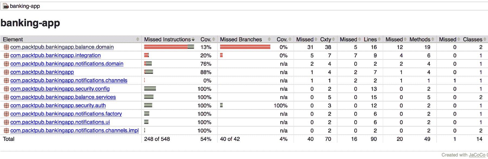

JaCoCo 报告

尽管我们确实希望为我们的代码实现高覆盖率，但我们需要小心编写什么类型的测试，因为考虑到这种方法，我们可能会被诱使编写无用的测试，只是为了实现 100%的覆盖率。

为了充分理解我在这里谈论的内容，让我们审查 JaCoCo 为域包中的一个类生成的报告：

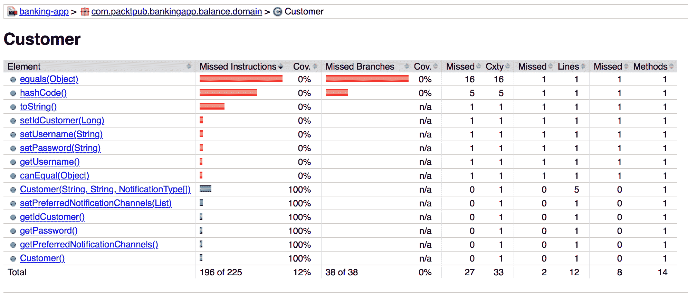

域类的测试覆盖率报告

报告显示，某些方法根本没有测试。其中一些方法对于任何 Java 对象都是标准的，其他方法只是 getter 和 setter（访问器），不需要进行测试。编写 getter 和 setter 通常会导致构建贫血的领域模型，并且大多数情况下，这仅用于使代码与依赖于 Java Beans 约定的框架兼容。因此，没有必要编写测试来覆盖 getter 和 setter。

我看到有人仅为这些方法编写测试，以实现 100%的覆盖率，但这是一个无用且不切实际的过程，应该避免，因为它对代码或编写的测试质量没有任何价值。

现在，让我们来审查一下具有一些值得测试逻辑的类的报告：

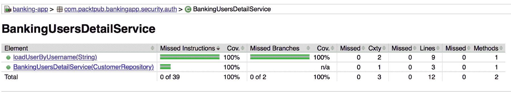

服务类的 JaCoCo 覆盖率报告

令人惊讶的是，这个类有 100%的覆盖率。让我们回顾一下这个类的相关测试，如下所示：

```java
@RunWith(MockitoJUnitRunner.class)
public class BankingUserDetailServiceTest 
{
  @Mock
  CustomerRepository customerRepository;
  @InjectMocks
  BankingUsersDetailService bankingUsersDetailService;
 @Test(expected = UsernameNotFoundException.class)
  public void whenTheUserIsNotFoundAnExceptionIsExpected() 
  throws Exception 
  {
    String username = "foo";
    Mockito.when(customerRepository.findByUsername(username))
    .thenReturn(Optional.empty());
    bankingUsersDetailService.loadUserByUsername(username);
  }
  @Test
  public void theUserDetailsContainsTheInformationFromTheFoundCustomer
  () throws Exception 
  {
    String username = "foo";
    String password = "bar";
    Customer customer = 
    new Customer(username, password, NotificationType.EMAIL);
    Mockito.when(customerRepository.findByUsername(username))
    .thenReturn(Optional.of(customer));
    UserDetails userDetails = bankingUsersDetailService
    .loadUserByUsername(username);
 Assert.assertEquals(userDetails.getUsername(), username);
    Assert.assertEquals(userDetails.getPassword(), password);
    Assert.assertEquals(userDetails.getAuthorities()
 .iterator().next().getAuthority(), "ROLE_CUSTOMER");
  }
}
```

我们并不总是能够达到 100%的覆盖率，就像在这个例子中一样。然而，一个很好的度量标准往往是 80%。您必须将之前提到的百分比视为建议，而不是规则；如果您验证您的测试是否涵盖了所有需要的逻辑，有时低于 80%的值也是可以接受的。

您需要聪明地使用生成的报告来弄清楚需要测试的逻辑，然后着手解决，而不是为结果感到沮丧。

使用这种工具的好处之一是，您可以将其集成为持续集成服务器的一部分，以生成始终可见的报告。通过这种方式，报告可以用于不断检查覆盖率是增加还是下降，并采取行动。我们将在第十一章 *DevOps 和发布管理*中更详细地讨论这个话题。

# UI 框架

当您使用 Spring MVC 时，您可以选择从大量的技术中构建您的网页。根据您选择的框架，您需要添加相应的配置，以便让 Spring 知道您的选择。

正如我们所知，Spring 支持代码配置，因此您需要添加一些注解和/或配置类来使您的框架工作。如果您想避免这些步骤，您可以使用 Thymeleaf；这个框架可以很容易地集成到现有的 Spring 应用程序中，包括 Thymeleaf starter 依赖项。根据所使用的工具，需要使用不同的代码行，如下所示：

+   在使用 Gradle 时，依赖项如下：

```java
compile('org.springframework.boot:spring-boot-starter-thymeleaf')
```

+   在使用 Maven 时，依赖项如下：

```java
<dependency>
  <groupId>org.springframework.boot</groupId>
  <artifactId>spring-boot-starter-thymeleaf</artifactId>
</dependency>
```

应用程序启动后，Spring Boot 将为您完成所有无聊的工作，为您的应用程序准备使用 Thymeleaf。

# Thymeleaf

Thymeleaf 是一个相对较新的模板引擎；第一个版本于 2011 年发布。Thymeleaf 与 HTML 非常相似，不需要任何 servlet 容器即可在浏览器中预览内容。这被利用来允许设计人员在不部署应用程序的情况下工作应用程序的外观和感觉。

让我们回顾一下如何将使用 HTML 和 Bootstrap 构建的 Web 模板转换为 Thymeleaf 模板，以便看到这个模板引擎并不具有侵入性。以下代码代表一个非常基本的 HTML 模板：

```java
<!DOCTYPE html>
<html lang="en">
  <head>
    <meta charset="UTF-8"/>
    <title>Default title</title>
    <meta name="viewport" content="width=device-width, 
    initial-scale=1"/>
    <link rel="stylesheet" href="https://maxcdn.bootstrapcdn.com/
    bootstrap/3.3.7/css/bootstrap.min.css"/>
    <script src="img/jquery.min.js"></script>
    <script src="img/bootstrap.min.js"></script>
  </head>
  <body>
    <nav class="navbar navbar-inverse">
      <div class="container-fluid">
        <div class="navbar-header">
          <a class="navbar-brand" href="#">MVC Demo</a>
        </div>
        <ul class="nav navbar-nav">
          <li><a href="/index">Home</a></li>
          <li><a href="/notifications">My notification channels</a> 
          </li>
        </ul>
        <ul class="nav navbar-nav navbar-right">
          <li>
            <a href="/login"><span class="glyphicon glyphicon-user"> 
            </span>  Login</a>
          </li>
          <li>
            <a href="/logout">
              <span class="glyphicon glyphicon-log-in"></span>
                Logout
            </a>
          </li>
        </ul>
      </div>
    </nav>
    <div class="container">
      <div class="row">
        <div class="col-md-3"></div>
        <div class="col-md-6">
          Page content goes here
        </div>
        <div class="col-md-3"></div>
      </div>
    </div>
  </body>
</html>
```

由于这是一个常规的 HTML 文件，您可以在浏览器中打开它，看看它的样子：

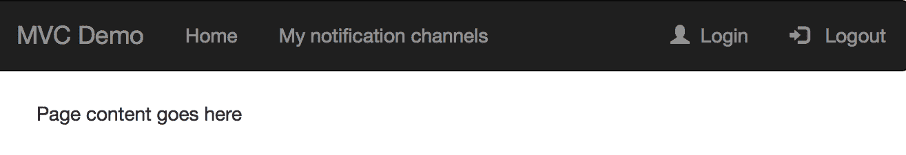

HTML 和 Bootstrap 模板

现在，让我们实现一些要求，使我们的模板以更现实的方式工作：

+   仅当用户登录时，注销选项才应出现

+   如果用户未登录，则不应出现“我的通知渠道”选项

+   一旦用户登录，登录选项就不应该出现

+   一旦用户登录，主页选项应该显示一个欢迎消息，使用他们的用户名

在创建 Web 应用程序时，这些要求是微不足道的，幸运的是，它们也很容易使用 Thymeleaf 实现。

为了在用户登录后显示/隐藏网页中的某些元素，我们需要包含一个额外的库来处理这些内容。

要使用 Gradle 包含库，请使用以下命令：

```java
compile('org.thymeleaf.extras:thymeleaf-extras-springsecurity4')
```

要使用 Maven 包含库，请使用以下命令：

```java
<dependency>
    <groupId>org.thymeleaf.extras</groupId>
    <artifactId>thymeleaf-extras-springsecurity4</artifactId>
</dependency>
```

现在，我们需要在 HTML 文件中添加一个标签声明，以便使用 Thymeleaf 和新增加的新扩展：

```java
<html lang="en"

      >
```

一旦我们包含了这些标签，我们将能够使用提供的内置功能。当您需要根据用户是否已登录来隐藏/显示某个元素时，您可以使用`isAuthenticated()`条件，如下所示：

```java
<ul class="nav navbar-nav navbar-right">
    <li sec:authorize="!isAuthenticated()">
        <a href="/login"><span class="glyphicon glyphicon-user"></span>  Login</a>
    </li>
    <li sec:authorize="isAuthenticated()">
        <a href="/logout">
            <span class="glyphicon glyphicon-log-in"></span>
              Logout
        </a>
    </li>
</ul>
```

根据分配的用户角色限制访问也是相当常见的。使用添加的扩展来实现这些检查也很容易，如下面的代码所示：

```java
<li sec:authorize="hasRole('ROLE_ADMIN')"><a href="/a">Admins only</a></li>
<li sec:authorize="hasRole('ROLE_EDITOR')"><a href="/b">Editors only</a></li>
```

最后，如果您需要在 Web 页面上显示用户名，您可以在 HTML 文件中使用以下标签：

```java
<p>Hello, <span sec:authentication="name"></span>!</p>
```

另外，一旦模板由我们的设计师或前端专家创建完成，我们将希望在整个应用程序中使用它，以保持一致的外观和感觉。为了实现这个目标，我们需要定义模板中哪些部分将使用`layout`标签来替换特定内容：

```java
<div class="col-md-6" layout:fragment="content">
    Page content goes here
</div>
```

然后页面将需要定义模板名称和应该显示在定义片段中的内容，如下所示：

```java
<!DOCTYPE html>
<html lang="en"

 layout:decorator="default-layout">
<head>
    <title>Home</title>
</head>
<body>
<div layout:fragment="content">
    // Content here
</div>
</body>
</html>
```

我们之前提到 Thymeleaf 根本不具有侵入性，我们将向您展示为什么。一旦使用 Thymeleaf 标签实现了所有期望的逻辑，您可以再次使用常规浏览器打开模板，而无需将应用程序部署在 Servlet 容器中。您将得到以下结果：

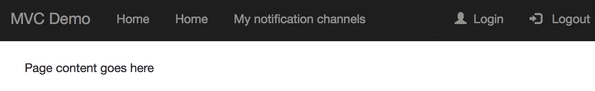

Thymeleaf 和 Bootstrap 模板

我们有重复的菜单选项，我们仍然可以看到登录和注销选项，因为浏览器无法解释 Thymeleaf 标签。然而，好消息是，引入的代码并没有对模板造成任何伤害。这正是为什么您的 Web 设计师可以继续工作并在浏览器中预览的原因。无论您在模板中引入了多少 Thymeleaf 标签，这些标签对现有的 HTML 代码都不具有侵入性。

# 保护 MVC 应用程序

安全是软件开发中的关键方面，如果我们想要避免将我们的应用程序暴露给常见的攻击，我们需要认真对待它。此外，我们可能希望限制非授权人员的访问。我们将在第十三章 *安全*中审查一些保持软件安全的技术。与此同时，您将学习如何使用 Spring Security 保护 MVC 应用程序。

到目前为止，我们已经审查了如何使用 Thymeleaf 和 Spring MVC 构建 Web 应用程序。在处理 Web 应用程序时，最常见的身份验证机制之一是基本身份验证。让我们更详细地讨论一下这个问题。

# 基本身份验证

基本身份验证，或基本访问验证，是用于限制或提供对服务器中特定资源的访问的机制。在 Web 应用程序中，这些资源通常是网页，但这种机制也可以用于保护 RESTful Web 服务。然而，这种方法并不常见；基于令牌的不同机制更受青睐。

当网站使用基本身份验证进行保护时，用户需要在请求网站页面之前提供他们的凭据。用户凭据仅仅是用户名和密码的简单组合，使用 Base64 算法进行编码，计算出应该在**身份验证**标头中的值。服务器稍后将使用这个值来验证用户是否经过身份验证并获得访问所请求资源的授权。如果用户经过身份验证，这意味着提供的用户名和密码组合是有效的；被授权意味着经过身份验证的用户有权限执行特定操作或查看单个页面。

使用这种身份验证机制的一个问题是，当用户在身份验证过程中将凭据发送到服务器时，凭据是以明文形式发送的。如果请求被拦截，凭据就会暴露出来。以下截图清楚地显示了这个问题；在这种情况下，使用了一个名为 Wireshark 的工具来拦截请求（[`www.wireshark.org`](https://www.wireshark.org)）：

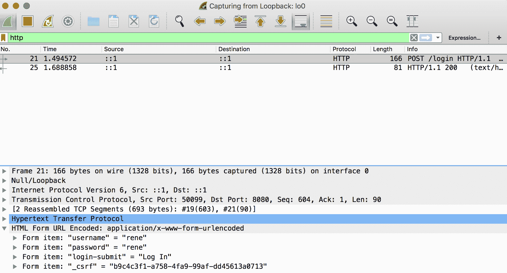

拦截的 HTTP 请求

可以通过使用安全版本的 HTTP 来轻松解决此问题，其中需要证书来加密服务器和浏览器之间交换的数据。证书应由受信任的**证书颁发机构**（**CA**）颁发，并应位于服务器上。浏览器有一个受信任的 CA 根证书列表，在建立安全连接时进行验证。一旦证书验证通过，地址栏将显示一个挂锁，如下图所示：


地址栏中显示的挂锁

如下图所示，HTTPS 协议使用`8443`端口，而不是标准的`80`端口，后者用于 HTTP：


地址栏使用 HTTPS

出于开发目的，您可以生成自己的证书，但浏览器会显示警告，指示无法验证证书；您可以添加异常以使用 HTTPS 打开请求的页面。

以下图表显示了使用 HTTPS 协议建立连接的过程：

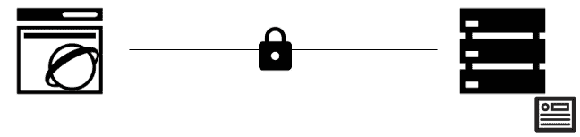

HTTPS 连接

中间的挂锁代表了数据在计算机网络中传输时的加密，使其无法阅读。以下截图显示了使用 Wireshark 拦截数据的样子：

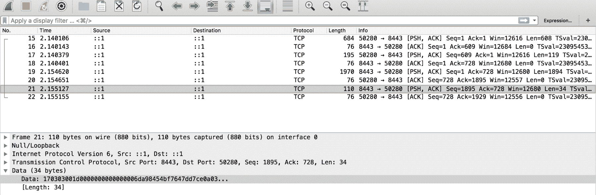

拦截的 HTTPS 请求

正如您所看到的，这些拦截的数据很难理解。通过这种方式，发送的所有信息都受到保护，即使在传输过程中被捕获，也不能轻易阅读。这种攻击被称为中间人攻击，是最常见的攻击类型之一。

# 实施基本身份验证

现在您已经了解了与基本身份验证相关的基础知识以及其工作原理，让我们来看看如何在 Spring MVC 应用程序中实现它。

首先，我们需要包含 Spring Security 的起始依赖项。

可以在 Gradle 中包含如下：

```java
compile('org.springframework.boot:spring-boot-starter-security')
```

可以在 Maven 中包含如下：

```java
<dependency>
    <groupId>org.springframework.boot</groupId>
    <artifactId>spring-boot-starter-security</artifactId>
</dependency>
```

添加了这个依赖项后，Spring Boot 将为我们完成所有繁琐的工作，我们不需要做任何事情来保护应用程序。如果我们不添加任何额外的配置，Spring 将为测试生成一个用户，并且密码将打印在控制台上。这种情况在开发的早期阶段非常完美。

另一方面，如果我们需要自定义的方式来允许或限制用户访问，我们只需要实现`loadUserByUsername`方法，该方法是`UserDetailsService`接口的一部分。

实现相当简单；该方法检索提供的`username`，并且使用该用户名，您需要返回一个带有用户信息的`UserDetails`对象。

让我们来看一个例子，如下所示：

```java
@Service
public class MyCustomUsersDetailService implements UserDetailsService {

    @Override
    public UserDetails loadUserByUsername(String username) throws UsernameNotFoundException {
        Optional<Customer> customerFound = findByUsername(username);
        if (customerFound.isPresent()) {
            Customer customer = customerFound.get();
            User.UserBuilder builder = User
                    .withUsername(username)
                    .password(customer.getPassword())
                    .roles(ADD_YOUR_ROLES_HERE);
            return builder.build();
        } else {
            throw new UsernameNotFoundException("User not found.");
        }
    }
}
```

`findByUsername`方法负责在数据库或其他存储中查找您需要的用户。一旦您定制了用户的位置，您就必须处理网页的授权。这可以通过实现`WebSecurityConfigurerAdapter`接口来完成，如下面的代码所示：

```java
@Configuration
@EnableWebSecurity
public class SecurityConfig extends WebSecurityConfigurerAdapter {

    @Override
    protected void configure(HttpSecurity httpSecurity) throws Exception {
         httpSecurity.authorizeRequests()
             .antMatchers("/index").permitAll()
             .antMatchers("/guest/**").permitAll()
 .antMatchers("/customers/**").hasAuthority("ROLE_CUSTOMER")
             .anyRequest().authenticated()
             .and()
             .formLogin()
 .loginPage("/login")
            .failureUrl("/login?error")
            .successForwardUrl("/home")
             .usernameParameter("username").passwordParameter("password")
                .permitAll()
             .and()
 .logout().logoutSuccessUrl("/logout")
             .and()
             .csrf(); 
    }
}
```

让我们来审查加粗显示的代码：

+   我们正在配置一个路径来授予任何用户访问权限，无论请求是否经过身份验证

+   为`CUSTOMER`角色的用户限制访问的配置已添加到`customers`路径下的所有页面

+   配置了登录页面，以及成功和失败的认证尝试的页面转发

+   提供了`/logout` URL，用于在注销过程发生后重定向用户

如您所见，一旦实现了前面的配置类，您将拥有所有必要的内容来保护应用程序中的网页。

我们之前提到，一个好的方法是使用 HTTPS 来加密在浏览器和服务器之间发送的数据。为了实现这个目标，Spring Boot 提供了将以下配置属性添加到`application.properties`文件中的能力：

```java
server.port: 8443
server.ssl.key-store: keystore.p12
server.ssl.key-store-password: spring
server.ssl.keyStoreType: PKCS12
server.ssl.keyAlias: tomcat
```

让我们回顾一下这个文件中的配置：

+   如前所述，HTTPS 使用`8443`端口。

+   下一个参数允许指定数字证书名称。

+   密钥库密码也应提供。请注意，当执行应用程序时，可以将此值作为参数提供。更好的方法是从配置服务器获取这些值，而不是将它们硬编码在`application.properties`文件中。

+   此参数用于指定生成证书时使用的存储类型。

+   最后一个参数对应于数字证书的别名。

请注意，代码不应该被修改以在应用程序中启用 HTTPS。

为了测试的目的，可以使用标准 Java 安装的一部分的密钥工具来创建自签名证书，如下面的屏幕截图所示：

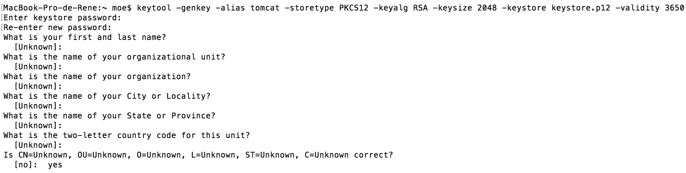

自签名证书创建

# 摘要

在本章中，我们探讨了与 MVC 架构及其工作相关的概念。我们还讨论了人们在使用这种架构风格构建应用程序时容易犯的错误。

然后，我们回顾了如何使用 Spring MVC 创建应用程序，查看了不同的测试以及如何使用 Spring 提供的功能来实现它们。我们还回顾了如何在 Spring MVC 中使用 Thymeleaf 来构建 Web 应用程序的用户界面。为了完成本章，我们讨论了一些安全概念，包括如何在 Spring MVC 应用程序中应用它们。

在下一章中，您将了解事件驱动架构，这种架构变得非常流行。
