# 第六章：事件驱动架构

**事件驱动架构**（**EDA**）基于每次应用程序更改状态时创建的命令和事件。根据 Martin Fowler 的说法，有四种模式用于使用这种方法构建软件系统。

在本章中，我们将学习这四种模式，并看看如何将消息传递联系在一起，以充分利用基于消息的编程模型。即使这不是一个要求，消息传递也可以用来为使用基于事件驱动的架构风格构建的应用程序增加更多功能。

在本章中，我们将讨论以下主题：

+   事件驱动架构的基本概念和关键方面：

+   命令

+   事件

+   在事件驱动架构中使用的常见模式：

+   事件通知

+   事件携带状态传输

+   事件溯源

+   CQRS

# 基本概念和关键方面

在深入了解事件驱动架构的细节之前，我们将首先学习一些围绕它们的关键方面。

使用这种方法创建的应用程序是根据两个不同但相关的概念开发的：

+   命令

+   事件

让我们简要定义一下这些概念。

# 命令

命令是在应用程序中执行的操作，作为成功或失败执行的结果会发出一个或多个事件。我们可以将这些操作看作是旨在修改系统状态的操作。

命令被称为操作。如果我们考虑到它们的预期用途，这是非常合理的。以下列表显示了一些此类命令的示例：

+   转账

+   更新用户信息

+   创建一个账户

强烈建议您使用现在时态的动词来命名命令，就像这些例子所示。

# 事件

事件是应用程序中命令执行的结果。这些事件用作订阅者接收通知的机制。事件是不可变的，不应该被修改，因为它们被设计为保留应用程序状态如何随时间变化的日志信息。

在命名事件时，经验法则是使用过去时态，例如以下内容：

+   资金转移

+   用户信息已更新

+   账户已创建

事件不关心它们创建后将执行什么操作。这使得可以解耦系统但仍通知订阅者。这样，我们可以解耦应用程序，因为订阅者负责根据需要执行一个或多个操作，一旦他们被通知事件的创建。

在这一点上，我们可以得出结论，我们可以解耦应用程序，因为订阅者负责根据需要执行一个或多个操作，一旦他们被通知事件的创建。我们还可以推断，事件是通过将责任委托给其他系统来逆转依赖关系的绝佳方式。

以下图表显示了命令如何发出事件以及这些事件的订阅者如何被通知：

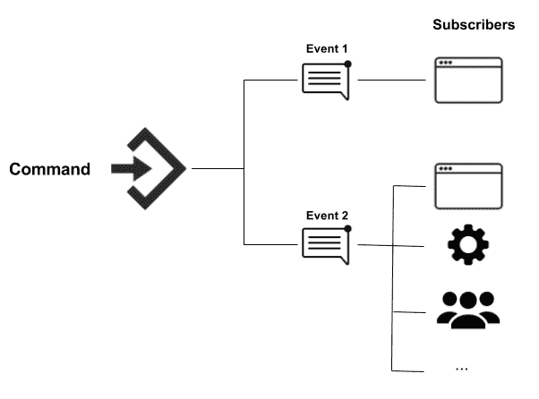

事件的创建和传播

现在我们对事件有了更好的理解，让我们回顾一下本章开头提到的四种模式，以便使用基于事件驱动的架构风格创建应用程序。

# 事件驱动架构的模式

当人们谈论事件驱动架构时，他们经常提到以下模式之一：

+   事件通知

+   事件携带状态传输

+   事件溯源

+   CQRS

有时，在同一系统中会同时使用多个模式，具体取决于业务需求。让我们回顾每种模式，以便确定可以使用它们的场景。

# 事件通知

事件通知模式通过在执行命令后向订阅者发出事件来工作。这可以与观察者模式进行比较，观察者模式中，您观察到一个具有许多监听器或订阅者列表的主题，在观察对象的状态发生变化时会自动通知它们。

这种行为被事件总线库广泛使用，允许应用程序中的组件之间进行发布-订阅通信。这些库的最常见用例是针对 UI，但它们也适用于后端系统的其他部分。下图演示了事件如何发送到总线，然后传播到之前注册的所有订阅者：

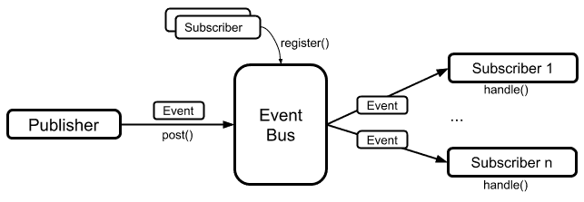

事件总线

使用此事件通知机制有两个主要好处：

+   解耦的系统和功能

+   倒置的依赖关系

为了更好地理解这些好处，让我们想象一下我们的银行应用程序需要处理以下需求：

*银行希望为使用移动应用的客户提供转账的机会。这将包括在我们银行拥有的账户之间转账，或者转账到外部银行。一旦执行此交易，我们需要使用客户首选的通知渠道通知客户有关交易状态。*

*银行还有一个应用程序，由呼叫中心工作人员使用，通知我们的代理客户的余额。当客户的账户余额高于预定金额时，呼叫中心系统将提醒代理，然后代理将致电客户，让他们意识到可以将他们的钱投资到银行。最后，如果交易涉及外部银行，我们也需要通知他们交易状态。*

使用经典方法编写应用程序，我们可以正确构建一个系统，在转账发生后，所有在转账应用程序边界内列出的后置条件都得到执行，如下图所示：

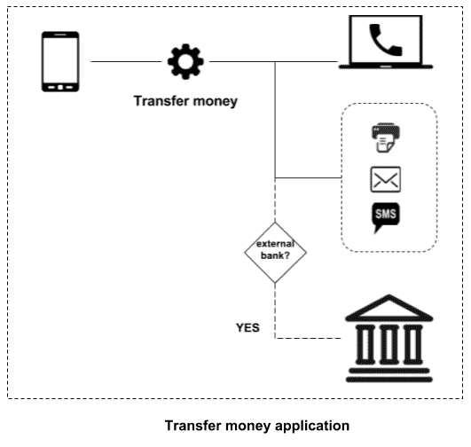

耦合的转账应用程序

正如我们从上图中看到的，转账应用程序需要知道一旦交易发生，必须满足的所有后置条件；使用这种方法，我们最终将编写所有必要的代码与其他系统进行交互，这将导致应用程序与其他系统耦合。

另一方面，使用事件通知模式，我们可以解耦转账应用程序，如下图所示：

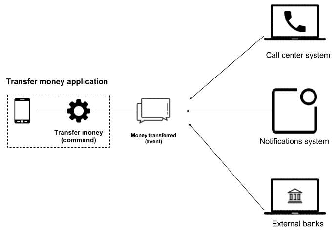

解耦的转账应用程序

在上图中，我们可以看到一旦执行`<Transfer money>`命令，就会发出`<Money transferred>`事件，并通知所有订阅的系统。通过这样做，我们可以摆脱系统之间的耦合。

这里需要注意的重要一点是，转账应用程序甚至不需要知道其他软件系统的存在，并且所有后置条件都在该应用程序的边界之外得到满足。换句话说，解耦的系统导致我们倒置依赖关系。

解耦的系统和倒置的依赖关系听起来很棒，但这种方法的隐含缺点是您会失去可见性。这是因为发出事件的应用程序对于发布事件后执行的进程一无所知，也没有用于读取其他系统的代码。

通常无法识别下游依赖关系，并且通常使用一些技术来在不同日志之间关联事件，以减轻这一噩梦。

耦合的系统提供有关下游依赖的所有信息，并且难以演变。相反，解耦的系统对下游依赖一无所知，但它们提供了独立演变系统的机会。

现在我们已经了解了支持事件通知模式的基本概念，我们可以说，实现这种应用程序最显而易见的技术是使用 RabbitMQ、AWS SQS/SNS、MSMQ 等消息系统。这些都是 Spring Cloud Stream 项目下的 Spring 支持的。在我们的案例中，我们将使用 RabbitMQ，可以通过添加以下依赖来支持：

```java
<dependency>
   <groupId>org.springframework.cloud</groupId> 
   <artifactId>spring-cloud-stream-binder-rabbit</artifactId> </dependency>
```

为了使 RabbitMQ 的设置过程可访问，本章提供的代码包括一个 Docker Compose 文件，应使用`docker-compose up`命令执行。我们将在第十章中看到 Docker Compose 是什么以及它是如何工作的，*容器化您的应用程序*。

Spring Cloud Stream 建立在 Spring Integration 之上，提供了轻松生产和消费消息的机会，以及使用 Spring Integration 的所有内置功能的机会。我们将使用这个项目来实现前面提到的银行应用程序的示例，因此我们需要添加以下依赖项：

```java
<dependency> 
    <groupId>org.springframework.cloud</groupId> 
    <artifactId>spring-cloud-stream</artifactId> 
</dependency>
```

转账应用程序将公开一个端点，允许转账。一旦完成这笔交易，就需要向其他应用程序发送事件通知。Spring Cloud Stream 使得可以使用`@Output`注解定义消息通道，如下所示：

```java
public interface EventNotificationChannel 
{
 @Output  MessageChannel moneyTransferredChannel();
}
```

这个接口可以被注释并在任何地方使用。让我们看看如何在控制器中使用它，以公开转账功能：

```java
@RestController
public class TransferController 
{
  private final MessageChannel moneyTransferredChannel;
  public TransferController(EventNotificationChannel channel) 
  {
    this.moneyTransferredChannel = channel.moneyTransferredChannel();
  }
  @PostMapping("/transfer")
  public void doTransfer(@RequestBody TransferMoneyDetails
  transferMoneyDetails) 
  {
    log.info("Transferring money with details: " +
    transferMoneyDetails);
    Message<String> moneyTransferredEvent = MessageBuilder
 .withPayload
    ("Money transferred for client with id: " + transferMoneyDetails.getCustomerId()).build();
    this.moneyTransferredChannel.send(moneyTransferredEvent);
  }
}
```

当我们使用事件通知模式时要记住的一件事是，发出事件的应用程序只提供关于执行的命令的非常基本的信息。在这种情况下，<转账完成>事件包含应该稍后用于查询更多信息并确定是否需要执行其他操作的客户端 ID。这个过程总是涉及与其他系统、数据库等的一个或多个额外交互。

订阅者也可以利用 Spring Cloud Stream。在这种情况下，应该使用`@Input`注解如下：

```java
public interface EventNotificationChannel 
{
  @Input
  SubscribableChannel subscriptionOnMoneyTransferredChannel();
}
```

使用 Spring Integration，可以执行完整的集成流程来处理传入的消息：

```java
@Bean
IntegrationFlow integrationFlow(
            EventNotificationChannel eventNotificationChannel) {
    return IntegrationFlows.from
        (eventNotificationChannel
            .subscriptionOnMoneyTransferredChannel()).
                handle(String.class, new GenericHandler<String>() {
            @Override
            public Object handle(String payload, 
            Map<String, Object> headers) {

 // Use the payload to find the transaction and determine
            // if a notification should be sent to external banks 
     }
         }).get();
}
```

一旦检索到消息，就应该用它来查询有关交易的其他信息，并确定是否应该向外部银行发送通知。这种方法有助于减少有效负载的大小。它还有助于避免发送通常是不必要的和对其他系统无用的信息，但会增加源应用程序检索的流量。

在最坏的情况下，每个产生的事件都将至少检索一个额外的请求，要求交易详情，如下图所示：

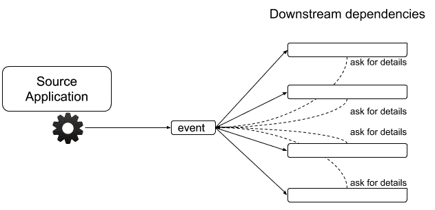

下游依赖请求交易详情

在我们的示例中，每个产生的事件都将至少有三个来自依赖系统的其他请求。

# 事件携带状态传输

与之前讨论的事件通知模式相比，事件携带状态传输模式有一个小的变化。在这里，事件包含与执行的命令相关的非常基本的信息。在这种情况下，事件包含有关执行的命令的所有信息，用于避免通过依赖系统进一步处理而联系源应用程序。

这种模式为我们带来了以下好处：

+   提高应用程序性能

+   减少源应用程序的负载

+   增加系统的可用性

让我们在接下来的部分讨论每个要点。

# 提高应用程序性能

在前面的例子中，一旦事件被下游系统产生和检索，就需要执行额外的操作来获取与交易相关的详细信息。这决定了作为流程的一部分需要执行的操作。这个额外的操作涉及与源应用程序建立通信。在某些情况下，这一步可能只需要几毫秒，但响应时间可能会更长，这取决于网络流量和延迟。这将影响依赖系统的性能。

因此，源应用程序提供的负载大小增加，但需要的流量减少。

# 减少对源应用程序的负载

由于作为产生事件的一部分包含了与执行命令相关的所有信息，因此无需再向源应用程序请求更多信息。因此，请求减少，减轻了源应用程序的负载。

在最佳情况下，产生的事件与检索到的请求之间的关系是 1:1。换句话说，一个请求会产生一个事件，但根据依赖系统需要在检索事件时请求多少额外信息，情况可能更糟。

为了避免这种额外负载，所有下游系统通常都有自己的数据存储，其中事件信息被持久化，如下图所示：

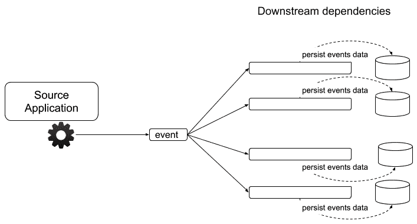

下游依赖持久化事件数据

使用这种方法时，每个下游系统只存储与自身相关的数据，提供的其余信息会被忽略，因为对于系统来说是无用的，根本不会被使用。

# 增加系统的可用性

在消除了一旦检索到事件就需要请求额外数据的需要之后，可以自然地假设系统的可用性已经提高，因为无论其他系统是否可用，事件都将被处理。引入这一好处的间接后果是现在系统中的最终一致性。

最终一致性是一种模型，用于在系统中实现高可用性，如果给定数据没有进行新的更新，一旦检索到一条信息，所有访问该数据的实例最终将返回最新更新的值。

下图显示了系统如何在不将这些更改传播到下游依赖项的情况下改变其数据：

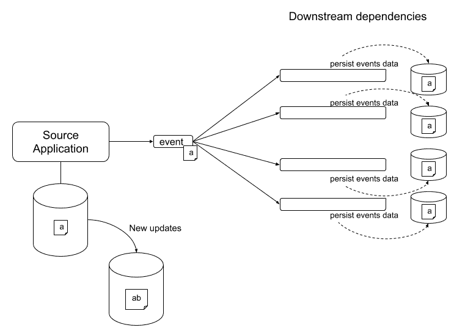

数据更新不会传播

为了使前面的例子遵循这种方法，我们只需要在负载的一部分中包含额外的信息。以前，我们只发送了一个带有`clientId`的`String`；现在我们将以以下方式涵盖完整的`TransactionMoneyDetails`：

```java
@RestController
public class TransferController 
{
  private final MessageChannel moneyTransferredChannel;
  public TransferController(EventNotificationChannel channel) 
  {
    this.moneyTransferredChannel = channel.moneyTransferredChannel();
  }
  @PostMapping("/transfer")
  public void doTransfer(@RequestBody TransferMoneyDetails 
  transferMoneyDetails) 
  {
    // Do something
 Message<TransferMoneyDetails> moneyTransferredEvent = 
 MessageBuilder.withPayload(transferMoneyDetails).build();
 this.moneyTransferredChannel.send(moneyTransferredEvent);
  }
}
```

`Message`类可以支持任何应该在`<>`中指定的对象，因为这个类是使用 Java 的泛型类型特性实现的。

下游依赖系统也应该被修改，使它们能够检索对象而不是简单的字符串。由于处理传入消息的`Handler`也支持泛型，我们可以通过对代码进行小的更改来实现这个功能，如下所示：

```java
@Bean
IntegrationFlow integrationFlow(EventNotificationChannel eventNotificationChannel) 
{
  return IntegrationFlows
  .from(eventNotificationChannel
  .subscriptionOnMoneyTransferredChannel())
  .handle(TransferMoneyDetails.class, new GenericHandler
  <TransferMoneyDetails>() 
  {
    @Override
    public Object handle(TransferMoneyDetails payload, Map<String, 
    Object> map) 
    {
      // Do something with the payload
      return null;
    }
  }).get();
}
```

# 事件溯源

事件溯源是另一种使用基于事件驱动方法实现应用程序的方式，其中功能的核心基于产生事件的命令，一旦处理完毕，这些事件将改变系统状态。

我们可以将命令看作是在系统内执行的交易的结果。这个交易会因以下因素而不同：

+   用户操作

+   来自其他应用程序的消息

+   执行的定期任务

使用事件源方法创建的应用程序存储与执行命令相关的事件。还值得存储产生事件的命令。这样可以将它们全部相关联，以便了解所创建的边界。

存储事件的主要原因是在任何时间点重建系统状态时使用它们。使这项任务变得更容易的方法是定期为存储系统状态的数据库生成备份，这有助于避免重新处理应用程序开始工作以来创建的所有事件的需要。相反，我们只需要处理在生成数据库快照之后执行的事件集。

让我们回顾以下一系列图表，以了解这是如何工作的。第一个图表显示一旦执行`Command A`，就会创建三个“事件”，并且在处理每个事件后生成一个新的“状态”：

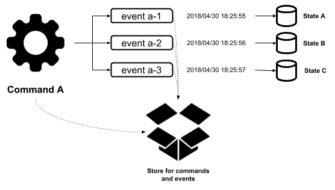

一旦执行 Command A，生成的事件和应用程序状态

下一个图表代表了一个相似的过程。在这种情况下，由于`Command B`的执行，创建了两个“事件”：

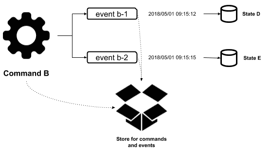

作为 Command B 执行的结果生成的事件和应用程序状态

到目前为止，我们的应用程序有五个状态：

+   状态 A

+   状态 B

+   状态 C

+   状态 D

+   状态 E

假设我们对“事件 b-1”感兴趣，因为在执行时应用程序崩溃了。为了实现这个目标，我们有两个选择：

+   逐个处理事件，并在“事件 b-1”执行期间研究应用程序行为，如下图所示：

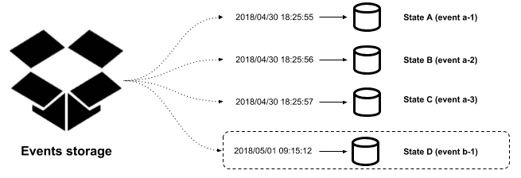

处理所有事件重建应用程序状态

+   在恢复数据库快照后处理其余事件，并在“事件 b-1”执行期间研究应用程序行为，如下图所示：

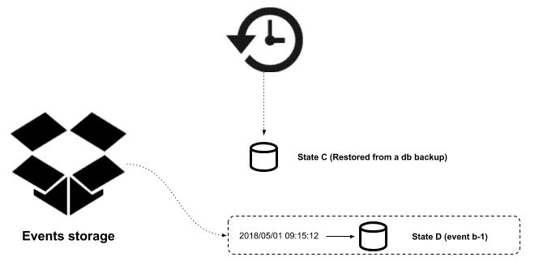

从数据库快照重建应用程序状态

显然，第二种方法更有效。定期任务通常负责在一定时间后创建数据库快照，并且应该建立一个管理现有快照的策略。例如，您可以建立一个策略，在每天午夜创建一个新的快照，并在最适合您业务的时间后清除旧的快照。

正如您可能已经意识到的那样，我们系统的真相来源是事件存储，这使我们能够随时重建应用程序状态。由于事件被用来生成系统状态，我们可以完全依赖事件存储。然而，我们还应该考虑一个事实，即系统内的事件执行也需要与另一个应用程序进行交互。在这种情况下，如果重放该事件，您应该考虑其他系统将如何受到影响。在这里，我们将得到以下两种情况之一：

+   在其他应用程序中执行的操作是幂等的

+   其他应用程序将受到影响，因为将生成新的事务

在第一种情况下，由于操作是幂等的，我们根本不必担心。这是因为另一个执行不会影响其他系统。在第二种情况下，我们应该考虑创建补偿操作的方法或者忽略这些交互的方法，以避免影响其他系统。

在遵循这种方法后，我们将获得以下固有的好处：

+   可用于审计目的的数据存储

+   一个很好的日志级别

+   调试应用程序将更容易

+   历史状态

+   回到以前的状态的能力

事件溯源应用程序的典型示例是版本控制系统（VCS），如 Git、Apache 子版本、CVS 或任何其他版本控制系统，其中存储了应用于源代码文件的所有更改。此外，提交代表了允许我们在需要时撤消/重做更改的事件。

为了尽可能简单地理解，您可以将事件溯源应用程序视为以与版本控制系统管理文件更改相同的方式管理数据更改。您还可以将`git push`操作视为事件溯源系统中的命令。

现在我们已经解释了事件溯源背后的概念，是时候深入了解允许我们理解如何按照这种方法实现系统的细节了。虽然有不同的方法来创建事件溯源应用程序，但我将在这里解释一种通用的方法。重要的是要记住，这种方法应根据您的业务的特定需求或假设进行更改。

我们提到事件溯源系统应该*至少*有两个存储数据的地方。其中一个将用于保存事件和命令信息，另一个将用于保存应用程序状态——我们说*至少两个*，因为有时需要多个存储选项来持久化应用程序的系统状态。由于系统检索的输入以执行其业务流程非常不同，我们应该考虑使用支持使用 JSON 格式存储数据的数据库。按照这种方法，应作为事件溯源系统中执行的命令的一部分存储的最基本数据如下：

+   唯一标识符

+   时间戳

+   以 JSON 格式检索的输入数据

+   用于关联命令的任何附加数据

另一方面，应存储的建议数据事件如下：

+   唯一标识符

+   时间戳

+   事件的相关数据以 JSON 格式

+   生成事件的命令的标识符

正如我们之前提到的，根据您的业务需求，您可能需要添加更多字段，但前面提到的字段在任何情况下都是必要的。关键在于确保您的数据稍后能够被处理以在需要时重新创建应用程序状态。几乎任何 NoSQL 数据库都支持将数据存储为 JSON，但一些 SQL 数据库，如 PostgreSQL，也可以很好地处理这种格式的数据。

关于系统状态的决定，选择 SQL 或 NoSQL 技术完全取决于您的业务；您不必因为应用程序将使用事件溯源方法而改变主意。此外，您的数据模型结构也应该取决于业务本身，而不是取决于生成将存储在那里的数据的事件和命令。还值得一提的是，一个事件将生成将存储在系统状态数据模型的一个或多个表中的数据，并且在这些方面根本没有限制。

当我们考虑命令、事件和状态时，通常会提出一个问题，即信息持久化的顺序。这一点可能是一个有趣的讨论，但您不必太担心数据持久化的顺序。您可以选择在任何数据存储实例中同步或异步地持久化数据。

异步方法有时会让我们认为我们最终会得到不一致的信息，但事实是两种方法都可能导致这一点。我们应该考虑从这些崩溃中恢复我们的应用程序的机制，例如适当的日志记录。良好的日志记录对于恢复我们系统的数据非常有帮助，就像我们为使用事件源以外的任何方法构建的应用程序一样。

现在是时候回顾一些代码，把我们之前讨论过的概念付诸实践了。让我们构建一个应用程序，允许我们开设一个新的银行账户。所需的输入数据如下：

+   客户姓名

+   客户姓氏

+   开设账户的初始金额

+   账户类型（储蓄/活期）

创建账户后，我们的应用程序状态应该反映出一个新的客户和一个新创建的银行账户。

作为我们应用程序的一部分，我们将有一个命令：`CreateCustomerCommand`。这将生成两个事件，名为`CustomerCreated`和`AccountCreated`，如下图所示：

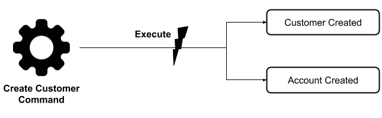

命令执行

执行此命令后，需要发生一些事情：

+   应保存命令

+   上述事件应该使用相关信息创建

+   应保存事件

+   应处理事件

这个过程的相关代码如下所示：

```java
public class CreateCustomerCommand extends Command {

    public void execute() {

        String commandId = UUID.randomUUID().toString();
        CommandMetadata commandMetadata 
            = new CommandMetadata(commandId, getName(), this.data);
 commandRepository.save(commandMetadata);

        String customerUuid = UUID.randomUUID().toString();

        JSONObject customerInformation = getCustomerInformation();
        customerInformation.put("customer_id", customerUuid);

        // CustomerCreated event creation EventMetadata customerCreatedEvent 
 = new EventMetadata(customerInformation, ...);        // CustomerCreated event saved eventRepository.save(customerCreatedEvent);        // CustomerCreated event sent to process eventProcessor.process(customerCreatedEvent);

        JSONObject accountInformation = getAccountInformation();
        accountInformation.put("customer_id", customerUuid);

        // AccountCreated event creation
 EventMetadata accountCreatedEvent 
 = new EventMetadata(accountInformation, ...);        // AccountCreated event saved eventRepository.save(accountCreatedEvent);        // AccountCreated event sent to process eventProcessor.process(accountCreatedEvent);

    }
    ...
}
```

事件处理完毕后，应生成系统状态。在这种情况下，意味着应创建一个新的客户和一个新的账户，如下图所示：

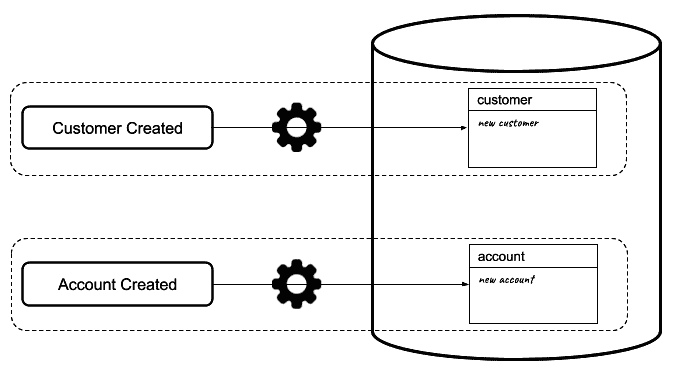

处理事件后生成的系统状态

为了实现这个目标，我们有一个非常基本的实现，根据`事件名称`执行代码指令，如下所示：

```java
@Component
public class EventProcessor {

    public void process(EventMetadata event) {
        if ("CustomerCreated".equals(event.getEventName())) {
            Customer customer = new Customer(event);
            customerRepository.save(customer);
        } else if ("AccountCreated".equals(event.getEventName())) {
            Account account = new Account(event);
            accountRepository.save(account);
        }
    }
    ...
}
```

如果您想看看应用程序的工作原理，可以执行以下`CURL`命令：

```java
$ curl -H "Content-Type: application/json" \
 -X POST \
 -d '{"account_type": "savings", "name": "Rene", "last_name": "Enriquez", "initial_amount": 1000}' \
 http://localhost:8080/customer
```

您将在控制台中看到以下消息：

```java
COMMAND INFORMATION
id: 8782e12e-92e5-41e0-8241-c0fd83cd3194 , name: CreateCustomer , data: {"account_type":"savings","name":"Rene","last_name":"Enriquez","initial_amount":1000} 
EVENT INFORMATION
id: 71931e1b-5bce-4fe7-bbce-775b166fef55 , name: CustomerCreated , command id: 8782e12e-92e5-41e0-8241-c0fd83cd3194 , data: {"name":"Rene","last_name":"Enriquez","customer_id":"2fb9161e-c5fa-44b2-8652-75cd303fa54f"} 
id: 0e9c407c-3ea4-41ae-a9cd-af0c9a76b8fb , name: AccountCreated , command id: 8782e12e-92e5-41e0-8241-c0fd83cd3194 , data: {"account_type":"savings","account_id":"d8dbd8fd-fa98-4ffc-924a-f3c65e6f6156","balance":1000,"customer_id":"2fb9161e-c5fa-44b2-8652-75cd303fa54f"}
```

您可以通过在 URL：`http://localhost:8080/h2-console`中使用 H2 web 控制台执行 SQL 语句来检查系统状态。

以下截图显示了查询账户表的结果：

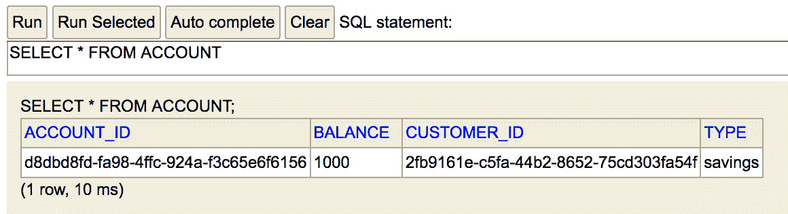

从账户表中查询结果

以下截图显示了查询客户表的结果：

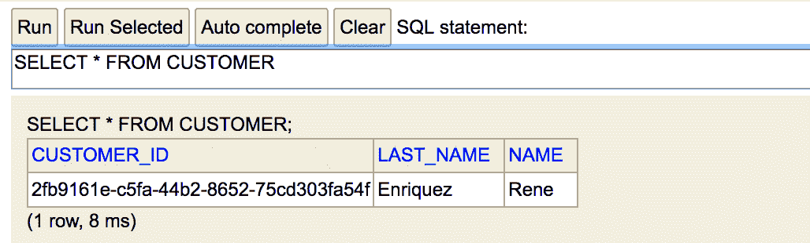

从客户表中查询结果

事件源应用程序的最关键测试是在数据被删除后能够重新创建`状态`。您可以通过使用以下 SQL 语句从表中删除数据来运行此测试：

```java
DELETE FROM CUSTOMER;
DELETE FROM ACCOUNT;
```

在 H2 控制台中执行这些操作后，可以通过运行以下`CURL`命令重新创建状态：

```java
$ curl -X POST http://localhost:8080/events/<EVENT_ID> 
```

请注意，您需要用前面 URL 中列出的`<EVENT_ID>`替换控制台中执行命令时列出的值。

# CQRS

**命令查询职责分离**（**CQRS**）是一种模式，其主要思想是通过创建分离的接口来与系统的数据存储交互，从而创建用于读取和写入数据的分离数据结构和操作。

CQRS 实际上并不是基于事件，但由于它经常与事件源实现一起使用，因此值得提到它适用的场景。有三种主要用例，其中处理和查询信息的接口分离将会很有用：

+   复杂的领域模型

+   查询和持久化信息的不同路径

+   独立扩展

# 复杂的领域模型

这种情景指的是检索到的输入在数据库中简单管理和持久化的系统。然而，在将信息提供给用户之前，需要进行许多转换，使数据对业务有用和全面。

想象一个系统，其中代码由大量实体对象组成，这些对象使用 ORM 框架将数据库表映射为持久化信息。这种系统涉及许多使用 ORM 执行的写入和读取操作，以及作为系统一部分运行的一些操作，用于将检索到的数据（以实体对象的形式）转换为数据传输对象（DTO），以便以有意义的方式为业务提供信息。

以下图表显示了从数据库到业务服务的数据流，设计遵循这种方法：

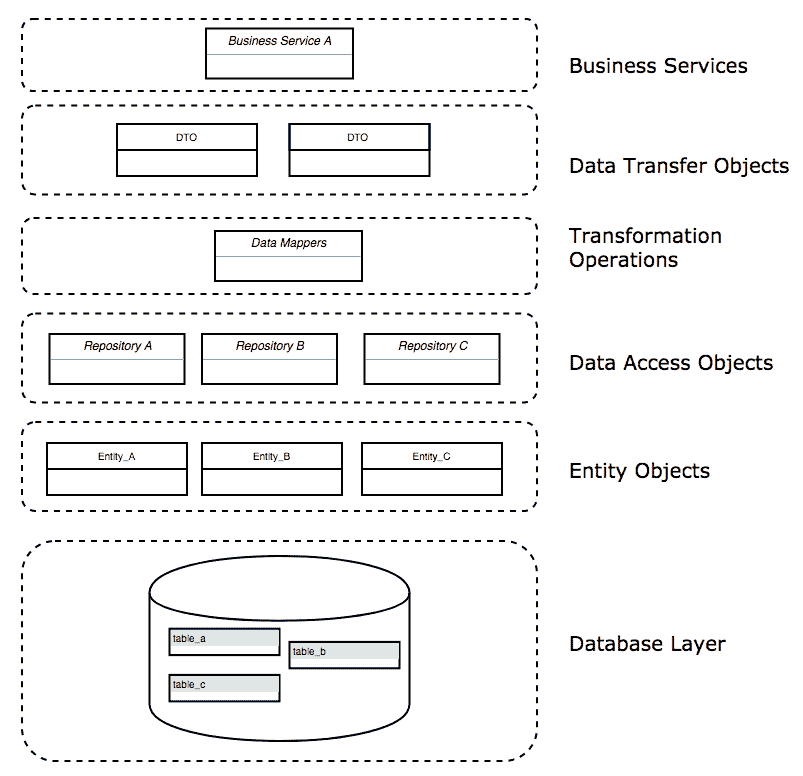

使用实体对象和 DTO 的数据流

转换数据并不是什么大问题。在使用 ORM 的系统中，最大的问题是实体对象带来包含在转换过程中被忽略的无用信息的列，这会给数据库和网络带来不必要的开销。另一方面，在上图中，我们可以看到在实际获取所请求的数据之前，需要一个大的过程将数据库表映射为对象。解决这个问题的一个好方法是用存储过程或纯查询语句替换 ORM 框架执行的读操作，从数据库中仅检索所需的数据。

以下图表显示了如何用 DOTs 替换实体对象：

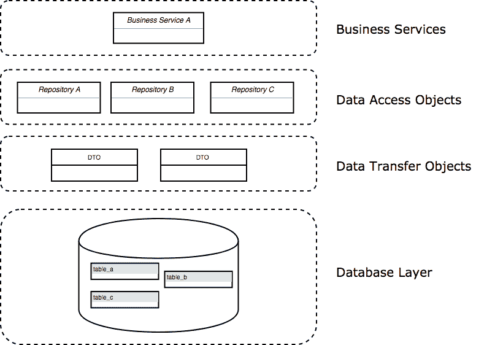

使用 DTO 的数据流

很明显，这种方法更简单，更容易实现。所需的代码量甚至大大减少。我并不是在得出 ORM 框架不好的结论——实际上，其中许多都非常棒，像 Spring Data 这样的项目提供了大量内置功能。然而，根据业务需求，纯 JDBC 操作有时对系统更有益。

# 查询和持久化信息的不同路径

在构建应用程序时，我们经常发现自己在使用系统提供的信息之前对检索到的输入进行大量验证。

应用于检索数据的常见验证包括以下内容：

+   验证非空值

+   特定文本格式，如电子邮件

+   检查以验证字符串长度

+   数字中允许的最大小数位数

有许多机制可用于在我们的代码中实现这种验证。其中最流行的是基于第三方库的，依赖于可以使用正则表达式进行扩展以适用于特定场景的注解。甚至有一个作为平台的一部分可以用于验证类字段的规范，称为 Bean Validation。这目前是**Java 规范请求**（**JSR**）**380**的一部分（[`beanvalidation.org/`](http://beanvalidation.org/)）。

当用户或外部系统提供数据时，有必要进行所有这些验证，但是当从数据库中读取信息并返回给用户时，就没有必要继续执行这些检查。此外，在某些情况下，例如事件溯源，一旦检索到数据，会执行一些命令，创建事件，最终持久化信息。

在这些场景中，显然持久化和读取信息的过程是不同的，它们需要分开的路径来实现它们的目标。

以下图表显示了应用程序如何使用不同路径来持久化和检索数据：

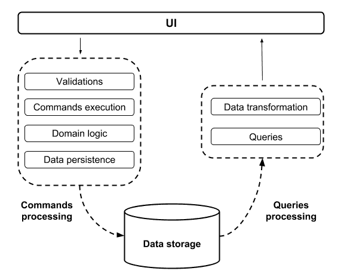

使用不同路径持久化和查询的数据

从上图可以快速注意到有多少处理是不必要的，因为它绝对是不必要的。此外，用于查询和处理信息的领域模型通常不同，因为它们旨在实现不同的目标。

# 独立扩展

如今，常常听到开发人员、软件架构师和技术人员讨论创建独立服务来解决不同的需求。创建独立服务支持独立扩展的方法，因为它使得可以分别扩展创建的服务。

在这种情况下，主要的想法是创建可以独立构建和部署的独立系统。这些不同应用程序的数据源可以是相同的，也可以是不同的，这取决于需求是什么。这里最常见的情况是两个系统使用相同的数据存储，因为应用的更改应该立即反映出来。否则，延迟的数据可能会在应用程序的正常运行过程中引起混乱或错误。

让我们想象一个在线商店。假设你向购物车中添加了许多商品，在结账后，你意识到支付的金额比所需的金额要低，因为在结账过程中并未考虑所有商品。这是应用程序中不希望出现的行为。

另一方面，在某些情况下，使用不同的数据存储是可以接受的，因为检索延迟数小时或数天的数据已足以满足应用程序相关的业务需求。想象一下，你的任务是创建一个报告，显示人们倾向于在哪些月份请假。当然，一个数据库如果没有最新的更改，稍微落后于应用程序的当前状态，也可以完美地工作。当我们有这种需求时，我们可以使用报告数据库（有关更多详细信息，请参见[`martinfowler.com/bliki/ReportingDatabase.html`](https://martinfowler.com/bliki/ReportingDatabase.html)）来检索信息。这种方法通常用于当应用程序旨在提供执行报告信息以做出战略决策时，而不是获取数据库表中所有现有记录的列表。

拥有独立的系统来查询和处理信息使我们能够在两个系统上实现独立的扩展能力。当其中一个系统需要更多资源进行处理时，这是非常有用的。让我们以前面提到的在线商店为例，人们总是在寻找要购买的商品，进行比较，检查尺寸、价格、品牌等等。

在前面的例子中，检查订单的请求次数少于检查商品信息的请求次数。因此，在这种情况下，拥有独立的系统可以避免不必要地浪费资源，并且可以只增加更多资源或服务实例，以处理流量最大的服务。

# 总结

在本章中，我们介绍了事件驱动架构以及用于实现使用这种架构风格的应用程序的四种常见模式。我们详细解释了每种模式，并编写了一些代码来理解它们如何使用 Spring Framework 实现。同时，我们还研究了一些可以利用它们的用例，并学习了它们如何帮助我们减少作为系统需求一部分引入的复杂性。

作为这些模式的一部分，我们谈到了事件溯源，在微服务世界中越来越受欢迎，我们将在《微服务》的第八章中学习更多相关内容。
