# 第七章：管道和过滤器架构

在本章中，我们将回顾一个有用的范式架构，名为管道和过滤器，并学习如何使用 Spring 框架实现应用程序。

我们还将解释如何构建一个封装了独立任务链的管道，旨在过滤和处理大量数据，重点放在使用 Spring Batch 上。

本章将涵盖以下主题：

+   管道和过滤器概念介绍

+   上船管道和过滤器架构

+   管道和过滤器架构的用例

+   Spring Batch

+   使用 Spring Batch 实现管道

我们将首先介绍管道和过滤器架构及其相关概念。

# 介绍管道和过滤器概念

管道和过滤器架构是指上世纪 70 年代初引入的一种架构风格。在本节中，我们将介绍管道和过滤器架构，以及过滤器和管道等概念。

Doug McIlroy 于 1972 年在 Unix 中引入了管道和过滤器架构。这些实现也被称为管道，它们由一系列处理元素组成，排列在一起，以便每个元素的输出是下一个元素的输入，如下图所示：

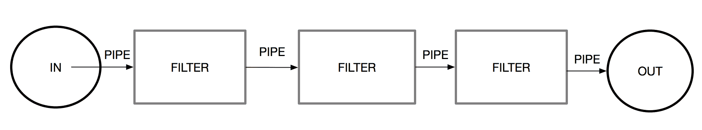

如前图所示，管道和过滤器架构由几个组件组成，称为过滤器，它们可以在整个过程中转换（或过滤）数据。然后，数据通过连接到每个组件的管道传递给其他组件（过滤器）。

# 过滤器

过滤器是用于转换（或过滤）从前一个组件通过管道（连接器）接收的输入数据的组件。如下图所示，每个过滤器都有一个输入管道和一个输出管道：

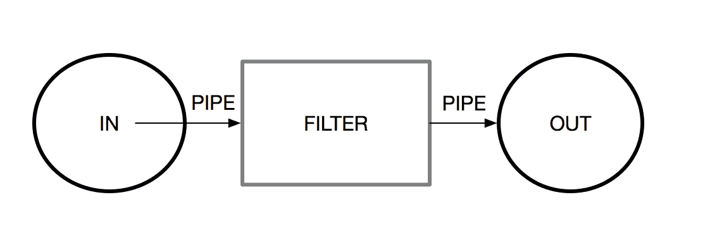

这个概念的另一个特点是，过滤器可以有多个输入管道和多个输出管道，如下图所示：

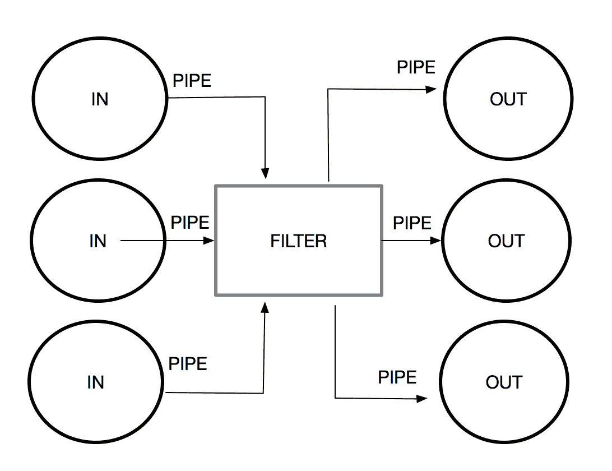

# 管道

管道是过滤器的连接器。管道的作用是在过滤器和组件之间传递消息或信息。我们必须记住的是，流动是单向的，数据应该被存储，直到过滤器可以处理它。如下图所示，在过滤器之间可以看到连接器：


管道和过滤器架构风格用于将较大的过程、任务或数据分解为一系列由管道连接的小而独立的步骤（或过滤器）。

# 上船管道和过滤器架构

基于我们最近在企业应用领域介绍的管道和过滤器概念，我们在多种场景中使用这种架构，以处理需要处理的大量数据（或大文件）触发的多个步骤（或任务）。当我们需要对数据进行大量转换时，这种架构非常有益。

为了理解管道和过滤器的工作原理，我们将回顾一个经典的例子，即处理工资单记录。在这个例子中，一条消息通过一系列过滤器发送，每个过滤器在不同的事务中处理消息。

当我们应用管道和过滤器方法时，我们将整个过程分解为一系列可以重复使用的独立任务。使用这些任务，我们可以改变接收到的消息的格式，然后我们可以将其拆分以执行单独的事务。通过这样做，我们可以提高过程的性能、可伸缩性和可重用性。

这种架构风格使得创建递归过程成为可能。在这种情况下，一个过滤器可以包含在自身内部。在过程内部，我们可以包含另一个管道和过滤器序列，如下图所示：

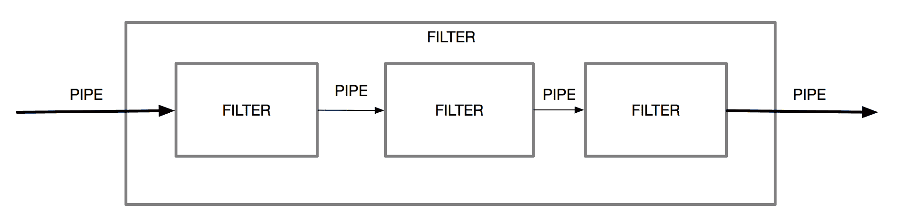

在这种情况下，每个过滤器通过管道接收输入消息。然后，过滤器处理消息并将结果发布到下一个管道。这个可重复的过程将根据我们的业务需求继续多次。我们可以添加过滤器，接受或省略接收到的输入，并根据我们的业务需求将任务重新排序或重新排列成新的顺序。在下一节中，我们将详细介绍应用管道和过滤器架构风格的最常见用例。

# 管道和过滤器架构的用例

管道和过滤器架构的最常见用例如下：

+   将一个大的过程分解为几个小的独立步骤（过滤器）

+   通过多个过滤器以并行处理来扩展可以独立扩展的进程的系统

+   转换输入或接收到的消息

+   将过滤应用于**企业服务总线**（**ESB**）组件作为集成模式

# Spring Batch

Spring Batch 是一个完整的框架，用于创建强大的批处理应用程序（[`projects.spring.io/spring-batch/`](https://projects.spring.io/spring-batch/)）。我们可以创建可重用的函数来处理大量数据或任务，通常称为批量处理。

Spring Batch 提供了许多有用的功能，例如以下内容：

+   日志记录和跟踪

+   事务管理

+   作业统计

+   管理过程；例如，通过重新启动作业，跳过步骤和资源管理

+   管理 Web 控制台

该框架旨在通过使用分区功能管理大量数据并实现高性能的批处理过程。我们将从一个简单的项目开始，以解释 Spring Batch 的每个主要组件。

如 Spring Batch 文档中所述（[`docs.spring.io/spring-batch/trunk/reference/html/spring-batch-intro.html`](https://docs.spring.io/spring-batch/trunk/reference/html/spring-batch-intro.html)），使用该框架的最常见场景如下：

+   定期提交批处理

+   并发批处理用于并行处理作业

+   分阶段的企业消息驱动处理

+   大规模并行批处理

+   故障后手动或定时重新启动

+   依赖步骤的顺序处理（具有工作流驱动批处理的扩展）

+   部分处理：跳过记录（例如，在回滚时）

+   整批事务：适用于批量大小较小或现有存储过程/脚本的情况

在企业应用程序中，需要处理数百万条记录（数据）或从源中读取是非常常见的。该源可能包含具有多个记录的大文件（例如 CSV 或 TXT 文件）或数据库表。在每条记录上，通常会应用一些业务逻辑，执行验证或转换，并完成任务，将结果写入另一种输出格式（例如数据库或文件）。

Spring Batch 提供了一个完整的框架来实现这种需求，最大程度地减少人工干预。

我们将回顾 Spring 批处理的基本概念，如下所示：

+   作业封装了批处理过程，必须由一个或多个步骤组成。每个步骤可以按顺序运行，并行运行，或进行分区。

+   步骤是作业的顺序阶段。

+   JobLauncher 负责处理正在运行的作业的 JobExecution。

+   JobRepository 是 JobExecution 的元数据存储库。

让我们创建一个简单的使用 Spring Batch 的作业示例，以了解其工作原理。首先，我们将创建一个简单的 Java 项目并包含`spring-batch`依赖项。为此，我们将使用其初始化程序创建一个 Spring Boot 应用程序（[`start.spring.io`](https://start.spring.io)），如下截图所示：

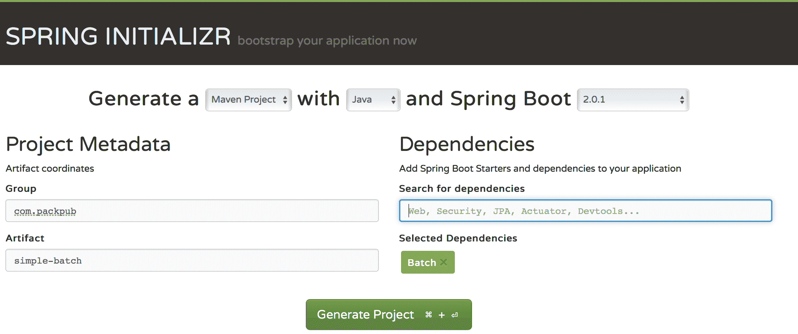

请注意，我们添加了 Spring Batch 的依赖项。您可以通过在依赖项框中的搜索栏中输入`Spring Batch`并点击*Enter*来执行此操作。在所选的依赖项部分将出现一个带有 Batch 字样的绿色框。完成后，我们将点击生成项目按钮。

项目的结构将如下所示：

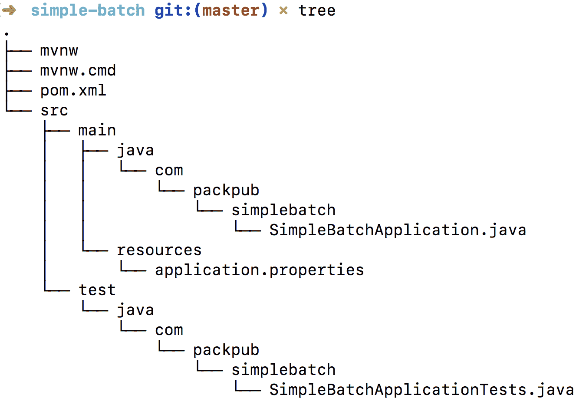

如果我们查看初始化器添加的依赖项部分，我们将在`pom.xml`文件中看到`spring-batch`启动器，如下所示：

```java
<dependency>
  <groupId>org.springframework.boot</groupId>
  <artifactId>spring-boot-starter-batch</artifactId>
</dependency>
<dependency>
  <groupId>org.springframework.boot</groupId>
  <artifactId>spring-boot-starter-test</artifactId>
  <scope>test</scope>
</dependency>
<dependency>
  <groupId>org.springframework.batch</groupId>
  <artifactId>spring-batch-test</artifactId>
  <scope>test</scope>
</dependency>
```

如果我们不使用 Spring Boot，我们可以显式添加`spring-batch-core`作为项目依赖项。以下是使用 Maven 的样子：

`<dependencies>`

`  <dependency>`

`    <groupId>org.springframework.batch</groupId>`

`    <artifactId>spring-batch-core</artifactId>`

`    <version>4.0.1.RELEASE</version>`

`  </dependency>`

`</dependencies>`

或者，我们可以使用 Gradle 来完成这个过程，如下所示：

`dependencies`

`{`

`  compile 'org.springframework.batch:spring-batch-core:4.0.1.RELEASE'`

`}`

项目将需要一个数据源；如果我们尝试在没有数据源的情况下运行应用程序，我们将在控制台中看到错误消息，如下所示：

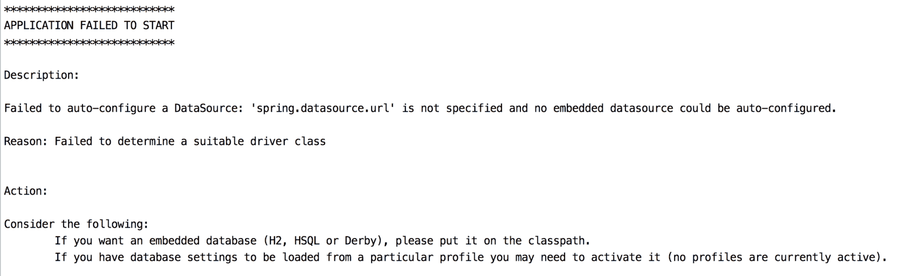

为了解决这个问题，我们将在`pom.xml`文件中添加一个依赖项，以配置嵌入式数据源。为了测试目的，我们将使用 HSQL（[`hsqldb.org/`](http://hsqldb.org/)）如下所示：

```java
<dependency>
   <groupId>org.hsqldb</groupId>
   <artifactId>hsqldb</artifactId>
   <scope>runtime</scope>
</dependency>
```

现在，我们需要将`@EnabledBatchProcessing`和`@Configuration`注解添加到应用程序中：

```java

@SpringBootApplication
@EnableBatchProcessing @Configuration
public class SimpleBatchApplication {

```

接下来，我们将使用`JobBuildFactory`类设置我们的第一个作业，其中包含一个基于 Spring Batch 的任务流程，使用`StepBuilderFactory`类：

```java
@Autowired
private JobBuilderFactory jobBuilderFactory;

@Autowired
private StepBuilderFactory stepBuilderFactory;
```

`Job`方法将显示它正在启动，如下所示：

```java
@Bean
public Job job(Step ourBatchStep) throws Exception {
   return jobBuilderFactory.get("jobPackPub1")
         .incrementer(new RunIdIncrementer())
         .start(ourBatchStep)
         .build();
}
```

一旦`Job`被创建，我们将向`Job`添加一个新的任务（`Step`），如下所示：

```java
@Bean
public Step ourBatchStep() {
   return stepBuilderFactory.get("stepPackPub1")
         .tasklet(new Tasklet() {
            public RepeatStatus execute(StepContribution contribution, 
            ChunkContext chunkContext) {
               return null;
```

```java
            }
         })
         .build();
}
```

以下代码显示了应用程序类的样子：

```java
@EnableBatchProcessing
@SpringBootApplication
@Configuration
public class SimpleBatchApplication {

   public static void main(String[] args) {
      SpringApplication.run(SimpleBatchApplication.class, args);
   }

   @Autowired
   private JobBuilderFactory jobBuilderFactory;

   @Autowired
   private StepBuilderFactory stepBuilderFactory;

   @Bean
   public Step ourBatchStep() {
      return stepBuilderFactory.get("stepPackPub1")
            .tasklet(new Tasklet() {
               public RepeatStatus execute
                (StepContribution contribution, 
                    ChunkContext chunkContext) {
                  return null;
               }
            })
            .build();
   }

   @Bean
   public Job job(Step ourBatchStep) throws Exception {
      return jobBuilderFactory.get("jobPackPub1")
            .incrementer(new RunIdIncrementer())
            .start(ourBatchStep)
            .build();
   }
}
```

为了检查一切是否正常，我们将运行应用程序。为此，我们将在命令行上执行以下操作：

```java
$ mvn spring-boot:run
```

或者，我们可以通过运行 maven 来构建应用程序，如下所示：

```java
$ mvn install
```

接下来，我们将在终端上运行我们最近构建的 jar，如下所示：

```java
$ java -jar target/simple-batch-0.0.1-SNAPSHOT.jar
```

不要忘记在构建或运行应用程序之前安装 Maven 或 Gradle 和 JDK 8。

最后，我们将在控制台中看到以下输出：

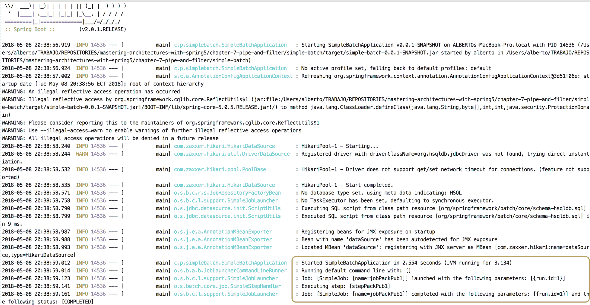

注意控制台输出。为此，我们运行名为`jobPackPub1`的作业，并执行名为`stepPackPub1`的 bean。

现在，我们将更详细地查看以下步骤背后的组件：

+   ItemReader 代表了步骤输入的检索

+   ItemProcessor 代表了对项目的业务处理

+   ItemWriter 代表了步骤的输出

以下图表显示了 Spring Batch 主要元素的整体情况：

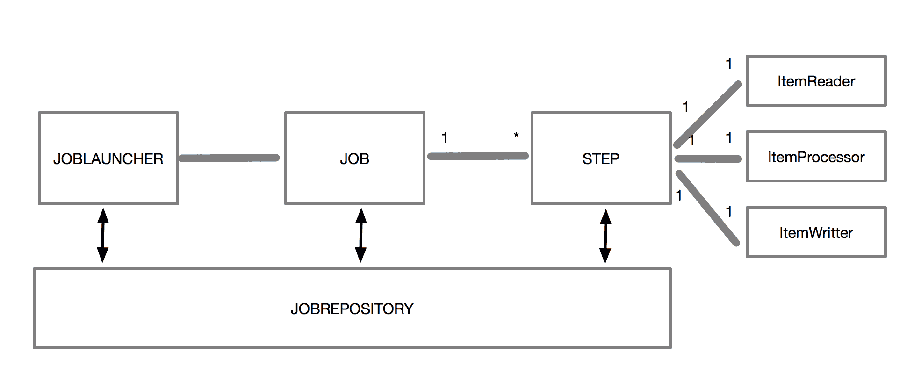

现在，我们将通过使用 ItemReader、ItemProcessor 和 ItemWriter 来完成我们的示例。通过使用和解释这些组件，我们将向您展示如何使用 Spring Batch 实现管道和过滤器架构。

# 使用 Spring Batch 实现管道

现在我们已经说明了 Spring Batch 是什么，我们将通过以下步骤实现工资文件处理用例（如前一节中定义的）：

+   编写一个从 CSV 电子表格导入工资数据的流程

+   使用业务类转换文件元组

+   将结果存储在数据库中

以下图表说明了我们的实现：

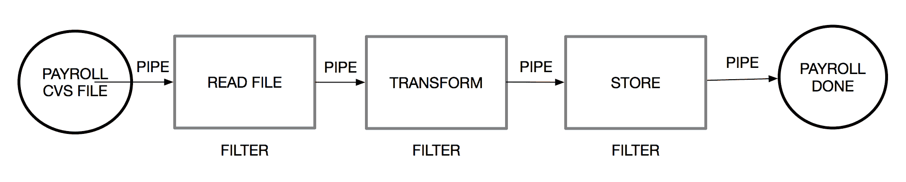

首先，我们将使用 Spring 初始化器（[`start.spring.io`](https://start.spring.io)）创建一个新的干净项目，就像我们在上一节中所做的那样：

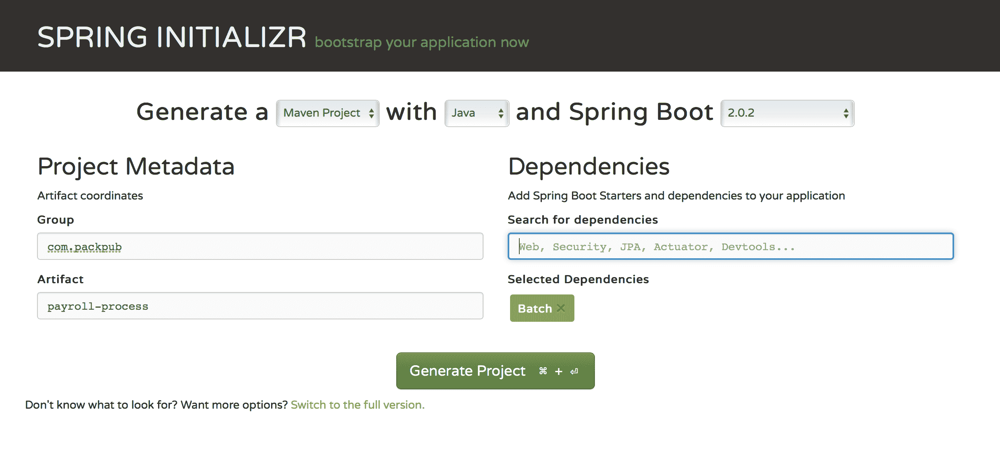

记得像之前的例子一样，将`Batch`引用添加到我们的项目中。

不要忘记在`pom.xml`文件中将数据库驱动程序添加为依赖项。出于测试目的，我们将使用 HSQL（[`hsqldb.org/`](http://hsqldb.org/)）。

```java
<dependency>
   <groupId>org.hsqldb</groupId>
   <artifactId>hsqldb</artifactId>
   <scope>runtime</scope>
</dependency>
```

如果您想使用其他数据库，可以参考 Spring Boot 文档中提供的详细说明（[`docs.spring.io/spring-boot/docs/current/reference/html/boot-features-sql.html`](https://docs.spring.io/spring-boot/docs/current/reference/html/boot-features-sql.html)）。

现在，我们将创建输入数据作为文件，将输出结构作为数据库表，如下图所示：

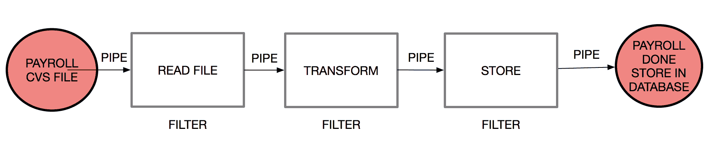

我们将在资源文件夹（`src/main/resources/payroll-data.csv`）中添加一个 CSV 文件，内容如下：

```java
0401343844,USD,1582.66,SAVING,3550891500,PAYROLL MARCH 2018,JAIME PRADO
1713430133,USD,941.21,SAVING,2200993002,PAYROLL MARCH 2018,CAROLINA SARANGO
1104447619,USD,725.20,SAVING,2203128508,PAYROLL MARCH 2018,MADALAINE RODRIGUEZ
0805676117,USD,433.79,SAVING,5464013600,PAYROLL MARCH 2018,BELEN CALERO
1717654933,USD,1269.10,SAVING,5497217100,PAYROLL MARCH 2018,MARIA VALVERDE
1102362626,USD,1087.80,SAVING,2200376305,PAYROLL MARCH 2018,VANESSA ARMIJOS
1718735793,USD,906.50,SAVING,6048977500,PAYROLL MARCH 2018,IGNACIO BERRAZUETA
1345644970,USD,494.90,SAVING,6099018000,PAYROLL MARCH 2018,ALBERTO SALAZAR
0604444602,USD,1676.40,SAVING,5524707700,PAYROLL MARCH 2018,XIMENA JARA
1577777593,USD,3229.75,SAVING,3033235300,PAYROLL MARCH 2018,HYUN WOO
1777705472,USD,2061.27,SAVING,3125662300,PAYROLL MARCH 2018,CARLOS QUIROLA
1999353121,USD,906.50,SAVING,2203118265,PAYROLL MARCH 2018,PAUL VARELA
1878363820,USD,1838.30,SAVING,4837838200,PAYROLL MARCH 2018,LEONARDO VASQUEZ
```

我们项目的结构如下所示：

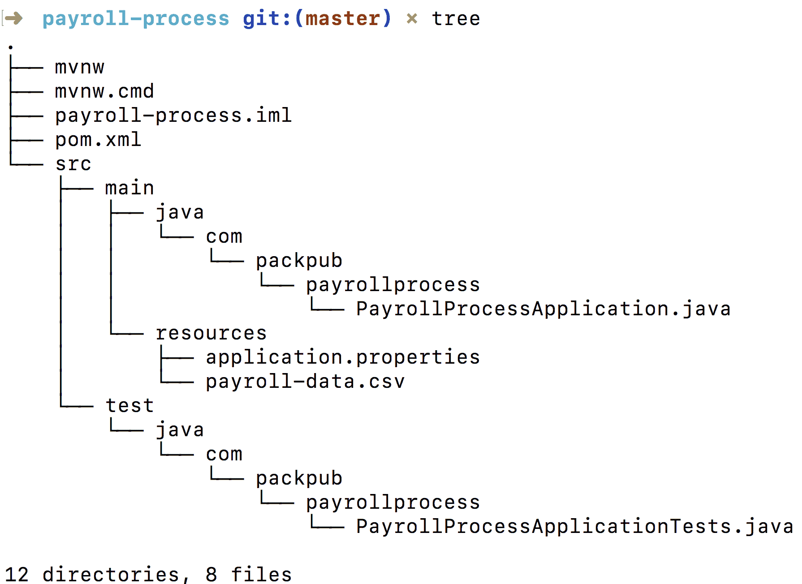

这个电子表格包含交易的标识、货币、账号、账户类型、交易描述、受益人电话和受益人姓名。这些内容以逗号分隔显示在每一行上。这是一个常见的模式，Spring 可以直接处理。

现在，我们将创建数据库结构，用于存储工资单处理的结果。我们将在资源文件夹（`src/main/resources/schema-all.sql`）中添加以下内容：

```java
DROP TABLE PAYROLL IF EXISTS;

CREATE TABLE PAYROLL  (
    transaction_id BIGINT IDENTITY NOT NULL PRIMARY KEY,
    person_identification VARCHAR(20),
    currency VARCHAR(20),
    tx_ammount DOUBLE,
    account_type VARCHAR(20),
    account_id VARCHAR(20),
    tx_description VARCHAR(20),
    first_last_name VARCHAR(20)
);
```

我们将创建的文件将遵循此模式名称：`schema-@@platform@@.sql`。Spring Boot 将在启动期间运行 SQL 脚本；这是所有平台的默认行为。

到目前为止，我们已经创建了输入数据作为`.csv`文件，以及输出存储库，用于存储我们完整的工资单流程。因此，我们现在将创建过滤器，并使用 Spring Batch 带来的默认管道。

首先，我们将创建一个代表我们业务数据的类，包括我们将接收的所有字段。我们将命名为`PayRollTo.java`（**工资单传输对象**）：

```java
package com.packpub.payrollprocess;

public class PayrollTo {

    private Integer identification;

    private String currency;

    private Double ammount;

    private String accountType;

    private String accountNumber;

    private String description;

    private String firstLastName;

    public PayrollTo() {
    }

    public PayrollTo(Integer identification, String currency, Double ammount, String accountType, String accountNumber, String description, String firstLastName) {
        this.identification = identification;
        this.currency = currency;
        this.ammount = ammount;
        this.accountType = accountType;
        this.accountNumber = accountNumber;
        this.description = description;
        this.firstLastName = firstLastName;
    }

    // getters and setters

    @Override
    public String toString() {
        return "PayrollTo{" +
                "identification=" + identification +
                ", currency='" + currency + '\'' +
                ", ammount=" + ammount +
                ", accountType='" + accountType + '\'' +
                ", accountNumber='" + accountNumber + '\'' +
                ", description='" + description + '\'' +
                ", firstLastName='" + firstLastName + '\'' +
                '}';
    }
}
```

现在，我们将创建我们的过滤器，它在 Spring Batch 中表示为处理器。与框架提供的开箱即用行为类似，我们首先将专注于转换输入数据的业务类，如下图所示：

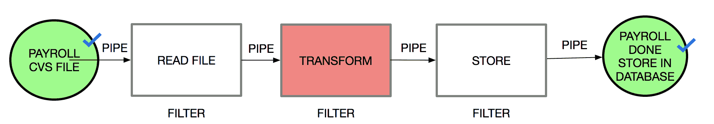

在每一行包括我们的文件表示为`PayrollTo`类之后，我们需要一个过滤器，将每个数据文件转换为大写。使用 Spring Batch，我们将创建一个处理器，将转换数据文件，然后将数据发送到下一步。因此，让我们创建一个`PayRollItemProcessor.java`对象，实现`org.springframework.batch.item.ItemProcessor<InputObject, OutputObjet>`接口，如下所示：

```java
package com.packpub.payrollprocess;

import org.slf4j.Logger;
import org.slf4j.LoggerFactory;
import org.springframework.batch.item.ItemProcessor;

public class PayRollItemProcessor implements 
                    ItemProcessor<PayrollTo, PayrollTo> {

    private static final Logger log = LoggerFactory
                    .getLogger(PayRollItemProcessor.class);

    @Override
    public PayrollTo process(PayrollTo payrollTo) throws Exception {

        final PayrollTo resultTransformation = new PayrollTo();
        resultTransformation.setFirstLastName
            (payrollTo.getFirstLastName().toUpperCase());
        resultTransformation.setDescription
            (payrollTo.getDescription().toUpperCase());
        resultTransformation.setAccountNumber
            (payrollTo.getAccountNumber());
        resultTransformation.setAccountType(payrollTo.getAccountType());
        resultTransformation.setCurrency(payrollTo.getCurrency());
        resultTransformation.setIdentification
            (payrollTo.getIdentification());

        // Data Type Transform
        final double ammountAsNumber = payrollTo.getAmmount()
                                                    .doubleValue();
        resultTransformation.setAmmount(ammountAsNumber);

        log.info
            ("Transforming (" + payrollTo + ") into (" 
                                + resultTransformation + ")");
        return resultTransformation;
    }
}
```

根据 API 接口，我们将接收一个传入的`PayrollTo`对象，然后将其转换为大写的`PayrollTo`，用于`firstLastName`和`description`属性。

输入对象和输出对象的类型不同并不重要。在许多情况下，一个过滤器将接收一种消息或数据，需要为下一个过滤器提供不同类型的消息或数据。

现在，我们将创建我们的批处理作业，并使用一些 Spring Batch 的开箱即用功能。例如，**ItemReader**具有一个有用的 API 来处理文件，**ItemWriter**可用于指定如何存储生成的数据：

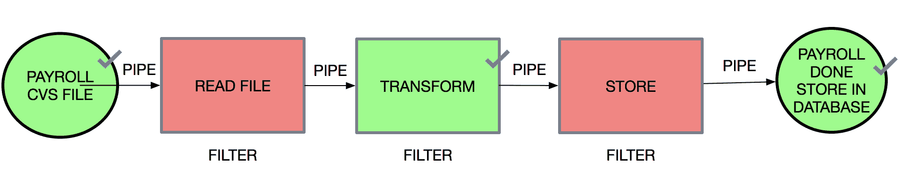

最后，我们将使用作业连接所有流数据。

使用 Spring Batch，我们需要专注于我们的业务（就像在`PayRollItemProcessor.java`类中所做的那样），然后将所有部分连接在一起，如下所示：

```java
@Configuration
@EnableBatchProcessing
public class BatchConfig {

    @Autowired
    public JobBuilderFactory jobBuilderFactory;

    @Autowired
    public StepBuilderFactory stepBuilderFactory;

 // READ THE INPUT DATA
    @Bean
    public FlatFileItemReader<PayrollTo> reader() {
        return new FlatFileItemReaderBuilder<PayrollTo>()
                .name("payrollItemReader")
                .resource(new ClassPathResource("payroll-data.csv"))
                .delimited()
                .names(
                    new String[]{
                        "identification", "currency", "ammount",
                        "accountType", "accountNumber", "description",
                        "firstLastName"})
                .fieldSetMapper(
                    new BeanWrapperFieldSetMapper<PayrollTo>() {{
                    setTargetType(PayrollTo.class);
                }})
                .build();
    }

 // PROCESS THE DATA
    @Bean
    public PayRollItemProcessor processor() {
        return new PayRollItemProcessor();
    }

 // WRITE THE PRODUCED DATA
    @Bean
    public JdbcBatchItemWriter<PayrollTo> writer(DataSource dataSource) {
        return new JdbcBatchItemWriterBuilder<PayrollTo>()
                .itemSqlParameterSourceProvider(
                    new BeanPropertyItemSqlParameterSourceProvider<>())
                .sql(
                    "INSERT INTO PAYROLL (PERSON_IDENTIFICATION,
                        CURRENCY, TX_AMMOUNT, ACCOUNT_TYPE, ACCOUNT_ID, 
                        TX_DESCRIPTION, FIRST_LAST_NAME) VALUES 
                    (:identification,:currenxcy,:ammount,:accountType,
                     :accountNumber, :description, :firstLastName)")
                .dataSource(dataSource)
                .build();
    }

    @Bean
    public Job importPayRollJob(JobCompletionPayRollListener listener, Step step1) {
        return jobBuilderFactory.get("importPayRollJob")
                .incrementer(new RunIdIncrementer())
                .listener(listener)
                .flow(step1)
                .end()
                .build();
    }

    @Bean
    public Step step1(JdbcBatchItemWriter<PayrollTo> writer) {
        return stepBuilderFactory.get("step1")
                .<PayrollTo, PayrollTo> chunk(10)
                .reader(reader())
                .processor(processor())
                .writer(writer)
                .build();
    }
}
```

有关 Spring Batch ItemReaders 和 ItemWriters 的详细说明，请访问[`docs.spring.io/spring-batch/trunk/reference/html/readersAndWriters.html`](https://docs.spring.io/spring-batch/trunk/reference/html/readersAndWriters.html)。

让我们来看一下`Step` bean 的工作原理：

```java
@Bean
    public Step step1(JdbcBatchItemWriter<PayrollTo> writer)
 {
        return stepBuilderFactory.get("step1")
                .<PayrollTo, PayrollTo> chunk(10)
                .reader(reader())
 .processor(processor())
 .writer(writer)
                .build();
 }
```

首先，它配置步骤以每次读取**10 条记录**的数据块，然后配置步骤与相应的`reader`、`processor`和`writer`对象。

我们现在已经实现了我们计划的所有管道和过滤器，如下图所示：

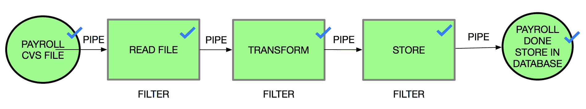

最后，我们将添加一个监听器，以检查我们处理的工资单数据。为此，我们将创建一个`JobCompletionPayRollListener.java`类，该类扩展了`JobExecutionListenerSupport`类，并实现了`afterJob(JobExecution jobExecution)`方法。

现在，我们将回顾我们从处理的数据中处理了多少`insert`操作：

```java

@Component
public class JobCompletionPayRollListener 
            extends JobExecutionListenerSupport {

    private static final Logger log = 
        LoggerFactory.getLogger(JobCompletionPayRollListener.class);

    private final JdbcTemplate jdbcTemplate;

    @Autowired
    public JobCompletionPayRollListener(JdbcTemplate jdbcTemplate) {
        this.jdbcTemplate = jdbcTemplate;
    }

    @Override
    public void afterJob(JobExecution jobExecution) {
        if (jobExecution.getStatus() == BatchStatus.COMPLETED) {
 log.info(">>>>> PAY ROLL JOB FINISHED! ");

            jdbcTemplate
            .query(
                "SELECT PERSON_IDENTIFICATION, CURRENCY, TX_AMMOUNT,                          ACCOUNT_TYPE, ACCOUNT_ID, TX_DESCRIPTION, 
                        FIRST_LAST_NAME FROM PAYROLL",
                    (rs, row) -> new PayrollTo(
                            rs.getInt(1),
                            rs.getString(2),
                            rs.getDouble(3),
                            rs.getString(4),
                            rs.getString(5),
                            rs.getString(6),
                            rs.getString(7))
            ).forEach(payroll -> 
                log.info("Found <" + payroll + "> in the database.")
                );
        }
    }
}
```

为了检查一切是否正常，我们将执行应用程序，使用以下命令：

```java
$ mvn spring-boot:run
```

或者，我们可以使用 maven 构建应用程序，如下所示：

```java
$ mvn install
```

接下来，我们将在终端上运行最近构建的`jar`：

```java
$ java -jar target/payroll-process-0.0.1-SNAPSHOT.jar
```

最后，我们将在控制台上看到以下输出。该输出代表已实现为 ItemProcessor 的过滤器，用于转换数据：

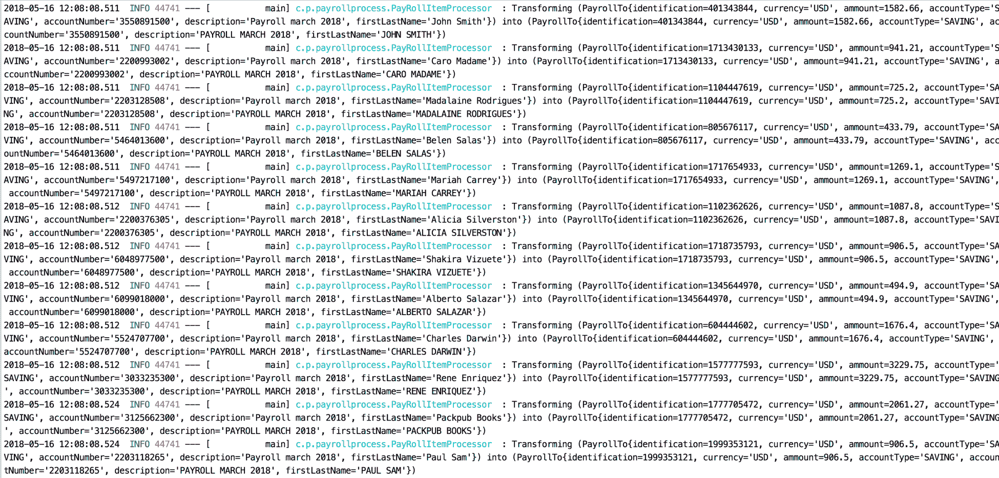

我们还可以通过监听器来验证我们的流程，该监听器实现为`JobExecutionListenerSupport`，打印存储在数据库中的结果：

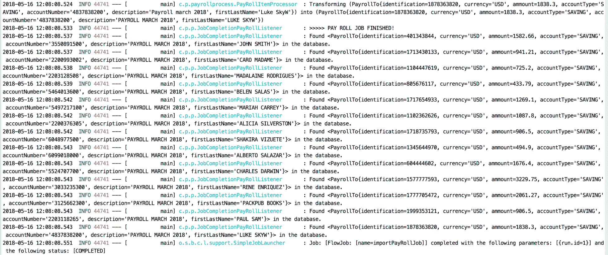

我们可以将 Spring Batch 应用程序打包成 WAR 文件，然后运行一个 servlet 容器（如 Tomcat）或任何 JEE 应用程序服务器（如 Glassfish 或 JBoss）。要将`.jar`文件打包成 WAR 文件，请使用`spring-boot-gradle-plugin`或`spring-boot-maven-plugin`。对于 Maven，您可以参考 Spring Boot 文档（[`docs.spring.io/spring-boot/docs/current/reference/htmlsingle/#build-tool-plugins-maven-packaging`](https://docs.spring.io/spring-boot/docs/current/reference/htmlsingle/#build-tool-plugins-maven-packaging)）。对于 Gradle，您可以参考[`docs.spring.io/spring-boot/docs/current/gradle-plugin/reference/html/#packaging-executable-wars`](https://docs.spring.io/spring-boot/docs/current/gradle-plugin/reference/html/#packaging-executable-wars)。

# 摘要

在本章中，我们讨论了管道和过滤器架构的概念，其实施的主要用例，以及如何在企业应用程序中使用它。此外，您还学会了如何使用 Spring Batch 实现架构，以及如何管理不同数量的数据并将流程拆分为较小的任务。

在下一章中，我们将回顾容器化应用程序的重要性。
