# 第八章：微服务

我们不断寻找新的方法来创建软件系统，以满足既支持他们业务需求的应用程序的满意客户，又受到尖端技术挑战的开发人员。满足这两种目标用户的平衡很重要；这使我们能够实现业务目标，避免失去技术娴熟的开发人员。

另一方面，作为开发人员，我们也在努力创建模块和专门的库，以满足特定的技术或业务需求。稍后，我们将在不同的项目中重用这些模块和库，以符合“不要重复自己”（DRY）原则。

以这个介绍作为出发点，我们将回顾微服务架构如何解决这些问题以及更多内容。在本章中，我们将讨论以下主题：

+   微服务原则

+   建模微服务

+   +   如何使用 Spring Cloud 实现微服务：

+   支持动态配置

+   启用服务发现和注册

+   边缘服务

+   断路器模式和 Hystrix

# 微服务原则

在网上有很多微服务的定义。经常出现的一个是以下内容：

“微服务是小型且自主的服务，能够良好地协同工作。”

让我们从这个定义开始，更详细地了解它的含义。

# 大小

微服务一词中包含“微”这个词，让我们认为服务的大小必须非常小。然而，几乎不可能使用诸如代码行数、文件数量或特定可部署工件的大小等指标来定义服务的正确大小。相反，使用以下想法要简单得多：

“一个服务应专注于做好一件事。”

- Sam Newman

那“一件事”可以被视为一个业务领域。例如，如果您正在为在线商店构建系统，它们可能涵盖以下业务领域：

+   客户管理

+   产品目录

+   购物车

+   订单

这个想法是构建一个能够满足特定业务领域所有需求的服务。最终，当业务领域变得太大，无法仅作为一个微服务处理时，您可能还会将一个服务拆分为其他微服务。

# 自主的

自主性在谈论微服务时非常重要。微服务应该有能力独立于其周围的其他服务进行更改和演变。

验证微服务是否足够自主的最佳方法是对其进行更改并部署服务的新版本。部署过程不应要求您修改除服务本身之外的任何内容。如果在部署过程中需要重新启动其他服务或其他任何内容，您应考虑消除这些额外步骤的方法。另一方面，服务的自主性也与构建它的团队的组织有关。我们将在本章后面详细讨论这一点。

# 良好协同工作

在孤立地构建不相互交互的系统是不可能的。即使我们正在构建不同业务领域需求的独立服务，最终我们也需要使它们作为一个整体进行交互，以满足业务需求。这种交互是通过使用应用程序编程接口（API）来实现的。

“API 是程序员可以用来创建软件或与外部系统交互的一组命令、函数、协议和对象。它为开发人员提供了执行常见操作的标准命令，因此他们不必从头编写代码。”

- API 定义来自 https://techterms.com/definition/api

单片应用程序往往进行数据库集成。这是应该尽量避免的事情；任何所需的服务之间的交互应该只使用提供的服务 API 来完成。

# 优势

微服务提供了许多值得了解的优势，以了解公司可能如何受益。最常见的优势如下：

+   符合单一责任原则

+   持续发布

+   独立可伸缩性

+   增加对新技术的采用

# 符合单一责任原则

使用微服务涉及创建单独的组件。每个组件都设计为解决特定的业务领域模型。因此，该领域模型定义了服务的单一责任。服务不应违反其限制，并且应该使用其他微服务提供的 API 请求任何超出其范围的信息。每个微服务应该暴露一个 API，其中包含所有必需的功能，以允许其他微服务从中获取信息。

# 持续发布

由于大型的单片应用程序处理许多业务领域模型，它们由大量的源代码和配置文件组成。这会产生需要大量时间才能部署的大型构件。此外，大型单片应用程序通常涉及分布在世界各地的大型团队，这使得沟通困难。在开发新功能或修复应用程序中的错误时，这会成为一个问题。微服务能够轻松解决这个问题，因为一个团队将负责一个或多个服务，并且一个服务很少由多个团队编写。这意味着新版本可以在团队内计划，这使得他们能够更快更频繁地推出新版本。

此外，即使代码中的最小更改也需要部署大型构件，这使得整个应用程序在部署过程中不可用。然而，对于微服务，只需部署具有漏洞修补程序或新功能的服务。部署速度快，不会影响其他服务。

# 独立可伸缩性

如果我们需要扩展一个单片应用程序，整个系统应该部署在不同的服务器上。服务器应该非常强大，以使应用程序能够良好运行。并非所有功能都具有相同的流量，但由于所有代码都打包为单个构件，因此无法仅扩展所需的功能。使用微服务，我们有自由只扩展我们需要的部分。通常可以找到云提供商提供通过按需提供更多服务器或在需要时自动添加更多资源来扩展应用程序的机会。

# 新技术的增加采用

并非所有业务领域模型都是相等的，这就是为什么需要不同的技术集。由于一个微服务只应处理一个领域模型的需求，因此不同的服务可以轻松采用不同的技术。通常可以找到公司使用不同的编程语言、框架、云提供商和数据库来编写他们的微服务。此外，我们有能力为小型应用程序尝试新技术，然后可以在其他地方使用。由于采用新技术，公司最终会拥有异构应用程序，如下图所示：

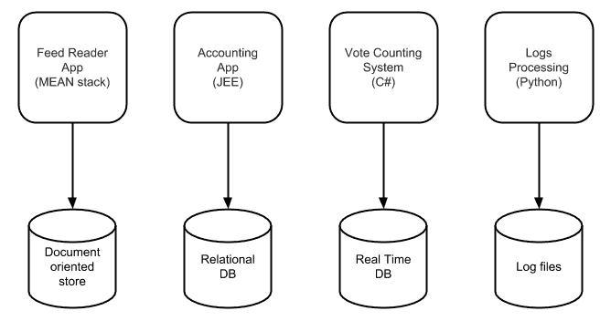

异构应用程序使我们能够使用正确的技术集创建专门的系统来解决特定的业务需求。因此，我们最终会拥有易于部署和独立扩展的小构件。

# 缺点

尽管微服务具有我们之前列出的所有优点，但重要的是要理解它们也有一些缺点。让我们回顾一下这些，并考虑如何处理它们：

+   选择太多

+   一开始慢

+   监控

+   事务和最终一致性

# 选择太多

由于您有机会选择要使用哪种技术构建微服务，您可能会因为可用选项的广泛多样而感到不知所措。这可以通过仅使用少量新技术而不是一次性尝试将它们全部整合来解决。

# 一开始慢

在采用微服务的过程中，您必须构建整个生态系统以使它们运行。您需要寻找连接分布式系统、保护它们并使它们作为一个整体运行的新方法。编写一个应用程序来完成所有这些工作更容易。然而，几个月后，其他微服务将重复使用您一开始投入的所有工作，这意味着流程速度显著加快。要充分利用这种创建系统的方式，重要的是尝试新的部署应用程序的方式，使其按需扩展，监控和记录它们。还重要的是审查处理业务核心的微服务的功能。这些系统有时最终成为半单体应用，应该拆分以便更容易管理。

# 监控

监控单个应用比监控许多不同服务的实例更容易。重要的是创建仪表板和自动化工具，提供指标以使这项任务更容易完成。当出现新错误时，很难弄清楚问题出在哪里。应该使用良好的日志跟踪机制来确定应用的哪个服务未按预期工作。这意味着您不必分析所有服务。

# 事务和最终一致性

尽管大型单体应用有着明确定义的事务边界，而且我们在编写微服务时经常使用两阶段提交等技术，但我们必须以另一种方式来满足这些要求。

我们应该记住，每个微服务都拥有自己的数据存储，并且我们应该仅使用它们的 API 来访问它们的数据。保持数据最新并在操作不符合预期时使用补偿事务是很重要的。当我们编写单体应用时，许多操作作为单个事务执行。对于微服务，我们需要重新思考操作和事务，使它们适应每个微服务的边界。

# 建模微服务

作为开发人员，我们总是试图创建可重用的组件来与系统或服务交互，以避免重复编写代码。到目前为止，我们构建的大多数单体应用都遵循了三层架构模式，如下图所示：

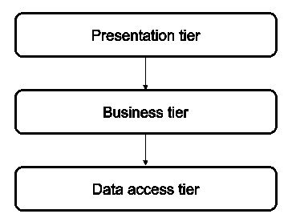

三层架构

当需要对使用此模型构建的应用进行更改时，通常需要修改所有三层。根据应用程序的创建方式，可能需要进行多次部署。此外，由于大型单体应用共享许多功能，通常会发现有多个团队在其上工作，这使得它们更难快速发展。有时，专门的团队会在特定层上工作，因为这些层由许多组件组成。通过这种方式，可以水平应用更改以使应用程序增长和发展。

使用微服务，应用程序在特定业务领域周围建模，因此应用程序在垂直方向上发展。以下图表显示了在线商店应用程序的一些微服务：

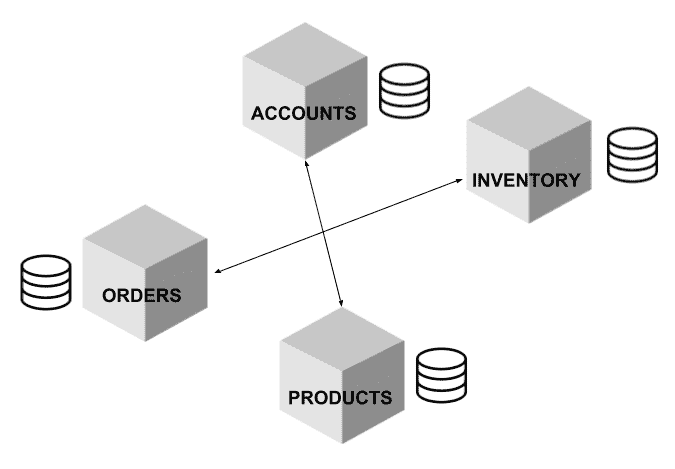

微服务图表

这些名称本身就解释了微服务的意图和相关功能集合。仅通过阅读名称，任何人都可以理解它们的功能；如何执行任务以及它们如何实现在这一点上是无关紧要的。由于这些服务围绕着一个明确定义的业务领域构建，当需要进行新更改时，只有一个服务应该被修改。由于不止一个团队应该在一个微服务上工作，与大型单体相比，使它们发展变得更容易。负责服务的团队深刻了解特定服务的工作方式以及如何使其发展。

负责微服务的团队由该服务业务领域的专家组成，但不擅长其周围其他服务的技术。毕竟，技术选择包括细节；服务的主要动机是业务领域。

# 加速

我们在本章前面提到，基于微服务开发应用程序在开始阶段是一个耗时的过程，因为您从头开始。无论您是开始一个新项目还是将现有的遗留应用程序拆分为单独的微服务，您都必须完成将应用程序从开发到生产的所有必要步骤。

# 加速开发过程

让我们从开发阶段开始。当您在旧应用程序上工作时，通常在编写第一行代码之前，您必须经历以下步骤：

1.  在本地机器上安装所需的工具。

1.  设置所有必需的依赖项。

1.  创建一个或多个配置文件。

1.  发现所有未列入文档的缺失部分。

1.  加载测试数据。

1.  运行应用程序。

现在，假设您是作为一个团队的一部分，拥有用不同编程语言编写并使用不同数据库技术的许多微服务。您能想象在编写第一行代码之前需要多少努力吗？

使用微服务应该能够为您提供更快的解决方案，但所需的所有设置使其在最初变得更慢。对于大型单片应用程序，您只需要设置一个环境，但对于异构应用程序，您将需要设置许多不同的环境。为了有效地解决这个问题，您需要拥抱自动化文化。您可以运行脚本来代替手动执行所有上述步骤。这样，每当您想要在不同的项目上工作时，您只需要执行脚本，而不是重复列出的所有步骤。

市场上有一些非常酷的工具，比如 Nanobox（https://nanobox.io）、Docker Compose（https://docs.docker.com/compose/）和 Vagrant（https://www.vagrantup.com）。这些工具可以通过运行单个命令提供类似于生产环境的环境，从而帮助您。

采用前面提到的工具将对开发团队的生产力产生巨大影响。您不希望开发人员浪费时间提供自己的环境；相反，您希望他们编写代码为产品添加新功能。

# 拥抱测试

让我们谈谈编写代码的过程。当我们在大型单体上工作时，每次发布新功能或错误修复时都需要通知许多人。在极端情况下，QA 团队需要自行检查整个环境，以确保新更改不会影响应用程序的现有功能。想象一下为多个微服务的每次发布重复执行此任务会耗费多少时间。因此，您需要将测试作为开发过程的必要部分。

有许多不同级别的测试。让我们来看一下 Jason Huggins 在 2005 年引入的金字塔测试，如下图所示：

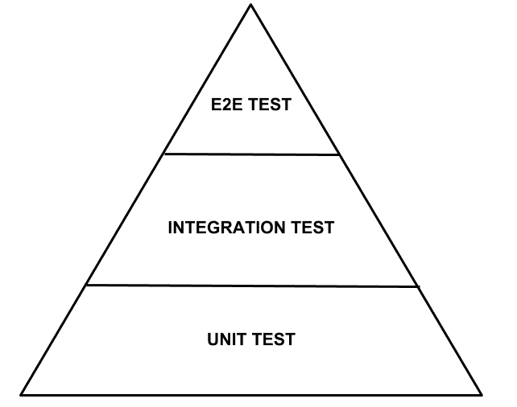

金字塔测试

金字塔底部的测试很容易且快速编写和执行。运行单元测试只需要几分钟，对验证隔离的代码片段是否按预期工作很有用。另一方面，集成测试对验证代码在与数据库、第三方应用程序或其他微服务交互时是否正常工作很有用。这些测试需要几十分钟才能运行。最后，端到端（e2e）测试帮助您验证代码是否符合最终用户的预期。如果你正在编写一个 REST API，e2e 测试将使用不同的数据验证 API 的 HTTP 响应代码。这些测试通常很慢，而且它们一直在变化。

理想情况下，所有新功能都应该经过所有这些测试，以验证您的代码在进入生产之前是否按预期工作。你写的测试越多，你就会获得越多的信心。毕竟，如果你覆盖了所有可能的情况，还会出什么问题呢？此外，Michael Bryzek 提出了在生产中进行测试的想法（有关更多信息，请参见[`www.infoq.com/podcasts/Michael-Bryzek-testing-in-production`](https://www.infoq.com/podcasts/Michael-Bryzek-testing-in-production)）。这有助于您通过定期执行自动化任务或机器人来评估您的服务是否正常运行，以在生产中运行系统的关键部分。

# 投入生产

你必须以与自动化开发环境相同的方式自动化生产环境。如今，公司普遍使用云提供商部署其系统，并使用 API 驱动工具提供服务器。

安装操作系统并添加所需的依赖项以使应用程序工作必须自动化。如果要提供多台服务器，只需多次执行相同的脚本。Docker、Puppet 和 Chef 等技术可以帮助你做到这一点。使用代码提供环境的间接好处是，你将拥有使应用程序工作所需的所有依赖项的完美文档。随着时间的推移，这些脚本可以得到改进。它们存储在版本控制系统中，这样就很容易跟踪对它们所做的每一次更改。我们将在第十一章 *DevOps 和发布管理*中进一步讨论这一点。

# 实施微服务

现在我们对微服务的定义和用途有了很好的理解，我们将开始学习如何使用 Spring Framework 实施微服务架构。在接下来的几节中，我们将看一些到目前为止还没有涉及的重要概念。最好从实际角度来接触这些概念，以便更容易理解。

# 动态配置

我们都曾经在使用不同配置文件或相关元数据的应用程序上工作，以允许你指定使应用程序工作的配置参数。当我们谈论微服务时，我们需要以不同的方式来处理这个配置过程。我们应该避免配置文件，而是采用由 Heroku 提出的十二要素应用程序配置风格（在[`12factor.net`](https://12factor.net)中概述）。当我们使用这种配置风格时，我们希望将每个环境中不同的属性外部化，并使其易于创建和更改。

默认情况下，Spring Boot 应用程序可以使用命令行参数、JNDI 名称或环境变量工作。Spring Boot 还提供了使用`.properties`或`.yaml`配置文件的能力。为了以安全的方式处理配置变量，Spring Boot 引入了`@ConfigurationProperties`注释，它允许您将属性映射到**普通的 Java 对象**（**POJOs**）。应用程序启动时，它会检查所有配置是否已提供、格式是否正确，并符合`@Valid`注释要求的需求。让我们看看这个映射是如何工作的。

假设您的应用程序中有以下`application.yaml`文件：

```java
middleware:
  apiKey: ABCD-1234
  port: 8081

event-bus:
  domain: event-bus.api.com
  protocol: http
```

现在，让我们使用`@ConfigurationProperties`注释将这些变量映射到两个不同的 POJO 中。让我们从给定的中间件配置开始：

```java
@Data
@Component
@ConfigurationProperties("middleware")
public class Middleware 
{
  private String apiKey;
  private int port;
}
```

以下代码片段代表了`eventBus`配置部分所需的类：

```java
@Data
@Component
@ConfigurationProperties("event-bus")
public class EventBus 
{
  private String domain;
  private String protocol;
}
```

使用 lombok 的`@Data`注释来避免编写标准访问器方法。现在，您可以打印这些类的`.toString()`结果，并且您将在控制台中看到以下输出：

```java
EventBus(domain=event-bus.api.com, protocol=http)
Middleware(apiKey=ABCD-1234, port=8081)
```

将所有这些配置变量硬编码可能很有用。这意味着当您想要在另一个环境中部署应用程序时，您可以通过提供额外的参数来简单地覆盖它们，如下所示：

```java
$ java -Dmiddleware.port=9091 -jar target/configuration-demo-0.0.1-SNAPSHOT.jar
```

在运行`.jar`文件之前，我们在文件中覆盖了一个配置变量，因此您将得到如下所示的输出：

```java
EventBus(domain=event-bus.api.com, protocol=http)
Middleware(apiKey=ABCD-1234, port=9091)
```

尽管这种配置很容易实现，但对于微服务或一般的现代应用程序来说还不够好。首先，在应用任何更改后，您需要重新启动应用程序，这是不可取的。最糟糕的是，您无法跟踪您所应用的更改。这意味着如果提供了环境变量，就无法知道是谁提供的。为了解决这个问题，Spring 提供了一种集中所有配置的方法，使用 Spring Cloud 配置服务器。

该服务器提供了一种集中、记录和安全的方式来存储配置值。由于它将所有配置值存储在可以是本地或远程的 Git 存储库中，因此您将免费获得与版本控制系统相关的所有好处。

# 实施配置服务器

Spring Cloud 配置服务器是建立在常规 Spring Boot 应用程序之上的。您只需要添加以下附加依赖项：

```java
compile('org.springframework.cloud:spring-cloud-config-server')
```

添加依赖项后，您需要使用应用程序中的附加注释来激活配置服务器，如下面的代码所示：

```java
@SpringBootApplication
@EnableConfigServer
public class ConfigServerApplication 
{
  public static void main(String[] args) 
  {
    SpringApplication.run(ConfigServerApplication.class, args);
  }
}
```

最后，您需要提供存储微服务配置的 Git 存储库 URL，存储在`application.yaml`文件中，如下所示：

```java
spring:
  cloud:
    config:
      server:
        git:
          uri: https://github.com/enriquezrene/spring-architectures-config-server.git
```

前面的 Git 存储库有单独的配置文件来管理每个微服务的配置。例如，`configuration-demo.properties`文件用于管理配置演示微服务的配置。

# 实施配置客户端

配置客户端是常规的 Spring Boot 应用程序。您只需要提供服务器配置 URI 以读取集中配置，如下所示：

```java
spring:
  application:
 name: configuration-demo
  cloud:
    config:
 uri: http://localhost:9000
```

以下代码片段显示了一个 REST 端点，读取集中配置并将读取的值作为自己的响应提供：

```java
@RestController
@RefreshScope
public class ConfigurationDemoController {

 @Value("${configuration.dynamicValue}")
    private String dynamicValue;

    @GetMapping(path = "/dynamic-value")
    public ResponseEntity<String> readDynamicValue() {
        return new ResponseEntity<>(this.dynamicValue, HttpStatus.OK);
    }
}
```

以下屏幕截图显示了存储在 Git 存储库中的配置文件：

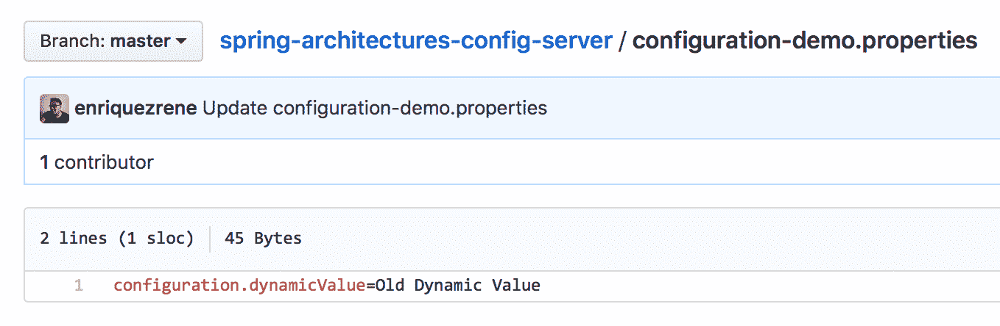

存储在 Git 存储库中的配置文件

一旦您对前面的端点执行请求，它将产生以下输出：

```java
$ curl http://localhost:8080/dynamic-value 
Old Dynamic Value
```

更改存储在 Git 中的文件中的配置变量的值，如下面的屏幕截图所示：

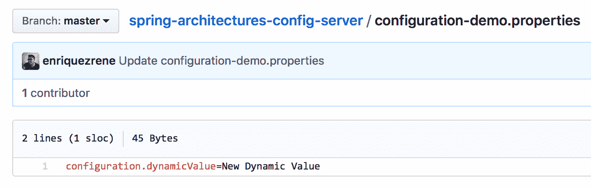

应用更改后的配置文件

如果您访问端点，将检索到与之前相同的输出。为了重新加载配置，您需要通过使用`POST`请求命中`/refresh`端点来重新加载配置变量，如下代码所示：

```java
$ curl -X POST http://localhost:8080/actuator/refresh
["config.client.version","configuration.dynamicValue"]
```

重新加载配置后，端点将使用新提供的值提供响应，如下输出所示：

```java
$ curl http://localhost:8080/dynamic-value
New Dynamic Value
```

# 服务发现和注册

过去，我们的应用程序存在于单个物理服务器上，应用程序与实施它的后端之间存在 1:1 的关系。在这种情况下，查找服务非常简单：您只需要知道服务器的 IP 地址或相关的 DNS 名称。

后来，应用程序被分布，这意味着它们存在于许多物理服务器上以提供高可用性。在这种情况下，服务与后端服务器之间存在 1:*N*的关系，其中*N*可以表示多个。传入请求使用负载均衡器进行管理，以在可用服务器之间路由请求。

当物理服务器被虚拟机替换时，使用相同的方法。负载均衡器需要一些配置来注册新的可用服务器并正确路由请求。这项任务过去由运维团队执行。

今天，常见的是在容器中部署应用程序，我们将在第十章中进一步讨论，*容器化您的应用程序*。容器每毫秒都在不断提供和销毁，因此手动注册新服务器是不可能的任务，必须自动化。为此，Netflix 创建了一个名为 Eureka 的项目。

# 介绍 Eureka

Eureka 是一个允许您自动发现和注册服务器的工具。您可以将其视为一个电话目录，其中所有服务都注册了。它有助于避免在服务器之间建立直接通信。例如，假设您有三个服务，它们都相互交互。使它们作为一个整体工作的唯一方法是指定服务器或其负载均衡器的 IP 地址和端口，如下图所示：

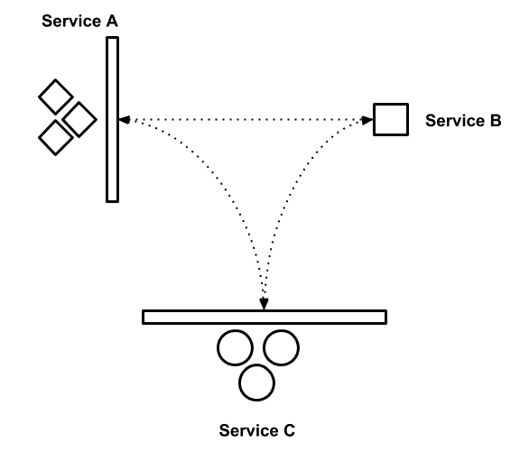

服务相互交互

如前图所示，交互直接发生在服务器或它们的负载均衡器之间。当添加新服务器时，应手动或使用现有的自动化机制在负载均衡器中注册它。此外，使用 Eureka，您可以使用在其上注册的服务名称建立通信。以下图表显示了相同的交互如何与 Eureka 一起工作：

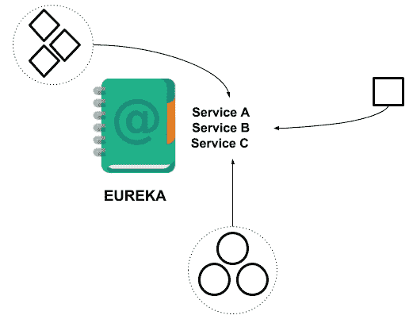

使用 Eureka 注册的服务

这意味着当您需要在服务之间建立通信时，您只需要提供名称而不是 IP 地址和端口。当一个服务有多个实例可用时，Eureka 也将作为负载均衡器工作。

# 实现 Netflix Eureka 服务注册表

由于 Eureka 是为了允许与 Spring Boot 平稳集成而创建的，因此可以通过添加以下依赖项来简单实现服务注册表：

```java
compile
 ('org.springframework.cloud:spring-cloud-starter-netflix-eureka-server')
```

`application`类也应该被修改，以指示应用程序将作为 Eureka 服务器工作，如下所示：

```java
@EnableEurekaServer
@SpringBootApplication
public class ServiceRegistryApplication 
{
  public static void main(String[] args) 
  {
    SpringApplication.run(ServiceRegistryApplication.class, args);
  }
}
```

运行应用程序后，您可以在`http://localhost:8901/`看到 Web 控制台，如下截图所示：

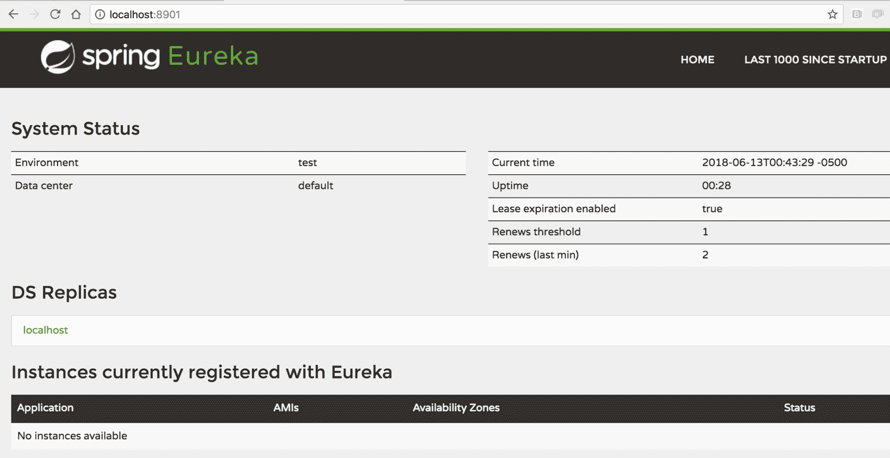

Eureka Web 控制台

# 实现服务注册表客户端

之前，我们提到过负载均衡器曾经用于通过使用多个服务器作为后端来提供高可伸缩性。Eureka 以相同的方式工作，但主要好处是当服务器的更多实例被提供时，您不需要在服务注册表中添加任何配置。相反，每个实例都应让 Eureka 知道它想要注册。

注册新服务非常简单。您只需要包含以下依赖项：

```java
compile
 ('org.springframework.cloud:spring-cloud-starter-netflix-eureka-client')
```

服务应用程序类应包括一个附加的注解，如下所示：

```java
@EnableDiscoveryClient
@SpringBootApplication
public class MoviesServiceApplication 
{
  public static void main(String[] args) 
  {
    SpringApplication.run(MoviesServiceApplication.class, args);
  }
}
```

最后，您需要在`application.properties`文件中指定 Eureka 服务器 URI，如下所示：

```java
# This name will appear in Eureka
spring.application.name=movies-service
eureka.client.serviceUrl.defaultZone=http://localhost:8901/eureka
```

运行此 Spring Boot 应用程序后，它将自动在 Eureka 中注册。您可以通过刷新 Eureka Web 控制台来验证这一点。您将看到服务已注册，如下截图所示：

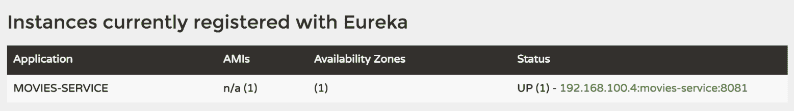

Eureka 中注册的实例

一旦服务注册，您将希望消费它们。使用 Netflix Ribbon 是消费服务的最简单方式之一。

# Netflix Ribbon

Ribbon 是一个客户端负载均衡解决方案，与 Spring Cloud 生态系统无缝集成。它可以通过指定服务名称来消费使用 Eureka 暴露的服务。由于所有服务器实例都在 Eureka 中注册，它将选择其中一个来执行请求。

假设我们有另一个名为`cinema-service`的服务。假设该服务有一个端点，可以用来按 ID 查询电影院。作为电影院负载的一部分，我们希望包括`movies-service`中所有可用的电影。

首先，我们需要添加以下依赖项：

```java
compile('org.springframework.cloud:spring-cloud-starter-netflix-ribbon')
```

然后，作为`application`类的一部分，我们需要创建一个新的`RestTemplate` bean，以便注入以消费 Eureka 中可用的服务：

```java
@EnableDiscoveryClient
@SpringBootApplication
public class CinemaServiceApplication 
{
  public static void main(String[] args) 
  {
    SpringApplication.run(CinemaServiceApplication.class, args);
  }
 @LoadBalanced
  @Bean
  RestTemplate restTemplate() 
  {
 return new RestTemplate();
  }
}
```

`RestTemplate`短语是用于消费 RESTful web 服务的客户端。它可以执行对`movies-service`的请求如下：

```java
@RestController
public class CinemasController 
{
  private final CinemaRepository cinemaRepository;
 private final RestTemplate restTemplate;
  public CinemasController(CinemaRepository cinemaRepository,
  RestTemplate restTemplate) 
  {
    this.cinemaRepository = cinemaRepository;
 this.restTemplate = restTemplate;
  }
  @GetMapping("/cinemas/{cinemaId}/movies")
  public ResponseEntity<Cinema> queryCinemaMovies   
  (@PathVariable("cinemaId") Integer cinemaId) 
  {
    Cinema cinema = cinemaRepository.findById(cinemaId).get();
    Movie[] movies = restTemplate
    .getForObject(
 "http://movies-service/movies", Movie[].class);
    cinema.setAvailableMovies(movies);
    return new ResponseEntity<>(cinema, HttpStatus.OK);
  }
}
```

请注意服务名称的指定方式，我们不必提供任何其他信息，如 IP 地址或端口。这很好，因为在新服务器按需创建和销毁时，确定这些信息将是不可能的。

# 边缘服务

边缘服务是一个中间组件，对外部世界和下游服务都是可见的。它作为一个网关，允许周围所有服务之间的交互。以下图表显示了边缘服务的使用方式：

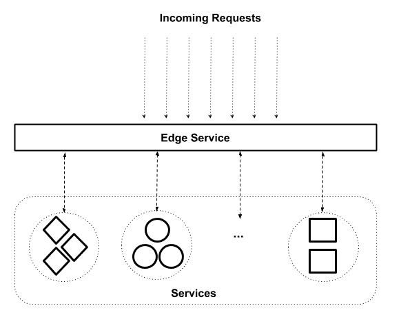

边缘服务

请注意，所有传入请求都直接指向边缘服务，后者将稍后查找正确的服务以正确重定向请求。

边缘服务以不同的方式使用，根据周围的服务添加额外的行为或功能。最常见的例子是跨域资源共享（CORS）([`developer.mozilla.org/en-US/docs/Web/HTTP/CORS`](https://developer.mozilla.org/en-US/docs/Web/HTTP/CORS))过滤器。您可以向边缘服务添加 CORS 过滤器，这意味着下游服务不需要实现任何内容。假设我们**只**想允许来自域**abc.com**的传入请求。我们可以将此逻辑作为边缘服务的一部分实现，如下图所示：

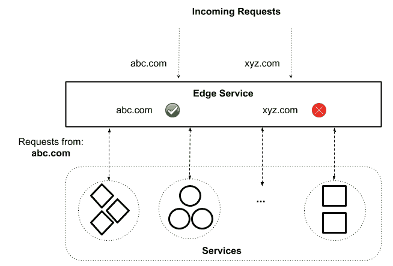

使用边缘服务的 CORS 过滤器

在这里，我们可以看到所有逻辑只添加在一个地方，下游服务不必实现任何内容来管理所需的行为。

边缘服务还用于许多其他需求，我们将在下一节讨论。市场上有许多不同的边缘服务实现。在下一节中，我们将讨论 Netflix 的 Zuul，因为它与 Spring Cloud 集成得很顺畅。

# 介绍 Zuul

Zuul 是 Netflix 创建的边缘服务，其功能基于过滤器。Zuul 过滤器遵循拦截器过滤器模式（如[`www.oracle.com/technetwork/java/interceptingfilter-142169.html`](http://www.oracle.com/technetwork/java/interceptingfilter-142169.html)中所述）。使用过滤器，您可以在路由过程中对 HTTP 请求和响应执行一系列操作。

Zuul 是一个来自电影的门卫的名字（请参阅[`ghostbusters.wikia.com/wiki/Zuul`](http://ghostbusters.wikia.com/wiki/Zuul)了解更多详情），它确切地代表了这个项目的功能，即门卫的功能。

您可以在四个阶段应用过滤器，如下图所示：

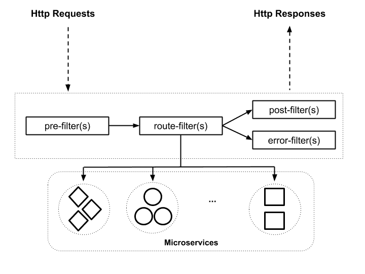

Zuul 过滤器

让我们回顾一下这些阶段：

+   **pre**：在请求被处理之前

+   **route**：在将请求路由到服务时

+   **post**：在请求被处理后

+   **error**：当请求发生错误时

使用这些阶段，您可以编写自己的过滤器来处理不同的需求。`pre`阶段的一些常见用途如下：

+   认证

+   授权

+   速率限制

+   请求正文中的翻译和转换操作

+   自定义标头注入

+   适配器

`route`阶段的一些常见过滤器用途如下：

+   金丝雀发布

+   代理

一旦一个请求被微服务处理，就会有两种情况：

+   处理成功

+   请求处理过程中发生错误

如果请求成功，将执行与`post`阶段相关的所有过滤器。在此阶段执行的一些常见过滤器用途如下：

+   响应有效负载中的翻译和转换操作

+   存储与业务本身相关的度量标准

另一方面，当请求处理过程中发生错误时，所有`error`过滤器都将被执行。此阶段过滤器的一些常见用途如下：

+   保存请求的相关元数据

+   出于安全原因，从响应中删除技术细节

上述观点只是每个阶段过滤器的一些常见用途。在编写针对您需求的过滤器时，请考虑您自己的业务。

为了编写一个 Zuul 过滤器，应该扩展`ZuulFilter`类。这个类有以下四个需要实现的抽象方法：

```java
public abstract class ZuulFilter 
implements IZuulFilter, Comparable<ZuulFilter> 
{
  public abstract String filterType();
  public abstract int filterOrder();
 public abstract boolean shouldFilter();
  public abstract Object run() throws ZuulException;
  ...
}
```

粗体显示的两个方法并不是直接在`ZuulFilter`类中声明的，而是从`IZuulFilter`接口继承而来，这个接口是由这个类实现的。

让我们回顾一下这些方法，以了解 Zuul 过滤器的工作原理。

首先，您有`filterType`方法，需要在其中指定要执行当前过滤器的阶段。该方法的有效值如下：

+   `pre`

+   `post`

+   `route`

+   `error`

您可以自己编写上述值，但最好使用`FilterConstant`类，如下所示：

```java
@Override
public String filterType() 
{
  return FilterConstants.PRE_TYPE;
}
```

所有阶段都列在我们之前提到的类中：

```java
public class FilterConstants 
{ 
  ...
  public static final String ERROR_TYPE = "error";
  public static final String POST_TYPE = "post";
  public static final String PRE_TYPE = "pre";
  public static final String ROUTE_TYPE = "route";
}
```

`filterOrder`方法用于定义将执行过滤器的顺序。每个阶段通常有多个过滤器，因此通过使用该方法，可以为每个过滤器配置所需的顺序。最高值表示执行顺序较低。

通过使用`org.springframework.core.Ordered`接口，可以轻松配置执行顺序，该接口有两个值可用作参考：

```java
package org.springframework.core;
public interface Ordered 
{
  int HIGHEST_PRECEDENCE = -2147483648;
  int LOWEST_PRECEDENCE = 2147483647;
  ...
}
```

`shouldFilter`方法用于确定是否应执行过滤逻辑。在这个方法中，你可以使用`RequestContext`类来访问请求信息，如下所示：

```java
RequestContext ctx = RequestContext.getCurrentContext();
// do something with ctx 
```

这个方法应该返回一个布尔值，指示是否应执行`run`方法。

最后，`run`方法包含在过滤器中应用的逻辑。在这个方法中，你也可以使用`RequestContext`类来执行所需的逻辑。

例如，让我们使用之前实现的端点来查询电影院放映的电影：

```java
curl http://localhost:8701/cinemas-service/cinemas/1/movies
```

以下是一个简单的实现，用于打印请求的方法和 URL：

```java
@Override
public Object run() throws ZuulException {
    RequestContext ctx = RequestContext.getCurrentContext();
    HttpServletRequest request = ctx.getRequest();
    log.info("Requested Method: {}", request.getMethod());
    log.info("Requested URL: {}", request.getRequestURL());
    return null;
}
```

一旦请求被处理，你将得到以下输出：

```java
PRE FILTER
Requested Method: GET
Requested URL: http://localhost:8701/cinemas-service/cinemas/1/movies
```

# CAP 定理

在 2000 年的**分布式计算原理研讨会**（**SPDC**）上，Eric Brewer 提出了以下理论：

“一个共享数据系统不可能同时提供这三个属性中的两个以上（一致性、高可用性和分区容错）。”

- Eric Brewer

让我们来回顾一下这三个属性。

# 一致性

一个一致的系统能够在每次后续操作中报告其当前状态，直到状态被外部代理显式更改。换句话说，每个`read`操作应该检索到上次写入的数据。

# 高可用性

高可用性指的是系统在从外部代理检索任何请求时始终能够提供有效的响应能力。在理想的情况下，系统应该始终能够处理传入的请求，从不产生错误。至少应该以对用户不可感知的方式处理它们。

# 分区容错

一个分区容错的分布式系统应该始终保持运行，即使与其节点之一的通信无法建立。

Brewer 的理论可以应用于任何分布式系统。由于微服务架构是基于分布式计算概念的，这意味着这个理论也适用于它们。

尽管理论表明系统无法同时实现所有三个属性，我们应该构建能够优雅处理故障的系统。这就是断路器模式可以应用的地方。

# 断路器

断路器模式旨在处理系统与其他运行在不同进程中的系统进行远程调用时产生的故障。该模式的主要思想是用一个能够监视故障并产生成功响应的对象来包装调用，如下图所示：

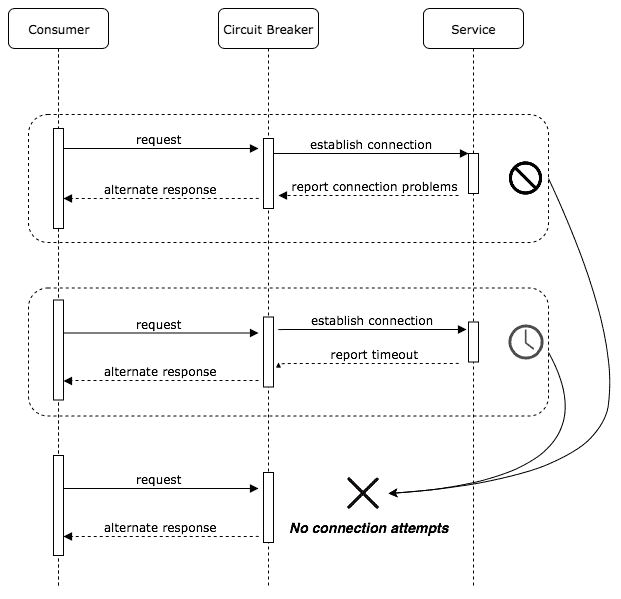

断路器模式

请注意，断路器模式在无法与目标服务建立连接时提供替代响应。让我们看看如何使用 Hystrix 来实现这种模式并将其纳入我们的应用程序。

# Hystrix

Hystrix 是 Netflix 于 2011 年创建的一个库。它是为了处理与外部服务交互时的延迟和连接问题而创建的。Hystrix 的主要目的是在通信问题发生时提供一种替代方法来执行。它可以这样实现：

```java
@Service
public class MoviesService {

    private final RestTemplate restTemplate;

    public MoviesService(RestTemplate restTemplate) {
        this.restTemplate = restTemplate;
    }

    @HystrixCommand(fallbackMethod = "emptyMoviesArray")
    public Movie[] getMovies(){
        return restTemplate.getForObject
            ("http://movies-service/movies", Movie[].class);
    }

    public Movie[] emptyMoviesArray(){
        Movie movie = new Movie();
        movie.setId(-1);
        movie.setName("Coming soon");
        return new Movie[]{movie};
    }
}
```

注意`getMovies`方法如何尝试与另一个服务交互以获取电影列表。该方法用`@HystrixCommand(fallbackMethod = "emptyMoviesArray")`进行了注释。`fallbackMethod`值指示在与其他服务通信期间发生错误时要使用的替代方法。在这种情况下，替代方法提供了一个硬编码的电影数组。这样，你可以在需要与外部服务交互时避免级联故障。通过优雅地处理故障，这为最终用户提供了更好的体验。

# 摘要

在本章中，我们讨论了微服务的原则、优势和缺点。之后，我们学习了如何对微服务进行建模，并讨论了一些与分布式计算相关的重要概念，这些概念是这种架构风格固有的。最后，我们回顾了 CAP 定理以及如何在与其他服务交互时优雅地处理故障。在下一章中，我们将探讨无服务器架构风格，这也可以作为您的微服务环境的一部分进行集成。
