# 第九章：无服务器架构

无服务器架构正在成为 IT 系统构建中的一种流行趋势。因此，人们经常讨论亚马逊网络服务（AWS）、谷歌云和微软 Azure 等云提供商。

在本章中，我们将探讨无服务器架构的含义，以及这种新的构建系统的方式如何帮助我们在更短的时间内满足业务需求，从而减少构建业务解决方案所需的工作量。我们还将看看如何利用现成的第三方服务和实现自定义功能，从而创建可以部署在云上的无状态函数，从而大大减少到达生产所需的时间。

在本章中，我们将涵盖以下主题：

+   无服务器架构简介

+   基础设施和文件存储

+   好处和陷阱

+   后端即服务

+   函数即服务

+   对无服务器架构的担忧：

+   供应商锁定问题

+   安全问题

+   框架支持

+   故障排除

+   无服务器架构的示例和常见用途

+   使用无服务器架构实施应用程序：

+   如何使用 Spring 编写函数

+   使用 AWS Lambda 和 Azure 的适配器

# 无服务器架构简介

无服务器架构是通过亚马逊的倡议诞生的。该公司希望推广一个开发团队可以自主、小型和自我管理的环境，使其能够从编写代码到在生产环境中交付和交付整个软件开发周期。

无服务器架构有时被误解为部署软件系统而无需物理服务器的概念。要理解这个想法，您可以查看 Martin Fowler 的博客中对无服务器的定义：

“重要的是要理解，无服务器架构是开发人员将业务逻辑编码为函数的方法，忘记了服务器的配置和扩展问题，其中逻辑将被执行。”

- [`martinfowler.com/articles/serverless.html`](https://martinfowler.com/articles/serverless.html)

无服务器和 FaaS 的常见示例包括：

+   认证

+   短信通知

+   电子邮件服务

另一方面，在无服务器的世界中，通常会创建应用程序，其中采用第三方服务作为系统的一部分（而不是从头开始创建服务）。这些服务通常被称为后端即服务（BaaS）或移动后端即服务（MBaaS）。

采用相同的方法，我们可以将自定义业务逻辑编码为可以部署在云上的函数。这些服务被称为函数即服务（FaaS）。

以下图表说明了第三方服务和自定义功能是如何被不同的软件系统创建、部署和消费的：

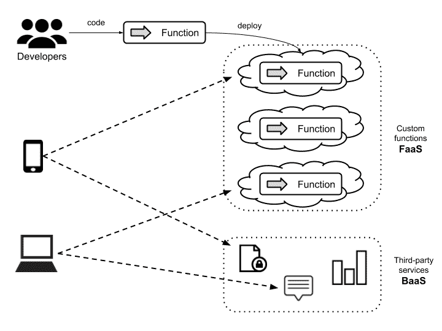

第三方服务和自定义功能

# 基础设施和文件存储

基础设施和文件存储也被视为无服务器，因为拥有系统的业务（或个人）不必购买、租用或配置服务器或虚拟机来使用它们。

作为开发人员，如果我们采用老式方法（使用本地环境提供所有基础设施），我们必须为我们想要部署软件系统的每个环境设置所有软件和硬件要求。这个配置过程必须在所有环境中重复进行，直到我们进入生产阶段，在这一点上，我们必须处理其他功能，如扩展和监控。在许多情况下，我们的基础设施将被低效利用，这是一种浪费金钱的行为，因为我们购买了强大的服务器来部署不需要太多资源的应用程序。

# 好处和陷阱

采用无服务器架构方法创建应用程序为我们提供了许多好处，但也有一些缺点需要解决。让我们先来回顾一下好处：

+   使用无服务器架构的开发人员可以主要专注于代码，可以忘记与服务器供应有关的一切，这是云提供商自己处理的任务。

+   代码的扩展是短暂的，意味着它可以根据检索的请求数量进行扩展和启动或关闭。

+   根据定义，用于编写业务逻辑的所有功能必须是无状态的，因此松散耦合。这样，任务就可以专注于明确定义的责任。

+   功能可以通过事件异步触发。

+   我们只需支付所消耗的计算时间。

+   这些功能的功能是基于事件驱动模型的。

+   开发者可以以透明的方式实现无限扩展。

另一方面，也存在一些缺点：

+   缺乏可用作参考的文档和展示

+   当需要同时使用多个服务时引入的延迟问题

+   某些功能仅在特定的云服务提供商中可用。

+   供应商锁定

为了解决供应商锁定的问题，强烈建议在无服务器架构的一部分使用**多云**方法。多云策略涉及使用多个云提供商。这很重要，因为通过它，我们可以利用不同供应商和不同产品的优势。例如，Google 提供了出色的机器学习服务，AWS 提供了各种标准服务，微软 Azure 为远程调试等功能提供了出色的功能。另一方面，云无关的策略建议我们尽可能避免依赖特定的云提供商，以便在需要时自由部署系统。然而，这将很难实现，因为这意味着以更通用的方式设计系统，忽略提供额外优势的特定供应商功能。

# 后端即服务

使用 BaaS 方法的最简单情景是创建**单页应用程序**（**SPA**）或与云中可用服务交互的移动应用程序。

通常可以找到应用程序，其中认证过程委托给第三方服务，使用标准协议（如 OAuth），将信息持久存储在云数据库（如 Google Firebase），或通过短信服务（如 Twilio）发送通知。

BaaS 可以帮助我们解决一些问题，以便我们可以在不必担心应用程序的服务器或虚拟机的情况下部署到生产环境。此外，BaaS 还为我们提供了整个基础设施和节点，例如以下内容：

+   负载均衡器

+   数据库用于存储我们的数据（NoSQL 或 RDBMS）

+   文件系统

+   队列服务器

BaaS 还满足以下要求：

+   备份

+   复制

+   补丁

+   规模

+   高可用性

另一方面，BaaS 也增加了作为服务的新产品的诞生，包括以下内容：

+   **Firebase**：这为我们提供了分析、数据库、消息传递和崩溃报告等功能

+   **Amazon DynamoDB**：这个键值存储是非关系型数据库

+   **Azure Cosmos DB**：这是一个全球分布的多模型数据库服务

随着所有这些变化和新工具，我们必须接受一种新的思维方式，并打破构建应用程序的范式。由于无服务器是一种新技术，建议进行实验，从使用应用程序的一小部分开始。想想您当前应用程序中的三个例子，这些例子使用无服务器方法进行重构将会很有趣。现在，与您的团队商讨并组织一个架构对抗（http://architecturalclash.org/）研讨会，以确定您的想法是否可行。

# 函数即服务

自 2014 年以来，AWS Lambda 的使用越来越受欢迎。在某些情况下，甚至可以使用 FaaS 方法构建整个应用程序；在其他情况下，该方法用于解决特定要求。

函数形式部署的代码在事件发生时被执行。一旦事件发生，代码被执行，然后函数被关闭。因此，函数本质上是无状态的，因为没有状态或上下文可以与其他应用程序共享。

FaaS 是短暂的，意味着当需要执行函数时，云提供商将自动使用与函数相关的元数据来提供环境。这将根据处理需求进行扩展，并且一旦处理完成，执行环境将被销毁，如下图所示：

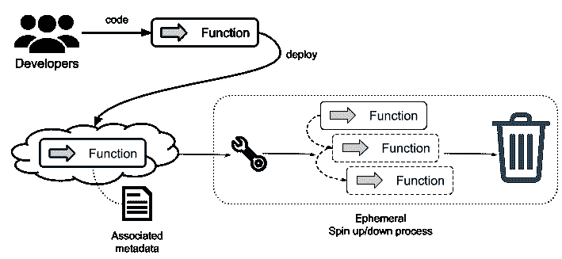

短暂的 FaaS 过程

使用 FaaS 方法实现代码将为您提供以下好处：

+   您不必担心主机配置

+   透明的按需扩展

+   自动启动/关闭

+   您只需为您使用的部分付费

# 关于无服务器架构的担忧

新的技术趋势有时会产生韧性和担忧，但它们也提供了实验和为应用程序和业务获益的机会。

服务器无架构涉及的最常见问题如下：

+   供应商锁定

+   安全性

+   框架支持

+   故障排除

# 供应商锁定

在供应商锁定方面，主要问题是无法将新服务作为供应商的无服务器架构的一部分。这个问题归结为对与云提供商绑定的恐惧。

建议尽可能使用您选择的云提供商的许多功能。您可以通过开始一个试点并评估云提供商来做到这一点；在将更多代码移至云之前，一定要创建一个利弊评估。

不要因为这个问题而放弃使用无服务器架构。相反，建议开始一个概念验证并评估云提供商。无服务器是一种新技术，将随着时间的推移而发展，有办法保持 FaaS 的独立性，例如使用 Spring Cloud 功能。我们将在本章的后面部分的一个示例中进行这方面的工作。

最后，您应该明白，从一个供应商转移到另一个供应商（从云到云）并不像过去（当我们将应用程序或传统代码转移到本地环境时）那么困难。

# 安全性

安全性是一个关键问题，与应用程序的架构无关，无服务器也不例外。由于我们在云中创建函数作为服务，我们需要在我们的身份验证、执行授权和 OWASP 方面小心。然而，在这种情况下，云提供商（如 AWS 或 Azure）为我们提供了开箱即用的指南和实践，以减少我们的担忧。

在无服务器中需要考虑的另一个安全问题是缺乏明确定义的安全边界。换句话说，当一个函数的安全边界结束并且另一个函数开始时，不同的云提供商提供不同的方法来使这些函数作为一个整体工作；例如，AWS 通过使用称为 API 网关的服务来实现这一点。这个 API 用于编排和组合创建的 FaaS。另一方面，正如一切都是短暂的一样，许多这些问题可能会消失，因为 FaaS 中的短暂概念是每次调用 FaaS 时都会创建、运行和销毁函数的请求都是隔离的。

为了澄清任何疑虑，我们将开始将部分代码移动到无服务器/函数即服务，创建一个实验性的开发，并在对该概念更有信心时逐步增加。

# 框架支持

有几个框架正在努力创建开发无服务器架构的环境，而不依赖于云提供商。根据我的经验，最好创建函数作为服务，尽可能地利用云平台。由于函数是具有清晰输入或输出的小段代码，最好使用您感到舒适的语言和技术，甚至尝试新技术或编程语言，以确定它们的优劣。

在这个阶段，无服务器支持多种语言来构建函数。目前，部署 FaaS 的最常见选项如下：

+   AWS Lamba

+   Azure 函数

+   Google 函数

Java 开发人员的一个好处是，大多数云提供商都支持 Java 作为一种编程语言来部署函数。此外，Spring Framework 有一个名为 Spring Functions 的项目，可以用来编写函数；我们将在本章后面使用这个项目来实现一些功能。

使用 Spring Functions 的一个好处是，我们可以在本地机器上开发和测试我们的代码，然后使用适配器包装代码，以便在云提供商上部署它。

# 故障排除

一旦应用程序（或在本例中的函数）部署到生产环境中，需要考虑的关键方面之一是如何跟踪、查找和修复错误。对于无服务器来说，这可能会很棘手，因为我们正在处理一个更为分隔的场景，我们的系统有一些未分成服务和微服务的小部分。几个函数是逻辑和代码的小部分。为了解决这个问题，每个云提供商都有工具来监视和跟踪函数，处理短暂环境中的错误。如果我们组合了几个函数的逻辑，我们将不得不应用聚合日志记录等技术，并使用工具来收集与执行的代码相关的信息。我们将在第十二章中审查一些处理这个概念的技术，*监控*。

# 示例和常见用例

即使无服务器架构为我们提供了许多好处，这些好处也不能应用于所有情况。当应用程序同时使用传统服务器（本地或基于云的）部署的后端和用于特定需求的 FaaS 或第三方服务时，使用混合模型是非常常见的。

无服务器架构可以应用于以下一些常见场景：

+   处理 webhooks

+   应该在特定情况下安排或触发的任务或工作

+   数据转换，例如：

+   图像处理、压缩或转换

+   语音数据转录成文本，比如 Alexa 或 Cortana

+   基于移动后端作为服务方法的移动应用程序的某种逻辑

+   单页应用程序

+   聊天机器人

另一方面，无服务器架构不适用于以下情况：

+   需要大量资源（如 CPU 和内存）的长时间运行的进程

+   任何阻塞进程

# 采用无服务器架构为 SPA 提供支持

**单页应用程序（SPA）**为采用无服务器架构方法提供了最适合的场景之一。毕竟，它们不涉及太多编码的业务逻辑，它们主要提供和消费由其他地方部署的服务提供的内容。

例如，假设我们需要构建一个应用程序来向用户发送世界杯比赛结果。在这个例子中，我们需要满足以下要求：

+   认证

+   数据存储

+   通知机制

采用无服务器架构方法，这些要求可以由以下服务提供商解决：

+   **认证**：Google OAuth

+   **数据存储**：Google Firebase

+   **通知机制**：

+   短信，使用 Twilio

+   电子邮件，使用 SparkPost

以下图表说明了如何将前述服务（Google OAuth、Firebase、Twilo 和 SparkPost）作为应用程序的一部分使用：

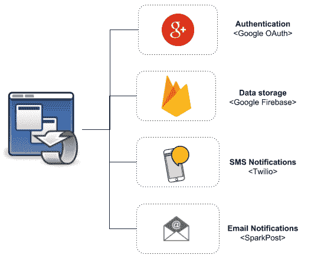

集成不同的第三方应用程序

前面的图表显示了一些最知名的服务提供商，但在互联网上还有很多其他选择。

前述服务的一个好处是它们都提供了一个可以直接从 SPA 中使用的 SDK 或库，包括常见的 JavaScript 库，如 Angular。

# 使用 Spring Cloud Functions 实现 FaaS

在 Spring 项目的支持下，您会发现 Spring Cloud Function 项目（[`cloud.spring.io/spring-cloud-function/`](https://cloud.spring.io/spring-cloud-function/)），它旨在使用无服务器架构模型实现应用程序。

使用 Spring Cloud Function，我们可以编写可以在支持 FaaS 的不同云提供商上启动的函数。无需从头学习新东西，因为 Spring Framework 的所有核心概念和主要功能，如自动配置、依赖注入和内置指标，都以相同的方式应用。

一旦函数编码完成，它可以部署为 Web 端点、流处理器，或者简单的任务，这些任务由特定事件触发或通过调度程序触发。

通过 SPA 的一个例子，我们可以使用第三方服务、现有的 REST API 和自定义函数来实现一个应用程序。以下图表说明了如何使用前面提到的所有选项来创建一个应用程序：

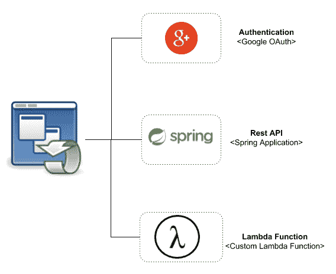

将 FaaS 集成到应用程序中

让我们来看看前面图表中的组件是如何工作的：

+   认证由第三方服务提供

+   应用程序使用驻留在 REST API 中的业务逻辑

+   自定义函数可以作为 SPA 的一部分使用

以下图表说明了函数的工作原理：

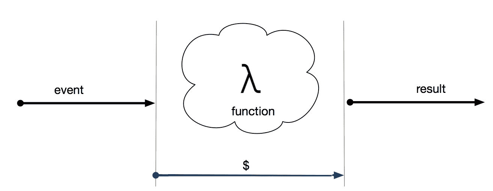

函数即服务

让我们来回顾图表的每个部分：

+   函数提供了一种使用事件驱动编程模型的方式。

+   我们可以以对开发人员透明的方式进行无限扩展。这种扩展将由我们用来部署函数的平台处理。

+   最后，我们只需支付函数在执行过程中消耗的时间和资源。

# 使用 Spring 的函数

Spring Cloud Function 为我们带来了四个主要功能，详细描述在官方文档中（[`github.com/spring-cloud/spring-cloud-function`](https://github.com/spring-cloud/spring-cloud-function)），这里值得一提：

+   它提供了包装`@Beans`类型的函数、消费者和供应商的能力。这使得可以将功能公开为 HTTP 端点，并通过监听器或发布者进行流消息传递，使用消息代理如 RabbitMQ、ActiveMQ 或 Kafka。

+   它提供了编译的字符串，这些字符串将被包装为函数体。

+   我们可以部署一个带有我们的函数的 JAR 文件，带有一个独立的类加载器，它将在单个 Java 虚拟机上运行。

+   它为支持无服务器架构的不同云提供商提供适配器，例如以下：

+   AWS Lambda

+   Open Whisk

+   Azure

# 编写示例

现在，我们将创建一个掩码银行帐户号码的函数。让我们从头开始创建一个新的 Spring Boot 应用程序，使用 Spring Initializr 网站（[`start.spring.io`](https://start.spring.io)）：

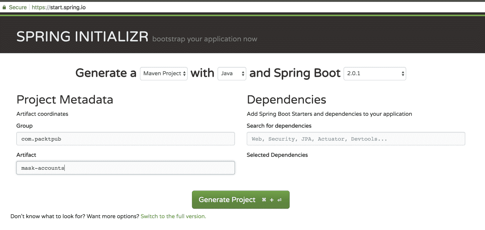

Spring Initializr 网站

目前，作为项目的一部分，不需要包含额外的依赖项。项目结构非常简单，如下所示：

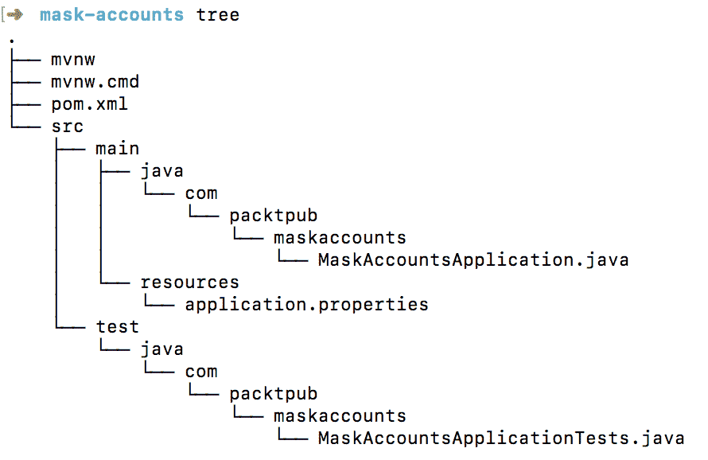

为了使用 Spring 编写函数，我们必须将 Spring Cloud Function 项目作为依赖项包含进来；首先，让我们添加一些属性来指定我们将要使用的版本，如下所示：

```java
  <parent>
      <groupId>org.springframework.boot</groupId>
      <artifactId>spring-boot-starter-parent</artifactId>
 <version>1.5.11.RELEASE</version>
      <relativePath/>
   </parent>

   <properties>
      <project.build.sourceEncoding>UTF-
      8</project.build.sourceEncoding>
      <project.reporting.outputEncoding>UTF-
      8</project.reporting.outputEncoding>
      <java.version>1.8</java.version>
      <spring-cloud-function.version>
        1.0.0.BUILD-SNAPSHOT
      </spring-cloud-function.version>
 <reactor.version>3.1.2.RELEASE</reactor.version>
 <wrapper.version>1.0.9.RELEASE</wrapper.version>
   </properties>
```

请注意，我们将将 Spring 版本降级为 1.5.11 RELEASE，因为 Spring Cloud Function 目前尚未准备好在 Spring Boot 2 中使用。

现在，我们将添加依赖项，如下所示：

```java
<dependency>
  <groupId>org.springframework.cloud</groupId>
  <artifactId>spring-cloud-starter-function-web</artifactId>
</dependency>
<dependency>
  <groupId>org.springframework.cloud</groupId>
  <artifactId>spring-cloud-function-compiler</artifactId>
</dependency>

```

然后，我们必须在依赖管理部分中添加一个条目，以便 Maven 自动解析所有传递依赖项：

```java
<dependencyManagement>
  <dependencies>
    <dependency>
      <groupId>org.springframework.cloud</groupId>
      <artifactId>spring-cloud-function-dependencies</artifactId>
      <version>${spring-cloud-function.version}</version>
      <type>pom</type>
      <scope>import</scope>
    </dependency>
  </dependencies>
</dependencyManagement>
```

最后，我们将包含一些插件，这些插件将允许我们通过将以下条目添加为`pom.xml`文件的一部分来包装编码的函数：

```java
<build>
  <plugins>
    <plugin>
      <groupId>org.apache.maven.plugins</groupId>
      <artifactId>maven-deploy-plugin</artifactId>
      <configuration>
        <skip>true</skip>
      </configuration>
    </plugin>
    <plugin>
      <groupId>org.springframework.boot</groupId>
      <artifactId>spring-boot-maven-plugin</artifactId>
      <dependencies>
        <dependency>
          <groupId>org.springframework.boot.experimental</groupId>
          <artifactId>spring-boot-thin-layout</artifactId>
          <version>${wrapper.version}</version>
        </dependency>
      </dependencies>
    </plugin>
  </plugins>
</build>

```

现在，我们已经准备好实现一个掩码帐户号码的函数。让我们回顾以下代码片段：

```java
package com.packtpub.maskaccounts;

import org.springframework.boot.SpringApplication;
import org.springframework.boot.autoconfigure.SpringBootApplication;
import org.springframework.cloud.function.context.FunctionScan;
import org.springframework.context.annotation.Bean;
import reactor.core.publisher.Flux;

import java.util.function.Function;

@FunctionScan
@SpringBootApplication
public class MaskAccountsApplication 
{
  public static void main(String[] args) {
    SpringApplication.run(MaskAccountsApplication.class, args);
  }

  @Bean
  public Function<Flux<String>, Flux<String>> maskAccounts() 
  {
 return flux -> 
    {
 return flux
      .map(value -> 
        value.replaceAll("\\w(?=\\w{4})", "*")
      );
 };
 }
}
```

`@FunctionScan`注释用于允许 Spring Function 适配器找到将部署为云提供商中的函数的 bean。

一旦函数编码完成，我们将使用`application.properties`文件进行注册，如下所示：

```java
spring.cloud.function.stream.default-route: maskAccounts
spring.cloud.function.scan.packages: com.packtpub.maskaccounts
```

现在，是时候使用以下步骤在本地执行函数了：

1.  生成 artifact：

```java
$ mvn install
```

1.  执行生成的 artifact：

```java
$ java -jar target/mask-accounts-0.0.1-SNAPSHOT.jar
```

现在，您应该看到类似以下的输出：

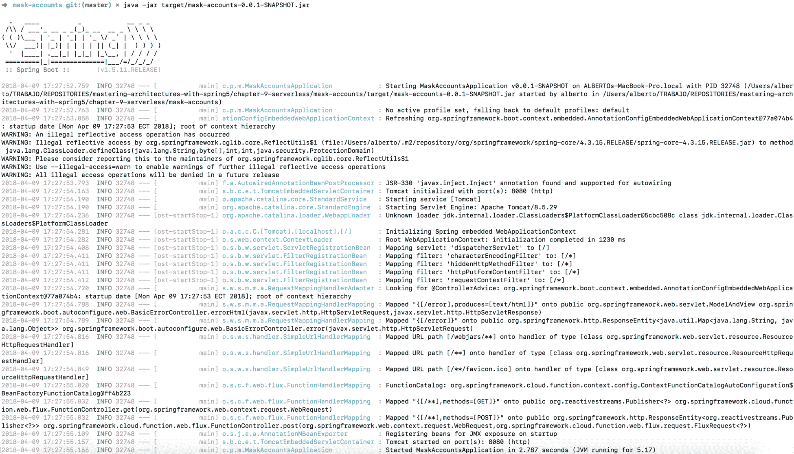

控制台输出

让我们尝试使用以下`CURL`命令执行函数：

```java
$ curl -H "Content-Type: text/plain" http://localhost:8080/maskAccounts -d 37567979
%****7979
```

因此，我们将获得一个掩码帐户号码：`****7979`。

在下一节中，我们将回顾如何使用不同的云提供商部署函数。

为了在任何云提供商上创建帐户，例如 AWS 或 Azure，您将需要信用卡或借记卡，即使提供商提供免费套餐也是如此。

# 适配器

Spring Cloud Function 为不同的云提供商提供适配器，以便使用函数部署编码的业务逻辑。目前，有以下云提供商的适配器：

+   AWS Lambda

+   Azure

+   Apache OpenWhisk

在下一节中，我们将介绍如何使用这些适配器。

# AWS Lambda 适配器

该项目旨在允许部署使用 Spring Cloud Function 的应用程序到 AWS Lambda（[`aws.amazon.com/lambda/`](https://aws.amazon.com/lambda/)）。

该适配器是 Spring Cloud Function 应用程序的一层，它使我们能够将我们的函数部署到 AWS 中。

您可以在 GitHub 上找到项目的源代码，链接如下：[`github.com/spring-cloud/spring-cloud-function/tree/master/spring-cloud-function-adapters/spring-cloud-function-adapter-aws`](https://github.com/spring-cloud/spring-cloud-function/tree/master/spring-cloud-function-adapters/spring-cloud-function-adapter-aws)

在使用 AWS Lambda 适配器之前，我们必须将其添加为项目的依赖项。让我们首先在`pom.xml`文件中定义一些属性：

```java
<aws-lambda-events.version>
    2.0.2
</aws-lambda-events.version>
<spring-cloud-stream-servlet.version>
    1.0.0.BUILD-SNAPSHOT
</spring-cloud-stream-servlet.version>
<start-class>
    com.packtpub.maskaccounts.MaskAccountsApplication
</start-class>
```

现在，我们必须为 AWS 添加所需的依赖项：

```java
<dependency>
      <groupId>org.springframework.cloud</groupId>
      <artifactId>spring-cloud-function-adapter-aws</artifactId>
</dependency>
<dependency>
      <groupId>com.amazonaws</groupId>
      <artifactId>aws-lambda-java-events</artifactId>
      <version>${aws-lambda-events.version}</version>
      <scope>provided</scope>
    </dependency>
<dependency>
      <groupId>com.amazonaws</groupId>
      <artifactId>aws-lambda-java-core</artifactId>
      <version>1.1.0</version>
      <scope>provided</scope>
</dependency>
```

现在，将其添加到`dependency`管理部分，如下所示：

```java
<dependency>
  <groupId>org.springframework.cloud</groupId>
  <artifactId>spring-cloud-stream-binder-servlet</artifactId>
  <version>${spring-cloud-stream-servlet.version}</version>
</dependency>
```

最后，将其添加到`plugin`部分，如下所示：

```java
<plugin>
  <groupId>org.apache.maven.plugins</groupId>
  <artifactId>maven-shade-plugin</artifactId>
  <configuration>
    <createDependencyReducedPom>false</createDependencyReducedPom>
    <shadedArtifactAttached>true</shadedArtifactAttached>
    <shadedClassifierName>aws</shadedClassifierName>
  </configuration>
</plugin>
```

接下来，我们将编写一个作为 AWS 适配器工作的类。该适配器应该扩展`SpringBootRequestHandler`类，如下所示：

```java
package com.packtpub.maskaccounts;

public class Handler 
    extends SpringBootRequestHandler<Flux<String>, Flux<String>> {

}
```

一旦适配器编写完成，我们将需要修改先前实现的函数作为`MaskAccountsApplication.java`文件的一部分。在这里，我们将更改方法的名称为`function`，函数的输入和输出将是具有 setter 和 getter 的**普通旧 Java 对象（POJOs）**，如下所示：

```java
package com.packtpub.maskaccounts;

import org.springframework.boot.SpringApplication;
import org.springframework.boot.autoconfigure.SpringBootApplication;
import org.springframework.cloud.function.context.FunctionScan;
import org.springframework.context.annotation.Bean;

import java.util.function.Function;

@FunctionScan
@SpringBootApplication
public class MaskAccountsApplication {

    public static void main(String[] args) {
        SpringApplication.run(MaskAccountsApplication.class, args);
    }

    @Bean
    public Function<In, Out> function() {
            return value -> new Out(value.mask());
    }
}

class In {

    private String value;

    In() {
    }

    public In(String value) {
        this.value = value;
    }

    public String mask() {
        return value.replaceAll("\\w(?=\\w{4})", "*");
    }

    public String getValue() {
        return value;
    }

    public void setValue(String value) {
        this.value = value;
    }
}

class Out {

    private String value;

    Out() {
    }

    public Out(String value) {
        this.value = value;
    }

    public String getValue() {
        return value;
    }

    public void setValue(String value) {
        this.value = value;
    }
}
```

为了包装编码的函数，我们必须创建一个 JAR 文件，使用以下 Maven 目标：

```java
$ mvn clean package
```

一旦 JAR 文件创建完成，我们可以使用 AWS 提供的**命令行界面（CLI）**（[`aws.amazon.com/cli/`](https://aws.amazon.com/cli/)）上传生成的 JAR 文件，运行以下命令：

```java
$ aws lambda create-function --function-name maskAccounts --role arn:aws:iam::[USERID]:role/service-role/[ROLE] --zip-file fileb://target/mask-accounts-aws-0.0.1-SNAPSHOT-aws.jar --handler org.springframework.cloud.function.adapter.aws.SpringBootStreamHandler --description "Spring Cloud Function Adapter for packt Mastering Architecting Spring 5" --runtime java8 --region us-east-1 --timeout 30 --memory-size 1024 --publish
```

`[USERID]`引用基于您的 AWS 账户和`[ROLE]`引用。如果您对如何创建 AWS 账户有任何疑问，请访问[`aws.amazon.com/premiumsupport/knowledge-center/create-and-activate-aws-account/`](https://aws.amazon.com/premiumsupport/knowledge-center/create-and-activate-aws-account/)。 

有关 AWS lambda `create-function`的更多信息，请参阅[`docs.aws.amazon.com/cli/latest/reference/lambda/create-function.html`](https://docs.aws.amazon.com/cli/latest/reference/lambda/create-function.html)。

如果您没有设置 AWS 账户的凭据，您将收到一个错误消息，指出*无法找到凭据。*您可以通过运行`aws configure`命令来配置凭据。

不要忘记，您需要创建一个具有权限运行 AWS Lambda 的角色的 AWS 用户。

一旦函数成功部署，您将在控制台中看到类似以下的输出：

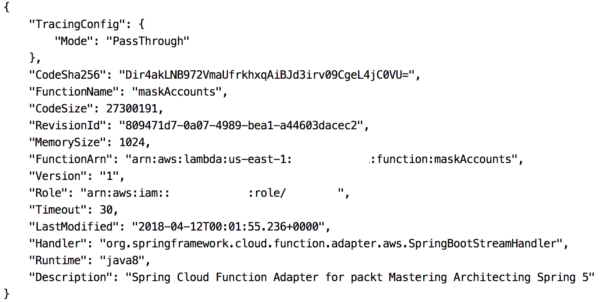

输出处理

最近部署的函数现在将在 AWS Lambda 控制台中列出，如下所示：

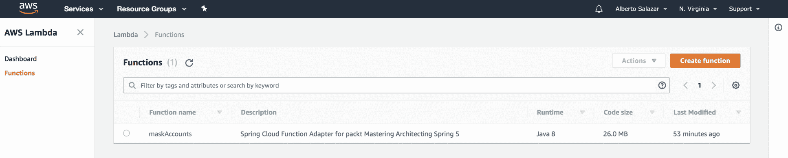

AWS Lambda 控制台

如果您在 Web 控制台中看不到最近部署的函数，则必须检查创建函数的位置。在本例中，我们使用`us-east-1`地区，这意味着函数部署在北弗吉尼亚。您可以在 AWS Lambda 控制台顶部的名称旁边检查此值。

最后，我们将在 AWS Lambda 控制台中测试我们的结果。在测试部分，创建一些输入以进行蒙版处理，如下所示：

```java
{"value": "37567979"}
```

预期结果如下：

```java
{"value": "****7979"}
```

在 AWS 控制台中，您将看到以下结果：

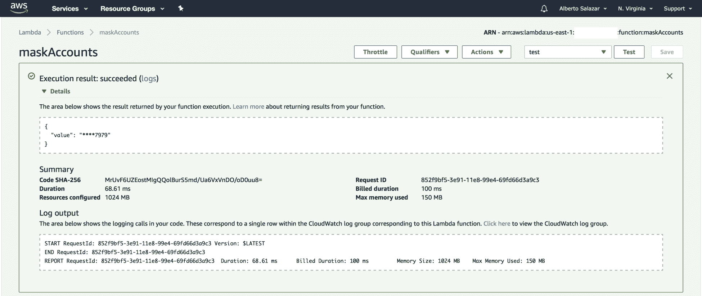

maskAccount 函数的 AWS 控制台测试结果

# Azure 适配器

在本节中，我们将回顾如何将先前编码的函数部署到 Azure，这是 Microsoft 支持的云提供商。Azure 通过使用 Microsoft Azure Functions（[`azure.microsoft.com/en-us/services/functions/`](https://azure.microsoft.com/en-us/services/functions/)）支持函数。

Azure 适配器是在 Spring Cloud Function 项目上编写的一层。您可以在 GitHub 上找到该项目的源代码（[`github.com/spring-cloud/spring-cloud-function/tree/master/spring-cloud-function-adapters/spring-cloud-function-adapter-azure`](https://github.com/spring-cloud/spring-cloud-function/tree/master/spring-cloud-function-adapters/spring-cloud-function-adapter-azure)）。

让我们首先将以下属性添加为`pom.xml`文件的一部分，在属性部分：

```java
<functionAppName>function-mask-account-azure</functionAppName><functionAppRegion>westus</functionAppRegion>
<start-class>
    com.packtpub.maskaccounts.MaskAccountsApplication
</start-class>
```

现在，让我们添加此适配器所需的依赖项，如下所示：

```java
<dependency>
  <groupId>org.springframework.cloud</groupId>
  <artifactId>spring-cloud-function-adapter-azure</artifactId>
</dependency>
<dependency>
  <groupId>org.springframework.cloud</groupId>
  <artifactId>spring-cloud-starter-function-web</artifactId>
  <scope>provided</scope>
</dependency>
<dependency>
  <groupId>com.microsoft.azure</groupId>
  <artifactId>azure-functions-java-core</artifactId>
  <version>1.0.0-beta-2</version>
  <scope>provided</scope>
</dependency>
```

然后，我们将添加一些插件以允许适配器工作，如下所示：

```java
<plugin>
  <groupId>com.microsoft.azure</groupId>
  <artifactId>azure-functions-maven-plugin</artifactId>
  <configuration>
    <resourceGroup>java-functions-group</resourceGroup>
    <appName>${functionAppName}</appName>
    <region>${functionAppRegion}</region>
    <appSettings>
      <property>
        <name>FUNCTIONS_EXTENSION_VERSION</name>
        <value>beta</value>
      </property>
    </appSettings>
  </configuration>
</plugin>
<plugin>
  <artifactId>maven-resources-plugin</artifactId>
  <executions>
    <execution>
      <id>copy-resources</id>
      <phase>package</phase>
      <goals>
        <goal>copy-resources</goal>
      </goals>
      <configuration>
        <overwrite>true</overwrite>
        <outputDirectory>${project.build.directory}/azure-
        functions/${functionAppName}
        </outputDirectory>
        <resources>
          <resource>
            <directory>${project.basedir}/src/main/azure</directory>
            <includes>
              <include>**</include>
            </includes>
          </resource>
        </resources>
      </configuration>
    </execution>
  </executions>
</plugin>
<plugin>
  <groupId>org.apache.maven.plugins</groupId>
  <artifactId>maven-shade-plugin</artifactId>
  <configuration>
    <createDependencyReducedPom>false</createDependencyReducedPom>
    <shadedArtifactAttached>true</shadedArtifactAttached>
    <shadedClassifierName>azure</shadedClassifierName>
    <outputDirectory>${project.build.directory}/azure-
    functions/${functionAppName}</outputDirectory>
  </configuration>
</plugin>
<plugin>
  <groupId>org.apache.maven.plugins</groupId>
  <artifactId>maven-assembly-plugin</artifactId>
  <executions>
    <execution>
      <id>azure</id>
      <phase>package</phase>
      <goals>
        <goal>single</goal>
      </goals>
      <inherited>false</inherited>
      <configuration>
        <attach>false</attach>
        <descriptor>${basedir}/src/assembly/azure.xml</descriptor>
        <outputDirectory>${project.build.directory}/azure- 
        functions</outputDirectory>
        <appendAssemblyId>false</appendAssemblyId>
        <finalName>${functionAppName}</finalName>
      </configuration>
    </execution>
  </executions>
</plugin>
```

最后，我们将创建一个适配器，该适配器应该扩展自`AzureSpringBootRequestHandler`类。扩展类将为我们提供输入和输出类型，使 Azure 函数能够检查类并执行任何 JSON 转换以消耗/生成数据：

```java
public class Handler 
    extends AzureSpringBootRequestHandler<Flux<String>,Flux<String>> {

    public Flux<String> execute
                    (Flux<String>in, ExecutionContext context) {
        return handleRequest(in, context);
    }
}
```

现在，我们将修改`MaskAccountsApplication.java`文件中的编码函数；我们将更改函数的输入和输出，以便使用具有 setter 和 getter 的普通旧 Java 对象：

```java
package com.packtpub.maskaccounts;

import org.springframework.boot.SpringApplication;
import org.springframework.boot.autoconfigure.SpringBootApplication;
import org.springframework.cloud.function.context.FunctionScan;
import org.springframework.context.annotation.Bean;

import java.util.function.Function;

@FunctionScan
@SpringBootApplication
public class MaskAccountsApplication {

    public static void main(String[] args) {
        SpringApplication.run(MaskAccountsApplication.class, args);
    }

    @Bean
    public Function<In, Out> maskAccount() {
            return value -> new Out(value.mask());
    }
}

class In {

    private String value;

    In() {
    }

    public In(String value) {
        this.value = value;
    }

    public String mask() {
        return value.replaceAll("\\w(?=\\w{4})", "*");
    }

    public String getValue() {
        return value;
    }

    public void setValue(String value) {
        this.value = value;
    }
}

class Out {

    private String value;

    Out() {
    }

    public Out(String value) {
        this.value = value;
    }

    public String getValue() {
        return value;
    }

    public void setValue(String value) {
        this.value = value;
    }
}
```

然后我们必须为 Azure 工具创建一个 JSON 配置，因此我们将在`src/main`文件夹后面的新文件夹中创建一个名为`function.json`的 JSON 文件，文件名为函数（`maskAccount`）。此文件将用于让 Azure 了解我们要部署的函数，通过指定将用作入口点的 Java 类。`src`文件夹应如下所示：

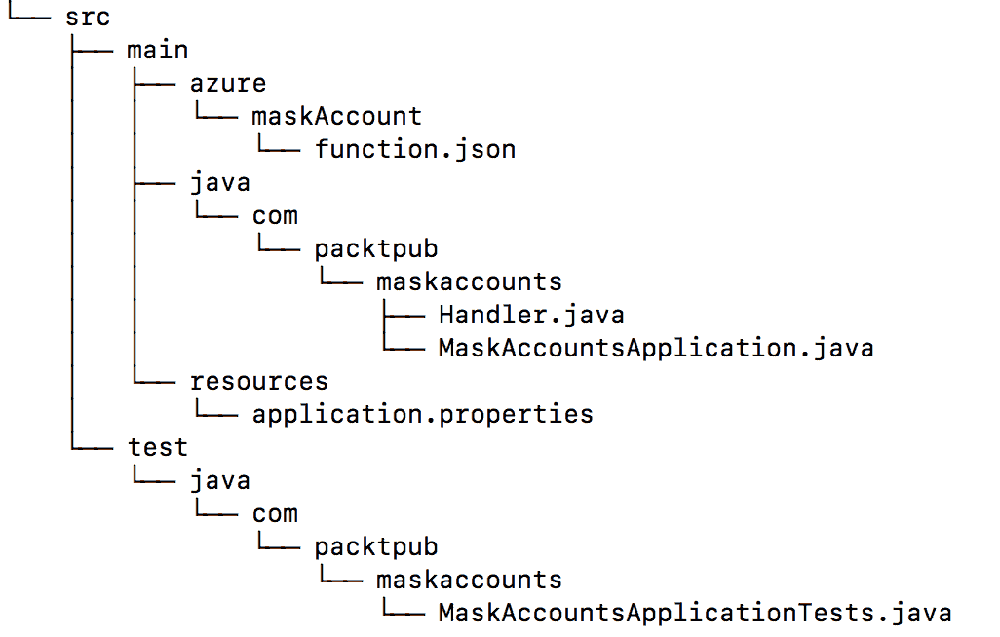

`function.json`文件的内容将如下所示：

```java
{
   "scriptFile": "../mask-accounts-azure-1.0.0.BUILD-SNAPSHOT-azure.jar",
   "entryPoint": "com.packtpub.maskaccounts.Handler.execute",
"bindings": [
 {
 "type": "httpTrigger",
 "name": "in",
 "direction": "in",
 "authLevel": "anonymous",
 "methods": [
 "get",
 "post"
 ]
 },
 {
 "type": "http",
 "name": "$return",
 "direction": "out"
 }
 ],
 "disabled": false
}
```

可以使用 Maven 插件为非 Spring 函数创建 JSON 文件，但是该工具与当前版本的适配器不兼容。

在生成将要部署的构件之前，我们必须创建一个`assembly`文件，这是我们正在使用的 Azure Maven 插件所需的。

`assembly`文件应放在`src/assembly`目录中；文件将被命名为`azure.xml`，并包含以下内容：

```java
<assembly
   xmlns="http://maven.apache.org/plugins/maven-assembly-plugin/assembly/1.1.3"
   xmlns:xsi="http://www.w3.org/2001/XMLSchema-instance"
   xsi:schemaLocation="http://maven.apache.org/plugins/maven-assembly-plugin/assembly/1.1.3 http://maven.apache.org/xsd/assembly-1.1.3.xsd">
   <id>azure</id>
   <formats>
      <format>zip</format>
   </formats>
   <baseDirectory></baseDirectory>
   <fileSets>
      <fileSet>
         <directory>${project.build.directory}/azure-functions/${functionAppName}</directory>
         <outputDirectory></outputDirectory>
         <includes>
            <include>*-azure.jar</include>
            <include>**/*.json</include>
         </includes>
      </fileSet>
   </fileSets>
</assembly>
```

现在，可以使用以下 Maven 目标创建 JAR 文件：

```java
$ mvn clean package
```

该函数可以在本地部署进行测试，通过使用以下命令将 JAR 文件作为常规 Java 应用程序运行：

```java
$ java -jar target/mask-accounts-azure-0.0.1-SNAPSHOT.jar
```

然后您将看到应用程序正在运行，如下所示：

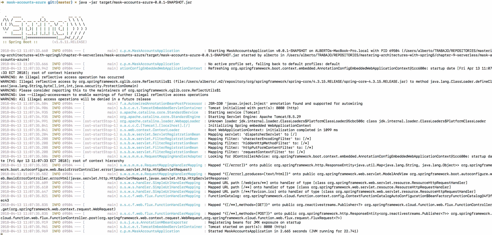

本地运行的 Spring 应用程序的输出

让我们尝试使用以下`curl`命令来测试该功能：

```java
$ curl -H "Content-Type: text/plain" localhost:8080/maskAccount -d '{"value": "37567979"}'
```

您将看到以下输出：

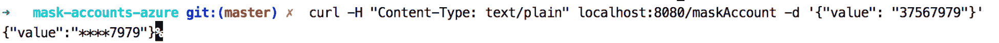

或者，我们可以使用 Azure Functions Core Tools 将我们的函数部署到 Azure。

要做到这一点，首先，您必须使用提供在[`github.com/azure/azure-functions-core-tools#installing`](https://github.com/azure/azure-functions-core-tools#installing)上的信息安装所有所需的工具。安装了所需的工具后，您可以使用终端中的以下命令登录到 Azure：

```java
$ az login
```

在输入了您的凭据之后，您将在控制台上看到以下输出：

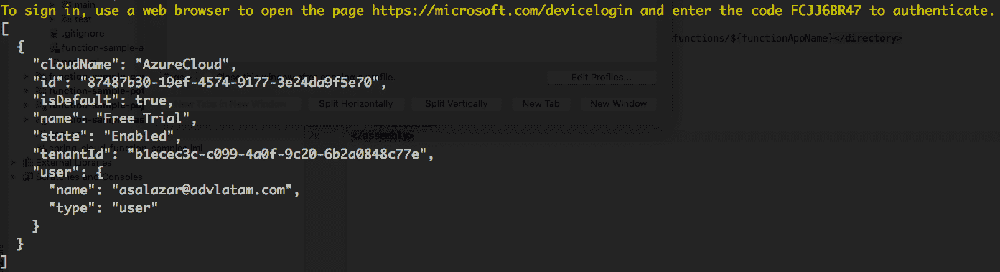

将编码的函数部署到 Azure 非常简单；您只需执行以下 Maven 命令：

```java
$ mvn azure-functions:deploy
```

现在，您可以使用以下`curl`命令尝试部署的函数：

```java
$ curl https://<azure-function-url-from-the-log>/api/maskAccount -d '{"value": "37567979"}'
```

`<azure-function-url-from-the-log>`是在运行`mvn azure-functions:deploy`命令后获得的 URL。例如，在以下屏幕截图中，您可以看到`https://function-mask-account-azure.azurewebsites.net/`URL：

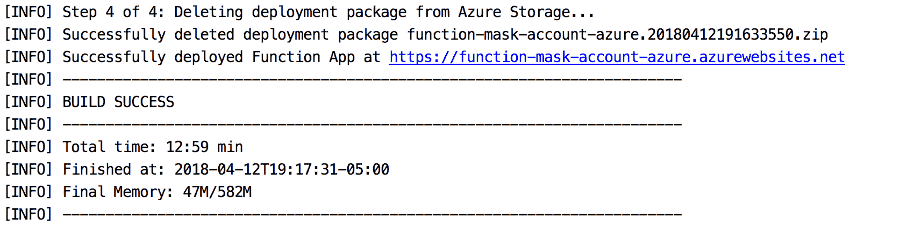

执行`curl`命令后，收到的输出将如下所示：


输出处理

我们还可以在 Azure Functions 控制台上测试相同的函数，就像我们在 AWS Lambda 上做的那样。

# 总结

在本章中，我们讨论了无服务器架构背后的概念。您了解了如何使用 Spring Cloud Functions 实现函数，并且我们回顾了可以用于在不同云提供商（如 AWS Lambda 和 Microsoft Azure Functions）部署函数的适配器。

在下一章中，我们将描述容器是什么，以及您如何使用它们来容器化应用程序。
