# 第十章：将应用程序容器化

容器正在成为软件开发的关键因素之一，改变了开发人员编写和部署 IT 系统的方式。主要用于解决与设置环境相关的问题。

当你需要管理多个容器和多实例环境时，使用容器可能会让人感到不知所措。然而，一些非常酷的工具已经发布，旨在完成这些容器编排任务。在本章中，我们将一起看看这些工具，以及以下主题：

+   **容器**：

+   基本概念

+   基本命令

+   构建你自己的镜像

+   **容器化应用程序**：Docker Gradle 插件

+   **注册表**：发布镜像

+   **配置多容器环境**：Docker Compose

+   **使用 Kubernetes 进行容器编排**：

+   Pods

+   标签

+   复制控制器

+   服务

# 容器

容器提供了一种轻量级的虚拟化方法，它提供了应用程序运行所需的最低限度。在过去，虚拟机曾经是设置环境和运行应用程序的主要选择。然而，它们需要完整的操作系统才能工作。另一方面，容器重用主机操作系统来运行和配置所需的环境。让我们通过查看下图来更多地了解这个概念：

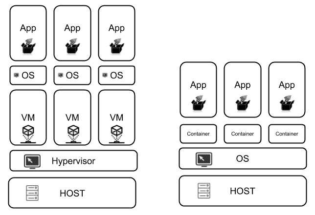

虚拟机和容器

在上图中，我们可以看到左侧是**虚拟机**（**VMs**），右侧是**容器**。让我们从学习虚拟机是如何工作开始。

虚拟机需要使用分配给虚拟机的硬件的自己的操作系统，这由 hypervisor 支持。上图显示了三个虚拟机，这意味着我们需要安装三个操作系统，每个虚拟机一个。当你在虚拟机中运行应用程序时，你必须考虑应用程序和操作系统将消耗的资源。

另一方面，容器使用主机操作系统提供的内核，还使用虚拟内存支持来隔离所有容器的基本服务。在这种情况下，不需要为每个容器安装整个操作系统；这是一种在内存和存储使用方面非常有效的方法。当你使用容器运行应用程序时，你只需要考虑应用程序消耗的资源。

容器体积小，可以用几十兆来衡量，只需要几秒钟就可以被配置。相比之下，虚拟机的体积以几十 GB 来衡量，但它们甚至需要几分钟才能开始工作。你还需要考虑操作系统许可证费用——当你使用虚拟机时，你必须为每个安装的操作系统付费。使用容器时，你只需要一个操作系统，所有容器都将使用它来运行。

市场上目前有不同的容器可用，但 Docker 是目前最流行的实现。因此，我们将选择这个选项来解释本章中的所有概念。

# 基本概念

在本节中，我们将回顾一些基本概念和命令，这些命令你在日常使用中会经常用到。这应该有助于你理解本章的其余内容。

# 容器和镜像

谈到 Docker 时，人们经常使用*容器*和*镜像*这两个术语。这两个术语之间的区别很简单：容器是镜像的一个实例，而镜像是一个不可变的文件，本质上是容器的快照。从**面向对象编程**（**OOP**）的角度来看，我们可以说镜像就像类，容器是这些类的实例。例如，假设你有一个由 CentOS 和 Java 8 组成的 Docker 镜像。使用这个镜像，你可以创建一个容器来运行一个 Spring Boot 应用程序，另一个容器来运行一个 JEE 应用程序，如下图所示：

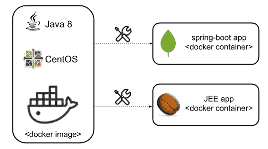

Docker 镜像和容器

# 基本命令

Docker 有一大堆命令来执行使用容器和镜像的不同操作。然而，并不需要熟悉所有这些命令。我们现在将回顾一些你需要了解的最常用的命令。

# 运行容器

我们之前提到过，容器是镜像的实例。当你想要运行一个 Docker 容器时，你可以使用以下命令：

```java
docker run IMAGE_NAME
```

互联网上有大量的 Docker 镜像可用。在创建自定义镜像之前，你应该首先查看 Docker Hub 上可用的镜像列表（[`hub.docker.com/`](https://hub.docker.com/)）。

Docker Hub 是一个基于云的注册服务，允许你链接到代码仓库，构建你的镜像并对其进行测试。它还存储手动推送的镜像，并链接到 Docker Cloud，以便你可以将镜像部署到你的主机上。Docker Hub 为容器和镜像的发现、分发和变更管理；用户和团队协作；以及整个开发流程中的工作流自动化提供了一个集中的资源。

让我们假设你想要使用`nginx`运行一个容器。在这种情况下，你只需要在终端中执行以下命令：

```java
docker run nginx
```

运行这个命令后，Docker 将尝试在本地找到镜像。如果它找不到，它将在所有可用的注册表中查找镜像（我们稍后会谈论注册表）。在我们的情况下，这是 Docker Hub。你在终端中应该看到的第一件事是类似于以下内容的输出：

```java
⋊> ~ docker run nginx
 Unable to find image 'nginx:latest' locally
 latest: Pulling from library/nginx
 f2aa67a397c4: Downloading [==================================> ] 15.74MB/22.5MB
 3c091c23e29d: Downloading [=======> ] 3.206MB/22.11MB
 4a99993b8636: Download complete
```

执行这个操作后，你将得到一个类似于`d38bbaffa51cdd360761d0f919f924be3568fd96d7c9a80e7122db637cb8f374`的字符串，它代表了镜像 ID。

一些用于运行容器的有用标志如下：

+   `-d`标志将镜像作为守护进程运行

+   `-p`标志将镜像端口连接到主机

例如，以下命令可以让你将`nginx`作为守护进程运行，并将容器的端口`80`映射到主机的端口`32888`：

```java
docker run -p 32888:80 -d nginx
```

现在你将再次控制终端，并且你可以在`http://localhost:32888/`URL 中看到`nginx`的主页，如下截图所示：

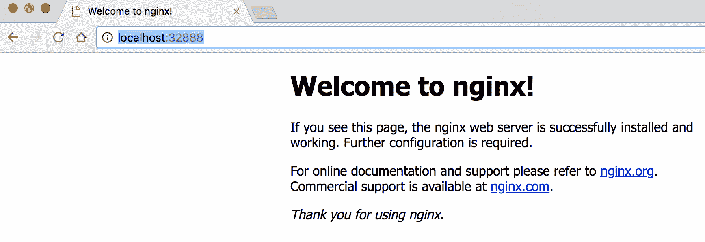

Nginx 主页

容器只包含软件和服务，这些软件和服务对它们的工作是绝对必要的，这就是为什么你会发现它们甚至不包括 SSH 入口。如果你想进入一个容器，你可以使用`-it`标志，在容器内执行命令如下：

```java
⋊> ~ docker run -it nginx /bin/bash
# Now you're inside the container here
root@0c546aef5ad9:/#
```

# 使用容器

如果你有兴趣检查主机上运行的所有容器，你可以使用以下`ps`命令：

```java
docker ps
```

上面的命令将列出主机上运行的所有容器。如果你还想检查那些没有运行的镜像，你可以使用`-a`标志。执行上面的命令后，你将在终端中得到一个类似于以下截图的输出：

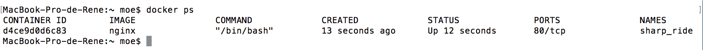

Docker ps 命令输出

前面截图的第一列解释了以下列表中的信息。这个输出中最有用的部分是 CONTAINER ID，它可以用来执行以下操作：

+   重新启动容器：

```java
docker restart <CONTAINER ID> 
```

+   停止容器：

```java
docker stop <CONTAINER ID> 
```

+   启动容器：

```java
docker start <CONTAINER ID> 
```

+   删除容器：

```java
docker rm <CONTAINER ID>
```

这些是最常用的命令，它们提供了你在使用 Docker 容器时所需要的一切。

# 使用镜像

Docker 还有一些命令，允许你的系统与镜像一起工作。最常用的命令如下：

+   列出主机上所有可用的镜像：

```java
⋊> ~ docker images
REPOSITORY TAG IMAGE ID CREATED SIZE
nginx latest ae513a47849c 4 weeks ago 109MB
```

+   删除镜像：

```java
⋊> ~ docker rmi nginx
Untagged: nginx:latest
Untagged: nginx@sha256:0fb320e2a1b1620b4905facb3447e3d84ad36da0b2c8aa8fe3a5a81d1187b884
Deleted: sha256:ae513a47849c895a155ddfb868d6ba247f60240ec8495482eca74c4a2c13a881
Deleted: sha256:160a8bd939a9421818f499ba4fbfaca3dd5c86ad7a6b97b6889149fd39bd91dd
Deleted: sha256:f246685cc80c2faa655ba1ec9f0a35d44e52b6f83863dc16f46c5bca149bfefc
Deleted: sha256:d626a8ad97a1f9c1f2c4db3814751ada64f60aed927764a3f994fcd88363b659
```

+   下载镜像：

```java
⋊> ~ docker pull <IMAGE NAME>
```

# 构建你自己的镜像

在互联网上，我们可以找到许多准备好使用的 Docker 镜像。这些镜像是使用一个名为 Dockerfile 的配置文件创建的，它包含了为容器进行配置的所有指令。

作为这个文件的一部分，你会发现以下常用命令：

+   `FROM`

+   `MAINTAINER`

+   `RUN`

+   `ENV`

+   `EXPOSE`

+   `CMD`

让我们逐个审查所有这些命令，以了解它们的工作原理。

# FROM 命令

`FROM`命令用于指定 Dockerfile 将用于构建新镜像的基础 Docker 镜像。例如，如果您想基于 Debian 创建自定义镜像，您应该在文件中添加以下行：

```java
FROM debian:stretch-slim 
```

# MAINTAINER 命令

`MAINTAINER`命令完全用于文档目的，其中包含了 Dockerfile 的作者姓名以及他们的电子邮件，如下所示：

```java
MAINTAINER  Your Name <your@email.com>
```

# RUN 命令

Dockerfile 通常有多个`RUN`命令作为其一部分。这些命令旨在作为系统 bash 命令的一部分执行，并主要用于安装软件包。例如，以下`RUN`命令用于安装 Java 8：

```java
RUN \ 
 echo oracle-java8-installer shared/accepted-oracle-license-v1-1 
 select true | debconf-set-selections && \ 
 add-apt-repository -y ppa:webupd8team/java && \ 
 apt-get update && \ 
 apt-get install -y oracle-java8-installer && \ 
 rm -rf /var/lib/apt/lists/* && \ 
 rm -rf /var/cache/oracle-jdk8-installer
```

上述命令取自名为`oracle-java8`的镜像提供的 Dockerfile（[`github.com/dockerfile/java/blob/master/oracle-java8/Dockerfile`](https://github.com/dockerfile/java/blob/master/oracle-java8/Dockerfile)）。

这个命令很容易阅读，每一行描述了安装过程是如何进行的。最后两行从容器中删除了一些不再需要的目录。

所有安装都是作为单行完成的，因为每个`RUN`命令生成一个新的层。例如，在`RUN`命令中，我们可以看到一次执行了六条指令。如果我们逐条运行这些指令，最终会得到六个镜像，每个镜像都包含了基础镜像以及执行的`RUN`命令。我们不会在本书中详细讨论层，但如果您感到好奇，我强烈鼓励您阅读有关它们的内容：[`docs.docker.com/storage/storagedriver/#images-and-layers`](https://docs.docker.com/storage/storagedriver/#images-and-layers)。

# ENV 命令

`ENV`命令用于在系统中创建环境变量。以下`ENV`命令作为前面提到的 Dockerfile 的一部分，用于定义`JAVA_HOME`变量：

```java
ENV JAVA_HOME /usr/lib/jvm/java-8-oracle
```

# EXPOSE 命令

`EXPOSE`命令定义了我们将从容器中公开的端口。例如，如果您想公开端口`80`和`32777`，您需要在 Dockerfile 中添加以下行：

```java
EXPOSE 80 32777
```

# CMD 命令

`CMD`命令用于指定容器启动后应执行的命令。例如，如果要使用标准的`java -jar`命令运行 Java 应用程序，需要在文件中添加以下行：

```java
CMD java - jar your-application.jar
```

完成 Dockerfile 后，应该运行`build`命令在本地创建镜像，如下所示：

```java
docker build -t <docker-image-name>
```

# 容器化应用程序

一个 docker 化的应用程序是一个基本的可部署单元，可以作为整个应用程序生态系统的一部分进行集成。当您将应用程序 docker 化时，您将不得不创建自己的 Dockerfile，并包含所有必需的指令来使您的应用程序工作。

在上一节中，我们提到，可以使用`FROM`命令使用现有的基础镜像创建一个容器。您还可以复制基础镜像的 Dockerfile 内容，但这种做法是不鼓励的，因为在创建镜像时已经编写了代码，复制代码是没有意义的。

强烈建议您在 DockerHub 中找到官方镜像。由于 Dockerfile 可用，您应该始终阅读它以避免安全问题，并充分了解镜像的工作原理。

在将应用程序 docker 化之前，重要的是要使系统使用环境变量而不是配置文件。这样，您可以创建可以被其他应用程序重用的镜像。使用 Spring Framework 的最大优势之一是能够使用不同的方法来配置您的应用程序。这是我们在第八章中所做的，*微服务*，当时我们使用配置服务器来集中所有应用程序配置。Spring 使我们能够使用本地配置文件作为应用程序的一部分，并且我们可以稍后使用环境变量覆盖这些配置值。

现在让我们看看如何将 Spring Boot 应用程序 docker 化。

在第一步中，我们将创建 Dockerfile 来运行我们的应用程序。该文件的内容如下所示：

```java
FROM java:8 
WORKDIR / 
ARG JAR_FILE 
COPY ${JAR_FILE} app.jar 
EXPOSE 8080 
ENTRYPOINT ["java","-jar","app.jar"]
```

让我们简要回顾一下 Dockerfile 中列出的命令：

| **命令** | **描述** |
| --- | --- |
| `FROM java:8` | 使用基本的`java:8`镜像 |
| `WORKDIR` | 镜像文件系统中的默认目录 |
| `ARG` | 我们将使用一个参数来指定 JAR 文件 |
| `COPY` | 提供的文件将被复制到容器中作为`app.jar` |
| `EXPOSE` | 容器的端口 8080 被暴露 |
| `ENTRYPOINT` | 在容器内运行 Java 应用程序 |

这个 Dockerfile 应该位于项目的根目录。以下截图显示了项目的布局：

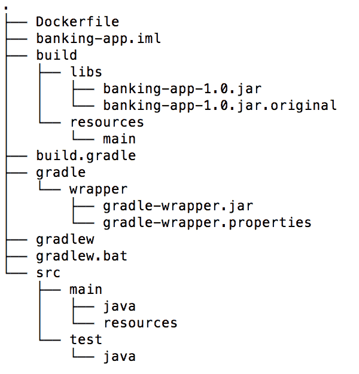

项目布局

应用程序 JAR 位于`PROJECT/build/libs`目录下。通过使用 Gradle wrapper 运行`bootRepackage`任务生成此构件，如下所示：

```java
./gradlew clean bootRepackage
```

一旦构件被创建，就该是时候通过运行以下命令来创建 Docker 镜像了：

```java
$ docker build -t spring-boot:1.0 . --build-arg JAR_FILE=build/libs/banking-app-1.0.jar
```

一旦命令完成，镜像应该存在于本地。您可以通过运行`docker images`命令来检查：

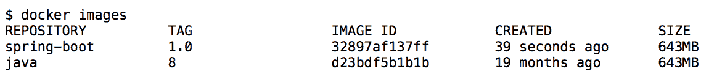

Docker 镜像控制台输出

请注意，`java`镜像也存在。这是在`spring-boot`镜像构建过程中下载的。然后，我们可以通过运行以下命令创建一个使用最近创建的镜像的容器：

```java
$ docker run -p 8081:8080 -d --name banking-app spring-boot:1.0
```

您现在可以访问部署在容器中的应用程序，网址为`http://localhost:8081/index`。以下截图显示了这个应用程序：

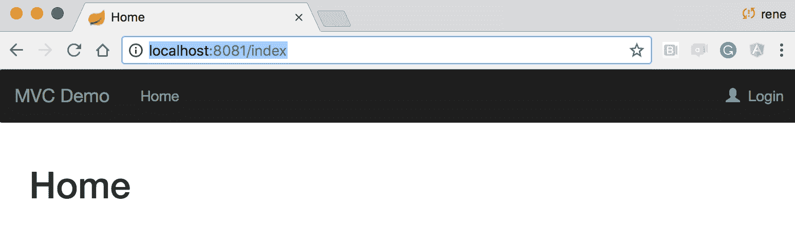

应用程序部署在容器中

镜像的构建过程可以并且应该使用您喜欢的构建工具进行自动化。Gradle 和 Maven 都有插件可以作为应用程序的一部分集成。让我们看看如何为这个任务集成 Gradle 插件。

# Docker Gradle 插件

即使生成 Docker 镜像时，使用 Docker 命令并不难或复杂；尽可能自动化所有这些步骤总是一个好主意。Docker Gradle 插件非常有用，可以完成这个任务。让我们学习如何将其作为应用程序的一部分。

首先，我们需要在`buildscript`部分内包含包含插件的仓库和插件本身作为依赖项，如下所示：

```java
buildscript 
{
  ...
  repositories 
  {
    ...
    maven 
    {
      url "https://plugins.gradle.org/m2/"
    }
  }
  dependencies 
  {
    ...
    classpath('gradle.plugin.com.palantir.gradle.docker:gradledocker:
    0.13.0')
  }
}
```

稍后，插件应该以与任何其他插件相同的方式应用到项目中——使用其 ID。这在以下代码中显示：

```java
apply plugin: 'com.palantir.docker'
```

可以使用官方文档中描述的参数来自定义镜像构建过程，网址为[`github.com/palantir/gradle-docker`](https://github.com/palantir/gradle-docker)。为了简化，我们只会在`docker`块中指定所需的镜像名称，如下所示：

```java
docker 
{
  name "enriquezrene/spring-boot-${jar.baseName}:${version}"
  files jar.archivePath
  buildArgs(['JAR_FILE': "${jar.archiveName}"])
}
```

正如你可能已经注意到的那样，我们现在正在使用`build.gradle`文件中可用的变量，比如生成的 JAR 名称及其版本。

现在插件已经完全集成到项目中，您可以通过运行以下 Gradle 任务来构建镜像：

```java
$ ./gradlew build docker
```

您还可以检查最近创建的镜像，如下屏幕截图所示：

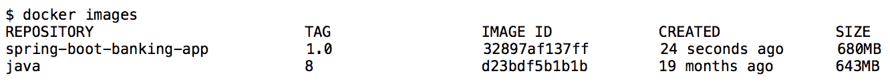

docker 镜像控制台输出

将所有这些步骤自动化是个好主意，因为这提供了可以在将来改进的免费文档。

# 注册表

正如我们所见，Docker 帮助我们复制用于部署应用程序的设置，但它也帮助我们分发应用程序以在不同环境中使用。可以使用注册表执行此任务。

注册表是负责托管和分发 Docker 镜像的服务。Docker 使用的默认注册表是 Docker Hub。市场上还有其他可用作 Docker 注册表的选项，包括以下内容：

+   Quay

+   Google 容器注册表

+   AWS 容器注册表

Docker Hub 非常受欢迎，因为它以您甚至都没有注意到的方式工作。例如，如果您正在创建一个容器，而本地存储库中不存在该镜像，它将自动从 Docker Hub 下载该镜像。所有现有的镜像都是由其他人创建并发布在这些注册表中。同样，我们可以发布我们自己的镜像，以便通过私有存储库使其对组织内的其他人可用。或者，您也可以将它们发布在公共存储库中。您还可以使用诸如 Nexus、JFrog 等解决方案在自己的硬件上自行托管 Docker 注册表。

Docker Hub 有一个免费计划，允许您创建无限数量的公共存储库和一个私有存储库。如果需要，它还提供另一个计划，可以让您拥有更多的私有存储库。我们使用 Docker Hub 来处理 Docker，就像我们使用 GitHub 来处理 Git 存储库一样。

# 发布镜像

要在 Docker Hub 中发布 Docker 镜像，您需要创建一个帐户，然后使用终端和`docker login`命令登录 Docker Hub。输入凭据后，您应该在终端中看到类似以下代码的输出：

```java
$ docker login 
Login with your Docker ID to push and pull images from Docker Hub. If you don't have a Docker ID, head over to https://hub.docker.com to create one.
Username: enriquezrene
Password:
Login Succeeded
```

现在您已登录，可以使用`docker push`命令将镜像推送到注册表，如下代码所示：

```java
$ docker push <docker-hub-username/docker-image:tag-version>
```

当未指定标签版本时，默认使用`latest`值。在我们的情况下，应该对`build.gradle`文件进行一些小的更改，以附加 Docker Hub 所需的`docker-hub-username`前缀，如下代码所示：

```java
docker 
{
  name "enriquezrene/spring-boot-${jar.baseName}:${version}"
  files jar.archivePath
  buildArgs(['JAR_FILE': "${jar.archiveName}"])
}
```

再次生成镜像后，您应该使用`docker login`命令从终端登录 Docker Hub，稍后可以推送镜像，如下代码所示：

```java
# Login into Docker Hub
$ docker login
Login with your Docker ID to push and pull images from Docker Hub. If you don't have a Docker ID, head over to https://hub.docker.com to create one.
Username: <username>
Password: <password>
Login Succeeded
# Push the image
$ docker push enriquezrene/spring-boot-banking-app:1.0
```

镜像推送后，您可以通过输入以下命令在任何其他计算机上拉取并运行容器：

```java
$ docker run enriquezrene/spring-boot:1.0
```

这将从 Docker Hub 下载镜像并在本地运行应用程序。同样，我们可以重复此过程在任何其他计算机上部署应用程序。

以下屏幕截图显示了在 Docker Hub 上推送的镜像的外观：

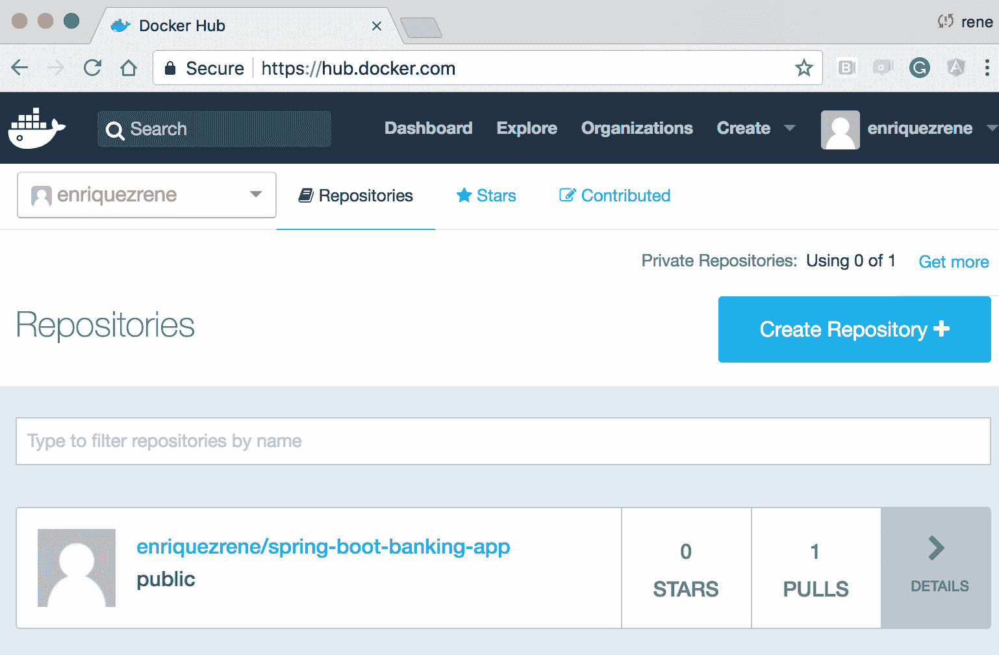

Docker 镜像推送到 Docker Hub

应该使用持续集成服务器自动化`push`命令。一个好主意是在分支合并到`master`标签或在版本控制系统中创建新标签时执行此命令。您应该始终避免使用默认的`latest`标签值。相反，您应该使用自动过程自己创建版本号，就像我们在上一节中使用 Gradle 插件所做的那样。

集成插件还具有使用`dockerPush` Gradle 任务推送镜像的功能。

# 为多容器环境进行配置

当我们使用分布式应用程序时，我们面临的最大问题之一是难以提供应用程序工作所需的所有依赖关系。例如，假设您正在开发一个将信息存储在 MySQL 数据库中并使用 RabbitMQ 发送消息的应用程序，如下图所示：

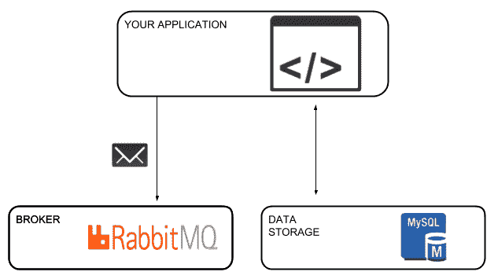

具有 RabbitMQ 和 MySQL 依赖项的应用程序

在这种情况下，如果团队中的所有开发人员都希望在本地使整个环境工作，他们都需要在他们的计算机上安装 MySQL 和 RabbitMQ。

安装一些工具并不难，但一旦您的应用程序开始有越来越多的依赖关系，这项任务就变成了一场噩梦。这正是 Docker Compose 要解决的问题。

# Docker Compose

Docker Compose 是一个工具，它允许您定义和执行多容器 Docker 环境。这意味着您应用程序中的每个依赖都将被容器化并由此工具管理。Docker Compose 诞生于一个名为**FIG**的独立开源项目，后来作为 Docker 家族的一部分进行了整合。目前，最新的 Compose 版本是 2.4。

在上面的例子中，您需要运行一些额外的服务：MySQL 和 RabbitMQ。

使用 Docker Compose 时，您可以在`docker-compose.yaml`文件中构建应用程序服务，然后使用此配置文件启动和停止所有这些服务，而不是逐个安装上述服务。这个配置文件使用了易于理解的 YAML 语法。

获取 RabbitMQ 和 MySQL 服务在本地运行所需的配置文件内容如下：

```java
mysql:
 image: mysql
 ports:
 - "3306:3306"
 environment:
 - MYSQL_ROOT_PASSWORD=my-password

rabbitmq:
 image: rabbitmq:management
 ports:
 - "5672:5672"
 - "15672:15672"
```

同样，我们可以在配置文件中添加尽可能多的服务。`docker-compose.yaml`文件的用例是不言自明的，值得一提的是，该文件具有特定的配置，这些配置在 Dockerfile 中没有定义，比如端口映射。运行这个文件并不难：您只需要使用 Docker Compose 中的`up`命令，就像下面的代码所示：

```java
$ docker-compose up
```

作为一个良好的实践，建议您在项目中提供一个`docker-compose.yaml`文件。这样，团队成员可以轻松地进行配置。

# 连接容器

当您运行分布式应用程序时，您必须连接不同的服务以使它们一起工作。为了满足这个要求，您需要知道服务的主机名或 IP 地址，以及其他配置变量。服务的可用顺序也很重要。让我们考虑以下简单的应用程序：

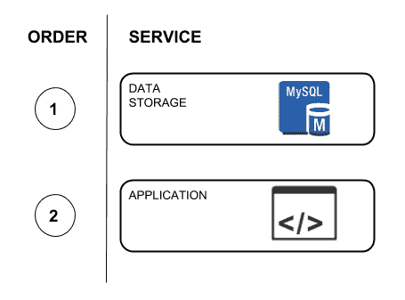

服务依赖关系

上面的图表示了最简单的应用程序；它只依赖于一个数据库服务器。在这个例子中，应用程序需要一些数据库配置参数，比如 IP 地址、端口等。当然，在启动应用程序之前，数据库服务应该是可用的；否则，应用程序将无法启动。

为了解决这个简单的需求，您可以在您的`docker-compose.yaml`文件中使用以下两个选项：

+   `links`

+   `depends_on`

# links

`links`选项可以用来通过它们的名称连接各种容器。这样，您根本不需要知道它们的主机名或 IP 地址。

# depends_on

使用`depends_on`选项，您可以指定服务启动的顺序。如果需要，一个服务可以依赖于多个服务。

让我们来看一下以下使用了这两个选项的`docker-compose.yaml`文件：

```java
version: '3.1'
services:
    database:
        image: mysql:5
        ports:
            - "3306:3306"
        volumes:
          # Use this option to persist the MySQL data in a shared 
          volume.
            - db-data:/host/absolute/path/.mysql
        environment:
            - MYSQL_ROOT_PASSWORD=example
            - MYSQL_DATABASE=demo

    application:
        image: enriquezrene/docker-compose-banking-app:1.0
        ports:
            - "8081:8080"
 depends_on:
            - database
        environment:
            - spring.datasource.url=jdbc:mysql://database:3306/demo
            - spring.datasource.password=example
 links:
            - database

volumes:
 db-data:
```

上述代码中的`depends_on`和`links`选项已经用粗体标出。从这可以很容易地理解，应用程序在数据库服务器启动后连接到数据库。

`enriquezrene/docker-compose-banking-app: 1.0` 镜像中有一个运行在其中的 Spring Boot 应用程序。作为这个应用程序的一部分，我们有一个名为`application.properties`的配置文件，内容如下：

```java
spring.thymeleaf.cache=false
spring.jpa.hibernate.ddl-auto=create-drop
spring.datasource.username=root
spring.datasource.url=jdbc:mysql://localhost:3306/demo
spring.datasource.password=root
```

您可能会注意到密码和数据源 URL 参数已经提供。但是，Spring 提供了使用环境变量覆盖这些配置的能力，就像我们在`docker-compose.yaml`文件中所做的那样。

Docker Compose 易于使用，并且具有与 Docker 相同的选项。让我们快速回顾一些命令，以便开始使用它。

这个命令允许我们启动配置文件中列出的所有容器：

```java
docker-compose up
```

`up`命令还允许使用`-d`标志将所有进程作为守护进程运行。如果您愿意，您可以从`docker-compose.yaml`文件中只启动一个服务，指定服务名称。假设我们只想运行数据库服务器。允许您执行此操作的命令如下：

```java
$ docker-compose up database
```

这样，您可以为 Docker Compose 中可用的其他命令指定服务名称。

一旦服务启动，您可以使用以下命令列出所有正在运行的容器：

```java
$ docker-compose ps
```

如果您想停止所有已启动的命令，您需要使用以下命令：

```java
$ docker-compose stop
```

Docker Compose 由一大堆命令组成。要获取完整的参考资料，您可以访问[`docs.docker.com/compose/reference/`](https://docs.docker.com/compose/reference/)。

# 使用 Kubernetes 进行容器编排

Kubernetes 为使用 Docker 容器的环境引入了一套新的概念。我们可以说 Kubernetes 在生产中做的是 Docker Compose 在开发中做的，但实际上远不止于此。Kubernetes 是一个开源系统，最初是为 Google Cloud Engine 创建的，但您可以在 AWS 或任何其他云提供商中使用它。它旨在远程管理不同环境中的 Docker 集群。

Kubernetes 引入了以下主要概念：

+   Pods

+   复制控制器

+   服务

+   标签

# Pod

pod 是 Kubernetes 引入的一个新概念。一个 pod 由一组相关的容器组成，代表一个特定的应用程序。这是 Kubernetes 中最基本的单位；您不必一直考虑容器，因为在这里您应该专注于 pod。

让我们考虑一个名为 XYZ 的应用程序，它将其信息存储在一个数据库中，该数据库提供了一个 REST API，该 API 由其 UI 使用，如下图所示：

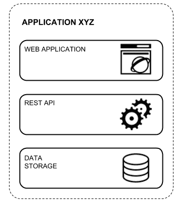

带有其依赖项的 XYZ 应用程序

很明显，我们需要三个单独的服务来使这个应用程序工作。如果我们在处理 Docker，我们会说我们需要三个不同的容器，但从 Kubernetes 的角度来看，所有这三个容器代表一个单独的 pod。这种抽象使我们能够更轻松地管理分布式应用程序。为了创建一个 pod 定义，您应该创建一个描述 pod 中所有容器的`.yaml`文件。我们之前提到的 XYZ 应用程序的示例描述在以下代码中：

```java
apiVersion: v1
kind: Pod
metadata:
    name: application-xyz
spec:
    containers:
        - name: nginx
          image: nginx
          ports:
            - containerPort: 80 

        - name: database
          image: mysql
          volumeMounts:
            - name: mysql-data
              mountPath: /path

        - name: api
          image: <your-api-image>
```

创建文件后，您可以使用以下 Kubernetes 命令执行 pod：

```java
kubectl create -f <file-name.yaml>
```

# 标签

一旦组织内的应用程序数量增加，管理所有这些应用程序往往会成为一场噩梦。想象一下，您只有十五个微服务和两个环境：一个用于暂存，另一个用于生产。在这种情况下，要识别所有正在运行的 pod 将会非常困难，您需要记住所有 pod 名称以查询它们的状态。

标签旨在使此任务更容易。您可以使用它们为 pod 打上易于记忆的标签名称，并且对您来说是有意义的。由于标签是键-值对，您有机会使用任何您想要的内容，包括`environment:<environment-name>`。让我们来看看下面的`application-xyz-pod.yaml`示例文件：

```java
apiVersion: v1
kind: Pod
metadata:
    name: application-xyz
 labels:
 environment:production
 otherLabelName: otherLabelValue
spec:
    containers:
        - name: nginx
          image: nginx
          ports:
            - containerPort: 80 

        - name: database
          image: mysql
          volumeMounts:
            - name: mysql-data
              mountPath: /path

        - name: api
          image: <your-api-image>
```

粗体中的代码显示了标签如何创建。在这里，您可以添加尽可能多的标签。让我们使用以下命令创建这个 pod：

```java
kubectl create -f application-xyz-pod.yaml 
```

一旦 pod 被创建，您可以使用以下命令使用标签查找它：

```java
kubectl get pod -l environment=production
```

# 复制控制器

乍一看，人们可能会认为我们应该关心 pod，但 Kubernetes 建议使用另一个称为复制控制器的抽象。

在生产中永远不会运行一个 pod 实例。相反，您将运行许多 pod 以提供高可用性并支持所有流量。复制控制器旨在确保指定数量的 pod 正在运行。在野外运行服务通常会出现问题，有时主机会崩溃，导致一个或多个 pod 不可用。复制控制器会不断监视系统以查找此类问题，当一个 pod 崩溃时，它会自动为此 pod 创建一个新的副本，如下图所示：

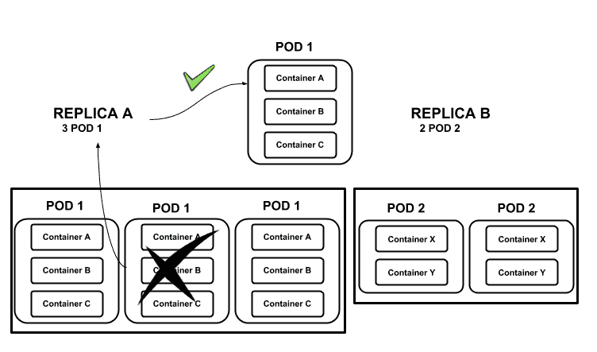

复制服务和 pod

复制控制器也对推出新的应用程序版本很有用。您可以轻松关闭与特定副本关联的所有 pod，然后打开新的 pod。

让我们来看看下面的文件，它展示了一个复制控制器的示例：

```java
apiVersion: v1
kind: ReplicationController
metadata:
    name: application-xyz-rc
spec:
    replicas: 3
    selector:
 tier:front-end    template:
        metadata: 
            label:
                env:production
        spec:
            containers:             
               ...
```

该文件的内容与 pod 非常相似；主要区别在于指定的 Docker 服务的种类。在这种情况下，它使用了`ReplicaController`值。稍后，我们将定义所需的副本数量，并且选择器部分可以用来指定标签。

使用此文件，可以通过运行`kubectl create`命令来创建副本，如下所示：

```java
kubectl create -f application-xyz-rc.yaml 
```

您可以验证在需要时如何创建 pod。您可以使用以下命令删除一个 pod：

```java
kubectl delete pod <pod-name>
```

然后，您可以使用以下命令查询可用的 pod：

```java
kubectl get pod
```

# 服务

在生产中通常会有许多复制服务来提供良好的用户体验。然而，无论此过程涉及多少主机或图像，我们都需要为所有这些功能提供一个唯一的入口点：这就是 Kubernetes 服务的目的。

Kubernetes 服务充当特定应用程序的端点和负载均衡器。由于服务位于一组复制的 pod 的前面，它将在所有可用的实例之间分发流量。

请记住，pod 和 Docker 容器是短暂的，我们不能依赖它们的 IP 地址。这就是为什么 Kubernetes 服务对于持续提供服务非常重要。

让我们看一个 Kubernetes 服务的配置文件示例：

```java
apiVersion: v1
kind: Service
metadata:
    name: application-xyz-service
spec:
    ports: 
        port:80
        targetPort: 80
        protocol: TCP
    selector:
 tier:front-end
```

第 2 行的`kind`配置条目具有一个新值—在本例中，该值为`Service`。选择器指示与此服务关联的副本容器，其余的配置参数都是不言自明的。使用此文件，您可以使用`kubectl create`命令如下：

```java
kubectl create -f application-xyz-service.yaml
```

此外，如果您不想为服务创建文件，可以直接使用以下命令公开现有的复制控制器：

```java
kubectl expose rc application-xyz-rc
```

# 总结

在本章中，我们开始回顾容器的基本概念以及它们如何应用于 Docker，这是用于容器化应用程序的最流行的产品之一。

然后，我们学习了如何自动化这个过程，并将其作为 Java 应用程序构建过程的一部分，使用 Gradle 作为构建工具。自动化背后的主要意图是为了与 DevOps 原则保持一致；我们将在下一章节详细讨论 DevOps。在本章末尾，我们看了其他 Docker 工具，它们可以自动化开发环境中的配置过程，并学习了 Kubernetes 以及它在生产环境中的应用。在下一章中，我们将回顾 DevOps 和发布管理的概念。
