# 第十一章：DevOps 和发布管理

DevOps 是一种重要的技术，可以帮助团队防止他们的工作变得孤立。它还有助于消除整个软件开发周期中的乏味流程和不必要的官僚主义。这种技术在整个软件开发过程中使用，从编写代码到将应用程序部署到生产环境。

本章将演示如何通过采用自动化来实现这些目标，以减少手动任务的数量，并使用自动化管道部署应用程序，负责验证编写的代码，提供基础设施，并将所需的构件部署到生产环境。在本章中，我们将审查以下主题：

+   孤立

+   DevOps 文化动机

+   DevOps 采用

+   采用自动化

+   基础设施即代码

+   使用 Spring Framework 应用 DevOps 实践

+   发布管理管道

+   持续交付

# 孤立

几年前，软件行业使用瀑布模型来管理系统开发生命周期（SDLC）。瀑布模型包括许多阶段，如收集需求、设计解决方案、编写代码、验证代码是否符合用户需求，最后交付产品。为了在每个阶段工作，创建了不同的团队和角色，包括分析师、开发人员、软件架构师、QA 团队、运维人员、项目经理等。每个角色都负责产出并将其交付给下一个团队。

使用瀑布模型创建软件系统所需的步骤如下：

1.  分析师收集软件需求

1.  软件架构师仔细审查需求，并扩展文档，提供有关将使用的工具和技术、必须编写的模块以创建系统、显示组件如何连接以作为整体运行的图表等信息

1.  开发人员按照架构师发布的指令编写应用程序

1.  QAs 必须验证创建的软件是否按预期工作

1.  运维团队部署软件

从这些步骤中可以看出，在每个阶段，不同的团队正在产出明确定义的产出，并将其交付给下一个团队，形成一个链条。这个过程完美地描述了团队使用孤立心态的工作方式。

这个软件生产过程乍一看似乎不错。然而，这种方法有几个缺点。首先，在每个阶段都不可能产生完美的产出，通常会产生不完整的构件。因此，专注于自己流程的团队和部门开始对组织中其他人的工作付出较少关注。如果团队的成员对其他团队内发生的问题感到责任较小，那么在这个领域就会出现冲突的墙壁，因为每个团队都独立工作，彼此之间有几道障碍，导致沟通中断，从而破坏信息的自由流动。

# 如何打破孤立

在前一节中，我们看到团队如何组织以产生产出。很明显，每个团队成员基本上具有与其他团队成员相同的技能。因此，要求分析团队编写某个功能的代码或提供基础设施将应用程序部署到生产环境是不可能的。

打破孤立的第一步是创建多学科团队。这意味着团队应该有不同技能的成员，这些技能将帮助团队解决不同的问题和需求。

理想情况下，每个团队成员都应具备处理任何需求的必要技能。然而，这个目标几乎是不可能实现的。

一旦你有了一个跨学科团队，你很容易会发现在同一个团队中有人以信息孤岛的方式工作。为了解决这个问题，你需要制定一个计划，让每个成员都能够将更多的技能纳入他们的技能组合中。例如，你可以让开发人员与 QA 专家一起使用配对编程技术。这样，开发人员将学习 QA 专家的思维方式，而 QA 将获得开发技能。

跨学科团队在整个软件开发生命周期的各个阶段创建了协作的环境。

# DevOps 文化

对于 DevOps 有很多定义。我们将使用以下定义：

“DevOps 是一种鼓励运营和开发团队共同合作的文化，而不会削弱每个团队具有的特定技能和责任。”

这意味着软件开发团队要对他们所产生的代码负责和拥有权。DevOps 改变了人们在软件开发生命周期中的组织方式和他们遵循的流程。

这种文化消除了信息孤岛，因为它要求所有角色都参与到软件开发生命周期中，并共同合作，如下图所示：

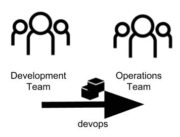

打破组织中的信息孤岛

# 动机

为了理解采用 DevOps 的动机，让我们看一个在开发软件的公司和组织中经常遇到的常见现实场景。

假设我们在一家尚未采用 DevOps 或**持续集成**（**CI**）和**持续部署**（**CD**）实践的公司工作。让我们想象一下，这家公司有以下团队负责发布一个功能或新软件：

+   **开发团队：**该团队使用代表新功能或错误修复的分支将代码编写并提交到源代码版本控制系统中。

+   **运维团队：**该团队在不同的环境中安装构件，例如通过测试和生产。

+   **QA 团队：**该团队验证所产生的构件从最终用户和技术角度是否按预期工作，并批准或拒绝所产生的代码。

每当开发人员发布功能和错误修复时，都会重复这个常见的流程。在首次经历这个常见流程时，我们意识到存在一些问题，包括以下问题：

+   **不同的环境：**代码开发的环境通常与暂存和生产环境具有不同的环境和配置。

+   **沟通：**基于 DevOps 实践形成跨学科团队将帮助我们打破组织中的信息孤岛。否则，团队之间缺乏沟通是通过会议、电话会议和/或电子邮件解决的。

+   **不同的行为：**在生产环境中产生的错误数量与在开发环境中产生的错误数量不同。也有一些情况下错误根本无法重现。

正如我们所看到的，这里有几个问题需要解决。让我们看看如何解决上述每一个问题：

+   **不同的环境：**通过基础设施即代码实践，我们可以创建文件，使每个环境都能够使用不可变服务器，这是我们将在关于基础设施即代码的未来部分中讨论的概念。

+   **沟通：**基于 DevOps 实践形成跨学科团队将帮助我们打破组织中的信息孤岛。

+   **不同的行为：**使用基础设施即代码方法，我们将能够创建不可变服务器，保证不同环境（如开发、测试和生产）中的相同行为。

+   **上市时间：**应用**持续交付**（**CD**）使我们能够尽快将新功能部署到生产环境。

这些都是现实场景中常见的问题，这就是为什么一些组织正在采用 DevOps。这从打破信息孤岛开始，对开发团队有很多好处。例如，它允许他们尽快部署，减少错误。它还允许他们快速应对变化，使流程更加高效。因此，我鼓励您的组织打破信息孤岛，变得敏捷，以快速生产高质量的应用程序。

# DevOps 采用

DevOps 的采用符合组织释放应用程序更快的需求，最小化与将软件交付到生产环境相关的错误和风险。作为这一过程的一部分，我们需要增加自动化测试应用程序的流程数量，并强烈建议我们去除手动流程，以避免人为干预，这可能导致错误的产生。

可以自动化的一些流程包括环境配置和部署流程。让我们来看一下 SDLC 的改进：

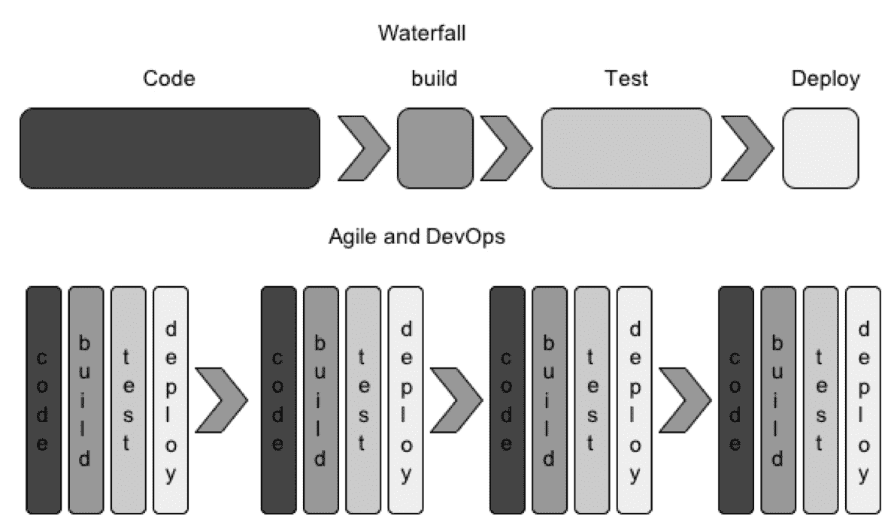

瀑布方法与敏捷方法和 DevOps

然而，为了更快地交付软件，我们必须解决一些问题。首先，我们需要拥抱自动化文化。自动化文化迫使我们使用许多工具，我们将在下一节介绍，并且我们需要理解，由于微服务的崛起，DevOps 已经成为我们流程的一个重要部分，因为微服务具有更复杂和分布式的系统。然而，不要忘记，DevOps 的主要目标是合作，而不仅仅是自动化。

# 拥抱自动化

拥抱自动化是 DevOps 采用的关键因素之一。有几种工具可以帮助我们进行这一过程。

我们需要找到帮助我们在整个 SDLC 的所有阶段自动化流程的工具。这些阶段如下图所示：

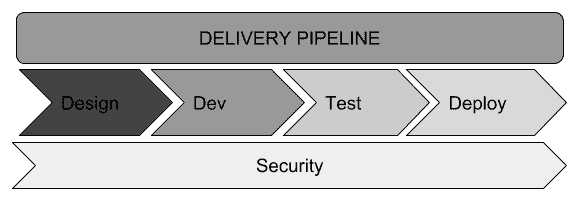

组织中的流水线

在组织内，流水线的设计旨在保持软件交付流程简单。第一步是识别不同的阶段，就像我们在前面的图表中所做的那样，然后我们应该选择合适的工具，让我们能够自动化每个阶段。让我们回顾一下各个阶段和与每个阶段相关的工具/软件：

+   代码（Git、SVN 等）。

+   构建（Maven、Gradle、npm 等）。

+   测试自动化。这也可能包括集成测试（JUnit、Postman、Newman、JFrog、Selenium、Cucumber、Gherkin 等）。

+   部署（Ansible、Vagrant、Docker、Chef、Puppet 等）。

+   监控（我们将在第十二章中深入讨论监控）。

+   持续集成和持续部署（Jenkins、Hudson 等）。

+   代码分析（Sonatype、Jacoco、PMD、FindBugs 等）。

正如我们在第十章中所学到的，*容器化您的应用程序*，我们知道如何基于容器提供环境，并且我们需要理解，我们创建的示例也可以应用于基础设施即代码的概念，我们将在下一节中讨论。

# 基础设施即代码

基础设施即代码是指创建文件以及环境定义和程序的过程，这些将用于配置环境。DevOps 概念开始使用这些脚本或文件存储库与代码一起，以便我们可以确定哪些代码将部署在哪个环境中。使用这些实践，我们可以确保所有服务器和环境是一致的。

一个典型的组织或团队将在多个环境中部署他们的应用程序，主要用于测试目的。当我们有开发、暂存和生产环境时，开发人员面临的最大问题是每个环境都不同，需要不同的属性。

这些属性可能包括以下配置，以及其他配置：

+   服务器名称

+   IP 地址和端口号

+   服务器队列连接

+   数据库连接

+   凭据

软件开发的现代时代突然给我们带来了在构建基础设施时的可测试性、可重复性和透明度。如今的一个关键目标是在本地或云环境中仅使用物理服务器资源重新创建或构建完整的软件环境。

作为其结果，我们应该能够创建数据库实例，用脚本或备份文件中的初始数据填充它们，并重新构建我们的源代码以创建可以随时部署的构件。

有许多工具可以用来应用基础设施即代码的概念：

+   对于配置同步，我们可以使用 Chef、Puppet 或 Ansible

+   对于容器化服务器，我们可以使用 Docker 部署新的应用程序版本

我们将要拥抱的一些关键好处如下：

+   *不可变服务器*，通过在基础设施中重建服务器来应用更改，而不是修改现有服务器

+   *对基础设施进行更改的测试*，这涉及使用文件在我们应用程序和基础设施的不同阶段进行测试来复制环境

以下图表显示了重新创建每个阶段环境的这两个关键好处的主要思想：

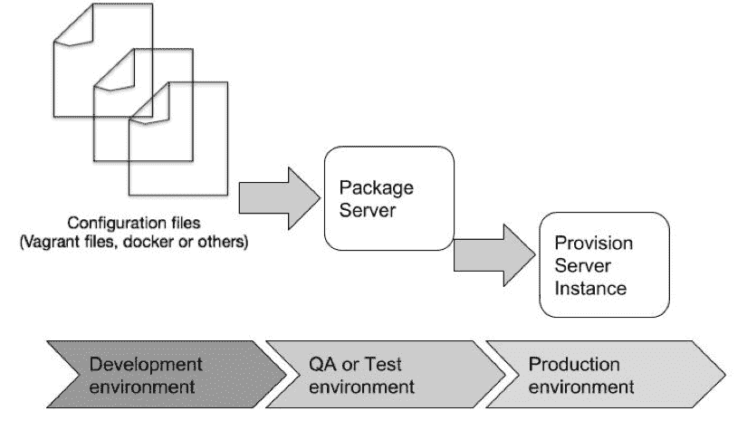

不可变基础设施

自动化的服务器配置过程给我们带来以下好处：

+   可以自动重新创建任何环境或服务器

+   配置文件可以存储凭据或自定义配置，每个环境可能不同

+   在不同阶段环境将始终相同

在接下来的部分，我们将创建一些基础设施即代码的示例。

# Spring 应用程序和 DevOps 实践

Spring 提供了与 DevOps 原则一致的开箱即用功能。让我们看看其中一些。

首先，我们将使用[`start.spring.io`](https://start.spring.io/)上提供的 Spring Initializr 创建一个新的 Spring Boot 应用程序。

# 支持不同环境

在交付应用程序的常见场景是我们在开发环境（几乎总是我们自己的计算机）上编写应用程序，然后将应用程序部署在不同的测试和生产环境中。Spring 配置文件允许我们在每个环境中使用不同的配置。我们可以使用本地配置文件作为应用程序的一部分，然后稍后，我们可以使用环境变量覆盖这些配置值。这通常是因为我们在部署配置的每个环境中使用不同的凭据和配置。

在为我们需要部署应用程序的每个不同环境创建不同的 Spring 配置文件之前，我们将在`/main/resources/static`文件夹后面添加一个`index.html`静态页面，标签如下：

```java
<!DOCTYPE html>
<html lang="en">
<head>
    <meta charset="UTF-8">
    <title>Welcome devops</title>
</head>

```

在接下来的步骤中，我们将展示 Spring 在 DevOps 方面提供的一些功能。我们还将完成一个练习，为 Docker 容器提供将配置为支持不同环境（如开发、测试和生产环境）的层。

首先，我们将为我们的应用程序创建一个不同的配置文件。例如，我们可以使用三个文件分别命名为`application-dev.properties`、`application-test.properties`和`application-production.properties`在`/infra-as-code/src/main/resources`文件夹中创建不同的配置文件，用于开发、测试和生产：

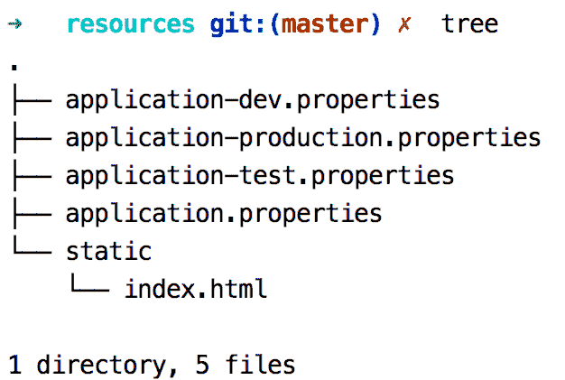

为了了解 Spring 配置文件的工作原理，我们将更改应用程序正在使用的端口。用于配置端口的属性是`server.port`。让我们按照以下方式更改我们拥有的每个不同文件的值：

`application-dev.properties`：

```java
server.port = 8090
```

`application-test.properties`：

```java
server.port = 8091
```

`application-production.properties`：

```java
server.port = 8092
```

# 选择配置文件

在运行支持不同配置文件的应用程序之前，您需要选择要使用的配置文件。可以使用 JVM 参数`spring.profiles.active`标志来选择配置文件，如下所示：

```java
$ java -Dspring.profiles.active=dev -jar target/infra-as-code-0.0.1-SNAPSHOT.jar
```

最后，您可以使用与提供的配置文件相关联的端口在浏览器中检查应用程序。`spring.profiles.active`标志的有效值如下：

+   `dev`

+   `production`

+   `test`

如果您没有为该标志提供任何值，则将使用`application.properties`中的配置。

这是一个探索 Spring 中配置文件的简单示例。请记住，使用配置文件，我们还可以配置数据源、队列、bean 以及您需要的任何内容。您始终可以使用环境变量覆盖任何提供的配置变量。

此外，正如我们在第十章中看到的，*容器化您的应用程序*，我们可以将 Spring Boot 应用程序 docker 化，并借此了解不可变服务器以及如何测试基础架构更改。

在本节中，我们将学习使用 Vagrant ([`www.vagrantup.com/`](https://www.vagrantup.com/))版本 1.7.0 或更高版本重新创建基础架构的类似方法。这可能需要虚拟化软件（例如 VirtualBox：[`www.virtualbox.org/`](https://www.virtualbox.org/)）。

另一个可以执行相同任务的工具是 Ansible ([`ansible.com/`](http://ansible.com/))，本章不涉及该工具。

# Vagrant

Vagrant 是一个旨在重新创建虚拟环境的工具，主要用于开发。其功能基于 VirtualBox，并且可以使用诸如 Chef、Salt 或 Puppet 之类的配置工具。

它还可以与不同的提供者一起使用，例如 Amazon EC2、DigitalOcean、VMware 等。

Vagrant 使用一个名为`Vagrantfile`的配置文件，其中包含所有需要配置所需环境的配置。一旦创建了上述配置文件，就可以使用`vagrant up`命令使用提供的指令安装和配置环境。

Vagrant 必须在继续之前安装在机器上。要做到这一点，请按照工具的文档中提供的步骤进行操作[`www.vagrantup.com/intro/getting-started/install.html`](https://www.vagrantup.com/intro/getting-started/install.html)。

# 使用 Vagrant 工作

现在，我们将在应用程序的根目录中创建一个`Vagrantfile`配置文件来创建一个简单的环境。我们将提供一个 Linux 发行版环境，即 Ubuntu。`Vagrantfile`的内容如下：

```java
# Vagrantfile API/syntax version. Don't touch unless you know what you're doing!
VAGRANTFILE_API_VERSION = "2"

Vagrant.configure(VAGRANTFILE_API_VERSION) do |config|

  config.vm.box = "hashicorp/precise32"

  config.vm.network :forwarded_port, guest: 8090, host: 8090
  config.vm.network "public_network", ip: "192.168.1.121"
  #config.vm.synced_folder "target","/opt"

  config.vm.provider "virtualbox" do |vb|
    vb.customize ["modifyvm", :id, "--memory", "2048"]
  end

  # provision
  config.vm.provision "shell", path:"entrypoint.sh"

end
```

请注意`Vagrantfile`的第 6 行：

```java
config.vm.box = "hashicorp/precise32"
```

我们正在从已构建的 VM box `hashicorp/precise32` 创建我们的 Linux 环境。

在继续使用 Vagrant 提供环境之前，我们将创建一个`ssh`文件，该文件将为我们安装 JDK 8。在项目的根目录下，创建一个名为`entrypoint.sh`的文件，内容如下：

```java
#!/usr/bin/env bash
sudo apt-get update

echo "Install Java 8.."
sudo apt-get install -y software-properties-common python-software-properties

echo oracle-java8-installer shared/accepted-oracle-license-v1-1 select true | sudo /usr/bin/debconf-set-selections
sudo add-apt-repository ppa:webupd8team/java -y

sudo apt-get update

sudo apt-get install oracle-java8-installer
echo "Set env variables for Java 8.."
sudo apt-get install -y oracle-java8-set-default

# Start our simple web application with specific JVM_ARGS and SPRING_PROFILE
echo "Run our springboot application."
java -Dspring.profiles.active=dev -jar /vagrant/target/infra-as-code-0.0.1-SNAPSHOT.jar
```

然后，为了创建虚拟机并提供 VM，我们将在控制台上运行以下命令：

```java
vagrant up
```

在第一次尝试时，下载盒子和配置服务器将需要一些时间。在这些过程之间，您将被问及要使用哪个网络接口来配置您的服务器，问题是*网络桥接到哪个接口？*。然后您可以选择对您的机器更方便的选项。

在我们的执行的整个输出结束时，我们将在配置的服务器上看到我们的 Spring 应用程序正在运行，如下图所示：

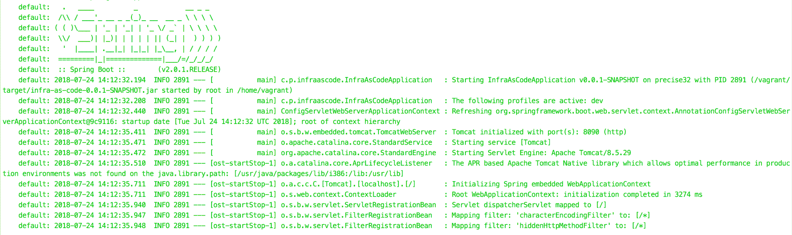

现在我们可以在浏览器中检查我们的应用是否在端口`8090`（`http://localhost:8090/`）上运行。您可以通过以下命令访问`ssh`来检查 Vagrant 中运行的 Java 进程：

```java
vagrant ssh
```

这将在我们的配置服务器上打开一个`ssh`会话，让我们可以在控制台中看到已经创建的进程：

```java
vagrant@precise32:~$ ps aux | grep java
```

结果的输出将是我们正在运行的 Java 进程，如下图所示：


要停止虚拟机，可以在控制台中使用`vagrant halt`命令：

```java
vagrant halt
```

要销毁创建的虚拟机，可以输入以下内容：

```java
vagrant destroy
```

我们刚学会使用 Vagrant 将基础设施表示为代码。我们可以使用不同的工具为不同阶段创建所需的环境或服务器；我们可以在上一章中回顾这一点。在下一节中，我们将创建发布管理过程的示例。

# 发布管理

要将您的代码带到生产环境，必须计划好这个过程。

这个规划过程称为**发布管理**。在整个过程中，我们需要关注现有服务的完整性和一致性，确保我们系统的运行。

为了了解发布管理过程中涉及的步骤，我们将看一下以下概念：

+   流水线

+   持续集成

+   持续交付和持续部署

# 流水线

流水线是我们必须经历的一系列步骤来实现目标。我们在第七章中看过这个概念，*管道和过滤器架构*。在这个上下文中，相同的概念用于执行我们发布管理过程中的一系列步骤。流水线将在不同环境中协助我们进行软件交付过程。我们将创建一个由五个阶段组成的简单流水线：

+   自动构建我们的项目

+   运行测试（如单元测试和集成测试）

+   部署到暂存环境

+   运行验收测试

+   部署到生产环境（包括在云端或本地服务器上部署我们的应用程序）

以下图表显示了流水线的外观：

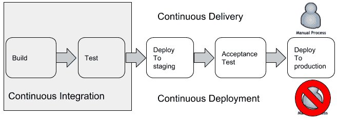

CI/CD 流水线

每个阶段可能有一个或多个任务或作业，例如创建数据库模式，使用 Vagrant 为盒子进行配置，克隆 Docker 容器等。

上述图表分为两部分：

+   持续集成

+   持续部署

在接下来的几节中，我们将简要介绍这两个概念。

# 持续集成

持续集成（CI）是指开发人员尽可能经常将他们生成的代码合并到主分支中的做法。合并的代码应该没有错误，并且还应该为业务提供价值。

使用 CI，我们可以通过运行一组自动化测试来自动验证提交的代码。当我们使用这种做法时，我们正在处理一个 CI 代码库，避免了过去在安排特定日期和时间发布构建时出现的问题。

采用 CI 方法，最重要的目标是自动化测试，以确保每次将新提交推送到主源代码分支时应用程序都不会出现故障。

# 持续交付和持续部署

CD 是基于 CI 的一个过程。作为 CD 过程的一部分，我们需要其他步骤，这些步骤是将应用程序部署到生产环境所需的，包括配置和提供服务器（基础设施即代码）、验收测试以及为生产环境准备构建。

在生产环境中进行部署时，持续部署过程与持续交付过程不同，不需要*人类*干预。

现在，我们将创建一个基于我们简单流水线的示例。为了专注于 CI 和 CD 的流程，我们将使用上一章节的*Docker Compose*部分中创建的项目，该部分向您展示了如何将应用程序容器化。该项目包括一个完整的环境，已经准备好使用，并且已经包含了自动化测试。

# 自动化流水线

如前所述，我们将需要几个工具来自动化我们示例的流水线。为此，我们将使用以下工具：

+   我们的代码的 GitHub 存储库：我们可以将我们的代码推送到存储库并创建一个自动启动构建和测试的合并

+   使用 Gradle 或 Maven 构建我们的项目

+   使用 Junit、Postman 和 Newman 进行自动化测试

+   使用 Docker 部署到容器中的 Jenkins 作为我们的 CI 和 CD 的自动化服务器

首先，我们将把我们的代码推送到存储库。为此，我们将使用 GitHub。如果还没有，请创建一个帐户。

打开终端并转到我们应用程序的根文件夹。为了方便起见，我们将从我们的机器上推送存储库，因此我们将初始化我们的项目作为存储库。在命令行中执行以下操作：

```java
$ git init
```

命令的输出将如下所示：

```java
Initialized empty Git repository in /Users/alberto/TRABAJO/REPOSITORIES/banking-app/.git/
```

然后，我们将把所有文件添加到一个新的本地存储库中，如下面的代码所示：

```java
$ git add –A
```

现在我们将在本地提交我们的代码，如下面的代码所示：

```java
$ git commit -m initial
```

我们本地提交的输出将打印以下初始行：

```java
[master (root-commit) 5cc5f44] initial  40 files changed, 1221 insertions(+)
```

要推送我们的代码，我们需要在 GitHub 帐户中创建一个存储库。我们可以通过转到存储库部分，点击绿色的创建存储库按钮，并填写存储库的名称和描述来创建一个新的存储库，如下面的屏幕截图所示：

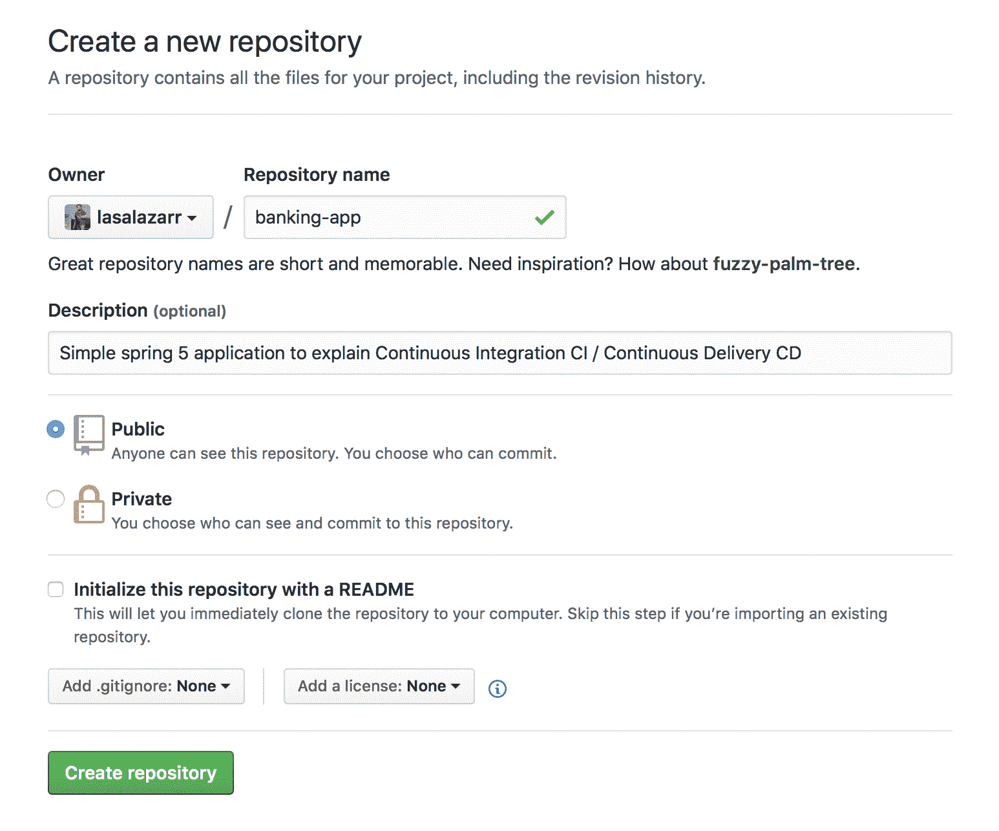

创建一个 GitHub 存储库

现在我们有了我们存储库的 URL，例如`https://github.com/$YOUR_GITHUB_USER/bank-app`。我们创建的存储库的结果将如下屏幕截图所示：

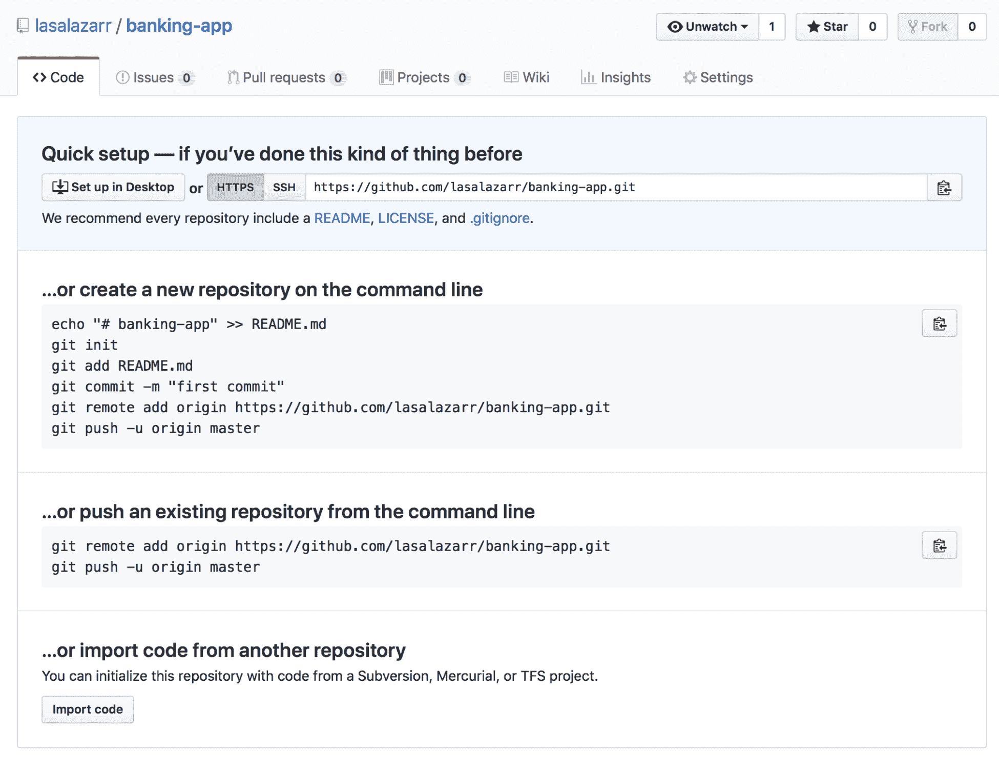

GitHub 存储库

根据 GitHub 给出的说明，我们现在需要使用命令行将我们的代码推送到存储库：

```java
$ git remote add origin https://github.com/lasalazarr/banking-app.git
```

然后，我们将从本地存储库推送我们的更改到我们的 GitHub 存储库，如下面的代码所示：

```java
$ git push -u origin master
```

现在我们可以在我们的 GitHub 帐户存储库上查看我们的代码，并根据建议添加一个`README`文件来解释应用程序的目的。

在下一节中，我们将在继续练习之前先看一下 CI 服务器的概念。

# Jenkins

Jenkins 是一个负责自动化我们流水线的持续集成服务器。在与我们的 Git 存储库集成以自动构建我们的应用程序之前，让我们先回顾一下 CI 服务器背后的关键概念：

+   **流水线**: 流水线由一系列按顺序发生的步骤组成。流水线也是我们可以并行执行任务的地方。

+   **作业**: 这是一个小的工作单元，例如*运行测试*或*拉取我们的代码*。

+   **队列**: 这代表了 CI 服务器在有能力运行时将运行的所有排队作业。

+   **插件**: 这些是我们可以添加到我们的 CI 服务器的功能。例如，我们可以使用一个插件连接到我们的 Git 存储库。

+   **主/从**: 主机可以将工作委派给从机器来扩展我们的 CI。

Jenkins 有不同的分发方法。我们可以在[`jenkins.io/download/`](https://jenkins.io/download/)上查看更多关于这个项目的细节。在我们的示例中，我们将使用一个准备好的 Docker 镜像。

由于我们已经安装了 Docker，我们可以通过运行以下命令在命令行中拉取 Jenkins 镜像：

```java
$ docker pull jenkins/jenkins
```

现在我们可以通过运行以下命令来查看我们的镜像：

```java
$ docker images
```

现在我们将通过在命令行中运行以下命令来从容器中运行我们的 Jenkins 主服务器：

```java
$ docker run -p 8080:8080 -p 50000:50000 -v jenkins_home:/var/jenkins_home jenkins/jenkins:lts
```

注意控制台输出的生成的管理员密码，如下截图所示：

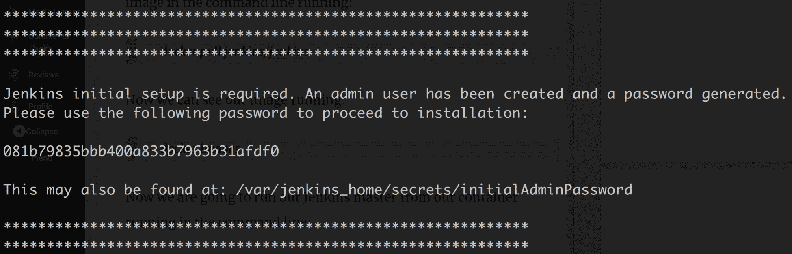

生成 Jenkins 密码

我们现在可以看到我们的 Jenkins 服务器正在使用`http://localhost:8080/`运行。

第一步是粘贴我们刚在控制台上看到的管理员密码，如下截图所示：

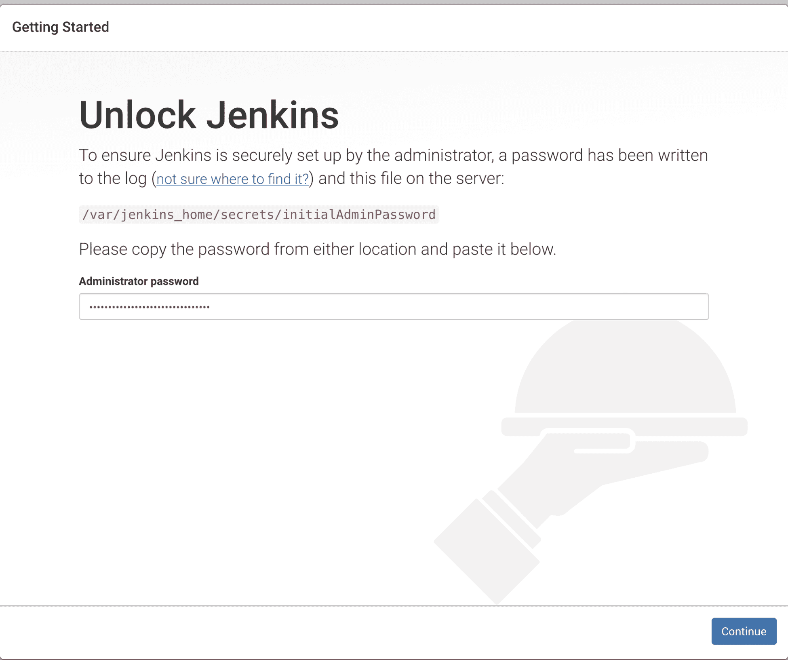

解锁 Jenkins

现在我们将安装建议的插件，这将需要一些时间。然后我们将继续创建一个管理员用户和 URL 的过程。

我们将启用构建触发，因此我们将配置我们的 Jenkins 实例以接收来自 GitHub 的推送通知。为此，请按照以下步骤进行：

1.  转到 Jenkins 主页（`http://localhost:8080`），然后点击左侧菜单中的**New item**图标。

1.  输入项目名称并选择自由风格项目。完成后，点击“OK”按钮，如下截图所示：

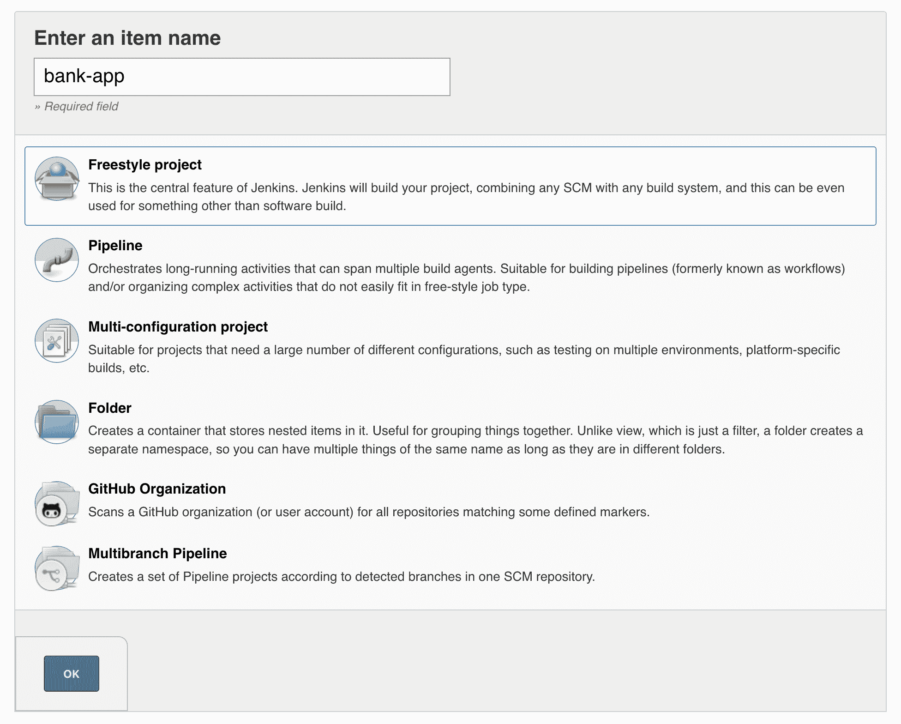

1.  Jenkins 将显示一个页面，应该在该页面上配置作业步骤。首先，输入项目的描述和 GitHub URL 存储库，如下截图所示：

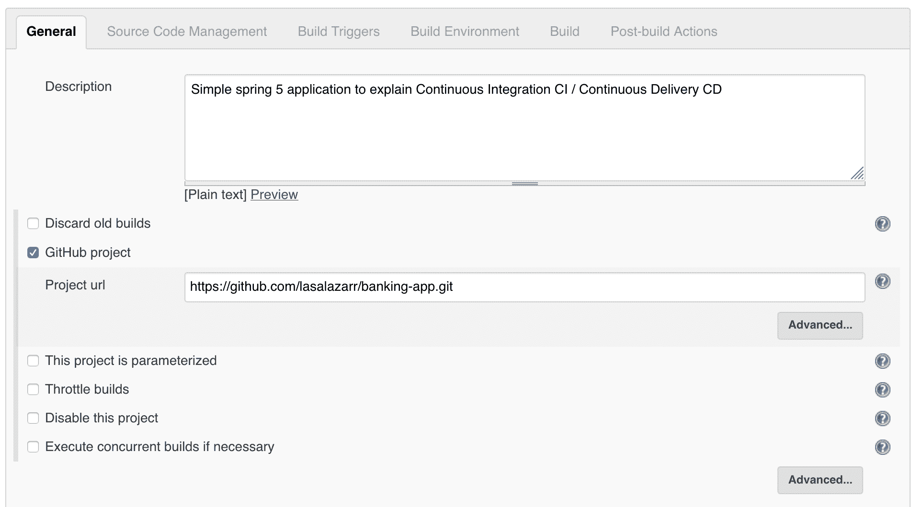

4. 输入您的 GitHub 用户帐户的凭据，如下截图所示：

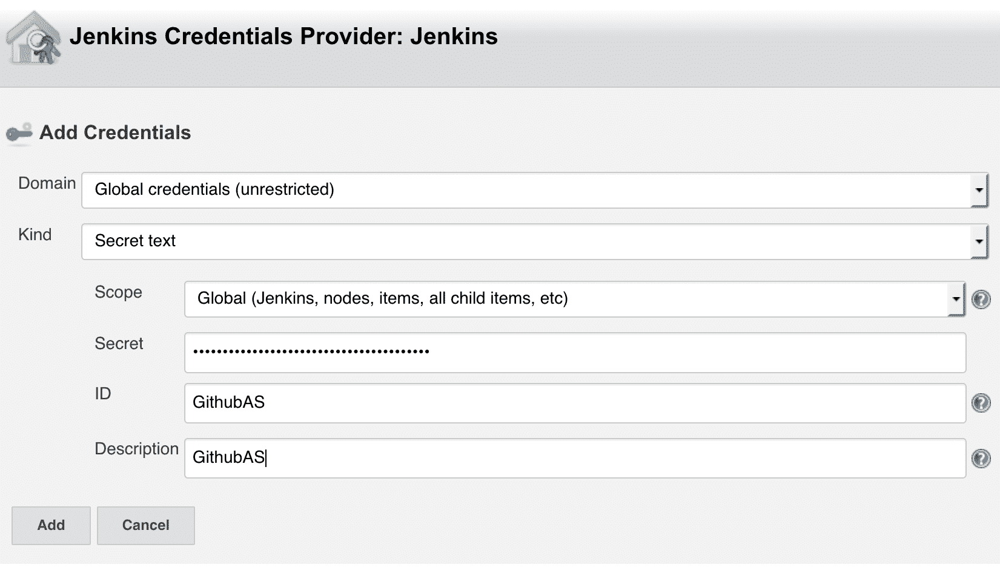

5. 最后，在页面底部选择 Gradle 作为项目的构建工具：

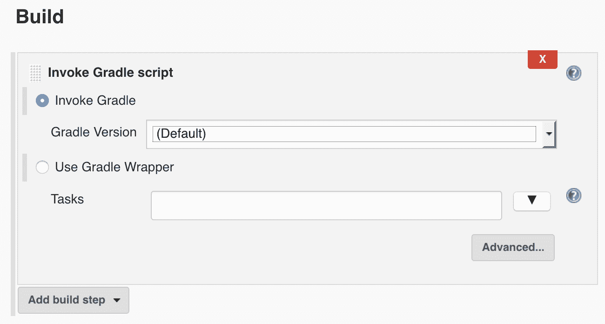

创建的作业可以配置为在每次向 GitHub 提交代码时触发。该作业将下载代码，运行测试，并使用 Gradle 生成可部署的工件（JAR 文件）。您可以在此作业中添加额外的步骤来在 Docker Hub 中构建、标记和推送 Docker 镜像，然后自动部署到本地或基于云的服务器。

# 总结

在本章中，我们熟悉了 DevOps 文化的含义以及它如何影响组织的流程。我们还学习了如何自动化服务器的仪器化过程，使用基础设施即代码等技术来实现自动化。此外，我们学习了如何构建能够从存储库获取最新实施功能、验证代码、在不同层面运行测试并将应用程序推向生产的流水线。在下一章中，我们将探讨围绕应用程序监控的关注点，看看为什么关心它们如此重要。
