# 第十二章：监控

一旦应用程序部署到生产环境中，监控就是其中一个关键方面。在这里，我们需要控制不常见和意外的行为；了解应用程序的工作方式至关重要，这样我们就可以尽快采取行动，以解决任何不希望的行为。

本章提供了一些建议，涉及可用于监视应用程序性能的技术和工具，考虑到技术和业务指标。

在本章中，我们将涵盖以下主题：

+   监控

+   应用程序监控

+   业务监控

+   监控 Spring 应用程序

+   APM 应用程序监控工具

+   响应时间

+   数据库指标

+   JVM 指标

+   Web 事务

# 监控

每个应用程序都是为了解决特定的业务需求和实现特定的业务目标而创建的，因此定期评估应用程序以验证是否实现了这些目标至关重要。作为这一验证过程的一部分，我们希望使用可以为我们提供以下因素的见解的指标来衡量我们应用程序的健康状况和性能：

+   **应用程序监控**：当我们谈论应用程序的健康状况时，了解正在使用的资源量，例如 CPU、内存消耗、线程或 I/O 进程，是很重要的。识别潜在的错误和瓶颈对于知道我们是否需要扩展、调整或重构我们的代码是很重要的。

+   **业务监控**：这些指标有助于了解有关业务本身的关键业务指标。例如，如果我们有一个在线商店，我们想知道我们是否实现了既定的销售目标，或者在银行应用程序中，我们想知道在某个分支机构、渠道等处收到了多少交易和客户。

我们将使用在第五章中创建的银行应用程序，*模型-视图-控制器架构*，作为一个示例，列出一些可以应用于它的监控概念。让我们开始展示如何使用 Spring 框架带来的开箱即用的工具来监视上述应用程序。

# 监控 Spring 应用程序

Spring 框架具有一些内置功能，用于监视和提供指标以了解应用程序的健康状况。我们有多种方法可以做到这一点，因此让我们来审查其中一些：

+   我们可以使用一种老式的方法，即围绕方法创建拦截器来记录我们想要记录的一切。

+   Spring 执行器可以与 Spring Boot 应用程序一起使用。使用此库，我们可以查看应用程序的健康状况；它提供了一种通过 HTTP 请求或 JMX 监视应用程序的简单方法。此外，我们可以使用工具对生成的数据进行索引，并创建有助于理解指标的图表。有很多选项可以创建图表，包括：

+   ELK Stack（ElasticSearch、Logstash 和 Kibana）

+   Spring-boot-admin

+   Prometheus

+   Telegraph

+   Influx 和

+   Graphana 等等

Spring 执行器可以作为现有 Spring Boot 应用程序的一部分集成，将以下依赖项添加为`build.gradle`文件的一部分：

```java
compile('org.springframework.boot:spring-boot-starter-actuator')
```

如果我们使用**Maven**，我们将在`pom.xml`文件中添加以下依赖项：

```java
<dependency>
    <groupId>org.springframework.boot</groupId>
    <artifactId>spring-boot-starter-actuator</artifactId>
</dependency>
```

执行器支持许多配置，这些配置必须在`application.properties`文件中提供。我们将向该文件添加一些属性，以提供元数据，例如应用程序的名称、描述和版本。此外，我们将在另一个端口上运行执行器端点，并禁用安全模型：

```java
info.app.name=Banking Application Packt
info.app.description=Spring boot banking application
info.app.version=1.0.0
management.port=8091
management.address=127.0.0.1
management.security.enabled=false
```

然后，在运行应用程序之后，执行器提供的一些端点将可用。让我们来审查其中一些：

+   **健康**：此端点在`http://localhost:8091/health` URL 中提供有关应用程序健康状况的一般信息：

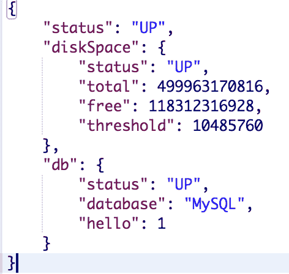

健康端点结果

+   **信息**：此端点提供有关应用程序元数据的信息，该信息先前在`application.properties`文件中进行了配置。信息可在`http://localhost:8080/info`上找到：

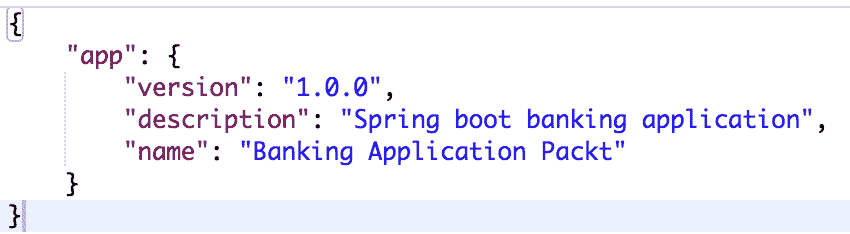

信息端点结果

+   **指标**：提供有关操作系统、JVM、线程、加载的类和内存的信息。我们可以在`http://localhost:8080/metrics`上查看此信息：

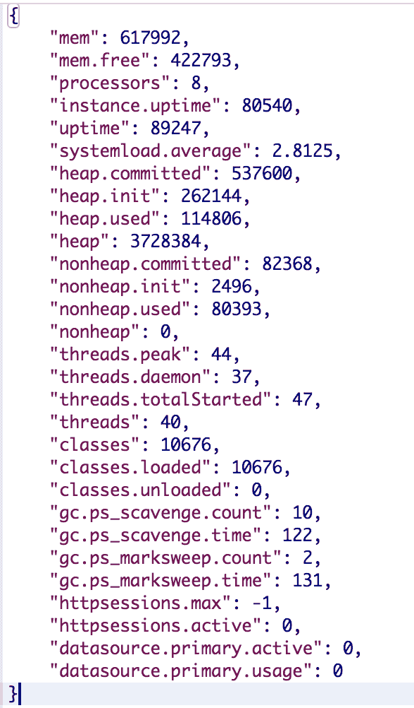

指标端点结果

+   **跟踪**：提供有关最近对我们应用程序发出的请求的信息。我们可以在`http://localhost:8080/trace`上查看此信息：

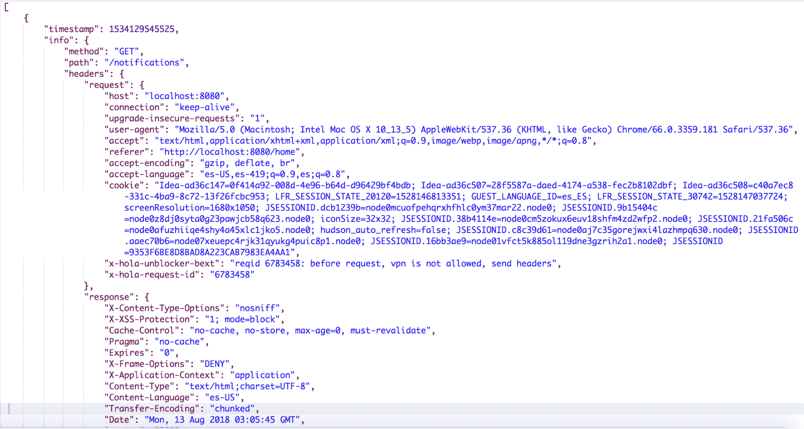

跟踪端点结果

如果我们想要查看所有端点，可以在 spring 的官方文档中找到：[`docs.spring.io/spring-boot/docs/current/reference/htmlsingle/#production-ready-endpoints`](https://docs.spring.io/spring-boot/docs/current/reference/htmlsingle/#production-ready-endpoints)。

正如我们在执行器库中看到的那样，我们可以在某个时间获得应用程序的快照，了解应用程序的状态和健康状况，甚至追踪最常用的端点。

有时，提供的信息就足够了。如果您希望拥有图形并检查历史数据，您应该集成我们之前提到的工具。

Spring Actuator 还提供了收集有关应用程序的自定义指标的功能；这对于收集业务指标非常有帮助。例如，如果我们正在使用一个应用程序来创建储蓄账户，我们可以收集指标来了解正在创建多少个账户。然后，在开设更多的分支机构后，我们可以看到创建了多少个账户，并了解它对业务本身的影响。

在收集业务指标时的关键因素是了解对业务而言什么是重要的。为了完成这项任务，与业务人员一起合作非常重要。

业务指标对于了解发布新功能后我们产生的影响非常有帮助。它还有助于理解意外行为或错误。想象一下，您使用不同的电子邮件提供程序推出了新的应用程序版本；您应该比较更改后传递的电子邮件数量与更改电子邮件提供程序之前传递的电子邮件数量。如果您发现这些数字有很大的差异，您需要检查发生了什么，因为差异不应该太大。如果您想了解如何创建自定义指标，我鼓励您访问此链接：[`docs.spring.io/spring-boot/docs/current/reference/html/production-ready-metrics.html`](https://docs.spring.io/spring-boot/docs/current/reference/html/production-ready-metrics.html)。

市场上有许多工具可供我们在不更改代码的情况下监控应用程序，这些工具被称为**应用程序性能管理**工具（**APM**）。我们将在下一节中讨论这些工具的工作原理。

# 应用程序性能管理（APM）工具

云端监控和工具的兴起带来了巨大的发展；有一些工具和公司专门致力于 APM 工具。其中一些基于 JVM 和字节码仪器，如今这些工具甚至可以测量我们应用程序的用户体验。目前最受欢迎的工具有以下几种：

+   New Relic ([`newrelic.com/`](https://newrelic.com/))

+   App Dynamics ([`www.appdynamics.com/`](https://www.appdynamics.com/))

+   Dynatrace ([`www.dynatrace.com/technologies/java-monitoring/spring/`](https://www.dynatrace.com/technologies/java-monitoring/spring/))

+   DataDog ([`www.datadoghq.com/`](https://www.datadoghq.com/))

所有这些工具都使我们能够监视我们的应用程序层、健康状况（CPU、内存、线程、I/O）、数据库和顶级 SQL 查询。它们还允许我们检测瓶颈、业务指标和响应时间。例如，我们将使用 New Relic 监视我们的应用程序。

# New Relic

New Relic 是一个为我们整个环境提供仪表化的工具，而不仅仅是我们的应用程序。因此，我们可以监视我们应用程序的整个环境，包括数据库、应用程序服务器、负载均衡器等因素。

例如，我们将在以下链接创建一个试用账户（[`newrelic.com/signup`](https://newrelic.com/signup)）。注册了 New Relic 账户后，您将被引导到控制面板，如下截图所示：

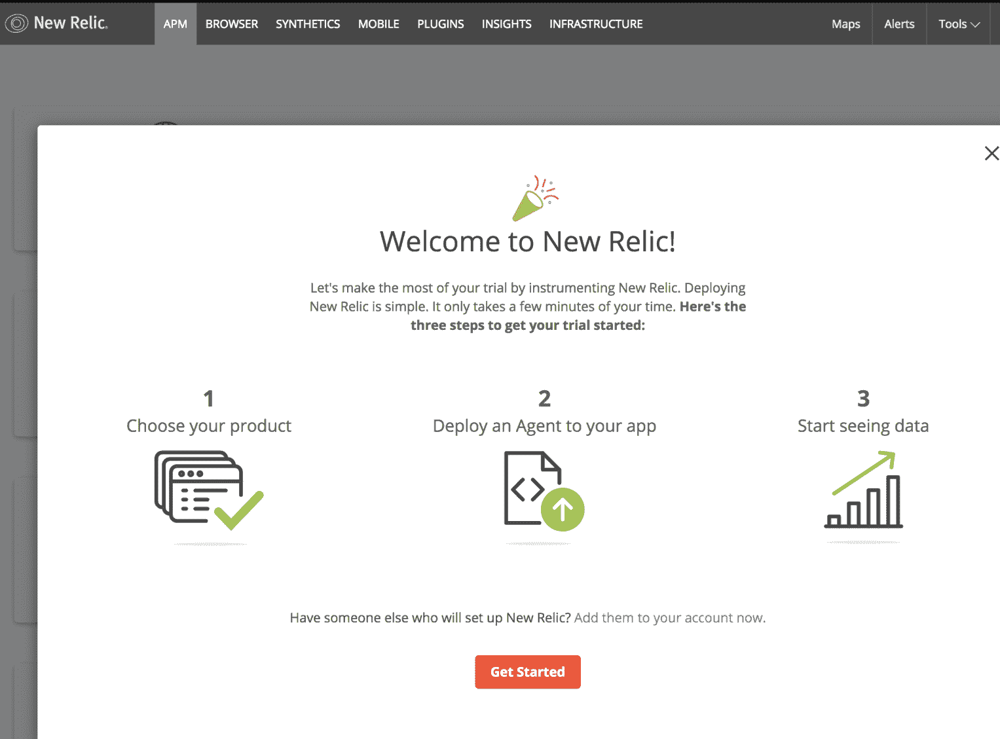

我们将按以下步骤继续这个过程：

1.  选择监视应用程序并接受 14 天免费试用：

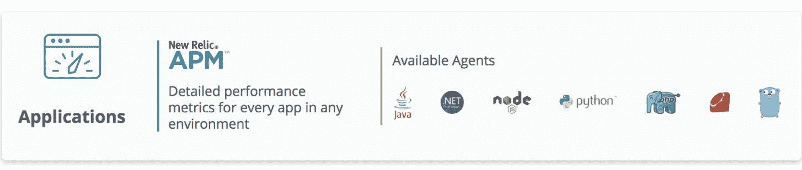

1.  选择 Java 应用程序选项：

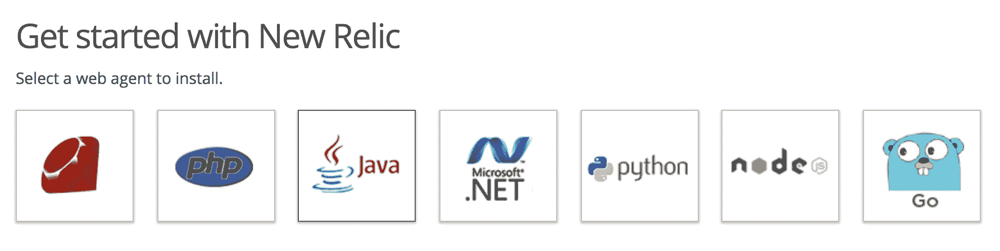

1.  生成许可证密钥，下载并安装代理。在这里，我们将在应用程序的根目录中创建一个名为`newrelic`的文件夹，并复制最近下载的 ZIP 文件的内容：

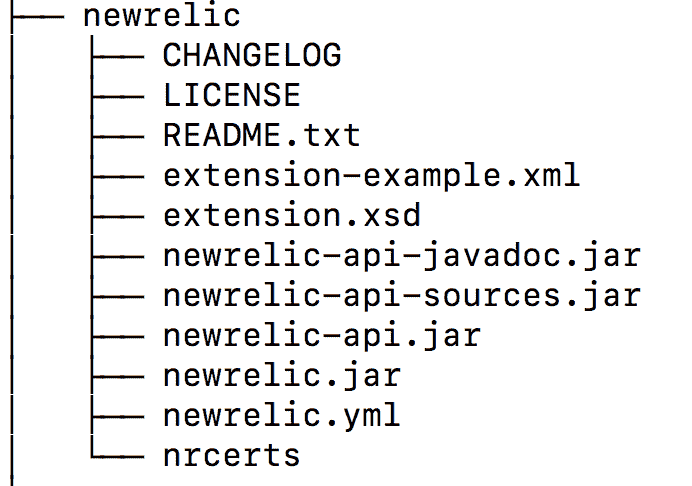

1.  现在，我们将用我们的密钥许可证和应用程序名称替换`newrelic.yml`，如下截图所示：

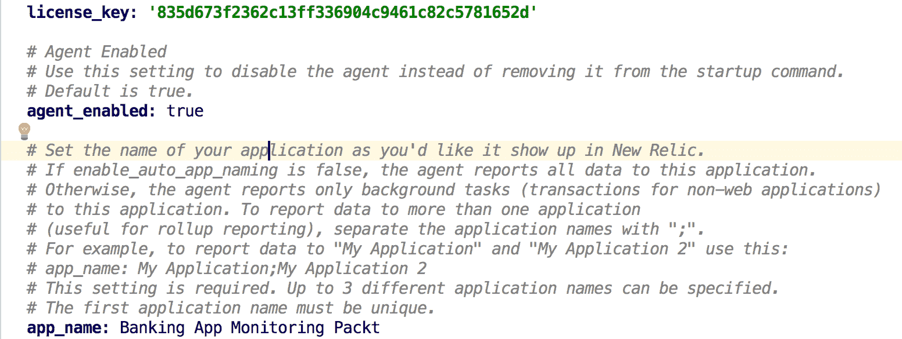

1.  重新启动您的应用程序，包括`javaagent`参数，如下所示：

```java
-javaagent:/full/path/to/newrelic.jar
```

1.  在我们的情况下，使用代理运行应用程序将如下所示：

```java
java -javaagent:newrelic/newrelic.jar -jar build/libs/banking-app-1.0.jar
```

最后，我们可以看到我们的新遗物仪表板，与我们在`newrelic.yaml`文件中定义的名称相同（Banking App Monitoring Packt）。这将包含我们应用程序的所有信息：

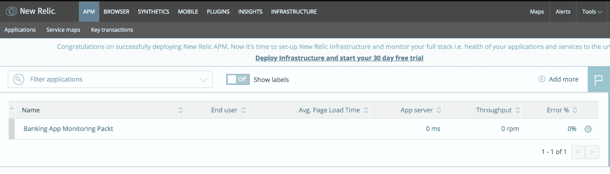

您还可以多次导航到应用程序，以查看 APM 提供的更多数据。

然后，我们可以深入了解提供的信息，包括以下内容：

+   响应时间：

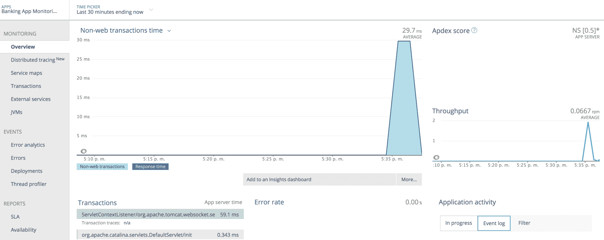

+   数据库指标：


+   JVM 指标：

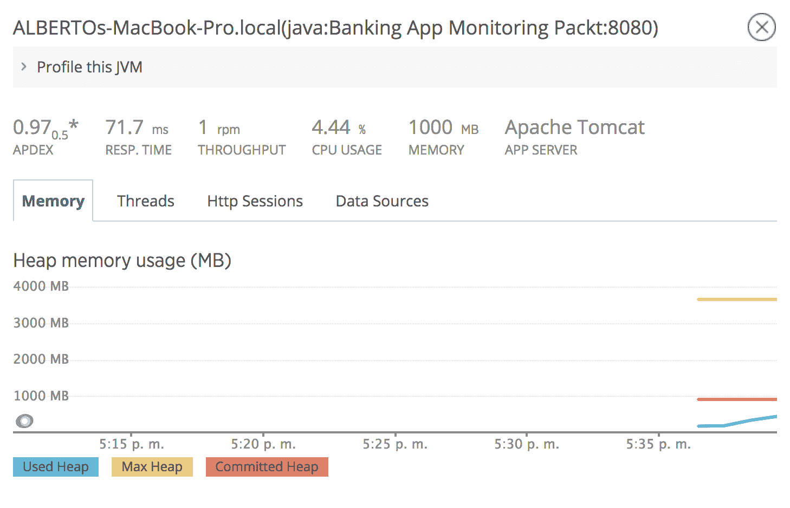

+   Web 交易：

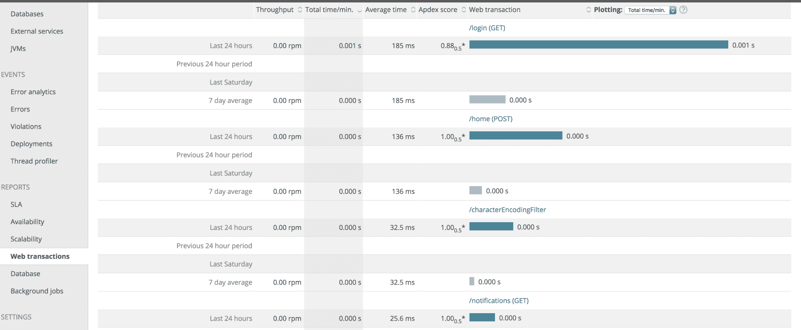

您可以从左侧菜单中探索所有选项卡，以查看我们应用程序的更多指标。正如我们所学到的，有了所有这些工具，我们可以确保应用程序的健康，并检查我们是否摆脱了问题和瓶颈。然后，您可以继续探索 APM。

# 摘要

在本章中，我们学习了如何从技术和业务角度收集有用的指标。我们还学习了如何使用 APM 来监视我们的环境，并获取我们需要的信息，以了解最常用交易的健康状况、状态和统计信息，包括我们应用程序的响应时间。所有这些信息将帮助我们在生产中维护我们的应用程序，并迅速应对任何可能的性能问题。

在下一章中，我们将审查安全实践以及如何使用 Spring 编写它们。
