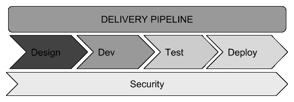
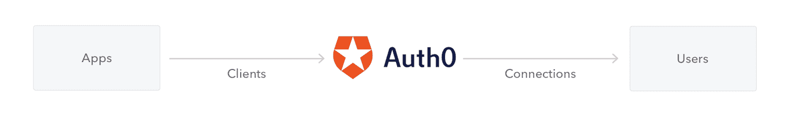
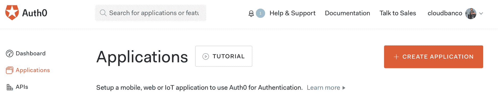
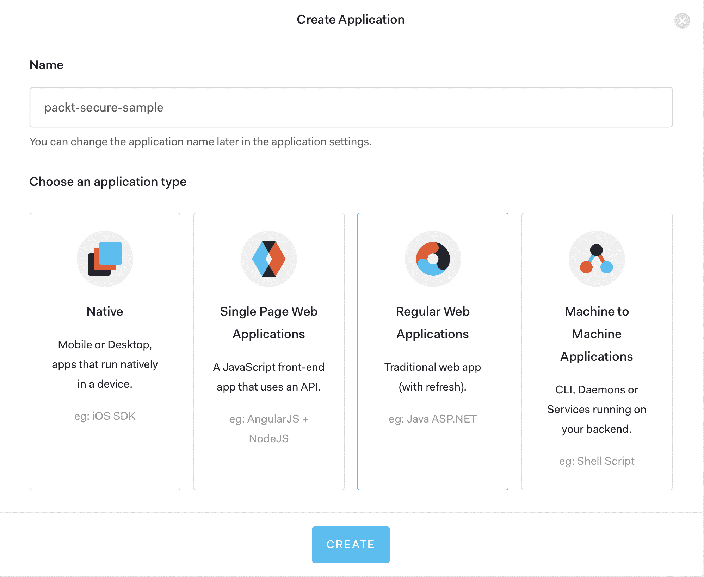
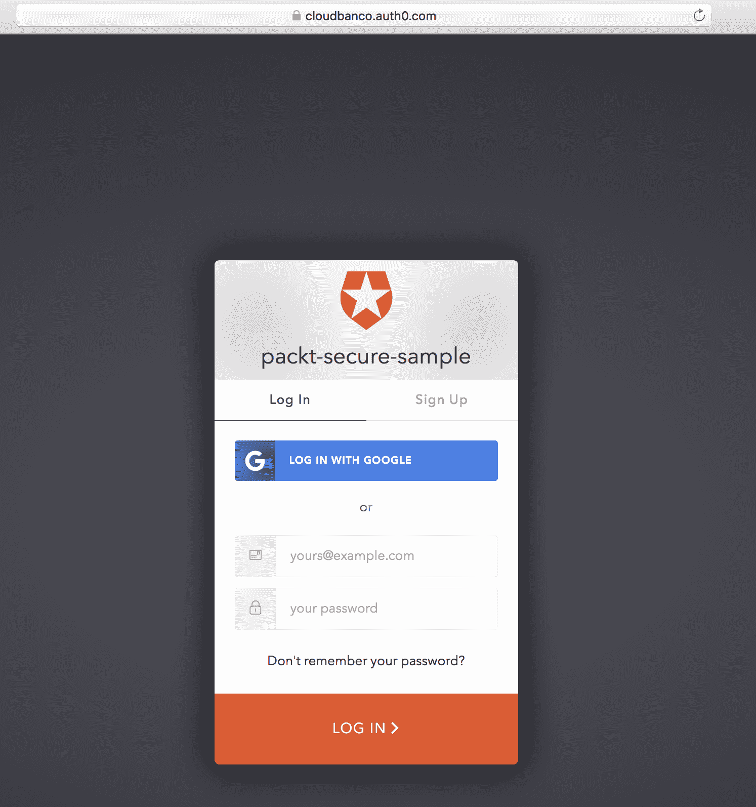
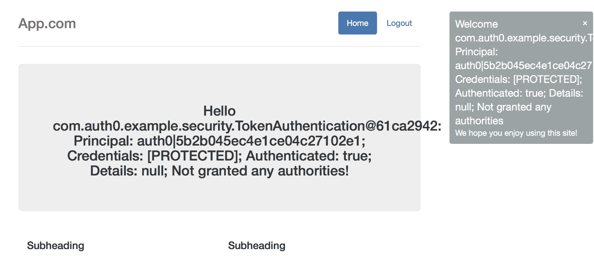

# 第十三章：安全

安全是开发团队在开发产品时经常忽视的领域。开发人员在编写代码时应牢记一些关键考虑因素。本章列出的大多数考虑因素都是显而易见的，但也有一些不是，因此我们将讨论所有这些考虑因素。

本章将涵盖以下主题：

+   为什么安全作为应用程序架构的一部分很重要

+   保持软件安全的关键建议：

+   认证和授权

+   加密

+   数据输入验证

+   敏感数据

+   社会工程学

+   渗透测试

+   认证作为服务

我们将首先介绍安全作为应用程序架构的重要性。

# 为什么安全作为应用程序架构的一部分很重要

在过去的几年里，我看到许多组织或公司在已经投入生产后才审查其软件安全问题的案例。这通常发生在他们的系统面临安全问题或业务因停机或数据泄露而损失资金时。

众所周知，安全问题和流程应作为软件开发生命周期（SDLC）的一部分。由于安全是应该考虑的每个应用程序的一个方面，因此必须确保我们的应用程序和代码具有安全约束，使我们能够在所有阶段（设计、开发、测试和部署）对我们的软件感到自信：



安全作为 SDLC 的一部分

我们的主要目标应该是在将应用程序交付到生产环境之前防止其被 compromise。这样可以避免暴露敏感数据，并确保应用程序在设计时考虑了可能的漏洞。理想情况下，我们应该在系统被客户使用之前解决所有安全问题。作为开发人员，我们大多数时候只收到功能需求。然而，有时我们并没有收到安全需求。在开发我们的代码和应用程序时，我们必须像关注性能、可扩展性和其他非功能性需求一样关注安全性。

编写旨在避免安全威胁的软件时需要牢记的一些关键方面如下：

+   系统很难解密

+   系统安全应该在 SDLC 的每个阶段进行测试。

+   应对应用程序执行渗透测试

+   系统应确保端到端的安全通信

+   应用程序代码中应用反网络钓鱼实践

在下一节中，我们将提供一系列应该遵循的建议，以解决在 SDLC 过程中的安全问题。

# 关键安全建议

有几种类型的攻击可以针对系统或网络，并可用于建立通信。常见的例子包括病毒、恶意软件、网络钓鱼、定向网络钓鱼、拒绝服务（DoS）等。每年都会发现更多复杂的攻击，目标各异。在本节中，我们将重点关注保护 Web 和移动应用程序的代码和环境的关键安全建议。

有几种可以用来确保 Web 和移动应用程序安全的流程和模型。在接下来的章节中，我们将探讨保护软件免受常见安全威胁的主要建议。

# 认证和授权

认证的最简单定义是验证用户身份的过程；授权是验证经过身份验证的用户可以做什么的过程。例如，当我们在计算机上以用户身份登录时，我们被授予访问权限，允许我们对可用资源执行操作（包括文件、应用程序等）。

在我们创建的应用程序中，身份验证是验证对应用程序的访问权限的过程，授权是保护我们的资源的过程，如页面、网络服务、数据库、文件、队列等。在身份验证过程中，我们验证使用应用程序的人的身份。身份验证包括诸如在提供有效凭据之前防止对我们应用程序的访问、多因素身份验证（如安全图像）、**一次性密码（OTP）**、令牌等过程。

关于实现，我们已经在之前的章节中使用了 Spring Security 创建了一些应用程序示例，Spring Security 是一个可扩展的框架，可用于保护 Java 应用程序。Spring Security 也可以用于处理身份验证和授权，使用一种对我们现有代码不具有侵入性的声明式样式。

今天，有几个身份行业标准、开放规范和协议，规定了如何设计身份验证和授权机制，包括以下内容：

+   **基本身份验证**：这是最常见的方法，涉及在每个请求中发送用户名和密码。我们已经在我们的银行应用示例中使用了 Spring Security 实现了这种方法，我们在第十章 *容器化您的应用程序*，第十一章 *DevOps 和发布管理*和第十二章 *监控*中使用了它。

+   **JSON Web Tokens**（**JWT**）：这是一个开放标准，定义了如何建立一个安全的机制，在两个参与者之间安全地交换消息（信息）。这里有几个经过充分测试的库可供使用，我们在第四章 *客户端-服务器架构*中创建了一个示例。该序列可以如下所示：


JWT 身份验证流程

如前所述，前面的序列图可以帮助我们理解令牌验证的过程。对于身份验证，客户端应该将其凭据发送到服务器，服务器将以字符串形式响应一个令牌。这个令牌应该用于后续的请求。当它们被执行时，如果提供的令牌无效或过期，我们将从服务器收到 401 未经授权的状态代码。否则，请求将成功。我们之前提到的身份验证机制遵循基本身份验证模型，这是 Web 应用程序的首选。然而，当您编写 API 时，您将需要其他方法，以处理基于令牌使用的安全性（如 JWT）。如果您不编写 API，您的应用程序可以使用 JSON Web Tokens RFC（[`tools.ietf.org/html/rfc7519`](https://tools.ietf.org/html/rfc7519)）进行安全保护。

今天，这是验证移动应用程序、现代单页应用程序（SPA）和 REST API 的最常见方法。

让我们回顾一些围绕使用令牌的身份验证机制创建的标准：

+   **OAuth**（**开放授权**）：这是一种基于令牌的身份验证和授权的开放标准，可以使用第三方参与者委托身份验证过程。只有在您有三方：您自己、您的用户和需要您的用户数据的第三方应用程序开发人员时，才应使用此标准。

+   **OAuth 2**：这是 OAuth 标准的更发达版本，允许用户在不提供凭据的情况下授予有限访问权限，以将资源从一个应用程序转移到另一个应用程序。每当您使用 Google 或 GitHub 帐户登录网站时，都应该使用此标准。这样做时，您将被问及是否同意分享您的电子邮件地址或帐户。

+   **完整请求签名**：这是由 AWS 身份验证推广的，也在第九章中探讨了*无服务器架构*，当我们演示将**函数作为服务**（**FaaS**）部署到 AWS 时。我们使用这个概念通过在服务器和客户端之间共享一个秘密。客户端使用共享的秘密对完成的请求进行签名，服务器对其进行验证。有关更详细的信息，请访问[`docs.aws.amazon. com/general/latest/gr/sigv4_si gning.html`](http://docs.aws.amazon.%20com/general/latest/gr/sigv4_si%20gning.html)。

# 密码学

密码学是将文本信息转换为不可理解的文本，反之亦然：从加密文本到可理解的文本。在我们的应用程序中，我们使用密码学来创建数据的保密性并保护它免受未经授权的修改。

我们使用加密来加密客户端和服务器之间的通信。这是通过使用**传输层安全（TLS）**协议的公钥加密来完成的。TLS 协议是**安全套接字层（SSL）**协议的后继者。

# 数据输入验证

数据输入验证是指控制每个集成或层中接收的数据的过程。我们需要验证数据输入，以避免在系统中创建任何不一致性。换句话说，我们应该验证应用程序中的数据是一致的，并且不会遇到与 SQL 注入、资源对应用程序或服务器的控制等问题。更高级的技术包括白名单验证和输入类型验证。

# 敏感数据

这种做法涉及保护敏感数据并确定如何以正确的方式进行。数据敏感性涉及使用加密来保护数据的机密性或完整性和冗余。

例如，通常在我们的应用程序用于连接到数据库的密码中使用无意义的文本，因此我们通过保持凭据加密来使这个建议准确。另一个例子可能涉及在银行应用程序上工作并需要呈现信用卡号。在这种情况下，我们会加密该数字，甚至可能掩盖该数字，使其对人类不可读。

# 社会工程

为了帮助您理解什么是社会工程，我们将提供一个简单的定义；即，对一个人的心理操纵，以便该人提供机密信息。

以这个定义为起点，社会工程已经成为应用程序难以控制的安全问题。这是因为失败的关键在于用户是一个人类，有能力被分析和操纵，以便交出秘密信息或凭据，从而可能访问系统。

# OWASP 十大

**开放式 Web 应用程序安全项目（OWASP）**十大列出了 Web 应用程序中最重要的十个安全风险，并由 OWASP 组织每三年发布和更新一次。我们需要遵循 OWASP 清单，以确保我们的 Web 应用程序不会留下安全漏洞。清单可以在[`www.owasp.org/images/7/72/OWASP_Top_10-2017_%28en%29.pdf.pdf`](https://www.owasp.org/images/7/72/OWASP_Top_10-2017_%28en%29.pdf.pdf)[.](https://www.owasp.org/images/7/72/OWASP_Top_10-2017_%28en%29.pdf.pdf)找到。

2017 年发布的最新清单包括以下方面：

+   A1: 注入

+   A2: 身份验证和会话管理出现问题

+   A3: **跨站脚本**（**XSS**）

+   A4: 不安全的直接对象引用

+   A5: 安全配置错误

+   A6: 敏感数据暴露

+   A7: 缺失功能级访问控制

+   A8: **跨站请求伪造**（**CSRF**）

+   A9: 使用已知漏洞的组件

+   A10: 未经验证的重定向和转发

要测试和验证其中几个漏洞，我们可以使用 Burp 套件（[`portswigger.net/burp`](https://portswigger.net/burp)）。这个过程很容易理解，并且将检查应用程序中大多数已知的安全漏洞。作为一个工具，Burp 随 Kali Linux 发行版一起提供，我们将在下一节中解释。

# 渗透测试

**渗透测试（pen test）**是对系统进行模拟攻击以评估其安全性。对于这个测试，我们可以使用像 Kali Linux（[`www.kali.org/`](https://www.kali.org/)）这样的工具，它是一个基于 Debian 的 Linux 发行版，具有用于验证 OWASP 前 10 名等多种工具的渗透测试平台。

Kali 有一个广泛的工具列表，可用于多种用途，如无线攻击、信息收集、利用和验证 Web 应用程序等。如果您想查看详细的工具列表，请访问以下链接：[`tools.kali.org/tools-listing`](https://tools.kali.org/tools-listing)。团队在将应用程序交付到生产环境之前应提供渗透测试。

在下一节中，我们将创建一个基于 Spring Security 的 Java 应用程序。我们将使用 Auth0 作为身份验证和授权服务平台，这是一个基于 OAuth2 标准和 JWT 的第三方授权。

# 身份验证和授权作为服务

我们将使用 Auth0 作为身份验证和授权服务的提供者。我们将创建一个示例来保护我们的应用程序；您不必是安全专家才能做到这一点。以下截图来自 Auth0 入门指南：

Auth0 身份验证和身份验证过程

当我们插入或连接到 Auth0 后，这将成为用于验证其身份并将所需信息发送回应用程序的身份验证和授权服务器，每当用户尝试进行身份验证时。

我们不仅限于 Java；Auth0 为不同的技术和语言提供了多个 SDK 和 API。

使用 Auth0 创建身份验证和授权服务的示例的步骤如下：

1.  在 Auth0 上创建您的免费开发者帐户：[`auth0.com/`](https://auth0.com/)。

1.  登录到 Auth0 门户并创建一个应用程序：



Auth0 创建应用程序

1.  为应用程序命名，然后选择“常规 Web 应用程序”选项，其中包括 Java 应用程序（您还可以创建原生移动应用程序、单页应用程序和**物联网**（**IoT**））：



1.  选择一个使用 Spring Security 的示例应用程序。

1.  点击“下载应用程序”并将项目文件夹更改为`packt-secure-sample`。

要运行示例，我们需要在我们创建的应用程序的设置选项卡中设置**回调 URL**（`http://localhost:3000/callback`）。

要在控制台上运行此示例，请在示例目录中执行以下命令：

```java
# In Linux / macOS./gradlew clean bootRun
# In Windowsgradlew clean bootRun
```

您可以在以下 URL 查看应用程序，`http://localhost:3000/`：



请注意，应用程序登录页面会重定向到 Auth0。当我们通过第三方应用程序登录，通过我们的 Google 帐户或通过 Auth0 提供的凭据登录后，我们将看到生成的令牌的以下结果：



您现在已经学会了如何使用 Auth0 作为身份验证和授权服务的平台，使用 OAuth2 和 JWT 等标准。

# 总结

在本章中，我们解释了如何应用安全准则和实践，以涵盖您的应用程序可能遇到的最常见安全问题。在这里，我们涵盖了身份验证和授权、加密、数据输入验证、敏感数据、OWASP 十大安全风险、社会工程和渗透测试。这些概念和方法将加强您的应用程序的安全性。

在下一章中，我们将回顾高性能技术和建议，以完成使用 Spring 5 创建应用程序的旅程。
