# 第十四章：高性能

当应用程序以意外的方式表现时，不得不处理生产中的问题比任何事情都更令人失望。在本章中，我们将讨论一些简单的技术，可以应用这些技术来摆脱这些令人讨厌的问题，将简单的建议应用到您的日常工作中，以照顾您的应用程序的性能。在本章中，我们将讨论以下主题：

+   为什么性能很重要

+   可扩展性

+   可用性

+   性能

+   使您的软件远离性能问题的关键建议

+   应用程序分析

+   SQL 查询优化

+   负载测试

让我们从介绍性能的重要性开始。

# 为什么性能很重要

在过去的 20 年里，作为顾问，我访问了几家政府机构、银行和金融机构，建立了一个共同因素，即在生产中工作的应用程序缺乏性能，并且我发现了一些常见问题，如果您在 SDLC 的一部分中使用一套良好的实践，这些问题是可以避免的。

关注性能很重要，因为它给公司、项目发起人和客户带来了巨大的麻烦，因为面临这个问题的应用程序会在多个层面上带来不满。

在给出建议之前，我们将审查和了解可扩展性、可用性和性能的非功能性需求。

# 可扩展性

这描述了系统处理高工作负载并根据工作需求增加其容量以解决更多请求的能力。

# 水平扩展性

通过添加具有系统所有功能的额外节点来解决这个问题，重新分配请求，如下图所示：

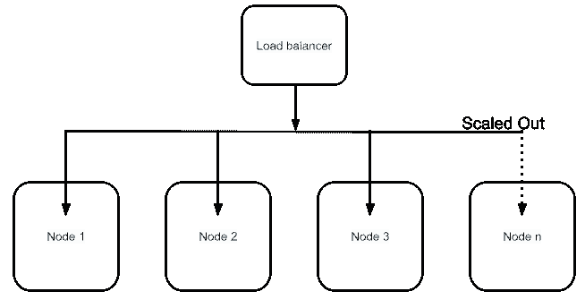

水平扩展性

# 垂直扩展性

我们通过向节点或服务器添加资源（如 RAM、CPU 或硬盘等）来使用垂直扩展，以处理系统的更多请求。我看到的一个常见做法是向数据库服务器添加更多硬件，以更好地执行正在使用它的多个连接；我们只能通过添加更多资源来扩展服务，如下图所示：

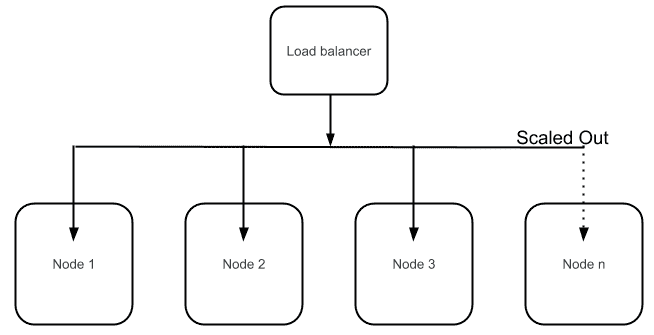

垂直扩展性

# 高可用性

这指的是系统持续提供服务或资源的能力。这种能力直接与服务级别协议（SLA）相关。

SLA 是根据系统的维护窗口计算的，SLA 定义了系统是否应该扩展或扩展。

# 性能

这是系统对在给定时间间隔内执行任何操作的响应能力。作为软件系统的一部分，我们需要开始定义可衡量的性能目标，如下所示：

+   最小或平均响应时间

+   平均并发用户数量

+   高负载或并发时每秒的请求次数

作为开发人员，我们今天面临的主要挑战是我们的应用程序必须处理的客户和设备数量，甚至更重要的是，我们的应用程序是否将在互联网上运行还是仅在内部网络中运行。下图显示了应用程序通常部署和使用的拓扑结构：

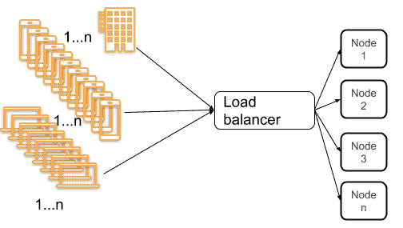

对系统的高负载请求

在了解性能、可扩展性和可用性的主要概念之后，让我们回顾一些增加应用程序性能的关键建议。

# 避免性能问题的关键建议

通常使用负载测试工具、**应用程序性能监视器**（**APM**）和分析工具来查找和解决软件系统中的性能问题。为了模拟生产中的用户数量，我们需要运行负载测试-为系统的最常用功能创建场景，并同时跟踪和监视应用程序健康状况-测量 CPU、RAM、IO、堆使用、线程和数据库访问等资源。在这个过程的输出中，我们可以给出一些关键建议，以避免软件出现性能问题。

在接下来的部分中，我们将解释我们可能遇到的最常见的瓶颈以及如何避免它们。

# 识别瓶颈

企业应用程序每天变得更加复杂。当业务成功时，支持该业务的应用程序将拥有更多用户，这意味着每天都会收到更大的负载，因此我们需要注意可能出现的性能瓶颈。

理解术语**瓶颈**，我们将给出一个简单的定义。在软件系统中，当应用程序或系统的功能开始受到单个组件的限制时，就会出现瓶颈，就像比较瓶颈减慢整体水流一样。

换句话说，如果我们的应用程序开始表现缓慢或开始超出预期的响应时间，我们就可以看到瓶颈。这可能是由于不同类型的瓶颈引起的，例如以下情况：

+   **CPU**：当此资源繁忙且无法正确响应系统时会发生这种情况。当我们开始看到 CPU 利用率在较长时间内超过 80%时，通常会开始出现这种瓶颈。

+   **内存**：当系统没有足够的 RAM 或快速 RAM 时会发生这种情况。有时应用程序日志显示内存不足异常或内存泄漏问题。

+   **网络**：与必要带宽的缺乏有关

+   应用程序本身、代码问题、太多未受控制的异常、资源使用不当等

使用 APM 来识别瓶颈是一个不错的方法，因为 APM 可以在不减慢应用程序性能的情况下收集运行时信息。

要识别瓶颈，我们可以使用一些实践方法；负载测试和监控工具，或分析工具。接下来的部分将解释分析工具。

# 应用程序性能分析

我们可以查看我们的代码，并开始分析我们怀疑存在性能问题的系统部分，或者我们可以使用分析工具并获取有关整个系统的信息。这些工具收集运行时数据，并监视 CPU、内存、线程、类和 I/O 的资源消耗。

有几种可用于分析 Java 应用程序的工具，包括以下内容：

+   与 JVM 一起提供的工具，如 VisualVM、JStat、JMap 等

+   专门的工具，如 JProfiler、Java Mission Control 和 Yourkit

+   轻量级分析器，如 APM 中提供的那些，就像我们在第十二章中看到的那样，*监控*，使用 New Relic

# Visual VM

这是作为 JDK 的一部分集成的可视化工具，具有分析应用程序的能力。让我们运行我们之前章节中的银行应用程序，并查看我们可以使用它收集哪些信息。

要运行我们之前的银行应用程序，请转到项目文件夹，并通过命令行运行以下命令：`java -jar build/libs/banking-app-1.0.jar`。

现在，我们将使用 VisualVM 收集有关 JVM 的一些指标。我们可以通过以下命令从控制台运行此工具：

```java
$ cd JAVA_HOME/bin
$ jvisualvm
```

我们应该看到类似以下截图的屏幕：

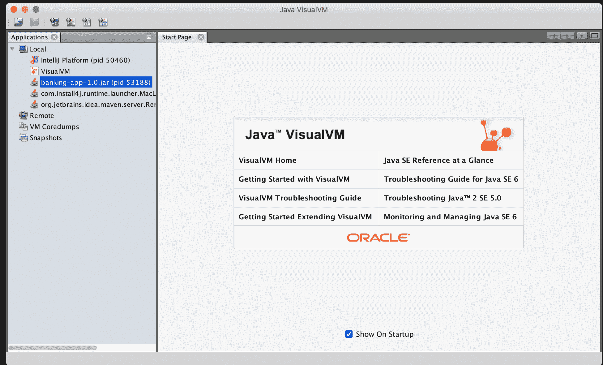

Java VisualVM

使用“本地”菜单选项，您必须附加要监视的 Java 进程。在这种情况下，我们将选择 banking-app-1.0.jar。然后，我们应该看到应用程序使用的资源的摘要：

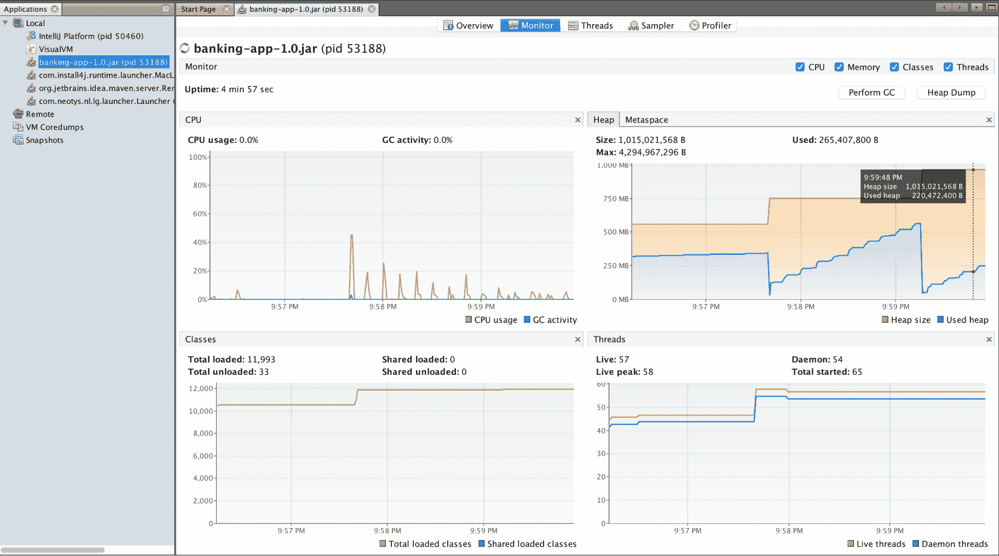

VisualVM CPU、RAM、类和线程

还有一个选项卡提供有关线程的信息，如下面的屏幕截图所示：

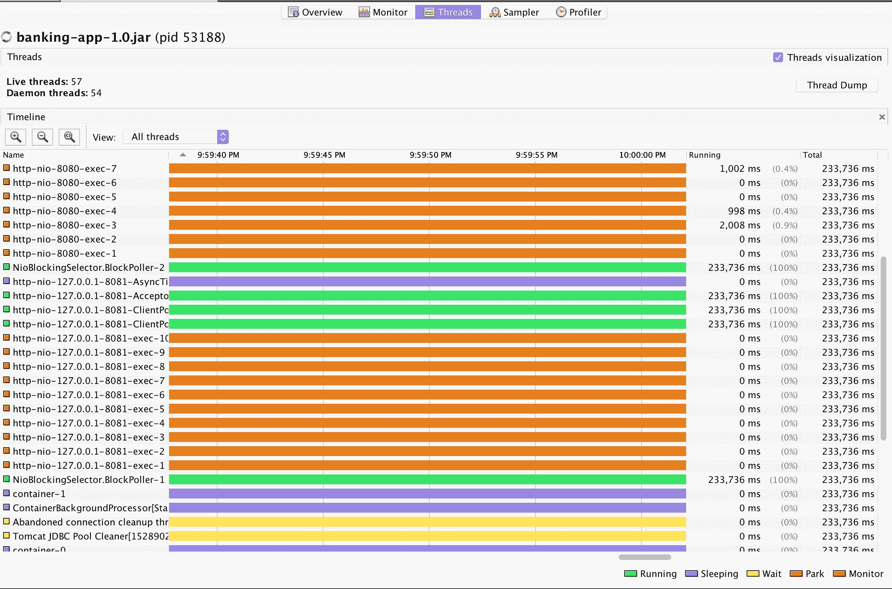

VisualVM 线程

我们可以使用任何我们感觉舒适的工具；一个很好的起点，也是一个易于使用的工具是 Jprofiler，但所有的工具都给我们提供类似的信息。我们需要了解并遵循我们应用程序中发现的任何瓶颈可能引发的问题。

在生产中调试性能问题可能是一项困难的任务，在某些情况下很难找到和修复。我们需要一个让我们信任的工具来理解瓶颈，因此我们需要尝试不同的工具并进行负载测试，以找到适合我们的正确工具。

在您知道有必要优化之前不要进行优化；首先运行应用程序并运行负载测试，看看我们是否可以满足性能的非功能性需求。

# SQL 查询优化

优化企业应用程序的查询和数据访问层对于避免瓶颈和性能问题至关重要。我们可以使用 New Relic 作为 APM，这将帮助我们使用数据库访问图形来检测瓶颈和性能问题。通过这些图形，我们可以找到应用程序使用的 SQL 语句，找到延迟事务或阻塞表，如果我们继续深入信息，还可以找到使用最多的 SQL 语句和管理的连接数，如下面的屏幕截图所示：

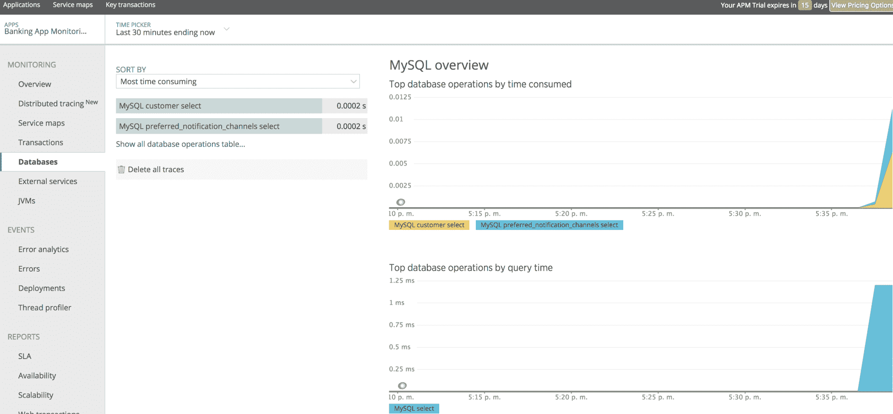

来自 New Relic 的数据库指标

从应用程序中，我们可以识别最常用的查询，并寻找优化的机会。我们需要索引或重构我们的代码以获得更好的性能。另一方面，如果不使用 APM 或分析工具，我们可以使用许多技术来改进我们的 SQL 和数据访问层，例如以下内容：

+   **审查 SQL 语句**：这通过分析器或 APM 逐个审查和优化执行的 SQL 语句，应用索引，选择正确的列类型，并在必要时使用本地查询优化关系。

+   **JDBC 批处理**：这使用`prepared`语句进行批处理，一些数据库如 Oracle 支持`prepared`语句的批处理。

+   **连接管理**：这审查连接池的使用，并测量和设置正确的池大小。

+   **扩展和扩展**：这在*可扩展性*部分有解释。

+   **缓存**：这使用内存缓冲结构来避免磁盘访问。

+   **避免 ORM**：**对象关系映射**（**ORM**）工具用于将数据库表视为 Java 对象以持久化信息。然而，在某些情况下，最好使用普通的 SQL 语句来避免不必要的连接，从而提高应用程序和数据库的性能。

在下一部分，我们将看看如何模拟虚拟用户以创建应用程序的负载测试。

# 负载测试示例

负载测试用于检查应用程序在一定数量的并发用户使用后的行为；并发用户的数量是指应用程序在生产中将具有的用户数量。您应该始终定义一个性能测试套件，使用以下工具测试整个应用程序：

+   Neoload

+   Apache JMeter

+   Load Runner

+   负载 UI

+   Rational Performance Tester

我们需要定义一个负载测试和配置文件作为我们应用程序的流水线的一部分，并在我们进行性能改进之前和之后运行它。我们将使用 Neoload 创建一个示例，以审查我们应用程序示例中的这些关键建议。

首先，我们需要定义一个场景来运行负载测试；在我们的情况下，我们将使用第十二章中的银行应用程序，*监控*，它已经准备好使用，并定义一个功能常见的场景，如下所示：

1.  用户将使用以下凭据登录：`rene`/`rene`。

1.  然后，用户将点击菜单通知。

1.  最后，用户将点击注销链接。

首先，我们将从以下 URL 下载 Neoload：[`www.neotys.com/download.`](https://www.neotys.com/download)

Neoload 为我们提供了一个试用版本，我们可以模拟最多 50 个虚拟并发用户。

安装 Neoload 后，我们将打开应用程序并创建一个项目：

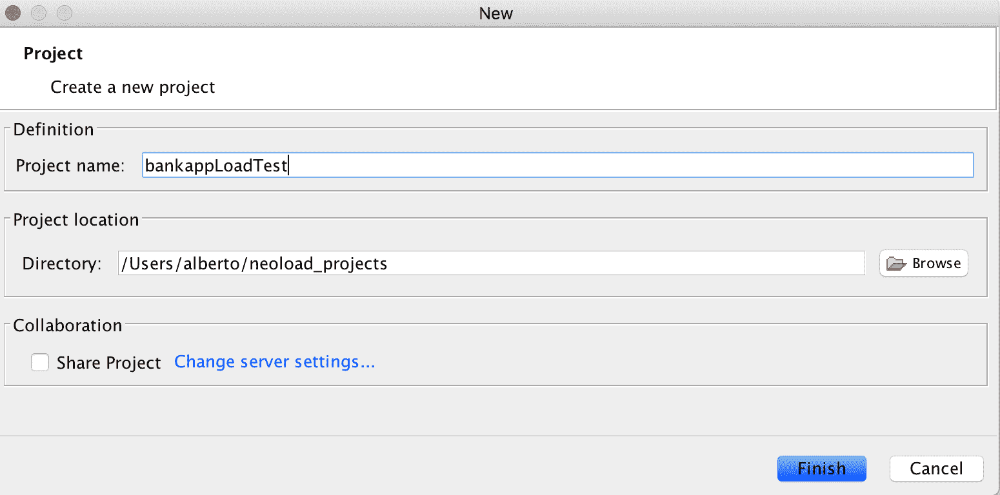

然后，我们将点击开始录制，并选择我们将用于记录应用程序的浏览器：

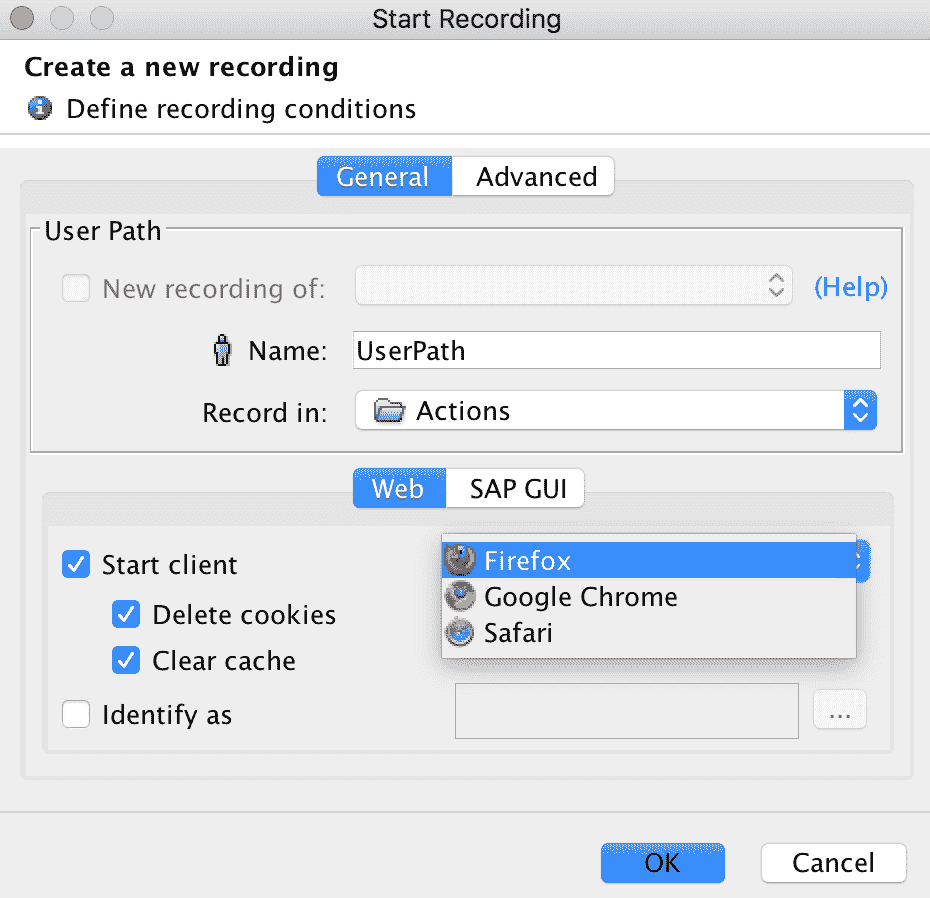

然后，在浏览器中，我们将输入我们应用程序的 URL：`http://localhost:8080/login`，并作为用户导航到我们客户的通知集。因此，流程如下：

1.  登录

1.  点击菜单通知

1.  点击注销

选择我们正在记录的主机，即本地主机，并按照下一步的说明进行操作，直到结束。最后，我们将点击停止录制按钮，并且我们应该在左侧菜单中看到我们的操作已记录：

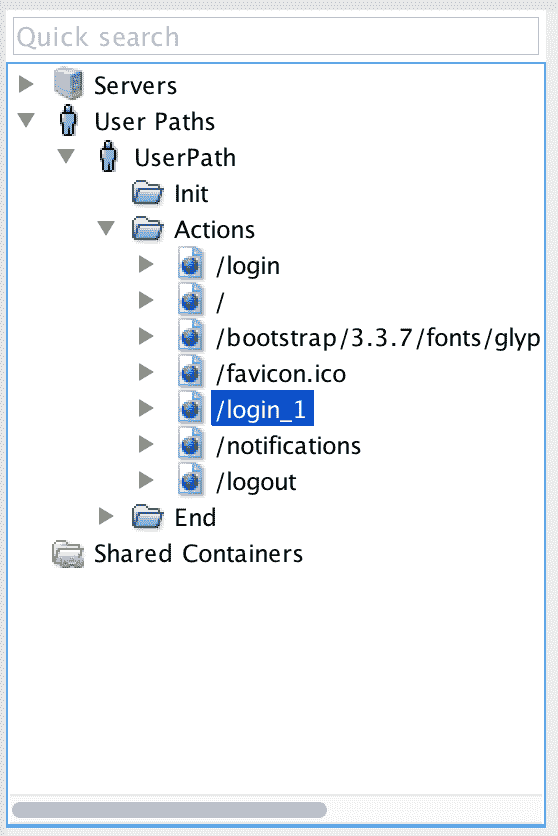

然后，我们将通过点击悬停在用户图标上方的复选图标来运行记录的场景：


我们应该看到我们的场景在没有错误的情况下运行，模拟一个并发用户，如下截图所示：

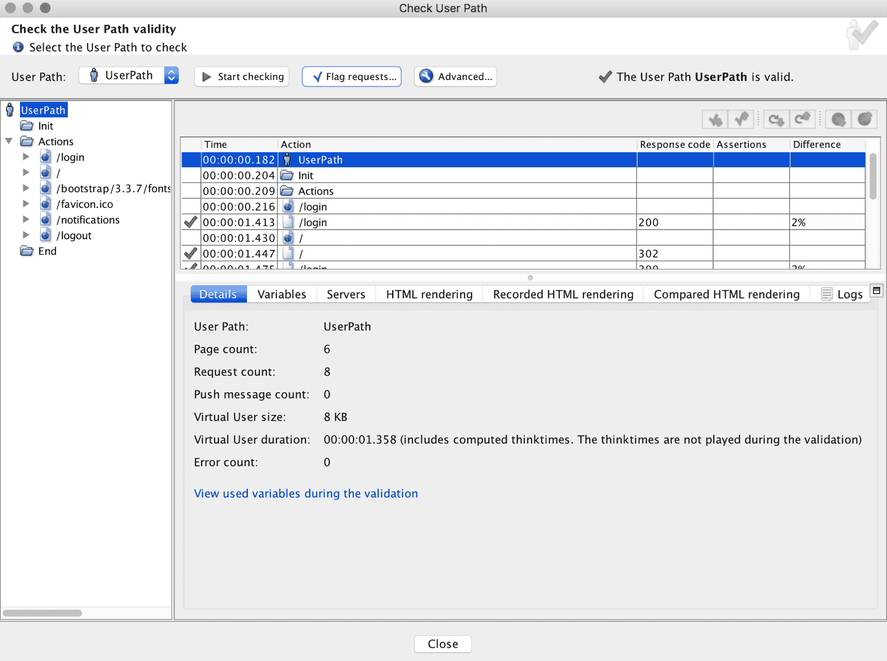

现在，让我们生成负载测试，创建一个人口（模拟用户场景）：

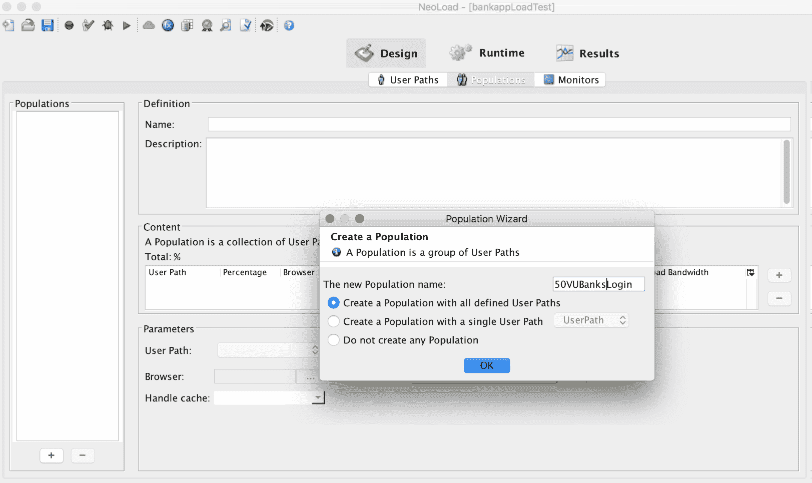

然后，点击运行时图标，以使用 10 个并发用户在 2 分钟内运行负载测试：

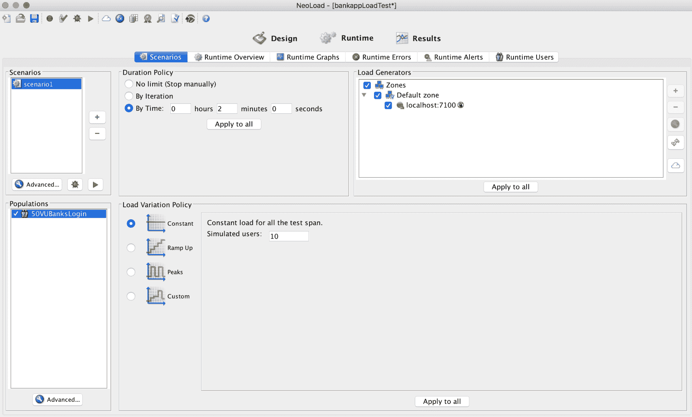

然后，点击播放图标：


最后，在测试完成后，我们可以检查结果；在负载测试期间，我们访问了 670 页并发出了 890 个请求，使用 20 个并发用户：

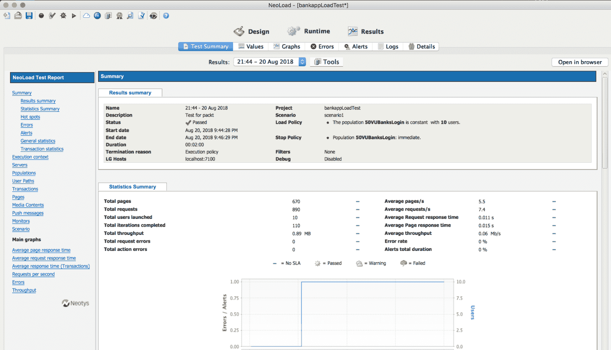

另一方面，在使用 VisualVM 进行负载测试时，我们可以检查应用程序的性能，并查看它在检查线程时的表现，如下截图所示：


我们将发现，使用虚拟用户模拟时，JVM、内存和线程看起来与在应用程序上导航时有所不同。

在运行负载测试时，监控应用程序的所有资源是值得的，以确定问题可能出现的位置。

最后，我们已经学会了使用性能分析工具或 APM，除了负载测试工具，可以确保我们的应用程序和系统在将代码发布到生产环境之前进行性能改进。

在添加代码以改进应用程序性能后，总是一个好主意运行性能测试，以检查更改的实施情况。

# 总结

在本章中，我们解释了可伸缩性、可用性和性能的含义。我们还学会了如何应用一些技术和工具，以避免在生产中处理性能问题，因此，我们如何改进我们的应用程序以实现更好的响应时间。
