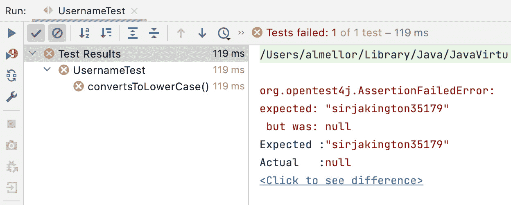
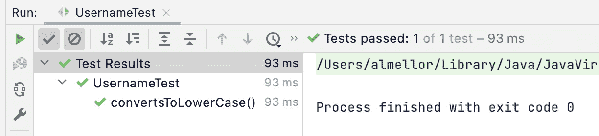
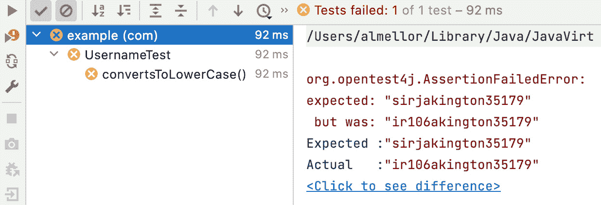
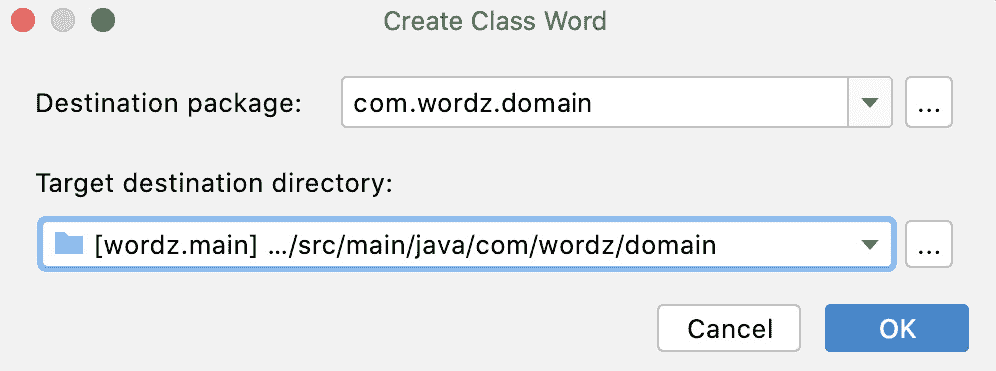
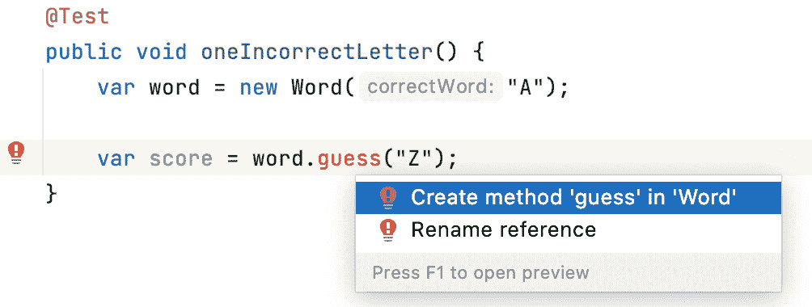
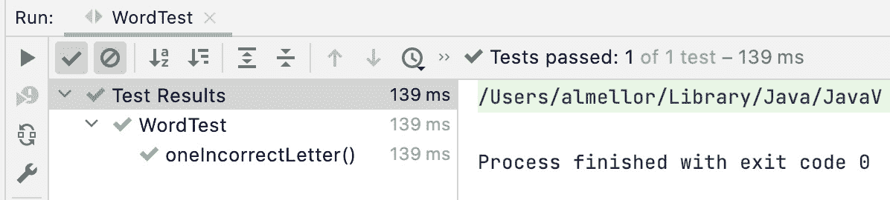

# 第五章：编写我们的第一个测试

是时候我们深入本章，编写我们的第一个 TDD 单元测试了。为了帮助我们做到这一点，我们将学习一个简单的模板，帮助我们将每个测试组织成逻辑清晰、易于阅读的代码片段。在这个过程中，我们将学习一些我们可以用来使我们的测试有效的关键原则。我们将看到编写测试是如何迫使我们做出关于代码设计和其易用性的决策，在需要考虑实现细节之前。

在一些介绍这些技术的例子之后，我们将开始我们的 Wordz 应用程序，编写一个测试，然后再添加生产代码以使该测试通过。我们将使用流行的 Java 单元测试库 JUnit5 和 AssertJ 来帮助我们编写易于阅读的测试。

在本章中，我们将涵盖编写有效单元测试背后的以下主要原则：

+   开始 TDD：**安排-行动-断言**

+   定义一个好的测试

+   捕获常见错误

+   断言异常

+   只测试公共方法

+   从我们的测试中学习

+   开始 Wordz – 我们的第一个测试

# 技术要求

本章的最终代码可以在[`github.com/PacktPublishing/Test-Driven-Development-with-Java/tree/main/chapter05`](https://github.com/PacktPublishing/Test-Driven-Development-with-Java/tree/main/chapter05)找到。

# 开始 TDD：安排-行动-断言

单元测试并不神秘。它们只是代码，是用你编写应用程序的相同语言编写的可执行代码。每个单元测试都是你想要编写的代码的第一个使用。它以与实际应用程序相同的方式调用代码。测试执行该代码，捕获我们关心的所有输出，并检查它们是否是我们预期的。因为测试以与实际应用程序完全相同的方式使用我们的代码，所以我们能够立即获得关于我们的代码使用难易程度的反馈。这听起来可能很显然，确实如此，但它是一个强大的工具，可以帮助我们编写干净和正确的代码。让我们看看一个单元测试的例子，并学习如何定义其结构。

## 定义测试结构

当我们做事情时，遵循模板总是有帮助的，单元测试也不例外。基于在 Chrysler Comprehensive Compensation Project 上进行的商业工作，TDD 的发明者 Kent Beck 发现单元测试有某些共同特征。这被总结为测试代码的推荐结构，称为**安排-行动-断言**或**AAA**。

AAA 的原始定义

AAA 的原始描述可以在 C2 wiki 中找到：[`wiki.c2.com/?ArrangeActAssert`](http://wiki.c2.com/?ArrangeActAssert)。

为了解释每个部分的作用，让我们通过一个完成的单元测试来了解一个代码片段，我们想要确保用户名以小写形式显示：

```java
import org.junit.jupiter.api.Test;
import static org.assertj.core.api.Assertions.*;
public class UsernameTest {
    @Test
    public void convertsToLowerCase() {
        var username = new Username("SirJakington35179");
        String actual = username.asLowerCase();
        assertThat(actual).isEqualTo("sirjakington35179");
    }
}
```

首先要注意的是我们的测试类名：`UsernameTest`。这是我们代码读者故事讲述的第一部分。我们描述了我们要测试的行为区域，在这种情况下，是用户名。我们所有的测试，实际上是我们所有的代码，都应该遵循这种故事讲述方法：我们希望代码的读者理解什么？我们希望他们清楚地看到我们正在解决的问题以及解决该问题的代码应该如何使用。我们希望向他们展示代码是正确工作的。

单元测试本身是`convertsToLowerCase()`方法。再次强调，方法名描述了我们期望发生的事情。当代码成功运行时，用户名将被转换为小写。这些名称故意设计得简单、清晰且具有描述性。此方法具有来自**JUnit5**测试框架的`@Test`注解。该注解告诉 JUnit 这是一个它可以为我们运行的测试。

在`@Test`方法内部，我们可以看到我们的*Arrange-Act-Assert*结构。我们首先*安排*让我们的代码能够运行。这涉及到创建所需的任何对象，提供所需的任何配置，以及连接任何依赖的对象和函数。有时，我们可能不需要这一步，例如，如果我们正在测试一个简单的独立函数。在我们的示例代码中，*Arrange*步骤是创建`username`对象并将名称提供给构造函数的行。然后它将对象存储在局部`username`变量中，以便使用。这是`var username = new Username("SirJakington35179");`测试方法体的第一行。

接下来是*Act*步骤。这是我们让被测试代码执行的部分——我们运行这段代码。这始终是对被测试代码的调用，提供任何必要的参数，并安排捕获结果。在示例中，`String actual = username.asLowerCase();`行是*Act*步骤。我们调用`username`对象的`asLowerCase()`方法。它不接受任何参数，并返回一个包含小写文本`sirjakington35179`的简单`String`对象作为结果。

完成我们的测试是最后的*Assert*步骤。`assertThat(actual).isEqualTo("sirjakington35179");`行是我们的*Assert*步骤。它使用了来自`AssertJ`流畅断言库的`assertThat()`方法和`isEqualTo()`方法。它的任务是检查从*Act*步骤返回的结果是否与我们的期望相符。在这里，我们正在测试原始名称中的所有大写字母是否已转换为小写。

这样的单元测试易于编写、易于阅读，并且运行非常快。许多这样的测试可以在 1 秒内完成。

`JUnit`库是 Java 行业的标准单元测试框架。它为我们提供了一种将 Java 方法标注为单元测试的手段，允许我们运行所有测试，并在如图所示的*IntelliJ* IDE 窗口中直观地显示结果：



图 5.1 – JUnit 测试运行器的输出

我们在这里看到单元测试失败了。测试期望结果是`sirjakington35179`文本字符串，但相反，我们收到了`null`。使用 TDD，我们会完成足够的代码来使那个测试通过：



图 5.2 – JUnit 测试通过

我们可以看到，我们对生产代码的更改使得这个测试通过了。它已经“变绿”了，用流行的术语来说。失败的测试被称为红色测试，而通过的测试则是绿色。这是基于在流行的 IDE 中显示的颜色，这些颜色又基于交通信号灯。看到所有这些红色测试的短迭代变为绿色，令人惊讶地令人满意，同时也增强了我们对工作的信心。这些测试通过迫使我们从结果倒推来工作，帮助我们专注于代码的设计。让我们看看这意味着什么。

## 从结果倒推

我们立刻注意到，使这个测试通过的实际代码并不重要。这个测试中的每一件事都是关于定义代码的期望。我们正在设定代码为什么有用以及我们期望它做什么的边界。我们没有以任何方式约束它是如何做到的。我们正在从外部视角看待代码。任何使我们的测试通过的实现都是可接受的。

这似乎是在学习使用 TDD 过程中的一个转折点。我们中的许多人通过首先编写实现来学习编程。我们思考代码将如何工作。我们深入研究了特定实现背后的算法和数据结构。然后，作为一个最后的想法，我们将所有这些包裹在一个可调用的接口中。

TDD 将这一过程颠倒过来。我们故意首先设计可调用接口，因为这是代码的用户将看到的内容。我们使用测试来精确地描述代码将如何设置，如何调用，以及我们可以期望它为我们做什么。一旦我们习惯了这种从外向内的设计，TDD 就会非常自然地跟随，并在几个重要方面提高我们的工作流程效率。让我们回顾一下这些改进是什么。

## 提高工作流程效率

这样的单元测试以几种方式提高了我们的开发效率。最明显的是，我们写的代码已经通过了一个测试：我们知道它是有效的。我们不必等待手动 QA 过程来发现缺陷，然后为将来的重工作出错误报告。我们现在就发现并修复了错误，在将它们发布到主源分支之前，更不用说用户了。我们已经为我们的同事记录了我们的意图。如果有人想知道我们的`Username`类是如何工作的，它就在测试中——如何创建对象，你可以调用哪些方法，以及我们期望的结果是什么。

单元测试为我们提供了一种在隔离状态下运行代码的方法。我们不再被迫重新构建整个应用程序，运行它，在我们的数据库中设置测试数据条目，登录用户界面，导航到正确的屏幕，然后视觉检查我们代码的输出。我们运行测试。就是这样。这允许我们执行尚未完全集成到应用程序主分支中的代码。这加快了我们的工作。我们可以更快地开始，花更多的时间开发手头的代码，并且花更少的时间在繁琐的手动测试和部署流程上。

另一个好处是，这种设计行为提高了我们代码的模块化。通过设计可以分小块测试的代码，我们提醒自己编写可以分小块执行的代码。这自 1960 年代以来一直是基本的设计方法，并且至今仍然像以前一样有效。

本节已经介绍了我们用来组织每个单元测试的标准结构，但这并不保证我们会编写一个好的测试。为了实现这一点，每个测试都需要具有特定的属性。**FIRST**原则描述了良好测试的特性。让我们学习如何应用这些原则。

# 定义良好的测试

就像所有代码一样，单元测试代码可以写得更好或更差。我们已经看到 AAA 如何帮助我们正确地构建测试结构，以及准确、描述性的名称如何讲述我们代码意图的故事。最有用的测试也遵循 FIRST 原则，并且每个测试使用一个断言。

## 应用 FIRST 原则

这是一组五个原则，使测试更加有效：

+   快速

+   隔离

+   可重复

+   自验证

+   及时

单元测试需要**快速**，就像我们之前的例子一样。这对于测试驱动开发（TDD）尤为重要，因为我们希望在探索设计和实现时立即获得反馈。如果我们运行一个单元测试，即使只需要 15 秒来完成，我们很快就会停止频繁地运行测试。我们会退化到编写大块的生产代码而不进行测试，以便我们花更少的时间等待缓慢的测试完成。这与我们想要的 TDD 正好相反，所以我们努力保持测试快速。我们需要单元测试在 2 秒或更短时间内运行，理想情况下是毫秒级。即使是两秒也是一个相当高的数字。

测试需要彼此**隔离**。这意味着我们可以选择任何测试或任何测试组合，以任何顺序运行它们，并始终得到相同的结果。一个测试不应依赖于另一个测试在其之前运行。这通常是不写快速测试的迹象，因此我们通过缓存结果或安排步骤设置来补偿。这是一个错误，因为它会减慢开发速度，尤其是对我们同事的影响。原因是我们不知道测试必须运行的特定顺序。当我们单独运行任何测试时，如果它没有得到适当的隔离，它将作为假阴性而失败。这个测试不再告诉我们关于我们正在测试的代码的任何信息。它只告诉我们我们之前没有运行某个测试，但没有告诉我们可能是哪个测试。隔离对于健康的 TDD 工作流程至关重要。

**可重复**的测试对于 TDD 至关重要。无论何时我们用相同的生产代码运行测试，该测试都必须始终返回相同的通过或失败结果。这听起来可能很显然，但需要小心才能实现这一点。考虑一个检查返回 1 到 10 之间随机数的函数的测试。如果我们断言返回数字 7，这个测试只会偶尔通过，即使我们正确地编写了函数。在这方面，三个常见的痛苦来源是涉及数据库的测试、针对时间的测试以及通过用户界面的测试。我们将在*第八章*中探讨处理这些情况的技术，*测试替身——存根*和*模拟*。

所有测试都必须是**自验证的**。这意味着我们需要可执行的代码来运行并检查输出是否符合预期。*这一步骤必须自动化*。我们绝对不能将这一检查留给人工检查，比如将输出写入控制台，然后由人工对照测试计划进行检查。单元测试通过自动化获得了巨大的价值。计算机检查生产代码，使我们免于遵循测试计划的繁琐，避免了人工活动的缓慢，以及人为错误的可能性。

**及时**的测试是在最合适的时间编写的测试，以便发挥最大的作用。编写测试的理想时间是在编写使测试通过的代码之前。看到团队使用不那么有益的方法并不罕见。当然，最糟糕的方法是根本不编写任何单元测试，而依赖人工质量保证来发现错误。采用这种方法，我们无法获得任何设计反馈。另一种极端是让分析师提前为组件编写每个测试——或者甚至为整个系统编写测试——然后将编码作为一项机械练习。这也无法从设计反馈中学习。它还可能导致过度指定的测试，这些测试*锁定*了不良的设计和实现选择。许多团队开始编写一些代码，然后继续编写单元测试，从而错失了早期设计反馈的机会。这也可能导致未测试的代码和错误的边缘情况处理。

我们已经看到 FIRST 原则如何帮助我们专注于编写一个好的测试。另一个重要的原则是不要试图一次性测试太多。如果我们这样做，测试就会变得非常难以理解。一个简单的解决方案是每个测试用例写一个断言，我们将在下一节中介绍。

## 每个测试用例使用一个断言

当测试用例简短且具体时，它们提供的反馈最有用。它们就像显微镜一样作用于代码，每个测试用例突出显示我们代码的一个小方面。确保这一点发生的最佳方式是每个测试用例写一个断言。这防止我们在一个测试中处理太多内容。这专注于我们在测试失败期间收到的错误消息，并帮助我们控制代码的复杂性。这迫使我们进一步分解问题。

## 决定单元测试的范围

另一个常见的误解是单元测试中的*单元*的含义。单元指的是测试隔离本身——每个测试都可以被视为一个独立的单元。因此，被测试代码的大小可以有很大的变化，只要这个测试可以独立运行。

将测试本身视为单元统一了关于单元测试范围应该是什么的几个流行观点。通常，人们会说单元是最小的可测试代码块——一个函数、方法、类或包。所有这些都是有效选项。另一个常见的论点是单元测试应该是一个类测试——每个生产代码类一个单元测试类，每个生产方法一个单元测试方法。虽然这是一种常见的方法，但这通常不是最佳方法。它不必要地将测试的结构与实现的结构耦合在一起，使得代码在未来更难更改，而不是更容易。

单元测试的理想目标是覆盖一个*外部可见的行为*。这在代码库的几个不同尺度上适用。如果我们能避免操作外部系统，如数据库或用户界面，我们可以对整个用户故事进行单元测试，跨越多个类包。我们将在*第九章*中探讨如何做到这一点，*六边形架构——解耦外部系统*。我们通常还使用更接近代码细节的单元测试，只测试单个类的公共方法。

一旦我们根据我们希望代码拥有的设计编写了测试，我们就可以专注于测试的更明显方面：验证我们的代码是否正确。

# 捕捉常见错误

测试的传统观点是将其视为一个检查代码按预期工作的过程。单元测试在这方面表现卓越，并自动执行使用已知输入运行代码并检查预期输出的过程。由于我们都是人类，我们在编写代码时有时会犯错误，其中一些可能会产生重大影响。我们可以犯的几个常见简单错误，单元测试在捕捉这些错误方面表现卓越。最可能出现的错误如下：

+   偏移量错误

+   逆条件逻辑

+   缺少条件

+   未初始化的数据

+   错误的算法

+   破坏的相等性检查

例如，回到我们之前对小写用户名的测试，假设我们决定不使用`String`内置的`.toLowerCase()`方法来实现，而是尝试编写自己的循环代码，如下所示：

```java
public class Username {
    private final String name;
    public Username(String username) {
        name = username;
    }
    public String asLowerCase() {
        var result = new StringBuilder();
        for (int i=1; i < name.length(); i++) {
            char current = name.charAt(i);
            if (current > 'A' && current < 'Z') {
                result.append(current + 'a' - 'A');
            } else {
                result.append( current );
            }
        }
        return result.toString() ;
    }
}
```

我们会立即发现这段代码是不正确的。测试失败，如下面的图所示：



图 5.3 – 常见的编码错误

这段代码的第一个错误是一个简单的“偏移量错误” – 输出中缺少第一个字母。这指向了初始化循环索引时的错误，但这段代码中还有其他错误。这个测试揭示了两个缺陷。进一步的测试将揭示另外两个。你能仅通过视觉检查就看出它们是什么吗？与使用自动化测试相比，分析这样的代码在头脑中需要更多的时间和努力吗？

# 断言异常

单元测试在测试错误处理代码方面表现出色。作为测试**异常抛出**的例子，让我们添加一个业务需求，即我们的用户名必须至少有四个字符长。我们考虑我们想要的设计，并决定如果名字太短就抛出一个自定义异常。我们决定将这个自定义异常表示为`class InvalidNameException`。以下是使用 AssertJ 的测试示例：

```java
@Test
public void rejectsShortName() {
    assertThatExceptionOfType(InvalidNameException.class)
            .isThrownBy(()->new Username("Abc"));
}
```

我们可以考虑添加另一个测试，专门用来证明四个字符的名字被接受且没有抛出异常：

```java
@Test
public void acceptsMinimumLengthName() {
    assertThatNoException()
            .isThrownBy(()->new Username("Abcd"));
}
```

或者，我们可能简单地决定这个显式测试是不必要的。我们可能通过其他测试隐式地覆盖它。添加这两个测试是一个好习惯，可以使我们的意图更加明确。

测试名称相当通用，以`rejects`或`accepts`开头。它们描述了代码正在测试的输出结果。这允许我们稍后改变主意，关于错误处理机制，可能切换到其他方式来表示错误。

单元测试可以捕捉常见的编程错误并验证错误处理逻辑。让我们看看编写单元测试的一个主要原则，以便我们在实现方法时具有最大的灵活性。

# 只测试公共方法

TDD（测试驱动开发）的全部内容是测试组件的行为，而不是它们的实现。正如我们在上一节中的测试所看到的，有一个针对我们想要的行为的测试使我们能够选择任何能够完成工作的实现。我们关注的是重要的部分 – 组件**做什么** – 而不是不那么重要的细节 – **它是如何做到的**。

在测试内部，这表现为调用公共类和包的公共方法或函数。公共方法是我们在更广泛的应用中选择的公开行为。类、方法或函数中的任何私有数据或辅助代码都保持隐藏。

开发者在学习 TDD 时常见的错误是，他们为了简化测试而将事物公开。抵制这种诱惑。这里的典型错误是将私有数据字段公开，以便使用公共 getter 方法进行测试。这削弱了该类的封装性。现在更有可能 getter 会被误用。未来的开发者可能会向其他类添加真正属于这个类的方法。我们的生产代码的设计很重要。幸运的是，有一种简单的方法可以保持封装性，而不会损害测试。

## 保持封装性

如果我们觉得需要为所有私有数据添加 getter，以便测试可以检查每个数据是否符合预期，那么通常将此视为**值对象**会更好。值对象是一个没有身份的对象。任何包含相同数据的两个值对象都被认为是相等的。使用值对象，我们可以创建另一个包含相同私有数据的对象，然后测试这两个对象是否相等。

在 Java 中，这要求我们为我们自己的类编写一个自定义的`equals()`方法。如果我们这样做，我们也应该编写一个`hashcode()`方法，因为这两个方法是相辅相成的。任何有效的实现都可以。我建议使用`Apache commons3`库，它使用 Java 反射功能来完成这项工作：

```java
@Override
public boolean equals(Object other) {
    return EqualsBuilder.reflectionEquals(this, other);
}
@Override
public int hashCode() {
    return HashCodeBuilder.reflectionHashCode(this);
}
```

你可以在[`commons.apache.org/proper/commons-lang/`](https://commons.apache.org/proper/commons-lang/)了解更多关于这些库方法的信息。

简单地将这两种方法（以及`Apache commons3`库）添加到我们的类中，意味着我们可以保持所有数据字段私有，同时仍然检查所有字段是否包含预期的数据。我们只需创建一个新的对象，包含所有预期的字段，然后断言它与我们正在测试的对象相等。

当我们编写每个测试时，我们正在首次使用被测试的代码。这使我们能够了解很多关于我们的代码如何易于使用的信息，如果需要，我们可以进行更改。

# 从我们的测试中学习

我们的测试是我们设计反馈的丰富来源。当我们做出决策时，我们将它们编写为测试代码。看到这些代码——我们生产代码的第一次使用——将我们提出的设计的优劣清晰地聚焦起来。当我们的设计不好时，测试中的 AAA 部分将揭示这些设计问题作为代码异味。让我们详细尝试理解这些如何帮助识别有缺陷的设计。

## 一个混乱的 Arrange 步骤

如果我们的 Arrange 步骤中的代码很混乱，我们的对象可能难以创建和配置。它可能需要在构造函数中包含太多参数，或者在测试中留下太多可选参数为`null`。可能的情况是，对象需要注入太多依赖项，这表明它有太多的职责，或者它可能需要太多的原始数据参数来传递大量的配置项。这些都是我们创建对象的方式可能需要重新设计的信号。

## 一个混乱的 Act 步骤

在行为（Act）步骤中调用代码的主要部分通常很简单，但它可以揭示一些基本的设计错误。例如，我们可能有不清晰的参数，比如传递给列表的`Boolean`或`String`对象。很难知道每个参数的含义。我们可以通过将这些难以理解的参数包装在一个易于理解的新类中来重新设计，这个新类被称为**配置对象**。另一个可能的问题是，如果行为步骤需要按特定顺序进行多次调用，那么这是容易出错的。很容易按错误的顺序调用它们或忘记其中一个调用。我们可以重新设计，使用一个包含所有这些细节的单个方法。

## 混乱的断言（Assert）步骤

断言步骤将揭示我们的代码结果是否难以使用。问题区域可能包括必须按特定顺序调用访问器，或者可能返回一些传统的代码异味，例如结果数组，其中每个索引都有不同的含义。在两种情况下，我们都可以重新设计，使用更安全的结构。

在这些情况中，我们的单元测试中的一个代码部分看起来是错误的 – 它有一个代码异味。这是因为我们正在测试的代码的设计有相同的代码异味。这就是单元测试对设计提供快速反馈的含义。它们是我们所写代码的第一个用户，因此我们可以早期识别问题区域。

现在我们已经有了开始编写我们示例应用程序的第一个测试所需的所有技术。让我们开始吧。

## 单元测试的局限性

一个非常重要的观点是，自动化测试只能证明缺陷的存在，而不能证明缺陷的不存在。这意味着，如果我们考虑一个边界条件，为它编写一个测试，并且测试失败，我们知道我们的逻辑中有一个缺陷。然而，如果所有测试都通过，这*并不也不能*意味着我们的代码没有缺陷。它只意味着我们的代码没有我们考虑测试的所有缺陷。根本不存在任何魔法解决方案可以确保我们的代码没有缺陷。TDD 在这方面给我们带来了很大的帮助，但我们绝不能仅仅因为所有测试都通过就声称我们的代码没有缺陷。这根本不是真的。

这的一个重要后果是，我们的质量保证（QA）工程同事的重要性与以往一样，尽管我们现在帮助他们从一个更容易的起点开始。我们可以向我们的手动 QA 同事提供 TDD 测试过的代码，并确保许多缺陷已被预防并证明不存在。这意味着他们可以开始进行手动探索性测试，找出我们从未想过要测试的所有事情。共同努力，我们可以利用他们的缺陷报告来编写进一步的单元测试，以纠正他们发现的问题。即使有 TDD，QA 工程师的贡献仍然至关重要。我们需要我们团队所能提供的所有帮助，以努力编写高质量的软件。

## 代码覆盖率 – 一个经常没有意义的指标

代码覆盖率是衡量在给定运行中执行了多少行代码的指标。它是通过代码插装来衡量的，这是代码覆盖率工具为我们做的事情。它通常与单元测试结合使用，以衡量在运行测试套件时执行了多少行代码。

理论上，你可以看到这可能会意味着可以通过科学的方式发现缺失的测试。如果我们看到有一行代码没有被运行，那么我们肯定在某个地方遗漏了一个测试。这是真的，也是有帮助的，但反过来则不然。假设我们在测试运行期间获得了 100%的代码覆盖率。这意味着软件现在已经完全测试并正确无误了吗？不。

考虑对`if (x < 2)`语句有一个单独的测试。我们可以编写一个测试，使这一行执行并包含在代码覆盖率报告中。然而，一个单独的测试不足以覆盖所有可能的行为。条件语句可能使用了错误的运算符——小于而不是小于等于。它可能使用了不正确的限制值 2，而应该是 20。任何单个测试都无法完全探索该语句中行为的所有组合。我们可以让代码覆盖率告诉我们这一行已经运行，并且我们的单个测试通过了，但我们仍然可能存在几个逻辑错误。我们可以有 100%的代码覆盖率，但仍然有缺失的测试。

## 编写错误的测试

来讲一个关于我的最佳 TDD 尝试如何彻底失败的个人故事。在一个计算个人税务报告的移动应用程序中，有一个特定的是/否复选框来指示你是否有过学生贷款，因为这将影响你支付的税款。在我们的应用程序中有六个后果，我彻底进行了 TDD 测试，并仔细编写了我的测试。

很遗憾，我误解了用户故事。我把每一个测试都颠倒了。原本复选框应该应用相关税款的，现在它没有应用，反之亦然。

幸运的是，我们的质量保证工程师注意到了这个问题。她唯一的评论是她在这个系统中找不到任何针对这个缺陷的解决方案。我们得出结论，TDD 在使代码做我想让它做的事情方面做得很好，但我没有很好地弄清楚那应该是什么。至少这是一个非常快速的修复和重新测试。

# 开始编写 Wordz

让我们将这些想法应用到我们的 Wordz 应用程序中。我们将从一个包含应用程序核心逻辑的类开始，这个类代表一个要猜测的单词，并且可以计算出猜测的得分。

我们首先创建一个单元测试类，这立即让我们进入了软件设计模式：我们应该怎么命名这个测试？我们将选择`WordTest`，因为这概述了我们想要覆盖的区域——要猜测的单词。

传统的 Java 项目结构分为包。生产代码位于 `src/main/java` 下，测试代码位于 `src/test/java` 下。这种结构描述了生产代码和测试代码是源代码中同等重要的部分，同时为我们提供了一个编译和部署仅生产代码的方法。当我们处理源代码时，我们总是将测试代码与生产代码一起发送，但对于部署的可执行文件，我们只省略测试。我们还将遵循基本的 Java 包约定，在顶级为我们的公司或项目命名一个唯一名称。这有助于避免与库代码冲突。我们将命名为 `com.wordz`，以应用名称命名。

下一个设计步骤是决定首先驱动和测试哪种行为。我们总是想要一个简单的快乐路径版本，这有助于驱动出最常执行的正常逻辑。我们可以稍后覆盖边缘情况和错误条件。首先，让我们编写一个测试，它将返回一个不正确的单个字母的分数：

1.  编写以下代码以开始我们的测试：

    ```java
    public class WordTest {
    ```

    ```java
        @Test
    ```

    ```java
        public void oneIncorrectLetter() {
    ```

    ```java
        }
    ```

    ```java
    }
    ```

测试的名称为我们提供了对测试正在做什么的概述。

1.  为了开始我们的设计，我们决定使用一个名为 `Word` 的类来表示我们的单词。我们还决定将猜测的单词作为构造函数参数提供给我们要创建的 `Word` 类的对象实例。我们将这些设计决策编码到测试中：

    ```java
    @Test
    ```

    ```java
    public void oneIncorrectLetter () {
    ```

    ```java
        new Word("A");
    ```

    ```java
    }
    ```

1.  在此阶段，我们使用自动完成功能在单独的文件中创建一个新的 `Word` 类。请确保在 `src/main` 文件夹树中，而不是 `src/test`：



图 5.4 – 创建类对话框

1.  点击 **OK** 在源树中的正确包内创建文件。

1.  现在，我们将 `Word` 构造函数参数重命名：

    ```java
    public class Word {
    ```

    ```java
        public Word(String correctWord) {
    ```

    ```java
      // No Action
    ```

    ```java
        }
    ```

    ```java
    }
    ```

1.  接下来，我们回到测试。我们将新对象作为一个局部变量捕获，以便我们可以对其进行测试：

    ```java
    @Test
    ```

    ```java
    public void oneIncorrectLetter () {
    ```

    ```java
        var word = new Word("A");
    ```

    ```java
    }
    ```

下一个设计步骤是考虑一种方法，将猜测传递给 `Word` 类并返回一个分数。

1.  将猜测传递进去是一个简单的决定——我们将使用一个我们称之为 `guess()` 的方法。我们可以将这些决策编码到测试中：

    ```java
    @Test
    ```

    ```java
    public void oneIncorrectLetter () {
    ```

    ```java
        var word = new Word("A");
    ```

    ```java
        word.guess("Z");
    ```

    ```java
    }
    ```

1.  使用自动完成功能将 `guess()` 方法添加到 `Word` 类中：



图 5.5 – 创建 Word 类

1.  点击 *Enter* 添加方法，然后将参数名称更改为一个描述性的名称：

    ```java
    public void guess(String attempt) {
    ```

    ```java
    }
    ```

1.  接下来，让我们添加一种方法来获取该猜测的结果分数。从以下测试开始：

    ```java
    @Test
    ```

    ```java
    public void oneIncorrectLetter () {
    ```

    ```java
        var word = new Word("A");
    ```

    ```java
        var score = word.guess("Z");
    ```

    ```java
    }
    ```

然后，我们需要稍微思考一下从生产代码中返回什么。

我们可能需要一个某种对象。这个对象必须代表从那个猜测中得到的分数。因为我们的当前用户故事是关于五字母词的分数和每个字母的细节，我们必须返回 *完全正确*、*正确字母*、*错误位置* 或 *字母不存在* 之一。

有几种方法可以做到这一点，现在是时候停下来思考它们了。以下是一些可行的方案：

+   一个具有五个获取器的类，每个获取器返回一个枚举。

+   一个具有相同获取器的`record`类型

+   一个具有`iterator`方法的类，该方法遍历五个枚举常量。

+   一个具有`iterator`方法的类，该方法为每个字母得分返回一个接口。评分代码将为每种得分类型实现一个具体类。这将是一种纯面向对象的方式，为每个可能的输出添加一个*回调*。

+   一个类，它遍历每个字母的结果，并为每个结果传递一个`Java 8 lambda`函数。正确的结果会被作为每个字母的回调调用。

这已经有很多设计选项了。TDD 的关键部分是我们现在在编写任何生产代码之前考虑这一点。为了帮助我们做出决定，让我们勾勒出调用代码的样子。我们需要考虑代码的合理扩展——我们是否需要一个单词中多于或少于五个字母？评分规则会改变吗？我们是否应该现在就关心这些事情？未来的读者是否更容易理解这些想法中的任何一个而不是其他？TDD 为我们提供了关于设计决策的快速反馈，这迫使我们现在就进行设计锻炼。

一个主要的决策是我们不会返回每个字母应该有的颜色。这将是一个 UI 代码决策。对于这个核心领域逻辑，我们将只返回字母是*正确*、*位置错误*或*不存在*的事实。

使用 TDD 轻松勾勒出调用代码，因为*它本身就是测试代码本身*。在思考了大约 15 分钟要做什么之后，以下是我们在代码中使用的三个设计决策：

+   支持单词中可变数量的字母

+   使用简单的枚举`INCORRECT`、`PART_CORRECT`或`CORRECT`来表示得分

+   通过单词中的位置访问每个得分，基于零开始

这些决策支持`score`对象将弥补这一点。让我们继续到设计：

1.  在测试中捕捉这些决策：

    ```java
    @Test
    ```

    ```java
    public void oneIncorrectLetter() {
    ```

    ```java
        var word = new Word("A");
    ```

    ```java
        var score = word.guess("Z");
    ```

    ```java
        var result = score.letter(0);
    ```

    ```java
        assertThat(result).isEqualTo(Letter.INCORRECT);
    ```

    ```java
    }
    ```

我们可以看到这个测试如何锁定我们如何使用对象的设计决策。它*根本不提*我们将如何实现这些方法。*这是 TDD 有效性的关键*。我们还在这个测试中捕捉并记录了所有的设计决策。创建这样的**可执行规范**是 TDD 的一个重要好处。

1.  现在，运行这个测试。观察它失败。这是一个令人惊讶的重要步骤。

我们可能会认为我们只想看到通过测试。这并不完全正确。TDD 的一部分工作是有信心你的测试是有效的。当我们知道我们还没有编写代码让它通过时，看到测试失败会让我们有信心我们的测试可能检查了正确的事情。

1.  让我们通过向`class Word`添加代码来使那个测试通过：

    ```java
    public class Word {
    ```

    ```java
        public Word(String correctWord) {
    ```

    ```java
            // Not Implemented
    ```

    ```java
        }
    ```

    ```java
        public Score guess(String attempt) {
    ```

    ```java
            var score = new Score();
    ```

    ```java
            return score;
    ```

    ```java
        }
    ```

    ```java
    }
    ```

1.  接下来，创建`class Score`：

    ```java
    public class Score {
    ```

    ```java
        public Letter letter(int position) {
    ```

    ```java
            return Letter.INCORRECT;
    ```

    ```java
        }
    ```

    ```java
    }
    ```

再次，我们使用了 IDE 快捷键来完成大部分代码编写工作。测试通过了：



图 5.6 – IntelliJ 中的测试通过

我们可以看到测试通过了，并且它运行了 0.139 秒。这当然比任何手动测试都要好。

我们还有一个可重复的测试，我们可以在项目的剩余生命周期中运行它。与手动测试相比，每次运行测试套件都能节省时间。

你会注意到，尽管测试通过了，但代码看起来像是在作弊。测试只期望 `Letter.INCORRECT`，而代码是硬编码为总是返回那个值。显然，它永远不可能对任何其他值有效！在这个阶段这是预期的。我们的第一个测试已经为我们的代码接口制定了一个初步的设计。它还没有开始驱动完整的实现。我们将通过后续的测试来完成这一点。这个过程被称为 *三角测量法*，其中我们依赖于添加测试来驱动出缺失的实现细节。通过这样做，我们的所有代码都被测试覆盖了。我们免费获得了 100% *有意义的* 代码覆盖率。更重要的是，它将我们的工作分解成更小的块，通过频繁的可交付成果创造进展，并可能导致一些有趣的解决方案。

另一点需要注意是，我们的一个测试引导我们创建了两个类，这些类都由这个测试覆盖。这是非常推荐的。记住，我们的单元测试覆盖的是一个行为，而不是该行为的任何特定实现。

# 摘要

我们已经迈出了 TDD 的第一步，并了解了每个测试的 AAA 结构。我们看到了如何在编写生产代码之前设计我们的软件和编写测试，并因此得到更干净、更模块化的设计。我们学习了什么是一个好的测试，并了解了一些常用的技术，用于捕捉常见的编程错误和测试抛出异常的代码。

理解在 FIRST 测试中使用 AAA 部分的流程非常重要，因为这为我们提供了一个我们可以可靠遵循的模板。同样重要的是理解设计想法的流程，正如在之前的 Wordz 示例中所使用的那样。编写我们的测试实际上是将我们做出的设计决策捕捉到单元测试代码中。这为我们提供了关于设计是否干净的快速反馈，同时也为未来阅读我们代码的人提供了一个可执行的规范。

在下一章中，我们将添加测试，并为我们的单词评分对象驱动出一个完整的实现。我们将看到 TDD 如何推动工作前进。我们将使用 **红、绿、重构** 方法来不断改进我们的代码，并保持代码和测试的清洁，而不会过度设计。

# 问题与答案

1.  如果我们没有代码可以测试，我们如何知道要编写什么测试？

我们重新审视这种思考方式。测试帮助我们提前设计一小段代码。我们决定我们想要这个代码的接口，然后通过单元测试的 AAA 步骤来捕捉这些决策。我们只编写足够的代码来使测试编译，然后只编写足够的代码来使测试运行并失败。在这个时候，我们有一个可执行的规范来指导我们编写生产代码。

1.  我们必须坚持每个生产类对应一个测试类吗？

不，这是使用单元测试时常见的误解。每个测试的目标是指定和运行一个行为。这个行为将以某种方式通过代码实现——函数、类、对象、库调用等——但这个测试在没有任何方式约束行为是如何实现的。一些单元测试只测试一个函数。一些类每个公共方法都有一个测试。其他，就像我们在工作示例中看到的那样，会产生多个类来满足测试。

1.  我们总是使用 AAA 结构吗？

以这种方式开始是一个有用的建议，但我们有时发现我们可以省略或合并一个步骤，从而提高测试的可读性。如果我们没有为静态方法创建任何内容，我们可能会省略 Arrange 步骤。我们可能将 Act 步骤合并到 Assert 步骤中，以简化方法调用，使测试更易读。我们可以将常见的 Arrange 步骤代码提取到一个 *JUnit* `@BeforeEach` 注解方法中。

1.  测试是废弃代码吗？

不。它们被赋予了与生产代码相同的重要性和关注。测试代码的整洁度就像生产代码的整洁度一样。我们测试代码的可读性至关重要。我们必须能够快速浏览测试并迅速了解其存在的原因和作用。测试代码不会在生产环境中部署，但这并不意味着它不那么重要。
