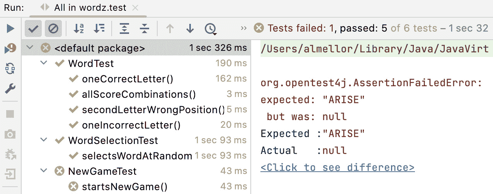
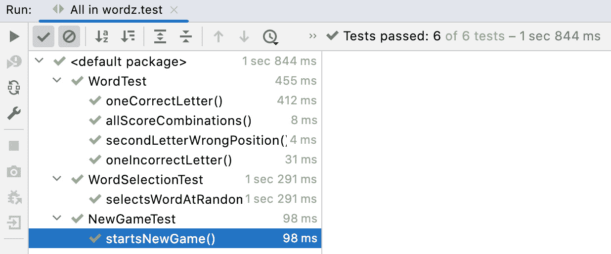
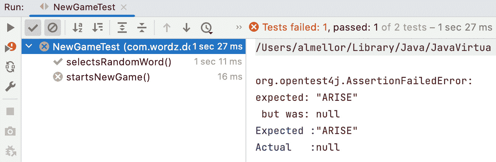
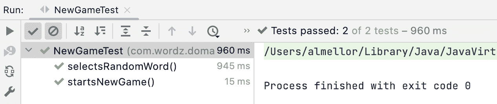
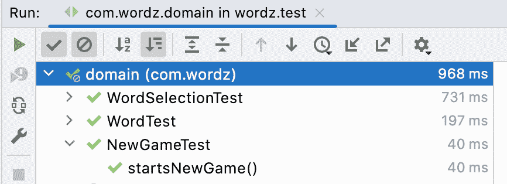
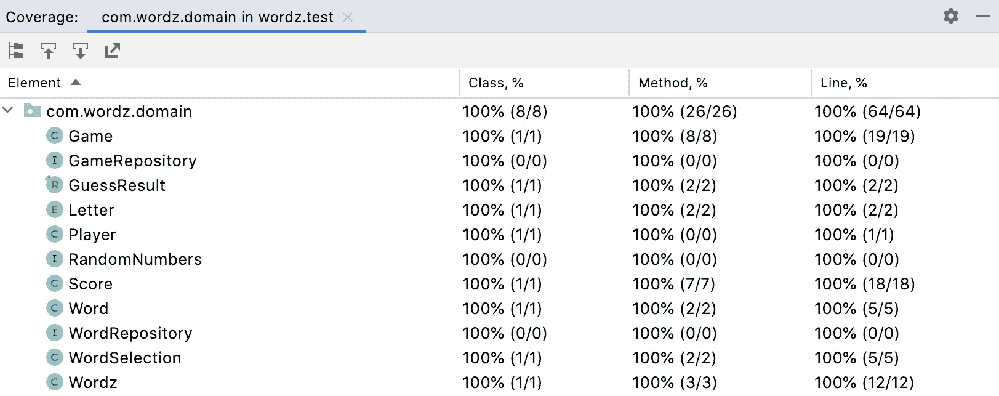

# 第十三章：驱动领域层

在前面的章节中，我们做了大量的准备工作，涵盖了 TDD 技术和软件开发方法。现在我们可以应用这些能力来构建我们的 Wordz 游戏。我们将在本书中编写的有用代码的基础上构建，并致力于一个经过良好工程和测试的设计，使用测试优先的方法编写。

我们本章的目标是创建我们系统的领域层。我们将采用第九章中描述的六边形架构方法，*六边形架构 – 解耦外部系统*。领域模型将包含我们所有核心应用程序逻辑。此代码将不会绑定到任何外部系统技术（如 SQL 数据库或 Web 服务器）的细节。我们将为这些外部系统创建抽象，并使用测试替身来使我们能够测试驱动应用程序逻辑。

以这种方式使用六边形架构允许我们为完整用户故事编写 FIRST 单元测试，这在其他设计方法中通常需要集成或端到端测试。我们将通过应用书中至今为止提出的思想来编写我们的领域模型代码。

在本章中，我们将涵盖以下主要主题：

+   开始新游戏

+   玩游戏

+   结束游戏

# 技术要求

本章的最终代码可以在`github.com/PacktPublishing/Test-Driven-Development-with-Java/tree/main/chapter13`找到。

# 开始新游戏

在本节中，我们将通过编写游戏代码来开始。像每个项目一样，开始通常相当困难，第一个决定就是简单地确定从哪里开始。一个合理的方法是找到一个用户故事，这将开始充实代码的结构。一旦我们有一个合理的应用程序结构，就更容易确定新代码应该添加的位置。

在这种情况下，我们可以通过考虑开始新游戏时需要发生的事情来有一个良好的开始。这必须设置好以便开始游戏，因此将迫使做出一些关键的决定。

首先要处理的用户故事是开始一个新游戏：

+   作为一名玩家，我想开始一个新游戏，以便我有一个新单词来猜测

当我们开始新游戏时，我们必须执行以下操作：

1.  从可猜测的单词中随机选择一个单词

1.  存储所选单词，以便可以计算猜测的分数

1.  记录玩家现在可以做出一个初始猜测

在编写这个故事时，我们将假设使用六边形架构，这意味着任何外部系统都将由领域模型中的一个端口表示。考虑到这一点，我们可以创建我们的第一个测试，并从这里开始。

## 测试驱动开始新游戏

从一般方向来看，使用六边形架构意味着我们可以自由地使用 TDD 的外向内方法。无论我们为领域模型设计出什么，都不会涉及难以测试的外部系统。我们的单元测试确保是**FIRST** – **快速、隔离、可重复、自我检查**和**及时**。

重要的是，我们可以编写覆盖用户故事所需整个逻辑的单元测试。如果我们编写的代码绑定到外部系统（例如，包含 SQL 语句并连接到数据库），我们需要一个集成测试来覆盖用户故事。我们选择六边形架构使我们免于这种限制。

在战术层面，我们将重用已经通过测试驱动开发的类，例如`class WordSelection`、`class Word`和`class Score`。只要有机会，我们将重用现有代码和第三方库。

我们的起点是编写一个测试来捕获我们与开始新游戏相关的设计决策：

1.  我们将从名为`NewGameTest`的测试开始。这个测试将在领域模型中执行，以驱动出我们开始新游戏所需执行的所有操作：

    ```java
    package com.wordz.domain;
    ```

    ```java
    public class NewGameTest {
    ```

    ```java
    }
    ```

1.  对于这个测试，我们将首先编写 Act 步骤。我们假设使用六边形架构，因此 Act 步骤的设计目标是设计处理启动新游戏请求的端口。在六边形架构中，端口是允许某些外部系统与领域模型连接的代码片段。我们首先创建一个端口类：

    ```java
    package com.wordz.domain;
    ```

    ```java
    public class NewGameTest {
    ```

    ```java
        void startsNewGame() {
    ```

    ```java
            var game = new Game();
    ```

    ```java
        }
    ```

    ```java
    }
    ```

这里的关键设计决策是创建一个`controller`类来处理启动游戏的请求。它符合原始《设计模式》书籍中的控制器概念 – 一个将协调其他领域模型对象的领域模型对象。我们将让 IntelliJ IDE 创建空的`Game`类：

```java
package com.wordz.domain;
public class Game {
}
```

这又是 TDD 的一个优点。当我们首先编写测试时，我们给 IDE 足够的信息来为我们生成样板代码。我们启用 IDE 自动完成功能以真正帮助我们。如果你的 IDE 在编写测试后不能自动生成代码，考虑升级你的 IDE。

1.  下一步是在控制器类中添加一个`start()`方法来开始新游戏。我们需要知道我们要为哪个玩家开始游戏，因此我们传递一个`Player`对象。我们编写测试的 Act 步骤：

    ```java
    public class NewGameTest {
    ```

    ```java
        @Test
    ```

    ```java
        void startsNewGame() {
    ```

    ```java
            var game = new Game();
    ```

    ```java
            var player = new Player();
    ```

    ```java
            game.start(player);
    ```

    ```java
        }
    ```

    ```java
    }
    ```

我们允许 IDE 在控制器中生成方法：

```java
public class Game {
    public void start(Player player) {
    }
}
```

## 跟踪游戏的进度

下一个设计决策涉及玩家开始新游戏预期的结果。需要记录以下两点：

+   玩家尝试猜测的选定单词

+   我们期望他们下一个猜测

选定的单词和当前尝试次数需要持久化存储。我们将使用存储库模式来抽象这一点。我们的存储库需要管理一些领域对象。这些对象将负责跟踪我们在游戏中的进度。

已经，我们可以看到 TDD 在快速设计反馈方面的好处。我们还没有写太多代码，但已经，看起来需要跟踪游戏进度的新的类最好被称为 `class Game`。然而，我们已经有了一个 `class Game`，负责启动新游戏。TDD 正在为我们提供设计反馈——我们的名称和责任不匹配。

我们必须选择以下选项之一来继续：

+   保持现有的 `class Game` 不变。将这个新类命名为例如 `Progress` 或 `Attempt`。

+   将 `start()` 方法更改为静态方法——一个适用于类所有实例的方法。

+   将 `class Game` 重命名为能更好地描述其责任的名字。然后，我们可以创建一个新的 `class Game` 来保存当前玩家的进度。

静态方法选项不太吸引人。在 Java 中使用面向对象编程时，静态方法似乎很少像创建另一个管理所有相关实例的新对象那样合适。在这个新对象上，静态方法变成了一个普通方法。使用 `class Game` 来表示游戏进度似乎会产生更具描述性的代码。让我们采用这种方法。

1.  使用 IntelliJ IDEA IDE 对 `class Game` 和 `class Wordz` 进行重构/重命名，它们代表进入我们的领域模型的入口点。我们还重命名了局部变量 `game` 以匹配：

    ```java
    public class NewGameTest {
    ```

    ```java
        @Test
    ```

    ```java
        void startsNewGame() {
    ```

    ```java
            var wordz = new Wordz();
    ```

    ```java
            var player = new Player();
    ```

    ```java
            wordz.start(player);
    ```

    ```java
        }
    ```

    ```java
    }
    ```

`NewGameTest` 测试的名称仍然很好。它代表了我们要测试的用户故事，并且与任何类名无关。IDE 也已对生产代码进行了重构：

```java
public class Wordz {
    public void start(Player player) {
    }
}
```

1.  使用 IDE 对 `start()` 方法进行重构/重命名为 `newGame()`。这在 `Wordz` 类的上下文中似乎更好地描述了方法的责任：

    ```java
    public class NewGameTest {
    ```

    ```java
        @Test
    ```

    ```java
        void startsNewGame() {
    ```

    ```java
            var wordz = new Wordz();
    ```

    ```java
            var player = new Player();
    ```

    ```java
            wordz.newGame(player);
    ```

    ```java
        }
    ```

    ```java
    }
    ```

`class Wordz` 的生产代码也将该方法重命名。

1.  当我们开始新游戏时，我们需要选择一个要猜测的单词并开始玩家尝试的序列。这些事实需要存储在存储库中。让我们首先创建存储库。我们将它命名为 `interface GameRepository` 并在我们的测试中添加 Mockito 的 `@Mock` 支持：

    ```java
    package com.wordz.domain;
    ```

    ```java
    import org.junit.jupiter.api.Test;
    ```

    ```java
    import org.junit.jupiter.api.extension.ExtendWith;
    ```

    ```java
    import org.mockito.Mock;
    ```

    ```java
    import org.mockito.junit.jupiter.MockitoExtension;
    ```

    ```java
    @ExtendWith(MockitoExtension.class)
    ```

    ```java
    public class NewGameTest {
    ```

    ```java
        @Mock
    ```

    ```java
        private GameRepository gameRepository;
    ```

    ```java
        @InjectMocks
    ```

    ```java
        private Wordz wordz;
    ```

    ```java
        @Test
    ```

    ```java
        void startsNewGame() {
    ```

    ```java
            var player = new Player();
    ```

    ```java
            wordz.newGame(player);
    ```

    ```java
        }
    ```

    ```java
    }
    ```

我们向类添加 `@ExtendWith` 注解以启用 Mockito 库自动为我们创建测试替身。我们添加了一个 `gameRepository` 字段，将其标注为 Mockito 的 `@Mock`。我们使用 Mockito 内置的 `@InjectMocks` 便利注解自动将这个依赖注入到 `Wordz` 构造函数中。

1.  我们允许 IDE 为我们创建一个空接口：

    ```java
    package com.wordz.domain;
    ```

    ```java
    public interface GameRepository {
    ```

    ```java
    }
    ```

1.  在下一步中，我们将确认 `gameRepository` 是否被使用。我们决定在接口上添加一个 `create()` 方法，它只接受一个 `class Game` 对象实例作为其唯一参数。我们想要检查该对象实例的 `class Game`，因此添加了一个参数捕获器。这允许我们对该对象中包含的游戏数据进行断言：

    ```java
    public class NewGameTest {
    ```

    ```java
        @Mock
    ```

    ```java
        private GameRepository gameRepository;
    ```

    ```java
        @Test
    ```

    ```java
        void startsNewGame() {
    ```

    ```java
            var player = new Player();
    ```

    ```java
            wordz.newGame(player);
    ```

    ```java
            var gameArgument =
    ```

    ```java
                   ArgumentCaptor.forClass(Game.class)
    ```

    ```java
            verify(gameRepository)
    ```

    ```java
               .create(gameArgument.capture());
    ```

    ```java
            var game = gameArgument.getValue();
    ```

    ```java
            assertThat(game.getWord()).isEqualTo("ARISE");
    ```

    ```java
            assertThat(game.getAttemptNumber()).isZero();
    ```

    ```java
            assertThat(game.getPlayer()).isSameAs(player);
    ```

    ```java
        }
    ```

    ```java
    }
    ```

一个好问题是为什么我们要断言那些特定的值。原因是当我们添加生产代码时，我们将采取欺骗手段，直到我们成功。我们将首先返回一个硬编码这些值的 `Game` 对象。然后我们可以分步骤工作。一旦欺骗版本使测试通过，我们可以完善测试并驱动代码以获取真正的单词。更小的步骤提供了更快的反馈。快速的反馈能够促进更好的决策。

关于在领域模型中使用获取器的注意事项

`Game` 类为它的每个私有字段都有 `getXxx()` 方法，在 Java 术语中被称为 *获取器*。这些方法打破了数据的封装。

这通常是不推荐的。它可能导致重要逻辑被放入其他类中——这是一种被称为“外来方法”的代码异味。面向对象编程的全部内容都是关于将逻辑和数据本地化，封装两者。获取器应该很少使用。但这并不意味着我们永远不会使用它们。

在这种情况下，`class Game` 的单一职责是将正在玩的游戏的当前状态传输到 `GameRepository`。实现这一点的最直接方式是为该类添加获取器。编写简单、清晰的代码胜过盲目遵循规则。

另一种合理的方法是在包级别可见性下添加一个 `getXxx()` **诊断方法**，纯粹是为了测试。与团队确认这不应该成为公共 API 的一部分，并且在生产代码中不要使用它。正确地编写代码比过分关注设计细节更重要。

1.  我们使用 IDE 为这些新的获取器创建空方法。下一步是运行 `NewGameTest` 并确认它失败：



图 13.1 – 我们失败的测试

1.  这就足够我们编写一些更多的生产代码：

    ```java
    package com.wordz.domain;
    ```

    ```java
    public class Wordz {
    ```

    ```java
        private final GameRepository gameRepository;
    ```

    ```java
        public Wordz(GameRepository gr) {
    ```

    ```java
            this.gameRepository = gr;
    ```

    ```java
        }
    ```

    ```java
        public void newGame(Player player) {
    ```

    ```java
            var game = new Game(player, "ARISE", 0);
    ```

    ```java
            gameRepository.create(game);
    ```

    ```java
        }
    ```

    ```java
    }
    ```

我们可以重新运行 `NewGameTest` 并观察它通过：



图 13.2 – 测试通过

测试现在通过了。我们可以从我们的红-绿阶段过渡到考虑重构。立即跳出来的是测试中的 `ArgumentCaptor` 代码是多么难以阅读。它包含太多关于模拟机制细节的信息，而关于为什么我们使用这种技术的信息却不够详细。我们可以通过提取一个命名良好的方法来澄清这一点。

1.  为了清晰起见，提取 `getGameInRepository()` 方法：

    ```java
    @Test
    ```

    ```java
    void startsNewGame() {
    ```

    ```java
        var player = new Player();
    ```

    ```java
        wordz.newGame(player);
    ```

    ```java
        Game game = getGameInRepository();
    ```

    ```java
        assertThat(game.getWord()).isEqualTo("ARISE");
    ```

    ```java
        assertThat(game.getAttemptNumber()).isZero();
    ```

    ```java
        assertThat(game.getPlayer()).isSameAs(player);
    ```

    ```java
    }
    ```

    ```java
    private Game getGameInRepository() {
    ```

    ```java
        var gameArgument
    ```

    ```java
           = ArgumentCaptor.forClass(Game.class)
    ```

    ```java
        verify(gameRepository)
    ```

    ```java
                .create(gameArgument.capture());
    ```

    ```java
        return gameArgument.getValue();
    ```

    ```java
    }
    ```

这使得测试更容易阅读，并可以看到其中的常规 Arrange、Act 和 Assert 模式。本质上这是一个简单的测试，应该这样阅读。现在我们可以重新运行测试，并确认它仍然通过。它确实通过了，我们满意地认为我们的重构没有破坏任何东西。

这完成了我们的第一个测试——干得好！我们在这里取得了良好的进展。看到测试通过总是让我感到很高兴，这种感觉永远不会过时。这个测试本质上是一个用户故事的端到端测试，仅作用于领域模型。使用六边形架构使我们能够编写覆盖我们应用程序逻辑细节的测试，同时避免测试环境的需求。因此，我们得到了运行更快、更稳定的测试。

在我们的下一个测试中还有更多工作要做，因为我们需要移除硬编码创建`Game`对象的过程。在下一节中，我们将通过三角化单词选择逻辑来解决这个问题。我们设计下一个测试来驱动随机选择单词的正确行为。

## 三角化单词选择

下一个任务是移除我们用来使上一个测试通过的不诚实行为。我们在创建`Game`对象时硬编码了一些数据。我们需要用正确的代码来替换它。这个代码必须从我们的已知五字母单词库中随机选择一个单词。

1.  添加一个新的测试来驱动随机选择单词的行为：

    ```java
        @Test
    ```

    ```java
        void selectsRandomWord() {
    ```

    ```java
        }
    ```

1.  随机单词选择依赖于两个外部系统——包含可供选择的单词的数据库和随机数字的来源。由于我们使用六边形架构，领域层不能直接访问这些系统。我们将用两个接口来表示它们——这些系统的端口。对于这个测试，我们将使用**Mockito**来创建这些接口的存根：

    ```java
    @ExtendWith(MockitoExtension.class)
    ```

    ```java
    public class NewGameTest {
    ```

    ```java
        @Mock
    ```

    ```java
        private GameRepository gameRepository;
    ```

    ```java
        @Mock
    ```

    ```java
        private WordRepository wordRepository ;
    ```

    ```java
        @Mock
    ```

    ```java
        private RandomNumbers randomNumbers ;
    ```

    ```java
        @InjectMocks
    ```

    ```java
        private Wordz wordz;
    ```

这个测试向`class Wordz`引入了两个新的协作对象。这些是`interface WordRepository`和`interface RandomNumbers`的有效实现实例。我们需要将这些对象注入到`Wordz`对象中以便使用它们。

1.  使用依赖注入，将两个新的接口对象注入到`class Wordz`构造函数中：

    ```java
    public class Wordz {
    ```

    ```java
        private final GameRepository gameRepository;
    ```

    ```java
        private final WordSelection wordSelection ;
    ```

    ```java
        public Wordz(GameRepository gr,
    ```

    ```java
                     WordRepository wr,
    ```

    ```java
                     RandomNumbers rn) {
    ```

    ```java
            this.gameRepository = gr;
    ```

    ```java
            this.wordSelection = new WordSelection(wr, rn);
    ```

    ```java
        }
    ```

我们在构造函数中添加了两个参数。我们不需要直接将它们存储为字段。相反，我们使用之前创建的`class WordSelection`。我们创建一个`WordSelection`对象并将其存储在一个名为`wordSelection`的字段中。请注意，我们之前使用`@InjectMocks`的方式意味着我们的测试代码将自动将模拟对象传递给这个构造函数，而无需进一步修改代码。这非常方便。

1.  我们设置了模拟。我们希望它们在调用`interface WordRepository`的`fetchWordByNumber()`方法时模拟我们期望的行为，以及当调用`interface RandomNumbers`的`next()`方法时：

    ```java
        @Test
    ```

    ```java
        void selectsRandomWord() {
    ```

    ```java
            when(randomNumbers.next(anyInt())).thenReturn(2);
    ```

    ```java
            when(wordRepository.fetchWordByNumber(2))
    ```

    ```java
                   .thenReturn("ABCDE");
    ```

    ```java
        }
    ```

这将设置我们的模拟，以便当调用`next()`时，它将每次都返回单词编号`2`，作为将在完整应用程序中产生的随机数的测试替身。当使用`2`作为参数调用`fetchWordByNumber()`时，它将返回单词编号为`2`的单词，在我们的测试中将是`"ABCDE"`。查看那段代码，我们可以通过使用局部变量而不是那个魔法数字`2`来增加清晰度。对于代码的未来读者来说，随机数生成器输出和单词存储库之间的联系将更加明显：

```java
    @Test
    void selectsRandomWord() {
        int wordNumber = 2;
        when(randomNumbers.next(anyInt()))
           .thenReturn(wordNumber);
        when(wordRepository
           .fetchWordByNumber(wordNumber))
               .thenReturn("ABCDE");
    }
```

1.  再次看起来过于详细。对模拟机制的强调过多，而对模拟所代表的内容关注太少。让我们提取一个方法来解释为什么我们要设置这个存根。我们还将传入我们想要选择的单词。这将帮助我们更容易地理解测试代码的目的：

    ```java
        @Test
    ```

    ```java
        void selectsRandomWord() {
    ```

    ```java
            givenWordToSelect("ABCDE");
    ```

    ```java
        }
    ```

    ```java
        private void givenWordToSelect(String wordToSelect){
    ```

    ```java
            int wordNumber = 2;
    ```

    ```java
            when(randomNumbers.next(anyInt()))
    ```

    ```java
                    .thenReturn(wordNumber);
    ```

    ```java
            when(wordRepository
    ```

    ```java
                    .fetchWordByNumber(wordNumber))
    ```

    ```java
                    .thenReturn(wordToSelect);
    ```

    ```java
        }
    ```

1.  现在，我们可以编写断言来确认这个单词被传递到`gameRepository`的`create()`方法 – 我们可以重用我们的`getGameInRepository()`断言辅助方法：

    ```java
    @Test
    ```

    ```java
    void selectsRandomWord() {
    ```

    ```java
        givenWordToSelect("ABCDE");
    ```

    ```java
        var player = new Player();
    ```

    ```java
        wordz.newGame(player);
    ```

    ```java
        Game game = getGameInRepository();
    ```

    ```java
        assertThat(game.getWord()).isEqualTo("ABCDE");
    ```

    ```java
    }
    ```

这与之前的测试`startsNewGame`采用相同的方法。

1.  观察测试失败。编写生产代码使测试通过：

    ```java
    public void newGame(Player player) {
    ```

    ```java
        var word = wordSelection.chooseRandomWord();
    ```

    ```java
        Game game = new Game(player, word, 0);
    ```

    ```java
        gameRepository.create(game);
    ```

    ```java
    }
    ```

1.  观察新测试通过，然后运行所有测试：



图 13.3 – 原始测试失败

我们最初的测试现在失败了。在我们最新的代码更改过程中，我们破坏了某些东西。TDD 通过为我们提供回归测试来保护我们。发生的事情是在移除原始测试所依赖的硬编码单词`"ARISE"`之后，它失败了。正确的解决方案是在我们的原始测试中添加所需的模拟设置。我们可以重用我们的`givenWordToSelect()`辅助方法来完成这项工作。

1.  将模拟设置添加到原始测试中：

    ```java
    @Test
    ```

    ```java
    void startsNewGame() {
    ```

    ```java
        var player = new Player();
    ```

    ```java
        givenWordToSelect("ARISE");
    ```

    ```java
        wordz.newGame(player);
    ```

    ```java
        Game game = getGameInRepository();
    ```

    ```java
        assertThat(game.getWord()).isEqualTo("ARISE");
    ```

    ```java
        assertThat(game.getAttemptNumber()).isZero();
    ```

    ```java
        assertThat(game.getPlayer()).isSameAs(player);
    ```

    ```java
    }
    ```

1.  重新运行所有测试并确认它们都通过：



图 13.4 – 所有测试通过

我们已经通过测试驱动我们的第一段代码来启动新游戏，随机选择一个单词进行猜测，并使测试通过。在我们继续之前，是时候考虑我们应该重构什么了。我们一直在编写代码的同时整理代码，但有一个明显的特征。看看这两个测试。现在它们看起来非常相似。原始测试已经成为了我们用来测试驱动添加单词选择的测试的超集。`selectsRandomWord()`测试是一个`Player`变量：

1.  从`Player`变量中提取一个常量：

```java
private static final Player PLAYER = new Player();
@Test
void startsNewGame() {
    givenWordToSelect("ARISE");
    wordz.newGame(PLAYER);
    Game game = getGameInRepository();
    assertThat(game.getWord()).isEqualTo("ARISE");
    assertThat(game.getAttemptNumber()).isZero();
    assertThat(game.getPlayer()).isSameAs(PLAYER);
}
```

1.  我们将在之后运行所有测试以确保它们仍然通过，并且`selectsRandomWord()`已经消失。



图 13.5 – 所有测试通过

就这样！我们已经通过测试驱动了启动游戏所需的所有行为。这是一个重大的成就，因为该测试覆盖了一个完整的故事。所有领域逻辑都已测试，并且已知其工作正常。设计看起来很简单。测试代码是我们期望代码执行的操作的明确规范。这是巨大的进步。

在这次重构之后，我们可以继续进行下一个开发任务——支持游戏玩法的代码。

# 进行游戏

在本节中，我们将构建游戏的逻辑。游戏玩法包括对所选单词进行多次猜测，查看该猜测的得分，并进行另一次猜测。游戏在单词被正确猜中或达到允许尝试的最大次数时结束。

我们首先假设我们处于典型游戏的开头，即将进行第一次猜测。我们还将假设这次猜测并不完全正确。这允许我们推迟关于游戏结束行为的决策，这是好事，因为我们已经有足够的事情要决定了。

## 设计评分界面

我们必须做出的第一个设计决策是在对单词进行猜测后需要返回什么。我们需要向用户返回以下信息：

+   当前猜测的得分

+   游戏是否仍在进行或已结束

+   可能是每次猜测的评分历史

+   可能是用户输入错误的报告

显然，对玩家来说最重要的信息是当前猜测的得分。没有这个信息，游戏就无法进行。由于游戏长度可变——当单词被猜中或尝试猜测的最大次数达到时结束——我们需要一个指示器来表示是否允许进行另一次猜测。

返回之前猜测的得分历史背后的想法是，这可能会帮助我们的领域模型消费者——最终，某种类型用户界面。如果我们只返回当前猜测的得分，用户界面很可能需要保留自己的得分历史，以便正确展示。如果我们返回整个游戏的得分历史，该信息将很容易获得。在软件中，一个好的经验法则是遵循**你不需要它**（**YAGNI**）原则。由于没有对得分历史的需要，我们不会在这个阶段构建它。

我们需要做出的最后一个决策是思考我们想要的编程接口。我们将在`class Wordz`上选择一个`assess()`方法。它将接受`String`，即玩家当前猜测的字符串。它将返回`record`，这是现代 Java（自 Java 14 起）表示纯数据结构应返回的一种方式：

我们现在已经有了足够的内容来编写测试。我们将为所有与猜测相关的行为创建一个新的测试，称为`GuessTest`。测试看起来像这样：

```java
@ExtendWith(MockitoExtension.class)
public class GuessTest {
    private static final Player PLAYER = new Player();
    private static final String CORRECT_WORD = "ARISE";
    private static final String WRONG_WORD = "RXXXX";
    @Mock
    private GameRepository gameRepository;
    @InjectMocks
    private Wordz wordz;
    @Test
    void returnsScoreForGuess() {
        givenGameInRepository(
                       Game.create(PLAYER, CORRECT_WORD));
        GuessResult result = wordz.assess(PLAYER, WRONG_WORD);
        Letter firstLetter = result.score().letter(0);
        assertThat(firstLetter)
               .isEqualTo(Letter.PART_CORRECT);
    }
    private void givenGameInRepository(Game game) {
        when(gameRepository
           .fetchForPlayer(eq(PLAYER)))
              .thenReturn(Optional.of(game));
    }
}
```

测试中没有新的 TDD 技术。它驱动了我们的新`assess()`方法的调用接口。我们使用了静态构造器习语，通过`Game.create()`创建游戏对象。这个方法已经被添加到`class Game`中：

```java
    static Game create(Player player, String correctWord) {
        return new Game(player, correctWord, 0, false);
    }
```

这澄清了创建新游戏所需的信息。为了使测试能够编译，我们创建`record GuessResult`：

```java
package com.wordz.domain;
import java.util.List;
public record GuessResult(
        Score score,
        boolean isGameOver
) { }
```

我们可以通过在`class Wordz`中编写`assess()`方法的产物代码来使测试通过。为了做到这一点，我们将重用我们已经编写的`class Word`类：

```java
public GuessResult assess(Player player, String guess) {
    var game = gameRepository.fetchForPlayer(player);
    var target = new Word(game.getWord());
    var score = target.guess(guess);
    return new GuessResult(score, false);
}
```

断言只检查第一个字母的分数是否正确。这是一个故意设计的弱测试。对评分行为的详细测试是在我们之前编写的`class WordTest`中完成的。这个测试被描述为弱测试，因为它并没有完全测试返回的分数，只是测试了它的第一个字母。评分逻辑的强测试发生在其他地方，在`class WordTest`中。这里的弱测试确认我们至少有一种能够正确评分一个字母的能力，这对于我们测试驱动产品代码来说是足够的。我们避免在这里重复测试。

运行测试显示它通过了。我们可以审查测试代码和产品代码，看看重构是否会改善它们的设计。到目前为止，没有什么需要我们紧急关注的。我们可以继续通过游戏跟踪进度。

## 三角测量游戏进度跟踪

我们需要跟踪已经做出的猜测次数，以便在尝试次数达到最大值后结束游戏。我们的设计选择是更新`Game`对象中的`attemptNumber`字段，然后将其存储在`GameRepository`中：

1.  我们添加了一个测试来驱动这段代码：

    ```java
    @Test
    ```

    ```java
    void updatesAttemptNumber() {
    ```

    ```java
        givenGameInRepository(
    ```

    ```java
                   Game.create(PLAYER, CORRECT_WORD));
    ```

    ```java
        wordz.assess(PLAYER, WRONG_WORD);
    ```

    ```java
        var game = getUpdatedGameInRepository();
    ```

    ```java
        assertThat(game.getAttemptNumber()).isEqualTo(1);
    ```

    ```java
    }
    ```

    ```java
    private Game getUpdatedGameInRepository() {
    ```

    ```java
        ArgumentCaptor<Game> argument
    ```

    ```java
                = ArgumentCaptor.forClass(Game.class);
    ```

    ```java
        verify(gameRepository).update(argument.capture());
    ```

    ```java
        return argument.getValue();
    ```

    ```java
    }
    ```

这个测试在我们的`interface GameRepository`中引入了一个新方法`update()`，负责将最新的游戏信息写入存储。断言步骤使用 Mockito 的`ArgumentCaptor`来检查我们传递给`update()`方法的`Game`对象。我们已经编写了一个`getUpdatedGameInRepository()`方法来淡化我们检查传递给`gameRepository.update()`方法的内容的内部工作原理。测试中的`assertThat()`验证`attemptNumber`已被增加。由于我们创建了一个新游戏，它从零开始，因此预期的新的值是`1`。这是跟踪猜测单词尝试的期望行为：

1.  我们向`GameRepository`接口添加了`update()`方法：

    ```java
    package com.wordz.domain;
    ```

    ```java
    public interface GameRepository {
    ```

    ```java
        void create(Game game);
    ```

    ```java
        Game fetchForPlayer(Player player);
    ```

    ```java
        void update(Game game);
    ```

    ```java
    }
    ```

1.  我们在`class Wordz`中的`assess()`方法中添加了产物代码来增加`attemptNumber`并调用`update()`：

    ```java
    public GuessResult assess(Player player, String guess) {
    ```

    ```java
        var game = gameRepository.fetchForPlayer(player);
    ```

    ```java
        game.incrementAttemptNumber();
    ```

    ```java
        gameRepository.update(game);
    ```

    ```java
        var target = new Word(game.getWord());
    ```

    ```java
        var score = target.guess(guess);
    ```

    ```java
        return new GuessResult(score, false);
    ```

    ```java
    }
    ```

1.  我们向`class Game`添加了`incrementAttemptNumber()`方法：

    ```java
    public void incrementAttemptNumber() {
    ```

    ```java
        attemptNumber++;
    ```

    ```java
    }
    ```

测试现在通过了。我们可以考虑任何我们想要进行的重构改进。有两件事似乎很突出：

+   在`class NewGameTest`和`class GuessTest`之间重复的测试设置。

在这个阶段，我们可以容忍这种重复。选项包括将两个测试合并到同一个测试类中，扩展一个公共的测试基类，或者使用组合。它们似乎都不太可能对可读性有很大帮助。现在将两个不同的测试用例分开似乎相当不错。

+   在`assess()`方法内部的这三行必须在我们尝试另一次猜测时作为一个单元始终被调用。有可能忘记调用其中之一，因此似乎更好的做法是重构以消除这种可能错误。我们可以这样重构：

    ```java
    public GuessResult assess(Player player, String guess) {
    ```

    ```java
        var game = gameRepository.fetchForPlayer(player);
    ```

    ```java
        Score score = game.attempt( guess );
    ```

    ```java
        gameRepository.update(game);
    ```

    ```java
        return new GuessResult(score, false);
    ```

    ```java
    }
    ```

我们将之前在这里的代码移动到新创建的方法：`class Game`中的`attempt()`：

```java
public Score attempt(String latestGuess) {
    attemptNumber++;
    var target = new Word(targetWord);
    return target.guess(latestGuess);
}
```

将方法参数从`guess`重命名为`latestGuess`提高了可读性。

这样就完成了猜测单词所需的代码。让我们继续测试驱动检测游戏何时结束所需的代码。

# 结束游戏

在本节中，我们将完成驱动检测游戏结束所需的测试和生产代码。这将在我们执行以下任一操作时发生：

+   正确猜测单词

+   根据最大次数进行最后的允许尝试

我们可以通过编写在正确猜测单词时检测游戏结束的代码来开始。

## 对正确猜测做出响应

在这种情况下，玩家正确猜出了目标单词。游戏结束，玩家根据在正确猜测之前所需的尝试次数获得一定数量的分数。我们需要传达游戏已经结束以及获得了多少分数，这导致在我们的`class GuessResult`中出现了两个新的字段。我们可以在现有的`class GuessTest`中添加一个测试，如下所示：

```java
@Test
void reportsGameOverOnCorrectGuess(){
    var player = new Player();
    Game game = new Game(player, "ARISE", 0);
    when(gameRepository.fetchForPlayer(player))
                          .thenReturn(game);
    var wordz = new Wordz(gameRepository,
                           wordRepository, randomNumbers);
    var guess = "ARISE";
    GuessResult result = wordz.assess(player, guess);
    assertThat(result.isGameOver()).isTrue();
}
```

这驱动出`class GuessResult`中的一个新的`isGameOver()`访问器和使其为`true`的行为：

```java
public GuessResult assess(Player player, String guess) {
    var game = gameRepository.fetchForPlayer(player);
    Score score = game.attempt( guess );
    if (score.allCorrect()) {
        return new GuessResult(score, true);
    }
    gameRepository.update(game);
    return new GuessResult(score, false);
}
```

这本身在`class WordTest`中驱动出两个新的测试：

```java
@Test
void reportsAllCorrect() {
    var word = new Word("ARISE");
    var score = word.guess("ARISE");
    assertThat(score.allCorrect()).isTrue();
}
@Test
void reportsNotAllCorrect() {
    var word = new Word("ARISE");
    var score = word.guess("ARI*E");
    assertThat(score.allCorrect()).isFalse();
}
```

这些本身就在`class Score`中驱动出一个实现：

```java
public boolean allCorrect() {
    var totalCorrect = results.stream()
            .filter(letter -> letter == Letter.CORRECT)
            .count();
    return totalCorrect == results.size();
}
```

通过这种方式，我们为`record GuessResult`中的`isGameOver`访问器提供了一个有效的实现。所有测试都通过了。看起来似乎不需要重构。我们将继续进行下一个测试。

## 由于猜测错误过多而导致游戏结束

下一个测试将驱动超出游戏允许的最大猜测次数时的响应：

```java
@Test
void gameOverOnTooManyIncorrectGuesses(){
    int maximumGuesses = 5;
    givenGameInRepository(
            Game.create(PLAYER, CORRECT_WORD,
                    maximumGuesses-1));
    GuessResult result = wordz.assess(PLAYER, WRONG_WORD);
    assertThat(result.isGameOver()).isTrue();
}
```

这个测试设置`gameRepository`以允许一次，最后的猜测。然后设置猜测为不正确。我们断言在这种情况下`isGameOver()`是`true`。测试最初失败，正如预期的那样。我们在`class Game`中添加了一个额外的静态构造方法来指定初始尝试次数。

我们添加了基于最大猜测次数结束游戏的生产代码：

```java
public GuessResult assess(Player player, String guess) {
    var game = gameRepository.fetchForPlayer(player);
    Score score = game.attempt( guess );
    if (score.allCorrect()) {
        return new GuessResult(score, true);
    }
    gameRepository.update(game);
    return new GuessResult(score,
                           game.hasNoRemainingGuesses());
}
```

我们将这个决策支持方法添加到`class Game`中：

```java
public boolean hasNoRemainingGuesses() {
    return attemptNumber == MAXIMUM_NUMBER_ALLOWED_GUESSES;
}
```

我们的所有测试现在都通过了。然而，代码中有些可疑之处。它已经被非常精细地调整，只有在猜测正确且在允许的猜测次数内，或者猜测错误且正好在允许的次数时才会工作。是时候添加一些边界条件测试并双重检查我们的逻辑了。

## 游戏结束后对猜测的响应三角化

我们需要在游戏结束检测的边界条件周围进行更多测试。第一个测试是针对在正确猜测之后提交错误猜测的响应：

```java
@Test
void rejectsGuessAfterGameOver(){
    var gameOver = new Game(PLAYER, CORRECT_WORD,
                1, true);
    givenGameInRepository( gameOver );
    GuessResult result = wordz.assess(PLAYER, WRONG_WORD);
    assertThat(result.isError()).isTrue();
}
```

这个测试中包含了一些设计决策：

+   一旦游戏结束，我们就在`class Game`中的新字段`isGameOver`中记录这一点。

+   这个新字段将在游戏结束时需要被设置。我们需要更多的测试来驱动这种行为。

+   我们将使用一个简单的错误报告机制——在`class GuessResult`中添加一个新字段`isError`。

这导致了一些自动重构，以向`class Game`构造函数添加第四个参数。然后，我们可以添加代码来使测试通过：

```java
public GuessResult assess(Player player, String guess) {
    var game = gameRepository.fetchForPlayer(player);
    if(game.isGameOver()) {
        return GuessResult.ERROR;
    }
    Score score = game.attempt( guess );
    if (score.allCorrect()) {
        return new GuessResult(score, true, false);
    }
    gameRepository.update(game);
    return new GuessResult(score,
                   game.hasNoRemainingGuesses(), false);
}
```

这里的设计决策是，一旦我们获取到`Game`对象，我们就检查游戏是否之前被标记为结束。如果是这样，我们就报告一个错误，然后结束。这很简单、很粗糙，但对我们来说足够了。我们还添加了一个静态常量`GuessResult.ERROR`以提高可读性：

```java
    public static final GuessResult ERROR
                  = new GuessResult(null, true, true);
```

这一设计决策的一个后果是，每当`Game.isGameOver`字段变为`true`时，我们必须更新`GameRepository`。这些测试中的一个例子如下：

```java
@Test
void recordsGameOverOnCorrectGuess(){
    givenGameInRepository(Game.create(PLAYER, CORRECT_WORD));
    wordz.assess(PLAYER, CORRECT_WORD);
    Game game = getUpdatedGameInRepository();
    assertThat(game.isGameOver()).isTrue();
}
```

这里是添加记录逻辑的生产代码：

```java
public GuessResult assess(Player player, String guess) {
    var game = gameRepository.fetchForPlayer(player);
    if(game.isGameOver()) {
        return GuessResult.ERROR;
    }
    Score score = game.attempt( guess );
    if (score.allCorrect()) {
        game.end();
        gameRepository.update(game);
        return new GuessResult(score, true, false);
    }
    gameRepository.update(game);
    return new GuessResult(score,
                 game.hasNoRemainingGuesses(), false);
}
```

我们需要另一个测试来驱动当我们用完猜测时记录游戏结束。这将导致生产代码的变化。这些变化可以在本章开头给出的链接在 GitHub 上找到。它们与之前所做的非常相似。

最后，让我们回顾我们的设计，看看我们是否还能进一步改进它。

## 审查我们的设计

我们在编写代码的同时，一直在进行小的、战术性的重构步骤，这始终是一个好主意。就像园艺一样，如果我们能在杂草生长之前拔掉它们，保持花园整洁就更容易了。即便如此，在我们继续前进之前，审视一下我们代码和测试的设计是值得的。我们可能再也没有机会触摸这段代码了，而且它上面有我们的名字。让我们让它成为我们引以为豪的东西，并且在未来让我们的同事能够安全简单地与之合作。

我们已经编写的测试使我们能够在重构时有很大的灵活性。它们避免了测试特定的实现，而是测试了期望的结果。它们还测试了更大的代码单元——在这种情况下，我们的六边形架构的领域模型。因此，在不更改任何测试的情况下，我们可以重构我们的`class Wordz`，使其看起来像这样：

```java
package com.wordz.domain;
public class Wordz {
    private final GameRepository gameRepository;
    private final WordSelection selection ;
    public Wordz(GameRepository repository,
                 WordRepository wordRepository,
                 RandomNumbers randomNumbers) {
        this.gameRepository = repository;
        this.selection =
             new WordSelection(wordRepository, randomNumbers);
    }
    public void newGame(Player player) {
        var word = wordSelection.chooseRandomWord();
        gameRepository.create(Game.create(player, word));
    }
```

我们重构后的`assess()`方法现在看起来是这样的：

```java
    public GuessResult assess(Player player, String guess) {
        Game game = gameRepository.fetchForPlayer(player);
        if(game.isGameOver()) {
            return GuessResult.ERROR;
        }
        Score score = game.attempt( guess );
        gameRepository.update(game);
        return new GuessResult(score,
                               game.isGameOver(), false);
    }
}
```

这看起来更简单了。现在`class GuessResult`构造函数的代码显得特别丑陋。它具有使用多个布尔标志值的经典反模式。我们需要明确不同的组合实际上意味着什么，以简化对象的创建。一个有用的方法是一次再次应用静态构造函数习惯用法：

```java
package com.wordz.domain;
public record GuessResult(
        Score score,
        boolean isGameOver,
        boolean isError
) {
    static final GuessResult ERROR
         = new GuessResult(null, true, true);
    static GuessResult create(Score score,
                              boolean isGameOver) {
        return new GuessResult(score, isGameOver, false);
    }
}
```

这简化了 `assess()` 方法，消除了理解最终布尔标志的需要：

```java
public GuessResult assess(Player player, String guess) {
    Game game = gameRepository.fetchForPlayer(player);
    if(game.isGameOver()) {
        return GuessResult.ERROR;
    }
    Score score = game.attempt( guess );
    gameRepository.update(game);
    return GuessResult.create(score, game.isGameOver());
}
```

另一项改进是为了帮助理解，涉及创建 `class Game` 的新实例。`rejectsGuessAfterGameOver()` 测试使用四个参数构造函数中的布尔标志值来设置测试在游戏结束状态。让我们使创建游戏结束状态的目标明确化。我们可以将 `Game` 构造函数设为私有，并提高 `end()` 方法的可见性，该方法已经被用来结束游戏。我们的修订测试看起来是这样的：

```java
@Test
void rejectsGuessAfterGameOver(){
    var game = Game.create(PLAYER, CORRECT_WORD);
    game.end();
    givenGameInRepository( game );
    GuessResult result = wordz.assess(PLAYER, WRONG_WORD);
    assertThat(result.isError()).isTrue();
}
```

安排步骤现在更具描述性。四个参数的构造函数不再可访问，引导未来的开发使用更安全、更具描述性的静态构造函数方法。这种改进的设计有助于防止未来引入缺陷。

我们在本章中取得了巨大的进步。在完成这些最终的重构改进之后，我们得到了一个易于阅读的游戏核心逻辑描述。它完全由 FIRST 单元测试支持。我们甚至实现了对测试执行代码行的有意义的 100% 代码覆盖率。这可以在 IntelliJ 代码覆盖率工具中看到：



图 13.6 – 代码覆盖率报告

这样，我们游戏的核心部分就完成了。我们可以开始新游戏，玩游戏，结束游戏。游戏可以进一步开发，包括基于单词猜测速度的得分奖励和玩家高分榜等功能。这些功能将使用我们在本章中一直应用的技术添加。

# 摘要

在本章中，我们覆盖了大量的内容。我们使用了 TDD 来驱动 Wordz 游戏的核心应用逻辑。我们采取了小步骤，并使用三角测量法稳步地将更多细节引入到我们的代码实现中。我们使用了六边形架构，使我们能够使用 FIRST 单元测试，从而摆脱了繁琐的集成测试及其测试环境。我们使用了测试替身来替换难以控制的对象，例如数据库和随机数生成。

我们建立了一套宝贵的单元测试套件，这些测试与特定的实现解耦。这使得我们能够自由地重构代码，最终得到一个非常优秀的软件设计，基于 SOLID 原则，这将显著减少维护工作量。

我们以一个有意义的代码覆盖率报告结束，该报告显示生产代码的 100% 行都被我们的测试执行，这让我们对我们的工作有了很高的信心。

接下来，在*第十四章* *驱动数据库层*中，我们将编写数据库适配器以及一个集成测试来实现我们的 `GameRepository`，使用的是 Postgres 数据库。

# 问答

1.  每个类中的每个方法都必须有自己的单元测试吗？

不。这似乎是一个常见的观点，但这是有害的。如果我们采用这种方法，我们将锁定实现细节，并且无法在不破坏测试的情况下进行重构。

1.  在运行测试时，100%的代码覆盖率有什么意义？

本身并不多。它仅仅意味着在测试运行期间，测试单元中的所有代码行都已被执行。对于我们来说，由于我们使用的是测试驱动开发（TDD），这意味着更多。我们知道每一行代码都是由一个对我们应用程序重要的行为测试所驱动的。拥有 100%的覆盖率是一个双重检查，确保我们没有忘记添加测试。

1.  测试运行期间 100%的代码覆盖率是否意味着我们拥有完美的代码？

不。测试只能揭示缺陷的存在，而不能揭示它们的缺失。在可读性和边缘情况处理方面，我们可以有 100%的覆盖率，但代码质量可能很低。不要过分重视代码覆盖率指标。对于 TDD 来说，它们作为交叉检查，确保我们没有遗漏任何边界条件测试。

1.  所有这些重构是否正常？

是的。测试驱动开发（TDD）全部关于快速反馈循环。反馈帮助我们探索设计想法，并在我们发现更好的设计时改变主意。它使我们免于在开始工作之前必须理解每个细节的暴政。我们通过做工作来发现设计，并在结束时展示出有实际工作的软件。

# 进一步阅读

+   AssertJ 文档 – 了解更多关于 AssertJ 内置的各种断言匹配器，以及如何创建自定义断言的详细信息，请参阅：`assertj.github.io/doc/`。

+   *重构 – 改进现有代码的设计*，马丁·福勒（第一版），ISBN 9780201485677：

在测试驱动开发（TDD）中，我们的大部分工作是对代码进行重构，持续提供足够好的设计以支持我们的新功能。这本书提供了关于如何以纪律性、分步骤的方式进行重构的极好建议。

该书的初版使用 Java 作为所有示例，因此对我们来说比基于 JavaScript 的第二版更有用。

+   *设计模式 – 可复用面向对象软件元素*，Gamma, Helm, Vlissides, Johnson，ISBN 9780201633610：

一本里程碑式的书籍，记录了在面向对象软件中常见的类组合。在章节的早期，我们使用了控制器类。这本书将其描述为外观模式。列出的模式不包含任何类型的框架或软件层，因此在构建六边形架构的领域模型时非常有用。
