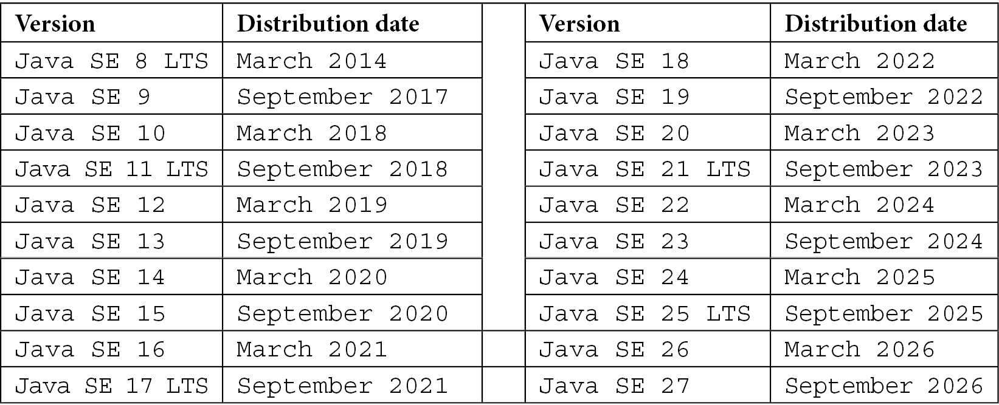

# 第一章：理解 Java 发行版

在本章中，我们将探讨 Java 语言的起源以及它是如何被管理的。虽然本书中使用了*Java*这个词，但请注意，我指的是**Java 标准版**或**Java SE**。Java 有众多版本和发行版，这有时会导致对使用哪个版本产生混淆。Java 是免费的，还是我需要获得许可？我能否将 Java 运行时包含在我的软件中？我能否分发自己的 Java 版本？这些问题以及其他问题将在本章中解答。

您将学习如何在 Linux、macOS 和 Windows 上安装 Java。本章突出了 Java 安装中包含的重要工具，这些工具将在后续章节中使用。

本章我们将涵盖以下主题：

+   一点历史

+   Java 的独特之处在哪里？

+   为什么会有这么多 Java 发行版？

+   您应该选择哪个 Java 版本？

+   Java 是如何授权的？

+   为什么会有这么多版本的 Java？

+   安装 Java

+   箱子里有什么？

让我们从快速的历史课开始。

# 技术要求

要在 Java 或您的桌面上运行 Java 程序，您需要一个支持**Java 开发工具包**（**JDK**）的计算机和操作系统。不同操作系统和不同**中央处理器**（**CPU**）都有可用的 JDK。如果您正在运行 Windows 操作系统，您唯一需要关心的是您是否在运行 32 位或 64 位。在 macOS 上，有适用于 Intel 和 Apple（ARM）CPU 的 Java 版本。如果您的操作系统是 Linux，则根据您的计算机硬件，有更多变体。甚至还有适用于运行 Linux 的 IBM 大型机的 Java 版本。

除了硬件要求之外，还需要考虑您系统上的 RAM 数量。我曾在只有 1GB RAM 的 Raspberry Pi 3 Model B 上运行 Java 应用程序。作为一名开发者，您所做的不仅仅是运行程序。您还需要运行编辑器、编译器、Web 服务器、数据库服务器以及您常用的软件。完成这些任务需要内存。我建议开发系统至少配备 8GB 内存；16GB 是理想的选择，而 32GB 可能让您在编码的同时还能玩游戏。

# 一点历史

Java 并非一开始就被称为 Java。在 20 世纪 90 年代初，以 SPARC 工作站和 Solaris 操作系统闻名的公司**Sun Microsystems**，看到了消费电子领域的潜力。他们组建了一支工程师团队，在这个领域下以**Green Project**的名义开发产品。他们的第一个设备被称为**Star7**，这是一款使用定制版 Solaris 的小型手持式电脑。Star7 是第一个个人数字助理，比苹果的 Newton 早了一年。作为 Star7 开发的一部分，创造了一种语言。加拿大软件工程师 James Gosling 领导了一个团队，为 Star7 开发了一种新的语言，称为**Oak**。Star7 从未投入生产，但 Oak 注定要统治世界。

Sun 公司希望将 Star7 用于消费电子产品的目标之一是为有线电视行业开发机顶盒。他们成立了一家名为 FirstPerson 的公司，并投标开发为有线电视提供商 Time Warner 的机顶盒。他们失去了投标。虽然他们未能将 Star7 推向市场，但他们看到了 Oak 语言的潜力。唯一的问题是 Oak 已经被注册商标。

关于 Oak 如何成为 Java 的故事有很多。它是以他们最喜欢的饮料命名，还是以印度尼西亚的一个岛屿命名？Java 只是 12 个可能的名字之一。这些名字被提交给法律部门进行商标搜索。在提交给法律团队的名字列表中，Java 是第四个名字，也是第一个通过法律审查的名字。Java 成为了 Oak 的新名字。

在 1998 年，Java 1.2 版本被引入，也被称为 Java 2。其中许多新特性中包括了**Swing GUI 库**，它显著提高了编写独立于浏览器的桌面 GUI 程序的能力。**Java EE**平台于 1999 年作为**J2EE**发布。它被用于开发 Java 网络服务器。现在，你可以编写能够响应浏览器请求并在网络服务器上运行的 Java 程序。剩下的，正如常言所说，就是历史了。

# Java 有什么特别之处？

Java 是由 Gosling 和他的团队设计的，旨在解决他们感知到的 **C++** 的不足。其中最显著的问题是内存管理。在 C++ 中，使用指针类型的变量来为对象分配内存。一旦对象不再需要，开发者的责任就是释放或重新分配内存。忘记这样做会导致内存泄漏。泄漏是指标记为 *正在使用* 但不再可通过指针访问的一块内存。虽然 Java 仍然要求你分配内存，但你不需要重新分配它。一个称为 **垃圾回收器** 的过程跟踪所有内存分配。当一个名为 Java 中的引用的指针超出作用域时，垃圾回收器会自动释放其内存。有五种垃圾回收器可用。并行垃圾回收器是默认的通用回收器。串行垃圾回收器、CMS 垃圾回收器、G1 垃圾回收器和 Z 垃圾回收器使用针对特定类型应用的算法，例如那些需要低延迟或仅需要单个线程的应用。

然而，垃圾回收并不是 Java 最显著的特征。Java 与其前辈 **C** 和 **C++** 区别开来的是，Java 程序不会直接在计算机的操作系统上执行。相反，编译后的 Java 程序，称为 **字节码**，在另一个称为 **Java 虚拟机**（**JVM**）的进程中执行。

JVM 是计算机的软件模拟。字节码是这个模拟机的机器语言。然后 JVM 将字节码转换为底层计算机的机器语言。

JVM 负责优化代码和执行垃圾回收。

原生语言，如 C 和 C++，会直接编译成 CPU 的机器语言，并与其运行的计算机操作系统相结合。任何使用的库也必须为特定的 CPU 和操作系统编译。这意味着为运行 Windows 的 Intel CPU 编译的程序或为运行特定版本 macOS 的 Apple M1 CPU 编译的程序必须为运行 Linux 的 Intel CPU 重新编译。

Java 将这一概念颠倒过来。如果你用 Java 编写代码并将其编译成字节码，那么只要有相应的 JVM，这些代码就可以在任何硬件和操作系统上无变化地运行。Java 自称为 *一次编写，到处运行* 的语言。这意味着在 Intel CPU 上编写和运行的 Java 应用程序也可以在基于 ARM 的系统上无变化地运行，无需重新编译，前提是该平台有 JVM。

在 *第四章*，*语言基础 – 数据类型和变量*，以及 *第五章*，*语言基础 – 类* 中，我们将检查 Java 语言的语法。

Java 不是唯一能在 JVM 上运行的编程语言。为了利用 JVM 的优势，同时采用与 Java 不同的方法和语法，开发了更多语言。以下是最广泛使用的四种：

+   Scala

+   Kotlin

+   Groovy

+   Clojure

现在我们已经知道了 Java 与没有虚拟机的语言相比的独特之处。可能令人困惑的是，并非只有一个公司分发 Java 的一个版本。为什么？让我们接下来看看这一点。

# 为什么会有许多 Java 发行版？

Java 首次作为专有软件发布。2006 年，Sun Microsystems 创建了一个名为 **OpenJDK** 的开源版本 Java，它带有 GNU 通用公共许可证，允许开发者修改和共享程序。Sun（以及后来的新所有者 Oracle）保留了与 Java 相关的知识产权和版权。

描述 Java 的一种方式是指出，只有通过称为 **技术兼容性工具包**（**TCK**）的广泛测试套件，JDK 和运行时才被认为是 Java。虽然 Java 被指定为开源，但最初 TCK 并不是。它需要付费从 Oracle 获得许可。这导致很少有公司推出自己的 Java 品牌版本。

现在，然而，你可以无需支付费用就能获取 TCK。你必须向 Oracle 提出正式申请，并提交几份支持性文件，解释你为什么需要访问 TCK。一个筛选委员会将审查你的申请并决定是否授予你访问 TCK 的权限。在撰写本文时，已有 27 个组织签署了**OpenJDK 社区 TCK 许可协议**（**OCTLA**）并有权访问 TCK。

那么，为什么公司仍然分发他们自己的 Java 品牌版本呢？最简单的答案是向希望在使用 Java 的情况下获得更多特定领域经验的客户提供服务。像 Microsoft 和 Amazon 这样的云服务提供商有自己的 Java 品牌版本，这些版本已经针对他们的云基础设施进行了优化。Liberica 发行版的发行商 BellSoft 是参与 Java ARM 版本的主要领导者之一。虽然选择哪个发行版可能不会有多大区别，但你的客户将使用的发行版是重要的。

不论是哪个发行商，语言都是由 Oracle 维护的。一个成熟的流程允许任何人提出对语言的修改建议。通过**Java 社区流程**（**JCP**），对语言的全部更改、新增和删除都得到了仔细的审查。

JDK 变更的实际编码主要是 Oracle 工作的开发者的责任。考虑加入 JCP，以了解变化并贡献于语言。

让我们继续看看你应该使用哪个版本，因为你对这个语言没有任何经验。

# 你应该获取哪种 Java？

自 Java 11 以来，所有 Java 的发行版，包括 Oracle 的发行版，都是基于 OpenJDK 源代码的。如果你没有必须使用的发行版，我推荐使用名为**Temurin**的 Eclipse Adoptium 版本。这个版本已经通过了 TCK。Java 是一个注册商标，因此这个词不能用于 Oracle 以外的发行版，所以有了这个名字 Temurin。如果你对这个名字的来源好奇，我会给你一个提示——它是一个字母表重排。

你可能会认为 Java 发行版的明显选择是 Oracle 品牌的版本。这几乎就是 Java 8 最终发布之前的情况。随着这次发布，Oracle 要求将 Java 作为其商业产品一部分进行分发的公司购买商业支持许可证以获取 Java 更新的访问权限。从 Java 11 开始，Oracle 要求商业许可证持有者为每位开发者购买订阅。尽管如此，Oracle 品牌的 JDK 的个人使用仍然是免费的。

这可能会让人困惑，因为如果你选择使用 OpenJDK 发行版或基于 OpenJDK 的任何其他发行版（除了 Oracle 的），商业分发不需要支付费用。随着 Java 17 的发布，Oracle 再次改变了其授权方式。现在被称为 Oracle 的**无费条款和条件**（**NFTC**），这现在允许你在开发软件时使用 Oracle 的 Java，然后无需订阅或费用即可将此版本的 Java 与你的程序一起分发。这仅适用于从 17 开始的 Java 版本。从 8 到 16 的版本仍然受限于许可证。

## Java 是如何授权的？

如果你计划使用 Java 进行商业软件开发，那么它的授权对你来说很重要。如前所述，OpenJDK 携带 GNU 通用公共许可证版本 2，通常称为**GPLv2**。GPL 在开源软件中广泛使用。在最基本层面上，它要求任何使用 GPL 许可代码的软件也必须受 GPL 约束。这意味着你创建的任何软件都必须在相同条件下提供源代码。版权和知识产权归作品作者所有，无论是 Oracle 还是你。

Java 的 GPLv2 附带 Classpath 异常，也称为链接异常。类路径，就像操作系统路径一样，是 JVM 和 Java 编译器将使用的类和包的位置。根据这个例外，当你分发你的应用程序时，你不需要提供源代码。链接到 Java 的软件不需要 GPLv2 许可证。它可以保持专有，不能像 GPL 软件那样自由使用。你选择你生成的代码的授权。

# 为什么 Java 有这么多版本？

Java 一直在不断发展——错误修复、增强和新功能都在持续开发中。Java 最初以 1 加上版本号进行编号。从 1996 年开始，直到 2014 年的前九个版本分别是 1.0、1.1、1.2、1.3、1.4、1.5、1.6、1.7 和 1.8。在这些版本之间，有一个代表更新而不是主要修订的第三个数字，例如 1.8_202。

从 Java 1.8 开始，随后被称为 Java 8，以下是 Java 版本的时间线：



表 1.1 – Java 版本的时间线

你会看到 Oracle 标记了几个**LTS**版本，即**长期支持**版本。这些版本预计将至少提供 8 年的错误修复和安全更新。非 LTS 版本，也称为**功能发布**，是累积的修复、更新和预览功能。对这些版本的支持预计将持续到下一个非 LTS 或 LTS 版本发布。拥有自己 Java 分发的公司可能提供的支持时间比 Oracle 更长。

LTS 版本通常是许多组织用于其产品的首选。Java 8 于 2014 年 3 月发布，目前仍在支持中，并将持续到 2030 年 12 月。随后的 LTS 版本仅支持 8 年，但如前所述，其他 Java 分销商可能会提供更长时间的支持。Java 新版本发布的当前计划是每两年一个 LTS 版本，每六个月发布一个非 LTS 版本。

如果您计划开发服务器端软件，您必须使用 LTS 版本。服务器端所需的库是针对特定 LTS 版本编写的。当一个新的 LTS 版本发布时，所有这些库可能需要一些时间才能更新，正如目前 LTS Java 17 的情况一样。在我撰写本文时，大多数服务器端应用程序正在运行 Java 11，一些甚至仍在使用 Java 8。

对 Java 成功做出贡献的因素在持续且现在已成为常规的发布节奏中显而易见。这确保了 Java 继续成为一门最前沿的语言。

# 安装 Java

安装 Java 是一个简单的过程。作为开发者，您将从任何分销商那里安装 JDK。大多数 Java 分销商都打包了带有安装程序的 Java，以及一个没有安装程序的压缩文件，您可以下载。选择取决于您的操作系统、CPU，以及您是否是管理员或超级用户并且可以使用安装程序。或者，您是客户端用户，只能安装压缩文件。

在您的分发和版本确定后，您就可以准备安装 Java 作为管理员和非管理员用户。

## 作为管理员

作为管理员，您可以通过以下方式为计算机上的所有用户安装 Java。

#### Windows

从[`adoptium.net/`](https://adoptium.net/)下载适用于 Java 的适当（32 位或 64 位）`.msi`文件。此类文件包含一个安装程序，它将 Java 放置在您选择的文件夹中，并配置适当的环境变量。下载后，只需双击`.msi`文件。Windows 安装程序将引导您完成安装过程。

#### macOS

对于 macOS 安装 Java，您有两个选择。第一个是下载包含安装程序的 Mac `.pkg`文件。下载后，只需双击`.pkg`文件。Apple 安装程序将引导您完成安装过程。

第二种方法是使用**HomeBrew**，这是一个用于管理新软件和更新的命令行工具，它将下载并安装 Java。

在安装了 HomeBrew 之后，您可以使用以下命令安装 OpenJDK 版本：

```java
brew install openjdk@17 
```

要安装 Java 17 的 Eclipse Temurin 版本，请使用以下命令：

```java
brew tap homebrew/cask-versions
brew install --cask temurin17
```

#### Linux

在 Linux 上，您使用`apt install`命令行工具。您必须是超级用户/管理员才能使用此工具。您还必须包含所需的分发和版本。您可以使用以下命令在命令行中安装 OpenJDK Java：

```java
sudo apt install openjdk-17-jdk
```

要安装 Eclipse Temurin 版本的 Java，请使用以下命令：

```java
sudo apt install temurin-17-jdk
```

### 验证安装

安装完成后，通过以下命令验证 Java 是否正常工作：

```java
java -version
```

如果它显示了你刚刚安装的 Java 的版本和发行名称，那么你就完成了，可以开始编写 Java 代码。版本号可能因你下载 Java 或使用`apt install`的时间而有所不同。你应该看到以下内容：

#### Windows

```java
>java -version
openjdk version "17.0.3" 2022-04-19
OpenJDK Runtime Environment Temurin-17.0.3+7 (build 17.0.3+7)
OpenJDK 64-Bit Server VM Temurin-17.0.3+7 (build 17.0.3+7, mixed mode, 
    sharing)
```

#### Linux 和 macOS

```java
$ java -version
openjdk version "17.0.3" 2022-04-19
OpenJDK Runtime Environment Temurin-17.0.3+7 (build 17.0.3+7)
OpenJDK 64-Bit Server VM Temurin-17.0.3+7 (build 17.0.3+7, mixed mode, 
    sharing)
```

如果它告诉你找不到 Java，那么请按照即将到来的*配置环境变量*部分中的说明来设置环境变量。

## 作为非管理员

如果你不是管理员，那么你仍然可以安装 Java，但只有你才能使用它。

#### Windows

Windows 用户可以下载适当的`.zip`文件版本，并将其解压到所需的文件夹中。

#### Linux 和 macOS

下载适用于 Linux 或 macOS 的适当`.tar.gz`文件版本。下载完成后，使用以下命令行。Linux 和 macOS 之间的唯一区别是文件名。

对于 Linux，使用以下命令：

```java
tar xzf OpenJDK17U-jdk_x64_linux_hotspot_17.0.3_7.tar.gz
```

对于 macOS，使用以下命令：

```java
 tar xzf OpenJDK17U-jdk_x64_mac_hotspot_17.0.3_7.tar.gz 
```

### 配置环境变量

需要设置两个环境变量。虽然 Windows、Linux 和 macOS 上的环境变量相同，但设置它们的过程不同。

第一个环境变量是`JAVA_HOME`。某些 Java 进程，如 Web 服务器，需要知道 Java 的安装位置才能访问 JDK 中的特定组件。它必须被分配到安装 Java 的文件夹的完整路径。

第二个环境变量是`PATH`。当从命令行运行程序时，操作系统将在当前目录中查找可执行文件。如果没有找到，它将遍历路径中的每个目录以查找它。

你每次打开控制台时都必须输入这些命令。根据你的登录名和要安装的 Java 版本调整命令。虽然你可以安装多个 Java 版本，但只能有一个用于`JAVA_HOME`和`PATH`：

#### Windows

```java
set JAVA_HOME= C:\devapp\jdk-17.0.2+8
set PATH=%JAVA_HOME%\bin;%PATH%
```

调整解压 Java 文件时创建的文件夹的路径。你还可以将这些两行放入一个批处理文件中，每次你打开控制台编写 Java 代码时都可以运行：

#### Linux

```java
export JAVA_HOME=/home/javadev/java/jdk-17.0.2+8
export PATH=$JAVA_HOME/bin:$PATH
```

这假设你已经以`javadev`的身份登录，并且你将 Java 放置在名为`java`的目录中。这两行可以添加到你的家目录中的`.profile`文件中，以便每次登录时执行。

#### macOS

```java
export JAVA_HOME=/Users/javadev/java/jdk-17.03+7/Contents/Home
export PATH=$JAVA_HOME/bin:$PATH
```

这假设你已经以`javadev`的身份登录，并且你将 Java 放置在名为`java`的目录中。这两行可以添加到你的家目录中的`.bash.profile`文件中，以便每次登录时执行。

### 验证安装

你可以快速确定 Java 的安装是否正确。打开你正在使用的系统上的命令或控制台窗口。如果你执行了非管理员安装，请确保`JAVA_HOME`和`PATH`已更新并设置。在命令窗口中，输入以下命令：

```java
java -version
```

如果安装成功，如果你安装了 OpenJDK，输出将如下所示：

```java
openjdk version "17.0.3" 2022-04-19
OpenJDK Runtime Environment (build 17.0.3+7-Ubuntu-0ubuntu0.20.04.1)
OpenJDK 64-Bit Server VM (build 17.0.3+7-Ubuntu-0ubuntu0.20.04.1, mixed mode, sharing)
```

如果您安装了 Temurin JDK，输出将如下所示：

```java
openjdk version "17.0.3" 2022-04-19
OpenJDK Runtime Environment Temurin-17.0.3+7 (build 17.0.3+7)
OpenJDK 64-Bit Server VM Temurin-17.0.3+7 (build 17.0.3+7, mixed mode, 
    sharing)
```

您的安装现在已完成并已验证。现在让我们检查一下您刚刚安装的一些文件。

# 盒子里有什么？

JDK 包含将源代码编译成字节码并在 JVM 程序中执行代码所需的程序和库。它还包括许多支持您作为开发人员工作的工具。

Java 还有一种第二种打包方式，称为**Java 运行时版**（**JRE**）。这个较小的包只包含运行 Java 字节码所需的组件，而不包括 Java 编译器。

Java 9 引入了一种新的打包 Java 应用程序的方法，这使得 JRE 变得多余。截至 Java 11，Oracle 不再为其分发和 OpenJDK 提供 JRE。其他公司的一些分发可能仍然为 Java 的当前版本提供 JRE。我们将在后面的章节中探讨打包 Java 应用程序的模块化方法。

Java 的安装将占用大约 300 MB 的磁盘空间，具体取决于底层操作系统。

以下是从 Linux 和 Windows Java 安装的目录结构。第一个是为 Ubuntu 设计的，但在所有 Linux 和 macOS 安装上几乎相同。

Ubuntu 20.04.4 LTS 的目录结构如下：

```java
$ ls -g -G
total 36
-rw-r--r--  1 2439 Apr 19 17:34 NOTICE
drwxr-xr-x  2 4096 Apr 19 17:34 bin
drwxr-xr-x  5 4096 Apr 19 17:33 conf
drwxr-xr-x  3 4096 Apr 19 17:33 include
drwxr-xr-x  2 4096 Apr 19 17:33 jmods
drwxr-xr-x 72 4096 Apr 19 17:33 legal
drwxr-xr-x  5 4096 Apr 19 17:34 lib
drwxr-xr-x  3 4096 Apr 19 17:33 man
-rw-r--r--  1 1555 Apr 19 17:34 release
```

Windows Enterprise 11 版本 21H2 的目录结构如下：

```java
>dir
2022-03-29  11:28 AM    <DIR>          .
2022-05-03  05:41 PM    <DIR>          ..
2022-03-29  11:28 AM    <DIR>          bin
2022-03-29  11:28 AM    <DIR>          conf
2022-03-29  11:28 AM    <DIR>          include
2022-03-29  11:28 AM    <DIR>          jmods
2022-03-29  11:28 AM    <DIR>          legal
2022-03-29  11:28 AM    <DIR>          lib
2022-03-29  11:28 AM             2,401 NOTICE
2022-03-29  11:28 AM             1,593 release
```

如果我们调查`bin`文件夹，我们会发现几个 Java 称为其工具的可执行程序。在 Windows 系统上，它们都有`.exe`扩展名；在 Linux 和 macOS 上，它们只显示名称。在本章中，我们将讨论以下工具：

+   `jar`

+   `java`

+   `javadoc`

+   `jlink`

+   `jmod`

+   `jpackage`

+   `jshell`

+   `javaw`

这些是我们将在接下来的章节中使用的工具。请参阅*进一步阅读*部分的工具规范链接，以了解 JDK 中包含的所有工具的详细信息。

我们将这些工具分为以下类别：

+   编译和执行 Java 程序

+   组装和打包 Java 应用程序

+   记录 Java 类文档

+   **读取、评估、打印和循环**（**REPL**）

让我们逐一查看这些类别。

## 编译和执行 Java 程序

这些是将我们从源代码带到运行 Java 程序的工具。一些重要的工具如下。

### javac

这就是 Java 编译器。它的作用是将以`.java`结尾的 Java 源代码文件编译成以`.class`结尾的字节码文件。

### java 或 javaw.exe

这是启动 JVM 进程并执行该进程中的字节码文件的工具。当使用`java`时，将打开一个控制台窗口，并保持打开状态，直到 JVM 进程结束。`javaw`工具也会启动 JVM 并执行字节码程序。它不会打开控制台。

Windows 用户通常不期望打开控制台，因为他们可能从未见过或与之交互过。如果您想创建一个 Windows 快捷方式来运行 Java 程序，您将使用`javaw.exe program.class`。

我们将在*第二章*，“代码、编译和执行”中检查这三个命令。

## 组装和打包 Java 应用程序

一个 Java 程序可以由数百、数千甚至更多的`.class`文件组成。在这些情况下，有必要将这些文件以及任何支持文件（如图像）组装成一个单独的文件。执行此类操作的某些工具如下。

### jar

一个 Java 程序或库通常由多个`.class`文件组成。为了简化此类程序的交付，`jar`工具将应用程序或库的所有类文件合并成一个使用 ZIP 压缩且具有`.jar`扩展名的单个文件。`.jar`文件可以被指定为可执行文件。在这种情况下，您已经安装了 Java JDK 或 JRE。我们将在*第二章*，“代码、编译和执行”中看到这个工具是如何使用的。

### jmod 和 jlink

Java 9 引入了模块化 Java 的概念，这是一种使用称为`.jmod`文件的新格式来组装 Java 应用程序的方法。这些文件类似于`.jar`文件，因为它们是 ZIP 压缩文件。`jmod`工具创建`.jmod`文件。

在 Java 9 出现之前，一个名为`rt.jar`的单个文件包含了所有的 Java 库。从 Java 9 开始，Java 库作为单独的`.jmod`文件存在。Java 将 JVM 文件打包成`.jmod`文件。这意味着对于开发者来说，现在可以分发包含 JVM 和仅包含执行程序必须可用的 Java 组件的 Java 应用程序。现在不再需要预先安装 JDK 或 JRE，因为所有执行程序所需的都在存档中。您仍然需要`jar`工具来构建这样的可执行文件，因为您不能直接执行`.jmod`文件。我们将在*第十六章*，“独立包和容器中的 Java 部署”中看到这两个工具是如何使用的。

### jpackage

`jpackage`工具创建包含 Java 应用程序和 Java 运行时的本地应用程序。它与`.jar`或`.jmod`文件一起使用。输出是一个可执行文件，例如 Windows 的`.msi`或`.exe`文件，或者 macOS 系统的`.dmg`文件。我们将在*第十六章*，“独立包和容器中的 Java 部署”中看到这个工具是如何使用的。

## 记录 Java 类

在仔细记录了代码之后，Java 有一个工具可以收集所有注释，以便其他可能使用您的代码的开发者可以方便地访问。

### javadoc

在几乎每种语言中，文档化代码一直是一个问题。Java 采取了一种独特的方法来鼓励文档化。如果你以特定的格式注释你的代码（我们将在*第四章*，*语言基础 - 数据类型和变量*中探讨），`javadoc`工具将为每个你创建的类生成一个 HTML 页面。在这个页面上，你可以找到类的所有公共成员。

查看 https://docs.oracle.com/en/java/javase/17/docs/api/java.base/java/util/ArrayList.html 上的`ArrayList`类的`javadoc`页面。你在这个网页上看到的一切都是写入源代码文件中的，然后转换为你现在看到的 HTML 页面。我们将在*第十一章**,* *文档和日志记录*中探讨这个工具。

## REPL

REPL 工具是一种支持逐行执行代码的工具。

### jshell

`jshell`工具允许你编写和执行单个 Java 语句，无需对类和方法进行通常的装饰。这对于学习 Java 非常有用。它可以逐行执行你编写的代码。我们将在*第二章**,* *代码、编译和执行*中探讨`jshell`。

# 摘要

在本章中，我们了解了一些关于 Java 的历史、它的许可方式以及为什么有这么多 Java 的发行版和版本。你现在理解了 Java 作为一个开发工具，并知道如何选择 Java 发行版和版本。我们看到了如何在不同的操作系统上安装 Java。在*第十二章*，*BigDecimal 和单元测试*中，我们还将探讨如何在 Docker 容器中安装 Java。我们以查看 JDK 中包含的九个 Java 工具结束本章；我们将在后面的章节中再次看到它们。我们将在那些章节中了解更多关于这些工具的信息。

在*第二章*，*代码、编译和执行*中，我们将学习如何编写、编译、链接和执行 Java 程序。使用纯文本编辑器、`jshell`以及**集成开发环境**（**IDE**）将是我们的重点。

# 进一步阅读

+   **Java 的命名由来**：[`www.quora.com/How-Java-got-its-name/answer/Ashok-Kumar-1682`](https://www.quora.com/How-Java-got-its-name/answer/Ashok-Kumar-1682)

+   **GNU 通用公共许可证，版本 2，带类路径例外**：[`openjdk.java.net/legal/gplv2+ce.html`](https://openjdk.java.net/legal/gplv2+ce.html)

+   **Oracle 无费条款和条件（NFTC）**：[`www.oracle.com/downloads/licenses/no-fee-license.html`](https://www.oracle.com/downloads/licenses/no-fee-license.html)

+   **Java®开发工具包版本 17 工具规范**：[`docs.oracle.com/en/java/javase/17/docs/specs/man/index.html`](https://docs.oracle.com/en/java/javase/17/docs/specs/man/index.html)

+   **JVM 垃圾回收器**: [`www.baeldung.com/jvm-garbage-collectors`](https://www.baeldung.com/jvm-garbage-collectors)
