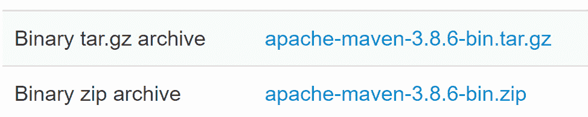
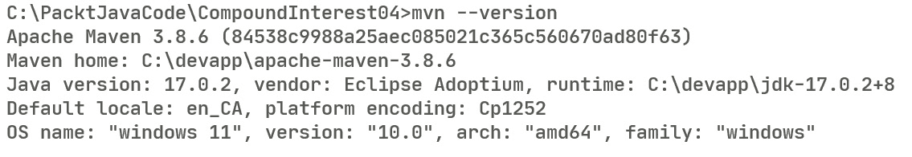
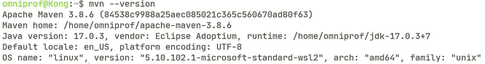
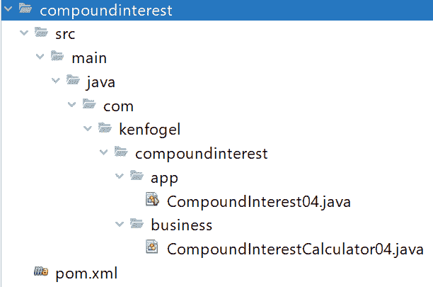
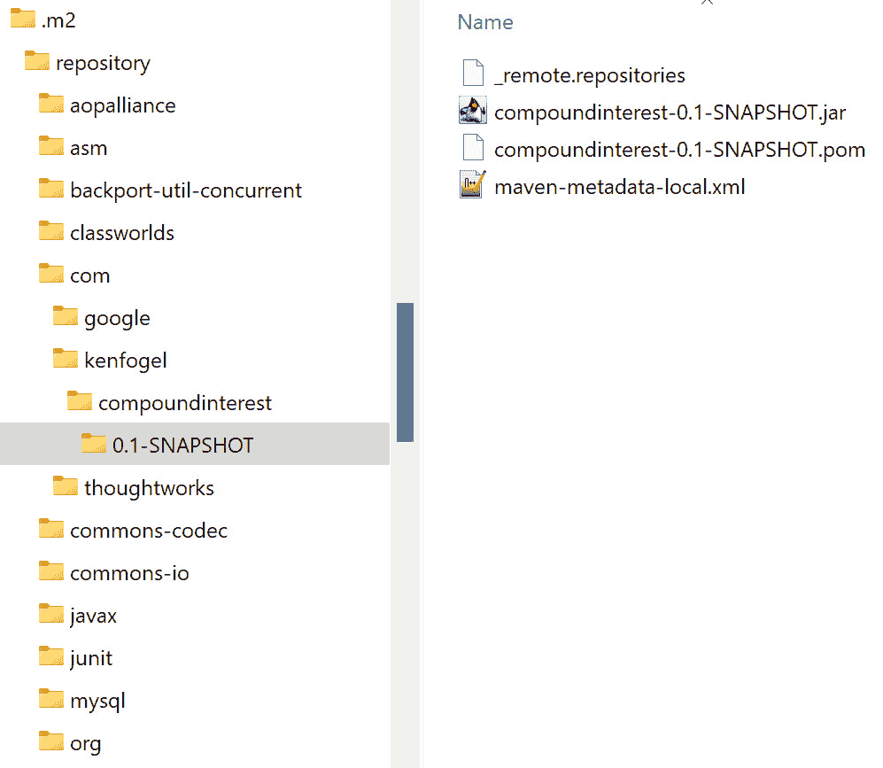

# 第三章：Maven 构建工具

Java 程序很少只有一个文件。它们可以只包含几个文件，或者成千上万个文件。我们已经看到，你必须将 Java 源代码文件编译成字节码。对于这么多文件来说，这样做的工作相当繁琐。这就是构建工具非常有价值的地方。

在上一章中，程序都是在我们存储它们的文件夹中运行的。随着程序发展成为多个文件，你通过分类来管理它们。这些基本分类可以追溯到编程的早期，包括输入、处理和输出。你可以将这些分类分解成程序必须执行的具体任务。在 Java 中，我们称这类别为**包**。一个包反过来是一个文件夹，你将属于该类别的所有 Java 文件存储在其中。一个复杂的程序可能包含成百上千个组织成包的文件。

在这个环境中，你必须编译每一个文件。正如你可以想象的那样，如果你必须逐个编译它们，这可能会非常繁琐。构建系统的一个目的就是简化这项任务，并且至少，你必须在命令行中输入的是`mvn`，这是 Maven 的可执行程序。在本章中，我们将看到如何使用**Maven**。由于 Maven 是每个 IDE 的一个特性，你可以将任何组织为 Maven 管理的项目的程序加载到任何 IDE 中。

重要提示

虽然 Maven 是最广泛使用的构建系统，但它并非唯一。另一个流行的构建系统被称为**Gradle**。它区别于 Maven 的地方在于它使用的是命令式配置文件而不是声明式配置文件。Gradle 使用基于**Groovy**语言的**领域特定语言**（**DSL**）。因此，它可以用于通用编程，尽管它的词汇和语法是为构建软件项目而设计的。

本章将涵盖以下内容：

+   安装 Maven

+   Maven 功能概述

+   `pom.xml`配置文件

+   运行 Maven

到本章结束时，你将足够了解 Maven 构建过程，以便能够立即使用它。本书后面的部分，我们将看到如何使用 Maven 来管理测试。请参阅*进一步阅读*部分，以获取有关 Maven 的详细文章和免费书籍的链接。

# 技术要求

这里是运行本章示例所需的工具：

+   Java 17 已安装

+   文本编辑器

+   Maven 3.8.6 或更高版本已安装

我建议在继续之前从[`github.com/PacktPublishing/Transitioning-to-Java/tree/chapter03`](https://github.com/PacktPublishing/Transitioning-to-Java/tree/chapter03)下载与本书相关的源代码，这样你就可以尝试本章中展示的内容。

注意

Ubuntu 和其他 Linux 发行版可能已经安装了 Maven 的一个版本。如果它不是 3.8.6 或更高版本，你必须用最新版本替换它。

# 安装 Maven

访问 Maven 下载页面 [`maven.apache.org/download.html`](https://maven.apache.org/download.html)。在这里，您将找到两种不同的压缩格式，一个是 Windows（`.zip`），另一个是 Linux/macOS (`tar.gz`)。



图 3.1 – Maven 压缩文件

这里显示的版本代表的是撰写本文时的当前版本。在开始时，安装最新版本是最好的选择。现在，让我们回顾一下如何为每个操作系统安装 Maven。

## Windows

Maven 没有安装程序。将 ZIP 归档解压到一个文件夹中。正如我们在没有安装程序的情况下安装 Java 时所看到的，我使用名为 `devapp` 的文件夹来存放所有我的开发工具。一旦解压，您需要将 `bin` 文件夹的位置添加到您的路径中。您可能会遇到对两个环境变量 `M2_HOME` 和 `MAVEN_HOME` 的引用。虽然它们不会造成任何伤害，但自 Maven 3.5.x 版本以来，这两个变量都已过时。

如果您是计算机管理员，只需将 `bin` 文件夹的路径添加到您的路径中。如果不是，则使用 `set` 命令将其添加到路径中。以下是我的 `setjava.bat` 文件，适用于非管理员用户。根据您的文件夹结构修改您的批处理文件。

```java
set JAVA_HOME=C:\devapp\jdk-17.0.2+8
set PATH=%JAVA_HOME%/bin;C:\devapp\apache-maven-3.8.6\bin;%PATH%
```

您可以使用 `mvn --version` 验证 Maven 是否正在运行：



图 3.2 – Windows 上 mvn --version 的输出

## Linux

如果您具有超级用户权限，可以使用此命令：

```java
$ sudo apt-get install maven
```

使用 `mvn --version` 验证。

如果您不是超级用户，将从 Maven 网站下载的 `tar.gz` 文件解压到您选择的文件夹中：

```java
$ tar -xvf apache-maven-3.8.6-bin.tar.gz -C /usr/local/apache-maven/apache-maven-3.8.6
```

现在，将 Maven 的位置添加到您的路径中：

```java
export PATH=/usr/local/apache-maven/apache-maven-3.8.6/bin
:$PATH
```

根据您的 Linux 发行版，将此行添加到 `.profile` 或 `.bash_profile` 文件中。

## macOS

假设您在 Mac 上使用 Homebrew，您可以使用以下命令安装 Maven：

```java
$ brew install maven
```

使用 `mvn --version` 验证安装。

如果您没有 Homebrew 或不是超级用户，则可以像为 Linux 非超级用户安装 Maven 一样安装 Maven。较新的 macOS 版本使用 `.zshenv` 而不是 `.profile` 作为用户脚本。



图 3.3 – Linux 或 macOS 上的安装验证

安装 Maven 后，让我们看看它为我们提供了什么。

# Maven 功能概述

JDK 部分的标准 Java 库非常广泛。然而，还有一些提供功能的附加库，例如连接到关系型数据库，您必须下载并将它们添加到项目运行之前。您可以使用 Maven 来配置它为您完成这项工作。无需访问库的网页 - 下载文件，将其放置在正确的文件夹中，并让 Java 编译器知道它可用。

与大多数构建工具一样，Maven 不仅仅是一个编译程序的工具。

在今天的开发环境中，如果代码编译成功，代码不会直接从开发者那里进入生产。必须对方法进行单元测试，对程序中各个模块或类之间的交互进行集成测试。你将使用专门的服务器来完成这项工作，并且你可以配置 Maven 来执行这项工作。

让我们回顾一下它还能做什么。

## 依赖管理

虽然 Java 语言及其标准库可以覆盖多个用例，但它们只能覆盖程序员想要做的很小一部分。经常，添加的 Java 库提供对任务的支持，例如使用 JavaFX 进行 GUI 编程；某些驱动程序，例如用于与一系列数据库工作的驱动程序，用于复杂的日志记录或增强数据收集等，需要成为你程序的一部分。问题是这些库必须位于**Java 类路径**上。类路径是包含 Java 库的文件和文件夹列表，这些库必须在你的文件系统中可访问。如果没有像 Maven 这样的工具，你必须手动下载你希望使用的每个库并更新 Java 类路径。

然而，Maven 允许你在项目的配置文件`pom.xml`中列出你计划在项目中使用的所有库。Maven 在你的文件系统中保留一个文件夹，用于存储所需的依赖库文件。这个文件夹被称为仓库。默认情况下，这个文件夹位于另一个名为`.m2`的文件夹中，而这个文件夹又存储在你的主目录中。你可以将其更改为使用电脑上的任何文件夹，尽管大多数程序员都保留默认文件夹位置不变。

如果所需的依赖项尚未存在于你的本地仓库中，那么 Maven 将下载它。存在一个默认的中心仓库，称为 Maven Central，可以在[`repo1.maven.org/maven2/`](https://repo1.maven.org/maven2/)找到。你可以在[`search.maven.org/`](https://search.maven.org/)搜索库并检索添加到你的`pom.xml`文件中的条目。

## Maven 插件

Maven 程序并不大；它依赖于称为插件的 Java 程序来执行其任务。例如，有用于编译和打包代码、运行测试、执行并将代码部署到服务器的插件，等等。《pom.xml》文件是我们列出插件及其依赖的地方。你可以在 MVNRepository 中像查找依赖项一样查找插件。

Maven 程序使用一系列默认插件，这些插件可以在不包含在`pom.xml`文件中的情况下使用。Maven 的主要构建使用在构建发布时默认插件的版本。为了确保你使用的是插件的最新版本，我建议在`pom.xml`文件中列出你将使用的每个插件。一般来说，始终明确列出你将使用的插件，而不是让 Maven 使用其内置或隐式插件。

## Maven 项目布局

要使用 Maven，有必要将程序的文件夹组织成特定的布局。您可以配置 Maven 使用您选择的布局。以下是将要使用的默认布局。这将允许 Maven 发现您项目中的所有文件和资源。让我们看看桌面应用程序的文件夹结构：

```java
Project Folder
    /src
        /main
            /java        
            /resources    
        /test
            /java        
            /resources    
    pom.xml file
```

在您使用编辑器从命令行开始编码之前，您必须创建这些文件夹和 `pom.xml` 文件。如果您在创建时指定它是一个 Maven 项目，您的 IDE 将创建此结构。所有 IDE 都会在遵循此文件夹布局的项目中打开 Maven 项目。

在您成功构建程序后，您将找到一个名为 `target` 的新文件夹。这是 Maven 存储编译的源代码文件和最终打包文件（称为 `jar` 文件）的地方。以下是 `target` 的文件夹结构：

```java
    /target
        /classes
        /generated-sources
        /generated-test-sources
        /maven-archiver
        /maven-status
        /test-classes
        project.jar file
```

Maven 在您第一次为项目构建时创建此文件夹。每次构建时，如果您更改了匹配的源代码文件，Maven 将用新版本替换 `target` 中的任何文件。请勿编辑或更改 `target` 中找到的任何文件，因为下次您创建构建时，它将替换 `target` 中的文件，并且您所做的任何编辑都将丢失。

您还可以指示 Maven 清理项目，这将导致 `target` 中的内容被删除。如果 `pom.xml` 文件指示 Maven 将您的程序打包为存档，例如 JAR 文件，那么您将在 `target` 文件夹中找到 JAR 或您正在创建的任何存档。

如果您不使用 IDE，您可以考虑编写一个批处理文件或 shell 脚本来创建此文件夹结构。

下一个任务是创建包含所需插件的 `pom.xml` 文件——但在我们这样做之前，让我们看看我们如何使用包组织多个源代码文件。

## Java 源代码包

Java 语言鼓励开发者根据功能组织他们的代码。这可能包括与用户交互的代码、从数据库访问记录或执行业务计算。在本节中，我们将了解包以及如何在 Maven 项目中使用它们。我们已经知道您不需要包。我们在上一章中运行的第一个程序 `CompoundInterest` 没有任何包。当项目仅由一个文件组成时，这很有用。一旦项目包含多个文件，您将使用包。

由于我们使用 Maven，我们的包的位置必须是 `src/main/java`：

```java
Project Folder
    /src
        /main
            /java        
```

包命名的规则与标识符的规则相似，以及您操作系统中文件夹命名的任何规则：

```java
com.kenfogel.business
```

点号代表斜杠，具体是正斜杠还是反斜杠取决于您的操作系统。这意味着 `business` 是 `kenfogel` 中的一个文件夹，而 `kenfogel` 是 `com` 中的一个文件夹。使用我们的 Maven 布局，它将如下所示：

```java
Project Folder
    /src
        /main
            /java        
                /com
                    /kenfogel
                        /business
```

当我们使用包时，属于该包的每个文件都必须有一个声明包名称的语句作为代码的第一行。

在上一章中，我们使用了一个包含两个类在一个文件中的 `CompoundInterest` 程序版本，因为 **Single-File-Source-Code** 功能不能有超过一个文件，正如其名称所暗示的。除非您需要使用 Single-File-Source-Code 功能，否则您应该为程序中的每个类创建一个文件。文件名必须与文件中公共类的名称相同。

这里是包含业务流程的类；请注意，它以包声明开始。在这个第一部分，我们声明了我们需要的外部库，然后声明了类和类变量：

```java
package com.kenfogel.compoundinterest.business;
import java.text.NumberFormat;
public class CompoundInterestCalculator04 {
    private final double principal = 100.0;
    private final double annualInterestRate = 0.05;
    private final double compoundPerTimeUnit = 12.0;
    private final double time = 5.0; 
    private final NumberFormat currencyFormat;
    private final NumberFormat percentFormat;
```

接下来是包含可执行代码的方法：

```java
    public CompoundInterestCalculator04() {
        currencyFormat = 
            NumberFormat.getCurrencyInstance();
        percentFormat = NumberFormat.getPercentInstance();
        percentFormat.setMinimumFractionDigits(0);
        percentFormat.setMaximumFractionDigits(5);
    }
    public void perform() {
        var result = calculateCompoundInterest();
        System.out.printf(
        "If you deposit %s in a savings account " +
        "that pays %s annual interest compounded " +                   
        "monthly%nyou will have after %1.0f years " +
        "%s%n", 
                currencyFormat.format(principal),
                percentFormat.format(annualInterestRate),
                time, currencyFormat.format(result));
    }
    private double calculateCompoundInterest() {
        var result = principal * 
            Math.pow(1 + annualInterestRate / 
                compoundPerTimeUnit, 
                time * compoundPerTimeUnit);
        return result;
    }
}
```

每个 Java 程序都必须至少有一个名为 `main` 的方法。以下是包含 `main` 方法的类：

```java
package com.kenfogel.compoundinterest.app;
import com.kenfogel.compoundinterest04.business.
CompoundInterestCalculator04;
public class CompoundInterest04 {
    public static void main(String[] args) {
        var banker = new CompoundInterestCalculator04();
        banker.perform();
    }
}
```

在这两个文件中，您都会看到一个 `import` 语句。要访问不在同一包中的类，您必须导入它。这个语句通知编译器将使用来自另一个包中的类的代码。让我们讨论一下这两个 `import` 语句：

+   第一个 `import` 语句使 `NumberFormat` 类（它是 `java.text` 包的一部分）对编译器可用。请注意，以 `java` 或 `javax` 开头的包通常是 Java 安装的一部分：

    ```java
    import java.text.NumberFormat;
    ```

+   在第二个 `import` 语句中，通过使用 `CompoundInterest04.java`，我们在 `main` 方法中实例化了 `CompoundInterestCalculator04` 类。这个类文件不在同一个包中，因此您必须导入它以引用它：

    ```java
    import com.kenfogel.compoundinterest.business.
                          CompoundInterestCalculator04;
    ```

这里是 Maven 期望在您的存储设备上找到的 `CompoundInterest` 程序的文件夹结构：



图 3.4 – 基本 Maven 文件结构

在这里，我们正在查看 Maven 管理的 `CompoundInterest` 程序的目录结构。项目被组织成与您的代码中的 `import` 语句匹配的包。在这里，您可以看到包名，例如 `com.kenfogel.compoundinterest`，如何在您的文件系统中存在。我们还有 Maven 项目的最后一部分需要了解，那就是 `pom.xml` 文件。

# `pom.xml` 配置文件

您必须使用一个声明性的 XML 文件来配置 Maven。这个文件以 XML 格式声明了构建项目所需的所有信息。它列出了所需的库以及支持 Maven 任务的插件。在本节中，我们将检查包含 Maven 构建配置的 `pom.xml` 文件。

这里是每个人在每一个 `pom.xml` 文件中使用的第一个三个标签：

```java
<?xml version="1.0" encoding="UTF-8"?>
<project xmlns="http://maven.apache.org/POM/4.0.0" 
    xmlns:xsi="http://www.w3.org/2001/XMLSchema-instance" 
    xsi:schemaLocation="http://maven.apache.org/POM/4.0.0 
    http://maven.apache.org/xsd/maven-4.0.0.xsd">
    <modelVersion>4.0.0</modelVersion>
```

让我们描述一下我们刚刚编写的代码部分：

+   以 `<?xml` 开头的第一行是 XML 前言。这些是默认值，可以省略，因为它是可选的。

+   根 `project` 标签定义了 XML 命名空间。它包括验证 `pom.xml` 文件的模式文件的存储位置。

+   `modelVersion` 指的是 `pom.xml` 文件遵守的版本。自从 Maven 2 以来，它一直是 `4.0.0`，任何其他值都会导致错误。

接下来是关于我们如何识别一个项目；考虑以下代码块：

```java
    <groupId>com.kenfogel</groupId>
    <artifactId>compoundinterest</artifactId>
    <version>0.1-SNAPSHOT</version>
```

这三个标签通常被称为项目的 GAV，使用每个标签的首字母 – `groupId`、`artifactId` 和 `version`。结合起来，这些应该对您创建的每个项目都是唯一的。

`groupId` 和 `artifactId` 也在您的代码中定义了一个默认包。您不需要有这个包，但可以有任何您认为合适的包结构。当一个项目（无论是您自己的还是为您的项目下载的）存储在您的本地仓库中时，`version` 变成了另一个文件夹。这允许您拥有具有不同版本号的多个项目版本。如果您正在开发一个供 Maven 下载的库，那么这三个标签的内容就成为了用户下载您的工作的标识。

您可以在 `groupId` 和 `artifactId` 中使用任何您想要的名称。它必须符合字符串的 XML 规则。有一个约定说 `groupId` 和 `artifactId` 的组合应该符合 Java 的命名包规则。名称应该是唯一的，尤其是如果您计划通过 Maven Central 提供它。因此，程序员使用他们公司或个人的域名（反向）。如果您没有域名，那么简单地使用您的名字，就像我一样。我确实拥有 [kenfogel.com](http://kenfogel.com)，并且我建议所有开发者都为他们的工作获取一个域名。

对于 `version`，我们也可以自由使用任何内容 – 数字或字符串。如果您之前下载了特定版本的库，那么 Maven 将使用本地副本。有一个特殊的词，`SNAPSHOT`，当添加到版本标识的末尾时，意味着该项目仍在开发中。这意味着即使它在本地仓库中存在，Maven 也会下载这个库。除非您重新配置 Maven，否则 `SNAPSHOT` 版本每天只会更新一次。

这里是使用 Maven 运行项目后 Maven 在您的本地仓库中存储的内容。您可以看到它是如何存储的，使用完整的 GAV：



图 3.5 – .m2/repository

除了 `compoundinterest` 之外的其他文件夹包含 Maven 程序和您的项目所需的依赖项和插件。

接下来，我们将看到`pom.xml`文件中的一个名为`defaultGoals`的部分——这是`pom.xml`文件`build`部分的组成部分。这是您提供 Maven 必须执行的任务的地方。除非您将`install`作为您的目标之一，否则 Maven 不会将您的项目放置在本地仓库中，这就是这个目录结构是如何创建的。`pom.xml`文件中的`groupId`元素根据您在标签中放置的点分解为文件夹。虽然`pom.xml`文件中的`artifactId`和`version`可能在其文本中有点，但它们不会像`groupId`那样分解为文件夹。

接下来，我们将描述包含运行代码所需所有内容的最终文件。这被称为`package`，指的是 Java 程序可以存储的各种归档格式：

```java
    <packaging>jar</packaging>
```

如果您没有`<packaging>`标签，则 Maven 将默认为`jar`。这些包是包含文件夹结构和项目所需文件的压缩 ZIP 文件。您可以使用任何`.zip`实用程序检查这些打包格式。打包的选择如下：

## jar – Java 归档

`META-INF`文件夹中有一个名为`MANIFEST.MF`的文件。如果 Maven 已配置`MANIFEST.MF`以包含包含`main`方法的类的包和文件名，则可以通过双击它或在命令提示符中输入文件名来运行此文件。

## war – Web 归档

这个 ZIP 归档文件用于在 Web 服务器上使用，例如`.war`文件与`.jar`文件不同，以满足 Web 服务器的要求，如 HTML 和 JavaScript 文件的文件夹。

## ear – 企业归档

这个 ZIP 归档文件用于在 Java 企业配置服务器上使用，如 Glassfish 或 WildFly。这些也被称为提供运行复杂 Web 应用程序功能的应用服务器。现代 Java Web 编程建议即使对于复杂系统也使用`.war`文件。当我们在*第十四章*“使用 Jakarta 的*服务器端编码*”中查看 Web 编程时，我将更详细地讨论这些内容。

## pom – POM

Maven 支持使用多个 POM 文件。一种方法是，将父 POM 文件包含在项目的 POM 文件中作为一部分。我为我的学生创建了数百个项目。一开始，我发现自己在每个项目的每个 POM 文件中编辑，以更新版本或添加每个项目都会共享的新依赖项和插件。使用父 POM 文件，我可以将所有通用组件放在这个文件中，然后将其包含在每个项目的单个 POM 文件中。如果项目和父 POM 文件都有相同的标签，则项目 POM 会覆盖父 POM。

让我们继续查看`pom.xml`文件：

```java
    <description>    
        First example of a Maven multi source code project 
    </description>
    <developers>
        <developer>
            <id></id>
            <name></name>
            <email></email>
        </developer>
    </developers>
    <organization>
        <name></name>
    </organization>
```

这些是三个可选部分，提供额外的信息，有助于管理项目：

+   `<描述>`

    +   用句子简要描述项目

+   <`开发者>`

    +   在这里，您可以列出团队成员。我已用它来识别我的学生。

+   `<``organization>`

    +   你所在公司的名称或客户的名称

`archive`文件，创建的打包文件，包含所有编译的字节码和所需的库。它还包括`pom.xml`文件。这使得 Web 和企业服务器能够在 Web 控制台或仪表板上显示这些信息。

接下来是文件的属性部分；考虑以下代码块：

```java
<properties>
    <java.version>17</java.version>
    <project.build.sourceEncoding>
        UTF-8
    </project.build.sourceEncoding>
    <maven.compiler.release>
        ${java.version}
    </maven.compiler.source>
    <exec.mainClass>
        com.kenfogel.compoundinterest.app.CompoundInterest04
    </exec.mainClass>
</properties>
```

在前面的代码块中，将`properties`视为可以在 POM 文件的其他地方使用的变量，例如定义编译器将从中来的 Java 版本或创建`MANIFEST.MF`文件时包含`main`方法的类的名称。你可以看到`java.version`变成了`${java.version}`。你现在可以在 POM 文件的其他地方使用这个值。管理编译的 Maven 插件将使用编译器源和目标源。`exec.mainClass`表示包含`main`方法的类。

接下来是依赖项；这些是程序所需的外部库。考虑以下代码块：

```java
    <dependencies>
        <dependency>
            <groupId>org.openjfx</groupId>
            <artifactId>javafx-controls</artifactId>
            <version>18.0.1</version>
            <scope>compile</scope>
        </dependency>
        <dependency>
            <groupId>mysql</groupId>
            <artifactId>mysql-connector-java</artifactId>
            <version>8.0.29</version>
            <scope>runtime</scope>
        </dependency>
        <dependency>
            <groupId>org.junit.jupiter</groupId>
            <artifactId>junit-jupiter-engine</artifactId>
            <version>5.8.2</version>
            <scope>test</scope>
        </dependency>      
    </dependencies>
```

依赖项是一个必须可用于程序编译和执行的库。如果依赖项在你的本地仓库中找不到，那么 Maven 将下载它。

就像你命名你的项目一样，前三个标签`groupId`、`artifactId`和`version`命名了你希望使用的库。Maven 使用这些信息来识别它必须在本地仓库或远程仓库中查找什么，以便下载。

这里出现了一个新的标签，称为`<scope>`。以下是四个最常用的作用域：

+   **编译作用域**：这是默认的作用域。这意味着这个库是编译程序所必需的。它也将被添加到包中。

+   **运行时作用域**：这个库必须在运行时可用，但不用于编译。**Java 数据库连接**驱动程序属于这一类别，因为 Java 仅在程序运行时使用它们。

+   **提供作用域**：当你在一个框架如 Spring 或一个应用服务器如 WildFly 中运行程序时，项目的大多数依赖库都包含在服务器中。这意味着你不需要将它们添加到存档中。你需要这些文件来编译代码，Maven 将它们下载到你的仓库中，以便编译器可以验证你是否正确使用它们。

+   Maven 项目的`test`分支而不是`java`分支。

## 构建部分

接下来是`build`部分，其中我们定义了 Maven 要执行的任务以及我们需要完成的事情。在 Maven 中，你可以将你想要执行的任务表达为生命周期、阶段或目标。一个生命周期由多个阶段组成，一个阶段可以由多个目标组成，一个目标是一个特定的任务。

在 Maven 中，只有三个生命周期，而有许多阶段和目标：

```java
    <build>
        <defaultGoal>clean package exec:java</defaultGoal>
```

这里我们有 POM 文件 `build` 部分的 `defaultGoal` 标签。如果你不使用此标签，那么 Maven 将使用 `Default` 生命周期，它反过来会调用 21 个阶段。在这个例子中，我们明确调用两个阶段和一个目标。

如此标签的名称所暗示的，这是在未定义任何目标或阶段（通过命令行）的情况下将要执行的一组阶段和目标。`clean` 属于 `Clean` 生命周期，它反过来由三个阶段组成。当我们列出如 `clean` 这样的阶段时，Maven 也会执行其前面的每个阶段。在 `Clean` 生命周期的案例中，如果你显示 `clean` 阶段，它也会执行 `pre-clean` 阶段，但不会执行 `post-clean` 阶段。要执行生命周期的所有操作，你只需使用生命周期的最后一个阶段。

在这个例子中，我们看到两个阶段和一个目标。我们刚刚看到 `clean` 阶段首先调用其前面的阶段。包阶段之前有 16 个阶段，每个阶段都将被执行。目标是一个单一的任务，不会调用其他任何东西。`exec:java` 目标用于在所有前面的阶段和目标成功完成后显式执行你的代码。

这里列举了我们将会使用的一些阶段和目标。

### 阶段

+   `clean`: 删除目标文件夹。这将强制 Maven 编译所有源文件。如果不使用，则只有日期和时间晚于相应 `.class` 文件的源代码文件被编译。此目标属于 `Clean` 生命周期，并且不会调用其他生命周期的任何目标。

+   `compile`: `compile` 将遍历源代码树，编译每个源代码文件，并将字节码写入目标文件夹。作为 `Default` 生命周期的成员，在 Maven 运行 `compile` 之前，它将首先执行其前面的所有目标。

+   `test`: 此目标将调用单元测试。由于后续的目标将运行测试，我们不必明确列出它们。但是，如果你只想编译和测试你的代码，那么你可以使用 `test` 作为最终目标。

+   `package`: 如果 POM 文件中的 `<packaging>` 标签是 `jar`，则此目标会将所有文件组合成一个 `jar` 包。测试目标在 `Default` 生命周期中先于包执行。因此，如果存在单元测试，Maven 将首先运行它们。

+   `install`: 如果所有前面的目标都成功完成，则此目标会将此项目添加到你的本地仓库中。

### 目标

+   `exec:java` 和 `exec:exec`: 这两个不属于标准生命周期。它们需要一个特殊的插件，并且不会执行任何其他目标。`exec:java` 将使用 Maven 运行的相同 JVM。`exec:exec` 将启动或创建一个新的 JVM。如果你需要配置 JVM，这可能会很有用。

你可以通过在命令行上放置阶段名称来覆盖 `defaultGoal` 标签，如下所示：

```java
mvn package
```

在这个例子中，由于包属于`Default`生命周期，所有在其之前的阶段都将首先执行。`defaultGoal`中的所有阶段和目标都将被忽略。

### 插件

这是构建的结论部分，我们将定义插件。除了`maven-clean-plugin`和`exec-maven-plugin`之外，所有这些插件在 Maven 中作为默认插件存在。插件版本在主要修订发生时决定，例如从 Maven 2 到 Maven 3。此列表不会随着点版本更新。

Maven 3，于 2010 年推出，有一个相当旧的默认插件列表。因此，你应该声明你将使用的每个插件，即使有默认的；这就是你在这里看到的内容。

一些插件有标签，允许你配置它们如何执行任务。`maven-jar-plugin`允许你在`<mainClass>`标签中显示包含 main 方法的类。当我们检查单元测试时，我们将配置`surefire`插件来打开或关闭单元测试。当我们查看不同的程序时，我们将增强这个以及其他我们将使用的 POM 文件：

+   此插件负责删除 Maven 之前运行产生的任何输出：

    ```java
            <plugin>
                <groupId>org.apache.maven.plugins</groupId>
                <artifactId>maven-clean-plugin</artifactId>
                <version>3.2.0</version>
            </plugin>
    ```

+   此插件将项目资源文件夹中的任何文件包含到最终打包中；资源可以是图像或属性文件：

    ```java
            <plugin>
                <groupId>org.apache.maven.plugins</groupId>
                <artifactId>  
                    maven-resources-plugin
                </artifactId>
                <version>3.2.0</version>
            </plugin>
    ```

+   这是调用 Java 编译器的插件：

    ```java
            <plugin>
                <groupId>org.apache.maven.plugins</groupId>
                <artifactId>
                    maven-compiler-plugin
                </artifactId>
                <version>3.10.1</version>
            </plugin>
    ```

+   如果你正在执行单元测试，此插件用于配置测试，例如将测试结果写入文件：

    ```java
            <plugin>
                <groupId>org.apache.maven.plugins</groupId>
                <artifactId>
                    maven-surefire-plugin
                </artifactId>
                <version>2.22.2</version>
            </plugin>
    ```

+   这是负责将你的程序打包成`jar`文件的插件。它包括配置，使得只需双击即可使`jar`文件可执行：

    ```java
            <plugin>
                <groupId>org.apache.maven.plugins</groupId>
                <artifactId>maven-jar-plugin</artifactId>
                <version>3.2.2</version>    
                <configuration>
                    <archive>
                        <manifest>
                            <mainClass>
                                ${exec.mainClass}
                            </mainClass>
                        </manifest>
                    </archive>
                 </configuration>
            </plugin>
    ```

+   此插件允许 Maven 执行你的程序：

    ```java
            <plugin>
                <groupId>org.codehaus.mojo</groupId>
                <artifactId>exec-maven-plugin</artifactId>
                <version>3.0.0</version>
            </plugin>
        </plugins>
    </build>
    ```

+   我们关闭根标签：

    ```java
    </project>
    ```

我们的 POM 文件已经准备好了，我们现在可以使用 Maven 了。

# 运行 Maven

一旦你设置了 Maven 文件结构，编写了`pom.xml`文件，编写了源代码，并添加了任何资源，如图片，那么你所需要做的就是使用 Maven，这相当直接。

让我们先在命令行上运行 Maven。

## 命令行 Maven

这里是使用命令行上 Maven 的步骤：

1.  在包含项目文件夹的文件夹中打开终端或控制台，例如`src`。

1.  如果你不是管理员或超级用户，需要配置你的设置。

1.  在提示符下输入`mvn`命令。如果你的代码没有错误，它应该执行你请求的所有目标。如果有错误，那么你需要检查 Maven 的输出，纠正错误，然后再次使用`mvn`。

这里是我的成功构建的输出：

```java
C:\PacktJavaCode\CompoundInterest04>mvn
[INFO] Scanning for projects...
[INFO]
[INFO] -------------------< com.kenfogel:compoundinterest >--------------------
[INFO] Building compoundinterest 0.1-SNAPSHOT
[INFO] --------------------------------[ jar ]---------------------------------
```

首先是清理，意味着删除我们上次构建此程序时生成的任何代码：

```java
[INFO]
[INFO] --- maven-clean-plugin:3.2.0:clean (default-clean) @ compoundinterest ---
[INFO] Deleting C:\PacktJavaCode\CompoundInterest04\target
```

如果有资源，我们就能看到它们被添加到程序中。我们没有资源，所以此插件将不会做任何事情：

```java
[INFO]
[INFO] --- maven-resources-plugin:3.2.0:resources (default-resources) @ compoundinterest ---
[INFO] Using 'UTF-8' encoding to copy filtered resources.
[INFO] Using 'UTF-8' encoding to copy filtered properties files.
[INFO] skip non existing resourceDirectory C:\PacktJavaCode\CompoundInterest04\src\main\resources
```

现在，编译器被调用了。由于我们首先清理了项目，插件检测到所有源代码文件都必须被编译。如果我们没有使用清理目标，它只会编译日期比字节码文件更近的源代码文件：

```java
[INFO]
[INFO] --- maven-compiler-plugin:3.10.1:compile (default-compile) @ compoundinterest ---
[INFO] Changes detected - recompiling the module!
[INFO] Compiling 2 source files to C:\PacktJavaCode\CompoundInterest04\target\classes
```

你可以有仅用于单元测试的资源。如果有，它们将被添加到项目的测试构建中：

```java
[INFO]
[INFO] --- maven-resources-plugin:3.2.0:testResources (default-testResources) @ compoundinterest ---
[INFO] Using 'UTF-8' encoding to copy filtered resources.
[INFO] Using 'UTF-8' encoding to copy filtered properties files.
[INFO] skip non existing resourceDirectory C:\PacktJavaCode\CompoundInterest04\src\test\resources
```

编译器现在将第二次被调用以编译你编写的任何单元测试类：

```java
[INFO]
[INFO] --- maven-compiler-plugin:3.10.1:testCompile (default-testCompile) @ compoundinterest ---
[INFO] No sources to compile
```

此插件负责运行刚刚编译的单元测试：

```java
[INFO]
[INFO] --- maven-surefire-plugin:2.22.2:test (default-test) @ compoundinterest ---
[INFO] No tests to run.
```

由于打包被定义为`.jar`，此插件现在将创建`.jar`文件：

```java
[INFO]
[INFO] --- maven-jar-plugin:3.2.2:jar (default-jar) @ compoundinterest ---
[INFO] Building jar: C:\PacktJavaCode\CompoundInterest04\target\compoundinterest-0.1-SNAPSHOT.jar
```

最后一个插件将执行你的代码：

```java
[INFO]
[INFO] --- exec-maven-plugin:3.0.0:java (default-cli) @ compoundinterest ---
```

下面是程序输出：

```java
If you deposit $100.00 in a savings account that pays 5% annual interest compounded monthly,
you will have after 5 years $128.34
```

一切顺利，你将收到以下报告，说明整个过程花费了多长时间：

```java
[INFO] ------------------------------------------------------------------------
[INFO] BUILD SUCCESS
[INFO] ------------------------------------------------------------------------
[INFO] Total time:  2.982 s
[INFO] Finished at: 2022-07-10T13:27:19-04:00
[INFO] ------------------------------------------------------------------------
```

Java 要求每个语句或表达式都必须以分号结束。我故意从一个文件中移除了一个分号，以便我们可以看到编码错误是如何表达的。在声明构建失败之后，会出现以下内容：

```java
[ERROR] Failed to execute goal org.apache.maven.plugins:maven-compiler-plugin:3.10.1:compile (default-compile) on project compoundinterest: Compilation failure
[ERROR] /C:/PacktJavaCode/CompoundInterest04/src/main/java/com/kenfogel/compoundinterest/business/CompoundInterestCalculator04.java:[31,53] ';' expected
```

你也可以通过以`mvn -X`运行 Maven 来请求更多关于失败的信息。如果错误是由于`pom.xml`文件的问题，这将提供更多信息。

## 在 IDE 中运行 Maven

Maven 通常包含在 IDE 发行版中。如果你不打算从命令行工作，除非你的 IDE 要求，否则你不需要下载和安装 Maven。

所有 IDE 都有一个`run`命令和/或一个`run maven`命令。如果两者都存在，请使用`run maven`。如果没有`run maven`命令，请预期`run`命令会识别这是一个 Maven 项目，并使用 Maven 而不是其内部构建系统来处理你的程序。

在运行项目之前，IDE 会突出显示你的源代码和`pom.xml`文件中的错误。当 IDE 识别到错误时，它将不会编译你的代码，直到问题得到解决。

# 摘要

在本章中，我们学习了如何使用 Maven，这是最广泛使用的 Java 构建工具。Maven 的核心是`pom.xml`文件；我们已经看到了这个文件最重要的部分以及它们的作用。从现在开始，所有示例都将基于 Maven。

到现在为止，你知道如何组织 Maven 项目的目录，基本`pom.xml`文件的组件，以及如何调用 Maven 来构建和执行你的程序。

接下来，我们将检查 Java 程序的对象结构，什么是对象，以及循环和决策的编码语法。

# 进一步阅读

+   **Maven：完整** **参考**：[`books.sonatype.com/mvnref-book/reference/index.html`](https://books.sonatype.com/mvnref-book/reference/index.html)

+   **通过示例** **了解 Maven**：[`books.sonatype.com/mvnex-book/reference/index.html`](https://books.sonatype.com/mvnex-book/reference/index.html)

+   **Maven** **食谱**：[`books.sonatype.com/mcookbook/reference/index.html`](https://books.sonatype.com/mcookbook/reference/index.html)

# 第二部分：语言基础

你是一位经验丰富的程序员，需要尽可能快地学习 Java 语言的语法。本书的这一部分涵盖了您构建和编写 Java 解决方案所需了解的详细信息。

本部分包含以下章节：

+   *第四章*, *语言基础 – 数据类型和变量*

+   *第五章*, *语言基础 – 类*

+   *第六章*, *方法、接口、记录及其关系*

+   *第七章*, *Java 语法和异常*

+   *第八章*, *数组、集合、泛型、函数和流*

+   *第九章*, *在 Java 中使用线程*

+   *第十章*, *在 Java 中实现软件设计原则和模式*

+   *第十一章*, *文档和日志*

+   *第十二章*, *BigDecimal 和单元测试*
