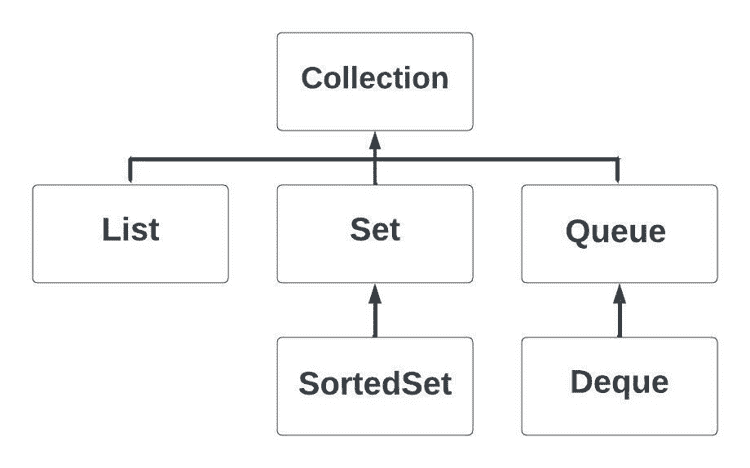

# 第八章：数组、集合、泛型、函数和流

到目前为止，我们使用变量来表示原始数据类型和引用数据类型的一个实例。然而，在现实世界中，更频繁的需求是处理和加工多个数据元素。在本章中，我们将探讨管理多个元素的各种选项。在检查 Java 中用于此目的的选项时，我们将看到我们如何提高类型安全性。

为了更有效地处理多个元素，我们将检查流——当与函数结合使用时，它是传统循环的替代品。

我们将涵盖以下主题：

+   理解数组数据结构

+   理解集合框架

+   使用泛型实现和接口

+   理解集合框架中的泛型

+   使用泛型实现和接口

+   理解集合框架的映射结构

+   理解 Java 中的函数

+   在集合中使用流

完成本章后，你将能够以数组或集合的形式处理多个数据实例，并应用`Stream`库中的算法。

# 技术要求

这里是运行本章示例所需的工具：

+   安装 Java 17

+   文本编辑器

+   安装 Maven 3.8.6 或更高版本

本章的示例代码可在[`github.com/PacktPublishing/Transitioning-to-Java/tree/chapter08`](https://github.com/PacktPublishing/Transitioning-to-Java/tree/chapter08)找到。

# 理解数组数据结构

与大多数语言一样，Java 有一个内置的数组数据结构，不需要任何导入或外部库。因此，数组的行为与其他语言中的数组类似。唯一的区别是，要实例化一个数组，你需要`new`关键字。以下是声明一个包含 10 个`int`类型元素的数组的两种方式：

```java
        int[] quantities01 = new int[10];
        int quantities02[] = new int[10];
```

区别在于空方括号放置在左侧的位置。在类型之后放置它们被认为是 Java 的方式。在标识符之后放置被认为是 C 语言的方式。任何一种语法都是可以的。

在大多数编程语言中，数字可以是序数或基数。当我们实例化时声明的数组长度是一个基数——或者说计数数字。在之前的例子中，长度一直是 10。序数表示结构中的位置，如数组中的位置。在大多数编程语言中，序数从零开始。当我们声明长度为 10 的基数数组时，序数位置从 0 到 9，而不是从 1 到 10。

数组长度固定；它们不能被扩展或收缩。数组中的每个位置都准备好使用。你可以在将值赋给第一个位置之前，先将其赋给最后一个位置。

你可以延迟实例化数组，如下所示：

```java
int[] quantities01;
…
quantities01 = new int[10];
```

数组将数组的值存储在连续的内存块中。这告诉我们，数组将占用 10 个元素乘以每个 `int` 的 4 个字节，总共 40 个字节，以及 Java 中对象的必要开销。数组的长度是这部分开销的一部分。

对象数组由引用数组组成。例如，你可以创建一个包含四个字符串的数组，如下所示：

```java
String[] stuff = new String[4];
```

在这种情况下，数组将为每个 `String` 对象的引用占用 4 个字节，以及通常的数组对象开销。字符串本身在内存中以 `null` 的形式存储，直到你为数组分配一个有效的引用：

```java
String myThing = "Moose";
stuff[0] = myThing;
```

当在数组中使用引用时，我们在数据结构中存储的是引用而不是对象。只有原始数据类型可以直接存储在数组中。

从这里，我们使用索引来读取和写入数组。要获取数组的长度，我们使用最终的常量变量 `length`：

```java
        System.out.printf("Length: %d%n", stuff.length);
```

要使用 `for` 循环遍历数组中的每个元素，你会使用以下代码：

```java
        stuff[0] = "Java";
        stuff[1] = "Python";
        stuff[2] = "JavaScript";
        stuff[3] = "C#";
        for (int i = 0; i < stuff.length; ++i) {
            System.out.printf("Stuff %d = %s%n", i, stuff[i]);
        }
```

Java 还有一个增强的 `for` 循环，用于访问数组中的每个元素。索引值不再可用：

```java
for(String s : stuff) {
    System.out.printf("Stuff %s%n", s);
}
```

最后一点需要注意的是：Java 有一个用于在数组上执行一系列操作的库，称为 `Arrays` 库。这个类包含用于排序、搜索以及从一个数组创建列表（集合之一）的静态方法。我们将在后面的部分看到将数组转换为列表的示例，*在集合中使用流* *。

你应该已经熟悉使用数组了。你可以读取和写入任何有效的索引元素。如果你使用一个超出范围的无效索引，Java 将会抛出 `ArrayIndexOutOfBoundsException` 异常。现在，让我们来看看集合框架。

# 理解集合框架

一旦创建了数组，它的长度就不能增加或减少。这意味着在实例化数组之前，你必须知道你需要的确切元素数量。你可以使用变量来声明数组，但一旦创建，它就不能调整大小。看看以下示例：

```java
        int numberOfCats = 6;
        int[] cats = new int[numberOfCats];
```

这就是集合发挥作用的地方。这些是动态数据结构，可以随着元素的添加而增加大小。你也可以删除元素，尽管减少大小并不总是可用，如果可以减少，那么你必须调用适当的方法。

集合框架分为实现和接口。一个实现可能支持多个接口。虽然实现可以有一系列丰富的方法，但使用接口可以让你限制对集合的操作。

集合框架类分为两类。有顺序集合，它们保留元素添加的顺序。然后，有映射集合，其中元素以数据对的形式存储。第一个通常是对象的字段，称为键，而第二个是对对象本身的引用，称为值。这些集合根据键组织自己。

这些类的所有成员管理的数据类型默认为`Object`。这意味着你可以将任何对象存储在集合中，因为所有类都扩展了`Object`，多态性允许你在需要超类的地方使用子类。这种方法的缺点是，你可能会有一个包含苹果和橙子的集合。在语言中引入泛型之前，避免类型混合是开发者的责任。

让我们更仔细地看看顺序结构。

# 使用顺序实现和接口

让我们从实现开始。这些是管理数据以多种方式进行的类。它们是`ArrayList`、`LinkedList`和`ArrayDeque`。

## ArrayList

这是一个动态的类似数组的结构。作为一个类，你必须使用方法而不是下标来访问特定元素。你将在列表的末尾添加元素。一旦添加了元素，你可以从中读取、写入、搜索特定值，以及从特定位置或匹配特定值的元素中删除元素。

你可以带或不带初始容量实例化`ArrayList`类。如果你没有指定容量，则默认为 10。如果你事先知道你需要多少元素，那么在实例化`ArrayList`类时包含该值。`ArrayList`类的自动调整大小涉及开销，如果你知道确切的大小，则可以避免这种开销。在任何情况下，你都不能在添加元素之前访问元素。随着元素的添加，大小会增加。你可以访问你添加的任何元素，但你不能访问最后添加的元素和随后的未使用容量之间的任何位置。

## LinkedList

这种结构在节点对象中存储数据，每个节点都知道它之前和之后的内容。从表面上看，这似乎非常高效，因为你需要时才创建节点。链表的缺点是它不支持随机访问。在`ArrayList`中，你可以通过使用表示其位置的整数来访问任何元素，就像数组一样，使用方法而不是方括号。这种访问是直接的。在`LinkedList`类中，你只能直接访问第一个和最后一个元素。要访问任何其他元素，你必须从开始或结束处开始，然后跟随前向或后向引用到后续节点。这使得访问元素的速度远慢于`ArrayList`。

我向学生讲解链表，因为它们非常适合黑板图。我们将很快查看的`Map`结构基于链表的变体。让我以 Joshua Bloch 关于他编写的 Java `LinkedList`类的一条推文结束：


图 8.1 – 著名的 LinkedList 推文

## ArrayDeque

`ArrayDeque`类与`ArrayList`类似，因为它是一个动态结构，以类似数组的方式存储元素。与`ArrayList`不同，它不支持直接访问。相反，它优化了在开始处插入或删除元素（`Deque`、`Queue`和`Stack`接口）。在 Java 1.6 引入`ArrayDeque`类之前，你使用`LinkedList`类作为这些接口的实现。`ArrayDeque`类优于`LinkedList`类。

这不是一个完整的列表。例如，有一个`Stack`类，但使用带有`Deque`接口的`ArrayDeque`类将优于`Stack`类。第二个问题与线程安全相关。这三个实现都不是线程安全的。框架中有专门版本的实现，特别是当线程必须共享对数据结构的访问时。

你可以实现这些类中的任何一个，但被认为是一个糟糕的选择。每个实现都有许多方法来支持以多种方式使用结构。当你使用 Java 集合类时，你希望使用最小的接口来完成你的任务，而不是允许访问实现中的每个方法。让我们看看这些接口。

## 集合接口

下面是一个最常见的接口的图示：



图 8.2 – 集合接口

每个框代表一个集合实现可能支持或不支持的接口。`Collection`是超接口。任何实现其下接口的类也必须实现`Collection`。

最常见的接口是`List`。这最接近数组。`Set`和`SortedSet`是确保元素不会出现多次的接口。`Queue`是一个 FIFO 结构。你只能向结构的末尾添加元素，也只能从结构的开头移除元素。`Deque`是一个支持 LIFO 的结构。`Deque`的独特之处在于你可以从两端添加或删除。`Queue`和`Deque`都不允许通过索引访问。

## 如何声明一个集合

如我们已在*第六章*中讨论的，“方法、接口、记录及其关系”，你使用接口类来定义类必须实现的方法。对于顺序集合最广泛使用的接口是`List`。我们现在可以声明一个只能使用`List`接口中显示的方法的数据结构，而不能使用其他方法：

```java
 List moreStuff = new ArrayList();
```

在我们查看更多接口之前，是时候看看泛型的概念以及它们如何与集合接口相关联了。我们需要现在就看看这个问题，因为虽然前面的代码行是可执行的，但很少会有 Java 开发者这样写。

# 在集合框架中理解泛型

正如所指出的，集合框架中的默认类是为了仅管理类型为`Object`的对象的引用而设计的。多态允许在实现这些类中的任何类中使用任何子类。这种方法的缺点是不安全类型。看看这个代码片段：

```java
        int numberOfApples = 9;
        String orange = "Valencia";

        List stuff = new ArrayList();
        stuff.add(numberOfApples);
        stuff.add(orange);

        System.out.printf("Stuff: %s%n", stuff);
```

此代码首先声明了两个变量。第一个是带有`numberOfApples`标识符的`int`类型。集合不能包含原始数据类型，所以如果原始数据类型是`int`类型，则需要一个`Integer`类型的对象。Java 会为你执行从原始类型到对象的这种转换。第二行创建了一个`String`对象。

接下来是创建一个类型为`ArrayList`的对象，但其接口仅限于`List`接口类允许的内容。现在，我们可以将`Integer`和`String`对象添加到集合中。最后一行显示了`List`的内容，因为它的`toString()`方法创建了一个包含所有成员的`String`对象。这导致了一个表达，即不要把苹果和橘子混在一起。集合必须为单一类型。虽然集合的默认语法不限制可以添加的内容，但使用泛型符号将这样做。

让我们看看之前代码的一个新变体：

```java
        int numberOfApples = 9;
        String orange1 = "Valencia";
        String orange2 = "Navel";

        List<String> stuff = new ArrayList<>();
        stuff.add(orange1);
        stuff.add(orange2);
        stuff.add(numberOfApples);

        System.out.printf("Stuff: %s%n", stuff);
```

在这个例子中，我们保留了`int`类型，然后创建了两个字符串。现在`List`的声明中包含了尖括号。括号内是你想要限制`List`包含的类类型。在这个例子中，类是`String`。虽然我们必须在左侧显示类类型，但右侧可以只保留空尖括号，因为这两种类类型永远不会不同。

接下来的几行将对象添加到`List`中。前两个将正常工作，但第三个，当我们尝试添加一个`Integer`类型的对象时，将生成一个异常：

```java
java.lang.RuntimeException: Uncompilable code - incompatible types: java.lang.Integer cannot be converted to java.lang.String
```

Java 将不再允许你把苹果和橘子混在一起。这个确保添加到集合中的所有对象都是同一类型的测试只发生在编译时。这意味着如果这个操作只在运行时发生，则可以添加不同的对象类型。这可能会发生在多个进程在 JVM 中运行，并且一个进程调用另一个进程中的方法时。

我们现在将回到集合，并且只从现在开始使用泛型语法。

# 使用泛型实现和接口

正如我们刚刚看到的，创建`List`的最佳实践将是这个：

```java
List<String> moreStuff = new ArrayList<>();
```

任何有效的类类型都可以使用。一旦我们在集合中有元素，我们就可以使用`get`方法和下标来访问它们：

```java
        String orange1 = "Valencia";
        String orange2 = "Navel";

        List<String> stuff = new ArrayList<>();
        stuff.add(orange1);
        stuff.add(orange2);

        System.out.printf("Stuff: %s%n", stuff.get(0));
        System.out.printf("Stuff: %s%n", stuff.get(1));
```

在最后两行中，我们正在引用列表中的特定位置。要更改特定位置存储的对象，我们使用`set`方法：

```java
        stuff.set(0, "Blood Orange");
```

接口和实现类都支持允许您确定特定对象是否包含在集合中的方法。因此，您必须重写从`Object`继承的`equals`方法。某些集合方法需要哈希值，因此您的类必须有一个`hashCode`方法。

您还可以对集合进行排序。为此，您存储的对象的类类型必须实现`Comparable`接口。此接口要求您编写一个名为`compareTo`的方法，该方法返回一个负数、零或正数。以下是实现`compareTo`的类的片段：

```java
public class ComparableClass implements 
                     Comparable<ComparableClass>{
    private final int value;
    public ComparableClass(int initialValue) {
        value = initialValue;
    }
    @Override
    public int compareTo(ComparableClass o) {
        return value – o.value;        
    }
}
```

此类只有一个字段，由构造函数初始化。它使用泛型表示法实现`Comparable`接口，表示我们只能将此对象与同一类的对象进行比较。

由于我们正在实现`Comparable`接口，因此必须返回`compareTo`方法的`compareTo`方法：

+   如果当前比较对象的值大于被比较对象的值，则返回一个正整数

+   如果当前比较对象的值等于被比较对象的值，则返回 0

+   如果当前比较对象的值小于被比较对象的值，则返回一个负整数

您可能会想知道，当字段是私有的时，我们如何使用点符号访问传递给`compareTo`的`ComparableClass`的值。这是可能的，因为 Java 允许同一类的对象访问同一类的另一个实例的私有成员。以下是测试此功能的类：

```java
public class ComparableTest {
    private final ComparableClass comparable01;
    private final ComparableClass comparable02;

    public ComparableTest(int value1, int value2) {
        comparable01 = new ComparableClass(value1);
        comparable02 = new ComparableClass(value2);
    }
    public void perform() {
        System.out.printf("comparable01 to comparable02 %d%n", 
                comparable01.compareTo(comparable02));
        System.out.printf("comparable02 to comparable01 %d%n", 
                comparable02.compareTo(comparable01));
    }
    public static void main(String[] args) {
        ComparableTest examples = new ComparableTest(12, 2);
        examples.perform();
    }
}
```

在`perform`方法中，我们正在显示调用`compareTo`方法的结果。现在让我们创建一个对象`List`并对其进行排序。对`ComparableClass`进行了一些小的修改。已添加一个返回类中存储的值的方法：

```java
    public int getValue() {
        return value;
    }
```

现在，我们有一个创建 10 个`ComparableClass`对象、将它们放入`List`并排序的类：

```java
public class ComparableSorting {
    private final List<ComparableClass> comparableClasses;
```

这里是创建一个类型为`ArrayList`的对象的构造函数，该对象将仅限于使用`List`接口的方法：

```java
    public ComparableSorting() {
        comparableClasses = new ArrayList<>();
    }
```

注意，`ArrayList`后面的尖括号是空的。当我们声明`comparableClasses`时，我们将`List`声明为包含`ComparableClass`对象。没有必要重复此操作。

以下方法创建了 10 个`ComparableClass`实例，在将它们添加到`List`时，用随机整数初始化它们。每个值也会在控制台上显示，这样我们就可以看到分配时的原始值：

```java
    private void fillList() {
        Random rand = new Random();
        int upperBound = 25;
        System.out.printf("Unsorted:%n");
        for(int i = 0; i < 10; ++i) {
            comparableClasses.add(
                new ComparableClass(rand.nextInt(upperBound)));
        }
        System.out.printf("%n");
    }
```

此方法显示`List`中每个对象的值：

```java
    private void displayList() {
        for(int i = 0; i < 10; ++i) {
            System.out.printf(
                "%s ", comparableClasses.get(i).getValue());
        }
        System.out.printf("%n");
    }
```

现在，让我们填充列表，显示它，对其进行排序，然后再显示一次：

```java
    public void perform() {
        fillList();
        displayList();
```

`Collections`类包含一系列静态方法，可以应用于实现`Collection`接口的对象。其中一个是`Collections.sort`方法。它改变输入而不是返回一个新值：

```java
        Collections.sort(comparableClasses);
        displayList();
    }    
    public static void main(String[] args) {
        ComparableSorting examples = new ComparableSorting();
        examples.perform();
    }
}
```

我们到目前为止看到的是如何使用顺序集合。也需要特殊接口如`Comparable`的需求也得到了强调。现在让我们看看有序集合。

# 理解集合框架的映射结构

第二组集合是映射集合。映射是一种数据结构，你可以通过一对值将元素添加到映射中。第一个值是键。这是一个对象的引用，根据映射的类型，它要么实现了`Comparable`接口——如我们在上一节中看到的，要么重写了`hashCode`和`equals`方法。如果键是原始类型，那么我们将其声明为其包装类，Java 将管理必要的从原始类型到包装类型以及从包装类型到原始类型的转换。第二个是值——存储在映射中的对象的引用。这个类不需要实现`Comparable`接口。

Java 中有三种映射实现，我们现在将介绍。

## HashMap

在 Java 和大多数其他语言中可用的所有数据类型中，性能最快的是整数。整数的大小与 CPU 的字长相同。JVM 是一个 32 位或 4 字节的机器。即使是 64 位的 Java 也只是在模拟 32 位机器。这就是哈希码的作用所在。

与所有映射结构一样，条目由两个组件组成。第一个是键，第二个是值。使`HashMap`特殊的是键值的哈希码决定了它将存储的位置。其底层结构是一个数组，数组的每个位置都是一个桶。通过使用如取模等算术运算，可以从键的哈希码中确定数组中的索引。

哈希码不是唯一的。这意味着两个或多个键可能生成相同的哈希码。在这种情况下，它们也将想要使用相同的索引，桶将变成一个桶的单链表。如果键的数量超过八个，那么链表将转换为平衡二叉树。在列表中搜索键时，使用`equals`方法测试每个桶以找到值。

当你必须收集能够快速从结构中检索的数据时，请使用哈希表。没有定义的顺序。你放入哈希表中的第一个项目可能是桶数组中的第七个元素。这也意味着放入结构中的元素的顺序无法确定。

要在一个给定的键的`HashMap`对象中查找值，你可以使用`get`方法。此方法将键作为参数，如果找到则返回值，如果没有找到则返回`null`。让我们看看一个例子。

首先，我们使用`Map`接口创建一个`HashMap`对象：

```java
        Map<Integer, Integer> hashMap = new HashMap<>();
```

现在，我们可以使用带有两个参数的`put`方法将数据放入`HashMap`对象中。这两个参数是键和值：

```java
        hashMap.put(6, 6);
        hashMap.put(5, 4);
        hashMap.put(4, 8);
        hashMap.put(3, 10);
        hashMap.put(2, 6);
```

下面的两行将检索与键关联的值，如果键存在的话。否则，返回`null`：

```java
        System.out.printf("%s%n",hashMap.get(4));
        System.out.printf("%s%n",hashMap.get(1));
```

在`HashMap`对象中没有使用整数 1 作为键的条目，所以它将打印出`null`。

要迭代或处理整个`HashMap`对象中的每个元素，我们首先需要从哈希表中的所有条目创建一个`Set`对象：

```java
        Set s = hashMap.entrySet();
```

从`Set`对象中，我们创建一个`Iterator`对象。迭代器允许我们按键的顺序访问集合中的每个元素：

```java
        Iterator it = s.iterator();
```

`Iterator`对象的`hasNext`方法返回`true`，如果`Set`对象中还有另一个元素；否则，返回`false`：

```java
        while (it.hasNext()) {
```

`Iterator`对象的`next`方法返回键/值对：

```java
            System.out.printf("%s%n",it.next());
        }
```

这段代码的输出将是这样的：

```java
8
null
2=6
3=10
4=8
5=4
6=6
```

注意，键的顺序与它们放入哈希表的顺序不同。

## LinkedHashMap

这种结构是`HashMap`的一个变体。内部操作就像`HashMap`一样，但还包括第二个数据结构。这是一个链表，它保留了数据放入`LinkedHashMap`中的顺序。如果顺序不重要，请使用`HashMap`结构。

如果我们在前面的示例代码中使用了`LinkedHashMap`，我们唯一要做的改变就是使用`LinkedHashMap`而不是`HashMap`：

```java
        Map<Integer, Integer> linkedHashMap = new              LinkedHashMap<>();
        linkedHashMap.put(6, 6);
        linkedHashMap.put(5, 4);
        linkedHashMap.put(4, 8);
        linkedHashMap.put(3, 10);
        linkedHashMap.put(2, 6);
        Set s = linkedHashMap.entrySet();
        Iterator it = s.iterator();
        System.out.printf("key=Value%n");
        while (it.hasNext()) {
            System.out.printf("%s%n",it.next());
        }
```

这个版本的输出将是这样的：

```java
6=6
5=4
4=8
3=10
2=6
```

这是键/值对放入映射中的相同顺序。

## TreeMap

与`HashMap`和`LinkedHashMap`不同，`TreeMap`的底层结构是一个红黑二叉树。键值直接使用，并且必须实现`Comparable`接口。你不需要`hashCode`和`equals`方法，但包含它们是一个好习惯。以下是使用`TreeMap`的相同代码：

```java
        Map<Integer, Integer> treeMap = new TreeMap<>();
```

在这里，键没有特定的顺序。作为整数，它们确实有一个自然顺序，这将决定键/值对在二叉树中的位置：

```java
        treeMap.put(6, 6);
        treeMap.put(4, 4);
        treeMap.put(3, 8);
        treeMap.put(2, 10);
        treeMap.put(5, 6);
```

当我们使用迭代器显示所有键/值对时，它们将根据键的顺序排列：

```java
        Set s = treeMap.entrySet();
        Iterator it = s.iterator();
        while (it.hasNext()) {
            System.out.printf("%s%n",it.next());
        }
```

输出将是这样的：

```java
2=6
3=10
4=8
5=4
6=6
```

虽然数组在需要多个元素时通常是首选的结构，但请考虑它的接口相当有限。集合有一系列丰富的方法，可以扩展你在代码中能做的事情。在我们继续到函数之前，请记住以下注意事项。

重要注意事项

本章中展示的集合不是线程安全的。每个集合都有线程安全的变体。

# 理解 Java 中的函数

在 Java 中，我们称一个类中的代码单元为方法。在 C 和 C++中，我们称它们为函数。在 JavaScript 中，我们甚至使用`keyword`函数。Java 与其他这些语言的不同之处在于，函数代表了一个与类及其方法不同的编码模型。有一些是函数式语言，其中 Haskell 是一个例子。我们简要地检查函数，因为我们的下一个主题，流，是基于函数而不是类模型。

让我们看看一些在 JavaFX 中为按钮附加事件处理器的代码。我们将在*第十三章*中查看 JavaFX，*使用 Swing 和 JavaFX 进行桌面图形用户界面编码*。让我们首先看看一个功能性的`EventHandler`接口是什么：

```java
@FunctionalInterface
public interface EventHandler<T extends Event> extends     EventListener {
    void handle(T event);
}
```

这是 JavaFX 中`EventHandler`接口的接口类。`@FunctionalInterface`注解是可选的，但增加了对接口背后目的的清晰度。函数式接口只能有一个抽象方法。JavaFX 中没有这个接口的实现。你必须为`handle`方法提供代码：

```java
        btn.setOnAction(new EventHandler<ActionEvent>() {
            @Override
            public void handle(ActionEvent event) {
                actionTarget.setText(userBean.toString());
            }
        });
```

这段代码为按钮按下时注册了一个事件处理器。处理器必须是`EventHandler`类型，并且必须有一个名为`handle`的方法。`handle`方法调用`userBean`的`toString`方法来返回一个字符串，该字符串将被分配给名为`actionTarget`的`Text`字段。

第一个片段演示了一个匿名内部类。它是匿名的，因为引用从未分配给一个标识符。它只能在方法调用中使用。我们在动作对仅此按钮按下是独特的情况下这样做。它不能在其他地方重用：

```java
        btn.setOnAction((ActionEvent event) -> {
            actionTarget.setText(userBean.toString());
        });
```

第二个片段使用了 lambda 表达式。`EventHandler`中只有一个方法，`handle`。因此，我们不需要额外的装饰。`(ActionEvent event)`是`handle`方法必须接收的参数。我们的 lambda 提供了当按钮被按下时将执行的`handle`方法的代码。虽然 lambda 中的代码行数没有限制，但最佳实践是不超过三行，而一行是最理想的。但如果需要执行多行代码呢？这让我们来到了使用函数的第三种语法：

```java
        btn.setOnAction(this::signInButtonHandler);
```

Java 中的函数可以作为方法的参数传递，也可以由方法返回。在这个片段中，我们声明`signInButtonHandler`方法将被调用，就像它是`handle`方法一样：

```java
private void signInButtonHandler(ActionEvent e) {
    actionTarget.setText(userBean.toString());
}
```

这里，这个方法在同一文件中。因此，我们在`setOnAction`中使用`this`来引用它。它必须与`handle`方法有相同的返回值和参数。

函数式编程有助于简化我们的代码。在任何需要定义其操作的地方的方法的情况下，使用函数是最好的选择。

# 在集合中使用流

处理集合中的所有数据元素是一个常见操作。也许你想根据特定要求提取集合的子集。你可能想增加或减少值或更改字符串的大小写。这就是流发挥作用的地方。所有实现 `Collection` 接口的类都有一个流方法，我们可以从其中链式调用多个流方法。你不能直接在映射上使用流，但如果你将映射转换成集合，那么你可以使用流。

流方法的一个重要特征是它们作为纯函数操作。纯函数不会改变类中任何字段的状态或传递给它的任何参数的状态。流方法始终返回一个新的流。原始流没有改变。让我们看看它是如何工作的：

```java
public record Employee(String employeeId, String firstName, 
         String lastName, String department, double salary) { }
```

在这里，我们有一个包含表示员工信息的字段的记录。现在，让我们在 `StreamsExample.java` 文件的构造函数中创建一个包含六个员工的 `List`。这些信息应该来自数据库，但出于我们的目的，我们将在 `StreamsExample.java` 文件的构造函数中创建这个 `List`：

```java
public class StreamsExample {
    private List<Employee> staffList;
    public StreamsExample() {
        staffList = Arrays.asList(new Employee("A9", "Benson", 
                             "Bill", "Sales", 56000),
                new Employee("A1", "Clarkson", 
                             "Bill", "Sales", 56000),
                new Employee("A2", "Blunt", 
                             "Wesley", "HR", 56000),
                new Employee("A3", "Smith", 
                             "Joan", "Software", 56000),
                new Employee("A4", "Smith", 
                             "John", "Accounting", 56000),
                new Employee("A5", "Lance", 
                             "Gilbert", "Sales", 56000));
    }
```

这段代码演示了在声明时通过逗号分隔元素可以创建一个数组，而不是集合。创建了六个 `Employee` 对象，并通过使用 `Arrays` 方法的 `asList`，它们被转换成与 `List` 兼容的结构。这是必要的，因为流不作用于数组。随着我们的列表完成，我们现在可以应用流方法。许多流方法的行为与 SQL 操作类似。

列表就绪后，让我们使用一些流方法：

```java
List<Employee> filteredList = staffList.stream().
    filter( s -> s.firstName().startsWith("J")).
    collect(Collectors.toList());
```

在调用 `stream()` 之后，我们可以应用流方法。第一个是 `filter`。它需要一个函数，该函数根据函数中的代码返回 `true` 或 `false`。该函数以 lambda 表达式的形式表达，将接收一个类型为 `Employee` 的记录对象。lambda 表达式中的代码从记录中检索 `firstName` 字符串，并应用 `startsWith` 字符串方法以找到以 `"J"` 开头的名字。

`filter` 函数的结果是一个只包含符合条件对象的新流。必须将流转换回集合，这正是 `collect` 方法的角色。它接受 `Collectors.toList()` 函数作为参数，该函数来自 `Collectors` 类，并将返回一个 `List` 对象。

最后一个例子，是要按 `lastName` 字段排序打印员工对象：

```java
staffList.stream().sorted((e1, e2) ->  
    e1.lastName().compareTo(e2.lastName())).
    forEach(System.out::println);
```

这行代码使用了`sorted`流函数。它需要一个基于字段的函数来确定两个对象之间的顺序。所选择的字段是一个`String`对象，因此它已经有一个`compareTo`方法；否则，您将需要编写一个`compareTo`方法。lambda 表达式接受两个参数，这些参数被定义为来自`Record`的`String`对象。这将产生一个排序后的流，然后由`forEach`函数使用。`forEach`函数不是返回一个新的`List`对象，而是接收一个流，并将它的每个成员传递给`System.out`的`println`方法。

现代 Java 程序在很大程度上依赖于流。另一种选择是使用迭代器或`for`循环来访问所有元素。如果您需要处理集合中的所有元素，请在其他任何东西之前查看流。

# 摘要

虽然我们似乎在本章中涵盖了众多主题，但您应该认识到它们都是相关的。无论您是从数据库中检索记录还是从键盘接收用户输入，一旦有多个项目，您将需要这里所展示的内容。我们从类似于其他语言中的结构的基本数组开始。从数组，我们转向了集合框架。这些是动态结构，可以根据需要增长。从顺序集合到映射集合，Java 为我们提供了一套丰富的选择。

我们接下来探讨了泛型。与声明为特定类型的数组不同，原始集合可以存储任何对象，而不考虑已经存储的内容。使用泛型表示法，我们可以将一个集合绑定到特定的数据类型。

从 Java 8 开始，函数成为了 Java 语言的一部分。虽然类中的普通方法可以用作函数，但使用 lambda 表达式允许我们为特定问题定义特定的操作。在顺序集合中可用的 Stream 库简化了对集合元素的处理。

接下来，我们将探讨如何记录我们的代码，并在日志中记录程序的操作信息。

# 进一步阅读

+   *java.util.Arrays* *类指南*: [`www.baeldung.com/java-util-arrays`](https://www.baeldung.com/java-util-arrays)

+   *Java* *集合*: [`www.scaler.com/topics/java/collections-in-java/`](https://www.scaler.com/topics/java/collections-in-java/)

+   *Java* *中的函数式编程*: [`www.scaler.com/topics/java/functional-programming-in-java/`](https://www.scaler.com/topics/java/functional-programming-in-java/)

+   *Java* *Stream*: [`zetcode.com/java/stream/`](https://zetcode.com/java/stream/)
